# Appendix B

## Equilibrium Constants for Selected Substances

## Dissociation (Ionization) Constants $\mathbf { ( K _ { a } ) }$ of Selected Acids

<table><tr><td>Name and Formula</td><td>Lewis Structure*</td><td> $K_{a1}$ </td><td> $K_{a2}$ </td><td> $K_{a3}$ </td></tr><tr><td>Acetic acid $CH_3COOH$ </td><td>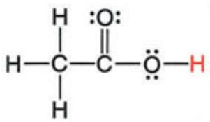</td><td> $1.8 \times 10^{-5}$ </td><td></td><td></td></tr><tr><td>Acetylsalicylic acid** $CH_3COOC_6H_4COOH$ </td><td>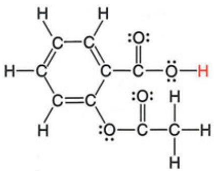</td><td> $3.6 \times 10^{-4}$ </td><td></td><td></td></tr><tr><td>Adipic acid $HOOC(CH_2)_4COOH$ </td><td>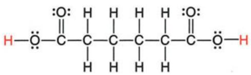</td><td> $3.8 \times 10^{-5}$ </td><td> $3.8 \times 10^{-6}$ </td><td></td></tr><tr><td>Arsenic acid $H_3AsO_4$ </td><td>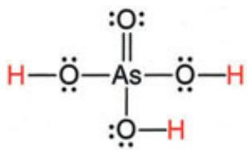</td><td> $6 \times 10^{-3}$ </td><td> $1.1 \times 10^{-7}$ </td><td> $3 \times 10^{-12}$ </td></tr><tr><td>Ascorbic acid $H_2C_6H_6O_6$ </td><td>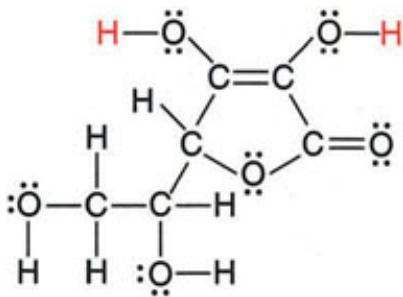</td><td> $1.0 \times 10^{-5}$ </td><td> $5 \times 10^{-12}$ </td><td></td></tr><tr><td>Benzoic acid $C_6H_5COOH$ </td><td>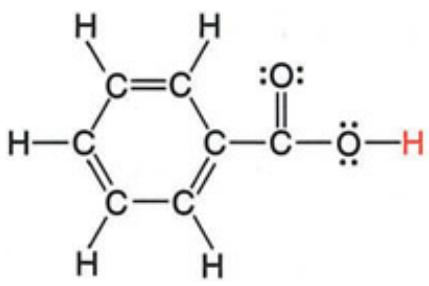</td><td> $6.3 \times 10^{-5}$ </td><td></td><td></td></tr><tr><td>Carbonic acid $H_2CO_3$ </td><td>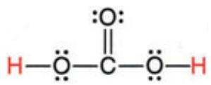</td><td> $4.5 \times 10^{-7}$ </td><td> $4.7 \times 10^{-11}$ </td><td></td></tr><tr><td>Chloroacetic acid $ClCH_2COOH$ </td><td>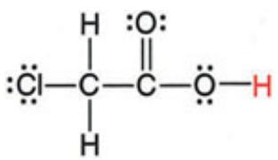</td><td> $1.4 \times 10^{-3}$ </td><td></td><td></td></tr><tr><td>Chlorous acid $HClO_2$ </td><td> $H-O-Cl=O$ </td><td> $1.1 \times 10^{-2}$ </td><td></td><td></td></tr><tr><td>Citric acid HOOCCH2C(OH) (COOH)CH2COOH</td><td>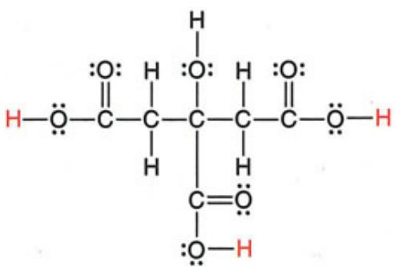</td><td>7.4 × 10-4</td><td>1.7 × 10-5</td><td>4.0 × 10-7</td></tr><tr><td>Formic acid HCOOH</td><td>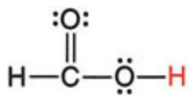</td><td>1.8 × 10-4</td><td></td><td></td></tr><tr><td>Glyceric acid HOCH2CH(OH)COOH</td><td>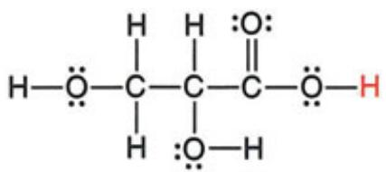</td><td>2.9 × 10-4</td><td></td><td></td></tr><tr><td>Glycolic acid HOCH2COOH</td><td>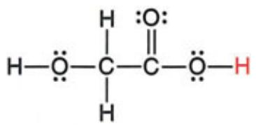</td><td>1.5 × 10-4</td><td></td><td></td></tr><tr><td>Glyoxylic acid HC(O)COOH</td><td>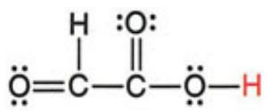</td><td>3.5 × 10-4</td><td></td><td></td></tr><tr><td>Hydrocyanic acid HCN</td><td>H-C≡N:</td><td>6.2 × 10-10</td><td></td><td></td></tr><tr><td>Hydrofluoric acid HF</td><td>H—F:</td><td>6.8 × 10-4</td><td></td><td></td></tr><tr><td>Hydrosulfuric acid H2S</td><td>H—S—H</td><td>9 × 10-8</td><td>1 × 10-17</td><td></td></tr><tr><td>Hypobromous acid HBrO</td><td>H—O—Br:</td><td>2.3 × 10-9</td><td></td><td></td></tr><tr><td>Hypochlorous acid HClO</td><td>H—O—Cl:</td><td>2.9 × 10-8</td><td></td><td></td></tr><tr><td>Hypoiodous acid HIO</td><td>H—O—I:</td><td>2.3 × 10-11</td><td></td><td></td></tr><tr><td>Iodic acid HIO3</td><td>H—O—I=O</td><td>1.6 × 10-1</td><td></td><td></td></tr><tr><td>Lactic acid CH3CH(OH)COOH</td><td>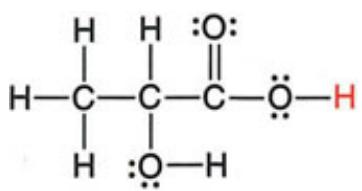</td><td>1.4 × 10-4</td><td></td><td></td></tr><tr><td>Malic acid HOOCCH=CHCOOH</td><td>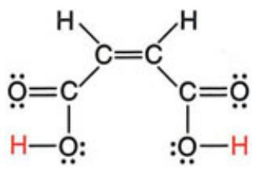</td><td>1.2 × 10-2</td><td>4.7 × 10-7</td><td></td></tr><tr><td>Malonic acid $HOOCCH_2COOH$ </td><td>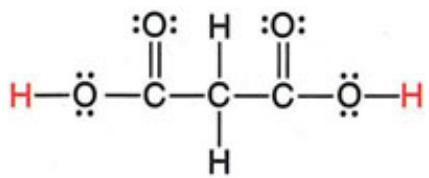</td><td> $1.4 \times 10^{-3}$ </td><td> $2.0 \times 10^{-6}$ </td><td></td></tr><tr><td>Nitrous acid $HNO_2$ </td><td>H-Ö-ÄN=Ö</td><td> $7.1 \times 10^{-4}$ </td><td></td><td></td></tr><tr><td>Oxalic acid $HOOCOOH$ </td><td>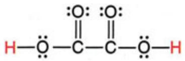</td><td> $5.6 \times 10^{-2}$ </td><td> $5.4 \times 10^{-5}$ </td><td></td></tr><tr><td>Phenol acid $C_6H_5OH$ </td><td>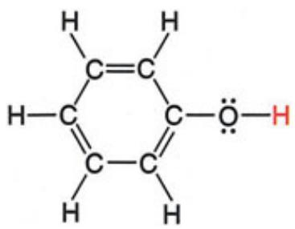</td><td> $1.0 \times 10^{-10}$ </td><td></td><td></td></tr><tr><td>Phenylacetic acid $C_6H_5CH_2COOH$ </td><td>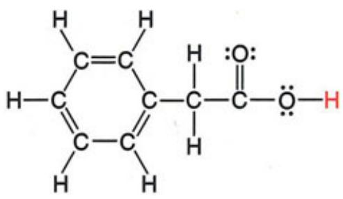</td><td> $4.9 \times 10^{-5}$ </td><td></td><td></td></tr><tr><td>Phosphoric acid $H_3PO_4$ </td><td>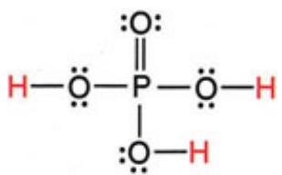</td><td>7.2 × 10-3</td><td>6.3 × 10-8</td><td>4.2 × 10-13</td></tr><tr><td>Phosphorous acid $HPO(OH)_2$ </td><td>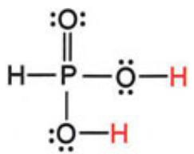</td><td>3 × 10-2</td><td>1.7 × 10-7</td><td></td></tr><tr><td>Propanoic acid $CH_3CH_2COOH$ </td><td>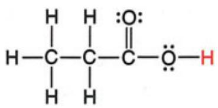</td><td>1.3 × 10-5</td><td></td><td></td></tr><tr><td>Pyruvic acid $CH_3C(O)COOH$ </td><td>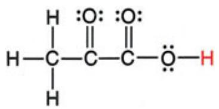</td><td>2.8 × 10-3</td><td></td><td></td></tr><tr><td>Succinic acid $HOOCCH_2CH_2COOH$ </td><td>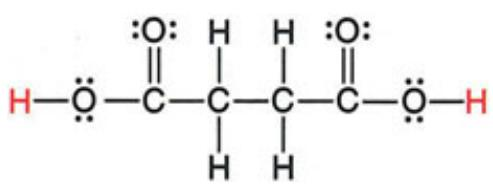</td><td>6.2 × 10-5</td><td>2.3 × 10-6</td><td></td></tr><tr><td>Sulfuric acid $H_2SO_4$ </td><td>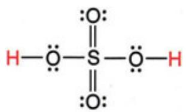</td><td>Very large</td><td>1.0 × 10-2</td><td></td></tr><tr><td>Sulfurous acid $H_2SO_3$ </td><td>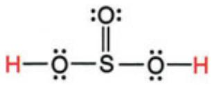</td><td> $1.4 \times 10^{-2}$ </td><td> $6.5 \times 10^{-8}$ </td><td></td></tr></table>

Note: All values at 298 K, except for acetylsalicylic acid.
\*\* $\mathrm { A t } 3 7 ^ { \circ } \mathrm { C }$ in 0.15 M NaCl.
\* Acidic (ionizable) proton(s) shown in red. Structures shown have lowest formal charges.

## Dissociation (Ionization) Constants $\mathbf { ( } K _ { \mathbf { b } } )$ of Selected Amine Bases

<table><tr><td>Name and Formula</td><td>Lewis Structure*</td><td> $K_{b1}$ </td><td> $K_{b2}$ </td></tr><tr><td>Ammonia $NH_3$ </td><td>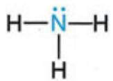</td><td> $1.76 \times 10^{-5}$ </td><td></td></tr><tr><td>Aniline $C_6H_5NH_2$ </td><td>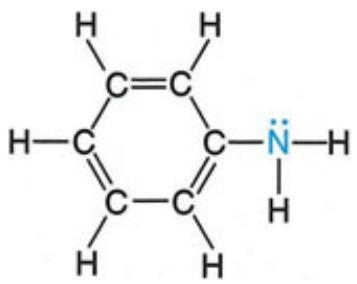</td><td> $4.0 \times 10^{-10}$ </td><td></td></tr><tr><td>Diethylamine $(CH_3CH_2)_2NH$ </td><td>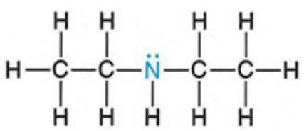</td><td> $8.6 \times 10^{-4}$ </td><td></td></tr><tr><td>Dimethylamine $(CH_3)_2NH$ </td><td>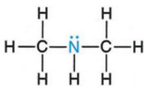</td><td> $5.9 \times 10^{-4}$ </td><td></td></tr><tr><td>Ethanolamine $HOCH_2CH_2NH_2$ </td><td>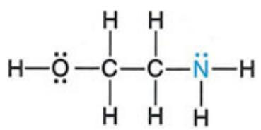</td><td> $3.2 \times 10^{-5}$ </td><td></td></tr><tr><td>Ethylamine $CH_3CH_2NH_2$ </td><td>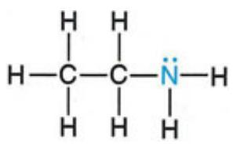</td><td> $4.3 \times 10^{-4}$ </td><td></td></tr><tr><td>Ethylenediamine $H_2NCH_2CH_2NH_2$ </td><td>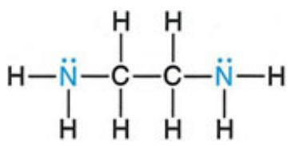</td><td> $8.5 \times 10^{-5}$ </td><td> $7.1 \times 10^{-8}$ </td></tr><tr><td>Methylamine $CH_3NH_2$ </td><td>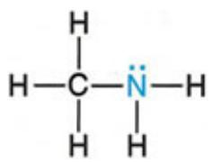</td><td> $4.4 \times 10^{-4}$ </td><td></td></tr><tr><td>tert-Butylamine $(CH_3)_3CNH_2$ </td><td>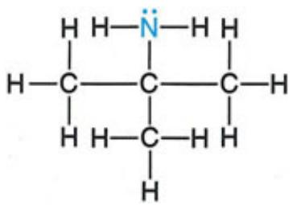</td><td> $4.8 \times 10^{-4}$ </td><td></td></tr><tr><td>Piperidine $C_5H_{10}NH$ </td><td>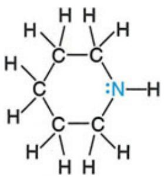</td><td> $1.3 \times 10^{-3}$ </td><td></td></tr><tr><td>n-Propylamine $CH_3CH_2CH_2NH_2$ </td><td>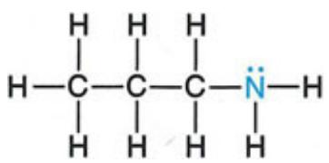</td><td> $3.5 \times 10^{-4}$ </td><td></td></tr><tr><td>Isopropylamine $(CH_3)_2CHNH_2$ </td><td>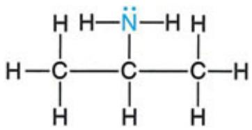</td><td> $4.7 \times 10^{-4}$ </td><td></td></tr><tr><td>1,3-Propylenediamine $H_2NCH_2CH_2CH_2NH_2$ </td><td>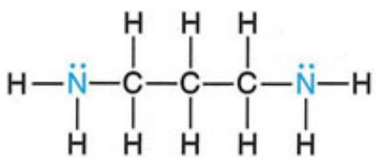</td><td> $3.1 \times 10^{-4}$ </td><td> $3.0 \times 10^{-6}$ </td></tr><tr><td>Pyridine $C_5H_5N$ </td><td>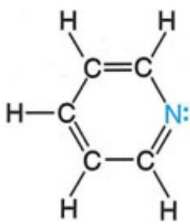</td><td> $1.7 \times 10^{-9}$ </td><td></td></tr><tr><td>Triethylamine $(CH_3CH_2)_3N$ </td><td>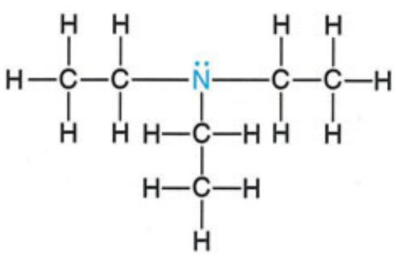</td><td> $5.2 \times 10^{-4}$ </td><td></td></tr><tr><td>Trimethylamine $(CH_3)_3N$ </td><td>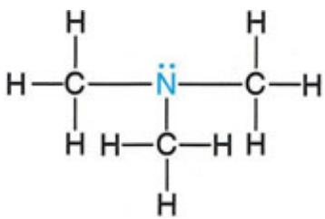</td><td> $6.3 \times 10^{-5}$ </td><td></td></tr></table>

\* Blue type indicates the basic nitrogen and its lone pair.

Dissociation (Ionization) Constants $\mathbf { ( K _ { a } ) }$ of Some Hydrated Metal Ions

<table><tr><td>Free lon</td><td>Hydrated lon</td><td> $K_a$ </td></tr><tr><td> $Fe^{3+}$ </td><td> $Fe(H_2O)_6^{3+}(aq)$ </td><td> $6 \times 10^{-3}$ </td></tr><tr><td> $Sn^{2+}$ </td><td> $Sn(H_2O)_6^{2+}(aq)$ </td><td> $4 \times 10^{-4}$ </td></tr><tr><td> $Cr^{3+}$ </td><td> $Cr(H_2O)_6^{3+}(aq)$ </td><td> $1 \times 10^{-4}$ </td></tr><tr><td> $Al^{3+}$ </td><td> $Al(H_2O)_6^{3+}(aq)$ </td><td> $1 \times 10^{-5}$ </td></tr><tr><td> $Cu^{2+}$ </td><td> $Cu(H_2O)_6^{2+}(aq)$ </td><td> $3 \times 10^{-8}$ </td></tr><tr><td> $Pb^{2+}$ </td><td> $Pb(H_2O)_6^{2+}(aq)$ </td><td> $3 \times 10^{-8}$ </td></tr><tr><td> $Zn^{2+}$ </td><td> $Zn(H_2O)_6^{2+}(aq)$ </td><td> $1 \times 10^{-9}$ </td></tr><tr><td> $Co^{2+}$ </td><td> $Co(H_2O)_6^{2+}(aq)$ </td><td> $2 \times 10^{-10}$ </td></tr><tr><td> $Ni^{2+}$ </td><td> $Ni(H_2O)_6^{2+}(aq)$ </td><td> $1 \times 10^{-10}$ </td></tr></table>

Formation Constants $\bf ( K _ { f } )$ of Some Complex Ions

<table><tr><td>Complex Ion</td><td> $K_f$ </td></tr><tr><td> $Ag(CN)_2^-$ </td><td> $3.0 \times 10^{20}$ </td></tr><tr><td> $Ag(NH_3)_2^+$ </td><td> $1.7 \times 10^7$ </td></tr><tr><td> $Ag(S_2O_3)_2^{3-}$ </td><td> $4.7 \times 10^{13}$ </td></tr><tr><td> $AlF_6^{3-}$ </td><td> $4 \times 10^{19}$ </td></tr><tr><td> $Al(OH)_4^-$ </td><td> $3 \times 10^{33}$ </td></tr><tr><td> $Be(OH)_4^{2-}$ </td><td> $4 \times 10^{18}$ </td></tr><tr><td> $CdI_4^{2-}$ </td><td> $1 \times 10^6$ </td></tr><tr><td> $Co(OH)_4^{2-}$ </td><td> $5 \times 10^9$ </td></tr><tr><td> $Cr(OH)_4^-$ </td><td> $8.0 \times 10^{29}$ </td></tr><tr><td> $Cu(NH_3)_4^{2+}$ </td><td> $5.6 \times 10^{11}$ </td></tr><tr><td> $Fe(CN)_6^{4-}$ </td><td> $3 \times 10^{35}$ </td></tr><tr><td> $Fe(CN)_6^{3-}$ </td><td> $4.0 \times 10^{43}$ </td></tr><tr><td> $Hg(CN)_4^{2-}$ </td><td> $9.3 \times 10^{38}$ </td></tr><tr><td> $Ni(NH_3)_6^{2+}$ </td><td> $2.0 \times 10^8$ </td></tr><tr><td> $Pb(OH)_3^-$ </td><td> $8 \times 10^{13}$ </td></tr><tr><td> $Sn(OH)_3^-$ </td><td> $3 \times 10^{25}$ </td></tr><tr><td> $Zn(CN)_4^{2-}$ </td><td> $4.2 \times 10^{19}$ </td></tr><tr><td> $Zn(NH_3)_4^{2+}$ </td><td> $7.8 \times 10^8$ </td></tr><tr><td> $Zn(OH)_4^{2-}$ </td><td> $3 \times 10^{15}$ </td></tr></table>

Solubility-Product Constants $( K _ { \mathbf { s p } } )$ of Slightly Soluble Ionic Compounds

<table><tr><td>Name, Formula</td><td> $K_{sp}$ </td></tr><tr><td colspan="2">Carbonates</td></tr><tr><td>Barium carbonate, BaCO3</td><td>2.0 × 10-9</td></tr><tr><td>Cadmium carbonate, CdCO3</td><td>1.8 × 10-14</td></tr><tr><td>Calcium carbonate, CaCO3</td><td>3.3 × 10-9</td></tr><tr><td>Cobalt(II) carbonate, CoCO3</td><td>1.0 × 10-10</td></tr><tr><td>Copper(II) carbonate, CuCO3</td><td>3 × 10-12</td></tr><tr><td>Lead(II) carbonate, PbCO3</td><td>7.4 × 10-14</td></tr><tr><td>Magnesium carbonate, MgCO3</td><td>3.5 × 10-8</td></tr><tr><td>Mercury(I) carbonate, Hg2CO3</td><td>8.9 × 10-17</td></tr><tr><td>Nickel(II) carbonate, NiCO3</td><td>1.3 × 10-7</td></tr><tr><td>Strontium carbonate, SrCO3</td><td>5.4 × 10-10</td></tr><tr><td>Zinc carbonate, ZnCO3</td><td>1.0 × 10-10</td></tr><tr><td colspan="2">Chromates</td></tr><tr><td>Barium chromate, BaCrO4</td><td>2.1 × 10-10</td></tr><tr><td>Calcium chromate, CaCrO4</td><td>1 × 10-8</td></tr><tr><td>Lead(II) chromate, PbCrO4</td><td>2.3 × 10-13</td></tr><tr><td>Silver chromate, Ag2CrO4</td><td>2.6 × 10-12</td></tr><tr><td colspan="2">Cyanides</td></tr><tr><td>Mercury(I) cyanide, Hg2(CN)2</td><td>5 × 10-40</td></tr><tr><td>Silver cyanide, AgCN</td><td>2.2 × 10-16</td></tr><tr><td colspan="2">Halides</td></tr><tr><td colspan="2">Fluorides</td></tr><tr><td>Barium fluoride, BaF2</td><td> $1.5 \times 10^{-6}$ </td></tr><tr><td>Calcium fluoride, CaF2</td><td> $3.2 \times 10^{-11}$ </td></tr><tr><td>Lead(II) fluoride, PbF2</td><td> $3.6 \times 10^{-8}$ </td></tr><tr><td>Magnesium fluoride, MgF2</td><td> $7.4 \times 10^{-9}$ </td></tr><tr><td>Strontium fluoride, SrF2</td><td> $2.6 \times 10^{-9}$ </td></tr><tr><td colspan="2">Chlorides</td></tr><tr><td>Copper(I) chloride, CuCl</td><td> $1.9 \times 10^{-7}$ </td></tr><tr><td>Lead(II) chloride, PbCl2</td><td> $1.7 \times 10^{-5}$ </td></tr><tr><td>Silver chloride, AgCl</td><td></td></tr><tr><td colspan="2">Bromides</td></tr><tr><td>Copper(I) bromide, CuBr</td><td> $5 \times 10^{-9}$ </td></tr><tr><td>Silver bromide, AgBr</td><td> $5.0 \times 10^{-13}$ </td></tr><tr><td colspan="2">Iodides</td></tr><tr><td>Copper(I) iodide, CuI</td><td> $1 \times 10^{-12}$ </td></tr><tr><td>Lead(II) iodide, PbI2</td><td> $7.9 \times 10^{-9}$ </td></tr><tr><td>Mercury(I) iodide, Hg2I2</td><td> $4.7 \times 10^{-29}$ </td></tr><tr><td>Silver iodide, AgI</td><td> $8.3 \times 10^{-17}$ </td></tr><tr><td colspan="2">Hydroxides</td></tr><tr><td>Aluminum hydroxide, Al(OH)3</td><td> $3 \times 10^{-34}$ </td></tr><tr><td>Cadmium hydroxide, Cd(OH)2</td><td> $7.2 \times 10^{-15}$ </td></tr><tr><td>Calcium hydroxide, Ca(OH)2</td><td> $6.5 \times 10^{-6}$ </td></tr><tr><td>Cobalt(II) hydroxide, Co(OH)2</td><td> $1.3 \times 10^{-15}$ </td></tr><tr><td>Copper(II) hydroxide, Cu(OH)2</td><td> $2.2 \times 10^{-20}$ </td></tr><tr><td>Iron(II) hydroxide, Fe(OH)2</td><td> $4.1 \times 10^{-15}$ </td></tr><tr><td>Name, Formula</td><td> $K_{\text{sp}}$ </td></tr><tr><td>Iron(III) hydroxide, Fe(OH) $_3$ </td><td>1.6 × 10 $^{-39}$ </td></tr><tr><td>Magnesium hydroxide, Mg(OH) $_2$ </td><td>6.3 × 10 $^{-10}$ </td></tr><tr><td>Manganese(II) hydroxide, Mn(OH) $_2$ </td><td>1.6 × 10 $^{-13}$ </td></tr><tr><td>Nickel(II) hydroxide, Ni(OH) $_2$ </td><td>6 × 10 $^{-16}$ </td></tr><tr><td>Zinc hydroxide, Zn(OH) $_2$ </td><td>3 × 10 $^{-16}$ </td></tr><tr><td colspan="2">Iodates</td></tr><tr><td>Barium iodate, Ba(IO $_3$ ) $_2$ </td><td>1.5 × 10 $^{-9}$ </td></tr><tr><td>Calcium iodate, Ca(IO $_3$ ) $_2$ </td><td>7.1 × 10 $^{-7}$ </td></tr><tr><td>Lead(II) iodate, Pb(IO $_3$ ) $_2$ </td><td>2.5 × 10 $^{-13}$ </td></tr><tr><td>Silver iodate, AgIO $_3$ </td><td>3.1 × 10 $^{-8}$ </td></tr><tr><td>Strontium iodate, Sr(IO $_3$ ) $_2$ </td><td>3.3 × 10 $^{-7}$ </td></tr><tr><td>Zinc iodate, Zn(IO $_3$ ) $_2$ </td><td>3.9 × 10 $^{-6}$ </td></tr><tr><td colspan="2">Oxalates</td></tr><tr><td>Barium oxalate dihydrate, BaC $_2$ O $_4$ ·2H $_2$ O</td><td>1.1 × 10 $^{-7}$ </td></tr><tr><td>Calcium oxalate monohydrate, CaC $_2$ O $_4$ ·H $_2$ O</td><td>2.3 × 10 $^{-9}$ </td></tr><tr><td>Strontium oxalate monohydrate, SrC $_2$ O $_4$ ·H $_2$ O</td><td>5.6 × 10 $^{-8}$ </td></tr><tr><td colspan="2">Phosphates</td></tr><tr><td>Calcium phosphate, Ca $_3$ (PO $_4$ ) $_2$ </td><td>1.2 × 10 $^{-29}$ </td></tr><tr><td>Magnesium phosphate, Mg $_3$ (PO $_4$ ) $_2$ </td><td>5.2 × 10 $^{-24}$ </td></tr><tr><td>Silver phosphate, Ag $_3$ PO $_4$ </td><td>2.6 × 10 $^{-18}$ </td></tr><tr><td colspan="2">Sulfates</td></tr><tr><td>Barium sulfate, BaSO $_4$ </td><td>1.1 × 10 $^{-10}$ </td></tr><tr><td>Calcium sulfate, CaSO $_4$ </td><td>2.4 × 10 $^{-5}$ </td></tr><tr><td>Lead(II) sulfate, PbSO $_4$ </td><td>1.6 × 10 $^{-8}$ </td></tr><tr><td>Name, Formula</td><td> $K_{sp}$ </td></tr><tr><td>Radium sulfate,  $RaSO_4$ </td><td> $2 \times 10^{-11}$ </td></tr><tr><td>Silver sulfate,  $Ag_2SO_4$ </td><td> $1.5 \times 10^{-5}$ </td></tr><tr><td>Strontium sulfate,  $SrSO_4$ </td><td> $3.2 \times 10^{-7}$ </td></tr><tr><td colspan="2">Sulfides</td></tr><tr><td>Cadmium sulfide, CdS</td><td> $1.0 \times 10^{-24}$ </td></tr><tr><td>Copper(II) sulfide, CuS</td><td> $8 \times 10^{-34}$ </td></tr><tr><td>Iron(II) sulfide, FeS</td><td> $8 \times 10^{-16}$ </td></tr><tr><td>Lead(II) sulfide, PbS</td><td> $3 \times 10^{-25}$ </td></tr><tr><td>Manganese(II) sulfide, MnS</td><td> $3 \times 10^{-11}$ </td></tr><tr><td>Mercury(II) sulfide, HgS</td><td> $2 \times 10^{-50}$ </td></tr><tr><td>Nickel(II) sulfide, NiS</td><td> $3 \times 10^{-16}$ </td></tr><tr><td>Silver sulfide,  $Ag_2S$ </td><td> $8 \times 10^{-48}$ </td></tr><tr><td>Tin(II) sulfide, SnS</td><td> $1.3 \times 10^{-23}$ </td></tr><tr><td>Zinc sulfide, ZnS</td><td> $2.0 \times 10^{-22}$ </td></tr></table>