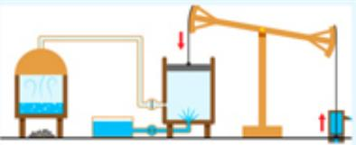
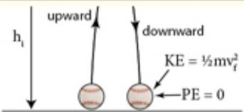
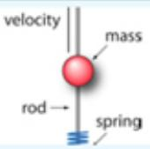
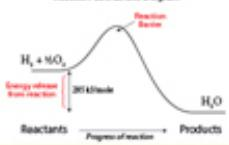
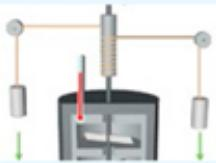
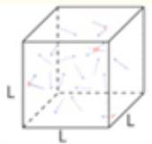
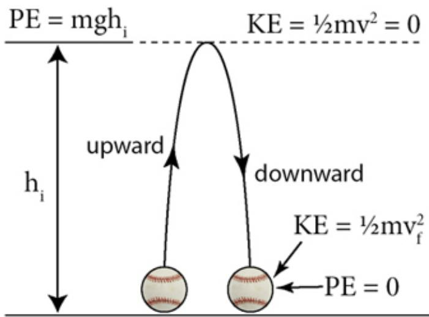
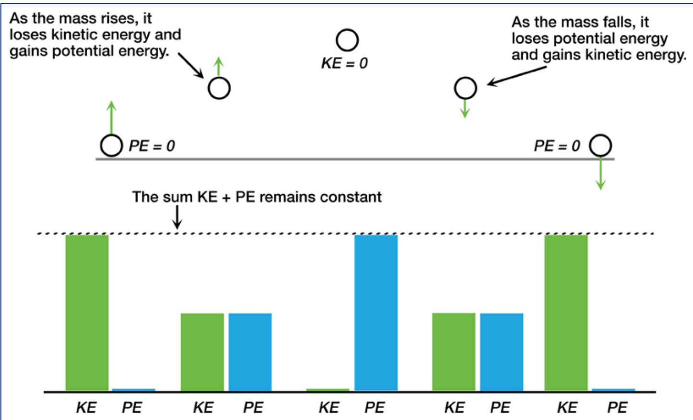

# 1 Energy


## CONCEPTUAL FOUNDATION AND THE LAWS THAT GOVERN ITS TRANSFORMATIONS

“Solving the clean energy problem is an essential part of building a better world. We won't be able to make meaningful progress on other challenges— like educating or connecting the world—without secure energy and a stable climate. Yet progress towards a sustainable energy system is too slow, and the current system doesn't encourage the kind of innovation that will get us there faster.”

—Bill Gates and Mark Zuckerberg, November 29, 2015, Palo Alto, CA

:::{figure} ../images/fig-p1-ch01-1.jpg
:name: fig-p1-ch01-1
:alt: Figure from the University Chemistry source textbook
:::

## Framework

Why do we care about understanding the concept of energy? What is energy anyway? Why does the understanding of energy at the molecular level dominate nearly every scientific discussion of chemical, physical, or biological change? Why does the subject of energy at the global level dominate nearly every discussion surrounding international negotiations, political debates, and investment strategies?

There are important answers to these questions that emerge from different lines of reasoning. One perspective is that until a scientific understanding of energy emerged in the $1 8 ^ { \mathrm { t h } }$ and ${ \bf { 1 9 } } ^ { \mathrm { { t h } } }$ century, little progress in scientific understanding in its larger context was achieved. More recently, an understanding of energy and the control of energy at the molecular level underpins developments in drug delivery for cancer treatments, self-assembly of complex molecular architectures, innovative new materials for nanoelectronics, low cost high efficiency solar cells for electricity production from sunlight, low cost disease detection, low cost water purification and desalinization, and innovative electrodes for production of hydrogen from sunlight for developing nations.

Numbers are important. We receive 10,000 times the amount of energy from the Sun, shown in [Figure 1.1](#fig-p1-ch01-2), per unit time than is consumed by all mankind. The human endeavor of energy extraction, distribution and use is today an \$8 trillion per year enterprise, dwarfing its next closest competitor. Developing a $1 \%$ niche in this industry is an \$80 billion per year opportunity. Energy dominates consideration of economic decisions and economic forecasts. Another perspective is that supplying energy to the global population is the single most important prerequisite for human health, food supplies, education, and civilized existence. As change accelerates in the global arena, the future increasingly belongs to those in command of an understanding of energy and energy consequences at the global and molecular level. A key reason for this is that picturing what occurs at the submicroscopic or molecular level directly clarifies the cause of changes that occur at the macroscopic, observable scale. Alternatively stated, the lack of an understanding of the principles that underlie the concept of energy will increasingly become an impairment to professional success as globalization becomes increasingly important.

:::{figure} ../images/fig-p1-ch01-2.jpg
:name: fig-p1-ch01-2
:alt: FIGURE 1.1 An understanding of energy at the global and molecular level requires an understanding of how nature seamlessly transforms energy among and between various categories. The Sun represents an important case in point because at the
FIGURE 1.1 An understanding of energy at the global and molecular level requires an understanding of how nature seamlessly transforms energy among and between various categories. The Sun represents an important case in point because at the core of the Sun the extremely high pressure and high temperature (100 million K) sustain nuclear fusion reactions converting hydrogen nuclei to helium nuclei generating some $1 0 ^ { 3 4 }$ joules of energy a year. This energy release moves to the surface of the Sun by the transport of hot material and by the transport of electromagnetic radiation outward to the Sun's surface. The temperature of the visible disk of the Sun, called the photosphere, resides at 5800 K, emitting visible light (electromagnetic radiation). That solar radiation in the visible is emitted outward into the blackness of Space. The Earth intercepts approximately one part in $1 0 ^ { 1 0 }$ of that solar radiation, which is 10,000 times the total energy consumption rate of the global economy. The solar radiation received by the Earth is transformed into the kinetic energy of the motion of the atmosphere and the oceans, into the building of organisms through photosynthesis, into the power that sustains humanity, and into the heat that warms the planet.
:::


An important consideration at the intersection of science and the role science now plays in societal objectives is that learning and understanding are accelerated by an imperative. We reside today at an unprecedented point in human history for which the physical sciences hold the key to developing a strategy for global scale decisions of critical importance to this and subsequent generations. This increasingly powerful union of science and society places the physical sciences not only in a position of opportunity, but also in a position of responsibility for establishing a rational foundation for progress. Current university graduates face coming to terms with a number of questions: What technical forces are shaping the modern world? What are the most pressing problems this and subsequent generations will face? Where are the frontiers of innovation and what implications do they hold for professional endeavors in science, technology, international economics, government, ethics, public health, law, and education? From the emergence of modern humans as a species 160,000 years ago, it required 7000 human generations to reach a global population of 2 billion in the middle of the 20<sup>th</sup> century. In the span of a single human lifetime, 1945 to 2045, world population will increase by a factor of five to approximately 10 billion. To recognize the scale of human demand for energy in the face of this population increase, combined with the expected growth in the standard of living for the developing economies in Asia, Africa, and South America, our global society must build the equivalent of two large fossil fuel burning power plants per day between now and 2050; alternatively, a nuclear power plant every day between now and 2050. This sets the scale of the challenges—but what are the consequences? As we will see, when carefully considered, pressure applied to the structures of global society by increasing global population and per capita standard of living transform the union between the core concepts in the physical sciences and the structure of an effective university education. Specifically the union is transformed by the objective of linking an understanding of the scientific and technical fundamentals into an integrated university education that does not, at an early stage, split the sciences from the broader context of societal challenges and opportunities. Operating effectively within the international arena without a grasp of the scientific and technical fundamentals that define a path forward will, for current university graduates, become increasingly difficult.

An important component of an ability to understand the scientific and technical fundamentals is a grasp of the orders of magnitude associated with energy scales and power scales. [Figure 1.2](#fig-p1-ch01-4) begins the development of a foundation defining the orders of magnitude of energy associated with important examples. These examples run from the energy output of the Sun per year $( 1 0 ^ { 3 4 }$ joules) to the kinetic energy of a single molecule of $\mathrm { N } _ { 2 }$ at room temperature $( 1 0 ^ { - 2 1 }$ joules). [Figure 1.3](#fig-p1-ch01-6) spans the orders of magnitude of the associated power scales. The energy scales and power scales deserve particular attention and we will calculate each entry as the text unfolds and so we will repeatedly refer back to these scales as we move forward. These numbers matter, and an important degree of insight emerges from knowing the ratio of key examples such as the ratio of solar energy received by the Earth to the energy used by the global economy. The importance of the relationship between energy and power on the one hand, and the calculation of the magnitude associated with important categories of energy and power on the other is the subject of Case Studies 1.1, 1.2, and 1.3 at the chapter end. The calculations incorporated within these three Case Studies, highlighted as sidebars to the right, are essential for establishing quantitative reasoning and for building a foundation in the link between science and technology.

Setting the Context 1: Energy Scale in Joules

:::{figure} ../images/fig-p1-ch01-3.jpg
:name: fig-p1-ch01-3
:alt: Figure from the University Chemistry source textbook
:::

:::{figure} ../images/fig-p1-ch01-4.jpg
:name: fig-p1-ch01-4
:alt: FIGURE 1.2 Becoming familiar with the orders of magnitude that comprise the range of energies occurring in both nature and in the human endeavor constitutes one of the most important perspectives in the union of science and society. We will
FIGURE 1.2 Becoming familiar with the orders of magnitude that comprise the range of energies occurring in both nature and in the human endeavor constitutes one of the most important perspectives in the union of science and society. We will constantly be returning to the calculation and analysis of “how much energy” is associated with global consumption, with the output of the Sun, with the interaction of photons of light with molecules, with the energy release from a nuclear reaction or a chemical reaction, and with the kinetic energy of a single molecule. While we will subsequently become familiar with how to calculate the energy in each category of interest, and how to relate each of these energy categories, we present here a range of energies from the microscopic to the macroscopic as a framework to build an intuition concerning how the world works—in the universally adopted unit of joules, so named for James Prescott Joule whom we will meet in the chapter Core.
:::


:::{figure} ../images/fig-p1-ch01-5.jpg
:name: fig-p1-ch01-5
:alt: Figure from the University Chemistry source textbook
:::

:::{figure} ../images/fig-p1-ch01-6.jpg
:name: fig-p1-ch01-6
:alt: FIGURE 1.3 While energy determines the amount of work that can be done, power determines how fast or how quickly that energy can be converted from one form of energy to another. Thus the distinction between energy and power becomes one of p
FIGURE 1.3 While energy determines the amount of work that can be done, power determines how fast or how quickly that energy can be converted from one form of energy to another. Thus the distinction between energy and power becomes one of paramount importance in any discussion of energy transfer. Power is quite simply the amount of energy transferred per unit time so power = energy/time and the universal unit of power is the watt, named after James Watt, such that 1 watt = 1 joule/second. In the case of an electrical device for example, a 100 watt light bulb uses 100 joules of energy in one second. Frequently for mechanical devices such as a car, we define its power in terms of horsepower (hp). But 1000 watts, or a kilowatt (kW), is just 1.3 hp so a 200 horsepower car is a 154 kW car. Examine this power scale carefully—just as with energy, it provides an important perspective!
:::


## - Global Context -

:::{figure} ../images/fig-p1-ch01-7.jpg
:name: fig-p1-ch01-7
:alt: Figure from the University Chemistry source textbook
:::

## Case Study 1.1 Linking the Concepts of Energy and Power

:::{figure} ../images/fig-p1-ch01-8.jpg
:name: fig-p1-ch01-8
:alt: Figure from the University Chemistry source textbook
:::

## Case Study 1.2 Quantitative Reasoning Linking Energy, Work, and Power

:::{figure} ../images/fig-p1-ch01-9.jpg
:name: fig-p1-ch01-9
:alt: Figure from the University Chemistry source textbook
:::

## Case Study 1.3 Development of the Scales of Energy and Power

:::{figure} ../images/fig-p1-ch01-10.jpg
:name: fig-p1-ch01-10
:alt: Figure from the University Chemistry source textbook
:::

A key structural feature of the approach adopted here is the relationship between concepts intrinsic to the scientific fundamentals and context that constitutes the global demand for innovative solutions serving both personal and societal objectives. [Figure 1.4](#fig-p1-ch01-17) presents this strategy in graphical form, placing the concepts that form the foundation of the modern physical sciences at the center of the diagram: quantum mechanics, thermodynamics, electrochemistry, kinetics, catalysis, photochemistry, materials, and nuclear chemistry. The outer circle of [Figure 1.4](#fig-p1-ch01-17) summarizes the context that requires an understanding of the concepts in order to participate proactively in the affairs of our global society as the future unfolds: energy production and storage, innovative new materials, feedbacks in the climate structure, human health, technology leadership, national security, and international negotiations. Indeed, a working knowledge of the concepts at the core of [Figure 1.4](#fig-p1-ch01-17) and the union of those concepts with the context laid out in [Figure 1.4](#fig-p1-ch01-17) is necessary for informed participation in a modern scientific discourse and in a modern democracy.

• Innovative new materials Nanostructures, self assembly, solar cells, electronics

:::{figure} ../images/fig-p1-ch01-11.jpg
:name: fig-p1-ch01-11
:alt: Figure from the University Chemistry source textbook
:::

•Technology leadership Electronics, electric automobiles, health systems, and software

:::{figure} ../images/fig-p1-ch01-12.jpg
:name: fig-p1-ch01-12
:alt: Figure from the University Chemistry source textbook
:::

## CONTEXT

• Feedbacks in the climate structure Thermodynamics, the First Law, and irreversibility

• Energy production, storage, and distribution

:::{figure} ../images/fig-p1-ch01-13.jpg
:name: fig-p1-ch01-13
:alt: Figure from the University Chemistry source textbook
:::

:::{figure} ../images/fig-p1-ch01-14.jpg
:name: fig-p1-ch01-14
:alt: Figure from the University Chemistry source textbook
:::

Incoming sunlight Solar panel

Energy storage

:::{figure} ../images/fig-p1-ch01-15.jpg
:name: fig-p1-ch01-15
:alt: Figure from the University Chemistry source textbook
:::

## CONCEPTS

•Human health Molecular-and cellular-level imaging, low-cost disease detection, clean water

• Quantum mechanics Atoms, molecules, and bonding

• National security Global education, independence in primary energy generation

• Thermodynamics Energy, entropy, free energy, and spontaneous change

• Electrons and chemistry Oxidation, reduction, electrochemistry, and the origins of life

• Kinetics, catalysis, and the control of the rates of chemical transformation

• Photons, molecules, and materials

• Nuclear reactions Energy imaging and radiocarbon dating

• Rapid changes in the product of global population and per capita power demand

:::{figure} ../images/fig-p1-ch01-16.jpg
:name: fig-p1-ch01-16
:alt: Figure from the University Chemistry source textbook
:::

• International negotiations Technology leadership, arms control

:::{figure} ../images/fig-p1-ch01-17.jpg
:name: fig-p1-ch01-17
:alt: FIGURE 1.4 The combination of rapidly developing innovation and rapidly increasing world population places the physical sciences in a position of primary responsibility for the solution to key societal objectives. The concepts central to ch
FIGURE 1.4 The combination of rapidly developing innovation and rapidly increasing world population places the physical sciences in a position of primary responsibility for the solution to key societal objectives. The concepts central to chemistry and the physical sciences are summarized in the center of the diagram. Mastering the conceptual core of the physical sciences is essential for understanding the larger context of how those principles are connected to immediate challenges including global energy production, innovative new materials, economic leadership, human health, feedbacks in the climate system, international negotiations, and natural security.
:::


One other aspect of [Figure 1.4](#fig-p1-ch01-17) that requires note is the input, displayed at the bottom center of the diagram. The rapid increase in global population, particularly in Asia and Africa, as we approach the middle of the century is forcing dynamic change linking the concepts to the context. Because this global population increase is occurring primarily in the developing world, where per capita energy consumption is a small fraction of what it is in the developed countries, the global demand for energy will increase far more rapidly than will population. For example, the per capita consumption of energy in the US is nearly 50 times the per capita energy consumption of nations in central Africa, yet a major fraction of world population growth will occur in Africa.

We can trace these connections between a given concept that lies within the inner circle of [Figure 1.4](#fig-p1-ch01-17) and the surrounding context that drives the imperative for progress by asking some questions: Why is an understanding of thermodynamics so important to our future? Within the domain of thermodynamics lie the answers to critical, practical questions: why is a gasoline-powered automobile only 15% efficient in converting the energy contained in the chemical bonds of octane, $\mathrm { C _ { 8 } H _ { 1 8 } } ,$ to the motion of the vehicle? Why does it require only 15 kWh of energy to propel an electric car 100 km when it requires 125 kWh of chemical energy to propel a gasoline automobile the same 100 km? From thermodynamics emerges the dual role of energy and entropy that together quantitatively establish the criteria for spontaneous change. Spontaneous change is what drives all chemical reactions; the chemical transformation from reactants to products. The release of free energy in a chemical reaction unifies the concepts of energy and entropy, but what is free energy and how specifically is it defined?

A further study of thermodynamics over the course of this text will demonstrate that all forms of energy, whether associated with a living cell, an electromechanical device, or the Earth's climate system, are inter-convertible in accordance with the First Law of Thermodynamics. The First Law of Thermodynamics states that energy is neither created nor destroyed, but energy can be converted from one form to another. In practice this means we must quantitatively account for how and where energy has moved within a system or between a system and its surroundings. While the First Law appears on the face of it to be rather self evident, it is one of the most universally applicable and powerful laws in science. We will see why.

For example, an important axiom that can be drawn directly from the First Law of Thermodynamics is: it is the net flow of heat into the reservoirs of the climate system that define the course of events as we move into the future. It is the irreversible changes to the climate structure that result from the retention of that heat that matters most to society, not simply “global warming.” An important example is the floating ice encompassing the Arctic Ocean that has remained in place for the past 3 million years. However, in the last 30 years, 75 percent of the permanent ice has been lost from this system initiating potent feedbacks that accelerate the removal of the remaining ice. It is now possible to pass unencumbered from the Pacific to the Atlantic Ocean in summer—the “northwest passage” that drove exploration from the 15th century on. The numbers matter: this loss of ice volume means that a net $5 \times 1 0 ^ { 2 1 }$ joules of energy, as heat, has flowed into the Arctic Ice Cap over the past 30 years. Yet the energy per unit time required to melt this Arctic ice is but one part in 50,000 of the infrared energy circulating between the Earth's surface and the water vapor, carbon dioxide, methane, and cloud structures in the atmosphere. In order to place this in context, we must understand energy scales and the relative orders of magnitude associated with categories of energy. We must also develop an understanding of feedbacks and the role they play in physical and biological systems.

:::{figure} ../images/fig-p1-ch01-18.jpg
:name: fig-p1-ch01-18
:alt: Figure from the University Chemistry source textbook
:::

Next consider quantum mechanics. Why is quantum mechanics so important to our future? Recognition of the wave properties of the electron initiates fundamental insight into the structure of the hydrogen atom and multielectron atomic systems. In addition, tracing the scientific origin of quantum mechanics gives us an opportunity to discuss the Scientific Method in concrete terms—this is the subject of Case Study 1.4.

We must come to understand the scientific foundation that underpins multi-electron atoms before we can explore rapid developments in materials research that extend from the fabrication of tubular geometries that capture sunlight, to nanotechnology for increasingly small and efficient computer chips, to the increasing sophistication of the internet and the electronic devices linked to it. As we will see as the text unfolds, the direct impact of quantum mechanics on modern society establishes the union of quantum mechanics with key challenges at the global scale, such as the harvesting of solar energy. This energy can be captured using an array of renewable energy gathering devices leading to an economic revolution in the race to develop new energy storage and distribution systems. Business opportunities include the creation of innovative new materials for high energy density batteries, new materials for the conversion of sunlight to renewable fuels for supplying energy to both developed and developing countries, and innovative systems capable of converting those fuels directly to electricity or for heating, water purification, and transportation—all essential for basic human health.

The concept of energy remained largely misunderstood throughout most of recorded history. Energy, as we will see, may be defined as the ability to do work, which is easily grasped when it is applied to automobile engines, electric motors, water pumps, etc. However, when we think about energy associated with chemical reactions within cells, with transformations in chemical bonds, with the transport of electrons along conduction pathways in the cell, the concept of work becomes more abstract and, at the outset, less intuitive.

There is a remarkable parallel between the principles intrinsic to the production, storage and use of energy within the global economy— indeed the management of the world's resources—and the production, storage, and use of energy at the cellular scale in living organisms. Cells require energy to function—to execute the myriad tasks that define the distinction between the living and the inanimate—including the synthesis of glucose (fuel) from carbon dioxide and water. The work of the cell spans the range from the contraction of muscles, to the mental recognition of patterns, to the replication of DNA.

A key part of our objective in this text is the development of quantitative reasoning. Quantitative reasoning is developed in large part through a practice of deconstruction and then reconstruction. This involves the deconstruction of a problem into its component parts that can then be addressed by identifying the scientific principle or principles that will facilitate a solution to the problem. This is in stark contrast to the process of simply sticking numbers into an equation—a tactic rewarded in standardized tests, but antithetical to the practice and the application of science. Models of a system or a problem are a great aid in this process of deconstruction into component parts. The reconstruction is then a process by which the parts of that simplified model are reassembled.

As we develop in this text both the central concepts in modern physical science and the close coupling of those fundamental concepts to the larger global context, a key aspect that places these considerations in quantitative context is the calculation of energy consumption by the global economic endeavor. While this is, on the face of it, a complicated task, there are ways of addressing calculations of total global energy consumption that are both accurate and straightforward. This is the subject of Case Study 1.5.

A final note on the chapter structure used in this text: each chapter is initiated by a Framework section that sets the context for the Core of the chapter; the Core of the chapter in turn develops the concepts at the foundation of modern chemistry, and of modern physical sciences more broadly. Following the chapter Core is a set of Case Studies that use the fundamentals developed in the Core to develop quantitative reasoning skills and to expand upon the connection between the chapter's (and previous chapters’) concepts and the larger context of the subject. However, this text structure will not compromise rigor in the development of scientific principles. The depth of the development of the scientific foundation is gauged to provide the preparation needed to compete successfully today and in the future in the international arena— scientific and societal.

Case Study 1.5 Calculating Energy Use at the Global Scale

## What drives the demand for global energy?

:::{figure} ../images/fig-p1-ch01-19.jpg
:name: fig-p1-ch01-19
:alt: Figure from the University Chemistry source textbook
:::

:::{figure} ../images/fig-p1-ch01-20.jpg
:name: fig-p1-ch01-20
:alt: Figure from the University Chemistry source textbook
:::

Per capita income

:::{figure} ../images/fig-p1-ch01-21.jpg
:name: fig-p1-ch01-21
:alt: Figure from the University Chemistry source textbook
:::

= GLOBAL ENERGY DEMAND

## Chapter Core

## Road Map for Chapter 1

In the sections that follow, we develop first an understanding of the concept of energy by tracing its scientific development—a treatment that demonstrates how elusive the concept of energy turned out to be. As we will see, in order to understand energy we must develop a facility for understanding how nature transforms various types of energy among and between various important categories of energy. The Chapter 1 Road Map is displayed in [Figure 1.5](#original-fig-1-5).

<table><tr><td colspan="2">Road Map to Core Concepts</td></tr><tr><td>Understanding the Concept of Energy: A Prerequisite for Scientific Progress (p. 9)</td><td></td></tr><tr><td>Energy, Work, and Newton&#x27;s Laws: Conservation of Mechanical Energy (p. 12)</td><td></td></tr><tr><td>Conservation of Energy: Tracking the Flow of Energy from Macroscopic Mechanical Energy to Microscopic Molecular Motion (p. 15)</td><td></td></tr><tr><td>Potential Energy Diagram and the Reaction Coordinate Diagram (p. 20)</td><td>Reaction Coordinate Diagram </td></tr><tr><td>The Mechanical Equivalent of Heat and the Concept of Heat Capacity (p. 22)</td><td></td></tr><tr><td>Kinetic Theory Interpretation of Temperature (p. 26)</td><td></td></tr><tr><td>Role of Electromagnetic Radiation in the Transformation of Energy Among Various Categories of Energy (p. 30)</td><td></td></tr><tr><td>Blackbody Radiation and the Stefan-Boltzmann Law (p. 34)</td><td></td></tr><tr><td>Energy and Power: A Critically Important Distinction (p. 38)</td><td></td></tr></table>

(original-fig-1-5)=
FIGURE 1.5 Summary of the major concepts developed in the chapter core.

## Emergence of Energy as a Scientific Concept

Energy is transformed continuously between its various forms in ways that can range from the obvious—for example, when a battery supplies voltage to an electric motor, thereby converting chemical energy to the kinetic energy of motion—to the more subtle—for example, when sunlight (electromagnetic radiation) induces the formation of organic material through the process of photosynthesis. Recognizing various forms of energy and understanding the scientific principles involved in the transformations that take place between these energy categories is fundamental to scientific understanding at any level of inquiry. Energy is found in the form of molecular motion, electrical energy, nuclear energy, electromagnetic energy, kinetic energy of macroscopic objects, gravitational energy, etc.

The emergence of energy as a well defined scientific concept has a tortured past. Aristotle (381-322 BC) was the first to grapple with the many connotations of the concept of energy and to attempt to make sense of its many complexities. He first referred to it in his Metaphysics by joining in (εν) and work (εργoν) to form ενεργεα or “energea” that he linked with “entelechia” or “complete reality.” The verb energea thus came to signify motion, action, work, and/or change. But little progress was made on this concept of energy through the Roman period, the Middle Ages, and the Renaissance.

:::{figure} ../images/fig-p1-ch01-31.jpg
:name: fig-p1-ch01-31
:alt: Figure from the University Chemistry source textbook
:::

Aristotle

A number of legendary scientific pioneers had a rickety and flawed conceptual grasp of energy. At the approach of the mid-eighteenth century, the term energy became indistinguishable from power and force. As excerpted from Vaclav Smil's 2006 treatise, Energy, the foundation of the concept of energy traced the following course:

In 1748, David Hume (1711-1776) complained, in An Enquiry Concerning Human Understanding, that “There are no ideas, which occur in metaphysics, more obscure and uncertain, than those of power, force, energy or necessary connexion, of which it is every moment necessary for us to treat in all our disquisitions.”

In 1807, in a lecture at the Royal Institution, Thomas Young (1773- 1829) defined energy as the product of the mass of a body and the square of its velocity, thus offering an inaccurate formula (the mass should be halved) and restricting the term only to kinetic (mechanical) energy. Three decades later the seventh edition of the Encyclopedia Britannica (completed in 1842) offered only a very brief and unscientific entry, describing energy as “the power, virtue, or efficacy of a thing. It is also used figuratively, to denote emphasis in speech.”

Theoretical energy studies reached a satisfactory (though not a perfect) coherence and clarity before the end of the nineteenth century when, after generations of hesitant progress, the great outburst of Western intellectual and inventive activity laid down the firm foundations of modern science and soon afterwards developed many of its more sophisticated concepts. The ground work for these advances began in the seventeenth century, and advanced considerably during the course of the eighteenth, when it was aided by the adoption both of Isaac Newton's (1642-1727) comprehensive view of physics and by engineering experiments, particularly those associated with James Watt's (1736-1819) improvements of steam engines. As the saying goes, science owes more to the steam engine than the steam engine to science.

During the early part of the nineteenth century a key contribution to the multifaceted origins of modern understanding of energy were the theoretical deductions of a young French engineer, Sadi Carnot (1796- 1832), who set down the universal principles applicable to producing kinetic energy from heat and defined the maximum efficiency of an ideal (reversible) heat engine. Shortly afterwards, Justus von Liebig (1803-1873), one of the founders of modern chemistry and sciencebased agriculture, offered a basically correct interpretation of human and animal metabolism, by ascribing the generation of carbon dioxide and water to the oxidation of foods or feeds.

The formulation of one of the most fundamental laws of modern physics had its origin in a voyage to Java made in 1840 by a young German physician, Julius Robert von Mayer (1814-1879), as ship's doctor. The blood of patients he bled there (the practice of bleeding as a cure for many ailments persisted well into the nineteenth century) appeared much brighter than the blood of patients in Germany.

Mayer had an explanation ready: blood in the tropics does not have to be as oxidized as blood in temperate regions, because less energy is needed for body metabolism in warm places. But his answer led him to another key question. If less heat is lost in the tropics due to radiation, how about the heat lost as a result of physical work (that is, expenditure of mechanical energy), which clearly warms its surroundings, whether done in Europe or tropical Asia? Unless we put forward some mysterious origin, that heat, too, must come from the oxidation of blood and hence heat and work must be equivalent and convertible at a fixed rate. And so began the formulation of the law of the conservation of energy. In 1842 Mayer published the first quantitative estimate of the equivalence, and three years later extended the idea of energy conservation to all natural phenomena, including electricity, light, and magnetism, and gave details of his calculation based on an experiment with gas flow between two insulated cylinders.

The correct value for the equivalence of heat and mechanical energy was found by the English physicist James Prescott Joule (1818-1889), after he conducted a large number of careful experiments. Joule used very sensitive thermometers to measure the temperature of water being churned by an assembly of revolving vanes driven by descending weights: this arrangement made it possible to measure fairly accurately the mechanical energy invested in the churning process. In 1847 Joule's painstaking experiments yielded a result that turned out to be less than one percent of the actual value. The law of conservation of energy—that energy can be neither created nor destroyed—is now commonly known as the first law of thermodynamics.

:::{figure} ../images/fig-p1-ch01-32.jpg
:name: fig-p1-ch01-32
:alt: Figure from the University Chemistry source textbook
:::

James Prescott Joule

In 1850 the German theoretical physicist Rudolf Clausius (1822- 1888) published his first paper on the mechanical theory of heat, in which he proved that the maximum performance obtainable from an engine using the Carnot cycle depends solely on the temperatures of the heat reservoirs, not on the nature of the working substance, and that there can never be a positive heat flow from a colder to a hotter body. Clausius continued to refine this fundamental idea and in his 1864 paper he coined the term entropy—from the Greek τροπη (transformation)—to measure the degree of disorder in a closed system. Clausius also crisply formulated the second law of thermodynamics: entropy of the universe tends to maximum. In practical terms this means that in a closed system (one without any external supply of energy) the availability of useful energy can only decline. A lump of coal is a high-quality, highly ordered (low entropy) form of energy; its combustion will produce heat, a dispersed, low-quality, disordered (high entropy) form of energy. The sequence is irreversible: diffused heat (and emitted combustion gases) cannot ever be reconstituted as a lump of coal. Heat thus occupies a unique position in the hierarchy of energies: all other forms of energy can be completely converted to it, but its conversion into other forms can never be complete, as only a portion of the initial input ends up in the new form. [End of Smil's essay]

## Sidebar 1.1—James Watt

The initial motivation for all of the pioneers of steam, most notably Thomas Newcomen (1663-1729) and James Watt (1738-1819), was to develop an efficient means to pump water from underground mines. In this, Watt's primary achievement was to improve on the earlier innovation by Thomas Newcomen. But where Newcomen failed to profit much from his invention, Watt was remarkably successful. He was recognized early in life as an accomplished inventor and entrepreneur. He received more lasting fame in later life when he was elected, at age 47 (in 1785), to the Royal Society of London. Fifteen years after his death in 1819, a statue honoring him was installed in Westminster Abbey.

:::{figure} ../images/fig-p1-ch01-33.jpg
:name: fig-p1-ch01-33
:alt: Figure from the University Chemistry source textbook
:::

The inscription on Watt's statue reads as follows:

“The King, His Ministers, and many of the Nobles and Commoners of the Realm raised this monument to JAMES WATT who, directing the force of an original Genius, early exercised in philosophic research, to the improvement of the Steam Engine, enlarged the resources of his Country, increased the power of Man, and rose to an eminent place among the most illustrious followers of science and the real benefactors of the World.”

Andrew Carnegie began his biography of Watt (Carnegie, 1905) as follows: “James Watt, born in Greenock, January 19, 1736, had the advantage, so highly prized in Scotland, of being of good kith and kin.” Watt's father, James, was a merchant who supplied nautical goods and mathematical instruments. He was known for his skill in fabricating delicate instruments, a skill inherited by his son. His grandfather, Thomas, identified as a “Professor of Mathematics” (Marsden, 2002), taught navigation and surveying.”

## Sidebar 1.2—Development of the Watt Steam Engine: John B. Fenn, Engines, Energy, and Entropy

In Newcomen's engine, steam under pressure from a boiler pushed a piston to the top of a vertical cylinder as shown in the diagram below. The steam was then condensed by injecting water into the cylinder. The resulting vacuum allowed atmospheric pressure to push the piston to the bottom of the cylinder.

Newcomen's engines were used almost exclusively for pumping water. When power was needed to turn other machinery, a Newcomen engine would pump water to a level from which it could fall through a water wheel! (This practice has had a reincarnation. Nowadays, some electric generating power plants use off-peak power to pump water to elevated reservoirs. During peak demand, the water runs downhill through hydraulic turbines whose output supplements the capacity of the steam plant.) In spite of its wide use, the Newcomen engine left much to be desired. It was large, ungainly, and had an extravagant appetite for fuel.

:::{figure} ../images/fig-p1-ch01-34.jpg
:name: fig-p1-ch01-34
:alt: Figure from the University Chemistry source textbook
:::

In 1763 the Scottish instrument maker James Watt became disturbed by the Newcomen engine's great waste of heat through the alternate warming and cooling of the cylinder. He introduced the idea of a separate condenser that would remain cool yet communicate with the cylinder by a valve opened at a propitious point in the cycle (see figure right).

:::{figure} ../images/fig-p1-ch01-35.jpg
:name: fig-p1-ch01-35
:alt: Figure from the University Chemistry source textbook
:::

A separate condenser draws steam from the Lever Second cylinder, creating the pressure loss that allows the translates piston piston to drop. Because the cylinder heats and motion to draws cools less each cycle, the design is more efficient. secondpiston water up

Thus the cylinder could be kept warm all the time—in fact, could be insulated to keep from losing heat to the surroundings. Watt's condenser greatly cut fuel consumption and increased efficiency. It marked the real beginning of the steam engine age, which we are still very much in.

## Energy, Work, and Newton's Laws

An analysis of the developments leading to a coherent scientific definition of energy revealed the importance of studying how energy is transformed. It is for just this reason that we place considerable emphasis in this chapter on both the transformations that occur between different types or categories of energy and the changes that can be initiated or sustained by the expenditure of energy at both the macroscopic and microscopic (molecular) level.

So reaching a quantitative understanding of what energy is required a broad recognition of the many forms energy could take, the subtle ways energy could be transformed in nature, and of paramount importance—the fact that energy is a conserved quantity. It cannot be created nor destroyed. While we regard the conservation of energy as an unassailable fact from our first exposure to science, the fact that it is conserved changes our discourse and our strategy of thinking about energy. In particular the focus immediately turns to the question: if I can't quantitatively account for the energy change associated with a given physical or chemical transformation, then where did that unaccounted-for energy go? It must have gone somewhere—where is it? This is not unlike tracking money through a complex web of international transactions. Money is not lost, it is ingeniously transformed.

The secrets surrounding how energy serves as the singularly important currency for changes in natural systems began to be revealed through the work of James Watt, Thomas Young, and others as described above. But it was Isaac Newton, shown in [Figure 1.6](#fig-p1-ch01-36), who, well before Watt's and Young's contributions, made the profound connections that began to expose the true nature of energy. While the stories about Newton watching an apple fall from a tree are woven into scientific legend, consider what is actually occurring when you observe such an event. It is far from a trivial transformation. The apple, suspended at rest above the ground, begins to accelerate downward, gaining kinetic energy as it falls. This is a rather miraculous, yet seamless, interchange of energy from one form (gravitational potential energy) to another form (kinetic energy). When the apple hits the ground, it comes to rest. Has the energy disappeared? As we will see, the answer is no. But Newton was initially concerned with a different question. Suppose, he reasoned, we reverse the process by returning that apple to the branch from which it fell. Newton recognized that to do so he would have to apply a force against gravity, over a distance, from the ground to the point from which the apple fell. That quantity, he reasoned (the force times the distance) must quantitatively represent the same “thing” as the kinetic energy contained in the apple as it hit the ground. That is, the work required to raise the apple in the Earth's gravitational field was quantitatively the same as the kinetic energy of motion possessed by the apple at the moment it hit the ground. The common, and apparently exchangeable, quantity involved in this physical transformation, was energy. Except now this exchangeable currency, energy, could be quantitatively determined by measuring the force and the distance and multiplying them to obtain the work required to place the apple at its initial position.

:::{figure} ../images/fig-p1-ch01-36.jpg
:name: fig-p1-ch01-36
:alt: FIGURE 1.6 Isaac Newton (1642-1727) was responsible for establishing the laws governing the relationship between inertia, force, mass, acceleration, work, and energy. He would later clarify the principles governing the gravitational force b
FIGURE 1.6 Isaac Newton (1642-1727) was responsible for establishing the laws governing the relationship between inertia, force, mass, acceleration, work, and energy. He would later clarify the principles governing the gravitational force between celestial objects.
:::


It is obvious to us when we do physical work that it takes more work to push a 100 lb box 200 feet than it does to push it 100 feet (and that a 50 lb box takes less work to push an equal distance than a 100 lb box). But we still do not have a quantitative definition of force, even though we can reliably measure distance.

What Newton recognized was that the apple was accelerated downward by a force—the force of gravity—but more generally, that a force is necessary to instigate a change in the state of motion, either the speed or the direction of an object's motion. An object changes speed or direction only when acted on by a force. Newton referred to the tendency for a body to retain its current state of motion as the property of inertia: if at rest, a body remains at rest. If in motion, a body remains in motion unless acted on by an external force. This recognition lead to Newton's First Law of Motion: Every body persists in its state of rest or of motion in a straight line unless it is compelled to change that state by forces impressed upon it.

It was well understood in Newton's time that speed was quantitatively defined as the change in distance divided by the change in time:

```{math}
:label: eq-p1-ch01-1
\mathrm{Speed} = \mathrm{changeindistance/changeintime}
```


In addition, it was also understood that the concept of velocity involved both speed and direction and that acceleration was defined as the change in velocity divided by the change in time:

```{math}
:label: eq-p1-ch01-2
\mathrm{acceleration} = \mathrm{changeinvelocity/changeintime}
```


where the velocity of an object is defined by both its speed and its direction.

## Check Yourself 1

Isaac Newton developed the foundations of physics by his First Law that clarified the concept of inertia, and his Second Law that related force to mass and acceleration, F = ma. Newton also established the law governing the gravitational force between two masses $\mathbf { m _ { 1 } }$ and $\mathbf { m } _ { 2 } .$

1. Newton expressed the gravitational force between two masses as

```{math}
:label: eq-p1-ch01-3
F = G \frac {m _ {1} m _ {2}}{r ^ {2}}
```


where G is the gravitational constant equal to $6 . 6 7 \times 1 0 ^ { - 1 1 } \mathrm { m ^ { 3 } / k g { \cdot } s e c ^ { 2 } } ,$ $\mathbf { m _ { 1 } }$ and $\mathbf { m } _ { 2 }$ are the two masses, and r is the distance between the centers of the two objects. If you are at a distance from the Earth equal to the distance from the Earth to the moon, calculate the force the Earth exerts on you from that distance.

2. When we write the expression that the force on an object at the Earth's surface is F = mg, where g is the “acceleration of gravity” based on Newton's law for gravity, what is the functional form of g in terms of $\mathbf { G } , \mathbf { r } ,$ and the masses?

3. Calculate the value of g at the Earth's surface.

Once Newton recognized the profound importance of inertia, which clarified the role of force as the agent of change, and moreover that the change in the current state of motion was acceleration, he had “only” to understand the relationship between force and acceleration. It was clear that a more massive body required a greater force to achieve the same acceleration, so mass must play a role in quantitatively linking force and acceleration. He also recognized that different masses accelerated equally in the Earth's gravitational field that created a force proportional to mass. From that he concluded that the proportionality between force and acceleration was simply the object's mass (as opposed to the mass squared, the square root of the mass, or something else).

This formed the basis for Newton's Second Law of Motion: The acceleration, a, of a body is proportional to the force, F, applied to that body.

```{math}
:label: eq-p1-ch01-4
F \propto a
```


Furthermore, the proportionality constant between the force and the acceleration is the mass, m, of the body so that

```{math}
:label: eq-p1-ch01-5
F = m a
```


But it is energy that is the elusive entity. What has all this force, mass, and acceleration have to do with energy? The answer is that work, which is force times distance, represents the key concept linking force and energy. Specifically, if we suspend a mass m in a gravitational field, it will experience a force $\mathrm { F } = \mathrm { m } \mathbf { a } = \mathrm { m } \mathbf { g }$ where g is the acceleration of gravity. If we raise that mass to a height h from the ground, we will do an amount of work

```{math}
:label: eq-p1-ch01-6
\mathrm{w} = \text { force } \times \text { distance } = \mathrm{mgh} \quad (\mathbf {1 . 1})
```


If we release that mass, it will accelerate downward, converting that invested work to kinetic energy such that just before it reaches the ground, it will have kinetic energy, ½ mv<sup>2</sup>, equal to that invested work, mgh, so we can equate the work done with the kinetic energy:

```{math}
:label: eq-p1-ch01-7
^ {1 / 2} \mathrm{mv} ^ {2} = \mathrm{mgh}
```


Alternatively, we can run repeated experiments, for example with a baseball as shown in [Figure 1.7](#fig-p1-ch01-37), where we send the mass vertically with different velocities and measure the height the mass reaches. Each time, ½ $\mathrm { m } \mathrm { v } ^ { 2 } = \mathrm { m g h }$ , and the mass returns to Earth with the same downward velocity that it had upward velocity (except for small losses due to air drag that we will discuss subsequently). Thus, if we designate mgh as the potential energy, PE, and $\scriptstyle 1 / 2 \mathrm { m v } ^ { 2 }$ as the kinetic energy, KE, we recognize that this quantity PE + KE remains constant. It is neither created nor destroyed. So if we define PE + KE as the total energy $\mathrm { E } _ { \mathrm { T } } ,$ we have

```{math}
:label: eq-p1-ch01-8
\mathrm {E_ {T} = PE + KE = constant.}
```


## Schematic of a baseball thrown vertically

:::{figure} ../images/fig-p1-ch01-37.jpg
:name: fig-p1-ch01-37
:alt: FIGURE 1.7 The trajectory of a baseball, thrown vertically from the ground, exemplifies the exchange between potential energy and kinetic energy. The baseball leaves the ground with initial vertical velocity of mathematical notation and ini
FIGURE 1.7 The trajectory of a baseball, thrown vertically from the ground, exemplifies the exchange between potential energy and kinetic energy. The baseball leaves the ground with initial vertical velocity of $\mathsf { v } _ { \mathrm { i } }$ and initial kinetic energy of $ { \gamma _ { 2 } }  { \mathrm { \ m v } _ { \mathrm { i } } } ^ { 2 }$ . It rises vertically until it acquires an amount of potential energy, mgh, equal to its initial kinetic energy. It then falls toward the ground, converting potential energy to kinetic energy until it reaches the ground with downward velocity opposite in direction but equal in magnitude to $\mathsf { v } _ { \mathrm { i } } .$
:::


Or if $\mathrm { ( E _ { T } ) _ { g r o u n d } = ( P E + K E ) _ { g r o u n d } }$ is the sum of potential energy and kinetic energy at the ground and if $( \mathrm { E _ { T } } ) _ { \mathrm { m a x } } = \left( \mathrm { P E } + \mathrm { K E } \right) _ { \mathrm { m a x } }$ is the sum of potential energy plus kinetic energy at the maximum height the mass reaches, then, because the conservation of energy dictates that $\Delta \mathrm { E _ { T } = \left( \mathrm { E _ { T } } \right) _ { g r o u n d } - \left( \mathrm { E _ { T } } \right) _ { m a x } = }$ $\mathbf { O } ,$ we have $\mathrm { ( E _ { T } ) _ { g r o u n d } = ( E _ { T } ) _ { m a x } \ s o \ ( m g h + ^ { 1 / 2 } m v ^ { 2 } ) _ { g r o u n d } = ( m g h + ^ { 1 / 2 } m v ^ { 2 } ) _ { m a x } . }$ If we begin initially with the mass moving vertically upward at the ground with velocity $\mathbf { v _ { i } }$ at $\mathbf { h } = \mathbf { 0 } ;$ , then $\mathrm { ( m g h ) } _ { \mathrm { g r o u n d } } = 0$ and $( \mathrm { \small ~ ^ { 1 } / 2 ~ m v ^ { 2 } ) _ { g r o u n d } = ^ { 1 } / 2 ~ m v _ { i } } ^ { 2 }$ . At the maximum height, the final velocity, $\mathbf { v _ { f } } = \mathbf { 0 }$ , and with the mass at height, h, $( \mathrm { m g h + ^ { 1 } / 2 \ m v _ { f } ^ { 2 } } ) _ { \mathrm { m a x } } = \mathrm { m g h + o \ s o }$ our conservation of energy expression gives us

```{math}
:label: eq-p1-ch01-9
^ {1 / 2} \mathrm {m v _ {i}} ^ {2} = \mathrm{mgh}.
```


Thus the height, h, reached by the mass with initial vertical velocity $\mathbf { v _ { i } }$ is

```{math}
:label: eq-p1-ch01-10
\mathrm{h} = \mathrm{v} ^ {2} / 2 \mathrm{g}
```


It is important to keep this principle of conservation of energy clearly in mind, which we can do for any point in the trajectory of the mass using an energy chart to keep quantitative track. This is displayed in [Figure 1.8](#fig-p1-ch01-38).

:::{figure} ../images/fig-p1-ch01-38.jpg
:name: fig-p1-ch01-38
:alt: FIGURE 1.8 We can keep track of the amount of kinetic energy and potential energy throughout the course of a mass's trajectory using an energy bar chart to track the quantitative relationship between KE and PE.
FIGURE 1.8 We can keep track of the amount of kinetic energy and potential energy throughout the course of a mass's trajectory using an energy bar chart to track the quantitative relationship between KE and PE.
:::


So it was the link among inertia, force, acceleration, and work that exposed the central principle of energy and of energy conservation.

## Check Yourself 2

If you dive off a cliff 30 meters above the water, how fast will you be going when you reach the water?

So let's work a quick problem linking the conversion of potential energy to kinetic energy. Suppose we want to calculate the velocity of a person who dives off a cliff into a lake, river, or ocean. Suppose the ledge is 30 meters above the water; what will be the speed of the diver at the moment the diver enters the water?

That is, if you dive from a cliff 30 meters above the water, how fast will you be moving when you reach the surface?

```{math}
:label: eq-p1-ch01-11
\text { Initial   Total   Energy } = \text { Final   Total   Energy }
```


```{math}
:label: eq-p1-ch01-12
\frac {1}{2} \mathrm{mv} _ {\mathrm{i}} ^ {2} + \mathrm{mgh} _ {\mathrm{i}} = \frac {1}{2} \mathrm{mv} _ {\mathrm{f}} ^ {2} + \mathrm{mgh} _ {\mathrm{f}}
```


```{math}
:label: eq-p1-ch01-13
\frac {1}{2} \mathrm{mv} _ {\mathrm{i}} ^ {2} + \mathrm{mgh} _ {\mathrm{i}} = \frac {1}{2} \mathrm{mv} _ {\mathrm{f}} ^ {2} + \mathrm{mgh} _ {\mathrm{f}}
```


So

```{math}
:label: eq-p1-ch01-14
\mathrm {mgh_ {i} = \frac {1}{2} mv_ {f} ^ {2}}
```


The mass cancels $\mathrm { g h } _ { \mathrm { i } } = 1 / 2 ~ \mathrm { v } _ { \mathrm { f } } ^ { 2 }$

And we have

```{math}
:label: eq-p1-ch01-15
\mathrm{v} _ {\mathrm{f}} = \sqrt {2 \mathrm{gh}}
```


If you dive from a cliff 30 meters above the water, how fast will you be moving when you reach the surface?

```{math}
:label: eq-p1-ch01-16
\begin{array}{r l} \mathrm {v_ {f}} & = \sqrt {2 \mathrm{gh}} = \sqrt {2 (9 . 8 \mathrm{m/sec} ^ {2}) 3 0 \mathrm{m}} \\ & = 2 4 \text { meters / sec } \end{array}
```


That's about 50 mph!

:::{figure} ../images/fig-p1-ch01-39.jpg
:name: fig-p1-ch01-39
:alt: Figure from the University Chemistry source textbook
:::

There is another important relationship that emerges from Newton's laws. Since $\mathrm { F = m a }$ it follows from the definition of acceleration $\mathbf { a } = \Delta \mathbf { v } / \Delta \mathrm { t }$ that

```{math}
:label: eq-p1-ch01-17
\mathrm{F} = \mathrm{m} ^ {\Delta \mathrm{v}} / _ {\Delta t}
```


But for a body of given mass m, the momentum of that body is $\mathbf { P } = \mathbf { m } \mathbf { v }$ and thus $\Delta \mathrm { P } = \mathrm { m } \Delta \mathrm { v }$

```{math}
:label: eq-p1-ch01-18
\mathrm{F} = \mathrm{m} \left(\Delta \mathrm{v} / _ {\Delta t}\right) = \Delta P / _ {\Delta t} \tag{1.2}
```


## Sidebar 1.3—Velocity of Molecules in a Gas

:::{figure} ../images/fig-p1-ch01-40.jpg
:name: fig-p1-ch01-40
:alt: Figure from the University Chemistry source textbook
:::

There are several key features to note in this distribution of molecular kinetic energies. The first is that the distribution is a distinct function of temperature. The distribution of molecular speeds for molecular oxygen at 273 K peaks (reaches a maximum) at a velocity of about 450 m/sec, whereas the $\mathrm { O } _ { 2 }$ velocity distribution at 1000 K peaks at nearly 1000 m/sec. The number of molecules at very low velocities drops to $\mathbf { Z } { \mathrm { e r } } 0 ,$ as does the number at high velocities. Of particular importance, however, is that as the temperature increases, the number of molecules at the high velocity (and thus high kinetic energy) end of the distribution increases dramatically. Consider, for example, the fraction of $\mathrm { O } _ { 2 }$ molecules with molecular velocities equal to or greater than 1000 m/sec at 273 K (\~1%) versus at 1000 K (\~30%). The importance of molecular mass on the velocity distribution is also dramatic. The molecular mass of $\mathrm { O } _ { 2 } \left( 3 2 \times 1 . 6 6 \times 1 0 ^ { - 2 7 } \right.$ $\mathrm { k g } = 5 { \cdot } 3 \times 1 0 ^ { - 2 6 }$ kg) is sixteen times that of $\mathrm { H _ { 2 } } \left( 2 \times 1 . 6 6 \times 1 0 ^ { - 2 7 } \mathrm { k g } = 3 . 3 \times \right.$ $1 0 ^ { - 2 7 } ~ \mathrm { k g } )$ , but the velocity corresponding to the maximum fraction of $\mathrm { H } _ { 2 }$ molecules at 273 K is some four times that of $\mathrm { O } _ { 2 } .$

<table><tr><td colspan="2">Average speed for gases at 300 K</td></tr><tr><td>Gas</td><td>Speed (cm/sec)</td></tr><tr><td>H</td><td> $27 \times 10^{4}$ </td></tr><tr><td>He</td><td> $14 \times 10^{4}$ </td></tr><tr><td>N</td><td> $7.3 \times 10^{4}$ </td></tr><tr><td>O</td><td> $6.8 \times 10^{4}$ </td></tr><tr><td> $H_{2}O$ </td><td> $6.4 \times 10^{4}$ </td></tr><tr><td> $N_{2}$ </td><td> $5.2 \times 10^{4}$ </td></tr><tr><td> $O_{2}$ </td><td> $4.8 \times 10^{4}$ </td></tr></table>

## Conservation of Energy: Tracking the Flow of Energy

This brings us back to the question: when Newton's apple struck the ground, what happened to the kinetic energy of the apple's motion? Did the energy disappear? If we trust the law of conservation of energy, then it must go somewhere. It must be accounted for.

To answer this question, we must build a more specific model of how energy is transformed from the macroscopic motion of a body to the microscopic motion of the molecules that comprise it. For the purpose of clarification, let's designate the sum of the macroscopic kinetic plus potential energy of a mass, m, as the macroscopic mechanical energy of the system, $\mathrm { E } _ { \mathrm { m e c h } } ,$ such that now

```{math}
:label: eq-p1-ch01-19
\mathrm{E} _ {\mathrm{mech}} = \mathrm{KE} + \mathrm{PE} \quad (\mathbf {1 . 3})
```


Now let's suppose we have a mass moving up and down in a gravitational field on a frictionless rod with a spring at the bottom, such that at the bottom end of the downward motion, the mass compresses the spring, then rebounds with the same kinetic energy it had when it struck the spring. This apparatus is shown in [Figure 1.9](#fig-p1-ch01-41). In the absence of friction between the mass and the rod, and in the absence of any energy dissipation in the spring, the motion of the mass obeys the conservation of total energy law developed above, namely that the change in mechanical energy is the final mechanical energy subtracted from the initial mechanical energy:

```{math}
:label: eq-p1-ch01-20
\Delta \mathrm{E} _ {\mathrm{mech}} = (\mathrm{E} _ {\mathrm{mech}}) _ {\mathrm{f}} - (\mathrm{E} _ {\mathrm{mech}}) _ {\mathrm{i}} = 0 \quad (1. 4)
```


:::{figure} ../images/fig-p1-ch01-41.jpg
:name: fig-p1-ch01-41
:alt: FIGURE 1.9 The apparatus consisting of a mass, rod and spring is a system that can be used to track quantitatively the conversion of macroscopic mechanical energy to microscopic thermal energy contained in the atoms that compose the system.
FIGURE 1.9 The apparatus consisting of a mass, rod and spring is a system that can be used to track quantitatively the conversion of macroscopic mechanical energy to microscopic thermal energy contained in the atoms that compose the system.
:::


The conservation of energy equation requires that the mass m on the rod will continue to oscillate indefinitely. Suppose, however, that the motion of the mass on the rod is no longer frictionless and that there is some energy dissipation in the spring. In this case, our conservation of total energy law, as expressed by the equation $\Delta \mathrm { E } _ { \mathrm { m e c h } } = \Delta ( \mathrm { K E } + \mathrm { P E } ) = 0$ , will clearly be violated as the friction will remove mechanical energy from the system (mass, rod, spring in a gravitational field). The vertical oscillation of the mass on the rod will decay in amplitude until the mass comes to rest on the top of the spring— motionless. At that point, direct observation has demonstrated that rather than $\Delta \mathrm { E } _ { \mathrm { m e c h } } = \mathbf { 0 }$ , in fact $\Delta \mathrm { E } _ { \mathrm { m e c h } } = \left( \mathrm { E } _ { \mathrm { m e c h } } \right) _ { \mathrm { i } } ,$ the initial mechanical energy of the system. The conservation of energy equation requires that $\Delta \mathrm { E } _ { \mathrm { m e c h } } =$ $\mathrm { ( E _ { m e c h } ) _ { i } - ( E _ { m e c h } ) _ { f } }$ so if $( \mathrm { E } _ { \mathrm { m e c h } } ) _ { \mathrm { f } } = \mathbf { 0 }$ , then $\Delta \mathrm { E } _ { \mathrm { m e c h } } = \mathrm { ( E _ { m e c h } ) } _ { \mathrm { i } } - 0 = \mathrm { ( E _ { m e c h } ) } _ { \mathrm { i } }$ and so $\Delta \mathrm { { E } _ { \mathrm { { m e c h } } } ~ = ~ ( \mathrm { { E } _ { \mathrm { { m e c h } } } ) _ { i } } }$ . But if we trust in the principle of energy conservation, then we must find that lost energy, because there is no longer any macroscopic mechanical energy associated with the system.

## Check Yourself 3—Temperature Scales

Temperature scales that have remained in common use today share three characteristics in common. They all designate zero degrees to be a physically useful reference, they all span a temperature range convenient for a given application, and they can all be interconverted. The temperature scales in common use are the Fahrenheit scale, the Celsius scale, and the Kelvin scale. How do these three temperature scales differ and what was their origin?

1. The Fahrenheit scale $( ^ { \circ } \mathrm { F } )$ was introduced by Gabriel Fahrenheit (1686-1736) so that $\mathbf { 0 } ^ { \circ } \mathbf { F }$ corresponded to a typical cold day in winter and $\bf { 1 0 0 ^ { \circ } F }$ to the approximate temperature of the human body. When this temperature scale is referenced to the freezing and boiling point of water of 1 atmosphere pressure their values are $3 2 ^ { \circ } \mathrm { F }$ and ${ \bf 2 1 2 ^ { \circ } F }$ respectively. The Fahrenheit scale was adopted into the system of British units and as a result, while lacking a degree of scientific logic, was projected into common discourse throughout the ${ \bf 1 9 } ^ { \mathrm { t h } }$ and ${ 2 0 } ^ { \mathrm { t h } }$ century to the present day.

2. Not long after the introduction of the Fahrenheit scale, Anders Celsius $\mathbf { ( 1 7 0 1 - 1 7 4 4 ) }$ introduced the Celsius temperature scale based upon $\mathbf { 0 } ^ { \circ } \mathbf { C }$ as the freezing point of water and $\mathrm { 1 0 0 ^ { \circ } C }$ as the boiling point of water at one atmosphere pressure. The Fahrenheit scale has $\mathsf { 1 8 0 ^ { \circ } F }$ between the boiling and freezing point of water, while the Celsius scale has $\bf { 1 0 0 ^ { \circ } C }$ as the temperature difference between the same two points. Thus, one degree Celsius is $1 8 0 / 1 0 0 = 1 . 8 $ times as large as one degree Fahrenheit.

3. Approximately 100 years after the introduction of the Fahrenheit and Celsius scales, William Thomson (later Lord Kelvin) proposed that a scientific scale of temperature must be adopted that had an absolute zero such that at that temperature atoms or molecules would have zero energy associated with their motion. Thomson defined this Kelvin temperature scale against the Celsius scale such that

```{math}
:label: eq-p1-ch01-21
\mathrm{T(K)} = \mathrm {T (^ {\circ} C)} + 2 7 3. 1 5
```


using, among other considerations, the properties of gases.

So what happened to the energy lost by the oscillating mass due to friction? The answer is that it went into increasing the temperature of the oscillating mass, the rod, and the spring itself by virtue of the conversion of the macroscopic kinetic energy of the oscillating mass, m, to the microscopic motion of the atoms and molecules that comprise the system. But if we view the system to be the mass, rod, and spring, then we can express this increase in the microscopic energy of the molecules that make up the system as a new term, $\Delta \mathrm { U } _ { \mathrm { t h e r m } } .$ , where $\mathrm { U } _ { \mathrm { t h e r m } }$ is the thermal energy of the molecules in the mass, rod, and spring. Then our conservation of energy equation for the mass, rod, spring system is:

```{math}
:label: eq-p1-ch01-22
- \Delta \mathrm{E} _ {\mathrm{mech}} = \Delta \mathrm{U} _ {\mathrm{therm}}
```


The minus sign represents the fact that the macroscopic mechanical energy lost by the oscillating mass is gained by the molecular motion of the atoms in the ball, rod, and spring—the thermal energy. Thus we can write

```{math}
:label: eq-p1-ch01-23
\Delta \mathrm{U} _ {\mathrm{therm}} = - \Delta \mathrm{E} _ {\mathrm{mech}} = - \Delta (\mathrm{KE} + \mathrm{PE})
```


because the increase in thermal energy of the mass, rod, spring system equals the mechanical energy lost from the macroscopic motion of the mass on the rod. This gives us a more general, and thus more powerful, statement of the conservation of energy that was expressed in [equations 1.3](#eq-p1-ch01-19) and [1.4](#eq-p1-ch01-20):

```{math}
:label: eq-p1-ch01-24
\Delta \mathrm{KE} + \Delta \mathrm{PE} + \Delta \mathrm {U_ {therm}} = \Delta \mathrm {E_ {mech}} + \Delta \mathrm {U_ {therm}} = 0 \quad (1. 5)
```


Once we accept as true the hypothesis that energy is neither created nor destroyed, then the issue becomes simply one of finding where the energy has gone and to represent that as a new term in the energy conservation equation. In the case of [equation 1.5](#eq-p1-ch01-24), we “discovered” that the mechanical energy, $\mathrm { E } _ { \mathrm { m e c h } } ,$ of the macroscopic mass oscillating on the rod was being converted to the microscopic motion of the molecules, $\mathrm { U } _ { \mathrm { t h e r m } }$ , that comprise the rod, mass, and spring, thereby raising the temperature of the system.

Can we prevent the oscillating mass from coming to rest and express this in our conservation of energy [equation 1.5](#eq-p1-ch01-24)? Yes, if we recognize that the frictional dissipation of energy is, in fact, a “nonconservative” force (a force that removes macroscopic mechanical energy, and in so doing converts it to microscopic energy of molecular motion) and that the removal of mechanical energy, $\Delta \mathrm { E } _ { \mathrm { m e c h } } ,$ could be made up by an amount of work, $\mathbf { W } _ { \mathrm { n c } } ,$ added in each cycle to counter the non-conservative (frictional) force. In this formulation, the product of the frictional force times the distance (the amplitude of the motion of the mass along the rod) is equal to the mechanical energy that would be lost if this work, $\mathrm { \Delta W _ { n c } , }$ were not expended to sustain, unattenuated, the motion of the mass on the rod. Then we can write our conservation of energy equation as an equality between the change in mechanical energy, $\Delta \mathrm { E } _ { \mathrm { m e c h } } ,$ and the work done, $\mathbf { W } _ { \mathrm { n c } } ,$ needed to make up for the loss of mechanical energy resulting from the nonconservative frictional force. For if we choose not to insert into the system an amount of work, $\mathbf { W } _ { \mathrm { n c } } ,$ to counter the nonconservative (frictional) force, the decay of mechanical energy $( \Delta \mathrm { E } _ { \mathrm { m e c h } } = \Delta ( \mathrm { K E } + \mathrm { P E } ) )$ will occur such that $- \Delta \mathrm { E } _ { \mathrm { m e c h } } = \mathrm { W } _ { \mathrm { n c } }$ . While we can think of a number of ways of keeping the mass oscillating vertically on the rod at the same amplitude (a small kick downward at the top of the trajectory, a small kick upward at the bottom of the trajectory, etc.), we can write

```{math}
:label: eq-p1-ch01-25
- \Delta \mathrm{E} _ {\mathrm{mech}} = - \Delta (\mathrm{KE} + \mathrm{PE}) = + \mathrm{W} _ {\mathrm{nc}}
```


Because the increase in thermal energy of the mass, rod, spring system equals the mechanical energy lost from the motion of the mass on the rod, we have:

```{math}
:label: eq-p1-ch01-26
\Delta (\mathrm{KE} + \mathrm{PE}) + \Delta \mathrm{U} _ {\mathrm{therm}} =
```


```{math}
:label: eq-p1-ch01-27
\Delta \mathrm{E} _ {\mathrm{mech}} + \Delta \mathrm{U} _ {\mathrm{therm}} = - \mathrm{W} _ {\mathrm{nc}} + \Delta \mathrm{U} _ {\mathrm{therm}} = 0
```


Focusing specifically on the relationship between the work done to counter the nonconservative force of friction, $\mathbf { W } _ { \mathrm { n c } } ,$ and the change (increase) in the internal energy of the microscopic energy of the molecules that comprise the mass, rod, and spring, $\Delta \mathrm { U } _ { \mathrm { t h e r m } }$ , we have:

```{math}
:label: eq-p1-ch01-28
- W _ {\mathrm{nc}} + \Delta U _ {\mathrm{therm}} = 0 \quad \text {or} \quad W _ {\mathrm{nc}} = \Delta U _ {\mathrm{therm}}
```


This expresses the fact that the work done to sustain the macroscopic kinetic energy of the oscillating mass is converted to the microscopic kinetic energy of the molecules that comprise the system.

We now have a formulation that can answer the question: What happened to the kinetic energy of Newton's falling apple when it struck the ground? Just as with the moving mass on the rod, the answer lies in the conversion of macroscopic motion of a body (the apple) to the microscopic energy contained in the motion of molecules that make up a solid body. In particular, when the apple strikes the ground, the kinetic energy of its downward motion is converted to the increase in the velocity of the molecules that make up the ground at the point of impact as well as the velocity of the molecules that make up the apple at the point of impact with the ground. This is manifest in the increase in temperature of the collision “zone” between the apple and the ground displayed graphically in [Figure 1.10](#fig-p1-ch01-42).

:::{figure} ../images/fig-p1-ch01-42.jpg
:name: fig-p1-ch01-42
:alt: FIGURE 1.10 As the apple descends toward the ground, it converts potential energy, mgh, to kinetic energy, ½ mv2. Just as it reaches the ground, it has its maximum kinetic energy. At the point of collision, the macroscopic kinetic energy of
FIGURE 1.10 As the apple descends toward the ground, it converts potential energy, mgh, to kinetic energy, ½ mv<sup>2</sup>. Just as it reaches the ground, it has its maximum kinetic energy. At the point of collision, the macroscopic kinetic energy of the apple is converted to the microscopic energy of the molecules in the collision zone, increasing the velocity of those molecules and thereby increasing their temperature.
:::


## Check Yourself 4

When Newton's apple struck the ground, it instantly lost its kinetic energy of motion, ½ mv<sup>2</sup>.

1. If the apple fell from a height of 5 meters, how fast was the apple moving when it struck the ground?

2. What happened to the energy contained in the descending apple when it struck the ground?

3. If this kinetic energy of motion initially went into a region just at the interface of the apple and the ground, the “collision zone,” shown in

[Figure 1.10](#fig-p1-ch01-42), did the temperature of that zone increase or decrease?

4. If (1) the temperature of the material in that collision zone increases in direct proportion to the amount of energy deposited in the zone, (2) the amount of energy required to raise the temperature 1 K per unit mass of the apple and ground within the zone is $4 \mathrm { k J / k g } ,$ and (3) the mass of the collision zone is 0.05 kg, what is the change in temperature of the collision zone after the apple hits the ground?

## Energy at the Molecular Level: Microscopic and Macroscopic Forms of Energy

There are other revelations contained in this formulation of the conservation of energy. One is the distinction between the macroscopic (mechanical) energy, $\mathrm { E } _ { \mathrm { m e c h } } .$ , of the moving mass of the ball and the microscopic energy contained in the motion of the atoms that comprise the system, $\mathrm { U } _ { \mathrm { t h e r m } }$ . This distinction will turn out to be very important to our understanding of the First Law of Thermodynamics. Another important concept contained in the formulation of [equation 1.3](#eq-p1-ch01-19) is that we can amend our Conservation of Energy equation to handle increasingly complex systems by identifying the categories of energy involved in the transformations of energy that occur in the system under consideration. Our example was the recognition that inclusion of nonconservative (frictional) forces in a system comprised of a moving mass on a rod leads to the inclusion of the thermal energy term, $\Delta \mathrm { U } _ { \mathrm { t h e r m } }$ , representing the increase in microscopic energy of the system resulting from the increased velocity of the individual atoms contained in the ball, rod, and spring.

Consider the energy contained in molecular motion within a vessel containing air (80% $\mathrm { N } _ { 2 } ,$ 20% $\mathrm { O } _ { 2 } )$ at room temperature. We know that the kinetic energy of motion of a single molecule of nitrogen can be simply written as

```{math}
:label: eq-p1-ch01-29
\mathrm{KE} _ {\mathrm{N} _ {2}} = \frac {1}{2} \mathrm{mv} _ {\mathrm{N} _ {2}} ^ {2}
```


where m is the mass of $\mathrm { { N } _ { 2 } ( ( 2 8 \ a m u ) \times ( 1 . 6 6 \times 1 0 ^ { - 2 7 } \ k g / a m u ) = 4 . 6 5 \times 1 0 ^ { - 2 6 } }$ kg) and $\mathrm { v } _ { \mathrm { N _ { 2 } } }$ is the velocity of the nitrogen molecule. We will learn how to calculate that molecular velocity directly in Chapter 12, but what we do know is that the molecular velocity must be at least as great as the speed of sound $( 3 4 0 ~ \mathrm { ~ m / s e c } )$ because sound is transmitted through air by molecularmolecular collisions. The average velocity of a nitrogen molecule at room temperature exceeds the speed of sound somewhat and is actually about 500 m/sec. With a mass per molecule of $4 . 6 5 \times 1 0 ^ { - 2 6 } \mathrm { k g }$ , the kinetic energy of a single nitrogen molecule is

```{math}
:label: eq-p1-ch01-30
\begin{array}{r l} \mathrm{KE} & = 1 / 2 \mathrm{mv} ^ {2} = 1 / 2 (4. 6 5 \times 1 0 ^ {- 2 6} \mathrm{kg}) (5. 2 \times 1 0 ^ {2} \mathrm{m/sec}) ^ {2} \\ & = 6. 3 \times 1 0 ^ {- 2 1} \mathrm{kg} \mathrm{m} ^ {2} / \mathrm{sec} ^ {2} = 6. 3 \times 1 0 ^ {- 2 1} \text {joules / molecule} \end{array}
```


This is an important number—the kinetic energy contained in a single nitrogen molecule at room temperature—because it defines, in a practical sense, one of the smallest increments of energy in nature. Check back to the energy scale in [Figure 1.2](#fig-p1-ch01-4).

## Check Yourself 5—The Mole

We will make constant use of the concept of a mole of a chemical substance and will examine the concept of a mole at some length in the next chapter. But a mole is simply a way of counting the large number of molecules in a given macroscopic object, one we can hold in our hand or weigh on a laboratory scale.

Just as we refer to eggs conveniently by the “dozen,” so too do we refer to molecules conveniently by the “mole.” The only difference is that there are a very large number of molecules in a mole. There are, to a reasonable level of accuracy, $6 . 0 2 2 \times 1 0 ^ { 2 3 }$ molecules in a mole of a substance. An easy way to recall the magnitude of a mole, also called Avogadro's Number, is to remember that Avogadro's birth time was 6 in the morning of October 23! It is also very useful to remember that at a temperature of 273K and a pressure of one atmosphere, a mole of gas has a volume of 22.4 liters.

1. If each nitrogen molecule at room temperature has a kinetic energy of $6 \times 1 0 ^ { - 2 1 }$ joules, how much kinetic energy is contained in a mole of nitrogen molecules?

2. If each nitrogen molecule weighs $4 . 6 5 \times 1 0 ^ { - 2 6 }$ kg, what is the mass of a mole of nitrogen molecules?

3. If the energy release from the fission of a single $^ { 2 3 5 } \mathrm { U }$ nucleus is $3 . 2 \times$ ${ \bf 1 0 ^ { - 1 1 } }$ joules/nucleus, what is the energy release from a mole of $^ { 2 3 5 } \mathrm { U }$ nuclei?

4. If the energy release from the combustion of one hydrogen molecule with oxygen to form water

```{math}
:label: eq-p1-ch01-31
\mathrm{H} _ {2} + \frac {1}{2} \mathrm{O} _ {2} \rightarrow \mathrm{H} _ {2} \mathrm{O}
```


is $4 . 8 \times 1 0 ^ { - 1 9 }$ joules, how much energy is released in the combustion of a mole of $\mathrm { H } _ { 2 }$ molecules?

5. What is the ratio of the amount of energy produced by the fission of a mole of <sup>235</sup>U versus the combustion of a mole of $\mathrm { H } _ { 2 }$ molecules?

This amount of kinetic energy per molecule of air leads to an important calculation: the amount of kinetic energy contained in the thermal motion of the atoms or molecules of a macroscopic body at rest. If we consider a soccer ball and calculate the kinetic energy of the ensemble of air molecules contained inside that soccer ball at rest, we have, assuming a volume for the soccer ball of $4$ liters, the kinetic energy of molecules in the soccer ball:

```{math}
:label: eq-p1-ch01-32
\begin{array}{r l} \mathrm{KE} _ {\text { molecules }} & = (6. 3 \times 1 0 ^ {- 2 1} \text { joules   /   molecule }) (6 \times 1 0 ^ {2 3} \text { molecules   /   mole }) (4 \text { liters }) \left(\frac {1 \text { mole }}{2 2 . 4 \text { liters }}\right) \\ & = 6. 2 \times 1 0 ^ {2} \text { joules } = 6 2 0 \text { joules } \end{array}
```


This then represents the microscopic kinetic energy of the molecular motion of the air inside the soccer ball when the soccer ball is at rest.

The macroscopic kinetic energy of the soccer ball constitutes an illustrative example comparing the kinetic energy of the molecular motion of the gas inside an object, with the kinetic energy of the ball's motion. If the ball is kicked (hard!) and reaches a velocity of 25 meters/sec (53 mph), the kinetic energy of the ball (mass 0.45 kg) would be

```{math}
:label: eq-p1-ch01-33
\begin{array}{r l} \mathrm{KE} _ {\text { ball }} & = 1 / 2 \mathrm{mv} ^ {2} = 1 / 2 (0. 4 5 \mathrm{kg}) (2 5 \mathrm{m} / \mathrm{sec}) ^ {2} \\ & = 1 4 1 \mathrm{kg} \mathrm{m} ^ {2} / \mathrm{sec} ^ {2} = 1 4 1 \text { joules } \end{array}
```


That is significantly less than the kinetic energy of the microscopic molecular motion within the ball when the ball is at rest!

So we recognize from this quick calculation that, first, molecules at room temperature are moving at very high velocity, some 500 m/sec (1000 mph), which is comparable to the muzzle velocity of a high power rifle; and, second, that the kinetic energy of molecular motion often exceeds the kinetic energy of the macroscopic motion of the body containing the molecules. We compare the velocities of some important objects in Sidebar 1.4.

## Exchange of Kinetic and Potential Energy on a Surface

We can also represent the exchange of kinetic and potential energy by investigating a rolling sphere as it progresses over a surface that contains a series of hills and valleys as displayed in [Figure 1.11](#fig-p1-ch01-43).

:::{figure} ../images/fig-p1-ch01-43.jpg
:name: fig-p1-ch01-43
:alt: FIGURE 1.11 The potential energy diagram represents an extremely important and versatile concept that is applicable to many different systems. In the case shown here, potential energy created by the gravitational attraction between the mass
FIGURE 1.11 The potential energy diagram represents an extremely important and versatile concept that is applicable to many different systems. In the case shown here, potential energy created by the gravitational attraction between the mass M and the Earth is such that the vertical axis in energy units is equal to Mgh where g is the acceleration of gravity, h is the height of the mass above a reference position. Notice that the potential energy surface is fixed as a coordinate system and the kinetic energy of a mass moving over that surface allows us to separate the kinetic energy of mass M (given by $1 / 2 \mathsf { M v } ^ { 2 } )$ from the potential energy.
:::


As the sphere rolls past position #1 in [Figure 1.11](#fig-p1-ch01-43), it has an initial kinetic energy $\mathrm { ^ { 1 / 2 \ m v _ { i } ^ { 2 } } }$ . As it moves toward position $\# 2 ,$ it is losing kinetic energy as it “climbs” the hill toward position $\# 2$ because it is converting kinetic energy into potential energy such that the sum $\mathrm { E } _ { \mathrm { m e c h } } = \mathrm { K E } + \mathrm { P E }$ remains constant (where we assume the motion of the ball over the surface is frictionless.) When it reaches position #2, it has gained an amount of potential energy, given by $\mathrm { \ m g h _ { 2 } } ,$ , but it has lost an amount of kinetic energy given by $- \mathrm { m g h } _ { 2 }$ . If the amount of initial kinetic energy, $\mathrm { ^ { 1 / 2 } \ m v _ { i } } ^ { 2 } ;$ , is less than $\mathrm { { m g h } } _ { 2 } ,$ then the rolling sphere will reverse direction and pass again through position #1 moving in the opposite direction, but in the absence of friction, with a velocity equal in magnitude to that of the initial condition at position #1. However, if the initial kinetic energy exceeds $\mathrm { \ m g h _ { 2 } } ,$ the sphere will pass over the crest of the hill and will convert potential energy to kinetic energy as it proceeds to the right, down the hill toward position #3 such that it will have added additional kinetic energy. The additional kinetic energy is equal to the potential energy lost in moving from position $\# 1$ to position $\# 3$ , an amount $\mathrm { { m g h } } _ { 3 }$ . [Figure 1.11](#fig-p1-ch01-43) represents a simple but extremely important concept called a Potential Energy Surface (PES). In this example, the potential energy surface graphically represents a vertical displacement in a gravitational field that determines the potential energy (mgh) at any point along the surface referenced to a specific position. It also, interestingly, serves to effectively separate the kinetic energy $( 1 / 2 \mod 2 )$ from the potential energy. This separation of the kinetic energy from the potential energy on a PES is a characteristic that will become increasingly important as more complicated systems are considered.

This idea of a potential energy surface that defines the amount of kinetic energy required to surmount a barrier has an important and very useful analogy when applied to a chemical reaction. We know that when we mix hydrogen gas and oxygen, the mixture of $\mathrm { H } _ { 2 }$ and $\mathrm { O } _ { 2 }$ will coexist without reaction indefinitely if left alone. We also know that if we touch a match to the mixture, it will explode, releasing considerable energy. We also know that when $\mathrm { H } _ { 2 }$ and $\mathrm { O } _ { 2 }$ react, there is only one product: water or $\mathrm { H } _ { 2 } \mathrm { O }$ All of this information can be summarized in a single diagram, called a Reaction Coordinate Diagram. [Figure 1.12](#fig-p1-ch01-44) is a reaction coordinate diagram for $\mathrm { H } _ { 2 }$ reacting with $\mathrm { O } _ { 2 }$ to form $_ \mathrm { H _ { 2 } O }$ . The reaction coordinate diagram has several important features. First, the diagram separates reactants $\mathrm { ( H _ { 2 } }$ and $\mathrm { O } _ { 2 } )$ from the products $\mathrm { ( H } _ { 2 } \mathrm { O ) }$ of the chemical reaction. The chemical reaction thus progresses from left to right in [Figure 1.12](#fig-p1-ch01-44). Second, note that the reactants, $\mathrm { H } _ { 2 }$ and $\mathrm { O } _ { 2 } ,$ are separated from the reaction product, $\mathrm { H } _ { 2 } \mathrm { O } ,$ by a barrier—not unlike the barrier in the potential energy diagram [Figure 1.11](#fig-p1-ch01-43). That barrier represents the energy that must be invested to initiate the chemical reaction. This barrier is the reason we must use a match or a spark to ignite the hydrogen-oxygen mixture. This is also the reason your automobile has an ignition system and “spark plugs.” A carefully timed spark is what ignites the mixture of gasoline and oxygen in the cylinders of the automobile's engine.

:::{figure} ../images/fig-p1-ch01-44.jpg
:name: fig-p1-ch01-44
:alt: FIGURE 1.12 The potential energy diagram for a chemical reaction, in this case between hydrogen and oxygen, represents the relative energy between reactants mathematical notation and products mathematical notation , so that the energy diffe
FIGURE 1.12 The potential energy diagram for a chemical reaction, in this case between hydrogen and oxygen, represents the relative energy between reactants $( \mathsf { H } _ { 2 } + \mathsf { O } _ { 2 } )$ and products $( \mathsf { H } _ { 2 } \mathsf { O } )$ , so that the energy difference represents the energy released in the rearrangement of the chemical bonds. In addition to the energy difference between reactants and products, the energy “barrier” between reactants and products represents a potential energy “hill” created by the electron-electron repulsion of the valence electrons in ${ \sf H } _ { 2 }$ and $\mathsf { O } _ { 2 }$ that must be surmounted in order to execute the chemical reaction.
:::


The reason a barrier to the reaction exists is that the outer electrons in $\mathrm { H } _ { 2 }$ and $\mathrm { O } _ { 2 }$ repel each other (like electrical charges repel) and the colliding $\mathrm { H } _ { 2 }$ and $\mathrm { O } _ { 2 }$ molecules must have sufficient kinetic energy to overcome the potential energy associated with this repulsive force to place the nuclei in close proximity to form new chemical bonds. Third, the net energy release resulting from the chemical reaction is given by the difference in energy between the hydrogen and oxygen reactants and the $\mathrm { H } _ { 2 } \mathrm { O }$ products. Fourth, the reaction coordinate diagram keeps track of the number of hydrogen atoms (two on the reactant side of the barrier, two on the product side of the barrier) and of the oxygen atoms (one on the reactant side, one on the product side). The reason the number of atoms of each element must “balance” (must be equal) on the reactant side and the product side is that a chemical reaction cannot produce or destroy atoms. A chemical reaction can only change that bonding structure of product molecules with respect to reactant molecules.

Before proceeding further with the development of the scientific understanding of energy, it is important to examine how science and the techniques of scientific inquiry are developed in parallel with the emergence of the conceptual framework of energy. This story of how the scientific method and the emergence of modern concepts of energy evolved constitutes a cornerstone in scientific thought.

## Check Yourself 6—Energy Bar Chart and a Mass Rolling on a Potential Energy Surface

To keep track of the quantitative relationship between the kinetic energy, potential energy and total energy of the mass moving in the potential energy diagram of [Figure 1.11](#fig-p1-ch01-43), we employ the energy bar chart introduced in [Figure 1.8](#fig-p1-ch01-38).

1. Suppose we have a mass of 1 kg rolling in the absence of friction at a speed of 10 m/sec at position 1. Suppose the height of position 2, h<sub>2</sub> in [Figure 1.11](#fig-p1-ch01-43), is 3 meters and that position 3 is 2 meters below position 1. Sketch the potential energy surface for this system, assuming that the potential energy is zero at position 1.

2. If the total (mechanical) energy of the system is $\mathrm { E } _ { \mathrm { m e c h } } = \mathrm { K E } + \mathrm { P E } .$ what is the total energy of the system?

3. What is the speed of the mass at position 2? What is the speed of the mass at position 3?

4. Now construct a quantitative bar energy chart at position 1, position 2, and position 3.

5. Is the potential energy at position 3 positive or negative? If it is positive, what is the total energy of the system at position 3? If it is negative, is it physically reasonable to have a negative potential energy? Discuss.

## Sidebar 1.4—Comparing High Speed Objects

Examination of the figure in the sidebar 1.3 on page 14 that displays the velocity distribution of molecules of various masses at different temperatures raises the question of how those speeds compare with other objects such as a high power rifle bullet, a commercial jet aircraft, or a supersonic fighter aircraft. Inspection of the figure on molecular speeds reveals that an $\mathrm { O } _ { 2 }$ molecule at room temperature has, on average, a speed of approximately 450 m/s. That corresponds to 935 miles/hr. A commercial jet travels at approximately 550 mph, so that an oxygen molecule at room temperature has a speed nearly twice that of a commercial jet aircraft. Supersonic aircraft, such as the SR-71 high altitude spy plane, travel at Mach 3.5, three and one-half times the speed of sound. Since the speed of sound is $7 7 0$ mph (344 m/s, 1230 km/hr, 1130 ft/s), the SR-71 has a speed of 2695 mph (1204 m/s, 4340 km/hr, 3955 $\operatorname { f t } / \operatorname { s } )$ . Thus the SR-71 has a velocity approximately 2.5 times the average speed of the $\mathrm { O } _ { 2 }$ molecule at room temperature. Notice, however, that because the $\mathrm { O } _ { 2 }$ molecules have a distribution of speeds, some of the molecules have speeds in excess of 1000 $\mathbf { m } / \mathbf { s } _ { \mathrm { ; } }$ , and thus some of the $\mathrm { O } _ { 2 }$ molecules in this room have speeds in excess of the Mach 3.5 jet aircraft. What about the rifle bullet? The speed of rifle bullets ranges from 200 $\mathrm { m } / \mathrm { s }$ (22 caliber rim-fire cartridge) to 1500 m/s (large charge center-fire cartridge), so the average speed of an $\mathrm { O } _ { 2 }$ molecule at room temperature is about twice that of a “normal” rifle bullet and about one-third that of a high power rifle bullet. Notice, from inspection of the figure in sidebar 1.3, that even at room temperature the H atom has an average speed that exceeds that of the Mach 3.5 jet aircraft and that of the high power rifle bullet! We will examine the relationship between the temperature, mass, and velocity of molecules in a subsequent discussion.

:::{figure} ../images/fig-p1-ch01-45.jpg
:name: fig-p1-ch01-45
:alt: Figure from the University Chemistry source textbook
:::

:::{figure} ../images/fig-p1-ch01-46.jpg
:name: fig-p1-ch01-46
:alt: Figure from the University Chemistry source textbook
:::

NASA Dryden Flight Research Center Photo Collection http://www.dfrc.nasa.gov/gallery/photo/index.html NASA Photo: EC93-03092-5 Date: 1993

SR-71 in flight with full afterburner

SR-71 aircraft with full afterburner

:::{figure} ../images/fig-p1-ch01-47.jpg
:name: fig-p1-ch01-47
:alt: Figure from the University Chemistry source textbook
:::

Bullet leaving revolver

## The Mechanical Equivalent of Heat

Scientific discovery profits in spectacular fashion from the serendipitous: the discovery of penicillin, radioactivity, x-rays, carbon nanostructures, etc. It is also of critical importance to realize that science progresses by the intuitive formulation of theory, which is then submitted to the testing of that theory by innovative experimental strategies. This is the Scientific Method and it is treated explicitly in Case Study 1.4 at the end of the chapter. Science advances less by plodding through logical protocol than by imagination that leaps forward, then to be eventually linked back by innovative testing of hypotheses.

We know from direct experience that when two objects at different temperatures are put in contact, heat spontaneously flows from the hotter one to the colder one. The flow of thermal energy is spontaneous; it serves to equalize the temperature of the two bodies in contact. While some aspects of the flow of thermal energy seem self evident, society and science have long sought a more coherent understanding of the relationship between heat, the transformation of energy, and, in fact, of temperature itself. From the Greeks through the Roman period to the Renaissance and beyond, the explanation of the flow of heat engaged a discussion of the movement of a fluid substance called caloric.

:::{figure} ../images/fig-p1-ch01-48.jpg
:name: fig-p1-ch01-48
:alt: Figure from the University Chemistry source textbook
:::

Benjamin Thompson

It was believed that a body at a high temperature contained a great deal of “caloric” and one at low temperature contained just a small amount of caloric. When the two bodies were brought in contact, the body high in caloric lost a fraction to the other until both bodies reached the same temperature. The concept of heat as a substance whose total amount remained constant, eventually could not withstand experimental interrogation. The first really conclusive evidence that heat could not be a substance was articulated by Benjamin Thompson (1753-1814), an American from Woburn, Massachusetts, who later became Count Rumford of Bavaria. In a paper read before the Royal Society of England in 1798 he wrote,

I … am persuaded, that a habit of keeping the eyes open to everything that is going on in the ordinary course of the business of life has oftener led, as it were by accident, or in the playful excursions of the imagination … to useful doubts and sensible schemes for investigation and improvement, than all the more intense meditations of philosophers, in the hours expressly set apart for study. It was by accident that I was led to make the experiments of which I am about to give an account.

Rumford made his discovery while supervising the boring of military cannons for the Bavarian government. To prevent overheating, the bore of the cannon was kept full of water. The water was constantly replenished as it boiled away during the boring process. It was accepted that caloric had to be supplied to water to boil it. The continuous production of caloric was explained by the hypothesis that when a substance was more finely subdivided, as in boring, its capacity for retaining caloric became smaller, and that the caloric released in this way was what caused the water to boil. Rumford noticed, however, that the water boiled away even when his boring tools became so dull that they were no longer cutting or subdividing matter. He writes, after ruling out by experiment all possible caloric interpretations,

… in reasoning on this subject, we must not forget to consider that most remarkable circumstance, that the source of Heat generated by friction, in these Experiments, appeared evidently to be inexhaustible … it appears to me to be extremely difficult, if not quite impossible, to form any distinct idea of any thing capable of being excited and communicated in the manner the Heat was excited and communicated in these Experiments, except it be MOTION.

What Rumford noticed, quite simply, was that as the cutting blade grew dull, little metal was cut but the amount of water boiled away remained largely unchanged. What remained unchanged was the motion of the cutting blade. Thus Rumford concluded that the heat was generated by the motion of the cutting head, not the cutting of the metal to release “caloric.”

As we noted above, the idea that heat is related to energy was pursued by a number of scientists in the 1800s. But it was an English brewer, James Prescott Joule (1818-1889), who, by a series of brilliantly simple experiments, established the key quantitative link between the release of mechanical energy of a macroscopic body (specifically the release of potential energy, mgh, of a mass falling in a gravitational field) and the increase in temperature of a system comprised of a water bath and copper paddles (displayed in panel (a) of [Figure 1.13)](#fig-p1-ch01-52). The experimental apparatus that Joule designed transferred mechanical potential energy released as the masses fell through a gravitational field to a water bath via the friction between the paddle blades and the water. That experimental system provided the physical coupling between the macroscopic mechanical energy release, mgh, and the increase in the temperature of the apparatus, $\Delta \mathrm { T _ { a p p } . }$ Conservation of energy states that energy cannot be created nor destroyed. The release of mechanical potential energy could, with Joule's apparatus, only go into the water and the copper that comprised the apparatus as the heat added, $\mathbf { q } _ { \mathrm { a d d e d } } ,$ to that system. Thus, $\mathbf { q } _ { \mathrm { a d d e d } } ,$ the transfer of energy, in the units of energy, must equal the release of potential energy, mgh, from the falling mass in the gravitational field. Thus, in energy units, $\mathbf { q } _ { \mathrm { a d d e d } }$ must equal mgh. But moreover, when the amount of potential energy release was doubled, the observed increase in the temperature of the paddle wheel water apparatus doubled as well. This simple proportionality between the amount of potential energy release and the increase in temperature $( \Delta \mathrm { T _ { a p p } }$ mgh), combined with $\mathrm { \sf q _ { a d d e d } } = \mathrm { \ m g h }$ , meant that the heat added, the potential energy release, and the increase in temperature of the apparatus could be equated: mgh $\mathbf { \Delta } = \mathbf { q } _ { \mathrm { a d d e d } } = \mathbf { C } \Delta \mathbf { T } _ { \mathrm { a p p } } ,$ where C is termed the heat capacity of the object into which heat is added. Thus the heat capacity C is just the proportionality factor between $\mathbf { q } _ { \mathrm { a d d e d } }$ and $\Delta \mathrm { T _ { a p p } . }$ Through repeated experiments, Joule determined that a given amount of work was always equivalent to the same amount of heat added to a system. This is known as the mechanical equivalent of heat.

Electromagnetic energy transferred = heat transferred = CΔT

:::{figure} ../images/fig-p1-ch01-49.jpg
:name: fig-p1-ch01-49
:alt: Figure from the University Chemistry source textbook
:::

Mechanical energy transferred = mgh = heat transferred = CΔT

:::{figure} ../images/fig-p1-ch01-50.jpg
:name: fig-p1-ch01-50
:alt: Figure from the University Chemistry source textbook
:::

:::{figure} ../images/fig-p1-ch01-51.jpg
:name: fig-p1-ch01-51
:alt: Figure from the University Chemistry source textbook
:::

:::{figure} ../images/fig-p1-ch01-52.jpg
:name: fig-p1-ch01-52
:alt: FIGURE 1.13 Joule studied the relationship between mechanical energy and heat using an apparatus shown in panel (a) to convert gravitational potential energy, mgh, to an increase in temperature of the water and metal apparatus that heated w
FIGURE 1.13 Joule studied the relationship between mechanical energy and heat using an apparatus shown in panel (a) to convert gravitational potential energy, mgh, to an increase in temperature of the water and metal apparatus that heated water with a system of paddles. The simple proportionality between the amount of potential energy released, mgh, and the increase in temperature, ΔT, established the relationship between the heat added, $\mathsf { q } _ { \mathsf { a d d e d } } = \mathsf { m g h }$ , and the increase in temperature such that ${ \tt q } _ { \tt a d d e d } = { \tt C } \Delta { \tt T } .$ . Panel (b) replaces the release of potential energy as a source of heat with sunlight thereby quantitatively linking electromagnetic radiation to mechanical energy. Panels (c) and (d) establish the quantitative relationship to chemical energy and electrical energy.
:::


## Check Yourself 7—Joule and the Relationship between the Heat Added and the Increase in Temperature

James Prescott Joule made his living by brewing beer in England in the mid ${ \bf { 1 9 } } ^ { \mathrm { { t h } } }$ century. He made his mark on science by quantitatively linking heat and work using a thermometer, a paddle wheel, and a pulley-coupled mass as shown in [Figure 1.13](#fig-p1-ch01-52).

1. Joule demonstrated that the increase in temperature of the paddle wheel and water system doubled when the distance the mass was allowed to fall doubled. If the energy required to raise the waterpaddle wheel system 1 degree Celsius was $4 \times 1 0 ^ { 4 }$ joules and the mass that descended in the gravitational field that turned the paddle wheel was 10 kg, how far would the mass have to fall to raise the temperature $\mathbf { 1 ^ { \circ } C 2 }$

2. Since Joule lived in town and carried out his experiments there, could he have carried out the experiment using the quantities cited in part 1? Suggest how he might have designed the experiment since he determined the mechanical equivalent of heat to an accuracy of $1 \%$

Joule's work linking the release of mechanical energy with the amount of heat released into a chamber of water, thereby raising the temperature of the water, set in place two critically important concepts. First, Joule established a quantitative scale for measuring the amount of energy transferred. It is for this reason we use a scale for energy with units of the joule. At the time of Joule's work, the calorie was defined as the amount of heat required to raise the temperature of 1 gram of water $\mathbf { 1 } ^ { \circ } \mathbf { C } .$ . In the International System of Units (the SI system of units) the energy scale is defined in terms of the joule (lower case joules is used as the energy unit) which is equal to 1 kg $\mathrm { m } ^ { 2 } / \mathrm { s } ^ { 2 }$

The conversion between joules (J) and calories (cal) is that 4.184 J = 1 cal, which could be directly determined by Joule's original system. Second, if mechanical energy was equivalent to the energy appearing as heat—the “mechanical equivalent of heat”—then what about other categories of energy being quantitatively converted to heat? The answer is that we can use an array of different energy types to achieve the same transfer of heat to the same system of paddles and water to measure the change in temperature. This is displayed in [Figure 1.13](#fig-p1-ch01-52) panels (a) through (d).

Panel (a) displays Joule's original technique for quantitatively linking the release of mechanical energy to the production of heat. Panel (b) uses the same apparatus, but instead of allowing the masses to fall and the paddles to turn, sunlight is collected and imaged on the bottom of the water-paddle wheel system. The change in temperature, ΔT, with the same physical system, allows the amount of energy contained in sunlight to be measured and placed on the same absolute scale as mechanical energy. Panel (c) replaces sunlight with a Bunsen burner that reacts natural gas, $\mathrm { C H } _ { 4 }$ , with oxygen. Thus the energy released from the chemical reaction leads to an increase in temperature of the system, ΔT, providing a quantitative measure of chemical energy placed on the same absolute scale as mechanical energy and electromagnetic radiation (sunlight). Panel (d) uses a heated filament supplied by electricity to add energy to the same water-paddle wheel apparatus. By again observing the increase in temperature, ΔT, electrical energy can be placed on the same energy scale as mechanical energy, electromagnetic energy, and chemical energy.

The “equivalent” in the terminology mechanical equivalent of heat thus applies far more broadly to other categories of energy. This insight unified and clarified the concept of energy, moving science into the modern age.

## Check Yourself 8—Calculating the Mechanical Equivalent of Heat for a Human

One day a pair of students each purchased a large ice cream cone that contained 600 Calories. They decided to offset that caloric intake by taking an afternoon hike. The first thing they did was calculate how high up the mountain they would need to climb to expend the 600 Calories contained in the ice cream. Both students weighed approximately 80 kg. To what height up the mountain would they need to hike?

Solution: First they realized that they must convert the 600 Calories to the correct units to quantitatively compare their gain in potential energy, mgΔh, where Δh is the vertical height of the hike, with Calorie units. They realize that 1 food Calorie equals ${ \bf 1 0 ^ { 3 } }$ cal, so 600 food Calories equals 600 kcal, which equals $6 . 0 \times 1 0 ^ { 5 }$ cal.

However, there are 4.18 J/cal so

```{math}
:label: eq-p1-ch01-34
(6. 0 \times 1 0 ^ {5} \mathrm{cal}) 4. 1 8 \mathrm{J/cal} = 2. 5 \times 1 0 ^ {6} \mathrm{J}.
```


Thus, the gain in potential energy, mgΔh, which is equal to the work, W, expended to climb the mountain is

```{math}
:label: eq-p1-ch01-35
\mathrm{W} = \mathrm{mg} \Delta \mathrm{h} = 2. 5 \times 1 0 ^ {6} \mathrm{J} = 2. 5 \times 1 0 ^ {6} \mathrm{kg} \mathrm{m} ^ {2} / \sec^ {2}
```


Thus with m = 80 kg

any g = 9.8 m/sec<sup>2</sup>

```{math}
:label: eq-p1-ch01-36
\Delta \mathrm{h} = \frac {2 . 5 \times 1 0 ^ {6} \mathrm{kg} \mathrm{m} ^ {2} / \sec^ {2}}{(8 0 \mathrm{kg}) (9 . 8 \mathrm{m} / \sec^ {2})}
```


This would be a large mountain indeed, since 3.2 km equals 10.6 thousand feet or a mountain nearly 11,000 feet high.

However, the human body does not convert chemical (i.e. food) energy to mechanical (potential) energy with 100 percent efficiency. Just as with a gasoline (heat) engine, the human body converts about 20 percent of the chemical energy to mechanical energy. Thus, the students would need to climb a mountain (0.20) 3.2 km = 640 meters high or equivalently 2,120 feet high.

## Heat and Temperature at the Molecular Level

This simple proportionality between the heat added to a body, $\mathbf { q } _ { \mathrm { a d d e d } } ,$ and the temperature of the body increase, $\Delta \mathrm { T _ { b o d y } }$ , begs the question: what is going on at the molecular level within the body as the heat is being added? We can gain some insight into this important question by reexamining part of [Figure 1.10](#fig-p1-ch01-42), the schematic of the network of masses and springs that represent the atoms and the bonds between them that comprise the macroscopic body, as displayed in [Figure 1.14](#fig-p1-ch01-53).

:::{figure} ../images/fig-p1-ch01-53.jpg
:name: fig-p1-ch01-53
:alt: FIGURE 1.14 A macroscopic body is simply an ensemble of atoms linked by chemical bonds. At temperatures above 0 K, those atoms are in motion, exchanging kinetic and potential energy analogous to a network of masses coupled by springs.
FIGURE 1.14 A macroscopic body is simply an ensemble of atoms linked by chemical bonds. At temperatures above 0 K, those atoms are in motion, exchanging kinetic and potential energy analogous to a network of masses coupled by springs.
:::


One aspect of Joule's studies of the mechanical equivalent of heat that was so transformational was the idea that the mechanical energy of a macroscopic body could be quantitatively converted to the microscopic motion of atoms within the body into which energy, as heat, had flowed. But what was also transformational was that for a given object (such as the paddle wheel-water systems of [Figure 1.13)](#fig-p1-ch01-52) when the amount of mechanical energy converted to heat was doubled, the temperature increase, $\Delta \mathrm { T } ,$ also doubled. Therefore, if $\mathbf { q } _ { \mathrm { a d d e d } }$ is the amount of heat added to the body, then $\Delta \mathrm { T } _ { \mathrm { b o d y } } \propto \mathrm { q } _ { \mathrm { a d d e d } } .$ Different materials have a different quantitative relationship between the magnitude of the temperature increase, $\Delta \mathrm { T _ { b o d y } }$ , and the amount of heat added, but for the same material and the same amount of material, the simple proportionality $\Delta \mathrm { T } _ { \mathrm { b o d y } } \propto \mathrm { q } _ { \mathrm { a d d e d } }$ always holds. For a given material, as the amount of the material into which that heat is added increases, so too must the amount of heat added increase to achieve the same temperature increase, $\Delta \mathrm { T _ { b o d y } }$ . We are acquainted with this in practice. If you double the amount of water in a pot on the stove, you must add twice as much heat to bring it from room temperature, $2 0 ^ { \circ } \mathrm { C }$ , to the boiling point, $\bf { 1 0 0 ^ { \circ } C }$

As we saw in Joule's experiments, to express this relationship between $\Delta \mathrm { T _ { b o d y } }$ and the heat added to achieve that increase in temperature, the proportionality $\Delta \mathrm { T } _ { \mathrm { b o d y } } \propto \mathrm { q }$ is replaced by the equality

```{math}
:label: eq-p1-ch01-37
\mathbf {q} _ {\mathrm{added}} = \mathbf {C} \Delta \mathbf {T} _ {\mathrm{body}}
```


The heat capacity of that particular macroscopic body, C, is the proportionality factor between $\mathbf { q } _ { \mathrm { a d d e d } }$ and $\Delta \mathrm { T _ { b o d y } }$ . For example the heat capacity, C, of the paddle wheel-water system of [Figure 1.13](#fig-p1-ch01-52) is unique to that system. If the system is doubled in size, then the heat capacity of that new system is twice as large as the original one.

This simple proportionality between the heat capacity, $\mathrm { C _ { i } } ,$ of a given amount of material, i, and the amount of material expressed as its mass, $\operatorname* { m } _ { \mathrm { i } } ,$ is given by

```{math}
:label: eq-p1-ch01-38
\mathbf {C _ {i}} = \mathbf {c _ {i}} \mathbf {m _ {i}}
```


where $\mathbf { c } _ { \mathrm { i } }$ is the specific heat of substance i , which is the heat capacity per unit mass of a specific material. For example, the specific heat of copper is 0.38 J/ $^ { \circ } \mathrm { C } { \cdot } \mathbf { g }$ so the amount of heat, $\mathbf { q } _ { \mathrm { a d d e d } } ,$ required to raise the temperature of 100 grams of copper $\mathbf { 1 0 ^ { \circ } C }$ is

```{math}
:label: eq-p1-ch01-39
\mathrm {q_ {added} = c_ {copper} m_ {copper} \Delta T = (0.38 J / ^ {\circ} C\cdot g)(100 g)(10^ {\circ} C) = 3.8\times 10^ {2} joules}
```


The specific heat of liquid water is $4 . 1 8 4 ~ \mathrm { J / ^ { \circ } C { \cdot } g }$ so the amount of heat required to raise the temperature of 100 g of liquid water $\mathbf { 1 0 ^ { \circ } C }$ is

```{math}
:label: eq-p1-ch01-40
\begin{array}{r l} \mathrm {q_ {\text { added }}} & = \mathrm {c_ {H_ {2} O(\ell)}} \mathrm {m_ {H_ {2} O(\ell)}} \Delta \mathrm{T} = (4. 1 8 4 \mathrm {J / ^ {\circ} C\cdot g}) (1 0 0 \mathrm{g}) (1 0 ^ {\circ} \mathrm{C}) \\ & = 4. 2 \times 1 0 ^ {3} \text { joules } \end{array}
```


The key point is that the temperature of a macroscopic body is a quantitative measure of the sum of the kinetic energy and potential energy of the ensemble of atoms that comprise the mass of the body. This is the thermal energy of the body. Notice the key role played by the law of energy conservation at play here. Joule demonstrated that when a mass falls twice as far in a gravitational field, twice as much heat is added to a body, inducing a temperature change, $\Delta \mathrm { T } ,$ that always turned out to be twice as large. The only way energy can be stored in, for example, a block of copper, is by virtue of the kinetic energy of motion of the copper atoms and the potential energy in the bonds between those copper atoms. Just as with our mass, rod, and spring example where there is a constant exchange of kinetic and potential energy, in the case of kinetic and potential energy at the molecular level, there is nowhere else for that energy to go once it is stored as thermal energy by virtue of the energy contained in the motion of the atoms that comprise the body. This means that there is a simple chain of logic leading from the release of mechanical potential energy of an observable macroscopic body falling through a gravitational field releasing potential energy, mgh, to the transfer of heat into the body leading to a temperature increase $\Delta \mathrm { T _ { b o d y } }$ of the body, as represented schematically in [Figure 1.15](#fig-p1-ch01-54). But the ultimate recipient of that mechanical energy, mgh, is the microscopic motion of the atoms in the body.

:::{figure} ../images/fig-p1-ch01-54.jpg
:name: fig-p1-ch01-54
:alt: FIGURE 1.15 The organized release of gravitational potential energy, mgh, is used to turn the paddles connected to a central shaft that transfers that energy through friction to the surrounding water. The addition of that energy to the mole
FIGURE 1.15 The organized release of gravitational potential energy, mgh, is used to turn the paddles connected to a central shaft that transfers that energy through friction to the surrounding water. The addition of that energy to the molecules of water raises the temperature of the system by an amount, $\Delta \mathsf { T } _ { \mathsf { b o d y } }$ . That increase in temperature of the water is a result of the increased kinetic energy of the molecules of water and of the copper atoms in the apparatus.
:::


There is a compelling logic that emerges from the simple proportionality between the increase in temperature, ΔT, and the energy added to a given mass of material such as a block of iron or a given number of molecules of a gas. Because that given mass of material must contain a fixed number of atoms or molecules, it follows that the average energy, $\mathbf { \delta } \mathbf { \varepsilon } _ { \mathbf { \varepsilon } }$ of an atom or molecule that comprises that given mass of material must be proportional to the temperature of that mass of material. Thus we know that

## ε ∝ T

However, while we know ε is proportional to T, we would like to know the proportionality constant that would allow us to equate ε and T. While we will explore this in quantitative detail in Chapter 4, we can achieve some important insights from what we already know.

From our analysis of Newton's Laws, we know that when a particle of mass m collides in the x direction with a wall, as shown in [Figure 1.16](#fig-p1-ch01-56), and rebounds, the change in momentum will be $\Delta \mathrm { P _ { x } = m ( - v _ { x } ) - m v _ { x } = - 2 m v _ { x } } .$ . If a single molecule is contained in a box with a dimension L on each edge, with no other molecules present, it will collide with the opposite wall and return in a time period $\Delta \mathrm { t } = 2 \mathrm { L } / \mathrm { v _ { x } }$ . The resultant force delivered to the wall by this sequence of collisions would be, given our expression for the impulse from [equation 1.2](#eq-p1-ch01-18), and taking the absolute value of $\Delta \mathrm { P } _ { \mathrm { x } } / \Delta \mathrm { t }$ because the force is positive:

```{math}
:label: eq-p1-ch01-41
\mathrm{F} = \left| \frac {\Delta \mathrm{P} _ {\mathrm{x}}}{\Delta \mathrm{t}} \right| = \frac {2 \mathrm{mv} _ {\mathrm{x}}}{2 \mathrm{L} / \mathrm{v} _ {\mathrm{x}}} = 2 / \mathrm{L} \left(1 / 2 \mathrm{mv} _ {\mathrm{x}} ^ {2}\right)
```


A
:::{figure} ../images/fig-p1-ch01-55.jpg
:name: fig-p1-ch01-55
:alt: Figure from the University Chemistry source textbook
:::

B
:::{figure} ../images/fig-p1-ch01-56.jpg
:name: fig-p1-ch01-56
:alt: FIGURE 1.16 The geometry for calculating both the momentum change mathematical notation and the collision time interval Δt.
FIGURE 1.16 The geometry for calculating both the momentum change $\Delta \mathsf { P } _ { \mathsf { x } }$ and the collision time interval Δt.
:::


The resulting pressure exerted on the wall can be calculated from the relationship between force, F, and pressure, p, where

```{math}
:label: eq-p1-ch01-42
\mathrm{p} = \frac {\mathrm{F}}{\mathrm{A}}
```


with A representing the area over which the force is applied.

Therefore, in the case of our box of dimension $\mathrm { L } ,$

```{math}
:label: eq-p1-ch01-43
\mathrm{p} = \mathrm{F} / _ {\mathrm{A}} = \mathrm{F} / _ {\mathrm{L} ^ {2}} = 2 / _ {\mathrm{L} ^ {3}} \left(1 / _ {2} \mathrm{mv} _ {x} ^ {2}\right) = 2 / _ {\mathrm{V}} \left(1 / _ {2} \mathrm{mv} _ {x} ^ {2}\right)
```


This results in the expression

```{math}
:label: eq-p1-ch01-44
\mathrm{pV} = 2 \left(\frac {1}{2} \mathrm{mv} _ {x} ^ {2}\right)
```


However, a gas is characterized by molecular motion with velocities independent of direction, so

```{math}
:label: eq-p1-ch01-45
\overline {{{{\mathrm{v} _ {x} ^ {2}}}}} = \overline {{{{\mathrm{v} _ {y} ^ {2}}}}} = \overline {{{{\mathrm{v} _ {z} ^ {2}}}}} = \frac {1}{3} \overline {{{{\mathrm{v} ^ {2}}}}}
```


This gives us the important result that

```{math}
:label: eq-p1-ch01-46
\mathrm{pV} = 2 \left(\frac {1}{2} \mathrm{m} \overline {{\mathrm{v} _ {x} ^ {2}}}\right) = 2 \left(\frac {1}{2} \mathrm{m} \left(\frac {1}{3} \overline {{\mathrm{v} ^ {2}}}\right)\right) = \frac {2}{3} \left(\frac {1}{2} \mathrm{m} \overline {{\mathrm{v} ^ {2}}}\right)
```


Finally, $\mathrm { { 1 / 2 m } \overline { { \mathrm { { v } } ^ { 2 } } } }$ is the average kinetic energy of each molecule, which we designate as $\varepsilon ,$ and so

for N total molecules we have ${ } ^ { 2 } / _ { 3 }$ Nε.

However, the Perfect Gas Law gives us the relationship

```{math}
:label: eq-p1-ch01-47
\mathrm{pV} = \mathrm{nRT}
```


and so, equating our two expressions for pV we have

```{math}
:label: eq-p1-ch01-48
\mathrm{nRT} = 2 / 3 \mathrm{N} \varepsilon
```


With R=8.3 J/mole-K expressing the gas constant in units of joules per mole per $\mathrm { K } ,$ and with $\mathbf { k _ { B } } .$ , the Boltzmann constant in units of joules per molecule per $\mathrm { K } ,$ we have $\mathrm { n R } = \mathrm { k _ { B } N }$ and

```{math}
:label: eq-p1-ch01-49
\frac {3}{2} \left(\frac {\mathrm{nR}}{\mathrm{N}}\right) \mathrm{T} = \frac {3}{2} \mathrm{k} _ {\mathrm{B}} \mathrm{T} = \boldsymbol {\varepsilon}
```


This gives us the proportionality constant between the average kinetic energy per molecule, ε, and the temperature T, in Kelvin:

```{math}
:label: eq-p1-ch01-50
\varepsilon = \mathrm {\Omega} ^ {3} / _ {2} \mathrm{k} _ {\mathrm{B}} \mathrm{T}
```


As we will see, this is an extremely versatile expression relating the average energy per atom or molecule, ε, to the observed temperature of any ensemble of atoms or molecules that comprise a macroscopic object.

While $\mathfrak { E } = { } ^ { 3 } / _ { 2 } \mathrm { k _ { B } }$ T defines the proportionality factor between ε and T, it is the functional form of the relationship between ε and T and the simplicity of that relationship that is the most important consideration here. It is also important to examine the magnitude of the average energy associated with each atom or molecule in a body that determines its temperature. The value of the Boltzmann constant is

```{math}
:label: eq-p1-ch01-51
\mathrm {k_ {B} = 1.3807\times 10^ {-23} J / K\cdot molecule}
```


The amount of energy $\mathrm { k _ { B } T }$ is a very important quantity and is referred to as the thermal energy representing the average energy of an atom or molecule that makes up a macroscopic body at temperature T. Thermal energy is the ultimate benefactor of the cascade of organized forms of energy (kinetic energy of a moving body, chemical energy, nuclear energy, etc.) to increasingly disorganized forms of energy.

## Check Yourself 9

The expression for the average kinetic energy, ε, of a molecule or atom, ε $= \mathrm { ^ 3 / _ { 2 } k _ { B } }$ T is a remarkably versatile relation—with it we can solve a wide range of important problems.

1. What is the total translational energy of the molecules in 1 mole of a gas at STP?

2. Why was it unnecessary to specify the specific molecule in question 1?

3. Explain why 1 mole of argon (molecular weight 40 amu) in a one liter flask at 273 K exerts the same pressure as a mole of helium (molecular weight 4 amu) in a one liter flask at 273 K.

## Solution:

1. The average translational kinetic energy per molecule is

```{math}
:label: eq-p1-ch01-52
\begin{array}{l} \varepsilon = ^ {3} / _ {2} \mathrm {k_ {B} T} = 3 / 2 (1. 3 8 \times 1 0 ^ {- 2 3} \mathrm {J / K\cdot molecule}) (2 7 3 \mathrm{K}) = 5. 6 \times 1 0 ^ {- 2 1} \\ \mathrm{J/molecule} \end{array}
```


One mole of gas contains $6 . 0 2 \times 1 0 ^ { 2 3 }$ molecules, $\mathrm { N _ { A } }$ , so the kinetic energy of a mole of gas molecules at 273 K is:

```{math}
:label: eq-p1-ch01-53
\mathrm {N_ {A} \varepsilon = (5.6\times1 0^ {- 21} J / molecule)(6.02\times1 0^ {23} molecules) = 3.4\times1 0^ {3} J}
```


2. A remarkable aspect of the expression $\mathfrak { E } = { } ^ { 3 } / _ { 2 } \mathrm { k _ { B } }$ T for the average translational kinetic energy of a gas molecule is that it contains no reference to the mass of the atom or molecule. The reason is that when molecules collide, no matter what their relative masses are, the collisions act to equalize the translational kinetic energy, ½ mv<sup>2</sup>, of all atoms or molecules in the gas mixture. Thus $\mathfrak { E } = { } ^ { 3 } / _ { 2 } \mathrm { k _ { B } }$ T contains no reference to the molecular mass.

3. The reason that a mole of argon atoms in a 1 liter vessel exerts the same pressure as a mole of helium atoms comes directly from the fact that the average kinetic energy per atom in the gas mixture is the same for both argon and helium. Thus ½ m ${ \bf \cdot } _ { \mathrm { A r } } { \bf v } _ { \mathrm { A r } } ^ { 2 } = { \bf 1 } / 2 ~ { \bf m } _ { \mathrm { H e } } { \bf v } _ { \mathrm { H e } } ^ { 2 }$ and so:

```{math}
:label: eq-p1-ch01-54
\mathbf {m} _ {\mathrm{Ar}} \mathbf {v} _ {\mathrm{Ar}} ^ {2} = \mathbf {m} _ {\mathrm{He}} \mathbf {v} _ {\mathrm{He}} ^ {2}
```


But the force exerted per molecule is, from our discussion on page 28, given by the impulse

```{math}
:label: eq-p1-ch01-55
\mathrm {F_ {Ar}} = \Delta \mathrm {P_ {Ar}} / \Delta \mathrm{tforargon,and}
```


```{math}
:label: eq-p1-ch01-56
\mathrm {F_ {He} = \Delta P_ {He} /\Delta t for helium}
```


Also from page 28 we have

```{math}
:label: eq-p1-ch01-57
\Delta \mathrm{P} _ {\mathrm{Ar}} = - 2 \mathrm{m} _ {\mathrm{Ar}} (\mathrm{v} _ {\mathrm{x}}) _ {\mathrm{Ar}} \text {and} \Delta \mathrm{t} = 2 \mathrm{L} / (\mathrm{v} _ {\mathrm{x}}) _ {\mathrm{Ar}}
```


For helium:

```{math}
:label: eq-p1-ch01-58
\Delta \mathrm{P} _ {\mathrm{He}} = - 2 \mathrm{m} _ {\mathrm{He}} (\mathrm{v} _ {\mathrm{x}}) _ {\mathrm{He}} \text {and} \Delta \mathrm{t} = 2 \mathrm{L} / (\mathrm{v} _ {\mathrm{x}}) _ {\mathrm{He}}
```


So the pressure (force divided by area) exerted by each atom in the vessel is

```{math}
:label: eq-p1-ch01-59
\begin{array}{r l} & {\mathrm {p_ {Ar}} = \mathrm {F_ {Ar} / A} = | \Delta \mathrm {P_ {Ar} / \Delta t| / A} = 2 \mathrm {m_ {Ar}} (\mathrm {v_ {x}}) _ {\mathrm{Ar}} / (2 \mathrm{L} / (\mathrm {v_ {x}}) _ {\mathrm{Ar}}) / \mathrm{A} =} \\ & {\mathrm {m_ {Ar} (v_ {x})_ {Ar}} ^ {2} / (\mathrm{LA}) = \mathrm {m_ {Ar} (v_ {x})_ {Ar}} ^ {2} / \mathrm{V} = \mathrm {m_ {Ar}} (^ {1 / 3} \mathrm {v_ {Ar}} ^ {2}) / \mathrm{V}} \\ & {\mathrm{and} p _ {\mathrm{He}} = F _ {\mathrm{He}} / \mathrm{A} = | \Delta P _ {\mathrm{He}} / \Delta t | / \mathrm{A} = 2 m _ {\mathrm{He}} (v _ {x}) _ {\mathrm{He}} / (2 L / (v _ {x}) _ {\mathrm{He}}) / \mathrm{A} = m _ {\mathrm{He}}} \\ & {(v _ {x}) _ {\mathrm{He}} ^ {2} / (\mathrm{LA}) = m _ {\mathrm{He}} (v _ {x}) _ {\mathrm{He}} ^ {2} / \mathrm{V} = m _ {\mathrm{He}} (^ {1 / 3} v _ {\mathrm{He}} ^ {2}) / \mathrm{V}} \end{array}
```


But if from $\mathfrak { L } = 3 / 2 \mathrm { ~ k _ { B } T }$ we have $\mathrm { \bf ~ m } _ { \mathrm { A r } } ~ \mathrm { \bf ~ v } _ { \mathrm { A r } } { } ^ { 2 } = \mathrm { \bf ~ m } _ { \mathrm { H e } } ~ \mathrm { \bf ~ v } _ { \mathrm { H e } } ^ { 2 }$ , then the pressure exerted by one molecule or one mole of each gas (at the same temperature) will be equal.

To grasp the scale of energy contained in a single molecule at room temperature, we calculate (1) the thermal energy of a molecule at room temperature and (2) the number of molecules required to comprise a system containing 10J of thermal energy at ${ \bf 2 0 ^ { \circ } C }$ . Because the thermal energy of a molecule is $3 / 2 \mathrm { \ k _ { B } T }$ the thermal energy of a single molecule is $3 / 2 \ \mathrm { k _ { B } T = }$ $\left( 3 / 2 \right) \left( 1 . 3 8 \times 1 0 ^ { - 2 3 } \mathrm { ~ J / K } \right) \left( 2 9 3 \mathrm { K } \right) = 6 . 0 \times 1 0 ^ { - 2 1 } \mathrm { ~ J }$ . The thermal energy of n molecules is n $3 / 2 \mathrm { k _ { B } T }$ , then with

```{math}
:label: eq-p1-ch01-60
\mathrm {^ 3 / _ {2} nk_ {B} T = 10J}
```


it follows that

```{math}
:label: eq-p1-ch01-61
n = \frac {1 0 \mathrm{J}}{\frac {3}{2} k _ {b} T} = \frac {1 0 \mathrm{J}}{(1 . 3 8 \times 1 0 ^ {- 2 3} \mathrm{J/K}) 2 9 3 \mathrm{K}} = 1. 7 \times 1 0 ^ {2 1} \text { molecules }
```


As noted above, the thermal energy, $3 / 2 ~ \mathrm { k _ { B } T _ { : } }$ , of a single molecule is, in a practical sense, the smallest amount of energy we will consider, and thus it constitutes the lower limit on our energy scale in [Figure 1.2](#fig-p1-ch01-4).

## Energy Transformations: The Central Role of Electromagnetic Radiation

A primary objective in this chapter is to elevate the concept of energy to a prominent position within the conceptual structure of the physical sciences. It is, as we are coming to see, impossible to develop an understanding of energy without a keen sense of the various categories of energy types and particularly transformations among and between types of energy. The four panels in [Figure 1.13](#fig-p1-ch01-52) are a case in point. Consider panel (b) in [Figure 1.13](#fig-p1-ch01-52). This panel captures the process wherein a beam of sunlight is focused on the base of the same paddle wheel-water system that Joule used to establish the mechanical equivalent of heat. Using the same thermometer, Joule could easily (and perhaps did!) measure the amount of energy delivered to the base of his system by that beam of sunlight. But what happens specifically when this sunlight, electromagnetic radiation, falls on the metal surface of Joule's system? We know the light “disappears” and the heat “appears.” How are these two events coupled—recognizing that energy is a conserved quantity?

While we will develop increasingly the details of the answer to this question in subsequent chapters, there are important conclusions that we can draw between the motion of molecules at the microscopic level, and the absorption of electromagnetic radiation. Because the temperature of the system illuminated by electromagnetic radiation increases, we know that the atoms or molecules composing the system must have undergone an increase in average energy in the form of the kinetic energy of motion of the atoms that make up the body. The fact that matter is made up of charged particles— electrons and protons—is a key part of the answer. First, we explore (a) the character of electromagnetic radiation and (b) that light (electromagnetic radiation) is both absorbed by material composed of charged particles (as all material is) and emitted by material comprised of charged particles in motion.

## The transformation between electromagnetic radiation and solid surfaces

In any discussion concerning transformations among and between various forms of energy (kinetic, gravitational, chemical, electromagnetic, thermal, etc.), electromagnetic energy occupies a central role. Light from the Sun, the wireless connection to your computer, cooking with microwaves in an oven, all involve the transfer of energy and the conversion of energy to one form or another using electromagnetic radiation. What is rather surprising is that the structure of the electromagnetic wave is common to all types of radiation that propagate either through vacuum or through materials that are to some degree transparent, depending upon the molecular level interaction between the electromagnetic radiation and the atoms that comprise the particular material. It was a young James Clerk Maxwell (1831-1879) in 1865 who theorized that electromagnetic radiation was comprised of mutually perpendicular oscillating electric and magnetic fields and that the direction of oscillation of these two fields was in turn perpendicular to the direction of propagation of those fields. The geometry of the electromagnetic wave is captured in [Figure 1.17](#fig-p1-ch01-57). The diagram identifies the electric and magnetic field components, as well as the direction of propagation.

:::{figure} ../images/fig-p1-ch01-57.jpg
:name: fig-p1-ch01-57
:alt: FIGURE 1.17 The structure of electromagnetic radiation is defined by oscillating orthogonal electric and magnetic fields that are themselves perpendicular to the direction of propagation of the electromagnetic wave. The wavelength of the ra
FIGURE 1.17 The structure of electromagnetic radiation is defined by oscillating orthogonal electric and magnetic fields that are themselves perpendicular to the direction of propagation of the electromagnetic wave. The wavelength of the radiation is measured from peak to peak of the oscillating electric or magnetic wave.
:::


Electromagnetic radiation is characterized first and foremost by the wavelength of the radiation, λ, and by the velocity of the propagation, the magnitude of which is the speed of light, c. Another characterization of electromagnetic energy is the frequency of that radiation. The wavelength, λ, is defined to be the distance between two consecutive peaks (or troughs) in a wave, as displayed in [Figure 1.17](#fig-p1-ch01-57). The frequency, ν, is defined as the number of cycles (waves) per second that pass a given position (or point) in space. Because all electromagnetic radiation travels with the speed of light, shortwave radiation is of higher frequency than longwave radiation. A very simple but important equation links wavelength, λ, and frequency, ν, because the product of the wavelength (in meters) and the frequency (in $\mathbf { S e c ^ { - 1 } }$ or hertz) equals the speed of light:

```{math}
:label: eq-p1-ch01-62
\lambda \mathbf {v} = \mathbf {c}
```


[Figure 1.18](#fig-p1-ch01-58) maps out the electromagnetic spectrum extending from gamma rays (a product of nuclear fusion that we will discuss in Chapter 13 on nuclear chemistry) at the high energy end to radio waves at the low energy end of the spectrum. What is important to garner from [Figure 1.18](#fig-p1-ch01-58) is the relationship between the wavelength of the electromagnetic radiation and the size (the scale) of known entities whose physical dimensions are comparable to those wavelengths. For example, x-rays have a wavelength equivalent to the size of individual atoms, ultraviolet light has a wavelength comparable to the size of a virus, visible light to that of a bacterium, microwaves to that of the width of a human finger and radio waves to the height of a human being.

:::{figure} ../images/fig-p1-ch01-58.jpg
:name: fig-p1-ch01-58
:alt: FIGURE 1.18 While we are most familiar with the segment of the electromagnetic spectrum that is visible to the human eye, between 380 nm and 780 nm, this segment represents but a small slice of the full electromagnetic spectrum that extends
FIGURE 1.18 While we are most familiar with the segment of the electromagnetic spectrum that is visible to the human eye, between 380 nm and 780 nm, this segment represents but a small slice of the full electromagnetic spectrum that extends from gamma rays with a wavelength of $1 0 ^ { - 1 2 }$ meters through the x-ray $( 1 0 ^ { - 1 0 }$ meters), ultraviolet $( 1 0 ^ { - 7 }$ meters), visible $( 1 \dot { 0 } ^ { - 6 }$ meters), infrared $( 1 0 ^ { - 5 }$ meters), microwave $( 1 0 ^ { - 2 }$ meters), and radio wave (10 meters) regions. What this figure emphasizes is both the wavelength and frequency range of electromagnetic radiation and the scale of entities with the same physical dimensions as the corresponding wavelength of the electromagnetic radiation. This constitutes a very important mnemonic device for linking the type of electromagnetic radiation to well known objects.
:::


We will refer repeatedly to the basis of electromagnetic radiation throughout the course when we examine transformations between different types of energy, when we consider the propagation of radiation through different materials, and when we consider the molecular level interaction between light and the electrons in the various energy levels of atoms and molecules. Thus [Figure 1.18](#fig-p1-ch01-58) deserves particular attention. Given that matter is composed of charged particles—electrons and protons—in general when the electric field of the electromagnetic radiation impinges on the surface of a material, that electric field applies a force to the charged particles.

If an object (for example an electron or proton) has a charge q, and is placed in an electric field, E, the force on that charge is given by

```{math}
:label: eq-p1-ch01-63
\mathbf {F} = \mathbf {q} \mathbf {E}
```


Thus, when light falls on the surface of a material, the force on a negative charge (for example an electron) is

```{math}
:label: eq-p1-ch01-64
\mathbf {F} = - \mathbf {e} \mathbf {E}
```


and the force on a positive charge will be

```{math}
:label: eq-p1-ch01-65
\mathbf {F} = + \mathbf {q} \mathbf {E}
```


Thus as the electromagnetic wave passes into the material, a force will be applied to these charge centers that alternately forces the charges apart and then forces them back together, as displayed schematically in [Figure 1.19](#fig-p1-ch01-59).

:::{figure} ../images/fig-p1-ch01-59.jpg
:name: fig-p1-ch01-59
:alt: FIGURE 1.19 The electric field component of electromagnetic radiation is shown here along with the force that is imposed on both positive and negative charges depending upon whether the E field is positive or negative.
FIGURE 1.19 The electric field component of electromagnetic radiation is shown here along with the force that is imposed on both positive and negative charges depending upon whether the E field is positive or negative.
:::


This is what physically couples the electric field in the radiation to the kinetic energy of the atoms in the material, increasing the kinetic energy of motion of the atoms that comprise the material. We can sketch, as shown in [Figure 1.20](#fig-p1-ch01-60), the atomic level interaction between the electric field of the electromagnetic radiation and the charges that comprise the material illuminated by that radiation.

:::{figure} ../images/fig-p1-ch01-60.jpg
:name: fig-p1-ch01-60
:alt: FIGURE 1.20 A schematic of the electric field component of electromagnetic radiation as it interacts with a positive-negative charge pair on the surface of a material.
FIGURE 1.20 A schematic of the electric field component of electromagnetic radiation as it interacts with a positive-negative charge pair on the surface of a material.
:::


Another critically important fact that emerged from Maxwell's (and others’) work was that an accelerating charge radiates electromagnetic radiation. Moreover, a positive and negative charge pair, oscillating with respect to their relative distance of separation, can generate electromagnetic radiation, as shown in [Figure 1.21](#original-fig-1-21). That oscillation of positive and negative charge centers is sustained by the thermal motion of the atoms and molecules that comprise the material. Thus we can capture the emission of electromagnetic radiation by the oscillating charges in the material in the analogous diagram to the one detailing the absorption of electromagnetic radiation:

:::{figure} ../images/fig-p1-ch01-61.jpg
:name: fig-p1-ch01-61
:alt: Figure from the University Chemistry source textbook
:::

Motion in charge separation caused by oscillation of charge
leads to generation of electromagnetic wave.
(original-fig-1-21)=
FIGURE 1.21 The emission of electromagnetic radiation from an oscillating positive and negative charge pair on the surface of a material.

The conclusion is that all materials with a temperature above (absolute) zero on the Kelvin scale emit electromagnetic radiation. This establishes a very important, and dynamic, exchange of electromagnetic radiation between any two bodies, as shown in [Figure 1.22](#fig-p1-ch01-62). Electromagnetic radiation emitted by one body is absorbed by the other and vice versa as depicted here:

:::{figure} ../images/fig-p1-ch01-62.jpg
:name: fig-p1-ch01-62
:alt: FIGURE 1.22 The electromagnetic energy exchange between two surfaces displaying both the emission and absorption of electromagnetic radiation.
FIGURE 1.22 The electromagnetic energy exchange between two surfaces displaying both the emission and absorption of electromagnetic radiation.
:::


This underscores the reciprocity inherent in the emission and absorption of electromagnetic radiation: light is emitted by the time dependent motion of charges that comprise matter, and light is absorbed by inducing changes on the charge displacement of the positive and negative charges within matter.

Because of this ubiquitous emission and absorption of radiation between all bodies that possess thermal energy, any discussion of the transformation of energy between various categories of energy must explicitly consider the transfer of electromagnetic radiation.

Notice that in [Figure 1.13](#fig-p1-ch01-52), organized forms of energy—potential energy of a falling body, energy contained in molecular bonds, electrons moving in a wire —are converted to the microscopic kinetic energy of molecules, thereby raising the temperature of a body (e.g., the water-paddle wheel system of Joule in [Figure 1.13)](#fig-p1-ch01-52). But the surfaces of bodies are always emitting electromagnetic radiation. For bodies with temperatures near room temperature, this emitted electromagnetic radiation falls in the infrared spectral range displayed in [Figure 1.18](#fig-p1-ch01-58). When you are sitting in a room, you are radiating infrared radiation outward, and the walls of the room are radiating infrared radiation into you. You consume food that is oxidized to provide the thermal energy, heat, to make up the difference between what you radiate into your surroundings and what your surroundings radiate into you. Thus, when you are sitting in class, you are bathed in infrared radiation from the walls, ceiling, floor, and from those sitting around you. As we will see, the Earth also radiates infrared radiation into the blackness of space. But in this case the infrared radiation from the outer envelope of the atmosphere is emitted outward but not returned. On the other hand, the exchange of infrared radiation between the Earth's surface and the water vapor, clouds, $\mathrm { C O } _ { 2 } ,$ and other gas in the atmosphere controls the flow of energy within the climate structure. As we will see, it is the flow of energy within the climate structure of the Earth that determines the response of the system to increasing levels of $\mathrm { C O } _ { 2 } ,$ not simply “global warming.”

Increasingly, quantitative studies of the emission of electromagnetic radiation from the surface of materials as the ${ 2 0 } ^ { \mathrm { t h } }$ century approached began to reveal an increasingly coherent picture of the character of this emitted radiation. For example, an iron plate, which could be heated to temperatures of over 1000 K, or titanium, to temperatures approaching 2000 K, provided direct observations of the intensity of radiation as a function of wavelength displayed in [Figure 1.23](#fig-p1-ch01-63).

:::{figure} ../images/fig-p1-ch01-63.jpg
:name: fig-p1-ch01-63
:alt: FIGURE 1.23 The emission of electromagnetic radiation from the surface of a metal plate displaying the relationship between the emitted intensity, I, and the wavelength, λ.
FIGURE 1.23 The emission of electromagnetic radiation from the surface of a metal plate displaying the relationship between the emitted intensity, I, and the wavelength, λ.
:::


[Figure 1.23](#fig-p1-ch01-63) shows the intensity of radiation, I, as a function of wavelength, λ, from a plate of iron. When the emission from a plate of polished nickel or a vat of water was examined, the details of the shape of the curve of I vs. λ at a given temperature changed somewhat, but the characteristic shape remained: at very small λ the intensity approached zero, then rose to a maximum as the wavelength increased, then fell back to zero at large λ.

But what was also apparent was that as the temperature of the plate was raised, the total energy emitted per unit of time from that surface of the metal plate increased very rapidly with increasing temperature.

While the quantitative details of emitted intensity varied somewhat as a function of wavelength depending on the metal or the condition of the surface of the metal, these differences could be eliminated entirely by forming a cavity of the material with a small hole to allow the emitted radiations to escape. The use of this “blackbody cavity,” as it came to be called, eliminated any variables specific to the material and placed those studies on a path to quantitative consistency. A diagram of such a cavity is shown in [Figure 1.24](#fig-p1-ch01-64).

:::{figure} ../images/fig-p1-ch01-64.jpg
:name: fig-p1-ch01-64
:alt: FIGURE 1.24 The emission of a blackbody cavity, which emits electromagnetic radiation through a small hole in the wall of the cavity, is displayed on the left. The emitted radiation from the cavity has a characteristic relationship between
FIGURE 1.24 The emission of a blackbody cavity, which emits electromagnetic radiation through a small hole in the wall of the cavity, is displayed on the left. The emitted radiation from the cavity has a characteristic relationship between emitted intensity, I, and wavelength, λ, that is independent of the material that comprises the cavity, and is displayed on the right.
:::


So the curve on the right of the diagram above, defining the intensity of energy flow, I, as a function of wavelength, λ, emitted from the aperture of a cavity, or “blackbody,” characterizes the radiation emitted from the cavity wall resulting from multiple reflections within the cavity.

[Figure 1.25](#fig-p1-ch01-65) displays how the relationship between the emitted intensity I vs. λ changes with temperature. For the case of a blackbody at 6000 K and one at 3000 K, as the temperature is increased, the peak of the blackbody curve shifts to shorter wavelengths. Note also that the area under the curve of I versus λ increases dramatically. You experience this in many venues: As the heating element of a stove gets hotter, sequentially the color shifts from invisible infrared radiation that you can feel with your hand to deep red that you can see with your eyes, then to orange at the highest temperature. The amount of heat flow you sense increases dramatically in the transition to higher temperature. Another example is that as the battery of your car begins to fail, the filaments in the headlights dim and turn increasingly red from their normal bright whitish-yellow.

:::{figure} ../images/fig-p1-ch01-65.jpg
:name: fig-p1-ch01-65
:alt: FIGURE 1.25 The intensity of radiation emitted by a blackbody as function of wavelength for two different temperatures: 6000 K and 3000 K. Notice that as the temperature of the surface increases, the wavelength of maximum emitted intensity
FIGURE 1.25 The intensity of radiation emitted by a blackbody as function of wavelength for two different temperatures: 6000 K and 3000 K. Notice that as the temperature of the surface increases, the wavelength of maximum emitted intensity decreases. Also note that as the temperature increases, the total intensity increases dramatically.
:::


The total amount of energy emitted by a blackbody is expressed quantitatively by a simple equation, termed the Stefan-Boltzmann Law, which states that the rate at which energy leaves a body at temperature T is given by

```{math}
:label: eq-p1-ch01-66
\Delta \mathrm{E} _ {\mathrm{rad}} / \Delta t = (\mathrm{AreaofBody}) \sigma T ^ {4} = \mathrm{A} \sigma T ^ {4}
```


where σ is the Stefan-Boltzmann constant,

```{math}
:label: eq-p1-ch01-67
\sigma = 5. 6 7 \times 1 0 ^ {- 8} \mathrm {W / (m^ {2} K^ {4})},
```


and A is the area of the emitting surface.

What is remarkable is that the complicated motion of atoms or molecules within the emitting material reduces to such a simple expression for the total energy emitted by the surface per unit time.

The Stefan-Boltzmann Law is one of the most powerful and widely applicable laws governing the transformation of energy from the thermally induced fluctuations of charge in solids to the generation of electromagnetic radiation. It relates the energy flow, per unit area, from a surface in units of joules/m<sup>2</sup>-sec, to the temperature, T, of that emitting surface. Thus, each area increment, A, of a surface will emit energy at a rate of F, given by

```{math}
:label: eq-p1-ch01-68
F = A \sigma T ^ {4}
```


as shown in [Figure 1.26](#fig-p1-ch01-66).

:::{figure} ../images/fig-p1-ch01-66.jpg
:name: fig-p1-ch01-66
:alt: FIGURE 1.26 The emission of radiation from a surface element with area A at temperature T is given by the Stefan-Boltzmann equation mathematical notation
FIGURE 1.26 The emission of radiation from a surface element with area A at temperature T is given by the Stefan-Boltzmann equation $\mathsf { F } = \mathsf { A } \sigma \mathsf { T } ^ { 4 }$
:::


This makes it very easy to calculate the rate at which energy is emitted from any solid body at temperature, T. For example a sphere of radius r at temperature T will emit an amount of energy per unit time into the space that surrounds it given by the simple expression $\mathrm { F } = \mathrm { A } \sigma \mathrm { T } ^ { 4 }$ , as shown in [Figure 1.27](#fig-p1-ch01-67):

:::{figure} ../images/fig-p1-ch01-67.jpg
:name: fig-p1-ch01-67
:alt: FIGURE 1.27 To calculate the energy emitted by a sphere of radius r, it is simply a matter of calculating the surface area, mathematical notation , and multiplying that by mathematical notation
FIGURE 1.27 To calculate the energy emitted by a sphere of radius r, it is simply a matter of calculating the surface area, $4 \pi ^ { 2 }$ , and multiplying that by $\sigma \tau ^ { 4 }$
:::


## Energy per unit time emitted by a sphere of radius r is

```{math}
:label: eq-p1-ch01-69
\mathrm{F} = \mathrm{A} \sigma \mathrm{T} ^ {4} = 4 \pi \mathrm{r} ^ {2} \sigma \mathrm{T} ^ {4}
```


The Stefan-Boltzmann law puts in place a simple expression that can be used to calculate the energy radiated from your body, and to relate that quantity to the number of Calories of food energy that would be required if infrared energy was not trapped by your clothing and were infrared radiation not emitted into you by the walls surrounding you. This is developed quantitatively in Check Yourself 10 and Case Study 1.3.

## Check Yourself 10: Stefan-Boltzmann & the Consumption of Food

The Stefan-Boltzmann law provides remarkable insight into how the exchange of energy actually works in nature. We know that the human body is sustained by the food we eat and that our body temperature must be held within a very few degrees of $3 8 ^ { \circ } \mathrm { C }$ for us to function—a little too hot and we have a fever (or heat stroke), a little too cold and we suffer from hypothermia.

1. Using the remarkably simple expression for the flow of radiant energy from a body at temperature, T, of $\mathrm { F } = \mathrm { A } \mathrm { \Phi } \mathrm { T } ^ { 4 }$ where A is the area of the body emitting electromagnetic radiation and σ is the Stefan- Boltzmann constant, calculate the energy, emitted by the human body in the infrared. The first step is to “model” the complex structure of the human body as a simple geometric structure that will yield a reasonable value for the area, A, in the Stefan-Boltzmann equation.

:::{figure} ../images/fig-p1-ch01-68.jpg
:name: fig-p1-ch01-68
:alt: Figure from the University Chemistry source textbook
:::

2. Calculate the flow of energy per unit time from this “model” human at a temperature of $3 7 ^ { \circ } \mathrm { C }$ . How many joules per day are radiated in the infrared (IR)?

3. You know that there are 4.18 joules in a calorie, and that there are ${ \bf 1 0 ^ { 3 } }$ calories in a food “Calorie” (a capital C denotes the food Calories listed on products you purchase and consume). How many Calories must you consume per day to sustain this energy loss by infrared radiation from your body?

4. How does this compare with your normal intake of food?

5. How do you reconcile the energy emitted from your body in the IR each day and the amount of food you consume?

## Energy and Power: A Very Important Distinction

In any discussion of energy, the question invariably arises: how fast is the energy transferred or transformed in a given process? This issue of the rate at which energy is transferred is addressed by the concept of power, which is defined as:

```{math}
:label: eq-p1-ch01-70
\mathrm{Power} = \mathrm{Energy/Time}
```


We can write this in equation form as $\mathrm { P _ { w } } = \Delta \mathrm { E } / \Delta \mathrm { t }$ where $\Delta \mathbf { E }$ is the amount of energy transformed or transferred in time $\Delta \mathrm { t }$ . Thus the power, $\mathrm { P } _ { \mathrm { w } } ,$ represents the rate at which energy is transferred and, with energy measured in joules, power has the units of joules/sec. The standard unit of power is the watt, which is joules/sec, so 1 watt is 1 joule/sec. The watt was named after

James Watt, who facilitated the introduction of the steam engine into the industrial revolution.

But we know from our discussion of work, force, and distance that the energy transferred, ΔE, is equal to the work done, which in turn is equal to the force applied times the distance, say $\Delta \mathbf { x } ,$ over which that force was applied. Therefore, we can write $\Delta \mathrm { E } = \Delta \mathrm { w } = \mathrm { F } \Delta \mathrm { x }$ where ΔE is the energy transferred, $\Delta \mathbf { w }$ is the work done by the force F applied over a distance Δx. Thus, if we insert this expression into our definition of power we can write

```{math}
:label: eq-p1-ch01-71
\mathrm {P_ {w}} = \Delta \mathrm{E} / \Delta \mathrm{t} = \Delta \mathrm{w} / \Delta \mathrm{t} = \mathrm{F} \Delta \mathrm{x} / \Delta \mathrm{t} = \mathrm{Fv}
```


where v is the velocity of the object to which the force is applied.

This topic is of sufficient importance that an entire Case Study is devoted to developing both a quantitative and an intuitive understanding of the distinction between energy and power—Case Study 1.1.

## Summary of the Core Concepts

We close the chapter core with a sequence of brief descriptions categorizing the summary concepts of the chapter before moving to the case studies linking the concepts to the larger context addressed by the text.

## Summary Concepts

## Understanding the Concept of Energy: A Prerequisite for Scientific Progress

Until energy was understood in a rigorous scientific sense, modern scientific inquiry could not and did not progress. The central role that energy plays in the instigation of spontaneous change within physical, chemical, and biological systems places it at the forefront of any effort to comprehend the natural world. In the course of that intensive inquiry into the nature of energy, it became apparent that while nature works ceaselessly to achieve a state of lowest energy, nature also works ceaselessly to achieve a state of maximum disorganization. This inexorable drive by nature to seek the state of lowest energy and the state of maximum disorganization establishes the concepts of both energy and entropy in the determination of spontaneous change. It is for this reason that we place inordinate focus on energy in this opening chapter.

## Energy, Work, and Newton's Laws: Conservation of Mechanical Energy

The evolution of energy as a scientific concept emerged from the foundation of Newton's Laws of motion. Newton's First Law clarified the importance of inertia and states that every body persists in its state of rest or of motion in a straight line unless it is compelled to change that state by forces impressed upon it. This clarified the role of force as the agent of change, and that change was the acceleration imparted to the body by the external force. Newton's Second Law defined the relationship between force and acceleration: the acceleration, a, of a body is proportional to the force applied. Moreover, the force is equal to the product of the mass of the body and acceleration, F = ma. This relationship between force and acceleration provided the relationship between work and energy, where work is the product of force times distance. The sum of kinetic energy, $\mathrm { K E } = 1 / 2 ~ \mathrm { m v } ^ { 2 }$ , and potential energy, PE = mgh, is equal to the total mechanical energy $\mathrm { E _ { T } = P E + K E = m g h + ^ { 1 } / 2 \ m v ^ { 2 } }$ of the macroscopic system.

Pages 9-12
:::{figure} ../images/fig-p1-ch01-69.jpg
:name: fig-p1-ch01-69
:alt: Figure from the University Chemistry source textbook
:::

## Schematic of a baseball thrown vertically

:::{figure} ../images/fig-p1-ch01-70.jpg
:name: fig-p1-ch01-70
:alt: Figure from the University Chemistry source textbook
:::

Pages 12-15

## Summary Concepts

## Conservation of Energy: Tracking the Flow of Energy from Macroscopic Mechanical Energy to Microscopic Molecular Motion

With the incorporation of nonconservative frictional forces in mechanical systems, the principle of the conservation of energy requires that we discover how the loss of the sum of kinetic and potential energy, $\mathrm { E } _ { \mathrm { T } } = \mathrm { P E } + \mathrm { K E }$ results in the increase of energy in some other form such that energy is neither created nor destroyed. The recipient of the energy lost (as mechanical energy of the macroscopic bodies in a system that includes friction) is the kinetic energy of the individual atoms that comprise the body. The motion of atoms and molecules is expressed as the thermal energy, $\mathrm { U } _ { \mathrm { t h e r m } }$ that is the recipient of the decrease in macroscopic mechanical energy. The conservation of energy is expressed as the fact that the sum of macroscopic mechanical energy, $\operatorname { E } _ { \mathrm { m e c h } }$ , and the microscopic thermal energy, $\mathrm { U } _ { \mathrm { t h e r m } }$ , is a constant: $\mathrm { E } _ { \mathrm { m e c h } } + \mathrm { U } _ { \mathrm { t h e r m } } = \mathrm { c o n s t a n t }$

## Potential Energy Diagram and the Reaction Coordinate Diagram

The concept of a potential energy surface has broad applicability in the physical sciences. In its most basic form the potential energy surface tracks the exchange of kinetic energy, $\scriptstyle { 1 / 2 \mathrm { ~ m v } ^ { 2 } }$ , and gravitational potential energy, mgh, of a mass moving across a surface in a gravitational field. If the mass has kinetic energy, $\scriptstyle { 1 / 2 \mathrm { ~ m v } ^ { 2 } }$ , it can exchange that kinetic energy for potential energy if the moving mass rises by increasing its height h in the gravitational field. It can also release potential energy, increasing its kinetic energy as it rolls down a hill. The Reaction Coordinate Diagram takes the same form as a Potential Energy Diagram for a mass moving in a gravitational field, but the coulomb repulsion of the outer electrons creates the repulsive force that generates the repulsive barrier. Both the Potential Energy Diagram and the Reaction Coordinate Diagram express the conservation of energy, they both represent the exchange of kinetic and potential energy, and they both express the release of energy in the transition from initial to final conditions.

:::{figure} ../images/fig-p1-ch01-71.jpg
:name: fig-p1-ch01-71
:alt: Figure from the University Chemistry source textbook
:::

Pages 15-18

Reaction Coordinate Diagram
:::{figure} ../images/fig-p1-ch01-72.jpg
:name: fig-p1-ch01-72
:alt: Figure from the University Chemistry source textbook
:::

Pages 21-22

## Summary Concepts

## The Mechanical Equivalent of Heat and the Concept of Heat Capacity

Following the contributions of Newton it was well understood that energy could be exchanged between potential and kinetic forms, but it could not be created nor destroyed. The concept of heat was far more subtle. The idea that heat was a substance was finally dispelled by Benjamin Thompson (Count Rumford) who correctly identified heat with the process of the transfer of energy. But it was Joule who, by a series of brilliantly simple experiments, established the key quantitative link between the release of mechanical energy of a macroscopic body and the increase in temperature of a system that transferred that mechanical potential energy to a water bath via the friction between the paddle blades and the water. That experimental system provided the physical coupling between the macroscopic mechanical energy release, mgh, and the increase in the temperature of the water bath, $\Delta \mathrm { T _ { b a t h } }$ . Thus $\mathbf { q } _ { \mathrm { a d d e d } }$ must equal the release of potential energy, mgh, from the falling mass in the gravitational field. This simple proportionality between the amount of potential energy release and the increase in temperature $( \Delta \mathrm { T _ { b a t h } } \ \mathrm { m g h } )$ , combined with $\mathrm { q _ { a d d e d } = m g h }$ , meant that the heat added, the potential energy release, and the increase in temperature of the apparatus could be equated: mg $\mathbf { h } = \mathbf { q } _ { \mathrm { a d d e d } } = \mathbf { C } \Delta \mathrm { T } _ { \mathrm { b a t h } }$ where C is termed the heat capacity of the object into which heat is added.

:::{figure} ../images/fig-p1-ch01-73.jpg
:name: fig-p1-ch01-73
:alt: Figure from the University Chemistry source textbook
:::

Mechanical energy transferred = mgh = heat transferred = CΔT

Pages 22-26

## Summary Concepts

Kinetic Theory Interpretation of Temperature A simple logic that emerges from the mechanical equivalent of heat coupled with basic assumptions concerning the theory of molecular motion in gases provides a very general relationship between the average kinetic energy, ε, of the individual atoms or molecules that make up a macroscopic body and the temperature, T, of that macroscopic body. The chain of logic begins with the observed fact that the temperature change, ΔT, of an ensemble of molecules that comprise a macroscopic body is proportional to the heat added—thus to the energy added—to that body. Combining this with the assumption that all collisions at the molecular level are elastic (that is they do not change the total energy of the ensemble of molecules) and that the momentum change in any molecular collision with a vessel wall results in a momentum change ΔP = -2mv, results in the determination that the average energy per atom or molecule, $\mathbf { { \varepsilon } } _ { \mathbf { { \varepsilon } } } ,$ is just $\mathrm { \varepsilon } = \mathrm { \varepsilon } ^ { 3 } / _ { 2 } \mathrm { \ k _ { B } T }$ where $\mathbf { k _ { B } }$ is Boltzmann's constant and T is the temperature in Kelvin.

:::{figure} ../images/fig-p1-ch01-74.jpg
:name: fig-p1-ch01-74
:alt: Figure from the University Chemistry source textbook
:::

```{math}
:label: eq-p1-ch01-72
\varepsilon = ^ {3} / _ {2} k _ {B} T
```


Pages 26-30

## Summary Concepts

## Role of Electromagnetic Radiation in the Transformation of Energy Among Various Categories of Energy

The concept of energy cannot be grasped in a scientific sense without an understanding of how energy is transformed from one category to another. The basic truth of this is revealed in the work of Newton, Count Rumford, Joule, and others. Joule recognized very early in his experiments that he must carefully insulate his paddle wheel-water system in order to get accurate results. Joule recognized that he could not let energy of any form escape from his experimental system or his results would be inaccurate. Yet the addition of heat, it was recognized, increased the average speed of the atoms that comprised the object into which the heat flowed. From the work of Maxwell it was recognized that oscillating charges emit electromagnetic radiation, and it was clear that electromagnetic radiation falling on an object transferred heat to that body—by necessity increasing the average speed of the atoms that comprised the object. Careful experiments revealed that objects at room temperature and above emit radiation in the infrared region of the spectrum by virtue of the oscillatory motion of charges that comprise the material.

:::{figure} ../images/fig-p1-ch01-75.jpg
:name: fig-p1-ch01-75
:alt: Figure from the University Chemistry source textbook
:::

Pages 30-34

## Summary Concepts

## Blackbody Radiation and the Stefan-Boltzmann Law

Intensive studies of the radiation emitted by various materials, particularly metals, revealed that while the mechanism by which light was emitted by the surface of high temperature objects was complicated, the flow of energy from most surfaces obeyed a remarkably simple expression. Specifically the rate at which energy was emitted per unit area depended only on the temperature of the surface raised to the fourth power, with only minor modifications for different emitting materials. This lead to the Stefan-Boltzmann law that states that the flux of energy, F, emitted from a surface per unit time is simply

```{math}
:label: eq-p1-ch01-73
\mathbf {F} = \mathbf {A} \boldsymbol {\sigma} \mathbf {T} ^ {4}
```


where A is the area from which the radiation is emitted, T is the temperature of the surface, and σ is the Stefan- Boltzmann constant, $\sigma = 5 . 6 7 \times { { \bf { 1 0 } } ^ { - 8 } }$ joules/sec·m<sup>2</sup>·K<sup>4</sup>. Experiments demonstrated that if a material was formed as a cavity with a small opening for observing the escaped radiation, that the relationship between the emitted intensity of radiation and the wavelength dependence of the radiation was dependent only on temperature and not on the material itself. The shape of the intensity curve I vs. λ was to revolutionize modern science as Case Study 1.4 makes clear.

:::{figure} ../images/fig-p1-ch01-76.jpg
:name: fig-p1-ch01-76
:alt: Figure from the University Chemistry source textbook
:::

Pages 34-38

## Summary Concepts

## Energy and Power: A Critically Important Distinction

With the development of the concept of energy comes the immediate question, how rapidly is that energy used, or more to the point, how rapidly is that energy transformed? The answer to that question is quantitatively defined by the concept of power, which is the rate at which energy is transformed:

```{math}
:label: eq-p1-ch01-74
\mathrm{P} _ {\mathrm{w}} = \text { Power } = \text { Energy   Transformed / time }
```


Typically an amount of energy, ΔE, is transformed in time, Δt, and the power, $\mathrm { P } _ { \mathrm { w } }$ , is given by

```{math}
:label: eq-p1-ch01-75
\mathrm {P_ {w}} = \Delta \mathrm{E} / \Delta \mathrm{t}
```


The unit of power is the watt, and one watt is equal to 1 joule/sec.

:::{figure} ../images/fig-p1-ch01-77.jpg
:name: fig-p1-ch01-77
:alt: Figure from the University Chemistry source textbook
:::

Page 38

## BUILDING A GLOBAL ENERGY PERSPECTIVE

## CASE STUDY 1.1 Quantitatively Linking the Concepts of Energy and Power: Some Important Examples

KEY CONCEPTS:

:::{figure} ../images/fig-p1-ch01-78.jpg
:name: fig-p1-ch01-78
:alt: Figure from the University Chemistry source textbook
:::

“There is a fact, or if you wish, a law, governing all natural phenomena that are known to date. There is no known exception to this law—it is exact so far as we know. The law is called the conservation of energy.”

Richard Feynman

## 1 The Scientific Concept of Energy

A scientific understanding of energy constitutes the foundation of virtually all of modern scientific thought. The scientific concept of energy began with an understanding of (1) the relationship between force, work, and energy, and grew to encompass (2) the concept of the conservation of energy: that energy is neither created nor destroyed.

It was Newton who recognized that in order to impart potential energy to a mass in a gravitational field, work had to be done to raise the mass a given distance, h. In so doing, work, a force equal to the acceleration of gravity, g, times the mass, m, of the object, multiplied times the distance, h, such that $\mathbf { W } = \mathbf { F } { \cdot } \mathbf { d } = \mathrm { m g h }$ quantitatively defined the potential energy of the mass. Newton also recognized that if that mass were released to fall through the gravitational field, the kinetic energy gained as the body accelerated downward was equal to the potential energy lost. This was a clear example of the conservation of energy, in this case the mechanical energy $\mathrm { E _ { M } = m g h + \mathrm { ^ { 1 } / 2 m v ^ { 2 } = } }$ constant and therefore $\Delta \mathrm { E _ { M } } = \mathbf { 0 }$

It was Joule who quantitatively related mechanical energy to heat setting in place the concept of the “mechanical equivalent of heat.” This not only set the absolute scale for energy (the “joule”), but also brought the recognition that energy occurs in many different forms (many different categories), but that all forms of energy can be placed on the same energy scale and thus share the same unit of measure—the $\mathsf { \Pi } ^ { 6 6 } \mathrm { j o u l e } ^ { 9 9 }$ equal to $\textbf { 1 } \mathrm { k g } \ ( \mathrm { m } / \mathrm { s } ) ^ { 2 }$ Realizing that energy occurs in many different forms: mechanical, electrical, chemical, nuclear, electromagnetic, thermal, etc., the principle of the conservation of energy—that energy is neither created nor destroyed—requires that the definition of total energy must encompass all forms of energy that can be transformed from one form to another within the system under consideration. Thus $\mathrm { E _ { T } = E _ { m e c h } + E _ { c h e m } }$ $+ \mathrm {  ~ \ E _ { n u c } ~ } + \mathrm {  ~ \ E _ { E M } ~ } + \mathrm {  ~ \ E _ { t h e r m } ~ } + . . . .$ So while energy can be readily exchanged among and between these categories, total energy, $\mathrm { E _ { T } }$ does not change so $\Delta \mathrm { E _ { T } } = \mathbf { 0 }$

## 2 Relationship between Energy and Power

In a vast majority of systems, it is the rate at which energy is converted from one form or category of energy to another that is of great importance. For example, the rate at which chemical energy contained in gasoline is converted to mechanical energy—the acceleration of an automobile—determines the delivered “horsepower” of that mechanical system. Power is defined as the rate at which energy is converted from one form to another, and so quantitatively $\mathbf { P o w e r } = \Delta \mathbf { E } / \Delta \mathbf { t }$ , the energy conversion per unit time. It is therefore of great importance to carefully distinguish between energy and power. While the SI unit of energy is the joule (J), the unit of power is the watt (W), which is 1 J/sec.

## 3 Modeling of a System to Calculate Energy and Power

In this Case Study we will develop the ability not only to quantitatively distinguish between energy and power, and to calculate energy and power for a number of important systems, but also to “model” a system by breaking a physical system into the minimum number of subunits so that both the energy and the power can be calculated for the functional operation of that system.

## CASES:

## Case 1: An Electric Light Bulb

It is important for an analysis of each system we consider to “model” that system as a translation of the physical system as it appears upon visual inspection into a schematic that captures the essential features of the device under consideration. We do that in [Figure CS1.1A](#fig-p1-ch01-79) for the light bulb wherein we convert the bulb into a sketch that captures the flow of electrons into a filament that is heated to a high temperature producing visible light from the filament and heat that emerges in the infrared. The electrons flowing out of the filament are returned to the power station to complete the circuit.

:::{figure} ../images/fig-p1-ch01-79.jpg
:name: fig-p1-ch01-79
:alt: FIGURE CS1.1A When we consider a physical system such as a light bulb, we can “model” the system by diagramming just the components that are relevant to how the device actually functions. In this case, the 120-volt electrical outlet moves e
FIGURE CS1.1A When we consider a physical system such as a light bulb, we can “model” the system by diagramming just the components that are relevant to how the device actually functions. In this case, the 120-volt electrical outlet moves electrons through the filament that is, therefore, heated to a high temperature such that visible light is emitted and heat is produced.
:::


But to “power” this light bulb you must purchase energy from the “power company,” and your monthly bill will arrive with a statement of the cost per unit of energy and a charge for each unit of that energy. You pay for the energy used, independent of the rate at which you use it. But the bill will read an amount of energy in kilowatt-hours (designated kWh). What does this mean? Inspection of the unit kWh reveals that this is power (kilowatts) multiplied by time (hours) so the quantity is (Power) (time) = Energy. Therefore, the bill is indeed for the purchase of units of energy. But how large is the energy unit: kWh? One kilowatt is ${ \bf 1 0 ^ { 3 } }$ watts or 10<sup>3</sup> J/sec. One hour is $3 . 6 \times 1 0 ^ { 3 }$ seconds so

```{math}
:label: eq-p1-ch01-76
1 \mathrm{kWh} = (1 0 ^ {3} \text {joules / sec}) 3. 6 \times 1 0 ^ {3} \sec = 3. 6 \times 1 0 ^ {6} \text {joules}
```


Thus the kWh unit is $3 . 6 \times 1 0 ^ { 6 }$ times larger than the joule, and it is a unit far more appropriate than the joule for measuring energy involving macroscopic systems. The other advantage of the kWh is that it stands as a constant reminder that energy is power multiplied by time—just as power is energy divided by time!

So if our 100 watt light bulb is on for a period of one hour, it will use an amount of energy equal to

```{math}
:label: eq-p1-ch01-77
(1 0 0 \mathrm{watts}) 1 \mathrm{hour} = (0. 1 \mathrm{kilowatts}) 1 \mathrm{hour} = 0. 1 \mathrm{kWh}
```


If you live in New York this will cost (electricity is 17¢/kWh) 1.7 cents, if you live in Washington State it will cost 0.7¢, and if you live in California, 1.4¢. If you left that single 100 watt light bulb on for a year, it would cost \$149 in New York, \$75 in Washington State, and \$123 in California.

## Case 2: A Gas Furnace

For the case of a gas furnace, the energy contained in the bond structure of natural gas, $\mathrm { C H } _ { 4 } ,$ and molecular oxygen, $\mathrm { O } _ { 2 } ,$ relative to the energy contained in the bond structure of the products, water and carbon dioxide, is released as heat in the “burner” of the gas furnace. In a typical home furnace, this combustion of natural gas produces 20,000 joules/sec or 20 kW of power. The 20 kW of power produced by the combustion of natural gas in the furnace appears as thermal energy or heat, to be used to warm the house, heat hot water, etc. If the furnace is “too small” for the house, it means that the heat loss from the house through its exterior is “too fast” to allow a furnace of a given power (energy per unit time) to maintain the house at a comfortable temperature. We can model the gas furnace by converting the physical system as it appears on visual inspection into a schematic that captures the essential components of the combustion of natural gas (methane or $\mathrm { C H } _ { 4 } )$ in oxygen to produce a flame that converts the molecular structure of methane and oxygen to the molecular structure of water and carbon dioxide. The link between the physical presence of the furnace and the schematic sketch that models the key features of the energy conversion is shown in [Figure CS1.1B](#fig-p1-ch01-80).

Natural gas is typically purchased from the gas company in units of the “therm” that corresponds to 100 cubic feet of gas delivered at a temperature of ${ \bf 2 0 ^ { \circ } C }$ at a pressure of $1 4 . 7$ pounds/square inch (one atmosphere pressure). The energy content of this amount of natural gas is $\mathbf { 1 . 0 6 \times 1 0 ^ { 8 } }$ joules or $2 . 9 \times 1 0 ^ { 1 }$ kWh, which can be rounded to 30 kWh for the purpose of comparison. For example, natural gas sold on the commodities market at the beginning of 2013 for \$0.35/therm so that in terms of the cost per unit of energy, this corresponds to 30 kWh/\$0.35 or 1.2 cents per kWh, markedly less than the cost of an equivalent amount of energy delivered to your house in the form of electricity! On the other hand, a liquid fuel such as heating oil, with an energy content of approximately 10 kWh/liter, costs about \$1 a liter. Thus, 30 kWh of energy from fuel oil costs approximately \$3, whereas the same amount of energy from natural gas costs \$0.35—a difference of nearly a factor of ten.

:::{figure} ../images/fig-p1-ch01-80.jpg
:name: fig-p1-ch01-80
:alt: FIGURE CS1.1B A gas furnace employs a burner that simply controls the mixing of natural gas (primarily methane, mathematical notation with oxygen to form carbon dioxide, mathematical notation and water, mathematical notation . The energy co
FIGURE CS1.1B A gas furnace employs a burner that simply controls the mixing of natural gas (primarily methane, $\mathsf { C H } _ { 4 } )$ with oxygen to form carbon dioxide, ${ \mathsf { C O } } _ { 2 } ,$ and water, ${ \mathsf { \bar { H } } } _ { 2 } { \mathsf { O } } .$ . The energy contained in the bonding structure of $\mathsf { C H } _ { 4 }$ and $\mathrm { O } _ { 2 }$ relative to the energy contained in the bonding structure of $\mathsf { C O } _ { 2 }$ and ${ \sf H } _ { 2 } \mathrm { O }$ is released as heat. That heat is then distributed to warm the house. The essentials of this conversion of chemical energy to heat, which we will explore in a subsequent chapter, are represented in the simplified model in the right-hand panel.
:::

Case 3: A Human Being at Rest

How much power is required to sustain a human being? We can calculate this quickly by recognizing that the caloric content of the food we eat goes primarily to maintaining our body temperature of $3 8 ^ { \circ } \mathrm { C } .$ This is true unless we engage in significant exercise. To calculate the power required to sustain us we simply need to divide the (caloric) energy contained in what we eat per day by the number of seconds in a day. A typical person consumes about 2000 Calories per day. The Calorie unit (with a capital C) is equal to ${ \bf 1 0 ^ { 3 } }$ regular calories, so 2000 Calories is $2 \times { 1 0 } ^ { 6 }$ calories. There are 4.2 joules in a calorie.

We can model the case of energy transformations for a human being by again distilling the human organism into a schematic of the energy conversion processes. The intake of food is represented by the $\mathrm { C _ { x } H _ { y } }$ hydrocarbon molecule, “food.” When the hydrocarbon is burned by reacting it with oxygen carried in the blood stream by the hemoglobin molecule, the reaction produces the heat to sustain a body temperature of $3 8 ^ { \circ } \mathrm { C }$ with the chemical products of combustion exhaled as $\mathrm { C O } _ { 2 }$ and $\mathrm { H } _ { 2 } \mathrm { O }$

## Case 4: Human Being Running Steps

We can demonstrate the distinction between energy and power while at the same time reviewing the relationship between work and potential energy by considering the following problem. Four students run up the stairs in the time shown. In the following calculational exercises, we will determine the energy and power for each case. Those cases are displayed in [Figure CS1.1C](#fig-p1-ch01-81).

:::{figure} ../images/fig-p1-ch01-81.jpg
:name: fig-p1-ch01-81
:alt: FIGURE CS1.1C Four cases of students running steps.
FIGURE CS1.1C Four cases of students running steps.
:::


## Case 5: Human Being on a Bicycle

If we put the human being on a bicycle, how much power does a person typically deliver to the bicycle to propel it? The answer to this question depends upon a number of factors: how fast the bike is ridden, the physical training and conditioning of the rider, how steep the hill, how much the bike and rider weigh, how much head wind, etc. But here we get considerable help from the equation relating power, energy per unit time, work per unit time, force, and velocity. Specifically:

```{math}
:label: eq-p1-ch01-78
\mathrm{P} = \Delta \mathrm{E} / \Delta \mathrm{t} = \Delta \mathrm{W} / \Delta \mathrm{t} = \mathrm{F} \Delta \mathrm{x} / \Delta \mathrm{t} = \mathrm{Fv}
```


Let's assume for this calculation that the bike is ridden on the flat (we can extend this quite easily to riding up hill). We can again convert the physical reality of the bike and rider into a model of the system that includes the input of the hydrocarbon fuel—the food eaten by the rider— the work performed to move the bicycle forward, the heat generated within the rider's body and by the frictional losses associated with the motion of the bicycle, and the products of respiration, $\mathrm { C O } _ { 2 }$ and $_ \mathrm { H _ { 2 } O }$

Thus, for a given speed, v, of say 20 km/hr (5.6 m/sec), the force required to sustain this speed is made up of the rolling friction of the bicycle and the resistance resulting from moving through the atmosphere. The rolling resistance of the bicycle is independent of speed, but the air drag is proportional to the square of the speed. Those two factors are plotted in [Figure CS1.1D](#fig-p1-ch01-82) for a typical bicycle. We will use this relationship between energy consumption and speed in the next section.

:::{figure} ../images/fig-p1-ch01-82.jpg
:name: fig-p1-ch01-82
:alt: FIGURE CS1.1D Representation of the energy consumption of a bicycle per 100 km assuming the drag area of the cyclist is mathematical notation and a cyclist plus bike mass of 90 kg. In subsequent case studies, we will derive how to calculate
FIGURE CS1.1D Representation of the energy consumption of a bicycle per 100 km assuming the drag area of the cyclist is $0 . 7 5 \mathrm { m } ^ { 2 }$ and a cyclist plus bike mass of 90 kg. In subsequent case studies, we will derive how to calculate rolling resistance and air resistance (drag) from first principles.
:::


## Case 6: An Automobile

We can model the energy transformations for the automobile by again distilling the physical presence of the auto into a diagram that represents the input of octane $\mathrm { ( C _ { 8 } H _ { 1 8 } ) }$ the intake of $\mathrm { O } _ { 2 }$ for combustion of the fuel, the production of work to propel the automobile, the release of heat as a by-product of inefficiency in the conversion of chemical energy to mechanical work, and the release of combustion products $\mathrm { C O } _ { 2 }$ and $_ \mathrm { H _ { 2 } O }$ from the exhaust pipe of the automobile.

For this case, on a level road, the force required to sustain a given speed (let's choose 100 km/hr) must be sufficient to overcome both the rolling friction of the tires and the air drag. For a typical automobile of weight 1500 kg and frontal area 2.25 $\mathrm { m } ^ { 2 } { \mathrm { ; } }$ , the rolling resistance and air drag are displayed in [Figure CS1.1E](#fig-p1-ch01-83) in terms of the energy consumption per unit of distance. This provides the necessary information to calculate the required power.

:::{figure} ../images/fig-p1-ch01-83.jpg
:name: fig-p1-ch01-83
:alt: FIGURE CS1.1E Representation of the energy consumption of an automobile per 100 km traveled. The calculation takes into account the rolling resistance of the car and the air drag resulting from pushing the car through the atmosphere. It is
FIGURE CS1.1E Representation of the energy consumption of an automobile per 100 km traveled. The calculation takes into account the rolling resistance of the car and the air drag resulting from pushing the car through the atmosphere. It is assumed that the product of the drag coefficient and frontal area of the car is $1 ~ \mathsf { m } ^ { 2 }$ , and the mass of the car is 1500 kg.
:::


## CALCULATIONS:

## Problem 1

Consider Case 3. Sketch the link between the physical system (for the case of a human) and the modeled system, but with the “fuel” represented by the hydrocarbon molecule (food) $\mathrm { C _ { x } H _ { y } }$ Calculate power required to sustain a human at rest if the person consumes 2000 calories per day.

## Problem 2

Consider Case $4 \cdot$ . Calculate the energy required for each example (a to d), then calculate the power expended. Now calculate the energy required in example (d) and compare that with the daily energy consumption of a human being at rest. Rank, from largest to smallest, the power outputs, $P _ { \mathrm { a } }$ to $P _ { \mathrm { d } } ,$ in [Figure CS1.1C](#fig-p1-ch01-81).

## Problem 3

Consider Case 5. Calculate the power to sustain a speed of 20 km/hr in units of kW and horsepower.

## Problem 4

Consider the analysis of an automobile powered by an “internal combustion” engine—an engine that uses gasoline or diesel as a fuel.

First construct a diagram of the modeled system that captures the key aspects of the automobile that convert the chemical energy of the fuel to mechanical work. Next calculate the power demand to sustain a cruise speed of 100 km/hr on a flat road in both horsepower and kW. For a typical automobile, the drag generated by the transmission constitutes a loss of approximately 15%.

## BUILDING A TECHNOLOGY BACKBONE

## CASE STUDY 1.2 Linking Energy, Work, and Power in Contemporary Systems

## KEY CONCEPTS:

## 1 Conversion of Energy among Different Types of Energy

The law of the conservation of energy requires that we keep quantitative track of all forms or types of energy contained in the system under consideration. Thus when we express the “conservation of energy,” this means that the total energy of the system, $\mathrm { E } _ { \mathrm { T } } ,$ does not change such that $\Delta \mathrm { E _ { T } } = \textbf { 0 }$ . It is essential that we include all categories of energy in our calculation of that total energy, so that for example the total energy of a system that contains mechanical energy, chemical energy, nuclear energy, electromagnetic energy, and thermal energy can be expressed as $\mathrm { { E _ { T } } = }$ $\mathrm { E _ { m e c h } + E _ { c h e m } + E _ { n u c } + E _ { E M } + E _ { t h e r m } }$ Then while we know that $\Delta \mathrm { E } _ { \mathrm { T } } = { \bf 0 } _ { \mathrm { \Omega } }$ we also know that we can accomplish work by converting one form of energy to another, say electromagnetic energy (e.g. sunlight) to mechanical energy to fly a solar powered aircraft. Or we can convert chemical energy (e.g. gasoline) to mechanical energy to propel an automobile.

As we will see in our development of thermodynamics, electrochemistry, quantum mechanics of molecular bonding, kinetics, and nuclear chemistry in subsequent chapters, modern technology is developing ever more sophisticated ways of interconverting energy to provide the energy needed to accomplish a particular task or to sustain the human endeavor more broadly, in increasingly sustainable ways. This Case Study emphasizes (a) the pathways available for interconverting light to electricity, (b) the remarkable efficiency and low cost of electricity versus gasoline for transportation, as well as (c) the ability to generate a major fraction of U.S. energy needs from solar power.

:::{figure} ../images/fig-p1-ch01-84.jpg
:name: fig-p1-ch01-84
:alt: Figure from the University Chemistry source textbook
:::

## 2 Placing Different Types of Energy on the Same Absolute Scale

We know from our discussion of the mechanical equivalent of heat that once we have “calibrated” the amount of potential energy in joules required to heat a mass, m, with heat capacity, C, through a change in temperature, ΔT, we can immediately measure the amount of energy contained in a stream of photons from the Sun, or the amount of energy released in burning a certain amount of natural gas. The diagram at the right, from [Figure 1.13](#fig-p1-ch01-52), shows the example of how the energy in a beam of sunlight can be determined directly by measuring the increase in temperature using the same system (similar to the one used by James Prescott Joule) used to measure the energy release from a mass, m, falling a distance, Δh, through a gravitational field where $\Delta \mathrm { E } _ { \mathrm { m e c h } } = \mathrm { m g } \Delta \mathrm { h }$ $\mathbf { \Psi } = \mathbf { q } _ { \mathrm { h e a t } } = \mathbf { C } \Delta \mathbf { T } .$

## CASES:

The objective of this case study is to establish a foundation for problem solving that involves the analysis of larger, coupled problems. These require the breaking down of that problem into its component parts, linking those parts to the appropriate physical and chemical models that then allow the scientific principles to be applied that can solve each component of the problem. This is then followed by reconstructing the components of the problem in order to solve the overall problem.

Consider the following problems.

## Case 1

The development of new materials that are stronger per unit mass than steel, and even aluminum, has ushered in a new era of lightweight composites that are opening new opportunities in transportation systems and flight systems. For example lightweight, solar-powered pilotless aircraft can fly for as long as the lighting conditions permit. They are being considered for remote surveillance, communications, and reconnaissance uses. In addition, as we will see in subsequent chapters, new materials allowing much greater energy storage per unit mass in batteries provide the opportunity to sustain flight for solar-powered aircraft through the night providing continuous flight for weeks.

We can model such an aircraft by representing the physical system as a schematic as we did in Case Study 1.1. An example is shown here:

:::{figure} ../images/fig-p1-ch01-85.jpg
:name: fig-p1-ch01-85
:alt: Figure from the University Chemistry source textbook
:::

Case 2
:::{figure} ../images/fig-p1-ch01-86.jpg
:name: fig-p1-ch01-86
:alt: Figure from the University Chemistry source textbook
:::

Chevy Volt

Chevrolet has recently introduced the Chevy Volt, a new type of electric car that can extend its range using a gasoline engine to charge the onboard lithium ion batteries for long-range driving. For short trips, the Chevy Volt is powered solely by electricity. It has a set of rechargeable batteries (16 kWh capacity) that provide electricity to the car's motor. The Chevy Volt uses 70% of the battery output before it switches to the gas engine, thus providing an electric motor-only range of about 40 miles.

The Chevrolet Volt represents the new class of “plug-in hybrids” distinguished by the fact that they can drive for extended distances without using the on-board gasoline engine.

## Case 3

The United States is endowed with a remarkable mix of wind power, solar power, geothermal power, and hydroelectric power. While we will analyze each of these we consider here the case of solar power and we consider two types: photovoltaics (PVs) and concentrated solar thermal. Photovoltaics (shown here) produce electricity directly from sunlight with an efficiency of 15-20%.

:::{figure} ../images/fig-p1-ch01-87.jpg
:name: fig-p1-ch01-87
:alt: Figure from the University Chemistry source textbook
:::

Concentrated solar thermal uses large linear parabolic reflectors to concentrate the solar energy onto a transparent tube at the focal point that raises the fluid temperature $\mathrm { t o } > 3 0 0 ^ { \circ } \mathrm { C } .$ That high temperature fluid is then used to drive a steam turbine to generate electricity. Concentrated high temperature solar thermal typically achieves efficiencies of \~30%.

:::{figure} ../images/fig-p1-ch01-88.jpg
:name: fig-p1-ch01-88
:alt: Figure from the University Chemistry source textbook
:::

We can then use yearly average observed solar power received at specific locations to calculate the area required to generate any given amount of electrical power.

Displayed here is a sampling of yearly average sunshine in units of $\mathrm { W } / \mathrm { m } ^ { 2 }$

:::{figure} ../images/fig-p1-ch01-89.jpg
:name: fig-p1-ch01-89
:alt: Figure from the University Chemistry source textbook
:::

## PROBLEMS

## Problem 1

Consider Case 1:

Consider a 500 kg solar-powered aircraft carrying 28 m<sup>2</sup> of solar cells with 15% efficiency. The solar constant (power available from the Sun per unit area) is 1.0 kW/m<sup>2</sup>. Assume that 30% of engine power is spent on vertical climb; the rest goes into horizontal propulsion. Determine the maximum vertical speed of this aircraft.

If the vertical component of the wind velocity fluctuates about zero with an amplitude of +/- 0.2 m/s, can the solar aircraft take off safely on its own? Compare the result with the rate of climb of a conventional two-seat Cessna 150 airplane, 3.4 m/s.

## Problem 2

## Consider Case 2:

On average, Americans drive about 29 miles a day. Given that the electricity prices are about 11 cents per kWh, what is the average cost of electricity (in dollars) to run this electric car for a year?

For the Chevy Cavalier, which gets 26 miles/gallon, with gas costing \$4.00/gallon, for a year of driving, what is the cost of fuel? If gasoline costs \$3.00/gallon?

The Volt uses 11.2 kWh of energy to go 40 miles. If the efficiency of the electricity generating power plant is 50% for conversion of chemical energy of the fuel to electricity and 5% of the electrical energy is lost getting the electricity from the generating plant to the home for charging the battery of the Volt, how much chemical energy is required to drive the Volt 40 miles?

How much chemical energy is required to drive the Cavalier 40 miles? (Hint: the energy content per liter for gasoline is approximately 10 kWh/liter, which is discussed in detail in Case Study 1.3.)

## Problem 3

## Consider Case 3:

The United States uses approximately 3 terawatts (TW) of power to sustain its economic system.

If one-third of this total power consumption is generated by concentrated solar thermal, what collective area is required if we assume 30% efficiency and 200 W/m<sup>2</sup>?

The area of the state of Arizona is 2.9 × 10<sup>5</sup> km<sup>2</sup> or 2.95 × 10<sup>11</sup> m<sup>2</sup>. What fraction of the area of the state is required?

If we generate 1 TW of electrical power by PVs, what fraction of the state of Arizona is required?

## BUILDING A TECHNOLOGY BACKBONE

## CASE STUDY 1.3 Development of the Scales of Energy and Power

## KEY CONCEPTS:

## 1 Spanning the Range of Orders of Magnitude in Energy and Power

It is often said that what distinguishes a scientist from a non-scientist is the ability to estimate, or directly calculate, the order of magnitude of the energy (or power where appropriate) associated with important natural phenomena and important systems that are central to the global economic structure. This ability to calculate orders of magnitude in energy or power requires first that we can calculate the range of the orders of magnitude spanned by these phenomena, and then that we can successfully fill in the intermediate orders of magnitude for important intervening cases so as to construct a coherent sequence.

To this end we first analyze the upper limit of our range of energy and power by considering the Sun, we analyze the lower bound of the energy scale by considering a single nitrogen molecule at room temperature, and important cases in between.

## 2 Energy Emitted by the Sun

The Stefan-Boltzmann law provides a remarkably simple way to calculate the rate of energy emission (thus the power) produced by the Sun. The Stefan-Boltzmann law is given on the top of page 37 wherein it states that the energy emitted per unit of time from a surface at temperature T is $\Delta \mathrm { E } /$ $\Delta \mathrm { t } = \mathrm { ( a r e a }$ of the emitting surface) σ $\mathrm { T } ^ { 4 } = \mathrm { A } \sigma \mathrm { T } ^ { 4 }$ where $\sigma$ is the Stefan- Boltzmann constant: $\sigma = 5 . 6 7 \times { \bf 1 0 } ^ { - 8 } { \bf J } / { \bf s } { \cdot } { \bf m } ^ { 2 } { \cdot } { \bf K } ^ { 4 }$ or, because 1 $\scriptstyle \mathbf { J } / \mathbf { s } = \mathbf { 1 } \mathbf { W } , \sigma =$ $5 . 6 7 ~ \times ~ 1 0 ^ { - 8 } ~ \mathrm { W / m ^ { 2 } { \cdot } K ^ { 4 } }$ . An examination of the units of the Stefan- Boltzmann constant reveals an important fact: when the Stefan- Boltzmann constant is multiplied by the area of the emitting surface times the fourth power of the temperature in Kelvin, the power (energy per unit time) emitted by the surface is directly calculated. Thus we can, for example, immediately calculate the power emitted by the Sun if we know its surface temperature (5800 K) and its area; or we can calculate the power emitted by the Earth to space (temperature of the outer atmosphere 255 K) or the power emitted by the human body (311 K).

## 3 Energy of a Single Nitrogen Molecule

One of the most important and versatile expressions in the physical sciences is the equation, derived on page 29, relating the average kinetic energy per molecule, ε, to the temperature in Kelvin, namely $\mathfrak { L } = \mathrm { { } ^ { 3 } / \Omega _ { 2 } \ k _ { B } \ T }$ where $\mathrm { k _ { B } }$ is the Boltzmann constant equal to $\bf { 1 . 3 8 \times 1 0 ^ { - 2 3 } J / K }$ ·molecule. There are a number of important aspects to this expression. First is the remarkable simplicity of the expression itself. Second, note that it does not contain the mass of the molecule. This is a manifestation of the “equipartition of energy”—the principle that all molecules in collisional contact and at equilibrium have the same amount of energy.

## 4 Energy Contained in One Liter of Liquid Fuel

A vast proportion of the systems that sustain modern society— automobiles, aircraft, ships, rockets, etc.—derive the energy required to operate from liquid fuels. While those liquid fuels differ somewhat in the details of how much energy is contained in a liter, they are all reasonably close to an easy number to remember: one liter of liquid fuel contains \~10 kWh of energy when reacted with oxygen (i.e. burned) to form $\mathrm { C O } _ { 2 } \ +$ $\mathrm { H } _ { 2 } \mathrm { O }$

:::{figure} ../images/fig-p1-ch01-90.jpg
:name: fig-p1-ch01-90
:alt: FIGURE CS1.3A Building the power and energy scales.
FIGURE CS1.3A Building the power and energy scales.
:::


## Case 1: The Sun

While we will develop the subject of nuclear reactions more fully in Chapter 13, we note here that energy is generated at the core of stars such as our Sun by the conversion of hydrogen to helium in a sequence of nuclear reactions (i.e. reactions that change the structure of the nucleus). These reactions are classed fusion reactions because they join lighter nuclei to form heavier nuclei, thereby converting mass to energy according to Einstein's equation $E = m c ^ { 2 }$ The fusion reactions occur at the core of the Sun, at temperatures in excess of ${ \bf 1 } \times { \bf 1 0 } ^ { 8 } { \bf K } ,$ 100 million K. As a result, that energy is radiated from the Sun's surface, which approximates a blackbody surface.

:::{figure} ../images/fig-p1-ch01-91.jpg
:name: fig-p1-ch01-91
:alt: Figure from the University Chemistry source textbook
:::

We can take the physical entity of the Sun displayed above, and model it in order to calculate the energy per unit time emitted to space. That schematic of that model is

:::{figure} ../images/fig-p1-ch01-92.jpg
:name: fig-p1-ch01-92
:alt: Figure from the University Chemistry source textbook
:::

The radius of the Sun is $7 . 0 \times 1 0 ^ { 8 }$ meters.

## Case 2: Energy of a Single Nitrogen Molecule

Review the derivation of the average kinetic energy of a molecule in a gas that is presented on pages 28 and 29. That simple but powerful microscopic (i.e. molecule by molecule) derivation has important consequences at the macroscopic level.

A simple logic that emerges from the mechanical equivalent of heat coupled with basic assumptions concerning the theory of molecular motion in gases provides a very general relationship between the average kinetic energy, ε, of the individual atoms or molecules that make up a macroscopic body and the temperature, T, of that macroscopic body. The chain of logic begins with the observed fact that the temperature change, ΔT, of an ensemble of molecules that comprise a macroscopic body is proportional to the heat added—thus to the energy added—to that body. Combining this with the assumption that all collisions at the molecular level are elastic (that is, they do not change the total energy of the ensemble of molecules) and that the momentum change in any molecular collision with a vessel wall results in a momentum change $\Delta \mathbf { P } = - 2 \mathrm { m } \mathbf { v } ,$ results in the determination that the average energy per atom or molecule, $\varepsilon ,$ is just $\mathfrak { L } = 3 / 2 \mathrm { k _ { B } T }$ where $\mathrm { k _ { B } }$ is Boltzmann's constant and T is the temperature in Kelvin.

A
:::{figure} ../images/fig-p1-ch01-93.jpg
:name: fig-p1-ch01-93
:alt: Figure from the University Chemistry source textbook
:::

B
:::{figure} ../images/fig-p1-ch01-94.jpg
:name: fig-p1-ch01-94
:alt: FIGURE CS1.3B The geometry for calculating both the momentum change mathematical notation and the collision time interval Δt.
FIGURE CS1.3B The geometry for calculating both the momentum change $\Delta \mathsf { P } _ { \mathsf { x } }$ and the collision time interval Δt.
:::


## Case 3: Energy Content of Fossil Fuels

As it turns out, we are greatly aided in the calculation of energy scales by the fact that 80% of the global primary energy production is from fossil fuels, and fossil fuels are all hydrocarbon based. While the structure of those fuels differs—natural gas is mostly methane, $\mathrm { C H } _ { 4 }$ ; gasoline is mostly octane, $\mathrm { C _ { 8 } H _ { 1 8 } ; }$ and coal is a complicated structure, of crosslinked carbon and hydrogen (see Case Study 2.3 and 2.5)—all fossil fuels are composed primarily of carbon-hydrogen bonds so to first order, their energy content per unit mass will be roughly equivalent. This is also true of the hydrocarbons we eat such as peanut butter, etc. Thus we can calculate by direct analogy the energy content of those substances per unit mass.

If we examine the label of chunky peanut butter container we see that it contains approximately 1700 Calories per cup, and so a cup of peanut butter has

```{math}
:label: eq-p1-ch01-79
\begin{array}{l} \left(\frac {1 7 0 0 \mathrm{Cal}}{2 6 0 \mathrm{g}}\right) \left(\frac {1 0 0 0 \mathrm{g}}{\mathrm{kg}}\right) \left(\frac {1 0 ^ {3} \mathrm{cal}}{\mathrm{Cal}}\right) 4. 2 \text {joules / cal} \approx \\ 3 0 \mathrm{MJ/kg} = \frac {3 0 \times 1 0 ^ {6} \mathrm{J/kg}}{3 . 6 \times 1 0 ^ {6} \mathrm{J/kWh}} = 8 \mathrm{kWh/kg} \end{array}
```


We also know that oil, gasoline, and peanut butter float on water, and water has a density of 1 kg/liter, so we can estimate that peanut butter has a density of 0.9 kg/liter so it has an energy content per liter of

```{math}
:label: eq-p1-ch01-80
(8 \mathrm{kWh} / \mathrm{kg}) (0. 9 \mathrm{kg} / \mathrm{liter}) = 7. 2 \mathrm{kWh} / \mathrm{liter}
```


This represents a typical energy-per-liter figure for many hydrocarbons. Gasoline has a somewhat higher energy content per liter, 9.3 kWh/ ℓ , which we will approximate as 10 kWh/ℓ.

## CALCULATIONS:

## Problem 1

Consider Case 1:

The radius of the Sun is $7 . 0 \times 1 0 ^ { 8 }$ meters. If the surface temperature of the Sun is 5800 K, how many joules per second does the Sun emit to space?

How many joules of energy does the Sun produce in a year?

The Earth is $1 . 5 \times 1 0 ^ { 1 1 }$ meters from the Sun and has a radius of $6 . 4 \times$ ${ 1 0 } ^ { 6 }$ meters. How much energy does the Earth receive from the Sun each year?

## Problem 2

Consider Case 2:

Calculate the average kinetic energy of a gas phase nitrogen molecule $\left( \mathrm { N } _ { 2 } \right)$ at room temperature (295 K) and at 1000 K. What is the average velocity of that $\mathbf { N } _ { 2 }$ molecule at 295 and 1000 K?

Calculate the average kinetic energy of a gas phase mercury atom at room temperature and at 1000 K. What is the average velocity of that

Hg atom at 295 and 1000 K?

## Problem 3

Consider Case 3:

An Automobile: Energy content of fuel tank, kinetic energy of motion, and power.

The first step is to transpose the physical system of the automobile into a model that captures the elements of the system related to the objective of the calculation. This is done in the diagram:

:::{figure} ../images/fig-p1-ch01-95.jpg
:name: fig-p1-ch01-95
:alt: Figure from the University Chemistry source textbook
:::

How much energy is stored in the fuel tank if the tank capacity is 60 liters (15.2 gallons)?

If the energy contained in the fuel tank is converted to mechanical energy to move the automobile with 100% efficiency and the force required to move the auto at 100 km/hr is 800 kg m/sec<sup>2</sup>, how far will the auto go on a full tank?

In practice, the car can only travel 500 km before running out of fuel. What happened? What happened is that we calculated the distance traveled using the assumption that 100% of the energy contained in the chemical energy of the fuel was converted to the work needed to move the car at 100 km/hr. In fact, an automobile typically converts only about 15% of the energy contained in the fuel into mechanical energy to move the vehicle. Thus we must multiply our distance traveled by the efficiency with which the chemical energy of the fuel is converted to mechanical energy in order to properly calculate the distance traveled on a full tank of fuel. If the conversion of chemical energy to the mechanical energy to propel the car is only 15 percent, how far will the car go on a full tank of gas? Where was the energy lost? Most of the energy was lost in the conversion of chemical energy to mechanical energy in the engine itself— a subject that we will study in Chapter 4. The remainder was lost to friction in the transmission and differential of the car's drive train. The bottom line, however, is that 85% of the chemical energy is wasted; only 15% is available to move the car! This has, as we will see, important consequences when we set an energy strategy for the future.

Finally, if the automobile is moving at a speed of 100 km/hr, how much kinetic energy does the automobile have and what fraction is that of the chemical energy stored in a full fuel tank?

## Problem 4

A Jet Liner

Again the first step is to transpose the physical system of the jet aircraft into a model that captures the elements of the system related to the objective of the calculation.

:::{figure} ../images/fig-p1-ch01-96.jpg
:name: fig-p1-ch01-96
:alt: Figure from the University Chemistry source textbook
:::

We adopt here the example of the Boeing 767 that has a range of 11,400 km (6,150 nautical miles) (767-400ER) and a fuel capacity of $\mathbf { 1 . 1 \times 1 0 ^ { 5 } }$ liters of jet fuel.

What is the energy content of the fuel in the fully fueled aircraft in units of joules and of kWh?

If the aircraft operates at a cruise speed of 850 km/hr (530 mph) and flies 10,000 km, what is the average power delivered to propel the aircraft if the jet engine efficiency is 30%?

## Problem 5

We have seen that the power output of the Sun is enormous, $3 . 9 \times 1 0 ^ { 2 6 } \mathrm { W }$ Even so, solar energy accounts for less than 2% of the total world energy consumption. However, there are situations when solar power is the only viable source of energy. For instance, the Mars rovers Spirit and Opportunity run exclusively off of solar energy collected by their solar panels. They convert the absorbed solar radiation into electricity that is stored in their two lithium batteries, allowing them to operate at night or when the sun is low in the sky.

a. Mars is somewhat smaller than the Earth and further from the Sun. The average distance of Mars from the Sun is about $2 . 3 \times 1 0 ^ { 8 }$ km and its radius is 3397 km. How much power does Mars receive from the Sun?

b. The rovers are equipped with high efficiency solar cells that can operate with over 30% efficiency. The rovers are 1.6 m long and 2.3 m wide, and half of that area is covered by solar panels. From this information, estimate the amount of power that can be generated when the solar panels of a rover are fully illuminated.

## TAKING THE NEXT STEP

## CASE STUDY 1.4 Application of the Scientific Method—The “UV Catastrophe”

Science has two fundamental objectives: To explain natural phenomena and to use the understanding of such phenomena to predict future events.

We begin with the Greeks; Aristotle brought deductive reasoning to the forefront of disciplined thought. Deduction is the process of reasoning in which a conclusion follows necessarily from the stated premise (i.e., inferences by reasoning from the general to the specific). A simple example of deduction in mathematics is that if a = b and b = c, then a = c. While deduction is a category of logic, it is not sufficient for the advancement of scientific knowledge. Aristotle recognized this—he put forward the assumption that nature was built from four fundamental substances: earth, fire, air, and water. All substances, all materials, were thereby formed from combinations of these four components.

Some two thousand years later, the structure of the scientific method began to explicitly emerge in the 1600s with the work of Galileo, Francis Bacon, and Robert Boyle. In the eighteenth and nineteenth centuries David Hume, Thomas Young, Isaac Newton, and Sadi Carnot advanced the sophistication of the scientific method, as outlined in the Chapter Core. A central tenet of the scientific method is that careful, repeatable observations of natural phenomena or events constitutes the initiation of a chain of logic that in turn develops a strategy for a concise, coherent and testable theoretical structure to develop, that in turn builds a scientific framework.

The approach uses the logic of inductive reasoning wherein, with no initial assumptions, a series of observations have been made such that a pattern begins to develop leading to a generalization: a law that explains the ensemble of observations. One of the most famous examples of the scientific method—and the process of reasoning by induction—was the work by Copernicus (1473-1543) in which he made an extensive series of astronomical observations that proved that Earth (along with the other planets) revolved around the Sun rather than the belief of the day that all astronomical bodies rotated about Earth.

But the scientific method represents a dynamic exchange between these observations that provide a pattern for behavior of natural processes and the development of a theory—or a model—that seeks to articulate the specifics of a given natural phenomenon. The dynamic component of the scientific method lies in the creation of a hypothesis, emergent from the observations, that provides a tentative explanation for the pattern contained in those observations. The purpose of the hypothesis in the practice of the scientific method is both to capture an explanation of the phenomenon in concise form and to clarify what observations, and experiments, would be most powerful for testing the veracity of the hypothesis. It is commonly recognized that the hypothesis may well require modification resulting from the development of more rigorous experimental techniques.

Building on this dynamic exchange between observation and hypothesis is the development of a theory that represents both (1) a union of hypotheses to more fully represent laws guiding the structure and function of natural phenomena and (2) a foundation for prediction of other phenomena and/or for what will happen in the future. This linkage is represented in [Figure CS1.4A](#fig-p1-ch01-97).

:::{figure} ../images/fig-p1-ch01-97.jpg
:name: fig-p1-ch01-97
:alt: FIGURE CS1.4A The evolution in the development of a scientific theory that emerges from a set of observations that test the validity of a hypothesis. Subsequent revisions of the hypothesis or multiple hypotheses leads to the development of
FIGURE CS1.4A The evolution in the development of a scientific theory that emerges from a set of observations that test the validity of a hypothesis. Subsequent revisions of the hypothesis or multiple hypotheses leads to the development of a theory.
:::


While the scientific method is a construct that must be adapted to various categories of the scientific endeavor, it is nonetheless a process of immense importance today, just as it was four centuries ago as the techniques of modern science emerged on a global scale. In fact, there are examples in contemporary science where the lack of vigorous appreciation for the scientific method has led to serious mistakes associated with the national research endeavor in fields as disparate as chemical biology, climate, and materials research.

A particularly important example of how the scientific method serves to guide scientific progress is represented by the example of Max Planck, who developed the hypothesis that electromagnetic radiation (light) consisted of discrete packets of energy—or quanta of light. The reason that this example is so important is that the triumph of 19th century physics was the concise development of the mathematical equations describing the propagation and behavior of electromagnetic radiation— Maxwell's Equation, named after James Clark Maxwell. These equations described electromagnetic radiation in terms of electromagnetic waves. The wave nature of electromagnetic radiation was a universally accepted cornerstone of physics as the nineteenth century gave way to the twentieth.

Yet the wavelength dependence of the intensity of radiation emitted by a blackbody held key information that was to revolutionize the physical sciences. It was the shape of the intensity, I, versus wavelength displayed in [Figure CS1.4B](#fig-p1-ch01-98) that presented a very serious problem for Maxwell's theory of electromagnetism. In particular, Maxwell's wave formulation of electromagnetic radiation predicts that the energy density of radiation within the blackbody cavity should be proportional to $1 / \lambda ^ { 4 }$ . If that were true, the intensity of radiation emitted by the black body would increase without limit as $\lambda \to 0$ . This in turn meant that rather than glowing red, a blackbody should emit violet light. As it gets hotter, it would simply become a brighter and brighter blue. The prediction of the wavelength dependence of emitted radiation according to Maxwell's formulation of electromagnetic theory is superimposed on the observed wavelength dependence in [Figure CS1.4B](#fig-p1-ch01-98). This profound departure between the observed and predicted dependence of the intensity emitted by the blackbody cavity was so serious that at the turn of the 20th century it was universally referred to as the “ultraviolet catastrophe.”

:::{figure} ../images/fig-p1-ch01-98.jpg
:name: fig-p1-ch01-98
:alt: FIGURE CS1.4B The term “ultraviolet catastrophe” was coined to represent the dramatic difference between the theoretical prediction from Maxwell's equations for electromagnetic radiation and the observed dependence of I as a function of λ f
FIGURE CS1.4B The term “ultraviolet catastrophe” was coined to represent the dramatic difference between the theoretical prediction from Maxwell's equations for electromagnetic radiation and the observed dependence of I as a function of λ from a blackbody cavity.
:::


It was Max Planck, a young German physicist, who proposed in 1900 a solution that was to be the first step in the revolution of modern chemistry and physics. Planck proposed that the radiant energy of light comes in discrete packets or bundles called quanta each of which possesses electromagnetic energy ε proportional to the frequency, ν, of the light such that:

```{math}
:label: eq-p1-ch01-81
\varepsilon = \mathbf {h} \mathbf {v}
```


The proportionality constant h, now called Planck's constant, has a value $\mathbf { h } = 6 . 6 2 6 \times 1 0 ^ { - 3 4 }$ J·sec.

What was transformational about this hypothesis put forward by Planck in 1900, as summarized in [Figure CS1.4C](#fig-p1-ch01-99), was that it implied a wave-particle duality for electromagnetic radiation. That is, light possesses both the properties of waves as described by Maxwell's theory, and the properties of particles. This wave-particle duality formed the first cornerstone in the formulation of quantum mechanics that constitutes the foundation of modern theories of chemical bonding and in the understanding of the interaction of these photons with the structure of atoms and molecules.

:::{figure} ../images/fig-p1-ch01-99.jpg
:name: fig-p1-ch01-99
:alt: Figure from the University Chemistry source textbook
:::

What is remarkable is that Planck himself was not convinced that his own hypothesis was correct—it was such a radical idea that it had little chance of being accepted by the physics community. Yet by inductive reasoning based on the observed dependence of intensity on wavelength emitted from blackbodies combined with the simple representation of the quanta of energy as ε = hν, the observed wavelength dependence of the intensity of blackbody radiation exactly matched the calculated wavelength dependence of blackbody radiation as displayed in [Figure CS1.4C](#fig-p1-ch01-99). It was a number of years before additional evidence was gathered (the “photoelectric effect”) that lead to the acceptance of Planck's hypothesis that electromagnetic radiation is comprised of discrete packets (quanta) of radiation. It represents a triumph of the scientific method.

## BUILDING A GLOBAL ENERGY PERSPECTIVE

## CASE STUDY 1.5 Calculating Global Energy and Power Consumption Now and in the Future

## KEY CONCEPTS:

## 1 Conservation of Energy

In any calculation of energy or power consumption, particularly for an array of energy transformations intrinsic to the global economic endeavor, it is important to review again the Law of the Conservation of Energy. One way of reviewing and rethinking this critically important law is to consider the numerous ways the law is articulated. We can gain insight into the law by considering carefully the perspective offered by the different formulations or expressions of the law.

## Example 1:

Richard Feynman has famously said: “It is just a strange fact that we can calculate some number, and when we finish watching nature go through her tricks and calculate the number again, it is the same. It is important to realize that in science today, we have no knowledge of what energy is. There is a fact, or if you wish a law, governing all natural phenomena that are known to date. There is no known exception to this law—it is exact as far as we know. The law is called the conservation of energy.”

## Example 2:

Realizing that energy occurs in many different forms: mechanical, electrical, chemical, nuclear, electromagnetic, thermal, etc., the principle of the conservation of energy—that energy is neither created nor destroyed—requires that the definition of total energy encompass all forms of energy that can be transformed from one form to another within the system under consideration. Thus $\mathrm { E _ { T } = E _ { m e c h } + E _ { c h e m } + E _ { n u c } + E _ { E M } + }$ $\mathrm { E _ { t h e r m } . . . }$ So while energy can be readily exchanged among and between these categories, total energy, $\mathrm { E _ { T } }$ does not change so $\Delta \mathrm { E _ { T } } = \mathbf { 0 }$

That is, while a particular form of energy, say chemical energy contained in the bond structure of gasoline $\mathrm { ( C _ { 8 } H _ { 1 8 } ) }$ and oxygen $\left( \mathbf { O } _ { 2 } \right)$

relative to the chemical energy of $\mathrm { C O } _ { 2 }$ and $_ \mathrm { H _ { 2 } O }$ is used to propel an automobile, that change in chemical energy, $\Delta \mathrm { E } _ { \mathrm { c h e m } } ,$ appears as a change in mechanical energy, $\Delta \ \mathrm { E } _ { \mathrm { m e c h } } ,$ and as heat, $\Delta \mathrm { E } _ { \mathrm { t h e r m } }$ But if we carefully add all the ΔEs together, they sum exactly to zero.

## Example 3:

One of the first formulations of the law of the conservation of energy was by William Thomson (Lord Kelvin) in the latter half of the ${ \bf 1 9 } ^ { \mathrm { t h } }$ century: “Heat and work are both forms of energy. In any process, energy can be converted from one form to another, but it is never created nor destroyed.”

## 2 Calculating Global Scale Energy and Power Consumption

One of the most important capabilities of the scientific approach to important problems is the ability to represent a vast number of individual events in a simple but accurate formulation. A key example is the calculation of global primary energy consumption by all humans on Earth —a daunting task. Primary energy consumption is the energy extracted from its initial source such as natural gas, gasoline, coal, nuclear, hydroelectric, wind, solar, etc. The analysis begins with the reasonable assumption that the total global primary energy consumption (TGEC) is proportional to global population (Pop). The more difficult question is how to relate population to energy consumption. We can measure per capita income (PCI) in the majority of countries, as well as the energy consumption of each country, and we can estimate the energy required to produce a given dollar of gross domestic product termed the primary energy intensity (PEI). Thus TGEC is just the product of population times per capita income times the primary energy intensity. Therefore TGEC = (Pop)(PCI)(PEI).

## CASES:

## Case 1: Global Population

Modern humans emerged from central Africa some 160,000 years ago. Remarkably, it required approximately 158,000 years for the global population of humans to reach 250 million—this occurred during the height of the Roman Empire in 1 AD. This global population remained at

250 million until the Renaissance and remarkably global population did not reach 1 billion until 25 years after the American Revolution that occured in 1776. At the time of the Second World War global population had reached approximately 2.3 billion, primarily because agricultural production had increased markedly because of the use of fixed nitrogen as a fertilizer. Thus from the emergence of modern humans to the midtwentieth century it had required some 7000 generations to reach a global population of two billion. In sharp contrast, over the span of a single human lifetime, 1945 to 2045, human population is forecast to increase by 8 billion, to approximately 10 billion people. This is summarized in [Figure CS1.5A](#fig-p1-ch01-100).

:::{figure} ../images/fig-p1-ch01-100.jpg
:name: fig-p1-ch01-100
:alt: FIGURE CS1.5A The graph of human population as function of time is of key interest. With the emergence of modern humans in central Africa approximately 160,000 years ago, it required 7000 generations to reach a global population of 2 billio
FIGURE CS1.5A The graph of human population as function of time is of key interest. With the emergence of modern humans in central Africa approximately 160,000 years ago, it required 7000 generations to reach a global population of 2 billion in the middle of the 20th century. Then within one human lifetime, population is forecast to increase by 8 billion people to 10 billion by 2050.
:::


## Case 2: Per Capita Income

While population increase receives the most important attention as the driver of increased energy use, it is actually increases in per capita income that is the primary driver. The reason for this is that it is the developing countries (e.g., India, central African nations, etc.) that are projected to have the greatest increase in population, but also have the lowest per capita income that will, when modernization takes place as it has in China, have the largest increase in per capita income. The concentration of global population growth in Asia is obvious from the recent U.N. projection displayed in [Figure CS1.5B](#fig-p1-ch01-101).

:::{figure} ../images/fig-p1-ch01-101.jpg
:name: fig-p1-ch01-101
:alt: FIGURE CS1.5B The UN projection of population in the six major global regions between 1950 and 2100.
FIGURE CS1.5B The UN projection of population in the six major global regions between 1950 and 2100.
:::


It is instructive, therefore, to superimpose the increase in global energy consumption on the previously shown graph of global population to emphasize how much more rapidly global energy consumption is increasing than is global population. This remarkable contrast is displayed graphically in [Figure CS1.5C](#fig-p1-ch01-102).

:::{figure} ../images/fig-p1-ch01-102.jpg
:name: fig-p1-ch01-102
:alt: FIGURE CS1.5C When we calculate the global energy consumption, it is clear that the increase in global power consumption is significantly greater than the increase in global population.
FIGURE CS1.5C When we calculate the global energy consumption, it is clear that the increase in global power consumption is significantly greater than the increase in global population.
:::


## CALCULATIONS:

## Problem 1

The per capita income, globally averaged, was \$5,500 per annum in 2014. Calculate the global energy consumption in 2014 if the PEI globally averaged is $\mathbf { 1 . 5 \times 1 0 ^ { 7 } J / \$ 6 D P }$

## Problem 2

Calculate world energy demand for 2050 if per capita income is \$8,000/p·year in 2050. Assume PEI does not change.

We have therefore calculated global energy demand per year in 2014 and 2050. It is important to also calculate the global power demand because for many applications, it is the rate of energy consumption that is most important. Power is, of course, represented in units of J/sec or watts. Given that we have calculated global energy demand in $\mathbf { J } / \mathbf { y } \mathbf { r } ,$ we need simply convert to J/sec to determine global power demand in watts.

## Problem 3

Calculate global power demand in 2014.

## Problem 4

Calculate global power demand in 2050.

When we calculate the global power demand in 2050 and compare it with the global energy demand in 2014, two factors are important. One is the population increase from 7 billion to 10 billion—an increase of 43%. The other is the increase in per capita power requirement that is proportional to per capita income. This increase is from \$5500 in 2014 to \$8000 in 2050, an increase of 46 percent. An illustrative calculation that makes clear the scale of the buildup in global energy production to meet this demand is to calculate the rate at which natural gas burning power plants must be constructed to supply the increased demand. If we assume each new power plant provides an additional 500 MW, then this figure, in combination with our calculated increase in global energy demand between 2014 and 2050, provides the required information to calculate the total number of new power plants needed. If we then calculate the number required per year between 2014 and 2050, we can calculate the number of new power plants required per day!

## Problem 5

Calculate the number of coal burning power plants that must be built per year between now and 2050 to meet increase in demand.
