# 2 Atomic and Molecular Structure


ENERGY FROM CHEMICAL BONDS

“It was quite the most incredible event that has ever happened to me in my life. It was almost as incredible as if you fired a 15-inch shell at a piece of tissue paper and it came back and hit you.”

Sir Ernest Rutherford, 1936 Quoted in Abraham Pais, Inward Bound (1986), 189, from E. N. da C. Andrade, Rutherford and the Nature of the Atom (1964), 111.

:::{figure} ../images/fig-p1-ch02-1.jpg
:name: fig-p1-ch02-1
:alt: Figure from the University Chemistry source textbook
:::

## Framework

This unprecedented point in human history holds both remarkable opportunity and levels of risk that are dependent upon how rapidly leading nations of the world comprehend and then adjust their strategic choices at the intersection between energy generation and the global consequences thereof. China has been the pacesetter in the construction of new coal burning power plants—approximately two 500 MW plants per week in the latter half of the first decade of this century. In 2006, China passed the United States as the largest global emitter of $\mathrm { C O } _ { 2 }$ from fossil fuel combustion. But with an economic growth of \~9% per year, China's $\mathrm { C O } _ { 2 }$ emission will be double that of the US by 2014. This 9% growth rate each year leads to an exponential growth rate in carbon emission. Case Study 2.1 examines the mathematics of exponential growth and decay. However with nearly four times the population of the US, China consumes approximately one-third the amount of energy per person as does the US. To sustain every individual in the US requires approximately $^ { 1 0 , 0 0 0 }$ watts (10 kilowatts or 10kW) of power; in China 3000 watts per person, in India 800 watts per person, and in central Africa 350 watts per person. Yet in the midst of remarkable economic expansion China recognized that the rate of glacial loss in the Tibetan plateau may well place the water supplies for Asia in serious question within a generation. In response, the leadership of China has moved rapidly and aggressively on two fronts. First, they have decided the real battle of the next decade is how rapidly they can enter and then lead the new technology of alternative, renewable energy generation through building and selling wind and solar technology internationally. Second, they have moved to build extensive wind farms, solar thermal, and geothermal systems in order to curb dependence on foreign petroleum as the number of automobiles sold in China escalates at a rate unseen in the history of the industry.

Case Study 2.1 Exponential Growth and Exponential Decay

:::{figure} ../images/fig-p1-ch02-2.jpg
:name: fig-p1-ch02-2
:alt: Figure from the University Chemistry source textbook
:::

It is also important to calculate the energy consumption of an individual to quantitatively assess the importance of each contribution energy makes to sustaining an individual's living conditions: home, food, transportation, purchased goods, etc. That analysis is the subject of Case Study 2.2.

Case Study 2.2 Calculation of Personal Energy Use

:::{figure} ../images/fig-p1-ch02-3.jpg
:name: fig-p1-ch02-3
:alt: Figure from the University Chemistry source textbook
:::

As we will see in this chapter, we cannot comprehend the fundamentals that underpin the transformation that is occurring in the rearrangement of energy generation, storage, and distribution within global economic structures without a thorough grounding in atomic and molecular structure and thermochemistry. Why is this so? The reason is that thermochemistry provides answers to an array of key questions. For example, how is the energy contained in the chemical bond extracted to produce useful work required to sustain society? Why is virtually all of the energy contained in a chemical bond lost as heat under some circumstances, but is effectively channeled to build new and complex molecules in other instances? How is the chemical energy of one reaction coupled to subsequent chemical reactions leading to the formation of a desired chemical product? Why is chemical catalysis, the technique of speeding up a chemical reaction by controlling the mechanism of the reaction, so important for controlling the flow of energy in chemical systems? Why are gasoline engines 20% efficient, diesel engines 30% efficient, and electric motors 95% efficient? How does photosynthesis guide energy pathways through membranes without losing that chemical energy to heat—a form of energy inappropriate to the synthesis of new bond structures used to build and fuel organic systems?

Nations that prosper will be those tuned to the pathways that are innovative in the development of techniques for primary energy generation. Strategic choices for primary energy generation will serve any nation's ability to compete economically in the world market, achieve national security through energy independence, and properly forecast changes in the Earth's climate structure. The climate structure in turn controls water supplies from glacial and snow pack runoff, sea level, severe storm frequency and intensity, rainfall patterns, temperatures, and thereby social infrastructure.

To address these questions, we first consider the processes involved in the familiar example of hydrocarbon combustion and human comfort—a campfire surrounded by a group of organisms—humans, as displayed in Figure 2.1; humans that are themselves sustained by the oxidation of hydrocarbons that they have consumed as “food.” While this example provides a model that may appear trivial in contrast to the scale of global energy, it provides a prototype for a series of important processes in atomic and molecular structure and in thermochemistry. It also provides an important context before turning to the development of atomic and molecular structure of matter.

:::{figure} ../images/fig-p1-ch02-4.jpg
:name: fig-p1-ch02-4
:alt: FIGURE 2.1 The image of campers sitting around a campfire contains within it a remarkable number of important transformations occurring between different categories of energy. The combustion of wood (cellulose) releases chemical energy that
FIGURE 2.1 The image of campers sitting around a campfire contains within it a remarkable number of important transformations occurring between different categories of energy. The combustion of wood (cellulose) releases chemical energy that is transmitted to the campers as electromagnetic radiation (light) in both the visible and infrared part of the spectrum. That electromagnetic radiation is absorbed by the campers as heat, which augments the heat generated within their bodies by the oxidation of glucose. The body of each camper emits infrared radiation, which is absorbed and reradiated back to them by the clothes they wear.
:::


A picture of campers sitting around a fire at night contains, within a single image, some very important concepts fundamental to the study of molecular structure and the release of energy from a chemical bond. It also serves to emphasize the transformations in that energy that couple the components of the system together. First, there is the release of chemical energy by virtue of the combustion of wood (lignin and cellulose):

:::{figure} ../images/fig-p1-ch02-5.jpg
:name: fig-p1-ch02-5
:alt: Figure from the University Chemistry source textbook
:::

The energy released in the reaction increases the temperature of tiny particles of carbon and/or “ash” that collectively appear as a flame because of the blackbody emission from the solid surfaces of the particles. The particles are hot enough that blackbody radiation occurs in the visible region of the spectrum and is thus detected by the human eye, but also clearly sensed as warmth by the campers sitting around the fire. Notice, however, that the flame transitions to red at the edges and then disappears because the particles cool, shifting to the red end of the visible spectrum and then, with further cooling, emitting radiation in the infrared that is invisible to the human eye. The chemical energy released in the combustion of wood is transformed to electromagnetic radiation (visible and infrared) and then absorbed by the campers in proximity to the fire. The campers, in turn, are sustained by the oxidation of glucose formed from what they have had for dinner, releasing chemical energy that maintains their body temperature at $3 8 ^ { \circ } \mathrm { C }$ (311 K). The clothes, worn by the campers, absorb the infrared radiation from their bodies and then reradiate that infrared back into their bodies. The clothes also eliminate convective loss of energy to the surrounding air (energy transport via the macroscopic motion of the air). The rate of energy transport through the campers’ clothes depends upon the difference in temperature between the inside and outside of their garments—the greater the temperature difference, the higher the rate of energy loss through the garments. The electromagnetic energy (visible and infrared) produced by the fire directly transmits energy to their bodies, through exposure to their faces, but also reduces the temperature difference between the outer and inner surface of their clothes, reducing the flow of energy outward from their bodies through their clothes.

We can model the systems contained in the image of the campers sitting around the campfire, Figure 2.1, by capturing the sources of energy, the transformations of energy taking place, as well as the barriers to energy flow. This “model” of the system is shown in Figure 2.2. Notice that in order to maintain a comfortable temperature of $3 8 ^ { \circ } \mathrm { C } ,$ , the campers will select a distance from the fire and a thickness of outer garments to comfortably stabilize their body temperature at $3 8 ^ { \circ } \mathrm { C }$

:::{figure} ../images/fig-p1-ch02-6.jpg
:name: fig-p1-ch02-6
:alt: FIGURE 2.2 We can “model” the campfire scene captured in Figure 2.1 by replacing the physical objects (fire, people, clothes, etc.) by simplified “subsystems” that capture, in this case, just the chemical transformations, the boundaries def
FIGURE 2.2 We can “model” the campfire scene captured in Figure 2.1 by replacing the physical objects (fire, people, clothes, etc.) by simplified “subsystems” that capture, in this case, just the chemical transformations, the boundaries defining each of the subsystems from their surroundings, and the energy transformations taking place that link the subsystems together.
:::


While we can represent respiration (the oxidation of organic material to form $\mathrm { C O } _ { 2 }$ and $\mathrm { H } _ { 2 } \mathrm { O } )$ as the burning of lignin or cellulose in the fire, what is the comparable mechanism for the oxidation of hydrocarbons that “fuels” the human beings in this picture?

Cells have the capacity to extract energy from molecules (primarily sugars) through a coupled series of reactions that release energy in a controlled sequence that can either release heat directly or control that energy to be used for muscular control, nerve function, etc. As we have seen, heat is a highly disorganized form of energy that is not available for the controlled formation of specific chemical bonds. In almost all organisms this transfer of energy along chains of coupled reactions is accomplished by the molecule adenosine triphosphate or ATP. The structure of ATP is shown in Figure 2.3. The energy content of ATP that is readily transferred is in the phosphate subunit of the molecule, highlighted in red in that sidebar. The conversion of ATP to adenosine diphosphate, or ADP shown in Figure 2.4, occurs in the reaction with water

```{math}
:label: eq-p1-ch02-1
\mathrm{ATP} \xrightarrow {\mathrm{H} _ {2} \mathrm{O}} \mathrm{ADP} + \text { energy }
```


and energy is released in going from two phosphate-phosphate bonds to the single phosphate-phosphate bond. We will develop the full complement of reactions involving ATP and ADP as the chapters unfold. We turn first to how we measure the release of energy from any chemical bond.

:::{figure} ../images/fig-p1-ch02-7.jpg
:name: fig-p1-ch02-7
:alt: FIGURE 2.3 One of the most important molecules used in nature to control the flow and the coupling of energy within living organisms is adenosine triphosphate, or ATP. The containment of available energy for biological systems is in the dou
FIGURE 2.3 One of the most important molecules used in nature to control the flow and the coupling of energy within living organisms is adenosine triphosphate, or ATP. The containment of available energy for biological systems is in the double bond of the phosphate groups linked to the adenosine structure. ATP will be discussed in detail in Chapter 7.
:::


:::{figure} ../images/fig-p1-ch02-8.jpg
:name: fig-p1-ch02-8
:alt: FIGURE 2.4 With the elimination of one of the high energy phosphate bonds, ATP is converted to adenosine diphosphate or ADP, which, as a consequence, contains less chemical energy than does ATP. Living organisms universally use the conversi
FIGURE 2.4 With the elimination of one of the high energy phosphate bonds, ATP is converted to adenosine diphosphate or ADP, which, as a consequence, contains less chemical energy than does ATP. Living organisms universally use the conversion of ATP to ADP to provide energy for life.
:::


We are at liberty to select a number of examples in developing the relationship between the atomic and molecular structure of matter and the release of energy from transformations in the bonding structure of molecules, but we will select the combustion of octane, $\mathrm { C _ { 8 } H _ { 1 8 } , }$ as our primary focus here. The reasons for this are many, but octane, or gasoline as it is commonly referred to, is the prototypical liquid hydrocarbon fuel. It not only fuels cars, trucks, buses, etc., but it is also a very good prototype for diesel fuel, jet engine fuel, heating oil, and nearly every other liquid form of petroleum.

This chapter sets in place the fundamentals of the atomic and molecular structure of matter. As we will see, from the revelation that all matter is composed of discrete indivisible particles that could not be created nor destroyed emerged a series of key scientific developments beginning with the discovery of the electron and the discovery of the nucleus. Those discoveries set the stage for theories of molecular bonding. When we write a chemical reaction, the fundamental existence of atoms as the conserved (neither created nor destroyed) indivisible constituents of matter is explicitly recognized. Thus when we analyze the combustion of gasoline in an automobile engine, we must first represent the molecular structure of the gasoline molecule. We have already noted that octane can be represented by the molecular formula $\mathrm { C _ { 8 } H _ { 1 8 } } .$ . While gasoline is a mixture of hydrocarbon molecules ranging from 6 to 12 carbon atoms, a reasonable average composition for gasoline is in fact this molecular formula for octane, $\mathrm { C _ { 8 } H _ { 1 8 } }$

When octane is combusted in air, the octane molecule reacts with $\mathrm { O } _ { 2 }$ to form the products carbon dioxide and water, releasing energy because the $\mathrm { C O } _ { 2 }$ and $\mathrm { H } _ { 2 } \mathrm { O }$ products are more stable (at a lower energy) than $\mathrm { C _ { 8 } H _ { 1 8 } }$ and $\mathrm { O } _ { 2 } .$ . Because atoms are neither created nor destroyed in a chemical reaction, we must have an equal number of carbon atoms, hydrogen atoms, and oxygen atoms on the reactant side as on the product side of a chemical reaction. While we will develop the methods for balancing chemical reactions in this chapter, we write down the balanced chemical equation for the burning (a.k.a. combustion or oxidation) of octane as

```{math}
:label: eq-p1-ch02-2
\mathrm {2C_ {8} H_ {18} + 25O_ {2} \rightarrow 16CO_ {2} + 18H_ {2} O + energy}
```


The question is: how much energy does gasoline actually contain relative to the products $\mathrm { C O } _ { 2 }$ and $\mathrm { H } _ { 2 } \mathrm { O } ?$ How could we measure quantitatively the amount of energy contained in, say, a liter of gasoline? In a fully fueled jet aircraft? A full tank of gas in an automobile? The answers to these questions are important and, as we will see, quite surprising in practice.

So let's sort out how we might get a reasonably accurate answer to the question of how much energy is contained in a liter of gasoline even before we precisely link atomic and molecular structure to thermochemistry in the next two chapters. First, we know from experience that if we allow energy to flow into a block of steel, for example, its temperature will rise. If we place a block of steel on a stove, the flow of heat from the combustion of gas (natural gas, $\mathrm { C H } _ { 4 } )$ will enter the steel block and its temperature will rise. In fact, as we saw in Chapter 1, extensive experiments have demonstrated that there is a very simple relationship between the amount of energy passing as heat into a mass of material, and the change in temperature of that material.

```{math}
:label: eq-p1-ch02-3
\Delta T \propto \left[ \begin{array}{c} \text { amount   of   energy   entering } \\ \text { the   mass   of   material } \end{array} \right]
```


Because the amount of energy entering a mass, m, of material is directly proportional to the change in temperature of that body, we can write the expression

```{math}
:label: eq-p1-ch02-4
\left[ \begin{array}{c} \text { Amount   of   energy } \\ \text { entering   the   mass,   m } \end{array} \right] = C \Delta T
```


where C, the “heat capacity” of the body, is a constant specific to the material into which the energy is flowing, and to the amount of material —the mass of the body into which the energy is flowing.

This is very important in practice because it means that we can measure the energy contained in the reaction of, say, a liter of gasoline, by capturing that energy and simply measuring the increase in temperature of the material into which the energy released in the reaction has flowed. We could get a reasonably accurate measure of the energy contained in the molecular structure of gasoline relative to the products of the reaction, $\mathrm { C O } _ { 2 }$ and $_ \mathrm { H _ { 2 } O }$ , simply by burning the liter of gasoline in a steel box, first measuring the temperature of the box just before we ignited the liter of fuel and then measuring the temperature of the box just after the gasoline was consumed in combustion. We could improve our measurement by insulating the box so no energy was lost by the emission of infrared radiation or by conduction to the surrounding air from the box during the combustion of the gasoline. In addition we could add the gasoline fairly slowly so the flame burned at a controlled rate such that the steel box did not explode from the rapid release of energy. A simple experiment to obtain a good estimate of the energy contained in gasoline is shown in Figure 2.5.

:::{figure} ../images/fig-p1-ch02-9.jpg
:name: fig-p1-ch02-9
:alt: FIGURE 2.5 We can obtain a reasonably accurate determination of the energy contained in the bond structure of gasoline mathematical notation using a simple experiment that combusts gasoline in a steel box wrapped with insulation to prevent
FIGURE 2.5 We can obtain a reasonably accurate determination of the energy contained in the bond structure of gasoline $( \mathsf { C } _ { 8 } \mathsf { H } _ { 1 8 } )$ using a simple experiment that combusts gasoline in a steel box wrapped with insulation to prevent the escape of heat. The observation of the increase in temperature of the steel box in combination with the equation ${ \mathsf { q } } = { \mathsf { C } } \Delta { \mathsf { T } }$ quantitatively establishes the energy released in the chemical reaction $2 \mathrm { C } _ { 8 } \mathsf { H } _ { 1 8 } + 2 5 \mathrm { O } _ { 2 } \xrightarrow [ ] { } 1 6 \mathrm { C O } _ { 2 } + 1 8 \mathsf { H } _ { 2 } \mathrm { O }$
:::


Experiments have demonstrated that for steel, every joule of energy added will increase the temperature by approximately ${ \bf 2 ^ { \circ } C }$ for every gram of steel contained in the body of material. To be precise, if we construct a steel box that weighs 100 kilograms, it will require 46kJ of energy to raise the temperature of the box by ${ \bf 1 } ^ { \circ } \mathrm { C }$ . So let's run our experiment to measure the energy contained in a liter of gasoline.

When we begin the experiment the temperature of the box is $2 0 ^ { \circ } \mathrm { C } ,$ room temperature. We start the flow of gasoline into the box and ignite it, allowing it to slowly burn and we watch the temperature of the box. Because metals conduct heat very quickly (as we will consider in detail in the chapters 8, 9, and 10) the entire box will rapidly reach approximately the same temperature as the gasoline combusts, but very little energy will escape because of the insulation.

When we measure the temperature of the 100 kg (220 lb!) steel box after the 1 liter of gasoline has burned, we find that the temperature is approximately $7 6 0 ^ { \circ } \mathrm { C } !$ Thus, because $4 6$ kJ of energy is required to raise the 100kg steel box by ${ \bf 1 } ^ { \circ } \mathrm { C } ,$ , the total energy release from 1 liter of gasoline is

```{math}
:label: eq-p1-ch02-5
\left[ \begin{array}{c} \text {Energy release from} \\ 1 \text {liter of gasoline} \end{array} \right] = (4 6 \mathrm {kJ / ^ {\circ} C}) \Delta \mathrm{T} = (4 6 \mathrm {kJ / ^ {\circ} C}) (7 4 0 ^ {\circ} \mathrm{C}) = 3. 4 \times 1 0 ^ {4} \mathrm{kJ}.
```


This is a very important observation. It says that gasoline contains approximately $3 ~ \times ~ 1 0 ^ { 7 }$ joules of energy per liter. A liter of gasoline weights 0.80 kilograms so gasoline contains $3 . 4 \times 1 0 ^ { 7 }$ joules/0.80kg or approximately $4 { \cdot } 3 \times 1 0 ^ { 7 } \mathrm { j o u l e s / k g }$ Just to put this in perspective:

Gasoline delivers 15 times the energy per unit mass as TNT.

Gasoline has 1000 times as much energy as an equal weight of flashlight batteries and 100 times as much energy as an equal weight of computer batteries.

Liquid hydrogen has 4.5 times less energy per liter than does gasoline.

When the World Trade Center was attacked in 2001, it wasn't the impact of the aircraft that did the damage. The plane weighed 130 tons $( \mathbf { 1 . 2 \times 1 0 ^ { 5 } \ k g } )$ and was moving at 300 miles per hour. The kinetic energy of the aircraft was $^ { 1 / 2 } \mathrm { \ m v ^ { 2 } = ^ { 1 } / 2 \ ( 1 . 2 \times 1 0 ^ { 5 } \ k g ) ( 1 . 3 \times 1 0 ^ { 2 } \ m / s e c ) ^ { 2 } = 1 \times 1 0 ^ { 9 } }$ joules. The (nearly) fully fueled aircraft carried 60 tons $( 5 . 4 \times 1 0 ^ { 4 } \mathrm { k g } )$ of fuel, which, from our measurement of the energy contained in a kg of fuel $( 4 \times 1 0 ^ { 7 } \mathrm { j o u l e s / k g ) }$ , means the energy content of the fuel in the aircraft was approximately $\mathbf { 2 . 2 \times 1 0 ^ { 1 2 } }$ joules of energy. Thus the energy contained in the fuel of the aircraft was 2200 times the kinetic energy of the aircraft in flight. The release of this amount of energy into the structure of the building raised the temperature of the steel in the building to the point where the structure melted and began to collapse. The mass of the upper floors begin to accelerate downward such that the underlying structure could not arrest the downward velocity of the upper part of the building and the entire structure collapsed.

We have, with our insulated steel box into which we slowly added a liter of gasoline that combusted, successfully measured the energy content of octane when reacted with air, which we can draw in an energy diagram:

:::{figure} ../images/fig-p1-ch02-10.jpg
:name: fig-p1-ch02-10
:alt: Figure from the University Chemistry source textbook
:::

In the process of combusting gasoline, we have released all the energy as heat that went into elevating the temperature of the steel box. We can sketch this in Figure 2.6 to emphasize that we combined gasoline with oxygen producing carbon dioxide and water. Energy was released primarily as heat. Expansion of gas resulting from the formation of $\mathrm { C O } _ { 2 }$ and $\mathrm { H } _ { 2 } \mathrm { O }$ molecules did some work on the surroundings, but as we will see, very little compared with the release of heat. Thus virtually all of the energy released in the combustion of gasoline went to heat. This is also summarized in Figure 2.6. Given that fossil fuels provide 80% of all primary energy, where do fossil fuels come from? How were fossil fuels formed? This is an important topic that is treated in Case Study 2.3.

:::{figure} ../images/fig-p1-ch02-11.jpg
:name: fig-p1-ch02-11
:alt: FIGURE 2.6 When we burn gasoline in a container open to the atmosphere, all the energy contained in the chemical bonds of gasoline is released as heat and as work done in the resulting expansion of heated air. No useful mechanical work is e
FIGURE 2.6 When we burn gasoline in a container open to the atmosphere, all the energy contained in the chemical bonds of gasoline is released as heat and as work done in the resulting expansion of heated air. No useful mechanical work is extracted.
:::


## Case Study 2.3 Calculating Energy Yield from Chemical Bonds

:::{figure} ../images/fig-p1-ch02-12.jpg
:name: fig-p1-ch02-12
:alt: Figure from the University Chemistry source textbook
:::

When we use gasoline to power an automobile rather than combusting gasoline in an open steel box, the only difference is that the engine of the car converts some of the energy contained in the bonding structure of octane to work, moving the car forward. This forward motion is a result of a series of small explosions within the cylinders of the engine that turns the crankshaft of the engine that turns the wheels of the car. A diagram that expresses the combustion of gasoline in oxygen, to form $\mathrm { C O } _ { 2 }$ and $\mathrm { H } _ { 2 } \mathrm { O }$ with the release of energy because of the chemical reaction, is shown in Figure 2.7 for the case of an automobile. In the case of even a modern high-efficiency gasoline-powered car, Figure 2.7 properly reflects the fact that only about 15% of the energy released from the rearrangement of chemical bonds of gasoline and oxygen to produce carbon dioxide and water is available to power the automobile: 85% of the energy is lost as heat!

:::{figure} ../images/fig-p1-ch02-13.jpg
:name: fig-p1-ch02-13
:alt: FIGURE 2.7 An automobile contains a “heat engine” capable of converting the energy contained in the chemical bonds of the fuel into work that moves the car through the conversion of chemical energy to mechanical energy. Surprisingly, even t
FIGURE 2.7 An automobile contains a “heat engine” capable of converting the energy contained in the chemical bonds of the fuel into work that moves the car through the conversion of chemical energy to mechanical energy. Surprisingly, even the most efficient modern gasoline engines only convert about 20% of that chemical energy of the fuel to work. The other 80% is lost to heat.
:::


Becoming familiar with the macroscopic release of energy from chemical bond rearrangement turns out to be very important both for understanding chemical reactions and for understanding the structure of global energy that guides our choices now and in the future. Before we consider how to break the problem down to the molecular level, we examine one more aspect of energy release from the burning of hydrocarbons.

First, if you open your electric bill you will immediately notice that you are charged a certain amount for each kilowatt-hour of energy that you consume. Of course a watt (joule/sec) is a unit of power; that is, energy per unit time. A kilowatt is 1000 watts. A kilowatt-hour (or kWh) is then 1000 watts times the length of time that 1000 watts is used, in this case 1 hr or $3 . 6 \times 1 0 ^ { 3 }$ seconds. Power times time is energy. Thus, you are charged on your electric bill for the amount of energy that you use in a month; the number of kWh you have consumed. The amount you pay for electricity varies significantly in different regions of the country. Energy in units of kWhs is generally used for the billing of electricity use. However, the kWh unit of energy is very important for understanding energy production, use, and storage for any macroscopic or global scale issue involving energy. The reasons for this are numerous, but one is that the unit of the joule, which we will use for all molecular scale calculations, is a very small number. A good example is that just one liter of gasoline contains $3 . 4 \times 1 0 ^ { 7 }$ joules of energy. A kWh of energy contains $( 1 0 ^ { 3 }$ watts) $( 3 . 6 \times 1 0 ^ { 3 } \mathrm { s e c / h o u r } ) = ( 1 0 ^ { 3 } \mathrm { j o u l e s / s e c } ) ( 3 . 6 $ $\times ~ 1 0 ^ { 3 } ~ \mathrm { s e c / h r } ) = 3 . 6 \times 1 0 ^ { 6 }$ joules. Thus a liter of gasoline contains $3 . 4 ~ \times$ $\mathbf { 1 0 ^ { 7 } J } / 3 . 6 \times \mathbf { 1 0 ^ { 6 } J } / \mathrm { k W h }$ or 9.4 kWh of energy. Diesel fuel contains 9.9 kWh of chemical energy per liter and jet fuel contains about 9.5 kWh of chemical energy per liter. As we will see, this unit of energy is extremely versatile for executing very illustrative calculations on the macroscopic or global scale. In order to facilitate these calculations we will often approximate the energy context of liquid fuels as 10 kWh/liter.

But we are also interested in the molecular scale. So because we have succeeded in determining the amount of energy contained in one liter of gasoline, from the density of gasoline we can calculate that gasoline contains $4 . 2 \ \times \ 1 0 ^ { 7 }$ joules per kg, and we know gasoline can be approximated by the molecular formula $\mathrm { C _ { 8 } H _ { 1 8 } } .$ . How do we calculate the energy contained in a single $\mathrm { C _ { 8 } H _ { 1 8 } }$ molecule when reacted with $\mathrm { O } _ { 2 }$ to form water and carbon dioxide? All we need to know is the number of molecules of $\mathrm { C _ { 8 } H _ { 1 8 } }$ in a kg.

A single number provides the link between the macroscopic measurement of the energy contained in a kilogram of octane and the energy release from a single molecule of $\mathrm { C _ { 8 } H _ { 1 8 } }$ , and that is Avogadro's number. Avogadro's number tells you the number of molecules contained in a certain mass of a substance—a mass equal to the molar mass of that substance. The molar mass of a substance, as we will discuss in some detail in the chapter, is simply equal to mass of the molecule obtained by adding the atomic mass of each atom in the molecule to obtain the total. Octane, $\mathrm { C _ { 8 } H _ { 1 8 } } ,$ contains 8 atoms of carbon at 12.0 g/mole each and 18 atoms of hydrogen at 1.0 g/mole each for a total of $8 \times 1 2 + 1 8 \times 1 = 1 1 4 \mathrm { g / m o l e }$ for the molar mass of octane. Avogadro's number is thus the number of octane molecules in 114g of $\mathrm { C _ { 8 } H _ { 1 8 } }$ —and Avogadro's number is a very large number: $6 . 0 2 \ \times \ 1 0 ^ { 2 3 }$ molecules. Our liter of gasoline weighs 0.76 kg so, because 114 g of $\mathrm { C _ { 8 } H _ { 1 8 } }$ contains $6 . 0 2 \times 1 0 ^ { 2 3 } \mathrm { C _ { 8 } H _ { 1 8 } }$ molecules, 0.76 kg of octane contains

```{math}
:label: eq-p1-ch02-6
\left(\frac {0 . 7 6 \mathrm{kg}}{0 . 1 1 4 \mathrm{kg}}\right) 6. 0 2 \times 1 0 ^ {2 3} = 4. 0 \times 1 0 ^ {2 4} \text { molecules   of } \mathrm{C} _ {8} \mathrm{H} _ {1 8}
```


But that $0 . 7 6$ kg of $\mathrm { C _ { 8 } H _ { 1 8 } }$ yields $3 . 2 ~ \times ~ 1 0 ^ { 7 }$ joules of energy when combusted so on a per molecule basis, that corresponds to

```{math}
:label: eq-p1-ch02-7
\frac {3 . 2 \times 1 0 ^ {7} \text {   joules   /   } 0 . 7 6 \mathrm{kg}}{4 . 0 \times 1 0 ^ {2 4} \text {   molecules   /   } 0 . 7 6 \mathrm{kg}} = 8. 5 \times 1 0 ^ {- 1 8} \mathrm{J/molecule}
```


This is a very small number because Avogadro's number is so large! Because of this, chemistry has developed a convenient unit — the mole. Quite simply, by international agreement, a mole of the isotope carbon 12, $^ { 1 2 } \mathrm { C } ,$ weighs 12.000 grams. All other elements are scaled to the mass of carbon 12 in the statement of their atomic weight, which is listed in the periodic table. As this chapter will describe, because elements occur in nature with differing numbers of neutrons in the nucleus for a given number of protons (the number of protons uniquely determines the identity of the element), thereby creating isotopes of the same element, the atomic weight reflects the weighted average of those isotopes in the naturally occurring element. So, for convenience the mole is used to count atoms and molecules just as the dozen is used to count eggs.

Thus, at the macroscopic level, our $8 ~ \times ~ 1 0 ^ { - 1 8 } ~ \mathrm { J / ~ C _ { 8 } H _ { 1 8 } }$ molecule becomes

```{math}
:label: eq-p1-ch02-8
\begin{array}{c} (8 \times 1 0 ^ {- 1 8} \mathrm{J/molecule}) (6. 0 2 \times 1 0 ^ {2 3} / \mathrm{mole}) = 4. 8 \times 1 0 ^ {6} \mathrm{J/mole} = 4. 8 \times 1 0 ^ {3} \\ \mathrm{kJ/mole} \end{array}
```


While our example of the oxidation of $\mathrm { C _ { 8 } H _ { 1 8 } }$ by molecular oxygen represents an important example of an oxidation reaction, Case Study 2.4 introduces the subject of oxidation-reduction reactions as an important class of reactions critical to the development of life on the planet and to the evolution of life.

Case Study 2.4 Mastering Redox Chemistry: Energy and Redox Reactions

:::{figure} ../images/fig-p1-ch02-14.jpg
:name: fig-p1-ch02-14
:alt: Figure from the University Chemistry source textbook
:::

Because of the importance of fossil fuels to the generation of primary energy globally, Case Study 2.5 reviews the rapidly changing picture of fossil fuel resources globally.

This Framework has established the context for the importance of calculating the energy contained in chemical bonds whether at the molecular level through the use of Avogadro's number and the mole or at the macroscopic level from direct experiments such as the combustion of gasoline in air as we have worked out from our experiment with the steel box. We turn then to an examination of the atomic and molecular structure of matter that establishes the foundation for understanding the chemical behavior of all substances as well as how energy release from molecular bond rearrangement can be harnessed to achieve a remarkable range of objectives.

## Case Study 2.5 Origin and Chemistry of Fossil Fuels

PHOTOSYNTHESIS

:::{figure} ../images/fig-p1-ch02-15.jpg
:name: fig-p1-ch02-15
:alt: Figure from the University Chemistry source textbook
:::

## Chapter Core

## Road Map for Chapter 2

The entire structure of modern chemistry is built upon the atomic view of matter—the idea that all matter is constructed from discrete, indivisible particles known as atoms that cannot be created nor destroyed in a chemical reaction. The development of the Atomic Theory of Matter began a series of developments in chemistry that included:

<table><tr><td colspan="3">Road Map to Core Concepts</td></tr><tr><td>1. Atomic View of Matter</td><td colspan="2">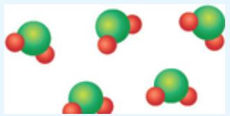</td></tr><tr><td>2. Discovery of the Electron and the Nucleus</td><td colspan="2">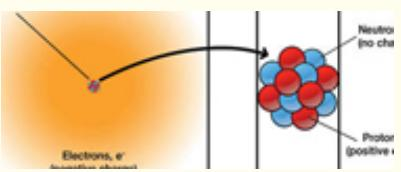</td></tr><tr><td>3. Atomic Mass, Mass Number, and Atomic Symbols: Isotopes</td><td colspan="2">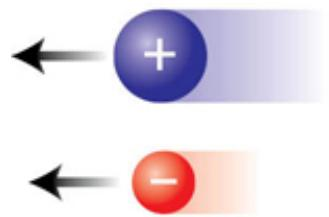</td></tr><tr><td>4. Molecular Structure</td><td colspan="2">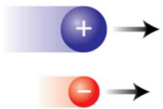</td></tr><tr><td>5. Stoichiometry, Avogadro&#x27;s Number, and Molar Mass</td><td colspan="2"></td></tr><tr><td>6. Balancing Chemical Reactions</td><td colspan="2">Step 1: Identify the correct molecular formulas $C_8H_{18} + O_2 \rightarrow CO_2 + H_2O$ </td></tr><tr><td>7. Oxidation-Reduction Reactions</td><td colspan="2"></td></tr></table>

These are the concepts that constitute the foundation for all modern studies of chemistry.

## The Atomic View of Matter

Virtually without exception, our major conceptual advances in the physical sciences have sprung from an observation or series of observations that refute the community-held views of the day, replacing those views with a radically different perspective. This was the case when the concept of a material substance called caloric was replaced by the concept that heat was not a substance but rather the transfer of thermal energy; it was the case when Copernicus demonstrated that the Earth did not sit at the center of the solar system. While we take it for granted today that material is built from atoms and the bonds they form with other atoms to form molecules, throughout a vast fraction of human history, matter was viewed as continuous. The idea that the physical material around us was divisible into specific, identifiable entities was rejected in scientific thinking until the beginning of the 19th century. In fact there were leading scientists that rejected the notion into the early part of the 20th century. A sequence of three discoveries, articulated in the form of scientific laws, changed the very foundation of how the structure of materials was viewed in science.

The first law that led to a new atomic theory of matter was formulated in 1789 by Antoine Lavoisier, shown in Figure 2.8. Lavoisier is often called the father of modern chemistry because he was the first to recognize, isolate, and name oxygen in 1778 and hydrogen in 1783. Lavoisier discovered that while matter may change its form, shape, or chemical characteristics, its mass always remains constant. In other words, mass is conserved in such transformations. This realization led Lavoisier to formulate his Law of the Conservation of Mass in 1789: In a chemical reaction, matter is neither created nor destroyed.

:::{figure} ../images/fig-p1-ch02-21.jpg
:name: fig-p1-ch02-21
:alt: FIGURE 2.8 Antoine Lavoisier, the father of modern chemistry, in his laboratory in France. Lavoisier lived from 1743 to 1794, and was beheaded in the French Revolution as a member of the French aristocracy at the age of 50.
FIGURE 2.8 Antoine Lavoisier, the father of modern chemistry, in his laboratory in France. Lavoisier lived from 1743 to 1794, and was beheaded in the French Revolution as a member of the French aristocracy at the age of 50.
:::


:::{figure} ../images/fig-p1-ch02-22.jpg
:name: fig-p1-ch02-22
:alt: Figure from the University Chemistry source textbook
:::

Positive (blue) and negative (red) electrical charge attract one another.

:::{figure} ../images/fig-p1-ch02-23.jpg
:name: fig-p1-ch02-23
:alt: Figure from the University Chemistry source textbook
:::

:::{figure} ../images/fig-p1-ch02-24.jpg
:name: fig-p1-ch02-24
:alt: Figure from the University Chemistry source textbook
:::

Positive charges repel one another. Negative charges repel one another.

:::{figure} ../images/fig-p1-ch02-25.jpg
:name: fig-p1-ch02-25
:alt: Figure from the University Chemistry source textbook
:::

Positive and negative charges of exactly the same magnitude sum to zero when combined.

It is interesting to point out that it was Lavoisier's deft discoveries of oxygen and hydrogen as gases produced and/or consumed by chemical reactions that led him to include these important gases in his analysis of both reactant and product masses involved in a chemical reaction, opening the pathway to an understanding of mass conservation. Lavoisier brought the application of high accuracy measurements of mass to the practice of chemistry, initializing a new era of analytical chemistry that remains an important part of chemistry today. Lavoisier was a member of the French aristocracy and was beheaded in the French Revolution on the 8th of May 1794 at the age of 50.

In 1799 another French chemist, Joseph Proust, shown in Figure 2.9, convinced many scientific skeptics that the elements that make up a given compound were always present in fixed proportions. Establishing this fact lead to his formulation of the Law of Definite Proportions, also known as the Law of Definite Composition, which states that: Independent of its source, a particular compound is composed of the same elements in the same fraction by mass.

:::{figure} ../images/fig-p1-ch02-26.jpg
:name: fig-p1-ch02-26
:alt: FIGURE 2.9 Joseph Proust (1754-1826), who established the Law of Definite Proportions.
FIGURE 2.9 Joseph Proust (1754-1826), who established the Law of Definite Proportions.
:::


The fraction by mass that a given element contributes is obtained by dividing the mass of each element by the total mass of the compound.

Five years later, in 1804, John Dalton, an English physicist and chemist shown in Figure 2.10, published his law of Multiple Proportions, which stated that: When two elements, A and B, react to form two different compounds, the masses of B that combine with a fixed mass of A can be expressed as a ratio of whole numbers.

:::{figure} ../images/fig-p1-ch02-27.jpg
:name: fig-p1-ch02-27
:alt: FIGURE 2.10 John Dalton (1766-1844), who developed the Atomic Theory of Matter released in 1808.
FIGURE 2.10 John Dalton (1766-1844), who developed the Atomic Theory of Matter released in 1808.
:::


Thus when two elements react to form two different compounds, they do so in a ratio of (small) whole numbers. It was clear from an analysis of Dalton's laboratory notebooks from that time, and from his discussions presented at the Manchester (England) Literacy and Philosophical Society, that he was already strongly of the opinion that matter was comprised of discrete, irreducible particles, or “atoms.”

The year modern chemistry was born was 1808 when John Dalton released his treatise A New System of Chemical Philosophy. In this work Dalton drew together the Law of the Conservation of Mass, the Law of Definite Proportions, and the Law of Multiple Proportions to create what came to be known as The Atomic Theory of Matter. In his formulations, Dalton presented four postulates that he deemed to be universally true:

1. All matter consists of discrete, indivisible particles known as atoms that cannot be created or destroyed.

2. Atoms of a given element are distinct from those of any other element and cannot be changed into atoms of another element, and a chemical reaction seems only to change the way those atoms are grouped together.

3. All atoms of a given element possess the same mass and the same chemical properties that are distinct from that of any other element.

4. Atoms of one element can combine with atoms of other elements to form chemical compounds; a given compound always has the same ratio of

those atoms.

We can immediately recognize the lineage of Dalton's atomic theory from the laws of mass conservation, definite proportions, and multiple proportions. We can also recognize the short comings—the “indivisible particles” and the notion that an “element cannot change into another.” However, while we will improve upon the atomic theory of Dalton's, his theory revolutionized chemistry as both an intellectual pursuit and a practical contributor to society.

It was nearly one hundred years before the structure of the atom was interrogated—an investigation that brought a new perspective to the structure of the atom itself.

## Discovery of the Electron

The fact that the new Dalton model of matter revolutionized the study of both physics and chemistry did not mean that the theory was complete. For example the Dalton model could not successfully explain why atoms could bond together to form molecules, why carbon and oxygen could form either carbon monoxide, CO, or carbon dioxide, $\mathrm { C O } _ { 2 } .$

It was the union of the studies of electricity and chemical composition that opened key new insights in the late 19th century. The English physicist J. J. Thomson, shown in Figure 2.11, working with evacuated tubes to which a high voltage could be applied, discovered the fact that these “atoms” were not indivisible. In fact they contained negatively charged particles that could be separated from the positive component of the atom by a strong electric field. An example of the original device used in these studies is shown in Figure 2.12—it was termed a cathode ray tube. Cathode ray tubes, as Figure 2.12 shows, consist of two electrodes, one negative—the cathode, and one positive —the anode, separated by a few centimeters of space that can be evacuated and filled with small amounts of any number of different gases. With the application of high voltage between these electrodes, a beam of light appears between the electrodes and a “current” flows through the tube. These glowing discharges were a fascination of the day, but it was J. J. Thomson who systematically studied those discharges using specifically designed tubes and using both electric and magnetic fields to study the properties of these charged entities that traversed the tube when voltage was applied. Thomson, through a series of increasingly decisive experiments, determined that those “cathode rays” were streams of particles that (1) traveled in straight trajectories, (2) were independent of the element that comprised the cathode, and (3) carried a negative charge. By studying the curvature of the trajectories of these subatomic particles, Thomson established the ratio of the particle's charge to the particle's mass—the “charge-to-mass-ratio”—demonstrating that those particles were 2000 times less massive than the hydrogen atom.

:::{figure} ../images/fig-p1-ch02-28.jpg
:name: fig-p1-ch02-28
:alt: FIGURE 2.11 J. J. Thomson (1856-1940), who discovered the existence of the electron in his laboratory with a cathode ray tube.
FIGURE 2.11 J. J. Thomson (1856-1940), who discovered the existence of the electron in his laboratory with a cathode ray tube.
:::


:::{figure} ../images/fig-p1-ch02-29.jpg
:name: fig-p1-ch02-29
:alt: FIGURE 2.12 An early simple cathode ray tube consisting of an evacuated tube, a “cathode” that was negatively charged, and an “anode” that was positively charged. High voltage applied between the anode and cathode generated a stream of elec
FIGURE 2.12 An early simple cathode ray tube consisting of an evacuated tube, a “cathode” that was negatively charged, and an “anode” that was positively charged. High voltage applied between the anode and cathode generated a stream of electrons flowing from the cathode to the anode.
:::


This discovery rewrote the atomic model—the atom was not indivisible, it contained negative particles and positive particles. The new subatomic particle discovered by Thomson was called an electron. As is quite often the case, many in the scientific community reacted with bemused disbelief. But additional experiments that tested Thomson's hypothesis proved him correct. The scientific method, in the fullness of time, is the ultimate adjudicator of disputes among scientists.

The cathode ray tube constitutes the basis for both the display tube on a television set shown in Figure 2.13 (now replaced by a flat screen system that employ, for example, liquid crystal displays—LCDs, that employ light emitting diodes—LEDs) and the “neon” signs that are simply evacuated tubes with a high voltage applied containing various mixtures of the rare gases (helium, neon, argon, etc.) that are ubiquitous in the advertising community.

:::{figure} ../images/fig-p1-ch02-30.jpg
:name: fig-p1-ch02-30
:alt: FIGURE 2.13 A modern cathode ray tube that provides precise control over the electron trajectory using both electric and magnetic fields to direct electrons to specific locations on the phosphor-coated “screen” at the cathode ray tube's ter
FIGURE 2.13 A modern cathode ray tube that provides precise control over the electron trajectory using both electric and magnetic fields to direct electrons to specific locations on the phosphor-coated “screen” at the cathode ray tube's terminus.
:::


While Thomson discovered the electron and measured the charge to mass ratio of the electron, it was the American physicist Robert Millikan, Figure 2.14, working at the University of Chicago, who determined the charge on the electron. This was extremely important, for not only did it place an absolute value on the electron charge, it also, in combination with Thomson's measurement of the charge-to-mass ratio of the electron, provided a determination of the mass of the electron itself. While some experiments in science are clean and decisive, Millikan's experiment, called the “Millikan oil drop experiment,” was anything but. Here is how it worked.

:::{figure} ../images/fig-p1-ch02-31.jpg
:name: fig-p1-ch02-31
:alt: FIGURE 2.14 Robert Millikan (1868-1953), developer of the oil drop experiment that provided the most accurate measurements of the charge on the electron.
FIGURE 2.14 Robert Millikan (1868-1953), developer of the oil drop experiment that provided the most accurate measurements of the charge on the electron.
:::


Millikan built an experimental apparatus, shown in Figure 2.15, that aspirated a mist of oil droplets into an upper chamber. A few of those tiny oil droplets passed through an opening into a second lower chamber where they passed through a collimated beam of x-rays (high energy electromagnetic radiation, Figure 2.15) that detached one or more electrons from one or more of the oil droplets. The lower chamber was comprised of an upper plate that was positively charged and a lower plate that was negatively charged. By adjusting the voltage between the two plates, the vertical velocity of the oil droplets could be controlled; in fact a given droplet could be suspended such that the force on the oil droplet resulting from the imposed electric field just balanced the gravitational force resulting from the mass of the oil droplet within the Earth's gravitational field.

:::{figure} ../images/fig-p1-ch02-32.jpg
:name: fig-p1-ch02-32
:alt: FIGURE 2.15 The Millikan oil drop experiment consists of an upper and a lower chamber. The upper chamber receives tiny drops of oil from an aspirator and then selects a very small number of those oil drops through a hole in the floor of the
FIGURE 2.15 The Millikan oil drop experiment consists of an upper and a lower chamber. The upper chamber receives tiny drops of oil from an aspirator and then selects a very small number of those oil drops through a hole in the floor of the upper chamber. Those selected oil droplets pass into the lower chamber where an x-ray beam removes one or more electrons from the oil droplet. An adjustable electric field between the lower and upper plate controls the descent rate of the particle observed by a microscope.
:::


The experimental complement, as shown in Figure 2.15, was complete with the addition of a microscope that provided the identification of a single oil droplet that could be manipulated with the electric field to reveal both its mass by measuring its fall velocity (cross checked by observing its size and knowing the density of the oil) and its charge by determining the electric field necessary to suspend it motionless in the gravitational field. Millikan's strategy was to observe a large number of cases, which would include a range of integral numbers of electrons removed by the x-ray beam, then solve for the minimum incremental charge.

This work was completed in 1909, yielding a charge on the electron of $\mathbf { - 1 . 6 0 2 \times 1 0 ^ { - 1 9 } }$ coulombs or $\mathbf { - 1 . 6 0 2 \times 1 0 ^ { - 1 9 } C }$ . This value is within 1% of the value accepted today after decades of refinement.

When combined with Thomson's measurement of $- 5 . 6 8 6 \times 1 0 ^ { - 1 2 } \mathrm { k g / C }$ for the mass-to-charge ratio of the electron using his modified cathode ray tube, it was then possible to calculate the mass of the electron:

```{math}
:label: eq-p1-ch02-9
\begin{array}{r l} \text { Mass   of   Electron } & = (\text { mass / charge }) _ {\text { elec }} \times (\text { charge }) _ {\text { elec }} \\ & = (- 5. 6 8 6 \times 1 0 ^ {- 1 2} \mathrm{kg/C}) (- 1. 6 0 2 \times 1 0 ^ {- 1 9} \mathrm{C}) \\ & = 9. 1 0 9 \times 1 0 ^ {- 3 1} \mathrm{kg} \end{array}
```


As we will see in the chapters that follow, chemical behavior is dominated first and foremost by electrons! And this control of chemical reactivity by electrons is in large measure a result of its charge, coupled with the exceedingly small mass of this component of atomic structure.

## Check Yourself 1

On a dry day you often notice that after walking on a rug you build up a “static charge” that is released as a spark when you touch another person.

1. If you accumulate a charge of $- 2 5 \mu \mathrm { C }$ (microcoulombs), how many excess electrons have you accumulated?

2. How many electrons are required to produce a charge of -1.0 coulombs?

3. What is the mass of -1.0 coulombs of electrons?

## Discovery of the Atomic Nucleus

While Thomson's discovery of the electron was irrefutable, and in conjunction with Millikan's work demonstrated that the electron was but a tiny fraction of the mass of the lightest atom—hydrogen—the scientific world was confronted with a major mystery. What was the structure of the atom? The first answer to this was a new model of the atom, a model put forth by Thomson himself. That model was the “plum-pudding” model; an atomic structure characterized by a continuous, positively charged sphere (the pudding) punctuated by an occasional electron.

But Thomson was intent on testing his model of the atomic structure. After all, if he was wrong he wanted to be the first one to know. A powerful motivator leading to good science!

Thus Ernest Rutherford, a young New Zealander, shown in Figure 2.16, who had worked with Thomson and was a proponent of the “plum-pudding” model, decided to use an important new discovery—radioactivity—as a new experimental tool. Henri Becquerel and Marie Curie, shown in Figure 2.17, discoverers of radioactivity, had identified three distinct forms of radioactivity: alpha (α) particles, beta (β) particles, and gamma (γ) rays. Those will be treated in some detail in Chapter 13.

:::{figure} ../images/fig-p1-ch02-33.jpg
:name: fig-p1-ch02-33
:alt: FIGURE 2.16 Ernest Rutherford (1871-1937), shown in the laboratory with his apparatus used to discover the nuclear architecture of atomic structure.
FIGURE 2.16 Ernest Rutherford (1871-1937), shown in the laboratory with his apparatus used to discover the nuclear architecture of atomic structure.
:::


:::{figure} ../images/fig-p1-ch02-34.jpg
:name: fig-p1-ch02-34
:alt: FIGURE 2.17 Madame Marie Curie (1867-1934), codiscoverer of radio activity, pioneered the study of isotopes and won two Nobel prizes.
FIGURE 2.17 Madame Marie Curie (1867-1934), codiscoverer of radio activity, pioneered the study of isotopes and won two Nobel prizes.
:::


The α particles had the attributes Rutherford needed—they were massive (relative to the electron) and they were emitted from radioactive elements at high velocity. In setting out to confirm Thomson's model, Rutherford built an experimental apparatus that was remarkably simple but powerful in its decisive ability to test this new model of atomic structure. As noted, that model of atomic structure was built on the notion of a continuous sphere of positive charge containing the majority of mass that has electrons of equal total negative charge distributed through the sphere. That model is graphically depicted in the left panel of Figure 2.18. The apparatus that Rutherford built to verify the plum-pudding model is displayed in Figure 2.19, and consists of (1) a radioactive source centered within a lead block that serves to collimate a beam of α particles emitted from the source, (2) a thin target of gold only a few molecules in thickness, and (3) a circumferential target that detects α particles scattered from the target and identifies the angle of the scattered α particles.

:::{figure} ../images/fig-p1-ch02-35.jpg
:name: fig-p1-ch02-35
:alt: FIGURE 2.18 A diagram comparing the “plum-pudding” model of atom structure with that of the nuclear model.
FIGURE 2.18 A diagram comparing the “plum-pudding” model of atom structure with that of the nuclear model.
:::


:::{figure} ../images/fig-p1-ch02-36.jpg
:name: fig-p1-ch02-36
:alt: FIGURE 2.19 A schematic of the apparatus used by Rutherford to establish the nuclear model of atomic structure.
FIGURE 2.19 A schematic of the apparatus used by Rutherford to establish the nuclear model of atomic structure.
:::


In the opening phases of the experiment in 1909, Rutherford believed he had confirmed Thomson's plum-pudding model. Virtually all the detected α particles displayed little or no deflection from a straight trajectory. But as the data set evolved to include more and more observations, a remarkable and at first unbelievable conclusion emerged. Approximately one in 20,000 α particles was scattered back toward the source!

As the data base grew it became increasingly clear that approximately one α particle in 20,000 possessed a trajectory that carried the particle backwards in the direction of the source, as shown in the right-hand panel in Figure 2.18 and in Figure 2.19. This was an unexpected result for Rutherford because it refuted the plum-pudding model he had intended to verify with his experimental strategy. Rutherford's now famous comment was that the results were “about as credible as if you had fired a 15-inch shell at a piece of tissue paper and it came back and hit you.” But continuing experiments proved these observations to be correct. An entirely new model of atomic structure was required and Rutherford provided that new model. He reasoned that the mass association with the positive charge which constituted the dominant fraction of the mass present, must be a highly concentrated point mass. This implied a structure of the atom with a positively charged central “nucleus” that was largely empty space within which very small negatively charged electrons resided. The contrast between the “plum-pudding” model and the “nuclear model” is displayed in Figure 2.18.

Rutherford thus proposed a nuclear theory of the atom with three primary components:

1. A nucleus that contains the positive charge and virtually all the mass of the atom.

2. Virtually the entire volume of the atom is empty space with extremely small electrons dispersed within that volume.

3. The number of positively charged particles in the nucleus (called protons) is equal to the number of negatively charged electrons.

Yet again the world of atomic structure was fundamentally and irreversibly transformed, this time by Rutherford's nuclear model. However, it was immediately clear that the mass of the nucleus was not simply an ensemble of positively charged particles because while helium had two electrons, it had a mass four times that of hydrogen. It was Rutherford working with a student, James Chadwick, who demonstrated two decades later, that the unaccounted for mass was explained by the existence of another subatomic particle. That particle resided in the nucleus and was of approximately the same mass as the proton, but carried no intrinsic charge. The particle was called the neutron.

We can now summarize the view of the atom with a graphic, shown in Figure 2.20, depicting the nucleus residing at the center of an electron cloud. The diameter of the electron cloud is approximately ${ \bf 1 0 } ^ { - 1 0 }$ meters, but the nucleus is 5 orders of magnitude smaller in diameter, approximately ${ \bf 1 0 } ^ { - 1 5 }$ meters. The nucleus contains protons that possess a positive charge and neutrons that contain no charge. The mass of the proton is $\mathbf { 1 . 6 7 2 6 2 \times 1 0 ^ { - 2 7 } }$ kg and the mass of the neutron is $\mathbf { 1 . 6 7 4 9 3 \times 1 0 ^ { - 2 7 } }$ kg. While the nucleus contains $9 9 . 9 7 \%$ of the atom's mass, it occupies one quadrillionth the volume. The density (mass/volume) of the nucleus is thus remarkable by any standard we are normally acquainted with. The density of the nucleus can be calculated from the diameter and the mass and is approximately $\mathbf { 1 0 ^ { 1 8 } ~ k g / m ^ { 3 } }$ . Lead, which we regard as a high-density material, has a density of approximately 1 $\times ~ 1 0 ^ { 4 } ~ \mathrm { k g / m ^ { 3 } }$ , which is $1 0 ^ { 1 4 }$ times less dense than nuclear material. There are many interesting comparisons. A nucleus the size of a period in this text would weigh approximately 100,000 kg (100 tons); a coin the size of a penny would weigh $3 \times 1 0 ^ { 1 2 }$ kg (6 billion tons!). We can summarize the properties of the subatomic particles in Table 2.1.

:::{figure} ../images/fig-p1-ch02-37.jpg
:name: fig-p1-ch02-37
:alt: FIGURE 2.20 Diagram contrasting the scale of the size of the atom to that of the nucleus.
FIGURE 2.20 Diagram contrasting the scale of the size of the atom to that of the nucleus.
:::


TABLE 2.1

<table><tr><td></td><td>Mass (kg)</td><td>Mass (amu)</td><td>Charge (relative)</td><td>Charge (C)</td></tr><tr><td>Proton</td><td> $1.67262 \times 10^{-27}$ </td><td>1.00727</td><td>+1</td><td> $+1.60218 \times 10^{-19}$ </td></tr><tr><td>Neutron</td><td> $1.67493 \times 10^{-27}$ </td><td>1.00866</td><td>0</td><td>0</td></tr><tr><td>Electron</td><td> $0.00091 \times 10^{-27}$ </td><td>0.00055</td><td>-1</td><td> $-1.60218 \times 10^{-19}$ </td></tr></table>

It is a common procedure to assign masses to protons, neutrons, and atoms in terms of atomic mass units or amu. One amu is equal to 1.66054 × $\mathbf { 1 0 ^ { - 2 7 } }$ kg so that the mass of an element in amu is essentially a count of the number of protons and neutrons in the nucleus.

## Check Yourself 2

Rutherford's discovery of the structure of the atom through his discovery of the nucleus and the size and (subsequently) the mass of the nucleus established important relationships with the electron.

1. How many electrons would it take to equal the mass of a proton?

2. A carbon atom has six protons and six neutrons. How many electrons would it take to equal the mass of the carbon nucleus?

3. Considering Figure 2.20, what is the ratio of the volume of the atom to the volume of the nucleus?

## Atomic Number, Mass Number, and Atomic Symbol

The atomic number of a given element is equal to the number of protons in the nucleus of that element, and is thus equal to the number of electrons the element possesses. The key point is that what makes an element distinct, what defines its chemical properties, is the number of electrons it possesses in its electrically neutral configuration. That is, when the number of electrons and protons are equal. Thus the number of protons defines the element. All atoms of a particular element have the same atomic number and that atomic number is equal to the number of protons present in the nucleus. Each element thus has a different atomic number from every other element. As we will see it is the number of electrons an element has that determines the chemical characteristics of an atom, so therefore each element is designated by its atomic number. The atomic number is designated by the symbol Z as displayed in Figure 2.21.

:::{figure} ../images/fig-p1-ch02-38.jpg
:name: fig-p1-ch02-38
:alt: Figure from the University Chemistry source textbook
:::

:::{figure} ../images/fig-p1-ch02-39.jpg
:name: fig-p1-ch02-39
:alt: Figure from the University Chemistry source textbook
:::

An atom of carbon-12

:::{figure} ../images/fig-p1-ch02-40.jpg
:name: fig-p1-ch02-40
:alt: Figure from the University Chemistry source textbook
:::

An atom of oxygen-16

:::{figure} ../images/fig-p1-ch02-41.jpg
:name: fig-p1-ch02-41
:alt: Figure from the University Chemistry source textbook
:::

:::{figure} ../images/fig-p1-ch02-42.jpg
:name: fig-p1-ch02-42
:alt: Figure from the University Chemistry source textbook
:::

An atom of uranium-235

:::{figure} ../images/fig-p1-ch02-43.jpg
:name: fig-p1-ch02-43
:alt: Figure from the University Chemistry source textbook
:::

An atom of uranium-238

:::{figure} ../images/fig-p1-ch02-44.jpg
:name: fig-p1-ch02-44
:alt: FIGURE 2.21 A series of comparisons between atom number, mass number, and the atomic symbol to designate the distinction between some important elements.
FIGURE 2.21 A series of comparisons between atom number, mass number, and the atomic symbol to designate the distinction between some important elements.
:::


This mass number of an atom is equal to the total number of protons and neutrons contained in the nucleus. The mass number is designated by the symbol A, also in Figure 2.21.

This gives rise to the convention of designating each element by its atomic symbol with the mass number as a superscript and the atomic number as a subscript as displayed in Figure 2.21. All carbon atoms have 6 protons. The common form of carbon also has 6 neutrons so we write this form of carbon as $^ { 1 2 } _ { 6 } \mathrm { C }$ . The most common form of helium has 2 protons and 2 neutrons so we write $^ { 4 } _ { 2 } \mathrm { H e }$ . As the nucleus gets larger, the number of protons and neutrons is no longer equal as we will investigate in Chapter 13. For example, the stable form of uranium has 92 protons and $1 4 6$ neutrons and is thus designated $^ { 2 3 8 } _ { \ 9 2 } \mathrm { U }$

A word about the chemical symbols. In a majority of cases, there is an obvious relationship between the chemical symbol and the name of the elements. Oxygen is O, carbon is C, neon is Ne, bromine is Br, etc. However, just to make things interesting, some of the chemical symbols are drawn from their Latin names. The symbol for tin is Sn from the Latin stannum; the symbol for sodium is Na from the Latin natrium.

## Isotopes

While all atoms of a given element have the same number of protons, the same number of electrons, and the same chemical symbol, all atoms of a given element do not necessarily have the same number of neutrons. Thus all atoms of a given element do not necessarily have the same mass. Atoms with the same number of protons but with a different number of neutrons are called isotopes of that element. Isotopes are ubiquitous and they are profoundly important to nearly all branches of science from medical research to nuclear energy to paleobiology.

Perhaps the most famous example of the distinction between isotopes in light elements is that of carbon. There are three important isotopes of carbon. Carbon 12 is the common form, with six protons and six neutrons, carbon 13 has six protons and seven neutrons, and carbon 14 has six protons and eight neutrons. As we will examine in more detail in Chapter 13, carbon 12 and carbon 13, written $^ { 1 2 } 6 \mathrm { C }$ and $^ { 1 3 } 6 ,$ are stable isotopes. That is, they remain a carbon 12 or a carbon 13 and do not “decay” into other nuclei by the loss of a neutron. Carbon 14, written $^ { 1 4 } 6 ,$ is radioactive and decays to stable nitrogen $^ { 1 4 } _ { 7 } \mathrm { N }$ with the emission of particles from the nuclei, as we will discuss in Chapter 13. Carbon $^ { 1 4 }$ is formed in the upper atmosphere by the collision of a stable nitrogen 14 and a high-energy neutron. The carbon 14 so formed is incorporated continuously into living organisms, built from the $\mathrm { C O } _ { 2 }$ present in the atmosphere. When the organism dies, carbon 14 is no longer incorporated, and carbon 14 decays with the emission of radioactivity such that with time, the number of radioactive events per unit mass, within the organism that has died, decreases. This provides a clock timing the delay from the death of the organism to the present. The method, termed radiocarbon dating, developed by Willard Libby, shown in Figure 2.22, at the University of Chicago in 1947, has revolutionized our ability to determine the age of artifacts obtained from ancient sites. The details of the method will be presented in Chapter 13 on nuclear chemistry. The use of isotopes has spread to virtually every branch of modern science, and is a subject we will revisit often in the course.

:::{figure} ../images/fig-p1-ch02-45.jpg
:name: fig-p1-ch02-45
:alt: FIGURE 2.22 Willard F. Libby (1908-1980).
FIGURE 2.22 Willard F. Libby (1908-1980).
:::


## Check Yourself 3

Problem: The electronics industry uses silicon (Si) in large quantities. Moreover, computers engage state-of-the-art electronics so Si is a dominant element in modern industry and society. Analysis demonstrates that Si occurs in three naturally occurring isotopes: <sup>30</sup>Si, <sup>29</sup>Si, and <sup>28</sup>Si. Given these three isotopes, determine the number of electrons, neutrons, and protons in each of these isotopes.

Solution: First, recognize that the mass number, A, is given by the superscript in each of the silicon isotope designations. Next, recall that the mass number is the sum of the neutrons and protons in the nucleus of each isotope.

When we consider the periodic table, provided with this text, we note that the atomic number, Z, of Si provides us with the number of electrons and protons that is common to all isotopes of Si. Thus with an atomic number $Z = \ 1 4$ for Si, we can calculate the number of protons, neutrons and electrons.

1) <sup>30</sup>Si has 14 electrons, 30 - 14 = 16 neutrons and 14 protons.

2) <sup>29</sup>Si has 14 electrons, 29 - 14 = 15 neutrons and 14 protons.

3) <sup>28</sup>Si has 14 electrons, 28 - 14 = 14 neutrons and 14 protons.

Exercise: How many electrons, protons and neutrons are in (1) $^ { 1 3 1 } _ { 5 3 } X$ (2) $^ { 4 1 } _ { 2 0 } \mathrm { R }$ (3) Q?

Identify each of the elements represented by X, R, and Q.

## Molecular Structure

When we move from a discussion of the elements to a discussion of the molecules and compounds constructed from those atoms such as the enzyme shown in Figure 2.23, which can convert $\mathrm { C O } _ { 2 }$ to $\mathrm { C _ { 2 } O _ { 4 } }$ , we enter into a world of profound variety and nearly limitless options. When we consider the variety of chemical properties exhibited by the array of chemical compounds available in nature relative to the range of properties of the elements themselves, it is as though we were to compare the range of options in the expression of ideas using a fully developed language compared to what is available with just the letters used to create the "alphabet" of that language. So it is with chemistry.

:::{figure} ../images/fig-p1-ch02-46.jpg
:name: fig-p1-ch02-46
:alt: FIGURE 2.23 Before we can both think about and converse about molecular structures, we must name the molecular structures. Shown here is the conversion of mathematical notation to the anion mathematical notation , the ethanedioate anion, wh
FIGURE 2.23 Before we can both think about and converse about molecular structures, we must name the molecular structures. Shown here is the conversion of ${ \mathsf { C O } } _ { 2 }$ to the anion $\mathsf { C } _ { 2 } \mathsf { O } _ { 4 } { } ^ { 2 - }$ , the ethanedioate anion, which results in the extraction of ${ \mathsf { C O } } _ { 2 }$ produced by fossil fuel combustion.
:::


While the remarkable variety in chemical properties available to us represents a powerful opportunity, we must first acquire a working knowledge of how these compounds are constructed and how they are named. We note this close relationship between the structure of compounds and the strategy for naming them as an important general point. It is also true that many of the conventions used in the naming of compounds are based on historical evolution, not on a logical protocol. This is unfortunate, but such is the case with any language.

The change in chemical and physical properties that occurs when elements combine to form a compound comprised of those same atoms is remarkable indeed. When we ignite a mixture of hydrogen and oxygen, we begin with the most commonly occurring form of pure hydrogen (diatomic hydrogen gas, $\mathrm { H } _ { 2 } )$ and react that $\mathrm { H } _ { 2 }$ with the most commonly occurring form of pure oxygen (diatomic oxygen $\mathrm { g a s } , \mathrm { O } _ { 2 } )$ , the product is a liquid at room temperature; $\mathrm { H } _ { 2 } \mathrm { O }$ Water is, as we will see repeatedly in this text, the single most important molecule to life on this planet and bear virtually no relationship in any chemical or physical sense to the gases, $\mathrm { H } _ { 2 }$ and $\mathrm { O } _ { 2 } ,$ that react to produce it. There are other striking examples. We combine, as displayed in Figure 2.24, the most commonly occurring pure form of chlorine, the diatomic gas $\mathrm { C l } _ { 2 } ,$ which is a highly toxic gas, with the most commonly occurring form of sodium, the solid metal that bursts into flames when placed in water, and the product is a crystalline structure sodium chloride, NaCl. Thus we combine two toxic, highly reactive elements to form a compound that resides on every dinner table and is used universally with the food we eat. How can this be?

Envisioning a Chemical Reaction

Sodium Metal

Chlorine Gas

:::{figure} ../images/fig-p1-ch02-47.jpg
:name: fig-p1-ch02-47
:alt: Figure from the University Chemistry source textbook
:::

Sodium Chloride Crystal

FIGURE 2.24 We can track, at the molecular level, the formation of NaCl from chlorine gas and sodium metal.

:::{figure} ../images/fig-p1-ch02-48.jpg
:name: fig-p1-ch02-48
:alt: Figure from the University Chemistry source textbook
:::

“Chlorine is a deadly poison gas employed on European battlefields in World War I. Sodium is a corrosive metal which burns upon contact with water. Together they make a placid and unpoisonous material, table salt. Why each of these substances has the properties it does is a subject called chemistry.”

—Carl Sagan

While we are concerned with virtually hundreds of thousands of compounds, we note that only a small number of elements actually occur free in nature. The noble gases—helium (He), neon (Ne), argon (Ar), krypton (Kr), xenon, (Xe), and radon (Rn)—are so inert that they do not react with other elements to form compounds but exist in air as separate atoms. As we have seen, hydrogen, oxygen, and nitrogen occur in their most common elemental states as $\mathrm { H } _ { 2 } , \mathrm { ~ O } _ { 2 } ,$ and $\mathrm { N } _ { 2 } .$ Sulfur occurs as $\mathbf { S } _ { 8 } .$ Carbon occurs in extensive, nearly pure, deposits as coal. A limited number of metals exist in the Earth's crust in pure elemental form, most notably copper (Cu), silver (Ag), gold (Au), and platinum (Pt).

In the formation of chemical bonds, it is the electrons that form the bond to which we now turn our attention. In the formation of any chemical bond, the electrons position themselves so as to achieve the strongest bond—that is, to minimize the potential energy of the combination of electrons and protons. The electrons are said to “delocalize” from their position around the free, unbound atom in order to achieve the bond associated with the formation of the chemical compound created from its constituent atoms.

When we consider the formation of a chemical bond, we begin with two positively charged nuclei and a swarm of negatively charged electrons. By what miracle could that mix of attracting and repelling entities ever form a stable molecule? It is in fact remarkable indeed. We began with two nuclei, both of which strongly repel, and we move them to within a very small distance so, by Coulomb's law (which states that the force between two charges is proportional to the product of the charges divided by the square of the distance between them), the repulsive force between them is very large. We then place the electrons within the surrounding volume, and while there are an equal number of positive and negative charges, there is no guarantee that the mixture of electrons and nuclei constitutes a stable structure. In contemplating the positioning of the electrons to provide for the possibility of a stable bond, we recognize that if the electrons were positioned preferentially between the nuclei, two objectives would be achieved. First, the presence of the electrons would, by virtue of their negative charge, attract the positive charge of the nuclei toward the center of the chemical bond. Second, the presence of the cloud of negative electrons between the nuclei would “shield” the positive charge of the first nucleus from the positive charge of the second nucleus, thus reducing the repulsion between them.

It turns out, though it is by no means obvious, that this preferential placement of electrons between the nuclei is just, by a very small margin, adequate to form a stable union among the nuclei and the swarm of electrons.

:::{figure} ../images/fig-p1-ch02-49.jpg
:name: fig-p1-ch02-49
:alt: Figure from the University Chemistry source textbook
:::

G. N. Lewis (1875- 1946)

This sharing of electrons between two nuclei was the idea behind the development of the first systematic theory of the chemical bond by G. N. Lewis, who published his ideas beginning in 1916. Applied to a hydrogen molecule, $\mathrm { H } _ { 2 } ,$ the Lewis theory postulated that a hydrogen molecule is formed when two atoms come together with the sharing of the electron donated by each atom to the bond:

```{math}
:label: eq-p1-ch02-10
\mathrm{H} ^ {\bullet} +. \mathrm{H} \longrightarrow \mathrm{H}: \mathrm{H}
```


The diagram on the right, with the electron pair shared by the newly formed $\mathrm { H } _ { 2 }$ molecule, is called a Lewis structure and we can represent that chemical bond in any number of ways as shown below:

```{math}
:label: eq-p1-ch02-11
\mathrm{H:H}
```


```{math}
:label: eq-p1-ch02-12
\mathrm{H} - \mathrm{H}
```


:::{figure} ../images/fig-p1-ch02-50.jpg
:name: fig-p1-ch02-50
:alt: Figure from the University Chemistry source textbook
:::

While this chemical bond that binds two hydrogen atoms to form an $\mathrm { H } _ { 2 }$ molecule is the simplest bond in chemistry, it still requires significant computing power to quantitatively and accurately calculate the bond strength because the strength of the bond depends upon the small difference between large numbers: the mutual repulsion of the electrons, the mutual repulsion of the protons, and the attraction of the electron-proton interaction.

This electron dot Lewis diagram represents the classic electron pair bond defining the sharing of electrons between the nuclei that seek to fill the available electron positions, so as to achieve an electron configuration that emulates the closed shell structure of the stable noble gases. In the case of $\mathrm { H } _ { 2 } ,$ the electron pair constitutes a “closed shell” that emulates the first noble gas, helium. This type of shared electron bond is called a covalent bond, and it is the most common category of bonding in chemistry. But hydrogen and helium occupy only the first row in the periodic table. For elements in the second and third rows of the periodic table, observational evidence demonstrates that the requirement of a “closed shell” requires an octet (8) of valence, or outer shell, electrons. For example a hydrogen atom, with one electron, will form a chemical bond with atomic chlorine, with seven electrons, to form the HCl molecule (hydrogen chloride) with eight electrons forming an "octet" of electrons about the Cl atom and a pair of shared electrons between H and Cl.

```{math}
:label: eq-p1-ch02-13
\mathrm{H} \cdot + \stackrel {\bullet} {\mathrm{Cl}}: \longrightarrow \mathrm{H}: \stackrel {\bullet} {\mathrm{Cl}}:
```


However, there is an important pattern in the periodic table wherein, as we move to the right-hand side, the propensity for the atoms to attract electrons increases. The ability of an atom of an element to draw electrons to it is called electronegativity. The greater the attractive power of an atom to draw electrons to it in a chemical bond, the greater is its electronegativity. Thus in the formation of the bond between H atoms (from the left-hand side of the periodic table) and Cl atoms (from the right-hand side), electrons are preferentially drawn toward the chlorine atom in HCl even though the bonding electrons are still viewed as “shared.”

There are important cases, however, where the sharing becomes sufficiently unequal that one of the atoms in the bond effectively removes an electron from the less electronegative atom forming a positive ion, a cation, and a negative ion, an anion. This is the case for a metal, sodium, bonding to a chlorine atom. We can represent this case with a diagram.

```{math}
:label: eq-p1-ch02-14
\mathrm{Na} ^ {\bullet} + \cdot \stackrel {\bullet \bullet} {\mathrm{Cl}}: \longrightarrow \mathrm{Na} ^ {+}: \stackrel {\bullet \bullet} {\mathrm{Cl}}:
```


Sodium, in the act of losing an outer “valence” electron, is left with an inner electron “core” like that of the noble gas neon. Chlorine, with the addition of a single electron from sodium, acquires an electron configuration of argon, another noble gas.

We thus have two ions, $\mathrm { N a ^ { + } }$ and Cl<sup>-</sup>, that attract one another directly as two opposite charges with a force simply calculated from Coulomb's law. This type of bond is called an ionic bond.

While all chemical bonds are formed from the rearrangement of electron positions around the nuclei of the atoms that comprise the molecules within any compound, it is common practice to classify chemical bonds according to two categories:

1. The case where an electron is almost completely transferred from one atom to another. This is called an ionic bond because the element donating the electron becomes a positive ion, or cation. The atom that receives the electron becomes a negative ion, or anion.

2. The case where electrons belonging to the atoms involved in a chemical bond are shared between the atoms that comprise the bond. This is termed a covalent bond.

Development of the theory behind chemical bond formation occupies Chapters 11 and 12, but it is important to develop here the relationship between the structure of bonds and naming of compounds associated with their bond structures.

## Chemical Formulas

In the representation of the bonding structure of chemical compounds there is a hierarchy of complexity employed that is determined by the degree of detail required to transmit the chemical information in question. We will consider here both the convention for molecules and molecular compounds and for ions and ionic compounds. We begin with formulas for molecular compounds. The simplest and most commonly used representation is the chemical formula that indicates the elements present in the compound and the number of atoms or ions of each element. The most common example of a molecular formula for a molecular compound is for water, $_ \mathrm { H _ { 2 } O }$ . The second most common example of the molecular formula is, arguably, for carbon dioxide, $\mathrm { C O } _ { 2 } .$ . There are two points to observe with the molecular formula. First, the subscript indicates the number of atoms of each element present in the molecule. Second, notice that the least electronegative atom is listed first and the more electronegative atom is listed second. The same is true for carbon tetrachloride, $\mathrm { C C l } _ { 4 }$

## Chemical Formulas and Molecular Models

The next level of complexity representing molecular bond formation introduces the structural formula, which employs lines representing the covalent bonds that link the atoms together in the molecular structure. For example we write the structural formula for water as $\mathrm { H } - \mathrm { O } - \mathrm { H } _ { \mathrm {  } }$ , for carbon dioxide $0 - \mathbf { C } - \mathbf { O } _ { \mathrm { i } }$ , and for hydrogen peroxide $\mathrm { H } - \mathrm { O } - \mathrm { O } - \mathrm { H }$ . However, many molecules are not inherently linear. In fact neither water nor hydrogen peroxide are linear. Thus, it is typical to represent the geometric structure of a molecule more fully in the structural formula by including an approximate representation of bond geometry in the structural formula. Thus the structural formula for water becomes

```{math}
:label: eq-p1-ch02-15
\mathrm{H} - \mathrm{O} - \mathrm{H} \longrightarrow_ {\mathrm{H}} ^ {\mathrm{O}} \backslash_ {\mathrm{H}}
```


indicating the bent geometry of this important molecule.

The structural formula for hydrogen peroxide becomes

```{math}
:label: eq-p1-ch02-16
\mathrm{H} - \mathrm{O} - \mathrm{O} - \mathrm{H} \longrightarrow_ {\mathrm{H}} \mathrm{O} - \mathrm{O} ^ {\mathrm{H}}
```


The structural formula quite often also includes the existence of double bonds so the structural formula for carbon dioxide becomes

```{math}
:label: eq-p1-ch02-17
\mathrm{O-C-O} \longrightarrow \mathrm{O=C=O}
```


indicating a linear geometry but with two double bonds, one each between the carbon center and the oxygen end members. As we will see, many important molecules have increasingly complex geometries that while not fully captured by the structural formula are nevertheless approximated. Two important examples are methane:

:::{figure} ../images/fig-p1-ch02-51.jpg
:name: fig-p1-ch02-51
:alt: Figure from the University Chemistry source textbook
:::

and ammonia:

:::{figure} ../images/fig-p1-ch02-52.jpg
:name: fig-p1-ch02-52
:alt: Figure from the University Chemistry source textbook
:::

An important molecule that demonstrates the way a structural formula captures both geometric structure and the distinction between single and double bonds is benzene:

:::{figure} ../images/fig-p1-ch02-53.jpg
:name: fig-p1-ch02-53
:alt: Figure from the University Chemistry source textbook
:::

## Molecular Models

The next level of sophistication is the representation of the threedimensional structure of a molecule using either a ball-and-stick model or a space-filling model. This ability to capture the 3D geometry of a molecule becomes increasingly important as we develop the relationship between structure and function in chemical reactions.

An important example is methane, $\mathrm { C H } _ { 4 }$ , shown in Figure 2.25, a molecule involved in every issue from global energy (“natural gas” is largely $\mathrm { C H } _ { 4 } )$ to molecular synthesis $\mathrm { ( C H } _ { 4 }$ is the starting material for many polymers). We can use methane to compare and contrast the molecular formula, structural formula, ball-and-stick model, and space-filling model as shown in Figure 2.25.

:::{figure} ../images/fig-p1-ch02-54.jpg
:name: fig-p1-ch02-54
:alt: FIGURE 2.25 Displayed from left to right for methane are its molecular formula, its structural formula, its ball-and-stick model, and its space-filling model.
FIGURE 2.25 Displayed from left to right for methane are its molecular formula, its structural formula, its ball-and-stick model, and its space-filling model.
:::


In stepping from the structural formula of methane to the ball-and-stick model, the tetrahedral structure of the molecule is revealed. In the transition from the ball-and-stick model to the space-filling model, the volume actually occupied by the bonding electrons is revealed. With the advent of increasingly sophisticated calculations of molecular structure, the space-filling model can be further refined by the use of color to represent the degree of delocalization of electron density in the bonding structure. Throughout the chapters in the book we will select from the various options for representing molecules depending on the required detail. Table 2.2 summarizes the comparison between the name of the compound, the molecular formula, the structural formula, and the ball-and-stick model for a few important examples.

TABLE 2.2 Benzene, Acetylene, Glucose, and Ammonia

<table><tr><td>Name of Compound</td><td>Molecular Formula</td><td>Structural Formula</td><td>Ball-and-Stick Model</td></tr><tr><td>Benzene</td><td> $C_6H_6$ </td><td>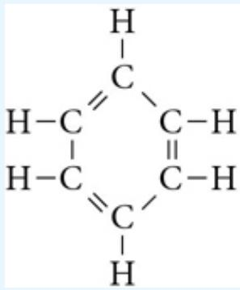</td><td>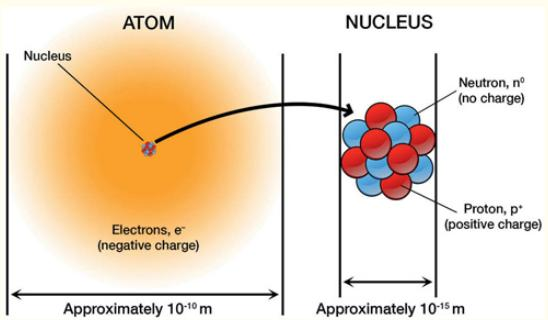</td></tr><tr><td>Acetylene</td><td> $C_2H_2$ </td><td>H-C≡C-H</td><td>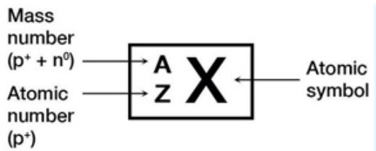</td></tr><tr><td>Glucose</td><td> $C_6H_{12}O_6$ </td><td>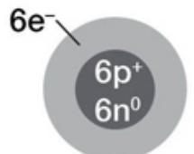</td><td>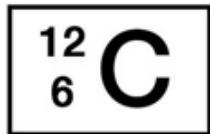</td></tr><tr><td>Ammonia</td><td> $NH_3$ </td><td>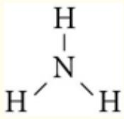</td><td>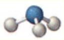</td></tr></table>

For the case of an ionic substance that contains a net positive or negative charge, that net charge is indicated with a bracket and a superscript indicating the net charge. Displayed here are the ball-and-stick models for the anions phosphate and carbonate.

:::{figure} ../images/fig-p1-ch02-62.jpg
:name: fig-p1-ch02-62
:alt: Figure from the University Chemistry source textbook
:::

## Stoichiometry

Counting matters. We practice this every day in our transactions with money where we routinely give or receive increments of currency counted to the penny. Individuals, corporations, governments—they all use “money” as a transaction tool for counting that extends internationally from country to country through currency exchange rates. While we take the counting of dollars, euros, yuans, yen, etc. for granted, in chemistry we must develop a consistent, universally accepted approach to counting—but in this case we must count electrons, nuclei, atoms, and molecules. But we must also link the microscopic world with the macroscopic world. We must link the world of atoms and molecules with the world of grams, liters, joules, and kilowatthours.

Undeniably, chemistry carries the sense of an intense and disciplined marketplace with spontaneous trading, with electrons—most notably valence electrons—serving as the exchanged and rearranged currency in the market of chemical change.

In order to execute calculations in the domain of chemistry, first we must be aware that matter is composed of specific combinations of atoms and molecules and second we must link this microscopic picture of matter through established quantitative relationships linking that understanding with useful calculations in our macroscopic world. The study of this quantitative link between the microscopic and the macroscopic is termed stoichiometry. Stoichiometry is derived from the Greek words stoicheoin, meaning element, and metron, meaning measure. It is the mathematics of chemical amounts, weights, and measures, and a facility with it opens doors to profoundly valuable calculations in the marketplace of modern society.

## The Framework of Stoichiometry

To set up our examination of stoichiometry, we review some fundamentals. From the most basic perspective, a chemical reaction is a microscopic collision between individual atoms or molecules and some integral number of particles are converted to some other integral number of particles. The microscopic transformation is represented in a concise form by a chemical equation:

```{math}
:label: eq-p1-ch02-18
\mathrm {2H_ {2} + O_ {2} \rightarrow 2H_ {2} O}
```


which represents the combination of two hydrogen molecules with one oxygen molecule to yield two water molecules. The stoichiometric coefficients are the factors by which each of the reactants and each of the products are multiplied so as to ensure that the number of atoms of each element are the same on both sides of the chemical reaction. In this case the stoichiometric coefficient is two for both $\mathrm { H } _ { 2 }$ and $_ \mathrm { H _ { 2 } O }$ and is one for $\mathrm { O } _ { 2 } .$ . We can model this reaction at the molecular level:

:::{figure} ../images/fig-p1-ch02-63.jpg
:name: fig-p1-ch02-63
:alt: Figure from the University Chemistry source textbook
:::

While on the face of it, the link between the chemical equation and the graphic representing one oxygen molecule combining with two hydrogen molecules to yield two water molecules is a straightforward visualization, it is a rearrangement with nothing created nor destroyed. Four hydrogen atoms and two oxygen atoms go in, four hydrogen atoms and two oxygen atoms emerge from the rearrangement. But to be more specific (because in chemistry we always focus on the fate of valence electrons) four hydrogen nuclei, two oxygen nuclei, and twenty electrons enter the chemical transformation, and the same four hydrogen nuclei, two oxygen nuclei, and twenty electrons emerge. The number of electrons is strictly conserved; the number and identity of the nuclei is strictly conserved. While we will see, in our studies of nuclear chemistry in Chapter 13, that mass and energy can be transformed into one another in nuclear rearrangements, in molecular rearrangements the total mass is conserved in all chemical reactions. From this fact follows the law of conservation of mass for a chemical reaction. It is

the law of the microscopic chemical domain and it constitutes the law that allows us to simply count atoms involved in a chemical reaction and from that count calculate the mass associated with that transformation. But of course grams do not react with grams, atoms and molecules $\mathrm { d o } ,$ , so first we need a consistent way to count atoms.

## Atomic Mass

We seek to bridge between the microscopic and the macroscopic, so in addition to stoichiometry (where we count atoms on both sides of a chemical reaction and adjust the stoichiometric coefficients to balance the number of atoms on each side of the chemical equation), we need to establish the relative atomic mass of the elements in the periodic table. The $^ { 1 2 } \mathrm { C }$ isotope of carbon contains six protons, six neutrons, and six electrons. By international agreement, $^ { 1 2 } \mathrm { C }$ is taken as the reference isotope and its mass is defined as 12.000 atomic mass units, or amu. The masses of all other atoms are then measured relative to $^ { 1 2 } \mathrm { C }$ to provide the dimensionless values of atomic mass displayed in the periodic table. Check this out—it is important to recognize where those numbers come from. For example, an atom of hydrogen (relative $\mathrm { m a s s } = 1 . 0 0 7 9 4 )$ is approximately $1 / 1 2$ the mass of $^ { 1 2 } \mathrm { C } ,$ and oxygen (relative $\mathrm { m a s s } = 1 5 . 9 9 9 4 )$ is approximately $1 6 / 1 2$ as massive as $^ { 1 2 } \mathrm { C } .$ . From this periodic table of atomic mass relative to $^ { 1 2 } \mathrm { C } ,$ , we can compute the molecular mass by simply adding up the appropriate atomic masses. For our covalently bonded $_ \mathrm { H _ { 2 } O }$ molecules this gives $\mathbf { 1 . 0 0 7 9 4 + 1 . 0 0 7 9 4 } + \mathbf { 1 5 . 9 9 9 4 } = \mathbf { 1 8 . 0 1 } 5 3$

A key point to note is that the atomic masses listed in the periodic table are weighted averages of the individual isotopes of a given element in its natural abundance. Carbon, for instance, is itself an isotopic mixture. In its natural abundance on Earth, carbon is $9 8 . 9 \% ^ { 1 2 } \mathrm { C }$ and $1 . 1 \% ^ { 1 3 } \mathrm { C }$ such that its average relative mass works out to be 12.01. A very interesting case is chlorine, because it has a large fractural separation between its two dominant isotopes. The lighter isotope, $3 5 \mathrm { C l }$ , has a mass of 34.9689 and the heavier isotope, $3 7 \mathrm { C l }$ has a mass of 36.9659. But the isotopic fraction of $3 5 \mathrm { C l }$ is $7 5 . 7 7 \%$ and that of <sup>37</sup>Cl 24.23% so the average relative mass is

```{math}
:label: eq-p1-ch02-19
(0. 7 5 7 7) (3 4. 9 6 8 9) + (0. 2 4 2 3) (3 6. 9 6 5 9) = 3 5. 4 5
```


This is recorded as the single number that appears in the periodic table.

## Check Yourself 4

Problem: Remarkably, the known isotopes of silver are 46 in number. However, only 2 occur naturally: <sup>107</sup>Ag and <sup>109</sup>Ag. Using mass spectrometer data provided in the table below, calculate the atomic mass of Ag.

<table><tr><td>Isotope</td><td>Abundance (%)</td><td>Mass (amu)</td></tr><tr><td> $^{109}Ag$ </td><td>48.16</td><td>108.90476</td></tr><tr><td> $^{107}Ag$ </td><td>51.84</td><td>106.90509</td></tr></table>

Approach: This problem has the objective of highlighting how to calculate the single number, the “atomic mass” of the element that appears as a single number in the periodic table. To calculate the atomic mass we must know both the measured mass of each isotope in amu and the fractional abundance. We must then multiply the fractional abundance of each isotopic mass by each isotopic mass. The atomic mass is then the sum of the isotopic portions.

Solution: First we calculate the contribution to the atomic mass from each isotope:

Contribution of atomic mass from <sup>109</sup>Ag = [Abundance(g)][Mass(amu)] = (0.4816)(108.90476 amu) = 52.45 amu

Contribution of atomic mass from <sup>107</sup>Ag = (0.5184)(106.90509 amu) = 55.42 amu

Thus the atomic mass of Ag is = 52.45 amu + 55.42 amu = 107.87 amu

Check: To check our calculations in this case we can refer to the periodic table, which gives the atomic mass of silver as 107.87 amu. Our calculation is correct!

## Avogadro's Number

The requirement for a practical quantitative link between the microscopic and macroscopic is that it must allow us to discuss a manageable amount of material with a conveniently large but fixed number of atoms or molecules. By international agreement this is taken to be the number of atoms in 12.000 grams of $^ { 1 2 } \mathrm { C } .$ . This 12.000 grams of $^ { 1 2 } \mathrm { C }$ contains Avogadro's number $( \mathrm { N _ { A } } )$ of carbon-12 atoms. $\mathrm { N _ { A } }$ is a measurable quantity, and it is a very large number indeed: $6 . 0 2 \times 1 0 ^ { 2 3 }$ . The fact that it takes that many atoms to constitute a macroscopically realizable mass of a substance is a stark reminder of how small individual atoms are. Avogadro's number of species, $\mathrm { N _ { A } } ,$ is called a mole of that substance and it is typically abbreviated as mol. From our mole of $^ { 1 2 } \mathrm { C }$ atoms in 12.000g of isotopically pure carbon-12, we generalize to mean that a mole of anything represents $6 . 0 2 \ \times \ 1 0 ^ { 2 3 }$ (Avogadro's number) of those “objects.” We can specify a mole of fluorine atoms, a mole of glucose molecules $\mathrm { ( C _ { 6 } H _ { 1 2 } O _ { 6 } ) }$ , a mole of bricks or a mole of automobiles. The mole is a collective unit just as is a “dozen” or a “score.”

## Check Yourself 5

It is of considerable importance to be able to intercalculate the number of atoms in a body, the density of the body, and the volume of the body. It serves to illustrate the very large number of atoms in any body with a volume large enough to be seen with the human eye. So suppose we have the density of aluminum, 2.70 $\mathrm { g } / \mathrm { c m } ^ { 3 }$ and we are given the fact that a particular sphere of aluminum contains $8 . 5 5 \times 1 0 ^ { 2 2 }$ aluminum atoms.

Problem: Calculate the radius of that aluminum sphere.

Approach: We are given (1) the density of aluminum, which is the mass per unit volume, (2) the element, Al, that has a molar mass of 26.98 $\mathrm { g / m o l }$ . We know the volume of a sphere is $\mathbf { V } = 4 / 3 \pi \mathbf { r } ^ { 3 }$ and that there are Avogadro's number of atoms in a mole: $6 . 0 2 2 \times 1 0 ^ { 2 3 }$ Thus we have what we need to solve the problem because:

1. The number of moles of aluminum is $\frac { 8 . 5 5 \times 1 0 ^ { 2 2 } \mathrm { a t o m s } } { 6 . 0 2 2 \times 1 0 ^ { 2 3 } \mathrm { a t o m s } } = 1 . 4 2 \mathrm { m o l }$

2. The mass of aluminum $\left( 0 . 1 4 2 { \mathrm { ~ m o l } } \right) \left( 2 6 . 9 8 { \mathrm { ~ g ~ A l / m o l ~ A l } } \right) = 3 . 8 3 { \mathrm { ~ g ~ } }$

3. The volume of aluminum (3.83 g)(1 cm<sup>3</sup>/2.70 g) = 1.419 cm<sup>3</sup>

4. The relationship between volume and radius

```{math}
:label: eq-p1-ch02-20
V = \frac {4}{3} \pi r ^ {3} \quad \mathrm{so}
```


```{math}
:label: eq-p1-ch02-21
r = \sqrt [ 3 ]{\frac {3 V}{4 \pi}} = \sqrt [ 3 ]{\frac {3 (1 . 4 1 9 \mathrm{cm} ^ {3})}{4 \pi}} = 0. 6 9 7 \mathrm{cm}
```


## Molar Mass

We seek to link the counting of atoms or of molecules at the molecular level with the observed mass of substances in the macroscopic world. To do this we define the molar mass, M, of any species as the mass of one mole of that species with, by international agreement, the molar mass of $^ { 1 2 } 6 \mathrm { C }$ is 12.000 g/mol. The molar mass for all other atoms scales in direct proportion. The molar mass of hydrogen atoms is 1.00794 g/mol, the molar mass of oxygen atoms is 15.9994 g/mol, and the molar mass of $\mathrm { H } _ { 2 } \mathrm { O }$ is 18.0153 g/mol.

But this is an important step—an important link between the microscopic and the macroscopic. Because now, equipped with the concept of the molar mass, we can quantitatively link what we weigh on a normal scale that gives us the mass in grams to the number of atoms or molecules on the scale. As a result we know exactly how to select measured quantities of a material and match that to the number of atoms or molecules in a given chemical transformation.

Let's look again at the reaction of $\mathrm { H } _ { 2 }$ with $\mathrm { O } _ { 2 }$ to form water. This reaction is interesting for a number of reasons, not the least of which is that we can demonstrate it in a chemistry lecture hall and it will become an increasingly important means for storing and releasing energy. So just as two molecules of $\mathrm { H } _ { 2 }$ react with one molecule of $\mathrm { O } _ { 2 }$ to form two molecules of water, so too do two moles of $\mathrm { H } _ { 2 }$ react with one mole of $\mathrm { O } _ { 2 }$ to form two moles of water. Suppose we execute this reaction by first placing 1 mole of $\mathrm { H } _ { 2 }$ in a balloon at standard temperature and pressure (that balloon would have a volume of 22.4 liters!). Then we touched a match to the balloon. There would ensue, in a fraction of a second, an explosion with a flash of light (electromagnetic radiation) and a large sphere of water vapor.

From our new stoichiometric perspective, here is what has happened. Beginning with ${ 6 . 0 2 \times 1 0 ^ { 2 3 } }$ molecules of hydrogen, $\mathrm { H } _ { 2 } ,$ just as the reaction between hydrogen and oxygen was initiated with the high temperature of the match flame, molecules of hydrogen emerged from the balloon into a “sea” of oxygen molecules. One-by-one the $\mathrm { H } _ { 2 }$ molecules reacted with $\mathrm { O } _ { 2 }$ in the room air such that ${ 6 . 0 2 \times 1 0 ^ { 2 3 } }$ molecules of $\mathrm { H } _ { 2 } \mathrm { O }$ were produced. In the process one-half mole $( 1 / 2 \times 6 . 0 2 \times 1 0 ^ { 2 3 } = 3 . 0 1 \times 1 0 ^ { 2 3 }$ molecules) of $\mathrm { O } _ { 2 }$ was extracted from the air in the room. A superbly accurate counting machine this stoichiometry is! In a fraction of a second $6 . 0 2 \times 1 0 ^ { 2 3 } \mathrm { H _ { 2 } }$ molecules went into the chemical reaction, $6 . 0 2 \times 1 0 ^ { 2 3 } \mathrm { ~ H _ { 2 } O }$ molecules emerged, and $\mathbf { 3 . O 1 \times 1 0 ^ { 2 3 } }$ $\mathrm { O } _ { 2 }$ molecules were removed from the air in the room. Stoichiometry is locked by molecular structure, molecular structure is locked by the bonding of atoms.

Notice that with the conversion of $6 . 0 2 \ \times \ 1 0 ^ { 2 3 }$ molecules of $\mathrm { H } _ { 2 } ,$ the reaction stops abruptly. While there is still a sea of oxygen in the room, there is no more $\mathrm { H } _ { 2 }$ to engage the chemical transformation of hydrogen and oxygen to water. Thus $\mathrm { H } _ { 2 }$ is the reactant in short supply, it is the scarce commodity, and it is termed the limiting reactant or limiting reagent. Note that we have not, in our explosion of the hydrogen balloon, carefully controlled the fraction of reactants, yet the fraction of hydrogen molecules was precisely mated to the fraction of oxygen molecules to produce the correct number of $_ \mathrm { H _ { 2 } O }$ molecules. This example of the limiting reagent is very important and will recur repeatedly.

## Check Yourself 6

We add 4.86 g of metallic zinc (Zn) to 75.0 mL of 1.49 M (1.49 moles/liter) hydrochloric acid, HCl, solution, and the reaction

```{math}
:label: eq-p1-ch02-22
\mathrm{Zn} + 2 \mathrm{HCl} \rightarrow \mathrm{ZnCl} _ {2} + \mathrm{H} _ {2}
```


proceeds to completion. Find the number of liters of hydrogen gas produced at STP, and the molar concentration of zinc chloride.

Solution: We do not know at the start whether those amounts of reagents conform to the balanced chemical equation, so we calculate

```{math}
:label: eq-p1-ch02-23
\mathrm{molZn} = (4. 8 6 \mathrm{g}) (1 \mathrm{mol} / 6 5. 3 9 \mathrm{g}) = 0. 0 7 4 3 \mathrm{molZn}
```


```{math}
:label: eq-p1-ch02-24
\mathrm{molHCl} = (0. 0 7 5 0 \mathrm{L}) (1. 4 9 \mathrm{mol/L}) = 0. 1 1 1 8 \mathrm{molHCl}
```


Because the ratio mol HCl/mol $Z _ { \mathrm { } } { \mathrm { \scriptsize ~ Z } } { \mathrm { \scriptsize ~ R } } { \mathrm { \scriptsize ~ < ~ } } 2 ,$ where 2 is the ratio of stoichiometric coefficients, the amount of HCl present is insufficient to consume all the $Z \mathbf { n } ,$ , and therefore HCl is the limiting reagent. (We could have reached this same conclusion by using the balanced chemical equation to compute the ratio of combining masses, and comparing that to the mass ratio actually present.) The amounts of $\mathrm { Z n C l } _ { 2 }$ and $\mathrm { H } _ { 2 }$ formed are thus determined by the amount of HCl. For $\mathrm { H } _ { 2 }$

```{math}
:label: eq-p1-ch02-25
\begin{array}{r l} & \mathrm {L H_ {2}} = 0. 1 1 1 8 \mathrm{molHCl(1molH} _ {2} / 2 \mathrm{molHCl)} (2 2. 4 \mathrm{L/molH} _ {2}) = 1. 2 5 \mathrm{L} \\ & \text {and for ZnCl} _ {2}, \end{array}
```


```{math}
:label: eq-p1-ch02-26
\mathrm{mol} \mathrm{ZnCl} _ {2} = 0. 1 1 1 8 \mathrm{mol} \mathrm{HCl} (1 \mathrm{mol} \mathrm{ZnCL} _ {2} / 2 \mathrm{mol} \mathrm{HCl}) = 0. 0 5 5 9 \mathrm{mol}
```


If we assume negligible change in solution volume during reaction, then M $\mathrm { Z n C l _ { 2 } } = 0 . 0 5 5 9 \mathrm { \ m o l / o . 0 7 5 0 \ L } = 0 . 7 4 5$ M. If the reaction had been the result of mixing two solutions, the volumes would be (approximately) additive, and the molarity of the products would be obtained using the total solution volume.

## Balancing Chemical Equations

Just as nature “balances” the fraction of atoms contained in reactants to match that of the atoms contained in the products, so too must we do the same when we write a chemical equation expressing that chemical reaction. By balancing a chemical equation we simply mean that the number of atoms contained in the reactants must equal the number of those same atoms in the products. As noted before, the coefficients required to do this are termed the “stoichiometry coefficients” and for the reaction of hydrogen and oxygen to form water:

```{math}
:label: eq-p1-ch02-27
\mathrm {2H_ {2} + O_ {2} \rightarrow 2H_ {2} O}
```


the stoichiometric coefficient of the $\mathrm { H } _ { 2 }$ is two, that for $\mathrm { O } _ { 2 }$ is one, and the stoichiometric coefficient for $\mathrm { H } _ { 2 } \mathrm { O }$ is two. A key point in determining the stoichiometric coefficients is to recognize the difference between (1) the subscript in a chemical formula that establishes the identity of the molecule in the chemical equation and (2) the stoichiometric coefficient itself. The subscript determines the molecular structure of the reactants and products. The stoichiometric coefficients determine the amount of each molecule engaged in the chemical transformation.

In order to demonstrate the process of balancing a chemical equation consider the combustion (burning) of natural gas $\mathrm { ( C H } _ { 4 } )$ using a Bunsen burner. When we “light” the Bunsen burner in a room containing oxygen we know that the reactants are $\mathrm { C H } _ { 4 }$ and $\mathrm { O } _ { 2 } .$ . We also know, by virtue of a long history of experiments, that the products formed in the burning of $\mathrm { C H } _ { 4 }$ in $\mathrm { O } _ { 2 }$ are carbon dioxide and water. This is shown graphically in Figure 2.26. The molecular structures involved as reactants and as products of this reaction have been established by direct observation. Based on this we write the reactants on the left-hand side of the chemical equation and the products on the right-hand side of the equation.

```{math}
:label: eq-p1-ch02-28
\mathrm{CH} _ {4} + \mathrm{O} _ {2} \rightarrow \mathrm{CO} _ {2} + \mathrm{H} _ {2} \mathrm{O}
```


:::{figure} ../images/fig-p1-ch02-64.jpg
:name: fig-p1-ch02-64
:alt: FIGURE 2.26 The common Bunsen burner mixes natural gas mathematical notation with mathematical notation to form mathematical notation and mathematical notation releasing heat as a result of the chemical reaction.
FIGURE 2.26 The common Bunsen burner mixes natural gas $\left( \mathsf { C H } _ { 4 } \right)$ with $\mathsf { O } _ { 2 }$ to form ${ \mathsf { C O } } _ { 2 }$ and ${ \sf H } _ { 2 } { \sf O } ,$ releasing heat as a result of the chemical reaction.
:::


This is an important step—it specifically identifies all the reactants, all the products, and the specific molecular formula associated with each. In balancing a chemical reaction (that is in determining the stoichiometric coefficients that determine the relative amounts of each reactant molecule (or atom) and of each product molecule), we cannot change the subscripts in each chemical formula. We can only change the coefficient determining the amount of each molecule that takes part in the chemical reaction. For methane combustion, when we count the number of atoms on the reactant (left) side of the equation, we have four hydrogen atoms, one carbon atom, and two oxygen atoms. On the product (right) side of the equation, we have two hydrogen atoms, three oxygen atoms, and one carbon atom. Thus as written, the chemical equation implies that we are destroying two hydrogen atoms and producing one oxygen atom. We are thus violating the law of conservation of mass.

We begin the process of balancing our chemical reaction by noting that a single carbon atom appears in only one molecule on the reactant side and only one molecule on the product side; $\mathrm { C H } _ { 4 }$ and $\mathrm { C O } _ { 2 } ,$ respectively. Thus, the stoichiometric coefficient must be, in the final balanced chemical equation, the same for both $\mathrm { C H } _ { 4 }$ and $\mathrm { C O } _ { 2 }$ . We begin by setting the stoichiometric coefficient for each equal to one. But $\mathrm { C H } _ { 4 }$ has four hydrogen atoms, so in order to balance the hydrogen atoms on the left- and right-hand sides of the equation, we multiply the hydrogen containing molecule $\mathrm { ( H _ { 2 } O ) }$ on the right by the stoichiometric coefficient 2:

```{math}
:label: eq-p1-ch02-29
\begin{array}{c}\mathrm{CH} _ {4} + \mathrm{O} _ {2} \rightarrow \mathrm{CO} _ {2} + 2 \mathrm{H} _ {2} \mathrm{O}\\\uparrow\\\text {still   unbalanced }\end{array}
```


Now the number of hydrogen atoms on the left- and right-hand sides balance, the number of carbon atoms on the left- and right-hand sides balance, but we have four oxygen atoms on the right-hand (product) side, but only two oxygen atoms on the left-hand (reactant) side of the chemical equation. If we multiply the number of oxygen molecules in the left-hand side by a factor of two, we have

```{math}
:label: eq-p1-ch02-30
\mathrm{CH} _ {4} + 2 \mathrm{O} _ {2} \rightarrow \mathrm{CO} _ {2} + 2 \mathrm{H} _ {2} \mathrm{O}
```


We now have one carbon atom, four hydrogen atoms, and four oxygen atoms on the left-hand (reactant) side of the chemical reaction and one carbon atom, four hydrogen atoms, and four oxygen atoms on the right-hand (product) side. The chemical reaction is balanced.

Given that 80% of the world's energy is produced by the combustion of natural gas, petroleum and coal, it is important to examine this important class of reactions—the combustion of carbon/hydrogen based fuels—in some detail. To this end, we will develop the technique of balancing chemical equations using two important cases: (1) methyl alcohol, which can be used as a liquid fuel for transportation and (2) octane, $\mathrm { C _ { 8 } H _ { 1 8 } , }$ which is the primary constituent of gasoline. We will use a four step process applied to each of these examples in Table 2.3. It is important to work through the examples in Table 2.3 to become familiar with balancing chemical reactions.

TABLE 2.3

<table><tr><td>Balancing Chemical Equations: A Stepwise Approach</td><td>Write a balanced chemical equation for the combustion of methanol,  $CH_3OH$ , in air</td><td>Write a balanced chemical equation for the combustion of gasoline, which is comprised primarily of octane,  $C_8H_{18}$ </td></tr><tr><td>1. Write an initial chemical equation that specifies the chemical formula for the reactants on the left side and the products on the right side.</td><td>As a general rule, whenever a compound containing C, H, and O is combusted in air, it reacts with  $O_2$  to form carbon dioxide and water; thus the unbalanced skeletal equation is: $CH_3OH + O_2 \rightarrow CO_2 + H_2O$ (unbalanced)</td><td>Hydrocarbon compounds, those containing carbon and hydrogen, no matter how complex, burn in air to produce  $CO_2$  and  $H_2O$ . This covers the combustion chemistry of some 3 million compounds! Thus our unbalanced skeletal equation is: $C_8H_{18} + O_2 \rightarrow H_2O + CO_2$ (unbalanced)</td></tr><tr><td>2. Balance the atoms that occur in more complex substances first.</td><td>Carbon atoms are balanced on both sides of the chemical equation.  $CH_3OH$  has 4 hydrogen atoms, so we place a stoichiometric coefficient of 2 in front of  $H_2O$  on the right-hand side: $CH_3OH + O_2 \rightarrow CO_2 + 2H_2O$ (unbalanced)</td><td>To balance carbon atoms, we apply a stoichiometric coefficient of 8 to  $CO_2$  on the right-hand side: $C_8H_{18} + O_2 \rightarrow H_2O + 8CO_2$ (unbalanced)To balance the hydrogen atoms we apply a stoichiometric coefficient of 9 to  $H_2O$  on the right side: $C_8H_{18} + O_2 \rightarrow 9H_2O + 8CO_2$ (unbalanced)</td></tr><tr><td>3. Balance atoms that occur as free elements on either side of the equation last.</td><td>This balances H atoms, but we have 4 atoms on the right and 3 on the left. If we place a stoichiometric coefficient of 3/2 in front of the  $O_2$  on the left, we will balance O atoms on both sides of the chemical equation: $CH_3OH + 3/2 O_2 \rightarrow CO_2 + 2H_2O$ </td><td>We have now balanced the carbon and hydrogen atoms, but there are 25 oxygen atoms on the right-hand side so we apply a stoichiometric coefficient of 25/2 to  $O_2$  on the left-hand side: $C_8H_{18} + 25/2 O_2 \rightarrow 9H_2O + 8CO_2$ The equation is now balanced for all C, H and O atoms</td></tr><tr><td>4. If the balanced equation contains coefficient fractions, clear these by multiplying the entire equation by the denominator of the fraction.</td><td>Although the equation is now balanced, and is strictly speaking an acceptable chemical equation, the convention is to clear fractions. Thus we multiply each stoichiometry coefficient by a factor of 2: $2CH_3OH + 3O_2 \rightarrow 2CO_2 + 4H_2O$ </td><td>We can clear the fractions in the stoichiometric coefficients by multiplying by a factor of 2: $2C_8H_{18} + 25O_2 \rightarrow 18H_2O + 16CO_2$ </td></tr></table>

## Check Yourself 7

Natural gas that leaks into buildings and homes can be dangerous for two reasons. First, a spark from any electrical device can ignite a mixture of $\mathrm { C H } _ { 4 }$ and $\mathrm { O } _ { 2 } ,$ leading to a large explosion. Second, $\mathrm { C H } _ { 4 }$ can replace $\mathrm { O } _ { 2 }$ in a room, reducing the amount of available oxygen to breathe. To alert inhabitants to a gas leak, very small amounts of substance is added to the (odorless) $\mathrm { C H } _ { 4 }$ before it is placed in the pipeline. The volatile liquid ethyl mercaptan, $\mathrm { C _ { 2 } H _ { 6 } S }$ , is one of the most odoriferous substances known. It is sometimes added to natural gas to make gas leaks detectable. How many $\mathrm { C _ { 2 } H _ { 6 } S }$ molecules are contained in a 1.0 μL sample? The specific gravity of ethyl mercaptan is 0.826.

Solution: First, based on the meanings of the prefixes micro and milli, convert from microliters to liters, and then to milliliters. At this point, bring in density as a conversion factor to obtain the mass in grams. The remaining factors use molar mass to convert mass to the number of moles of substance and, finally, the Avogadro constant to convert number of moles to the number of molecules. In summary, the conversion pathway is $\mu \mathrm { L }  \mathrm { L }  \mathrm { m L }  \mathbf { g } $ mol → molecules.

```{math}
:label: eq-p1-ch02-31
\begin{array}{l} \text { ?   molecules   C } _ {2} \mathrm{H} _ {6} \mathrm{S} = \\ 1. 0 \mu \mathrm{L} \times \frac {1 \times 1 0 ^ {- 6} \mathrm{L}}{1 \mu \mathrm{L}} \times \frac {1 0 0 0 \mathrm{mL}}{1 \mathrm{L}} \times \frac {0 . 8 4 \mathrm{gC} _ {2} \mathrm{H} _ {6} \mathrm{S}}{1 \mathrm{mL}} \\ \times \frac {1 \mathrm{molC} _ {2} \mathrm{H} _ {6} \mathrm{S}}{6 2 . 1 \mathrm{gC} _ {2} \mathrm{H} _ {6} \mathrm{S}} \times \frac {6 . 0 2 2 \times 1 0 ^ {2 3} \text { molecules   C } _ {2} \mathrm{H} _ {6} \mathrm{S}}{1 \mathrm{molC} _ {2} \mathrm{H} _ {6} \mathrm{S}} \\ = 8. 1 \times 1 0 ^ {1 8} \text { molecules   C } _ {2} \mathrm{H} _ {6} \mathrm{S} \end{array}
```


## Practice Example A:

Gold has a density of $\mathbf { 1 9 . 3 2 \ g / c m ^ { 3 } }$ . A piece of gold foil is 2.50 cm on each side and 0.100 mm thick. How many atoms of gold are in this piece of gold foil?

## Practice Example B:

If the 1.0 μL sample of liquid ethyl mercaptan is allowed to evaporate and distribute itself throughout a chemistry lecture room with dimensions 62 $\mathrm { f t } \times 3 5 \mathrm { f t } \times 1 4 \mathrm { f t } ,$ will the odor of the vapor be detectable in the room? The limit of human detectability is $9 \times 1 0 ^ { - 4 } \mathrm { \mu m o l / m } ^ { 3 }$

While we have now discussed a number of cases of hydrocarbon combustion in $\mathrm { O } _ { 2 }$ that, in virtually all cases, produces $\mathrm { H } _ { 2 } \mathrm { O }$ and $\mathrm { C O } _ { 2 }$ as a product, let's examine the reverse reaction: that of photosynthesis. Photosynthesis, as we have already discussed, uses energy from solar photons to create a remarkable variety of organic structures from the simple ingredients $\mathrm { H } _ { 2 } \mathrm { O }$ and $\mathrm { C O } _ { 2 } ,$ both taken directly from the atmosphere through the leaf structure of the plant. Let's use our knowledge of moles, molar mass, and balanced chemical equations to solve a problem.

## Problem:

Plants convert carbon dioxide and water into glucose $\mathrm { ( C _ { 6 } H _ { 1 2 } O _ { 6 } ) }$ and molecular oxygen. Through laboratory measurements you establish that a particular plant your are studying consumes $3 7 . 8 \ \mathrm { g } \ \mathrm { C O } _ { 2 }$ in a period of a week. What mass of glucose can the plant synthesize from the $\mathrm { C O } _ { 2 }$ extracted directly from the atmosphere?

:::{figure} ../images/fig-p1-ch02-65.jpg
:name: fig-p1-ch02-65
:alt: Figure from the University Chemistry source textbook
:::

## Solution:

First we must write the balanced chemical equation for the reaction:

```{math}
:label: eq-p1-ch02-32
\mathrm{CO} _ {2} + \mathrm{H} _ {2} \mathrm{O} \rightarrow \mathrm{O} _ {2} + \mathrm{C} _ {6} \mathrm{H} _ {1 2} \mathrm{O} _ {6}
```


Balancing the carbon atoms:

```{math}
:label: eq-p1-ch02-33
6 \mathrm{CO} _ {2} + \mathrm{H} _ {2} \mathrm{O} \rightarrow \mathrm{O} _ {2} + \mathrm{C} _ {6} \mathrm{H} _ {1 2} \mathrm{O} _ {6}
```


Then the hydrogen atoms:

```{math}
:label: eq-p1-ch02-34
6 \mathrm{CO} _ {2} + 6 \mathrm{H} _ {2} \mathrm{O} \rightarrow \mathrm{O} _ {2} + \mathrm{C} _ {6} \mathrm{H} _ {1 2} \mathrm{O} _ {6}
```


Finally we balance the oxygen atoms:

```{math}
:label: eq-p1-ch02-35
\mathrm {6CO_ {2} + 6H_ {2} O\rightarrow 6O_ {2} + C_ {6} H_ {12} O_ {6}}
```


Next we recognize that, if we supplied the plant with water throughout the period, there was sufficient $_ \mathrm { H _ { 2 } O }$ to react with the (essentially limitless) supply of $\mathrm { C O } _ { 2 }$ taken from the atmosphere.

Now the problem becomes one of interconverting the mass of the reactants and or products to moles. A systematic approach to the problem is to first “model” the problem by visualizing what is occurring.

## Examine What Is Given and What Is the Objective:

Information Provided: 37.8 grams of $\mathrm { C O } _ { 2 }$ consumed

Objective: Calculate the Mass of $\mathrm { C _ { 6 } H _ { 1 2 } O _ { 6 } }$

What we know from our model:

1. We can relate the number of moles of $\mathrm { C O } _ { 2 }$ required (given the availability of adequate $\mathrm { H } _ { 2 } \mathrm { O } )$ for the production of 1 mole of glucose.

2. We can calculate the molar mass of both $\mathrm { C O } _ { 2 }$ and $\mathrm { C _ { 6 } H _ { 1 2 } O _ { 6 } }$

## Set a Strategy:

Using our balanced chemical equation in the model, we can calculate the number of moles of $\mathrm { C O } _ { 2 }$ given the number of grams of $\mathrm { C O } _ { 2 }$ and then, through the stoichiometric coefficients in our model, we can calculate the ratio of moles of glucose to moles of carbon dioxide. Once we have the number of moles of $\mathrm { C _ { 6 } H _ { 1 2 } O _ { 6 } } ,$ we can calculate the mass of glucose produced by calculating the molar mass of $\mathrm { C _ { 6 } H _ { 1 2 } O _ { 6 } }$ and then multiplying by the number of moles of glucose.

Molar mass of $\mathrm { C O } _ { 2 } = 1 2 . 0 1 + 2 \big ( 1 6 . 0 0 \big ) = 4 4 . 0 1 \mathrm { g } / \mathrm { m o l }$

Number of moles of $\mathrm { C O _ { 2 } } = 3 7 . 8 \ \mathrm { g } \ \mathrm { C O _ { 2 } } / 4 4 . 0 1 \ \mathrm { g } \ \mathrm { C O _ { 2 } } / \mathrm { m o l e } = 0 . 8 5 9$ moles $\mathrm { C O } _ { 2 }$

Ratio of number of moles of $\mathrm { C _ { 6 } H _ { 1 2 } O _ { 6 } }$ to number of moles of $\mathrm { C O } _ { 2 } \mathrm { : }$ : From stoichiometric coefficients in our model: 1 mole $\mathrm { C _ { 6 } H _ { 1 2 } O _ { 6 } }$ to 6 moles $\mathrm { C O } _ { 2 }$

Number of moles of $\mathrm { C } _ { 6 } \mathrm { H } _ { 1 2 } \mathrm { O } _ { 6 } { \mathrm { : } } 1 / 6 \left( 0 . 8 5 9 \right.$ moles $\mathrm { C O _ { 2 } } ) = 0 . 1 4 3$ moles glucose

Mass of glucose: multiply the molar mass times the number of moles of glucose

Molar mass of glucose: $6 ( \mathbf { 1 2 . 0 1 } ) + \mathbf { 1 2 } ( \mathbf { 1 . 0 1 } ) + 6 ( \mathbf { 1 6 . 0 0 } ) = \mathbf { 1 8 0 . 1 8 }$ grams $\mathrm { C _ { 6 } H _ { 1 2 } O _ { 6 } / m o l e }$

Mass of glucose from $3 7 . 8 \ \mathrm { g } \ \mathrm { C O } _ { 2 }$ is then: (0.143 moles $\mathrm { C _ { 6 } H _ { 1 2 } O _ { 6 } ) }$ (180.18 grams $\mathrm { C _ { 6 } H _ { 2 } O _ { 6 } / m o l e ) = 2 5 . 7 7 }$ grams

## Check How Reasonable the Results Are in the Context of the Model:

Note first that the calculated mass of the glucose produced is less than the mass of $\mathrm { C O } _ { 2 }$ consumed. Examination of the model for this process shows that each carbon atom in glucose has one oxygen atom in the molecular structure, while $\mathrm { C O } _ { 2 } ,$ the carbon containing reactant, has two oxygen atoms associated with each carbon atom. The photosynthesis reaction has substituted hydrogen atoms (which are much less massive than oxygen) for oxygen atoms. Thus the carbon containing product should contain less mass than the carbon containing reactant. It does.

## Oxidation-Reduction Reactions

Chemical reactions are all about electron rearrangement—the formation of molecular bonds involving the outer most electrons in an atom and then the rearrangement of those electrons to form new molecular structures as a result of a chemical reaction. Oxidation-reduction reactions or redox reactions are reactions in which electrons are transferred from one reactant atom to another in the process of a chemical reaction taking place to form products—new chemical structures. Redox reactions constitute one of the most important classes of reactions, and as we develop a picture of modern chemical research and its intimate link to solving global energy problems, there will be repeated analysis of this category of chemical reaction. Thus we consider redox reactions here in some detail. As we will see, while redox reactions often involve oxygen, they need not. However, we will use combustion reactions, reactions that involve hydrocarbons reacting with oxygen to produce water and carbon dioxide, to introduce redox chemistry.

We have identified the fact that for a redox reaction, the key event is the net movement of one or more electrons. Any loss of electrons from a given atom is referred to as oxidation; a designation that emerged because it was in fact combustion of substances (hydrocarbons) in air that lead to an understanding of electron transfer in chemical reactions. But electrons do not simply drop off an atom or molecule. Electrons are pulled off by another atomic or molecular structure that has a greater ability to draw electrons to it. We will examine this tendency to extract electrons in subsequent chapters. For every oxidation event where an electron is given up, another atom or molecule has succeeded in forcefully extracting that electron or electrons into its valence shell. Thus while oxidation is the loss of an electron, reduction is the gaining of an electron. The processes of oxidation and reduction are locked together; what one member of a chemical reaction loses, the other gains because electrons are neither created nor destroyed in a chemical reaction. In the competitive market place of chemical reactions, electrons are transferred but not lost. The redox transfer of an electron is thus a gain of charge by one entity and a loss of charge by another in pair-wise organization. To keep a close accounting of this electron transfer, this redox process, we use a convenient device known as an oxidation state. An atom's oxidation state (we keep track of electron exchange atom-by-atom) is a positive or negative number that designates that atom's electronic charge relative to a conveniently assigned normal or standard condition. The oxidation state for an atom in elemental form is zero. Without outside influence (such as what happens in the formation of a chemical bond) all atoms are in full possession of their electrons. When these atoms in elemental form engage in the formation of chemical bonds, it is necessary to develop a procedure for assigning oxidation numbers. The rules for assigning oxidation states are laid out in Table 2.4. This table is a hierarchy of rules for assigning oxidation states, and we will follow the hierarchy laid out in Table 2.4 every time we assign oxidation numbers in a chemical reaction.

<table><tr><td>Rules of oxidation states</td><td>Example</td></tr><tr><td>1. As noted, the oxidation state of an atom in a free element is zero</td><td>Fe oxidation state: 0Cl in Cl2oxidation state: 0</td></tr><tr><td>2. The oxidation state of a monoatomic ion is equal to its charge</td><td>Na+ oxidation state: +1F- oxidation state: -1</td></tr><tr><td>3. Because electrons are neither produced nor destroyed in a redox reaction:For a neutral molecule or molecular formula, the sum of the oxidation states is zeroFor an ion, the sum of the oxidation states is equal to the charge of the ion</td><td>H2O:2 × (H oxidation state)+ 1 × (O oxidation state) = 0PO43-:1 × (P oxidation state)+ 4 × (O oxidation state) = -3</td></tr><tr><td>4. Metals, when they form compounds, have positive oxidation statesGroup 1A metals always have an oxidation state of +1Group 2A metals always have and oxidation state of +2</td><td>NaClNa has a +1 oxidation stateMgF2Mg has a +2 oxidation state</td></tr><tr><td>5. When nonmetals form compounds, those nonmetals are assigned values according to the table displayed here. Within this table, there is an ordering of importance with the most important rule beginning at the top</td><td>Oxidation States of NonmetalsNonmetal Oxidation State ExampleFluorine -1 MgF-1 oz stateHydrogen +1 H2O +1 ox stateOxygen -2 CO2-2 5x stateGroup 7A -1 CCl4-1 ox stateGroup 6A -2 H2S-2 ox stateGroup 5A -3 NH4-3 ox state</td></tr></table>

When assigning oxidation numbers, which must be done in general for thousands of compounds, the oxidation number of a given atom (or element) depends upon the other elements in the compound. That is why there is a hierarchy of rules, particularly for the nonmetals that represent a very large range in their ability to extract electrons from other atoms. But there are important patterns to this giving and receiving of electrons (or more appropriately to this stealing and surrendering of electrons). The group 1A and 2A elements are unable to retain electrons in virtually all cases, so they have oxidation states of +1 and +2 respectively. As for those elements that "steal" electrons, it is important to give priority to the elements highest on the list in Table $\underline { { 2 . 4 } }$ . Finally, when assigning oxidation states to elements not covered by rules 4 and 5, deduce their oxidation state by first assigning oxidation state to all other elements in the molecular structure and then using Rule 3. For example, in the reaction of elemental carbon with oxygen, the reaction is

```{math}
:label: eq-p1-ch02-36
\mathrm{C} + 2 \mathrm{O} \rightarrow \mathrm{CO} _ {2}
```


The oxidation state of O is -2, so with two oxygen atoms, and the fact that the total of the oxidation states for a neutral molecule must be 0, carbon has an oxidation state of $+ 4$

## Check Yourself 8

Determining the oxidation state of each element in a molecule requires practice—in particular the engagement of rules presented in Table $\underline { { 2 . 4 } }$ . As an example, determine the oxidation state of each of the underlined elements in the following molecules:

<table><tr><td>(1)  $Fe_{3}O_{4}$ </td><td>(2) NaH</td><td>(3)  $Al_{2}O_{3}$ </td></tr><tr><td>(4)  $P_{4}$ </td><td>(5)  $MnO_{4}-$ </td><td>(6)  $H_{2}O_{2}$ </td></tr></table>

## Solution:

(1) $\mathrm { F e _ { 3 } O _ { 4 } }$

Inspection of Table $\underline { { 2 . 4 } }$ defining the order of assigning oxidation states of nonmetals, we note that $\mathrm { F e _ { 3 } O _ { 4 } }$ does not contain fluorine, F; does not contain hydrogen, and next in order in oxygen. Thus we assign each O atom an oxidation state of -2. Thus the four oxygen atoms contribute a total of -8. To balance the oxidation state of oxygen, each Fe atom must contribute $+ 8 / 3$ such that the net for the (neutral) molecule $\mathrm { F e _ { 3 } O _ { 4 } }$ is $4 ( - 2 ) + [ 3 ( + 8 / 3 ) ] = 0$

## (2) NaH

Rule 4 states that the oxidation state for Group 1A metals, of which Na is an example, always have an oxidation state of +1. Therefore, because Rule 3 states that “for a neutral molecule or molecular formula, the sum of the oxidation states must be zero,” the oxidation state of H must be -1.

(3) $\mathrm { { A l } } _ { 2 } \mathrm { { O } } _ { 3 }$

As with example (1) above, given that this molecule has no fluorine or hydrogen, the rule for nonmetals applies and O atoms have an oxidation state of -2. Thus the three oxygen atoms contribute an oxidation state of -6 to the molecule, and to balance, each Al atom must have an oxidation state of +3.

(4) $\mathrm { P _ { 4 } }$

This is the formula for elemental phosphorus. For an atom within a free element, the oxidation state must be zero as reflected in Rule 1 of Table 2.4. This must also be the case because the oxidation state of an atom defines its relative ability to extract or donate electron density by virtue of the formation of the molecular bond. If all atoms in a molecule are the same, then there is no relative advantage or disadvantage between atoms in a molecule, so the oxidation state must be zero!

## (5) $\mathbf { M n O } _ { 4 } -$

This is the permanganate ion—a very common ion in chemistry. We note first that the sum of oxidation states for all atoms in the molecule must be -1, the net change on the ion. This is Rule 2 in Table $\underline { { 2 . 4 } }$ . Referring next to assignment of oxidation states to the nonmetals in the structure, each oxygen atom has an oxidation state of -2 (there are no F atoms or H atoms), so oxygen contributes an oxidation of $( 4 ) ( - 2 ) = - 8$ to the molecule. This must be balanced by a Mn oxidation state of +7 such that $( 4 ) ( - 2 ) + ( + 7 )$ = -1 to satisfy Rule 2 in Table 2.4.

(6) $\mathrm { H } _ { 2 } \mathrm { O } _ { 2 }$

In this case we apply the assignment of oxidation states of elements within a molecular structure in order: There are no fluorine atoms. There are two H atoms so each H atom is assigned an oxidation state of +1. Thus to balance the oxidations states of all atoms in the molecule, each O atom must have an oxidation state of -1.

## Oxidation and Reduction in Combustion Reactions

Given that combustion reactions are an important category of redox reactions, lets consider what happens to the electrons associated with the combustion of natural gas. We first write the balanced chemical equation for $\mathrm { C H } _ { 4 }$ combustion:

```{math}
:label: eq-p1-ch02-37
\mathrm{CH} _ {4} + 2 \mathrm{O} _ {2} \rightarrow 2 \mathrm{H} _ {2} \mathrm{O} + \mathrm{CO} _ {2}
```


Next we assign oxidation numbers to every atom in the reaction, both reactants on the left and products on the right.

From Table $\underline { { 2 . 4 } } ,$ there is no fluorine, so we assign an oxidation state of +1 for hydrogen, and then set the sum of oxidation numbers for those compounds containing hydrogen equal to zero:

```{math}
:label: eq-p1-ch02-38
\mathrm{CH} _ {4} \text {so C has an oxidation number of - 4}
```


```{math}
:label: eq-p1-ch02-39
\mathrm {H_ {2} O} \mathrm{soOhasanoxidationnumberof-2}
```


Oxygen is the next member below hydrogen in Table 2.4. Thus for

```{math}
:label: eq-p1-ch02-40
\mathrm{CO} _ {2} \text { carbon   has   an   oxidation   number   of } + 4
```


In this reaction, therefore, we can assign oxidation numbers to all atoms in the balanced chemical equation

```{math}
:label: eq-p1-ch02-41
\mathrm{CH} _ {4} + 2 \mathrm{O} _ {2} \rightarrow \mathrm{CO} _ {2} + 2 \mathrm{H} _ {2} \mathrm{O}
```


In the reaction overall, we see that carbon has been oxidized (its oxidation number changed from $- 4 \left\{ 0 \ { + } 4 \right\}$ and oxygen has been reduced (its oxidation number changed from $0 \ : \ : \ : \mathrm { t o } \ : \ : \ : - 2 )$ . Thus, indeed, the combination of hydrocarbons in air is an oxidation-reduction reaction—a redox reaction. Most importantly, we have used oxidation numbers to watch over and quantitatively evaluate the movement of electron charge in a chemical reaction.

## Redox Reactions Where Oxygen Is Not Involved

While reactions with oxygen were largely responsible for elucidating the importance of electron transfer or electron movement in chemical reactions, and thus the term oxidation-reduction (redox) reactions became common to the language of chemistry, the presence of oxygen is not necessary for oxidation-reduction to take place. All that is required is the transfer of electrons to take place in the reaction.

Therefore, redox reactions include any reaction wherein there is a change in the oxidation state of atoms in going from reactants to products. In going from reactants to products:

The oxidizing agent removes electrons from another substance (i.e oxidizes another substance), and in the process is itself reduced.

The reducing agent donates an electron to another substance and is itself oxidized.

While we will return repeatedly to oxidation-reduction processes, we consider here two examples of redox reactions that do not involve oxygen.

Movement of electron charge occurs in the formation of both covalent (as we have just seen) and ionic compounds. Consider first the example of hydrogen reacting with chlorine to produce HCl:

:::{figure} ../images/fig-p1-ch02-66.jpg
:name: fig-p1-ch02-66
:alt: Figure from the University Chemistry source textbook
:::

In this case we can assign oxidation numbers using our rules:

```{math}
:label: eq-p1-ch02-42
\mathrm{H} _ {2} + \mathrm{Cl} _ {2} \rightarrow 2 \mathrm{HCl}
```


and we can see explicitly in the figure above that hydrogen has transferred electron density to Cl in the HCl bond.

If we react zinc metal with iron cations in solution:

```{math}
:label: eq-p1-ch02-43
\mathrm{Zn(s)} + \mathrm {Fe^ {2 + } (aq)} \rightarrow \mathrm {Zn^ {2 + } (aq)} + \mathrm{Fe(s)}
```


there is an explicit transfer of electrons from zinc to the iron cation, forming neutral iron atoms. In this case $Z \mathrm { n } ( \mathsf { s } )$ is oxidized and ${ \mathrm { F e } } ^ { 2 + } ( \mathsf { a q } )$ is reduced.

The central importance of redox reactions to chemical reactivity is covered in Case Study 2.1.

Summary Concepts

## 1. Atomic View of Matter

Modern chemistry is built upon the fundamental concept that matter is comprised of discrete entities called atoms. The atomic theory of matter, articulated in 1808 by John Dalton engaged four postulates:

All matter consists of discrete indivisible particles as atoms that cannot be created or destroyed.

Atoms of a specific element are distinct from any other element, and while a chemical reaction can rearrange those atoms into different molecular structures, a chemical reaction cannot change one element into another.

All atoms of a particular element possess the chemical properties that are distinct from all other elements.

A given chemical compound always has the same ratio of atoms that comprise the specific molecular structure.

## 2. Discovery of the Electron and the Nucleus

The view that all matter in nature is comprised of indivisible atoms was dispelled with the discovery of the electron by J. J. Thompson using an array of carefully designed cathode ray tubes that demonstrated that electrons were (1) particles that carried a negative charge and (2) were independent of the element from which they were extracted, and (3) were approximately 2000 times less massive than the hydrogen atom. The discovery rewrote the atomic model. The atomic nucleus was discovered by Rutherford using ∝ particles (helium nuclei) as subatomic projectiles fired at a thin gold film demonstrating that the dominant fraction of the atoms’ mass was contained in a tiny nucleus at the center of the atom and that the nucleus was surrounded by a cloud of electrons. The nucleus contained both protons with positive charge and neutrons with no net charge.

## 3. Atomic Mass, Mass Number, and Atomic Symbols: Isotopes

The unique identification of an element is determined by the number of protons in the nucleus, which determines the atomic number of a given element. Because atoms have no net charge in their naturally occurring state, the number of electrons in an atom equals the number of protons. But because atoms can have nuclei with a differing number of protons and neutrons, atoms of the same element can have a different mass. The mass number of an atom is equal to the total number of protons and neutrons in the nucleus. This differing number of neutrons is the reason elements have different isotopes. The atomic symbol identifies a specific isotope by identifying the element, the atomic number and the mass number.

:::{figure} ../images/fig-p1-ch02-67.jpg
:name: fig-p1-ch02-67
:alt: Figure from the University Chemistry source textbook
:::

Pages 71-73

:::{figure} ../images/fig-p1-ch02-68.jpg
:name: fig-p1-ch02-68
:alt: Figure from the University Chemistry source textbook
:::

Pages 73-78

## 4. Molecular Structure

While the number of elements that occur in nature is just over one hundred (see the periodic table), the number of molecular structures that can be formed from those atoms numbers in the millions. Keeping track of those molecular structures involves identifying the geometrical structure of the particular molecule and the bonding structure associated with molecular architecture. This requirement to define the geometry of molecular structures leads to chemical formulas and molecular models of ascending detail from the molecular formula to the structural formula to the ball and stick model to the space-filling model.

## 5. Stoichiometry, Avogadro's Number, and Molar Mass

Stoichiometry in chemistry is all about counting—keeping track of the number of atoms (and electrons) in the reacting species and the number of atoms in the product species. Atoms cannot be created nor destroyed in a chemical reaction. It is also important, in this counting of atoms, to relate the number of atoms or molecules that are present in a sample that we typically employ in the macroscopic world. To make this conversion from the number of atoms or molecules contained in a given sample to the mass or volume of that sample we use an agreed upon count— Avogadro's number, which is the number of $^ { 1 2 } { } _ { 6 } \mathrm { C }$ atoms in 12.000 grams of isotopically pure carbon. Avogadro's

:::{figure} ../images/fig-p1-ch02-69.jpg
:name: fig-p1-ch02-69
:alt: Figure from the University Chemistry source textbook
:::

:::{figure} ../images/fig-p1-ch02-70.jpg
:name: fig-p1-ch02-70
:alt: Figure from the University Chemistry source textbook
:::

:::{figure} ../images/fig-p1-ch02-71.jpg
:name: fig-p1-ch02-71
:alt: Figure from the University Chemistry source textbook
:::

An atom of carbon-12
Pages 78-79

:::{figure} ../images/fig-p1-ch02-72.jpg
:name: fig-p1-ch02-72
:alt: Figure from the University Chemistry source textbook
:::

:::{figure} ../images/fig-p1-ch02-73.jpg
:name: fig-p1-ch02-73
:alt: Figure from the University Chemistry source textbook
:::

Pages 79-85

:::{figure} ../images/fig-p1-ch02-74.jpg
:name: fig-p1-ch02-74
:alt: Figure from the University Chemistry source textbook
:::

Pages 85-89

<table><tr><td>number is  $6.02 \times 10^{23}$ . The molecular mass is calculated from the atomic mass of each atom in the molecular structure. A mole of any substance is Avogadro&#x27;s number of those atoms or molecules.</td><td></td></tr><tr><td>6. Balancing Chemical ReactionsBy balancing a chemical equation that represents a chemical reaction we simply mean that the number of atoms contained in the reactants equals the number of those same atoms contained in the products. This reflects the fact that in a chemical reaction, atoms are neither created nor destroyed. When, for example, we write a chemical reaction for octane,  $C_8H_{18}$ , with oxygen,  $O_2$ , we step through a sequence of properly identifying the molecular formula for each reactant molecule and product molecule, then proceed to ensure that each of the atoms appears with the same count on the reactant and product side.</td><td>Step 1: Identify the correct molecular formulas $C_8H_{18} + O_2 \rightarrow CO_2 + H_2O$ Step 2: Balance carbon atoms $C_8H_{18} + O_2 \rightarrow 8CO_2 + H_2O$ Step 3: Balance hydrogen atoms $C_8H_{18} + O_2 \rightarrow 8CO_2 + 9H_2O$ Step 4: Balance oxygen atoms $C_8H_{18} + 25/2O_2 \rightarrow 8CO_2 + 9H_2O$ Step 5: Clear Fraction $2C_8H_{18} + 25O_2 \rightarrow 16CO_2 + 18H_2O$ Pages 89-93</td></tr><tr><td>7. Oxidation-Reduction ReactionOxidation-reduction reactions, or redox reactions, are reactions in which electrons are transferred or delocalized from one reactant atom to another in the process of a chemical reaction taking place to form products. Redox reactions constitute an extremely important class of chemical reaction, and are considered in some depth in Case Study 2.1. The redox transfer of an electron is a gain of charge by one entity and a loss of charge by another in pairwise organization because electrons are neither created nor destroyed in a chemical reaction. To keep specific count of the electrons transferred or shifted in a chemical reaction we use the convention of an oxidation state. An atom&#x27;s oxidation state is a positive or negative number that designates the atom&#x27;s electronic charge relative to a conveniently assigned standard state. The rules assigning oxidation states are reviewed at right.</td><td>Rules of Oxidation States1. As noted, the oxidation state of an atom in a free element is zero2. The oxidation state of a monoatomic ion is equal to its charge3. Because electrons are neither produced nor destroyed in a redox reaction:For a neutral molecule or molecular formula, the sum of the oxidation states is zero.For an ion the sum of the oxidation states is equal to the charge of the ion.4. Metals, when they form compounds, have positive oxidation statesGroup 1A metals always have an oxidation state of +1</td></tr></table>

Group 2A metals always have an oxidation state of +2

5. When nonmetals form compounds, those nonmetals are assigned values according to the table displayed here. Within this table, there is an ordering of importance with the most important rule beginning at the top

:::{figure} ../images/fig-p1-ch02-75.jpg
:name: fig-p1-ch02-75
:alt: Figure from the University Chemistry source textbook
:::

<table><tr><td colspan="3">Oxidation States of Nonmetals</td></tr><tr><td>Nonmetal</td><td>Oxidation State</td><td>Example</td></tr><tr><td>Fluorine</td><td>-1</td><td> $MgF_{2}$  - 1 ox state</td></tr><tr><td>Hydrogen</td><td>+1</td><td> $H_{2}O$  + 1 ox state</td></tr><tr><td>Oxygen</td><td>-2</td><td> $CO_{2}$  - 2 ox state</td></tr><tr><td>Group 7A</td><td>-1</td><td> $CCl_{4}$  - 1 ox state</td></tr><tr><td>Group 6A</td><td>-2</td><td> $H_{2}S$  - 2 ox state</td></tr><tr><td>Group 5A</td><td>-3</td><td> $NH_{3}$  - 3 ox state</td></tr></table>

## BUILDING A TECHNOLOGY BACKBONE

## CASE STUDY 2.1 Exponential Growth, Exponential Decay, and the "Law of $70 \%$

## KEY CONCEPTS:

As is frequently the case, when a quantity, Q, grows at a constant percentage rate it exhibits what is termed exponential growth. The reason is that when a quantity Q grows at a constant percentage rate, it means that the growth rate, $\Delta \mathrm { Q } / \Delta \mathrm { t }$ is proportional to the amount of that quantity, Q, so

```{math}
:label: eq-p1-ch02-44
\Delta Q / _ {\Delta t} \propto Q.
```


The proportionality constant, k, then establishes the equality between the growth rate, $\Delta \mathrm { Q } / \Delta \mathrm { t }$ and the quantity Q:

```{math}
:label: eq-p1-ch02-45
\Delta Q / _ {\Delta t} = k Q
```


Thus processes that adhere to this simple fractional growth rate follow the “law” that:

```{math}
:label: eq-p1-ch02-46
\Delta Q / Q = \mathrm{constantfractionperunittime}
```


What is remarkable is that this expression applies to processes as diverse as the growth rate of a bank account at a fixed interest rate, radioactive decay, chemical reaction rates, growth rates of $\mathrm { C O } _ { 2 }$ emission from developing countries, molecular absorption of photons, and growth rates of gross domestic product (GDP) of a nation's economy.

Taking the most common example of the growth of a bank account at a fixed interest rate, supposing the savings account balance is Q and the interest is a fixed $5 \%$ per annum, we would have $\Delta \mathrm { Q } / \mathrm { Q } = 5 \%$ per year. Then $[ ( \Delta \mathrm { Q } / \mathrm { Q } ) / \Delta \mathrm { t } ] = 0 . 0 5 = \mathrm { k }$ when t is measured in years and k is a constant.

```{math}
:label: eq-p1-ch02-47
\mathrm{Then:} \quad \Delta Q / Q = k \Delta t
```


Note: if the quantity Q decays at a fixed rate rather than $g r o w s$ the equation is simply

```{math}
:label: eq-p1-ch02-48
- \Delta Q / Q = k \Delta t
```


In the limit of $\Delta \mathbf { Q } \longrightarrow \mathbf { 0 } _ { : }$ , we can write the differential equation:

```{math}
:label: eq-p1-ch02-49
\lim _ {\Delta Q \rightarrow 0} \frac {\Delta Q}{Q} = \frac {d Q}{Q} = k d t\tag{1}
```


While this differential equation expresses these mathematical relationships between the rate of increase of Q and the quantity Q, what we would like to solve for is the quantity Q at any time, t, which we will designate as $\mathrm { Q } _ { \mathrm { t } } ,$ and the quantity Q initially present, $\mathrm { Q } _ { 0 }$

We can solve for $\mathrm { Q _ { t } }$ in terms of $\mathrm { Q } _ { 0 }$ by integrating Eq. (1) from the initial time, $\mathbf { t } = \mathbf { 0 } _ { \mathrm { { : } } }$ , and some final time, t = t:

```{math}
:label: eq-p1-ch02-50
\int_ {\text { initial }} ^ {\text { final }} \frac {\mathrm{d} Q}{Q} = \int_ {t = 0} ^ {t = t} k \mathrm{d} t
```


The left-hand side of the expression is

```{math}
:label: eq-p1-ch02-51
\int_ {Q _ {0}} ^ {Q _ {\mathrm{t}}} \mathrm{d} Q / Q = \ln \left(\frac {Q _ {\mathrm{t}}}{Q _ {0}}\right)
```


The right-hand side is, because $k$ is a constant and can be removed from the integral,

```{math}
:label: eq-p1-ch02-52
\int_ {t = 0} ^ {t} k \mathrm{dt} = k \int_ {t = 0} ^ {t} \mathrm{dt} = k t
```


Thus we have

```{math}
:label: eq-p1-ch02-53
\ln \left(\frac {Q _ {\mathrm{t}}}{Q _ {0}}\right) = k t\tag{2}
```


```{math}
:label: eq-p1-ch02-54
Q _ {t} = Q _ {0} e ^ {k t}
```


We can plot Q as a function of t as shown in Figure CS2.1a

:::{figure} ../images/fig-p1-ch02-76.jpg
:name: fig-p1-ch02-76
:alt: FIGURE CS2.1A Exponential growth, when plotted graphically, has the characteristic shape wherein the quantity Q that, for example, depends on time, t, increases slowly at small values of t but then increases very rapidly with increasing t.
FIGURE CS2.1A Exponential growth, when plotted graphically, has the characteristic shape wherein the quantity Q that, for example, depends on time, t, increases slowly at small values of t but then increases very rapidly with increasing t.
:::


It is the dependence of $\mathrm { Q _ { t } }$ on time that establishes the designation “exponential growth.”

This constant percentage rate increase in Q is characteristic of (1) money residing in a bank account at a fixed rate of interest, (2) economic growth for a nation with a constant percentage rate of economic growth, (3) global growth in energy consumption, just to note a few examples. A key attribute of exponential growth is that the “doubling time,” the period of time required for Q to double, $\mathrm { t } _ { 2 } ,$ is a constant, independent of Q. We can see this immediately by setting $\mathrm { Q _ { t } } = 2 \mathrm { Q _ { 0 } }$ in Eq. (2) and $\mathbf { t } = \mathbf { t } _ { 2 }$ giving

```{math}
:label: eq-p1-ch02-55
\ln \left(\frac {Q _ {\mathrm{t}}}{Q _ {0}}\right) = \ln (2) = k t _ {2}
```


Solving for $\mathbf { t _ { 2 } }$ we have

```{math}
:label: eq-p1-ch02-56
\mathrm{t} _ {2} = \frac {\ln (2)}{k} = 0. 6 9 3 / k
```


In practice, this is a very convenient expression because the percentage growth rate, p, is just 100 times the growth rate, k, so

```{math}
:label: eq-p1-ch02-57
\mathrm{p=100k}
```


and thus

```{math}
:label: eq-p1-ch02-58
\mathrm{t} _ {2} = \frac {0 . 6 9 3}{k} = \frac {6 9 . 3}{\mathrm{p}} \approx \frac {7 0}{\mathrm{p}}
```


It turns out that this simple expression has remarkable practical applications. This is the “rule of $7 0 , ^ { \dag }$ which tells us the number of years required for a doubling of Q for a given percentage increase per year. Thus if Q increases at a constant 7% per year, that quantity will double in

```{math}
:label: eq-p1-ch02-59
\mathrm{t} _ {2} = \frac {7 0}{\mathrm{p}} = \frac {7 0}{7} = 1 0 \text { years }
```


For example, in recent years the economy of China has been growing at 9% per year. Thus the economy of China will double in size every 7.8 years.

The identical mathematics is applicable to exponential decay.

```{math}
:label: eq-p1-ch02-60
\mathrm {\frac {dQ}{Q}} = - k \mathrm{dt}
```


```{math}
:label: eq-p1-ch02-61
\mathbf {Q} = \mathbf {Q _ {0}} \mathrm{e} ^ {- k t}
```


The exponential decay curve is displayed in Figure CS2.1b.

:::{figure} ../images/fig-p1-ch02-77.jpg
:name: fig-p1-ch02-77
:alt: FIGURE CS2.1B Exponential decay shares a great deal in common mathematically with exponential growth except in an exponential decay, the quantity Q decreases initially, very rapidly, and then the rate of decrease diminishes with increasing
FIGURE CS2.1B Exponential decay shares a great deal in common mathematically with exponential growth except in an exponential decay, the quantity Q decreases initially, very rapidly, and then the rate of decrease diminishes with increasing time.
:::


The “half life,” t½, when $\mathrm { Q } _ { \mathrm { t } } / \mathrm { Q } _ { 0 } = { } ^ { 1 } / 2$

```{math}
:label: eq-p1-ch02-62
\mathrm{t} _ {1 / 2} = 0. 6 9 3 / k = 7 0 / \mathrm{p}
```


So 7% decay per year yields a reduction by $1 / 2$ in $\mathbf { t } ^ { 1 / 2 } = 7 \mathbf { 0 } / 7 = \mathbf { 1 0 }$ years. Both of these expressions, exponential growth and exponential decay, will turn out to be immensely valuable.

Exponential growth is used for investments, energy consumption rates, population growth, economic growth, molecular concentration growth, etc. Exponential decay is used for rates of disappearance of chemical species undergoing reactions (Chapter 12), radioactive decay (Chapter 13), absorption of photons (Chapter 11), disappearance of ice structure, etc.

As an important global example of exponential growth, we consider the important case of the increase in carbon emission from China as its economy expands at unprecedented rates. Figure CS2.1c displays the increase in carbon emission from China between the years 1970 and 2012. In 1970, China emitted 0.27 billion tons of carbon in the form of $\mathrm { C O } _ { 2 } .$ . If we wish to calculate the mass of $\mathrm { C O } _ { 2 }$ this represents, we must multiply this figure by the ratio of the molecular weight of $\mathrm { C O } _ { 2 }$ (44 amu) to the molecular weight of carbon (12 amu). Thus 0.27 billion tons of carbons per year (usually written as 0.27 GtC/yr) corresponds to $\left( 4 4 / 1 2 \right)$ 0.27 $\mathrm { G t C / y r } = 1 . 0 \mathrm { \ G t \ C O _ { 2 } / y r }$ The reason emissions are usually expressed in terms of Gt of carbon rather than of $\mathrm { C O } _ { 2 }$ is that other carbon containing compounds such as methane, $\mathrm { C H } _ { 4 } .$ are emitted and a vast majority of those carbon compounds are oxidized to form $\mathrm { C O } _ { 2 }$ in the atmosphere.

:::{figure} ../images/fig-p1-ch02-78.jpg
:name: fig-p1-ch02-78
:alt: Figure from the University Chemistry source textbook
:::

:::{figure} ../images/fig-p1-ch02-79.jpg
:name: fig-p1-ch02-79
:alt: FIGURE CS2.1C Carbon dioxide emission from the combustion of fossil fuel is typically measured in units of gigatons carbon per year, or GtC/yr. In order to convert the mass of mathematical notation released from combustion to the mass of ca
FIGURE CS2.1C Carbon dioxide emission from the combustion of fossil fuel is typically measured in units of gigatons carbon per year, or GtC/yr. In order to convert the mass of $\mathsf { C O } _ { 2 }$ released from combustion to the mass of carbon released, we need to multiply by the ratio of molecular weights. The molecular weight of $\mathsf { C O } _ { 2 }$ is 44 amu and that of carbon, 12 amu. The release rate of $\mathsf { C O } _ { 2 }$ from fossil fuel combustion in China has risen exponentially since 1970. Between 1970 and 1990, growth was 7.8% per year. From 2000 to 2012, 9% per year.
:::


An inspection of Figure CS2.1c, panel A, reveals the remarkable rate of increase in $\mathrm { C O } _ { 2 }$ emission from the combustion of fossil fuel in China as the Chinese economy expands. Panel B of Figure CS2.1c displays the fitting of the data points with two exponential growth curves. One covers the period 1970 to 1990, for which the fractional increase in $\mathrm { C O } _ { 2 }$ emissions was 7.8% per year. The second period from 2000 to 2012 is fit by another exponential representing a fractional growth rate of 9.0% per year. This example sets the stage for examining the mathematical properties of exponential growth and decay.

## Part A:

Carbon emission worldwide increased at an annual rate of 4% between 1990 and 2010. Beginning in 1990, how long would it take to double global carbon emission?

## Part B:

If global carbon emission between 2020 and 2040 increases by 9.2% per year, how many years will it take to double the amount of carbon released each year? In fact, at current growth rates in the developing economies, this would be the projected increase per year of carbon release if fossil fuels continue to be the principle source of primary energy.

## Part C:

It is important to compare the carbon release rate of the US and China in both the short term and long term. In Figure CS2.1d, panel A, we plot the superposition of carbon release in the US and carbon release in China from 1970 to 2010. From an inspection of Figure CS2.1d, panel A, we can see that in 2006, carbon emission from China equaled that in the US. If China's emission rate is increasing at 9% per year and the US emission rate does not change, when will the emission rate from China be double that of the US?

:::{figure} ../images/fig-p1-ch02-80.jpg
:name: fig-p1-ch02-80
:alt: Figure from the University Chemistry source textbook
:::

:::{figure} ../images/fig-p1-ch02-81.jpg
:name: fig-p1-ch02-81
:alt: FIGURE CS2.1D It is important to compare the carbon release rate of the US and China in both the short term and long term. Panel A plots the mathematical notation release rate in units of GtC/yr for the US and China between 1970 and 2012. C
FIGURE CS2.1D It is important to compare the carbon release rate of the US and China in both the short term and long term. Panel A plots the $\mathsf { C O } _ { 2 }$ release rate in units of GtC/yr for the US and China between 1970 and 2012. China passed the US in carbon emission in 2006. Panel B displays the longer term impact of the exponential growth in carbon release from the developing economies (primarily in China, India, and South America) and from the developed countries. The impact of exponential growth is stark.
:::


## Problem 2

Suppose we are studying the growth in the number of bacteria in a biochemistry experiment. If there are initially 100 bacteria and the bacteria exhibit an exponential growth rate of ${ \mathrm { k } } = 0 . 0 5$

(a) After a period of 10 hours, what will be the population of bacteria?

(b) What is the doubling time, $\mathrm { t } _ { 2 } ,$ for these bacteria?

## Problem 3

Considering again a study of bacterial growth, if there are initially 6,000 bacteria, and after a period of 1 hour, it is determined that there are 6,800 bacteria, what period of time is required to reach a population of 10,000 bacteria?

## Problem 4

A key consideration in the use of nuclear energy is the half-life, t½, of key isotopes. If t½ of plutonium 239 is 24,000 years, and 100 grams of ${ } ^ { 2 3 9 } \mathrm { P u }$ are in a sample, how long will it take until only 10 grams remain?

## BUILDING A GLOBAL ENERGY BACKBONE

## CASE STUDY 2.2 Calculation of Personal Energy Use and an Analysis of Options

The multiple ways that we, as individuals, use energy makes a quantitative analysis of the problem potentially complex. However, it is remarkably instructive to break the problem of personal energy use into specific categories such as sustaining a home, driving an automobile, flying, purchased goods, etc. Without this analysis by category, and the options available to the individual within each of these categories, it becomes difficult if not impossible to understand global energy use. Thus we pursue a quantitative understanding of personal energy use in some detail in this important Case Study.

One of the most important, informative and innovative books written on the subject of global energy technology and energy use is Sustainable Energy—Without the Hot Air by the late David J. C. MacKay of the University of Cambridge. One of the many innovations and insights offered in this remarkable book is the careful analysis of the most effective units applied to different aspects of the calculation of both personal energy use and global energy use. For our purposes in this Case Study on personal energy use, we adopt the unit of kWh/person·day so that we can quantitatively analyze each of the ways we, as individuals, use energy. This allows us to decisively understand what aspects of our daily routine use specific amounts of energy—large and small—but moreover it informs us how our daily decisions impact our energy “footprint.”

Thus we proceed to analyze each of the important categories of personal energy use employing this energy unit of kWh/person·day consistently across the key categories.

## Category 1: Personal Energy Use for an Automobile

The category of personal energy use in driving an automobile is both an important introduction into how to use the units of kWh per person per day (kWh/p·d) as well as an introduction to the large range of energy amounts spanning the range from a large SUV in traffic to an electric automobile (or electric truck).

## 1.1 The gas- or diesel-fueled case

In order to calculate the energy consumed per day for a gas or diesel powered automobile, we need: (1) the distance traveled per day, (2) the energy per unit of fuel, (3) distance per unit of fuel.

1. The average distance traveled per day in the United States is 50 km/day.

2. The energy per unit of fuel is 10 kWh/l.

3. The distance per unit of fuel depends on the vehicle. We consider these examples of vehicles:

a. The national average fuel economy in the US is 18 miles/gallon or 7.8 km/liter.

b. The average fuel economy in Europe is 12 km/liter.

c. A large sport utility vehicle (SUV) in traffic in the US is 4.3 km/liter.

Thus using our equation for the energy use per person per day:

<div class="mineru-algorithm" style="white-space: pre-wrap; font-family:monospace;">
$\left[\begin{array}{l}\text{Energy used per}\\ \text{day per person}\end{array}\right] =$ $\left[\binom{\text{distance traveled}}{\text{per day}}\middle/\binom{\text{distance per}}{\text{unit of fuel}}\right]\times \binom{\text{energy per}}{\text{unit of fuel}}$
</div>

For case (a) the US national average fuel economy of 7.8 km/liter:

```{math}
:label: eq-p1-ch02-63
\begin{array}{r} \mathrm{[Energyusedperpersonperday]} = [ (5 0 \mathrm{km/day}) / (7. 8 \mathrm{km/l}) ] \times [ 1 0 \\ \mathrm{kWh/l} ] = 6 4 \mathrm{kWh/p} \cdot \mathrm{d} \end{array}
```


For case (b) the average fuel economy in Europe of 12 km/l:

```txt
[Energy used per person per day] = [(50 km/day)/(12 km/l)] × [10 kWh/l] = 42 kWh/p·d
```

For case (c) the SUV in traffic for which 4.3 km/l:

```{math}
:label: eq-p1-ch02-64
\begin{array}{r} \left[ \text {Energy used per person per day} \right] = \left[ (5 0 \mathrm{km/day}) / (4. 3 \mathrm{km/l}) \right] \times [ 1 0 \\ \mathrm{kWh/l} ] = 1 1 6 \mathrm{kWh/p·d} \end{array}
```


Next we consider the case of an electric car.

## 1.2 Personal energy use per day for an electric car

The Tesla Model S is a large passenger car that uses 15 kWh of electrical energy per 100 km. For an electric car our calculation of energy use per person per day is

[Energy used per person per day] = [50 km/day] × [15 kWh/100 km] = 7.5 kWh/p·d

## 1.3 Summary of the energy used per person per day for the four vehicle types

A summary can best be compared graphically. See Figure CS2.2a. The differences are remarkable both among the three types of internal combustion vehicles that range from 42 kWh/p·d for the vehicle with European average fuel economy to 116 kWh/p·d for the SUV in traffic, as well as that of the electric vehicle.

:::{figure} ../images/fig-p1-ch02-82.jpg
:name: fig-p1-ch02-82
:alt: FIGURE CS2.2A Comparison of the energy used per person per day for four vehicle types: US, European, SUV in traffic, and electric automobile.
FIGURE CS2.2A Comparison of the energy used per person per day for four vehicle types: US, European, SUV in traffic, and electric automobile.
:::


Remarkably the electric vehicle uses just 7.5 kWh/p·d. When we study the thermodynamics of the internal combustion engine in Chapter 3 and then electrochemistry in Chapter 7, we will see why there is this remarkable difference.

## Category 2: Heating, Cooling, and Electrical Use to Sustain a Household

In this analysis we view the house as a system as displayed in Figure CS2.2b. We consider two types of energy use to sustain a household. The first is the energy required to heat the home with natural gas. The second is the electricity used to provide lighting, operate computers, television, etc. Just as was the case for the analysis of the automobile types, the energy use per day per person can range over a remarkable difference. However we will use typical numbers in order to judge what fraction of a person's energy consumption is taken up by the home in which they live.

:::{figure} ../images/fig-p1-ch02-83.jpg
:name: fig-p1-ch02-83
:alt: FIGURE CS2.2B The house viewed as a system provides a direct way to analyze the kWh/p·d demand in your personal energy budget. The house system requires heating, cooling, lighting, support for electronics, etc.
FIGURE CS2.2B The house viewed as a system provides a direct way to analyze the kWh/p·d demand in your personal energy budget. The house system requires heating, cooling, lighting, support for electronics, etc.
:::


If we consider, for example, a typical home in the northeastern section of the US, a dominant energy use is to heat the home. In the southwest of the US the dominant energy use is to cool the home. We consider here the case of the northeastern US.

## 2.1 Heating at Home

The average home in the northeastern US uses $5 \times 1 0 ^ { 3 } \mathrm { m ^ { 3 } / y r }$ of natural gas. This converts to $( 5 \times 1 0 ^ { 3 } \mathrm { m ^ { 3 } / y r ) ( 0 . 8 \mathrm { k g / m ^ { 3 } ) = 4 \times 1 0 ^ { 3 } \mathrm { k g / y r } } }$ of natural gas usage. However, natural gas $\mathrm { ( C H } _ { 4 } )$ provides 13.5 kWh/kg of heat given the fact that modern natural gas furnaces are \~95% efficient. Thus our average home will use $( \bf { 1 3 . 5 ~ k W h / k g } ) ( \bf { 4 } \times \bf { 1 0 ^ { 3 } } \mathrm { ~ k g / y r } ) = \bf { 5 . 4 } \times \bf { 1 0 ^ { 4 } } \mathrm { ~ k W h / y r } .$ Converting this to a per-day energy consumption of $( 5 . 4 \times 1 0 ^ { 4 } \ \mathrm { k W h / y r } )$ $( 3 . 6 5 \times { \bf 1 0 ^ { 2 } } \mathrm { d / y r } ) = { \bf 1 . 5 } \times { \bf 1 0 ^ { 2 } } \mathrm { k W h / d }$ . If we assume a family of four living in the house, this translates to $( 1 . 5 ~ \times ~ 1 0 ^ { 2 } ~ \mathrm { k W h / d } ) / ( 4 ~ \mathrm { p e r s o n s } ) ~ = ~ 3 7 $ $\mathrm { k W h / p \cdot d }$

## 2.2 Electricity Use at Home

Analysis has demonstrated that the average home in the US consumes 10,000 kWh of electrical power each year to operate lighting, electronics, and other personal devices. This corresponds to (10,000 kWh/yr) / (365 $\mathrm { d / y r } ) = 2 7 \mathrm { k W h / d }$ . For a household with four members, this translates to $6 . 8 \mathrm { k W h / p \cdot d }$ which we approximate as $7 \mathrm { k W h / p \cdot d }$

## 2.3 Personal Energy Use at Work

In order to account for personal energy consumption at work, a contribution that includes heating, cooling, lighting, electronics, etc., analysis has demonstrated that this adds approximately 15 kWh/d per employee averaged across the US.

2.4 Summary of Personal Energy Use for Both Home and Workplace When we combine the contributions to our personal energy budget, we thus have

```{math}
:label: eq-p1-ch02-65
\begin{array}{l l} \underline {{\text { Home   heating }}} & \underline {{\text { Home   elect. }}} \\ 3 7 \mathrm{kWh/p·d} + & 7 \mathrm{kWh/p·d} + \underline {{1 5 \mathrm{kWh/p·d}}} \\ = 5 9 \mathrm{kWh/p·d} \end{array}
```


## Category 3: Personal Energy Use Associated with Flying

Flying in commercial airliners, displayed in Figure CS2.2c, represents an example of just how important this aspect of your personal energy budget can be if you fly frequently. In our quantitative analysis we consider first a single round trip flight between New York and San Francisco, a distance of approximately 10,000 km. A Boeing $7 6 7$ that has a passenger capacity of 360 uses $ { 2 } \times \ 1 0 ^ { 5 }$ liters of jet fuel for each leg of the round trip. Thus, using our fact that each liter of fuel contains 10 kWh of chemical energy, we have

<div class="mineru-algorithm" style="white-space: pre-wrap; font-family:monospace;">
$\left[\begin{array}{l}\text{Energy consumed for}\\ \text{round trip per person}\end{array}\right]$ $= 2\times \left[\binom{\text{fuel volume consumed}}{\text{each leg}}\bigg / \binom{\text{number of}}{\text{passengers}}\right]\times \binom{\text{energy per}}{\text{unit volume}}$ $= 2\times [(200,000\mathrm{liters}) / (360\mathrm{passengers})]\times 10\mathrm{kWh} / \ell$ $= 11\times 10^{3}\mathrm{kWh / passenger}$ $= 2\times [(2\times 10^{5}\ell) / (360\mathrm{pass.})]\times 10\mathrm{kWh} / \ell$ $= 1.1\times 10^{4}\mathrm{kWh / p}$
</div>

If we assume that this round trip flight between New York and San Francisco is the only flight an individual takes in a year, then we have 1.1 $\times 1 0 ^ { 4 } \mathrm { k W h / p / 3 6 5 d = 3 0 \mathrm { k W h / p \cdot d } }$

:::{figure} ../images/fig-p1-ch02-84.jpg
:name: fig-p1-ch02-84
:alt: FIGURE CS2.2C A Boeing 767 is an aircraft used routinely for extended flights, whether transcontinental or for intercontinental flights.
FIGURE CS2.2C A Boeing 767 is an aircraft used routinely for extended flights, whether transcontinental or for intercontinental flights.
:::


When we compare this contribution to our personal energy budget, it is remarkable that a single round trip transcontinental flight is nearly half the energy consumption per person, per day needed for a year of driving an automobile with average US fuel consumption. Also that single round trip flight from New York to San Francisco equals nearly half the yearly energy consumption required to sustain our home and workplace energy demand!

However, a single round trip flight across the US is a rather modest amount of flying. If we analyze the calculation for an individual who flies frequently on business, the resulting energy demand becomes remarkable. Suppose we take a typical yearly itinerary:

<table><tr><td>1</td><td>Round trip NY to Beijing</td><td>24,000 km</td></tr><tr><td>6</td><td>Coast-to-coast, U.S.</td><td>58,000 km</td></tr><tr><td>10</td><td>NY to Chicago equivalent</td><td>38,000 km</td></tr><tr><td>10</td><td>Boston to Washington or equivalent</td><td>13,000 km</td></tr><tr><td colspan="2"></td><td>133,000 km</td></tr></table>

Given that we just calculated that the energy consumed for a single 10,000 km round trip flight was 30 kWh/p·d, the above itinerary is 13.3 times as far, so this constitutes (13.3)30 kWh/p·d = 400 kWh/p·d. This figure of 400 kWh/p·d for a frequent flyer turns out to be the dominant contribution to an individual's personal budget. This remarkable contrast is displayed in Figure CS2.2d.

:::{figure} ../images/fig-p1-ch02-85.jpg
:name: fig-p1-ch02-85
:alt: FIGURE CS2.2D The range of personal energy consumption per day from airline flights alone ranges from 30 kWh/p·d for one roundtrip flight per year across the U.S. (e.g. NY-San Francisco-NY) to 400 kWh/p·d for a frequent flier.
FIGURE CS2.2D The range of personal energy consumption per day from airline flights alone ranges from 30 kWh/p·d for one roundtrip flight per year across the U.S. (e.g. NY-San Francisco-NY) to 400 kWh/p·d for a frequent flier.
:::


## Category 4: Contribution of Purchased Goods to an Individual's Personal Energy Budget

The flow of manufactured goods (examples of which are displayed in Figure CS2.2e), particularly in the developed world, engages an intricate but interesting web of processes and phases that together constitute a surprisingly important contribution to our personal energy budget. To address this network of steps leading to the fabrication, delivery and sale of manufactured goods, we break the sequence into four phases:

1. Extraction and delivery of the raw materials required for manufacture.

2. Production of the devices or systems themselves.

3. Application of the goods for their intended purpose.

4. Removal and disposal.

We consider an array of the most important examples.

:::{figure} ../images/fig-p1-ch02-86.jpg
:name: fig-p1-ch02-86
:alt: FIGURE CS2.2E Contribution to personal, daily energy consumption from the purchase of industrially produced items from computers to beverages to flat screen TVs involves the extraction of raw materials, the production phase, the packaging a
FIGURE CS2.2E Contribution to personal, daily energy consumption from the purchase of industrially produced items from computers to beverages to flat screen TVs involves the extraction of raw materials, the production phase, the packaging and transportation and the disposal of all the devices as they become obsolete.
:::


## 4.1 Automobiles and Roads

The production of a new car consumes approximately 80,000 kWh of energy for the first two phases above: extraction of raw materials and the manufacture of the automobile. In the language of production, this figure of 80,000 kWh refers to the embedded or embodied energy. For the automobile with a typical lifetime of 15 years, the embodied energy calculates to an average energy cost of 80,000 kWh/(15 yr)(365 d/yr) or 15 kWh/p·d.

For the use phase, we have done the calculation in Category 1 above where we determined that for an automobile with average US fuel economy, 62 kWh/p·d is an appropriate figure, for an SUV in traffic 116 kWh/p·d and for an electric automobile 7.5 kWh/p·d. Note, therefore, that the embodied energy in the production of the car is considerably less than the energy required to operate the automobile unless it is an electric car where the operating energy budget is about one-half the embodied energy.

However, we also need to consider the energy required to build and maintain the roads on which the automobiles are operated as displayed in Figure CS2.2f. In the US, roadways require on average 35,000 kWh of energy per meter of roadway. If we assume an average lifetime of 40 years for the road, this adds approximately 2 kWh/p·d to or personal energy budget.

:::{figure} ../images/fig-p1-ch02-87.jpg
:name: fig-p1-ch02-87
:alt: FIGURE CS2.2F When we account for the energy to produce an automobile, we must also account for the cost of building the roads on which the automobiles are driven.
FIGURE CS2.2F When we account for the energy to produce an automobile, we must also account for the cost of building the roads on which the automobiles are driven.
:::


## 4.2 Houses

The contribution of house construction, displayed in Figure CS2.2g, to our personal energy budget is one of the most surprising numbers in this analysis. If we assume that the typical house lasts for 100 years, this works out to be approximately 2.3 kWh/day. If the house is occupied by on average 2.3 individuals, this gives us just 1 kWh/p·d. Given that it requires some 44 kWh/p·d to heat, cool and electrify the home, the actual construction of the home is a very small part of the budget!

:::{figure} ../images/fig-p1-ch02-88.jpg
:name: fig-p1-ch02-88
:alt: FIGURE CS2.2G The cost of constructing a house is, on the face of it, an expensive undertaking. However, because the lifetime of most houses is in the order of 100 years, the contribution to the energy budget per person per day is quite mod
FIGURE CS2.2G The cost of constructing a house is, on the face of it, an expensive undertaking. However, because the lifetime of most houses is in the order of 100 years, the contribution to the energy budget per person per day is quite modest.
:::


## 4.3 Electronics and Computers

The embodied energy of a typical computer, displayed in Figure CS2.2h, is 2000 kWh, but a typical computer lasts but two to three years, so these devices including television sets contribute approximately 2.5 kWh/p·d to our personal energy budget.

:::{figure} ../images/fig-p1-ch02-89.jpg
:name: fig-p1-ch02-89
:alt: FIGURE CS2.2H Computers, because they are quite energy intensive to manufacture and they become obsolete in a very few years, are a significant contribution to the energy budget.
FIGURE CS2.2H Computers, because they are quite energy intensive to manufacture and they become obsolete in a very few years, are a significant contribution to the energy budget.
:::


4.4 Summary of the Contribution to Our Personal Energy Budget by the Purchase of Automobiles, Home Construction, Roads, Computers, Drink Containers, Newspapers, Batteries, etc.

The sum of all these contributions gives an additional 30 kWh/p-d to our energy budget.

## 4.5 Delivery of Products to Market

One of the many interesting considerations in calculating the contribution to our personal energy budget is the transportation cost of delivery. To establish the cost of delivery to market, we first summarize the large range of cost per ton-km in Figure CS2.2i for each mode of transport: ship, rail, truck, or aircraft. The unit ton-km (t-km) is the energy required to move 1000 kg = 1 ton a distance of 1 km. For each of our transportation modes, the approximate figures are:

<table><tr><td>1. Shipping</td><td>0.1 kWh/t-km</td></tr><tr><td>2. Rail</td><td>0.1 kWh/t-km</td></tr><tr><td>3. Trucking</td><td>1.1 kWh/t-km</td></tr><tr><td>4. Aircraft</td><td>1.65 kWh/t-km</td></tr></table>

The advantage of this approach is that we can now simply add up all the ton-km figures for each mode of transportation to calculate the overall contribution to our personal energy budget.

:::{figure} ../images/fig-p1-ch02-90.jpg
:name: fig-p1-ch02-90
:alt: FIGURE CS2.2I The relationship between energy consumption in kWh/t-km and the speed of transport for the major carriers reveals a number of conclusions. Hauling freight by truck is more than an order of magnitude more energy intensive than
FIGURE CS2.2I The relationship between energy consumption in kWh/t-km and the speed of transport for the major carriers reveals a number of conclusions. Hauling freight by truck is more than an order of magnitude more energy intensive than shipping by rail. Shipping by air is only 50% more energy intensive than shipping by truck. Transport by water is remarkably efficient, but that efficiency depends on hull design leading to the scatter of points.
:::


## 4.5.1 Transport by Rail

As an example in 2016, $\mathbf { 2 . 7 \times 1 0 ^ { 1 2 } }$ t-km were carried by rail service as shown in Figure CS2.2j. Thus with an energy intensity of 0.1 kWh/t-km for rail, we have

```{math}
:label: eq-p1-ch02-66
\begin{array}{l} \left[ \text { Energy   consumption } \right] = \frac {\left[ (2 . 7 \times 1 0 ^ {1 2} \mathrm{t-km}) (0 . 1 \mathrm{kWh/t-km}) \right]}{\left[ (3 6 5 \text { days }) (3 . 2 \times 1 0 ^ {8} \text { people }) \right]} \\ = 2. 4 \mathrm{kWh/p} \cdot \mathrm{d} \end{array}
```


:::{figure} ../images/fig-p1-ch02-91.jpg
:name: fig-p1-ch02-91
:alt: FIGURE CS2.2J Freight hauling by train is not only extremely energy efficient, it can also be done using electricity—a fact that will become increasingly important.
FIGURE CS2.2J Freight hauling by train is not only extremely energy efficient, it can also be done using electricity—a fact that will become increasingly important.
:::


## 4.5.2 Transport by Road

As an example, in 2016 $\mathbf { 2 . 0 \times 1 0 ^ { 1 2 } }$ t-km were transported within the US by truck, displayed in Figure CS2.2k. Given the corresponding energy intensity of 1 kWh/t-km, this computes to $\mathbf { 2 . 0 \times 1 0 ^ { 1 2 } }$ kWh of expended energy per year. For 365 days and 320 million people in the US, this gives 17 kWh/p·d.

:::{figure} ../images/fig-p1-ch02-92.jpg
:name: fig-p1-ch02-92
:alt: FIGURE CS2.2K While freight shipping by truck is convenient, it is also very energy intensive.
FIGURE CS2.2K While freight shipping by truck is convenient, it is also very energy intensive.
:::


## 4.5.3 Shipping of Imports

United States ports supported 9. $\mathbf { 1 \times 1 0 ^ { 1 2 } }$ t-km of shipped goods in 2018; with a corresponding energy intensity of 0.1 kWh/t-km we have:

```{math}
:label: eq-p1-ch02-67
\frac {(9 . 1 \times 1 0 ^ {1 2} \mathrm{t-km}) (0 . 1 \mathrm{kWh/t-km})}{(3 6 5 \mathrm{days}) (3 . 2 \times 1 0 ^ {8} \mathrm{p})} = 7. 8 \mathrm{kWh/p·d}
```


## 4.5.4 Air Freight of Imports

Into the US in 2018, $4 \times 1 0 ^ { 1 0 }$ t-km of goods were transported with an energy intensity of 1.65 kWh/t-km. So this contributes

```{math}
:label: eq-p1-ch02-68
\frac {(4 \times 1 0 ^ {1 0} \mathrm{t-km}) (1 . 6 5 \mathrm{kWh/t-km})}{(3 6 5 \mathrm{days}) (3 . 2 \times 1 0 ^ {8} \mathrm{p})} = 0. 6 \mathrm{kWh/p} \cdot \mathrm{d}
```


## 4.6 Embodied Energy of Imported Goods

We turn next to the embodied energy of imports to the U.S. This includes the flat screen TVs, computers, DVD players, refrigerators, air conditioners, lawn mowers, clothing, cameras, microwave ovens, printers, copiers, cars, etc. brought into the U.S. from abroad, increasingly from China. An analysis of the embodied energy content of those devices demonstrates that 10 kWh/kg is a reasonable estimate. With $9 . 1 \times 1 0 ^ { 1 1 }$ kg of imports per year to the U.S., this translates to 80 kWh/p·d of embodied energy.

From this figure we must subtract the contribution from automobile imports, because we have already calculated the embodied cost of U.S. auto purchases. Total U.S. auto sales in the second half of the first decade of this century were between 8 and 9 million cars, SUVs, and pickup trucks. Of this, approximately half were built overseas and shipped to the U.S. by sea. Thus we must subtract from the total imported embodied energy figure of 80 $\mathrm { k W h / p \cdot d } ,$ one-half the embodied energy per person per day that we calculated for the automobile (14 $\mathrm { k W h / p \cdot d ) }$ Thus, subtracting $7 \ \mathrm { k W h / p \cdot d }$ from 80 $\mathrm { k W h / p \cdot d }$ gives us 73 kWh/p·d for the embodied energy of all imported items to the U.S.

Thus the embodied energy for purchased products, including transportation works out to be approximately:

<table><tr><td colspan="2">Embodied Energy of Domestic Consumer Goods:</td></tr><tr><td>Automobiles and roads</td><td>16 kWh/p·d</td></tr><tr><td>House</td><td>1 kWh/p·d</td></tr><tr><td>Computers</td><td>2.5 kWh/p·d</td></tr><tr><td>Drink Containers</td><td>2 kWh/p·d</td></tr><tr><td>Packaging</td><td>6 kWh/p·d</td></tr><tr><td>Newspapers, Magazines &amp; Junk Mail</td><td>0.3 kWh/p·d</td></tr><tr><td colspan="2">Transportation of Consumer Goods:</td></tr><tr><td>Transportation within U.S.</td><td></td></tr><tr><td>Rail</td><td>2.5 kWh/p·d</td></tr><tr><td>Truck</td><td>18 kWh/p·d</td></tr><tr><td>Air Freight</td><td>0.5 kWh/p·d</td></tr><tr><td>Shipping to U.S. ports</td><td>8 kWh/p·d</td></tr><tr><td colspan="2">Embodied Energy of Imports:</td></tr><tr><td>Embodied Energy of Imports</td><td>73 kWh/p·d</td></tr><tr><td></td><td>_</td></tr><tr><td></td><td>130 kWh/p·d</td></tr></table>

## Analysis of the Range of Contributions to Our Personal Energy Budget

One of the most illuminating ways to employ the calculations of energy use per person per day is to explore the range over which the combination of factors that comprise a person's energy budget factor into the overall personal energy budget. For example, we could see the remarkable range of energy use per person per day for the case of operating an automobile. If we drive a gas powered SUV in traffic this demands 116 kWh/p·d. If we drive an electric automobile the figure drops by a factor of nearly 16 to 7.5 kWh/p·d!

So if we summarize the ranges for the other contributions, we can immediately infer how lifestyle or life choices affect the totality of our personal energy budget. In Category 2, energy to sustain a household and our workplace, we arrived at a figure of 59 kWh/p·d for an average free standing house. If we occupy a large house, as many people in the United States now do, the figure can easily be double that, or approximately 120 kWh/p·d. On the other hand, if we live in an apartment or attached townhouse the figure can be half that of a free standing house, or approximately 30 kWh/p·d.

We can thus construct a graphic similar to Figure CS2.2a but for sustaining a household as displayed here in Figure CS2.2l.

:::{figure} ../images/fig-p1-ch02-93.jpg
:name: fig-p1-ch02-93
:alt: FIGURE CS2.2L A comparison of the range of personal energy consumption per day for sustaining different households.
FIGURE CS2.2L A comparison of the range of personal energy consumption per day for sustaining different households.
:::


Similarly the distance we fly each year for pleasure or business markedly affects our personal energy budget as summarized in Figure CS2.2m. As we calculated under Category 3, if we take a single round trip flight from New York to San Francisco and back, this constitutes an additional 30 kWh/p·d to our individual energy budget. If on the other hand a person flies extensively for business, this can easily increase the contribution of flying to 400 kWh/p·d.

:::{figure} ../images/fig-p1-ch02-94.jpg
:name: fig-p1-ch02-94
:alt: FIGURE CS2.2M A comparison of the range of personal energy consumption per day for different types of flyers.
FIGURE CS2.2M A comparison of the range of personal energy consumption per day for different types of flyers.
:::


With respect to the consumption of consumer goods, again there is a large range of energy use per person per day depending on an individual's inclination or financial capacity to purchase goods as reviewed in Figure CS2.2n. Thus we calculated that on average in the US the combination of embodied energy of domestic and imported goods in combination with required transportation gave a figure of 138 kWh/p·d. If we approximate this as 140 kWh/p·d, then a person with a more modest propensity to shop would draw perhaps half of that or 70 kWh/p·d. A person with more extravagant shopping habits could easily raise to average figure to twice the average or 280 kWh/p·d. This provides another important range for our consideration.

:::{figure} ../images/fig-p1-ch02-95.jpg
:name: fig-p1-ch02-95
:alt: FIGURE CS2.2N A comparison of the range of personal energy consumption per day for modest to more extensive shopping habits.
FIGURE CS2.2N A comparison of the range of personal energy consumption per day for modest to more extensive shopping habits.
:::


With this analysis of the range of personal energy consumption, we can then quickly relate lifestyle choices with personal energy consumption. Thus we consider four cases as shown in Figure CS2.2o:

Case 1: lives in a townhouse, drives an electric car, has modest shopping goals and flies one round trip excursion between the East Coast and West Coast. Personal energy budget: 138 kWh/p·d.

Case 2: lives in a detached house, drives a gas automobile with average fuel economy, purchases the average number of consumer goods and flies the equivalent of two round trip excursions between the East and West Coasts. Personal energy budget: 324 kWh/p·d.

Case 3: lives in a large detached house, drives an SUV in traffic, purchases twice the average number of consumer goods and engages in moderate pleasure/business air travel. Personal energy budget: 716 kWh/p·d.

Case 4: lives in a large detached house, drives an SUV in traffic, purchases twice the average amount of consumer goods and travels extensively for business and/or pleasure. Personal energy budget: 916 kWh/p·d.

We can summarize these four cases graphically in Figure CS2.2o.

:::{figure} ../images/fig-p1-ch02-96.jpg
:name: fig-p1-ch02-96
:alt: FIGURE CS2.2O A comparison of the range of personal energy consumption for the four cases of different lifestyle choices as described in the text.
FIGURE CS2.2O A comparison of the range of personal energy consumption for the four cases of different lifestyle choices as described in the text.
:::


## CASE STUDY 2.3 Calculating Energy Yield from Chemical Bonds: Chemistry of Fossil Fuels

## KEY CONCEPTS:

We can initiate this discussion of the extraction of chemical energy from the combustion of fossil fuels by starting from the example of the combustion of molecular hydrogen in air—wherein the air supplies the $\mathrm { O } _ { 2 }$ required to convert the $\mathrm { H } _ { 2 }$ and $\mathrm { O } _ { 2 }$ to water:

```{math}
:label: eq-p1-ch02-69
\mathrm {2 H_ {2} + O_ {2} \rightarrow 2 H_ {2} O}
```


First, we know from experience that a balloon filled with hydrogen without outside intervention will not explode. Nor will hydrogen released into the air explode spontaneously. The reason is that, as displayed in Figure 1.12, there is an energy barrier that must be surmounted before the reaction is initiated. If we touch a flame to a balloon (or a spark to a mixture of gasoline and air), the high temperature of the flame will impart very high kinetic energy to a limited number of $\mathrm { H } _ { 2 }$ and $\mathrm { O } _ { 2 }$ molecules and the barrier to reaction will be surmounted, releasing an amount of energy equal to the enthalpy difference between the reactants $\mathrm { ( H _ { 2 } }$ and $\mathrm { O } _ { 2 } )$ and the products $\mathrm { ( H _ { 2 } O ) }$ . The chemical energy of $\mathrm { H } _ { 2 }$ results from its ability to react with $\mathrm { O } _ { 2 }$ to form molecules of significantly lower enthalpy of formation, $\mathrm { H } _ { 2 } \mathrm { O }$ . Two molecules of $\mathrm { H } _ { 2 } \mathrm { O }$ are formed, each with a pair of O-H bonds. This suggests that we can develop a strong intuitive sense for the energy release in a given chemical reaction by comparing the bond “strength” (the energy required to convert a chemical bond into its two atomic constituents) represented by some average bond dissociation enthalpy for that particular pair of atoms. This would work if, and only if, O-H bond strengths, C-O bond strengths, C-H bond strengths, etc. were reasonably equivalent in different molecules. A priori there is no reason to believe that this would be true. But, importantly, it turns out to be a reasonably accurate approximation for reasons we will develop in Chapters 10 and 11.

For our purposes here, we note that the H-H bond is strong as a result of the close proximity of the valence electrons to the nuclei. However, O-H bonds are even stronger because oxygen atoms have a higher nuclear charge and the valence electrons “see” significantly higher charge on the O atom nucleus. This draws electrons preferentially toward the O atom in a bond. As a result O atoms are said to have higher electronegativity than H atoms—a concept we will develop fully in Chapters 9 and 10. The O-H bond enthalpy is not exactly the same in $_ \mathrm { H _ { 2 } O }$ as in ethanol, $\mathrm { C _ { 2 } H _ { 5 } O H }$ because the strength of the O-H bond is affected to some degree by the presence of the other bonds in the molecular structure. But the differences are not large. This allows us to create a table of average bond energies for atom-atom pairs as displayed in Table CS2.3a.

:::{figure} ../images/fig-p1-ch02-97.jpg
:name: fig-p1-ch02-97
:alt: Figure from the University Chemistry source textbook
:::

Examination of Table CS2.3a reveals at least five important facts:

1. Virtually all the important bonding pairs in the structure of fuels are included in the table.

2. With the greater electronegativity of oxygen atoms over carbon atoms, the O-H bond is stronger than the C-H bond.

3. Double bonds are stronger than single bonds between the same two atoms.

4. Triple bonds are stronger than double bonds.

5. The strongest bond is the triple bond of CO followed by the triple bond of $\mathrm { N } _ { 2 } .$

Finally, it is the combination of relatively weak O = O bonds (developed in Chapter 11 and 12) and strong O-H and $\mathrm { ~ C ~ } = \mathrm { ~ O ~ }$ bonds that makes combustion reactions so potent as chemical energy sources.

## Comparison of Fuel Energies

We can use the short list of average bond dissociation enthalpies in Table CS2.3a to calculate the combustion enthalpies for a wide range of fuels. We can begin by tabulating the combustion energies of several important categories of fuel types: hydrogen, methane, petroleum, coal, ethanol, and carbohydrates. This is presented in Table CS2.3b in energy units of kJ in terms of the reaction enthalpies, energy release per mol of $\mathrm { O } _ { 2 } ,$ per mol of fuel, per gram of fuel, and in terms of the moles of $\mathrm { C O } _ { 2 }$ formed per 1000 kJ released.

<table><tr><td rowspan="2"></td><td colspan="5">Energy Content (kJ)</td></tr><tr><td>Reaction Enthalpy</td><td>Per mol  $O_2$ </td><td>Per mol Fuel</td><td>Per g Fuel</td><td>Mol  $CO_2/1000 kJ$ </td></tr><tr><td>Hydrogen $2H_2 + O_2 \rightarrow 2H_2O$ </td><td>482</td><td>482</td><td>241</td><td>120</td><td>0</td></tr><tr><td>Methane $CH_4 + 2O_2 \rightarrow CO_2 + 2H_2O$ </td><td>810</td><td>405</td><td>810</td><td>51.6</td><td>1.2</td></tr><tr><td>Petroleum $2(-CH_2-) + 3O_2$  $\rightarrow 2CO_2 + 2H_2O$ </td><td>1220</td><td>407</td><td>610</td><td>43.6</td><td>1.6</td></tr><tr><td>Coal $4(-CH-) + 5O_2$  $\rightarrow 4CO_2 + 2H_2O$ </td><td>2046</td><td>409</td><td>512</td><td>39.3</td><td>2.0</td></tr><tr><td>Ethanol $C_2H_5OH + 3O_2$  $\rightarrow 2CO_2 + 3H_2O$ </td><td>1257</td><td>419</td><td>1257</td><td>27.3</td><td>1.6</td></tr><tr><td>Carbohydrate $(-CHOH-) + O_2$  $\rightarrow CO_2 + H_2O$ </td><td>447</td><td>447</td><td>447</td><td>14.9</td><td>2.2</td></tr></table>

There are several very important observations to be made in the investigation of Table CS2.3b. First, the reaction enthalpies span a wide range for the reaction as written. The enthalpies are not directly comparable because the number of moles of chemical bond transformations involved vary considerably. For example, the reaction enthalpy for $\mathrm { C H } _ { 4 }$ combustion is considerably larger than for hydrogen combustion (810 kJ vs. 482 kJ). However, viewed on a per-mole basis, the energy released per mole of $\mathrm { O } _ { 2 }$ is smaller for $\mathrm { C H } _ { 4 }$ (405 kJ) than for $\mathrm { H } _ { 2 }$ (482 kJ). On the other hand, one mole of $\mathrm { C H } _ { 4 }$ has a higher energy content than a mole of $\mathrm { H } _ { 2 }$ (810 kJ vs. 241 kJ). Thus because one mole of any gas occupies the same volume (22.4 liters at STP), a cubic meter of $\mathrm { C H } _ { 4 }$ contains over three times the energy of a cubic meter of $\mathrm { H } _ { 2 } .$ . The reason is that there are four C-H bonds in methane that are converted to C=O and H-O bonds on combustion. There is a single H-H bond in $\mathrm { H } _ { 2 }$ that is converted to O-H bonds.

However, there are different figures of merit for different fuel uses. For example, if it is weight that matters most, then $\mathrm { H } _ { 2 }$ is the best choice. From Table CS2.3b hydrogen combustion yields 120 kJ per gram of fuel vs. the next best, methane, at 51.6 kJ of enthalpy release per gram of fuel. For this reason rockets use liquid hydrogen as a fuel because the fuel weight is a large fraction of the system weight during first-stage burn.

Second, Table CS2.3b shows the schematic reaction for both petroleum and coal. This distinguishes representative composition and bonding arrangements, reducing the analysis to interpretable bonding pair atoms. For example, petroleum is largely comprised of saturated hydrocarbons and thus we consider the relevant combustion reaction of a $\mathrm { - C H _ { 2 } - }$ group in a hydrocarbon chain:

```{math}
:label: eq-p1-ch02-70
2 (- \mathrm{CH} _ {2} -) + 3 \mathrm{O} _ {2} \rightarrow 2 \mathrm{CO} _ {2} + 2 \mathrm{H} _ {2} \mathrm{O}
```


In this analysis we include the C-C bond energy once per $\mathrm { C H } _ { 2 }$ group because each of the group's two C-C bonds joins to a neighbor and this avoids double counting in the polymer chain. Thus as written above the reaction releases 1220 kJ:

:::{figure} ../images/fig-p1-ch02-98.jpg
:name: fig-p1-ch02-98
:alt: Figure from the University Chemistry source textbook
:::

Bond enthalpies of the products = 5036 kJ
Bond enthalpies of the reactants = 3816 kJ

Therefore, enthalpy release in reaction of two $\left( - \mathrm { C H } _ { 2 } - \right)$ groups = 1220 kJ. On a per-mole of $\mathrm { O } _ { 2 }$ basis, the energy release is 407 kJ (1220/3 = 407 kJ), which is nearly the same as that of methane. On a per-gram basis, petroleum produces $4 3 . 6 \mathrm { k J } ,$ somewhat less than the 51.6 kJ for methane.

Third, the H/C ratio of a fuel controls the energy content per gram of fuel. The H/C ratio of saturated hydrocarbons is > 2:1 because of the $\mathrm { C H } _ { 3 }$ groups at the terminus of the (branched) chain molecules that make up the fuel. On the other hand, petroleum has a significant fraction of aromatic molecules with H/C ratios < 2:1. As displayed in Figure CS2.5g, the molecular structure of coal is largely built from aromatic rings with an H/C ratio of 1:1 (or slightly less). Thus our proto molecule in combustion is

```{math}
:label: eq-p1-ch02-71
4 (- \mathrm{CH} -) + 5 \mathrm{O} _ {2} \rightarrow 4 \mathrm{CO} _ {2} + 2 \mathrm{H} _ {2} \mathrm{O}
```


The C atom in an aromatic structure is bonded to neighboring carbon atoms by bonds with an order of 1.2. As was the case with our analysis, the energy accounting counts only one bond per (-CH-) unit. Thus the energy release for the above combustion reaction as written is

:::{figure} ../images/fig-p1-ch02-99.jpg
:name: fig-p1-ch02-99
:alt: Figure from the University Chemistry source textbook
:::

Bond enthalpies for the products = 8232 kJ

Bond enthalpies for the reactants = 6186 kJ

The enthalpy release is thus 2046 kJ for the coal reaction as written, which is 409 kJ per mole of $\mathrm { O } _ { 2 }$ and 39.3 $\mathbf { k J } / \mathbf { g }$ of fuel. In practice, coal contains both minerals and water so in practice typical values for “hard coal” (bituminous or anthracite) are 29-33 kJ/g and for “soft coal” (lignite) typically 17-21 $\mathbf { k J } / \mathbf { g }$

## Problem 1

Let's consider gasoline, which is mostly octane, $\mathrm { C _ { 8 } H _ { 1 8 } }$ . Octane's structure is shown below:

:::{figure} ../images/fig-p1-ch02-100.jpg
:name: fig-p1-ch02-100
:alt: Figure from the University Chemistry source textbook
:::

a. Based on the list of average bond dissociation enthalpies in Table CS2.3a, calculate the combustion enthalpy for octane in terms of kJ per mol of reaction:

```{math}
:label: eq-p1-ch02-72
\mathrm {2 C_ {8} H_ {18} + 25 O_ {2} \rightarrow 16 CO_ {2} + 18 H_ {2} O}
```


b. Experimental data for the combustion enthalpy for octane is 10920 kJ per mol of reaction, and that equals 5460 kJ per mol of octane. What is the energy content of octane in terms of kJ per gram of fuel (kJ/g)? What is the H/C ratio of octane? The $\mathrm { H } / \mathrm { C }$ ratio of the crude oil is < 2:1. Do you expect the energy content per gram of crude oil higher or lower than that of gasoline?

c. What is the energy content of octane in terms of kWh per liter fuel (kWh/l)? Do you think it is a good approximation to use 10 kWh/l as the energy content per liter for gasoline as discussed in Case Study 1.3? (The density of octane is 703 g/l).

## Problem 2

While we will consider biofuels in some detail in Case Study 13.3, let's consider ethanol, the structure of which is shown below:

:::{figure} ../images/fig-p1-ch02-101.jpg
:name: fig-p1-ch02-101
:alt: Figure from the University Chemistry source textbook
:::

a. Based on the list of average bond dissociation enthalpies in Table CS2.3a, calculate the combustion enthalpy for ethanol in terms of (i) kJ per mol of reaction, and (ii) kJ per gram of fuel $\left( \mathrm { { k J / g } } \right)$

```{math}
:label: eq-p1-ch02-73
\mathrm{C} _ {2} \mathrm{H} _ {5} \mathrm{OH} + 3 \mathrm{O} _ {2} \rightarrow 2 \mathrm{CO} _ {2} + 3 \mathrm{H} _ {2} \mathrm{O}
```


b. Why does ethanol produce significantly less energy per unit mass than does petroleum at ${ \sim } 4 4 \mathrm { k J / g ? }$

## Problem 3

a. Based on the list of average bond dissociation enthalpies in Table CS2.3a, calculate the combustion (or respiration) energy release for carbohydrates in terms of (i) kJ per mol of $\mathrm { O } _ { 2 } ;$ , and (ii) kJ per gram of fuel $\left( \mathrm { { k J / g } } \right)$

```{math}
:label: eq-p1-ch02-74
(- \mathrm{CHOH} -) + \mathrm{O} _ {2} \rightarrow \mathrm{CO} _ {2} + \mathrm{H} _ {2} \mathrm{O}
```


b. Explain qualitatively why the energy per gram for carbohydrates is only about one-third of that for hydrocarbons. (Within the context of nutrition, that is also why fats, which contain primarily hydrocarbons, have many more calories per gram than do carbohydrates.)

## BUILDING QUANTITATIVE REASONING

## CASE STUDY 2.4 Mastering Redox Chemistry: Energy and Redox Reactions

## KEY CONCEPTS:

In order to sustain life on the planet, it is important to develop an understanding of how life evolved and from where the energy came that allowed it to prosper. To develop an understanding of the coupling between energy at the molecular level and the development of self sustaining organisms it is essential that we explore the importance of water as a medium that supports all life forms on Earth and the relationship between water and molecular oxygen in the chemical balance of life.

To this end we begin with the fact that life is sustained by, is powered by, redox reactions. Nature has discovered how to use the energy released when electrons are transferred to or from atoms when reactant molecules are converted to another molecular structure, i.e. product molecules. So let's review oxidation-reduction reactions. When we treat an electron “transfer” in an oxidation-reduction reaction, we seek a convenient way to register the movement of electron density in that chemical reaction. The accounting method is to employ the “oxidation state” of each atom involved in the reaction. In brief, an atom's oxidation state is a positive or negative number designed to reflect electron density shifts local to that particular atom relative to some standard state. That standard state is an atom in elemental form—the form that represents the electron distribution it would have in the absence of another atom that may (or may not) have a greater ability to draw electron density to it when engaged in a chemical bond. We can demonstrate both the redistribution of electron charge, the oxidation state, and the energy release resulting from that redistribution of electron charge in the following diagram for carbon monoxide, Figure CS2.4a. If we begin with the carbon and oxygen a distance apart equal to the bond length in CO, but with the atoms each in their elemental form (including the distribution of electron density about each atom), they will both have an oxidation state of zero, by definition. If we now allow the relative ability of each atom to attract electron density to it in a chemical bond, electron density will move toward the oxygen, will “delocalize” toward the oxygen, releasing energy as the electron density shifts toward the oxygen, thereby reducing the energy of the ensemble of atoms, in this case the two atoms in CO.

:::{figure} ../images/fig-p1-ch02-102.jpg
:name: fig-p1-ch02-102
:alt: Figure from the University Chemistry source textbook
:::

YELLOWSTONE PARK A thermal pool in Yellowstone National Park contains beautifully colored mats of bacterial communities that include thermophilic cyanobacteria. One of many examples of the adaptability of bacteria to challenging conditions!

:::{figure} ../images/fig-p1-ch02-103.jpg
:name: fig-p1-ch02-103
:alt: FIGURE CS2.4A If two atoms in their elemental form are placed a distance apart equal to the internuclear distance of a corresponding molecule and then the electrons are allowed to delocalize toward the atom with the greater ability to attra
FIGURE CS2.4A If two atoms in their elemental form are placed a distance apart equal to the internuclear distance of a corresponding molecule and then the electrons are allowed to delocalize toward the atom with the greater ability to attract electrons to it in a chemical bond, the energy of the molecule so formed drops. This changes the oxidation state from zero for the elemental form to a new oxidation state in the molecule formed as shown.
:::


The oxidation state formalism takes a subtle shift in electron density and turns it into an all or nothing statement of electron “ownership.” Just as in an election, if candidate A receives just 51% of the vote and candidate B receives 49% of the votes, candidate A is declared the winner. So it is with a chemical bond. In the case of CO, electron density shifts toward the oxygen and it is deemed the “winner” of the electrons and is awarded an oxidation number of -2. The electron is conserved, so the carbon atom is deemed the loser (of electron density) and awarded an oxidation number of +2.

It requires a large computer to accurately calculate the distribution of electron charge in a molecule. Oxidation numbers are an approximation that provide remarkable insight into how electrons move, how they delocalize, in a chemical reaction. Because of the conservation of electrons, the sum of the oxidation numbers assigned to atoms in a molecular structure must equal the net charge on the molecule or ion. In lieu of a large computer calculation, the assignment of oxidation numbers follows a hierarchical pattern based on the competitive ability of individual atoms to draw electron density to them in a chemical bond. This set of rules that establish the hierarchy was presented in Table 2.4, and is reviewed here in Table CS2.4a.

## TABLE CS2.4A

## Rules of oxidation states

1. As noted, the oxidation state of an atom in a free element is zero

2. The oxidation state of a monoatomic ion is equal to its charge

3. Because electrons are neither produced nor destroyed in a redox reaction, the sum of the oxidation states of all atoms in:

A neutral molecule or molecular formula is 0

An ion is equal to the charge of the ion

4. Metals, when they form compounds, have positive oxidation states

Group 1A metals always have an oxidation state of +1

Group 2A metals always have an oxidation state of +2

5. When nonmetals form compounds, those nonmetals are assigned values according to the table displayed here. Within this table, there is an ordering of importance with the most important rule beginning at the top

<table><tr><td colspan="3">Oxidation States of Nonmetals</td></tr><tr><td>Nonmetal</td><td>Oxidation State</td><td>Example</td></tr><tr><td>Fluorine</td><td>-1</td><td> $MgF_{2}$  - 1 ox state</td></tr><tr><td>Hydrogen</td><td>+1</td><td> $H_{2}O$  + 1 ox state</td></tr><tr><td>Oxygen</td><td>-2</td><td> $CO_{2}$  - 2 ox state</td></tr><tr><td>Group 7A</td><td>-1</td><td> $CCl_{4}$  - 1 ox state</td></tr><tr><td>Group 6A</td><td>-2</td><td> $H_{2}S$  - 2 ox state</td></tr><tr><td>Group 5A</td><td>-3</td><td> $NH_{3}$  - 3 ox state</td></tr></table>

We can sketch some important examples by displaying the transition from the elemental state with oxidation state zero to the oxidation state of the molecule after bond formation, by designating of the direction of electron delocalization and the resulting release of energy as shown in Figure CS2.4b.

:::{figure} ../images/fig-p1-ch02-104.jpg
:name: fig-p1-ch02-104
:alt: FIGURE CS2.4B We can relate the change in oxidation state, the energy release and the delocalization of electron density for a selection of important cases: mathematical notation , and mathematical notation
FIGURE CS2.4B We can relate the change in oxidation state, the energy release and the delocalization of electron density for a selection of important cases: $\bar { \mathsf { C O } } _ { 2 } , \mathsf { H } _ { 2 } \mathsf { C O } , \mathsf { C } _ { 2 } \mathsf { H } _ { 4 } .$ , and $\mathsf { C H } _ { 4 }$
:::


Note that the double bond between the carbon atoms in $\mathrm { C _ { 2 } H _ { 2 } } ,$ ethane, is not associated with any electron delocalization. Thus, to summarize, oxidation states provide an approximate way, in the absence of a full computer calculation, to describe the shift or delocalization of electron density in a molecule or polyatomic ion. The process of assigning oxidation:

Assumes that the more electronegative atoms takes (or “wins”) the whole electron as if a shared electron bond (a covalent bond) were really an ionic bond.

Employs an arrow to mark the shift of electron density relative to the atom in its elemental state.

Each arrow designating this shift in electron density is designated by an increase of 1 for the atom that is oxidized (at the tail of the arrow) and a decrease of 1 for the atom that is reduced (at the arrow tip).

Bonds between like atoms, shown without arrows, do not result in an electron shift—an electron delocalization—and thus do not engender a change in oxidation state.

The idea of an oxidation-reduction reaction, or redox reaction, emerged in the developing understanding of chemical reactions in the study of rapid, intense combustion of hydrocarbon fuels in the presence of oxygen. A very familiar example is the burning of natural gas in oxygen:

```{math}
:label: eq-p1-ch02-75
\mathrm{CH} _ {4} + 2 \mathrm{O} _ {2} \rightarrow 2 \mathrm{H} _ {2} \mathrm{O} + \mathrm{CO} _ {2}
```


We can immediately assign oxidation states to each of the atoms in the reactant molecules and in the product molecules using Table CS2.4a:

```{math}
:label: eq-p1-ch02-76
\mathrm{C} ^ {- 4} \mathrm{H} _ {4} ^ {+ 1} + 2 \mathrm{O} _ {2} ^ {0} \rightarrow 2 \mathrm{H} _ {2} ^ {+ 1} \mathrm{O} ^ {- 2} + \mathrm{C} ^ {+ 4} \mathrm{O} _ {2} ^ {- 2}
```


The reaction is a redox reaction because the carbon is oxidized from $\mathrm { C } ^ { - 4 }$ to $\mathbf { C } ^ { + 4 }$ and the oxygen is reduced from $\mathrm { O } ^ { \mathrm { o } }$ to $\mathrm { O } ^ { - 2 }$

But redox reactions are not always fast and intense. For example the iron used for building bridges or constructing automobiles is invariably involved in a redox reaction where Fe in its elemental state reacts with oxygen (mediated by the presence of water) to produce $\mathrm { F e } _ { 2 } \mathrm { O } _ { 3 }$ —the process of corrosion.

```{math}
:label: eq-p1-ch02-77
\mathrm {2Fe + 3 / 2 O_ {2} \rightarrow Fe_ {2} O_ {3}}
```


In this case both reactants are in their elemental state with an oxidation state of zero. The product (oxygen with a metal) has the following oxidation state:

```{math}
:label: eq-p1-ch02-78
\mathrm {2Fe^ {0} + 3 / 2 O_ {2} ^ {0} \rightarrow Fe_ {2} ^ {+3} O_ {3} ^ {-2}}
```


While the reaction releases considerable energy in the form of heat, the reaction takes place over an extended period of time (often years) such that the heat flows from the reaction so slowly that it is imperceptible.

With this background on redox reactions, we proceed to a discussion of how organisms, particularly bacteria, use redox reactions to survive. If energy can be extracted, it can be used to sustain vital processes that, when taken together, constitutes a living organism. The key is to channel the energy captured from redox reactions and then use that energy to instigate such objectives as muscular contraction, molecular synthesis, response to light or sound, or keeping the organism at a fixed temperature. Organisms have evolved the ability to design membranes from protein building blocks to use energy from redox reactions to sustain a remarkable range of life forms. Before we can understand such systems, we must advance our understanding of oxidation-reduction process for they are the reactions that form the foundation, the motive energy, behind life's most fundamental processes.

What is remarkable is that life forms that evolved to the point where they could synthesize molecular structures from $_ \mathrm { H _ { 2 } O }$ and $\mathrm { C O } _ { 2 } ,$ photosynthesis:

```{math}
:label: eq-p1-ch02-79
\mathrm{H} _ {2} \mathrm{O} + \mathrm{CO} _ {2} + \mathrm{sunlight} \rightarrow \mathrm{CH} _ {2} \mathrm{O} + \mathrm{O} _ {2}
```


were evolved from life forms that had to operate using redox reactions that did not involve oxygen. There are, today, regions of the world's oceans, lakes and estuaries where oxygen, $\mathrm { O } _ { 2 } ,$ is not available. These “dead zones” are usually the result of introducing molecules that react with and remove molecular oxygen from the water system, returning that system to the conditions that were present prior to 3.5 billion years ago when, as we will see, oxygen levels in the atmosphere began to rise to levels comparable to $\mathrm { O } _ { 2 }$ levels found today. Our atmosphere began to approach current levels of $\mathrm { O } _ { 2 }$ approximately 1 billion years ago. So we use this transition between aerobic (oxygen containing) and anaerobic (oxygen depleted) condition to examine more fully how redox reactions work and how we can harness an understanding of redox chemistry to create new opportunities.

When oxygen is available (an aerobic environment), the dominant biological redox process is respiration:

```{math}
:label: eq-p1-ch02-80
\mathrm{CH} _ {2} \mathrm{O} + \mathrm{O} _ {2} \rightarrow \mathrm{CO} _ {2} + \mathrm{H} _ {2} \mathrm{O} + \text {energy}
```


## Question:

Demonstrate explicitly why this reaction is a redox reaction.

## Answer:

We know from the chapter that a redox reaction must involve the movement of one or more electrons from one reagent to or toward another. But more precisely, we must keep track of the electrons assigned to each atom in both reactants and products in order to determine whether electrons have been transferred even though that “transfer” may simply be the delocalization or movement to or from the atom's center. So let's do this accounting explicitly for the reactants and products in this reaction. To do this we use the Rules for Oxidation States in Table CS2.2a.

All the atoms in our respiration reaction are nonmetals, so we assign oxidation states, according to the order presented in the table: to hydrogen first, oxygen second, and then apply the requirement that the oxidation states sum to zero for each of our (neutral) molecules (Rule 3).

:::{figure} ../images/fig-p1-ch02-105.jpg
:name: fig-p1-ch02-105
:alt: Figure from the University Chemistry source textbook
:::

Thus, when we examine the movement of electrons on an atom-byatom basis in the transition from reactant to product

<table><tr><td colspan="2">Reactant</td><td colspan="2">Product</td></tr><tr><td>H</td><td>oxidation state +1</td><td> $\longrightarrow$ </td><td>H oxidation state +1</td></tr><tr><td>O</td><td>oxidation state -2,0</td><td> $\longrightarrow$ </td><td>O oxidation state -2,-2</td></tr><tr><td>C</td><td>oxidation state 0</td><td> $\longrightarrow$ </td><td>C oxidation state +4</td></tr></table>

By virtue of the carbon atom from a molecular structure involving two hydrogen atoms and an oxygen atom $\mathrm { ( C H _ { 2 } O ) }$ with resulting oxidation state of zero, to a molecular structure involving two oxygen atoms $\left( \mathrm { C O } _ { 2 } \right)$ the carbon atom donated 4 electrons and was thus oxidized. In the process, O was reduced because it transitioned from an oxidation state of zero in $\mathrm { O } _ { 2 } ,$ to an oxidation state of -2 in $\mathrm { C O } _ { 2 }$ . All higher life forms obtain their energy by respiration. The abundance of free oxygen makes life easy because an immense amount of energy can be harvested with this strong oxidizing agent available.

Notice that it is the combination of the organism's ability to channel the energy released from the rearrangement of electron density in the redox reaction that constitutes the key transformation. This is done by using sophisticated membranes that use the energy release to carry out processes vital to life (molecular synthesis, muscle contraction, etc.) that constitutes this remarkable union between electron rearrangement and life. Both membrane architecture and redox reactions are required. We focus here on developing an understanding of redox processes. We will examine the role of membranes in subsequent Case Studies.

What is universal is that redox reactions provide the energy wherein reactants go to products and energy is released:

:::{figure} ../images/fig-p1-ch02-106.jpg
:name: fig-p1-ch02-106
:alt: Figure from the University Chemistry source textbook
:::

However, for more than 1 billion years, life forms were primarily the domain of bacteria, principally because bacteria evolved to employ redox reactions in the absence of oxygen. In fact bacteria evolved to become the masters of the game of extracting energy from an array of redox reactions in the absence of oxygen.

## Question:

Why is the chemistry of oxygen and of water so central to redox reactions and to the development of life forms?

## Answer:

We will repeatedly examine the implications of electron movement in chemical transformations that result from the differing ability of atoms to draw electrons to them resulting in a lower energy configuration. Water is the medium within which life takes place—whether at the ocean bottom in vents that spawned primitive life forms 3.5 billion years ago or within complex cells of advanced life forms. Water's central role in all this emerges from two primary traits: (1) the ability of the oxygen to extract electron density from hydrogen in a chemical bond and (2) the shape of the water molecule. It is bent with electron density localized on the (“electron rich”) oxygen and with the “electron poor” hydrogens extending outward as shown in Figure CS2.4c.

:::{figure} ../images/fig-p1-ch02-107.jpg
:name: fig-p1-ch02-107
:alt: FIGURE CS2.4C The remarkable influence that water molecules have on chemical reactivity stems from both the ubiquitous presence of the molecule and the fact that mathematical notation has an electron rich end (the oxygen) and an electron de
FIGURE CS2.4C The remarkable influence that water molecules have on chemical reactivity stems from both the ubiquitous presence of the molecule and the fact that ${ \sf H } _ { 2 } \mathrm { O }$ has an electron rich end (the oxygen) and an electron deficient end (the hydrogens) that are spatially separated.
:::


While we will fully develop the principles that determine this structure in subsequent chapters, we will concentrate here on the consequences of this combination of shape and charge distribution intrinsic to the water molecule.

When an ionic solid—a solid comprised of atoms held together by ionic bonds as described on page 2.17—is immersed in water, the negative (oxygen) end of $\mathrm { H } _ { 2 } \mathrm { O }$ attracts the positive (cation) of the ionic solid while the positive (hydrogen) end of $_ \mathrm { H _ { 2 } O }$ attracts the negative (anion) of the ionic solid. This becomes a battle between the ionic bonding between the cation and anion in the solid and the Coulomb attraction between the polar water molecules and the separated cations and anions in the water. We can depict this graphically in Figure CS2.4d, which displays the release of the cation that is then surrounded by numerous water molecules with their negative (oxygen) ends turned toward the central cation.

:::{figure} ../images/fig-p1-ch02-108.jpg
:name: fig-p1-ch02-108
:alt: FIGURE CS2.4D When an ionic solid is placed in water, the polar nature of water is such that the anions are extracted from the solid by the positive (hydrogen) end of water and the cations are attracted to the negative (oxygen) end of the w
FIGURE CS2.4D When an ionic solid is placed in water, the polar nature of water is such that the anions are extracted from the solid by the positive (hydrogen) end of water and the cations are attracted to the negative (oxygen) end of the water molecule.
:::


Also shown is the corresponding anion that, when released from the ionic solid, is surrounded by the accessible positive (hydrogen) ends of multiple $\mathrm { H } _ { 2 } \mathrm { O }$ solvent molecules.

Why does the ionic solid decide to break up into cations and anions? Because, in so doing, energy is released. We can sketch this on an energy diagram shown in Figure CS2.4e.

:::{figure} ../images/fig-p1-ch02-109.jpg
:name: fig-p1-ch02-109
:alt: FIGURE CS2.4E When NaCl is placed in water, the ionic bond between Na+ and Cl- in the solid is broken. It is broken because that bond is not strong enough to compete with the multiple bonds formed in the attraction between individual mathem
FIGURE CS2.4E When NaCl is placed in water, the ionic bond between Na<sup>+</sup> and Cl<sup>-</sup> in the solid is broken. It is broken because that bond is not strong enough to compete with the multiple bonds formed in the attraction between individual ${ \mathsf { N a } } ^ { + }$ cations and the negative end of the water molecules, in combination with the attraction between the Cl<sup>-</sup> and the positive end of other water molecules that cluster about the $\mathsf { N a } ^ { + }$ and Cl<sup>-</sup>. The result is a release of energy and the dissociation of NaCl in water.
:::


This begins to connect the chemistry of water and oxygen with the concept of redox reactions and then to the mechanisms by which redox reactions power life.

Elements can exist in different oxidation states depending upon how many electrons are added to or removed from their valence shells. In an aqueous medium, the amount of energy released—the stability of a given oxidation state—depends on the properties of water as described above. For Group 1 and Group 2 metals, for example sodium and magnesium, there are 1 and 2 weakly bound electrons respectively in the valence shell so invariably if energy is released in the solution (the addition of the ionic solid to water), $\mathrm { N a ^ { + } }$ and $\mathbf { M } \mathbf { g } ^ { 2 + }$ are formed from ionic solids that dissociate in water. All metals form cations (positive ions) in water. As we move to the right in the periodic table, electrons are bound more tightly and we can have multiple possibilities for oxidation states. An important example is iron, for which either $\mathrm { F e ^ { 2 + } }$ or $\mathrm { F e ^ { 3 ^ { + } } }$ can exist in water.

Thus we have a general picture of metals, M, donating electrons to the surrounding aqueous medium as shown in Figure CS2.4f.

:::{figure} ../images/fig-p1-ch02-110.jpg
:name: fig-p1-ch02-110
:alt: FIGURE CS2.4F When a metal is placed in water, the metal typically gives up an electron to the surrounding water molecules.
FIGURE CS2.4F When a metal is placed in water, the metal typically gives up an electron to the surrounding water molecules.
:::


As we will see in greater detail in the development of atomic structure and molecular bonding, as we move to the nonmetals that occupy the upper right of the periodic table, the elements develop an increasing ability to extract electron density from other atoms in a chemical bond. This means that these nonmetals can acquire negative oxidation states, such as $\mathrm { O } _ { 2 }$ with an oxidation state -2 in water. It is standard procedure to use Roman numerals to designate the oxidation number that systematically distinguishes the oxidation number from the actual charge. The lowest oxidation state attainable by fluorine, oxygen, nitrogen, and carbon are -I, -II, -III, and -IV respectively.

## Identifying Redox Reactions

PROBLEM Use oxidation numbers to decide which of the following are redox reactions: (a) $\mathrm { C a O } ( s ) + \mathrm { C O } _ { 2 } ( g ) \longrightarrow \mathrm { C a C O } _ { 3 } ( s )$

(b) $4 \mathrm { K N O } _ { 3 } ( s ) \xrightarrow { \Delta } 2 \mathrm { K } _ { 2 } \mathrm { O } ( s ) + 2 \mathrm { N } _ { 2 } ( g ) + 5 \mathrm { O } _ { 2 } ( g )$

```{math}
:label: eq-p1-ch02-81
\mathrm{NaHSO} _ {4} (a q) + \mathrm{NaOH} (a q) \longrightarrow \mathrm{Na} _ {2} \mathrm{SO} _ {4} (a q) + \mathrm{H} _ {2} \mathrm{O} (l)
```


PLAN To determine whether a reaction is an oxidation-reduction process, we use Table 4.3 to assign each atom an O.N. and see if it changes as the reactants become products. SOLUTION

:::{figure} ../images/fig-p1-ch02-111.jpg
:name: fig-p1-ch02-111
:alt: Figure from the University Chemistry source textbook
:::

(a) CaO(s) + CO2(g) → CaCO3(s)

Because each atom in the product has the same O.N. that it had in the reactants, we conclude that this is not a redox reaction.

:::{figure} ../images/fig-p1-ch02-112.jpg
:name: fig-p1-ch02-112
:alt: Figure from the University Chemistry source textbook
:::

In this case, the O.N. of N changes from +5 to 0, and the O.N. of O changes from -2 to 0, so this is a redox reaction.

:::{figure} ../images/fig-p1-ch02-113.jpg
:name: fig-p1-ch02-113
:alt: Figure from the University Chemistry source textbook
:::

The O.N. values do not change, so this is not a redox reaction.

COMMENT The reaction in part (c) is an acid-base reaction in which $\mathrm { H S O _ { 4 } } ^ { - }$ transfers an $\mathrm { H ^ { + } }$ to $\mathrm { O H ^ { - } }$ to form $\mathrm { H } _ { 2 } { \mathrm { O } } .$ In the net ionic equation for a strong acid-strong base reaction,

:::{figure} ../images/fig-p1-ch02-114.jpg
:name: fig-p1-ch02-114
:alt: Figure from the University Chemistry source textbook
:::

we see that the O.N. values remain the same on both sides of the equation. Therefore, an acid-base reaction is not a redox reaction.

FOLLOW-UP PROBLEM Use oxidation numbers to decide which, if any, of the following equations represents a redox reaction:

```{math}
:label: eq-p1-ch02-82
\mathrm{NCl} _ {3} (l) + 3 \mathrm{H} _ {2} \mathrm{O} (l) \longrightarrow \mathrm{NH} _ {3} (a q) + 3 \mathrm{HOCl} (a q)
```


(b) $\mathrm { A g N O } _ { 3 } ( a q ) + \mathrm { N H } _ { 4 } \mathrm { I } ( a q ) \longrightarrow \mathrm { A g I } ( s ) + \mathrm { N H } _ { 4 } \mathrm { N O } _ { 3 } ( a q )$

(c) $2 \mathrm { H } _ { 2 } S ( g ) + 3 \mathrm { O } _ { 2 } ( g ) \longrightarrow 2 S \mathrm { O } _ { 2 } ( g ) + 2 \mathrm { H } _ { 2 } \mathrm { O } ( g )$

But positive oxidation levels are also accessible to non-metals because of the very large propensity for oxygen to extract electron density from other elements. This is the reason carbon, nitrogen, sulfur, and chlorine are in their maximum oxidation states $+ \mathrm { I V , \ + V , \ + V I }$ , and +VII when surrounded by an oxide: $\mathrm { C O _ { 2 } ( o r C O _ { 3 } ^ { 2 - } ) , N O _ { 3 } ^ { 2 - } , S O _ { 4 } ^ { 2 - } }$ , and $\mathrm { C l O } _ { 4 } ^ { - }$

We can sketch this by noting the transfer of electron density from the nonmetal to oxygen in a chemical bond:

:::{figure} ../images/fig-p1-ch02-115.jpg
:name: fig-p1-ch02-115
:alt: Figure from the University Chemistry source textbook
:::

What is important to recognize is that in the assignment of oxidation states, the designation represents a movement, a shift, a “delocalization” away from the nonmetal to oxygen, not a complete transfer of an electron or electrons. As a result, the actual charges on the nonmetal in a nonmetal to oxygen bond are much less than the $+ 4 , + 5 , + 6 , + 7 \mathrm { ~ i n ~ } \mathrm { C O _ { 2 } } , \mathrm { ~ N O _ { 3 } } ^ { 2 - }$ $\mathrm { S O _ { 4 } } ^ { 2 - } , \mathrm { C l O _ { 4 } } ^ { - }$ respectively. However, the reason we keep careful track of the oxidation state of an atom in a molecular structure and why we keep track of how that oxidation state changes in a chemical reaction is that energy is at stake. A change in oxidation state virtually without exception implies a change in energy. This is why living organisms evolved to become masters of manipulation when it comes to oxidation states and thus of redox reactions.

As we will see, this is why nitrogen is so important for plant growth. Eight electrons must be removed from N in the conversion of $\mathrm { N H } _ { 3 }$ to $\mathrm { N O _ { 3 } } ^ { - }$ and this provides an “energy ladder” by which organisms use the oxidation states of nitrogen to sustain themselves. We summarize the terminology for redox reactions in Figure CS2.4g.

:::{figure} ../images/fig-p1-ch02-116.jpg
:name: fig-p1-ch02-116
:alt: Figure from the University Chemistry source textbook
:::

<table><tr><td>X loses electron(s)</td><td>Y gains electron(s)</td></tr><tr><td>X is oxidized</td><td>Y is reduced</td></tr><tr><td>X is the reducing agent</td><td>Y is the oxidizing agent</td></tr><tr><td>X increases its oxidation number</td><td>Y decreases its oxidation number</td></tr></table>

FIGURE CS2.4G There are a series of terms applied when an electron is either transferred completely or shifts partially from a donating species X to a receiving species Y. The four major examples are presented here.

## BUILDING QUANTITATIVE REASONING

## CASE STUDY 2.5 Origin and Chemistry of Fossil Fuels

## KEY CONCEPTS:

Fossil fuels today constitute 80% of primary energy generation globally. Figure CS2.5a displays graphically the formation of coal, petroleum, and natural gas, which are the three fossil fuels we will focus on here.

:::{figure} ../images/fig-p1-ch02-117.jpg
:name: fig-p1-ch02-117
:alt: FIGURE CS2.5A The formation of petroleum and natural gas that occurs as a result of biological activity in the ocean is displayed in the upper panel. This sequence for natural gas and petroleum deposits occurred over the past 300-400 millio
FIGURE CS2.5A The formation of petroleum and natural gas that occurs as a result of biological activity in the ocean is displayed in the upper panel. This sequence for natural gas and petroleum deposits occurred over the past 300-400 million years. Coal formation, which occurred on land with the help of peat formation in swamps, resulted from compression and high temperatures in combination with bacterial action.
:::


The question is, how did these fossil fuels form, what is their energy content, and how are they utilized in practice? As we develop an understanding of how energy is generated and used from fossil fuels, and the role they play in the planet's past, present, and future, it is important to establish how the Earth's carbon cycle functions. We will then turn to the origin of the major fossil fuels: petroleum, natural gas, and coal. This sets the foundation for investigating quantitatively the release of chemical energy from fossil fuel combustion.

## I The Global Carbon Cycle

The genesis of fossil fuels begins with the production of organic material from photosynthesis as we first explored in the Framework for Chapter 1. From the perspective of fuel production, only about 0.5% of the energy received from the Sun at the Earth's surface is converted by photosynthesis to chemical energy in the form of carbohydrates. As pointed out in Chapter 1, the overall reaction representing photosynthesis can be given by $6 \mathrm { C O } _ { 2 } + 6 \mathrm { H } _ { 2 } \mathrm { O }  \mathrm { C } _ { 6 } \mathrm { H } _ { 1 2 } \mathrm { O } _ { 6 } + 6 \mathrm { O } _ { 2 }$ as displayed in Figure CS2.5b. In this expression $\mathrm { C _ { 6 } H _ { 1 2 } O _ { 6 } }$ represents the basic structure of the carbohydrates produced. Carbohydrates are so named because their basic chemical structure, $\mathrm { { ( C H _ { 2 } O ) } _ { n } } .$ contains two atoms of hydrogen and one atom of oxygen for each carbon atom in the structure.

:::{figure} ../images/fig-p1-ch02-118.jpg
:name: fig-p1-ch02-118
:alt: FIGURE CS2.5B Photosynthesis is one of the most remarkable processes in nature. Sunlight supplies a stream of photons that are used within the leaf structure to convert mathematical notation and mathematical notation from the atmosphere int
FIGURE CS2.5B Photosynthesis is one of the most remarkable processes in nature. Sunlight supplies a stream of photons that are used within the leaf structure to convert $\mathsf { C O } _ { 2 }$ and ${ \sf H } _ { 2 } \sf O$ from the atmosphere into complex organic structures that build the plant structure as well as produce carbohydrates that provide the plant with food.
:::


The products, $\mathrm { C _ { 6 } H _ { 1 2 } O _ { 6 } }$ and $\mathrm { O } _ { 2 } ,$ , are at a higher energy than the reactants $\mathrm { C O } _ { 2 }$ and $_ \mathrm { H _ { 2 } O }$ by virtue of the capture of energy from the sun. The amount of energy contained in the products of the photosynthesis reaction is \~450 kJ/mole of carbon—an amount of energy that can be released as heat by combustion or an amount of energy that can be channeled by biological processes to build or sustain a living organism. As a rule, green plants use about one-half the energy contained in their carbohydrate production for their own energy needs. The remainder is converted to other biological molecules or is invested in the growth of plant tissue. It is the energy contained in the growth of plant tissue that supplies the basis for fossil fuel production $o r$ (as we will see in Case Study 13.1) the production of biofuels. In either case the production of plant tissue is termed net primary productivity.

Over the past 350 million years the processes of photosynthesis and respiration

```{math}
:label: eq-p1-ch02-83
6 \mathrm{CO} _ {2} + 6 \mathrm{H} _ {2} \mathrm{O} \underset {\text {respiration}} {\overset {\text {photosynthesis}} {\rightleftharpoons}} \mathrm{C} _ {6} \mathrm{H} _ {1 2} \mathrm{O} _ {6} + 6 \mathrm{O} _ {2}
```


have been closely balanced, and the exchange of carbon between $\mathrm { C O } _ { 2 }$ in the atmosphere and that contained in plant tissue constitutes a nearly closed system of carbon exchange. This cycle is displayed schematically in Figure CS2.5c. While this diagram appears to be complex, the figure's caption defines important aspects that are essential for an understanding of climate coupling.

:::{figure} ../images/fig-p1-ch02-119.jpg
:name: fig-p1-ch02-119
:alt: FIGURE CS2.5C The carbon budget of the Earth system is critical to the unfolding relationship between energy and the consequences of fossil fuel combustion as a source of primary energy at the global level. The carbon budget is represented
FIGURE CS2.5C The carbon budget of the Earth system is critical to the unfolding relationship between energy and the consequences of fossil fuel combustion as a source of primary energy at the global level. The carbon budget is represented graphically here in terms of (a) the reservoirs of carbon (e.g. the atmosphere, surface ocean, marine biota, etc.) in units of GtC and (b) the fluxes indicated by the arrows that link the reservoirs where the units are in GtC/yr. The distinction between those quantities that refer to natural reservoirs and fluxes vs. those affected by human activity should be carefully noted.
:::


However, and very importantly, approximately 1 part in ${ \bf 1 0 ^ { 4 } }$ of the organic matter produced by photosynthesis is buried such that it is no longer in contact with the $\mathrm { O } _ { 2 }$ that is also produced by photosynthesis. Over the millions of years that have transpired since photosynthesis developed at large scale on the Earth, a large amount of reduced carbon has built up in the soils and outer-crust structure of the planet. Some of the buried carbon accumulated in significant deposits that were subject to elevated pressures and temperatures and in some cases an assortment of bacterial action that transformed their molecular structure.

As we will develop further in subsequent Chapters (see for example Case Study 12.2) the build up of oxygen in the atmosphere resulted from the burial of the organic material, removing it as a reactant for respiration —thus leaving an excess of $\mathrm { O } _ { 2 }$ in the atmosphere that reached approximately 21% of the atmosphere about 400 million years ago.

This brings us to an interesting question. An estimate of the energy content of recoverable fossil fuels is $\sim 5 \mathrm { ~ \times ~ } 1 0 ^ { 2 2 }$ joules of energy. If this fossil fuel was burned in the course of providing primary energy to the global population, how much oxygen would remain in the atmosphere?

## Will We Run Out of Oxygen?

Q. Some people are concerned that we will use up earth's $\mathrm { O } _ { 2 }$ supply if we burn all the fossil fuel. Are they right to worry?

A. (1) To decide this question, first calculate how many moles of $\mathrm { O } _ { 2 }$ would be used up, given that the energy available in recoverable fossil fuels is estimated to be $5 \times 1 0 ^ { 1 9 }$ kJ and $4 0 7$ kJ of energy are released per mole of $\mathrm { O } _ { 2 }$ on average, when fossil fuel is burned (this value differs from the $4 5 0$ kJ absorbed in many carbohydrate reactions, because fossil fuels differ in composition from carbohydrates):

```{math}
:label: eq-p1-ch02-84
\mathrm {Dividing5\times10^ {19} kJby407kJmo l ^ {- 1} of O_ {2}}
```


```{math}
:label: eq-p1-ch02-85
\mathrm {gives 1.2\times10^ {17} mol of O_ {2} .}
```


(2) Next, calculate what fraction of the atmosphere's $\mathrm { O } _ { 2 }$ this represents, using the following facts: The atmosphere weighs 1000 g for each square centimeter $( \mathrm { c m } ^ { 2 } )$ of earth's surface, and is $2 1 \% \mathrm { O } _ { 2 }$ by weight; the radius of earth (r) is $6 . 4 \times 1 0 ^ { 6 }$ meters (m).

Since each square centimeter $( \mathrm { c m } ^ { 2 } )$ of the earth's surface accounts for 1000 g of air, or 210 g of $\mathrm { O } _ { 2 } ,$ we need to know the surface area. This value can be obtained from the radius using the formula for the area of a sphere:

```{math}
:label: eq-p1-ch02-86
a = (r ^ {2}) \times 4 \pi
```


r is given as $6 . 4 \times 1 0 ^ { 6 }$ m, which we need to convert to centimeters by multiplying by 100 cm $\mathrm { m } ^ { - 1 }$ Then we multiply the area (in cm<sup>2</sup>) by the weight of $\mathrm { O } _ { 2 }$ per $\mathrm { c m } ^ { 2 }$ and finally divide by the molecular weight of $\mathrm { O } _ { 2 }$ (32 g mol<sup>-1</sup>) to find the number of moles:

```{math}
:label: eq-p1-ch02-87
\mathrm{mol} \mathrm{O} _ {2} = (6. 4 \times 1 0 ^ {6} \mathrm{m} \times 1 0 0 \mathrm{cm/m}) ^ {2} \times
```


```{math}
:label: eq-p1-ch02-88
\begin{array}{r l} 4 \pi (2 1 0 \mathrm{g/cm} ^ {2} (3 2 \mathrm{gmol} ^ {- 1})) & \\ = 3. 4 \times 1 0 ^ {1 9} \mathrm{mol} \end{array}
```


This value is 283 times greater than the answer in part (1).

## II Origins of Petroleum and Natural Gas

New discoveries of natural gas and petroleum reserves have altered the calculation of fossil fuel availability markedly since 2010. This has brought a focus back on how those fuels evolved over the past 300 million years.

The key distinction is that natural gas and petroleum deposits are of marine origin. The oceans are a vast biological “engine” with a production of approximately 400 billion tons of reduced carbon annually via photosynthesis in surface waters. A major fraction of this biogenic carbon is recycled to the atmosphere as displayed in Figure CS2.3c. However, a small fraction settles to the bottom where there is no oxygen available for respiration. This biological detritus becomes entombed in a matrix of porous clay and/or sandstone. Anaerobic bacteria digest the organic matter releasing methane, ammonia $\mathrm { ( N H _ { 3 } ) }$ and water. The molecules most difficult to digest are the hydrocarbon-based lipids. Remarkably, the hydrocarbons in recovered petroleum have both molecular structure and carbon number distributions that closely resemble those found in the lipids of living organisms. Interestingly, all petroleum deposits contain derivatives of the hydrocarbon hopane $\mathrm { ( C _ { 3 0 } H _ { 5 2 } ) }$ that is commonly found in the membrane structure of bacteria. The structure of bacteriohopanetetrol is shown in Figure CS2.5d.

:::{figure} ../images/fig-p1-ch02-120.jpg
:name: fig-p1-ch02-120
:alt: FIGURE CS2.5D The molecular structure of hopane is displayed here in 3 dimensions where carbon atoms are grey, hydrogen atoms are white, and oxygen atoms are red.
FIGURE CS2.5D The molecular structure of hopane is displayed here in 3 dimensions where carbon atoms are grey, hydrogen atoms are white, and oxygen atoms are red.
:::


With the continuing burial of the mixed organic-inorganic matrix, both the temperature and the pressure rise. The combination of increasing pressure and temperature terminates the bacterial action because the bacteria cannot survive those conditions. However, the pressure and temperature are sufficiently high to induce the chemical rearrangement of those molecular structures. The result is that large quantities of methane are released, along with a mixture of other light hydrocarbons. These gases, capable of diffusing through some porous rock structures, accumulate in pockets under impermeable rock structures. The remaining heavy organic compounds mixed with water migrate through the rock structures until the increasing pressure squeezes the water from the emulsified mixture leaving the oil trapped in the porous layers of the rock.

This process of accumulation following bacterial action and increasing formation of natural gas and petroleum deposits has taken place over hundreds of millions of years as detailed in Figure CS2.5e.

:::{figure} ../images/fig-p1-ch02-121.jpg
:name: fig-p1-ch02-121
:alt: FIGURE CS2.5E The build up of petroleum deposits in the Earth's crust began about 250 million years ago and continued to build through the Jurassic, Eocene and Quaternary periods to the present day.
FIGURE CS2.5E The build up of petroleum deposits in the Earth's crust began about 250 million years ago and continued to build through the Jurassic, Eocene and Quaternary periods to the present day.
:::


What is remarkable is that humans are well on the way to extracting a significant fraction of those deposits over a period of just one and a half centuries.

As we will see in the next chapter, a great deal more methane is contained in permafrost deposits and undersea deposits as clathrates than is contained in geological deposits of petroleum and natural gas. Methane clathrates are found in ocean sediments at combined depths of 300 meters or more as well as under the Arctic permafrost. As was the case with the geological deposits, this clathrate $\mathrm { C H } _ { 4 }$ is formed by the anaerobic decomposition of organic matter by bacterial action. Current estimates are that the chemical energy content of these methane clathrates distributed world-wide is at least twice that of all coal, petroleum and natural gas deposits combined. The containment of this methane in clathrates and $\mathrm { C O } _ { 2 }$ in permafrost represents one of the most potent feedbacks in the climate structure because increasing temperatures and melt regions of the Arctic will release both methane and carbon dioxide from these reservoirs.

Finally, a fraction of the hydrocarbon in the Earth's crust is abiotic in origin. At great depths, the heat and pressure can convert carbonate rock $\mathrm { ( C a C O _ { 3 } ) }$ from oxidized to reduced forms of carbon—specifically $\mathrm { C H } _ { 4 }$ In the biogenic (via photosynthesis) organic compounds, the $^ { 1 3 } \mathrm { C }$ isotope is depleted relative to $^ { 1 2 } \mathrm { C }$ because the heavier isotope reacts more slowly in biochemical reactions including photosynthesis. The result is that methane collected from great depth tends to have increased $^ { 1 3 } \mathrm { C } / ^ { 1 2 } \mathrm { C }$ ratios when compared with biochemical sources.

## III Origins of Coal

A primary distinction between coal and the marine origins of petroleum and natural gas is that coal is of terrestrial origin. Coal deposits are a result of plant matter provided from large, thickly wooded swamps that dominated the planet between 250 and 50 million years ago. During that period from the Middle Jurassic to the Eocene (see Figure $\underline { { \mathrm { C S 2 . 5 e } } } )$ , the Earth's climate was warm and moist. As we discussed in the Framework to this Chapter, woody plants are made up mainly of lignin and cellulose. While aerobic bacteria rapidly oxidize cellulose to $\mathrm { C O } _ { 2 }$ and $_ \mathrm { H _ { 2 } O }$ after the plant dies, lignin is much more resistant to bacterial action. The structure of the lignin polymer is displayed in the upper panel of Figure CS2.5f. The lignin polymer, which gives trees a remarkable strength-to-weight ratio, is a complex three-dimensional structure built upon multiple benzene rings. The primary building units are coniferyl and sinapyl alcohols from coniferous and deciduous plants respectively.

:::{figure} ../images/fig-p1-ch02-122.jpg
:name: fig-p1-ch02-122
:alt: FIGURE CS2.5F The building block of organic material that led to the formation of hydrocarbon deposits in the Earth's crust is represented here by the lignin polymer that is built from the coniferyl alcohol and sinapyl alcohol subunits from
FIGURE CS2.5F The building block of organic material that led to the formation of hydrocarbon deposits in the Earth's crust is represented here by the lignin polymer that is built from the coniferyl alcohol and sinapyl alcohol subunits from conifer and deciduous trees respectively.
:::


In these warm swamps, the lignin accumulates underwater, slowly compacting into peat. Over millions of years the peat layers of these primeval swamps are transformed to deposits of coal. The motion of tectonic plates buried these deposits and subjected them to high pressures and temperatures for extended periods. This high pressure, high temperature process gradually eliminated the oxygen content via the expulsion of $\mathrm { C O } _ { 2 }$ and $\mathrm { H } _ { 2 } \mathrm { O }$ from these deposits. In addition, the aromatic (hydrocarbon ring) structures condensed, resulting in a closely packed structure of hydrocarbon rings with a very high carbon content as displayed in the left-hand panel of Figure CS2.5g. Were this metamorphosis to continue; the final result would be the structure of graphite shown in the right-hand panel of Figure CS2.5g.

:::{figure} ../images/fig-p1-ch02-123.jpg
:name: fig-p1-ch02-123
:alt: Figure from the University Chemistry source textbook
:::

Representative structure of bituminous coal

:::{figure} ../images/fig-p1-ch02-124.jpg
:name: fig-p1-ch02-124
:alt: FIGURE CS2.5G The formation of coal results in the molecular structure shown in the left-hand panel and the end product, graphite, is displayed in the right-hand panel.
FIGURE CS2.5G The formation of coal results in the molecular structure shown in the left-hand panel and the end product, graphite, is displayed in the right-hand panel.
:::


## Problem 1

Based on the list of average bond dissociation enthalpies in Table CS2.3a, calculate the energy needed for the photosynthesis reaction in terms of kJ per mol of carbon.

```{math}
:label: eq-p1-ch02-89
6 \mathrm{CO} _ {2} + 6 \mathrm{H} _ {2} \mathrm{O} \rightarrow \mathrm{C} _ {6} \mathrm{H} _ {1 2} \mathrm{O} _ {6} + 6 \mathrm{O} _ {2}.
```


The structure of $\mathrm { C _ { 6 } H _ { 1 2 } O _ { 6 } }$ is

:::{figure} ../images/fig-p1-ch02-125.jpg
:name: fig-p1-ch02-125
:alt: Figure from the University Chemistry source textbook
:::
