# 3 Thermochemistry

## DEVELOPMENT OF THE FIRST LAW OF THERMODYNAMICS

“I never satisfy myself until I can make a mechanical model of a thing. If I can make a mechanical model, I can understand it.”

—Lord Kelvin

:::{figure} ../images/fig-p1-ch03-1.jpg
:name: fig-p1-ch03-1
:alt: Figure from the University Chemistry source textbook
:::

## Framework

Why does the First Law of Thermodynamics play such a central role in developing the link between scientific concepts and real world context? For example, why is approximately 65% of primary energy input wasted on the national scale when primary energy sources, shown on the lefthand side of Figure 3.1, are converted to forms that deliver energy input to residential, commercial, industrial, and transportation use? Why do the principles of thermodynamics establish the fact that only 20% of the chemical energy contained in gasoline is converted to usable work to propel an automobile? This represents a remarkable loss of primary energy captured in the flow of energy from the petroleum input (in green in Figure 3.1) through the transportation sector to “Rejected Energy” on the right-hand side of the diagram. Why are carbon based fuels, gasoline and diesel, inherently limited in their efficiency for producing mechanical work? Why are technological developments associated with converting photons to electrons to realize new methods of primary energy generation critically important for opening pathways to innovative solutions for economic development and for sustaining emerging economies? Achieving an understanding of the laws of thermodynamics, it turns out, constitutes a pivotal part of setting national and international energy policy as we move into the decades ahead.

:::{figure} ../images/fig-p1-ch03-2.jpg
:name: fig-p1-ch03-2
:alt: FIGURE 3.1 The Lawrence Livermore National Laboratory developed a graphical representation of energy flow through the residential, commercial, industrial and transportation sectors of the United States that links primary energy generation o
FIGURE 3.1 The Lawrence Livermore National Laboratory developed a graphical representation of energy flow through the residential, commercial, industrial and transportation sectors of the United States that links primary energy generation on the far left of the diagram through its uses to the end result. This energy flow diagram provides key insight and is published online each year by the U.S. Department of Energy: https://flowcharts.llnl.gov.
:::


On the face of it, the First Law of Thermodynamics is disarmingly simple. It states that energy is neither created nor destroyed (when mass energy $\mathrm { E } = \mathrm { m c } ^ { 2 }$ is included). The fact that energy is a conserved quantity immediately suggests that in any physical or chemical process we must keep track of that energy. This means quantitatively accounting for the origin of that energy in any physical or chemical transformation, as well as accounting for where the energy goes. But the fact that energy is neither created nor destroyed turns out to be a powerful constraint leading to remarkable insight into how processes work at both the molecular and global scale.

We set the context for our study of the First Law by examining an illustrative example of energy flow within our economic structure—the sequence of events from the combustion of coal in an electricity power plant to the delivery of that power to our living space. Consider first the efficiency of a power plant using the expression for efficiency, ε, given by ε = (what you get)/(what you pay for) which in this case is ε = (electrical energy produced)/(chemical energy purchased). Typically the energy that provides the high temperature steam that drives the turbines used to generate electric power comes either from coal or natural gas. On average, older coal burning power plants convert \~35% of the chemical energy in coal to electrical energy, so $\mathbf { \varepsilon } _ { \mathrm { { c o a l } } } = \mathbf { 0 . 3 } 5$ . Modern natural gas burning power plants achieve an efficiency of nearly 50%, so $\mathfrak { \varepsilon } _ { \mathrm { g a s } } =$ 0.50.We will assume a US national average of $\mathfrak { E } _ { \mathrm { a v e } } = 0 . 3 8$

Now let's consider what happens to that electrical energy once it has left the coal-fired generating plant and enters the power grid that distributes the energy to homes, businesses, industrial plants, etc. First, we examine the case of electric lighting for your home, office, dorm room, etc. Using a telling graphic from What You Need to Know About Energy, published by the US National Academy of Sciences (2008), we can quantitatively trace the path from energy generation to light output (Figure 3.2). With a (typical) 38% efficiency in initial generation, we lose 62 units of the initial 100 energy units contained in the chemical bonds of combusted coal relative to the product $\mathrm { C O } _ { 2 }$ and $_ \mathrm { H _ { 2 } O }$ . Typically, between 2 units and 8 units are lost in the electrical transmission lines, as shown in Figure 3.2. We will assume the more efficient of these such that 36 units of electrical energy of the original 100 units of chemical energy are delivered to the home. However, with the use of an incandescent bulb, 34 units of that delivered electrical energy are emitted as heat and only 2 units are emitted as usable, that is visible, light. Thus, only 2% of the original chemical energy contained in the coal combusted in the power plant actually results in useful energy! Thermodynamics will allow us to calculate each of these contributions.

:::{figure} ../images/fig-p1-ch03-3.jpg
:name: fig-p1-ch03-3
:alt: FIGURE 3.2 An interesting case of tracking the effective delivery of energy from its source—the chemical energy content of a fossil fuel such as coal—to its end use is that of tracing the generation of electrical energy in a coal burning po
FIGURE 3.2 An interesting case of tracking the effective delivery of energy from its source—the chemical energy content of a fossil fuel such as coal—to its end use is that of tracing the generation of electrical energy in a coal burning power plant through to the production of visible light from an incandescent lightbulb. If we begin with 100 units of chemical energy in coal and drive a turbine to produce electricity, typically 62 of the 100 units of chemical energy (from the combustion of coal) is lost as heat. Thus 38 units of electrical energy is distributed to the electrical grid that delivers the electrical power to consumers. The transmission of electrical energy typically results in the lose of about two units of electrical energy, thus delivering 36 units of electrical energy to the house. Of the 36 units of electrical energy delivered to the incandescent light bulb, only two units of light, light visible to the human eye, is delivered by the lightbulb; the rest is emitted by the lightbulb as heat.
:::


There are a number of key conclusions to be drawn. First, the initial step of fossil fuel combustion in the power plant is very inefficient— between 60 and 70% of the primary chemical energy is lost before any useful energy is generated. Second, it is that first step that releases the large amounts of $\mathrm { C O } _ { 2 }$ (as well as soot, nitrates, sulfates, mercury, etc., depending on the type of fossil fuel) into the atmosphere. Third, one unit of energy saved at the usage end translates into 10 to 20 units at the production end. Thus, conservation is very important. Fourth, if energy were produced at the site of its use (for example, photovoltaics to collect energy to supply lighting or air conditioning), the demand for primary power generation using coal or natural gas would drop dramatically. It is also of fundamental importance to recognize that if renewable forms of energy such as solar or wind energy replaced fossil fuel as the primary energy source, the total energy required would decrease by more than 60%! Finally, note that the conversion of electrical energy to mechanical energy by the electric motor is > 90% efficient—contrast that with a gasoline engine that is < 20% efficient, which is a key point for the next generation of automobiles, trucks, and buses.

In order to understand and apply the First Law, we must develop a clear understanding of the distinction between temperature, heat, work, and the thermal energy contained within the system under study. As we already know, work involves a force operating over a distance—it is inherently a macroscopic concept. Heat, in stark contrast, involves the transfer of energy at the molecular level by the motion of molecules and collisions between molecules at the microscopic level.

Key questions need answers. How does the release of energy from a chemical reaction actually produce mechanical work? How does a heat engine work and what controls and ultimately limits its efficiency? What is heat and how is heat defined in a scientific sense? How is the flow of heat measured quantitatively? These issues are developed in the chapter core and then treated quantitatively in Case Study 3.1.

Case Study 3.1 The Carnot Cycle and Heat Engine Efficiency

:::{figure} ../images/fig-p1-ch03-4.jpg
:name: fig-p1-ch03-4
:alt: Figure from the University Chemistry source textbook
:::

While the principles of thermodynamics illuminate the quantitative foundations for how energy is transformed to provide what civilization needs to sustain health, prosperity, and stability, what does thermodynamics have to say about the consequences of particular choices for primary fuels? It turns out that thermodynamics not only informs us about how chemical energy release powers the planet, it also informs us as to how the flow of heat into the subsystem of the climate set in motion feedbacks that initiate irreversible changes in the Earth's climate structure.

An important example, treated quantitatively in Case Study 3.2, is the directly observed disappearance of the Arctic Ice Cap. In the last 35 years, 75% of the Arctic Ice Cap has melted as a result of the flow of heat into that system. With the melting of Arctic ice comes the inflow of warm water from lower latitudes and the inflow of warm air into the Arctic Basin, inflow of air that has not been cooled by passing over cold fields of snow and ice. And finally comes the inflow of heat from sunlight absorbed in the summer by the now-open Arctic Ocean rather than being reflected to space by the white surface of Arctic ice cover that has been in place for the past 100,000 years. It is the irreversible retention of this heat that sets the path forward for the planet, not simply “global warming.” These feedbacks mean that the second half of the Arctic Ice

Cap will disappear more rapidly than the first half. It is now believed that the Arctic will be free of permanent ice by 2025 or before, where “permanent ice” refers to the ice volume that remains at the end of the summer melt season.

:::{figure} ../images/fig-p1-ch03-5.jpg
:name: fig-p1-ch03-5
:alt: Figure from the University Chemistry source textbook
:::

The laws of thermodynamics hold additional insights that are essential for understanding unfolding challenges for society. For example, global warming is most often expressed in terms of increases in the global mean temperature over a particular period of time. But 70% of the globe is covered by oceans that are, on average, 3500 meters deep. Water, as we will see, has a large heat capacity per unit volume, which means that a great deal of heat flows into the global system for a small change in temperature, suppressing the observed increase in average global temperature. This draws a stark contrast between the concepts of heat and temperature—a distinction that only thermodynamics can clarify.

Other remarkable insights emerge from an understanding of thermodynamics. Why, for example, do you deliver twice as much heat to your house by burning natural gas in an electricity generating power plant and then using that electricity to power a heat pump in your house rather than burning that natural gas directly in a furnace in your home? The laws of thermodynamics tell us why, and Case Study 3.3 demonstrates this critically important point explicitly.

:::{figure} ../images/fig-p1-ch03-6.jpg
:name: fig-p1-ch03-6
:alt: Figure from the University Chemistry source textbook
:::

We know that over $80 \%$ of the primary energy used to sustain the global economy is extracted from fossil fuels—primarily coal, petroleum, and natural gas. The energy is extracted by converting carbon-hydrogen bonds and carbon-carbon bonds to $\mathrm { H } _ { 2 } \mathrm { O }$ and $\mathrm { C O } _ { 2 } .$ . But why are $\mathrm { H } _ { 2 } \mathrm { O }$ and $\mathrm { C O } _ { 2 }$ the universal product of fossil fuel combustion? And how do we quantitatively couple calculations of this energy release into work that can drive turbines for electrical generators, internal combustion engines for automobiles and trucks, and jet engines for aircraft?

An understanding of the devices that are capable of transforming chemical energy to work, first discussed in Chapter 1, relies on the extensive use of physical models that capture the essential elements of a complicated mechanical device in the simplest possible way. In so doing, the physical model of a thermodynamic engine becomes amenable to mathematical analysis. It is this process of constructing a simplified model of an otherwise complicated “heat engine” and then linking that model to the mathematics required to analyze the system quantitatively that makes thermodynamics a powerful foundation for linking science and technology in the modern world. It is also the basis for advancing our development of quantitative reasoning as developed in Case Study 3.3 using the intriguing distinction between heat engines and heat pumps.

Case Study 3.4 continues the pattern of using one Case Study in each chapter to develop quantitative reasoning. An important part of the development of quantitative reasoning involves developing the quantitative answers to important global scale questions related to global scale energy and power. Thus Case Study 3.4 introduces the first segment of what we term the “50 Questions”—fifty quantitative questions and answers that are critical to understanding the evolving challenges that lie ahead for all of us.

:::{figure} ../images/fig-p1-ch03-7.jpg
:name: fig-p1-ch03-7
:alt: Figure from the University Chemistry source textbook
:::

It is also of critical importance to use advances in our understanding of the role of thermodynamics in the developing global technology in order to explore how limitations imposed by thermodynamics can be used to elucidate alternative methods for primary energy generation. It is for this reason that new methods for energy generation using hightemperature geothermal techniques are featured in Case Study 3.5.

## Chapter Core

## Road Map for Chapter 3

In the sections that follow, we develop the principles central to thermochemistry with a focus on the development of the First Law of Thermodynamics. This requires a clear differentiation between work and heat. This is the context for the following Core Concepts that are addressed in order in this chapter.

<table><tr><td colspan="2">Road Map to Core Concepts</td></tr><tr><td>Constructing a Model: A System and its Surroundings</td><td>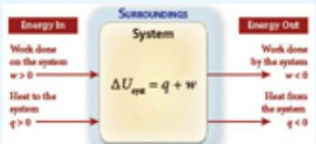</td></tr><tr><td>Work Done On or By a System</td><td>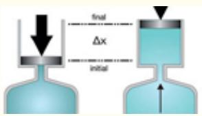</td></tr><tr><td>Concept of Internal Energy</td><td>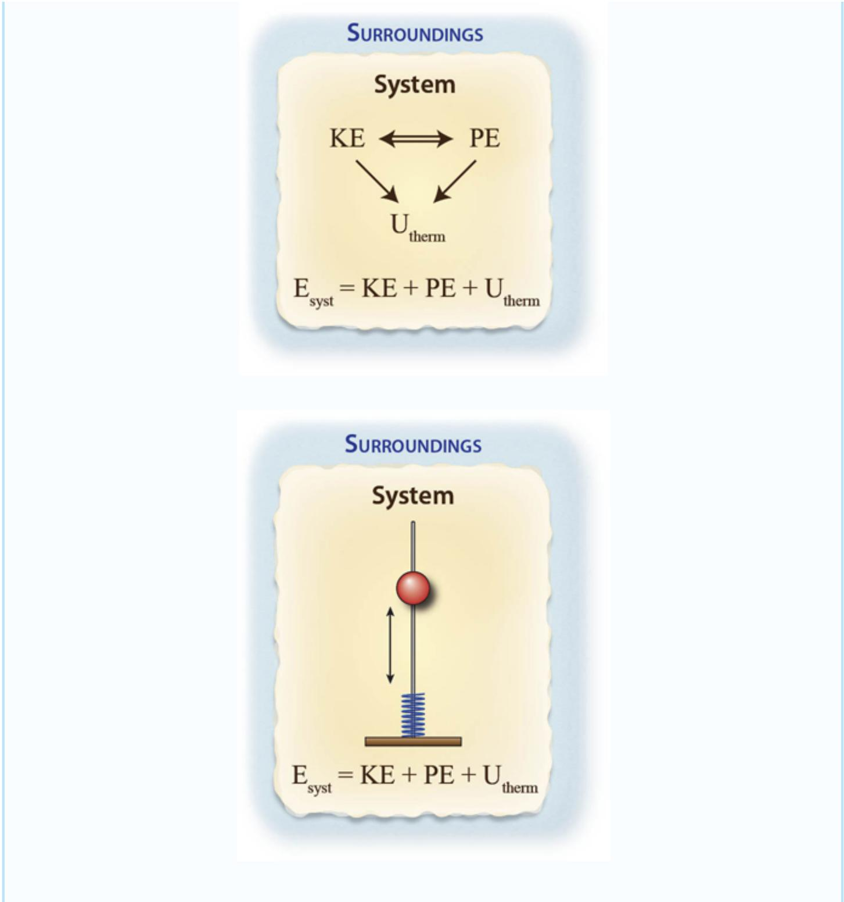</td></tr><tr><td>State Variables in Thermodynamics</td><td>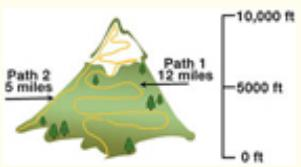</td></tr><tr><td>Work Produced by a Chemical Reaction</td><td>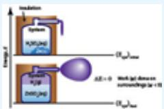</td></tr><tr><td>Development of the First Law of Thermodynamics</td><td>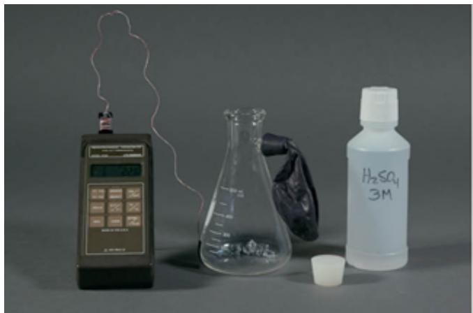</td></tr><tr><td>Heat, Heat Capacity, and the Bomb Calorimeter</td><td>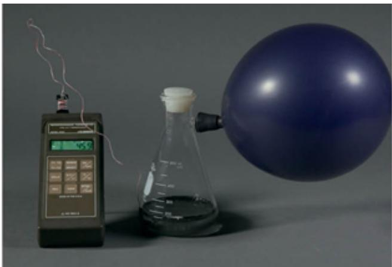</td></tr><tr><td>Enthalpy: A State Variable for Thermodynamic Changes at Constant Pressure</td><td>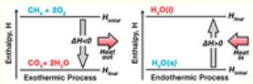</td></tr><tr><td>Standard Enthalpies of Formation</td><td>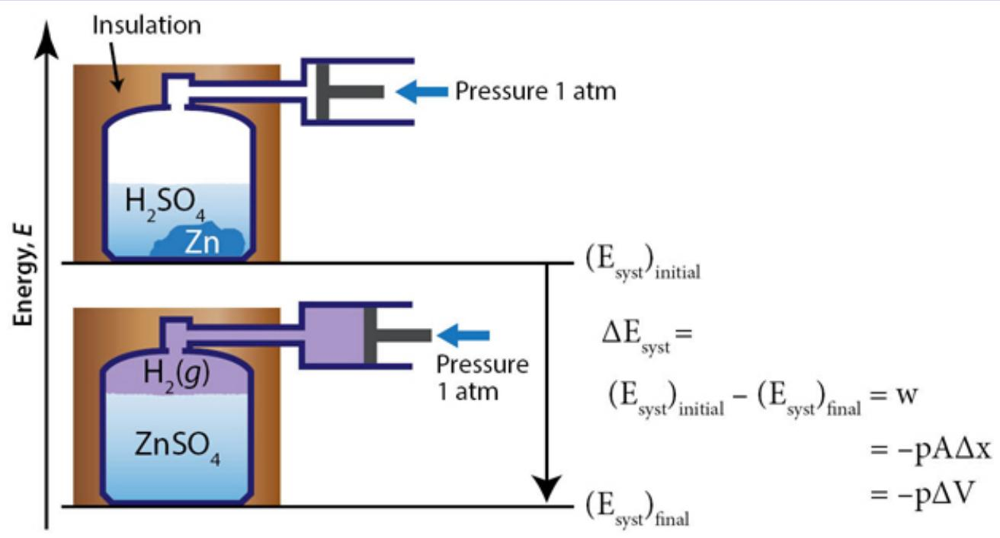</td></tr><tr><td>Standard Heats of Reaction</td><td>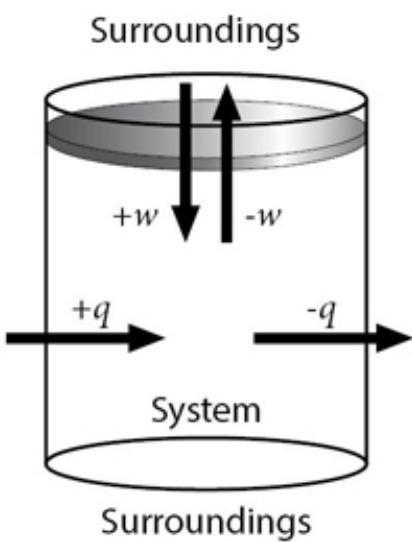</td></tr><tr><td>Hess's Law</td><td>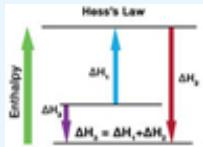</td></tr><tr><td>Processes That Occur on a pV Surface</td><td>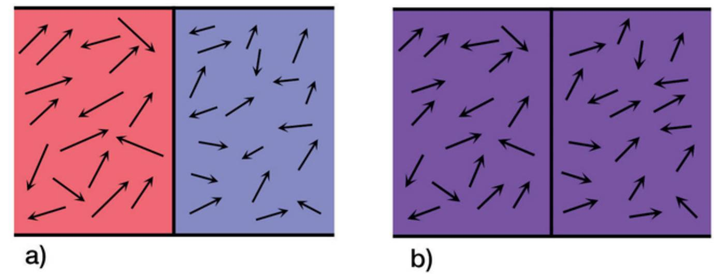</td></tr><tr><td>Linking the Thermodynamic Machine, the pV Diagram and the Energy Bar Chart</td><td>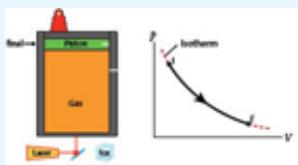</td></tr><tr><td>Spontaneous Change, Irreversibility, and Disequilibrium</td><td>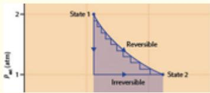</td></tr><tr><td>Thermodynamics of Phase Transitions</td><td>↑ 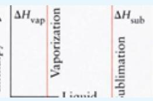</td></tr></table>

## Development of the First Law of Thermodynamics

## Relationship Between the Energy Change of the System, of the Surroundings, and of the Universe

As we develop the First Law of Thermodynamics, it will become increasingly important to clearly distinguish between the system and the surroundings. The reason is that we must constantly refer to the heat, q, or the work, w, exchanged between two clearly defined domains. Figure 3.3 clarifies this distinction and emphasizes that the combination of the system and the surroundings constitutes all of matter. In thermodynamics, this sum of the system and the surroundings is referred to as the universe to emphasize the totality of matter as represented in Figure 3.3.

:::{figure} ../images/fig-p1-ch03-23.jpg
:name: fig-p1-ch03-23
:alt: FIGURE 3.3 The thermodynamic analysis of a system depends upon a clear delineation between that system and its surroundings. The combination of the system and its surroundings constitutes all of matter, which, in the language of thermodynam
FIGURE 3.3 The thermodynamic analysis of a system depends upon a clear delineation between that system and its surroundings. The combination of the system and its surroundings constitutes all of matter, which, in the language of thermodynamics, is referred to as the Universe.
:::


It is important when solving problems in thermodynamics to carefully define the boundary between the system and the surroundings. A key result of the conservation of energy is that the change in energy of the system, $\Delta \mathrm { E _ { \mathrm { s y s t } } } ,$ is equal to but opposite in sign to the energy change of the surroundings, $\Delta \mathrm { E _ { \mathrm { { s u r r } } } }$ . Therefore

```{math}
:label: eq-p1-ch03-1
\Delta \mathrm{E} _ {\mathrm{system}} = - \Delta \mathrm{E} _ {\mathrm{surr}}
```


However, conservation of energy also dictates that energy is neither created nor destroyed in the totality of the universe, so

```{math}
:label: eq-p1-ch03-2
\Delta \mathrm{E} _ {\mathrm{univ}} = 0
```


and because

```{math}
:label: eq-p1-ch03-3
\Delta \mathrm{E} _ {\mathrm{univ}} = \Delta \mathrm{E} _ {\mathrm{syst}} + \Delta \mathrm{E} _ {\mathrm{surr}}
```


we have, in turn, the important relationship between $\Delta \mathrm { E } _ { \mathrm { u n i v } } , \Delta \mathrm { E } _ { \mathrm { s y s t } } , \Delta \mathrm { E } _ { \mathrm { s u r r } } ,$ and the conservation of energy.

```{math}
:label: eq-p1-ch03-4
\Delta \mathrm{E} _ {\mathrm{univ}} = \Delta \mathrm{E} _ {\mathrm{syst}} + \Delta \mathrm{E} _ {\mathrm{surr}} = \Delta \mathrm{E} _ {\mathrm{syst}} - \Delta \mathrm{E} _ {\mathrm{syst}} = 0
```


The reason this conservation of energy expression involving $\Delta \mathrm { E _ { u n i v } }$ is so important is that we can often draw conclusions about what must happen within the totality of the universe and independently determine $\Delta \mathrm { E _ { \mathrm { s y s t } } } ,$ thereby determining, $\Delta \mathrm { E _ { \mathrm { { s u r r } } } }$ by direct calculation. In general, then, if we know any two of the quantities $\Delta \mathrm { E } _ { \mathrm { u n i v } } , \Delta \mathrm { E } _ { \mathrm { s y s t } } ,$ or $\Delta \mathrm { E _ { \mathrm { { s u r r } } } } ,$ we can solve for the third. This approach turns out to provide considerable insight into an array of important problems.

## Energy Exchange between a System and Its Surroundings

In Chapter 1 we developed an energy equation that represented both the total energy of a system of macroscopic objects and microscopic atoms and molecules, and represented the total energy of that system, $E _ { \mathrm { s y s t } }$ . The total energy of the system, $E _ { \mathrm { s y s t } }$ , represents the sum of the kinetic energy, KE, and potential energy, PE, of the macroscopic bodies that together constitute the mechanical energy, $E _ { \mathrm { m e c h } } ,$ , of the system, and thermal energy, $U _ { \mathrm { t h e r m } }$ , that represents the microscopic energy of molecular motion that comprise the system such that

```{math}
:label: eq-p1-ch03-5
E _ {\mathrm{syst}} = E _ {\mathrm{mech}} + U _ {\mathrm{therm}} \quad (\mathbf {3 . 1})
```


We also constructed a model of the system by identifying and separating the system from the surroundings. This model took into account both the exchange of kinetic and potential energy, which constitutes the mechanical (macroscopic) energy of the system, $E _ { \mathrm { m e c h } } = K E + P E ;$ , and the conversion of that mechanical energy to thermal energy represented by the microscopic motion of atoms and molecules in the system, $\mathrm { U } _ { \mathrm { t h e r m } } .$

We can represent the model of the system by the specific case of an oscillating mass, moving on a rod with a spring system, wherein the friction between the mass and the rod (and dissipation within the spring) lead to an inexorable change in the mechanical energy of the system, converting mechanical energy to thermal energy until the mass ceases to oscillate on the rod as described in the sidebar.

But we can generalize the model to include the capability to externally supply mechanical energy to the oscillating mass on the rod to make up for the conversion of mechanical energy $\left( K E + P E \right)$ to thermal energy caused by friction between the mass and the rod such that

```{math}
:label: eq-p1-ch03-6
\pmb {\Delta} E _ {\mathrm{syst}} = \Delta E _ {\mathrm{mech}} + \pmb {\Delta} U _ {\mathrm{therm}} = w _ {\mathrm{ext}}
```


where $w _ { \mathrm { e x t } }$ is the work externally applied to the system by the surroundings. This could be accomplished, for example, by adding to the downward velocity of the mass on each cycle to increase its kinetic energy, and thus its mechanical energy, by an amount equal to the energy dissipated in each cycle by friction.

We can represent that by a model that includes the work done on the system by an external force and we can also represent the possibility that the system can do work on the surroundings in that same model, as shown in Figure 3.4.

:::{figure} ../images/fig-p1-ch03-24.jpg
:name: fig-p1-ch03-24
:alt: FIGURE 3.4 We can create a model of the mechanical system by establishing boundaries that (1) define the extent of the system and (2) separate the system from its surroundings. We can also distinguish between (a) the macroscopic kinetic ene
FIGURE 3.4 We can create a model of the mechanical system by establishing boundaries that (1) define the extent of the system and (2) separate the system from its surroundings. We can also distinguish between (a) the macroscopic kinetic energy and potential energy of objects (masses) within the system and (b) the microscopic kinetic energy contained in the individual molecules that comprise the system. Also defined in this model is the sign of the work term, $W _ { \mathsf { e x t } } ,$ where $W _ { \mathrm { e x t } } > 0$ is work done on the system by the surroundings and $w _ { \mathrm { e x t } } < 0$ is work done by the system on the surroundings. It should be noted that this sign convention follows that generally adapted by texts in chemistry. Physics texts usually define w as positive for work done by the system. We will see the consequences of this.
:::


## Constructing a Model: A System and its Surroundings

The word system stems (as do many terms in thermodynamics) from Greek words meaning “to bring together” or “to combine.” In the discussion of thermodynamic processes we must constantly grapple with the problem of keeping track of the flow of thermal energy (heat) through a definite surface and the mechanical work done on a specific ensemble of (macroscopic) objects. Thus, by nature, we define a system by its boundary that separates the system—that part of the physical world upon which we focus our attention—from the rest of the world, the surroundings. This is displayed in the adjoining figure.

:::{figure} ../images/fig-p1-ch03-25.jpg
:name: fig-p1-ch03-25
:alt: Figure from the University Chemistry source textbook
:::

While we were concerned in Chapter 1 in our discussion of the conservation of energy for isolated systems, we turn now to the issue of how energy is transferred between the surroundings and the system.

In the study of chemical thermodynamics—thermochemistry—we are repeatedly confronted with how work is exchanged between a system and its surroundings. This turns out to be true whether we are quantitatively analyzing the heat and work produced by a chemical reaction or whether we are analyzing the work done by a “heat engine” such as an automobile engine that burns gasoline to generate kinetic energy.

A particularly important example of how work is exchanged between a system and its surroundings involves the work done by a piston that can move in response to a change in pressure within an otherwise closed vessel. This is shown diagrammatically in Figure 3.5.

:::{figure} ../images/fig-p1-ch03-26.jpg
:name: fig-p1-ch03-26
:alt: FIGURE 3.5 One of the most useful expressions for the work done by the expansion of a working substance is to convert the product of (Force) (distance) that is equal to the work done to (Force/area) (area)(distance of piston motion) and the
FIGURE 3.5 One of the most useful expressions for the work done by the expansion of a working substance is to convert the product of (Force) (distance) that is equal to the work done to (Force/area) (area)(distance of piston motion) and then write (Force/area) as pressure and (area)(distance) as the change in volume ΔV. Thus at constant pressure, the work is $W = - p \Delta V .$ This is displayed at left as the gas contained in a beaker with a movable piston of area, A, that moves through a displacement, Δx.
:::


In this case, the piston moves a distance Δx against the constant external pressure, P. We know that work is equal to the product of a force times a distance, so in our case (Figure 3.5):

```{math}
:label: eq-p1-ch03-7
\mathrm{w} = (\text {Force}) (\text {Distance}) = \mathrm{F} \cdot \Delta \mathrm{x}
```


However, the force, F, on the piston is the pressure, P, which is defined as the force per unit area times the area. Thus, for a piston of area A:

```{math}
:label: eq-p1-ch03-8
\mathrm{F} = (\mathrm{F} / \text {area}) \text {area} = \mathrm{P} \cdot \mathrm{A}
```


and the work done in moving the piston a distance Δx is:

```{math}
:label: eq-p1-ch03-9
\mathbf {w} = \mathbf {F} \cdot \Delta \mathbf {x} = \mathbf {P A} \Delta \mathbf {x}
```


The volume change in going from initial conditions to final conditions is $\Delta \mathrm { V } = \mathrm { A } \Delta \mathrm { x }$ so the work, w, is just:

```{math}
:label: eq-p1-ch03-10
\mathbf {w} = \mathbf {P A} \Delta \mathbf {x} = \mathbf {P} \Delta \mathbf {V}
```


This is a very useful expression for the work done by virtue of a change in volume, ΔV, under conditions of constant pressure.

Notice the units of this equation. With the pressure in atmospheres and the volume in liters, it is not immediately obvious that the units of work in this equation are energy (i.e., joules), as we know they must be from the First Law of Thermodynamics. However, pressure is force per unit area or mass times acceleration, divided by length squared. Volume is length cubed, so the product is:

```{math}
:label: eq-p1-ch03-11
\left[ \frac {(\text { mass }) \text { acceleration }}{\ell^ {2}} \right] \ell^ {3} = \left[ (\text { mass }) \text { acceleration } \right] \ell^ {1} = \left[ (\text { mass }) \frac {\ell}{\sec^ {2}} \right] \ell = (\text { mass }) (\text { vel }) ^ {2}
```


The units of energy indeed!

## Check Yourself 1

An important example of the pressure—volume work is the inflation of a balloon under conditions of 1.00 atm pressure. Suppose for example we begin with a deflated balloon of volume 0.05 L and we inflate the balloon to 2.00 L. Calculate the amount of work required in joules.

## Solution:

First identify the system and the surroundings. For this case, we take the system to be the balloon. Thus given $\mathrm { V } _ { 1 } = \mathbf { 0 } . \mathbf { 0 } 5$ L and $\mathrm { V } _ { 2 } = 2 . 0 0$ L, and the pressure is a constant $\bf { p } = 1 . 0 0$ atm, we calculate the work, w.

The work, w, can be directly calculated as $\begin{array} { r } { \mathbf { w } = - \mathbf { p } \Delta \mathbf { V } = - \mathbf { p } ( \nabla _ { 2 } - \mathbf { V _ { 1 } } ) } \end{array}$

Thus $\mathrm { V } _ { 2 } - \mathrm { V } _ { 1 } = \left( 2 . 0 0 - 0 . 0 5 \right) \mathrm { L } = 1 . 9 5 \mathrm { L } \mathrm { p } = 1 . 0 \mathrm { a t m }$

```{math}
:label: eq-p1-ch03-12
\mathrm{so} \mathrm{w} = - \mathrm{p} (\mathrm{V} _ {2} - \mathrm{V} _ {1}) = - (1. 0 0 \mathrm{atm}) (1. 9 5 \mathrm{L}) = - 1. 9 5 \mathrm{L} \cdot \mathrm{atm}
```


Next we need to convert the units of L-atm to joules. Using the conversion of 101.3 J/L-atm we have:

```{math}
:label: eq-p1-ch03-13
(- 1. 9 5 \mathrm{L} \mathrm{-atm}) \times (1 0 1. 3 \mathrm{J} / \mathrm{L} \mathrm{-atm}) = - 1 9 7. 5 \mathrm{J}
```


It is always important to carefully note the sign of the answer. The system, the balloon, has done work on the surroundings, thus the sign on w should be negative—and it is.

We say, for example, that the surroundings do work on the system if the piston compresses the gas by moving downward. Alternatively, the system does work on the surroundings if the piston moves vertically upward as it does in Figure 3.5. So our model of the system in Figure 3.4, wherein $w _ { \mathrm { e x t } } > 0$ represents net work done on the system, where energy is transferred from the surroundings to the system. Conversely, if work is done on the surroundings by the system, $w _ { \mathrm { e x t } } < 0$

But is the mechanical interaction of a force operating over a distance that constitutes the external work, $w _ { \mathrm { e x t } } ,$ done on our system the only way to transfer energy to the system from the surroundings? Suppose we place the system on a stove and ignite the burner? There will quite rapidly be an increase in $U _ { \mathrm { t h e r m } }$ such that $\Delta U _ { \mathrm { t h e r m } } \ > \ 0$ because the temperature of the system has increased. But we have done no work on the system, so $w _ { \mathrm { e x t } } = 0 ;$ however:

```{math}
:label: eq-p1-ch03-14
\Delta E _ {\mathrm{syst}} = \Delta E _ {\mathrm{mech}} + \Delta U _ {\mathrm{therm}} = w _ {\mathrm{ext}}
```


is clearly not zero; i.e.,

```{math}
:label: eq-p1-ch03-15
\Delta E _ {\mathrm{syst}} = \Delta E _ {\mathrm{mech}} + \Delta U _ {\mathrm{therm}} \neq 0.
```


So we have clearly violated our Energy Equation.

The problem is that while we have properly accounted for the exchange of energy by mechanical interaction between the system and the surroundings, we have not accounted for the energy transferred between the system and the surroundings by thermal interaction, by the transfer of energy at the microscopic level.

Therein lies the origin of the concept of heat. Heat is the energy transferred from the surroundings to a system by thermal interaction and it requires an additional term in our Energy Equation. As developed in Chapter 1, heat, the thermal (microscopic) energy transferred from a system to the surroundings, is designated by the symbol, q, such that our Energy Equation becomes

```{math}
:label: eq-p1-ch03-16
\Delta \mathrm{E} _ {\mathrm{syst}} = \Delta \mathrm{E} _ {\mathrm{mech}} + \Delta \mathrm{U} _ {\mathrm{thermal}} = \mathrm{w} + \mathrm{q}
```


This places the transfer of energy from a system to its surroundings by microscopic interaction, q, in a position of parity with the transfer of energy by macroscopic interaction, w.

There is another perspective on the equation $\Delta \mathrm { E } _ { \mathrm { s y s t } } = \textbf { w } + \textbf { q }$ . Since w represents the macroscopic transfer of energy to the system from the surroundings and q represents the microscopic transfer of energy to the system from the surroundings, and energy must be either macroscopic or microscopic, what other way could there be to transfer energy? So if energy is neither created nor destroyed, the equation must be true from the perspective of pure logic.

## The Concept of Internal Energy

We turn now to a more careful consideration of how we define the energy of the system, $\mathrm { E _ { \mathrm { s y s t } } }$ . Consideration of our equation $\mathrm { E _ { s y s t } = E _ { m e c h } + U _ { t h e r m } }$ representing the energy of the system as the sum of mechanical energy (kinetic plus potential energy of the macroscopic objects within the system) and the thermal energy (associated with atomic and molecular-scale kinetic and potential energy) immediately raises the question: What about the energy contained in the bonds of the molecules that might release energy if converted to another chemical compound?

We considered an explicit example of this in Chapter 2 when we combusted octane, $\mathrm { C _ { 8 } H _ { 1 8 } } ,$ releasing chemical energy to raise the temperature of the steel box that contained the burning gasoline as displayed in the reaction coordinate diagram Figure 3.6.

:::{figure} ../images/fig-p1-ch03-27.jpg
:name: fig-p1-ch03-27
:alt: FIGURE 3.6 The Reaction Coordinate: The reaction coordinate for a chemical reaction displayed here represents a number of key concepts associated with a chemical reaction. First, the reaction coordinate represents the potential energy betwe
FIGURE 3.6 The Reaction Coordinate: The reaction coordinate for a chemical reaction displayed here represents a number of key concepts associated with a chemical reaction. First, the reaction coordinate represents the potential energy between the reactants on the left-hand side of the figure, as they approach on a collision course. As the reactants approach, the electrons in their respective valence shells repel through Coulomb repulsion, creating a repulsive “barrier” that separates reactants from products. Second, the products are displayed on the right-hand side of the figure. Third, the relative energy of the reactants and products represents the amount of energy released in going from reactants to products. Fourth, the sign of the energy release determines whether the reaction is exothermic (when energy is released as in this diagram) or endothermic (when energy is absorbed).
:::


Indeed, as we saw with the combustion of octane, chemical energy contained in the bonding structure of chemical reactants relative to the energy contained in the bonding structure of products is very important when considering the total energy of a system. So, too, is the nuclear energy stored in the atomic nuclei that is released in either fission or fusion nuclear reactions that we will study in Chapter 13. That energy can be of primary importance when adding up the energy contained in the atoms and molecules of a system.

Recognition of the importance of energy transfer between the system and the surroundings by microscopic processes leads to a major modification of our Energy Equation, with the addition of the heat term, q. So too does a more careful consideration of the forms of microscopic energy contained within the system—a consideration that leads to a reformulation of the Energy Equation yet again. Specifically, energy contained in chemical and nuclear energy categories must be added to the kinetic energy of molecular motion at the microscopic level to fully define the internal energy of a system.

Consideration of all sources of microscopic energy taken together is particularly important for thermochemistry, which is why it is given a specific symbol, the internal energy, U. The internal energy of a system is defined as the sum of all contributions to the system energy resulting from the atoms and molecules that comprise that system:

```{math}
:label: eq-p1-ch03-17
U _ {\mathrm{syst}} = U _ {\mathrm{therm}} + U _ {\mathrm{chem}} + U _ {\mathrm{nuclear}} + \dots
```


We are now in a position to expand our definition of the internal energy of the system to include the mechanical energy, $E _ { \mathrm { m e c h } } ,$ of the objects contained in the system, as well as the thermal energy of molecular motion, $U _ { \mathrm { t h e r m } } .$ , the chemical internal energy, $U _ { \mathrm { c h e m } }$ , and the nuclear energy, $U _ { \mathrm { n u c l e a r } } ,$ contained in the nuclei of the atoms that comprise the system. Thus, with this more complete accounting for the categories of internal energy, we have

```{math}
:label: eq-p1-ch03-18
E _ {\mathrm{syst}} = E _ {\mathrm{mech}} + U _ {\mathrm{syst}} = E _ {\mathrm{mech}} + U _ {\mathrm{therm}} + U _ {\mathrm{chem}} + U _ {\mathrm{nuclear}}
```


We will focus in our development of the First Law of Thermodynamics on the internal energy of the system, $U _ { \mathrm { s y s t } } ,$ , defined as the sum of the thermal energy, $U _ { \mathrm { t h e r m : } }$ , contained in the atoms and molecules of the system and the chemical energy, $U _ { \mathrm { c h e m : } }$ , contained in the bonding structure of the molecules that comprise the system relative to the bonding structure of molecules that could be formed as a result of some chemical transformation of those molecules. We will add the term $U _ { \mathrm { n u c } }$ when we consider nuclear reactions in Chapter 13, but will ignore it for now, because the processes we consider through the end of Chapter 12 involve only $U _ { \mathrm { t h e r m } }$ and $U _ { \mathrm { c h e m } }$

Internal energy of a system, $U _ { \mathrm { s y s t } } ,$ is the sum of energies for all of the individual particles (electrons, protons, neutrons, etc. that comprise the atoms and, via chemical bonds, the molecules) in a sample of matter that constitutes the system. Therefore, included in this total internal energy inventory is

translational kinetic energy of molecules in the gas, liquid, and solid phase;

kinetic energy associated with molecular rotations and vibrations, which includes the potential energy of the bond that is exchanged with the kinetic energy of vibration; and

energy stored in the chemical bonds (ionic and covalent) that can be released in a chemical reaction converting reactants to products within the system.

Next, we further simplify our equation for the energy of the system, $E _ { \mathrm { s y s t } } ,$ by excluding the mechanical energy, $E _ { \mathrm { m e c h } } .$ , possessed by macroscopic objects within the system that have their own (macroscopic) kinetic and/or potential energy. This does not compromise our development of the First Law of Thermodynamics because the contribution to the total energy of the system by the mechanical energy of moving objects within the system can easily be included. For thermochemistry, then, we focus on the internal energy, $U _ { \mathrm { s y s t } } ,$ such that

```{math}
:label: eq-p1-ch03-19
U _ {\mathrm{syst}} = U _ {\mathrm{therm}} + U _ {\mathrm{chem}}
```


## State Variables in Thermodynamics

Thermodynamics is an inherently quantitative branch of science and thus the measurement of quantities is particularly important. So too is the character of the quantities that we measure and record in thermodynamic studies. One important category of measurements involves quantities that determine the state of a system independent of how that system reached that state prior to the point in time when the observation was made. While we haven't explicitly identified quantities that define the state of a system, independent of the history of how that state was achieved, we have already examined important examples. One is the potential energy of a mass in a gravitational field. If a mass is suspended a height, h, in a gravitational field, by virtue of that position alone, it has a potential energy equal to mgh. But the work required to deliver that mass to a height h depends on how that mass attained that height and thereby the potential energy, mgh. That mass might have been raised to that height by a (nearly) frictionless pulley. Or it may have been pulled up the incline on a rolling device or dragged up over a rough surface. In each case, the work required would be quantitatively very different but the potential energy would be the same independent of the path taken. In this case the potential energy defines, independent of path, the state of the system and it is, in the language of thermodynamics, a state variable. Work, in stark contrast, depends very much on the path taken so work, w, is not a state variable. Temperature is another important example of a state variable because temperature is determined entirely by the velocity of the atoms and molecules that make up the object in question. If that body is a block of copper, and that block of copper is at a temperature of $2 0 ^ { \circ } \mathrm { C } _ { : }$ , that block may have cooled from ${ \bf 1 0 0 ^ { \circ } C } ,$ , adding heat to its surroundings in the process. Or it may have warmed from $\mathbf { 0 } ^ { \circ } \mathbf { C }$ extracting heat from its surroundings. It would be impossible to tell from examining the velocity of the atoms that make up the block of copper which path was taken. Yet the velocity of the atoms that comprise that copper block uniquely defines the temperature. Temperature is thus a state variable; the heat emitted or absorbed is not a state variable.

## State Variables

We are constantly seeking to express dynamic and changing systems in terms of constants that remain invariant even though they may capture billions of individual events. The state of our system is defined by a specific set of quantities that establish its properties. Important examples include composition, temperature, pressure, volume, mass, etc. A distinguishing characteristic of a state variable, particularly for thermodynamics, is that a state variable is independent of the path taken to achieve that state. Such is the case for temperature, pressure, internal energy, etc. In contrast, heat and work are not state variables as they depend very much on the path taken.

Consider the implications of defining a state variable when applied to a chemical reaction. Suppose, as Figure $3 . 7$ demonstrates, we pour sulfuric acid, $\mathrm { H } _ { 2 } \mathrm { S O } _ { 4 }$ , into a beaker containing zinc filings. As we will discover in Chapter 6, metal is attacked by a strong acid, forming a salt and hydrogen gas, $\mathrm { H } _ { 2 }$ in a reaction that releases energy:

```{math}
:label: eq-p1-ch03-20
\mathrm{Zn(s)} + \mathrm {H_ {2} SO_ {4} (aq)} \rightarrow \mathrm {H_ {2} (g)} + \mathrm {ZnSO_ {4} (aq)} + \mathrm{energy}
```


:::{figure} ../images/fig-p1-ch03-28.jpg
:name: fig-p1-ch03-28
:alt: Figure from the University Chemistry source textbook
:::

:::{figure} ../images/fig-p1-ch03-29.jpg
:name: fig-p1-ch03-29
:alt: FIGURE 3.7 The experimental system investigating the addition of sulfuric acid to zinc metal resulting in the release of hydrogen gas, mathematical notation . The release of mathematical notation gas does work on the surroundings by expandi
FIGURE 3.7 The experimental system investigating the addition of sulfuric acid to zinc metal resulting in the release of hydrogen gas, ${ \sf H } _ { 2 }$ . The release of ${ \sf H } _ { 2 }$ gas does work on the surroundings by expanding the balloon outward at atmospheric pressure.
:::


The “apparatus” shown in Figure 3.7 includes a thermometer and a sidearm to which a balloon is attached. As the reaction proceeds, the balloon inflates and the temperature of the system increases. The balloon, as it inflates, constitutes work done by the system on the surroundings. The increase in temperature results in heat released by the chemical reaction. A key question here is: how is the boundary between the system and the surrounding best defined? One reasonable choice would be to define the system as the chemicals: $\mathrm { Z n ( s ) , H _ { 2 } S O _ { 4 } ( a q ) , H _ { 2 } ( g ) , Z n S O _ { 4 } ( a q ) }$ . Everything else would then be defined as the surroundings—beaker, balloon, stopper, thermometer, and everything else in the universe. With this definition, the energy from the system (the chemical reaction) is transferred to the surroundings as work done to inflate the balloon and the heat transferred that increases the temperature of the beaker. As the thermal energy flows outward from the beaker, the bench top, the air in the room, etc. increase in temperature.

Alternatively, we could define the system to be the chemicals, the beaker, the stopper, and the balloon. And we could insulate the system such that no heat is transferred from the system to the surroundings. Then ${ \bf q } = { \bf o }$ and the system only does work on the surroundings by virtue of the increased volume of the balloon. The work can be calculated directly from $\mathbf { w } = - \mathbf { p } \Delta \mathbf { V }$ where p is equal to one atmosphere and $\Delta \mathsf { V }$ is the change in volume of the balloon. We can represent what has occurred on an energy scale by considering the schematic in Figure 3.8. Before the reaction has proceeded (but just after the sulfuric acid has been added to the zinc) the energy of the system is $( \mathrm { E _ { s y s t } } ) _ { \mathrm { i n i t } }$ $\mathbf { \Sigma } = \left( \mathrm { U _ { t h e r m } } \right) _ { \mathrm { i n i t } } + \mathbf { \Sigma } \left( \mathrm { U _ { c h e m } } \right) _ { \mathrm { i n i t } } .$ . After the reaction has progressed to completion and the balloon has fully expanded, the final energy of the system, $( \mathrm { E _ { s y s t } ) _ { f i n a l } }$ $= \left( \mathrm { U } _ { \mathrm { t h e r m } } \right) _ { \mathrm { f i n a l } } + \left( \mathrm { U } _ { \mathrm { c h e m } } \right) _ { \mathrm { f i n a l } }$ will be less than $( \mathrm { E _ { \mathrm { s y s t } } } ) _ { \mathrm { i n i t } }$ because work has been done by the system on the surroundings. If, as is shown in Figure 3.9, the balloon is replaced by a piston, the displacement, the volume change, $\Delta \mathsf { V } ,$ , is then $\mathbf { A } \Delta \mathbf { x } ,$ , where A is the piston area. The work done by the system is then - $\mathsf { p } \Delta \mathsf { V }$ where p is the pressure of one atmosphere. On an energy diagram we thus contrast the initial and final states of the system and the change in energy of the system:

```{math}
:label: eq-p1-ch03-21
\Delta \mathrm{E} _ {\mathrm{syst}} = (\mathrm{E} _ {\mathrm{syst}}) _ {\mathrm{final}} - (\mathrm{E} _ {\mathrm{syst}}) _ {\mathrm{initial}} = \mathrm{w} = - \mathrm{p} \Delta \mathrm{V}
```


where w is the work done by the system in its surroundings, $- \mathrm { p A } \Delta \mathbf { x } .$ . Notice, in particular, that the energy of the system has decreased in going from the initial to the final state. Conservation of energy:

```{math}
:label: eq-p1-ch03-22
\Delta \mathrm{E} _ {\mathrm{univ}} = \Delta \mathrm{E} _ {\mathrm{syst}} + \Delta \mathrm{E} _ {\mathrm{surr}} = 0
```


tells us that because $\Delta \mathrm { E } _ { \mathrm { s y s t } } < 0 .$ , then $\Delta \mathrm { E _ { \mathrm { { s u r r } } } }$ must be > 0 so the energy of the surroundings has increased.

:::{figure} ../images/fig-p1-ch03-30.jpg
:name: fig-p1-ch03-30
:alt: FIGURE 3.8 We can represent the energy of the system both before and after the reaction takes place. The energy of the system decreases because the system has done work on the surroundings by virtue of the fact that the expansion of the bal
FIGURE 3.8 We can represent the energy of the system both before and after the reaction takes place. The energy of the system decreases because the system has done work on the surroundings by virtue of the fact that the expansion of the balloon against the pressure of 1 atm has done an amount of work equal $\mathsf { t o - p } _ { \mathsf { a t m } } \Delta \mathsf { V } .$
:::


:::{figure} ../images/fig-p1-ch03-31.jpg
:name: fig-p1-ch03-31
:alt: FIGURE 3.9 We can take the same experiment of adding sulfuric acid to zinc filings and make it quantitative by replacing the balloon by a piston that allows the direct determination of the displacement, mathematical notation facilitating th
FIGURE 3.9 We can take the same experiment of adding sulfuric acid to zinc filings and make it quantitative by replacing the balloon by a piston that allows the direct determination of the displacement, $\Delta { \sf x } ,$ facilitating the calculation of the work, $\mathsf { w } = - \mathsf { p } _ { \mathsf { a t m } } \mathsf { A } \Delta \mathsf { x } = - \mathsf { p } _ { \mathsf { a t m } } \Delta \mathsf { V } .$
:::


## Check Yourself 2

For the reaction $\mathrm { Z n } ( s ) + \mathrm { H } _ { 2 } \mathrm { S O } _ { 4 } ( a q )  \mathrm { H } _ { 2 } ( g ) + \mathrm { Z n } \mathrm { S O } _ { 4 } ( a q )$ depicted in Figure 3.7, 300 mL of 1.00 M $\mathrm { H } _ { 2 } \mathrm { S O } _ { 4 }$ was added to 14.66 g Zn metal. Calculate the work, assuming the reaction went to completion, and the temperature of the expanding gas was $2 5 ^ { \circ } \mathrm { C }$

## Solution:

First you must find the limiting reagent. Zinc turns out to be limiting. The number of moles of hydrogen gas produced is then equal to the moles of Zn consumed:

```{math}
:label: eq-p1-ch03-23
\begin{array}{r l} n _ {\text {gas}} & = n _ {\mathrm{H} _ {2}} = (1 4. 6 6 \mathrm{gZn}) \left(\frac {1 \mathrm{molZn}}{6 5 . 3 9 \mathrm{gZn}}\right) \left(\frac {1 \mathrm{molH} _ {2}}{1 \mathrm{molZn}}\right) \\ & = 0. 2 2 4 2 \mathrm{mol} \end{array}
```


Next we note that the reaction took place at constant temperature $\left( 2 5 ^ { \circ } \mathrm { C } \right)$ so T = constant and, from the Perfect Gas Law $\mathrm { p V } = \mathrm { n R T }$

```{math}
:label: eq-p1-ch03-24
\Delta (\mathrm{pV}) = \Delta (\mathrm{nRT})
```


So, for constant pressure:

```{math}
:label: eq-p1-ch03-25
\mathrm{p} \Delta \mathrm{V} = \mathrm{RT} \Delta \mathrm{n}
```


Thus $\mathbf { W } { = } - \mathrm { p } \Delta \mathrm { V } = - \Delta \mathrm { n R T }$

and the work is then:

```{math}
:label: eq-p1-ch03-26
\begin{array}{r l} w & = - (0. 2 2 4 2 \mathrm{mol}) (0. 0 8 2 0 6 \mathrm{LatmK} ^ {- 1} \mathrm{mol} ^ {- 1}) (2 9 8 \mathrm{K}) \\ & = - 5. 4 8 3 \mathrm{Latm} = (- 5. 4 8 3 \mathrm{Latm}) (1 0 1. 3 \mathrm{J/Latm}) \\ & = - 5 5 5. 5 \mathrm{J} \end{array}
```


Note that $\Delta n _ { \mathrm { g a s } } > 0$ implies $\mathbf { w } < \mathbf { o } ;$ that is, work is done by the system on the surroundings. Note also that the calculation does not presuppose the presence of a container (the balloon) to catch the gas. An open reaction flask still does work, the evidence being the bubbles of gas evolving from the reaction mixture, but it is not useful work. A reaction such as this was used on a much larger scale by Jacques Charles to fill the early hydrogen balloons for manned flight.

## Introduction to the First Law of Thermodynamics

The term thermodynamics suggests both (1) a study of an active transformation, dynamics, and (2) the central role played by heat as well as other forms of energy. The implication of dynamical transformation or exchange suggests that we must quantitatively define the distinction between a system under study and the surroundings within which the system resides. Thus we consider how we define how energy is exchanged between the system and its surroundings.

What is remarkable about the First Law of Thermodynamics is that it considers the potentially complicated issue of energy exchange between a system and its surroundings, and simplifies the quantitative treatment of the problem using pure logic.

As we developed in the first section of the chapter, work is the product of force times a distance of physical displacement. Work is thus inherently a macroscopic quantity. Heat, in sharp contrast, is the energy transferred between the system and its surroundings by strictly thermal interaction via molecular interaction. Heat is therefore inherently a microscopic quantity.

We can express the First Law of Thermodynamics as follows: heat, q, and work, w, are the only means by which energy is transferred between the system and its surroundings. We can express this in equation form by focusing on the change in internal energy of the system, $\Delta \mathrm { U } _ { \mathrm { s y s t } }$ . Thus, the change in internal energy of the system is

```{math}
:label: eq-p1-ch03-27
\Delta U _ {\mathrm{syst}} = q + w \quad (\mathbf {3 . 2})
```


This is the statement of the First Law of Thermodynamics in equation form, but notice that the left-hand side of the equation refers only to the system while the right-hand side of the equation defines the exchange of microscopic energy (q) and macroscopic energy (w) across the boundary between the system and the surroundings.

An important aspect of the First Law is that it explicitly represents a statement of the conservation of energy, because by equating the change in internal energy of the system to the sum of the heat and work quantitatively exchanged between the system and the surroundings, energy is neither created nor destroyed.

The First Law of Thermodynamics also engages the pure logic that if energy is exchanged between the system and its surroundings, it must be by either the macroscopic energy transfer or the microscopic energy transfer or a combination of both: following on the logic that energy must either be macroscopic or microscopic.

It is also important at this stage in the development of the First Law of Thermodynamics to emphasize the following points:

(a) work and heat are not contained within the thermodynamic system— work and heat exist only as the forms of energy transferred between the system and its surroundings,

(b) internal energy, $U _ { \mathrm { s y s t } } ,$ is the only form of energy contained within the thermodynamic system,

(c) if the system is isolated from its surroundings, then $\Delta U _ { \mathrm { s y s t } } = 0$

Development of the First Law of Thermodynamics, $\Delta U _ { \mathrm { s y s t } } = q + w ,$ as a quantitative tool for the solution of important problems is dependent upon establishing important conventions that clarify the sign of both the work term (w) and the heat term (q) in our expression above for the First Law. For any system, we adopt the convention that

The heat, q, entering the system has a positive sign such that the heat absorbed, $q > 0$

Heat leaving the system representing energy transfer from the system to the surroundings has a negative sign such that $q < \mathbf { 0 }$

Work done by the surroundings on the system is positive, $w > 0$

Work done on the surroundings by the system is negative, $w < 0$

This convention can be summarized, as displayed in Figure 3.10, by recognizing that energy entering the system has a positive sign; energy leaving the system has a negative sign.

:::{figure} ../images/fig-p1-ch03-32.jpg
:name: fig-p1-ch03-32
:alt: FIGURE 3.10 The definition of a system and its surroundings is fundamental to the quantitative accounting of the heat, mathematical notation added to the system from the surroundings and the work, w, done on the system by the surroundings.
FIGURE 3.10 The definition of a system and its surroundings is fundamental to the quantitative accounting of the heat, $q ,$ added to the system from the surroundings and the work, w, done on the system by the surroundings. While the heat, $q ,$ is transferred by molecular level (microscopic) processes, work, w, is transferred by mechanical displacement wherein a force acts over a distance. Thus the movable piston in the diagram.
:::


## Check Yourself 3

For the reaction system described in Check Yourself 2, the temperature was found to increase from ${ \bf \underline { { 2 } } 2 ^ { \circ } C }$ to a maximum of $4 7 ^ { \circ } \mathrm { C } ,$ and then it began to fall again as the reaction subsided. Calculate the heat and the heat per mole of Zn.

## Solution:

Using the idealized two-stage analysis and ${ \bf q } = { \bf - m c } \Delta { \bf T }$ ; for 300 mL of solution, $\mathbf { m } \approx 3 0 0 \ : \mathrm { g }$ . We have

```{math}
:label: eq-p1-ch03-28
\mathrm{q} = - (3 0 0 \mathrm{g}) (4. 1 8 \mathrm{Jg} ^ {- 1} \mathrm{K} ^ {- 1}) (4 7 - 2 2) \mathrm{K} = - 3 1 \mathrm{kJ}
```


Note that, although the temperatures are given in Celsius, only their difference is required, and thus no conversion to the Kelvin scale is necessary, since ${ \bf 1 } ^ { \circ } \mathrm { C } = { \bf 1 } \mathrm { K } .$ . From the first example, 0.2242 mol Zn reacted, giving

```{math}
:label: eq-p1-ch03-29
\mathrm{q/n} = - 3 1 \mathrm{kJ/0.2242mol} = - 1 3 8 \mathrm{kJ/mol}
```


You should realize that the quoted temperature rise was not as high as it could have been, since the temperature probe shown in Figure 3.7 is detecting heat coming through the flask wall while the reaction is still in progress; the escaping heat is not available to raise the temperature of the system itself.

We turn first to the question of how the internal energy change $( \Delta U _ { \mathrm { s y s t } } )$ of a system is instigated by thermal energy transfer (heat) by using a device called a bomb calorimeter, shown schematically in Figure 3.11.

:::{figure} ../images/fig-p1-ch03-33.jpg
:name: fig-p1-ch03-33
:alt: FIGURE 3.11 The bomb calorimeter serves two important functions in chemical thermodynamics. First, it allows us to postulate a system that will eliminate the work term from the First Law, such that mathematical notation w = q by executing a
FIGURE 3.11 The bomb calorimeter serves two important functions in chemical thermodynamics. First, it allows us to postulate a system that will eliminate the work term from the First Law, such that $\Delta U = q +$ w = q by executing a chemical reaction inside a chamber for which the walls are sufficiently thick such that no physical displacement takes place when a chemical explodes within the walls of the steel "bomb." Second, the bomb calorimeter has been used in the laboratory in countless experiments to measure the energy release of actual chemical reactions under conditions of constant volume.
:::


The purpose of the bomb calorimeter, which has been used extensively in chemical research, is to (1) create a practical physical model of a system and its surroundings, and (2) remove the work (w) term from the First Law of Thermodynamics such that the change in internal energy of the system $( \Delta U _ { \mathrm { s y s t } } )$ is equal to the heat term (q) alone: $\Delta U _ { \mathrm { s y s t } } = q + \mathcal { W } = q$ . This is done first by building a bomb with rigid walls such that the work term, which is the product of a force times a physical displacement (Force × displacement), is driven to zero by eliminating any deflection in the wall such that the physical displacement of the "bomb" is zero no matter what occurs within the bomb that contains the chemical reaction under study. Second, the bomb is loaded with chemical reactants that can be ignited externally, usually by a filament “flashed” by a pulse of electric current, as shown in Figure 3.11. Prior to detonation of the reactants, the initial internal energy, $U _ { \mathrm { i , } }$ of the system is the sum of (1) the thermal energy of molecular motion, $U _ { \mathrm { t h e r m } } .$ , and (2) the chemical energy associated with the chemical bonds of the reactants, $\mathrm { U } _ { \mathrm { c h e m } } .$ Thus, we can write

```{math}
:label: eq-p1-ch03-30
U _ {\mathrm{i}} = (U _ {\mathrm{therm}}) _ {\mathrm{i}} + (U _ {\mathrm{chem}}) _ {\mathrm{i}}.
```


After the chemical reaction has been initiated by the electric spark, and the system has returned to equilibrium such that there is no temperature difference between the bomb and the water bath, the system will have an internal energy, $U _ { \mathrm { f } }$ is the sum of $( U _ { \mathrm { t h e r m } } ) _ { \mathrm { f } } ,$ the thermal energy of the bomb, and $( U _ { \mathrm { c h e m } } ) _ { \mathrm { f } } ,$ the chemical energy contained within the bomb. $\left( U _ { \mathrm { c h e m } } \right) _ { \mathrm { f } }$ is presumably zero because all the material combusted in the bomb has been converted to products thereby releasing the available chemical energy. The change in internal energy of the system is then

```{math}
:label: eq-p1-ch03-31
\Delta U _ {\mathrm{syst}} = U _ {\mathrm{f}} - U _ {\mathrm{i}}.
```


Employing our statement of the First Law of Thermodynamics $\Delta U _ { s y s t } =$ $q _ { \mathrm { r x n } } + w ,$ , where $q _ { \mathrm { r x n } }$ is the energy release of the chemical reaction transferred as thermal energy to the water bath, bomb, metal enclosure, etc. by virtue of the temperature difference between the bomb and the water bath. The work, w, done by the bomb on the water bath is zero because the bomb is designed such that the wall deflection is zero as noted above. Thus, we are left with the simple equation:

```{math}
:label: eq-p1-ch03-32
\Delta U _ {\mathrm{syst}} = U _ {\mathrm{f}} - U _ {\mathrm{i}} = q _ {\mathrm{rxn}} + \mathcal {W} ^ {0} = q _ {\mathrm{rxn}} = q _ {\mathrm{V}} \tag{3.3}
```


wherein the quantity $q _ { \mathrm { v } }$ is the heat (thermal energy) transferred at constant volume.

But, while the bomb calorimeter has successfully removed the work term (w) from quantitative consideration in our statement of the First Law, two questions immediately emerge: First, from a molecular level perspective, how was the chemical energy, $U _ { \mathrm { c h e m } }$ , converted to thermal energy, $U _ { \mathrm { t h e r m } }$ , within the bomb calorimeter? Second, how do we measure the energy released in the chemical reaction, $q _ { \mathrm { r x n } } ,$ at constant volume?

To answer the first question, let's assume we inserted into the “bomb” an amount of chemical reactant, octane, $\mathrm { C _ { 8 } H _ { 1 8 } }$ (gasoline), and sufficient $\mathrm { O } _ { 2 }$ that

the chemical reaction

```{math}
:label: eq-p1-ch03-33
\mathrm {2 C_ {8} H_ {18} + 25 O_ {2} \rightarrow 16 CO_ {2} + 18 H_ {2} O}
```


can proceed to completion such that all of the fuel (octane) is consumed (reacted with $\mathrm { O } _ { 2 } )$ to produce the product $\mathrm { C O } _ { 2 }$ and $\mathrm { H } _ { 2 } \mathrm { O }$

We know from experience that when gasoline is burned heat is produced. Then how is the chemical energy contained in the bonds of $\mathrm { C _ { 8 } H _ { 1 8 } }$ and $\mathrm { O } _ { 2 }$ as they are converted to $\mathrm { C O } _ { 2 }$ and $\mathrm { H } _ { 2 } \mathrm { O }$ actually released? The answer to this question is aided by referring to our potential energy surface for the reaction. This potential energy surface or “reaction coordinate" shown in Figure 3.12 (introduced in Chapter 1) is a plot of potential energy on the vertical axis and internuclear distance on the horizontal axis. The reactants, $\mathrm { C _ { 8 } H _ { 1 8 } }$ and $\mathrm { O } _ { 2 } ,$ are shown on the left side of the diagram. As they approach, their intermolecular distance begins to decrease and the electron-electron repulsion begins to increase thereby increasing the potential energy until the "reaction barrier," displayed in Figure 3.12, is surmounted. As the chemical bonds rearrange at the "transition state" shown in Figure 3.12, the newly formed product molecules at the energy barrier then move rapidly to products, converting the potential energy that they (the products) possess at the instant of their formation, to kinetic energy of molecular motion as they move down the potential energy surface. The products of the reaction, $\mathrm { C O } _ { 2 }$ and $\mathrm { H } _ { 2 } \mathrm { O }$ representing the new bond structure of the products, are shown on the right at a lower potential energy than that of the reactants. The products $\mathrm { C O } _ { 2 }$ and $_ \mathrm { H _ { 2 } O }$ “explode” away from the point of formation, carrying with them a large amount of translational energy, vibrational energy, and rotational energy. These new molecules $( \mathrm { C O } _ { 2 }$ and $\mathrm { H } _ { 2 } \mathrm { O } )$ contain, by virtue of the chemical energy released in the reaction, an extremely large amount of kinetic energy (translation, vibration, rotation). Those newly formed $\mathrm { C O } _ { 2 }$ and $\mathrm { H } _ { 2 } \mathrm { O }$ molecules then collide repeatedly with the molecules around them within the bomb of the calorimeter, transferring their kinetic energy to the other molecules. This exchange of kinetic energy via molecule-molecule collision continues until the energy is partitioned among the energy modes (translation, vibration, rotation) of all molecules equally; thus establishing a new temperature for the ensemble of molecules contained in the bomb of the calorimeter.

:::{figure} ../images/fig-p1-ch03-34.jpg
:name: fig-p1-ch03-34
:alt: FIGURE 3.13 When thermal energy (heat) is transferred across a boundary separating a high temperature body (the left side of panel a) from a low temperature body (the right side of panel a) the molecules moving with higher kinetic energy in
FIGURE 3.13 When thermal energy (heat) is transferred across a boundary separating a high temperature body (the left side of panel a) from a low temperature body (the right side of panel a) the molecules moving with higher kinetic energy in the hot body collide with the slower moving molecules within the low temperature body. This process continues until energy is equally partitioned in the two bodies and the system has achieved thermal equilibrium as shown in panel b. The temperatures of the system of two bodies lies between the original temperatures of the hot and cold bodies.
:::


:::{figure} ../images/fig-p1-ch03-35.jpg
:name: fig-p1-ch03-35
:alt: FIGURE 3.12 The potential energy surface for the reaction of octane (gasoline) with oxygen producing mathematical notation and mathematical notation is displayed here. The highest point on the barrier separating reactants and products is te
FIGURE 3.12 The potential energy surface for the reaction of octane (gasoline) with oxygen producing $\mathsf { C O } _ { 2 }$ and ${ \sf H } _ { 2 } \mathrm { O }$ is displayed here. The highest point on the barrier separating reactants and products is termed the “transition state” for it is at this point in the progression of the reaction along the path from reactants to products that the bond breaking-bond reformation takes place.
:::


The mixture of high kinetic energy molecules contained within the walls of the bomb segment of the device shown in Figure 3.11 then begin transferring kinetic energy to the entire system, and increasing the temperature of the surrounding combination of water, steel jacket, stirring system, and thermometer. This may be represented at the molecular level as shown in Figure 3.13.

In the figure above, the hot gas, with molecules moving at high velocity, within the bomb shown on the left, panel (a), collide with the cold molecules of the walls of the calorimeter, transferring their kinetic energy, collision by collision, to the entire system.

As a result, the high kinetic energy contained in the molecules that comprise the walls of the bomb vessel and the gas contained in the bomb is transferred to the water bath in a process identical to that displayed in Figure 3.13. This transfer continues until the bomb vessel and the water have reached the same temperature and the net transfer of kinetic energy ceases. Note that while the net transfer of energy has ceased, there remains a dynamic exchange of kinetic energy on a molecule-by-molecule level. The interior of the calorimeter has now reached a state of thermal equilibrium where the temperature difference between the molecules within the bomb and within the water, steel container, etc. is now zero.

So how is the amount of energy released in the chemical reaction actually measured? While the internal energy of the (calorimeter) system,

```{math}
:label: eq-p1-ch03-34
U _ {\mathrm{syst}} = U _ {\mathrm{chem}} + U _ {\mathrm{therm}},
```


has remained unchanged, there has been a net conversion of chemical internal energy, $U _ { \mathrm { c h e m } }$ , to thermal internal energy, $U _ { \mathrm { t h e r m } }$ . But we cannot, in any practical sense, accurately account for $U _ { \mathrm { t h e r m } }$ by adding the kinetic energy of translation, rotation, and vibration for each molecule to calculate a total. We must employ another strategy. That strategy is to measure a change, specifically the increase in temperature, of the bomb and the surrounding water bath, which we can easily do with the thermometer shown in Figure 3.11. But how is the temperature going to quantitatively define $q _ { \mathrm { r x n } }$ produced in the chemical reaction as it appears in the First Law, given in Equation 3.2?

We recognize that by building the wall of the bomb sufficiently strong that no work is done by the bomb on the surrounding water such that

```{math}
:label: eq-p1-ch03-35
\Delta U _ {\mathrm{syst}} = q _ {\mathrm{rxn}} + w = q _ {\mathrm{rxn}} = q _ {\mathrm{v}}
```


where $q _ { \mathrm { v } }$ is the “heat of reaction” at constant volume. But how do we calculate $q _ { \mathrm { v } }$ from the temperature measurement of the water in the calorimeter? We answered this question in principle when we examined the experiments of James Joule in Chapter 1. Let's now consider the answer to the question in more detail.

## Heat and Heat Capacity: How Thermal Energy Transfer (Heat) Is Calculated from a Temperature Change

We consider two cubes, diagramed in Figure 3.14, each containing a gram of water. It was established by the work of James Prescott Joule (and others) that the amount of energy required to raise 1 gram of water by $\mathbf { 1 } ^ { \circ } \mathbf { C }$ was 1 calorie of energy; more appropriately in SI units, it requires 4.18 joules of energy to raise 1 gram of water by $\mathbf { 1 } ^ { \circ } \mathbf { C } .$ So we run a series of experiments that involve (1) establishing an initial temperature for cube A and cube B and then (2) placing the cubes together until they are of equal temperature—i.e., such that they have reached thermal equilibrium. We know that for each $\mathbf { 1 } ^ { \circ } \mathbf { C }$ a block increases in temperature, 4.18 joules of energy flowed into that 1 gram of water. We also know that for each $\mathbf { 1 } ^ { \circ } \mathbf { C }$ a cube decreases in temperature, 4.18 joules of energy flowed out of that 1 gram of water.

:::{figure} ../images/fig-p1-ch03-36.jpg
:name: fig-p1-ch03-36
:alt: FIGURE 3.14 When two cubes of the same material with the same volume are at different temperatures, heat will flow from the warmer to the cooler cube in such a way that we can quantitatively deduce the amount of heat that flows between the
FIGURE 3.14 When two cubes of the same material with the same volume are at different temperatures, heat will flow from the warmer to the cooler cube in such a way that we can quantitatively deduce the amount of heat that flows between the two bodies. A series of such experiments, represented in Table 3.1, provides important insight into the relationship between heat flow and temperature change.
:::


We can then run a series of experiments wherein we measure the initial temperatures of block A and of block B, and then record the final temperature of the two in contact, calculating each time the energy gained (or lost) by block A and the energy lost (or gained) by block B. We run a series of experiments and record the data:

TABLE 3.1

<table><tr><td>Run</td><td>Initial Temperature of A (°C)</td><td>Initial Temperature of B (°C)</td><td>Final Temperature of A &amp; B (°C)</td><td>Heat, A (joules)</td><td>Heat, B (joules)</td></tr><tr><td>1</td><td>10.0</td><td>40.0</td><td>25.0</td><td>+62.7</td><td>-62.7</td></tr><tr><td>2</td><td>20.0</td><td>40.0</td><td>30.0</td><td>+41.8</td><td>-41.8</td></tr><tr><td>3</td><td>30.0</td><td>40.0</td><td>35.0</td><td>+20.9</td><td>-20.9</td></tr><tr><td>4</td><td>40.0</td><td>40.0</td><td>40.0</td><td>0.0</td><td>0.0</td></tr><tr><td>5</td><td>10.0</td><td>50.0</td><td>30.0</td><td>+83.6</td><td>-83.6</td></tr><tr><td>6</td><td>20.0</td><td>50.0</td><td>35.0</td><td>+62.7</td><td>-62.7</td></tr><tr><td>7</td><td>30.0</td><td>50.0</td><td>40.0</td><td>+41.8</td><td>-41.8</td></tr></table>

Four important facts emerge from our inspection of the data:

a) When cube A and B have different temperatures, the cooler object always gains heat and the warmer object always loses it. We conclude that kinetic energy of molecular motion always flows from the warmer object to the cooler object. We express this spontaneous transfer of internal thermal energy, $U _ { \mathrm { t h e r m } }$ , as heat, q, transferred from cube B to cube A.

b) When the initial temperatures of A and B are equal, no heat is exchanged between the two cubes.

c) When the masses of A and B are the same, and when they are comprised of the same material, the final temperature is the average of the two initial temperatures.

d) When the temperature change that an object undergoes is doubled, so too is the amount of heat exchanged doubled.

This fourth observation, (d), is particularly important. It says that the heat gained or lost by an object is directly proportional to the temperature change that it undergoes.

While we routinely discuss the heat capacity of objects in the laboratory or in industrial settings, it is becoming increasingly important to grasp the scale of the heat capacity of objects on the global scale because quantitatively analyzing the flow of thermal energy (heat) into those systems defines the trajectory upon which we are moving as the addition of $\mathrm { C O } _ { 2 }$ to the atmosphere traps increasing amounts of infrared radiation. We begin first by calculating the heat capacity of the world's oceans.

:::{figure} ../images/fig-p1-ch03-37.jpg
:name: fig-p1-ch03-37
:alt: Figure from the University Chemistry source textbook
:::

With a volume of $\mathbf { 1 3 5 0 \times 1 0 ^ { 1 5 } m ^ { 3 } }$ this equals $\mathbf { 1 . 3 5 \times 1 0 ^ { 2 4 } c m ^ { 3 } }$ . The density of water is $\mathrm { { 1 g / c m ^ { 3 } } }$ so the mass of the world's oceans is $1 . 3 5 \times 1 0 ^ { 2 4 } \mathrm { g } .$ . The specific heat of water is $4 { \cdot } 2 \mathrm { J } / \mathrm { g } - ^ { \circ } \mathrm { C }$ so the heat capacity of the ocean is:

```{math}
:label: eq-p1-ch03-36
\mathrm {C_ {ocean} = mCH_ {2} O = (4.2J / g^ {- \circ} C) 1.35\times 10^ {24} g = 5.7\times 10^ {24} J / ^ {\circ} C}
```


We can round this number off to achieve the easily remembered number of 6000 $\mathrm { Z J / ^ { \circ } C }$ as the heat capacity of the world's oceans.

We can express this in equation form by writing

```{math}
:label: eq-p1-ch03-37
q = C \Delta T \quad (\mathbf {3 . 4})
```


where $q$ is the heat transferred, $\Delta T$ is the temperature change of the body, and C is the “heat capacity” of the object. Notice that while “heat capacity” is a term universally used in thermodynamics, it treads dangerously close to violating the concept that heat is not a substance to be stored but rather is the thermal energy transferred between a system and its surroundings by virtue of molecular level interaction.

Materials, however, possess very different abilities to store kinetic energy as thermal energy within the bonds that comprise the material. We know from experience that a gram of water has a higher heat capacity than a gram of wood. But we already know that the thermal energy component of a body's internal energy, $U _ { \mathrm { t h e r m } } .$ , is composed of the sum of the kinetic energy (translational, rotational, vibrational) of the individual molecules that comprise the material. Thus, a material with more molecules per unit volume will quite probably have a higher heat capacity. But it is also clear that the bonding structure and the vibrational and rotational modes that characterize the material will play a role in the heat capacity of a body as well because heat can flow into these modes of molecular motion.

We can verify by experiment that the heat capacity, C, in Equation 3.4 is directly proportional to the mass of the object under consideration. That is,

```{math}
:label: eq-p1-ch03-38
C = m c
```


where C is the heat capacity of the object, m is the mass of that object, and c is the specific heat (in joules $/ { \bf g } - ^ { \circ } { \bf C } )$ of the material that comprises the object. It is the specific heat that we use in all thermodynamic calculations involving various substances, because we wish to tabulate the number of joules $/ 8 ^ { - \circ } \mathrm { C }$ specific to a given substance. Then it is simply a matter of multiplying that tabulated number by the mass of the object to determine the heat capacity of the object.

We can then write our quantitative formulation of the thermal energy transferred as heat, $q ,$ in the form

```{math}
:label: eq-p1-ch03-39
q = (\mathrm{mass}) (\mathrm{specificheat}) (\mathrm{differenceintemperature}) = m c \Delta T
```


Notice that the units of c are joules $/ 8 ^ { - \circ } C$ such that when c is multiplied by the mass of the object in grams and the temperature change in $^ \circ C$ or Kelvin, that $q$ is given in joules. Some important examples are given in Table 3.2.

TABLE 3.2

<table><tr><td colspan="2">Specific Heats</td></tr><tr><td>Substance</td><td>Specific Heat, J g-1°C-1(25 °C)</td></tr><tr><td>Carbon (graphite)</td><td>0.711</td></tr><tr><td>Copper</td><td>0.387</td></tr><tr><td>Ethyl alcohol</td><td>2.45</td></tr><tr><td>Gold</td><td>0.129</td></tr><tr><td>Granite</td><td>0.803</td></tr><tr><td>Iron</td><td>0.4498</td></tr><tr><td>Lead</td><td>0.128</td></tr><tr><td>Olive oil</td><td>2.0</td></tr><tr><td>Silver</td><td>0.235</td></tr><tr><td>Water (liquid)</td><td>4.18</td></tr></table>

Note that liquids have greater specific heats than solids. This results from the greater number of degrees of freedom (rotation, vibration, translation) of the molecules in the liquid, relative to those in the solid.

## Volume of Other Water Containing Systems

While the world's oceans contain a vast majority of the available water (97.3%) at the Earth's surface, the volume of water in other systems is of great importance for analyzing changes in the Earth's climate. We consider here five examples:

1. The glaciers and polar ice. Combining the volume of ice contained in the Antarctic, the Arctic, and the major glacial systems of the continents, the volume of water contained in the ice is 2.1% of the total volume of water at the Earth's surface. That is $\mathbf { 2 9 \times 1 0 ^ { 1 5 } m ^ { 3 } }$ of water or 29 $\times \ 1 0 ^ { 2 1 }$ cm<sup>3</sup> of water. The volume of water tied up in the Greenland glacial system is $\mathbf { 2 . 9 \times 1 0 ^ { 2 1 } c m ^ { 3 } } ,$ or approximately 10% of the total volume of water tied up in the world's ice/glacial system.

2. The underground aquifers contain $8 . 4 \times 1 0 ^ { 2 1 } \mathrm { c m } ^ { 3 }$ of water or 0.6% of the total.

3. The lakes and rivers of the world contain $0 . 2 \times 1 0 ^ { 2 1 } \mathrm { c m } ^ { 3 }$ of water or 0.01%.

4. The atmosphere contains $\mathbf { 0 . 0 1 3 \times 1 0 ^ { 2 1 } }$ cm<sup>3</sup> of water or 0.001% of the total.

5. The biosphere contains $0 . 0 0 6 \times 1 0 ^ { 2 1 } \mathrm { c m ^ { 3 } }$ of water.

## Application of the Bomb Calorimeter

Development of the First Law of Thermodynamics provides the quantitative foundation for the determination of the energy released from the chemical reaction using the bomb calorimeter. In particular, we will use the bomb calorimeter to measure energy release in the combustion of gasoline, $\mathrm { C _ { 8 } H _ { 1 8 } , }$ recognizing that because the bomb calorimeter eliminates any physical expansion of the system, no work is done during the course of the reaction, and thus $\Delta U _ { \mathrm { s y s t } } = q + w = q _ { \mathrm { r x n } }$ where $q _ { \mathrm { r x n } } = q _ { \mathrm { V } } =$ heat release at constant volume for the chemical reaction.

We define (a) the system as the chemical reaction and (b) the surroundings as all the components of the calorimeter: the calorimeter case, the water contained within the calorimeter, the cup holding the reactants, the reaction chamber, the thermometer, and the steering mechanism.

The heat gained by the calorimeter, $q _ { \mathrm { c a l } } ,$ is then equal to the heat gain of each of the components of the bomb calorimeter such that:

```{math}
:label: eq-p1-ch03-40
q _ {\mathrm{cal}} = q _ {\mathrm{case}} + q _ {\mathrm{water}} + q _ {\mathrm{cup}} + q _ {\mathrm{chamber}} + q _ {\mathrm{therm}} + q _ {\mathrm{stir}}
```


Moreover, $- q _ { \mathrm { c a l } } = q _ { \mathrm { r x n } }$ , because the heat produced by the chemical reaction (the system), $q _ { \mathrm { r x n } } .$ , is equal but opposite in sign to the heat gained by the calorimeter (the surroundings), $q _ { \mathrm { c a l } }$

But as an experimental system, the heat capacity, $\mathrm { C } ,$ of the entire calorimeter system can be determined independently, either at the individual component level or by submersion of the entire calorimeter in a bath of known temperature and volume of water, and then measuring the final temperature of the calorimeter plus water bath just as we did in generating Table 3.1. Then, for any subsequent measurement of $q _ { \mathrm { r x n } }$ we can use

```{math}
:label: eq-p1-ch03-41
q _ {\mathrm{calor}} = (\mathrm{heatcapacityofcalorimeter}) \Delta T = C _ {\mathrm{calor}} \Delta T
```


Now we are ready to determine the heat of reaction, q $q _ { \mathrm { r x n } } ,$ of octane using our bomb calorimeter. We have determined through careful and repeated studies that the heat capacity of the calorimeter is $5 . 6 2 ~ \mathrm { ~ k J } / { } ^ { \circ } \mathrm { C }$ The combustion of 1 gram of $\mathrm { C _ { 8 } H _ { 1 8 } }$ in the bomb of the calorimeter causes the temperature to increase from $2 2 . 5 0 ^ { \circ } \mathrm { C }$ to $3 1 . 0 8 ^ { \circ } \mathrm { C }$ . What is the heat of combustion (heat of reaction) of octane expressed in kilojoules per mole?

## Step 1:

Calculate $q _ { \mathrm { c a l o r } }$ by multiplying the heat capacity of the calorimeter (5.62 kJ/ $^ { \circ } \mathrm { C } )$ by the observed increase in temperature $( 8 . 5 8 ^ { \circ } \mathrm { C } )$

```{math}
:label: eq-p1-ch03-42
q _ {\mathrm{calor}} = (8. 5 8 ^ {\circ} \mathrm{C}) (5. 6 2 \mathrm {kJ / ^ {\circ} C}) = 4 8. 2 \mathrm{kJ}
```


Thus

```{math}
:label: eq-p1-ch03-43
q _ {\mathrm{rxn}} = - q _ {\mathrm{calor}} = - 4 8. 2 \mathrm{kJ}
```


Therefore the heat of combustion of octane per gram is

```{math}
:label: eq-p1-ch03-44
q _ {\mathrm{rxn}} = - 4 8. 2 \mathrm{kJ/1gram} = - 4 8. 2 \mathrm{kJ/g}
```


## Step 2:

To calculate the heat of combustion per mole of octane, recognize that the molecular weight of octane $\mathrm { ( C _ { 8 } H _ { 1 8 } ) }$ is

```{math}
:label: eq-p1-ch03-45
(8 \times 1 2) + (1 8 \times 1) = 1 1 4 \mathrm{g/mole}
```


So per mole we have

```{math}
:label: eq-p1-ch03-46
q _ {\mathrm{rxn}} = q _ {\mathrm{V}} = (- 4 8. 2 \mathrm{kJ/g}) \times 1 1 4 \mathrm{g/mole} = - 5. 5 0 \times 1 0 ^ {3} \mathrm{kJ/mole}
```


## Check Yourself 4

Suppose 2.00 mol of glucose $\mathrm { ( C _ { 6 } H _ { 1 2 } O _ { 6 } ) }$ is reacted in a bomb calorimeter and the temperature of the calorimeter increases from $2 3 . 5 0 ^ { \circ } \mathrm { C }$ to $2 7 . 6 9 ^ { \circ } \mathrm { C }$ The heat capacity of the calorimeter is $\mathrm { C _ { c a l } = 7 . 4 5 \ k J / ^ { \circ } C } .$

Calculate: $\Delta U _ { \mathrm { s y s t } } = \Delta U _ { \mathrm { c h e m } }$ in kJ/mol of $\mathrm { C _ { 6 } H _ { 1 2 } O _ { 6 } }$

## Solution:

<div class="mineru-algorithm" style="white-space: pre-wrap; font-family:monospace;">
The solution to the problem involves three steps:

Step 1:
Recognize that  $q_{\mathrm{cal}} = (C_{\mathrm{cal}}) \Delta T$
and that  $q_{rxn} = -q_{cal}$
and that  $\Delta T = 27.69^{\circ}C - 23.50^{\circ}C = 4.19^{\circ}C$

Step 2:
Calculate  $q_{rxn}$  of the reaction:

 $q_{\mathrm{cal}} = (\mathrm{C}_{\mathrm{cal}}) \Delta T = (7.45 \, \mathrm{kJ/^\circ C})(4.19^{\circ}\mathrm{C}) = 31.2 \, \mathrm{kJ}$

Step 3:
Calculate  $\Delta U_{syst} = q_{rxn} = \Delta U_{chem}$  in kJ/mol of  $C_{6}H_{12}O_{6}$ $\Delta U_{chem} = -31.2 \, kJ/2 \, mol \, C_{6}H_{12}O_{6} = -15.6 \, kJ/mol \, C_{6}H_{12}O_{6}$

Verify the sign:
Since heat leaves the system, the sign should be negative, as it is.
</div>

## Enthalpy

To this point, we have dealt with the change in chemical internal energy, $\Delta U _ { \mathrm { c h e m } } .$ , only under conditions of constant volume in our bomb calorimeter, for which

```{math}
:label: eq-p1-ch03-47
\Delta U _ {\mathrm{syst}} = \Delta U _ {\mathrm{therm}} + \Delta U _ {\mathrm{chem}} = q + \mathcal {W} = q _ {\mathrm{v}}
```


where $w = - p \Delta V = 0$ because the rigid walls of the bomb prevented any change in volume, $\Delta V \ = \ 0 .$ . So the release of chemical energy upon combustion appeared as an increase in thermal energy at constant volume, $q _ { \mathrm { V } } .$ . However, a great many chemical reactions occur under conditions of constant pressure and not constant volume.

This immediately raises the question: When we measure the heat of reaction at constant volume, $q _ { \mathrm { V } } .$ , how does that compare quantitatively with the heat of reaction measured at constant pressure?

We know, because the system will do work on its surroundings $( w < 0 )$ at constant pressure (because the volume will increase), that the heat of reaction at constant pressure, $q _ { \mathrm { p } } ,$ will be greater (less negative) than $q _ { \mathrm { V } }$ because

```{math}
:label: eq-p1-ch03-48
\Delta U = q _ {\mathrm{V}} = w + q _ {\mathrm{p}}
```


and $w < 0$ because when the system does work on the surrounding, $w < 0$ But by how much?

The relation $q _ { \mathrm { V } } = q _ { \mathrm { p } } + w$ is the key starting point from which we can deduce the answer to our question. First, we know that, for a process at constant volume, $\Delta U _ { \mathrm { s y s t } } = q _ { \mathrm { V } }$ and we know that $\mathbf { w } = - \mathbf { p } \Delta V$ so we can write

```{math}
:label: eq-p1-ch03-49
\Delta U _ {\mathrm{syst}} = q _ {V} = q _ {p} + w = q _ {\mathrm{p}} - p \Delta V
```


Thus, $q _ { \mathrm { p } } = \Delta U _ { \mathrm { s y s t } } + p \Delta V .$ But now we recognize that $U _ { \mathrm { s y s t } } , p ,$ , and V are all state variables because their values are each independent of the path taken to reach that given state.

Suppose now we define a new state variable

```{math}
:label: eq-p1-ch03-50
H = U + p V
```


Then the change in that state variable

```{math}
:label: eq-p1-ch03-51
\begin{array}{r l} \Delta H & = H _ {\mathrm{f}} - H _ {\mathrm{i}} \\ & = \left(U _ {\mathrm{f}} + p _ {\mathrm{f}} V _ {\mathrm{f}}\right) - \left(U _ {\mathrm{i}} + p _ {\mathrm{i}} V _ {\mathrm{i}}\right) \\ & = \left(U _ {\mathrm{f}} - U _ {\mathrm{i}}\right) + \left(p _ {\mathrm{f}} V _ {\mathrm{f}} - p _ {\mathrm{i}} V _ {\mathrm{i}}\right) \\ & = \Delta U + \Delta (p V) \end{array}
```


If the process is carried out at constant temperature and pressure, then $\Delta ( p V )$ $= p \Delta V$ and

```{math}
:label: eq-p1-ch03-52
\Delta H = \Delta U + p \Delta V = (q _ {\mathrm{p}} - p \Delta V) + p \Delta V
```


```{math}
:label: eq-p1-ch03-53
= q _ {\mathrm{p}}
```


where ${ \mathfrak { q } } _ { \mathfrak { p } }$ is the heat released at constant pressure.

This new state variable, H, is called the enthalpy and $\Delta H = q _ { \mathrm { p } } $ is the enthalpy change for a chemical process at constant pressure, which is the thermal energy (heat) produced by the chemical reaction at constant pressure.

Because we live, by and large, in a constant pressure world, the state variable enthalpy is a variable of great importance. In fact, $\Delta H$ released in a chemical reaction is routinely referred to as the energy release resulting from the change in bond structure in going from reactants to products in a chemical reaction. The enthalpy change, $\Delta \mathrm { H } ,$ is listed in the appendix of all chemistry texts and all thermochemistry data sources as the quantitative measure of the relative energy contained in the bonds of molecules. A table of ΔH constitutes Appendix B of this text. If we lived in a constant volume world, those tables in the appendix of textbooks would list $\Delta U ,$ not $\Delta H !$

It is important to consider the magnitude of the enthalpy change of a chemical reaction, $\Delta H ,$ and the $\mathsf { p } \Delta V$ work term associated with a given reaction. What is their relative magnitude?

Suppose we react two moles of carbon monoxide in the gas phase, CO(g), with a mole of $\mathrm { O } _ { 2 } ( g )$ to form two moles of carbon dioxide in the gas phase:

```{math}
:label: eq-p1-ch03-54
2 \mathrm{CO} (g) + \mathrm{O} _ {2} \rightarrow 2 \mathrm{CO} _ {2} (g)
```


If the reaction is run at constant pressure, we discover that 566.0 kJ of energy is released such that

```{math}
:label: eq-p1-ch03-55
q _ {\mathrm{p}} = - 5 6 6. 0 \mathrm{kJ}
```


and since $\Delta H _ { \mathrm { r x n } } = q _ { \mathrm { p } } ,$ , it follows that

```{math}
:label: eq-p1-ch03-56
\Delta H _ {\mathrm{rxn}} = - 5 6 6. 0 \mathrm{kJ}
```


To evaluate the pressure-work term, $p \Delta V ,$ we write, from the Perfect Gas Law $\mathrm { p V } = \mathrm { n R T } _ { \mathrm { : } }$ , so at constant pressure

```{math}
:label: eq-p1-ch03-57
p \Delta V = \Delta n R T
```


where $\Delta n$ is the change in the number of moles of gas and T is the temperature of the gas mixture, which we keep constant.

But the change in the number of moles is just $\Delta n = n _ { \mathrm { f } } - n _ { \mathrm { i } } = 2 - 3 = - 1$ moles. Thus,

```{math}
:label: eq-p1-ch03-58
p \Delta V = R T \Delta n = (8. 3 \times 1 0 ^ {- 3} \mathrm{kJ/mole-K}) (2 9 8 \mathrm{K}) (- 1) = - 2. 5 \mathrm{kJ}
```


This is an important and fairly general result that in most cases the $- p \Delta V$ term is small compared with the change in enthalpy, $\Delta H ,$ of a reaction, and thus the thermal energy (heat) produced in a chemical reaction at constant pressure is approximately equal to that produced at constant volume.

To summarize:

```{math}
:label: eq-p1-ch03-59
\Delta H = q _ {\mathrm{p}}
```


```{math}
:label: eq-p1-ch03-60
\Delta U = q _ {\mathrm{V}}
```


```{math}
:label: eq-p1-ch03-61
\Delta U = \Delta H - p \Delta V
```


and because a large fraction of chemical reactions occur at constant pressure, it is the enthalpy, $\Delta H ,$ that appears most frequently.

## Reactions in the Liquid Phase: An Important Example of Reactions at Constant Pressure

Adenosine triphosphate (ATP) is used in the cell for the formation of proteins. In the reaction, ATP is hydrolyzed to form adenosine diphosphate (ADP) and phosphate $( \mathrm { H P O } _ { 4 } ^ { 2 - } )$ in the reaction

```{math}
:label: eq-p1-ch03-62
\mathrm{ATP} ^ {4 -} + \mathrm{H} _ {2} \mathrm{O} \rightarrow \mathrm{ADP} ^ {3 -} + \mathrm{HPO} _ {4} ^ {2 -} + \mathrm{H} ^ {+}
```


## Problem:

If 10 grams of ATP hydrolyzed to ADP and $\mathrm { H P O } _ { 4 } ^ { 2 - }$ in 50 grams of water at constant pressure in a calorimeter, it is observed that the temperature of the water increases by $2 . 1 ^ { \circ } \mathrm { C } .$ . What is $\mathbf { q }$ of the reaction? What is $\Delta H$ for the reaction?

## Step 1:

We know that the temperature increased so the reaction is exothermic and $q _ { \mathrm { r x n } }$ is thus negative.

```{math}
:label: eq-p1-ch03-63
q = (5 0 \mathrm{g}) (4. 1 8 \mathrm {J/ g^{-\circ} C}) (2. 1 \mathrm{K}) = 4 3 9 \mathrm{J}
```


Thus $q _ { \mathrm { r x n } } = - 4 3 9$ J as heat was released by the reaction. The molecular weight of ATP is 573 g/mole.

```{math}
:label: eq-p1-ch03-64
\mathrm{So:} \quad \Delta H _ {\mathrm{rxn}} = (- 4 3 9 \mathrm{J/10g}) (5 7 3 \mathrm{g/mole}) = - 2 5 \mathrm{kJ/mole}
```


:::{figure} ../images/fig-p1-ch03-38.jpg
:name: fig-p1-ch03-38
:alt: Figure from the University Chemistry source textbook
:::

## Check Yourself 5—Measuring $\Delta { \sf H } _ { \sf r { \bf x } { \sf n } }$ in a Coffee-Cup Container

The “Coffee Cup Calorimeter” displayed on the previous page, is very important for measuring the enthalpy release of a reaction in the liquid phase at constant pressure.

Problem: Determine the enthalpy change, $\Delta H _ { \mathrm { r x n } } ,$ for the reaction of calcium with hydrochloric acid if 0.250 g of calcium is reacted with sufficient HCl to make 150 mL of solution in the calorimeter. The temperature rises from $2 4 . 5 ^ { \circ } \mathrm { C }$ to $2 9 . 1 ^ { \circ } \mathrm { C }$ as a result of the chemical reaction. The density of the solution is 1.00 $\mathrm { g / m L }$ The specific heat capacity of the solution is 4.18 $J / { \bf g } \cdot { \bf \nabla } ^ { \mathrm { o } } \mathrm { C }$

Step 1:

Recognize that for this case the system is the reaction

```{math}
:label: eq-p1-ch03-65
\mathrm{Ca} + 2 \mathrm{HCl} \rightarrow \mathrm{H} _ {2} + \mathrm{CaCl} _ {2}
```


and that the surroundings are the solution within which the reaction takes place. Moreover, ${ \bf q } _ { \mathrm { r x n } }$ is taking place at constant pressure, so ${ \bf q } _ { \mathrm { r x n } } = -$ $\mathbf { q } _ { \mathrm { c a l } }$ and that $\Delta H _ { \mathrm { r x n } } = \mathrm { q _ { r x n } / m o l s ~ C a }$

## Step 2:

Calculate

(1) the mass of the solution,

(2) the heat capacity of the calorimeter,

(3) the temperature increase, and

(4) the number of moles of calcium reacted.

The mass of the solution:

```{math}
:label: eq-p1-ch03-66
\begin{array}{r l} \mathrm {m_ {sol}} & = (1 5 0 \mathrm{mL}) (1. 0 0 \mathrm{g/mL}) \\ & = 1. 5 0 \times 1 0 ^ {2} \mathrm{g} \end{array}
```


The heat capacity of the calorimeter:

```{math}
:label: eq-p1-ch03-67
\begin{array}{r l} \mathrm {C_ {cal}} & = (4. 1 8 \mathrm{J/g} \cdot {} ^ {\circ} \mathrm{C}) (1. 5 0 \times 1 0 ^ {2} \mathrm{g}) \\ & = 6. 2 7 \times 1 0 ^ {2} \mathrm{J/°C} \end{array}
```


The temperature increase:

```{math}
:label: eq-p1-ch03-68
\Delta \mathrm{T} = 2 9. 1 ^ {\circ} \mathrm{C} - 2 4. 5 ^ {\circ} \mathrm{C} = 4. 6 ^ {\circ} \mathrm{C}
```


The number of moles of Ca:

```{math}
:label: eq-p1-ch03-69
(0. 2 5 0 \mathrm{g}) / (4 0. 1 \mathrm{g} / \mathrm{mol}) = 6. 2 \times 1 0 ^ {- 3} \mathrm{mol}
```


## Step 3:

Determine the enthalpy change for the reaction, $\Delta H _ { \mathrm { r x n } } ,$ in units of kJ/mol Ca:

```{math}
:label: eq-p1-ch03-70
\begin{array}{r l} \mathrm {q_ {rxn}} & = - \mathrm {q_ {cal}} = - \mathrm{q} = - \mathrm {C_ {cal}} \Delta T \\ & = - (6. 2 7 \times 1 0 ^ {2} \mathrm {J / ^ {\circ} C}) (4. 6 ^ {\circ} \mathrm{C}) \\ & = - 2 8. 8 \times 1 0 ^ {2} \mathrm{J} = - 2. 8 8 \mathrm{kJ} \end{array}
```


Thus

```{math}
:label: eq-p1-ch03-71
\begin{array}{r l} \Delta H _ {\mathrm{rxn}} & = \mathrm {q_ {rxn} /molCa} \\ & = - 2. 8 8 \mathrm{kJ/6.2} \times 1 0 ^ {- 3} \mathrm{mol} \\ & = - 4 6 4. 5 \mathrm{kJ/mol} \end{array}
```


## Standard Enthalpies of Formation

In the application of thermochemistry to a broad range of important calculations we need a convention by which the enthalpy change for a given reaction, called the enthalpy of reaction, $\Delta H _ { \mathrm R }$ , can be readily calculated. The convention is to define the standard enthalpy of formation, $\Delta H _ { \mathrm { ~ f ~ } } ^ { \circ }$ to specific molecular species, and then tabulate those values of $\Delta H _ { \mathrm { ~ f ~ } } ^ { \circ }$ for each of the molecular species. Because enthalpy is a state function, we are concerned only with changes in enthalpy $\Delta H ,$ so the absolute scale is not important in such a tabulation. In order to set the scale for standard enthalpies of formation, the convention is to assign enthalpy values of zero to elements in their standard states. Specifically, the enthalpy of formation, $\Delta H \%$ is defined as zero for $\mathrm { O _ { 2 } , \ H _ { 2 } , \ N _ { 2 } , }$ and C(graphite) in their standard states at one atmosphere pressure, and $2 5 ^ { \circ } \mathrm { C }$ . This is shown graphically in Figure 3.15, wherein $\Delta H _ { \mathrm { ~ f ~ } } ^ { \circ } = 0$ sets the scale for enthalpies of formation for a broad range of molecular species, both positive (energy required to form a molecular structure from its elements in their standard state) and negative (energy released in the formation of the species from their standard states). A great deal of experimental work over time has gone into the determination of the enthalpies of formation for hundreds of compounds—information that is now available in tables, specifically Appendix B of this text. A selection of important examples is shown in Table 3.3.

:::{figure} ../images/fig-p1-ch03-39.jpg
:name: fig-p1-ch03-39
:alt: FIGURE 3.15 Each compound, each molecule, has an enthalpy of formation, mathematical notation , that is referenced to the enthalpies of formation of the elements in their standard state. Shown here on the plane of mathematical notation are
FIGURE 3.15 Each compound, each molecule, has an enthalpy of formation, $\Delta H _ { \mathrm { ~ f ~ } } ^ { \circ }$ , that is referenced to the enthalpies of formation of the elements in their standard state. Shown here on the plane of $\Delta H _ { \mathrm { ~ f ~ } } ^ { \circ } = 0$ are the examples $\mathsf { O } _ { 2 } ( { \mathfrak { g } } ) , \mathsf { H } _ { 2 } ( { \mathfrak { g } } ) , \mathsf { N } _ { 2 } ( { \mathfrak { g } } )$ , and C(graphite). A number of important enthalpies of formation, both positive and negative, are displayed relative to the plane of $\Delta H _ { \mathrm { ~ f ~ } } ^ { \circ } = 0$
:::


TABLE 3.3 Standard enthalpies of formation for some common compounds

<table><tr><td>Compound</td><td> $\Delta H^{\circ}_{f,298}$  kJ/mol</td></tr><tr><td> $H_2O(l)$ </td><td>-285.83</td></tr><tr><td> $H_2O(g)$ </td><td>-241.82</td></tr><tr><td>CO(g)</td><td>-110.52</td></tr><tr><td> $CO_2(g)$ </td><td>-393.51</td></tr><tr><td> $CH_4(g)$ </td><td>-74.81</td></tr><tr><td> $C_2H_2(g)$ </td><td>226.73</td></tr><tr><td> $C_2H_4(g)$ </td><td>52.30</td></tr><tr><td> $C_2H_6(g)$ </td><td>-84.68</td></tr><tr><td> $CH_3OH(l)$ </td><td>-238.66</td></tr><tr><td> $C_2H_5OH(l)$ </td><td>-277.69</td></tr><tr><td> $C_6H_6(l)$ </td><td>49.028</td></tr><tr><td> $C_6H_6(g)$ </td><td>82.93</td></tr><tr><td> $C_6H_{12}O_6(s)$ </td><td>-1260</td></tr><tr><td> $I-C_8H_{18}(l)$ </td><td>-208.2</td></tr><tr><td> $SiO_2(s)$ </td><td>-910.94</td></tr><tr><td> $NH_3(g)$ </td><td>-46.11</td></tr><tr><td>NO(g)</td><td>90.25</td></tr><tr><td> $NO_2(g)$ </td><td>33.18</td></tr><tr><td> $O_3(g)$ </td><td>142.7</td></tr><tr><td> $H_2S(g)$ </td><td>-20.63</td></tr><tr><td> $SO_2(g)$ </td><td>-296.81</td></tr><tr><td>HCl(g)</td><td>-92.31</td></tr><tr><td>NaCl(s)</td><td>-411.15</td></tr><tr><td> $NH_{4}Cl(s)$ </td><td>-314.4</td></tr><tr><td> $NaHCO_{3}(s)$ </td><td>-950.81</td></tr><tr><td> $Na_{2}CO_{3}(s)$ </td><td>-1130.68</td></tr><tr><td>MgO(s)</td><td>-601.7</td></tr><tr><td>CaO(s)</td><td>-635.09</td></tr><tr><td> $CaCO_{3}(s)$ </td><td>-1206.92</td></tr><tr><td> $Fe_{2}O_{3}(s)$ </td><td>-824.2</td></tr><tr><td> $Al_{2}O_{3}(s)$ </td><td>-1675.7</td></tr></table>

One of the most important applications for the enthalpies of formation $\Delta H \%$ is to determine whether a reaction is thermodynamically allowed. That is, will energy be released in the reaction such that the reaction is spontaneous or is energy required to carry reactants to products wherein the reaction is thermodynamically forbidden and thus requires the external input of energy in order to proceed?

To demonstrate, we ask whether the reaction of methane (natural gas) with the hydroxyl radical (OH) will proceed from reactants to products.

```{math}
:label: eq-p1-ch03-72
\mathrm{CH} _ {4} + \mathrm{OH} \rightarrow \mathrm{CH} _ {3} + \mathrm{H} _ {2} \mathrm{O}
```


To answer this question, we combine the concepts of the standard enthalpy of formation, $\Delta H  { ^ \circ } _ { \mathrm { f } } ,$ with the concept of standard enthalpy of reaction $\Delta H _ { \mathrm R }$ such that

```{math}
:label: eq-p1-ch03-73
\Delta H _ {\mathrm{R}} ^ {\mathrm{o}} = \sum_ {\text { Products }} \Delta H _ {\mathrm{f}} ^ {\mathrm{o}} - \sum_ {\text { Reactants }} \Delta H _ {\mathrm{f}} ^ {\mathrm{o}}
```


Note that because, in thermochemistry, we have defined the condition wherein heat flows from the system to the surrounding as ${ \textbf { q } } < { \textbf { 0 } }$ (Figure 3.10), then if energy is released in a chemical reaction, $\Delta H _ { \mathrm { ~ \tiny ~ R ~ } } ^ { \circ } < 0$

Look up the enthalpy of formation in a tabulation—Appendix B in this text— for each of the products and reactants:

```{math}
:label: eq-p1-ch03-74
\begin{array}{l l} \Delta H _ {\mathrm{f}} ^ {\circ} (\mathrm{CH} _ {3}) & = + 1 4 6. 7 \mathrm{kJ/mole} \\ \Delta H _ {\mathrm{f}} ^ {\circ} (\mathrm{H} _ {2} \mathrm{O}) & = - 2 8 5. 8 \mathrm{kJ/mole} \\ \Delta H _ {\mathrm{f}} ^ {\circ} (\mathrm{CH} _ {4}) & = - 7 4. 5 \mathrm{kJ/mole} \\ \Delta H _ {\mathrm{f}} ^ {\circ} (\mathrm{OH}) & = + 3 7. 2 \mathrm{kJ/mole} \end{array}
```


## Step 2:

∑∆H° ∑∆Ho Calculate and

```{math}
:label: eq-p1-ch03-75
\begin{array}{r l} \sum_ {\text { Products }} \Delta H _ {\mathrm{f}} ^ {\circ} & = (\text { number   moles   CH } _ {3}) \Delta H _ {\mathrm{f}} ^ {\circ} (\mathrm{CH} _ {3}) + (\text { number   moles   H } _ {2} \mathrm{O}) \Delta H _ {\mathrm{f}} ^ {\circ} (\mathrm{H} _ {2} \mathrm{O}) \\ & = 1 (+ 1 4 6. 7 \mathrm{kJ/mole}) + 1 (- 2 8 5. 8 \mathrm{kJ/mole}) \\ & = - 1 3 9. 1 \mathrm{kJ/mole} \end{array}
```


```{math}
:label: eq-p1-ch03-76
\begin{array}{r l} \sum_ {\text {Reactants}} \Delta H _ {\mathrm{f}} ^ {\circ} & = (\text {number moles CH} _ {4}) \Delta H _ {\mathrm{f}} ^ {\circ} (\mathrm{CH} _ {4}) + (\text {number moles OH}) \Delta H _ {\mathrm{f}} ^ {\circ} (\mathrm{OH}) \\ & = 1 (- 7 4. 5 \mathrm{kJ/mole}) + 1 (+ 3 7. 2 \mathrm{kJ/mole}) \\ & = - 3 7. 3 \mathrm{kJ/mole} \end{array}
```


## Step 3:

Calculate the enthalpy change of the reaction under standard conditions (1 atm and $2 5 ^ { \circ } \mathrm { C } )$ :

```{math}
:label: eq-p1-ch03-77
\begin{array}{r l} \Delta H _ {\mathrm{R}} ^ {\circ} = \sum_ {\text { Products }} \Delta H _ {\mathrm{f}} ^ {\circ} - \sum_ {\text { Reactants }} \Delta H _ {\mathrm{f}} ^ {\circ} & = - 1 3 9. 1 \mathrm{kJ/mole} - (- 3 7. 3 \mathrm{kJ/mole}) \\ & = - 1 0 1. 8 \mathrm{kJ/mole} \end{array}
```


## Step 4:

Determine whether the reaction is thermodynamically allowed or forbidden:

$\mathrm { I f } ~ { \Delta H _ { \mathrm { R } } ^ { \circ } } < 0$ , energy is released in the reaction and it is “allowed.”

$\mathrm { I f } ~ { \Delta H _ { \mathrm { R } } ^ { \circ } } > 0$ , energy must be supplied to carry the reaction from reactants to products and the reaction is thermodynamically “forbidden.”

In our case $\Delta H _ { _ { \mathrm { R } } } ^ { \circ } \ < \ \textbf { \ } 0 ,$ so the reaction releases energy and is thermodynamically allowed.

Again, standard enthalpies of formation for a number of important compounds are given in Table 3.3. Can you recognize patterns in $\Delta \mathrm { H } _ { \mathrm { f } } { \mathrm { ? } }$

## Hess's Law

Consider an arbitrary chemical reaction

```{math}
:label: eq-p1-ch03-78
\mathrm{Reactants} \rightarrow \mathrm{Products}
```


or in short hand

```{math}
:label: eq-p1-ch03-79
\mathrm{R} \rightarrow \mathrm{P}
```


If we wish to calculate $\Delta H _ { \mathrm { R  P } }$ for this reaction, and we know nothing (thermodynamically!) about the reaction, but we do know the enthalpy change for reactants, R, forming an intermediate, I, and the intermediate forming the product, P,

```{math}
:label: eq-p1-ch03-80
\mathrm{R} \rightarrow \mathrm{I} \quad \Delta H _ {\mathrm{R} \rightarrow \mathrm{I}}
```


and

```{math}
:label: eq-p1-ch03-81
\mathrm{I} \rightarrow \mathrm{P} \quad \Delta H _ {\mathrm{I} \rightarrow \mathrm{P}}
```


then because H is a state function and thus ΔH is independent of the path taken, we can write

```{math}
:label: eq-p1-ch03-82
\Delta H _ {\mathrm{R} \rightarrow \mathrm{P}} = \Delta H _ {\mathrm{R} \rightarrow \mathrm{I}} + \Delta H _ {\mathrm{I} \rightarrow \mathrm{P}}
```


This is the foundation for Hess's Law, which states that:

If a process occurs in steps—even if the steps are hypothetical—then the enthalpy change for the overall process is the same as the sum of the enthalpy changes of the individual steps.

There is an illustrative example of Hess's Law in the analogy of the potential energy of a mass in a gravitational field. Suppose we wish to calculate the potential energy (mgh) of a mass, m, at a given floor of a large apartment building—say at position x in Figure 3.16. Because potential energy is a state variable (it does not depend on the path taken to reach position x) we can calculate the potential energy via a number of different paths. We could raise the mass through path 1 in Figure 3.16 directly. Or, we could raise the mass through path 2 to a higher floor, then subtract the potential energy released in going from the top of path 2 to point x. Through either path we would arrive at the same value for the potential energy at point x.

:::{figure} ../images/fig-p1-ch03-40.jpg
:name: fig-p1-ch03-40
:alt: FIGURE 3.16 Consider the potential energy of an object (e.g., water balloon) dropped from floor indicated by “x” mathematical notation in the image: the energy will be the same independent of the pathway taken to that floor. If the pathway
FIGURE 3.16 Consider the potential energy of an object (e.g., water balloon) dropped from floor indicated by “x” $^ { 6 6 } X ^ { \prime }$ in the image: the energy will be the same independent of the pathway taken to that floor. If the pathway was from ground level through path 2 and then back to point x, the potential energy would be equal to that if the mass were transported from the ground level to point x via path 1.
:::


In the execution of calculations using Hess's Law, there are three rules (each of which results from the fact that enthalpy is a state variable) that are worth reviewing:

1. Enthalpy change is directly proportional to the amounts of substances in a system.

```{math}
:label: eq-p1-ch03-83
\begin{array}{l l}\mathrm {N_ {2} (g) + O_ {2} (g)\rightarrow 2NO(g)}&\Delta H = 1 8 0. 5 \mathrm{kJ}\\\frac {1}{2} \mathrm {N_ {2} (g) + \frac {1}{2} O_ {2} (g)\rightarrow NO(g)}&\Delta H = \frac {1}{2} (1 8 0. 5 \mathrm{kJ})\\&= 9 0. 2 5 \mathrm{KJ}\end{array}
```


2. ΔH changes sign when the process is reversed.

```{math}
:label: eq-p1-ch03-84
\mathrm{NO} (\mathrm{g}) \rightarrow \frac {1}{2} \mathrm{N} _ {2} (\mathrm{g}) + \frac {1}{2} \mathrm{O} _ {2} (\mathrm{g})
```


```{math}
:label: eq-p1-ch03-85
\Delta H = - 9 0. 2 5 \mathrm{kJ}
```


3. If a process occurs in steps, the enthalpy change for the overall process is the sum of the enthalpy changes for the individual steps. Suppose we need to know ΔH for the reaction:

```{math}
:label: eq-p1-ch03-86
\frac {1}{2} \mathrm{N} _ {2} (\mathrm{g}) + \mathrm{O} _ {2} (\mathrm{g}) \rightarrow \mathrm{NO} _ {2} (\mathrm{g})
```


```{math}
:label: eq-p1-ch03-87
\Delta H = ?
```


But we are given the enthalpy change for two different reactions, say,

```{math}
:label: eq-p1-ch03-88
\begin{array}{l}\frac {1}{2} \mathrm{N} _ {2} (\mathrm{g}) + \frac {1}{2} \mathrm{O} _ {2} (\mathrm{g}) \rightarrow \mathrm{NO} (\mathrm{g})\\\mathrm{NO} (\mathrm{g}) + \frac {1}{2} \mathrm{O} _ {2} (\mathrm{g}) \rightarrow \mathrm{NO} _ {2} (\mathrm{g})\end{array}
```


```{math}
:label: eq-p1-ch03-89
\begin{array}{l} \Delta H = 9 0. 3 \mathrm{kJ} \\ \Delta H = - 5 7. 1 \mathrm{kJ} \end{array}
```


First we recognize that when those two reactions are added together, they add to yield the reaction for which we wish to calculate the enthalpy of reaction:

```{math}
:label: eq-p1-ch03-90
\frac {\frac {1 / 2 \mathrm{N} _ {2} (\mathrm{g}) + 1 / 2 \mathrm{O} _ {2} (\mathrm{g}) \rightarrow \mathrm{NO} (\mathrm{g})}{\mathrm{NO} (\mathrm{g}) + 1 / 2 \mathrm{O} _ {2} (\mathrm{g}) \rightarrow \mathrm{NO} _ {2} (\mathrm{g})}}{\frac {1 / 2 \mathrm{N} _ {2} (\mathrm{g}) + \mathrm{O} _ {2} (\mathrm{g}) \rightarrow \mathrm{NO} _ {2} (\mathrm{g})}{\mathrm{NO} (\mathrm{g}) + 1 / 2 \mathrm{O} _ {2} (\mathrm{g}) \rightarrow \mathrm{NO} _ {2} (\mathrm{g})}}
```


But when we add chemical reactions, we add the corresponding enthalpies of reaction:

```{math}
:label: eq-p1-ch03-91
\begin{array}{l}\frac {1}{2} \mathrm{N} _ {2} (\mathrm{g}) + \frac {1}{2} \mathrm{O} _ {2} (\mathrm{g}) \rightarrow \mathrm{NO} (\mathrm{g})\\\mathrm{NO} (\mathrm{g}) + \frac {1}{2} \mathrm{O} _ {2} (\mathrm{g}) \rightarrow \mathrm{NO} _ {2} (\mathrm{g})\end{array}
```


```{math}
:label: eq-p1-ch03-92
\begin{array}{l} \Delta H = 9 0. 3 \mathrm{kJ} \\ \Delta H = - 5 7. 1 \mathrm{kJ} \end{array}
```


```{math}
:label: eq-p1-ch03-93
\frac {1}{2} \mathrm{N} _ {2} (\mathrm{g}) + \mathrm{O} _ {2} (\mathrm{g}) \rightarrow \mathrm{NO} _ {2} (\mathrm{g})
```


```{math}
:label: eq-p1-ch03-94
\begin{array}{r l} \Delta H & = 9 0. 3 \mathrm{kJ} - 5 7. 1 \mathrm{kJ} \\ & = 3 3. 1 8 \mathrm{kJ} \end{array}
```


Thus ΔH for the net reaction is:

```{math}
:label: eq-p1-ch03-95
\frac {1}{2} \mathrm{N} _ {2} (\mathrm{g}) + \mathrm{O} _ {2} (\mathrm{g}) \rightarrow \mathrm{NO} _ {2} (\mathrm{g})
```


```{math}
:label: eq-p1-ch03-96
\Delta H = 3 3. 1 8 \mathrm{kJ}
```


Problem: Find the enthalpy change, $\Delta \mathrm { H } _ { \mathrm { r x n } } ,$ for the reaction of elemental carbon with hydrogen gas to form the product propane in the gas phase.

```{math}
:label: eq-p1-ch03-97
3 \mathrm{C} (\mathrm{s}) + 4 \mathrm{H} _ {2} (\mathrm{g}) \rightarrow \mathrm{C} _ {3} \mathrm{H} _ {8} (\mathrm{g})
```


Using the following reaction enthalpies:

```{math}
:label: eq-p1-ch03-98
[ 1 ] \mathrm {2H_ {2} (g)+ O_ {2} (g)\rightarrow 2H_ {2} O(g)} \Delta \mathrm{H=-483.6kJ}
```


```{math}
:label: eq-p1-ch03-99
[ 2 ] \mathrm{C} _ {3} \mathrm{H} _ {8} (\mathrm{g}) + 5 \mathrm{O} _ {2} (\mathrm{g}) \rightarrow 3 \mathrm{CO} _ {2} (\mathrm{g}) + 4 \mathrm{H} _ {2} \mathrm{O} (\mathrm{g}) \quad \Delta \mathrm{H} = - 2 0 4 3 \mathrm{kJ}
```


```{math}
:label: eq-p1-ch03-100
[ 3 ] \mathrm{C} (\mathrm{s}) + \mathrm{O} _ {2} (\mathrm{g}) \rightarrow \mathrm{CO} _ {2} (\mathrm{g}) \quad \Delta \mathrm{H} = - 3 9 3. 5 \mathrm{kJ}
```


## Step 1:

Recognize that if the reactions for which ΔH is known can be re-arranged such that if added together, the net reaction is a reaction under consideration, then ΔH for

```{math}
:label: eq-p1-ch03-101
3 \mathrm{C} (\mathrm{s}) + 4 \mathrm{H} _ {2} (\mathrm{g}) = \mathrm{C} _ {3} \mathrm{H} _ {8} (\mathrm{g})
```


can be calculated from the entropies of the individual reactions for which $\Delta \mathrm { H }$ is known. If we multiply reaction [1] by a factor of 2 such that:

```{math}
:label: eq-p1-ch03-102
4 \mathrm{H} _ {2} (\mathrm{g}) + 2 \mathrm{O} _ {2} (\mathrm{g}) \rightarrow 4 \mathrm{H} _ {2} \mathrm{O} (\mathrm{g})
```


and we reverse reaction [2] such that:

```{math}
:label: eq-p1-ch03-103
3 \mathrm{CO} _ {2} (\mathrm{g}) + 4 \mathrm{H} _ {2} \mathrm{O} (\mathrm{g}) \rightarrow \mathrm{C} _ {3} \mathrm{H} _ {8} (\mathrm{g}) + 5 \mathrm{O} _ {2} (\mathrm{g})
```


and finally, if we multiply reaction [3] by a factor of 3:

```{math}
:label: eq-p1-ch03-104
\mathrm {3C(s) + 3O_ {2} (g)\rightarrow 3CO_ {2} (g)}
```


We can now add these three reactions together to yield the net desired reaction:

```{math}
:label: eq-p1-ch03-105
[ 1 ^ {\prime} ] \quad 4 \mathrm{H} _ {2} (\mathrm{g}) + 2 \mathrm{O} _ {2} (\mathrm{g}) \rightarrow 4 \mathrm{H} _ {2} \mathrm{O} (\mathrm{g})
```


```{math}
:label: eq-p1-ch03-106
[ 2 ^ {\prime} ] \quad 3 \mathrm{CO} _ {2} (\mathrm{g}) + 4 \mathrm{H} _ {2} \mathrm{O} (\mathrm{g}) \rightarrow \mathrm{C} _ {3} \mathrm{H} _ {8} (\mathrm{g}) + 5 \mathrm{O} _ {2} (\mathrm{g})
```


```{math}
:label: eq-p1-ch03-107
3 \mathrm{C} (\mathrm{s}) + 3 \mathrm{O} _ {2} (\mathrm{g}) \rightarrow 3 \mathrm{CO} _ {2} (\mathrm{g})
```


```{math}
:label: eq-p1-ch03-108
\mathrm{net} \quad 3 \mathrm{C} (\mathrm{s}) + 4 \mathrm{H} _ {2} (\mathrm{g}) \rightarrow \mathrm{C} _ {3} \mathrm{H} _ {8} (\mathrm{g})
```


Step 2:

Next we need to determine ΔH for each of the three reactions, which when taken together, yield the net reaction.

The first reaction above, reaction $[ \mathbf { 1 } ^ { \prime } ]$ , is reaction [1] multiplied by a factor of two. Thus ΔH for reaction $[ \mathbf { 1 } ^ { \prime } ]$ is $\Delta \mathrm { H } = 2 \left( - 4 8 3 . 6 \mathrm { k J } \right) = - 9 6 7 . 2 \mathrm { k J }$

The second reaction above, reaction [2’], is the reverse of reaction [2]. Thus $\Delta \mathrm { H }$ for reaction [2’] is $\Delta \mathrm { H } = + 2 0 4 3$ kJ.

The third reaction above, reaction [3’], is reaction [3] multiplied by a factor of three. Thus ΔH for reaction [3’] is $\Delta \mathrm { H } = 3 \left( - 3 9 3 . 5 ~ \mathrm { k J } \right) = - 1 1 8 0 . 5 $ kJ.

## Step 3:

Assemble the reactions for which the recalculated values of ΔH are now available to yield the net overall reaction and sum the values of ΔH for the individual reactions to calculate ΔH for the net reaction:

```{math}
:label: eq-p1-ch03-109
[ 1 ^ {\prime} ] 4 \mathrm{H} _ {2} (\mathrm{g}) + 2 \mathrm{O} _ {2} (\mathrm{g}) \rightarrow 4 \mathrm{H} _ {2} \mathrm{O} (\mathrm{g})
```


```{math}
:label: eq-p1-ch03-110
\Delta \mathrm{H} = - 9 6 7. 2 \mathrm{kJ}
```


```{math}
:label: eq-p1-ch03-111
[ 2 ^ {\prime} ] 3 \mathrm{CO} _ {2} (\mathrm{g}) + 4 \mathrm{H} _ {2} \mathrm{O} (\mathrm{g}) \rightarrow \mathrm{C} _ {3} \mathrm{H} _ {8} (\mathrm{g}) + 5 \mathrm{O} _ {2} (\mathrm{g}) \quad \Delta \mathrm{H} = + 2 0 4 3 \mathrm{kJ}
```


```{math}
:label: eq-p1-ch03-112
\Delta \mathrm{H} = - 1 1 8 0. 5 \mathrm{kJ}
```


```{math}
:label: eq-p1-ch03-113
\mathrm{net} 3 \mathrm{C} (\mathrm{s}) + 4 \mathrm{H} _ {2} (\mathrm{g}) \rightarrow \mathrm{C} _ {3} \mathrm{H} _ {8} (\mathrm{g})
```


```{math}
:label: eq-p1-ch03-114
\Delta \mathrm{H} = - 1 0 4. 7 \mathrm{kJ}
```


## Pressure-Volume Work and the First Law

We have now, by virtue of the development of the concept of enthalpy, where

```{math}
:label: eq-p1-ch03-115
\Delta U = \Delta U _ {\mathrm{therm}} + \Delta U _ {\mathrm{chem}} = q _ {\mathrm{v}} = w + q _ {\mathrm{p}} \mathrm{and}
```


$\Delta H = \Delta U + \Delta ( p V ) = q _ { \mathrm { p } }$ at constant temperature and pressure,

developed a powerful and practical way of measuring the energy release from a chemical reaction under conditions for which no work is done (constant volume $\Delta U _ { \mathrm { s y s t } } = q + \mathcal { M } = q _ { \mathrm { v } } )$ and under conditions of constant pressure where work is done $( \Delta H = \Delta U + \Delta ( p V ) = q _ { \mathrm { p } } )$

We also know that, while the transfer of thermal energy (heat) by the microscopic collision of molecules is a complicated process, the quantitative measure of that thermal energy (heat) transfer can be easily determined by measuring the increase in temperature, ΔT, using the mass, m, and specific heat, $c ,$ such that

```{math}
:label: eq-p1-ch03-116
q = m c \Delta T
```


But in order to quantitatively determine the amount of work that can be extracted from the energy release in a chemical reaction we need to address the macroscopic transfer of energy from the system to the surroundings (or vice versa) in a more thorough way. We have already developed the important concept that work, w, is energy transferred to a system from the surroundings by a force operating over a distance. It is a distinctly macroscopic concept representing the mechanical interaction of the system operating on the surroundings, or visa versa. Figure 3.5 displayed a very important prototype system, or model, using a piston acting on a closed volume.

Of considerable importance was the fact that for such a system,

```{math}
:label: eq-p1-ch03-117
\begin{array}{r l} w & = \text { Force } \times \text { Distance } = (\text { Force   /   Area }) (\text { Area }) (\text { Distance }) \\ & = F \bullet \Delta x = (F / A) (A) (\Delta x) \\ & = (\text { Pressure }) (\text { Area }) (\text { Distance }) \\ & = p \bullet A \bullet \Delta x = - p \Delta V \end{array}\tag{3.5}
```


where $A \bullet \Delta \mathrm { x }$ is equal to the change in volume, and P is the pressure applied to the top of this piston (usually by the surrounding atmosphere). Also of considerable importance is that because $\Delta V$ is positive, work is done by the system on the surroundings and therefore $w < 0$

We are now familiar with the ability of chemical reactions to change the internal energy, $\Delta U _ { \mathrm { s y s t } } ,$ of a system and then to have that kinetic energy (of the molecules to which that chemical energy was imparted) transferred to another component of the system as heat, q, by virtue of a temperature difference (as was the case for the calorimeter). But we are also familiar with the concept that the combustion of octane (gasoline) can do work on its surroundings, because that is exactly what happens when we drive a car: gasoline is fed to the engine, the automobile moves under your command, carbon dioxide and water pour out the exhaust pipe, and the engine produces heat (as well as work) as a by-product of the combustion process. The conversion of octane and molecular oxygen to carbon dioxide and water in an automobile engine is sketched on an energy scale in Figure 3.17. Understanding how chemical energy is converted to work constitutes the foundation upon which the global energy structure is built because 80% of our primary energy generation comes from the combustion of fossil fuels. So we now turn to the question of how work is quantitatively integrated into the First Law.

:::{figure} ../images/fig-p1-ch03-41.jpg
:name: fig-p1-ch03-41
:alt: FIGURE 3.17 We recognize from our examples of the combustion of gasoline (octane) in an open steel box in Chapter 2 that all of the available energy contained in the chemical bonds of mathematical notation and mathematical notation relative
FIGURE 3.17 We recognize from our examples of the combustion of gasoline (octane) in an open steel box in Chapter 2 that all of the available energy contained in the chemical bonds of ${ \sf C } _ { 8 } { \sf H } _ { 1 8 }$ and $\mathsf { O } _ { 2 }$ relative to $\mathsf { C O } _ { 2 }$ and ${ \sf H } _ { 2 } { \sf O }$ can be released simply as heat, q. When that same octane is combusted in an automobile engine, some of the energy is released as heat (80%) and some as work (20%). The net result is that the energy of the system (the chemical system comprised of ${ \sf C } _ { 8 } { \sf H } _ { 1 8 }$ and $\mathrm { O } _ { 2 } )$ decreases in going to its final state $( \mathsf { C O } _ { 2 }$ and ${ \sf H } _ { 2 } \sf O )$ and q and w are delivered to the surroundings.
:::


First, we capture the expression of our First Law of Thermodynamics with a thermodynamic energy model, wherein the system and the surroundings are designated by a physical boundary; we identify changes in the internal energy of the system as $\Delta U _ { \mathrm { s y s t } } = q + w$ where $U _ { \mathrm { s y s t } } = U _ { \mathrm { t h e r m } } + U _ { \mathrm { c h e m } }$ . We also separate the energy in $( w \mathrm { ~ > ~ 0 ~ a n d / o r ~ } q \mathrm { ~ > ~ } 0 )$ from the energy out $( w < 0$ and/or $q < 0 )$ , as displayed in Figure 3.18.

:::{figure} ../images/fig-p1-ch03-42.jpg
:name: fig-p1-ch03-42
:alt: FIGURE 3.18 Sign Convention in Chemical Thermodynamics: Specification of the system that establishes the boundaries within which the change in internal energy of that system ΔUsyst is defined and the sign convention that heat into the syste
FIGURE 3.18 Sign Convention in Chemical Thermodynamics: Specification of the system that establishes the boundaries within which the change in internal energy of that system ΔUsyst is defined and the sign convention that heat into the system from the surroundings is positive, $q > 0$ , and work done on the system by the surroundings is positive, $w > 0 ,$ . Energy removed from the system to the surroundings corresponds to work done by the system, $w < 0 ,$ , and/or heat flow from the system to the surroundings, $q < 0$
:::


We emphasize (repeat) two points:

The First Law doesn't concern itself with (i.e., tell us anything about) the absolute magnitude of $U _ { \mathrm { s y s t } } ,$ only how heat and work change the internal energy of the system, $\Delta U _ { \mathrm { s y s t } } .$

The system's internal energy is not the only thing that changes. We can, by virtue of heat and/or work done on or by the system, change the pressure, volume, or temperature of the system. The First Law tells us only about the change in the system's internal energy, $\Delta U _ { \mathrm { s y s t } }$ , and we must use other laws, such as the Perfect Gas Law, to link changes in pressure, volume, molar concentration, temperature, etc., to one another. We will see that the First Law in combination with the Perfect Gas Law (pV = nRT) constitutes a potent diagnostic approach to understanding the conversion among and between various categories of energy.

We turn, first, to the question of how to devise a system that can, when coupled to the First Law of Thermodynamics, dissect the heat term at constant volume, $q _ { \mathrm { v } }$ . We adopt a machine, displayed in Figure 3.19, that is comprised of a piston that contains a volume of gas in a cylinder constructed such that the piston can be locked in place with a pin (to operate at constant volume). With the pin extracted the piston is free to move for measurements made at constant pressure and, in addition, objects of various masses can be added or removed from the top of the piston to increase or decrease the pressure of the gas within the piston-cylinder volume. While the walls of the cylinder and the top of the piston are insulated, the bottom of the cylinder is a thin wall that can be heated by a laser (or a Bunsen burner) or cooled by a device such as a block of ice. Chemicals can be added to the volume contained within the piston/cylinder system such that chemical energy can be released into or removed from the volume. This is a very versatile machine with which to study the First Law of Thermodynamics. We will use it repeatedly. It is the physical manifestation of the equations we will use to represent the processes mathematically.

:::{figure} ../images/fig-p1-ch03-43.jpg
:name: fig-p1-ch03-43
:alt: FIGURE 3.19 A thermodynamic machine capable of dissecting the distinction between the change in internal energy of the system, mathematical notation as well as heat added or removed from that system and/or work done on or by the system. Thi
FIGURE 3.19 A thermodynamic machine capable of dissecting the distinction between the change in internal energy of the system, $\Delta E _ { \mathsf { s y s t } } ,$ as well as heat added or removed from that system and/or work done on or by the system. This physical manifestation of the First Law of Thermodynamics includes (1) a piston that can either move freely in the cylinder or be locked by a pin insertion, (2) insulation eliminating heat flow from the cylinder walls or piston, (3) adjustable masses to control pressure, (4) a “working medium” that is a perfect gas for which $p V = n R T ,$ (5) a source of thermal energy (a laser), and (6) a sink of thermal energy (a cube of ice).
:::


Returning to our expression, for the work done on a system by virtue of a piston moving such that the volume changes by $\Delta V$ at a constant pressure P, we saw that the work, w, done on the system is given by

```{math}
:label: eq-p1-ch03-118
w = - p \Delta V
```


We can use our machine to make extremely important observations, measurements, and deductions that are of far reaching significance. We begin by examining the case where the piston of our machine has a mass placed on the top of the piston to create a pressure inside the vessel of 2.5 atmospheres, as shown in Figure 3.20.

:::{figure} ../images/fig-p1-ch03-44.jpg
:name: fig-p1-ch03-44
:alt: FIGURE 3.20 The thermodynamic machine applied to the problem of calculating the work done by the system on its surroundings that occurs when the pressure on the top of the piston is dropped from 2.5 atm to 1.0 atmosphere resulting in the ex
FIGURE 3.20 The thermodynamic machine applied to the problem of calculating the work done by the system on its surroundings that occurs when the pressure on the top of the piston is dropped from 2.5 atm to 1.0 atmosphere resulting in the expansion of the gas by a volume change, $\Delta V ,$ against a constant pressure of 1.0 atm such that the work done is $- p \Delta V .$ The minus sign results from the fact that $w < 0$ because the work is done by the system on the surroundings.
:::


Since 1 atmosphere pressure is $\mathbf { 1 . O 1 \times 1 0 ^ { 5 } }$ Pascal (or 14.1 pounds per square inch!) we would need to add a mass equal to the pressure increase (2.5 atm- 1.00 atm) times the area of the piston because pressure, $p ,$ is equal to the force, F, divided by the area, A, of the piston.

To calculate the amount of work done, consider a specific case:

## Problem

Calculate the pressure-volume $( - p \cdot \Delta V )$ work for the case of 0.10 mol He at an initial pressure of 2.5 atm that expands against a constant pressure of 1 atm. How much work, in joules, is done during the expansion if the temperature is fixed at 298 K?

## Solution

## Step 1:

Employ the Perfect Gas Law,

```{math}
:label: eq-p1-ch03-119
p V = n R T,
```


where p is the pressure in atmospheres, V is the volume in liters, n is the number of moles of gas, T is the temperature in K, and R is the gas constant = $0 . 0 8 2 1 \mathrm { L } \mathrm { - a t m } \mathrm { m o l } ^ { - 1 } \mathrm { K } ^ { - 1 }$

## Step 2:

Calculate the initial volume at 2.5 atm for the 0.1 mole of He by solving the Gas Law for volume:

```{math}
:label: eq-p1-ch03-120
V _ {\mathrm{i}} = n R T / p = (0. 1 \mathrm{mol}) (0. 0 8 2 1 \mathrm{L} - \mathrm{atm} \mathrm{mol} ^ {- 1} \mathrm{K} ^ {- 1}) 2 9 8 / 2. 5 \mathrm{atm} = 0. 9 7 9 \mathrm{L}
```


so the initial volume is

```{math}
:label: eq-p1-ch03-121
V _ {\mathrm{i}} = 0. 9 7 9 \mathrm{L}
```


## Step 3:

Calculate the volume after expansion has taken place to achieve the final volume. We use the same equation, but the final pressure is 1 atm:

```{math}
:label: eq-p1-ch03-122
V _ {\mathrm{f}} = n R T / p = (0. 1 \mathrm{mol}) (0. 0 8 2 1 \mathrm{L} - \mathrm{atm} - \mathrm{mol} ^ {- 1} \mathrm{K} ^ {- 1}) 2 9 8 / 1. 0 0 \mathrm{atm} = 2. 4 5 \mathrm{L}
```


## Step 4:

To determine the work done by the system on the surroundings recognize that the removal of the mass from the piston top (or pulling the pin from the piston to allow it to move upward against the pressure of 1 atm) is equal to the product of the external pressure, $p _ { \mathrm { e x t } }$ , times the change in volume, $\Delta V ,$ so that

```{math}
:label: eq-p1-ch03-123
w = - p _ {\mathrm{ext}} \Delta V
```


because the work is done by the system on the surrounding, introducing the minus sign. Thus,

```{math}
:label: eq-p1-ch03-124
w = - (1. 0 \mathrm{atm}) (2. 4 5 \mathrm{L} - 0. 9 7 8 \mathrm{L}) = - 1. 4 7 \mathrm{L} \cdot \mathrm{atm}
```


But the problem asks (as it should!) for the answer in energy units of joules. The conversion factor for joules is

```{math}
:label: eq-p1-ch03-125
8. 3 1 5 \mathrm{J/mol-K} = 0. 0 8 2 1 \mathrm{L-atm/mol-K}
```


or

```{math}
:label: eq-p1-ch03-126
1 0 1. 3 \mathrm{J} / \mathrm{L} - \mathrm{atm}
```


Therefore

```{math}
:label: eq-p1-ch03-127
w = - (1. 4 7 \mathrm{L} \text {-atm}) (1 0 1 \mathrm{J} / \mathrm{L} \text {-atm}) = - 1. 5 \times 1 0 ^ {2} \mathrm{J}
```


Notice that the sign is negative because the system (piston, cylinder) has done work on the surroundings—see Figure 3.20.

## Isochoric, Isobaric, and Isothermal Processes

Several key points emerge from this rather simple problem. First, work is a mechanical exchange of energy by macroscopic forces acting between the system and the surroundings over some displacement that is manifest as a change of volume. Second, this calculation of work always involves transformations on a diagram of pressure versus volume. Such a plot is displayed for three important cases in the sidebar entitled Processes that Occur on a pV Surface.

Case (a), when the pressure of the system changes but the volume does not. This was, in fact, the case in point for our calorimeter experiment when the “bomb” of the calorimeter was designed with rigid walls such that there was no deflection following combustion of octane and thus, since work is force times displacement,

```{math}
:label: eq-p1-ch03-128
w = F \cdot d = - p \Delta V = 0.
```


This is termed an isochoric process. Case (b) corresponds to the case we have just worked out, wherein the helium gas expanded from 0.978 L to 2.45 L under a constant pressure of 1 atm. This is called an isobaric, constant pressure, process. Case (c) is for the very important case in which both the volume and the pressure change, but the temperature does not. This is termed an isothermal process.

We can use our thermodynamic machine, pictured in Figure 3.19, to examine the behavior of all three cases, and we begin with isochoric cooling.

## Isochoric Processes

## Problem:

Using our thermochemical machine of Figure 3.19, design and execute a process that will decrease the pressure in the gas cylinder without changing the volume. Show how this process is executed by tracing the path on a pV diagram.

## Solution:

## Step 1:

First recognize that an isochoric process is one wherein the volume does not change through the course of events that define a specific trajectory on the pV diagram. To accomplish this with our thermodynamic machine, we recognize that we must first insert the pin into the piston through the cylinder wall such that the volume is set at the initial condition: Volume $\begin{array} { r } { \mathbf { \Psi } = \mathbf { \Psi } V _ { \mathrm { i } } = V _ { \mathrm { f } } , } \end{array}$ and it remains at that volume.

## Step 2:

If we are to decrease the pressure in the cylinder without changing the volume and without initiating a chemical reaction (that could add or remove molecules from the volume within the cylinder), then the internal energy of the molecules within the cylinder must be reduced by removing energy from the thermal component of the internal energy. This can only be done by transferring kinetic energy of molecular motion, $\Delta U _ { \mathrm { t h e r m } } .$ , of molecules within the cylinder to the surroundings in the form of heat, $q ,$ causing the gas temperature and pressure to decrease. To execute the extraction of thermal energy (heat) from the gas within the cylinder, we place the machine on a block of ice.

## Step 3:

Remove the cylinder from the ice when the desired pressure is reached.

## Step 4:

Adjust the mass sitting on top of the piston such that the final mass balances the new gas pressure. Notice that this act of balancing the inside pressure with the outside mass (force) must be done without allowing the piston to move; otherwise, work will be done either on the system if the mass removed was insufficient (so too much mass remained on the piston) or by the system on the surroundings if too little mass remained on the piston when the pin is pulled.

## Step 5:

Remove the locking pin and verify that the piston does not move.

This entire sequence is reviewed on the sidebar on the next page. The isochoric process representing the “cycle” we have just executed is shown on a $p V$ diagram in Figure 3.21.

:::{figure} ../images/fig-p1-ch03-45.jpg
:name: fig-p1-ch03-45
:alt: FIGURE 3.21 The trajectory of a system on a mathematical notation diagram for an isochoric process wherein the volume does not change; that is for the case mathematical notation where mathematical notation is the initial volume and mathemat
FIGURE 3.21 The trajectory of a system on a $p V$ diagram for an isochoric process wherein the volume does not change; that is for the case $V _ { \mathrm { i } } = V _ { \mathrm { f } }$ where $V _ { \mathrm { i } }$ is the initial volume and $V _ { \mathrm { f } }$ is the final volume. For this isochoric case the work done, $p \Delta V ,$ is zero because $\Delta V = 0$
:::


## Processes that Occur on a pV Surface

There are three simple thermodynamic processes that take place on a pV diagram that we will use repeatedly. The first is an isochoric process that occurs at a fixed volume as shown in panel (a). Because the area under the $p V$ curve is zero, the work done is also zero. An isobaric process occurs at constant pressure as shown in panel (b) and thus the work is simply $- p \Delta V$ where the minus sign results from the fact that work is done by the system on the surrounding, the area within the box defined by the boundaries Vi and Vf, is $( \Delta V )$ and the pressure is p. An isothermal process is one that occurs at constant temperature as shown in panel (c). To calculate the work done in this case we must break the progression from Vi to Vf into small segments, calculate the work for each, $p \Delta V ,$ and then add them up to find the total:

(a)
:::{figure} ../images/fig-p1-ch03-46.jpg
:name: fig-p1-ch03-46
:alt: Figure from the University Chemistry source textbook
:::

(b)
:::{figure} ../images/fig-p1-ch03-47.jpg
:name: fig-p1-ch03-47
:alt: Figure from the University Chemistry source textbook
:::

:::{figure} ../images/fig-p1-ch03-48.jpg
:name: fig-p1-ch03-48
:alt: Figure from the University Chemistry source textbook
:::

There are a growing number of quantities that we must keep track of when we link the First Law to physical systems, and a growing number of quantities that change, even for a rather simple cycle such as the isochoric sequence that we just traced. This will become increasingly true as we explore isobaric and isothermal processes, so we seek a consistent format with which we can break down and dissect such thermochemical cycles.

First, we recognize the need to identify the categories of energy and of the transfer of energy as work or heat (for example $U _ { \mathrm { t h e r m } } , U _ { \mathrm { c h e m } } , \mathrm { e t c . } )$ into which the total energy of the system is partitioned before and after a step on the pV diagram is executed.

Second, we recognize that because the total energy of the system plus surroundings remains constant through the process (the First Law!), the sum of the initial internal energy of the system plus the work (w) and heat (q) exchanged with the surroundings, must equal the final internal energy of the system. But the fraction of internal energy tied up in each category of internal energy may change.

Third, we identify explicitly that we must consider:

The initial and final internal energy of the system that is comprised of the thermal energy, $U _ { \mathrm { t h e r m : } }$ , and the chemical energy, $U _ { \mathrm { c h e m } } .$

The work, w, and heat, q, which represent, respectively, (a) the macroscopic exchange of energy to or from the system and (b) the microscopic exchange of energy to or from the system.

We can represent the sequence on our pV diagram using a bar chart shown in Figure 3.22 for the process that quantitatively captures each of the quantities and keeps track of the sign of the change. We consider this bar chart in combination with the $p V$ diagram. As the gas in the volume of our isochoric process decreased in temperature when the base of the cylinder was cooled, the initial thermal energy, $U _ { \mathrm { t h e r m } }$ <sub>i</sub>, decreased as heat, q, was removed from the system, $q < \mathbf { \epsilon } _ { 0 }$ . The chemical energy, $U _ { \mathrm { c h e m } }$ , remained unchanged through the course of the process because no chemical reaction took place. Similarly, the work done on or by the piston/cylinder system is equal to zero because we locked the piston in place with the pin. Thus, the structure of our bar chart first identifies the initial internal energy, $( U _ { \mathrm { t h e r m } } ) _ { \mathrm { i } }$ and $( U _ { \mathrm { c h e m } } ) _ { \mathrm { i } }$ and the magnitude and sign of the work and heat terms. The final internal energy, $( U _ { \mathrm { t h e r m } } ) _ { \mathrm { f } }$ and $( U _ { \mathrm { c h e m } } ) _ { \mathrm { f } } ,$ at the end of the process is accounted for quantitatively by the bar graphs on the righthand side of the figure. Thus the bar chart takes the form displayed in Figure 3.22 for the isochoric process displayed on the pV diagram of Figure 3.21.

:::{figure} ../images/fig-p1-ch03-49.jpg
:name: fig-p1-ch03-49
:alt: FIGURE 3.22 Energy Bar Chart: The energy bar chart is a very effective way of keeping track of the quantitative accounting of each term in the First Law of Thermodynamics from the initial state to the final state associated with a thermodyn
FIGURE 3.22 Energy Bar Chart: The energy bar chart is a very effective way of keeping track of the quantitative accounting of each term in the First Law of Thermodynamics from the initial state to the final state associated with a thermodynamic process. The terms we must keep track of are $\Delta U _ { \mathrm { s y s t } } = ( U _ { \mathrm { c h e m } }$ $+ \ U _ { \mathrm { { t h e r m } } } ) _ { \mathrm { { f } } } - ( U _ { \mathrm { { c h e m } } } + U _ { \mathrm { { t h e r m } } } ) _ { \mathrm { { i } } }$ , and q and w for the process. For the case shown here, $( U _ { \mathrm { c h e m } } ) _ { \mathrm { f } }$ and $( U _ { \mathrm { c h e m } } ) _ { \mathrm { i } }$ remain unchanged, $w = 0$ because the process is isochoric, and $\Delta V = 0$ . When the base of the cylinder is cooled, heat flows from the system and $q < 0 .$
:::


## Thermodynamic Machine and an Isochoric Process

Step 1: An isochoric process occurs at a fixed volume, so we insert the pin to lock the piston in place.

:::{figure} ../images/fig-p1-ch03-50.jpg
:name: fig-p1-ch03-50
:alt: Figure from the University Chemistry source textbook
:::

Step 2: Place base of cylinder on ice block to extract thermal energy.
:::{figure} ../images/fig-p1-ch03-51.jpg
:name: fig-p1-ch03-51
:alt: Figure from the University Chemistry source textbook
:::

Step 3: Remove cylinder from ice.
Step 4: Adjust mass on top of cylinder. The mass must be reduced because the removal of heat decreased the gas temperature and thus the gas pressure.

pV Diagram
:::{figure} ../images/fig-p1-ch03-52.jpg
:name: fig-p1-ch03-52
:alt: Figure from the University Chemistry source textbook
:::

Step 5: Remove the locking pin and verify that the volume does not change.

Notice that it is the combination of the thermochemical machine, the pV diagram, and the energy bar chart that systematically describes what is occurring in a thermochemical process. Becoming comfortable with this triad (machine, pV diagram, and energy bar chart) will greatly aid understanding thermochemical processes.

The Triad for Dissecting Thermochemical Processes: The Pressure-Volume Machine, the Pressure-Volume Diagram, and the Initial Final Bar Chart

:::{figure} ../images/fig-p1-ch03-53.jpg
:name: fig-p1-ch03-53
:alt: Figure from the University Chemistry source textbook
:::

:::{figure} ../images/fig-p1-ch03-54.jpg
:name: fig-p1-ch03-54
:alt: Figure from the University Chemistry source textbook
:::

:::{figure} ../images/fig-p1-ch03-55.jpg
:name: fig-p1-ch03-55
:alt: Figure from the University Chemistry source textbook
:::

The analysis of thermochemical processes requires the visualization of three primary elements: (1) the physical system that we depict here as the “machine,” (2) the pressure-volume graph that maps out the trajectories of the thermodynamic change in moving from the initial condition to the final condition for a given thermodynamic step, and (3) the energy bar chart that

provides a quantitative accounting of the terms in the First Law of Thermodynamics $( U _ { \mathrm { t h e r m } } , U _ { \mathrm { c h e m } } , w ,$ and $q )$ for the initial conditions and the final conditions for the given thermodynamic step. In the case shown here we are analyzing an isochoric process for which the volume of the working substance, the gas, does not change in going from the initial to the final condition. Thus in the machine, a pin locks the position in place so the volume cannot change. As heat flows from the gas, the pressure drops with the temperature at a fixed volume, from initial $p _ { \mathrm { i } } = n R T _ { \mathrm { i } } / V$ to the final $p _ { \mathrm { f } } =$ $n R T _ { \mathrm { f } } / V$ conditions.

## Isobaric Processes

We turn next to the case of an isobaric process shown in Figure 3.23 on the pressure-volume surface. For the isobaric process, as we proceed from the initial point on the pressure-volume plot, at $p _ { \mathrm { i } } V _ { \mathrm { i , } }$ to the final point on the pressure-volume plot, at $p _ { \mathrm { f } } V _ { \mathrm { f } }$ the pressure remains the same. Thus, while $p _ { \mathrm { { i } } } =$ $p _  \mathrm { f } , $ the volume increases from $V _ { \mathrm { i } }$ to $V _ { \mathrm { f } } ,$ and $V _ { \mathrm { f } } > V _ { \mathrm { i } }$ as shown in Figure 3.23.

:::{figure} ../images/fig-p1-ch03-56.jpg
:name: fig-p1-ch03-56
:alt: FIGURE 3.23 The trajectory of a system on a pressure-volume diagram for an isobaric process, wherein the pressure remains constant but the volume increases from mathematical notation to mathematical notation is shown here. The area of the s
FIGURE 3.23 The trajectory of a system on a pressure-volume diagram for an isobaric process, wherein the pressure remains constant but the volume increases from $V _ { \mathrm { i } }$ to $V _ { \uparrow } ,$ is shown here. The area of the shaded region under the trajectory from $V _ { \mathrm { i } }$ to $V _ { \mathrm { f } }$ is equal to the work done by the system at pressure $p$ during the constant pressure expansion. The shaded area is also easy to calculate in this case; it is just $p _ { 0 } ( V _ { \mathrm { f } } - V _ { \mathrm { i } } )$
:::


The Triad Applied to an Isobaric Process

One of the most powerful and versatile features of the pressure-volume (pV) diagram is that it provides a simple, straightforward means for calculating the work done for any trajectory across the pressure-volume diagram, independent of the functional form of that trajectory. To demonstrate this, we begin with the simplest case—this isobaric case that occurs at constant pressure. In this particular case, we know that the work is given by

```{math}
:label: eq-p1-ch03-129
w = - p \Delta V = p (V _ {\mathrm{f}} - V _ {\mathrm{i}})
```


where $V _ { \mathrm { f } }$ is the final volume and $V _ { \mathrm { i } }$ is the initial volume. We can sketch this on a $p V$ diagram as shown in Figure 3.23 and, moreover, see by inspection that the shaded area under the line representing the trajectory on the pressure-volume diagram is quantitatively equal to the work done in moving from $V _ { \mathrm { i } }$ to $V _ { \mathrm { f } }$ at pressure $p _ { \mathrm { o } } ,$ specifically $p _ { \mathrm { { o } } } \Delta V .$

But we must also keep track of what occurs physically in an isobaric process with our thermodynamic machine and then track the initial and final internal energies and the work and heat terms using our energy bar graph. Given that this is an isobaric process, we know that the pressure must be constant so that (a) the mass placed on top of the cylinder must not change during the expansion; (b) the piston must move upward, so the pin must be removed; and (c) the machine must do work on the surroundings so that $w <$ 0 by our convention defined in Figure 3.18.

By the Perfect Gas Law we know that $p _ { \mathrm { i } } V _ { \mathrm { i } } = n R T _ { \mathrm { i } }$ and $p _ { \mathrm { f } } V _ { \mathrm { f } } = n R T _ { \mathrm { f } }$ . Because $p _ { \mathrm { i } } = p _ { \mathrm { f } } = p _ { \mathrm { o } }$ we can write $V _ { \mathrm { i } } = ( n R / p _ { 0 } ) T _ { \mathrm { i } }$ and $V _ { \mathrm { f } } = ( n R / p _ { 0 } ) T _ { \mathrm { f } } ,$ and so $\Delta V = V _ { \mathrm { f } } -$ $V _ { \mathrm { i } } = ( n R / p _ { \mathrm { o } } ) ( T _ { \mathrm { f } } - T _ { \mathrm { i } } )$ . Therefore, because $\Delta V > 0 , \ T _ { \mathrm { f } } > T _ { \mathrm { i } }$ and $( U _ { \mathrm { t h e r m } } ) _ { \mathrm { f } } >$ $( U _ { \mathrm { t h e r m } } ) _ { \mathrm { i } }$ . Since $U _ { \mathrm { c h e m } }$ is unchanged, $( U _ { \mathrm { c h e m } } ) _ { \mathrm { i } } ~ = ~ ( U _ { \mathrm { c h e m } } ) _ { \mathrm { f } }$ and thus with $( U _ { \mathrm { t h e r m } } ) _ { \mathrm { f } } > ( U _ { \mathrm { t h e r m } } ) _ { \mathrm { i } }$ and with $w < 0$ , and knowing that $w + q = ( U _ { \mathrm { t h e r m } } ) _ { \mathrm { f } } -$ $( U _ { \mathrm { t h e r m } } ) _ { \mathrm { i } }$ , we know that $q > 0$ . Thus we must use our laser source to add heat to the thermodynamic machine to increase the temperature $( U _ { \mathrm { t h e r m } } )$ of the gas within the piston-cylinder—thereby causing the piston to rise against the fixed pressure $( p _ { 0 } )$ set by the pressure of the atmosphere plus the pressure created by the mass placed on the top of the piston. In our energy bar chart, q $> 0 , w < 0$ and $q + w = ( U _ { \mathrm { t h e r m } } ) _ { \mathrm { f } } - ( U _ { \mathrm { t h e r m } } )$ <sub>i</sub>. This triad of the thermodynamic machine, pressure-volume diagram, and energy bar chart are summarized in Figure 3.24.

:::{figure} ../images/fig-p1-ch03-57.jpg
:name: fig-p1-ch03-57
:alt: FIGURE 3.24 If we add heat to the system under conditions of constant pressure, the gas will expand doing work on the surroundings so mathematical notation . The heat, q, added to the system will increase the temperature of the gas so mathe
FIGURE 3.24 If we add heat to the system under conditions of constant pressure, the gas will expand doing work on the surroundings so $w < 0$ . The heat, q, added to the system will increase the temperature of the gas so $\Delta U _ { \mathrm { t h e r m } }$ is positive.
:::


If we add energy to the gas in the cylinder with a laser and we keep the pressure in the cylinder constant, $p _ { \mathrm { { o } } } ,$ , by allowing the piston to move, but keeping the mass on top of the piston constant, then $p _ { \mathrm { i } } V _ { \mathrm { i } } = p _ { 0 } V _ { \mathrm { i } } = n R T _ { \mathrm { i } }$ and $p _ { \mathrm { f } } V _ { \mathrm { f } } = p _ { 0 } V _ { \mathrm { f } } = n R T _ { \mathrm { f } } .$ We can then solve for $\Delta V = ( V _ { \mathrm { f } } - V _ { \mathrm { i } } ) = ( n R / p _ { \mathrm { o } } ) ( T _ { \mathrm { f } } - T _ { \mathrm { i } } )$ , so we know $( T _ { \mathrm { f } } \ - \ T _ { \mathrm { i } } ) \ > \ { \bf o } ;$ so with $w ~ < ~ 0$ (the machine does work on the surroundings), q must be positive, as shown in the bar chart of Figure 3.24. Again it is important to carefully think through what is occurring physically, how the process maps out on a pressure-volume plot and the sign and magnitude of q and w with the energy bar chart.

## Isothermal Processes

We consider next the behavior of an isothermal process, a thermodynamic process from which the temperature does not change. First, we recognize, from the Perfect Gas Law, $p V = n R T ,$ , that if the temperature of a contained volume of gas does not change, then $p V$ is a constant for the process. The question is, can we design a process that will increase the volume in the cylinder of our thermodynamic machine without changing the temperature? If so, what does the process look like on a pV diagram?

## Work done when the pressure is constant

One of the most powerful and versatile features of the pressure-volume (pV) diagram is that it provides a simple, straight-forward means for calculating the work done for any trajectory across the $p V$ graph, independent of the functional form of that trajectory. To demonstrate this, we begin with the simplest case—that of a process that occurs at constant pressure. In this particular case, we know that the work is given by:

```{math}
:label: eq-p1-ch03-130
\mathrm{w} = - p (V _ {\mathrm{f}} - V _ {\mathrm{i}}) = - p \Delta V
```


Where $\mathrm { V _ { f } }$ is the final volume and $\mathrm { V _ { i } }$ is the initial volume. We can sketch this on a $p V$ diagram as shown below and moreover, we can see by inspection that the shaded area under the line representing the trajectory on the $p V$ surface is specifically equal to the work done in moving from $V _ { \mathrm { i } }$ to $V _ { \mathrm { f } }$ at pressure p.

But we can put ourselves in a position to generalize this calculation for more complicated cases by noting that we can break this trajectory from $V _ { \mathrm { i } }$ to $V _ { \mathrm { f } }$ into a number of smaller increments d $U _ { 1 } , \mathrm { d } V _ { 2 } , . . . \mathrm { d } V _ { \mathrm { n } }$ . We can add up each of these increments to again calculate the area under the trajectory from $V _ { \mathrm { i } }$ to $V _ { \mathrm { f } }$ as shown in the sketch below.

As we will see, the point of breaking this simple case into incremental steps will prove to be most useful when considering more complicated functional forms on the $p V$ diagram. What remains unchanged, however complicated the functional form becomes, is that the work done is always the area under the curve on the pV plot.

:::{figure} ../images/fig-p1-ch03-58.jpg
:name: fig-p1-ch03-58
:alt: Figure from the University Chemistry source textbook
:::

The area of the shaded region under the trajectory from $V _ { \mathrm { i } }$ to $V _ { \mathrm { f } }$ is equal to the work done by the system at pressure $p$ during the constant pressure expansion.

:::{figure} ../images/fig-p1-ch03-59.jpg
:name: fig-p1-ch03-59
:alt: Figure from the University Chemistry source textbook
:::

In this case the work is again:

```{math}
:label: eq-p1-ch03-131
- \mathrm{w} = \mathrm{p} (\mathrm{V} _ {\mathrm{f}} - \mathrm{V} _ {\mathrm{i}}) = \mathrm{p} _ {1} \mathrm{dV} _ {1} + \mathrm{p} _ {2} \mathrm{dV} _ {2} + \dots + \mathrm{p} _ {\mathrm{n}} \mathrm{dV} _ {\mathrm{n}} = \sum_ {\mathrm{j} = 1} ^ {\mathrm{n}} \mathrm{p} _ {\mathrm{j}} \mathrm{dV} _ {\mathrm{j}}
```


To answer this question, we first step back to consider the feasibility of such a process. If the piston does work on the surroundings by virtue of moving upward, then $w < 0$ , but if we heat the bottom of the cylinder, then q $> \mathbf { 0 }$ and $\Delta U _ { \mathrm { s y s t } } = w + q$ can indeed equal zero, as it must because there is no change in temperature and no chemical reaction takes place within the volume:

```{math}
:label: eq-p1-ch03-132
\Delta U _ {\mathrm{syst}} = \Delta U _ {\mathrm{therm}} + \Delta U _ {\mathrm{chem}} = 0
```


Examining each term again, we see that $\Delta U _ { \mathrm { c h e m } } = \mathbf { 0 }$ , because no chemical reaction is taking place. With $\Delta \mathrm { U } _ { \mathrm { c h e m } } = 0$ so, too, must $\Delta U _ { \mathrm { t h e r m } } = 0$ because if the temperature does not change (isothermal), then the thermal energy component of the internal energy change must be equal to zero. Thus, we proceed with a strategy:

1. Employ a laser to transfer energy to the base of the cylinder. Energy will be added to the gas in the cylinder by microscopic processes wherein the electromagnetic energy of the laser beam is absorbed by the metal base of the thermochemical machine, transferring the kinetic energy of motion in the metal base to the gas molecules in the volume, resulting in the expansion of the gas.

2. The product of the pressure and the volume, $p V ,$ must remain constant in an isothermal process, so we must continuously remove mass from the piston top to balance the increase in volume with the decrease in pressure. Note in particular that the energy, q, added to the system by the laser goes entirely to the work, w, performed by the system and that while $q > 0 , w <$ 0. The work is negative.

3. When the desired final volume is reached, we switch off the laser and graph the process on a $p V$ diagram, tracking the progression from the initial pressure and volume, $p _ { \mathrm { i } } V _ { \mathrm { i : } }$ , to the final pressure and volume, $p _ { \mathrm { f } } V _ { \mathrm { f } } .$ We can systematically track, using the bar chart, the initial and final values of $U _ { \mathrm { t h e r m } }$ and $U _ { \mathrm { c h e m } }$ , the changes in internal energy, $\Delta U _ { \mathrm { t h e r m } }$ and $\Delta U _ { \mathrm { c h e m } }$ , as well as the macroscopic energy transfer by the system to the surroundings, $w < 0$ , and the microscopic energy transfer to the system, q $> 0 ,$ , by virtue of the laser.

What may be counterintuitive in this isothermal process is that heat has been added to the system, but the temperature did not increase! This can only be accomplished by using a thermochemical machine that is capable of converting the microscopic energy transferred to the system into work; q is exactly equal to the macroscopic energy (work, w) executed by the system on the surroundings. The First Law of Thermodynamics (the conservation of energy) tells us that

```{math}
:label: eq-p1-ch03-133
\Delta U = \Delta U _ {\mathrm{therm}} + \Delta U _ {\mathrm{chem}} = q + w
```


and that since (in this case) $\Delta U _ { \mathrm { c h e m } } = 0$ , and $\Delta U _ { \mathrm { t h e r m } } = 0$ because the process is isothermal,

```{math}
:label: eq-p1-ch03-134
\Delta U _ {\mathrm{therm}} + \Delta U _ {\mathrm{chem}} = q + w = 0
```


```{math}
:label: eq-p1-ch03-135
\mathrm{so} q = - w.
```


We can calculate the work done in this isothermal process by breaking the progression from the initial condition to the final condition into increments as shown in Figure 3.25. The work is then the sum of each of the increments $\mathrm { p } _ { \mathrm { i } } \Delta \mathrm { V } _ { \mathrm { i } }$ in Figure 3.25. Alternatively we can replace the summation of the small increments by an integral as shown in the sidebar such that

```{math}
:label: eq-p1-ch03-136
w = - n R T \int_ {v _ {i}} ^ {V _ {f}} d V / V = - n R T \ln \left(\frac {V _ {f}}{V _ {i}}\right)
```


:::{figure} ../images/fig-p1-ch03-60.jpg
:name: fig-p1-ch03-60
:alt: FIGURE 3.25 As the functional form of the trajectory on the mathematical notation diagram becomes more complicated, the mathematics needed to obtain an analytical expression for the work done (may) become more complicated, but what does not
FIGURE 3.25 As the functional form of the trajectory on the $p V$ diagram becomes more complicated, the mathematics needed to obtain an analytical expression for the work done (may) become more complicated, but what does not change is the fact that the work done is still the sum of each increment of work, which is equal to the area under the curve on the $p V$ diagram. The Triad Applied to an Isothermal Process
:::


The union of what is occurring physically with the trajectory on the pressurevolume diagram and the energy bar chart that accounts for $q$ and w is displayed as the triad in Figure 3.26.

The Triad Applied to an Isothermal Process

:::{figure} ../images/fig-p1-ch03-61.jpg
:name: fig-p1-ch03-61
:alt: Figure from the University Chemistry source textbook
:::

:::{figure} ../images/fig-p1-ch03-62.jpg
:name: fig-p1-ch03-62
:alt: FIGURE 3.26 If we add energy to the gas in the cylinder with a laser, q will be positive. For an isothermal process, mathematical notation so the volume must increase to keep the product mathematical notation constant. This means we must co
FIGURE 3.26 If we add energy to the gas in the cylinder with a laser, q will be positive. For an isothermal process, $p V = n R T = { \tt c o n s t a n t } ,$ so the volume must increase to keep the product $p V$ constant. This means we must continuously remove mass from the top of the piston. This balancing act keeps $U _ { \mathrm { { t h e r m } } }$ constant throughout the process. Because $U _ { \mathrm { c h e m } }$ is also constant (no chemical reaction within the cylinder) we know from $\Delta U _ { \mathrm { s y s t } } = q + w$ that the thermal energy added, $q ,$ must be offset by the same amount of work done such that $q = - w$ for the process. This is captured by the isothermal trajectory in the $p V$ diagram and the quantitative accounting in the bar chart.
:::


## The Most Versatile Integral in Science

It is remarkable that a single mathematical relationship in integral calculus is all that is required to solve the most important problems in radioactive decay, chemical kinetics, thermodynamics, light absorption by molecules, exponential growth of global energy demand, etc. That integral is the disarmingly simple expression:

```{math}
:label: eq-p1-ch03-137
\int_ {x _ {1}} ^ {x _ {2}} d x / x = \ln (x _ {2} / x _ {1})
```


where ln $( x _ { 2 } / x _ { 1 } )$ is the logarithm to the base e of the ratio $x _ { 2 } / x _ { 1 }$ <sub>.</sub> We will use this integral throughout this course.

This equation follows from:

```{math}
:label: eq-p1-ch03-138
\int d x / x = \ln (x)
```


```{math}
:label: eq-p1-ch03-139
\begin{array}{r l} \int_ {x _ {1}} ^ {x _ {2}} d x / x & = \ln (x _ {2}) - \ln (x _ {1}) \\ & = \ln (x _ {2} / x _ {1}) \end{array}
```


## Work on a pV Trajectory for an Isothermal Process

Suppose we now consider the case for which the trajectory on a $p V$ diagram follows an isotherm: the very important case for which the temperature does not change during the trajectory. In particular, let's consider the case of the work done by the gas expanding from $V _ { \mathrm { i } }$ to $V _ { \mathrm { f } }$ along an isotherm during which (as dictated by the Perfect Gas Law) both the volume and pressure are changing. The first thing we do is to break the progression from initial to final conditions (ie. From $V _ { \mathrm { i } }$ to $V _ { \mathrm { f } } )$ into increments such that for each increment ${ \mathrm { j } } ,$ we have d $w _ { \mathrm { j } } = - p _ { \mathrm { j } } \mathrm { d } V _ { \mathrm { j } }$ . This is shown in the sketch below.

For this case of the isothermal process, while the pressure is changing constantly as we move along the isothermal curve on the $p V$ plot, the temperature remains fixed so we can use the Perfect Gas Law $p V = n R T$ to substitute for the pressure at each increment along the trajectory and write:

```{math}
:label: eq-p1-ch03-140
\mathrm{w} = - \sum_ {\mathrm{j} = 1} ^ {\mathrm{n}} \mathrm{p} _ {\mathrm{j}} \mathrm{dV} _ {\mathrm{j}} = \sum_ {\mathrm{j} = 1} ^ {\mathrm{n}} \mathrm{nRTdV} _ {\mathrm{j}} / \mathrm{V} _ {\mathrm{j}}
```


However, as the sidebar highlighting “the most important integral in science” points out, as we go to the limit of small increments in $\mathrm { d } V _ { \mathrm { j } } ,$ we can replace the illustrative but tedious sum by the integral expression which, through the power of calculus, allows us to write the solution in a simple “closed” form:

```{math}
:label: eq-p1-ch03-141
\mathrm{w} = - \sum_ {\mathrm{j} = 1} ^ {\mathrm{n}} \mathrm{p} _ {\mathrm{j}} \mathrm{dV} _ {\mathrm{j}} = - \sum_ {\mathrm{j} = 1} ^ {\mathrm{n}} \mathrm{nRTdV} _ {\mathrm{j}} / \mathrm{V} _ {\mathrm{j}}
```


```{math}
:label: eq-p1-ch03-142
= - \mathrm{nRT} \int_ {\mathrm{V} _ {\mathrm{i}}} ^ {\mathrm{V} _ {\mathrm{f}}} \mathrm{dV} / \mathrm{V} = - \mathrm{nRT} \ln \mathrm{V} _ {\mathrm{f}} / \mathrm{V} _ {\mathrm{i}}
```


That is, the work done in the isothermal expansion from $V _ { \mathrm { i } }$ to $V _ { \mathrm { f } }$ is simply equal to $n R T$ times the natural logarithm of the ratio $V _ { \mathrm { f } } / V _ { \mathrm { i } }$

## Adiabatic Processes

We have thus far investigated three important thermodynamic processes:

isochoric, for which $w = 0$ because there is no macroscopic displacement, and thus $\Delta V = 0$ ;

isobaric, for which the pressure does not change, and thus $\Delta p = 0 ;$

isothermal, for which the temperature, and thus the thermal component of the internal energy, remains constant, $\Delta U _ { \mathrm { t h e r m } } = 0$ , through the course of the process.

But we also recognize that, for a process that does not involve a chemical transformation, $\Delta U _ { \mathrm { c h e m } } = 0$ , the three quantities that appear in the First Law are $\Delta U _ { \mathrm { t h e r m } } , w$ , and $q ,$ such that

```{math}
:label: eq-p1-ch03-143
\Delta U _ {\mathrm{therm}} = q + w
```


But if $\Delta U _ { \mathrm { t h e r m } } = \textbf { 0 }$ is an isothermal process and $w = \textbf { 0 }$ is an isochoric process, what is a process for which $q = \mathbf { 0 } ? \mathrm { ~ A ~ }$ process in which no energy is transferred by molecular level (microscopic) interaction is termed an adiabatic process. “Adiabatic” is derived from the Greek word which means “heat does not pass through.” We can summarize the isochoric, isothermal, and adiabatic processes as they appear in the First Law as

:::{figure} ../images/fig-p1-ch03-63.jpg
:name: fig-p1-ch03-63
:alt: Figure from the University Chemistry source textbook
:::

While an adiabatic process may seem highly idealized because microscopic kinetic energy (thermal energy) always flows from warm bodies to cool bodies, adiabatic processes can in fact be closely emulated by employing very effective insulation to limit q to values far less than either w or $\Delta U _ { \mathrm { t h e r m } }$ in the First Law such that q can be quantitatively ignored. Another situation that can be treated as approximately adiabatic is a process that occurs in a very short period compared with any other process in the system. A prime example of the latter is the operation of a gasoline or diesel engine in which the piston stroke occurs in such a short period of time that very little heat is transferred from the combustion zone during a single stroke. It turns out that adiabatic processes are very important in thermodynamic systems.

So we have, for an adiabatic process, a situation very common to critically important cycles in both nature and in the generation of useful work from combustion. For an adiabatic process, we also have a rather simple form of the First Law:

```{math}
:label: eq-p1-ch03-144
\Delta U _ {\mathrm{therm}} = w
```


because $q = 0 !$

Compressing a gas adiabatically, for which $\mathbf { w } \ > \ \mathbf { 0 } ,$ increases the thermal energy of the gas so $\Delta U _ { \mathrm { t h e r m } } > 0$ , resulting in an increase in the temperature of the gas. Therefore, an adiabatic compression of a gas raises its temperature and conversely an adiabatic expansion of a gas lowers its temperature. Thus, by virtue of an adiabatic process, the temperature of a gas can be raised without using heat. It is also important to recognize that the work expended on (by) a gas in an adiabatic process goes entirely to heating (cooling) the gas because $q = \mathbf { 0 }$

Adiabatic processes are some of the most important we will study. Though the First Law for adiabatic processes may appear quite simple, $\Delta U _ { \mathrm { t h e r m } } = w ,$ the quantitative manipulation of adiabatic processes on the $p V$ diagram engages an array of very important concepts, and some slightly more interesting mathematics.

First, we have developed the concept of specific heat, wherein we deduced by direct experimental studies on an array of solids and liquids that we could write

```{math}
:label: eq-p1-ch03-145
q = m c \Delta T
```


where q was the thermal energy (heat) transferred to a solid or liquid, c was the specific heat of the material, m was the mass of the material, and ΔT was the temperature change (in °C or K). We now recognize that, in such cases, w = 0 in the application of the First Law because, to a high degree of precision, the volume of the material does not change because both solids and liquids are incompressible; so there can be little or no macroscopic displacement to produce (or take up) work.

Second, we recognize that substances can undergo a change in phase— that is, a solid may be converted to a liquid, a liquid to a gas, etc. by raising the temperature. But when the medium under consideration is a gas, it becomes compressible such that for the same number of moles of a gas, the volume can increase or decrease in response to changing pressure as defined by the Perfect Gas Law, $p V = n R T$ . When we attempt to write a simple proportionality between the heat added, $q ,$ and the change in temperature, $\Delta T _ { \ast }$ such that

```{math}
:label: eq-p1-ch03-146
q = \mathrm{mc} \Delta T
```


we discover something very important: If we execute a process at constant volume (isochoric) between two isotherms on our pV diagram (path 1 in Figure 3.27), the amount of thermal energy transferred to the system will not be equal to the case of moving between the same two isotherms along the path of constant pressure (isobaric) indicated by path 2 in Figure 3.27.

:::{figure} ../images/fig-p1-ch03-64.jpg
:name: fig-p1-ch03-64
:alt: Figure from the University Chemistry source textbook
:::

Process 1 and 2 have the same ∆T and the same $\Delta U _ { \mathrm { u h e r m ^ { \prime } } }$ , but they require different amounts of heat.
FIGURE 3.27 A plot of two trajectories in the $p V$ graph, each of which carries the system from one isotherm, $T _ { \mathrm { i } }$ , to a second isotherm $T _ { \mathrm { f } }$ . Along segment 1 from $T _ { \mathrm { i } }$ to $T _ { \mathrm { f } }$ , the process is isochoric so $\Delta V =$ 0 and no work is done. In this case the heat added to the system is $q = n \mathrm { c } _ { \mathrm { v } } \Delta T ,$ , where $\mathtt { c _ { v } }$ is the molar heat capacity at constant volume. Along segment 2 between the same two isotherms, the volume increases but the pressure remains constant, so work is done by the system on the surroundings, and the heat added to the system is $q = n \mathrm { c } _ { \mathsf { p } } \Delta \mathsf { T } ,$ where ${ \mathsf { c } } _ { \mathsf { p } }$ is the molar heat capacity at constant pressure. Note that because $\Delta U _ { \mathrm { s y s t } }$ is the same for both path 1 and path 2, $\mathsf { c } _ { \mathsf { p } } > \mathsf { c } _ { \mathsf { v } }$ because work had to be done along the path of constant pressure.

We recognize why this is so from our analysis of isochoric and isobaric processes with our thermochemical machine, our pV diagrams, and our bar graphs. Specifically, while no work is done along path 1 in moving between two isotherms, work is done along path 2.

Recognition of these two points requires some thought when we treat compressible fluids (in this case, gases) with the First Law. We highlight the issue of the path dependence of the heat required to engender the same change in temperature by defining two distinct quantities: the specific heat of a gas at constant volume, $c _ { V } ,$ corresponding to path 1 in Figure 3.27, and the specific heat of a gas at constant pressure, $c _ { \mathrm { p } } ,$ corresponding to path 2 in Figure 3.27. It is common practice to write specific heats for gases in terms of the molar specific heat rather than the specific heat per unit mass, as is typically done for solids and liquids. Thus, we write

```{math}
:label: eq-p1-ch03-147
q = n c _ {\mathrm{V}} \Delta T
```


for the temperature change at constant volume for n moles of a gas to which an amount of thermal energy, q, has been added. In an analogous way, we

write

```{math}
:label: eq-p1-ch03-148
q = n c _ {\mathrm{p}} \Delta T
```


for the temperature change at constant pressure for n moles of a gas to which an amount of thermal energy, q, has been added. Respectively, $c _ { \mathrm { V } }$ is the molar specific heat at constant volume and $c _ { \mathrm { p } }$ is the molar specific heat at constant pressure.

It is quite informative when the molar specific heats of gases are compared, particularly when we divide gases into monatomic gases and diatomic gases, as displayed in Table 3.4.

TABLE 3.4 Molar specific heats of gases (J/mol K)

<table><tr><td>Gas</td><td> $c_{P}$ </td><td> $c_{V}$ </td><td> $c_{P}-c_{V}$ </td></tr><tr><td colspan="4">MONATOMIC GASES</td></tr><tr><td>He</td><td>20.8</td><td>12.5</td><td>8.3</td></tr><tr><td>Ne</td><td>20.8</td><td>12.5</td><td>8.3</td></tr><tr><td>Ar</td><td>20.8</td><td>12.5</td><td>8.3</td></tr><tr><td colspan="4">DIATOMIC GASES</td></tr><tr><td> $H_{2}$ </td><td>28.7</td><td>20.4</td><td>8.3</td></tr><tr><td> $N_{2}$ </td><td>29.1</td><td>20.8</td><td>8.3</td></tr><tr><td> $O_{2}$ </td><td>29.2</td><td>20.9</td><td>8.3</td></tr></table>

What is most obvious is that the molar heat capacities at constant pressure are virtually identical for monatomic gases, as they are for molar heat capacities at constant volume. By necessity, then, the difference between $c _ { \mathrm { p } }$ and $c _ { \mathrm { V } }$ is the same for all monatomic gases. But inspection of diatomic gases reveals that, while there are small differences in $c _ { p }$ between various diatomics and there are small differences in $c _ { \mathrm { V } }$ between various diatomics, the difference between c and $c _ { \mathrm { p } }$ $c _ { \mathrm { V } } ,$ i.e., $c _ { \mathrm { p } } - c _ { \mathrm { V } } ,$ is virtually identical for diatomics and in fact is the same as $c _ { \mathrm { p } } - c _ { \mathrm { V } }$ for monatomic gases.

There are important ideas that lie behind this lack of variation between atomic/molecular values for $c _ { \mathrm { p } }$ and for $c _ { \mathrm { V } }$ and behind the identical values for the difference between $c _ { \mathrm { p } }$ and $c _ { \mathrm { V } }$

First, $\Delta U _ { \mathrm { t h e r m } }$ (which is the change in the (molecular level) microscopic energy—the thermal energy—of a gas) is the same no matter what path is followed in going through a temperature difference $\Delta T = T _ { \mathrm { f } } - T _ { \mathrm { i } }$ . This is the definition of a state variable, a quantity that is path independent and a quantity that defines the state of the system.

Second, the First Law, $\Delta U _ { \mathrm { t h e r m } } ~ = ~ q ~ + ~ w ,$ states that a gas cannot distinguish between the transfer of microscopic (molecular level) energy and macroscopic (mechanical) energy.

Therefore, no matter what path is taken that results in the change in thermal energy of the gas, $\Delta U _ { \mathrm { t h e r m } }$ , the temperature change, $\Delta T ,$ will be the same.

So let's consider first path 1 in Figure 3.27, which occurs along a path such that no work can be done on or by the system:

```{math}
:label: eq-p1-ch03-149
\left(\Delta U _ {\mathrm{therm}}\right) _ {1} = \mathcal {W} + q = 0 + q _ {\mathrm{v}} = n c _ {\mathrm{v}} \Delta T
```


Along path 2 in Figure 3.27, the work done (by the system) is $- p \Delta V ,$ so

```{math}
:label: eq-p1-ch03-150
\left(\Delta U _ {\mathrm{therm}}\right) _ {2} = w + q = - p \Delta V + q _ {p} = - p \Delta V + n c _ {p} \Delta T
```


But the fact that $\left( \Delta U _ { \mathrm { t h e r m } } \right) _ { 1 } ~ = ~ \left( \Delta U _ { \mathrm { t h e r m } } \right) _ { 2 }$ allows us to equate the two expressions such that

```{math}
:label: eq-p1-ch03-151
n c _ {\mathrm{v}} \Delta T = - p \Delta V + n c _ {p} \Delta T
```


But we also know that, by virtue of the Perfect Gas Law,

```{math}
:label: eq-p1-ch03-152
p V = n R T
```


and therefore that

```{math}
:label: eq-p1-ch03-153
\Delta (p V) = \Delta (n R T)
```


For a constant pressure process,

```{math}
:label: eq-p1-ch03-154
\Delta (p V) = \mathrm {p_ {f} V_ {f}} - \mathrm {p_ {i} V_ {i}}
```


```{math}
:label: eq-p1-ch03-155
\mathrm {but p_ {f} = p_ {i} = p, so}
```


```{math}
:label: eq-p1-ch03-156
\Delta (p V) = \mathrm {pV_ {f}} - \mathrm {pV_ {i}} = \mathrm {p(V_ {f} - V_ {i})} = p \Delta V
```


and therefore that

```{math}
:label: eq-p1-ch03-157
p \Delta V = n R \Delta T
```


This expression can be substituted directly into our equation $( \Delta U _ { \mathrm { t h e r m } } ) _ { 1 } =$ $( \Delta U _ { \mathrm { t h e r m } } ) _ { 2 } ,$ which is

```{math}
:label: eq-p1-ch03-158
n c _ {\mathrm{V}} \Delta T = - \mathrm{p} \Delta V + n c _ {p} \Delta T
```


to yield

```{math}
:label: eq-p1-ch03-159
n c _ {\mathrm{V}} \Delta T = - n R \Delta T + \mathbf {n} c _ {p} \Delta T
```


However, $n \Delta T$ cancels, yielding

```{math}
:label: eq-p1-ch03-160
c _ {\mathrm{V}} = - R + c _ {\mathrm{p}}
```


or

```{math}
:label: eq-p1-ch03-161
c _ {\mathrm{p}} - c _ {\mathrm{V}} = R
```


This is remarkable. It is exactly what we see in the experimentally determined data of Table 3.4. The above expression is a universally useful result. It emerged, remember, from the union of the First Law and the Perfect Gas Law.

While we are now equipped to quantitatively tackle an adiabatic process (a process for which $q = \mathbf { 0 } )$ , it is of considerable interest to step back and assess what we have just accomplished.

We demonstrated that

```{math}
:label: eq-p1-ch03-162
\Delta U _ {\mathrm{therm}} = \mathbf {n c} _ {\mathrm{V}} \Delta T
```


for a constant volume process. But we also now recognize that $\Delta U _ { \mathrm { t h e r m } }$ is identical for all processes that carry us between the same two isotherms $( T _ { \mathrm { i } }$ and $T _ { \mathrm { f } }$ such that $\Delta T = T _ { \mathrm { f } } - T _ { \mathrm { i } }$ is the same). Therefore,

```{math}
:label: eq-p1-ch03-163
\Delta U _ {\mathrm{therm}} = n c _ {\mathrm{V}} \Delta T
```


is the same $f o r$ any ideal gas process! But we opened this discussion by pointing out that the path mattered; namely $q ~ = ~ n c _ { \mathrm { p } } \Delta T$ for a constant pressure process and $q = n c _ { \mathrm { V } } \Delta T$ for a constant volume process. How do we reconcile this (potential) contradiction? The reconcilliation lies in the fact that while $\Delta \mathrm { U } _ { \mathrm { t h e r m } }$ is path independent because $\mathrm { U } _ { \mathrm { t h e r m } }$ is a state variable, the heat, q, depends on the path.

If we write the First Law as

```{math}
:label: eq-p1-ch03-164
q = \Delta U _ {\mathrm{therm}} - w,
```


then we see the resolution to the apparent contradiction. In our constant volume (isochoric) path, $w = 0$ by definition, so the amount of microscopic energy (heat) transferred is used exclusively to change the thermal energy of the system. In sharp contrast, in a process at constant pressure (isobaric), a quantity of microscopic energy (heat) transferred to the system leaves the system as work as a result of the expanding gas $( \Delta V > 0 \mathrm { \ } \mathrm { S } 0 \mathrm { \ } { - p \Delta V < 0 } )$ . Thus from

```{math}
:label: eq-p1-ch03-165
q = \Delta U _ {\mathrm{therm}} - \mathrm{w} = \Delta U _ {\mathrm{therm}} + p \Delta V
```


the process that takes place along path 1 (isochoric) requires less heat than that along path 2 (isobaric). Thus, while $U _ { \mathrm { t h e r m } }$ is a state variable and does not depend upon the path by which the system achieved that state, both heat, q, and work, w, depend on the path taken.

## Showing pV<sup>γ</sup> = constant for Adiabatic Process

We examine an adiabatic $( q = 0 )$ process for which a small increment of work, dw, done by a gas causes an incremental change in the thermal energy, $\mathrm { d } U _ { \mathrm { t h e r m } } ,$ such that (with $\mathrm { d } q = \mathbf { 0 } )$

```{math}
:label: eq-p1-ch03-166
\mathrm{d} U _ {\mathrm{therm}} = \mathrm{d} w
```


But because we can write

```{math}
:label: eq-p1-ch03-167
\mathrm{d} U _ {\mathrm{therm}} = n c _ {\mathrm{V}} \mathrm{d} T
```


for any process for which the working medium is a perfect gas, we also know that dw = −pdV. Thus we have

```{math}
:label: eq-p1-ch03-168
\mathrm{d} U _ {\mathrm{therm}} = - p \mathrm{d} V
```


And the ideal gas law gives us

```{math}
:label: eq-p1-ch03-169
p = \frac {n R T}{V}
```


so by substitution

```{math}
:label: eq-p1-ch03-170
\mathrm{d} U _ {\mathrm{therm}} = n c _ {v} \mathrm{d} T = - p \mathrm{d} V = - n R T \frac {\mathrm{d} V}{V}
```


or

```{math}
:label: eq-p1-ch03-171
\frac {\mathrm{d} T}{T} = - \frac {R}{c _ {v}} \frac {\mathrm{d} V}{V}
```


But

```{math}
:label: eq-p1-ch03-172
\frac {R}{c _ {v}} = \frac {c _ {p} - c _ {v}}{c _ {v}} = \frac {c _ {p}}{c _ {v}} - 1 = \gamma - 1
```


where, as is commonly employed, $\gamma = c _ { \mathrm { p } } / c _ { \mathrm { V } }$

Thus we can integrate

```{math}
:label: eq-p1-ch03-173
\frac {\mathrm{d} T}{T} = - \frac {R}{c _ {v}} \frac {\mathrm{d} V}{V}
```


from initial to final conditions to obtain

```{math}
:label: eq-p1-ch03-174
\int_ {T _ {\mathrm{i}}} ^ {T _ {\mathrm{f}}} \mathrm{d} T / T = - \int_ {V _ {\mathrm{i}}} ^ {V _ {\mathrm{f}}} (\gamma - 1) \mathrm{d} V / V
```


```{math}
:label: eq-p1-ch03-175
\ln \left(\frac {T _ {\mathrm{f}}}{T _ {\mathrm{i}}}\right) = - \ln \left(\frac {V _ {\mathrm{f}}}{V _ {\mathrm{i}}}\right) ^ {\gamma - 1}
```


Note: we used the log identity α ln $x = \ln ( x ) ^ { \mathrm { a } }$ and log $\mathrm { a - l o g \ : b = l o g ( a / b ) }$ So then we have

<div class="mineru-algorithm" style="white-space: pre-wrap; font-family:monospace;">
$\ln \left( \frac{T_{\mathrm{f}}}{T_{\mathrm{i}}} \right) = \ln \left( \frac{V_{\mathrm{i}}}{V_{\mathrm{f}}} \right)^{\gamma - 1}$

or $T_{\mathrm{f}} V_{\mathrm{f}} \gamma - 1 = T_{\mathrm{i}} V_{\mathrm{i}} \gamma - 1$

and, from the ideal gas law $T = pV / nR$, we have

$p_{\mathrm{f}} V_{\mathrm{f}} \gamma = p_{\mathrm{i}} V_{\mathrm{i}} \gamma$

for an adiabatic process.
</div>

We are now in a position to address the characteristics of an adiabatic process $( q = 0 )$ on a pressure-volume diagram. We recall that since $\Delta U _ { \mathrm { t h e r m } } =$ $w + q .$ , when $q = \mathbf { 0 } { \mathrm { ; } }$ , then any work done on or by the system is equal to the change in internal thermal energy, $\Delta U _ { \mathrm { t h e r m } }$ , such that

```{math}
:label: eq-p1-ch03-176
\Delta U _ {\mathrm{therm}} = n c _ {\mathrm{V}} \Delta T = w
```


We have seen in our numerous examples investigating trajectories of processes on a $p V$ diagram that a gas follows a hyperbola during an isothermal process $( p V = \mathrm { { c o n s t a n t } ) }$ . We now need to explore the trajectory on a pressure-volume diagram for an adiabatic process.

If we define the ratio of the molar heat capacity at constant pressure, $c _ { \mathrm { p } } ,$ to the molar heat capacity at constant volume, ${ \mathcal { C } } _ { \mathrm { V } } ,$ as $\gamma ,$ then

```{math}
:label: eq-p1-ch03-177
\gamma = c _ {p} / c _ {V}
```


This ratio, $\gamma ,$ is a very important quantity in thermodynamics.

An adiabatic process is one that satisfies the relationship

```{math}
:label: eq-p1-ch03-178
\begin{array}{c} p V ^ {\gamma} = \text {constant} \\ \text {or} \end{array}
```


```{math}
:label: eq-p1-ch03-179
p _ {\mathrm{f}} V _ {\mathrm{f}} ^ {\gamma} = p _ {\mathrm{i}} V _ {\mathrm{i}} ^ {\gamma}
```


How do we know this? It is proven in the sidebar on the previous page! Notice that the adiabatic $p V$ relation bears a strong mathematical resemblance to the isothermal case for which $p V = \mathrm { c o n s t a n t } .$

Figure 3.28 maps out trajections on a pressure-volume diagram for adiabatic processes. These trajectories are called adiabats and, because $\gamma =$ $c _ { \mathrm { p } } / c _ { \mathrm { V } } > 1$ , these trajectories are steeper than the corresponding trajectories for an isothermal process.

:::{figure} ../images/fig-p1-ch03-65.jpg
:name: fig-p1-ch03-65
:alt: FIGURE 3.28 The trajectory on a pV diagram for an adiabatic process. During our adiabatic (q = 0) compression, the temperature increases because the work done on the compressible gas goes entirely into the internal energy of the gas, . Duri
FIGURE 3.28 The trajectory on a pV diagram for an adiabatic process. During our adiabatic (q = 0) compression, the temperature increases because the work done on the compressible gas goes entirely into the internal energy of the gas, . During an adiabatic expansion, the temperature decreases because the work done by the compressible gas is extracted entirely from the internal energy of the gas.
:::


## Why $\Delta U _ { \mathrm { t h e r m } } = n c _ { \vee } \Delta$ T Holds Even When the Process Does Not Occur at Constant Volume

When we consider two processes that carry us from an initial position i on a pV diagram along two paths, path 1 at constant volume and path 2 at constant pressure, we know we can write $q _ { 1 } = n c _ { \mathrm { V } } \Delta T$ for path 1 and $q _ { 2 } =$ $n c _ { \mathrm { p } } \Delta T$ for path 2.

:::{figure} ../images/fig-p1-ch03-66.jpg
:name: fig-p1-ch03-66
:alt: Figure from the University Chemistry source textbook
:::

But because both process 1 and process 2 end on the same isotherm, both have the same $\Delta T$ so, for a perfect gas, both must have the same $U _ { \mathrm { t h e r m } }$ as well as the same $\Delta U _ { \mathrm { t h e r m } } !$ Thus, the very versatile equation

```{math}
:label: eq-p1-ch03-180
\Delta U _ {\mathrm{therm}} = n c _ {\mathrm{V}} \Delta T (\mathrm{foranidealgas})
```


is true even when the process does not occur at constant volume. This turns out to be one of the most versatile expressions in thermodynamics.

An understanding of adiabatic and isothermal processes turns out to be critically important for understanding heat engines and heat pumps. Examples of heat engines include internal combustion gasoline engines for transportations as well as steam engines and steam turbines. Steam turbines are the thermodynamic method by which the combustion of coal and natural gas are converted to electricity. Case Study 3.1 investigates heat engines in the detail required to understand important elements in the global energy picture. The operation of heat pumps, the topic of Case Study 3.2, engages the thermodynamic principles used for refrigeration but equally important, the method by which homes and buildings can be heated or cooled $f a r$ more efficiently than is currently done in the US. As we will see, because the conversion of the chemical energy contained in hydrocarbons is so inefficiently converted to work in a heat engine, and because heat pumps can dramatically reduce the energy required to heat homes and buildings, a significant part of the global energy strategy for the future rests in the hands of these principles of thermodynamics. We turn, therefore, to develop the key relationships between spontaneous change, reversibility vs. irreversibility, and equilibrium in thermodynamic systems designed to convert heat to work or work to heat. As we will see, it is the Carnot cycle that ties these concepts together quantitatively, and the Carnot cycle is the central focus of Case Study 3.1.

## Phase Changes and the Thermodynamics of Melting, Vaporization, and Sublimation

To this point we have considered the First Law of Thermodynamics with respect to heat, q, and work, w, for a single phase: solid, liquid, or gas. Many important processes involve the thermodynamics of changes from solid to liquid and from liquid to gas. We note those phase changes here in the context of enthalpy changes, ΔH, associated with those phase changes. We focus on enthalpy changes because the vast majority of phase transitions take place at constant pressure, which the thermodynamic variable enthalpy was specifically created to address. We summarize the terminology of phase changes in Figure 3.29, which demonstrates the phase transitions from solid to liquid to gas and visa versa on an enthalpy scale.

:::{figure} ../images/fig-p1-ch03-67.jpg
:name: fig-p1-ch03-67
:alt: FIGURE 3.29 Phase Changes for mathematical notation : Summarizes the terminology of the various phase changes and shows the enthalpy changes associated with them.
FIGURE 3.29 Phase Changes for ${ \sf H } _ { 2 } { \sf O }$ : Summarizes the terminology of the various phase changes and shows the enthalpy changes associated with them.
:::


The most common phase transitions, melting (solid to liquid) and vaporization (liquid to gas), are associated with specific enthalpy changes ΔH as follows:

(a) For a pure substance (such as water), each phase change has a specific enthalpy change per mole at the temperature of that phase change. The enthalpy change for the phase transition from liquid to gas is referred to as the heat of vaporization, $\Delta \mathrm { H } _ { \mathrm { \Delta v a p } } ^ { \circ } .$ . For water

```{math}
:label: eq-p1-ch03-181
\begin{array}{c}\mathrm {H_ {2} O(l)\rightarrow H_ {2} O(g)}\\\Delta \mathrm{H} = \Delta \mathrm {H^ {o}} _ {\mathrm{vap}} = 4 0. 7 \mathrm{kJ/mol@100°C}\end{array}
```


The reverse process, the condensation from vapor to liquid, is equal in magnitude but opposite in sign:

```{math}
:label: eq-p1-ch03-182
\begin{array}{c}\mathrm {H_ {2} O(g) \rightarrow H_ {2} O(l)}\\\Delta \mathrm{H} = - \Delta \mathrm {H^ {o}} _ {\mathrm{vap}} = - 4 0. 7 \mathrm{kJ/mol@100°C}\end{array}
```


(b) The enthalpy change for the phase transition from solid to liquid is the heat of fusion

```{math}
:label: eq-p1-ch03-183
\begin{array}{c}\mathrm {H_ {2} O(s) \rightarrow H_ {2} O(l)}\\\Delta \mathrm{H} = \Delta \mathrm {H^ {o}} _ {\mathrm{fus}} = 6. 0 2 \mathrm{kJ/mol@o°C}\end{array}
```


The reverse process, the freezing from liquid to solid, is equal in magnitude but opposite in sign:

```{math}
:label: eq-p1-ch03-184
\begin{array}{c}\mathrm {H_ {2} O(l)\rightarrow H_ {2} O(s)}\\\Delta \mathrm{H=-} \Delta \mathrm {H^ {o}} _ {\mathrm{fus}} = - 6. 0 2 \mathrm{kJ/mol@o°C}\end{array}
```


Note that the amount of energy per mol to transition from solid to liquid is much less than the energy required to transition from liquid to vapor. The reason is that in going from solid to liquid it is necessary merely to provide the energy to allow molecules to slide past one another whereas to vaporize a substance requires that all the intermolecular bonds be broken to allow complete separation of the molecules.

A less common phase transition is sublimation. Sublimation is the direct phase transition from solid to vapor and is familiar in the case of solid carbon dioxide (dry ice) that “disappears” without passing through the liquid phase (thus the name!). Sublimation is also familiar in the winter in dry, cold climates where snowfall is followed by the direct loss of snow at temperatures below freezing without the appearance of liquid water. Sublimation is also used in the preparation of “freeze-dried” foods. The reverse of sublimation is termed deposition and is used extensively in the production of electronic circuits and for sophisticated films that control the absorption and transmission of electromagnetic radiation. The enthalpy change, $\Delta \mathrm { H } ,$ , for sublimation is referred to as the heat of sublimation $( \Delta \mathrm { H } _ { \mathrm { \ s u b 1 } } ^ { \circ } )$ and is the enthalpy change when 1 mol of a substance sublimes. From Hess's law we can calculate $\Delta \mathrm { H } _ { \mathrm { \ s u b l } } ^ { \circ }$ from the heat of fusion $( \Delta \mathrm { H } ^ { \circ } \mathrm { _ { f u s } } )$ and the heat of vaporization $( \Delta \mathrm { H } _ { \mathrm { \ v a p } } ^ { \circ } )$ by recognizing that

```{math}
:label: eq-p1-ch03-185
\begin{array}{c c}\text {   Solid   } \rightarrow \text {   liquid   }&\Delta H _ {\text { fus }} ^ {\circ}\\\text {   Liquid   } \rightarrow \text {   gas   }&\Delta H _ {\text { vap }} ^ {\circ}\\\hline \text {   Solid   } \rightarrow \text {   gas   }&\Delta H _ {\text { subl }} ^ {\circ}\end{array}
```


```{math}
:label: eq-p1-ch03-186
\mathrm{and} \Delta \mathrm{H} _ {\mathrm{subl}} = \Delta \mathrm{H} _ {\mathrm{fus}} + \Delta \mathrm{H} _ {\mathrm{vap}}
```


This is explicitly shown in Figure 3.29.

As an example of the behavior of a substance as heat is added, we examine quantitatively what happens when we begin with 1 kg of ice at $- 4 0 ^ { \circ } \mathrm { C }$ and follow it through to the final phase transition to the vapor phase (steam). This is most conveniently done by plotting the temperature $( ^ { \circ } \mathrm { C } )$ versus the amount of heat added (kJ). This is traced quantitatively in Figure 3.30.

:::{figure} ../images/fig-p1-ch03-68.jpg
:name: fig-p1-ch03-68
:alt: FIGURE 3.30 The addition of heat to a 1 kg mass of ice at mathematical notation traces quantitatively through from the increasing temperature of the ice to the mixture of melting ice and liquid water. Once all the ice has melted, the liquid
FIGURE 3.30 The addition of heat to a 1 kg mass of ice at $\scriptscriptstyle - 4 0 ^ { \circ } \mathrm { C }$ traces quantitatively through from the increasing temperature of the ice to the mixture of melting ice and liquid water. Once all the ice has melted, the liquid water begins to increase in temperature as further heat is added. As the boiling point of water is reached, added heat goes into the formation of steam and the temperature ceases to increase until all the water is converted to steam. The final temperature is $1 4 0 ^ { \circ } \mathrm { C }$
:::


Stage 1 on the far left of Figure 3.30 is the addition of heat to ice at $- 4 0 ^ { \circ } \mathrm { C }$ As heat enters the structure of ice, the kinetic energy of the $\mathrm { H } _ { 2 } \mathrm { O }$ molecules in the ice structure increases via the physically constrained rotational and vibrational motion of the molecules. The change is

```{math}
:label: eq-p1-ch03-187
\mathrm {H_ {2} O(s)(- 40^ {\circ} C)\rightarrow H_ {2} O(s)(o^ {\circ} C)}
```


The relationship between the heat added, ${ \mathfrak { q } } ,$ and the change in temperature is just

```{math}
:label: eq-p1-ch03-188
\mathbf {q} = \mathbf {n} \times \mathrm{cH2O(s)} \times \Delta \mathbf {T}
```


where n is the number of moles of $\mathrm { H } _ { 2 } \mathrm { O }$ , cH2O(s) is the molar heat capacity of solid $\mathrm { H } _ { 2 } \mathrm { O } ,$ and $\Delta \mathrm { T }$ is the temperature change in $^ { \circ } \mathrm { C }$ (or K). Thus we must first calculate the number of moles of ice in 1 kg of ice. $\mathrm { H } _ { 2 } \mathrm { O }$ has a molar mass of $\mathbf { 1 8 . 0 2 \ : g / m o l }$ so 1 kg of $_ \mathrm { H _ { 2 } O }$ corresponds to

```{math}
:label: eq-p1-ch03-189
\frac {1 0 0 0 \mathrm{g}}{1 8 . 0 2 \mathrm{g/mol}} = 5 5. 5 \mathrm{mol} \mathrm{H} _ {2} \mathrm{O}
```


The molar heat capacity of solid $\mathrm { H } _ { 2 } \mathrm { O }$ is 37.6 J/mole $\cdot {}^{\circ}\mathrm{C}$ so for a temperature rise from $- 4 0 ^ { \circ } \mathrm { C }$ to $0 ^ { \circ } \mathrm { C }$

```{math}
:label: eq-p1-ch03-190
\begin{array}{r l} \mathrm {q = (55.5mol)(37.6J / mol\cdot^ {\circ} C)(4 0 ^ {\circ} C)} \\ & = 8 3. 5 \mathrm{kJ} \end{array}
```


Because the increase in temperature is directly proportional to the amount of heat added, Stage 1 in our graph of temperature vs. heat added is linear as displayed in Figure 3.30.

Stage 2 is the addition of heat to melt solid $\mathrm { H } _ { 2 } \mathrm { O }$ to liquid $\mathrm { H } _ { 2 } \mathrm { O }$ . The change associated with melting occurs at one temperature, $0 ^ { \circ } \mathrm { C } _ { : }$ , as the inflow of thermal energy (heat) converts the crystal structure of solid $\mathrm { H } _ { 2 } \mathrm { O }$ to liquid where the $\mathrm { H } _ { 2 } \mathrm { O }$ molecules are free to slide past one another. The enthalpy change associated with this phase change is

```{math}
:label: eq-p1-ch03-191
\mathrm{H} _ {2} \mathrm{O} (\mathrm{s}) \rightarrow \mathrm{H} _ {2} \mathrm{O} (\ell) @ \mathrm{o} ^ {\circ} \mathrm{C}
```


```{math}
:label: eq-p1-ch03-192
\Delta \mathrm{H} _ {\mathrm{fus}} ^ {\mathrm{o}} = 6. 0 2 \mathrm{kJ/mol}
```


and

```{math}
:label: eq-p1-ch03-193
\begin{array}{r l} \mathrm {q = n(\Delta H_ {\mathrm{fus}} ^ {\circ}) = (55.5 \mathrm{mol}) (6.02 \mathrm{kJ/mol})} \\ & = 3 3 4. 1 \mathrm{kJ} \end{array}
```


This stage is plotted in Figure 3.30.

Stage 3 is the flow of heat into liquid $\mathrm { H } _ { 2 } \mathrm { O }$ , increasing its temperature from $\mathbf { 0 } ^ { \circ } \mathbf { C }$ to ${ \bf 1 0 0 ^ { \circ } C } ,$ , so the transformation is

```{math}
:label: eq-p1-ch03-194
\mathrm{H} _ {2} \mathrm{O} (\ell) (0 ^ {\circ} \mathrm{C}) \rightarrow \mathrm{H} _ {2} \mathrm{O} (\ell) (1 0 0 ^ {\circ} \mathrm{C})
```


```{math}
:label: eq-p1-ch03-195
\begin{array}{r} \mathrm {q = n\times cH_ {2} O(l)\times\Delta T = (55.5mol)(75.4J / mol^ {\circ} C)(100^ {\circ} C)} \\ = 4 1 8. 5 \mathrm{kJ} \end{array}
```


As with the case of solid $\mathrm { H } _ { 2 } \mathrm { O }$ that remains in one phase as heat is added, so too is the case for liquid $_ \mathrm { H _ { 2 } O }$ so the temperature change is directly proportional to the amount of heat added. Why is the heat capacity in stage 3 greater than the heat added in stage 1? The answer lies in the additional degrees of freedom of vibration, rotation, and translation available in the liquid phase in comparison with the solid phase of $\mathrm { H } _ { 2 } \mathrm { O }$

Stage 4 is the conversion of liquid $\mathrm { H } _ { 2 } \mathrm { O }$ to vapor phase $\mathrm { H } _ { 2 } \mathrm { O }$ . As heat is added in this phase transition, the temperature remains constant as the $\mathrm { H } _ { 2 } \mathrm { O } \mathrm { - }$ $_ \mathrm { H _ { 2 } O }$ bonds are broken in liquid phase $_ \mathrm { H _ { 2 } O }$ , releasing individual $\mathrm { H } _ { 2 } \mathrm { O }$ molecules into the gas phase. The transformation is thus

```{math}
:label: eq-p1-ch03-196
\begin{array}{r}\mathrm {H_ {2} O(l)\rightarrow H_ {2} O(g) @ 100^ {\circ} C}\\\Delta \mathrm{H} = \Delta \mathrm {H_ {vap} ^ {o}}\end{array}
```


and

```{math}
:label: eq-p1-ch03-197
\mathrm{q} = \mathrm{n} \times (\Delta \mathrm{H} _ {\text {vap}} ^ {\mathrm{o}}) = (5 5. 5 \mathrm{mol}) 4 0. 7 5 \mathrm{kJ/mol} = 2 2 5 8. 9 \mathrm{kJ}
```


Note that this is a very large amount of energy. In the transition from solid $_ \mathrm { H _ { 2 } O }$ at $- 4 0 ^ { \circ } \mathrm { C }$ to vapor phase $_ \mathrm { H _ { 2 } O }$ (steam) at ${ \bf 1 0 0 ^ { \circ } C } ,$ this is by far the largest increment of enthalpy. This is revealed graphically in Figure 3.30.

Stage 5 is the increase in temperature of the steam from $\bf { 1 0 0 ^ { \circ } C }$ to $\mathrm { 1 4 0 ^ { \circ } C }$

```{math}
:label: eq-p1-ch03-198
\mathrm {H_ {2} O(g)(100^ {\circ} C)\rightarrow H_ {2} O(g)(140^ {\circ} C)}
```


so

```{math}
:label: eq-p1-ch03-199
\begin{array}{r l} \mathrm {q = n\times cH_ {2} O(g)\times\Delta T = (55.5mol)(33.1J / mol^ {\circ} C)4 0 ^ {\circ} C} \\ & = 7 3. 5 \mathrm{kJ} \end{array}
```


This step-by-step calculation is simply a reflection of Hess's Law for we have transitioned from 1 kg of ice at $- 4 0 ^ { \circ } \mathrm { C }$ to 1 kg of steam at $+ 1 4 0 ^ { \circ } \mathrm { C }$ in five steps and have added a total amount of heat equal to the sum of the heat added in each stage. This totals to 3168.5 kJ, the dominant fraction going to the vaporization of liquid water to steam.

The key points to take away from this sequence are

1. Within a given phase, the addition of heat results in a proportional increase in temperature. The amount of heat gained or lost depends on the amount of the substance and on the molar heat capacity.

2. For the case of a transition from one phase to another, the addition of heat results in no change in temperature and the heat added is equal to the number of moles of material that has undergone the phase change times the enthalpy change, ΔH, for that phase transition.

3. By far the greatest amount of energy in going from the solid to the vapor phase occurs in the phase transition from liquid to vapor.

The amount of heat absorbed, for no increase in temperature, is very important for understanding the thermodynamic behavior of systems and is given a name—latent heat. For example, the latent heat released in the condensation of water vapor to liquid water is $- \Delta \mathrm { H } _ { \mathrm { \scriptsize ~ v a p } } ^ { \mathrm { \scriptsize { o } } } .$ As it turns out, this latent heat release is of central importance to the thermodynamics of, for example, hurricanes and other severe storm events as well as to the forecasting of weather and climate. It is also of critical importance for an understanding of irreversible changes to the Earth's climate system to recognize that it requires very little energy to melt the polar ice caps because $\Delta \mathrm { H } _ { \mathrm { f u s } }$ is so small. Thus as more infrared radiation is trapped by the release of $\mathrm { C O } _ { 2 }$ in the combustion of fossil fuels, more moisture enters the atmosphere as the oceans warm, increasing the intensity of severe storms. Yet this trapping of infrared radiation accelerates the irreversible loss of the polar ice caps.

To appraise the energy release of a storm system, consider the following problem.

## Problem:

How much energy is released in a 2 cm rainfall over an area 10 by 10 km? If 1 ton of TNT releases $4 { \cdot } 1 8 \times 1 0 ^ { 6 }$ kJ of energy, how many tons of TNT would be equivalent to the energy released in rainfall?

## Solution:

We know that 2259 kJ of energy are released by condensing 1 L of water, so we can apply that conversion to the larger volume of water in the rainfall. That volume is found by multiplying the depth times the area, remembering that $\bf { 1 } \mathrm { m } \mathrm { L } = \bf { 1 } \mathrm { c m } ^ { 3 } ,$ and that $\mathbf { 1 } \mathrm { k m } = \mathbf { 1 0 ^ { 3 } } \mathrm { m } = \mathbf { 1 0 ^ { 5 } } \mathrm { c m }$

```{math}
:label: eq-p1-ch03-200
\begin{array}{r l} & {\mathrm {Volume of rain = 2 cm\times(10\times1 0 ^ {5} cm) ^ {2} = 2\times1 0 ^ {12} cm^ {3}}} \\ & {\qquad = (2 \times 1 0 ^ {1 2} \mathrm {cm^ {3}}) (1 \mathrm {ml / cm^ {3}}) (1 \mathrm {L / 1 0^ {3} ml})} \\ & {\qquad \qquad = 2 \times 1 0 ^ {9} \mathrm{L}} \end{array}
```


Energy from rain = 2 × 10<sup>9</sup> L × 2259 kJ/L = 4.52 × 10<sup>12</sup> kJ

And since 1 ton of TNT releases $4 { \cdot } 1 8 \times 1 0 ^ { 6 }$ kJ of energy, we can divide this factor into the energy from rainfall to obtain the TNT equivalents.

Equivalent $\mathrm { T N T } = 4 . 5 2 \times 1 0 ^ { 1 2 } \mathrm { k J } / 4 . 1 8 \times 1 0 ^ { 6 }$ kJ per ton $\mathrm { T N T } = { \bf 1 . 1 } \times { \bf 1 0 } ^ { 6 }$ tons

This gives some feeling for the scale of energy in storms! A modest rainfall releases the equivalent of about a million tons of TNT. Compare the latent heat releases in a hurricane with that of an atomic bomb. Which is larger?

We turn now to summarize the key concepts in this chapter.

## Summary Concepts

## 1. Constructing a Model: A System and its Surroundings

The word system stems (as do many terms in thermodynamics) from the Greek words meaning “to bring together” or “to combine.” In the discussion of thermodynamic processes we must constantly grapple with the problem of keeping track of the flow of thermal energy (heat) through a definite surface, or mechanical work done on a specific ensemble of (macroscopic) objects. Thus, by nature, we define a system by its boundary that separates the system—that part of the physical world upon which we focus our attention—from the rest of the world, the surroundings. This is displayed in the adjoining figure.

## 2. Work Done On or By a System

A particularly important example of how work is exchanged between a system and its surroundings involves the work done by a piston that can move in response to a change in pressure within an otherwise closed vessel. For example, as shown to the right, the release of hydrogen gas $\mathrm { ( H _ { 2 } ) }$ in the chemical reaction of an acid (HCl) with a metal (Zn) releases $\mathrm { H } _ { 2 }$ , increasing the pressure within the vessel, forcing the piston to move against the external (atmospheric) pressure. The work, w, is the product of force times distance: $\mathbf { w } = - \mathrm { F } \Delta \mathbf { x }$ . However, the force $\mathbf { F } = ( \mathbf { F } / \mathbf { a r e a } )$ $\mathbf { a r e a } = \mathbf { p } \cdot \mathbf { A }$ because pressure is force per unit area. If the piston has area A, then $\mathbf { w } = - \mathrm { p A } \Delta \mathbf { x }$ and the change in volume is $\Delta \mathrm { V } = \Delta \Delta \mathrm { x }$ and the work done at constant pressure $\mathbf { w } = - \mathrm { p A } \Delta \mathbf { x } = - \mathrm { p } \Delta \mathbf { V } .$

## 3. Concept of Internal Energy

The internal energy, $\mathrm { U } _ { \mathrm { s y s t } }$ , of a system is generally taken to be independent of the mechanical energy, $\operatorname { E } _ { \mathrm { m e c h } }$ , of a system where $\operatorname { E } _ { \mathrm { m e c h } }$ refers to the kinetic and potential energy of the macroscopic objects in a system. The internal energy of a system, in contrast, is equal to the sum of the thermal energy of the microscopic (molecular) motion of the material that comprises the system and the chemical energy contained in the bonding structure of reactant molecules relative to the chemical energy contained in the bonding structure of product molecules such that $\mathrm { U } _ { \mathrm { s y s t } } =$ $\mathrm { U } _ { \mathrm { t h e r m } } + \mathrm { U } _ { \mathrm { c h e m } } .$

## 4. State Variables in Thermodynamics

:::{figure} ../images/fig-p1-ch03-69.jpg
:name: fig-p1-ch03-69
:alt: Figure from the University Chemistry source textbook
:::

Pages 134-135

:::{figure} ../images/fig-p1-ch03-70.jpg
:name: fig-p1-ch03-70
:alt: Figure from the University Chemistry source textbook
:::

Pages 136-137

:::{figure} ../images/fig-p1-ch03-71.jpg
:name: fig-p1-ch03-71
:alt: Figure from the University Chemistry source textbook
:::

Pages 138-139

We are constantly seeking to express dynamic and changing systems in terms of constants that remain invariant even though they may capture billions of individual events. The state of a thermodynamic system is defined quantitatively by a specific set of quantities that establish its properties. Important examples include composition, temperature, pressure, volume, mass, etc. A distinguishing characteristic of a state variable, particularly for thermodynamics, is that a state variable is independent of the path taken to achieve that state. Such is the case for temperature, pressure, internal energy, etc. In contrast, heat and work are not state variables as they depend very much on the path taken.

## 5. Work Produced by a Chemical Reaction

Chemical reactions can produce work by producing a gas that increases the pressure within a vessel or by increasing the temperature of a gas through the release of energy in the conversion of reactants to products. For example, as shown to the right, the release of hydrogen gas, $\mathrm { H } _ { 2 } ,$ , in the chemical reaction of an acid $\mathrm { ( H } _ { 2 } \mathrm { S O } _ { 4 } \mathrm { ) }$ with a metal (Zn) increases the pressure within a vessel, forcing the piston to move against the external atmospheric pressure yielding work $\mathbf { w } = - \mathbf { p } \Delta \mathbf { V }$

## 6. Development of the First Law of Thermodynamics

As the word thermodynamics implies, we are concerned first and foremost with setting in place laws that succinctly define the means by which a system exchanges energy with its surroundings. This is the domain of the First Law of Thermodynamics, and it is a disarmingly powerful law, as we have seen.

It is also important at this stage in the development of the First Law of Thermodynamics, to emphasize the following points:

(a) work and heat are not contained within the thermodynamic system—work and heat exists only as the forms of energy transferred between the system and its surroundings;

(b) internal energy, $U _ { \mathrm { s y s t } }$ , is the only form of energy contained within the thermodynamic system;

:::{figure} ../images/fig-p1-ch03-72.jpg
:name: fig-p1-ch03-72
:alt: Figure from the University Chemistry source textbook
:::

Pages 139-142

:::{figure} ../images/fig-p1-ch03-73.jpg
:name: fig-p1-ch03-73
:alt: Figure from the University Chemistry source textbook
:::

Pages 141-142

:::{figure} ../images/fig-p1-ch03-74.jpg
:name: fig-p1-ch03-74
:alt: Figure from the University Chemistry source textbook
:::

Pages 142-143

:::{figure} ../images/fig-p1-ch03-75.jpg
:name: fig-p1-ch03-75
:alt: Figure from the University Chemistry source textbook
:::

(c) if the system is isolated from its surroundings, then $\begin{array} { r } { \Delta U _ { \mathrm { s y s t } } = \mathbf { 0 } . } \end{array}$

7. Heat, Heat Capacity, and the Bomb Calorimeter Measurements of the energy release from a chemical reaction are typically done by confining the reaction in a vessel such that no work is done during the course of the chemical reaction. The First Law then becomes $\Delta \mathrm { U } _ { \mathrm { c h e m } } = \mathrm { q }$ ${ \bf \tau } + { \bf w } = { \bf q } + { \bf O } = { \bf q } _ { \bf r \times n }$ because no work is done (the containment vessel does not expand or contract) and the heat release is then equal to the energy release in going from reactants to products. The heat produced in the reaction, $\mathbf { q } _ { \mathrm { r x n } } ,$ is determined by measuring the increase in the temperature of the so-called bomb calorimeter shown at right using the independently measured heat capacity, $\mathrm { C _ { \mathrm { { c a l } } } } .$ of the calorimeter and the equation $\mathrm { q } _ { \mathrm { r x n } } = \mathrm { C } _ { \mathrm { c a l } } \Delta \mathrm { T }$

:::{figure} ../images/fig-p1-ch03-76.jpg
:name: fig-p1-ch03-76
:alt: Figure from the University Chemistry source textbook
:::

Pages 143-149

## 8. Enthalpy: A State Variable for Thermodynamic Changes at Constant Pressure

Because a large fraction of chemical reactions take place at a constant pressure, the state variable, enthalpy, is defined such that $\mathrm { H = U + p V }$ . The change in enthalpy at constant pressure and temperature is then $\Delta \mathrm { H } = \Delta \mathrm { U } + \Delta ( \mathrm { p V } ) = \Delta \mathrm { U }$ $+ { \mathsf { p } } \Delta \mathrm { V } .$ . But $\Delta \mathrm { U } = \mathrm { q } _ { \mathrm { p } } - \mathrm { p } \Delta \mathrm { V }$ so $\Delta \mathrm { H } = \Delta \mathrm { U } + \mathrm { p } \Delta \mathrm { V } = \mathrm { q } _ { \mathrm { p } } - \mathrm { p } \Delta \mathrm { V } +$ ${ \mathrm { p } } \Delta { \mathrm { V } } = { \mathrm { q } } _ { \mathrm { p } }$ . Thus the energy in a chemical reaction at constant pressure is just the heat release at constant pressure, ${ \mathrm { q } } _ { \mathrm { p } } .$

Pages 149-152

## 9. Standard Enthalpies of Formation

Thermodynamic variables depend, to a degree, on the conditions under which they are measured. This has lead to the universally agreed upon definition of the Standard State, which specifies conditions and concentrations.

1. For a gas, the standard state is 1 atm but has more specifically been refined to be $1 0 0 . 0 \mathrm { ~ k P a } = 1 . 0 0$ bar whereas 1 atm is 101.3 $\mathbf { k P a = 1 . 0 1 3 }$ bar. All standard tables in this text and most thermodynamic tables refer to 1 atm as the standard pressure (i.e. 101.3 kPa).

<table><tr><td>2. For a substance in aqueous solution the standard state is 1 M.3. For a pure substance (element or compound) the standard state is the most stable form of the substance at 1 atm and 25°C (298 K).</td><td>Pages 152-153</td></tr><tr><td>10. Standard Heats of ReactionThe Standard Heat of Reaction, ΔHrxn or ΔHR, is the sum of the standard heats of formation of the products of the reaction minus the sum of the standard heats of formation of the reactants ΔH°R = Σm ΔH°f(products) - Σn ΔH°f(reactants) where m and n are the molar amounts of the products and reactants.</td><td>Pages 153-154</td></tr><tr><td>11. Hess&#x27;s LawOne of the reasons that enthalpy is such an important thermodynamic variable is that a very large number of heats of reaction, ΔH, can be calculated from a small number of heats of formation, ΔH°f. This is a consequence of the fact that enthalpy is a state variable. Hess&#x27;s law states that: If a process occurs in steps, even if those steps are hypothetical, the enthalpy change for the overall process is the sum of the enthalpy changes for each of the individual steps.</td><td>Pages 154-156</td></tr><tr><td>12. Processes That Occur on a pV SurfaceThere are four thermodynamic processes that take place on a pV diagram that we will use repeatedly. The first is an isochoric process that occurs at a fixed volume as shown in panel (a). Because the area under the pV curve is zero, the work done is also zero. An isobaric process occurs at constant pressure as shown in panel (b) and thus the work is simply pΔV, the area within the box defined by the</td><td></td></tr></table>

:::{figure} ../images/fig-p1-ch03-77.jpg
:name: fig-p1-ch03-77
:alt: Figure from the University Chemistry source textbook
:::

:::{figure} ../images/fig-p1-ch03-78.jpg
:name: fig-p1-ch03-78
:alt: Figure from the University Chemistry source textbook
:::

:::{figure} ../images/fig-p1-ch03-79.jpg
:name: fig-p1-ch03-79
:alt: Figure from the University Chemistry source textbook
:::

:::{figure} ../images/fig-p1-ch03-80.jpg
:name: fig-p1-ch03-80
:alt: Figure from the University Chemistry source textbook
:::

:::{figure} ../images/fig-p1-ch03-81.jpg
:name: fig-p1-ch03-81
:alt: Figure from the University Chemistry source textbook
:::

:::{figure} ../images/fig-p1-ch03-82.jpg
:name: fig-p1-ch03-82
:alt: Figure from the University Chemistry source textbook
:::

:::{figure} ../images/fig-p1-ch03-83.jpg
:name: fig-p1-ch03-83
:alt: Figure from the University Chemistry source textbook
:::

<table><tr><td rowspan="3">boundaries  $V_i$  and  $V_f$ , (ΔV), and the pressure p. An isothermal process is one that occurs at constant temperature as shown in panel (c). To calculate the work done in this case we must break the progression from  $V_i$  to  $V_f$  into small segments, calculate the work for each, pΔV, and then add them to find the total. Finally, the adiabatic process for which q = o is shown in panel (d).</td><td>(a)</td><td>(b)</td></tr><tr><td>(c)</td><td>(d)</td></tr><tr><td colspan="2">Pages 156-162</td></tr><tr><td rowspan="2">13. Linking the Thermodynamic Machine, the pV Diagram, and the Energy Bar ChartA key strategy in mastering thermodynamics is to develop the ability to couple what is occurring in the physical world with what occurs on the plot of pressure vs. volume and to link those two perspectives with the First Law of Thermodynamics using the energy bar chart.</td><td>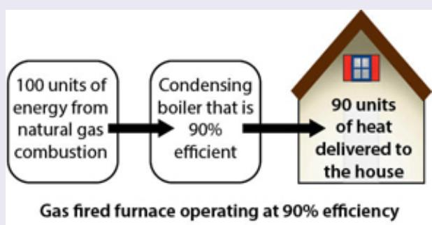</td><td>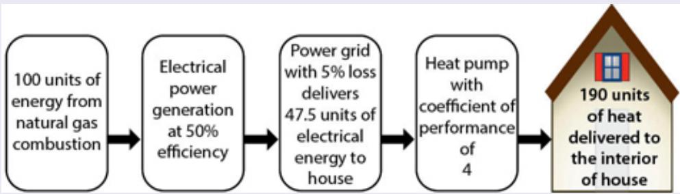</td></tr><tr><td colspan="2">Pages 163-173</td></tr><tr><td>14. Thermodynamics of Phase TransitionsMolecules in a liquid or solid are held together by intermolecular attraction. When a solid is heated, its temperature increases until the melting temperature is reached. The enthalpy of fusion, ΔH $_{fus}$ , is the molar enthalpy defining the amount of heat required to execute the phase transition from solid to liquid. The enthalpy of vaporization, ΔH $_{vap}$ , defines the amount of heat required to execute the phase transition from liquid to gas.</td><td colspan="2"></td></tr></table>

:::{figure} ../images/fig-p1-ch03-86.jpg
:name: fig-p1-ch03-86
:alt: Figure from the University Chemistry source textbook
:::

:::{figure} ../images/fig-p1-ch03-87.jpg
:name: fig-p1-ch03-87
:alt: Figure from the University Chemistry source textbook
:::

Pages 173-177

## BUILDING QUANTITATIVE REASONING

## CASE STUDY 3.1 T he Carnot Cycle: The Critical Link Between Spontaneity, Reversibility, and Heat Engine Efficiency

## KEY CONCEPTS:

Thermodynamics can answer some critically important questions: Why is 80% of the chemical energy contained in gasoline lost to heat and thus unavailable to propel an automobile? Why, even if coal is burned to produce electricity and that electricity is used to power an automobile, is only half as much chemical energy is expended to propel an electric automobile when compared to a gasoline powered automobile? Why is a diesel engine significantly more efficient than a gasoline engine? Why is a “heat pump” remarkably efficient for heating or cooling your home?

The answers to these, and many other questions, emerge from a powerful extension of the first law of thermodynamics. By virtue of early and remarkable insight by a young French physical chemist Nicolas Léonard Sadi Carnot who, through intellectual insight as discussed in the chapter, related the maximum amount of work that could be done by a reciprocating engine to the heat added in each cycle of the engine. That heat added could be supplied by the combustion of gasoline, the addition of steam, or the combustion of coal dust.

For example, the engine in a gasoline powered automobile, as displayed in Figure CS3.1a, engages four steps in a cycle (thus the terminology “4- cycle engine”). These steps are:

1. A compression stroke wherein the mixture of air and gasoline vapor is reduced in volume and thereby increased in pressure by the upward movement of a piston in a cylinder.

2. The power stroke initiated as the piston reaches the top of its stroke at which point the volume of fuel vapor and air is a minimum. At that point, an electrical “spark” across the gap of the sparkplug initiates the combustion of the fuel-air mixture. This detonation of the fuel-air releases the chemical energy as heat—a precipitous increase in temperature within the gases contained in the cylinder. This release of heat from the chemical reaction increases the temperature of the gases in the cylinder, which produces a requisite increase in pressure from the gas law P = nRT/V. This precipitous increase in pressure forces the piston downward, applying force through the connecting rod to the crankshaft. The crankshaft rotation supplies the torque to the driveshaft linking the crankshaft rotation through the transmission and differential to the drive wheels of the automobile.

:::{figure} ../images/fig-p1-ch03-88.jpg
:name: fig-p1-ch03-88
:alt: Figure from the University Chemistry source textbook
:::

3. At the bottom of the power stroke, a valve at the top of the cylinder opens, allowing the gases that are now composed of $\mathrm { N _ { 2 } , C O _ { 2 } , H _ { 2 } O }$ and any remaining $\mathrm { O } _ { 2 }$ (along with NO, CO, and other combustion products) to escape into the exhaust manifold that is connected to the exhaust pipe. The upward motion of the piston clears the cylinder of exhaust gases.

4. As the piston reaches the top of its stroke, the exhaust valve closes. As the piston moves downward, the “intake” valve opens, allowing a fresh mixture of fuel vapor and air to be drawn into the cylinder. As the piston reaches the bottom of its stroke, the intake valve closes and the power stroke is initiated as the piston begins to move up, compressing the fuel-air mixture. This returns us to step 1, above, in the sequence.

Intake valve open

Both valves closed

:::{figure} ../images/fig-p1-ch03-89.jpg
:name: fig-p1-ch03-89
:alt: Figure from the University Chemistry source textbook
:::

1—Compression

:::{figure} ../images/fig-p1-ch03-90.jpg
:name: fig-p1-ch03-90
:alt: Figure from the University Chemistry source textbook
:::

2—Ignition/Power Stroke
Exhaust valve open

:::{figure} ../images/fig-p1-ch03-91.jpg
:name: fig-p1-ch03-91
:alt: Figure from the University Chemistry source textbook
:::

3—Exhaust

:::{figure} ../images/fig-p1-ch03-92.jpg
:name: fig-p1-ch03-92
:alt: FIGURE CS3.1A The gasoline engine commonly found in automobiles is a prime example of a heat engine. In the case shown here, there are four steps involved in each “cycle” of the engine. Step 1 is the compression of the fuel-vapor and air mi
FIGURE CS3.1A The gasoline engine commonly found in automobiles is a prime example of a heat engine. In the case shown here, there are four steps involved in each “cycle” of the engine. Step 1 is the compression of the fuel-vapor and air mixture by the upward motion of the piston in the cylinder. Step 2 is the combustion of the fuel-air mixture initiated by the spark timed to occur when the piston has reached the top of the stroke that results in the power stroke. Step 3 cleans the cylinder of the combustion products. Step 4 draws a fresh charge of fuel-air into the cylinder.
:::


It is, therefore this four-step sequence that constitutes a full cycle of a "four cycle" gasoline engine. While this cycle is completed thousands of times per minute as you drive your car, the thermodynamic analysis is applied to a single sequence of the four steps that constitute a complete cycle.

Strategically what we are doing is quantitatively analyzing the net work done by the reciprocating engine represented by the cycle on the $p V$ diagram as shown in Figure CS3.1b.

:::{figure} ../images/fig-p1-ch03-93.jpg
:name: fig-p1-ch03-93
:alt: FIGURE CS3.1B A cycle for a “heat engine” that takes place on a pV diagram provides the relationship between the heat added to the system from the high temperature reservoir, the work done for each complete cycle, and the heat deposited in
FIGURE CS3.1B A cycle for a “heat engine” that takes place on a pV diagram provides the relationship between the heat added to the system from the high temperature reservoir, the work done for each complete cycle, and the heat deposited in the low temperature reservoir. This constitutes the basis for calculating the efficiency of the heat engine or any other system operating cyclically on a pV diagram.
:::


When we proceed in a clockwise direction around the cycle, work is produced as heat flows from the high temperature reservoir to the low temperature reservoir. The efficiency of the cycle is equal to the ratio of work produced to heat added, $W _ { \mathrm { n e t } } / q _ { \mathrm { a d d e d } } ,$ , for the cycle where (upper case) $\mathbf { W } _ { \mathrm { n e t } }$ is the net work done for the cycle and $q _ { \mathrm { a d d e d } }$ is the heat added for the cycle from the high temperature reservoir.

Our objective, therefore, is to calculate the ratio $W _ { \mathrm { n e t } } / q _ { \mathrm { a d d e d } }$ where $\mathbf { W } _ { \mathrm { n e t } }$ represents the net work for the full cycle and $q _ { \mathrm { a d d e d } }$ is the heat added to the system at the high temperature reservoir for the full cycle.

A key "question" of great practical importance is: why is a diesel engine so much more efficient than a gasoline engine? To answer this question, we review how to determine the work done in a cycle on the pV diagram.

## The Carnot Cycle and the Critical Link Between Spontaneity and Reversibility

A young French engineer by the name of Sadi Carnot published a paper in 1824 with the title “On the Motive Power of Heat.” While it was one of a very few papers Carnot published for which we have a record (he died of cholera at age 36 and was buried with many of his manuscripts), it is a hallmark of human intelligence. What Carnot realized was that all engines (primarily steam engines at the time) are simply mechanical devices that convert heat (from steam or fuel) into work in a repeating cycle. The engine performs by simply repeating the same sequence over and over again. Carnot reasoned that if he could bring logic to a full cycle of the engine, he could discover the theoretical limit to the engine's efficiency, ε, which could be expressed as

```{math}
:label: eq-p1-ch03-201
\varepsilon = \frac {\text { work   done   by   the   engine   in   a   cycle }}{\text { heat   added   in   a   cycle }}
```


To this end, Carnot constructed a closed cycle on the pV diagram such that:

1. The cycle returned to its original position on a pV diagram.

2. The cycle was constructed of four stages or legs.

3. Each of those stages was carried out reversibly, which meant that each leg was comprised of a large number of small increments. The reason each stage had to progress reversibly was that, as we will see, this defines the maximum efficiency of the cycle for producing work from a given amount of heat, where the heat is supplied by burning fuel.

4. The four reversible stages of the "Carnot cycle" consisted of a pair of isothermal trajectories and a pair of adiabatic trajectories on a pV diagram shown in Figure CS3.1c.

:::{figure} ../images/fig-p1-ch03-94.jpg
:name: fig-p1-ch03-94
:alt: FIGURE CS3.1C The Carnot cycle is comprised of four reversible paths on a mathematical notation diagram. Path I and III are reversible isothermal legs for which pV = constant. Path II and IV are reversible adiabatic legs for which pVγ = con
FIGURE CS3.1C The Carnot cycle is comprised of four reversible paths on a $p V$ diagram. Path I and III are reversible isothermal legs for which pV = constant. Path II and IV are reversible adiabatic legs for which pVγ = constant with $\gamma = \gamma _ { \sf P } / \gamma = 5 / 3$ . Heat $q _ { \mathrm { h } }$ is taken up from a high temperature reservoir at temperature ${ \sf T } _ { \sf h }$ during path I. Heat $q _ { \mathrm { c } }$ is discharged into the cold reservoir in path III at temperature ${ \sf T } _ { \sf c } .$ The net work done is given by the area enclosed by the cycle on the $p V$ plot.
:::


We consider each leg of the closed cycle in order:

## Leg I

The first segment is an isothermal expansion with the addition of heat $\mathbf { q } _ { \mathrm { h } }$ at high temperature, $\mathrm { { T _ { h } } }$ . From the First Law of Thermodynamics,

```{math}
:label: eq-p1-ch03-202
\Delta \mathbf {U} _ {\mathrm{I}} = \mathbf {q} _ {\mathrm{I}} + \mathbf {w} _ {\mathrm{I}} = \mathbf {q} _ {\mathrm{h}} + \mathbf {w} _ {\mathrm{I}}
```


Because the first segment, I in Figure CS3.1c, is isothermal, it follows that $\Delta \mathrm { U } _ { \mathrm { I } } = \mathbf { 0 }$ and thus $\mathbf { q } _ { \mathrm { h } } = - \mathbf { w } _ { \mathrm { I } }$ Because heat enters the system, $\mathbf { q } _ { \mathrm { h } }$ is positive, and the gas expands and does work.

This first isothermal segment in the Carnot cycle appears to be a simple transition on a pV diagram, but in fact, it contains key aspects linking spontaneous change with the concept of reversibility and the concept of equilibrium in a thermodynamic system. The conceptual links develop as follows.

We know that for the case of constant pressure, where we will take that pressure to be the external pressure, $\mathrm { p } _ { \mathrm { e x t } } ,$ the work is just

```{math}
:label: eq-p1-ch03-203
\mathbf {w} = - \mathbf {p} _ {\mathrm{ext}} \Delta \mathbf {V}
```


To make this quantitative, we choose the example of one mole of an ideal gas at 273 K with an initial pressure $\mathrm { p } _ { 1 } = 2 . 0$ atm and an initial volume $\mathrm { V _ { 1 } }$ $= 1 1 . 2 \ \ell$ The gas expands isothermally (as our first stage in the Carnot cycle) to a final state at 273 K, $\mathbf { p } _ { 2 } = \mathbf { 1 . 0 }$ atm, and $\mathrm { V } _ { 2 } = 2 2 . 4 \ : \ell$ . Now comes the critical distinction linking spontaneity with irreversibility. $I f _ { \mathrm { \tiny ~ P e x t } } < \mathrm { \bf ~ p }$ (where p is the pressure within the cylinder), the gas will expand spontaneously to the final state with ${ \bf p } = { \bf p } _ { \mathrm { e x t } } = { \bf 1 . 0 }$ atm. We can represent this course of action on a $p V$ diagram (as we did in the sidebar on page 172) displayed in the top panel of Figure CS3.1e on the following page by two legs linking state 1 and state 2. The first leg is the drop in pressure from $\mathrm { p } _ { \mathrm { e x t } } = 2 . 0$ atm to $\mathrm { p } _ { \mathrm { e x t } } = 1 . 0$ atm at the fixed volume of 11.2 ℓ. The next leg is the expansion from 11.2 ℓ to 22.4 ℓ at the fixed pressure of $\mathrm { p } _ { \mathrm { e x t } } = 1 . 0$ atm. This constitutes the trajectory displayed in the upper panel of Figure CS3.1e. The work done by the gas, $- \mathrm { p } _ { \mathrm { e x t } } \Delta \mathrm { V } _ { \mathrm { : } }$ , is simply the area under the curve of $\mathrm { p } _ { \mathrm { e x t } }$ versus volume with $\mathrm { p } _ { \mathrm { e x t } } = 1 . 0$ atm.

However, we know that the work done by the expanding gas is just equal to the area under the curve of p vs. V as delineated in this chapter. This fact leads us to four very important observations:

(a) If we proceed from State 1 to State 2 in small increments, as shown in the lower panel in Figure CS3.1e, the area under the curve connecting the initial state with the final state increases significantly in comparison with the irreversible path. In fact, in the limit of these pressure steps approaching zero (limit $\Delta \mathfrak { p } \to \mathbf { o } ) \ \Delta \mathfrak { p } _ { \mathrm { l i m i t } }$ = dp, the trajectory will approach a smooth curve resulting in the achievement of the maximum area under the curve in the pV plot in the lower panel of Figure CS3.1e. This would yield the maximum amount of work by the system given the initial and final states.

(b) If we chose to incrementally increase the pressure, $\mathrm { p } _ { \mathrm { e x t } } ,$ at any point in this sequence of small pressure changes we could step reversibly back up the trajectory in the lower panel in Figure CS3.1e, ultimately returning to the initial state.

(c) If we precipitously drop the pressure from 2.0 atm to 1.0 atm, following the trajectory in the upper panel of Figure CS3.1e, the system will expand inexorably to the final state. The amount of work, w, done by the system would then be considerably less than if we followed the incremental path depicted in the upper trajectory of Figure CS3.1e. The expansion under these conditions would be spontaneous, but would not be reversible. We cannot work our way backwards along the lower path, retracing our steps to the initial state following the trajectory in the upper panel of Figure CS3.1e backwards.

(d) We thus have created an important distinction wherein an irreversible path is spontaneous and a reversible path is nonspontaneous. In fact, in the limit of very small increases or decreases in $\mathrm { p } _ { \mathrm { e x t } } ,$ the system has no propensity to change its state and thus it is in equilibrium. We have, therefore, pairs of contrasting conditions that turn out to be very important for understanding thermodynamic systems. Figure CS3.1d displays these closely related concepts by linking opposites across the diagram and equivalents down the diagram.

:::{figure} ../images/fig-p1-ch03-95.jpg
:name: fig-p1-ch03-95
:alt: FIGURE CS3.1D While the concepts of reversibility, spontaneous change, and equilibrium at first look unrelated, in thermodynamics they are closely associated. Displayed here are opposites and equivalents. These relationships are very import
FIGURE CS3.1D While the concepts of reversibility, spontaneous change, and equilibrium at first look unrelated, in thermodynamics they are closely associated. Displayed here are opposites and equivalents. These relationships are very important in the analysis of thermodynamic systems.
:::


On the face of it, the nonspontaneous, reversible, equilibrium case seems to be of little value for any real system. However, as Figure CS3.1e graphically displays, the reversible case is the one for which the work extracted is a maximum. This is the reason the reversible limiting case is so important—it puts in place quantitatively the maximum amount of work that can be produced by the system in this first leg of the cycle.

:::{figure} ../images/fig-p1-ch03-96.jpg
:name: fig-p1-ch03-96
:alt: Figure from the University Chemistry source textbook
:::

:::{figure} ../images/fig-p1-ch03-97.jpg
:name: fig-p1-ch03-97
:alt: FIGURE CS3.1E Irreversible and nearly reversible isothermal expansions illustrated by gas in a cylinder pushing a piston against the atmosphere. For the irreversible path, the disk weights, which compress the gas to a pressure greater than
FIGURE CS3.1E Irreversible and nearly reversible isothermal expansions illustrated by gas in a cylinder pushing a piston against the atmosphere. For the irreversible path, the disk weights, which compress the gas to a pressure greater than atmospheric, are removed all at once, whereas for the nearly reversible path the weights are removed one at a time. The latter path takes longer, but produces more work. A closer approximation to a reversible expansion would be achieved by replacing the weights with a tall beaker of sand, and removing the sand one grain at a time. The expansion could be reversed by replacing a grain of sand. The $p V$ diagram at the bottom of the figure illustrates these two paths. The work done by the system (the gas) is the area under the $P$ versus V curve in each case. The darker blue area gives the extra work gained by running the process reversibly. The stair-step curve shows the approximation to the reversible limit obtained by removing the weights one at a time. To construct the $p V$ diagram, 1 mol of gas at 273 K is assumed to behave ideally. The cylinder would have to be in good thermal contact with an ice bath to maintain constant temperature.
:::


We can calculate the work for the reversible path in Figure CS3.1e just as we did in Figure 3.31:

```{math}
:label: eq-p1-ch03-204
\begin{array}{r l} - w _ {r e v} & = \int_ {V _ {1}} ^ {V _ {2}} \mathrm{PdV} = \int_ {V _ {1}} ^ {V _ {2}} \frac {n R T}{V} d V = n \mathrm{RT} \int_ {V _ {1}} ^ {V _ {2}} d V / V \\ & = \mathrm{nRT} \ln \left(\frac {\mathrm{V} _ {2}}{\mathrm{V} _ {1}}\right) \end{array}
```


This is, in fact, a mathematical expression for the area under the curve in the lower panel of Figure CS3.1e—the quantitative expression for the reversible work done in the first leg of the Carnot cycle shown in Figure CS3.1c.

We can repeat the calculation for the irreversible path in the upper panel of Figure CS3.1d. It is just

```{math}
:label: eq-p1-ch03-205
- \mathrm{w} _ {\mathrm{irrev}} = \mathrm{p} _ {2} \Delta \mathrm{V} = \mathrm{p} _ {2} (\mathrm{V} _ {2} - \mathrm{V} _ {1}) = \mathrm{nRT} (1 - \mathrm{V} _ {1} / \mathrm{V} _ {2})
```


With $\mathrm { R } = 8 . 3 1 ~ \mathrm { J / K - m o l }$ and the values of $\mathrm { V _ { 1 } }$ and $\mathrm { V } _ { 2 }$ from the previous page we have

```{math}
:label: eq-p1-ch03-206
- \mathrm {w_ {rev}} = 1 5 7 0 \mathrm{joules}
```


```{math}
:label: eq-p1-ch03-207
- \mathrm {w_ {irrev} = 1130 joules}
```


The ratio is thus

```{math}
:label: eq-p1-ch03-208
\frac {\mathrm{w} _ {\text { rev }}}{\mathrm{w} _ {\text { irrev }}} = \frac {1 5 7 0}{1 1 3 0} = \frac {\ln (2)}{\frac {1}{2}} = 1. 3 9
```


so the reversible path represents an amount of work 39% greater than the irreversible path. But here is a key point. For a reversible compression, all that is involved is a reversal in sign because we work incrementally back up the reversible curve and the work done on the system in compression is equal in magnitude but opposite in sign to the work done reversibly by the system in expansion. The irreversible path is a different matter. If we wish to recompress gas from $\mathrm { V } _ { 2 } = 2 4 . 2$ liters at constant $\mathrm { P _ { e x t } , }$ we would need 2.0 atm pressure and twice as much work would be done on the gas as was done by the gas in the expansion step. We can summarize two important conclusions:

1. Reversible expansion yields maximum work and reversible compression requires minimum work.

2. Irreversible expansion yields less than maximum work and irreversible compression requires greater than minimum work.

Now we are ready to consider the remaining three legs of the Carnot cycle displayed in Figure CS3.1c.

## Leg II

The second leg is an adiabatic expansion, so ${ \textbf { q } } = { \textbf { 0 } }$ Because of the continued expansion, work is being done, but with q = 0, no heat is added and the internal energy and temperature must decrease:

```{math}
:label: eq-p1-ch03-209
\Delta \mathbf {U} _ {\mathrm{II}} = \mathbf {n c} _ {\mathrm{v}} \Delta \mathbf {T} _ {\mathrm{II}} = \mathbf {w} _ {\mathrm{II}}
```


where all quantities are negative. If the final temperature is $\mathrm { T _ { c } , }$ then $\Delta \mathrm { T } _ { \mathrm { I I } }$ $= \mathrm { T _ { h } - T _ { c } , }$ because in Leg I we followed an isothermal trajectory along $\mathrm { T } =$ $\mathrm { { T _ { h } } }$

## Leg III

At this point in the Carnot cycle, all the work has been extracted and it is now necessary to find our way back to the initial state so the cycle can begin again from the same initial point in the $p V$ diagram. This can be accomplished in two steps, one isothermal and the second adiabatic. Leg III is an isothermal compression in which the heat ${ \bf q } _ { \mathrm { c } }$ is produced by the compression and deposited in the cold reservoir at temperature $\mathrm { T _ { c } } .$ Because the trajectory on the $p V$ diagram is isothermal, $\Delta \mathrm { U } _ { \mathrm { I I I } } = 0$ and ${ \mathfrak { q } } _ { \mathrm { c } } =$ $- \mathbf { w } _ { \mathrm { I I I } }$ with $\mathbf { q } _ { \mathrm { c } } < \mathbf { o }$ so heat flows out of the system. The amount of work is, from our expression for isothermal work, just the now familiar expression

```{math}
:label: eq-p1-ch03-210
- \mathrm {w_ {III}} = \mathrm {nRT_ {c}} \ln (\mathrm {V_ {4} / V_ {3}}).
```


## Leg IV

The final leg brings us back to the initial state along an adiabatic trajectory so q again is zero and

```{math}
:label: eq-p1-ch03-211
\Delta \mathrm{U} _ {\mathrm{IV}} = \mathrm{nc} _ {\mathrm{v}} \Delta \mathrm{T} _ {\mathrm{IV}} = \mathrm{w} _ {\mathrm{IV}}
```


where all quantities are positive and

```{math}
:label: eq-p1-ch03-212
\Delta \mathrm{T} _ {\mathrm{IV}} = \mathrm{T} _ {\mathrm{c}} - \mathrm{T} _ {\mathrm{h}}
```


What distinguishes the Carnot cycle is that each leg is carried out reversibly between temperatures $\mathrm { T _ { h } }$ and $\mathrm { T _ { c } } .$ Importantly, this ensures the maximum work in expansion and the minimum work in compression. This was exactly what Carnot wanted because his objective was to determine the theoretical upper limit for the efficiency of the heat engine in converting heat to work.

That maximum theoretical efficiency, $\mathbf { \delta } \mathbf { \varepsilon } _ { \mathbf { \varepsilon } }$ is then simply the net work extracted for the given amount of heat added, $\mathrm { q _ { h } } ,$ so

```{math}
:label: eq-p1-ch03-213
\varepsilon = \frac {- \left(\mathrm{w} _ {\mathrm{I}} + \mathrm{w} _ {\mathrm{II}} + \mathrm{w} _ {\mathrm{III}} + \mathrm{w} _ {\mathrm{IV}}\right)}{\mathrm{q} _ {h}}
```


First we note that the work terms, n $\mathrm { c } _ { \mathrm { v } } \Delta \mathrm { T }$ from our analysis of Leg II and Leg IV, exactly cancel so

```{math}
:label: eq-p1-ch03-214
\varepsilon = \frac {- \left(\mathrm{w} _ {\mathrm{I}} + \mathrm{w} _ {\mathrm{III}}\right)}{\mathrm{q} _ {h}}
```


But also for the isothermal stages legs I and III that $- \mathbf { w } = \mathbf { q } \ \mathbf { s } \mathbf { o }$

```{math}
:label: eq-p1-ch03-215
\varepsilon = \frac {\mathrm{q} _ {h} + \mathrm{q} _ {c}}{\mathrm{q} _ {h}}
```


Gathering the terms for each of the four legs:

```{math}
:label: eq-p1-ch03-216
\mathrm {w_ {I} = - nRT_ {h} \ln(V_ {2} / V_ {1})}
```


```{math}
:label: eq-p1-ch03-217
\mathbf {w} _ {\mathrm{II}} = \mathbf {n c} _ {\mathrm{v}} (\mathbf {T} _ {\mathrm{h}} - \mathbf {T} _ {\mathrm{c}})
```


```{math}
:label: eq-p1-ch03-218
\mathrm {w_ {III} = - nRT_ {c} \ln(V_ {4} / V_ {3})}
```


```{math}
:label: eq-p1-ch03-219
\mathbf {w} _ {\mathrm{IV}} = \mathbf {n c} _ {\mathrm{v}} (\mathbf {T} _ {\mathrm{c}} - \mathbf {T} _ {\mathrm{h}})
```


We have

```{math}
:label: eq-p1-ch03-220
\varepsilon = \frac {\mathrm {nRT_ {h}} \ln \left(\frac {\mathrm{V} _ {2}}{\mathrm{V} _ {1}}\right) + \mathrm {nRT_ {c}} \ln \left(\frac {\mathrm{V} _ {4}}{\mathrm{V} _ {3}}\right)}{\mathrm {nRT_ {h}} \ln \left(\frac {\mathrm{V} _ {2}}{\mathrm{V} _ {1}}\right)}
```


Again because $\mathbf { w } _ { \mathrm { I I } }$ and $\mathbf { w } _ { \mathrm { I V } }$ are equal but opposite in sign, they cancel. But Leg II allows us to simplify this expression for the efficiency, $\varepsilon ,$ because

```{math}
:label: eq-p1-ch03-221
\mathrm{d} \mathbf {U} = \mathrm{d} \mathbf {q} + \mathrm{dw} \text {and if} \mathrm{d} \mathbf {q} = \mathbf {0}
```


```{math}
:label: eq-p1-ch03-222
\mathrm{d} \mathbf {U} = \mathrm{d} \mathbf {w}
```


But $\mathbf { d U } = \mathbf { n c } _ { \mathrm { v } } \mathbf { d T }$ and

```{math}
:label: eq-p1-ch03-223
\mathrm{dw} = - \mathrm{pdV} = - \frac {\mathrm{nRT}}{\mathrm{V}} \mathrm{dV}
```


so with $\mathrm { n c _ { v } d T = - n R T \ d V / V _ { : } }$ ,

we have

```{math}
:label: eq-p1-ch03-224
\mathrm{nc} _ {\mathrm{V}} \int_ {\mathrm{T} _ {\mathrm{h}}} ^ {\mathrm{T} _ {\mathrm{C}}} \mathrm{dT} / \mathrm{T} = - \mathrm{nR} \int_ {\mathrm{V} _ {2}} ^ {\mathrm{V} _ {3}} \mathrm{dV} / \mathrm{V}
```


and

```{math}
:label: eq-p1-ch03-225
\mathrm {nc_ {v} \ln(T_ {c} / T_ {h}) = - nR\ln(V_ {3} / V_ {2})}
```


Leg IV yields the same result with the temperature limits reversed and the volume ratio $\mathrm { V _ { 1 } / V _ { 4 } }$ such that

```{math}
:label: eq-p1-ch03-226
\mathrm {nc_ {v} \ln(T_ {h} / T_ {c}) = - nR\ln(V_ {1} / V_ {4})}
```


Because ln $\left( \mathrm { x } _ { 2 } / \mathrm { x } _ { 1 } \right) = - \ln \left( \mathrm { x } _ { 1 } / \mathrm { x } _ { 2 } \right)$ we have

```{math}
:label: eq-p1-ch03-227
\begin{array}{r l} \mathrm {nc_ {v}} \ln \left(\frac {\mathrm {T_ {c}}}{\mathrm {T_ {h}}}\right) & = - \mathrm {nc_ {v}} \ln \left(\frac {\mathrm {T_ {h}}}{\mathrm {T_ {c}}}\right) = \mathrm{nRln} \left(\frac {\mathrm {V_ {3}}}{\mathrm {V_ {2}}}\right) \\ & = - \mathrm{nRln} \left(\frac {\mathrm {V_ {1}}}{\mathrm {V_ {4}}}\right) \end{array}
```


or, with cancellation $\mathrm { V _ { 3 } / V _ { 2 } = V _ { 4 } / V _ { 1 } }$ or $\mathrm { V _ { 2 } / V _ { 1 } = V _ { 3 } / V _ { 4 } }$ and

```{math}
:label: eq-p1-ch03-228
\begin{array}{r l} \varepsilon & = \frac {\mathrm {nRT_ {h}} \ln \left(\frac {\mathrm {V_ {2}}}{\mathrm {V_ {1}}}\right) + \mathrm {nRT_ {c}} \ln \left(\frac {\mathrm {V_ {4}}}{\mathrm {V_ {3}}}\right)}{\mathrm {nRT_ {h}} \ln \left(\frac {\mathrm {V_ {2}}}{\mathrm {V_ {1}}}\right)} \\ & = \frac {\mathrm {T_ {h}} \ln \left(\frac {\mathrm {V_ {2}}}{\mathrm {V_ {1}}}\right) + \mathrm {T_ {c}} \ln \left(\frac {\mathrm {V_ {4}}}{\mathrm {V_ {3}}}\right)}{\mathrm {T_ {h}} \ln \left(\frac {\mathrm {V_ {2}}}{\mathrm {V_ {1}}}\right)} \\ & = \frac {\mathrm {T_ {h}} - \mathrm {T_ {c}}}{\mathrm {T_ {h}}} \end{array}
```


Thus our initially complex expression for the maximum theoretical efficiency of a heat engine collapses sequentially through a series of cancellations. We review the sequence as follows:

```{math}
:label: eq-p1-ch03-229
\varepsilon = \frac {- \left(\mathrm{w} _ {\mathrm{I}} + \mathrm{w} _ {\mathrm{II}} + \mathrm{w} _ {\mathrm{III}} + \mathrm{w} _ {\mathrm{IV}}\right)}{\mathrm{q} _ {\mathrm{h}}}
```


```{math}
:label: eq-p1-ch03-230
= \frac {\mathrm {nRT_ {h} \ln\left(\frac {V _ {2}}{V _ {1}}\right) - nc_ {v} (T_ {h} - T_ {c}) + nRT_ {c} \ln\left(\frac {V _ {4}}{V _ {3}}\right) + nc_ {v} (T_ {h} - T_ {c})}}{\mathrm {nRT_ {h} \ln\left(\frac {V _ {2}}{V _ {1}}\right)}}
```


cancellation of

```{math}
:label: eq-p1-ch03-231
\mathrm{nc} _ {\mathrm{v}} \left(\mathrm{T} _ {\mathrm{h}} - \mathrm{T} _ {\mathrm{c}}\right)
```


for legs II & IV

leads to

```{math}
:label: eq-p1-ch03-232
\varepsilon = \frac {\mathrm {nRT_ {h} ln\left(\frac {V_ {2}}{V_ {1}}\right) + nRT_ {c} ln\left(\frac {V_ {4}}{V_ {3}}\right)}}{\mathrm {nRT_ {h} ln\left(\frac {V_ {2}}{V_ {1}}\right)}}
```


```{math}
:label: eq-p1-ch03-233
\mathrm{V} _ {2} / \mathrm{V} _ {1} = \mathrm{V} _ {3} / \mathrm{V} _ {4}
```


```{math}
:label: eq-p1-ch03-234
\ln \left(\frac {\mathrm{V} _ {2}}{\mathrm{V} _ {1}}\right) = - \ln \left(\frac {\mathrm{V} _ {4}}{\mathrm{V} _ {3}}\right)
```


cancellation leads to

```{math}
:label: eq-p1-ch03-235
\varepsilon = \frac {\mathrm {nRT_ {h} - nRT_ {c}}}{\mathrm {nRT_ {h}}}
```


cancellation yields

```{math}
:label: eq-p1-ch03-236
\varepsilon = \frac {\mathrm{T} _ {\mathrm{h}} - \mathrm{T} _ {\mathrm{c}}}{\mathrm{T} _ {\mathrm{h}}}
```


The conclusion is remarkable and strikingly simple. It says, quantitatively, that the efficiency of the Carnot engine depends only on the temperatures of the hot and cold reservoirs and not on any of the details of the heat engine itself. Because the Carnot cycle is based upon reversible pathways it represents the maximum efficiency possible and thus a heat engine cannot be 100% efficient as long as $\mathrm { { T _ { h } } }$ and $\mathrm { T _ { c } }$ are finite.

We can now, using this expression for the maximum efficiency of a heat engine in terms of the hot and cold reservoir temperatures, $\mathrm { { T _ { h } } }$ and $\mathrm { T _ { c } }$ respectively, summarize the efficiency of the Carnot cycle in terms of either temperature or the heat added using equation 3.3 so

```{math}
:label: eq-p1-ch03-237
\varepsilon_ {\mathrm{Carnot}} = \frac {\mathrm{T} _ {\mathrm{h}} - \mathrm{T} _ {\mathrm{c}}}{\mathrm{T} _ {\mathrm{h}}} = \frac {\mathrm{q} _ {\mathrm{h}} + \mathrm{q} _ {\mathrm{c}}}{\mathrm{q} _ {\mathrm{h}}} \tag{3.3}
```


As we will see in the next chapter, this link between heat and temperature in the Carnot cycle and the related relationships between reversibility, spontaneity, and equilibrium leads to the quantitative foundation for the new state variable, entropy.

## Problem 1

If an automobile of mass 1200 kg employs a gasoline $\mathrm { ( C _ { 8 } H _ { 1 8 } ) }$ engine that we model here as a heat engine for which the Carnot Cycle is applicable, calculate the height in meters that can be obtained if the automobile is ascending a slope and has 1 gallon of fuel available. Assume the exhaust temperature at the exhaust valve is $7 6 0 ^ { \circ } \mathrm { C }$ and the engine cylinder temperature at the top of the stroke is $2 2 0 0 ^ { \circ } \mathrm { C } .$

## Problem 2

A Carnot engine operates between two temperature reservoirs maintained at $2 0 0 ^ { \mathrm { { o } C } }$ and $2 0 ^ { \mathrm { { o } } } \mathrm { { C } }$ respectively. If the desired output of the engine is 15 kW, determine (i) the heat transferred per second from the hightemperature reservoir and (ii) the heat transferred per second to the lowtemperature reservoir.

## BUILDING A TECHNOLOGY BACKBONE

## CASE STUDY 3.2 Thermodynamics, Heat Pumps, and the Personal Energy Budget

## KEY CONCEPTS:

## Heat Pumps

Residing in most kitchens is a device that moves heat from one place to another, decreasing the temperature in one place and increasing it in another. It's the refrigerator, and its thermodynamic cycle is shown in Figure CS3.2a. Heat is transferred from a cold reservoir at temperature $T _ { \mathrm { C } }$ by virtue of the input of work, $W _ { i n } ,$ expended to move that heat to the high temperature reservoir at temperature $T _ { \mathrm { H } }$ . If you pull the refrigerator away from the wall, you will notice that the back of the refrigerator is quite warm relative to the surrounding air and dramatically warmer than the air in the refrigerator or freezer. The fact that the refrigerator is plugged into the wall and that the compressor can be heard operating immediately suggests that work (mechanical energy) is being expended to move heat from the interior of the refrigerator into the surrounding room.

:::{figure} ../images/fig-p1-ch03-98.jpg
:name: fig-p1-ch03-98
:alt: FIGURE CS3.2A The thermodynamic cycle for a heat pump (or refrigerator) is displayed emphasizing that by doing work on the system, Win, heat is transferred from the low temperature reservoir to the high temperature reservoir.
FIGURE CS3.2A The thermodynamic cycle for a heat pump (or refrigerator) is displayed emphasizing that by doing work on the system, Win, heat is transferred from the low temperature reservoir to the high temperature reservoir.
:::


The first question is, what is the efficiency of “moving heat around?” Herein lies the power of the Carnot Cycle! We invested all the effort in Chapter 3 and Case Study 3.1 to answer this question for a “heat engine” whose purpose is to take heat at high temperature to do work and then exhaust the remaining heat to a low temperature reservoir. Are things different for a “cold engine” that moves heat from a cold reservoir to a warm one? An inspection of the diagram for a heat engine when compared to the diagram for a heat pump (Figure CS3.2b) reveals that they are virtually identical. The primary difference is that the heat engine, moving clockwise around the Carnot cycle, takes in heat at high temperature, produces work, and expels heat to a low temperature reservoir. If the cycle runs backwards, it requires work but, by virtue of that work, heat is transferred from a low temperature reservoir to a high temperature reservoir.

## Heat Engines

Devices that transform heat into work. They require two energy reservoirs at different temperatures.

:::{figure} ../images/fig-p1-ch03-99.jpg
:name: fig-p1-ch03-99
:alt: Figure from the University Chemistry source textbook
:::

Thermal Efficiency:

Second law limit:

```{math}
:label: eq-p1-ch03-238
\varepsilon_ {\mathrm{CARNOT}} = \frac {W _ {\mathrm{out}}}{q _ {\mathrm{H}}} = \frac {\text { what   you   get }}{\text { what   you   pay }}
```


```{math}
:label: eq-p1-ch03-239
\varepsilon_ {\mathrm{CARNOT}} \leq 1 - \frac {T _ {\mathrm{c}}}{T _ {\mathrm{H}}}
```


## Heat Pumps

Devices that use work to transfer heat from a colder object to a hotter object.

Work must be done to transfer energy from cold to hot. W

:::{figure} ../images/fig-p1-ch03-100.jpg
:name: fig-p1-ch03-100
:alt: Figure from the University Chemistry source textbook
:::

Heat energy is extracted from the cold reservoir.

Energy $q _ { \mathrm { _ H } } = q _ { \mathrm { c } } + W _ { \mathrm { i n } }$ is exhausted to the hot reservoir.

Cyclical Process

```{math}
:label: eq-p1-ch03-240
\left(\Delta E _ {\mathrm{th}}\right) _ {\mathrm{net}} = 0
```


Coefficient of performance:

```{math}
:label: eq-p1-ch03-241
\mathrm{COP} _ {\mathrm{HP}} = \frac {q _ {\mathrm{H}}}{W _ {\mathrm{in}}} = \frac {\text { what   you   get }}{\text { what   you   pay }}
```


Second law limit for a heat pump that is used to heat a house:

```{math}
:label: eq-p1-ch03-242
\mathrm{COP} _ {\mathrm{HP}} \leq \frac {T _ {\mathrm{H}}}{T _ {\mathrm{H}} - T _ {\mathrm{C}}}
```


FIGURE CS3.2B A direct comparison is displayed between the thermodynamic cycle of the heat engine in the upper panel and the heat pump or refrigerator in the lower panel.

So what is the theoretical efficiency of such a “heat pump” that moves heat from a low temperature reservoir (e.g. the outside at temperature $T _ { \mathrm { C } } )$ to a high temperature reservoir (e.g. the inside of the house at temperature $T _ { \mathrm { H } } ) \Rsh$ We can determine this, as is done in the sidebar, by a minor modification of our full treatment in Case Study 3.1, and write the efficiency of the heat pump, $\varepsilon _ { \mathrm { H P } } ,$ as

```{math}
:label: eq-p1-ch03-243
\varepsilon_ {\mathrm{HP}} = \frac {T _ {\mathrm{H}}}{T _ {\mathrm{H}} - T _ {\mathrm{C}}}
```


where $T _ { \mathrm { C } }$ is the temperature of the cold reservoir, the outside temperature, and $T _ { \mathrm { H } }$ is the high temperature reservoir, the inside of the house.

To see what this means, let's assume the outside temperature is at the freezing point, $\mathbf { 0 } ^ { \circ } \mathbf { C }$ . But $T _ { 1 }$ must be the temperature absolute, in Kelvin, so $T _ { \mathrm { C } } = 2 7 3 \mathrm { K }$ . If we wish the inside temperature to be $\scriptstyle 2 0 ^ { \circ } \mathrm { C } ,$ , then $T _ { \mathrm { H } } = 2 9 3 \ : \mathrm { K }$ Thus our theoretical maximum coefficient of performance (COP, as it is commonly referred to for heat pumps), for simply moving heat from reservoir 1 (outside) at temperature $T _ { 1 }$ (273 K) to reservoir 2 (inside the house) at temperature $T _ { \mathrm { { 2 } } } ,$ (293 K) is

```{math}
:label: eq-p1-ch03-244
\mathrm{COP} _ {\mathrm{HP}} = \frac {T _ {2}}{T _ {2} - T _ {1}} = \frac {2 9 3 \mathrm{K}}{2 0 \mathrm{K}} \approx 1 5
```


This is a remarkable result, because it says that we can move 15 times as much thermal energy (i.e. heat) as the amount of work expended (i.e. electricity). The “Carnot efficiency” is the theoretical maximum—in practice the actual efficiency that can be achieved by a heat pump is between $4$ and 5 depending on the sophistication of the equipment. But this, it turns out, is very important. It says that even at the lower end of the efficiency range, for every kilowatt of electrical power delivered to the heat pump, four to five kilowatts of heat are delivered into the house. In fact, a run-of-the-mill heat pump will deliver $4$ kWh of heat to the house for every kWh of electrical power delivered to the heat pump. State-ofthe-art systems will deliver 5 kWh of heat for every 1 kWh of electrical energy. To emphasize how important this is, consider the following example. If we use electricity to power a space heater, we will put 1 kWh of heat into the house for each kWh of electricity we purchase. This is an efficiency of 100%. If we use a heat pump to do the same thing, from a standard issue heat pump 4 kWh of heat enter the house for each kWh of power put into the heat pump—an efficiency of 400%!

There are typically two types of heat pumps. One variety uses a heat exchanger operating in air such that the outside air is cooled (heat is extracted) by transferring heat from the atmosphere to the inside of the house. This is called an “air source” heat pump. The other type uses cooling loops buried in the ground, cooling the ground outside by drawing heat from the ground and moving it to the inside of the house. This is called a “ground source” heat pump with the outside unit consisting of a box that sits outside the house and the heating/cooling unit that is inside the house. These devices can operate in either direction: heating in winter and cooling in summer.

We are now equipped with the information needed to calculate the impact of the heat pump on energy efficiency for the heating of buildings and homes. The first step is to track the implications of using a heat pump to warm houses, buildings, factories, etc. by comparing the heat delivered relative to the energy invested. Let's assume we begin with 100 units of energy delivered by the combustion of natural gas for two examples:

## Example 1:

A condensing boiler that is 90% efficient. We can diagram this in a single step as displayed in Figure CS3.2c.

:::{figure} ../images/fig-p1-ch03-101.jpg
:name: fig-p1-ch03-101
:alt: FIGURE CS3.2C A schematic tracking 100 units of energy contained in natural gas that is combusted in a furnace with 90% efficiency to heat a house directly, yielding 90 units of heat energy.
FIGURE CS3.2C A schematic tracking 100 units of energy contained in natural gas that is combusted in a furnace with 90% efficiency to heat a house directly, yielding 90 units of heat energy.
:::


The result is that of the 100 units of energy invested, 90 units of heat are delivered to the interior of the house or building.

## Example 2:

The generation of electricity in a modern electrical power generating plant fueled by natural gas is approximately 50% of the chemical energy contained in the natural gas $\mathrm { ( C H } _ { 4 } )$ . If we assume a transmission loss of 5% in the power delivery grid, this results in (0.95)(0.50) 100 units = 47.5 units of electrical energy delivered to the house or building. A diagram of the sequence from the combustion of natural gas to the electrical energy delivered to the house is displayed in Figure CS3.2d. A coefficient of performance by the heat pump of 4 is assumed.

:::{figure} ../images/fig-p1-ch03-102.jpg
:name: fig-p1-ch03-102
:alt: FIGURE CS3.2D An alternative approach using a heat pump with a coefficient of performance (COP) of 4. One hundred units of chemical energy from natural gas produces 50 units of electrica energy (50% efficiency) of which 95%, 47.5 units, is
FIGURE CS3.2D An alternative approach using a heat pump with a coefficient of performance (COP) of 4. One hundred units of chemical energy from natural gas produces 50 units of electrica energy (50% efficiency) of which 95%, 47.5 units, is delivered through the power grid to the home. Those 47.5 units of electrical power drive a heat pump with a COP of 4 resulting in the delivery of 190 units of heat energy to the house.
:::


The comparison of these two examples displayed in Figures CS3.2c and Figure CS3.2d is of great importance to any energy strategy. Notice that while the heat pump is supplied with electrical power after suffering a loss of 52% of the chemical energy contained in the natural gas combusted to drive the electrical power generation, the system still delivered more than twice the amount of heat to the building than the heat delivered by the direct combustion of natural gas in a furnace of 90% efficiency within the building. While this may be quite counter intuitive, it is a direct result of the laws of thermodynamics. But also note that the heat pump is driven by electrical energy. If that electrical energy is derived from solar or wind energy, the total energy required decreases by ×2.

To demonstrate the thermodynamic principles of the heat pump, we will examine quantitatively what happens when we use the heat engine run backwards such that work is done on the system to transfer heat from a cold reservoir to a hot reservoir (rather than the Carnot cycle wherein heat from a high temperature reservoir is used to produce work and exhaust the remaining heat to a low temperature reservoir). In order to examine the sequence of events in progressing counterclockwise around the thermodynamic cycle, we use three tightly linked diagrams:

A schematic of the mechanical devices that actually executes the conversion of work to move the heat from a low temperature reservoir to a high temperature reservoir;

The pV diagram that tracks each leg of the thermodynamic cycle; and

The diagram tracking the flow of energy, both heat and work, that occurs in a given cycle of the system.

These three diagrams are displayed in Figure CS3.2e.

:::{figure} ../images/fig-p1-ch03-103.jpg
:name: fig-p1-ch03-103
:alt: Figure from the University Chemistry source textbook
:::

(b)
:::{figure} ../images/fig-p1-ch03-104.jpg
:name: fig-p1-ch03-104
:alt: Figure from the University Chemistry source textbook
:::

(c)
:::{figure} ../images/fig-p1-ch03-105.jpg
:name: fig-p1-ch03-105
:alt: FIGURE CS3.2E Three diagrams linking the mechanical configuration of a heat pump in panel (a) to the PV cycle with two adiabatic legs and two isobaric legs in panel (b) to a schematic of the heat and work thermodynamics cycle in panel (c).
FIGURE CS3.2E Three diagrams linking the mechanical configuration of a heat pump in panel (a) to the PV cycle with two adiabatic legs and two isobaric legs in panel (b) to a schematic of the heat and work thermodynamics cycle in panel (c).
:::


Just as the case of the Carnot cycle, we take each leg of the thermodynamic cycle and analyze it sequentially. Beginning with point 4 in diagram CS3.2e(b) we progress counterclockwise to point 3 along an adiabatic compression leg that decreases the volume and increases the pressure. It requires work to do this, work that is done by the compressor shown in Figure CS3.2e(a). It is this segment of the cycle that receives the work expended, $\mathrm { \Delta W _ { i n } , }$ and it is this segment for which you pay the electrical power company for the electricity to drive the electric motor that turns the shaft on the compressor.

But here is the first key point. The heat pump can extract heat from the cold reservoir (the outside of the house) if and only if the gas temperature of the low temperature heat exchanger is at a temperature lower than the outside temperature. The reason, of course, is that heat flows only from a high temperature reservoir to a low temperature reservoir. Thus this heat pump must achieve a temperature in its low temperature heat exchanger that is lower than the outside temperature. We will see how that is achieved as we progress around the cycle. So as we progress up the adiabatic compression segment from point 4 to point 3, the volume decreases, the pressure increases and the temperature increases. This high temperature gas is then passed through a high temperature heat exchanger where the gas cools in an isobaric (constant pressure) segment of the thermodynamic cycle, transferring heat to the high temperature reservoir—the house we are interested in heating. But here is the second key point. The heat pump can transfer heat $q _ { \mathrm { H } }$ to the house if and only if the temperature along segment 3 → 2 is higher than the temperature of the house interior. The reason again is that heat only flows from high temperature to low temperature.

So here is the point. The heat pump must establish a low temperature in its low temperature heat exchanger that is colder, at a lower temperature, than the low temperature reservoir (the outside of the house) such that heat is induced to flow into the low temperature heat exchanger. Then the heat pump must do work on the gas to raise its temperature to a temperature greater than the high temperature reservoir, the interior of the house, so as to induce heat to flow into the house.

So, following the isobaric segment from 3 to 2, the gas cools as heat flows into the house. At point 2, the gas is allowed to expand adiabatically as the pressure drops and the gas expands. It is allowed to expand such that its temperature at part 1 is considerably colder than when it began at point 4. As the final segment is completed from point 1 to point $^ { 4 , }$ the gas warms isobarically as heat flows from the cold temperature reservoir into the gas from outside the house as it returns to the starting point at 4.

The requirement that a heat pump can only extract heat q<sub>OUTSIDE</sub> at a low temperature and deliver q<sub>INSIDE</sub> at a higher temperature by establishing a reservoir at a temperature less than the outside temperature and then provide a temperature inside the house at a temperature greater than the inside temperature places important thermodynamic constraints on the system.

In order to work this heat pump cycle quantitatively, consider the following.

Returning to our opening discussion of the common household refrigerator, we note that the refrigerator operates the same way a heat pump that heats our home operates. The only difference is that when calculating the coefficient of performance (COP) for a refrigerator, recall that

```{math}
:label: eq-p1-ch03-245
\mathrm{COP} = \frac {\text { what   you   get }}{\text { what   you   pay }}
```


so for the case of a refrigerator, “what you get” is the heat extracted from the low temperature reservoir, $q _ { \mathrm { C } } .$ . Thus, for the refrigerator

```{math}
:label: eq-p1-ch03-246
(\mathrm{COP}) _ {\mathrm{REF}} = \frac {T _ {\mathrm{C}}}{T _ {\mathrm{H}} - T _ {\mathrm{C}}}
```


whereas for the heat pump that warms our home, “what you $\mathrm { g e t } ^ { \prime \prime }$ is the heat delivered to the house, $q _ { \mathrm { H } } ,$ so

```{math}
:label: eq-p1-ch03-247
(\mathrm{COP}) _ {\mathrm{HP}} = \frac {T _ {\mathrm{H}}}{T _ {\mathrm{H}} - T _ {\mathrm{C}}}
```


## Problem 1

Given that it takes about ${ \bf 1 . 0 \times 1 0 ^ { 3 } }$ kWh per month for heating a onebedroom apartment in winter, consider the following three heating options, and for each option, calculate (1) the money one needs to pay for the heating and (2) the total amount of energy expended in terms of natural gas combustion. Note that the electricity below is from a modern electrical power generating plant fueled by natural gas with 50% efficiency, and we assume a transmission loss of 5% in the power delivery.

a. A condensing boiler: 90% efficiency; the natural gas price is \$0.04 / kWh.

b. An electric space heater: 100% efficiency; the electricity price is \$0.11 / kWh.

c. A heat pump: the coefficient of performance is 4; the electricity price is \$0.11 / kWh.

Please show your calculation process and put the results in the following table:

<table><tr><td></td><td>Price/month</td><td>Total energy consumption/month</td></tr><tr><td>a) condensing boiler</td><td></td><td></td></tr><tr><td>b) space heater</td><td></td><td></td></tr><tr><td>c) heat pump</td><td></td><td></td></tr></table>

## BUILDING A GLOBAL ENERGY BACKBONE

## CASE STUDY 3.3 High Temperature Geothermal Energy

## KEY CONCEPTS:

High temperature geothermal energy refers to the extraction of heat contained within the materials of the Earth's crust. This thermal energy is supplied by (1) natural radioactive decay of uranium, potassium, and thorium and (2) the outward flow of heat from the Earth's core-mantle system that resulted from the accretion process during the formation of the planet. The dominant heat source, however, is radioactive decay. Figure CS3.3a displays the Earth's thermal structure and the scale of the methods which vary from deep high-temperature systems for direct steam extraction for electricity generation, to the injection of water into high temperature rocks, to intermediate temperature for direct heating of houses and offices, to the use of shallow thermal reservoir for heat pump systems.

:::{figure} ../images/fig-p1-ch03-106.jpg
:name: fig-p1-ch03-106
:alt: Figure from the University Chemistry source textbook
:::

VOLCANIC
:::{figure} ../images/fig-p1-ch03-107.jpg
:name: fig-p1-ch03-107
:alt: Figure from the University Chemistry source textbook
:::

HOT SEDIMENTARY AQUIFER
:::{figure} ../images/fig-p1-ch03-108.jpg
:name: fig-p1-ch03-108
:alt: Figure from the University Chemistry source textbook
:::

ENHANCED GEOTHERMAL SYSTEM
:::{figure} ../images/fig-p1-ch03-109.jpg
:name: fig-p1-ch03-109
:alt: Figure from the University Chemistry source textbook
:::

HYDROTHERMAL
:::{figure} ../images/fig-p1-ch03-110.jpg
:name: fig-p1-ch03-110
:alt: Figure from the University Chemistry source textbook
:::

:::{figure} ../images/fig-p1-ch03-111.jpg
:name: fig-p1-ch03-111
:alt: FIGURE CS3.3A Geothermal energy is a term that refers to the extraction of thermal energy from the Earth from a number of different depths and a number of different temperatures and energy sources. The upper panel displays a system for extr
FIGURE CS3.3A Geothermal energy is a term that refers to the extraction of thermal energy from the Earth from a number of different depths and a number of different temperatures and energy sources. The upper panel displays a system for extracting heat from shallow depths that is used in conjunction with a heat pump for heating or cooling a single house or building. The center panel displays an array of heat sources from hydrothermal to enhanced geothermal that injects water into a deep reservoir of high temperature rock. The bottom panel displays a modern system for implementing enhanced geothermal systems (EGS) as described in the text.
:::


While geothermal energy was long viewed as a fringe technique restricted to very specific regions characterized by local volcanic or hot spring sources—termed hydrothermal sources—research in recent years has revealed the remarkable potential of geothermal sources capable of supplying a very significant fraction of the energy demands of the US. High temperature geothermal energy has some very powerful advantages over many other competing sources of primary energy:

1. It can be designed to produce very low emission of infrared active compounds that force the increasing trapping of heat in the climate system.

2. Very large amounts of energy can be extracted with very limited impact on the local environment.

3. The supply of energy is reliable, continuous, and capable of a very high fraction of full-capacity production in combination with

4. The ability to provide electric power generation from high temperature sources but with additional capability of providing active heating of buildings and houses with lower temperature sources.

5. When used in conjunction with heat pumps, low temperature (0- 50°C) sources can dramatically reduce heating/cooling costs for buildings and homes as described in detail in Case Study 3.2.

The engagement of geothermal energy generation has already been employed as major national energy sources in the Philippines, Ireland, and El Salvador. The United States, which is richly endowed with geothermal source regions, is currently the world leader in delivered geothermal energy capacity of 3 GW with 80% of that capacity in California alone.

## I Scale of Global Geothermal Resource

If we limit our analysis to the upper 10 km of the Earth's crust (a depth that engages the range of currently practical drilling depths) that shell curtains 50,000 times more energy than all the oil and gas reserves in the world. This is an important number.

We can graphically summarize the temperature structure as a function of depth down to 10 km as shown in Figure CS3.3b. The regions with the highest underground temperatures are in areas with active or geologically young volcanoes. In the US those regions occur primarily in the Western half, but at greater depths the zones of high temperature become more broadly dispersed geographically.

Temperatures at a depth of 3.5 km.

:::{figure} ../images/fig-p1-ch03-112.jpg
:name: fig-p1-ch03-112
:alt: Figure from the University Chemistry source textbook
:::

There are three primary categories of geothermal energy:

1. Hydrothermal, which refers to the direct availability of very high temperature water or steam (depending on the pressure containment).

2. Dry rock high temperature zones that require the introduction of water and extraction of high-temperature water and/or steam.

3. Moderate temperature regions, often closer to the surface, that are useful for direct-heating purposes at depths of 10 to a few hundred feet below the surface.

4. Ambient temperature systems that, while appearing of little value for heating, actually still contain vast amounts of thermal energy because they are, even at the freezing point of water, still at 273 K and thus a very modest amount of work is required to raise the temperature to 20°C or 293 K as discussed in Case Study 3.2.

While category (1) above (hydrothermal) is the most obvious candidate for exploitation as a source of electricity power generation, by far the greatest potential capacity resides within the domain of category (2) which is the “heat mining” technique termed Enhanced Geothermal Systems (EGS) that uses the injection of water into hot, porous rock with the recapture/extraction of that water in a closed cycle. This technology makes available >500 GW of electricity generating capacity within the US alone in the coming few decades. Thus EGS constitutes a capacity of greater than half the electricity generation demand of the U.S. But more than that, as renewable energy (solar, wind and high temperature geothermal) replaces the low efficiency primary energy from fossil fuels, 500 GW of energy from high temperature geothermal can produce nearly half the total energy demmand of the US.

## II Methods of Geothermal Energy Capture

## 1 Hydrothermal Convection.

As noted in the introduction, the most obvious and easily exploited form of geothermal results when water seeps into the Earth's crust, creating pockets of high-temperature water that can be accessed by directly drilling and extracting steam to drive a conventional electricity generator's turbine system as shown in the left panel of Figure CS3.3c.

:::{figure} ../images/fig-p1-ch03-113.jpg
:name: fig-p1-ch03-113
:alt: FIGURE CS3.3C There are typically three different methods for driving a steam turbine using hydrothermal convection. The first and simplest, displayed in the left-hand panel, injects the dry steam from the underground source directly into t
FIGURE CS3.3C There are typically three different methods for driving a steam turbine using hydrothermal convection. The first and simplest, displayed in the left-hand panel, injects the dry steam from the underground source directly into the steam turbine generator. The middle panel displays the system that carries high-pressure steam from the production well and releases it into a chamber at lower pressure, converting super-heated water to steam. The panel on the right-hand side displays the arrangement using a second fluid with a lower boiling point and a heat exchanger prior to injection into the turbine.
:::


There are three designs for those direct extraction power plants. In its simplest design, displayed in the left panel of Figure CS3.3c, the steam is fed directly to the turbine system then into a condenser that collects the water and recycles it to the reservoir from which it was extracted. In a second design, hot water in the liquid phase under high pressure is “flashed” into steam by releasing that pressure just prior to passing the steam into a turbine. This is displayed in the middle panel. A third approach is one step more complicated—it is the “binary” or two-stage approach wherein the hot water extracted under high pressure is passed through a heat exchanger where a second liquid is heated. The second liquid is usually selected to have a lower boiling temperature than water and that second liquid vaporizes to steam that then drives the electric power-generating turbine.

The selection of the design depends upon the characteristics of the hydrothermal source. If the water comes from the geothermal well directly as steam it can be used in the simplest design shown in the left panel of Figure CS3.3c. If the geothermal well produces water at high enough pressure and temperature it can be “flashed” for use in the system displayed in the middle panel. If the water temperature is not high enough to use as high-pressure water vapor, the heat exchanger can be used to properly tailor the vapor pressure of a selected second substance as shown in the right panel.

The largest hydrothermal systems in the US are found in northern California at the “Geysers” facility with a net delivery capacity of 725 MW that is similar in output to a nuclear reactor or to 300 2.5 MW wind turbines. That facility, shown in Figure CS3.3d, meets nearly 60 percent of the average electricity demands for the California north coast region that extends from the Golden Gate Bridge to the Oregon border.

:::{figure} ../images/fig-p1-ch03-114.jpg
:name: fig-p1-ch03-114
:alt: FIGURE CS3.3D A large hydrothermal system that powers a significant fraction of homes along the northern California coast is the “Geysers” facility.
FIGURE CS3.3D A large hydrothermal system that powers a significant fraction of homes along the northern California coast is the “Geysers” facility.
:::


## 2 “Direct Use” Geothermal Heat.

Hot spring water is used to deliver heat directly to buildings, homes, greenhouses, fruit drying, fish drying, fish farms, and spas in Oregon, Idaho, Virginia, and Georgia. This technique constitutes a major heat source in Reykjavik, Iceland where a population of 115,000 is supplied with heat from hot water piped in from 25 km away. Iceland now gets > 50% of its total primary energy from geothermal sources.

## 3 Ground Source Heat Pumps.

The thermodynamics of heat pumps is analyzed in detail in Case Study 3.2 and that analysis reveals the remarkable leverage afforded by using electricity to drive a compressor system that extracts heat at one (lower) temperature does a limited amount of work and expels heat at a higher temperature. Modern systems can produce 500 kWh of heat energy for every 100 kWh of electrical energy used. More than 600,000 ground source heat pumps supply both heating and cooling to US homes and the number is rising quickly because pay-back time for system installation has decreased to less than five years in most cases, a 20% annual return on investment!

## 4 Enhanced Geothermal Systems.

Given the many inherent advantages of geothermal energy for the US, the question becomes one of potential capacity, and this is where the rapidly emerging technology of capturing heat in dry areas that possess high temperature porous rock becomes critically important. This “heat mining,” typically referred to as Enhanced Geothermal Systems (EGS), thus becomes the primary technology capable of expanding geothermal sources such that it becomes a major player in the primary energy generation categories in the US. It is the subject of EGS to which we now turn.

## Problem 1

Where do the resources for geothermal energy exist in the US? What is the potential for electricity generation from geothermal energy in the US?

## Problem 2

A power utility company desires to use the hot groundwater from a hot spring to power a heat engine. If the groundwater is at 95 <sup>o</sup>C, estimate the maximum power output if a mass flux of 0.2 kg/s is possible. The atmosphere is at 20 <sup>o</sup>C. Assuming that the heat capacity of the hot groundwater is 75.4 J/mol °C, and that all the heat released from the hot spring when it cools from 95 °C to atmosphere temperature is transferred to the heat engine.

## Problem 3: Questions around Harvard

a. There are revolving doors at the entrance of the Harvard Science Center. What is the heat transfer (in terms of joules) every time a swing door is used?

:::{figure} ../images/fig-p1-ch03-115.jpg
:name: fig-p1-ch03-115
:alt: Figure from the University Chemistry source textbook
:::

Average heat transfer per use of swing door 78 Watt hours

1.3 hours of light from a desk lamp

b. At Harvard, replacing the current heating systems with heat pumps is one of the ongoing Green Initiatives. In the Harvard campus map “Sustainability” layer shown below, several locations (e.g., Quad Athletic Center) are using ground source heat pumps. If a heat pump (with a coefficient of performance = 4) were used to heat the Science Center, how much electrical energy (in terms of joules) would we need to provide the pump in order to compensate for the amount of heat lost per use of the swing door?

:::{figure} ../images/fig-p1-ch03-116.jpg
:name: fig-p1-ch03-116
:alt: Figure from the University Chemistry source textbook
:::

## Sustainability

## REVIEWING THE 50 QUESTIONS

## CASE STUDY 3.4 Linking Global Scale Calculations: The “50 Questions in Global Scale Energy and Power” Part I.

There are quantitative relationships involving global energy and power calculations that are essential for wise stewardship of national security, international relations, and informed public policy decisions in a modern democracy. The most important of these constitute the “50 Questions” segment of the course that we will explore as the text unfolds. Revisiting these key questions will be a recurring theme of these Case Studies.

We begin with the first 10 of these question categories, which serve as a review of the material covered in the first three chapters of the text. It is important to work out each of the calculations and to begin examining each calculation in the context of global energy and power.

## Category 1—Power and energy from the Sun

What is the power output of the Sun in watts? How much energy does the Sun produce per year in joules? In kWh? What fraction of that energy is intercepted by the Earth? Thus, how many kWh of energy fall on the Earth in a year?

:::{figure} ../images/fig-p1-ch03-117.jpg
:name: fig-p1-ch03-117
:alt: FIGURE CS3.4A While the Sun is a complicated system that converts the release of nuclear energy from the fusion of hydrogen to produce helium and then transports that energy to the Sun's surface, we can easily calculate the power produced f
FIGURE CS3.4A While the Sun is a complicated system that converts the release of nuclear energy from the fusion of hydrogen to produce helium and then transports that energy to the Sun's surface, we can easily calculate the power produced from the Sun just by knowing its surface temperature.
:::


## Category 2—Power and energy from entering the climate system

How many kWh are absorbed into the Earth's climate system from the Sun each year? How many kWh of energy circulate between (a) the Earth's surface and (b) the clouds, water, and carbon dioxide in the atmosphere? How do you calculate this quantity?

:::{figure} ../images/fig-p1-ch03-118.jpg
:name: fig-p1-ch03-118
:alt: FIGURE CS3.4B The climate system consists of all physical, chemical, and biological subsystems of the terrestrial and ocean structures.
FIGURE CS3.4B The climate system consists of all physical, chemical, and biological subsystems of the terrestrial and ocean structures.
:::


## Category 3—Global power and energy consumption in the world economy

What was the global energy demand in 2018 in kWh per year? How is it calculated? What is the corresponding power consumption in watts? What will the approximate global energy demand be in 2050 in joules? In kWh? How is it calculated? What will the approximate global power demand in watts be in 2050 and how is it calculated? What is the ratio of energy received from the sun in a year to the energy consumed by the global economy in the same period?

:::{figure} ../images/fig-p1-ch03-119.jpg
:name: fig-p1-ch03-119
:alt: FIGURE CS3.4C While the global energy consumption is difficult to calculate on a system-bysystem basis, it has been determined the global energy consumption depends primarily on just these quantities: population, per capita income, and the
FIGURE CS3.4C While the global energy consumption is difficult to calculate on a system-bysystem basis, it has been determined the global energy consumption depends primarily on just these quantities: population, per capita income, and the amount of energy required for each dollar of gross domestic product.
:::


## Category 4—Increase in global energy demand expressed in terms of fossil fuel burning power plants

If the increase in energy demand between now and 2050 were to be supplied by the construction of coal burning power plants (\~500MW each), how many of those plants would have to be constructed per week between now and 2050? How many 1 GW nuclear plants would be required?

:::{figure} ../images/fig-p1-ch03-120.jpg
:name: fig-p1-ch03-120
:alt: FIGURE CS3.4D Nuclear power plants typically produce between 1 and 1.5 gigawatts of power.
FIGURE CS3.4D Nuclear power plants typically produce between 1 and 1.5 gigawatts of power.
:::


## Category 5—Energy per year to melt the Arctic Ice Cap

What fraction of the permanent ice in the Arctic Ice Cap has been lost in the past 30 years? How much energy is required each year to melt the Arctic Ice Cap at its current rate of disappearance?

What is the ratio of (a) the energy per year required to melt the Arctic Ice Cap to (b) the energy circulating between the Earth's surface and the clouds, water vapor, and $\mathrm { C O } _ { 2 }$ in the atmosphere? What is the ratio of (a) global energy consumption by the world economies to (b) energy required per year to melt the Arctic Ice Cap?

:::{figure} ../images/fig-p1-ch03-121.jpg
:name: fig-p1-ch03-121
:alt: FIGURE CS3.4E The energy to melt the Arctic Ice Cap is surprisingly small.
FIGURE CS3.4E The energy to melt the Arctic Ice Cap is surprisingly small.
:::


## Category 6—Petroleum imports to the US

What are the five leading nations from which we import petroleum? What percentage of US oil consumption is imported? Is that fraction increasing or decreasing in 2019? How many barrels of oil does the US import each year? At \$100/bbl, how much does this add to our trade deficit each year? What fraction of our trade deficit is this in 2019? If a tax of \$20/bbl were placed on US oil imports, how much tax revenue would that raise?

:::{figure} ../images/fig-p1-ch03-122.jpg
:name: fig-p1-ch03-122
:alt: FIGURE CS3.4F A major contributor to the balance of payments deficit in the US results directly from the purchase of petroleum outside our borders.
FIGURE CS3.4F A major contributor to the balance of payments deficit in the US results directly from the purchase of petroleum outside our borders.
:::


## Category 7—Comparison of energy magnitudes

What is the ratio of the energy contained in 100 tons of coal to the energy contained in the energy generated by the Grand Coulee Dam in a year? What is the ratio of the energy contained in the fuel of a fully fueled jet liner to the kinetic energy of the airliner in flight? What is the ratio of the energy contained in the gas tank of an automobile to the kinetic energy of the car at 100 km/hr? What is the power output of the first stage of the Saturn V rocket that launched men to the moon?

:::{figure} ../images/fig-p1-ch03-123.jpg
:name: fig-p1-ch03-123
:alt: FIGURE CS3.4G It is important to compare the ratio of major items in the scales of energy and power.
FIGURE CS3.4G It is important to compare the ratio of major items in the scales of energy and power.
:::


## Category 8—Personal energy budget

On average in the US, how much energy per person per day is expended to drive automobiles? To heat homes? To purchase “stuff”? How many kWh of energy per day, averaged over the year, did you consume in flying in the last year? What is the ratio of (a) energy expended by the average US citizen to purchase “stuff” to (b) energy expended to heat/cool their home?

What is the ratio of (a) the energy consumption per person per day to build a house to (b) energy consumed to deliver the newspaper and junk mail to the same house? What is the energy required per person per day for a standard US diet vs. a vegan diet?

:::{figure} ../images/fig-p1-ch03-124.jpg
:name: fig-p1-ch03-124
:alt: FIGURE CS3.4H A key to reducing use of fossil fuels is first to analyze the major contributions to our personal energy budgets.
FIGURE CS3.4H A key to reducing use of fossil fuels is first to analyze the major contributions to our personal energy budgets.
:::


## Category 9—Origin of fossil fuels

How were the deposits of coal formed? How were the deposits of petroleum formed? If we burn all known fossil fuel reserves, by what fraction will the oxygen level of the atmosphere decrease? Why is the energy content per kg of $\mathrm { C H } _ { 4 }$ higher than that of coal? Why is the carbon dioxide emission from natural gas dramatically less per unit of energy produced than from coal?

:::{figure} ../images/fig-p1-ch03-125.jpg
:name: fig-p1-ch03-125
:alt: FIGURE CS3.4I Tracing the origin of various types of fossil fuels is important for understanding the chemical and biological processes involved in fossil fuel deposits.
FIGURE CS3.4I Tracing the origin of various types of fossil fuels is important for understanding the chemical and biological processes involved in fossil fuel deposits.
:::


## Category 10—Sea level rise

How many meters of sea level rise are contained in the Greenland glacial system? In the Arctic floating ice? In the West Antarctic ice shelf?

:::{figure} ../images/fig-p1-ch03-126.jpg
:name: fig-p1-ch03-126
:alt: FIGURE CS3.4J With the melting of ice systems in the Arctic and Antarctic comes the increasing risk of large changes in sea level.
FIGURE CS3.4J With the melting of ice systems in the Arctic and Antarctic comes the increasing risk of large changes in sea level.
:::
