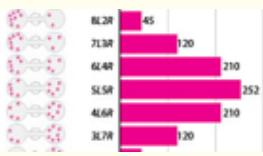
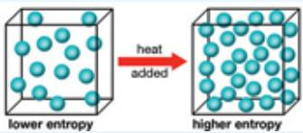
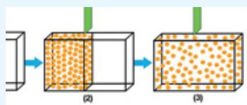
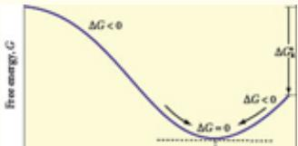
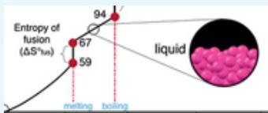
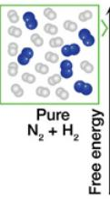

# 4 Entropy and the Second Law of Thermodynamics


“Since a given system can never of its own accord go over into another equally probable state but into a more probable one, it is likewise impossible to construct a system of bodies that after traversing various states returns periodically to its original state, that is a perpetual motion machine.”

—Ludwig Eduard Boltzmann

:::{figure} ../images/fig-p1-ch04-1.jpg
:name: fig-p1-ch04-1
:alt: Figure from the University Chemistry source textbook
:::

## Framework

Nature is driven by spontaneous processes—processes that proceed without external intervention. With our advancing understanding of energy, with the insight brought by the First Law of Thermodynamics, and with our ability to track energy transformations from highly organized forms of energy (mechanical energy, chemical energy, electromagnetic energy) that inexorably cascade to disorganized thermal energy, comes a sharpened recognition that there are other factors that drive spontaneous processes in nature. In particular, we begin to recognize, as our understanding of energy advances, that a great many processes that occur in nature are not driven toward a state of lower energy, as is the case for an exothermic chemical reaction or a mass falling in a gravitational field. As we will see, spontaneous processes are guided by both the release of energy and by the tendency to seek a configuration of increasing disorganization.

This relationship between energy release, the tendency toward increasing disorganization, and the spontaneous formation of unique structures in nature is exemplified by the existence of mixed hydrocarbon-water compounds in nature. Figure 4.1 captures a rather remarkable event—what you see is a sample of ice removed from the ocean floor at depths of greater than \~300 meters. But the ice is burning! It burns because within the ice structure, methane $\mathrm { C H } _ { 4 }$ is trapped within a cage of water molecules as shown in the upper left inset of the figure. This ice-methane structure is called a methane clathrate or methane hydrate. A remarkable amount of methane is contained in the clathrates that exist at low temperature and elevated pressure in permafrost and ocean floor deposits. The methane is formed from microbial decomposition of organic matter in soils and in sediments. Exploration to determine the sizes of global deposits of these methane clathrates is currently in progress, but it is known that at least twice as much fuel energy is contained in those structures as in the total of the Earth's oil, gas, and coal deposits combined. The principal methane clathrate deposits in the U.S. occur in the Gulf of Mexico, off the west and east coast, and on the north slope of Alaska. As an example of the scale of these methane clathrate deposits in the U.S., the methane contained in those deposits in the Gulf of Mexico alone is estimated to be 61 $\mathbf { \delta } _ { \lfloor 0 \mathrm { ~ } \times \mathrm { ~ } 1 0 ^ { 1 2 } }$ $\mathbf { m } ^ { 3 } .$ . The yearly consumption of methane (natural gas) in the U.S. is 650 $\times \ 1 0 ^ { 9 } \mathrm { { m ^ { 3 } } } .$ . Thus the Gulf of Mexico deposits alone would supply the U.S. with natural gas at current consumption rates for $6 1 0 \times 1 0 ^ { 1 2 } \mathrm { m } ^ { 3 } / ( 6 5 0 \times$ $1 0 ^ { 9 } \mathrm { m ^ { 3 } / y r } ) \mathrm { ~ = ~ } 9 4 0$ years. Research into how methane as a fuel could be extracted from those deposits is in progress but there is potential risk because methane is a greenhouse gas (it absorbs infrared radiation at a wavelength of $7 . 6 ~ { \mu \mathrm { m } } , 7 . 6 ~ \times ~ 1 0 ^ { - 6 }$ meters). Because those clathrates are stable only at low temperature, they pose a significant threat to climate stability. If just $0 . 5 \%$ of the permafrost structures in Alaska and northern Siberia alone were to melt each year, resulting from the loss of the Arctic Ice Cap, approximately 8 Gt C (gigatons carbon) would be added to the atmosphere each year. This would more than double the amount of carbon added to the atmosphere each year from the combustion of fossil fuel worldwide. Figure $\underline { { 4 . 2 } }$ displays the importance of methane clathrate and carbon dioxide permafrost melt rates per year of just 0.5% of the reservoir stored in the permafrost of Alaska and Siberia.

:::{figure} ../images/fig-p1-ch04-2.jpg
:name: fig-p1-ch04-2
:alt: FIGURE 4.1 The ability of water molecules to organize, through hydrogen bonding, around nonpolar molecules, such as methane, accounts for the existence of hydrates, or more specifically clathrates. In those structures the water molecules ar
FIGURE 4.1 The ability of water molecules to organize, through hydrogen bonding, around nonpolar molecules, such as methane, accounts for the existence of hydrates, or more specifically clathrates. In those structures the water molecules are packed around the nonpolar organizing center $\left( \mathsf { C H } _ { 4 } \right)$ by forming ordered arrays. What is remarkable is that methane clathrates store more than 10,000 gigatons of carbon in permafrost and ocean floor deposits. Those clathrates burn when ignited as shown in the figure. Recalling that approximately 8 gigatons of carbon is released to the atmosphere each year by the burning of fossil fuels, $\mathsf { C H } _ { 4 }$ clathrates hold more than 1000 times the yearly release of carbon via fossil fuel combustion. A global inventory of methane clathrates is currently underway, but we know that there are between two and five times as much fuel energy stored as methane in clathrates than in all fossil fuel reserves of coal, petroleum, and natural gas.
:::


:::{figure} ../images/fig-p1-ch04-3.jpg
:name: fig-p1-ch04-3
:alt: FIGURE 4.2 The profound impact that just a 0.5% melt rate per year of the mathematical notation and mathematical notation containing permafrost in Alaska and Siberia would have on the carbon added to the atmosphere by all fossil fuel burnin
FIGURE 4.2 The profound impact that just a 0.5% melt rate per year of the $\mathsf { C H } _ { 4 }$ and $\mathsf { C O } _ { 2 }$ containing permafrost in Alaska and Siberia would have on the carbon added to the atmosphere by all fossil fuel burning is displayed. Of particular importance: just 0.5% of the methane and carbon dioxide contained in the upper 3 meters of the soil in northern Alaska and Siberia alone is equal to the annual relase of carbon dioxide from the burning of fossil fuels globally.
:::


While methane storage in these clathrate structures will play an increasingly controversial role in the global debate at the intersection of energy and climate, at the molecular level the formation of these structures is an illustration of how spontaneous processes behave in nature. Specifically, the ability of water molecules to hydrogen bond to one another, as displayed in Figure 4.3, accounts for the existence of these crystalline clathrates.

:::{figure} ../images/fig-p1-ch04-4.jpg
:name: fig-p1-ch04-4
:alt: FIGURE 4.3 The structure of ice is shown with the hydrogen bonding displayed between hydrogen atoms(the small solid circles) and the electronegative oxygen centers (the larger open circles) that constitutes the crystal structure. The planes
FIGURE 4.3 The structure of ice is shown with the hydrogen bonding displayed between hydrogen atoms(the small solid circles) and the electronegative oxygen centers (the larger open circles) that constitutes the crystal structure. The planes of oxygen atoms in the crystal structure are differentiated by the shading of the open circles.
:::


The most common naturally occurring gas hydrate structure is composed of water molecules hydrogen bonded and organized around the methane molecules shown in Figure $\underline { { 4 . 4 } }$ . The unit cell of the methane clathrate contains 8 methane molecules caged within $4 6$ water molecules. Because methane is trapped within the crystal structure defined by the $4 6$ cage water molecules, methane gas in hydrate form is significantly compressed. For example, one liter of methane clathrate solid contains, on average, 168 liters of methane gas at standard temperature and pressure.

:::{figure} ../images/fig-p1-ch04-5.jpg
:name: fig-p1-ch04-5
:alt: FIGURE 4.4 The crystal structure of the ice cages that form around methane molecules to form the methane clathrate, the unit cell of which consists of 8 methane molecules and 46 water molecules, is shown here as the union between two distin
FIGURE 4.4 The crystal structure of the ice cages that form around methane molecules to form the methane clathrate, the unit cell of which consists of 8 methane molecules and 46 water molecules, is shown here as the union between two distinct cage structures.
:::


What is important as we develop the concept of spontaneous processes in our study of thermodynamics is recognizing that the presence of methane within those bonding structures of water constitutes a spontaneous transformation from free methane gas and pure ice (with the structure shown in Figure 4.3) to the methane clathrate structure, shown in Figure 4.4. By filling voids in the ice structure, the “guest” methane molecules stabilize the clathrate hydrogen-bonded crystal structure. These methane clathrates are stable to temperatures considerably higher than the melting point of “pure” ice. Methane clathrates melt at $1 8 ^ { \circ } \mathrm { C }$ at atmospheric pressure. This was, incidentally, a serious problem in natural gas distribution systems because the methane clathrates would clog large supply pipelines. The problem was eliminated by removing water vapor from the methane before pumping it into the supply network.

The ability of nature to spontaneously synthesize intricate structures that are of immense practical importance to society begins to beg an array of important questions that, on the face of it, appear to be unrelated.

Why does heat flow from regions of high temperature to regions of low temperature? Why do organized forms of energy, for example, the energy contained in the bonding structures of hydrocarbons, spontaneously and inexorably transition to highly disorganized forms of energy such as heat? Why, when tracking the energy content of coal from an electricity generator power plant, do we extract but 2 percent of that energy as useful light from an incandescent light bulb in our living room? How would the energy structure of the U.S. change if we transitioned to electricity-powered vehicles from internal combustion vehicles? Why would it cost an equivalent amount of less than 1 dollar a gallon if we used electricity rather than gasoline to power our automobiles?

We set the context for our study of the Second Law of Thermodynamics by examining an illustrative example of energy flow within our economic structure—the sequence of events from the combustion of coal in an electricity power plant to the delivery of that power to our living space. We consider first the efficiency of a power plant using our knowledge of the maximum efficiency of a heat engine converting an amount of heat, Q, to usable work, W. We know from our study of the Carnot cycle in Chapter 3 that the maximum efficiency of a system that converts heat to work is given by

```{math}
:label: eq-p1-ch04-1
\left(\mathrm{Eff}\right) _ {\max} = W / Q = \left(T _ {1} - T _ {2}\right) / T _ {1} = 1 - T _ {2} / T _ {1}
```


where $T _ { 1 }$ is the high temperature reservoir and $T _ { 2 }$ is the low temperature reservoir. Thus, because the actual efficiency is always less than the maximum given by the Carnot cycle, we have Eff $< W / Q _ { 1 } = ( T _ { 1 } - T _ { 2 } ) / T _ { 1 }$ Referring to Figure $\underline { { 4 . 5 } }$ to distinguish between the heat in, $Q _ { 1 } \mathrm { { : } }$ , and heat out, $Q _ { 2 } ,$ we can “model” our electrical power plant, wherein the heat, $Q _ { 1 }$ is supplied by coal and the work, W, is the electrical energy delivered to the power grid. Then we can rewrite the above equation as

:::{figure} ../images/fig-p1-ch04-6.jpg
:name: fig-p1-ch04-6
:alt: FIGURE 4.5 The chemical bonds in coal provide the heat input, mathematical notation . The power plant produces an amount of work, W, that is delivered to the grid. At the power plant, mathematical notation is waste heat that must be absorbe
FIGURE 4.5 The chemical bonds in coal provide the heat input, $Q _ { 1 }$ . The power plant produces an amount of work, W, that is delivered to the grid. At the power plant, $Q _ { 2 }$ is waste heat that must be absorbed by the surroundings.
:::


```{math}
:label: eq-p1-ch04-2
W / Q _ {1} \leq 1 - T _ {2} / T _ {1}
```


Because the high temperature reservoir, $T _ { 1 } ,$ is limited by the maximum temperature of the initial plumbing carrying the steam from the boiler to the turbine, modern coal fired electrical power plants are limited to $T _ { 1 } \approx 9 0 0 ~ \mathrm { K }$ . The low temperature reservoir is typically $T _ { \mathrm { 2 } } \approx 3 5 0$ K. Thus the maximum efficiency for conversion of highly organized energy to produce heat $( Q _ { 1 } )$ that is converted to work, W, in the form of electrical energy is

```{math}
:label: eq-p1-ch04-3
W / Q _ {1} = 1 - 3 5 0 \mathrm{K} / 9 0 0 \mathrm{K} \approx 0. 6 0
```


In practice this maximum possible efficiency is, through losses in the generation system, reduced to about 38%. Thus, 62% of the energy content of the coal is wasted—it is lost as (highly disorganized) heat and dumped into the surrounding environment, indicated by $Q _ { 2 }$ in Figure 4.5.

Now let's consider what happens to that electrical energy once it has left the coal-fired generating plant and enters the power grid that distributes the energy to homes, businesses, industrial plants, etc. First, we examine the case of electric lighting for your home, office, dorm room, etc. Using a telling graphic from What You Need to Know About Energy (NAS Press, 2008), we can quantitatively trace the path from energy generation to light output (Figure 4.6). With a (typical) 38% efficiency in initial generation, we lose 62 units of the initial 100 energy units contained in the chemical bonds of the coal. Typically, between 2 units and 8 units are lost in the transmission lines, as shown in Figure 4.6. We will assume the more efficient of these such that 36 units of the original 100 units are delivered to the home. However, with the use of an incandescent bulb, 34 units are emitted as heat and only 2 units are emitted as usable light. Thus, only 2% of the original energy contained in the coal actually results in useful energy!

:::{figure} ../images/fig-p1-ch04-7.jpg
:name: fig-p1-ch04-7
:alt: FIGURE 4.6 As discussed in Chapter 3 it is important to track the conversion of energy categories through from the primary energy source to the end use. In this case we track the quantitative transitions from (1) chemical energy, to (2) ele
FIGURE 4.6 As discussed in Chapter 3 it is important to track the conversion of energy categories through from the primary energy source to the end use. In this case we track the quantitative transitions from (1) chemical energy, to (2) electrical energy at the power station, to (3) electrical energy delivered to the site of its use (home), to (4) the production of light visible to the human eye by an incandescent light bulb in the house. Thus from 100 units of chemical energy in the form of coal supplied to an electricity generating power plant, 62 units are wasted as heat and 38 units of electrical power are delivered to the power distribution grid. Of those 38 units of electrical energy, 36 units are delivered to the home but only 2 of the 36 units delivered to the incandescent light bulb are delivered within the visible range of the human eye. Thus 34 units are wasted as heat by the incandescent light bulb.
:::


If, instead of an incandescent lightbulb, a compact fluorescent bulb is used, then 10 units of that energy are available for useful lighting—a factor of five improvement in energy efficiency. This is why all incandescent lightbulbs should be eliminated from houses and buildings as quickly as possible. If, on the other hand, we use light emitting diodes (LEDs), a device we will investigate in Chapter 11, we use only one-tenth the energy to produce the same amount of useful light that is emitted by an incandescent light. Thus, if LEDs replaced incandescent bulbs, 20 units of light energy would be produced instead of 2 units of light energy produced by incandescent lighting.

A second important example involves the sequence of events when that electricity is used to drive a pumping system, as is the case in factories, agriculture, heating, etc., across the industrial and domestic spectrum. This sequence is captured in Figure 4.7, a recent graphic by the Rocky Mountain Institute (Amory Lovin lecture, Harvard University, 2008). Again, beginning with 100 units of energy contained in the coal burned to produce electricity in a power plant, 70 units are lost in the initial generation, yielding 30 units of electrical energy delivered to the grid. It is common to see differences in power plant efficiency, notable in comparing Figure 4.6 and Figure 4.7, because different power plants have significantly different efficiencies. Transmission and distribution losses remove 9%. Electrical motor losses remove 10% more, drive train losses 2% more, pump system losses 25% more, throttle and pipe losses 33% and 20%, respectively; so that only \~9% of the original 100 units of energy actually survive to execute the objective of the overall system.

:::{figure} ../images/fig-p1-ch04-8.jpg
:name: fig-p1-ch04-8
:alt: FIGURE 4.7 Many applications that use electricity for industrial purposes employ a sequence of electric motors, pumps, and piping systems as shown. Typically less than 10% of the energy contained in the chemical energy of the fuel is availa
FIGURE 4.7 Many applications that use electricity for industrial purposes employ a sequence of electric motors, pumps, and piping systems as shown. Typically less than 10% of the energy contained in the chemical energy of the fuel is available to do useful work.
:::


There are a number of key conclusions to be drawn. First, the initial step is very inefficient—between 60 and 70% of the primary energy is lost before any useful energy is generated. Second, it is that first step that releases the large amounts of $\mathrm { C O } _ { 2 }$ (as well as soot, nitrates, sulfates, mercury, etc.) into the atmosphere. Third, one unit of energy saved at the usage end translates into 10 to 20 units at the production end. Thus, conservation is very important. Fourth, if energy were produced at the site of its use (for example, photovoltaics to collect energy to supply lighting or air conditioning) the demand for primary power generation using coal would drop dramatically. Finally, note that the conversion of electrical energy to mechanical energy by the electric motor is 90% efficient—contrast that with a gasoline engine that is ≤ 20% efficient, which is a key point for the next generation of automobiles, trucks, and buses.

One of the most dramatic and immediate ways that the US can direct its energy policy toward the twin objectives of (1) reducing carbon dioxide emissions and (2) reducing dependence on foreign oil sources, is to recognize the profound advantages in shifting automobiles from a reliance on the century-old internal combustion engine to electrically powered transportation.

To place this problem in context, we begin by noting that the US imports between 12 and 13 million barrels of oil per day. This constitutes approximately 60% of domestic petroleum consumption. The price per barrel for imported oil ranged between \$50 and \$150 per barrel in 2008 and settled between \$80 and \$100 per barrel in 2010. As shown in Figure 4.8, which plots the yearly U.S. expenditure for the purchase of foreign oil against the price per barrel, the U.S. spent, on a per yearly basis, approximately 450 billion dollars to purchase petroleum. This is a major contribution to our balance of payments each year.

:::{figure} ../images/fig-p1-ch04-9.jpg
:name: fig-p1-ch04-9
:alt: FIGURE 4.8 Plot of the dollars sent overseas to purchase petroleum as a function of the cost per barrel of imported oil.
FIGURE 4.8 Plot of the dollars sent overseas to purchase petroleum as a function of the cost per barrel of imported oil.
:::


Combustion of oil in 2006 accounted for $44 \%$ of US $\mathrm { C O } _ { 2 }$ emissions, with 33% of the total $\mathrm { C O } _ { 2 }$ emissions resulting from transportation, which includes cars, trucks, trains, ships, and aircraft. Gasoline powered cars and light trucks were responsible for 40% of total oil consumption, with diesel powered vehicles accounting for an additional 10%.

What steps would be required to eliminate the need to import foreign oil? Because we import 60% of the oil that we use, if we could reduce our dependence on oil by that amount we would eliminate foreign imports. We can immediately recognize these important factors in sizing up this problem:

1. Vehicles use 70% of all petroleum in this country.

2. The internal combustion engine extracts only 20% of the energy contained in liquid fuels that can be made available to propel the car —losing 80% to heat.

3. If we include drive train loss, idling loss, loss to accessories, etc., only 13% of the fuel energy is actually expended to move the car.

4. 75% of the fuel use is related to the weight of the vehicle.

Thus there are two very large and very effective steps that can (and must) be taken. The first is to move immediately to much lighter vehicles—but not at the expense of safety, comfort, nor performance. This is achieved through the use of carbon-fiber technology to reduce the vehicular weight from 2000-2500 kg down to 500 kg. An example of such an automobile is shown in Figure 4.9.

:::{figure} ../images/fig-p1-ch04-10.jpg
:name: fig-p1-ch04-10
:alt: FIGURE 4.9 A dominant contributor to low efficiency for automobiles is weight and drag. New carbon fiber construction and aerodynamic design can radically improve the situation.
FIGURE 4.9 A dominant contributor to low efficiency for automobiles is weight and drag. New carbon fiber construction and aerodynamic design can radically improve the situation.
:::


The second large and important step is to replace the internal combustion engine with electric propulsion. This transition can be effected very quickly by moving to the technology of hybrid electric vehicles (HEV) that can be, and are, built in a number of different combinations of joint electric-internal combustion propulsion options. These combinations are typically classified as HEV 0, HEV 20, HEV 40, and HEV 60 options, representing the distance the vehicle can cover without using the onboard gasoline or diesel engine—in this case, 0, 20, 40, or 60 miles, respectively.

The average distance driven per day, per car in the US is about 30 miles. If HEV 60 autos constituted the fleet of cars in the US, the result would be that the gasoline (or diesel) assisted travel would be satisfied with just 10% of the current petroleum usage. Replacing 90% of gasoline consumption by electrical propulsion would be equivalent to raising the fleet's average fuel efficiency from the current 17 mpg to close to 150 mpg. If this were realized, total oil use would decrease by approximately 35%, cutting need for imported oil by approximately 60%. General Motors has invested a considerable amount in the development of the Chevy Volt, which is an HEV 40 vehicle, and Toyota is introducing the HEV 40 Prius in 2011. Both the Chevy Volt and the Toyota “plug in” Prius use the new lithium ion battery technology that we will examine in Chapter 7. There are also an array of all-electric powered automobiles moving toward production that have a range of > 200 miles between chargings of the battery.

By switching to the HEV or all electric technology, an immediate reduction in operating cost would be realized. The reason is that, as we have seen, the internal combustion engine wastes some $8 5 \%$ of the energy content of the fuel, while an electric motor is 90% efficient— wasting only 10% of the energy delivered to it.

The chemical energy content of a gallon of gasoline is (9.4 kWh/L) × $\left( 3 . 8 \mathrm { \ L } / \mathrm { g a l l o n } \right) \ = \ 3 5 . 7$ kWh/gallon. But because an electric motor is $\mathbf { 0 . 9 0 } / \mathbf { 0 . 1 } 5 = 6$ times as efficient as a gasoline automobile, we need only 35.7 kWh/gallon divided by $6 = 5 { \cdot } 9 5$ kWh, which we will approximate as 6.0 kWh of electricity, to obtain the same driving range as that produced by a gallon of gasoline. In the U.S., the cost for 1 kWh of electricity ranges from $6 { - } 7$ cents in a number of western and mid-western states, to 19-20 cents in the northeast. At 7 cents per kWh, it would take approximately $4 2$ cents to drive the distance covered by a gallon of gasoline. At 20 cents per kWh, it would cost \$1.20 to drive the distance covered by a gallon of gasoline. Thus, in addition to dramatically reducing the need for imported oil, there is an immediate advantage of reducing the per-mile cost of driving. Of course, the objective of eliminating $\mathrm { C O } _ { 2 }$ emissions from the transportation sector involves generating the primary energy supplied to the power grid without the use of fossil fuels.

This brings us back to the critical importance of determining what drives the vast range of spontaneous processes in nature. The coherent, scientifically rigorous framework that quantitatively defines spontaneous processes in nature constitutes an objective of great importance. To this end, we recognize that it is the spontaneous nature of change that is the compelling concept that must be understood, and that while nature seeks to find pathways to states of lower energy, other factors come powerfully into play.

For instance, when red hot lava fed from a volcano reaches the cool waters of the ocean, we know instinctively what will happen: thermal energy, contained in the hot lava, flows into the ocean until the lava has cooled to the temperature of the water around it. We know that when we release carbonation from a bottle, the gas rushes out of the vessel into its surroundings. In these cases, is the final state at lower energy than the initial state, or are other factors controlling the process?

In pursuit of a scientific understanding of spontaneous processes, it becomes important to develop the ability to distinguish between spontaneous and non-spontaneous processes. Examples of nonspontaneous processes include the construction of a stone wall, the working of a chemistry problem set, and decomposition of water by electrolysis into hydrogen and oxygen. These nonspontaneous events can occur only as long as there is external intervention. But nonspontaneous changes have another characteristic in common: They can occur only when accompanied by, or coupled to, some process that is spontaneous. The stone mason and the chemistry student are sustained by biochemical reactions that are themselves spontaneous. The electrolysis of water requires a source of electrons driven through the electrolysis cell by chemical or mechanical change.

The observation that all nonspontaneous events occur at the expense of spontaneous processes leads us, through inductive reasoning, to an important conclusion: All that happens can be traced either directly or indirectly to spontaneous change. This, in turn, implies that we must progress from a position of understanding energy, to a position of understanding the genesis and characteristics of spontaneous change in nature, and by deduction, there must be at least one other compelling tendency, independent of energy, that drives spontaneous change.

Consider the processes shown in the figure below: the corrosion of iron, the combustion of octane, and the melting of ice. The first two examples are easily understood in terms of exothermicity—the release of chemical energy resulting from the tendency of exothermic change to proceed spontaneously.

:::{figure} ../images/fig-p1-ch04-11.jpg
:name: fig-p1-ch04-11
:alt: Figure from the University Chemistry source textbook
:::

## Spontaneous Change: what controls it?

On the basis of observed processes in nature, it is very tempting to conclude that spontaneous processes are driven exclusively by pathways leading to the release of energy such that proceeding in the direction of decreasing energy is the motive force behind spontaneous change. As we saw in Chapter 3, changes that lower the potential energy (mechanical or chemical) of a system can be referred to as exothermic. Within this view of spontaneous processes, we could deduce a law: Exothermic changes have a tendency to proceed spontaneously. Indeed, for centuries this was held as a fundamental tenet defining spontaneous changes in nature.

But what about the melting of arctic ice? We know from experience that ice melts spontaneously when in contact with a temperature reservoir just a fraction of a degree higher in temperature than the melting point of ice. Now we have a conundrum, for while we know that ice melts spontaneously, we also know that in the process of melting, thermal energy must be flowing into the ice as it melts. The transfer of thermal energy (heat) leaves the liquid water from the melted ice at a higher internal energy than that of the original ice. Thus, the process of melting is an endothermic process! Yet it is spontaneous. This revelation opens an awareness of many other spontaneous processes that are endothermic: Expansion of a gas into a vacuum (Figure 4.10); the “cold pack” chemical envelopes used for medical purposes; the evaporation of ocean water into the atmosphere; the formation of a solution created by the intermixing of substances in the liquid phase.

(b) After expansion into vaccuum
:::{figure} ../images/fig-p1-ch04-12.jpg
:name: fig-p1-ch04-12
:alt: Figure from the University Chemistry source textbook
:::

:::{figure} ../images/fig-p1-ch04-13.jpg
:name: fig-p1-ch04-13
:alt: FIGURE 4.10 As we will see, an important example of the increase in entropy of a spontaneous process is the expansion of a gas from an initial condition of, for example, 1 liter at 1.0 atm pressure to 2 liters at 0.5 atm pressure. This can
FIGURE 4.10 As we will see, an important example of the increase in entropy of a spontaneous process is the expansion of a gas from an initial condition of, for example, 1 liter at 1.0 atm pressure to 2 liters at 0.5 atm pressure. This can be achieved by opening a valve between two bulbs, each with a volume of 1 liter, wherein one of the bulbs initially holds 1 atm of the gas, while the other is a vacuum.
:::


Emergent in these examples is a pattern of molecular-level processes that exhibit the characteristic that systems tend to move toward a state of higher probability and away from a state of low probability, even if they must move “uphill” in energy. This fact immediately engages us in a treatment of what defines the probability of a given state, or configuration, and it requires us to consider how microscopic (molecular) level processes are quantitatively linked to macroscopic systems that are changed by this propensity of molecular systems to seek states of higher probability.

Case Study 4.1 Entropy, Free Energy, and the Maximum Amount of Work that can be Extracted from a Fuel Cell

:::{figure} ../images/fig-p1-ch04-14.jpg
:name: fig-p1-ch04-14
:alt: Figure from the University Chemistry source textbook
:::

Case Study 4.2 The Most Probable Distribution Is the Boltzmann Distribution

:::{figure} ../images/fig-p1-ch04-15.jpg
:name: fig-p1-ch04-15
:alt: Figure from the University Chemistry source textbook
:::

Case Study 4.3 Methods for Energy Storage

:::{figure} ../images/fig-p1-ch04-16.jpg
:name: fig-p1-ch04-16
:alt: Figure from the University Chemistry source textbook
:::

## Chapter Core

## Road Map for Chapter 4

We turn now to the development of a quantitative basis for defining spontaneous processes in nature beginning with the development of the relationship between disorder and the tendency of systems to inexorably seek a state of higher probability. This development begins at the molecular level and leads to the concept of entropy that, in partnership with energy, constitutes the foundation for quantitatively defining criteria for determining whether a process is spontaneous or non-spontaneous. We will see that this concept of entropy, which can be understood at both the molecular (microscopic) level and the macroscopic level, sets in place the foundation for the Second Law of Thermodynamics that states that whenever a spontaneous event takes place in the universe, the total entropy of the universe must increase. What is remarkable is that this disarmingly simple statement leads directly to the formulation of the most important thermodynamic variable— the Gibbs free energy. The remainder of the chapter and significant parts of chapters 5, 6, and 7 that treat on chemical equilibrium, acid-base reactions, and electrochemistry, are built upon developing a thorough understanding of Gibbs free energy.

<table><tr><td colspan="2">Road Map to Core Concepts</td></tr><tr><td>1. Development of the Concept of Entropy Beginning with the Microscopic Perspective</td><td>Ten Molecules</td></tr><tr><td>2. Boltzmann and the Microscopic Formulation of Entropy</td><td></td></tr><tr><td>3. Qualitative Prediction of Entropy Change: Establishing the Sign of ΔS</td><td></td></tr><tr><td>4. Quantitative Treatment of Entropy: Calculating ΔS for a System</td><td></td></tr><tr><td>5. Joining the Macroscopic and Microscopic: Calculation of Entropy Change, ΔS</td><td></td></tr><tr><td>6. Second Law of Thermodynamics, Gibbs Free Energy, and Spontaneous Change</td><td></td></tr><tr><td>7. Absolute Value for Entropy: Third Law of Thermodynamics</td><td></td></tr><tr><td>8. Calculation of Entropy Change for a Chemical Reaction</td><td>Substance S° (J/mole·K)CO(NH2)(aq) 173.8H2O(l) 69.96CO2(g) 213.6NH3(g) 192.5</td></tr><tr><td>9. Calculation of Gibbs Free Energy for a Reaction</td><td>ΔH2*-Molecule-393.5 kJ/mole CO2(g)-46.2 kJ/mole NH3(g)-319.2 kJ/mole CO(NH2)(aq)-285.9 kJ/mole H2O(l)</td></tr></table>

## Determination of Probability at the Molecular Level

We examine the issue of probability at the molecular level from two complementary perspectives.

## Perspective #1

Suppose we examine the behavior of molecules in a two-chamber apparatus, shown in Figure 4.11.

## The Case for 2 Molecules

## Spontaneity and Probability

Spontaneous processes proceed from states of low probability to states of high prob-ability.

Example: Gas expansion

:::{figure} ../images/fig-p1-ch04-24.jpg
:name: fig-p1-ch04-24
:alt: Figure from the University Chemistry source textbook
:::

:::{figure} ../images/fig-p1-ch04-25.jpg
:name: fig-p1-ch04-25
:alt: FIGURE 4.11 If we consider two molecules in an otherwise vacated bulb with two chambers connected by a passageway and we calculate the probability that both molecules are in the left chamber at the same time, mathematical notation ; then we
FIGURE 4.11 If we consider two molecules in an otherwise vacated bulb with two chambers connected by a passageway and we calculate the probability that both molecules are in the left chamber at the same time, $( \% ) ( \% ) = 1 4$ ; then we calculate the probability that both molecules are in the right chamber at the same time, $( \% ) ( \% ) = 1 4$ ; then we calculate the probability that one molecule is in the right chamber and one is in the left chamber, ½, we can calculate a histogram defining the probability distribution for the two molecules in a two chamber system.
:::


We begin this (important!) thought experiment with the chambers evacuated except for two indistinguishable gas-phase molecules that we observe over a period of time during which we, at certain intervals, count the number of times we observe the available configurations, which are (i) both molecules in the left-hand chamber, (ii) both molecules in the right-hand chamber, (iii) one molecule in the left-hand chamber and one molecule in the right-hand chamber. We can draw a histogram that summarizes our findings. The probability of finding one molecule in the left-hand chamber is ½, just as the probability of getting “heads” in a coin toss is ½. The probability of finding both molecules in the left-hand chamber is $( 1 / 2 ) ( 1 / 2 ) = ( 1 / 4 )$ , just as the probability of tossing two “heads” in a row is $( 1 / 2 ) ( 1 / 2 ) = ( 1 / 4 )$ . But the same logic applies to the right-hand chamber; the probability of finding both molecules in the right-hand chamber is $( 1 / 2 ) ( 1 / 2 ) = ( 1 / 4 )$ . The probability of finding one molecule in the left chamber and one molecule in the right chamber is ½. Thus, we construct our histogram accordingly. Notice that for our case of two identical molecules, there are three (n + 1) possible configurations and that there is a higher probability of finding the molecules evenly distributed between the two chambers.

Let's add a third molecule as shown in Figure 4.12. But now let's label the molecules as A, B, and C. And, in addition, let's explicitly list out the possible arrangements:

<table><tr><td>1. All in the left chamber:</td><td>(ABC)-( )</td><td> $(1/2)(1/2)(1/2) = 1/8$ </td></tr><tr><td>2. All in the right chamber:</td><td>( )-(ABC)</td><td> $(1/2)(1/2)(1/2) = 1/8$ </td></tr><tr><td colspan="3">3. Two in the left and one in the right:</td></tr><tr><td></td><td>( AB )-( C )</td><td> $(1/2)(1/2)(1/2) = 1/8$ </td></tr><tr><td></td><td>( AC )-( B )</td><td> $(1/2)(1/2)(1/2) = 1/8$ </td></tr><tr><td></td><td>( BC )-( A )</td><td> $(1/2)(1/2)(1/2) = 1/8$ </td></tr><tr><td colspan="3">4. One in the left and two in the right:</td></tr><tr><td></td><td>( C )-( AB )</td><td> $(1/2)(1/2)(1/2) = 1/8$ </td></tr><tr><td></td><td>( B )-( AC )</td><td> $(1/2)(1/2)(1/2) = 1/8$ </td></tr><tr><td></td><td>( A )-( BC )</td><td> $(1/2)(1/2)(1/2) = 1/8$ </td></tr></table>

The Case for 3 Molecules
:::{figure} ../images/fig-p1-ch04-26.jpg
:name: fig-p1-ch04-26
:alt: Figure from the University Chemistry source textbook
:::

Three Molecules

:::{figure} ../images/fig-p1-ch04-27.jpg
:name: fig-p1-ch04-27
:alt: FIGURE 4.12 The initial case of two molecules is straightforward, so we will keep adding molecules to the system and find out how the probability of each configuration changes. For three identical molecules, eight different arrangements are
FIGURE 4.12 The initial case of two molecules is straightforward, so we will keep adding molecules to the system and find out how the probability of each configuration changes. For three identical molecules, eight different arrangements are possible, but only four of these are distinct. For the arrangements of two molecules on the left and two molecules on the right, the states can be realized by arranging the atoms in three different ways, so these arrangements have a probability that is three times higher than the other two states with everything on the left and everything on the right. If you want to prove this to yourself, you can label each molecule (say A, B, and C) and write down all the possible configurations, after which you can remove these labels to identify which configurations are identical. This is done in the text.
:::


But while each configuration of the three molecules has the same probability if we distinguish the individual molecules $( ( ^ { 1 / 2 } ) ( ^ { 1 / 2 } ) ( ^ { 1 / 2 } ) = ^ { 1 / 8 } )$ , if the molecules are indistinguishable we have a probability of 3 × (⅛) for Cases 3 and $4 \cdot$ This results in the histogram shown in Figure 4.12 for three indistinguishable molecules.

Once again, we note the pattern: (a) There are $n + 1 = 3 + 1 = 4$ possible states (or configurations), and (b) the higher probability cases are those for which there is the most balanced distribution between the two chambers.

If we now proceed to consider the case for 10 molecules in Figure 4.13, we discover that the counting becomes rapidly more difficult (or tedious!), but the same pattern becomes more pronounced: The histogram peaks in the middle, corresponding to the molecules being distributed equally between the two chambers, the distribution falls off uniformly on both sides of the distribution, and there are $n + 1 = 1 0 + 1 = 1 1$ possible states.

Ten Molecules
The Case for 10 Molecules
:::{figure} ../images/fig-p1-ch04-28.jpg
:name: fig-p1-ch04-28
:alt: Figure from the University Chemistry source textbook
:::

:::{figure} ../images/fig-p1-ch04-29.jpg
:name: fig-p1-ch04-29
:alt: FIGURE 4.13 As we continue to add molecules to the system, counting the states and assigning a probability to each arrangement becomes more difficult, but we can begin to see a general trend start to emerge. For example, we can see from the
FIGURE 4.13 As we continue to add molecules to the system, counting the states and assigning a probability to each arrangement becomes more difficult, but we can begin to see a general trend start to emerge. For example, we can see from the histogram for ten molecules that the probability of the molecules being distributed roughly equally between each of the two sides is much more probable than the distribution being skewed to either the right or the left side.
:::


So let's extend this to the case for which we have not 10, but 100 molecules, as shown in Figure 4.14. Now the individual counting is best done by computer, but we see that the probability that all molecules reside in the left or in the right chamber is virtually zero; and, moreover, that the probability that the distribution is more than slightly skewed to one chamber or the other is increasingly unlikely as the number of molecules is increased.

The Case for 100 Molecules
:::{figure} ../images/fig-p1-ch04-30.jpg
:name: fig-p1-ch04-30
:alt: Figure from the University Chemistry source textbook
:::

Hundred Molecules

:::{figure} ../images/fig-p1-ch04-31.jpg
:name: fig-p1-ch04-31
:alt: FIGURE 4.14 By the time we have added 100 molecules (which may sound like a fair amount, but would only correspond to mathematical notation grams of mathematical notation the chance of all of these molecules being to the left or to the righ
FIGURE 4.14 By the time we have added 100 molecules (which may sound like a fair amount, but would only correspond to $5 . 3 1 \times 1 0 ^ { - 2 1 }$ grams of $\mathsf { O } _ { 2 } )$ the chance of all of these molecules being to the left or to the right is already essentially zero. In fact, the possibility for the distribution to even be skewed to one side or the other diminishes rapidly as we move away from an equal division of the molecules. Here we illustrated that this process, the distribution of gas molecules throughout a volume, is a spontaneous process by a purely statistical treatment of the system. We did not invoke any concepts such as energy or enthalpy at all, other than to say that the energy of the particles was not zero. So, we can offer an alternate definition of spontaneity by saying a spontaneous process moves from states of low probability to states of high probability. In this example, we see that the lowest probability states involve states that are relatively ordered, i.e. a large fraction of the gas molecules can be found on either the right or the left of the container; and the states of high probability are configurations where the system is relatively disordered.
:::


But the conclusion that we draw from this simple progression is of great practical (and theoretical) importance. It is important because we have illustrated that this process (that of individual molecules seeking a particular distribution between the two chambers) is a spontaneous process based on a purely statistical treatment of the system. At no point did we discuss or involve the internal energy, the enthalpy, nor any quantity associated with an energy scale. So we now have another perspective on the concept of spontaneity: A spontaneous process moves from states of lower probability to states of higher probability. We also notice something else of importance: The states of lowest probability are characterized by a more ordered configuration—for example, if all the molecules are sequestered in one chamber, that is a more ordered configuration; just as is the case of all the clothes in your room being folded and placed in a single drawer! This link between probability, spontaneity, and order will loom large in our understanding of processes in thermodynamics. Imagine now if we move from 100 molecules to a single mole of $\mathbf { N } _ { 2 }$ in a two chamber system. Now we have $6 \times 1 0 ^ { 2 3 }$ molecules and the histogram defining the molecule distribution is a very narrow spike at the center.

## Perspective #2

We know from experience that when we place a hot object in contact with a cold object, thermal energy will flow spontaneously from the high temperature body to the low temperature body. But why is this? Does it have anything to do with probability? With order and disorder?

To address these questions, we turn again to our abiding strategy that if we have a question—a problem—we just construct first a model that will serve to sharpen the question we wish to answer, and second, a model that will guide us to a coherent answer.

Just as with our previous thought experiment, when we are setting a strategy at the molecular level, we begin with a small number of molecules! In this approach, or model design, we begin with two objects, each comprised of three molecules, to investigate the direction of flow of thermal energy (heat). Moreover, we assume that each molecule can occupy a low energy state or a high energy state, and let's designate a molecule in a low energy state as a “blue” molecule and a high energy molecule as a “red” molecule.

If we begin this thought experiment with the initial configuration such that all three molecules of one object are in a high energy state and all three molecules of the other object are in a low energy state; then we can represent the initial configuration as having one “hot” object on the left and one “cold” object on the right.

Now we move the objects such that they are in physical contact, allowing energy to flow between the two objects. Since we are not adding to or removing energy from these two objects (each comprised of three molecules) the total energy of the system does not change. That is, whatever the distribution of hot molecules and cold molecules is for a given state of the joined systems, the total number of hot (red) molecules must remain at 3, and the total number of cold (blue) molecules must remain at 3. But the number of possible distributions of energy among the six molecules after the objects are brought in contact is now not 1, as was the case for the separated objects, but 20, corresponding to the cases for one unit of energy transferred, two units of energy transferred, and three units of energy transferred. The 20 different distributions are shown in the Figure 4.15.

Begin with two objects made from three molecules each:

:::{figure} ../images/fig-p1-ch04-32.jpg
:name: fig-p1-ch04-32
:alt: Figure from the University Chemistry source textbook
:::

High energy molecules

:::{figure} ../images/fig-p1-ch04-33.jpg
:name: fig-p1-ch04-33
:alt: Figure from the University Chemistry source textbook
:::

Low energy molecules

```{math}
:label: eq-p1-ch04-4
\begin{array}{c c c} 1. & \text {No energy is transferred.} \\ 2. & \text {One unit of energy is transferred.} \\ 3. & \\ 4. & \\ 5. & \\ 6. & \\ 7. & \\ 8. & \\ 9. & \\ 1 0. & \\ 1 1. & \\ 1 2. & \\ 1 3. & \\ 1 4. & \\ 1 5. & \\ 1 6. & \\ 1 7. & \\ 1 8. & \\ 1 9. & \\ 2 0. & \end{array}
```


FIGURE 4.15 When we bring two bodies together, one hot and one cold, we know from direct experience that thermal energy (heat), will flow from the high temperature body to the low temperature body. We can analyze the probability of energy being transferred when two bodies are brought into contact by modeling the system as two bodies, one of which is comprised of just three molecules. If we bring the hot (red) body in contact with the cold (blue) body, we can transfer zero, 1, 2, or 3 units of energy where each unit corresponds to the energy transferred between a red molecule and a blue molecule. If zero units of energy are transferred, there is just one such configuration; the one representing the case before the bodies were brought into contact. If one unit of energy is transferred, there are nine equivalent configurations available; if two units are transferred there are nine equivalent configurations; and if three units of energy are transferred there is one additional configuration.

Inspection of the figure reveals several notable facts. First, some of the outcomes result from a number of different specific configurations. For example, if just one unit of energy is transferred, we have configurations 2 through 10. If two units are transferred, we have configurations 11 though 19.

Second, the more ways a configuration can be produced, the greater is the probability that it will occur. Third, this leads us to a strategy for quantitatively defining the probability of a given state occurring.

In particular, if we assume all of the 20 possible distributions of energy are equally probable, then the probability of a particular outcome is calculated from the expression

```{math}
:label: eq-p1-ch04-5
\text { Probability   of   an   outcome } = \frac {\left[ \begin{array}{c} \text { Number   of   ways } \\ \text { the   outcome   can   be   produced } \end{array} \right]}{\left[ \begin{array}{c} \text { Total   number   of   ways } \\ \text { all   outcomes   can   be   produced } \end{array} \right]}
```


We can tabulate the results:

<table><tr><td>Units of Energy Transferred</td><td>Number of Equivalent Ways to Realize the Energy Transfer</td><td>Probability of Energy Transfer</td></tr><tr><td>0</td><td>1</td><td>1/20 = 5%</td></tr><tr><td>1</td><td>9</td><td>9/20 = 45%</td></tr><tr><td>2</td><td>9</td><td>9/20 = 45%</td></tr><tr><td>3</td><td>1</td><td>1/20 = 5%</td></tr></table>

We can now dissect what happened when we moved from (a) our initial condition of two separated objects, one comprised of three high energy (hot) molecules and the other comprised of three low energy (cold) molecules, to (b) our final condition wherein the objects are in physical contact and have equilibrated; this is shown explicitly in Figure 4.15.

We can immediately determine from an inspection of Table $\underline { { 4 . 1 } }$ that there is a $1 9 / 2 0 = 9 5 \%$ probability that some amount of energy will be transferred from the hot object to the cold object. This is for an object with just 3 molecules—that's $\mathbf { 2 \times 1 0 ^ { - 2 3 } }$ moles! You can quickly see that if each object has but 10 molecules $\left( 6 \times 1 0 ^ { - 2 2 } \right.$ moles), the probability that energy will flow from the hot object to the cold object greatly exceeds 99%.

Thus, while our model for thermal energy transfer (“heat flow”) is very simple, it is powerful indeed because it explicitly demonstrates the role of probability in determining the direction of a spontaneous process. But the conclusion is the same as that for our analysis of molecules distributed between two chambers: spontaneous processes tend to proceed from states of low probability to states of higher probability. The higher probability states are those for which the energy increments (in this case the increment of energy is the amount of energy separating high energy [red] molecules from low energy [blue] molecules) can be stored away in the largest number of different sites or locations. Thus nature drives toward subdividing the total available energy into the smallest possible increments and distributing these increments into the largest possible number of sites or “slots.” The higher probability states are those that allow more options, more choices, for hiding a given amount of energy among the available molecules. We can restate the condition for spontaneity: Spontaneous processes proceed in a direction such that energy is dispersed as uniformly as possible.

We also notice another important pattern from our analysis of the two object/three molecules per object model; that is, the higher probability states are those characterized by maximum disorder. We can see this quite easily because the initial condition, wherein one object possesses three high energy (hot) molecules and one object possesses three low energy (cold) molecules, was the condition of maximum order; a condition rapidly replaced, following our bringing the two objects into physical contact, by a condition of maximum disorder.

What we take from this is that in the microscopic world, i.e., at the molecular level, probability and order/disorder play a large part in determining which processes occur and which do not. But as macroscopic systems must reflect what transpires at the molecular level, it follows that there should be a thermodynamic quantity that relates this microscopic probability to spontaneous processes on the macroscopic scale.

## Entropy

The need to create a coherent, scientifically viable foundation linking the concepts of spontaneous change, inexorable degradation of organized energy to disorganized thermal energy, irreversible change, and finally probability at the molecular level, immediately begs the question: Can such disparate concepts be linked by a single variable, or must we cope with a manifold of variables to quantitatively link these concepts?

Our examples of thermal energy spontaneously flowing through molecular-level (microscopic) interactions and the spontaneous expansion of a gas from low pressure to high pressure, wherein the internal energy of the system remained unchanged, $\Delta U = 0$ , suggests that while the direction of spontaneous change left the energy unchanged, the way in which the energy was distributed is intimately linked to the direction of spontaneous change. Arguing in analogy with our microscopic case of two objects, the spontaneous flow of thermal energy from volcanic lava as it enters the ocean represents, on the macroscopic scale, a system (lava plus ocean) seeking the greater number of configurations of the microscopic particles among energy levels in a particular state of the system. That is, spontaneous change occurs such that the total available energy is distributed so that the condition of maximum probability is attained. Thus an intrinsic parity emerges involving energy, on the one hand, and how the energy is distributed in the system, on the other.

:::{figure} ../images/fig-p1-ch04-34.jpg
:name: fig-p1-ch04-34
:alt: Figure from the University Chemistry source textbook
:::

Lava flows into the ocean at Kilauea.
[Source: USGS, Hawaiian Volcano Observatory]

The thermodynamic property that quantitatively defines the way in which the energy of a system is distributed among the available microscopic energy levels in a system is called entropy. As we will see in the remainder of this chapter, energy and entropy constitute the pair of state variables that, when taken together, determine whether a process is spontaneous. But more than that, energy and entropy in combination define the relationships between and among spontaneity, reversibility, probability, order/disorder, and the microscopic and macroscopic worlds.

Entropy is designated by the symbol S, and, as in the case of internal energy, $U ,$ and enthalpy, H, entropy S is a function of state. It has a unique value for a system with specified temperature, pressure, and composition. The entropy change, $\Delta S ,$ is the difference in entropy between two states and it has a unique value independent of path taken to achieve that state:

```{math}
:label: eq-p1-ch04-6
\Delta S = S _ {\mathrm{final}} - S _ {\mathrm{initial}}
```


## Boltzmann and the Microscopic Formulation of Entropy

One of the remarkable confluences of history occurred between what was learned from studies of the efficiency of the steam engine and what emerged from an analysis of microscopic states of a system. We begin with the latter.

:::{figure} ../images/fig-p1-ch04-35.jpg
:name: fig-p1-ch04-35
:alt: Figure from the University Chemistry source textbook
:::

Ludwig Boltzmann was a giant of 19th and early 20th century chemical physics. He was fundamental in developing the foundations for thermody-namics from the microscopic (molecular) perspective and he developed the kinetic theory of gases. Etched in his tombstone, by his own request, was the expression linking entropy, S, to the number of microstates, W.

Let's consider again the case of two chambers containing a total of 10 molecules as introduced in Figure 4.13. Except now we consider quantitatively the number of possible arrangements beginning with 10 molecules in the left-hand chamber and zero molecules in the right-hand chamber (which we identify as our initial state) and progress stepwise through each possible distribution of molecules between the two chambers. This is displayed explicitly in Figure 4.16.

:::{figure} ../images/fig-p1-ch04-36.jpg
:name: fig-p1-ch04-36
:alt: FIGURE 4.16 A representation of the configurations, arrangements, and microstates for a ten molecule system in a two chamber vessel both before (initial) and after (final) opening the valve linking the two chambers. The significant features
FIGURE 4.16 A representation of the configurations, arrangements, and microstates for a ten molecule system in a two chamber vessel both before (initial) and after (final) opening the valve linking the two chambers. The significant features are: (1) the final number of arrangements (microstates), $\mathbf { \bar { \boldsymbol { w } } } _ { 2 }$ , greatly exceeds the initial number of microstates, $W _ { 1 }$ , and (2) the most likely final configuration has equal numbers of molecules in each side as illustrated by the histogram on the right. The entropy change for an N-molecule simulation is $\Delta \mathsf { S } = \mathsf { k } _ { \mathsf { B } } \mathsf { l n } ( W _ { 2 } / W _ { 1 } ) = \mathsf { \bar { N } } \mathsf { k } _ { \mathsf { B } } \mathsf { l n } 2$
:::


We designate each possible distribution of the 10 molecules between the two chambers as a specific configuration. For example, if there are 7 molecules in the left-hand chamber and 3 in the right-hand chamber we would designate the configuration as 7L, 3R. When we considered our case of 3 molecules distributed between two chambers we came to the conclusion that there were n + 1 possible states, so for n = 3 molecules we had $4$ possible configurations. For n = 10 molecules we have $\textbf { n } + \textbf { 1 } = \textbf { 1 1 }$ possible configurations, as is borne out in Figure 4.16. We also discovered that the probability of a given configuration is proportional to the number of possible arrangements (ways of choosing how each molecule is placed in each chamber—page 212) that yields a particular configuration. We saw the analogous situation for the transfer of energy between two objects, each of which contained 3 molecules. The probability of a given outcome equaled the number of ways a given outcome can be produced divided by the total number of ways all outcomes can be produced (page 214).

Thus we seek to determine the number of arrangements of each configuration relative to the total number of arrangements available to the system. We begin with the initial configuration, which, as shown in Figure $4 . 1 6 .$ , we designate as 10L, 0R. The probability that the first molecule is in the left-hand chamber is unity, same for each of the other nine molecules. Thus, because the total number of arrangements possible is equal to the product of the probability for each molecule that makes up that configuration, the total number of arrangements, $\mathbf { N _ { 1 : } }$ , for that initial state is

```{math}
:label: eq-p1-ch04-7
W _ {1} = 1 \cdot 1 \cdot 1 \cdot 1 \cdot 1 \cdot 1 \cdot 1 \cdot 1 \cdot 1 \cdot 1 = 1 ^ {1 0} = 1
```


If we allow the 10 molecules to expand into the two chambers, each molecule can have two possible arrangements (either the left-hand $o r$ the right-hand chamber) so the total number of arrangements possible for the case of expansion of the 10 molecules into the two chambers is $\mathbf { W _ { 2 } } = \mathbf { 2 } \cdot \mathbf { 2 } \cdot \mathbf { 2 }$ $\mathbf { 2 \cdot 2 \cdot 2 \cdot 2 \cdot 2 \cdot 2 \cdot 2 \cdot 2 \cdot 2 } = \mathbf { 2 ^ { 1 0 } } = \mathbf { 1 0 2 4 }$ . This means that the odds of finding 10 molecules in the left chamber (or in the right chamber) is 1 in 1024. Note that if we consider 100 molecules, the odds of finding all 100 in the left chamber (or in the right chamber) are 1 in $2 ^ { 1 0 0 }$ or approximately 1 in $1 0 ^ { 3 0 ! }$

What about the number of possible arrangements for the most favored configuration 5R, 5L? If we can calculate this, we know the probability for that specific configuration will be that number of possible arrangements divided by the total number arrangements for 10 molecules, or 1024. The number of arrangements that contribute to $5 \mathrm { L } , 5 \mathrm { R }$ is equal to the number of ways of choosing any 5 of the 10 molecules and placing them on the left. The other 5 must go on the right. It turns out that the number of arrangements of the configuration $5 \mathrm { L } , 5 \mathrm { R }$ , which we designate ${ \bf W } ( 5 \mathrm { L } , 5 \mathrm { R } )$ , is N!/(L!R!) where N! is $^ { 6 6 } \mathrm { N }$ factorial” and is equal to $\mathrm { N } ( \mathrm { N } - 1 ) ( \mathrm { N } - 2 ) . . . ( 1 )$ . Similarly, $\mathrm { L ! = L ( L - }$ 1)(L - 2)…(1) and ${ \mathrm { R } } ! = { \mathrm { R } } ( \mathrm { R } - 1 ) ( \mathrm { R } - 2 ) . . . ( 1 )$ . Thus

```{math}
:label: eq-p1-ch04-8
\mathrm{W} (5 \mathrm{L}, 5 \mathrm{R}) = 1 0! / (5!) (5!) = 2 5 2
```


This is displayed in Figure $4 . 1 6 .$ . It is also important to check this against our calculation on page 212 for the case of three molecules in two chambers. In that case, for two molecules on the left and one on the right

```{math}
:label: eq-p1-ch04-9
\mathrm{W(2L,1R)} = 3
```


which is also

```{math}
:label: eq-p1-ch04-10
\mathrm{W(2L,1R)} = \frac {\mathrm{N!}}{\mathrm{L!R!}} = \frac {3 !}{2 ! 1 !} = \frac {(3) (2) (1)}{(2) (1) (1)} = 3
```


Now that we have our general expression for W, the number of arrangements for a given configuration, we can quickly calculate and compare various configurations. For example, $\mathrm { W ( 6 L , ~ 4 R ) ~ = ~ 1 0 ! / 6 ! 4 ! ~ = ~ 2 1 0 }$ and as we consider a greater and greater unbalance, the number of arrangements drops rapidly $( \mathrm { W } ( 8 \mathrm { L } , 2 \mathrm { R } ) = 4 5 )$

This analysis of specific configurations, and the number of possible arrangements associated with each configuration corresponds to an important designation in molecular thermodynamics. It is the identification of the states of a system (the configuration) and the corresponding microstates of a system (the arrangements) as displayed in Figure $4 { : } 1 6$

It was Ludwig Boltzmann, in one of the profound intellectual leaps in the history of science, who linked probability, disorder, and spontaneous change at the molecular level with spontaneous change and disorder at the macroscopic level. He accomplished this by mathematically linking entropy, ${ \bf S } ,$ with the number of microstates, W, possessed by a system of molecules. The relationship he derived turned out to be disarmingly simple:

```{math}
:label: eq-p1-ch04-11
\mathbf {S} = \mathbf {k} _ {\mathrm{B}} \ln \mathbf {W}
```


where S is the entropy of the system, $\mathrm { k _ { B } }$ is the constant of proportionality between S and the natural logarithm of the number of microstates, W, possessed by the system. Of all his contributions to science, and there were many, it was the union of probability, disorder, and spontaneous change at the molecular level in a starkly simple mathematical expression of which he was most proud. By his request, it was etched on his tombstone.

## Comparing Entropy to Money Subdivisions

Two ways to count out \$2 with paper money.

:::{figure} ../images/fig-p1-ch04-37.jpg
:name: fig-p1-ch04-37
:alt: Figure from the University Chemistry source textbook
:::

:::{figure} ../images/fig-p1-ch04-38.jpg
:name: fig-p1-ch04-38
:alt: Figure from the University Chemistry source textbook
:::

Five ways to count out \$2 with coins.

:::{figure} ../images/fig-p1-ch04-39.jpg
:name: fig-p1-ch04-39
:alt: Figure from the University Chemistry source textbook
:::

:::{figure} ../images/fig-p1-ch04-40.jpg
:name: fig-p1-ch04-40
:alt: Figure from the University Chemistry source textbook
:::

:::{figure} ../images/fig-p1-ch04-41.jpg
:name: fig-p1-ch04-41
:alt: Figure from the University Chemistry source textbook
:::

:::{figure} ../images/fig-p1-ch04-42.jpg
:name: fig-p1-ch04-42
:alt: Figure from the University Chemistry source textbook
:::

There are a remarkable number of illustrative comparisons between entropy and many common quantities that we are all acquainted with. One example is the way we can break down currency into a multitude of different subdivisions, each with a different degree of disorganization. If we consider, for example, the ways of counting out \$2, we can do this with a single \$2 bill or two \$1 bills. However, if we can use coins, we can represent \$2 with: four 50-cent coins, two 50-cent coins in combination with four 25- cent coins, or eight 25-cent coins, or twenty 10-cent coins, or two hundred 1-cent coins. As the number of coins increases, so too does the degree of disorganization and thus the entropy.

The number of microstates, W, available to a set of N molecules in a volume of space is displayed in Figure 4.16. We can also consider the number of microstates, W, with respect to the number of ways, for a given total energy, that the molecules can be assigned to the available energy states. Let's consider a specific example. Consider the reaction

where the A molecules are distinguished by the fact that they can take on energies that are multiples of 10 energy units, and B molecules can take on energies that are multiples of 5 energy units, as shown in Figure 4.17.

:::{figure} ../images/fig-p1-ch04-43.jpg
:name: fig-p1-ch04-43
:alt: FIGURE 4.17 An important example of the relationship between the entropy of a molecular system, the number of states available for a given amount of energy, and the concept of disorganization is the case of energy distributed within the ava
FIGURE 4.17 An important example of the relationship between the entropy of a molecular system, the number of states available for a given amount of energy, and the concept of disorganization is the case of energy distributed within the available energy levels of a molecule. For example, if we have 20 units of energy available to distribute among the energy levels of two different molecules, molecule A with an energy separation of 10 units between states and molecule B with an energy separation of 5 units between states, we can determine the number of ways that 20 units of energy can be distributed within the available energy levels for the two cases. For case A above, there are only two ways to distribute the 20 units of energy. For case B there are four ways to distribute the 20 units of energy. The entropy of case B is higher than that of case A because there are more ways to distribute the same amount of energy in case B. Note also that this broader distribution of energy in case B also represents a more disorganized state. Thus ΔS > 0 when transitioning from case A to case B.
:::


We know that we must count the number of microstates for a given amount of total energy because those are the only microstates available to the system. So suppose that the total energy of the reacting mixture is 20 units. Then, with this restriction on total energy, there are two ways to distribute 20 units of energy among the three molecules of A. But there are four ways to distribute 20 units of energy among the three molecules of B, as shown in Figure 4.17.

Thus, the number of microstates of A is two, that of B is four, and thus the entropy, S, of B is higher than the entropy of A simply because there are more ways of distributing the same amount of energy in B than in A.

But entropy is a concept tightly connected with the degree of order/disorder in a system. We saw this pattern clearly emerging when we considered the available microstates available to the two objects each with 3 molecules. In the case of our two objects each comprised of three molecules shown in Figure 4.15, the initial state (defined by an object with three high energy [hot] molecules and the other object with three low energy [cold] molecules) was more ordered than the final state with energy distributed in 20 different ways. The same was true when we begin with 3, 10, 100, or $N _ { \mathrm { A } }$ molecules in one chamber and then allow the system to spontaneously proceed to its final state with molecules equally distributed between the two chambers. It was true for our molecules, one with large energy separation and one with smaller energy separation.

Systems that have a high degree of order are in low entropy states and systems with a high degree of disorder are high entropy states. This leaves us with a powerful and irrefutable conclusion. If we move from a state of low entropy to a state of high entropy, ΔS is positive and the change happens spontaneously:

```{math}
:label: eq-p1-ch04-12
\Delta S = S _ {\mathrm{final}} - S _ {\mathrm{initial}} > 0
```


The system proceeds from a low probability, low entropy state spontaneously to a high probability, high entropy condition.

## Qualitative Prediction of Entropy Change: Establishing the Sign of ΔS

While entropy is a state variable, and we can and will use it in specific, quantitative calculations, it is of great importance to develop an ability to determine the sign of the change in entropy for a host of important cases. It is to this topic that we now turn, because it is the sign of $\Delta S$ that distinguishes whether entropy change favors a spontaneous process versus a nonspontaneous process.

To begin analyzing the sign of entropy change for various systems, we consider first a simple ordered system of atoms in a lattice. Such a case is displayed in Figure 4.18.

## entropy increases and ΔS > 0

:::{figure} ../images/fig-p1-ch04-44.jpg
:name: fig-p1-ch04-44
:alt: Figure from the University Chemistry source textbook
:::

:::{figure} ../images/fig-p1-ch04-45.jpg
:name: fig-p1-ch04-45
:alt: Figure from the University Chemistry source textbook
:::

With the addition of heat to the crystal structure, temperature increases, motion of the atoms in the crystal creates increasing disorder and increasing entropy.

At about zero atoms within a crystal structure have no kinetic energy and are motionless, locked in the geometry determined by bond lengths and bond angles.

:::{figure} ../images/fig-p1-ch04-46.jpg
:name: fig-p1-ch04-46
:alt: Figure from the University Chemistry source textbook
:::

With the addition of more heat, the temperature increases more, and the amplitude of oscillation of the atoms increases leading to more disorder.

FIGURE 4.18 Nature has a propensity to “hide” small units (quanta) of energy in any energy “mode” of molecular motion available to it. As a material, for example a crystal with perfectly ordered structure at absolute zero, is heated, the structure becomes more disordered, and through the increasing molecular motion with increasing temperature, there become more ways, more modes of molecular motion, available to sequester quantities of energy.

At absolute zero, shown in panel (a) of Figure 4.18, the atoms in the lattice possess no thermal energy and are locked in place. This corresponds to the condition of maximum order and minimum energy. As we increase the temperature, the atoms in the lattice gain thermal energy, which, at the molecular level, corresponds to the kinetic energy of vibration and rotation as the atoms in the lattice are displaced from their equilibrium positions. This displacement from equilibrium introduces a random component to the atomic positions and with that a disordering of the crystal lattice. At still higher temperatures, the increase in thermal energy manifests in larger amplitude departures from equilibrium positions within the lattice and a requisite increase in disorder. With increasing disorder comes increasing entropy such that as we progress upward in temperature from absolute zero, ΔS > 0 because entropy increases with increasing disorder and disorder increases with increasing temperature. It is important to recognize that as the amplitude of the departure of the atoms from their equilibrium position increases, new “modes” of vibrational and rotational motion become available to the crystal system, and with this increasing number of modes comes an increase in the number of microstates within which increments of energy can be sequestered. Thus, while we do not yet have formulas to explicitly calculate the number of these microstates, we do know that with increasing temperature comes an increase in the number of available microstates and, consequently, an increase in entropy.

We turn next to the question of how changes in phase—from solid to liquid to gas—affect the entropy of the system. This progression is shown in Figure 4.19.

Key to Calculating Entropy: Prediction of the Sign of ∆S
:::{figure} ../images/fig-p1-ch04-47.jpg
:name: fig-p1-ch04-47
:alt: FIGURE 4.19 As an element of material transitions from a highly ordered solid to a less ordered liquid, entropy increases because of this increasing disorder, but also the number of available (micro) states capable of sequestering quantitie
FIGURE 4.19 As an element of material transitions from a highly ordered solid to a less ordered liquid, entropy increases because of this increasing disorder, but also the number of available (micro) states capable of sequestering quantities of energy increases. When a liquid transitions to a gas, there is a very large entropy change because the molecules become free to rotate, vibrate, and translate, opening up a manifold of new microstates, and the gas expands into a greater volume thus increasing the disorganization of the molecules in the system.
:::


The solid phase is, of course, characterized by an ordered, strongly bonded, and rigid structure that significantly limits the amplitude of atomic/molecular motion about the equilibrium position set by bond lengths within the solid. As thermal energy is added to the structure of the solid, the atoms bound in the solid take on an increasing amount of kinetic energy and in so doing increase the disorder of the system, and entropy increases as a result of the increasing number of ways energy can be stored in the available microstates of the system. However, when a phase transition takes place as the system melts to form a liquid, the bonding weakens its control over the motion of the molecules, leading to a dramatically more disordered structure characterized by broken bonds and a far more facile motion of the atoms within the material, and thus a significant increase in entropy in transitioning between a solid and a liquid.

With further heating, the liquid transitions to the gas phase where the atoms and/or molecules that comprise the system are now free to move, and while they are frequently colliding, they are not chemically bonded in any systematic pattern. This results in a far more disordered structure and a large increase in entropy. In fact, the unrestricted motion of the molecules allows energy to be sequestered in translational motion, rotational motion, and vibrational motion, each of which comprises a manifold of available microstates of the system. This results in the very large increase in entropy in going from a liquid to a gas.

We consider next the case of entropy change resulting from the expansion of a gas from a small volume at high pressure to a larger volume at reduced pressure. We can execute such a process by containing a volume of gas behind a partition that, when withdrawn, allows the gas to expand, as shown in Figure 4.20.

:::{figure} ../images/fig-p1-ch04-48.jpg
:name: fig-p1-ch04-48
:alt: Figure from the University Chemistry source textbook
:::

## Calculating Entropy: Prediction of ∆S An increase in freedom of molecular motion corresponds to an increase in entropy volume.

The expansion of a gas into a vacuum:

1) A gas in a container separated from a vacuum by a partition 2) The gas at the moment the partition is removed.

3) The gas expands to achieve a more probable (higher entropy) particle distribution. 1 1

FIGURE 4.20 The expansion of a gas from a restricted segment of a volume to the full volume corresponds to the transition from a low probability situation (gas contained in the chamber as worked out before) to a high probability case. This increase in probability is accompanied by an increase in entropy.

The determination of the change in entropy from such a transition can be gauged by recognizing that, as we deduced from calculating the probability for finding a given number of molecules in one or the other of two chambers (see Figure 4.6), the probability for finding the molecules evenly distributed throughout the volume is much higher than finding the molecules isolated in one-half of the volume. Thus, entropy increases significantly in going from configuration (b) to configuration (c) in Figure 4.20. But we can also predict that $\Delta S > 0$ for this progression from (b) to (c) by recognizing that (c) is a condition of greater disorder than (b) and thus entropy is larger for (c) than for (b).

What happens to the entropy of a system when a chemical reaction takes place during which reactants are converted to products and the number of moles of product molecules is greater than the number of moles of reactants? Consider the case when bicarbonate of soda (baking soda) is heated—as is the case when bread is baked. The products of the reaction are sodium carbonate, carbon dioxide, and water. This reaction is displayed in Figure 4.21.

Calculating Entropy: Predicting the Sign of ∆S When a chemical reaction produces or consumes gases, the sign of $\pmb { \triangle s }$ is usually easy to predict.

:::{figure} ../images/fig-p1-ch04-49.jpg
:name: fig-p1-ch04-49
:alt: Figure from the University Chemistry source textbook
:::

:::{figure} ../images/fig-p1-ch04-50.jpg
:name: fig-p1-ch04-50
:alt: FIGURE 4.21 A chemical reaction that results in an increase in the number of moles contained in a volume of gas provides an increase in the number of ways energy can be distributed in the molecular system, thereby increasing the entropy of
FIGURE 4.21 A chemical reaction that results in an increase in the number of moles contained in a volume of gas provides an increase in the number of ways energy can be distributed in the molecular system, thereby increasing the entropy of the system.
:::


In this case, the chemical reaction results in the conversion of two moles of bicarbonate of soda (a solid) to one mole of sodium carbonate (a solid), one mole of carbon dioxide (a gas), and one mole of water vapor (also a gas). Thus, the release of two moles of a gas into the system both increases the disorder, by converting a solid to a gas, and increases the number of ways energy can be stored in the translational, vibrational, and rotational energy of the constituent molecules in the system. The result is that $\Delta S > 0$ for such a reaction. Incidentally, as the cake is baked, the $\mathrm { C O } _ { 2 }$ released forms “air” pockets and the cake will “rise” in the oven, but in addition the water released will be held interstitially, contributing to the moist nature of the product!

## Check Yourself 1—Making Qualitative Predictions of Entropy Changes in Chemical Processes

The key to understanding entropy change is predicting the sign of $\Delta \mathbf { S }$ . The objective here is to determine whether entropy increases, $\Delta \mathbf { S } > \mathbf { 0 }$ , for a given chemical reaction; whether entropy decreases, $\Delta { \bf { S } } < { \bf { 0 } } ;$ or whether it is uncertain, $\Delta \mathbf { S } \approx \mathbf { 0 }$ . We consider five important examples:

1. The conversion of ammonium nitrate to nitrogen gas, oxygen gas, and water vapor. Ammonium nitrate, a solid, is used as both an agricultural fertilizer and as an explosive:

```{math}
:label: eq-p1-ch04-13
\mathrm {2NH_ {4} NO_ {3} (s)\rightarrow 2N_ {2} (g) + 2O_ {2} (g) + 4H_ {2} O(g)}
```


2. Combustion of propane to produce $\mathrm { C O } _ { 2 } ( \mathrm { g } )$ and $\mathrm { H } _ { 2 } \mathrm { O } ( l )$ :

```{math}
:label: eq-p1-ch04-14
\mathrm{C} _ {3} \mathrm{H} _ {8} (g) + 5 \mathrm{O} _ {2} (\mathrm{g}) \rightarrow 3 \mathrm{CO} _ {2} (g) + 4 \mathrm{H} _ {2} \mathrm{O} (l)
```


3. The reaction of $\mathrm { S O } _ { 2 }$ with oxygen to produce $\mathrm { { S O } _ { 3 } } { \mathrm { ; } }$

```{math}
:label: eq-p1-ch04-15
\mathrm {2SO_ {2} (g)+ O_ {2} (g)\rightarrow 2SO_ {3} (g)}
```


4. Conversion of cane sugar in the liquid phase to sucrose:

```{math}
:label: eq-p1-ch04-16
\mathrm{C} _ {1 2} \mathrm{H} _ {2 2} \mathrm{O} _ {1 1} (a q) \rightarrow \mathrm{C} _ {1 2} \mathrm{H} _ {2 2} \mathrm{O} _ {1 1} (s)
```


5. One of the most important reactions in the conversion of coal to gasoline $\mathrm { ( C _ { 8 } H _ { 1 8 } ) }$ involves the “water gas shift reaction”:

```{math}
:label: eq-p1-ch04-17
\mathrm{CO} (g) + \mathrm{H} _ {2} \mathrm{O} (g) \rightarrow \mathrm{CO} _ {2} (g) + \mathrm{H} _ {2} (g)
```


## Solution

1. In this case, wherein a solid reacts to form gas phase species, the highly organized molecular structure of the solid gives way to the highly disorganized combination of independent gas phase molecules. Entropy increases so $\Delta \mathbf { S } > \mathbf { 0 }$

2. In this case, one gas phase propane molecule reacts with five gas phase oxygen molecules to yield three gas phase $\mathrm { C O } _ { 2 }$ molecules and four $\mathrm { H } _ { 2 } \mathrm { O }$ molecules in the liquid phase. Thus six gas phase molecules are converted to four gas phase molecules and four liquid phase molecules. Thus entropy decreases and $\Delta \mathbf { S } < \mathbf { 0 }$

3. Conversion of $\mathrm { S O } _ { 2 }$ to ${ \mathrm { S O } } _ { 3 }$ involves three gas phase species converting to two gas phase molecules. Entropy decreases so $\Delta \mathbf { S } < \mathbf { 0 }$

4. This reaction from aqueous cane sugar to solid sucrose represents a phase change from liquid to solid. Entropy decreases so $\Delta \mathbf { S } < \mathbf { 0 }$

5. In the “water gas shift reaction,” two gas phase molecules convert to two other gas phase molecules. Thus, while there will be a shift in entropy because the molecular structure of reactants to products differs somewhat, the entropy change will be small, so $\Delta \mathbf { S } \approx \mathbf { 0 }$

We can summarize by noting that there are four changes, in proceeding from an initial condition to a final condition, that produce an increase in entropy such that $\Delta S = S _ { \mathrm { f } } - S _ { \mathrm { i } } > 0$

1. An increase in the temperature of a substance. The increase in temperature means an increased number of accessible energy levels such that energy may be sequestered in the system in a greater variety of ways (vibration, rotation, translation).

2. Formation of a liquid from a solid, resulting in a less ordered structure replacing a more ordered structure.

3. Formation of a gas from a liquid or from a solid.

4. A chemical reaction that produces a larger number of moles of a product than was present in the reacting species.

## Check Yourself 2

Without performing detailed calculations, indicate whether any of the following reactions would occur to a measurable extent at 298 K based upon the change in entropy, ΔS.

(a) Conversion of dioxygen to ozone:

```{math}
:label: eq-p1-ch04-18
3 \mathrm{O} _ {2} (\mathrm{g}) \rightarrow 2 \mathrm{O} _ {3} (\mathrm{g})
```


(b) Dissociation of $\mathrm { N } _ { 2 } \mathrm { O } _ { 4 }$ to $\mathrm { N O } _ { 2 }$ :

```{math}
:label: eq-p1-ch04-19
\mathrm{N} _ {2} \mathrm{O} _ {4} (\mathrm{g}) \rightarrow 2 \mathrm{NO} _ {2} (\mathrm{g})
```


(c) Formation of BrCl:

```{math}
:label: eq-p1-ch04-20
\mathrm{Br} _ {2} (\mathrm{l}) + \mathrm{Cl} _ {2} (\mathrm{g}) \rightarrow 2 \mathrm{BrCl(g)}
```


## Quantitative Treatment of Entropy: Calculating ΔS for a System

We begin our quantitative treatment of entropy by emphasizing again that an understanding of the parity between energy and entropy evolved along two independent lines of reasoning: (1) the molecular-level approach taken by Boltzmann that we have discussed, and (2) studies of the efficiency of the steam engine by James Watt and collaborators. While the details of how efforts leading to the development of more efficient steam engines will enter our discussion of entropy repeatedly, we consider here the issue of how an entropy change, ΔS, can be quantitatively measured in practice by measuring macroscopic properties of a system. Thus we pursue approach (2) before returning to the microscopic approach developed by Boltzmann.

In Chapter 3, we used the Carnot cycle to calculate the efficiency of a reversible heat engine

```{math}
:label: eq-p1-ch04-21
\varepsilon = \frac {q _ {h} + q _ {c}}{q _ {h}} = \frac {T _ {h} - T _ {c}}{T _ {h}}
```


We calculated this efficiency using reversible isothermal and adiabatic expansion and compression legs on a pV diagram. We concluded in Chapter 3 that it is of great importance to use this quantitative calculation of efficiency to establish the fact that

the efficiency of a Carnot engine depends only on the temperature of the hot and cold reservoirs;

the most efficient heat engine, which must use irreversible paths on any real pV diagram, will have an efficiency less than that of a Carnot engine; and

it is impossible to convert heat to work with an efficiency of 100% in a cyclic process.

However, this expression for the efficiency of a Carnot engine in terms of (1) the heat added and subtracted and (2) the temperature of the high and low temperature reservoirs has significant implications for the quantitative calculation of the entropy involved in each stage of the cycle. Equation (4.1) can be rewritten such that

```{math}
:label: eq-p1-ch04-22
\mathrm {q_ {h} / q_ {h}} + \mathrm {q_ {c} / q_ {h}} = \mathrm {T_ {h} / T_ {h}} - \mathrm {T_ {c} / T_ {h}}
```


so

```{math}
:label: eq-p1-ch04-23
\mathbf {1} + \mathbf {q} _ {\mathrm{c}} / \mathbf {q} _ {\mathrm{h}} = \mathbf {1} - \mathbf {T} _ {\mathrm{c}} / \mathbf {T} _ {\mathrm{h}}
```


or

```{math}
:label: eq-p1-ch04-24
\mathrm {q_ {h} / T_ {h} + q_ {c} / T_ {c} = 0}
```


We can break up our cycle into a series of incremental steps dq such that dq/T integrated over a reversible cycle is

```{math}
:label: eq-p1-ch04-25
\int \frac {\mathrm{dq} _ {\mathrm{h}}}{\mathrm{T} _ {\mathrm{h}}} + \int \frac {\mathrm{dq} _ {\mathrm{c}}}{\mathrm{T} _ {\mathrm{c}}} = 0
```


This, in turn, implies that there is a quantity, $\int \frac { \mathrm { d } { { \sf q } _ { r e \nu } } } { \mathrm { T } }$ , that is conserved in this complete cycle on the pV diagram.

What is remarkable is that the quantity whose change is calculated by $\int \frac { \mathrm { d } { { \sf q } _ { r e \nu } } } { \mathrm { T } }$ in a reversible cycle is the entropy, $\Delta \mathbf { S } ,$ such that

```{math}
:label: eq-p1-ch04-26
\Delta S = \int \frac {\mathrm{dq} _ {r e v}}{\mathrm{T}} \text {   for   each   segment   of   the   cycle.   }
```


Because S is a state variable, the path chosen for the integral must always be the reversible path, independent of the path actually taken in a real process.

For a real heat engine, which must also be an irreversible heat engine,

```{math}
:label: eq-p1-ch04-27
\varepsilon_ {\mathrm{real}} <   \varepsilon_ {\mathrm{carnot}}
```


so

```{math}
:label: eq-p1-ch04-28
\mathrm {q_ {h} / T_ {h} + q_ {c} / T_ {c} <   o}
```


for a real, irreversible, spontaneous system.

Because S is a state variable, and thus $( \Delta \mathrm { S } ) _ { \mathrm { c y c l e } }$ must equal zero, we have the important result that for an arbitrary cycle:

```{math}
:label: eq-p1-ch04-29
\Delta S \geq \int^ {d q} / _ {\mathrm{T}}
```


So because real, irreversible engines are the only ones that can actually produce usable work, the inequality above is a requirement all engines must satisfy. Therefore, this relationship is a criterion for the spontaneous operation of a real engine.

The most critical result by far from this analysis, however, is that we have deduced the quantitative form of the change in entropy, specifically that

```{math}
:label: eq-p1-ch04-30
\Delta S = \int \frac {\mathrm{dq} _ {r e v}}{\mathrm{T}}
```


for a reversible process, and in general, for a spontaneous process,

```{math}
:label: eq-p1-ch04-31
\Delta S \geq \int^ {d q} / _ {\mathrm{T}}.
```


## Check Yourself 3—Reversible and Irreversible Work

Consider 2 mol of an ideal gas at 298 K expanding isothermally to three times its original volume. Calculate the reversible work in J. Show that the ratio of this work to the irreversible work resulting from an isothermal expansion at 298 K against a constant external pressure equal to the final system pressure is $( 3 / 2 )$ ln3, a number greater than unity. Accompany your calculations with a pV diagram showing the two expansions.

As we have seen in our analysis of the Carnot cycle, isothermal work for an ideal gas depends only on n, T, and volume or pressure ratios. Thus the actual pressures or volumes need not be known, although for simplicity you could easily assume, say, $\mathrm { ~ P ~ } _ { 2 } \ = \ \mathrm { ~ \bf ~ 1 ~ }$ atm, and proceed to solve the problem. For our case, $\mathrm { V } _ { 2 } = 3 \mathrm { V } _ { 1 }$ , the reversible work is

```{math}
:label: eq-p1-ch04-32
w _ {r e v} = - n R T \ln \left(\frac {V _ {2}}{V _ {1}}\right)
```


```{math}
:label: eq-p1-ch04-33
= - (2 \mathrm{mol}) (1. 9 8 7 2 \mathrm{cal/Kmol}) (2 9 8 \mathrm{K}) \ln 3 = - 1 3 0 1 \mathrm{cal} (- 5 4 4 0 \mathrm{J})
```


The work ratio for the same final state is

```{math}
:label: eq-p1-ch04-34
\frac {w _ {r e v}}{w _ {i r r e v}} = \frac {- n R T \ln 3}{- n R T \left(1 - \frac {1}{3}\right)} = \frac {3}{2} \ln 3 = 1. 6 5
```


Comparing this to the doubled volume discussed in the text, the reversible advantage is greater; for a volume ratio $r ,$ the work ratio is $[ \mathrm { r / ( r - 1 ) } ] \mathrm { l n r } .$ which grows monotonically as r increases.

While it is essential to recognize the relationship between the infinitesimal progression along a fully reversible trajectory for the calculation of

```{math}
:label: eq-p1-ch04-35
\Delta S = \int^ {\mathrm{dq} _ {\mathrm{rev}}} / T,
```


the question arises, is there a more tractable expression for $\Delta \mathbf { S }$ that doesn't require an integral expression? The answer is yes. If the process proceeds along an isothermal path, as we did in leg I and leg III of the Carnot cycle, T is a constant and can be withdrawn from the integral

```{math}
:label: eq-p1-ch04-36
\Delta S = \int \frac {\mathrm{dq} _ {\mathrm{rev}}}{\mathrm{T}} = \frac {1}{\mathrm{T}} \int \mathrm{dq} _ {\mathrm{rev}}
```


But $\int \mathrm { d } { \sf q } _ { \mathrm { r e v } } = { \sf q } _ { \mathrm { r e v } }$ , the total amount of heat added or removed in the reversible process, so for an isothermal trajectory

```{math}
:label: eq-p1-ch04-37
\Delta S = \int \frac {\mathrm{dq} _ {\mathrm{rev}}}{\mathrm{T}} = \frac {1}{\mathrm{T}} \int \mathrm{dq} _ {\mathrm{rev}} = \frac {\mathrm{q} _ {\mathrm{rev}}}{\mathrm{T}}
```


So, although it took many decades in the ${ \bf 1 9 } ^ { \mathrm { t h } }$ century to establish specifically how an entropy change could be measured, it was demonstrated empirically that entropy change, $\Delta \mathsf { S } _ { \mathrm { i } }$ , can be calculated from two measurable quantities, heat, $q ,$ and temperature, T, using the simple expression:

```{math}
:label: eq-p1-ch04-38
\Delta S = q _ {\mathrm{rev}} / T \quad (4. 1)
```


where $q _ { \mathrm { r e v } }$ is the heat added to the system in a reversible process and T is the temperature in Kelvin.

At one level, the expression makes intuitive sense, in that as more thermal energy (heat) is added to the system, a larger number of energy levels become available, increasing the entropy of the system as our qualitative treatment demonstrated. But our expression for $\Delta S$ also expresses the fact that a given transfer of thermal energy, $q ,$ produces greater disorder for a cold sample than for a hot sample. This also makes intuitive sense because as we progress upward in temperature from absolute zero, a greater fractional change in available states will occur at the lowest temperature. Also, as we consider the loss of heat from, for example, a cup of coffee, we recognize that for a given amount of thermal energy (heat) transferred, $q _ { \mathrm { t r a n s } } ,$ from the high temperature cup to the surroundings, the quantity $\mathrm { q } _ { \mathrm { t r a n s } } / T _ { \mathrm { h o t } }$ at the beginning of the cooling process will be smaller than the quantity $q _ { \mathrm { t r a n s } } / T _ { \mathrm { c o l d } }$ close to the end of the process. Thus,

```{math}
:label: eq-p1-ch04-39
q _ {\mathrm{trans}} / T _ {\mathrm{hot}} <   q _ {\mathrm{trans}} / T _ {\mathrm{cold}}
```


and entropy (of the cup plus surroundings) increases as the cooling process proceeds.

But whereas our empirically determined expression for entropy change stated in terms of observed, macroscopic quantities (Equation. 4.1) appears to be simple, it requires careful consideration. First, we know that S is a state function and, thus, so too is $\Delta S .$ . But $q$ is not a state function; it depends sensitively on the path by which heat was added to the system. We recognized this explicitly in our discussion of the First Law of Thermodynamics.

A clear example of the path dependence of thermal energy (heat) transfer that follows from the First Law of Thermodynamics is the case of transitioning from an initial state of internal energy, $U _ { \mathrm { i , } }$ to a final state of internal energy, $U _ { \mathrm { f } } ,$ via two different paths: (a) an isochoric process wherein the volume does not change such that $\Delta U = U _ { \mathrm { f } } - U _ { \mathrm { i } } = q + w = q _ { V }$ because $w =$ 0 and $q = q _ { V , }$ the heat transferred at constant volume; and (b), a case where the volume does change, $\mathbf { W } \neq \mathbf { O } ;$ , and $\Delta U = U _ { \mathrm { f } } - U _ { \mathrm { i } } = q + w$ . These two cases are represented graphically in Figure 4.22.

:::{figure} ../images/fig-p1-ch04-51.jpg
:name: fig-p1-ch04-51
:alt: Figure from the University Chemistry source textbook
:::

(a)

:::{figure} ../images/fig-p1-ch04-52.jpg
:name: fig-p1-ch04-52
:alt: Figure from the University Chemistry source textbook
:::

(b)
FIGURE 4.22 An example of the change in internal energy between two identical isotherms, but via two different paths. In case (a), the transition $\Delta U = U _ { \uparrow } - U _ { \uparrow }$ takes place along an isochoric path so because no work is done. In case (b), $\Delta U = U _ { \uparrow } - U _ { \mathrm { i } }$ is the same as in case (a) but both q and w are quantitatively different. This is displayed graphically in the figure.

Equation 4.1 holds only for a specific path—a path that is reversible; thus the subscript on $q _ { \mathrm { r e v } }$ . A reversible process is one that can be made to reverse its direction when just an infinitesimal change is executed in the opposite direction. Perhaps the most commonplace example of the distinction between a reversible and an irreversible path is the melting of ice. As adjoining Figure 4.23 reminds us,

## Melting Ice

:::{figure} ../images/fig-p1-ch04-53.jpg
:name: fig-p1-ch04-53
:alt: Figure from the University Chemistry source textbook
:::

Endothermic ΔH > 0

Greater freedom of motion ∆S > 0 Then, ∆H and ∆S are in opposition ∆S wins out, and process is spontaneous

:::{figure} ../images/fig-p1-ch04-54.jpg
:name: fig-p1-ch04-54
:alt: FIGURE 4.23 The melting of ice represents the interesting case of a system for which the increase in entropy resulting from the greater disorder of liquid water over that of ice overcomes the energetic barrier representing the enthalpy chan
FIGURE 4.23 The melting of ice represents the interesting case of a system for which the increase in entropy resulting from the greater disorder of liquid water over that of ice overcomes the energetic barrier representing the enthalpy change, ΔH, in going from solid to liquid.
:::


the melting of ice is spontaneous, but endothermic. If we melt an ice cube at ${ 2 5 ^ { \circ } } \mathrm { C } ,$ the melting process proceeds inexorably to convert all the solid to liquid. That represents an irreversible process, and thus we could not use that experiment to calculate $\Delta S$ from $\Delta S \ = \ q _ { \mathrm { r e v } } / T .$ . On the other hand, if we perform the same experiment at $\mathbf { 0 } ^ { \circ } \mathbf { C }$ , we can, at any point, stop the melting process and reverse its direction. At $0 ^ { \circ } \mathrm { C } _ { : }$ , the melting of ice is thermodynamically reversible and we can use the experiment to determine $\Delta S$ for the process. In fact, we can express $q _ { \mathrm { r e v } }$ as $q _ { \mathrm { o ^ { \circ } C } }$ for the case of melting ice and write

```{math}
:label: eq-p1-ch04-40
\Delta S _ {\mathrm{melt}} = q _ {0 ^ {\circ} \mathrm{C}} / T
```


But also notice that ${ \mathrm { i f } } ,$ as is almost always the case, the experiment is carried out at constant pressure, then

```{math}
:label: eq-p1-ch04-41
q _ {\mathrm {o^ {\circ} C}} = q _ {\mathrm{p}} = \Delta H
```


so that

```{math}
:label: eq-p1-ch04-42
\Delta S _ {\mathrm{melt}} = \Delta H _ {\mathrm{fusion}} / T
```


where $\Delta H _ { \mathrm { f u s i o n } }$ was examined in some detail in Chapter 3.

## Check Yourself 4—Calculation of Entropy Change for a Phase Change Between Reactants and Products

One of the most common and most important phase changes is the conversion of liquid phase water to gas phase water vapor. This reaction is particularly important in understanding the response of the Earth's climate to increasing use of fossil fuels.

Problem: Calculate the standard molar entropy change when one mole of liquid phase water at 1 atm pressure is converted to one mole of gas phase water at 373K also at 1 atm pressure. The standard molar enthalpy of vaporization is 40.7 kJ/mol.

## Solution

First, we write the conversion from liquid to gas phase as a chemical reaction:

```{math}
:label: eq-p1-ch04-43
\mathrm{H} _ {2} \mathrm{O} (\ell , 1 \text { atm }) \rightleftharpoons \mathrm{H} _ {2} \mathrm{O} (\mathrm{g}, 1 \text { atm })
```


```{math}
:label: eq-p1-ch04-44
\Delta H _ {\mathrm{vap}} ^ {\mathrm{o}} = 4 0. 7 \mathrm{kJ/mol}
```


Thus

```{math}
:label: eq-p1-ch04-45
\Delta S _ {\mathrm{vap}} ^ {\circ} = \frac {\Delta H _ {\mathrm{vap}} ^ {\circ}}{T} = \frac {4 0 . 7 \mathrm{kJ/mol}}{3 7 3 \mathrm{K}} = 0. 1 0 9 \mathrm{kJ/mol} \cdot \mathrm{K}
```


Practice Problem: Chlorofluorocarbons were widely used as both refrigerants and cleaning agents for electronic circuit board fabrication. It was discovered that chlorofluorocarbons, because of their stability as a molecular structure, are not removed in the lower atmosphere but mix into the stratosphere where they are broken apart by ultraviolet radiation. One example is chloroflurocarbon 12, which is $\mathrm { C C l } _ { 2 } \mathrm { F } _ { 2 } .$ The resulting Cl atoms engage in a catalytic reaction cycle that destroys ozone—a topic treated in detail in Chapter 12.

Calculate the standard molar entropy of vaporization, $\Delta S _ { \mathrm { v a p } } ,$ for $\mathrm { C C l } _ { 2 } \mathrm { F } _ { 2 }$ if its boiling point is $- 2 9 . 7 9 ^ { \circ } \mathrm { C }$ and $\Delta H _ { \mathrm { v a p } } = 2 0 . 2 \mathrm { k J / m o l }$

So if we know the heat required for the process to proceed along the reversible path, then we know $\Delta S$ for the same process along any path, whether it is reversible or irreversible, because $\Delta S$ is a state variable. Quite clearly, the converse is not true, i.e., we cannot calculate $q$ from $\Delta S$ and $T$ for any path because $q$ is not a state variable and thus is path dependent.

It is worth noting at this point what the behavior of entropy is as a function of temperature. This is displayed graphically in Figure 4.24.

The increase in entropy during phase changes from solid to liquid to gas
:::{figure} ../images/fig-p1-ch04-55.jpg
:name: fig-p1-ch04-55
:alt: FIGURE 4.24 What about the temperature dependence of ΔS? We previously argued that the entropy would generally increase with increasing temperature, but at first glance, the equation mathematical notation would seem to suggest that it varie
FIGURE 4.24 What about the temperature dependence of ΔS? We previously argued that the entropy would generally increase with increasing temperature, but at first glance, the equation $\Delta S = q _ { \mathrm { r e v } } / T$ would seem to suggest that it varies inversely with temperature. Here, we are confusing the absolute entropy, S, of a system with the change in entropy, ΔS, of a system, and we will try to explain the distinction physically. In the equation $\Delta \bar { S } = q _ { \mathrm { r e v } } / T ,$ we are not changing the temperature at all, but rather we are putting heat into the system at constant temperature. If we raised the temperature, the absolute entropy of the system would certainly increase as the ice melted, but we could no longer use this equation to calculate the entropy change for the process, as the ice would not be melting reversibly. In the plot above, we can see the general trend of the entropy increasing with increasing temperature. The regions of straight vertical lines indicate a phase change, where we see an increase of entropy at constant temperature.
:::


As we have seen before, as the temperature increases, entropy increases smoothly for a given phase (i.e., solid, liquid, or gas) and increases discontinuously at a phase transition.

But Figure 4.24 displays another feature of entropy that is of considerable importance. Notice that, as the temperature approaches absolute zero, so too does the entropy. We noted this qualitatively when we discussed the highly ordered state of a crystal at absolute zero, which represented the state of minimum entropy.

## Check Yourself 5

5.00 mol of steam, $\mathrm { H } _ { 2 } \mathrm { O } ( \mathrm { g } )$ , cools from $3 5 0 ^ { \circ } \mathrm { C }$ to $\bf { 1 0 0 ^ { \circ } C }$ at constant pressure without condensing. Calculate $\Delta \mathbf { S }$ in cal/K and $\mathrm { J } / \mathrm { K }$ based on ideal gas behavior.

At constant pressure

```{math}
:label: eq-p1-ch04-46
\Delta S = \int_ {T _ {1}} ^ {T _ {2}} \frac {n c _ {V} d T}{T} = n c _ {V} \ln \left(\frac {T _ {2}}{T _ {1}}\right)
```


with $\mathbf { c _ { \mathrm { p } } }$ replacing $\mathbf { c } _ { \mathrm { V } } ,$ gives

```{math}
:label: eq-p1-ch04-47
\begin{array}{l} \Delta S = n c _ {P} \ln \left(\frac {T _ {2}}{T _ {1}}\right) \\ = (5. 0 0 \mathrm{mol}) (3 5 1 1 \mathrm{J/Kmol}) \ln \frac {3 7 3 \mathrm{K}}{6 2 3 \mathrm{K}} \\ = - 9. 0 3 \mathrm{kJ/K} \end{array}
```


The heat capacity of steam increases slowly between $\bf { 1 0 0 ^ { \circ } C }$ and $3 5 0 ^ { \circ } \mathrm { C } _ { \mathrm { i } }$ reaching 8.75 cal/K mol; this yields a slightly greater drop in S.

## Joining the Macroscopic and Microscopic: Calculation of Entropy Change, ΔS

On the face of it, the expression for the microscopic formation of entropy change

```{math}
:label: eq-p1-ch04-48
\Delta \mathbf {S} = \mathbf {S} _ {\mathrm{f}} - \mathbf {S} _ {\mathrm{i}} = \mathrm{k} _ {\mathrm{B}} \ln \mathrm{W} _ {\mathrm{f}} - \mathrm{k} _ {\mathrm{B}} \ln \mathrm{W} _ {\mathrm{i}} = \mathrm{k} _ {\mathrm{B}} \ln (\mathrm{W} _ {\mathrm{f}} / \mathrm{W} _ {\mathrm{i}})
```


has little to do with the macroscopic formulation

```{math}
:label: eq-p1-ch04-49
\Delta \mathbf {S} = \mathbf {q} _ {\mathrm{rev}} / \mathbf {T}
```


To test whether we get the same answer, lets select a case wherein we can calculate the entropy change for each formulation and then compare the results.

Consider a system comprised of 1 mol of a gas expanded from 1 L to 2 L at 298 K. We approach the problem first from a statistical approach based on the number of microstates. Then we will repeat the calculation based on the heat absorbed by the system.

## 1 Calculation of ΔS Based on Microstates

For this calculation we assume an initial condition of the 1 mol of gas in a 1L chamber connected by a valve to a second chamber of equal volume. The final condition is the expansion of 1 mol of gas into the second chamber such that the 1 mol of gas now occupies 2L of volume.

We have developed all the information we need for the calculation of the entropy change, but let's work through what happens, beginning not with 1 mol of gas $( 6 . 0 2 \ \times \ 1 0 ^ { 2 3 }$ molecules) but with 1 then 2, then 3, then 10 molecules to derive the required formula.

Referring to Figure 4.16, which is a summary of Figures 4.11, 4.12, 4.13, and $4 . 1 4 ,$ with one molecule, the number of microstates available with just a single chamber available is W = 1. When the chamber is opened, the number of microstates available is ${ \bf W } = { \bf 2 ^ { 1 } } = { \bf 2 }$ , or twice as many. With two molecules, initially there is again W = 1 microstate available. After opening the valve there are $2 ^ { 2 } = 4$ microstates available. For three molecules there are $2 ^ { 3 } = 8$ microstates available after opening the valve. For ten molecules there are $2 ^ { 1 0 }$ $= 1 0 2 4$ microstates available as displayed explicitly in Figure 4.16.

But we now see a simple pattern emerging. The ratio of microstates available after opening the valve to double the volume is

```{math}
:label: eq-p1-ch04-50
\frac {\mathrm{W} _ {\text {final}}}{\mathrm{W} _ {\text {initial}}} = 2 ^ {\mathrm{N}}
```


where N is the number of molecules in the system. For our problem, N happens to be 1 mol or Avogadro's number, $\mathrm { N _ { A } }$ , of molecules. Thus

```{math}
:label: eq-p1-ch04-51
\frac {\mathrm{W} _ {\text { final }}}{\mathrm{W} _ {\text { initial }}} = 2 ^ {\mathrm{N} _ {A}}
```


The entropy change for the system using the Boltzmann equation is:

```{math}
:label: eq-p1-ch04-52
\Delta \mathrm{S} = \mathrm {S_ {f}} - \mathrm {S_ {i}} = \mathrm {k_ {B}} \ln \mathrm {W_ {final}} - \mathrm {k_ {B}} \ln \mathrm {W_ {init}} = \mathrm {k_ {B}} \ln (\mathrm {W_ {f}} / \mathrm {W_ {i}})
```


But the Boltzmann constant $\mathrm { k _ { B } = R / N _ { A } }$ , the ratio of the gas constant to Avogadro's number. We also remember the logarithmic identity that

```{math}
:label: eq-p1-ch04-53
\ln {\mathbf {A}} ^ {\mathrm{X}} = \mathbf {x} \ln {\mathbf {A}}
```


so

```{math}
:label: eq-p1-ch04-54
\begin{array}{r l} \Delta S & = k _ {\mathrm{B}} \ln \left(\frac {W _ {\mathrm{f}}}{W _ {\mathrm{i}}}\right) = \left(\frac {R}{N _ {\mathrm{A}}}\right) \ln 2 ^ {N _ {\mathrm{A}}} = \left(\frac {R}{N _ {\mathrm{A}}}\right) N _ {\mathrm{A}} \ln 2 \\ & = R \ln 2 = \left(8. 3 1 4 \frac {J}{\mathrm{mol} \cdot K}\right) (0. 6 9 3) \\ & = 5. 7 6 \frac {J}{\mathrm{mol} \cdot K} \end{array}
```


## 2 Calculation of ΔS Based on Heat Transfer at Temperature T

The application of the equation

```{math}
:label: eq-p1-ch04-55
\Delta \mathbf {S} = \mathbf {q} _ {\mathrm{rev}} / \mathbf {T}
```


requires that the process be carried out along a reversible path at constant temperature. We know this formulation well. It is just the first leg of the Carnot cycle; an isothermal, reversible trajectory on a $p V$ plot. If the process is isothermal, then $\Delta \mathbf { U } = \mathbf { q } + \mathbf { w } = \mathbf { 0 }$ and $\mathbf { q } = - \mathbf { w }$ . If the process is carried out reversibly,

```{math}
:label: eq-p1-ch04-56
\mathbf {q} _ {\mathrm{rev}} = - \mathbf {w} _ {\mathrm{rev}} = \mathrm{nRT} \ln (\mathbf {V} _ {\mathrm{f}} / \mathbf {V} _ {\mathrm{i}})
```


Thus for one mol of gas, n = 1, and

```{math}
:label: eq-p1-ch04-57
\begin{array}{r l} \Delta S & = q _ {r e v} / T = \frac {n R T}{T} \ln \left(\frac {V _ {f}}{V _ {i}}\right) \\ & = R \ln \left(\frac {V _ {f}}{V _ {i}}\right) \end{array}
```


But for our problem here, $\mathrm { V } _ { \mathrm { f } } = 2$ and $\mathrm { V _ { i } = 1 } \mathrm { s o } \left( \mathrm { V _ { f } / V _ { i } } \right) = 2$ and

```{math}
:label: eq-p1-ch04-58
\begin{array}{c} {\Delta S = R \ln (V _ {\mathrm{f}} / V _ {\mathrm{i}}) = R \ln 2} \\ {= (8. 3 1 4 \mathrm{J/mol} \cdot \mathrm{K}) (0. 6 9 3) = 5. 7 6 \mathrm{J/K}} \end{array}
```


Thus we obtain the same answer whether we approach the problem from the microscopic or the macroscopic perspective. This is a very important conclusion because it demonstrates that the quantitative formulation of the entropy is exactly equal whether we employ the Boltzmann equation $\Delta \mathbf { S } = \mathbf { k } _ { \mathrm { b } }$ $\mathrm { l n } ( \mathrm { W _ { f } / W _ { i } } )$ or the equation $\Delta \mathbf { S } = \mathbf { q } _ { \mathrm { r e v } } / \mathrm { T }$ for a reversible, isothermal process. Remarkable and very useful indeed!

## The Second Law of Thermodynamics

We have shown that spontaneous processes are controlled by two compelling tendencies in nature. The first, defined by the enthalpy change, $\Delta H ,$ , expresses the tendency to find and follow whatever available pathway leads to a lower energy state. An exothermic reaction such as the combustion of octane

```{math}
:label: eq-p1-ch04-59
\mathrm {2C_ {8} H_ {18} + 25O_ {2} \rightarrow 16CO_ {2} + 18H_ {2} O}
```


is such an example. The second, defined by the entropy change, $\Delta S ,$ expresses the tendency of a system to find and follow whatever available pathway leads to a higher probability state. There are cases for which the release of energy, $\Delta H < 0 ;$ , and the increase in entropy, $\Delta S > 0$ , work in concert, driving a process in the forward direction: Octane combustion both releases energy and forms more molecules, increasing entropy. We have seen that spontaneous processes can also occur where enthalpy increases, $\Delta H > 0$ , but as long as the change in entropy is sufficiently large that $- \mathrm { T } \Delta S$ exceeds $\Delta H ,$ the process is spontaneous. An example is the melting of ice. Another example is the combustion of $\mathrm { H } _ { 2 }$ and $\mathrm { O } _ { 2 }$ to form $\mathrm { H } _ { 2 } \mathrm { O }$ , which is exothermic but entropy decreases because three moles of $\mathrm { H } _ { 2 }$ and $\mathrm { O } _ { 2 }$ combine to form two moles of water.

This sets up a head-to-head confrontation: Is the process controlled, as it proceeds forward, by the change in enthalpy, $\Delta H ,$ or by the change in entropy, $\Delta S ?$ As we will see after developing the Second Law of Thermodynamics, there are actually three factors that determine where a process is spontaneous: ΔH, ΔS, and the temperature, T.

The Second Law of Thermodynamics states that whenever a spontaneous event takes place in the universe, the total entropy of the universe must increase.

## Gibbs Free Energy

But how do we put this law to practical use?

The first step is to distinguish clearly the difference between the entropy change of the system under consideration, $\Delta S _ { \mathrm { s y s t } } ,$ the entropy change of the surroundings, $\Delta S _ { \mathrm { s u r } } ,$ and the entropy change of the Universe, $\Delta S _ { \mathrm { t o t a l } } .$ , where the “universe” constitutes the system and the surroundings. With this delineation, we can write

```{math}
:label: eq-p1-ch04-60
\Delta S _ {\mathrm{total}} = \Delta S _ {\mathrm{syst}} + \Delta S _ {\mathrm{sur}}
```


Let's consider each of these terms, recognizing that our objective here is to relate the entropy change of the system to the entropy change of the universe by mathematically eliminating any reference to the surroundings. The strategy is based on the recognition that while our system can be specifically defined and the universe encompasses all entities, the surroundings are not, in general, clearly defined. Thus if we can succeed in eliminating any quantitative reference to the surroundings, we will have eliminated an illdefined component from the derivation.

Building on the empirically determined fact that the entropy change of the surroundings, $\Delta S _ { \mathrm { s u r } } ,$ is equal to the heat transferred to the surroundings from the system, $q _ { \mathrm { s u r } } ,$ divided by the Kelvin temperature, T, at which the transfer of thermal energy occurred, we can write

```{math}
:label: eq-p1-ch04-61
\Delta S _ {\mathrm{sur}} = q _ {\mathrm{sur}} / T
```


But we know from the First Law that

```{math}
:label: eq-p1-ch04-62
q _ {\mathrm{sur}} = - q _ {\mathrm{syst}}
```


and, moreover, that at constant pressure and temperature,

```{math}
:label: eq-p1-ch04-63
q _ {\mathrm{syst}} = \Delta H _ {\mathrm{syst}}
```


for the system. Thus,

```{math}
:label: eq-p1-ch04-64
\Delta S _ {\mathrm{sur}} = - \Delta H _ {\mathrm{syst}} / T
```


and we can directly substitute the quantity into our expression for $\Delta S _ { \mathrm { t o t a l } }$ such that

```{math}
:label: eq-p1-ch04-65
\Delta S _ {\mathrm{total}} = \Delta S _ {\mathrm{syst}} + \Delta S _ {\mathrm{sur}} = \Delta S _ {\mathrm{syst}} - \Delta H _ {\mathrm{syst}} / T
```


Rearranging gives us

```{math}
:label: eq-p1-ch04-66
\Delta S _ {\mathrm{total}} = (\mathrm{T} \Delta S _ {\mathrm{syst}} - \Delta H _ {\mathrm{syst}}) / T
```


And multiplying both sides by T yields

```{math}
:label: eq-p1-ch04-67
T \Delta S _ {\mathrm{total}} = T \Delta S _ {\mathrm{syst}} - \Delta H _ {\mathrm{syst}}
```


But now we have made considerable progress in that we have, by virtue of the First Law, eliminated any reference to the entropy change of the surroundings.

Expressing $T \Delta S _ { \mathrm { t o t a l } }$ using a simple sign change gives us

```{math}
:label: eq-p1-ch04-68
T \Delta S _ {\mathrm{total}} = - (\Delta H _ {\mathrm{syst}} - T \Delta S _ {\mathrm{syst}})
```


But now the statement of the Second Law takes important quantitative form, because if $\Delta S _ { \mathrm { t o t a l } } > 0$ for any spontaneous event, then it follows that

```{math}
:label: eq-p1-ch04-69
\Delta H _ {\mathrm{syst}} - T \Delta S _ {\mathrm{syst}} <   0
```


for any spontaneous event.

But this ostensibly simple relationship carries a very important message because it connects energy, entropy, and temperature to the concept of spontaneous change. In fact, the quantity

```{math}
:label: eq-p1-ch04-70
\Delta H _ {\mathrm{syst}} - T \Delta S _ {\mathrm{syst}}
```


is so important to thermodynamics that it defines a new state variable, $G ,$ the Gibbs free energy

```{math}
:label: eq-p1-ch04-71
G = H - T S
```


so named after J. Willard Gibbs (1839-1903), who is the father of modern thermodynamics. For changes at constant temperature and pressure, this equation becomes

```{math}
:label: eq-p1-ch04-72
\Delta G = \Delta H - T \Delta S
```


and because $G$ is constructed from state variables, it too is a state variable:

```{math}
:label: eq-p1-ch04-73
\Delta G = G _ {\mathrm{final}} - G _ {\mathrm{initial}}
```


Now we have a quantitatively powerful restatement of the Second Law:

At constant pressure and temperature, a change can only be spontaneous if it is accompanied by a decrease in the free energy of the system.

## Gibbs Free Energy and Spontaneous Change

So with the Second Law of Thermodynamics, nature places rigid limits on the way energy and the molecules that comprise matter can be arranged and rearranged. This law sets in place specific terms: For a spontaneous change to occur—change that occurs with no outside intervention—the combined entropy of the system and surroundings cannot decrease. In fact, for a spontaneous change, the total entropy must increase except for a certain loss of idealized, reversible transformations that never happen in the real world. That is, for all real processes, the entropy of the universe increases and the Gibbs free energy of the system decreases.

Let's return to our equation

```{math}
:label: eq-p1-ch04-74
T \Delta S _ {\mathrm{total}} = - (\Delta H _ {\mathrm{syst}} - T \Delta S _ {\mathrm{syst}})
```


and substitute our expression for the change in Gibbs free energy

```{math}
:label: eq-p1-ch04-75
\Delta G _ {\mathrm{syst}} = - T \Delta S _ {\mathrm{total}}
```


linking the change in Gibbs free energy to the system with the entropy change of the universe.

The change in Gibbs free energy for the system, $\Delta G _ { \mathrm { s y s t } } ,$ therefore has with it all the key information about the change in entropy of the universe (for a constant T, P case). As a result, as nature drives a system toward minimum free energy, then the universe is driven toward maximum entropy.

Chemically reacting systems seek the path to the lowest free energy, stopping only when a local energy minimum in free energy is attained and $\Delta G$ $\mathit { \Theta } = \mathit { \Theta } \mathbf { 0 } .$ . Thus a process follows the slope of free energy inexorably downward, moving in whichever direction (toward products from reactants or from products to reactants) leads to a decrease in Gibbs free energy, G. As a result, because the proportion of reactants and products changes during the course of reaction, G and $\Delta G$ change continuously until G reaches a minimum and $\Delta G = 0$

To summarize: When at equilibrium (ΔG = 0) the system of reactants and products is no longer able to lower its free energy by making small changes to the concentrations of those reactants and products. With that, the universe is satisfied; it can acquire no more entropy, at least not from the process at hand. An irreversible change has taken place that leaves the world forever different. The entropy gain can never be taken back.

This drive toward minimizing Gibbs free energy is shown in Figure 4.25.

:::{figure} ../images/fig-p1-ch04-56.jpg
:name: fig-p1-ch04-56
:alt: FIGURE 4.25 The chemical system will shift to the right or left as it proceeds inexorably downhill until ΔG = 0 and the system is in equilibrium, having transferred a maximum amount of entropy to the universe in the process.
FIGURE 4.25 The chemical system will shift to the right or left as it proceeds inexorably downhill until ΔG = 0 and the system is in equilibrium, having transferred a maximum amount of entropy to the universe in the process.
:::


## Check Yourself 6

The free energy change of a reaction can be used to assess:

(a) how much heat is absorbed from the surroundings;

(b) how much work the system does on the surroundings;

(c) the net direction in which the reaction occurs to reach equilibrium;

(d) the proportion of the heat evolved in an exothermic reaction that can be converted to various forms of work.

While the complexity of quantitatively defining the conditions for spontaneous change resulted in a disarmingly simple thermodynamic expression, specifically that

```{math}
:label: eq-p1-ch04-76
\Delta G = G _ {\mathrm{final}} - G _ {\mathrm{initial}} <   0
```


we recognize immediately that because

```{math}
:label: eq-p1-ch04-77
\Delta G = \Delta H - T \Delta S
```


different combinations of $\Delta H , \ \Delta S ,$ and T will yield different conclusions regarding the spontaneous (or nonspontaneous) nature of a chemical process.

Let's consider the implied control of spontaneity as a function of the sign of $\Delta H$ and $\Delta S ,$ recognizing that if

```{math}
:label: eq-p1-ch04-78
\Delta G <   0 \quad \mathrm{spontaneousprocess}
```


```{math}
:label: eq-p1-ch04-79
\Delta G = 0 \quad \mathrm{reversibleprocess}
```


```{math}
:label: eq-p1-ch04-80
\Delta G > 0 \quad \mathrm{nonspontaneousprocess}
```


## Case 1

When $\Delta H$ is negative (exothermic reaction) and $\Delta S$ is positive (disorder increases), an example shown in Figure 4.26, then

```{math}
:label: eq-p1-ch04-81
\Delta G = \Delta H - T \Delta S <   0
```


Because $\Delta H$ is negative and $\Delta S$ is positive, then $- T \Delta S$ is negative and

```{math}
:label: eq-p1-ch04-82
\Delta G = (-) - (T (+)) <   0
```


at all temperatures. Thus, for this case, the process is spontaneous at all temperatures.

<div class="mineru-algorithm" style="white-space: pre-wrap; font-family:monospace;">
Spontaneous Processes,  $\Delta H$  and  $\Delta S$
We have learned about two thermodynamic variables,  $\Delta H$  and  $\Delta S$ , that affect a chemical or physical event. Sometimes they work together; sometimes they work in opposition.
Example 1: Octane combustion
2 C₈H₁₈(l) + 25 O₂(g) → 16 CO₂(g) + 18 H₂O(g)
 $\Delta H &lt; 0$  Exothermic
 $\Delta S &gt; 0$  Greater number of molecules generated
Example 2: Melting of ice
H₂O(s) → H₂O(l) at T = 25°C
 $\Delta H &gt; 0$  Endothermic
 $\Delta S &gt; 0$  Greater freedom of motion
</div>

<div class="mineru-algorithm" style="white-space: pre-wrap; font-family:monospace;">
FIGURE 4.26 Using our equation for $\Delta G$, we can see how the spontaneity of a reaction depends on the temperature. We see that if $\Delta H &gt; 0$ and $\Delta S &lt; 0$, $\Delta G$ is always greater than zero, and the reaction in question will never be spontaneous. But if $\Delta H$ and $\Delta S$ are in opposition, can we drive the reaction toward spontaneity? From our expression, we clearly see that varying the temperature of the process will change $\Delta G$, and we consider cases individually to see how a change in temperature affects $\Delta G$.
</div>

## Case 2

When ΔH is positive (endothermic reaction) and $\Delta S$ is negative, so -TΔS is positive and

```{math}
:label: eq-p1-ch04-83
\Delta G = (+) - T (-) > 0
```


at all temperatures. Thus, for this case, the process is nonspontaneous at all temperatures.

## Case 3

When ΔH and $\Delta S$ have the same sign, then the sign of

```{math}
:label: eq-p1-ch04-84
\Delta G = \Delta H - T \Delta S
```


depends upon the temperature. If $\Delta H$ and $\Delta S$ are both positive as shown in Figure 4.26, then

```{math}
:label: eq-p1-ch04-85
\Delta G = (+) - (T (+))
```


is the difference between two positive numbers. But with increasing temperature the -TΔS term will dominate and the change will be spontaneous at high temperature but not at low temperature.

## Case 4

Conversely, if $\Delta H$ and ΔS are both negative, then

```{math}
:label: eq-p1-ch04-86
\Delta G = (-) - (T (-))
```


will be negative at low temperatures and thus spontaneous at low temperatures. At high temperatures the entropy term becomes dominant, $\Delta G$ $> 0 ,$ , and the process is no longer spontaneous. These cases can be summarized in a diagram shown in Figure 4.27.

```{math}
:label: eq-p1-ch04-87
\Delta G = \Delta H - T \Delta S
```


:::{figure} ../images/fig-p1-ch04-57.jpg
:name: fig-p1-ch04-57
:alt: FIGURE 4.27 In the first case, we take mathematical notation and mathematical notation . If mathematical notation the process is not spontaneous. Notice that we always use the Kelvin scale for temperature, so T is always positive. In this s
FIGURE 4.27 In the first case, we take $\Delta s > 0$ and $\Delta H > 0$ . If $\Delta H > T \Delta S ,$ the process is not spontaneous. Notice that we always use the Kelvin scale for temperature, so T is always positive. In this scenario, if we increase the temperature sufficiently, we will ultimately reach a point where $\Delta H < T \Delta S ,$ and accordingly $\Delta G < 0$ , and the process will proceed spontaneously at this temperature. If $\Delta S < 0$ and $\Delta H < 0$ , and $\Delta \dot { H } < T \Delta S .$ the process is again not spontaneous. In this case, if we lower the temperature, we will reach a temperature at which $\Delta G < 0 ,$ , and the reaction will be spontaneous. We will make one assumption in this discussion, namely that the values of $\Delta H$ and $\Delta s$ do not change with temperature. This assumption is certainly not true for all cases. However, the approximation holds true in many cases, and in this course we will almost exclusively assume that $\Delta H$ and $\Delta s$ do not change with temperature.
:::


Spontaneity and Temperature

Referring to Figure $\underline { { 4 . 2 7 } } \mathrm { , }$ which of the four cases applies to:

```{math}
:label: eq-p1-ch04-88
1. \mathrm{N} _ {2} (\mathrm{g}) + 3 \mathrm{H} _ {2} (\mathrm{g}) \rightarrow 2 \mathrm{NH} _ {3} (\mathrm{g}) \Delta \mathrm{H} ^ {\circ} = - 9 2. 2 \mathrm{kJ}
```


```{math}
:label: eq-p1-ch04-89
2. 2 \mathrm{NH} _ {4} \mathrm{NO} _ {3} (\mathrm{s}) \rightarrow 2 \mathrm{N} _ {2} (\mathrm{g}) + 4 \mathrm{H} _ {2} \mathrm{O} (\mathrm{g}) + \mathrm{O} _ {2} (\mathrm{g}) \Delta \mathrm{H} = - 2 3 6. 0 \mathrm{kJ}
```


```{math}
:label: eq-p1-ch04-90
3. 3. 2 \mathrm{N} _ {2} \mathrm{O(g)} + \mathrm{O} _ {2} (\mathrm{g}) \rightarrow 4 \mathrm{NO(g)} \Delta \mathrm{H} = 1 9 7. 1 \mathrm{kJ}
```


```{math}
:label: eq-p1-ch04-91
4. 4 \mathrm{Fe(s)} + 3 \mathrm {O_ {2} (g)} \rightarrow 2 \mathrm {Fe_ {2} O_ {3} (s)} \Delta \mathrm {H^ {o}} = - 1 6 5 1 \mathrm{kJ}
```


```{math}
:label: eq-p1-ch04-92
5. 2 \mathrm{C} (\mathrm{graphite}) + 2 \mathrm{H} _ {2} (\mathrm{g}) \rightarrow \mathrm{C} _ {2} \mathrm{H} _ {4} (\mathrm{g}) \Delta \mathrm{H} ^ {\circ} = 5 2. 2 6 \mathrm{kJ}
```


## Check Yourself 7—Using Enthalpy and Entropy Changes to Predict the Direction or Spontaneous Change

The temperature dependence of the determination of whether a reaction is spontaneous or nonspontaneous can be determined from the values of $\Delta \mathrm { H } , \Delta \mathrm { S }$ and the temperature. An interesting example is the case of baking soda, $\mathrm { N a H C O } _ { 3 } ( s )$ that decomposes into $\mathrm { C O } _ { 2 } ( g ) , \mathrm { H } _ { 2 } \mathrm { O } ( g )$ and $\mathrm { N a } _ { 2 } \mathrm { C O } _ { 3 } ( s )$ in the reaction

```{math}
:label: eq-p1-ch04-93
\mathrm{NaHCO} _ {3} (s) \rightarrow \mathrm{Na} _ {2} \mathrm{CO} _ {3} (s) + \mathrm{CO} _ {2} (g) + \mathrm{H} _ {2} \mathrm{O} (g)
```


```{math}
:label: eq-p1-ch04-94
\Delta \mathrm{H} _ {\mathrm{RX}} ^ {\mathrm{o}} = + 1 3 5. 6 \mathrm{kJ} \quad \Delta \mathrm{S} _ {\mathrm{RX}} ^ {\mathrm{o}} = + 3 3 4 \mathrm{J/K}
```


## Problem

1. What is $\Delta G _ { \mathrm { ~ \tiny ~ R X } } ^ { \circ }$ at 298 K?

2. At what temperature will the reaction become spontaneous?

## Solution:

1. The change in Gibbs free energy at 298 K is

```{math}
:label: eq-p1-ch04-95
\Delta \mathrm{G} ^ {\circ} = \Delta \mathrm{H} ^ {\circ} - \mathrm{T} \Delta \mathrm{S} ^ {\circ} = + 1 3 5. 6 \mathrm{kJ} - (2 9 8 \mathrm{K}) (0. 3 3 4 \mathrm{kJ/K}) = + 3 6. 1 \mathrm{kJ}
```


Thus the reaction is nonspontaneous at 298 $\mathbf { K - a }$ fortunate fact since baking powder is sold in stores at STP!

2. To calculate the temperature at which baking soda decomposes to $\mathrm { C O } _ { 2 } ( \mathrm { g } )$ and $\mathrm { H } _ { 2 } \mathrm { O } ( \mathrm { g } )$ , examine first the signs of $\Delta \mathrm { H } ^ { \mathbf { o } }$ and $\Delta \mathbf { S } ^ { \circ }$

$\Delta \mathrm { H } ^ { \circ } > 0$ and $\Delta \mathbf { S } ^ { \circ } > \mathbf { 0 }$

Thus as the temperature increases, $\Delta \mathbf { G } ^ { \mathbf { o } }$ will decrease such that at some elevated temperature, the reaction will become spontaneous

when $\Delta G < 0$ .

To solve for that threshold temperature, recognize that both $\Delta \mathrm { H } ^ { \mathbf { o } }$ and $\Delta \mathbf { S } ^ { \circ }$ are independent of temperature to a first approximation, so the temperature at which the reaction becomes spontaneous is, from

ΔG°T = ΔH° - TΔS° ≤ 0

So for $\Delta \mathrm { G T } = \Delta \mathrm { H } ^ { \circ } - \mathrm { T } \Delta \mathrm { S } ^ { \circ } = 0$

We have $\mathrm { T } = \Delta \mathrm { H ^ { o } } / \Delta \mathrm { S ^ { o } } = 1 3 5 . 6 \mathrm { k J } / 0 . 3 3 4 \mathrm { k J } / \mathrm { K } = 4 0 6 \mathrm { K }$

## Practice Problems

When we consider the various cases for the sign of ΔH and of $\Delta \mathbf { S } ,$ , we can summarize the determination of whether a given reaction is spontaneous vs. nonspontaneous using the convenient quadrant diagram shown in Figure 4.27. This figure defines the four possible combinations of the sign of ΔH and ΔS.

## Absolute Value for Entropy: The Third Law of Thermodynamics

While entropy may be a more abstract and esoteric concept than energy at this stage in our development of thermodynamics, unlike energy, we can in fact assign a universally acceptable absolute value to our scale of entropy!

To establish an absolute value for the entropy of a substance, we must pin the zero point entropy of the scale. The entropy of this state is taken to be zero and the change in entropy, $\Delta S ,$ evaluated as the substance is brought to other states of temperature and pressure and these entropy increments, ΔS, are added to obtain a numerical value of the absolute entropy.

The quantitative existence of an absolute entropy scale is expressed universally as the Third Law of Thermodynamics.

The Third Law: At absolute zero, the entropy of a perfectly ordered pure crystalline substance is zero: S = 0 at T = 0 K.

The important point, of course, is that because we know the point at which entropy has the value zero, we can establish, by experimental measurement, the total amount of entropy that a substance has at temperatures above 0 K.

This leads to the definition of the standard molar entropy of a compound, $S ^ { 0 }$ Standard molar entropy is tabulated for conditions of 298 K and 1 atmosphere (1013 mb, 1013 hPa) pressure. Notice that the reference state for entropy is not at standard conditions (STP is at 273 K)!

It follows from the Third Law and the fact that standard molar entropies are tabulated at 298 K that for all elements in their standard states, the absolute entropy will have a positive value.

We can tabulate standard entropies of important substances—this is done in Appendix A. But we can also examine some representative standard entropies to demonstrate the range of values at 298 K, as shown in Table 4.2:

TABLE 4.2

<table><tr><td>Substance</td><td> $S^{\circ}$  J/mol·K</td></tr><tr><td>C(s, graphite)</td><td>5.69</td></tr><tr><td>Fe(s)</td><td>27</td></tr><tr><td>S(s)</td><td>31.9</td></tr><tr><td>CaO(s)</td><td>40.0</td></tr><tr><td> $H_{2}O(l)$ </td><td>69.96</td></tr><tr><td> $H_{2}O(g)$ </td><td>188.7</td></tr><tr><td> $H_{2}(g)$ </td><td>130.6</td></tr><tr><td> $N_{2}(g)$ </td><td>191.5</td></tr><tr><td> $O_{2}(g)$ </td><td>205.0</td></tr><tr><td> $C_{2}H_{4}(g)$ </td><td>219.8</td></tr><tr><td> $C_{2}H_{6}(g)$ </td><td>229.5</td></tr><tr><td> $C_{8}H_{18}(l)$ </td><td>466.9</td></tr><tr><td>NaCl(s)</td><td>72.38</td></tr></table>

An examination of Table $\underline { { 4 . 2 } }$ reveals several general patterns in the values of standard entropies. First, the lowest values of standard entropy occur for solids, with the more ordered structures having the lowest values of standard entropy. Second, there is a large increase in standard entropy in going from a liquid to a gas of the same molecule. Third, as the molecule becomes larger (more complex) the standard entropy increases.

## Calculation of Entropy Change for a Chemical Reaction

In the same way that we calculated ΔH for a reaction, we can calculate the entropy change for the process by the same procedure. Given the standard molar entropy, $S ^ { \circ } { } _ { ; }$ , for a compound, the change in entropy for the reaction, $\Delta S _ { \mathrm { \scriptsize ~ r x n } } ^ { \mathrm { \scriptsize { o } } }$ for the reaction

```{math}
:label: eq-p1-ch04-96
a A + b B \rightarrow c C + d D
```


with reactants A, B with stoichiometric coefficients a, b and with products C, D with stoichiometric coefficients $c , d ,$ we have

```{math}
:label: eq-p1-ch04-97
\Delta S _ {\mathrm{rxn}} ^ {\circ} = \sum_ {\mathrm{p} = \text { products }} v _ {\mathrm{p}} S _ {\mathrm{p}} ^ {\circ} - \sum_ {\mathrm{r} = \text { reactants }} v _ {\mathrm{r}} S _ {\mathrm{r}} ^ {\circ}
```


where $v _ { \mathrm { p } }$ represents the number of moles of each product species and $v _ { \mathrm { r } }$ represents the number of moles of each reactant species.

Just as we calculated the enthalpy change, $\Delta H ^ { \circ }$ , for a chemical reaction, so too, in an exactly analogous way, can we calculate the entropy change for a reaction using tabulated values for the standard entropy of each of the products and of the reactants.

## Example

Urea is an important form of fixed nitrogen that is manufactured from ammonia and carbon dioxide in the process

```{math}
:label: eq-p1-ch04-98
2 \mathrm{NH} _ {3} (\mathrm{g}) + \mathrm{CO} _ {2} (\mathrm{g}) \rightleftharpoons \mathrm{CO} (\mathrm{NH} _ {2}) _ {2} (\mathrm{aq}) + \mathrm{H} _ {2} \mathrm{O} (\mathrm{l})
```


When urea is applied to the soil, it produces $\mathrm { N H } _ { 3 }$ in continuous amounts in a slow release with water in the soil:

```{math}
:label: eq-p1-ch04-99
\mathrm{CO} (\mathrm{NH} _ {2}) _ {2} (\mathrm{aq}) + \mathrm{H} _ {2} \mathrm{O} (\mathrm{l}) \rightarrow \mathrm{CO} _ {2} (\mathrm{g}) + 2 \mathrm{NH} _ {3} (\mathrm{g})
```


## Problem

What is the standard entropy change when 1 mole of urea reacts with water?

## Step 1:

Recognize that the problem to be solved is the calculation of the standard entropy change $\Delta S ^ { \circ }$ given by:

```{math}
:label: eq-p1-ch04-100
\Delta S _ {\mathrm{rxn}} ^ {\circ} = \sum_ {\text { products }} \nu_ {\mathrm{p}} S _ {\mathrm{p}} ^ {\circ} - \sum_ {\text { reactants }} \nu_ {\mathrm{r}} S _ {\mathrm{r}} ^ {\circ}
```


where $v _ { \mathrm { p } }$ is the stoichiometric coefficient for each of the products and $v _ { \mathrm { r } }$ is the stoichiometric coefficient for each of the reactants. Thus for the reaction of urea with water

For products:

For reactants:

```{math}
:label: eq-p1-ch04-101
\begin{array}{l l} \nu_ {\mathrm{CO} _ {2}} = 1 & \nu_ {\mathrm{NH} _ {3}} = 2 \\ \nu_ {\mathrm{CO(NH} _ {2}) _ {2}} = 1 & \nu_ {\mathrm{H} _ {2} \mathrm{O}} = 1 \end{array}
```


## Step 2:

Look up the standard entropy $S ^ { \circ }$ for each of the reactants and products

<table><tr><td>Substance</td><td> $S^o$  (J/mol·K)</td></tr><tr><td> $CO(NH_2)_2(aq)$ </td><td>173.8</td></tr><tr><td> $H_2O(l)$ </td><td>69.96</td></tr><tr><td> $CO_2(g)$ </td><td>213.6</td></tr><tr><td> $NH_3(g)$ </td><td>192.5</td></tr></table>

## Step 3:

Execute the calculation

```{math}
:label: eq-p1-ch04-102
\Delta S _ {\mathrm{rxn}} ^ {\circ} = \sum_ {\text { products }} v _ {\mathrm{p}} S _ {\mathrm{p}} ^ {\circ} - \sum_ {\text { reactants }} v _ {\mathrm{r}} S _ {\mathrm{r}} ^ {\circ}
```


```{math}
:label: eq-p1-ch04-103
\begin{array}{r l} & = [ 2 1 3. 6 \mathrm{J/mol} \cdot \mathrm{K} + (2) 1 9 2. 5 \mathrm{J/mol} \cdot \mathrm{K} ] - [ 1 7 3. 8 \mathrm{J/mol} \cdot \mathrm{K} + 6 9. 9 6 \mathrm{J/mol} \cdot \mathrm{K} ] \\ & = 3 5 4. 8 \mathrm{J/mol} \cdot \mathrm{K} \end{array}
```


It is always important to check the sign of $\Delta S$ against your qualitative prediction. In this case, the reaction converts two moles of reactant to three moles of product. This implies that the degree of disorganization increases in the course of the reaction such that $\Delta S > 0$ . This is in accord with the calculation.

## Check Yourself 8—Calculation of Entropy Change, ΔS, From Standard Molar Entropy Tables

Problem: One of the most important reactions in urban air pollution is the reaction of nitric oxide, NO, with oxygen, $\mathrm { O } _ { 2 } ,$ to form nitrogen dioxide, $\mathrm { N O } _ { 2 }$ The source of NO in the atmosphere is primarily from the combustion of fossil fuels wherein high temperatures within the combustion chambers of the heat engines (gasoline engines, diesel engines, gas turbines, etc.) break the N≡N triple bond, forming N atoms, and breaks the $\scriptstyle \mathbf { O } = \mathbf { O }$ double bond, thereby forming O atoms. The product $\mathrm { N O } _ { 2 }$ molecule is the yellow haze that is ubiquitous over urban areas. $\mathrm { N O } _ { 2 }$ is toxic because it forms nitric acid, burning lung tissue. Thus calculate the entropy change for

```{math}
:label: eq-p1-ch04-104
\mathrm {2NO(g)+ O_ {2} (g)\rightarrow 2NO_ {2} (g)}
```


## Solution

Following the convention that

```{math}
:label: eq-p1-ch04-105
\Delta S _ {\mathrm{rxn}} ^ {\mathrm{o}} = \sum_ {\text { products }} v _ {\mathrm{p}} S _ {\mathrm{p}} ^ {\mathrm{o}} - \sum_ {\text { reactants }} v _ {\mathrm{r}} S _ {\mathrm{r}} ^ {\mathrm{o}}
```


and referring to Appendix A, we can calculate $\Delta S _ { \mathrm { \scriptsize ~ r x n } } ^ { \mathrm { \scriptsize { o } } }$ given

```{math}
:label: eq-p1-ch04-106
\begin{array}{r} \mathrm {S^ {o} _ {NO_ {2} (g)}} = 2 4 0. 1 \mathrm{J/k} \cdot \mathrm{mol} \mathrm {S^ {o} _ {NO(g)}} \\ = 2 1 0. 8 \mathrm{J/k} \cdot \mathrm{mol} \end{array}
```


```{math}
:label: eq-p1-ch04-107
\mathrm {S^ {o} _ {O2(g)} = 205.1 J / k\cdot mol}
```


So we have

```{math}
:label: eq-p1-ch04-108
\begin{array}{r} \Delta S _ {\mathrm{rxn}} ^ {\circ} = 2 \times 2 4 0. 1 \mathrm {J / K\cdot mol} - (2 \times 2 1 0. 8 \mathrm {J / K\cdot mol}) - 2 0 5. 1 \mathrm {J / K\cdot mol} = - \\ 1 4 6. 5 \mathrm{J/K} \end{array}
```


It is important to always check the sign of $\Delta S _ { \mathrm { \scriptsize ~ r x n } } ^ { \mathrm { \scriptsize { o } } }$ to see if it is in agreement with what you predict qualitatively for the reaction.

In the case of our reaction

```{math}
:label: eq-p1-ch04-109
2 \mathrm{NO(g)} + \mathrm {O_ {2} (g)} \rightarrow 2 \mathrm {NO_ {2} (g)},
```


three moles of gas phase species react to form two moles of products such that entropy decreases as the system becomes more ordered. This implies that $\Delta \mathbf { S } _ { \mathrm { \tiny ~ r x n } } ^ { \mathrm { \tiny { o } } } < \mathbf { 0 }$ in agreement with the calculation.

## Practice Problem

Calculate the standard entropy change for the reaction of propane with molecular oxygen to form carbon dioxide and liquid water:

```{math}
:label: eq-p1-ch04-110
\mathrm{C} _ {3} \mathrm{H} _ {8} + 5 \mathrm{O} _ {2} (\mathrm{g}) \rightarrow 3 \mathrm{CO} _ {2} (\mathrm{g}) + 4 \mathrm{H} _ {2} \mathrm{O} (\mathrm{l})
```


## Calculation of Gibbs Free Energy for a Reaction

Given the ability to calculate the standard entropy change for a reaction

```{math}
:label: eq-p1-ch04-111
\Delta S _ {\mathrm{rxn}} ^ {\mathrm{o}} = \sum_ {\text { products }} \nu_ {\mathrm{p}} S _ {\mathrm{p}} ^ {\mathrm{o}} - \sum_ {\text { reactants }} \nu_ {\mathrm{r}} S _ {\mathrm{r}} ^ {\mathrm{o}}
```


and the ability to calculate the enthalpy change for a reaction

```{math}
:label: eq-p1-ch04-112
\Delta H _ {\mathrm{rxn}} ^ {\mathrm{o}} = \sum_ {\text { products }} v _ {\mathrm{p}} \Delta H _ {\mathrm{f}, \mathrm{p}} ^ {\mathrm{o}} - \sum_ {\text { reactants }} v _ {\mathrm{r}} \Delta H _ {\mathrm{f}, \mathrm{r}} ^ {\mathrm{o}}
```


we can now calculate the Gibbs free energy for the reaction

```{math}
:label: eq-p1-ch04-113
\Delta G ^ {\mathrm{o}} = \Delta H ^ {\mathrm{o}} - T \Delta S ^ {\mathrm{o}}.
```


We use the reaction of urea with water to demonstrate the calculation:

```{math}
:label: eq-p1-ch04-114
\mathrm{CO} (\mathrm{NH} _ {2}) _ {2} (a q) + \mathrm{H} _ {2} \mathrm{O} (l) \rightarrow \mathrm{CO} _ {2} (g) + 2 \mathrm{NH} _ {3} (g)
```


Step 1:

Calculate $\Delta S ^ { \circ }$ for the reaction. We have already done this in the problem above.

```{math}
:label: eq-p1-ch04-115
\Delta S ^ {\mathrm{o}} = 3 5 4. 8 \mathrm{J/K}
```


Step 2:

Calculate $\Delta H ^ { \circ }$ for the reaction

```{math}
:label: eq-p1-ch04-116
\Delta H _ {\mathrm{rxn}} ^ {\mathrm{o}} = \sum_ {\text { products }} \nu_ {\mathrm{p}} \Delta H _ {\mathrm{f}, \mathrm{p}} ^ {\mathrm{o}} - \sum_ {\text { reactants }} \nu_ {\mathrm{r}} \Delta H _ {\mathrm{f}, \mathrm{r}} ^ {\mathrm{o}}
```


using the tables of the heats of formation, $\Delta H _ { \mathrm { f } } ^ { \mathrm { o } }$ for each of the products and reactants. Thus

<table><tr><td> $\Delta H_{\text{f}}^{\circ}$ </td><td>Molecule</td></tr><tr><td>-393.5 kJ/mole</td><td> $CO_2(g)$ </td></tr><tr><td>-46.2 kJ/mole</td><td> $NH_3(g)$ </td></tr><tr><td>-319.2 kJ/mole</td><td> $CO(NH_2)_2(aq)$ </td></tr><tr><td>-285.9 kJ/mole</td><td> $H_2O(l)$ </td></tr></table>

```{math}
:label: eq-p1-ch04-117
\Delta H ^ {\mathrm{o}} = \left[ \Delta H _ {\mathrm{f}, \mathrm{CO} _ {2}} ^ {\mathrm{o}} + 2 \Delta H _ {\mathrm{f}, \mathrm{NH} _ {3}} ^ {\mathrm{o}} \right] - \left[ \Delta H _ {\mathrm{f}, \mathrm{CO} (\mathrm{NH} _ {2}) _ {2}} ^ {\mathrm{o}} + \Delta H _ {\mathrm{f}, \mathrm{H} _ {2} \mathrm{O}} ^ {\mathrm{o}} \right]
```


```{math}
:label: eq-p1-ch04-118
\begin{array}{r l} & = [ - 3 9 3. 5 \mathrm{kJ/mole} - (2) (4 6. 2 \mathrm{kJ/mole}) ] - [ - 3 1 9. 2 \mathrm{kJ/mole} - 2 8 5. 9 \mathrm{kJ/mole} ] \\ & \qquad = [ - 4 8 5. 9 \mathrm{kJ} ] - [ - 6 0 5. 1 \mathrm{kJ} ] \\ & \qquad = + 1 1 9. 2 \mathrm{kJ} \end{array}
```


## Step 3:

Use $\Delta S ^ { \circ }$ and $\Delta H ^ { \circ }$ to calculate

```{math}
:label: eq-p1-ch04-119
\Delta G ^ {\mathrm{o}} = \Delta H ^ {\mathrm{o}} - T \Delta S ^ {\mathrm{o}}
```


```{math}
:label: eq-p1-ch04-120
\begin{array}{r l} \Delta G ^ {\mathrm{o}} & = + 1 1 9. 2 \mathrm{kJ} - (2 9 8 \mathrm{K}) (0. 3 5 5 \mathrm{kJ/K}) \\ & = + 1 3. 4 \mathrm{kJ} \end{array}
```


```{math}
:label: eq-p1-ch04-121
\Delta G ^ {\mathrm{o}} = + 1 3. 4 \mathrm{kJ}
```


## Step 4:

Notice what this says about the spontaneous nature of the reaction. At “room temperature,” 298.2 K, the reaction is nonspontaneous because $\Delta G > 0$ . But, if we elevate the temperature, as is the case in the hot summer sun, then $\Delta G$ decreases such that the reaction proceeds, although slowly. Thus there is a timed release of fertilizer, $\mathrm { N H } _ { 3 } ,$ as spring moves to summer. However, the excess application of fixed nitrogen to agricultural land is a serious problem in that a large portion is carried away by spring rains and ends up in lakes and aquifers, causing serious over-fertilization of these systems.

## Check Yourself 9—Calculating Gibbs Free Energy Changes and the Prediction of Whether a Reaction is Spontaneous from Calculated Values of $\Delta { \sf H } ^ { \circ }$ and $\Delta \mathsf { s }$

Problem: The decomposition of gas phase carbon tetrachloride, $\mathrm { C C l } _ { 4 } ( \mathrm { g } )$ to form solid elemental carbon in graphite form and gas phase molecular chlorine

```{math}
:label: eq-p1-ch04-122
\mathrm{CCl} _ {4} (\mathrm{g}) \rightarrow \mathrm{C} (\mathrm{s}, \mathrm{graphite}) + 2 \mathrm{Cl} _ {2} (\mathrm{g})
```


has an enthalpy change for the reaction of $\Delta \mathrm { H } _ { \mathrm { ~ \tiny ~ { ~ r } \times n } } ^ { \mathrm { o } } ~ = ~ + 9 5 . 7$ kJ and an entropy change for the reaction of $\Delta S _ { \mathrm { \scriptsize ~ r x n } } ^ { \mathrm { \scriptsize { o } } } = + 1 4 2 . 2 \mathrm { \ J / K } .$

1. Calculate the change in Gibbs free energy for the reaction $\Delta G _ { \mathrm { \scriptsize ~ r x n } } ^ { \mathrm { \scriptsize { o } } }$ at $2 5 ^ { \circ } \mathrm { C } .$ . Is the reaction spontaneous?

2. If the reaction is not spontaneous, calculate the temperature at which the reaction becomes spontaneous.

3. Referring back to Figure 4.27, to which case does this reaction correspond?

Now that the new thermodynamic variable, $\mathbf { G } ,$ the Gibbs free energy is defined, and it is the key thermodynamic variable differentiating a spontaneous chemical reaction from a nonspontaneous one, why is $\Delta \mathbf { G }$ referred to as “free” energy?

To answer this let's examine a specific case. If we consider the reaction of elemental carbon, C(s, graphite), in the form of solid graphite, with molecular hydrogen, $\mathrm { H } _ { 2 } ( \mathbf { g } )$ , we have a reaction that produces methane in the absence of oxygen

```{math}
:label: eq-p1-ch04-123
\mathrm{C} (\mathrm{s}, \mathrm{graphite}) + 2 \mathrm{H} _ {2} (\mathrm{g}) \rightarrow \mathrm{CH} _ {4} (\mathrm{g})
```


For this reaction

```{math}
:label: eq-p1-ch04-124
\begin{array}{r l} & {\Delta \mathrm {H^ {o}} _ {\mathrm{rxn}} = - 7 4. 6 \mathrm{kJ}} \\ & {\Delta \mathrm {S^ {o}} _ {\mathrm{rxn}} = - 8 0. 8 \mathrm{J/k}} \\ & {\Delta \mathrm {G^ {o}} _ {\mathrm{rxn}} = - 5 0. 5 \mathrm{kJ}} \end{array}
```


By inspection we see, because $\Delta \mathrm { H } _ { \mathrm { \tiny ~ r x n } } ^ { \circ } < 0$ , the reaction is exothermic and yields $7 4 . 6$ kJ of thermal energy. But $\Delta G _ { \mathrm { \scriptsize ~ r x n } } ^ { \mathrm { \scriptsize { o } } }$ is the quantitative measure of the maximum amount of work that can be extracted from the reaction. Why is $\Delta G _ { \mathrm { \scriptsize ~ r x n } } ^ { \mathrm { \scriptsize { o } } }$ significantly less than $\Delta \mathrm { H } _ { \mathrm { \scriptsize ~ r x n } } ^ { \mathbf { \mathrm { o } } } ?$

The answer lies in the fact that $\Delta S _ { \mathrm { \scriptsize ~ r x n } } ^ { \mathrm { \scriptsize { o } } }$ is negative, so the execution of the reaction results in a more organized chemical product relative to the chemical reactants. Carbon in the solid phase reacts with the gas phase hydrogen molecules to produce a single methane molecule, $\mathrm { C H } _ { 4 }$ . This means that some of the energy contained in the chemical transformation from carbon and hydrogen to methane was expended to decrease entropy by the required amount to make the change in entropy of the universe positive. The amount of energy available to do work is thus reduced by the expenditure required to decrease entropy by the amount $- \mathrm { T } ( \Delta \mathrm { S } ^ { \circ } _ { \mathrm { \Gamma { \mathrm { r x n } } } } )$ where $\Delta S _ { \mathrm { \Delta r x n } } ^ { \mathrm { o } } < 0 \mathrm { ~ s o ~ - ~ }$ $\mathrm { T } ( \Delta \mathrm { S } _ { \mathrm { \Gamma } \mathrm { r x n } } ^ { \mathrm { o } } )$ is positive.

It is clear from all of our work linking $\Delta \mathbf { S } = \mathbf { q } _ { \mathrm { r e v } } / \mathrm { T } \geq \mathbf { q } / \mathrm { T }$ with the Carnot cycle that the free energy release in a chemical reaction is a theoretical limit to the amount of work that can be extracted from a chemical reaction. In any real (irreversible) process, the amount of energy available to do work is significantly reduced because of the heat lost to the surroundings.

## Check Yourself 10— $\Delta G _ { \mathrm { r x n } } ^ { \circ }$ for a Stepwise Reaction

Find $\Delta G _ { \mathrm { r x n } } ^ { \circ }$ for the following reaction:

```{math}
:label: eq-p1-ch04-125
3 \mathrm{C(s)} + 4 \mathrm {H_ {2} (g)} \rightarrow \mathrm {C_ {3} H_ {8} (g)}
```


Use the following reactions with known $\Delta \mathrm { G } ^ { \prime } \mathbf { s }$ :

```{math}
:label: eq-p1-ch04-126
\begin{array}{r l r}&{\mathrm {C_ {3} H_ {8} (g) + 5O_ {2} (g)\rightarrow 3CO_ {2} (g) + 4H_ {2} O(g)}}&{\Delta G _ {\mathrm{rxn}} ^ {\circ} = - 2 0 7 4 \mathrm{kJ}}\\&{\mathrm {C(s) + O_ {2} (g)\rightarrow CO_ {2} (g)}}&{\Delta G _ {\mathrm{rxn}} ^ {\circ} = - 3 9 4. 4 \mathrm{kJ}}\\&{2 \mathrm {H_ {2} (g) + O_ {2} (g)\rightarrow 2 H_ {2} O(g)}}&{\Delta G _ {\mathrm{rxn}} ^ {\circ} = - 4 5 7. 1 \mathrm{kJ}}\end{array}
```


Solution

To work with this problem, manipulate the reactions with known $\Delta \mathrm { G } _ { \mathrm { \scriptsize ~ r x n } } ^ { \mathrm { \scriptsize ~ o } } \mathrm { \bf \stackrel { . } { s } }$ in such a way as to get the reactants of interest on the left, the products of interest on the right, and other species to cancel.

<table><tr><td>Since the first reaction has  $C_3H_8$  as a reactant, and the reaction of interest has  $C_3H_8$  as a product, reverse the first reaction and change the sign of $\Delta G^{\circ}_{rxn}$ .</td><td> $3CO_2(g) + 4H_2O(g) \rightarrow C_3H_4(g) + 5O_2(g) \quad \Delta G^{\circ}_{rxn} = +2074\text{ kJ}$ </td></tr><tr><td>The second reaction has C as a reactant and  $CO_2$  as a product, just as required in the reaction of interest. However, the coefficient for C is 1, and in the reaction of interest, the coefficient for C is 3. Therefore, multiply this equation and its $\Delta G^{\circ}_{rxn}$  by 3.</td><td> $3 \times [C(s) + O_2(g) \rightarrow CO_2(g)] \quad \Delta G^{\circ}_{rxn} = 3 \times (-394.4\text{ kJ}) = -1183\text{ kJ}$ </td></tr><tr><td>The third reaction has  $H_2(g)$  as a reactant, as required. However, the coefficient for  $H_2$  is 2, and in the reaction of interest, the coefficient for  $H_2$  is 4. Therefore, multiply this reaction and its $\Delta G^{\circ}_{rxn}$  by 2.</td><td> $2 \times [2H_2(g) + O_2(g) \rightarrow 2H_2O(g)] \quad \Delta G^{\circ}_{rxn} = 2 \times (-457.1\text{ kJ}) = -914.2\text{ kJ}$ </td></tr><tr><td>Lastly, rewrite the three reactions after multiplying through by the indicated factors and show how they sum to the reaction of interest. $\Delta G^{\circ}_{rxn}$  for the reaction of interest is then just the sum of  $\Delta G$ &#x27;s for the steps.</td><td> $3CO_2(g) + 4H_2O(g) \rightarrow C_3H_4(g) + 5O_2(g) \quad \Delta G^{\circ}_{rxn} = +2074\text{ kJ}$  $3C(s) + 3O_2(g) \rightarrow 3CO_2(g) \quad \Delta G^{\circ}_{rxn} = -1183\text{ kJ}$  $4H_2(g) + 2O_2(g) \rightarrow 4H_2O(g) \quad \Delta G^{\circ}_{rxn} = -914.2\text{ kJ}$  $3C(s) + 4H_2(g) \rightarrow C_3H_4(g) \quad \Delta G^{\circ}_{rxn} = -23\text{ kJ}$ </td></tr></table>

## Summary Concepts

Final state W2=2N=1024

:::{figure} ../images/fig-p1-ch04-58.jpg
:name: fig-p1-ch04-58
:alt: Figure from the University Chemistry source textbook
:::

## 1. Entropy and Spontaneous Change in Natural Systems

One of the great challenges in the physical sciences is the quantitative investigation of what drives spontaneous change forward in chemical, physical, and biological systems. We are all witness to spontaneous change in the combustion of fuels, in the corrosion of metals, in the melting of ice, and in the flow of heat from high temperature lava to the cool water of the ocean as displayed at right. In some cases those spontaneous changes are accompanied by a release of energy, but in others nature is driving inexorably toward a state of increasing disorganization. An example is when ice melts from a highly organized crystal structure to form a liquid with little internal organization. The thermodynamic variable that captures the degree of disorganization in a system is entropy, S, a state variable of the system.

## 2. Determination of Probability at the Molecular Level

An understanding of spontaneous change at the molecular level begins with an analysis of the probability of finding a system in a particular configuration. The example at right displays the configurations (a total of 11) available to 10 molecules in a system of two chambers. In the language of molecular thermodynamics, each configuration is referred to as a state. The probability of finding the system in a given state is equal to the number of arrangements in which a given number of molecules can be found, when distributed randomly, within the available space. The number of arrangements is, in the language of molecular thermodynamics, equal to the number of microstates, W. The number of microstates, W, for N molecules distributed with L molecules in the left-hand chamber and R molecules in the right-hand chamber is $\mathrm { W } = \mathrm { N ! / L ! R ! }$ . The probability that a given state (configuration) will occur is equal to the number of available microstates (arrangements) leading to that configuration divided by the total number of available microstates as displayed explicitly at the right.

## 3. Boltzmann and the Microscopic Formulation of Entropy

Thermodynamics is a quantitative subject, and with is equal to the integral of the heat added reversibly divided by the temperature at which the heat is added,

:::{figure} ../images/fig-p1-ch04-59.jpg
:name: fig-p1-ch04-59
:alt: Figure from the University Chemistry source textbook
:::

:::{figure} ../images/fig-p1-ch04-60.jpg
:name: fig-p1-ch04-60
:alt: Figure from the University Chemistry source textbook
:::

:::{figure} ../images/fig-p1-ch04-61.jpg
:name: fig-p1-ch04-61
:alt: Figure from the University Chemistry source textbook
:::

:::{figure} ../images/fig-p1-ch04-62.jpg
:name: fig-p1-ch04-62
:alt: Figure from the University Chemistry source textbook
:::

:::{figure} ../images/fig-p1-ch04-63.jpg
:name: fig-p1-ch04-63
:alt: Figure from the University Chemistry source textbook
:::

:::{figure} ../images/fig-p1-ch04-64.jpg
:name: fig-p1-ch04-64
:alt: Figure from the University Chemistry source textbook
:::

<table><tr><td>recognition that entropy change, ΔS = Sfinal - Sinitial, plays a key role in determining whether a process is spontaneous, it is necessary to develop a quantitative basis for calculating entropy. It was Ludwig Boltzmann who developed the remarkably simple expression linking entropy, S, to the number of microstates, W, available to the system. That molecular level formulation of entropy, wherein the Boltzmann constant, kB, is the proportionality factor between entropy, S, and the natural logarithm of W, provides the basis for coupling probability and spontaneous change: S = kB ln W The change in entropy, ΔS, is then ΔS = kB ln(Wf/Wi) The example for heat flow is displayed at right.</td><td></td></tr><tr><td>4. Predicting the Sign of ΔS While we develop in this chapter the ability to quantitatively calculate the entropy change, ΔS, for a system, it is important to develop an understanding of whether a given change is associated with an increase or a decrease in entropy. For this reason we considered four important cases: • Increasing the temperature of a system leads to an increase in entropy. • The change of state from a solid to a liquid and from a liquid to a gas leads to an increase in entropy. • The expansion of a gas into a vacuum leads to an increase in entropy. • A chemical reaction that converts a small number of molecules to a large number of molecules results in an increase in entropy.</td><td>The increase in entropy during phase changes from solid to liquid to gas Entropy (J/K) 160 80 50 100 150 200 250 Temperature (K)</td></tr><tr><td>5. Calculation of ΔS for a System from the Macroscopic Perspective Analysis of the Carnot cycle in Chapter 3 results in the discovery that there is a state variable, the change of which</td><td></td></tr></table>

```{math}
:label: eq-p1-ch04-127
\int \frac {\mathrm{dq} _ {\text { rev }}}{\mathrm{T}}
```


That state variable is the entropy such that

```{math}
:label: eq-p1-ch04-128
\Delta S = \int^ {\mathrm{dq} _ {\mathrm{rev}}} / \mathrm{T}
```


is the change in entropy of the system calculated along a reversible path. For a thermodynamic process that is irreversible, ΔS is equal to or greater than

```{math}
:label: eq-p1-ch04-129
\int^ {\mathrm{dq}} / _ {\mathrm{T}}
```


such that in general

```{math}
:label: eq-p1-ch04-130
\Delta S \geq \int^ {\mathrm{dq}} / _ {\mathrm{T}}
```


For an isothermal process (T = constant) we can remove the temperature from under the integral

```{math}
:label: eq-p1-ch04-131
\Delta S = \int \frac {\mathrm{dq} _ {\mathrm{rev}}}{\mathrm{T}} = \frac {1}{\mathrm{T}} \int \mathrm{dq} _ {\mathrm{rev}} = \frac {\mathrm{q} _ {\mathrm{rev}}}{\mathrm{T}}
```


While this entropy change, ΔS, was derived from a macroscopic system (the Carnot cycle is based upon a heat engine) this $\Delta \mathbf { S }$ is the same entropy change as the entropy change deduced at the molecular level by Boltzmann.

6. The Second Law of Thermodynamics and Gibbs Free Energy, G Spontaneous change in physical, chemical, and biological

:::{figure} ../images/fig-p1-ch04-65.jpg
:name: fig-p1-ch04-65
:alt: Figure from the University Chemistry source textbook
:::

Key derivation linking the Second Law to Gibbs free energy: $\Delta S _ { \mathrm { t o t a l } } = \Delta S _ { \mathrm { s y s t } } + \Delta S _ { \mathrm { s u r } }$

<table><tr><td>systems is, through our examination of a number of important examples, controlled by (at least) two compelling tendencies in nature:the enthalpy change, ΔH, which quantitatively expresses the tendency to find and follow the path leading to a lower energy state; andthe entropy change, ΔS, which quantitatively expresses the tendency of a system to find whatever pathway leads to a state of higher probability, of higher disorder.The question becomes, how do we quantitatively define whether a given process is spontaneous or nonspontaneous? The answer lies in the statement of the Second Law of Thermodynamics: Whenever a spontaneous event occurs in the universe, the total entropy of the universe must increase. This Second Law leads directly to the derivation of the most important thermodynamic variable in chemistry, the state variableG = H - TS,the Gibbs free energy. The Gibbs free energy change ΔG = ΔH - TΔS for conditions of constant pressure and constant temperature.</td><td> $\Delta S_{\text{sur}} = q_{\text{sur}}/T = -q_{\text{syst}}/T = - \Delta H_{\text{syst}}/T$  $\Delta S_{\text{total}} = \Delta S_{\text{syst}} - \Delta H_{\text{syst}}/T$  $= (T\Delta S_{\text{syst}} - \Delta H_{\text{syst}})/T$  $T\Delta S_{\text{total}} = -(\Delta H_{\text{syst}} - T\Delta S_{\text{syst}})$ If  $\Delta S_{\text{total}} > 0$  for spontaneous change, then ( $\Delta H_{\text{syst}} - T\Delta S_{\text{syst}}$ ) &lt; 0 for spontaneous change,and with  $\Delta G = \Delta H - T\Delta S$ , $\Delta G < 0$  for spontaneous change.</td></tr><tr><td>7. Gibbs Free Energy and Spontaneous ChangeGibbs free energy emerges as the most important thermodynamic variable because it quantitatively defines when a process is spontaneous. Specifically, when ΔG &lt; 0 the process is spontaneous;whenΔG &gt; 0 the process is nonspontaneous;and whenΔG = 0 the system is in equilibrium.This is summarized at right for the case of chemical reactants and products that proceed spontaneously toward the position of equilibrium from either pure reactants or pure products.</td><td>Free Energy Determines the Direction of Spontaneous Change8WAT]</td></tr><tr><td>8. Absolute Value of Entropy: The Third Law of ThermodynamicsWhile entropy appears to be a rather esoteric concept, it is in fact the only thermodynamic variable for which there is an easily accessible absolute scale. This absolute scale results directly from the Third Law of Thermodynamics:</td><td></td></tr></table>

At absolute zero, the entropy of a perfectly ordered pure crystalline substance is zero. Thus $\mathbf { S } = 0 { \mathrm { ~ a t ~ T = 0 ~ K } } .$

## 9. Entropy Change of a Chemical Reaction

The entropy change for a chemical reaction $a A + b B  c C + d D$ is

```{math}
:label: eq-p1-ch04-132
\Delta S _ {\mathrm{rxn}} ^ {\circ} = \sum_ {\mathrm{p} = \text { products }} \nu_ {\mathrm{p}} S _ {\mathrm{p}} ^ {\circ} - \sum_ {\mathrm{r} = \text { reactants }} \nu_ {\mathrm{r}} S _ {\mathrm{r}} ^ {\circ}
```


where ${ \mathrm { v } } _ { \mathrm { p } }$ represents the number of moles of each product species and ${ \bf v _ { r } }$ is the number of moles of each reactant species.

10. Calculation of Gibbs Free Energy for a Reaction Gibbs free energy change for a chemical reaction, $\Delta \mathrm { G } _ { \mathrm { r x n } } ,$ can be calculated from thermochemical tables of Gibbs free energy of formation using the same convention for $\Delta \mathrm { H } _ { \mathrm { r x n } }$ and $\Delta \mathrm { S } _ { \mathrm { r x n } }$ . Therefore

```{math}
:label: eq-p1-ch04-133
\Delta G _ {\mathrm{rxn}} = \sum_ {\text { products }} v _ {\mathrm{p}} \Delta G _ {\mathrm{f}, \mathrm{p}} ^ {\circ} - \sum_ {\text { reactants }} v _ {\mathrm{r}} \Delta G _ {\mathrm{f}, \mathrm{r}} ^ {\circ}
```


## Perfect crystal at 0K

:::{figure} ../images/fig-p1-ch04-67.jpg
:name: fig-p1-ch04-67
:alt: Figure from the University Chemistry source textbook
:::

```{math}
:label: eq-p1-ch04-134
W = 1 S = 0
```


Calculating Entropy: Predicting the Sign of ∆S When a chemical reaction produces or consumes gases, the sign of ∆S is usually easy to predict.

Example: Bicarbonate of soda used in cooking 2NaHCC $\partial _ { 3 } ( s ) \xrightarrow { h e a t } \mathsf { N a } _ { 2 } \mathsf { C O } _ { 3 } ( s ) + \mathsf { C O } _ { 2 } ( g ) + \mathsf { H } _ { 2 } \mathsf { O } ( g )$ causes cake to rise adds moisture

:::{figure} ../images/fig-p1-ch04-68.jpg
:name: fig-p1-ch04-68
:alt: Figure from the University Chemistry source textbook
:::

## Alternatively, we could calculate

:::{figure} ../images/fig-p1-ch04-69.jpg
:name: fig-p1-ch04-69
:alt: Figure from the University Chemistry source textbook
:::

and

```{math}
:label: eq-p1-ch04-135
\Delta \mathrm{H} _ {\mathrm{rxn}} ^ {\circ} = \sum_ {\text { products }} \nu_ {\mathrm{p}} \Delta \mathrm{H} _ {\mathrm{f}, \mathrm{p}} ^ {\circ} - \sum_ {\text { reactants }} \nu_ {r} \Delta \mathrm{H} _ {\mathrm{f}, \mathrm{r}} ^ {\circ}
```


and then calculate

```{math}
:label: eq-p1-ch04-136
\Delta \mathrm{G} _ {\mathrm{rxn}} ^ {\circ} = \Delta \mathrm{H} _ {\mathrm{rxn}} ^ {\circ} - \mathrm{T} \Delta \mathrm{S} _ {\mathrm{rxn}} ^ {\circ}
```


## CASE STUDY 4.1 Entropy, Free Energy, and the Maximum Amount of Work That Can Be Extracted from a Fuel Cell

A fuel cell is a device wherein the chemical energy contained in a fuel is converted to an electric current. The fuel cell shown in Figure CS4.1a, which we will study in some detail in Chapter $\underline { { \mathbf { 7 } } } _ { \bullet }$ reacts $\mathrm { H } _ { 2 }$ with $\mathrm { O } _ { 2 }$ to produce an electric current and the product $\mathrm { H } _ { 2 } \mathrm { O }$

```{math}
:label: eq-p1-ch04-137
\mathrm {2H_ {2} + O_ {2} \rightarrow 2 H_ {2} O}
```


:::{figure} ../images/fig-p1-ch04-70.jpg
:name: fig-p1-ch04-70
:alt: FIGURE CS4.1A Schematic diagram of a fuel cell: The hydrogen fuel cell operates by drawing oxygen from the atmosphere into the cathode and drawing mathematical notation from a supply tank into the anode. We will study the cathode, anode, an
FIGURE CS4.1A Schematic diagram of a fuel cell: The hydrogen fuel cell operates by drawing oxygen from the atmosphere into the cathode and drawing ${ \sf H } _ { 2 }$ from a supply tank into the anode. We will study the cathode, anode, and reactions that take place in Chapter 7. However, we can calculate ΔH, ΔS, and ΔG for the reaction and thus calculate the efficiency of the fuel cell from what we have learned in Chapter 4.
:::


While we have determined the maximum amount of work that can be extracted from a heat engine, by virtue of our analysis of the Carnot cycle, how do we calculate the efficiency of a fuel cell? The answer to this question involves the concept of entropy in a very interesting way— specifically entropy limits the amount of work that can be extracted from a chemical reaction; any chemical reaction.

We have already calculated that the reaction of molecular hydrogen and molecular oxygen

```{math}
:label: eq-p1-ch04-138
\mathrm {2H_ {2} (g)+ O_ {2} (g)\rightarrow 2H_ {2} O(g)}
```


releases $4 8 2$ kJ of energy per mole of $\mathrm { O } _ { 2 } ,$ and that energy is released as heat. We can measure this heat release in a calorimeter. But we now know, from our study of entropy, that this reaction results in a decrease in entropy because 3 molecules of reactant are converted to 2 molecules of product. There is a further decrease in entropy if we execute the reaction at a temperature below the boiling point of water (which we can do in a fuel cell) because we convert two gas phase reactants $\mathrm { ( H _ { 2 } ( g ) }$ and $\mathbf { \boldsymbol { O } } _ { 2 } ( \mathbf { \boldsymbol { g } } ) )$ to liquid water, $\mathrm { H } _ { 2 } \mathrm { O } ( \mathrm { l } )$

The decrease in entropy thus limits the amount of energy that can be extracted from the reaction of $\mathrm { H } _ { 2 }$ and $\mathrm { O } _ { 2 }$ because $\Delta S _ { \mathrm { R } } < 0$ and

```{math}
:label: eq-p1-ch04-139
\Delta G _ {\mathrm{R}} = \Delta H _ {\mathrm{R}} - T \Delta S _ {\mathrm{R}}
```


So to review, the amount of energy available to do work is the free energy change of the reaction, $\Delta G _ { \mathrm { R } }$ . If the heat release is $\Delta H _ { \mathrm R }$ then the term $T \Delta S _ { \mathrm { R } }$ quantitatively represents the loss of available chemical energy that can be harnessed to do useful work. It is illustrative to recall that $\Delta S _ { \mathrm { R } }$ $= Q / T$ so that $Q = T \Delta S _ { \mathrm { R } }$ is the “heat value” of the entropy that must be subtracted to calculate the amount of energy available to do useful work.

Thus we can calculate the maximum efficiency, $\eta _ { \mathrm { m a x } } ,$ for the extraction of useful work with expression

```{math}
:label: eq-p1-ch04-140
\eta_ {\mathrm{max}} = \Delta G _ {\mathrm{R}} / \Delta H _ {\mathrm{R}}
```


and because

```{math}
:label: eq-p1-ch04-141
\Delta G _ {\mathrm{R}} = \Delta H _ {\mathrm{R}} - T \Delta S _ {\mathrm{R}}
```


we have

```{math}
:label: eq-p1-ch04-142
\left. \Delta G _ {R} / \Delta H _ {R} = 1 - T \left(\Delta S _ {R} / \Delta H _ {R}\right) \right.
```


Notice an important difference here with the expression for the maximum efficiency of the Carnot cycle for a heat engine

```{math}
:label: eq-p1-ch04-143
\eta_ {\mathrm{Carnot}} = \frac {W}{Q _ {\mathrm{in}}} = \frac {T _ {1} - T _ {2}}{T _ {1}}
```


For the Carnot cycle, as $T _ { 1 }$ increases for a constant $T _ { 2 } ,$ the efficiency of the Carnot cycle increases. By contrast, as the operating temperature of the fuel cell increases, the maximum efficiency of the chemical reaction decreases. For the $\mathrm { H } _ { 2 }$ fuel cell (as we will see, a number of fuels can be used), $\Delta H _ { \mathrm { R } } = - 4 7 6$ kJ at 1000K, while $T \Delta S _ { \mathrm { R } } = - 8 4 \mathrm { k J } .$ , so

```{math}
:label: eq-p1-ch04-144
\Delta G _ {\mathrm{R}} = - 3 9 2 \mathrm{kJpermoleofO} _ {2}
```


Thus

```{math}
:label: eq-p1-ch04-145
\eta_ {\mathrm{max}} = \Delta G _ {\mathrm{R}} / \Delta H _ {\mathrm{R}} = 0. 8 2
```


The maximum efficiency of the hydrogen fuel cell is thus 82%.

At 300 $\mathrm { K } ,$ the entropy change is greater because the product $\mathrm { H } _ { 2 } \mathrm { O }$ is a liquid and

```{math}
:label: eq-p1-ch04-146
T \Delta S _ {\mathrm{R}} = - 1 1 6 \mathrm{kJ}
```


However, $\Delta H$ also increases to -590 kJ so

```{math}
:label: eq-p1-ch04-147
\begin{array}{r l} \Delta G _ {\mathrm{R}} & = \Delta H _ {\mathrm{R}} - T \Delta S _ {\mathrm{R}} \\ & = - 5 9 0 \mathrm{kJ} - (- 1 1 6 \mathrm{kJ}) \\ & = - 4 7 4 \mathrm{kJ} \end{array}
```


So at 300 K

```{math}
:label: eq-p1-ch04-148
\eta_ {\max} = \frac {\Delta G _ {\mathrm{R}}}{\Delta H _ {\mathrm{R}}} = \frac {- 4 7 4 \mathrm{kJ}}{- 5 9 0 \mathrm{kJ}} = 0. 8 0
```


Thus the maximum efficiency of the hydrogen fuel cell at 300 K is 80%. In both these cases we make the assumption that ΔH and ΔS do not vary appreciably with temperature.

## Problem 1

Calculate the maximum efficiency of the hydrogen fuel cell at 300 K based on the thermodynamic data provided in the Appendix of the textbook.

CASE STUDY 4.2 The Most Probable Distribution Is the Boltzmann Distribution

Adapted From: Ludwig Boltzmann—A Pioneer of Modern Physics 1 Dieter Flamm

Institut für Theoretische Physik der Universität Wien,

Boltzmanngasse 5, 1090 Vienna, Austria

In two respects Ludwig Boltzmann was a pioneer of quantum mechanics. First because in his statistical interpretation of the Second Law of Thermodynamics he introduced the theory of probability into a fundamental law of physics and thus broke with the classical prejudice, that fundamental laws have to be strictly deterministic. Even Max Planck had not been ready to accept Boltzmann's statistical methods until 1900. With Boltzmann's pioneering work the probabilistic interpretation of quantum mechanics had already a precedent. In fact in a paper in 1897 Boltzmann had already suggested to Planck to use his statistical methods for the treatment of black body radiation. The second pioneering step towards quantum mechanics was Boltzmann's introduction of discrete energy levels. Boltzmann used this method already in an 1872 paper. One may ask whether Boltzmann considered this procedure only as a mathematical device or whether he attributed physical significance to it. In this connection Ostwald reports that when he and Planck tried to convince Boltzmann of the superiority of purely thermodynamic methods over atomism at the Halle Conference in 1891 Boltzmann suddenly said: “I see no reason why energy shouldn't also be regarded as divided atomically.” Before 1900 classical Newtonian mechanics was the prototype of a successful physical theory. As a consequence all physical laws had to be strictly deterministic and universally valid. For most physicists—among them Max Planck—these rules applied also to thermodynamics. In contrast to this view was Boltzmann's statistical interpretation of the second law of thermodynamics which he first formulated in 1877, nearly 50 years before the statistical interpretation of quantum mechanics.

Boltzmann for the first time introduced the theory of probability into a fundamental law of physics and thus broke with the classical prejudice, that fundamental laws of physics have to be strictly deterministic. Because of this prejudice it is no wonder that in the last decades of the 19th century Boltzmann's statistical interpretation of thermodynamics was not accepted by the physics community but met with violent objections coming from physicists and mathematicians.

Ludwig Boltzmann was born in Vienna in 1844 and died in Duino near Trieste in 1906. He studied mathematics and physics at the University of Vienna from 1863 to 1866, where Josef Stefan was his main advisor.

:::{figure} ../images/fig-p1-ch04-71.jpg
:name: fig-p1-ch04-71
:alt: Figure from the University Chemistry source textbook
:::

:::{figure} ../images/fig-p1-ch04-72.jpg
:name: fig-p1-ch04-72
:alt: FIGURE CS4.2A While Ludwig Boltzmann emerged as a giant of mathematical notation century science, his ideas were slow to gain acceptance in the physics and chemistry communities. In the upper panel he is shown as a young man and in the lowe
FIGURE CS4.2A While Ludwig Boltzmann emerged as a giant of $1 9 ^ { \mathrm { { t h } } }$ century science, his ideas were slow to gain acceptance in the physics and chemistry communities. In the upper panel he is shown as a young man and in the lower panel his tombstone is shown engraved with one of his two famous equations.
:::


A central objective in this book is to link the microscopic world of atoms and energy to the macroscopic or global world of observable quantities, whether pressures, temperatures, or constraints on global primary energy generation. A key to understanding physical, chemical, and biological processes brings us back to the issue of understanding what energy is and how molecules and energy interact with each other. A key part of the development of this understanding, it turns out, is the “Boltzmann distribution” and the concepts that surround it.

First we note that Ludwig Boltzmann is famous for the development of two equations. The first is the equation relating the entropy, S, of a system to the number of microstates, W,

```{math}
:label: eq-p1-ch04-149
\mathbf {S} = \mathbf {k} _ {\mathrm{B}} \ln \mathbf {W}
```


where $\mathrm { k _ { B } }$ is the Boltzmann constant. The importance and application of this equation was treated in detail in the chapter core.

The second famous equation relates the number of molecules, $\mathrm { n } _ { i } ,$ in energy level $i ,$ to the number of molecules ${ \mathfrak { n } } _ { j }$ in a different (higher) energy level, j, by the expression

```{math}
:label: eq-p1-ch04-150
\left. \frac {\mathrm{n} _ {j}}{\mathrm{n} _ {i}} = e ^ {- \left(\varepsilon_ {j} - \varepsilon_ {i}\right) / k T} \right. \tag{Eq1}
```


where $\mathfrak { E } _ { j }$ is the energy of level $j , \varepsilon _ { i }$ is the energy of level i, and $\mathfrak { E } _ { j } - \mathfrak { E } _ { i } > 0$ Thus we seek to understand the relationship between the number of molecules and the energy of the available states given a certain amount of total energy available for all the particles in the system to share—known as the “equipartition of energy.”

A key characteristic of the Boltzmann distribution is that it provides a straight-forward way to calculate the number of molecules with energy equal to or greater than some energy level $j .$ In particular if the total number of molecules in the system is n, and the number of molecules in the lowest energy level is $\mathbf { n } _ { 0 } ,$ the number of molecules in level j or above is $\boldsymbol { \mathrm { n } } _ { j _ { \mathrm { o r a b o v e } } } ,$ and the number of molecules in level j is $\boldsymbol { \mathrm { n } } _ { j } ,$ then

```{math}
:label: eq-p1-ch04-151
\left(\text {   Fraction   of   the   total   number   of   molecules   at   or   above   level   } j\right) = \frac {\mathrm{n} _ {j \text {   or   above }}}{\mathrm{n}}
```


But, for the Boltzmann distribution:

```{math}
:label: eq-p1-ch04-152
\left. \frac {\mathrm{n} _ {j}}{\mathrm{n} _ {i}} = e ^ {- \left(\varepsilon_ {j} - \varepsilon_ {i}\right) / k T} \right.
```


```{math}
:label: eq-p1-ch04-153
\frac {\mathrm{n} _ {j \text { or   above }}}{\mathrm{n}} = \left. \frac {\mathrm{n} _ {j}}{\mathrm{n} _ {0}} \right/ = e ^ {- \varepsilon_ {j} / k _ {B} T}
```


where $\mathfrak { E } _ { j }$ is the energy of level j in joules per molecule. We can equally well express this in joules per mole as

```{math}
:label: eq-p1-ch04-154
\left. \frac {\mathrm{n} _ {j}}{\mathrm{n} _ {0}} = e ^ {- E _ {A} / R T} \right. \tag{Eq2}
```


where $\mathrm { E } _ { A }$ is the “activation energy” or energy threshold shown in Figure CS4.2b. This provides a remarkably easy way to calculate the fraction of molecules with sufficient energy to pass over the energy barrier on a “reaction coordinate” diagram for a given temperature T, and activation energy $E _ { A }$

```{math}
:label: eq-p1-ch04-155
\begin{array}{c}\text {per molecule}\\\left[ \text {Ratio of molecules with energy at or above } \varepsilon_{A} \right] = e ^ {- \varepsilon_ {A} / k T}\\\varepsilon_ {A}\\0\end{array}\begin{array}{c}j \rightarrow\\\downarrow\\E _ {A}\end{array}\begin{array}{c}\text {per mole}\\\leftarrow j\\0\end{array}\begin{array}{c}E _ {A}\\\downarrow\\0\end{array}\begin{array}{c}\left[ \text {Ratio of molecules with energy at or above } E_{A} \right] = e ^ {- E _ {A} / R T}\\\text {Ratio of molecules with energy at or above } E_{A}\end{array}
```


## “Boltzmann Distribution” of Velocities

An important result of this Boltzmann distribution

```{math}
:label: eq-p1-ch04-156
\mathrm{n} _ {j} / \mathrm{n} _ {0} = e ^ {- \varepsilon_ {j} / k T} = e ^ {- E _ {A} / R T}
```


is that the distribution of molecular velocities in a molecular ensemble exhibits the relationship between the fraction of molecules at a given kinetic energy vs. kinetic energy displayed in Figure CS4.2c. As Figure $\mathrm { C S 4 . 2 c }$ and Eq. 2 above make clear, as the temperature, T, of the molecular ensemble increases, the fraction of molecules with kinetic energy greater than $E _ { A }$ increases exponentially with T.

:::{figure} ../images/fig-p1-ch04-73.jpg
:name: fig-p1-ch04-73
:alt: Figure from the University Chemistry source textbook
:::

kinetic energy of molecules in an ensemble
FIGURE CS4.2C The “Boltzmann distribution” of molecular velocities is a graph of the fraction of molecules vs. the kinetic energy of molecular motion. The activation of energy, EA, is the threshold above which the molecules have kinetic energy in excess of EA.

## Problem 1

For a certain reaction to occur, the system needs an activation energy of 20 kJ/mole of particles.

a. What fraction of the particles will have enough energy to react at 300 K?

b. At what temperature does the system need to be for 2% of the particles to have enough energy to react?

## BUILDING A GLOBAL ENERGY BACKBONE

## CASE STUDY 4.3 Methods for Energy Storage

While, as we revealed in Case Study 1.3, the planet has stores of fossil fuels in the form of petroleum, natural gas and coal to supply the energy needs of the human endeavor for centuries, were those hydrocarbons to be combusted as a primary source of energy for even the next few decades, the resulting climate would emulate that of the Eocene, 40 million years ago. During that era sea level was some 100 meters or 300 feet higher than it is today, all glacial systems and the associated water supplies would be eliminated, ocean acidification would increase significantly. In addition, with the previous addition of chlorine and bromine to the atmosphere from CFCs and halons (see Case Study 12.1), ozone loss would increase as would ultraviolet dosage at the ground and there would be little difference in temperature between the equator and the pole (Framework, Chapter 3).

The dominant renewable energy sources that can provide energy demand at the required scale (Framework, Chapter 1) all provide electric power:

Wind power

Concentrated solar thermal

Photovoltaics

Geothermal

Hydroelectric

With the exception of geothermal, all these energy sources fluctuate with time. Yet when they are producing power, that power must be used immediately. In fact, one of the great technical challenges of the renewable energy era is that supply and demand must be balanced on the electric power grid with great accuracy under conditions of rapid fluctuations in both supply and demand. The electricity grid in its current form cannot store energy.

The solution to this problem at the national level, the regional level, the local level, and the personal level places great importance on how energy can be stored and how that energy storage is coupled to the power grid to balance supply and demand. The technology of energy storage engages virtually all the fundamental principles of chemistry and physics and constitutes a fascinating complement of technological innovation to that of primary energy generation itself.

As we will see, while a device capable of balancing supply and demand on very short time scales must obviously be a source of energy when the power from wind or solar thermal diminishes, the combination of energy storage devices must also be able to extract energy when supply on the grid exceeds demand. Both problems, it turns out, are serious but highly tractable issues from a technical perspective.

To provide an idea of the fluctuation in demand for electricity during two different months of the year, consider Figure CS4.3a. That figure displays the day-night fluctuations in January and June 2018 in units of kWh/p·day. Note that demand changes on the time scale of a few minutes, so this degree of fluctuation in demand must be balanced by comparable response to supply electric power on the same time scale. Displayed in Figure CS4.3a is a typical graph of demand as a function of time for the national power grid within one time zone with the top panel displaying the day-to-day variation in demand in the winter and the bottom panel showing the same for summer conditions. We do this for a single time zone because as we shift west, the basic power dependence as a function of clock time will shift in one hour segments and, as a result, superpose the rapid spikes that repeat each morning and evening as sunrise and sunset progress across the country.

:::{figure} ../images/fig-p1-ch04-74.jpg
:name: fig-p1-ch04-74
:alt: Figure from the University Chemistry source textbook
:::

:::{figure} ../images/fig-p1-ch04-75.jpg
:name: fig-p1-ch04-75
:alt: FIGURE CS4.3A An example of the electric power demand over the course of a typical three-week period in January (upper panel) and June (lower panel). While the ordinate is in arbitrary limits, it is important to note the rapid increases in
FIGURE CS4.3A An example of the electric power demand over the course of a typical three-week period in January (upper panel) and June (lower panel). While the ordinate is in arbitrary limits, it is important to note the rapid increases in demand each morning and the rapid fall-off in the evening.
:::


The key point here is that the design and operation of the power grid has already evolved to handle these routine but very large fluctuations in demand as a function of time of day.

The issue we must address is: how much do renewable energy forms fluctuate? To answer this question we engage a recent study that analyzed in detail 5 years of wind velocity information from a large data assimilation system that joins detailed, systematic observations of wind speeds throughout the US (and globally) with a global model of wind velocities with 3 hour time resolution. These models are used for weather forecasting and are thus submitted to careful scrutiny for accuracy. In this study, a portfolio of wind farms were selected throughout the Midwest at the locations displayed in Figure CS4.3b.

:::{figure} ../images/fig-p1-ch04-76.jpg
:name: fig-p1-ch04-76
:alt: FIGURE CS4.3B The key quantity in appraising the yield of power from wind turbines is the capacity factor defined as the ratio of actual power yield to the maximum power yield. Within the continental US, the dominant source of wind power is
FIGURE CS4.3B The key quantity in appraising the yield of power from wind turbines is the capacity factor defined as the ratio of actual power yield to the maximum power yield. Within the continental US, the dominant source of wind power is throughout the Midwest.
:::


By considering this combination of wind farms as a linked ensemble, the large fluctuations at a single point are averaged to provide a reasonable measure of fluctuations in power generation. Figure $\mathrm { C S 4 . 3 \mathrm { c } }$ displays the fluctuations in capacity factor that provides a quantitative characterization of the imbalance in supply that results from actual intermittency in wind power supply. Obviously the introduction of largescale wind power generation will be done in combination with power generation from a combination of concentrated solar thermal, photovoltaics, etc. This is important because solar power generation, whether concentrated solar thermal or photovoltaic, is anticorrelated with wind velocity. The reason is that when a high pressure system dominates the weather for a region, the skies are clear but the wind velocity drops. When a low pressure area dominates, the skies tend to be cloudy but the wind velocity is at a maximum. Thus the combination of wind generated power and concentrated solar thermal/photovoltaic generated power will buffer the delivered power to the grid and thus average over variations on the national level.

:::{figure} ../images/fig-p1-ch04-77.jpg
:name: fig-p1-ch04-77
:alt: Figure from the University Chemistry source textbook
:::

90 days of wind power, expressed as CF, since Sep.1st 2005
:::{figure} ../images/fig-p1-ch04-78.jpg
:name: fig-p1-ch04-78
:alt: FIGURE CS4.3C An example of the time dependence of the capacity factor for location #5 in Figure CS4.3b displayed in red and for the ensemble of all 10 sites in Figure CS4.3b shown in black. While the ensemble tracks the single site capacit
FIGURE CS4.3C An example of the time dependence of the capacity factor for location #5 in Figure CS4.3b displayed in red and for the ensemble of all 10 sites in Figure CS4.3b shown in black. While the ensemble tracks the single site capacity factors, the amplitude of the variation in capacity factor with time is significantly reduced.
:::


However, it is illustrative to consider here the worst case situation by considering delivered wind power alone to judge how much and for how long decreases in power supplied to the grid must be compensated for by stored energy from other sources. Inspection of Figure CS4.3c reveals that the most serious intermittency lasts for approximately 5 days and represents a decrease in power delivered to the grid of a factor of two from the mean of the wind generated electric power delivered to the grid. This provides us with the data needed to calculate the deficit in power that must be made up by alternative methods of energy supply under worst case conditions because solar power would make up a major fraction of the deficit for the reasons noted above. It is also clear from the data in Figure CS4.3c that the periods of a relative lull in wind generating capacity are fairly easy to predict once the frontal high pressure or low pressure system moves over the continental United States. Thus the power grid would be balanced by a combination of energy storage contributions, each of which has a different intrinsic time response to power fluctuations on the grid.

Our objective here is to explore the available methods for energy storage. This problem breaks down into two important domains: longterm variability and short-term fluctuations. For the US case, we can examine the data for the maximum rate of change of supply. This is an important number because it will give us a key metric on how fast we might need to draw power from a stored source to compensate for shortterm (minutes to hours) drops in delivered power. This will be a worst case because there will be other sources of renewables that can deliver power to the grid such as concentrated solar thermal, photovoltaics, hydroelectric, etc. that can “buffer” or compensate for variations in wind power depending upon either the rate of change, or for long lapses if such a circumstance should occur.

## Analyzing the Time Dependence of Power Fluctuations

We can analyze the fluctuations of supply on the power grid by making the following assumptions applied to wind power with wind farms distributed across the Midwest sector of the US as shown in Figure CS4.3b. We will assume that in the US wind generates one-third of the total primary energy, which is 1000 GW or 1 TW. In this scenario an additional 1 TW would be supplied by concentrated solar thermal and photovoltaics and 1 TW by a combination of nuclear, hydroelectric, biofuels, fossil fuels with carbon capture and sequestration, geothermal, and tidal.

The first question to answer, then, is what is the maximum rate of change in power supply or power demand that must be contended with? In this analysis it is important to recognize that even under normal conditions on the power grid, very large rates of change of power demand are a fact of life. By focusing on a single time zone, we can clarify the origin of the variation in demand and, in addition, quantify the rate of change in that demand. This will provide a basis for analyzing requirements on the types of stored energy methods that can address fluctuation in supply and demand based upon the daily power fluctuations that the grid must currently contend with every day. We will use the eastern time zone of the US as an example, because it represents the largest population concentration in the US. The eastern time zone contains about 40% of the US population.

To estimate the rate at which demand changes, consider the rate of increase in demand at the beginning of the day that is displayed in higher time resolution in Figure CS4.3d. As Figure CS4.3d shows, demand in the morning increases by approximately 70% in a period of approximately 4 hours. Therefore, the fractional change in power demand per unit time is 70%/4 hr = 18% per hour. These are important numbers when we analyze the situation on the national power grid.

:::{figure} ../images/fig-p1-ch04-79.jpg
:name: fig-p1-ch04-79
:alt: FIGURE CS4.3D A higher time resolution display of the variation in electricity demand over a sampling of 24-hour periods in June. The power grid already deals with those large and rapid fluctuations in demand throughout the day.
FIGURE CS4.3D A higher time resolution display of the variation in electricity demand over a sampling of 24-hour periods in June. The power grid already deals with those large and rapid fluctuations in demand throughout the day.
:::


If we examine the change in delivered power from the wind generation of the Midwest, the problem we need to deal with is how we supply both short-term fluctuations and longer-term lulls in power delivered to the grid by wind-powered generation of electricity.

Suppose, for example, we have the power generation profile shown in Figure CS4.3c where output, represented by the capacity factor, decreased by 50% for a period of five days. To make up for this deficit, we would have to supply 500 GW for a period of 5 days so we would have to supply, from other sources of energy, an amount of energy equal to:

```{math}
:label: eq-p1-ch04-157
(5 0 0 \mathrm{GW}) \times (5 \mathrm{days} \times 2 4 \mathrm{hr/day}) = 6 0 0 0 0 \mathrm{GWh}
```


There are, in national systems designed to balance demand and supply on the grid, a series of possible energy storage or energy sources that can be turned on or off. These include:

1. Hydroelectric

2. Demand management using electric vehicles

3. Thermal energy storage (TES)

4. Pumped water storage

5. Biofuel and/or waste incineration

6. Control of appliance demand

7. Compressed air energy storage (CAES)

8. Flywheels

9. Natural gas fired power plants with carbon capture

Figure CS4.3e on the following page summarizes the major energy storage reservoirs for the continental US. The figure also delineates the scale of the available energy storage for each category.

## Principal Methods for Energy Storage to Eliminate Intermittency from Renewable Energy Sources

:::{figure} ../images/fig-p1-ch04-80.jpg
:name: fig-p1-ch04-80
:alt: Figure from the University Chemistry source textbook
:::

Electric Vehicle Energy Storage

:::{figure} ../images/fig-p1-ch04-81.jpg
:name: fig-p1-ch04-81
:alt: Figure from the University Chemistry source textbook
:::

<table><tr><td colspan="4">OBJECTIVE: Deliver 100 GW to the National Grid for 3 Days - 7200 GWh of energy to be withdrawn from Storage</td></tr><tr><td>Method</td><td>Assumption</td><td>Energy Delivered to Grid Over 5 Days</td><td>Comment</td></tr><tr><td>Hydroelectric Total US Capacity of 80 GW</td><td>With capacity factor of 0.4 could extract (0.6)(80) = 48 GW</td><td> ${9.6} \times  {10}^{3}\mathrm{{GWh}}$ </td><td>16% of  ${60} \times  {10}^{3}\mathrm{{GWh}}$  needed</td></tr><tr><td>Electric Vehicle Of the 240 million cars, 1/3 are electric</td><td>120 million cars</td><td> ${6.6} \times  {10}^{3}\mathrm{{GWh}}$  .</td><td>13% of  ${60} \times  {10}^{3}\mathrm{{GWh}}$  needed</td></tr><tr><td>Thermal Energy Storage (TES)</td><td>50% of the 120 million households in US have TES with  ${7.5} \times  {10}^{2}\mathrm{{kWh}}$  of storage</td><td> ${45} \times  {10}^{3}\mathrm{{GWh}}$ </td><td>75% of  ${60} \times  {10}^{3}\mathrm{{GWh}}$  needed</td></tr><tr><td>Pumped Water Storage 200 meter drop, 20 meter depth</td><td> ${500}{\mathrm{\;{km}}}^{2}$  of pumped water reservoir storage with drop height of 200 meters and a depth change of 20 meters</td><td> ${10} \times  {10}^{3}\mathrm{{GWh}}$ </td><td>16% of  ${60} \times  {10}^{3}\mathrm{{GWh}}$  needed</td></tr><tr><td>Biofuel and/or waste incineration</td><td>36 GW capacity available</td><td> ${4.3} \times  {10}^{3}\mathrm{{GWh}}$ </td><td>7% of  ${60} \times  {10}^{3}\mathrm{{GWh}}$  needed</td></tr><tr><td>Control of Appliance Demand</td><td>180 million refrigerators and/or freezers at 70 watts ave each.</td><td>Not sustainable over period of 5 days</td><td>0% of  ${60} \times  {10}^{3}\mathrm{{GWh}}$  needed</td></tr><tr><td>Compressed Air Energy Storage (CAES)</td><td>Available storage volume far in excess of that needed.</td><td>&gt;&gt;60 × 103 GWh</td><td>&gt;100% of  ${60} \times  {10}^{3}\mathrm{{GWh}}$  needed</td></tr><tr><td>Flow Battery Energy Storage</td><td>In development</td><td>Substantial</td><td>20% of  ${60} \times  {10}^{3}\mathrm{{GWh}}$  needed</td></tr><tr><td>Total</td><td></td><td></td><td>&gt; 220% of  ${60} \times  {10}^{3}\mathrm{{GWh}}$  needed</td></tr></table>

:::{figure} ../images/fig-p1-ch04-82.jpg
:name: fig-p1-ch04-82
:alt: Figure from the University Chemistry source textbook
:::

:::{figure} ../images/fig-p1-ch04-83.jpg
:name: fig-p1-ch04-83
:alt: Figure from the University Chemistry source textbook
:::

:::{figure} ../images/fig-p1-ch04-84.jpg
:name: fig-p1-ch04-84
:alt: FIGURE CS4.3E
FIGURE CS4.3E
:::


:::{figure} ../images/fig-p1-ch04-85.jpg
:name: fig-p1-ch04-85
:alt: Figure from the University Chemistry source textbook
:::

:::{figure} ../images/fig-p1-ch04-86.jpg
:name: fig-p1-ch04-86
:alt: Figure from the University Chemistry source textbook
:::

Consideration of Figure 4.3e reveals that the dominant energy storage options with regards to capacity for energy storage include thermal energy

storage (TES) and compressed air energy storage (CAES). The combination of just these two sources would supply the required 7200 GWh of energy over five days to make up for a worst case deficit in wind generated power. Also of importance are hydroelectric, electric vehicle storage, pumped water storage, and biofuel and/or waste incineration.

What was viewed as a major technology challenge for renewable energy just a very few years ago is now viewed as an infrastructure issue with only minor technology challenges.
