# 5 Equilibria and Free Energy


“If a chemical system at equilibrium experiences a change in concentration, temperature, volume, or total pressure, then the equilibrium shifts to partially counteract the imposed change.”

—Henry Louis Le Chatelier

:::{figure} ../images/fig-p1-ch05-1.jpg
:name: fig-p1-ch05-1
:alt: Figure from the University Chemistry source textbook
:::

## Framework

We can now see a pattern emerging wherein in any spontaneous process —indeed in any natural process—order is replaced by disorder, organized forms of energy become increasingly disorganized forms of energy, and the entropy of the universe inexorably increases. In any natural process, some energy becomes unavailable to do useful work. The logic of this is irrefutable, and one consequence of the degradation of energy is the prediction that, with the passage of time, the universe will approach a state of maximum disorder. As a consequence, matter will become a homogeneous mixture, and thermal energy will have flowed from high temperature regions to low temperature regions until the entire universe is at a single temperature. At that point, no work could be done. All forms of organized energy (chemical, mechanical, nuclear) will have been transformed into thermal energy. There are various names for this final, maximum entropy state, a state that is often referred to as the heat death of the universe.

But even in a state of equilibrium there is a dynamic exchange that takes place—only the macroscopic state of the system does not change with the passage of time. A chemical system in equilibrium

```{math}
:label: eq-p1-ch05-1
a A + b B \rightleftarrows c C + d D
```


represents an unchanging combination $o f$ macroscopic properties: concentration, pressure, temperature, etc. There are no macroscopically apparent changes with time. The equilibrium state thus determines the extent to which a reaction takes place. But at the molecular level, the situation is far different. When such a chemical system is in equilibrium, there is a state of dynamic balance, suspended between countervailing forces acting in both the forward and reverse directions to interconnect reactants A and B to products C and D, and vice versa.

The relationship is between the expression for equilibrium in terms of the chemical reaction $a A + b B  c C + d D$ and the Gibbs free energy surface which, as we have seen in Chapter $\underline { { 4 } } ,$ can be displayed diagramatically as:

:::{figure} ../images/fig-p1-ch05-2.jpg
:name: fig-p1-ch05-2
:alt: Figure from the University Chemistry source textbook
:::

Because the reactions involved in the production of biofuels are inherently equilibrium reactions, the principles associated with equilibrium processes in chemistry play a critical role in the selection of strategic solutions to the global energy problem. Thus command and control of the Gibbs free energy surface that underpins all chemical

reactions is linked directly to the challenge of global energy production. This fact constitutes one of the most direct couplings between the molecular level behavior of chemical systems on the one hand, and the macroscopic, indeed global, consequences on the other.

We turn here to the question of how chemical systems behave as they spontaneously drive toward a state of lower free energy because every chemical reaction obeys the edict

```{math}
:label: eq-p1-ch05-2
\mathrm{Reactants} \rightarrow \mathrm{Products} + \mathrm{freeenergy}
```


as the reaction seeks to find the equilibrium condition.

This is true until $( \Delta G ) _ { \mathrm { R e a c t i o n } } = 0$ at which point, from a macroscopic perspective, change ceases. Observing a system at equilibrium, we have no discernible way to determine how the system reached equilibrium— all such evidence has been destroyed. At the microscopic, molecular level, however, the situation is far from static.

As we will see, approximately 100 TW of power received from the sun, 6 times the total power consumed by mankind, drives the formation of 100 Gt of organic matter each year through photosynthesis. This provides a critically important component of primary energy generation from biofuels. As we have seen, the transition to electric power for vehicular transportation will decrease the demand for petroleum by 60%. Replacement of oil heat and increased efficiency in the transportation sector will, when taken together, reduce the demand for liquid fuels to 25% of current demand. Thus biofuels become critically important.

Biofuels are the subject of Case Study 5.1 and they comprise a key strategic component of the nation's energy future.

Case Study 5.1 The

Technology and the

Future of Biofuels

:::{figure} ../images/fig-p1-ch05-3.jpg
:name: fig-p1-ch05-3
:alt: Figure from the University Chemistry source textbook
:::

Before moving on from the subject of biofuels, we consider the case of methanol. There has been considerable pressure to switch to compressed natural gas (CNG) in the transportation sector both (1) because the fuel is intrinsically cleaner and yields a greater amount of energy per unit of $\mathrm { C O } _ { 2 }$ emitted than does petroleum, and (2) because it would reduce US dependence on foreign oil. It also has the potential to reduce fuel costs for transportation because the energy equivalent cost of CNG is approximately \$1.55 for a gallon of gasoline.

However, the disadvantage for use in private automobiles is that the CNG must be stored at high pressure (100 atm) and this implies a considerable increase in weight to store the fuel. For the truck and bus sector this increase in weight becomes far less of an economic issue.

There are, however, critically important options based directly on equilibrium chemistry and controlled by Gibbs free energy.

One of the most remarkable chemical transformations in nature is the ability to interconvert hydrocarbons among both the categories of fuels (e.g. coal, natural gas, gasoline, etc.) and the phases of matter (gas, liquid, solid). These transformations are accomplished by an astute application of the principles of chemical equilibrium, which we address in this chapter, and chemical catalysis, which we will address in subsequent chapters.

We can diagram these remarkable transformations, shown in Figure $5 . 2$ , by listing an array of inputs, a chemical transformation sequence, and an array of products that are required for supplying the breadth of fuels needed to sustain society.

:::{figure} ../images/fig-p1-ch05-4.jpg
:name: fig-p1-ch05-4
:alt: FIGURE 5.2 The Fischer-Tropsch process, developed in Germany in the 1920s, provides the capability to transfer any hydrocarbon source (natural gas, coal, coke, biomass, waste, etc.) to any desired liquid fuel. The steps are displayed here.
FIGURE 5.2 The Fischer-Tropsch process, developed in Germany in the 1920s, provides the capability to transfer any hydrocarbon source (natural gas, coal, coke, biomass, waste, etc.) to any desired liquid fuel. The steps are displayed here.
:::


The chemical manipulation of both gas phase (e.g. natural gas) and solid phase (e.g. coal) hydrocarbons to produce liquid fuels represents a critically important technique in the setting of energy policy. In particular, addressing the challenges of adjusting and optimizing the blend of fuels to supply transportation demands, where petroleum products are in limited supply or where it is desirable to minimize imports of petroleum, requires the application of the principles of chemical equilibrium.

For example, in the production of gasoline, comprised largely of hydrocarbons with between 5 and 12 carbon atoms, which we will approximate by octane, $\mathrm { C _ { 8 } H _ { 1 8 } , }$ the primary reaction involves the equilibrium between $\mathrm { H } _ { 2 }$ and CO as “reactants” and $\mathrm { C _ { 8 } H _ { 1 8 } }$ and water as “products”:

```{math}
:label: eq-p1-ch05-3
\mathrm {17H_ {2} + 8CO\rightleftharpoons C_ {8} H_ {18} + 8H_ {2} O}
```


This reaction is executed over a combination of metal catalysts, usually iron (Fe) and cobalt (Co) and was first developed by Franz Fischer and Hans Tropsch in the 1920s in Germany. Germany is a country with large coal reserves but little petroleum. While Fischer and Tropsch were unaware of the implication at the time of their development, both Germany and Japan used the process extensively in World War II to produce liquid fuels for warfare: tanks, aircraft, submarines, etc. By early 1944 production of gasoline in Germany reached 5 million gallons per day from 25 plants. The remarkable aspect of the Fischer-Tropsch process is that it accepts a wide range of hydrocarbon inputs, converting such compounds as coal, natural gas, garbage, etc. to high quality liquid fuels. We explore here how this is accomplished.

The first step, shown in the upper left of Figure 5.2, in the process is the production of synthesis gas, or syngas, which is a mixture of $\mathrm { H } _ { 2 }$ and CO formed from the pyrolysis of coal to form “coke,” which is impure carbon denoted by C:

```{math}
:label: eq-p1-ch05-4
\mathrm{C} + \mathrm{H} _ {2} \mathrm{O} \rightleftharpoons \mathrm{CO} + \mathrm{H} _ {2} \quad \Delta \mathrm{H} = + 1 3 1. 4 \mathrm{kJ/mole}
```


The coke in this step is heated to high temperature, approximately ${ 9 0 0 ^ { \circ } } \mathrm { C } ,$ and the reaction is endothermic by 131.4 kJ per mole of coke. As the coke bed cools because heat is required to sustain the endothermic reaction, a temperature is reached at which the reaction forming $\mathrm { H } _ { 2 }$ and CO no longer proceeds to the right. At that point, $\mathrm { O } _ { 2 }$ is flowed over the coke bed producing $\mathrm { C O } _ { 2 }$

```{math}
:label: eq-p1-ch05-5
\mathrm{C} + \mathrm{O} _ {2} \rightleftharpoons \mathrm{CO} _ {2} \quad \Delta \mathrm{H} = - 3 9 3. 5 \mathrm{kJ/mole}
```


followed by reactions between $\mathrm { C O } _ { 2 }$ and coke

```{math}
:label: eq-p1-ch05-6
\mathrm{CO} _ {2} + \mathrm{C} \rightleftharpoons 2 \mathrm{CO} \quad \Delta \mathrm{H} = + 1 7 0. 5 \mathrm{kJ/mole}
```


that produce CO. The first of these two reactions is exothermic, the second endothermic, but the coupled pair of reactions is exothermic, raising the temperature of the coke bed. When the coke bed reaches ${ 9 0 0 ^ { \circ } } \mathrm { C } ,$ water is passed across the bed again, producing syngas. The cycle is repeated until the coke is consumed.

In order to control the ratio of $\mathrm { H } _ { 2 }$ to CO, the “water gas shift” reaction is employed

```{math}
:label: eq-p1-ch05-7
\mathrm{CO} + \mathrm{H} _ {2} \mathrm{O} \rightarrow \mathrm{CO} _ {2} + \mathrm{H} _ {2} \quad \Delta \mathrm{H} = - 4 1. 0 \mathrm{kJ/mole}
```


The Fischer-Tropsch reaction is typically executed at temperatures between 150 and $3 0 0 ^ { \circ } \mathrm { C }$ at 3 to 10 atmospheres pressure over iron-cobalt catalysts. The United States Air Force and Navy have a major program in place to produce jet fuel using the Fischer-Tropsch process. In an interesting development, techniques are being developed to produce $\mathrm { H } _ { 2 }$ by electrolysis of water (which we will study in Chapter 7) using photovoltaics, and then react that $\mathrm { H } _ { 2 }$ with $\mathrm { C O } _ { 2 }$ to form hydrocarbon fuels.

Another important example of equilibrium chemistry is the production of methanol as a liquid fuel. This important topic is treated in Case Study 5.2.

:::{figure} ../images/fig-p1-ch05-5.jpg
:name: fig-p1-ch05-5
:alt: Figure from the University Chemistry source textbook
:::

An important example of how equilibrium chemistry is used to produce liquid fuels from a combination of hydrocarbon feedstocks, as depicted in Figure 5.2, is the production of methanol $\mathrm { ( C H _ { 3 } O H ) }$ from natural gas $\mathrm { ( C H _ { 4 } ) }$ . This is an important example because major new supplies of natural gas are being discovered, but it is liquid fuels for transportation that are in high demand. The liquid fuel methanol is stored, transported, and used as a liquid fuel at atmospheric pressure. It has a higher octane rating than gasoline, but because it has an energy density (kWh/ℓ) approximately half that of gasoline, it requires either a more fuel-efficient automobile to achieve the same range from the same volume tank, or it would require a larger tank. We will use methanol production from natural gas (methane) as a specific model for liquid fuel production from fossil fuels.

To this end, we consider first syngas production from natural gas. This process, as was discussed above for the Fischer-Tropsch technique, uses “steam reforming” of methane, wherein methane is reacted in a highly endothermic reaction with steam over a nickel-based catalyst at temperature between 800 and $\mathrm { 1 0 0 0 ^ { \circ } C }$ at pressures of 20-30 atmospheres, to form CO and $\mathrm { H } _ { 2 } .$ . Part of the CO formed reacts with steam in the water gas shift reactions to yield more $\mathrm { H } _ { 2 }$ and also $\mathrm { C O } _ { 2 }$ . The products of those coupled reactions is a mixture of $\mathrm { H } _ { { \mathrm { 2 } } } , \mathrm { C O } { \mathrm { ; } }$ , and $\mathrm { C O } _ { 2 }$

```{math}
:label: eq-p1-ch05-8
\mathrm{CH} _ {4} + \mathrm{H} _ {2} \mathrm{O} \rightleftharpoons \mathrm{CO} + 3 \mathrm{H} _ {2} \quad \Delta \mathrm{H} = + 2 0 5. 2 \mathrm{kJ/MJk}
```


```{math}
:label: eq-p1-ch05-9
\mathrm{CO} + \mathrm{H} _ {2} \mathrm{O} \rightleftharpoons \mathrm{CO} _ {2} + \mathrm{H} _ {2} \quad \Delta \mathrm{H} = - 1 4. 0 \mathrm{kJ/MJk}
```


Because these reactions are in chemical equilibrium, controlled by Gibbs free energy, the ratio of the chemical species depends on the reaction conditions: temperature, pressure, and the $\mathrm { H _ { 2 } O / C H _ { 4 } }$ ratio. The efficiency of syngas generation from methane increases with increasing temperature and decreasing pressure.

Since the overall methane steam reforming process is highly endothermic, heat must be supplied to the system, generally by burning a part of the natural gas used as a feedstock. A key aspect of methanol production from methane is that the process produces excess $\mathrm { H } _ { 2 }$ over that required by the stoichiometric production of methanol. This has important consequences, because if the production of methanol is combined with a flow of $\mathrm { C O } _ { 2 } ,$ for example from carbon extraction from the atmosphere, $\mathrm { C O } _ { 2 }$ release to the atmosphere can be significantly reduced.

A typical reactor for converting syngas from methane to methanol is shown in Figure 5.3.

:::{figure} ../images/fig-p1-ch05-6.jpg
:name: fig-p1-ch05-6
:alt: FIGURE 5.3 A modern reactor for methanol production is displayed wherein syngas (CO and mathematical notation is fed in the bottom of the reactor and methanol mathematical notation is extracted from the top of the reactor. The key reaction
FIGURE 5.3 A modern reactor for methanol production is displayed wherein syngas (CO and $\mathsf { H } _ { 2 } )$ is fed in the bottom of the reactor and methanol $( \mathsf { C H } _ { 3 } \mathsf { O H } )$ is extracted from the top of the reactor. The key reaction occurs over a metal catalyst that converts CO and ${ \sf H } _ { 2 }$ to ${ \mathsf { C H } } _ { 3 } { \mathsf { O H } } .$
:::


## Chapter Core

## Road Map for Chapter 5

We develop the principles of equilibria in chemical reactions by first investigating the concept of an equilibrium constant, $\mathrm { K _ { e q } } ,$ that defines the relationship between reactant concentrations and product concentrations under the condition of equilibrium. In developing the concept of the equilibrium constant, we explore how the equilibrium point is reached from a variety of different initial conditions using the concept of a reaction quotient, which is identical in functional form to that of the equilibrium constant, but involves concentrations of reacting species not in equilibrium. We next consider how the equilibrium constant expression for each reaction in a sequence of reactions can be used to determine the overall equilibrium constant for a series of coupled reactions. As we will see, this can be done whether the concentration units are given as pressure units or molar units. A key concept in chemical equilibrium studies involves the response of a chemical system in equilibrium when that system is stressed by changing the conditions of pressure, concentration, temperature, etc. We examine the process of ammonia synthesis as an example of the response of the system to impose external stress. Finally, we examine the relationship between equilibrium constants, spontaneous processes and Gibbs free energy.

<table><tr><td colspan="2">Road Map to Core Concepts</td></tr><tr><td>1. The Concept of Chemical Equilibrium</td><td>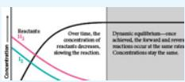</td></tr><tr><td>2. The Equilibrium Constant</td><td>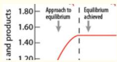</td></tr><tr><td>3. Determination of a Generalized Expression for  $K_c$  from the Specific to the General</td><td>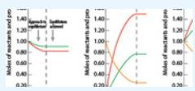</td></tr><tr><td>4. Manipulation of the Equilibrium Constant</td><td> $K_c' = \frac{[CO][H_2]^2}{[CH_3OH]}$ </td></tr><tr><td>5. Converting Between Equilibrium Constants Expressed in Concentration Units and Equilibrium Constants Expressed in Pressure Units</td><td>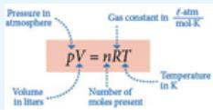</td></tr><tr><td>6. Stressed Equilibria</td><td>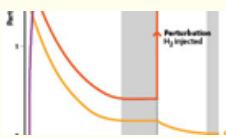</td></tr><tr><td>7. The Principle of Le Chatelier</td><td>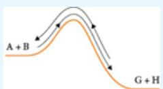</td></tr><tr><td>8. Quantitative Determination of Concentrations Following an Impressed Stress on a System at Equilibrium</td><td>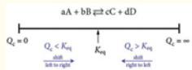</td></tr><tr><td>9. Equilibrium Problems Involving Multiple Steps</td><td>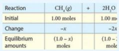</td></tr><tr><td>10. Equilibrium Constants, Spontaneous Processes, and Gibbs Free Energy</td><td>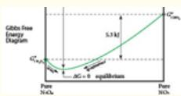</td></tr><tr><td>11. Gibbs Free Energy Under Non-standard Conditions</td><td>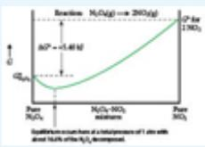</td></tr><tr><td>12. ΔG° at Temperatures Other Than 298 K</td><td>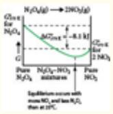</td></tr><tr><td>13. Thermodynamic Equilibrium Constant: Activities</td><td> $activity = a = \frac{\text{the effective concentration of a substance}}{\text{the effective concentration of that substance in a standard reference state}}$ </td></tr><tr><td>14. Assessing Spontaneity for Nonstandard Conditions</td><td>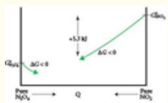</td></tr><tr><td>15.  $\Delta G^{\circ}$  and  $K_{\text{eq}}$  as Functions of Temperature</td><td>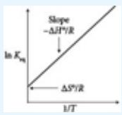</td></tr><tr><td>16. Gibbs Free Energy: The Maximum Amount of Work That Can Be Extracted from a Chemical Process</td><td></td></tr></table>

## The Concept of Chemical Equilibrium

The state of equilibrium in a chemical reaction is of such theoretical and practical importance that it not only deserves its own chapter, but also embodies concepts that fundamentally alter how we view chemical transformations. To be in equilibrium is to be in a state of delicate balance, poised between countervailing forward and reverse reactions that appear macroscopically to be at rest. While a chemical system in equilibrium presents an unchanging macroscopic face, at the microscopic, molecular level there is an intense, dynamic competition occurring between opposing processes.

Recognition of the importance of the dynamic equilibrium state to which we now turn our attention, is the fact that while we have typically written our generalized chemical equation as

```{math}
:label: eq-p1-ch05-10
a A + b B \rightarrow c C + d D
```


(that distinguishes reactants on the left from products on the right with the appropriate stoichiometric coefficients), we now express an arbitrary chemical process as

```{math}
:label: eq-p1-ch05-11
a A + b B \rightleftarrows c C + d D
```


This introduces the bidirectional double arrow where “reactants” (a moles of A and b moles of B) go to “products” (c moles of C and d moles of D) but equally, products go back to reactants. In this dynamic equilibrium, there is nothing special about the designation of reactants vs. products.

While we will focus primarily on chemical reactions that interconnect products and reactants, the principles we develop can be applied equally well to processes such as liquid-gas equilibrium; for example,

```{math}
:label: eq-p1-ch05-12
\mathrm {H_ {2} O(l)\rightleftharpoons H_ {2} O(g)}
```


The number of molecules evaporating from the liquid is balanced exactly by those condensing from the gas. This results in a constant vapor pressure over the liquid. We represent this as a dynamic equilibrium symbolically by the twin arrows.

The central importance of the concept of equilibrium to modern chemistry and physics can be demonstrated in many ways—and we will explore a number in detail—by specific example. A few examples of chemical transformations that exhibit equilibrium properties at or near room temperature are:

1. Homogeneous acid-base equilibrium in solution:

```{math}
:label: eq-p1-ch05-13
\mathrm{CH} _ {3} \mathrm{COOH} (\mathrm{aq}) + \mathrm{H} _ {2} \mathrm{O} (l) \rightleftharpoons \mathrm{H} _ {3} \mathrm{O} ^ {+} (\mathrm{aq}) + \mathrm{CH} _ {3} \mathrm{COO} ^ {-} (\mathrm{aq})
```


2. Decomposition of a solid into a solid and a gas:

```{math}
:label: eq-p1-ch05-14
\mathrm{CaCO} _ {3} (\mathrm{s}) \rightleftharpoons \mathrm{CaO} (\mathrm{s}) + \mathrm{CO} _ {2} (\mathrm{g})
```


3. Precipitation-dissolution, the heterogeneous equilibrium between a solution and a solid phase:

```{math}
:label: eq-p1-ch05-15
\mathrm{Ag} ^ {+} (\mathrm{aq}) + \mathrm{Cl} ^ {-} (\mathrm{aq}) \rightleftharpoons \mathrm{AgCl} (\mathrm{s})
```


4. Dimerization-dissolution, which is the formation and subsequent breakup of one molecule from two:

```{math}
:label: eq-p1-ch05-16
\mathrm{ClO(g)} + \mathrm{ClO(g)} \rightleftharpoons \mathrm{ClOOCl(g)}
```


The attainment of equilibrium is a universal imperative driven by the fundamentals of thermodynamics that dictate spontaneous change. An analysis of spontaneous change dominated our discussion in the development of Gibbs free energy, G and ΔG. In the development of our understanding of Gibbs free energy, we recognized that the thermodynamic criteria for determining whether an event would occur is the condition that $\Delta \mathrm { G } < 0$ . This means that before a chemical reaction begins, the free energy of the reactants, $\mathbf { G } _ { \mathrm { R } } ,$ is greater than that of the products, $\mathbf { G } _ { \mathrm { P } }$ . As noted in the Framework, if the reaction is to proceed, then the chemical transformation from reactant to product must release free energy:

```{math}
:label: eq-p1-ch05-17
\mathrm{Reactants} \rightarrow \mathrm{Products} + \mathrm{FreeEnergy}
```


The reaction proceeds to the point where $\Delta \mathbf { G } = \mathbf { G } _ { \mathrm { P } } - \mathbf { G } _ { \mathrm { R } } = \mathbf { 0 }$ at which point the equilibrium condition is satisfied and from the macroscopic perspective, change ceases. All concentrations, pressures, temperature, etc. no longer depend on time. In the natural world there are only two options: (1) the system is in equilibrium and it will remain so unless disturbed by an outside influence, or (2) the system is out of equilibrium, which is the case of all living organisms, and will, in time, achieve equilibrium.

We turn then to address how this equilibrium condition in chemistry is addressed, beginning with an analysis of the equilibrium constant.

## The Equilibrium Constant

The quantitative foundation for treating equilibria in chemical systems began with C. M. Guldberg and P. Waage in 1863 with the statement of the Law of Mass Action that defined the reaction quotient

```{math}
:label: eq-p1-ch05-18
Q = \frac {[ C ] ^ {c} [ D ] ^ {d}}{[ A ] ^ {a} [ B ] ^ {b}}
```


for our chemical transformation

```{math}
:label: eq-p1-ch05-19
a A + b B \rightleftarrows c C + d D
```


wherein the lower case letters designate the stoichiometric coefficients and the brackets designate the concentrations. While $Q ,$ the reaction quotient, is defined for all conditions, equilibrium or otherwise, the Law of Mass Action states that at equilibrium, the reaction quotient is equal to a constant

```{math}
:label: eq-p1-ch05-20
Q = K _ {\mathrm{eq}} (T)
```


and that constant is dependent only on temperature and nothing else. The constant is called the equilibrium constant, $K _ { \mathrm { e q } } ( T )$ . It is, for a given reaction at a specified temperature, a single number that is established empirically— that is by direct experiment via the determination of reactant/product concentrations at equilibrium.

Thus, at equilibrium for a specified temperature

```{math}
:label: eq-p1-ch05-21
K _ {\mathrm{eq}} = \frac {[ C ] _ {\mathrm{eq}} ^ {c} [ D ] _ {\mathrm{eq}} ^ {d}}{[ A ] _ {\mathrm{eq}} ^ {a} [ B ] _ {\mathrm{eq}} ^ {b}}
```


where $[ A ] _ { \mathrm { e q } } , [ B ] _ { \mathrm { e q } } ,$ etc. refer to the concentrations at equilibrium.

The importance of this equilibrium condition, expressed as a single, experimentally determined number, has far-reaching consequences for the diagnosis of chemical systems, be they acid-base neutralization, dissociation, dimerization, precipitation, or another process. All of these chemical systems conform to the constraint imposed by the Law of Mass Action at equilibrium. For each explicit, balanced chemical equation, the equilibrium constant unequivocally links the concentrations of reactants/products at equilibrium.

Consider the equilibrium reaction in the formation of methyl alcohol from carbon monoxide and hydrogen:

```{math}
:label: eq-p1-ch05-22
\mathrm{CO(g)} + 2 \mathrm {H_ {2} (g)} \rightleftharpoons \mathrm {CH_ {3} OH(g)}
```


We can initiate this reaction in a variety of ways by starting from vastly different initial conditions.

## Experiment 1:

For example, we can initiate the reaction with 1 mole each of CO and of $\mathrm { H } _ { 2 }$ with zero moles of $\mathrm { C H _ { 3 } O H }$ in a 10 liter vessel at a given temperature and then wait until the system reaches equilibrium. We know when equilibrium is reached because the macroscopic observables (concentrations of CO, $\mathrm { H } _ { 2 } ,$ and $\mathrm { C H _ { 3 } O H ; }$ temperature; pressure) become independent of time, as displayed in Figure 5.4a.

:::{figure} ../images/fig-p1-ch05-21.jpg
:name: fig-p1-ch05-21
:alt: FIGURE 5.4A Graph of the concentrations of CO(g), mathematical notation and mathematical notation as a function of time from the initial conditions wherein mathematical notation mathematical notation M, mathematical notation M to the condit
FIGURE 5.4A Graph of the concentrations of CO(g), ${ \sf H } _ { 2 } ( { \sf g } )$ and $\mathsf { C H } _ { 3 } \mathsf { O H } ( 9 )$ as a function of time from the initial conditions wherein $\left[ \mathsf { C H } _ { 3 } \mathsf { O H } \right] = 0 \mathsf { M }$ $\mathrm { [ C O ] } = 0 . 1$ M, $[ \mathsf { H } _ { 2 } ] = 0 . 1$ M to the conditions of equilibrium at which point the concentrations do not change with time.
:::


But moreover, we can calculate the reaction quotient, $\boldsymbol { Q } _ { c } ,$ for the initial conditions, where the subscript $^ { 6 6 } \mathrm { c } ^ { 9 9 }$ refers to the fact that we are carrying out the calculation in concentration units because 1 mole of reactant is placed in a 10 liter vessel such that the initial concentrations of CO and $\mathrm { H } _ { 2 }$ are

```{math}
:label: eq-p1-ch05-23
\begin{array}{r l} & {\left[ \mathrm{CO} \right] _ {\mathrm{init}} = 0. 1 \mathrm{Molar}} \\ & {\left[ \mathrm{H} _ {2} \right] _ {\mathrm{init}} = 0. 1 \mathrm{Molar}} \end{array}
```


and

```{math}
:label: eq-p1-ch05-24
Q _ {\mathrm{c}} = \frac {[ \mathrm {CH_ {3} OH} ] _ {\mathrm{init}}}{[ \mathrm{CO} ] _ {\mathrm{init}} [ \mathrm {H_ {2}} ] _ {\mathrm{init}} ^ {2}} = \frac {0}{(0 . 1) (0 . 1) ^ {2}} = 0
```


As the reaction progresses towards equilibrium, the concentrations of both CO and $\mathrm { H } _ { 2 }$ decrease, while the concentration of $\mathrm { C H _ { 3 } O H }$ increases such that $Q _ { \mathrm { c } }$ increases from zero to its equilibrium value. From this we can deduce that if $Q _ { \mathrm { c } } ~ < ~ K _ { \mathrm { e q } } ,$ the reaction will shift from left to right, from reactants to products, until $Q _ { \mathrm { c } } = K _ { \mathrm { e q } } ,$ at which point the concentrations of reactants and products will cease to change.

## Experiment 2:

Suppose we use an entirely different set of initial conditions. Suppose we use 1 mole of $\mathrm { C H _ { 3 } O H }$ in the 10 liter vessel with no CO or $\mathrm { H } _ { 2 }$ and allow the reaction to proceed. The evaluation of $\mathrm { [ C H _ { 3 } O H ] , [ H _ { 2 } ] }$ , and [CO] with time are displayed in Figure 5.4b.

:::{figure} ../images/fig-p1-ch05-22.jpg
:name: fig-p1-ch05-22
:alt: FIGURE 5.4B Graph of the concentrations of CO(g), mathematical notation , and mathematical notation as a function of time from the initial conditions wherein mathematical notation and mathematical notation M to the condition of chemical equ
FIGURE 5.4B Graph of the concentrations of CO(g), ${ \sf H } _ { 2 } ( { \sf g } )$ , and $\mathsf { C H } _ { 3 } \mathsf { O H } ( 9 )$ as a function of time from the initial conditions wherein $[ \mathsf { C H } _ { 3 } \mathsf { O H } ] = 0 . 1 0 0 \mathsf { M }$ and $[ \mathsf { C O } ] = [ \mathsf { H } _ { 2 } ] = 0$ M to the condition of chemical equilibrium where the concentrations do not change with time.
:::


The reaction coefficient at the moment the reaction is initiated is

```{math}
:label: eq-p1-ch05-25
Q _ {\mathrm{c}} = \frac {[ \mathrm {CH_ {3} OH} ] _ {\mathrm{init}}}{[ \mathrm{CO} ] _ {\mathrm{init}} [ \mathrm {H_ {2}} ] _ {\mathrm{init}} ^ {2}} = \frac {0 . 1 0}{(0) (0)} = \infty
```


As the reaction proceeds, the concentrations of CO and of $\mathrm { H } _ { 2 }$ increase with time as the concentration of $\mathrm { C H _ { 3 } O H }$ decreases. Thus, the value of the reaction quotient will decrease until the point is reached where $Q _ { \mathrm { c } } = K _ { \mathrm { e q } }$ and at that point the concentrations of $\mathrm { C H _ { 3 } O H , H _ { 2 } } ,$ and CO will cease to change with time because the condition of equilibrium has been reached. Thus, if, at the initiation of the reaction, $Q _ { \mathrm { c } } > K _ { \mathrm { e q } } ,$ as the reaction progresses the concentrations of CO and $\mathrm { H } _ { 2 }$ will increase, the concentration of $\mathrm { C H _ { 3 } O H }$ will decrease, and the reaction will shift from right to left as equilibrium is approached.

## Experiment 3:

Suppose we initiate the reaction with 1 mole each of $\mathrm { C O } , \mathrm { H } _ { 2 } ,$ and $\mathrm { C H _ { 3 } O H }$ in a 10 liter vessel. This experiment is depicted in Figure $. 5 { \cdot } 4 \underline { { \mathbf { c } } } _ { \mathrm { : } }$ , showing that CO and $\mathrm { H } _ { 2 }$ will increase, and $\mathrm { C H _ { 3 } O H }$ will decrease as time progresses.

:::{figure} ../images/fig-p1-ch05-23.jpg
:name: fig-p1-ch05-23
:alt: FIGURE 5.4C Graph of the concentrations of mathematical notation , and mathematical notation as a function of time from the initial conditions wherein mathematical notation , [CO], and mathematical notation are initially equal to 0.100 M. A
FIGURE 5.4C Graph of the concentrations of $\mathsf { C O } ( \mathsf { g } ) , \mathsf { H } _ { 2 } ( \mathsf { g } )$ , and ${ \mathsf { C H } } _ { 3 } { \mathsf { O H } } ( { \mathsf { g } } )$ as a function of time from the initial conditions wherein $[ \mathsf { C H } _ { 3 } \mathsf { O H } ]$ , [CO], and $[ \mathsf { H } _ { 2 } ]$ are initially equal to 0.100 M. As in both Figures 5.4a and 5.4b, the concentrations change with time until equilibrium is achieved at which point the concentrations no longer change with time.
:::


At the instant the reaction is initiated, the reaction coefficient is

```{math}
:label: eq-p1-ch05-26
Q _ {\mathrm{c}} = \frac {[ \mathrm{CH} _ {3} \mathrm{OH} ] _ {\mathrm{init}}}{[ \mathrm{CO} ] _ {\mathrm{init}} [ \mathrm{H} _ {2} ] _ {\mathrm{init}} ^ {2}} = \frac {0 . 1 0}{(0 . 1) (0 . 1) ^ {2}} = 1 0 0
```


As the reaction progresses toward equilibrium, and the concentration of $\mathrm { C H _ { 3 } O H }$ decreases and the concentrations of CO and $\mathrm { H } _ { 2 }$ increase, $Q _ { \mathrm { c } }$ will decrease until $Q _ { \mathrm { c } } = K _ { \mathrm { e q } } ;$ ; equilibrium is achieved and the concentrations do not change with time.

What is important to recognize is that while the measured (macroscopic) concentrations of CO, $\mathrm { H } _ { 2 } ,$ , and $\mathrm { C H _ { 3 } O H }$ do not change, the equilibrium condition represents a dynamic state at the molecular (microscopic) level because CO and $\mathrm { H } _ { 2 }$ are constantly reacting to produce methyl alcohol

```{math}
:label: eq-p1-ch05-27
\mathrm{CO} + 2 \mathrm{H} _ {2} \rightarrow \mathrm{CH} _ {3} \mathrm{OH}
```


but methyl alcohol is constantly decomposing to form CO and $\mathrm { H } _ { 2 }$

```{math}
:label: eq-p1-ch05-28
\mathrm{CH} _ {3} \mathrm{OH} \rightarrow \mathrm{CO} + 2 \mathrm{H} _ {2}
```


and the rates at which these two processes occur exactly balance. We will study the rates of those reactions in Chapter 12, when we study kinetics.

But now we have three experiments and from these results some striking conclusions emerge. Let's first summarize our three experiments graphically, as shown in Figure 5.4d, and then tabulate the results in terms of the observed concentrations at equilibrium.

:::{figure} ../images/fig-p1-ch05-24.jpg
:name: fig-p1-ch05-24
:alt: FIGURE 5.4D Examination of the three cases, each with a distinctly different initial condition, demonstrates that no matter what the initial conditions are, when equilibrium is achieved, the same value for the equilibrium constant results.
FIGURE 5.4D Examination of the three cases, each with a distinctly different initial condition, demonstrates that no matter what the initial conditions are, when equilibrium is achieved, the same value for the equilibrium constant results.
:::


It is important that we prove experimentally that we have established the correct functional form of the equilibrium constant, $\mathrm { K _ { e q } } .$ . To accomplish this, we analyze the results to find whether (1) there is a single value for the reaction quotient at equilibrium, and (2) what functional form of the reactant and product concentrations gives a consistent value for the equilibrium constant. Several attempts to deduce this functional form are given in Table 5.1.

TABLE 5.1 Three attempts to find a constant ratio of equilibrium concentrations in the reaction $C 0 + 2 H _ { 2 }$ $ \mathrm { C H } _ { 3 } \mathrm { O H } .$

<table><tr><td>Exp</td><td>Trial 1:</td><td>Trial 2:</td><td>Trial 3:</td></tr><tr><td></td><td> $\frac{[CH_3OH]}{[CO][H_2]}$ </td><td> $\frac{[CH_3OH]}{[CO](2 \times [H_2])}$ </td><td> $\frac{[CH_3OH]}{[CO][H_2]^2}$ </td></tr><tr><td>1</td><td> $\frac{0.00892}{0.0911 \times 0.0822} = 1.19$ </td><td> $\frac{0.00892}{0.0911 \times (2 \times 0.0822)} = 0.596$ </td><td> $\frac{0.00892}{0.0911 \times (0.0822)^2} = 14.5$ </td></tr><tr><td>2</td><td> $\frac{0.0247}{0.0753 \times 0.151} = 2.17$ </td><td> $\frac{0.0247}{0.0753 \times (2 \times 0.151)} = 1.09$ </td><td> $\frac{0.0247}{0.0753 \times (0.151)^2} = 14.4$ </td></tr><tr><td>3</td><td> $\frac{0.0620}{0.138 \times 0.176} = 2.55$ </td><td> $\frac{0.0620}{0.138 \times (2 \times 0.176)} = 1.28$ </td><td> $\frac{0.0620}{0.138 \times (0.176)^2} = 14.5$ </td></tr></table>

## Determination of a Generalized Expression for $K _ { \mathrm { c } }$ from the Specific to the General: Beginning with Our Equilibrium Expression

```{math}
:label: eq-p1-ch05-29
a A + b B \rightleftarrows c C + d D
```


```{math}
:label: eq-p1-ch05-30
\mathrm{CO} (g) + 2 \mathrm{H} _ {2} (g) \rightleftarrows \mathrm{CH} _ {3} \mathrm{OH} (g)
```


We note first that for Experiment 1 at equilibrium displayed in Figure 5.4d:

```{math}
:label: eq-p1-ch05-31
\begin{array}{l} \mathrm {[CO ] _ {eq} = 0.0911M} \\ \mathrm {[H_ {2} ] _ {eq} = 0.0822M} \\ \mathrm {[CH_ {3} OH ] _ {eq} = 0.00892M} \end{array}
```


For Experiment 2 at equilibrium displayed in Figure 5.4b:

```{math}
:label: eq-p1-ch05-32
\begin{array}{r l} & {\left[ \mathrm{CO} \right] _ {\mathrm{eq}} = 0. 0 7 5 3 \mathrm{M}} \\ & {\left[ \mathrm{H} _ {2} \right] _ {\mathrm{eq}} = 0. 1 5 1 \mathrm{M}} \\ & {\left[ \mathrm{CH} _ {3} \mathrm{OH} \right] _ {\mathrm{eq}} = 0. 0 2 4 7 \mathrm{M}} \end{array}
```


And for Experiment 3 displayed in Figure $. 5 . 4 \underline { { \mathrm { d } } }$ :

```{math}
:label: eq-p1-ch05-33
\begin{array}{l} \mathrm {[CO ] _ {eq} = 0.138M} \\ \mathrm {[H_ {2} ] _ {eq} = 0.176M} \\ \mathrm {[CH_ {3} OH ] _ {eq} = 0.0620M} \end{array}
```


What Table 5.1 displays is the calculated values for three different assumptions concerning the functional form for a trial equilibrium constant. Trial 1 assumes that all concentrations appear in the trial equilibrium expression raised to the first power. This assumption yields three different values for each of the experiments—wherein the experiments were defined by the initial concentrations of $\mathrm { C O } , \mathrm { H } _ { 2 } ,$ and $\mathrm { C H _ { 3 } O H }$

Trial 2, calculated in Table 5.1, assumes all concentrations at equilibrium are raised to the first power, but that the concentration of each species is multiplied by the stoichiometric coefficient that appears in the balanced chemical reaction. Thus the concentration of CO is multiplied by unity, the concentration of $\mathrm { H } _ { 2 }$ is multiplied by 2, and the concentration of $\mathrm { C H _ { 3 } O H }$ is multiplied by unity. Values for the three experiments with the assumptions of Trial 2 are tabulated in Table 5.1. For each of the three different initial concentrations of CO, $\mathrm { H } _ { 2 } ,$ and $\mathrm { C H _ { 3 } O H }$ , three different values for the “equilibrium constant” emerge.

Trial 3 assumes that the concentrations of the chemical species in the equilibrium expression appear raised to the power $o f$ their individual stoichiometric coefficients. Thus, the CO concentration is raised to the power of one, $\mathrm { H } _ { 2 }$ concentration to the power of two, and $\mathrm { C H _ { 3 } O H }$ concentration to the power of one. These are tabulated in the third column of the table. But remarkably, the calculated value for the equilibrium constant is the same, within experimental error, for all three experiments—experiments for which the initial concentrations were very different, but for which, at equilibrium, the equilibrium constant calculated by raising each of the concentrations to the power of its stoichiometric coefficient, yielded a single value for the equilibrium constant.

This is a remarkable result:

1. Equilibrium is achieved from very different initial conditions but with the same final state expressed by an equilibrium constant expression constructed by assuming that the concentration of each of the chemical species involved in the equilibrium is raised to the power of its individual stoichiometric coefficient.

2. By direct observation, the Law of Mass Action is demonstrated to hold.

3. The relationship between the reaction quotient, $Q _ { \mathrm { c } } ,$ and the equilibrium constant, $K _ { \mathrm { e q } } ,$ is established through the course of a reaction as it approaches equilibrium from very different initial conditions. Specifically, if $Q _ { \mathrm { c } } < K _ { \mathrm { e q } } ,$ the reaction will progress from left to right until equilibrium is achieved, at which point $Q _ { \mathrm { c } } = K _ { \mathrm { e q } } .$ . If, on the other hand, $Q _ { \mathrm { c } } > K _ { \mathrm { e q } } ,$ the reaction will proceed from right to left until $Q _ { \mathrm { c } } = K _ { \mathrm { e q } } ,$ at which point the reaction has achieved equilibrium.

## Check Yourself 1—Relating Equilibrium Concentrations of Reactants and Products

These equilibrium concentrations are measured for the reaction $\mathrm { C O } ( { \bf g } ) +$ $\ 2 \mathrm { H } _ { 2 } ( \mathrm { g } )  \mathrm { C H } _ { 3 } \mathrm { O H } [ \mathrm { g } ]$ at 483 K: $\mathbf { [ C O ] } = \mathbf { 1 . O 3 }$ M and $\mathrm { [ C H _ { 3 } O H ] } = 1 . 5 6$ M. What is the equilibrium concentration of $\mathrm { H } _ { 2 } ?$

## Solution

Write the equilibrium constant expression in terms of activities:

```{math}
:label: eq-p1-ch05-34
K = \left(\frac {a _ {C H _ {3} O H}}{a _ {C O} \left(a _ {H _ {2}}\right) ^ {2}}\right) _ {e q} = 1 4. 5
```


See page 295 for a discussion of activities. Activities will turn out to be of significant quantitative importance.

Assume that the reaction conditions are such that the activities can be replaced by their concentration values, allowing concentration units to be canceled.

```{math}
:label: eq-p1-ch05-35
K = \left(\frac {[ \mathrm{CH} _ {3} \mathrm{OH} ]}{[ \mathrm{CO} ] [ \mathrm{H} _ {2} ] ^ {2}}\right) _ {\mathrm{eq}} = 1 4. 5
```


Substitute the known equilibrium concentrations into the equilibrium constant expression:

```{math}
:label: eq-p1-ch05-36
K = \frac {[ \mathrm{CH} _ {3} \mathrm{OH} ]}{[ \mathrm{CO} ] ([ \mathrm{H} _ {2} ]) ^ {2}} = \frac {1 . 5 6}{1 . 0 3 [ \mathrm{H} _ {2} ] ^ {2}} = 1 4. 5
```


Solve for the unknown concentration, $\left[ \mathrm { H } _ { 2 } \right]$

```{math}
:label: eq-p1-ch05-37
\left[ \mathrm{H} _ {2} \right] ^ {2} = \frac {1 . 5 6}{1 . 0 3 \times 1 4 . 5} = 0. 1 0 4
```


```{math}
:label: eq-p1-ch05-38
\left[ \mathrm{H} _ {2} \right] = \sqrt {0 . 1 0 4} = 0. 3 2 2 \mathrm{M}
```


Practice Example A: In another experiment, equal concentrations of $\mathrm { C H _ { 3 } O H }$ and CO are found at equilibrium in the reaction $\mathrm { C O } ( \mathrm { g } ) + 2 \mathrm { H } _ { 2 } ( \mathrm { g } ) $ $\mathrm { C H _ { 3 } O H ( g ) }$ . What must be the equilibrium concentration of $\mathrm { H } _ { 2 } { \mathrm { ? } }$

Practice Example B: At a certain temperature, $\mathrm { \bf ~ K } = { \bf \mu _ { 1 . 8 } } \times { \bf \mu _ { 1 0 } } { \bf 4 }$ for the reaction $\mathrm { N } _ { 2 } ( \mathrm { g } ) + 3 \mathrm { H } _ { 2 } ( \mathrm { g } )  2 \mathrm { N H } _ { 3 } ( \mathrm { g } )$ . If the equilibrium concentrations of $\mathrm { N } _ { 2 }$ and $\mathrm { N H } _ { 3 }$ are 0.015 M and 2.00 M, respectively, what is the equilibrium concentration of $\mathrm { H } _ { 2 } ?$

## Manipulation of the Equilibrium Constant

The equilibrium constant, $K _ { \mathrm { e q } } ,$ is so important to the analysis of chemical processes that we digress to consider the relationship between the functional form of the equilibrium constant and the specific form of the chemical reaction to which the equilibrium constant applies.

The first point is that there is a one-to-one relationship between the equilibrium constant and the particular balanced chemical reaction. We have deduced, by direct experiment, that for the reaction

```{math}
:label: eq-p1-ch05-39
\mathrm{CO(g)} + 2 \mathrm {H_ {2} (g)} \rightleftharpoons \mathrm {CH_ {3} OH(g)} \tag{5.1}
```


the equilibrium constant expressed in concentration units is

```{math}
:label: eq-p1-ch05-40
K _ {\mathrm{c}} = \frac {[ \mathrm {CH_ {3} OH} ]}{[ \mathrm{CO} ] [ \mathrm {H_ {2}} ] ^ {2}} \tag{5.2}
```


But suppose we write the equilibrium reaction as

```{math}
:label: eq-p1-ch05-41
\mathrm{CH} _ {3} \mathrm{OH(g)} \rightleftharpoons \mathrm{CO(g)} + 2 \mathrm{H} _ {2} (\mathrm{g})
```


Following our principle that the equilibrium constant is constructed by taking the concentrations of species on the right-hand side of the reaction, raised to the power of their stoichiometric coefficients, divided by the product of the concentration of the species on the left-hand side of the equation, raised to the power of their stoichiometric coefficients, we have

```{math}
:label: eq-p1-ch05-42
K _ {\mathrm{c}} ^ {\prime} = \frac {[ \mathrm{CO} ] [ \mathrm{H} _ {2} ] ^ {2}}{[ \mathrm{CH} _ {3} \mathrm{OH} ]}
```


for reaction 5.2. Thus, we have the result that

1. For each chemical equation defining an equilibrium reaction, there is a unique functional form of the equilibrium constant.

2. When we reverse the chemical equation expressing the equilibrium relation between the left-hand and right-hand species, we invert the functional form of the equilibrium constant.

Thus, for

```{math}
:label: eq-p1-ch05-43
K _ {\mathrm{c}} = \frac {[ \mathrm {CH_ {3} OH} ]}{[ \mathrm{CO} ] [ \mathrm {H_ {2}} ] ^ {2}}
```


```{math}
:label: eq-p1-ch05-44
\mathrm{CO(g)} + 2 \mathrm {H_ {2} (g)} \rightleftharpoons \mathrm {CH_ {3} OH(g)}
```


```{math}
:label: eq-p1-ch05-45
\begin{array}{l}K _ {\mathrm{c}} ^ {\prime} = \frac {[ \mathrm{CO} ] [ \mathrm{H} _ {2} ] ^ {2}}{[ \mathrm{CH} _ {3} \mathrm{OH} ]}\\\text { and   for } \quad \mathrm{CH} _ {3} \mathrm{OH(g)} \rightleftharpoons \mathrm{CO(g)} + 2 \mathrm{H} _ {2} (\mathrm{g})\\K _ {\mathrm{c}} ^ {\prime} = \frac {1}{K _ {\mathrm{c}}}.\end{array}
```


If we multiply the stoichiometric coefficients in a balanced chemical reaction by a common factor (yielding a chemical reaction that is still balanced), then the equilibrium constant, $K _ { \mathrm { c } } ,$ is raised to the power by which the stoichiometric coefficients were multiplied, so

```{math}
:label: eq-p1-ch05-46
\mathrm {2CO(g) + 4H_ {2} (g)\rightleftharpoons 2CH_ {3} OH(g)}
```


has a corresponding equilibrium constant

```{math}
:label: eq-p1-ch05-47
K _ {\mathrm{c}} ^ {\prime \prime} = \frac {[ \mathrm {CH_ {3} OH} ] ^ {2}}{[ \mathrm{CO} ] ^ {2} [ \mathrm {H_ {2}} ] ^ {4}} = (K _ {\mathrm{c}}) ^ {2}
```


If, on the other hand, we divide the stoichiometric coefficients by 2, such that

```{math}
:label: eq-p1-ch05-48
\mathrm {^ {1 / 2} CO(g)+ H_ {2} (g)\rightleftharpoons^ {1 / 2} CH_ {3} OH(g)}
```


then

```{math}
:label: eq-p1-ch05-49
K _ {\mathrm{c}} ^ {\prime \prime \prime} = \frac {[ \mathrm {CH_ {3} OH} ] ^ {1 / 2}}{[ \mathrm{CO} ] ^ {1 / 2} [ \mathrm {H_ {2}} ]}
```


and

```{math}
:label: eq-p1-ch05-50
K _ {\mathrm{c}} ^ {\prime \prime \prime} = (K _ {\mathrm{c}}) ^ {1 / 2}
```


Quite often when we are analyzing a chemical reaction, data may not be available for the specific reaction for which we are interested. In this case, we can assemble a series of reactions that, when summed together, yield the overall reaction of interest, but for which we have measured equilibrium constants. For example, suppose we wish to calculate the equilibrium constant for the reaction (which we label reaction 1):

```{math}
:label: eq-p1-ch05-51
\mathrm{NO(g)} + \mathrm {O_ {3} (g)} \xrightarrow {\text {1}} \mathrm {NO_ {2} (g)} + \mathrm {O_ {2} (g)}
```


We know we can write

```{math}
:label: eq-p1-ch05-52
K _ {c _ {1}} = \frac {[ \mathrm{NO} _ {2} (\mathrm{g}) ] [ \mathrm{O} _ {2} (\mathrm{g}) ]}{[ \mathrm{NO} (\mathrm{g}) ] [ \mathrm{O} _ {3} (\mathrm{g}) ]}
```


But suppose we cannot find an equilibrium constant value for $K _ { \mathrm { c } }$ for reaction 1, but we are given the equilibrium constants for two other reactions:

```{math}
:label: eq-p1-ch05-53
\begin{array}{r l r} \mathrm {\frac {3}{2}} \mathrm{O} _ {2} (\mathrm{g}) & \xrightarrow {\mathrm{2}} \mathrm{O} _ {3} (\mathrm{g}) & K _ {\mathrm{c} _ {2}} = 2. 5 \times 1 0 ^ {- 2 9} \\ 2 \mathrm{NO} (\mathrm{g}) + \mathrm{O} _ {2} (\mathrm{g}) & \xrightarrow {\mathrm{3}} 2 \mathrm{NO} _ {2} (\mathrm{g}) & K _ {\mathrm{c} _ {3}} = 2. 3 \times 1 0 ^ {1 2} \end{array}
```


Our strategy is to rewrite these chemical equations such that when they are added together, they result in the desired net overall reaction.

We note first that our target reaction has $\mathrm { { O } } _ { 3 }$ on the left, so we reverse reaction 2:

```{math}
:label: eq-p1-ch05-54
\mathrm{O} _ {3} (\mathrm{g}) \stackrel {2} {\Longleftrightarrow} \% \mathrm{O} _ {2} (\mathrm{g}) K _ {\mathrm{c} _ {2}} ^ {\prime} = \frac {1}{K _ {\mathrm{c} _ {2}}} = 4 \times 1 0 ^ {2 8}
```


because we must invert the equilibrium constant if we reverse the reaction.

Turning to reaction 3, we note that the desired reaction has NO (g) on the left and $\mathrm { N O } _ { 2 } \left( g \right)$ on the right, so we do not need to reverse the reaction. But we wish to sum reaction 3 with the reverse of reaction 2 to yield reaction 1, and to do this we must multiply reaction 3 by the factor ½ such that reaction 3 becomes

```{math}
:label: eq-p1-ch05-55
\mathrm{NO(g)} + \frac {1}{2} \mathrm {O_ {2} (g)} \rightleftarrows \mathrm {NO_ {2} (g)}
```


and this requires that we take the square root of $K _ { \mathfrak { c } _ { 3 } }$

```{math}
:label: eq-p1-ch05-56
K _ {c _ {3}} ^ {\prime} = \sqrt {K _ {c _ {3}}} = 1. 5 \times 1 0 ^ {6}
```


Now we are ready to reassemble our modified forms of reaction 2 and reaction 3 with the modified equilibrium constant for each reaction such that

```{math}
:label: eq-p1-ch05-57
\begin{array}{r l}\mathrm {O_ {3} (g)}&\rightleftharpoons \frac {3}{2} \mathrm {O_ {2} (g)}\\\mathrm {NO(g) + \frac {1}{2} O_ {2} (g)}&\rightleftharpoons \mathrm {NO_ {2} (g)}\\\overline {{\mathrm {NO(g) + O_ {3} (g)}}}&\rightleftharpoons \mathrm {NO_ {2} (g) + O_ {2} (g)}\\K _ {\mathrm {c_ {2}}} ^ {\prime}&= \frac {1}{K _ {\mathrm {c_ {2}}}} = 4 \times 1 0 ^ {2 8}\\K _ {\mathrm {c_ {3}}} ^ {\prime}&= \sqrt {K _ {\mathrm {c_ {3}}}} = 1. 5 \times 1 0 ^ {6}\\K _ {\mathrm {c_ {1}}}&= \left(K _ {\mathrm {c_ {2}}} ^ {\prime}\right) \left(K _ {\mathrm {c_ {3}}} ^ {\prime}\right) = 6 \times 1 0 ^ {3 4}\end{array}
```


We can quickly prove that the expression for $K _ { _ { c _ { 1 } } } = \left( K _ { _ { c _ { 2 } } } ^ { \prime } \right) \left( K _ { _ { c _ { 3 } } } ^ { \prime } \right)$ is correct by noting that

```{math}
:label: eq-p1-ch05-58
K _ {c _ {1}} = \frac {[ \mathrm{NO} _ {2} (\mathrm{g}) ] [ \mathrm{O} _ {2} (\mathrm{g}) ]}{[ \mathrm{NO} (\mathrm{g}) ] [ \mathrm{O} _ {3} (\mathrm{g}) ]}
```


```{math}
:label: eq-p1-ch05-59
K _ {\mathrm{c} _ {2}} ^ {\prime} = \frac {[ \mathrm{O} _ {2} (\mathrm{g}) ] ^ {3 / 2}}{[ \mathrm{O} _ {3} (\mathrm{g}) ]}
```


```{math}
:label: eq-p1-ch05-60
K _ {\mathrm{c} _ {3}} ^ {\prime} = \frac {[ \mathrm{NO} _ {2} (\mathrm{g}) ]}{[ \mathrm{NO(g)} ] [ \mathrm{O} _ {2} (\mathrm{g}) ] ^ {1 / 2}}
```


```{math}
:label: eq-p1-ch05-61
\begin{array}{r l} \left(K _ {\mathrm{c} _ {2}} ^ {\prime}\right) \left(K _ {\mathrm{c} _ {3}} ^ {\prime}\right) & = \frac {[ \mathrm{O} _ {2} (\mathrm{g}) ] ^ {3 / 2}}{[ \mathrm{O} _ {3} (\mathrm{g}) ]} \frac {[ \mathrm{NO} _ {2} (\mathrm{g}) ]}{[ \mathrm{NO} (\mathrm{g}) ] [ \mathrm{O} _ {2} (\mathrm{g}) ] ^ {1 / 2}} \\ & = \frac {[ \mathrm{O} _ {2} (\mathrm{g}) ] [ \mathrm{NO} _ {2} (\mathrm{g}) ]}{[ \mathrm{O} _ {3} (\mathrm{g}) ] [ \mathrm{NO} (\mathrm{g}) ]} \end{array}
```


Which is indeed equal to $K _ { \mathfrak { c } _ { 1 } }$ . There are two important conclusions:

1. We can determine the equilibrium constant for a reaction by adding together separate reactions that, when added together, result in the same net overall reaction.

2. When reactions are summed together to form a net reaction, the equilibrium constants are multiplied together to form the resultant equilibrium constant.

## Check Yourself 2—Relating K to the Balanced Chemical Equation

The following K value is given at 298 K for the synthesis of $\mathrm { N H } _ { 3 } ( \mathbf { g } )$ from its elements.

```{math}
:label: eq-p1-ch05-62
\mathrm{N} _ {2} (\mathrm{g}) + 3 \mathrm{H} _ {2} (\mathrm{g}) \rightleftarrows 2 \mathrm{NH} _ {3} (\mathrm{g}) K = 3. 6 \times 1 0 ^ {8}
```


What is the value of K at 298 K for the following reaction?

```{math}
:label: eq-p1-ch05-63
\mathrm{NH} _ {3} (\mathrm{g}) \rightleftharpoons 1 / 2 \mathrm{N} _ {2} (\mathrm{g}) + ^ {3 / 2} \mathrm{H} _ {2} (\mathrm{g}) \quad K = ?
```


## Solution

First, reverse the given equation. This puts $\mathrm { N H } _ { 3 } ( \mathbf { g } )$ on the left side of the equation, where we need it.

```{math}
:label: eq-p1-ch05-64
2 \mathrm{NH} _ {3} (\mathrm{g}) \rightleftarrows \mathrm{N} _ {2} (\mathrm{g}) + 3 \mathrm{H} _ {2} (\mathrm{g})
```


The equilibrium constant $K ^ { \prime }$ becomes

```{math}
:label: eq-p1-ch05-65
K ^ {\prime} = 1 / (3. 6 \times 1 0 ^ {8}) = 2. 8 \times 1 0 ^ {- 9}
```


Then, to base the equation on 1 mol $\mathrm { N H } _ { 3 } ( \mathbf { g } )$ , divide all coefficients by 2.

```{math}
:label: eq-p1-ch05-66
\mathrm{NH} _ {3} (\mathrm{g}) \rightleftharpoons 1 / 2 \mathrm{N} _ {2} (\mathrm{g}) + ^ {3} / 2 \mathrm{H} _ {2} (\mathrm{g})
```


This requires the square root of $K ^ { \prime }$

```{math}
:label: eq-p1-ch05-67
K = \sqrt {2 . 8 \times 1 0 ^ {- 9}} = 5. 3 \times 1 0 ^ {- 5}
```


Practice Example A: Use data from this example to determine the value of K at 298 K for the reaction

```{math}
:label: eq-p1-ch05-68
\mathrm {\frac {1}{3} N_ {2} (g)+ H_ {2} (g)\rightleftharpoons \frac {2}{3} NH_ {3} (g)}
```


Practice Example B: For the reaction

```{math}
:label: eq-p1-ch05-69
\mathrm{NO(g)} + \frac {1}{2} \mathrm {O_ {2} (g)} \rightleftarrows \mathrm {NO_ {2} (g)}
```


at $\mathbf { 1 8 4 ^ { \circ } C } , K = 7 { \cdot } 5 \times \mathbf { 1 0 ^ { 2 } }$ . What is the value of K at $1 8 4 ^ { \circ } \mathrm { C }$ for the reaction

```{math}
:label: eq-p1-ch05-70
2 \mathrm{NO} _ {2} (\mathrm{g}) \rightleftarrows 2 \mathrm{NO} (\mathrm{g}) + \mathrm{O} _ {2} (\mathrm{g})?
```


## Converting between Equilibrium Constants Expressed in Concentration Units and Equilibrium Constants Expressed in Pressure Units

Suppose we consider the case wherein the equilibrium constant for the oxidation of $\mathrm { S O } _ { 2 }$ to ${ \mathrm { S O } } _ { 3 }$ is expressed in concentration units

```{math}
:label: eq-p1-ch05-71
\mathrm {2SO_ {2} (g)+ O_ {2} (g)\rightleftharpoons 2SO_ {3} (g)}
```


Such that

```{math}
:label: eq-p1-ch05-72
K _ {\mathrm{c}} = \frac {[ \mathrm{SO} _ {3} (\mathrm{g}) ] ^ {2}}{[ \mathrm{SO} _ {2} (\mathrm{g}) ] ^ {2} [ \mathrm{O} _ {2} (\mathrm{g}) ]} = 2. 8 \times 1 0 ^ {2} @ 1 0 0 0 \mathrm{K}
```


But we wish to express the equilibrium constant in terms of pressure, not concentration.

To execute this transformation, we recall that the Perfect Gas Law states that

:::{figure} ../images/fig-p1-ch05-25.jpg
:name: fig-p1-ch05-25
:alt: Figure from the University Chemistry source textbook
:::

Therefore, we can express concentrations of $\mathrm { S O _ { 2 } ( g ) , O _ { 2 } ( g ) }$ , and $\mathrm { { S O } _ { 3 } ( g ) }$ , which we state as moles/liter as

```{math}
:label: eq-p1-ch05-73
[ \mathrm{SO} _ {2} (\mathrm{g}) ] = \frac {n _ {\mathrm{SO} _ {2}}}{V} = \frac {P _ {\mathrm{SO} _ {2}}}{R T}
```


```{math}
:label: eq-p1-ch05-74
[ \mathrm{O} _ {2} (\mathrm{g}) ] = \frac {n _ {\mathrm{O} _ {2}}}{V} = \frac {P _ {\mathrm{O} _ {2}}}{R T}
```


```{math}
:label: eq-p1-ch05-75
[ \mathrm{SO} _ {3} (\mathrm{g}) ] = \frac {n _ {\mathrm{SO} _ {3}}}{V} = \frac {P _ {\mathrm{SO} _ {3}}}{R T}
```


By direct substitution

```{math}
:label: eq-p1-ch05-76
\begin{array}{r l} K _ {\mathrm{c}} = \frac {[ \mathrm{SO} _ {3} (\mathrm{g}) ] ^ {2}}{[ \mathrm{SO} _ {2} (\mathrm{g}) ] ^ {2} [ \mathrm{O} _ {2} (\mathrm{g}) ]} & = \frac {\left(P _ {\mathrm{SO} _ {3}} / R T\right) ^ {2}}{\left(P _ {\mathrm{SO} _ {2}} / R T\right) ^ {2} \left(P _ {\mathrm{O} _ {2}} / R T\right)} \\ & = \frac {P _ {\mathrm{SO} _ {3}} ^ {2}}{P _ {\mathrm{SO} _ {2}} ^ {2} P _ {\mathrm{O} _ {2}}} \frac {(R T) ^ {3}}{(R T) ^ {2}} \\ & = \frac {P _ {\mathrm{SO} _ {3}} ^ {2}}{P _ {\mathrm{SO} _ {2}} ^ {2} P _ {\mathrm{O} _ {2}}} R T \\ & = K _ {\mathrm{p}} R T \end{array}
```


where

```{math}
:label: eq-p1-ch05-77
K _ {\mathrm{p}} = \frac {P _ {\mathrm{SO} _ {3}} ^ {2}}{P _ {\mathrm{SO} _ {2}} ^ {2} P _ {\mathrm{O} _ {2}}}
```


We can express this interconversion between $K _ { \mathrm { c } }$ and $K _ { \mathrm { p } }$ in a simple and more general form by considering our general expression for a chemical process in equilibrium

```{math}
:label: eq-p1-ch05-78
a A + b B \rightarrow c C + d D
```


wherein

```{math}
:label: eq-p1-ch05-79
\begin{array}{r l} K _ {c} & = \frac {[ C ] ^ {c} [ D ] ^ {d}}{[ A ] ^ {a} [ B ] ^ {b}} = \frac {\left(P _ {C} / R T\right) ^ {c} \left(P _ {D} / R T\right) ^ {d}}{\left(P _ {A} / R T\right) ^ {a} \left(P _ {B} / R T\right) ^ {b}} \\ & = \frac {P _ {C} ^ {c} P _ {D} ^ {d}}{P _ {A} ^ {a} P _ {B} ^ {b}} \left(\frac {1}{R T}\right) ^ {c + d - (a + b)} \\ & = K _ {\mathrm{p}} \left(\frac {1}{R T}\right) ^ {c + d - (a + b)} \\ & = K _ {\mathrm{p}} \left(\frac {1}{R T}\right) ^ {\Delta n} \end{array}
```


Alternatively, we can, of course, write

```{math}
:label: eq-p1-ch05-80
K _ {\mathrm{p}} = K _ {\mathrm{c}} (\mathrm{RT}) ^ {\Delta n}
```


where Δn = change in the number of moles = (number of moles of product) − (number of moles of reactants)

Another important characterization of the equilibrium constant is that the concentrations of pure liquids and/or the concentration of pure solids are not included in the expression for the equilibrium constant. This is intuitively obvious, because if we take the concentration of water vapor over liquid water in a vessel, the concentration of water vapor is independent of the amount of liquid water in the vessel as long as some liquid water is present. Thus, for the equilibrium

```{math}
:label: eq-p1-ch05-81
\mathrm {H_ {2} O(l)\rightleftharpoons H_ {2} O(g)}
```


```{math}
:label: eq-p1-ch05-82
K _ {\mathrm{eq}} = \frac {[ \mathrm {H_ {2} O(g)} ]}{[ \mathrm {H_ {2} O(l)} ]}
```


We replace the $K _ { \mathrm { e q } }$ with a measured equilibrium constant that eliminates the concentration of liquid water because the observed equilibrium constant is independent of $\left[ \mathrm { H } _ { 2 } \mathrm { O } ( \mathrm { l } ) \right]$ . Thus we write

```{math}
:label: eq-p1-ch05-83
K _ {\mathrm{eq}} = [ \mathrm {H_ {2} O(g)} ]
```


## Check Yourself 3—Illustrating the Dependence of K on the Reference State

Complete the calculation of $K _ { \mathrm { p } }$ for the reaction $\mathrm { 2 S O _ { 2 } ( g ) + O _ { 2 } ( g )  2 S O _ { 3 } ( g ) }$ knowing that $K _ { \mathrm { c } } = 2 . 8 \times 1 0 ^ { 2 }$ (at 1000 K).

## Solution

Write the equation relating the two equilibrium constants with different reference states.

```{math}
:label: eq-p1-ch05-84
K _ {\mathrm{P}} = K _ {\mathrm{c}} (R T) ^ {\Delta \mathrm{n}}
```


With $\Delta \mathbf { n } = - \mathbf { 1 }$ , we have

```{math}
:label: eq-p1-ch05-85
K _ {\mathrm{p}} = \frac {K _ {\mathrm{c}}}{R T}
```


Substitute the given data and solve.

```{math}
:label: eq-p1-ch05-86
K _ {\mathrm{p}} = \frac {2 . 8 \times 1 0 ^ {2}}{0 . 0 8 2 0 6 \times 1 0 0 0} = 3. 4
```


Practice Example A: For the reaction $\ 2 \mathrm { N H _ { 3 } } ( \mathrm { g ) }  \mathrm { N _ { 2 } } ( \mathrm { g ) } + 3 \ \mathrm { H _ { 2 } } ( \mathrm { g ) }$ at 298 K, $K _ { \mathrm { c } } = 2 . 8 \times 1 0 ^ { - 9 }$ . What is the value of $K _ { \mathrm { p } }$ for this reaction?

Practice Example B: At $\mathbf { 1 0 6 5 ^ { \circ } C } ,$ for the reaction 2 $\mathrm { H } _ { 2 } \mathrm { S } ( \mathrm { g } )  2 \mathrm { H } _ { 2 } ( \mathrm { g } ) +$ $\mathrm { S _ { 2 } ( g ) , } K _ { \mathrm { p } } = 1 . 2 \times 1 0 ^ { - 2 }$ . What is the value of $K _ { \mathrm { c } }$ for the reaction

```{math}
:label: eq-p1-ch05-87
\mathrm {H_ {2} (g) + 1 / 2 S_ {2} (g)\rightleftharpoons H_ {2} S(g) at 1065^ {\circ} C?}
```


Suppose we wish to consider the important reaction shown in Figure 5.5:

```{math}
:label: eq-p1-ch05-88
\mathrm{CaCO} _ {3} (\mathrm{s}) \rightleftarrows \mathrm{CaO} (\mathrm{s}) + \mathrm{CO} _ {2} (\mathrm{g})
```


(a)

(b)

Thus far we have considered homogeneous reactions: those that occur in a single phase—gas or liquid. Suppose we wish to consider heterogeneous reactions:

Consider the reaction:

```{math}
:label: eq-p1-ch05-89
\mathrm{CaCO} _ {3} (\mathrm{s}) \rightleftharpoons \mathrm{CaO} (\mathrm{s}) + \mathrm{CO} _ {2} (\mathrm{g})
```


In this case

```{math}
:label: eq-p1-ch05-90
K _ {\mathrm{p}} = K _ {\mathrm{c}} (R T) ^ {\Delta n} = K _ {\mathrm{c}} R T
```


:::{figure} ../images/fig-p1-ch05-26.jpg
:name: fig-p1-ch05-26
:alt: Figure from the University Chemistry source textbook
:::

:::{figure} ../images/fig-p1-ch05-27.jpg
:name: fig-p1-ch05-27
:alt: FIGURE 5.5 The equilibrium constant for reactions that involve heterogeneous processes in which a gas resides over a pure liquid or solid are written by eliminating the concentration of the solid because the amount of the gas phase species
FIGURE 5.5 The equilibrium constant for reactions that involve heterogeneous processes in which a gas resides over a pure liquid or solid are written by eliminating the concentration of the solid because the amount of the gas phase species does not depend on the concentration of the solid as long as some solid exists in equilibrium with the gas.
:::


Here again the $\mathrm { C O } _ { 2 } ( \mathrm { g } )$ concentration is independent of the amount of calcium carbonate, $\mathrm { C a C O } _ { 3 }$ , and the amount of calcium oxide, CaO, in the vessel as long as both are present. We then write

```{math}
:label: eq-p1-ch05-91
K _ {\mathrm{c}} = \left[ \mathrm{CO} _ {2} \right] \quad \text { and } \quad K _ {\mathrm{p}} = P _ {\mathrm{co} _ {2}}
```


```{math}
:label: eq-p1-ch05-92
K _ {\mathrm{p}} = K _ {\mathrm{c}} (R T) ^ {\Delta n} = K _ {\mathrm{c}} (R T)
```


## Check Yourself 4—Calculating the Equilibrium Constant for Reactions Involving Pure Liquids and/or Pure Solids

An important factor when we consider how to construct the correct expression for the equilibrium constant for reactions that involve a combination of gas phase, liquid phase, and solid phase reactants and products is to consider what mechanism determines the partial pressure of a given gas phase species in the presence of a pure liquid or a pure solid. Specifically, the partial pressure of a gas over a liquid or solid (see Figure 5.5) does not depend upon the amount of the solid over which the gas phase species exists, as long as there is some of the solid present. The reason is that molecules in the gas phase $( \mathrm { e . g . ~ C O _ { 2 } } )$ over the solid (e.g.

$\mathrm { C a C O _ { 3 } } )$ are in a dynamic equilibrium such that gas phase molecules are constantly entering and leaving the solid phase species in the container. Thus, as long as there is some of the solid present, even a very small amount, that dynamic equilibrium will exist. If we double the amount of the solid $( \mathrm { e . g . \ C a C O _ { 3 } ) }$ present, there will be no effect on the partial pressure of the gas phase species $\left( \mathrm { C O } _ { 2 } \right)$ . Thus if the equilibrium between the gas phase species and the solid phase species does not depend on the amount of the solid phase present, the equilibrium constant must be independent of the amount of solid present—as long as some of the solid is present. The same principle holds for pure liquids.

## Problem

Consider the equilibrium between hydrogen sulfide $\mathrm { ( H _ { 2 } S ( g ) ) }$ plus $\mathrm { I } _ { 2 } ( \mathsf { s } )$ as reactants and hydrogen iodide in the gas phase (HI(g)) and solid phase sulfur as the products.

```{math}
:label: eq-p1-ch05-93
\mathrm {H_ {2} S(g)+ I_ {2} (s)\rightleftharpoons 2 HI(g) + S(s)}
```


Calculate the equilibrium constant in pressure units, $K _ { \mathrm { p } } ,$ for the reaction if $P \mathrm { H } 2 \mathrm { S } = 9 . 9 6 \times 1 0 ^ { - 1 }$ atm and $P \mathrm { H I } = 3 . 6 5 \times 1 0 ^ { - 3 }$ atm at 333 K.

## Solution:

Inspection of the equilibrium reaction reveals that both $\mathrm { I } _ { 2 }$ and S are pure solids and thus they do not enter the expression for the calculation of the equilibrium constant.

Thus

```{math}
:label: eq-p1-ch05-94
K _ {\mathrm{p}} = \frac {\left(P _ {\mathrm{HI}}\right) ^ {2}}{\left(P _ {\mathrm {H_ {2} S}}\right)} = \frac {\left(3 . 6 5 \times 1 0 ^ {- 3}\right) ^ {2}}{9 . 9 6 \times 1 0 ^ {- 1}} = 1. 3 4 \times 1 0 ^ {- 5}
```


## Practice Problem:

A very important reaction involving both multiphase equilibria as well as human health is the reaction between hydroxyapatite, $\mathrm { C a } _ { 5 } ( \mathrm { P O } _ { 4 } ) _ { 3 } \mathrm { O H }$ which is the principal ingredient in mammalian teeth, and an acid solution. Acid is produced in the mouth by bacteria. We can write this reaction as

```{math}
:label: eq-p1-ch05-95
4 \mathrm{H} ^ {+} (\mathrm{aq}) + \mathrm{Ca} _ {5} (\mathrm{PO} _ {4}) _ {3} \mathrm{OH} \rightleftharpoons 5 \mathrm{Ca} ^ {2 +} (\mathrm{aq}) + 3 \mathrm{HPO} _ {4} ^ {2 -} (\mathrm{aq}) + \mathrm{H} _ {2} \mathrm{O} (\mathrm{l})
```


## Stressed Equilibria

Thus far we have viewed equilibria in chemical systems as a progression that carried us from a set of initial conditions to a final, time independent, state of equilibrium. But in many important examples in real systems, the state of equilibrium will be intruded upon by changes in the conditions impressed on the system in its state of equilibrium. In fact, more frequently than not, we find ourselves in need of analyzing how systems are stressed after they reach equilibrium rather than analyzing how they progress from initial conditions to the state of equilibrium.

Consider, for example, one of the most famous and continuously employed equilibria, the Haber process (named for its inventor pictured in Figure 5.6) for “fixing” nitrogen by breaking the NN bond to make nitrogen available to biological process.

:::{figure} ../images/fig-p1-ch05-28.jpg
:name: fig-p1-ch05-28
:alt: FIGURE 5.6 Fritz Haber was one of the most famous mathematical notation century chemists, having developed a process for the formation of ammonia, mathematical notation , from mathematical notation and mathematical notation at high pressure
FIGURE 5.6 Fritz Haber was one of the most famous $2 0 ^ { \mathrm { { t h } } }$ century chemists, having developed a process for the formation of ammonia, ${ \mathsf { N H } } _ { 3 } ,$ , from $\mathsf { N } _ { 2 }$ and ${ \sf H } _ { 2 }$ at high pressure and temperature over an iron catalyst. While he developed this method for “fixing” nitrogen (i.e., for breaking the $\mathsf { N } _ { 2 }$ bond to make nitrogen available for use by plants as a nutrient), the process was used to develop nitrate explosives used extensively in the First World War.
:::


Using iron catalysts and elevated temperatures and pressures, Haber refined the production of ammonia using the equilibrium reaction

```{math}
:label: eq-p1-ch05-96
\mathrm{N} _ {2} (\mathrm{g}) + 3 \mathrm{H} _ {2} (\mathrm{g}) \rightleftharpoons 2 \mathrm{NH} _ {3} (\mathrm{g})
```


We can immediately write down the reaction quotient, $Q ,$ for this reaction in terms of the partial pressures of $\mathrm { N } _ { 2 } , \mathrm { H } _ { 2 } ,$ and $\mathrm { N H } _ { 3 }$ :

```{math}
:label: eq-p1-ch05-97
Q _ {\mathrm{p}} = \frac {P _ {\mathrm{NH} _ {3}} ^ {2}}{P _ {\mathrm{N} _ {2}} P _ {\mathrm{H} _ {2}} ^ {3}}
```


If we begin with $\mathrm { N } _ { 2 }$ and $\mathrm { H } _ { 2 } ,$ , initially $Q _ { \mathrm { p } } = \mathbf { 0 }$ and, because $\mathrm { N H } _ { 3 }$ is produced in the reaction, $Q _ { \mathrm { p } }$ will increase until equilibrium is attained such that

```{math}
:label: eq-p1-ch05-98
Q _ {\mathrm{p}} = \frac {P _ {\mathrm{NH} _ {3}} ^ {2}}{P _ {\mathrm{N} _ {2}} P _ {\mathrm{H} _ {2}} ^ {3}} = K _ {\mathrm{p}}
```


at the temperature of the reaction vessel. At that point, the partial pressures of $\mathrm { N H } _ { 3 } , \mathrm { N } _ { 2 } ,$ and $\mathrm { H } _ { 2 }$ are constant with time.

But we know that, at the molecular level, there is a dynamic process occurring wherein the reaction from left to right

```{math}
:label: eq-p1-ch05-99
\mathrm{N} _ {2} (\mathrm{g}) + 3 \mathrm{H} _ {2} (\mathrm{g}) \rightarrow 2 \mathrm{NH} _ {3} (\mathrm{g})
```


is rapidly converting $\mathbf { N } _ { 2 }$ and $\mathrm { H } _ { 2 }$ to $\mathrm { N H } _ { 3 } .$ At the same time, $\mathrm { N H } _ { 3 } ( \mathbf { g } )$ is rapidly decomposing to form $\mathrm { N } _ { 2 } ( \mathrm { g } )$ and $\mathrm { H } _ { 2 } ( \mathbf { g } )$ , such that the rate at which $\mathrm { N } _ { 2 }$ and $\mathrm { H } _ { 2 }$ react to form $\mathrm { N H } _ { 3 } ( \mathbf { g } )$ equals the rate of $\mathrm { N H } _ { 3 } ( \mathbf { g } )$ decomposition. Thus, the time independent equilibrium state is a delicate dynamic balance between reactions carrying the system to the right and reactions carrying the system to the left:

```{math}
:label: eq-p1-ch05-100
\text { Rate } _ {\underset {\text { to   Right }} {\text { Left }}} = k _ {\underset {\text { to   Right }} {\text { Left }}} [ \mathrm{N} _ {2} (\mathrm{g}) ] [ \mathrm{H} _ {2} (\mathrm{g}) ] ^ {3}
```


where $k _ { \mathrm { L e f t } \ \mathrm { t o } \ \mathrm { R i g h t } }$ is the reaction rate constant (to be fully discussed in Chapter 12) that quantitatively defines the relationship between (1) the flow of $\mathrm { N } _ { 2 }$ and $\mathrm { H } _ { 2 }$ molecules through that reaction pathway, referred to as the rate of the reaction, and (2) the reactant concentrations raised to their stoichiometric coefficients.

Suppose now that we employ a piston to compress the reacting mixture by cutting the volume in half. Each of the partial pressures will double in response to the decrease in volume. How will the system respond?

First, we recalculate the reaction quotient immediately following the application of stress applied to the system (i.e. just after the pressure has been doubled by compressing the volume by a factor of two). We know that $( Q _ { \mathrm { p } } ) _ { \mathrm { g e f o r e } } = K _ { \mathrm { p } }$

volume change because the system had reached equilibrium.

```{math}
:label: eq-p1-ch05-101
\begin{array}{r l} \left(Q _ {\mathrm{p}}\right) _ {\text {After volume change}} & = \frac {\left(\left(P _ {\mathrm{NH} _ {3}}\right) _ {\text {after}} / \left(P _ {\mathrm{NH} _ {3}}\right) _ {\text {before}}\right) ^ {2}}{\left(\left(P _ {\mathrm{N} _ {2}}\right) _ {\text {after}} / \left(P _ {\mathrm{N} _ {2}}\right) _ {\text {before}}\right) \left(\left(P _ {\mathrm{H} _ {2}}\right) _ {\text {after}} / \left(P _ {\mathrm{H} _ {2}}\right) _ {\text {before}}\right) ^ {3}} \left(Q _ {\mathrm{p}}\right) _ {\text {Before volume change}} \\ & = \frac {2 ^ {2}}{2 \cdot 2 ^ {3}} K _ {\mathrm{p}} = \frac {1}{4} K _ {\mathrm{p}} \end{array}
```


This tells us that, in response to the increase in partial pressure of each constituent, $Q < K _ { \mathrm { p } } ,$ such that the process is no longer in equilibrium. The system immediately seeks the state of equilibrium, a condition met only when $Q _ { \mathsf { p } } = K _ { \mathsf { p } } .$ . Thus, Q must increase to achieve this state and this in turn means that $P _ { \mathrm { N H 3 } }$ must increase, a situation that can only be attained by reacting more $\mathrm { N } _ { 2 }$ and $\mathrm { H } _ { 2 }$ to form the product, thereby decreasing both the concentration of $\mathbf { N } _ { 2 }$ and of $\mathrm { H } _ { 2 }$ in the reactor. The reaction is forced to the right by the spontaneous drive toward equilibrium.

The equilibrium constant, $K _ { \mathrm { p } } ,$ is a function only of temperature, not total pressure, so the system must return to a condition wherein

```{math}
:label: eq-p1-ch05-102
\frac {P _ {\mathrm{NH} _ {3}} ^ {2}}{P _ {\mathrm{N} _ {2}} P _ {\mathrm{H} _ {2}} ^ {3}} = K _ {\mathrm{p}}
```


There is only one equilibrium constant! Out of the myriad possibilities for the concentrations of $\mathrm { N } _ { 2 } , \mathrm { H } _ { 2 } ,$ , and $\mathrm { N H } _ { 3 }$ after the equilibrium state is stressed by decreasing the volume and thereby increasing the pressure, the system under stress is forced from one equilibrium state to another with the same equilibrium constant, but with the position of the equilibrium shifted to the right, forming more $\mathrm { N H } _ { 3 } ( \mathbf { g } )$ at the expense of $\mathrm { N } _ { 2 } ( \mathrm { g } )$ and $\mathrm { H } _ { 2 } ( \mathbf { g } )$

But notice that we can view what happened when we precipitously stressed our $\mathrm { N _ { 2 } , \ H _ { 2 } , \ N H _ { 3 } }$ mixture (by doubling the partial pressures) in two complementary ways. One way, an approach we just explored, was to calculate Q after the partial pressures were doubled and then compare that Q to $K _ { \mathrm { p } } .$ If $Q ,$ just after the stress is applied, is such that $Q < K _ { \mathrm { p } } ,$ we know that the system must shift to the right to regain equilibrium (because at a given temperature there is only one $K _ { \mathrm { p } } ! )$ . A second way is to recognize that when a system at equilibrium is subjected to a stress, the system responds by attaining a new equilibrium that partially offsets the impact of the change. Just how did this latter approach play out for the $\mathrm { N _ { 2 } , H _ { 2 } , N H _ { 3 } }$ mixture? Well, as we stressed the system by decreasing the volume and increasing the partial pressures, the reaction “recognized” that four molecules (one $\mathrm { N } _ { 2 }$ and three $\mathrm { H } _ { 2 } )$ react to form just two molecules of $\mathrm { N H } _ { 3 }$ as shown in Figure 5.7. Thus, if more of the reactants on the left-hand side react to form the molecule on the right-hand side, the pressure within the vessel will be reduced, partially compensating for the imposed stress of decreasing the volume and increasing the pressure.

:::{figure} ../images/fig-p1-ch05-29.jpg
:name: fig-p1-ch05-29
:alt: FIGURE 5.7 The conversion of nitrogen and hydrogen, mathematical notation and mathematical notation , to mathematical notation results in the conversion of 4 moles of reactants to 2 moles of products. Thus, if the pressure of a vessel conta
FIGURE 5.7 The conversion of nitrogen and hydrogen, ${ \sf N } _ { 2 } ( { \sf g } )$ and ${ \sf H } _ { 2 } ( { \sf g } )$ , to ${ \mathsf { N H } } _ { 3 } ( { \mathsf { g } } )$ results in the conversion of 4 moles of reactants to 2 moles of products. Thus, if the pressure of a vessel containing $\mathsf { N } _ { 2 } , \mathsf { H } _ { 2 }$ , and ${ \mathsf { N H } } _ { 3 }$ at equilibrium is increased, the equilibrium will shift so as to decrease the stress on the system by shifting to the right, forming more ${ \mathsf { N H } } _ { 3 }$
:::


Had we investigated a chemical reaction for which there were fewer molecules involved in the reaction on the left-hand side than the right-hand side, the reaction would have shifted to the left with an increase in pressure.

There are, of course, three possibilities:

1. There are more molecules produced in the reaction than consumed in moving from left to right.

2. There are an equal number of molecules on the left- and right-hand sides.

3. There are more molecules on the left-hand side than the right-hand side.

The three cases are summarized diagrammatically in Figure 5.8.

EQUILIBRIUM

EQUILIBRIUM

A: More molecules on left

:::{figure} ../images/fig-p1-ch05-30.jpg
:name: fig-p1-ch05-30
:alt: Figure from the University Chemistry source textbook
:::

B: Equal number of molecules on left and right

:::{figure} ../images/fig-p1-ch05-31.jpg
:name: fig-p1-ch05-31
:alt: Figure from the University Chemistry source textbook
:::

C: More molecules on right

:::{figure} ../images/fig-p1-ch05-32.jpg
:name: fig-p1-ch05-32
:alt: FIGURE 5.8 If the pressure is increased in a vessel within which a chemical reaction is in equilibrium, the equilibrium will shift in a direction so as to reduce the applied stress. Thus, the direction of that shift depends upon whether the
FIGURE 5.8 If the pressure is increased in a vessel within which a chemical reaction is in equilibrium, the equilibrium will shift in a direction so as to reduce the applied stress. Thus, the direction of that shift depends upon whether the reaction increases, decreases, or maintains the number of moles in going from reactants to products; if the reaction decreases the number of moles present from reactants to products (left to right) the reaction will shift toward the right if the pressure in the vessel is increased. If the reaction increases the number of moles present in going from reactants to products (left to right) then the reaction will shift to the left if the pressure is increased. If there is no change in the number of moles, the equilibrium will be unchanged by an increase in pressure.
:::


We can also explore what happens if we stress a system in equilibrium by changing the concentration of just one of the species involved in the reaction. Suppose we stress the reaction $\mathrm { H } _ { 2 } + \mathrm { I } _ { 2 } $ 2HI at equilibrium by injecting $\mathrm { H } _ { 2 } ,$ as shown in Figure 5.9, into the reactor vessel. For example, suppose we use a high pressure injector to precipitously double the partial pressure of $\mathrm { H } _ { 2 }$ in the equilibrium mixture. We know that at equilibrium, before injecting the $\mathrm { H } _ { 2 } ,$

```{math}
:label: eq-p1-ch05-103
Q _ {\mathrm{p}} = K _ {\mathrm{p}} = \frac {P _ {\mathrm{HI}} ^ {2}}{P _ {\mathrm{I} _ {2}} P _ {\mathrm{H} _ {2}}}
```


After injection,

```{math}
:label: eq-p1-ch05-104
\left(P _ {\mathrm{H} _ {2}}\right) _ {\text { after }} = 2 \left(P _ {\mathrm{H} _ {2}}\right) _ {\text { before }}
```


such that just after $\mathrm { H } _ { 2 }$ injection,

```{math}
:label: eq-p1-ch05-105
Q _ {\mathrm{p,after}} = \frac {P _ {\mathrm{HI}} ^ {2}}{P _ {\mathrm{I} _ {2}} 2 P _ {\mathrm{H} _ {2}}} = \frac {1}{2} K _ {\mathrm{p}}
```


Thus, since $\mathrm { Q _ { p , \ a f t e r } < K _ { p } , }$ the reaction will shift to the right to relieve the stress and return to equilibrium (since there is only one $K _ { \mathrm { p } }$ at a fixed temperature!) But we can also determine the direction of adjustment to attain equilibrium following the stress created by injecting $\mathrm { H } _ { 2 }$ by recognizing that the system will adjust so as to offset the impact of the applied stress, in this case, by consuming $\mathrm { H } _ { 2 } .$ . Of course, as a result $\mathrm { I } _ { 2 }$ will also be consumed and HI produced.

:::{figure} ../images/fig-p1-ch05-33.jpg
:name: fig-p1-ch05-33
:alt: FIGURE 5.9 Diagram of the response of the reaction mathematical notation with the injection of mathematical notation into the reaction at equilibrium. The increase in mathematical notation results in the shift in equilibrium to the right re
FIGURE 5.9 Diagram of the response of the reaction $\mathsf { I } _ { 2 } + \mathsf { H } _ { 2 } \to 2 \mathsf { H } 1$ with the injection of ${ \sf H } _ { 2 }$ into the reaction at equilibrium. The increase in ${ \sf H } _ { 2 }$ results in the shift in equilibrium to the right resulting in the reduction of $\mathsf { H } _ { 2 } ,$ partially compensating for the applied stress.
:::


We can also stress an equilibrium system by changing the temperature. But, as we emphasized in our initial discussion of both the reaction quotient, $Q ,$ and the equilibrium constant, $K _ { \mathrm { e q } } ( T )$ , the equilibrium constant is a single number that is experimentally determined for a given temperature. If the temperature is changed, the value of the equilibrium constant also changes. In fact, as a general rule, equilibrium constants are very sensitive to temperature because there is typically a large enthalpy difference, $\Delta H ,$ as shown in Figure 5.10, between reactants and products. We will see how this affects the equilibrium constant, $K _ { \mathrm { e q } } ,$ quantitatively as we examine the effect of stressing the equilibrium condition by changing temperature.

:::{figure} ../images/fig-p1-ch05-34.jpg
:name: fig-p1-ch05-34
:alt: Figure from the University Chemistry source textbook
:::

Consider the dimerization reaction forming $\mathrm { N } _ { 2 } \mathrm { O } _ { 4 }$ from $\mathrm { N O } _ { 2 }$

```{math}
:label: eq-p1-ch05-106
\mathrm {2NO_ {2} (g)\rightleftharpoons N_ {2} O_ {4} (g) + heat}
```


This reaction is 57.2 kJ/mole exothermic, so we can sketch the reaction coordinate for the equilibrium reaction as shown in Figure 5.11.

:::{figure} ../images/fig-p1-ch05-35.jpg
:name: fig-p1-ch05-35
:alt: FIGURE 5.11 The dimerization reaction converting mathematical notation to mathematical notation is exothermic. As the temperature is increased, the equilibrium shifts to the left, forming more mathematical notation and absorbing heat in the
FIGURE 5.11 The dimerization reaction converting ${ \mathsf { N O } } _ { 2 }$ to ${ \mathsf N } _ { 2 } { \mathsf O } _ { 4 }$ is exothermic. As the temperature is increased, the equilibrium shifts to the left, forming more ${ \mathsf { N O } } _ { 2 }$ and absorbing heat in the process.
:::


How will $K _ { \mathrm { e q } } ( T )$ change if the temperature is increased? If we increase the temperature, it means that a greater flow of molecules back up the reaction surface from $\mathrm { N } _ { 2 } \mathrm { O } _ { 4 }$ to $2 \mathrm { N O } _ { 2 }$ will occur such that the reverse reaction

```{math}
:label: eq-p1-ch05-107
\mathrm{N} _ {2} \mathrm{O} _ {4} (\mathrm{g}) + \mathrm{heat} \rightarrow 2 \mathrm{NO} _ {2} (\mathrm{g})
```


will gain the advantage at a higher temperature. But that means

```{math}
:label: eq-p1-ch05-108
K _ {\mathrm{eq}} (T) = \frac {[ \mathrm{N} _ {2} \mathrm{O} _ {4} ]}{[ \mathrm{NO} _ {2} ] ^ {2}}
```


will decrease with increasing temperature because, with the increase in temperature, $[ \mathrm { N } _ { 2 } \mathrm { O } _ { 4 } ]$ decreases and $[ \mathrm { N O } _ { 2 } ]$ increases. We conclude, correctly, from this example that

1. Raising the temperature of an equilibrium mixture shifts the equilibrium condition in the direction of the endothermic reaction.

2. Raising the temperature of an equilibrium mixture causes the chemical reaction to consume part of that temperature increase by absorbing heat to promote the endothermic process.

This response of the equilibrium state to yet another type of stress fits into a very important emerging pattern. Notice that when we stressed the equilibrium by changing the pressure, the equilibrium shifted in a direction such as to reduce the magnitude of the change by seeking the condition for which the lower number of moles on either the right-hand or left-hand side of the reaction was favored. Alternatively, when we injected an increase in the concentration of a species on the left-hand side of an equilibrium reaction, the reaction shifted to the right such as to consume part of that additional concentration, thereby reducing the magnitude of stress on the system. When we precipitously increased the temperature of a reaction at equilibrium, the reaction shifted toward the endothermic side of the equilibrium, consuming heat in the process, thereby suppressing the magnitude of the temperature change.

In each case, the system, perturbed from equilibrium, will shift its equilibrium position so as to relieve the applied stress!

## The Principle of Le Chatelier

In our development of the analysis of equilibrium processes in chemical reactions, one of the most remarkable and versatile concepts is the Le Chatelier Principle that provides remarkable insight into how a system at equilibrium will respond to an applied external stress such as increasing the concentration of one of the species, changing the temperature, or changing the volume of the container within which the reaction is taking place.

While there are a number of ways of stating the Le Chatelier Principle, two options include:

For a chemical system at equilibrium, if one or more variables that determine the equilibrium state of the system undergoes a change, a stress, the system will establish a new equilibrium by shifting so as to counter the applied stress.

If a change in pressure, concentration, or temperature is imposed on a system at equilibrium, the system will establish a new equilibrium condition so as to offset the imposed change.

The power of Le Chatelier's Principle is that it provides a means for determining the qualitative response, the direction of response, of equilibrium systems to an external stress. Le Chatelier also links into the relationship between the reaction quotient, $Q ,$ and the movement of an equilibrium system back toward equilibrium following an imposed stress in the following way. If we write our expression for the equilibrium quotient, $Q _ { \mathrm { c } } ,$ in terms of the concentrations immediately following the applied stress as

```{math}
:label: eq-p1-ch05-109
Q _ {\mathrm{c}} = \frac {[ C ] _ {\mathrm{stress}} ^ {\mathrm{c}} [ D ] _ {\mathrm{stress}} ^ {\mathrm{d}}}{[ \mathrm{A} ] _ {\mathrm{stress}} ^ {a} [ B ] _ {\mathrm{stress}} ^ {b}}
```


and we note that $Q _ { \mathrm { c } }$ can assume values from zero to ∞ for our reaction

```{math}
:label: eq-p1-ch05-110
\mathrm{aA+bB} \rightleftarrows \mathrm{cC+dD}
```


:::{figure} ../images/fig-p1-ch05-36.jpg
:name: fig-p1-ch05-36
:alt: Figure from the University Chemistry source textbook
:::

we note that, because $K _ { \mathrm { e q } }$ lies between the extremes of 0 and ∞, if $Q _ { \mathrm { c } } < K _ { \mathrm { e q } } , Q _ { \mathrm { c } }$ will seek to increase until it satisfies the condition $Q _ { \mathrm { c } } = K _ { \mathrm { e q } }$ and it will do so by virtue of the fact that the reaction shifts, along with $Q _ { \mathrm { c } } ,$ from left to right on the diagram above. On the other hand, if $Q _ { \mathrm { c } } > K _ { \mathrm { e q } }$ as a result of an applied stress, then $\mathrm { Q _ { c } }$ must decrease to re-achieve equilibrium and both $Q _ { \mathrm { c } }$ and the reaction must shift from right to left in the diagram above.

## Check Yourself 5—Establishing the Direction of Shift Between Reactants and Products from an Initial State to a Final Equilibrium State

One of the most famous processes that uses multiple-step equilibria is the Fischer-Tropsch (pictured in Figure 5.1) process that converts coal (or any hydrocarbon source) to liquid fuel. A key step in that process is the production of synthesis gas, or syngas, that is produced by passing water vapor, $\mathrm { H } _ { 2 } \mathrm { O } ( \mathrm { g } )$ , at high temperature over elemental carbon:

```{math}
:label: eq-p1-ch05-111
\mathrm {H_ {2} O(g) + C(s)\rightleftharpoons CO(g)+ H_ {2} (g)}
```


:::{figure} ../images/fig-p1-ch05-37.jpg
:name: fig-p1-ch05-37
:alt: FIGURE 5.1 An analysis of energy sources worldwide demonstrates increasingly that the supply of coal and natural gas is plentiful, but that petroleum is increasingly a supply problem. Either it is increasingly difficult to extract or it is
FIGURE 5.1 An analysis of energy sources worldwide demonstrates increasingly that the supply of coal and natural gas is plentiful, but that petroleum is increasingly a supply problem. Either it is increasingly difficult to extract or it is supplied by regions that are politically unstable. Thus there is increasing attention paid to converting either coal or natural gas to liquid fuels using the Fischer- Tropsch process that we will examine in this chapter. The Fischer-Tropsch process, as well as many other industrial processes, depend upon chemical equilibrium for their optimization.
:::


A second step, termed the water gas shift reaction, is to further react water vapor, at elevated temperature, with the CO(g) produced in the first reaction to produce $\mathrm { H } _ { 2 } ( \mathbf { g } )$

```{math}
:label: eq-p1-ch05-112
\mathrm{CO(g)} + \mathrm {H_ {2} O(g)} \rightleftharpoons \mathrm {H_ {2} (g)} + \mathrm {CO_ {2} (g)}
```


For this reaction, $K _ { \mathrm { c } } = { \bf 1 }$ at a temperature of 1100 K.

## Problem

Suppose the initial concentrations are

<table><tr><td>CO: 1.00 M</td><td> $H_{2}O$ : 1.00 M</td></tr><tr><td> $CO_{2}$ : 2.00 M</td><td> $H_{2}$ : 2.00 M</td></tr></table>

After equilibrium is achieved, which of the species will increase and which will decrease from their initial conditions?

## Solution:

First we sketch the Gibbs free energy surface

:::{figure} ../images/fig-p1-ch05-38.jpg
:name: fig-p1-ch05-38
:alt: Figure from the University Chemistry source textbook
:::

Next we calculate the value of the reaction quotient Q from the functional form

```{math}
:label: eq-p1-ch05-113
Q = \frac {\left[ \mathrm{CO} _ {2} (\mathrm{g}) \right] \left[ \mathrm{H} _ {2} (\mathrm{g}) \right]}{\left[ \mathrm{CO} (\mathrm{g}) \right] \left[ \mathrm{H} _ {2} \mathrm{O} (\mathrm{g}) \right]}
```


Since the concentrations are in mol/l we can assume a vessel of volume, V, and write, inserting the given values for the initial number of moles present:

```{math}
:label: eq-p1-ch05-114
Q _ {i n i t} = \frac {(2 . 0 0 / V) (2 . 0 0 / V)}{(1 . 0 0 / V) (1 . 0 0 / V)} = 4. 0
```


Next, on our Gibbs free energy surface we note where the value of $Q = 4 . 0$ resides with respect to the equilibrium value, $K = 1 . 0$

:::{figure} ../images/fig-p1-ch05-39.jpg
:name: fig-p1-ch05-39
:alt: Figure from the University Chemistry source textbook
:::

Since $Q _ { \mathrm { i n i t } } > K _ { \mathrm { e q } } ,$ the reaction will shift to the left. Thus at equilibrium the concentrations of CO(g) and $\mathrm { H } _ { 2 } \mathrm { O } ( \mathrm { g } )$ will increase, while the concentrations of $\mathrm { H } _ { 2 } ( \mathbf { g } )$ and $\mathrm { C O } _ { 2 } ( \mathrm { g } )$ will decrease.

## Practice Problem:

Given that this water gas shift reaction is so important to the production of liquid fuels from other hydrocarbons, suppose equal amounts of $\mathrm { H } _ { 2 } \mathrm { O } _ { \mathrm { i } }$ CO, $\mathrm { H } _ { 2 } ,$ and $\mathrm { C O } _ { 2 }$ are combined in a vessel at 1100 K. After equilibrium is established, in which direction will the reaction shift?

## Quantitative Determination of Concentrations Following an Impressed Stress on a System at Equilibrium

We are, therefore, moving from the qualitative (but very important) analysis of the response of equilibrium conditions to stress guided by the Principle of Le Chatelier, to a quantitative treatment of such systems when perturbed from their equilibrium state.

If we begin with initial concentrations (or partial pressures) and a balanced equation, in general we wish to develop an approach such that we can systematically calculate concentrations following the application of stress to the equilibrium condition. While such calculations are not complicated, they nevertheless potentially involve a number of variables changing simultaneously.

We employ a three-step process:

1. We use Le Chatelier to establish the direction of change.

2. We set up the reaction quotient, Q.

3. We adjust the concentration or pressures in the reaction quotient to reflect the quantitative extent of the change, and solve the algebraic equation that results.

As is clear from, for example, the Haber process, because the concentrations are raised to the power of the stoichiometric coefficient, these algebraic expressions can become messy when the algebraic expressions have cubic or higher powers. However, (very) often these expressions can be simplified through approximation to yield a tractable calculation.

## Check Yourself 6—The Principle of Le Chatelier: Response of System at Equilibrium to an Increase in the Concentration of a Reactant

We consider here the important Haber-Bosch reaction for the production of “fixed nitrogen,” in this case $\mathrm { N H } _ { 3 } ( \mathbf { s } )$ , from $\mathrm { N } _ { 2 }$ and $\mathrm { H } _ { 2 }$ in the reaction

```{math}
:label: eq-p1-ch05-115
\mathrm{N} _ {2} (\mathrm{g}) + 3 \mathrm{H} _ {2} (\mathrm{g}) \rightarrow 2 \mathrm{NH} _ {3} (\mathrm{g})
```


## Problem

Suppose we take the system at equilibrium and we impose an increase in $\mathrm { H } _ { 2 } ( \mathbf { g } )$ on the system. Predict the impact of this applied stress on each of the species present.

## Solution:

When we add $\mathrm { H } _ { 2 } ( \mathbf { g } )$ to the system at equilibrium, the Le Chatelier principle states that the reaction will shift so as to counteract the applied stress.

Thus the reaction will shift to the right in order to reduce the applied stress by converting some of the added $\mathrm { H } _ { 2 }$ to $\mathrm { N H } _ { 3 } .$ . In so doing, $\mathbf { N } _ { 2 }$ will be consumed in the production of additional $\mathrm { N H } _ { 3 }$ As a result, $\mathbf { N } _ { 2 }$ will decrease, NH, will increase, and $\mathrm { H } _ { 2 }$ will decrease from the condition immediately after the $\mathrm { H } _ { 2 }$ is added in the establishment of the new equilibrium. However, note that while the reaction shifted to the right to attempt to relieve the applied stress, there will still be more $\mathrm { H } _ { 2 }$ after equilibrium is reestablished than there was before the $\mathrm { H } _ { 2 }$ was added as an external stress.

## Practice:

Quicklime, CaO(s), is a principal ingredient in the making of concrete, as well as wide use in water purification. CaO(s) is produced from $\mathrm { C a C O _ { 3 } ( s ) }$ at high temperature in the reaction

```{math}
:label: eq-p1-ch05-116
\mathrm{CaCO} _ {3} (\mathrm{s}) \rightleftharpoons \mathrm{CaO} (\mathrm{s}) + \mathrm{CO} _ {2} (\mathrm{g})
```


This reaction is also an important, and deleterious source of $\mathrm { C O } _ { 2 } ( \mathrm { g } )$ to the atmosphere.

What is the impact on the equilibrium by:

1. increasing $\mathrm { C a C O _ { 3 } ( s ) }$

2. increasing CaO(s)

3. increasing $\mathrm { C O } _ { 2 } ( \mathrm { g } ) ?$

Let's return to our example of the dimerization of $\mathrm { N O } _ { 2 }$ to form $\mathrm { N } _ { 2 } \mathrm { O } _ { 4 }$

```{math}
:label: eq-p1-ch05-117
\mathrm {2NO_ {2} \rightleftharpoons N_ {2} O_ {4}}
```


Suppose that at $\mathrm { 1 0 0 ^ { \circ } C }$ we have an equilibrium mixture of $\mathrm { N O } _ { 2 }$ and $\mathrm { N } _ { 2 } \mathrm { O } _ { 4 }$ for which the partial pressures of the two species are $P _ { \mathrm { N O } _ { 2 } } = 3 . 1 2$ atm and $P _ { \mathrm { N } _ { 2 } \mathrm { O } _ { 4 } } =$ 1.50 atm. Then suppose we stress the equilibrium state by a 10-fold isothermal $( T = \mathrm { c o n s t a n t } )$ expansion. What will be the partial pressures of the $\mathrm { N O } _ { 2 }$ and $\mathrm { N } _ { 2 } \mathrm { O } _ { 4 }$ when equilibrium is again established?

We recognize first that

```{math}
:label: eq-p1-ch05-118
K _ {\mathrm{p}} = \frac {P _ {\mathrm {N_ {2} O_ {4}}}}{P _ {\mathrm {NO_ {2}}} ^ {2}} = \frac {1 . 5}{(3 . 1 2) ^ {2}} = 0. 1 5 4
```


If we increase the volume by $\mathbf { \nabla } \times \mathbf { 1 0 } ,$ , then $P _ { \mathrm { N } _ { 2 } \mathrm { O } _ { 4 } } = 0 . 1 5$ atm and $P _ { \mathrm { N O } _ { 2 } = \mathbf { 0 } . 3 1 2 }$ atm and at that instant the reaction quotient is

```{math}
:label: eq-p1-ch05-119
Q = \frac {0 . 1 5}{(0 . 3 1 2) ^ {2}} = 1. 5 4
```


and we note that (a) the system is dramatically out of equilibrium; (b) that Q $> K _ { \mathrm { e q } } ;$ and, therefore, (c) the reaction will shift to the left to reestablish equilibrium. We can quickly see this either by using our $Q , K _ { \mathrm { e q } } ,$ reaction diagram above or by recognizing that Le Chatelier tells us that as pressure drops the reaction will try to produce more moles to compensate for the increased volume and decreased pressure, thus shifting the reaction to the left toward $2 \mathrm { N O } _ { 2 } .$ . If we denote the decrease in $P _ { \mathrm { N } } \mathrm { 2 } _ { \mathrm { O } } 4$ by x, then $P _ { \mathrm { N O } ^ { 2 } }$ must increase by 2x and we can create a Reaction/Initial Condition/Change/Equilibrium (RICE) table in the following way:

<table><tr><td>Reaction</td><td> $2NO_{2}$ </td><td> $\rightleftharpoons$ </td><td> $N_{2}O_{4}$ </td></tr><tr><td>Initial Pressure</td><td>0.312</td><td></td><td>0.150</td></tr><tr><td>Change in Pressure</td><td>+2x</td><td></td><td>-x</td></tr><tr><td>Equilibrium Pressure</td><td>0.312 + 2x</td><td></td><td>0.150 - x</td></tr></table>

At the new equilibrium point we thus have

```{math}
:label: eq-p1-ch05-120
K _ {\mathrm{p}} = \frac {P _ {\mathrm {N_ {2} O_ {4}}}}{P _ {\mathrm {NO_ {2}}} ^ {2}} = \frac {0 . 1 5 0 - x}{(0 . 3 1 2 + 2 x) ^ {2}} = 0. 1 5 4
```


which yields a quadratic equation

```{math}
:label: eq-p1-ch05-121
0. 6 1 6 x ^ {2} + 1. 1 9 2 x - 0. 1 3 5 = 0
```


The solution, of course, gives us two roots:

```{math}
:label: eq-p1-ch05-122
x = 0. 1 0 7 3 \mathrm{and} x = - 2. 0 4 3
```


But we know from Le Chatelier that x must be positive from the way we have assembled our RICE table. Thus, after equilibrium is reestablished,

```{math}
:label: eq-p1-ch05-123
\begin{array}{l l} P _ {\mathrm {N_ {2} O_ {4}}} = 0. 1 5 0 - x & = 0. 1 5 0 - 0. 1 0 7 3 \\ & = 0. 0 4 3 \mathrm{atm} \\ P _ {\mathrm {NO_ {2}}} = 0. 3 1 2 + 2 x & = 0. 3 1 2 + 2 (0. 1 0 7 3) \\ & = 0. 5 2 7 \mathrm{atm} \end{array}
```


So that

```{math}
:label: eq-p1-ch05-124
Q = \frac {0 . 0 4 3}{(0 . 5 2 7) ^ {2}} = 0. 1 5 4
```


which is indeed $K _ { \mathrm { p } } !$

Check Yourself 7—The Principle of Le Chatelier: Applied to Changing Volume

We again consider the key reaction in the Haber-Bosch process for the production of fixed nitrogen as ammonia

```{math}
:label: eq-p1-ch05-125
3 \mathrm{H} _ {2} (\mathbf {g}) + \mathrm{N} _ {2} (\mathbf {g}) \rightleftarrows 2 \mathrm{NH} _ {3} (\mathbf {g})
```


## Problem

Suppose we have an equilibrium mixture of $\mathrm { N H } _ { 3 } , \mathrm { N } _ { 2 } ,$ and $\mathrm { H } _ { 2 }$ in a 1.50 liter flask and the mixture (at equilibrium) is transferred to a flask of volume 5.00 liters. Does the reaction shift to the left or to the right to reestablish equilibrium.

## Solution:

If we increase the volume of our equilibrium mixture from 1.5 liters to 5.0 liters, the Principle of Le Chatelier states that the equilibrium will shift so as to reduce the applied stress on the system. Thus, by this principle, the reaction will shift so as to increase the pressure to counteract the precipitous decrease in pressure from the applied stress. With 4 gas phase molecules on the left-hand side $( 3 \mathrm { H } _ { 2 } ( \mathrm { g } ) \ + \ \mathrm { N } _ { 2 } ( \mathrm { g } ) )$ and two gas phase species in the right-hand side $\left( 2 \mathrm { N H } _ { 3 } \right)$ the reaction will shift to the left in an attempt to counter the applied stress.

## Practice Example:

Looking again at the important water gas reaction

```{math}
:label: eq-p1-ch05-126
\mathrm {H_ {2} O(g) + CO(g)\rightleftharpoons H_ {2} (g) + CO_ {2} (g)}
```


Explain how the equilibrium responds to

1. changing the total gas phase.

2. changing the volume of the system.

## Equilibrium Problems Involving Multiple Steps

We can also work problems that appear at first blush to be difficult by using what we know about how chemical reactions sum together to yield an “overall” reaction, and how equilibrium constants of each of the reactions that are added together, should be multiplied together to yield an equilibrium constant for the “overall” reaction.

Consider the following: in the manufacture of ammonia (that requires $\mathrm { H } _ { 2 } )$

```{math}
:label: eq-p1-ch05-127
\mathrm{CH} _ {4} (\mathrm{g}) + 2 \mathrm{H} _ {2} \mathrm{O} (\mathrm{g}) \xrightarrow {\text {   } ^ {1} \text {   }} \mathrm{CO} _ {2} (\mathrm{g}) + 4 \mathrm{H} _ {2} (\mathrm{g})
```


is the chief source of $\mathrm { H } _ { 2 } .$ . It is also known that

```{math}
:label: eq-p1-ch05-128
\mathrm{CO(g)} + \mathrm {H_ {2} O(g)} \xrightarrow {\quad 2 \quad} \mathrm {CO_ {2} (g)} + \mathrm {H_ {2} (g)}
```


```{math}
:label: eq-p1-ch05-129
\Delta H ^ {\mathrm{o}} = - 4 0 \mathrm{kJ} K _ {\mathrm{c}} = 1. 4 @ 1 0 0 0 \mathrm{K}
```


```{math}
:label: eq-p1-ch05-130
\mathrm{CO(g)} + 3 \mathrm {H_ {2} (g)} \xleftrightarrow {\text {   } ^ {3} \text {   }} \mathrm {H_ {2} O(g)} + \mathrm {CH_ {4} (g)}
```


```{math}
:label: eq-p1-ch05-131
\Delta H ^ {\mathrm{o}} = - 2 3 0 \mathrm{kJ} K _ {\mathrm{c}} = 1 9 0 @ 1 0 0 0 \mathrm{K}
```


At 1000 K, 1.0 mole each of $\mathrm { C H } _ { 4 }$ and $\mathrm { H } _ { 2 } \mathrm { O }$ are allowed to reach equilibrium in a 10.0 L vessel.

Calculate the number of moles of $\mathrm { H } _ { 2 }$ present at equilibrium.

First Issue: We don't have $K _ { \mathrm { c } }$ for the overall reaction.

Consequence: We must build it from the component parts and establish $K _ { \mathrm { c } }$ Adding reaction 2 to the reverse of reaction 3:

```{math}
:label: eq-p1-ch05-132
\begin{array}{l l} \left(\Delta H ^ {\circ} = - 4 0 \mathrm{kJ}\right) & \mathrm {CO(g)+ H_ {2} O(g)\xlongequal {2} CO_ {2} (g)+ H_ {2} (g)} \\ \left(\Delta H ^ {\circ} = + 2 3 0 \mathrm{kJ}\right) & \mathrm {H_ {2} O(g) + CH_ {4} (g)\xlongequal {3} CO(g) + 3 H_ {2} (g)} \\ & \overline {{\mathrm {CH_ {4} (g) + 2 H_ {2} O(g)\xlongequal {} CO_ {2} (g) + 4 H_ {2} (g)}}} \end{array} \quad K _ {\mathrm{c}} = 1. 4 \quad K _ {\mathrm{c}} ^ {\prime} = \frac {1}{K _ {\mathrm{c}} ^ {\prime}} = 5. 3 \times 1 0 ^ {- 3}
```


```{math}
:label: eq-p1-ch05-133
\Delta H ^ {\mathrm{o}} = + 1 9 0 \mathrm{kJ}
```


Next, set up a table that organizes the reaction, initial concentration, the change in concentration, and the equilibrium concentration: RICE.

<table><tr><td>Reaction</td><td> $CH_{4}(g)$ </td><td>+</td><td> $2H_{2}O(g)$ </td><td> $\rightleftharpoons$ </td><td> $CO_{2}(g)$ </td><td> $4H_{2}(g)$ </td></tr><tr><td>Initial</td><td>1.00 moles</td><td></td><td>1.00 moles</td><td></td><td>0.0 moles</td><td>0.0 moles</td></tr><tr><td>Change</td><td>-x</td><td></td><td>-2x</td><td></td><td>+x</td><td>+4x</td></tr><tr><td>Equilibrium amounts</td><td>(1.0 - x) moles</td><td></td><td>(1.0 - 2x) moles</td><td></td><td>x moles</td><td>4x moles</td></tr><tr><td>Equilibrium concentrations</td><td>(1.0 - x)/10</td><td></td><td>(1.0 - 2x)/10</td><td></td><td>x/10</td><td>4x/10</td></tr></table>

But we have

```{math}
:label: eq-p1-ch05-134
K _ {\mathrm{c} _ {1}} = \frac {[ \mathrm{CO} _ {2} ] [ \mathrm{H} _ {2} ] ^ {4}}{[ \mathrm{CH} _ {4} ] [ \mathrm{H} _ {2} \mathrm{O} ] ^ {2}} = 7. 4 \times 1 0 ^ {- 3}
```


So

```{math}
:label: eq-p1-ch05-135
K _ {c _ {1}} = \frac {\left(\frac {x}{1 0}\right) \left(\frac {4 x}{1 0}\right) ^ {4}}{\left(\frac {1 . 0 - x}{1 0}\right) \left(\frac {1 . 0 - 2 x}{1 0}\right) ^ {2}} = \frac {(x) (4 x) ^ {4}}{1 0 ^ {2} (1 . 0 - x) (1 . 0 - 2 x) ^ {2}} = 7. 4 \times 1 0 ^ {- 3}
```


```{math}
:label: eq-p1-ch05-136
2 5 6 x ^ {5} = (7. 4 \times 1 0 ^ {- 1}) [ (1 - x) (1 - 2 x) ^ {2} ]
```


There are a number of ways to solve this equation—for example, a mathematical package from Mathworks on your laptop—but we can use the method of successive approximation to get a back-of-the-envelope solution. We do this using an initial guess, then test to see how the left-hand and righthand sides equate, adjusting our guess accordingly.

So for

```{math}
:label: eq-p1-ch05-137
2 5 6 x ^ {5} = (7. 4 \times 1 0 ^ {- 1}) [ (1 - x) (1 - 2 x) ^ {2} ]
```


let's try x = 0.3. This gives us

```{math}
:label: eq-p1-ch05-138
\begin{array}{l l} (2 5 6) (0. 3) ^ {5} & \stackrel {?} {=} (7. 4 \times 1 0 ^ {- 1}) [ (1 - 0. 3) (1 - 0. 6) ^ {2} ] \\ (2 5 6) (2. 4 \times 1 0 ^ {- 3}) & \stackrel {?} {=} (7. 4 \times 1 0 ^ {- 1}) [ 0. 1 1 2 ] \end{array}
```


which reduces to

## 0.614 20.08

Thus, our initial guess was somewhat too high, because the left-hand side (LHS) dominates. If we modify our guess to $x = 0 . 2 5$ , then $\mathrm { L H S } = 0 . 2 5$ and $\mathbf { R H S } \ = \ \mathbf { 0 . 1 3 9 }$ . A slight decrease to $x = \ 0 . 2 3$ turns out to be a very good approximation.

## Check Yourself 8—Given the Equilibrium Amounts of Reactants and Products, How is the Value of the Equilibrium Constant, $\mathsf { K } _ { \mathsf { c } }$ , in Concentration Units Calculated?

An important equilibrium reaction exists between $\mathrm { N _ { 2 } O _ { 4 } ( g ) }$ and $\mathrm { N O } _ { 2 } ( \mathrm { g } )$ :

```{math}
:label: eq-p1-ch05-139
\mathrm{N} _ {2} \mathrm{O} _ {4} (\mathrm{g}) \rightleftarrows 2 \mathrm{NO} _ {2} (\mathrm{g})
```


$\mathrm { N _ { 2 } O _ { 4 } ( g ) }$ is an important reactant in rocket fuels where it is the oxidizer and hydrazine $\mathrm { N _ { 2 } H _ { 4 } }$ is the fuel. $\mathrm { N O } _ { 2 }$ on the other hand is a critical component of air pollution. It is the common yellow-orange haze so prevalent over urban regions. The equilibrium between $\mathrm { N _ { 2 } O _ { 4 } ( g ) }$ and $\mathrm { N O } _ { 2 } ( \mathrm { g } )$ can be seen directly as shown in the graphic where panel (a) corresponds to the mixture at low temperature where the equilibrium is shifted strongly to the left favoring the (transparent) $\mathrm { N } _ { 2 } \mathrm { O } _ { 4 }$ whereas at room temperature $\mathrm { N O } _ { 2 }$ (yellow-orange color) is favored. Suppose we observe the equilibrium reaction at $2 5 ^ { \circ } \mathrm { C }$ in a 3.00 liter vessel and determine that there are 1.56 g $\mathrm { N O } _ { 2 }$ and 7.64 g $\mathrm { N } _ { 2 } \mathrm { O } _ { 4 }$ . Calculate the value of $\mathrm { K _ { c } }$ for

```{math}
:label: eq-p1-ch05-140
\mathrm{N} _ {2} \mathrm{O} _ {4} (\mathrm{g}) \rightleftarrows 2 \mathrm{NO} _ {2} (\mathrm{g})
```


(a)
:::{figure} ../images/fig-p1-ch05-40.jpg
:name: fig-p1-ch05-40
:alt: Figure from the University Chemistry source textbook
:::

(b)

## Solution:

First calculate the number of moles of each species:

```{math}
:label: eq-p1-ch05-141
\begin{array}{r l} & \mathrm {mol   of   NO_ {2}} = (1. 5 6 \mathrm{gNO} _ {2}) \left(\frac {1 \mathrm{molNO} _ {2}}{4 6 . 0 1 \mathrm{gNO} _ {2}}\right) = 3. 3 9 1 \times 1 0 ^ {- 2} \mathrm{mol} \\ & \mathrm {mol   of   N_ {2} O_ {4}} = (7. 6 4 \mathrm{gN} _ {2} \mathrm{O} _ {4}) \left(\frac {1 \mathrm{molN} _ {2} \mathrm{O} _ {4}}{9 2 . 0 1 \mathrm{gN} _ {2} \mathrm{O} _ {4}}\right) = 8. 3 0 3 \times 1 0 ^ {- 2} \mathrm{mol} \end{array}
```


Then convert mol to concentration in the 3.00 liter vessel:

```{math}
:label: eq-p1-ch05-142
\left[ \mathrm{NO} _ {2} \right] = \frac {3 . 3 9 1 \times 1 0 ^ {- 2} \mathrm{mol}}{3 . 0 0 \ell} = 1. 1 3 \times 1 0 ^ {- 2} \mathrm{M}   \left[ \mathrm{N} _ {2} \mathrm{O} _ {4} \right] = \frac {8 . 3 0 3 \times 1 0 ^ {- 2} \mathrm{mol}}{3 . 0 0 \ell} = 2. 7 7 \times 1 0 ^ {- 2} \mathrm{M}
```


We can then directly calculate the equilibrium constant in concentration units:

```{math}
:label: eq-p1-ch05-143
K _ {c} = \frac {\left[ \mathrm{NO} _ {2} \right] ^ {2}}{\left[ \mathrm{N} _ {2} \mathrm{O} _ {4} \right]} = \frac {(1 . 1 3 \times 1 0 ^ {- 2} \mathrm{M}) ^ {2}}{(2 . 7 7 \times 1 0 ^ {- 2} \mathrm{M})} = 4. 6 1 \times 1 0 ^ {- 3}
```


## Practice Example:

Calculate the equilibrium constant, $K _ { \mathrm { c } } ,$ for the reaction converting hydrogen sulfide to hydrogen gas and gaseous sulfur:

```{math}
:label: eq-p1-ch05-144
\mathrm {2H_ {2} S\rightleftharpoons S_ {2} (g) + 2H_ {2} (g)}
```


After attaining equilibrium in a 3.00 liter vessel at 1405 K, it was determined that the number of moles of $\mathrm { H } _ { 2 } \mathrm { S } ( \mathrm { g } ) , \mathrm { H } _ { 2 } ( \mathrm { g } )$ , and $\mathbf { S } _ { 2 } ( \mathbf { g } )$ were:

$\mathrm { H } _ { 2 } \mathrm { S } ( \mathrm { g } ) { : 2 . 7 8 }$ mol

```{math}
:label: eq-p1-ch05-145
\mathrm{H} _ {2} (\mathrm{g}) \text {: 0.22 mol}
```


```{math}
:label: eq-p1-ch05-146
\mathrm{S} _ {2} (\mathrm{g}) \text {: 0.11 mol}
```


Calculate $K _ { \mathrm { c } } .$

## Equilibrium Constants, Spontaneous Processes, and Gibbs Free Energy

Development of the concept of (dynamic) equilibria in chemical systems through the law of mass action and the equilibrium constant, $K _ { \mathrm { e q } } ( T )$ , begs the question: If a chemical equilibrium is achieved spontaneously quite apart from the specific concentration (or partial pressures) of reactants on either side of the equilibrium equation

```{math}
:label: eq-p1-ch05-147
\mathrm{aA+bB} \rightleftarrows \mathrm{cC+dD}
```


and, in Chapter 3, we recognized from the Second Law of Thermodynamics that the Gibbs free energy

```{math}
:label: eq-p1-ch05-148
\Delta G = \Delta H - T \Delta S
```


determines whether a process is spontaneous, then how are $\Delta G$ and $K _ { \mathrm { e q } }$ related?

ΔG < 0 Spontaneous

ΔG > 0 Nonspontaneous

To establish the relationship between Gibbs free energy and the equilibrium constant, let's return to the dimerization reaction

```{math}
:label: eq-p1-ch05-149
\mathrm{N} _ {2} \mathrm{O} _ {4} (\mathrm{g}) \rightleftarrows 2 \mathrm{NO} _ {2} (\mathrm{g})
```


We know that equilibrium can be reached from either direction. If we begin with only $\mathrm { N _ { 2 } O _ { 4 } ( g ) }$ , the reaction shifts to the right; if we begin with $\mathrm { N O } _ { 2 }$ only, the equilibrium reaction shifts to the left. We also know that we can calculate the change in Gibbs free energy for the reaction (see Chapter 4) such that

```{math}
:label: eq-p1-ch05-150
\Delta G _ {\mathrm{R}} ^ {\circ} = \left(\Delta G _ {\mathrm{f}} ^ {\circ}\right) _ {2 \mathrm{NO} _ {2}} - \left(\Delta G _ {\mathrm{f}} ^ {\circ}\right) _ {\mathrm{N} _ {2} \mathrm{O} _ {4}}
```


and we can look up $\Delta G _ { \mathrm { f } } ^ { \circ }$ for $\mathrm { N } _ { 2 } \mathrm { O } _ { 4 }$ and $\mathrm { N O } _ { 2 }$ in a table (or calculate $\Delta G _ { \mathrm { f } } ^ { \circ } { = } \Delta H _ { \mathrm { f } } ^ { \circ } { - } T \Delta S _ { \mathrm { f } } ^ { \circ }$ from tables of $\Delta H _ { \mathrm { f } } ^ { \circ }$ and $\Delta S _ { \mathrm { f } } ^ { \circ } )$ such that

```{math}
:label: eq-p1-ch05-151
\begin{array}{r l} \Delta G _ {\mathrm{R}} ^ {\circ} = & \left(\Delta G _ {\mathrm{f}} ^ {\circ}\right) _ {2 \mathrm{NO} _ {2}} - \left(\Delta G _ {\mathrm{f}} ^ {\circ}\right) _ {\mathrm{N} _ {2} \mathrm{O} _ {4}} = (2) (5 1. 8) - 9 8. 3 \\ & = + 5. 3 \mathrm{kJ} \end{array}
```


So for the equilibrium reaction

```{math}
:label: eq-p1-ch05-152
\mathrm{N} _ {2} \mathrm{O} _ {4} \rightleftharpoons 2 \mathrm{NO} _ {2} \quad \Delta \mathrm{G} _ {R} ^ {\circ} = + 5. 3 \mathrm{kJ}
```


Now we can join our graphical representation of $K _ { \mathrm { e q } }$ and Q in a very important diagram displayed in Figure 5.12 with our graph of Gibbs free energy, wherein the left-hand side is the Gibbs free energy of formation of $\mathrm { N } _ { 2 } \mathrm { O } _ { 4 }$ and the right-hand side is the Gibbs free energy of formation of $2 \mathrm { N O } _ { 2 } ,$ shown in Figure 5.13.

:::{figure} ../images/fig-p1-ch05-41.jpg
:name: fig-p1-ch05-41
:alt: FIGURE 5.12 A very useful diagram that links the extremes of pure reactants (in this case mathematical notation to pure products (in this case mathematical notation with the reaction quotient.
FIGURE 5.12 A very useful diagram that links the extremes of pure reactants (in this case ${ \sf N } _ { 2 } { \sf O } _ { 4 } )$ to pure products (in this case $\mathsf { N O } _ { 2 } )$ with the reaction quotient.
:::


:::{figure} ../images/fig-p1-ch05-42.jpg
:name: fig-p1-ch05-42
:alt: FIGURE 5.13 Construction of the Gibbs free energy diagram begins by calculating the Gibbs free energy for the pure substances that constitutes the reactant and products. That sets the mathematical notation on the vertical axis at each end o
FIGURE 5.13 Construction of the Gibbs free energy diagram begins by calculating the Gibbs free energy for the pure substances that constitutes the reactant and products. That sets the $\Delta G ^ { \circ }$ on the vertical axis at each end of the reaction coefficient Q that is the horizontal axis.
:::


But what is the form of this Gibbs free energy diagram for intermediate concentrations of $\mathrm { N } _ { 2 } \mathrm { O } _ { 4 }$ and $\mathrm { N O } _ { 2 }$ between the case of pure $\mathrm { N } _ { 2 } \mathrm { O } _ { 4 }$ (left-hand end of diagram) and the case of pure $\mathrm { N O } _ { 2 }$ (right-hand end of diagram)? Well, we know (from our knowledge that $Q < K _ { \mathrm { e q } } )$ that the spontaneous reaction will proceed to the right from the condition that the mixture is pure $\mathrm { N } _ { 2 } \mathrm { O } _ { 4 }$ to some intermediate mixture containing both $\mathrm { N } _ { 2 } \mathrm { O } _ { 4 }$ and $\mathrm { N O } _ { 2 } ,$ until $Q = K _ { \mathrm { e q } } .$ . We also know, from the fact that the reaction is spontaneous, that $\Delta G = G _ { \mathrm { f i n a l } } -$ $G _ { \mathrm { i n i t i a l } } < 0$ , and thus Gibbs free energy will decrease in going from pure $\mathrm { N } _ { 2 } \mathrm { O } _ { 4 }$ to a mixture of $\mathrm { N } _ { 2 } \mathrm { O } _ { 4 }$ and $\mathrm { N O } _ { 2 } ,$ as shown in Figure 5.14.

:::{figure} ../images/fig-p1-ch05-43.jpg
:name: fig-p1-ch05-43
:alt: FIGURE 5.14 The next step in constructing the Gibbs free energy diagram is to recognize that the reaction is spontaneous as it proceeds to the right (from pure mathematical notation so initially, mathematical notation As the reaction procee
FIGURE 5.14 The next step in constructing the Gibbs free energy diagram is to recognize that the reaction is spontaneous as it proceeds to the right (from pure $\mathsf { N } _ { 2 } \mathsf { O } _ { 4 } )$ so initially, $\Delta G < 0 .$ As the reaction proceeds to the left (from pure $\mathsf { N O } _ { 2 } )$ so initially $\Delta G < 0$ and the Gibbs free energy slopes “downhill.”
:::


By similar logic, if we begin with pure $\mathrm { N O } _ { 2 } ,$ the reaction will proceed spontaneously to the left as it seeks the equilibrium condition. We can now construct what is known as a Gibbs free energy diagram by linking the evolution in Gibbs free energy from pure $\mathrm { N } _ { 2 } \mathrm { O } _ { 4 }$ with the evolution in Gibbs free energy from pure $\mathrm { N O } _ { 2 }$ as shown in Figure 5.15.

• If we begin with pure $\mathrm { N O } _ { \boldsymbol { z ^ { \prime } } }$ system will shift left

• If we begin with pure $\mathrm { N } _ { 2 } \mathrm { O } _ { 4 ^ { \prime } }$ system will shift right

:::{figure} ../images/fig-p1-ch05-44.jpg
:name: fig-p1-ch05-44
:alt: Figure from the University Chemistry source textbook
:::

```{math}
:label: eq-p1-ch05-153
\mathrm{N} _ {2} \mathrm{O} _ {4}
```


• If we are at equilibrium, $\bar { \Delta G } = 0$ and the system will remain in (dynamic)equilibrium

FIGURE 5.15 When the reaction reaches equilibrium $\Delta G = 0$ and $Q = K _ { \mathsf { e q } } .$ In the case of the $N _ { 2 } O _ { 4 } { - } N O _ { 2 }$ mixture this occurs when about 16.6% of the ${ \mathsf N } _ { 2 } { \mathsf O } _ { 4 }$ has decomposed to ${ \mathsf { N O } } _ { 2 }$

But now we are in a position to link our equilibrium reaction to the diagram relating the reaction quotient, Q, to the equilibrium constant, $K _ { \mathrm { e q } } ( T )$ and finally to the Gibbs free energy diagram, as shown in Figure 5.16.

:::{figure} ../images/fig-p1-ch05-45.jpg
:name: fig-p1-ch05-45
:alt: FIGURE 5.16 We can now assemble our Gibbs free energy diagram with our reaction quotient diagram so as to link the concepts of equilibrium for which mathematical notation and mathematical notation
FIGURE 5.16 We can now assemble our Gibbs free energy diagram with our reaction quotient diagram so as to link the concepts of equilibrium for which $\Delta G = 0$ and $Q = K _ { \mathsf { e q } } .$
:::


Figure 5.16 is a very important diagram because it graphically links $\Delta G ^ { \circ }$ the free energy change for a reaction with substances in their standard states (298 K, 1 atm); $\Delta G ,$ , the free energy change under any set of conditions; $Q ,$ the reaction quotient under nonstandard conditions; and $K _ { \mathrm { e q } } ,$ the equilibrium constant at the temperature of the reaction. Notice in particular that if $Q < K ,$ then $\Delta G < 0$ and the reaction will spontaneously shift to the right until $Q = K$ at which point $\Delta G = 0 \mathrm { ; }$ ; if $Q > K ,$ then again $\Delta G < 0$ and the reaction will spontaneously shift to the left until $Q \ = \ K$ at which point $\Delta G = 0$ and equilibrium is achieved.

## Gibbs Free Energy Under Nonstandard Conditions

We now have a conceptual (and very important!) understanding of the relationship between Gibbs free energy and the equilibrium constant, but we need a quantitative relationship between $\Delta G , Q ,$ , and $K _ { \mathrm { e q } } .$ . But what is it?

First, we recall from Chapter 3 that the standard free energy change, $\Delta G ^ { \circ }$ is the free energy change corresponding to reactants and products in their standard states (for a solid or liquid it is the pure element or compound at the pressure of 1 bar $\mathbf { ( 1 0 ^ { 5 } P a ) }$ ; for a gas it is the pure gas behaving as an ideal gas at a pressure of 1 bar). Recall that while the temperature is not part of the definition of a standard state, it must be specified in tabulated values of $\Delta H ^ { \circ }$ $\Delta G ^ { \mathrm { o } } , \Delta S ^ { \mathrm { o } }$ , etc., because they depend on temperature. Values are typically tabulated at 298.15 K $\left( 2 5 ^ { \circ } \mathrm { C } \right)$ unless otherwise indicated.

Second, we calculate $\Delta G ^ { \mathrm { o } } = \Delta H ^ { \mathrm { o } } - T \Delta S ^ { \mathrm { o } }$ , from the tabulated values of the standard free energy of formation, $\Delta G _ { \mathrm { f } } ^ { \mathrm { ~ o ~ } }$ (the free energy change for a reaction in which a substance in its standard state is formed from its elements in their reference forms in their standard states). Thus, for a reaction

```{math}
:label: eq-p1-ch05-154
\Delta G _ {\mathrm{R}} ^ {\circ} = \sum_ {\text { products }} n _ {\mathrm{p}} \Delta G _ {\mathrm{f}} ^ {\circ} - \sum_ {\text { reactants }} n _ {\mathrm{R}} \Delta G _ {\mathrm{f}} ^ {\circ}
```


But how do we calculate the relationship of $\Delta G ^ { \mathbf { o } }$ to $\Delta G$ for nonstandard conditions? That is, we wish to describe the relationship between $\Delta G ^ { \mathbf { o } }$ (which we can look up in a table) and $\Delta G$ for nonstandard conditions. This corresponds to defining $\Delta G$ for any value of $Q .$ . That is for points on the free energy curve that do not correspond to the position of equilibrium where $Q =$ $K _ { \mathrm { e q } } .$ To be specific, let's consider the equilibrium that takes place in the Haber process that “fixes” nitrogen in the equilibrium reaction

```{math}
:label: eq-p1-ch05-155
\mathrm{N} _ {2} (\mathrm{g}) + 3 \mathrm{H} _ {2} (\mathrm{g}) \rightleftharpoons 2 \mathrm{NH} _ {3} (\mathrm{g})
```


The expressions for $\Delta G$ and $\Delta G ^ { \mathbf { o } }$ are, of course, $\Delta G = \Delta H - T \Delta S$ and $\Delta G ^ { \circ } =$ $\Delta H ^ { \mathrm { o } } - T \Delta S ^ { \mathrm { o } }$ . If we consider the case for an ideal gas, we recall that $\Delta H$ is only a function of temperature, but is independent of pressure, such that $\Delta H =$ $\Delta H ^ { \circ }$ . Thus,

```{math}
:label: eq-p1-ch05-156
\Delta G = \Delta H ^ {\mathrm{o}} - T \Delta S
```


But how are $\Delta S$ and $\Delta S ^ { \circ }$ related? Recalling our derivation from Chapter 3 for the isothermal expansion of an ideal gas $( q = - w$ because $\Delta U = { \bf 0 } )$ that occurs reversibly, the work of expansion for one mole of an ideal gas is (see Chapter 3)

```{math}
:label: eq-p1-ch05-157
\mathrm{w} = - R T \ln \left(V _ {\mathrm{f}} / V _ {\mathrm{i}}\right)
```


Thus with

```{math}
:label: eq-p1-ch05-158
q _ {\mathrm{rev}} = - \mathrm{w} = R T \ln \left(V _ {\mathrm{f}} / V _ {\mathrm{i}}\right)
```


we obtain the entropy change (for the isothermal expansion of one mole of an ideal gas)

```{math}
:label: eq-p1-ch05-159
\Delta S = q _ {\mathrm{rev}} / T = R \ln {(V _ {\mathrm{f}} / V _ {\mathrm{i}})}
```


With this equation, we can calculate the entropy of an ideal gas at any pressure, and, moreover, because $p V { = } n R T , V _ { \mathrm { f } } / V _ { \mathrm { i } } { = } P _ { \mathrm { i } } / P _ { \mathrm { f } }$ , so we have

```{math}
:label: eq-p1-ch05-160
\Delta S = S _ {\mathrm{f}} - S _ {\mathrm{i}} = R \ln (V _ {\mathrm{f}} / V _ {\mathrm{i}}) = R \ln (P _ {\mathrm{i}} / P _ {\mathrm{f}}) = - R \ln (P _ {\mathrm{f}} / P _ {\mathrm{i}})
```


If we set $P _ { \mathrm { i } } = \mathbf { 1 }$ bar and designate $P _ { \mathrm { i } }$ as $P ^ { \circ }$ and $S _ { \mathrm { i } }$ as $S ^ { \circ } { } _ { ; }$ , then we have, for the entropy at any pressure

```{math}
:label: eq-p1-ch05-161
S = S ^ {0} - R \ln (P / P ^ {0}) = S ^ {0} - R \ln (P / 1) = S ^ {0} - R \ln P
```


Using our Haber process for ammonia production, we can write

```{math}
:label: eq-p1-ch05-162
S _ {\mathrm{NH} _ {3}} = S _ {\mathrm{NH} _ {3}} ^ {\circ} - R \ln P _ {\mathrm{NH} _ {3}}
```


```{math}
:label: eq-p1-ch05-163
S _ {\mathrm{N} _ {2}} = S _ {\mathrm{N} _ {2}} ^ {\circ} - R \ln P _ {\mathrm{N} _ {2}}
```


```{math}
:label: eq-p1-ch05-164
S _ {\mathrm{H} _ {2}} = S _ {\mathrm{H} _ {2}} ^ {\circ} - R \ln P _ {\mathrm{H} _ {2}}
```


Then

```{math}
:label: eq-p1-ch05-165
\Delta S = 2 S _ {\mathrm{NH} _ {3}} - S _ {\mathrm{N} _ {2}} - 3 S _ {\mathrm{H} _ {2}}
```


becomes, by direct substitution,

```{math}
:label: eq-p1-ch05-166
\Delta S = 2 S _ {\mathrm{NH} _ {3}} ^ {\circ} - 2 R \ln P _ {\mathrm{NH} _ {3}} - S _ {\mathrm{N} _ {2}} ^ {\circ} + R \ln P _ {\mathrm{N} _ {2}} - 3 S _ {\mathrm{H} _ {2}} ^ {\circ} + 3 R \ln P _ {\mathrm{H} _ {2}}
```


and by rearrangement

```{math}
:label: eq-p1-ch05-167
\Delta S = 2 S _ {\mathrm{NH} _ {3}} ^ {\circ} - S _ {\mathrm{N} _ {2}} ^ {\circ} - 3 S _ {\mathrm{H} _ {2}} ^ {\circ} - 2 R \ln P _ {\mathrm{NH} _ {3}} + R \ln P _ {\mathrm{NH} _ {3}} + 3 R \ln P _ {\mathrm{H} _ {2}}
```


But $\Delta S ^ { \circ } = 2 S _ { \mathrm { N H } _ { 3 } } ^ { \circ } - S _ { \mathrm { N } _ { 2 } } ^ { \circ } - 3 S _ { \mathrm { H } _ { 2 } } ^ { \circ } ,$ so we have

```{math}
:label: eq-p1-ch05-168
\begin{array}{r l} \Delta S & = \Delta S ^ {\circ} - 2 R \ln P _ {\mathrm {NH_ {3}}} + R \ln P _ {\mathrm {N_ {2}}} + 3 R \ln P _ {\mathrm {H_ {2}}} \\ & = \Delta S ^ {\circ} - R \ln P _ {\mathrm {NH_ {3}}} ^ {2} + R \ln P _ {\mathrm {N_ {2}}} + R \ln P _ {\mathrm {H_ {2}}} ^ {3} \\ & = \Delta S ^ {\circ} + R \ln \frac {P _ {\mathrm {N_ {2}}} P _ {\mathrm {H_ {2}}} ^ {3}}{P _ {\mathrm {NH_ {3}}} ^ {2}} \end{array}
```


But now we have a remarkable result, because, from $\Delta G = \Delta H ^ { \mathrm { o } } - \mathrm { T } \Delta S$ (see above) we can insert our expression for $\Delta S$ such that

```{math}
:label: eq-p1-ch05-169
\begin{array}{r l} \Delta G & = \Delta H ^ {\circ} - T \Delta S = \underbrace {\Delta H ^ {\circ} - T \Delta S ^ {\circ}} _ {} - R T \ln \frac {P _ {\mathrm{N} _ {2}} P _ {\mathrm{H} _ {2}} ^ {3}}{P _ {\mathrm{NH} _ {3}} ^ {2}} \\ & = \Delta G ^ {\circ} + R T \ln \frac {P _ {\mathrm{NH} _ {3}} ^ {2}}{P _ {\mathrm{N} _ {2}} P _ {\mathrm{H} _ {2}} ^ {3}} \\ & = \Delta G ^ {\circ} + R T \ln Q \end{array}
```


This equation, linking $\Delta G , \Delta G ^ { \mathrm { o } }$ , and the reaction quotient, $Q ,$ is one of the most useful and versatile equations in chemical thermodynamics, because Q is evaluated for actual, nonstandard conditions. We can use this equation to determine the spontaneous (or nonspontaneous) nature of a reaction under any conditions of composition, if the temperature and pressure conditions are constant.

Moreover, we are now in a position to quantitatively link the equilibrium constant, $K _ { _ { \mathrm { e q } } } \left( T \right) = \frac { [ C ] ^ { \epsilon } [ D ] ^ { d } } { [ A ] ^ { a } [ B ] ^ { b } }$ , to $\Delta G ^ { \mathbf { o } }$

We know that $\Delta G = 0$ at equilibrium and we know that $Q = K _ { \mathrm { e q } } ( T )$ at equilibrium, so therefore at equilibrium

```{math}
:label: eq-p1-ch05-170
\Delta G = \Delta G ^ {\mathrm{o}} + R T \ln Q
```


becomes

```{math}
:label: eq-p1-ch05-171
\mathbf {0} = \Delta G ^ {\mathrm{o}} + R T \ln K _ {\mathrm{eq}} (T)
```


or

```{math}
:label: eq-p1-ch05-172
\Delta G ^ {\mathrm{o}} = - R T \ln K _ {\mathrm{eq}}
```


```{math}
:label: eq-p1-ch05-173
K _ {\mathrm{eq}} = \mathrm{e} - \Delta G ^ {\mathrm{o}} / R T = \exp (- \Delta G ^ {\mathrm{o}} / R T)
```


To summarize: There is clearly a connection between the free energy and the equilibrium constant. What is it?

1. Position of equilibrium in a reaction is determined by the sign and magnitude of $\Delta G ^ { \mathbf { o } }$ . Figure 5.17 captures this graphically.

:::{figure} ../images/fig-p1-ch05-46.jpg
:name: fig-p1-ch05-46
:alt: FIGURE 5.17 Gibbs free energy diagram linking mathematical notation with the free energy surface followed by the reaction as it proceeds to equilibrium such that mathematical notation
FIGURE 5.17 Gibbs free energy diagram linking $G _ { \mathsf { N O } _ { 2 } \mathsf { a n d } } ^ { \circ } G _ { \mathsf { N } _ { 2 } \mathsf { O } _ { 4 } } ^ { \circ }$ with the free energy surface followed by the reaction as it proceeds to equilibrium such that $\Delta G = 0 ,$
:::


2. The direction in which the reaction proceeds depends on where the system composition stands relative to the minimum on the free energy curve.

3. Quantitatively, the relation between $\Delta G$ and $\Delta G ^ { \mathbf { o } }$ is given by

:::{figure} ../images/fig-p1-ch05-47.jpg
:name: fig-p1-ch05-47
:alt: Figure from the University Chemistry source textbook
:::

Thus far we have successfully related $\Delta G , \ \Delta G ^ { \mathrm { o } } ;$ , and Q for nonstandard conditions of concentration, but we have been limited to a fixed temperature, specifically at the conditions for which we could calculate $\Delta G ^ { \mathbf { o } }$ in the equation

```{math}
:label: eq-p1-ch05-174
\Delta G = \Delta G ^ {\mathrm{o}} + R T \ln Q,
```


namely at 298 K and 1 atm pressure. But we know that the equilibrium position will shift if we change the temperature. Le Chatelier showed us how to predict, qualitatively, the shift in equilibrium with increasing temperature: toward the endothermic direction because in so doing we absorb heat by the chemical reaction and thereby compensate for the temperature increase. But how does thermodynamics deal with the temperature change quantitatively?

## $\Delta G ^ { \circ }$ at Temperatures Other Than 298 K

First, we know that, at 298 K, the position of the equilibrium is determined by the difference between the free energy of pure products and free energy of pure reactants

```{math}
:label: eq-p1-ch05-175
\Delta G _ {2 9 8} ^ {\mathrm{o}} = \left(\Delta G _ {2 9 8} ^ {\mathrm{o}}\right) _ {\text { products }} - \left(\Delta G _ {2 9 8} ^ {\mathrm{o}}\right) _ {\text { reactants }}
```


We also know that at any temperature, T,

```{math}
:label: eq-p1-ch05-176
\Delta G _ {T} ^ {\mathrm{o}} = \left(\Delta G _ {T} ^ {\mathrm{o}}\right) _ {\text { products }} - \left(\Delta G _ {T} ^ {\mathrm{o}}\right) _ {\text { reactants }}
```


But we don't have tables of $\Delta G _ { _ { T } , } ^ { \circ }$ the change in Gibbs free energy at any temperature, T. This is a potentially serious problem because it means we need a vast array of tables giving us $\mathsf { \Delta } \mathsf { G } _ { T } ^ { \circ }$ for many different temperatures. So how do we compute $\Delta G _ { T ? } ^ { \circ }$ We recognize that

```{math}
:label: eq-p1-ch05-177
\Delta G ^ {\mathrm{o}} = \Delta H ^ {\mathrm{o}} - (2 9 8 \mathrm{K}) \Delta S ^ {\mathrm{o}} \text {at standard conditions}
```


and that

```{math}
:label: eq-p1-ch05-178
\Delta G _ {T} ^ {\circ} = \Delta H _ {T} ^ {\circ} - T \Delta S _ {T} ^ {\circ} \text {   at   any   other   temperature.   }
```


But ΔH is set by the potential energy surface over which the reaction takes place, which is set by the electronic motion in the orbitals of the atoms that form the bonds in the reactants and products. Since the motion of the electrons that comprise the bonds does not depend on temperature (we will study this in Chapters 8 and 9), $\Delta H$ does not, to a rather high degree of accuracy, depend on T! This is a very important result. It means that we can use our tabulated values for $\Delta H ^ { \mathbf { o } }$ at standard conditions for $\Delta H _ { _ T } ^ { \circ }$ at any

temperature!

This brings us to the calculation of entropy, $S ^ { \circ } ,$ as a function of temperature. Unlike $H ^ { \circ } , S ^ { \circ }$ is a distinct function of temperature. In fact, we have already examined this temperature dependence of $S ^ { \circ }$ when we introduced the Third Law of Thermodynamics (see Chapter 4). But we are interested, not in $S ^ { \circ }$ , but in $\Delta S ^ { \circ }$ as a function of temperature. As we can see from Chapter 4, $\Delta S ^ { \circ }$ does not change very much as a function of temperature. The conclusion is important and very useful: We can calculate the change in Gibbs free energy at any temperature:

```{math}
:label: eq-p1-ch05-179
\Delta G _ {T} ^ {\circ} = \Delta H _ {2 9 8} ^ {\circ} - T \Delta S _ {2 9 8} ^ {\circ}
```


using the listed values for $\Delta H ^ { \mathbf { o } }$ and $\Delta S ^ { \circ }$ from our standard tables at 298 K! We need only insert the correct temperature. To demonstrate, we return to our equilibrium reaction

```{math}
:label: eq-p1-ch05-180
\mathrm{N} _ {2} \mathrm{O} _ {4} (\mathrm{g}) \rightleftarrows 2 \mathrm{NO} _ {2} (\mathrm{g})
```


to work a problem.

## Problem

$2 5 ^ { \circ } \mathrm { C }$ , the value of $\Delta G ^ { \mathbf { o } }$ for the reaction $\mathrm { N } _ { 2 } \mathrm { O } _ { 4 } ( \mathrm { g } )  2 \mathrm { N O } _ { 2 } ( \mathrm { g } )$ is $+ 5 . 4$ kJ. What is the approximate value of $\Delta G _ { T } ^ { ^ { \mathrm { ~ o ~ } } }$ for the reaction at $\mathrm { 1 0 0 ^ { \circ } C ? }$

## Analysis

At ${ 2 5 } ^ { \circ } \mathrm { C } _ { \mathrm { i } }$ , we know that $\Delta G ^ { \mathrm { o } } = + 5 . 4$ kJ and the relationship between $\Delta G ^ { \circ }$ and the equilibrium position is displayed in Figure 5.18.

:::{figure} ../images/fig-p1-ch05-48.jpg
:name: fig-p1-ch05-48
:alt: Figure from the University Chemistry source textbook
:::

Equilibrium occurs here at a total pressure of 1 atm with about 16.6% of the ${ \Nu } _ { 2 } { 0 } _ { 4 }$ decomposed.

FIGURE 5.18 Gibbs free energy diagram for $\mathsf { N } _ { 2 } \mathsf { O } _ { 4 }  2 \mathsf { N } \mathsf { O } _ { 2 }$ for standard conditions: 1 atm pressure and 298 K.

To calculate $\Delta G ^ { \mathbf { o } }$ at $\mathrm { 1 0 0 ^ { \circ } C }$ , we use the (very good) approximation

```{math}
:label: eq-p1-ch05-181
\Delta G _ {T} ^ {\circ} = \Delta H _ {2 9 8} ^ {\circ} - T \Delta S _ {2 9 8} ^ {\circ}
```


So we consult tables to pull out $\Delta H ^ { \circ }$ and $\Delta S ^ { \circ }$ .

<table><tr><td>For</td><td> $N_{2}O_{4}$ </td><td> $NO_{2}$ </td><td>Units</td></tr><tr><td> $\Delta H_{f}^{°}$ </td><td>+9.67</td><td>+33.8</td><td>kJ/mol</td></tr><tr><td> $S^{°}$ </td><td>304</td><td>240.5</td><td>J/mol</td></tr></table>

Calculate:

```{math}
:label: eq-p1-ch05-182
\begin{array}{r l} \Delta H ^ {\circ} & = 2 \left(\Delta H _ {\mathrm{f}} ^ {\circ}\right) _ {\mathrm{NO} _ {2}} - \left(\Delta H _ {\mathrm{f}} ^ {\circ}\right) _ {\mathrm{N} _ {2} \mathrm{O} _ {4}} \\ & = 2 \times (3 3. 8) - 9. 6 7 = 5 7. 9 \mathrm{kJ} \\ \Delta S ^ {\circ} & = 2 (2 4 0. 5) - (3 0 4) = 1 7 7 \mathrm{J/K} \\ \Delta G _ {3 7 3} ^ {\circ} & = 5 7. 9 \mathrm{kJ} - (3 7 3 \mathrm{K}) (0. 1 7 7 \mathrm{kJ/K}) \\ & = - 8. 1 \mathrm{kJ} \end{array}
```


## Conclusion

At $2 5 ^ { \circ } \mathrm { C } , \Delta G ^ { \circ } = + 5 . 4$ kJ. At $1 0 0 ^ { \circ } \mathrm { C } , \Delta G ^ { \circ } = - 8 . 1$ kJ. This creates a Gibbs free energy diagram that is shown in Figure 5.19. Notice now at $\bf { 1 0 0 ^ { \circ } C }$ the equilibrium shifts to the right, toward the endothermic direction, just as we would predict from the Principle of Le Chatelier.

:::{figure} ../images/fig-p1-ch05-49.jpg
:name: fig-p1-ch05-49
:alt: FIGURE 5.19 Gibbs free energy diagram for mathematical notation for 1 atm pressure but at a temperature of 373 K. The equilibrium point, mathematical notation , is shifted to the right.
FIGURE 5.19 Gibbs free energy diagram for $\mathsf { N } _ { 2 } \mathsf { O } _ { 4 }  2 \mathsf { N } \mathsf { O } _ { 2 }$ for 1 atm pressure but at a temperature of 373 K. The equilibrium point, $\Delta G = 0 ,$ , is shifted to the right.
:::


An inspection of Figure 5.19 reveals how the temperature dependence of $\Delta G _ { _ { T } } ^ { \circ } = \Delta \dot { H } _ { _ { 2 9 8 } } ^ { \circ } - 7 \Delta S _ { _ { 2 9 8 } } ^ { \circ }$ shifts the equilibrium position of the reaction, shifting it toward the endothermic side, as Figure 5.11 emphasizes.

## Check Yourself 9—The Effect of Temperature Change on Equilibrium: A Very Interesting Application of Le Chatelier's Principle

While Le Chatelier's Principle can be directly applied to concentration changes, partial pressure changes, and volume changes in reactants and products, the effect of temperature changes on equilibria are less obvious.

As an example, if we consider the reaction of $\mathrm { S O } _ { 2 } ( \mathrm { g } )$ with $\mathrm { O } _ { 2 } ( \mathrm { g } )$ to produce ${ \bf S O } _ { 3 } ( { \bf g } )$

```{math}
:label: eq-p1-ch05-183
\mathrm {2SO_ {2} (g)+ O_ {2} (g)\rightleftharpoons 2SO_ {3} (g)}
```


the enthalpy change for the reaction is $\Delta \mathrm { H } ^ { \mathrm { o } } = - 1 9 7 . 8 \mathrm { \ k J }$

## Problem

If we raise the temperature of the equilibrium mixture will the concentration of $\mathrm { { \sf S O } } _ { 3 } ( { \bf g } )$ increase or decrease?

## Solution:

Le Chatelier's Principle states that the equilibrium will shift so as to diminish the impact of the applied stress. Therefore, if we sketch the reaction coordinate for this exothermic reaction, we have:

:::{figure} ../images/fig-p1-ch05-50.jpg
:name: fig-p1-ch05-50
:alt: Figure from the University Chemistry source textbook
:::

Thus, according to Le Chatelier, if we increase the temperature, the equilibrium will shift so as to remove heat from the system. Thus the equilibrium will shift to the left and the concentration of $\mathrm { { S O } _ { 3 } ( g ) }$ will decrease.

## Practice:

Given the famous Haber-Bosch reaction for the production of ammonia from $\mathrm { H } _ { 2 }$ and $\mathrm { N } _ { 2 }$

```{math}
:label: eq-p1-ch05-184
3 \mathrm{H} _ {2} (\mathbf {g}) + \mathrm{N} _ {2} (\mathbf {g}) \rightarrow 2 \mathrm{NH} _ {3} (\mathbf {g})
```


for which $\Delta \mathrm { H } _ { \mathrm { ~ \tiny ~ R X } } ^ { \circ } = \left( \Delta \mathrm { H } _ { \mathrm { ~ \tiny ~ f } } ^ { \circ } \right) _ { \mathrm { N H } 3 } = - 4 6 . 2 ~ \mathrm { k J / m o l }$ , will the yield of $\mathrm { N H } _ { 3 } ( \mathbf { g } )$ be greater at $\bf { 1 0 0 ^ { \circ } C }$ or $3 0 0 ^ { \circ } \mathrm { C } ?$

## Thermodynamic Equilibrium Constant: Activities

When we derived the equation

```{math}
:label: eq-p1-ch05-185
\Delta G = \Delta G ^ {\mathrm{o}} + R T \ln Q,
```


we used the relationship

```{math}
:label: eq-p1-ch05-186
\begin{array}{r l} S & = S ^ {\circ} - R \ln \frac {P}{P ^ {\circ}} \\ & = S ^ {\circ} - R \ln \frac {P}{1} \\ & = S ^ {\circ} - R \ln P \end{array}
```


That is, we defined a standard state of 1 bar, the reference (pressure) for values of entropy. That means $P / P ^ { \mathrm { o } }$ is dimensionless, as must be the case for any term appearing in a logarithm. We need to use these equations in reference to solutions, solids, etc. This introduces the concept (and the utility) of “activities.”

```{math}
:label: eq-p1-ch05-187
\text { activity } \equiv a = \frac {\text { the   effective   concentration   of   a   substance }}{\text { the   effective   concentration   of   that   substance   in   a   standard   reference   state }}
```


Gas phase: $P ^ { 0 } = 1$ bar:

```{math}
:label: eq-p1-ch05-188
S = S ^ {\mathrm{o}} - R \ln (P / P ^ {\mathrm{o}}) = S ^ {\mathrm{o}} - R \ln P, \text { with   pressure   in   bars }
```


Solutions: for 0.1 molar solution:

```{math}
:label: eq-p1-ch05-189
S = S ^ {\mathrm{o}} - R \ln a = S ^ {\mathrm{o}} - R \ln (0. 1 \mathrm{M} / 1 \mathrm{M}) = S ^ {\mathrm{o}} - R \ln 0. 1
```


Heterogeneous:

Pure liquids and solids: a = 1

```{math}
:label: eq-p1-ch05-190
\mathrm{Forgases,} a = \mathrm{gaspressureinbars}
```


For solutes in aqueous solution: a = (molar concentration/1 M)

Key Point: When an equilibrium expression is written in terms of activities, $K _ { \mathrm { e q } }$ is the Thermodynamic Equilibrium Constant.

This is a very important point! In fact, because activities must be used whenever $K _ { \mathrm { e q } }$ is calculated for use in the expression $\Delta G ^ { \mathrm { o } } = - R T$ ln $K _ { \mathrm { e q } } ,$ it is important to practice using the rules given above for the calculation of activities.

## Assessing Spontaneity for Nonstandard Conditions

Consider the decomposition of 2-propanol to form acetone and hydrogen:

```{math}
:label: eq-p1-ch05-191
(\mathrm{CH} _ {3}) _ {2} \mathrm{CHOH(g)} \rightleftharpoons (\mathrm{CH} _ {3}) _ {2} \mathrm{CO(g)} + \mathrm{H} _ {2} (\mathrm{g})
```


The equilibrium constant is 0.444 at 452 K. Is the reaction spontaneous under standard conditions? Will the reaction be spontaneous when the partial pressures of 2-propanol, propanone, and hydrogen are 1.0, 0.1, and 0.1 bar, respectively?

## Solution:

First we solve for $\Delta G ^ { \mathbf { o } }$ , which we need for both parts of the problem:

```{math}
:label: eq-p1-ch05-192
\Delta G ^ {\mathrm{o}} = - R T \ln K _ {\mathrm{eq}} = - (8. 3 \mathrm{J/mol} \cdot \mathrm{K}) (4 5 2 \mathrm{K}) \ln (0. 4 4 4) = 3. 0 8 \times 1 0 ^ {3} \mathrm{J/mol}
```


Because $\Delta G ^ { \mathrm { o } } > 0$ , the reaction will not proceed spontaneously if all reactants are in their standard states.

Will the reaction be spontaneous when the partial pressures of 2-propanol, propanone, and hydrogen are 1.0, 0.1, and 0.1 bar, respectively?

```{math}
:label: eq-p1-ch05-193
\begin{array}{r l} \Delta G & = \Delta G ^ {\circ} + R T \ln Q \\ Q & = \frac {P _ {(\mathrm{CH} _ {3}) _ {2} \mathrm{CO}} P _ {\mathrm{H} _ {2}}}{P _ {(\mathrm{CH} _ {3}) _ {2} \mathrm{CHOH}}} = \frac {a _ {(\mathrm{CH} _ {3}) _ {2} \mathrm{CO}} a _ {\mathrm{H} _ {2}}}{a _ {(\mathrm{CH} _ {3}) _ {2} \mathrm{CHOH}}} \\ & \quad \Downarrow \quad \quad \quad \quad \quad \quad \quad \Downarrow \\ & = \frac {(0 . 1) (0 . 1)}{1 . 0} \end{array}
```


```{math}
:label: eq-p1-ch05-194
\begin{array}{r l} \Delta G & = 3. 0 8 \times 1 0 ^ {3} \mathrm{J/mol} + (8. 3 \mathrm{J/mol} \cdot \mathrm{K}) (4 5 2 \mathrm{K}) \ln \frac {(0 . 1) (0 . 1)}{1 . 0} \\ & = 3. 0 8 \times 1 0 ^ {3} \mathrm{J/mol} + - 1. 7 3 \times 1 0 ^ {4} \mathrm{J/mol} \\ & = - 1. 4 2 \times 1 0 ^ {4} \mathrm{J/mol} \end{array}
```


Thus, at 452 K and $( \mathbf { 1 . 0 , 0 . 1 , 0 . 1 } )$ the reaction will proceed spontaneously.

## $\Delta G ^ { \circ }$ and $K _ { \mathrm { e q } }$ as Functions of Temperature

Le Chatelier provided the means for qualitative appraisal of equilibria shifts for changes in temperature. We can now execute this prediction quantitatively:

1. We know that $\Delta H ^ { \circ }$ is (virtually) independent of temperature.

2. We know that $\Delta S ^ { \circ }$ is weakly temperature dependent and we approximate it as temperature independent.

3. But $T \Delta S ^ { \circ }$ is strongly temperature dependent.

The key equation is

```{math}
:label: eq-p1-ch05-195
\Delta G ^ {\mathrm{o}} = \Delta H ^ {\mathrm{o}} - T \Delta S ^ {\mathrm{o}} = - R T \ln K _ {\mathrm{eq}}
```


Using $\Delta G ^ { \mathrm { o } } = - R T$ ln $K _ { \mathrm { e q } }$

and exponentiating

```{math}
:label: eq-p1-ch05-196
K _ {\mathrm{eq}} = \exp (- \Delta G ^ {\mathrm{o}} / R T)
```


Key Point: Watch carefully the distinction between standard state $( \Delta G ^ { \circ }$ $\Delta H ^ { \mathrm { o } } , \Delta S ^ { \mathrm { o } } )$ and the actual conditions stated in the problem.

## Problem 1:

For the reaction

```{math}
:label: eq-p1-ch05-197
\mathrm {2NO(g)+Cl_ {2} (g)\rightleftharpoons 2NOCl(g)}
```


for which: $\Delta G ^ { \mathrm { o } } = - 4 0 . 9 \mathrm { k J / m o l }$

```{math}
:label: eq-p1-ch05-198
\Delta H ^ {\mathrm{o}} = - 7 7. 1 \mathrm{kJ/mol}
```


```{math}
:label: eq-p1-ch05-199
\Delta S ^ {\mathrm{o}} = - 1 2 1. 2 \mathrm{J/mol} \cdot \mathrm{K}
```


calculate $K _ { \mathrm { e q } }$ @ 298 K.

## Solution

```{math}
:label: eq-p1-ch05-200
\begin{array}{r l} K _ {\mathrm{eq}} & = \exp \left(\frac {- \Delta G ^ {\circ}}{R T}\right) = \exp \left(\frac {4 0 . 9 \mathrm{kJ/mol}}{(8 . 3 \mathrm{J/mol} \cdot \mathrm{K}) 2 9 8 \mathrm{K}}\right) \\ & = 1. 5 \times 1 0 ^ {7} \end{array}
```


## Problem 2:

For the same reaction, calculate $K _ { \mathrm { e q } } @$ 431 K.

## Solution:

First calculate

```{math}
:label: eq-p1-ch05-201
\begin{array}{r l} \Delta G _ {4 3 1 \mathrm{K}} & = \Delta H ^ {\circ} - (4 3 1 \mathrm{K}) \Delta S ^ {\circ} = - 7 7. 1 \frac {\mathrm{kJ}}{\mathrm{mol}} - (4 3 1 \mathrm{K}) \left(- 1 2 1. 3 5 \frac {\mathrm{J}}{\mathrm{mol} \cdot \mathrm{K}}\right) \\ & = - 7 7. 1 \frac {\mathrm{kJ}}{\mathrm{mol}} + 5 2. 2 \frac {\mathrm{kJ}}{\mathrm{mol}} \\ & = - 2 4. 9 \frac {\mathrm{kJ}}{\mathrm{mol}} \end{array}
```


Then calculate

```{math}
:label: eq-p1-ch05-202
\begin{array}{r l} K _ {\mathrm{eq}} & = \exp \left(\frac {- \Delta G _ {T}}{R T}\right) = \exp \left(- \frac {- 2 4 . 9 \mathrm{kJ/mol}}{(8 . 3 \mathrm{J/mol} \cdot \mathrm{K}) 4 3 1 \mathrm{K}}\right) \\ & = 1. 0 5 \times 1 0 ^ {3} \end{array}
```


Overview of Manipulations of the Gibbs Free Energy Equation

As shown in Figure 5.20, we can display the graphical relationship of $K _ { \mathrm { e q } }$ and temperature from the equation

```{math}
:label: eq-p1-ch05-203
\Delta G ^ {\mathrm{o}} = \Delta H ^ {\mathrm{o}} - T \Delta S ^ {\mathrm{o}} = - R T \ln K _ {\mathrm{eq}}
```


$K _ { \mathrm { e q } } = \exp ( - \Delta G ^ { \mathrm { o } } / R T )$ at standard conditions.

$K _ { \mathrm { e q } } = \exp ( - \Delta G _ { T } / R T )$ at any temperature,

but be sure to recalculate $\Delta G _ { T } = \Delta H ^ { \mathrm { o } } - T \Delta S ^ { \mathrm { o } }$

Calculate $K _ { \mathrm { e q } }$ at two different temperatures:

Divide original equation by $- R T$

```{math}
:label: eq-p1-ch05-204
\Delta H ^ {\mathrm{o}} - T \Delta S ^ {\mathrm{o}} = - R T \ln K _ {\mathrm{eq}}
```


```{math}
:label: eq-p1-ch05-205
\ln K _ {\mathrm{eq}} = \left(- \Delta H ^ {\mathrm{o}} / R T\right) + \left(\Delta S ^ {\mathrm{o}} / R\right)
```


```{math}
:label: eq-p1-ch05-206
\ln K _ {1} = \left(- \Delta H ^ {\mathrm{o}} / R T _ {1}\right) + \left(\Delta S ^ {\mathrm{o}} / R\right)
```


```{math}
:label: eq-p1-ch05-207
\ln K _ {2} = \left(- \Delta H ^ {\mathrm{o}} / R T _ {2}\right) + \left(\Delta S ^ {\mathrm{o}} / R\right)
```


:::{figure} ../images/fig-p1-ch05-51.jpg
:name: fig-p1-ch05-51
:alt: FIGURE 5.20 A plot of the expression ln mathematical notation where the vertical axis (ordinate) is ln K and the horizontal axis (abscissa) is 1/T. This graph then has an intercept of mathematical notation and a slope of mathematical notati
FIGURE 5.20 A plot of the expression ln $K _ { \mathrm { e q } } = - \Delta H ^ { \circ } / \mathsf { R T } + \Delta S ^ { \circ } / \mathsf { R }$ where the vertical axis (ordinate) is ln K and the horizontal axis (abscissa) is 1/T. This graph then has an intercept of $\Delta S ^ { \circ } / \mathsf { R }$ and a slope of $- \Delta H ^ { \circ } / \mathsf { R }$
:::


Subtract:

```{math}
:label: eq-p1-ch05-208
\ln (K _ {1} / K _ {2}) = \left(\frac {- \Delta H ^ {\circ}}{R}\right) \left(\frac {1}{T _ {1}} - \frac {1}{T _ {2}}\right)
```


## Gibbs Free Energy: The Maximum Amount of Work That Can Be Extracted from a Chemical Process

Why, incidentally, is $\Delta G$ (the maximum amount of work that can be done by a process) called Gibbs free energy? A primary use of spontaneous reactions is the production of useful work:

Steam engines

Gasoline and/or diesel engines

Batteries to power cell phones, computers

The key objective is to optimize the amount of work, minimizing the amount of energy lost to heat. The maximum conversion of chemical energy to work occurs when a process is carried out under thermodynamically reversible conditions. An important example: We can discharge a battery via two different pathways: sudden or piecemeal. These two cases are displayed in Figure 5.21.

:::{figure} ../images/fig-p1-ch05-52.jpg
:name: fig-p1-ch05-52
:alt: FIGURE 5.21 Two extremes for the discharge of a battery are displayed. Along the upper path the battery is discharged by “shorting” the positive and negative terminals with a conductor - a wrench - such that the battery is rapidly and irrev
FIGURE 5.21 Two extremes for the discharge of a battery are displayed. Along the upper path the battery is discharged by “shorting” the positive and negative terminals with a conductor - a wrench - such that the battery is rapidly and irreversibly discharged, producing only heat, but no work. Along the lower path energy is slowly extracted from the battery and used to drive an electric motor to do work, thereby extracting the maximum amount of work from the available free energy of the battery.
:::


The maximum amount of energy produced by a reaction that can be theoretically harnessed as work is equal to ΔG.

## Summary Concepts

## 1. The Nature of Equilibrium

The concept of the equilibrium state in chemistry is represented by expressing the generalized form of the chemical reaction as a bidirectional reaction

```{math}
:label: eq-p1-ch05-209
a A + b B \rightleftarrows c C + d D
```


that represents explicitly that there is a dynamic exchange between reactants on the left and products on the right. Just as chemical transformations can proceed from left to right, so too can they proceed from right to left. To be in equilibrium is to be in a state of delicate balance wherein the flow of chemical (or physical) transformations left to right quantitatively equals the flow of transformations from right to left.

## 2. The Equilibrium Constant

For a generalized chemical reaction

```{math}
:label: eq-p1-ch05-210
a A + b B \rightleftarrows c C + d D
```


the analysis of the process by which the reaction attains equilibrium begins with the specification of the reaction quotient, Q, where

```{math}
:label: eq-p1-ch05-211
\mathrm{Q} = \frac {\left[ \mathrm{C} \right] ^ {\mathrm{c}} \left[ \mathrm{D} \right] ^ {\mathrm{d}}}{\left[ \mathrm{A} \right] ^ {\mathrm{a}} \left[ \mathrm{B} \right] ^ {\mathrm{b}}}
```


reflecting the stoichiometric coefficients a, b, c, and d in our general chemical reactions. The concentrations [A], [B], [C], and [D] are each raised to the power of the corresponding stoichiometric coefficient. The Law of Mass Action states that at equilibrium, the reaction quotient is equal to the equilibrium constant, $\mathrm { K _ { e q } ( T ) }$ , at the specified temperature:

```{math}
:label: eq-p1-ch05-212
\mathrm{Q} = \mathrm {K_ {eq} (T)}
```


Thus at equilibrium for a specified temperature

```{math}
:label: eq-p1-ch05-213
\mathrm{K} _ {\mathrm{eq}} (\mathrm{T}) = \frac {[ \mathrm{C} ] _ {\mathrm{eq}} ^ {\mathrm{c}} [ \mathrm{D} ] _ {\mathrm{eq}} ^ {\mathrm{d}}}{[ \mathrm{A} ] _ {\mathrm{eq}} ^ {\mathrm{a}} [ \mathrm{B} ] _ {\mathrm{eq}} ^ {\mathrm{b}}}
```


3. Determination of a Generalized Expression for $\kappa _ { \mathrm { c } }$

:::{figure} ../images/fig-p1-ch05-53.jpg
:name: fig-p1-ch05-53
:alt: Figure from the University Chemistry source textbook
:::

:::{figure} ../images/fig-p1-ch05-54.jpg
:name: fig-p1-ch05-54
:alt: Figure from the University Chemistry source textbook
:::

:::{figure} ../images/fig-p1-ch05-55.jpg
:name: fig-p1-ch05-55
:alt: Figure from the University Chemistry source textbook
:::

:::{figure} ../images/fig-p1-ch05-56.jpg
:name: fig-p1-ch05-56
:alt: Figure from the University Chemistry source textbook
:::

:::{figure} ../images/fig-p1-ch05-57.jpg
:name: fig-p1-ch05-57
:alt: Figure from the University Chemistry source textbook
:::

<table><tr><td>The functional form of  $K_c$  that led to the formulation of the Law of Mass Action depended on the correct determination of the functional form of  $K_c$  in terms of the concentrations of reactants and products. The determination of the correct functional form of  $K_c$  is established byexperimentallysolving for candidate equilibrium constants under different experimental conditions. The functional form that yields the same equilibrium constant independent of initial condition is the correct formulation.</td><td></td></tr><tr><td>4. Manipulation of the Equilibrium ConstantGiven that the equilibrium constant is driven by the stoichiometric coefficients and the corresponding concentrations, a given equilibrium constant depends directly on the specific way the chemical reaction is written. The equilibrium constant thus refers specifically to how a chemical reaction is written. If the chemical reaction is reversed, the equilibrium constant is inverted; if the stoichiometric coefficients are divided by 2, the resulting equilibrium constant is the square root of the original one. A listing is given at the right.</td><td>1. For each chemical equation defining an equilibrium reaction, there is a unique functional form of the equilibrium constant.2. When wereversethe chemical equation expressing the equilibrium relations between the left-hand and right-hand species, weinvertthe functional form of the equilibrium constant.3. If we multiply the stoichiometric coefficients in a balanced chemical reaction by a common factor (yielding a chemical reaction that is still balanced), then the equilibrium constant,  $K_c$ , is raised to the power by which the stoichiometric coefficients were multiplied.4. When reactions are summedtogether to form a net reaction, the equilibrium constants aremultipliedtogether to form the resultant equilibrium constant.</td></tr><tr><td>5. Converting Between the Equilibrium ConstantExpressed in Concentration Units vs. Pressure UnitsIt is clear that reactants and products in the gas phase reach equilibrium, so while we have developed the concept of the equilibrium constant in terms ofconcentrations, there must be a corresponding formulation in terms of thepressureof the participating species. The key equation linking concentration to pressure is the Perfect Gas Law: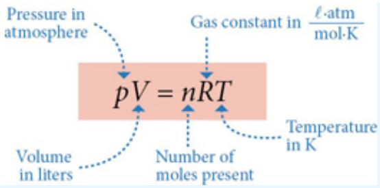</td><td>We can express this interconversion between  $K_c$  and  $K_p$  in a simple and more general form by considering our general expression for a chemical process in equilibrium $aA + bB \rightleftharpoons cC + dD$ wherein $K_{c} = \frac{[C]^{c}[D]^{d}}{[A]^{a}[B]^{b}} = \frac{(P_{C}/RT)^{c}(P_{D}/RT)^{d}}{(P_{A}/RT)^{a}(P_{B}/RT)^{b}}$  $= \frac{P_{C}^{c} P_{D}^{d}}{P_{A}^{a} P_{B}^{b}} \left( \frac{1}{RT} \right)^{c+d-(a+b)}$  $= K_{p} \left( \frac{1}{RT} \right)^{c+d-(a+b)}$  $= K_{p} \left( \frac{1}{RT} \right)^{\Delta n}$ Alternatively, we can, of course, write  $K_{p} = K_{c}(RT)^{\Delta n}$ where  $\Delta n = \text{change in the number of moles}$ = (number of moles of product) - (number of moles of reactants)</td></tr><tr><td>6. Stressed Equilibria and the Principle of Le ChatelierThis principle was first articulated by the French chemist Henry Le Chatelier (1850-1936) in 1888. The Le Chatelier Principle may be stated in a number of alternative forms:When a dynamic equilibrium in a system is upset by a disturbance, the system responds in a direction that tends to counteract that disturbance and, if possible, restore equilibrium.When an equilibrium system is subjected to a change in temperature, pressure, or concentration of a reacting species, the system responds by attaining a new equilibrium that partially offsets the impact of the change.The power of Le Chatelier's Principle is that it provides a means for determining the qualitative response, the direction of response, of equilibrium systems to an external stress. Le Chatelier also links into the relationship between the reaction quotient, Q, and the movement of an equilibrium system back toward equilibrium.</td><td>If we write our expression for the reaction quotient,  $Q_{c}$ , in terms of the concentrations immediately following the applied stress as $Q_{c} = \frac{[C]^{c}_{stress} [D]^{d}_{stress}}{[A]^{a}_{stress} [B]^{b}_{stress}}$ and we note that  $Q_{c}$  can assume values from zero to  $\infty$  for our reaction aA + bB  $\rightleftharpoons$  cC + dD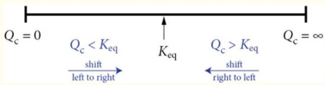We note that, because  $K_{eq}$  lies between the extremes of o and  $\infty$ , if  $Q_{c} < K_{eq}$ ,  $Q_{c}$  will seek to increase until it satisfies the condition  $Q_{c} = K_{eq}$  and it will do soby virtue of the fact that the reaction shifts, along with  $Q_c$ , from left to right on the diagram above. On the other hand, if  $Q_c > K_{eq}$  as a result of the applied stress, then Q must decrease to re-achieve equilibrium and both Q and the reaction must shift from right to left in the diagram above.</td></tr><tr><td>7. Equilibrium Constraints, Spontaneous Processes, and Gibbs Free EnergyWe recognized from the Second Law of Thermodynamics that the Gibbs free energy $\Delta G = \Delta H - T\Delta S$ determines whether a process is spontaneous; thus, how are  $\Delta G$  and  $K_{eq}$  related? $\Delta G < 0$  Spontaneous $\Delta G > 0$  Nonspontaneous $\Delta G = 0$  No Motive for ChangeTo establish the relationship between Gibbs free energy and the equilibrium constant, let's return to the dimerization reaction $N_2O_4(g) \rightleftharpoons 2NO_2(g)$  $\Delta G_R^\circ = \left( \Delta G_f^\circ \right)_{2NO_2} - \left( \Delta G_f^\circ \right)_{N_2O_4} = (2)(51.8) - 98.3$  $= +5.3 \text{ kJ}$ So for the equilibrium reaction $N_2O_4 \rightleftharpoons 2NO_2 \quad \Delta G_R^\circ = +5.3 \text{ kJ}$ </td><td>But now we are in a position to link our equilibrium reaction to the diagram relating the reaction quotient, Q, to the equilibrium constant,  $K_{eq}(T)$ , and finally to the Gibbs free energy diagram, as shown in Figure 5.16.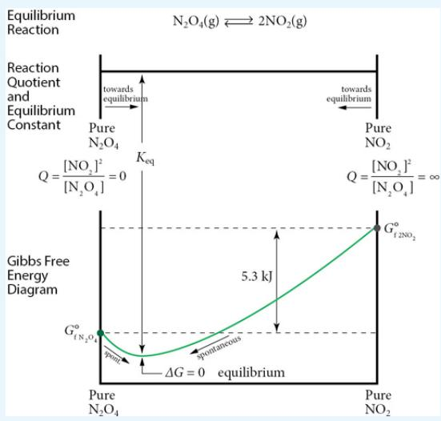</td></tr><tr><td>8. Gibbs Free Energy Under Nonstandard ConditionsThe equation linking  $\Delta G$ ,  $\Delta G^\circ$ , and the reaction quotient Q:  $\Delta G = \Delta G^\circ + RT \ln Q$ is one of the most useful and versatile equations in chemical thermodynamics because it can be applied across a vast range of concentrations that determine ΔG.</td><td>We can use this equation to determine the spontaneous (or nonspontaneous) nature of a reaction under any conditions of composition, if thetemperature and pressure conditions are constant. Moreover, we are now in a position to quantitatively link the equilibrium  $K_{\text{eq}}(T) = \frac{[C]^c [D]^d}{[A]^a [B]^b}$ , to ΔG°. We know that ΔG = 0 at equilibrium and we know that Q =  $K_{\text{eq}}(T)$  at equilibrium, so therefore at equilibrium ΔG = ΔG° + RT ln Q becomes o = ΔG° + RT ln  $K_{\text{eq}}(T)$  or ΔG° = -RT ln  $K_{\text{eq}}$  or  $K_{\text{eq}} = \exp(-\Delta G^\circ/RT)$ </td></tr><tr><td>9. ΔG° at Temperatures Other than 298 KIt is very important to calculate ΔG at temperatures other than 298 K because most reactions occur at temperatures other than 298 K and both ΔG and  $K_{\text{eq}}$  are sensitive to temperature.At temperatures other than 298 K, we write ΔGT to indicate that we are calculating and using ΔG at non-standard conditions. ThusΔGT = ΔHT - TΔSTΔH does not, to a rather high degree of accuracy, depend on T! This is a very important result. It means that we can use our tabulated values for ΔH° at standard conditions for ΔHT° at any temperature!As we can see from Chapter 2, ΔS° does not change very much as a function of temperature. The conclusion is important and very useful: We can calculate the change in Gibbs free energy at any temperature:ΔGT° = ΔH°298 - TΔS°298using the listed values for ΔH° and ΔS° from our standard tables at 298 K! We need only insert the correct temperature. To demonstrate, we return to our equilibrium reaction.</td><td></td></tr><tr><td>10. Activities: The True Thermodynamic Equilibrium Constant</td><td></td></tr></table>

:::{figure} ../images/fig-p1-ch05-61.jpg
:name: fig-p1-ch05-61
:alt: Figure from the University Chemistry source textbook
:::

:::{figure} ../images/fig-p1-ch05-62.jpg
:name: fig-p1-ch05-62
:alt: Figure from the University Chemistry source textbook
:::

<div class="mineru-algorithm" style="white-space: pre-wrap; font-family:monospace;">
When we derived the equation
$\Delta G = \Delta G^{\circ} + RT \ln Q$,
we used the relationship

$S = S^{\circ} - R \ln \frac{P}{P^{\circ}} = S^{\circ} - R \ln \frac{P}{1} = S^{\circ} - R \ln P$

That is, we defined a standard state of 1 bar, the reference (pressure) for values of entropy. That means $P/P^{\circ}$ is dimensionless, as must be the case for any term appearing in a logarithm. We need to use these equations in reference to solutions, solids, etc. This introduces the concept (and the utility) of “activities.”

activity ≡ $a = \frac{\text{the effective concentration of a substance}}{\text{the effective concentration of that substance}}$ in a standard reference state

Gas phase: $P^{\circ} = 1$ bar:
$S = S^{\circ} - R \ln(P/P^{\circ}) = S^{\circ} - R \ln P$, with pressure in bars
Solutions: 0.1 molar solution:
$S = S^{\circ} - R \ln a = S^{\circ} - R \ln (0.1 \text{ M/1 M}) = S^{\circ} - R \ln 0.1$
Heterogeneous:
Pure liquids and solids: $a = 1$
For gases, $a = \text{gas pressure in bars}$
For solutes in aqueous solution: $a = (\text{molar concentration/1 M})$

11. $\Delta G^{\circ}$ and $K_{eq}$ as Functions of Temperature
Le Chatelier provided the means for qualitative appraisal of equilibria shifts for changes in temperature. We can now execute this prediction quantitatively:
1. We know that $\Delta H^{\circ}$ is (virtually) independent of temperature.
2. We know that $\Delta S^{\circ}$ is weakly temperature dependent and we approximate it as temperature independent.
3. But $T\Delta S^{\circ}$ is strongly temperature dependent.
The key equation is
$\Delta G^{\circ} = \Delta H^{\circ} - T\Delta S^{\circ} = -RT \ln K_{eq}$

Key Point: When an equilibrium expression is written in terms of activities, $K_{eq}$ is the Thermodynamic Equilibrium Constant.

This is a very important point! In fact, because activities must be used whenever $K_{eq}$ is calculated for use in the expression $\Delta G^{\circ} = -RT \ln K_{eq}$, it is important to practice using the rules given above for the calculation of activities.

Overview of Manipulations of the Gibbs Free Energy Equation
As shown in Figure 5.20, we can display the graphical relationship of $K_{eq}$ and temperature from the equation
$\Delta G^{\circ} = \Delta H^{\circ} - T\Delta S^{\circ} = -RT \ln K_{eq}$ $K_{eq} = \exp(-\Delta G^{\circ}/RT)$ at standard conditions.
$K_{eq} = \exp(-\Delta G_T/RT)$ at any temperature,
but be sure to recalculate $\Delta G_T = \Delta H^{\circ} - T\Delta S^{\circ}$.
Calculate $K_{eq}$ at two different
</div>

<table><tr><td rowspan="4">Using ΔG° = -RT ln Keq and exponentiatingKeq = exp(-ΔG°/RT)</td><td>temperatures:Divide original equation by -RT.ΔH° - TΔS° = -RT ln Keqln Keq = (-ΔH°/RT) + (ΔS°/R)ln K1 = (-ΔH°/RT1) + (ΔS°/R)ln K2 = (-ΔH°/RT2) + (ΔS°/R)</td></tr><tr><td>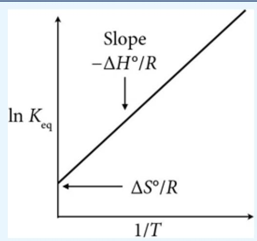</td></tr><tr><td>FIGURE 5.20 A plot of the expression ln Keq = -ΔH°/RT + ΔS°/R where the vertical axis (ordinate) is ln K and the horizontal axis (abscissa) is 1/T. This graph then has an intercept of ΔS°/R and a slope of -ΔH°/R.</td></tr><tr><td>Subtract:ln(K1 / K2) = (-ΔH°/R)(1/T1 - 1/T2)</td></tr></table>

## BUILDING A TECHNOLOGY BACKBONE

## CASE STUDY 5.1 The Technology and the Future of Biofuels

## Introduction

The role of biofuels in the current and future mix of primary energy sources has had a tortured excursion from center stage to marginalized and demonized back to the role of a major contributor to future forecasts of the mix of primary energy sources in the US. The cause of those swings of fortune involves both a technological progression and advances in the understanding of sources for biofuel feed stocks, as well as a growing sophistication in judging the end-to-end impact of various primary energy options.

Before addressing the technology that underpins projected growth of biofuels over the next two decades, we briefly summarize (1) the role of biofuels in the current energy mix of the United States and (2) some basic concepts and definitions that constitute the language (old and new) of the biofuel field.

## I Background to Biomass Fuels

## 1.1 Current Consumption of Biomass Resources

A biofuel is characterized as a fuel whose chemical energy is derived from biological carbon fixation via photosynthesis as depicted graphically in Figure CS5.1a. Biofuels are distinct from fossil fuels in that fossil fuels contain carbon that has been isolated from the active carbon cycle for millennia. Biofuels thus constitute an active partner in the carbon-oxygen cycles of the terrestrial and oceanic biosphere.

:::{figure} ../images/fig-p1-ch05-64.jpg
:name: fig-p1-ch05-64
:alt: FIGURE CS5.1A Modern biofuel production represents a cycle linking the input of solar energy to the production of biomass that is then harvested and converted to liquid fuels primarily by microbial action. Historically, biofuels here provid
FIGURE CS5.1A Modern biofuel production represents a cycle linking the input of solar energy to the production of biomass that is then harvested and converted to liquid fuels primarily by microbial action. Historically, biofuels here provided heat by the direct combustion of wood or other bioproducts.
:::


A wide range of biomass feed stocks (inputs) are currently employed to generate electricity, to produce transportation (liquid) fuels, and to produce heat by direct combustion. Broadly speaking, there are two categories of biofuels: “first generation” biofuels and “second generation” biofuels.

First generation biofuels, a.k.a. conventional biofuels, are biofuels made from sugar, starch, or vegetable oil. For example biologically produced alcohols such as ethanol are produced by the bacterially mediated fermentation of sugars or starches. Categories of first generation biofuels include, in addition to ethanol, biodiesel, vegetable oil, biogas, or biomethane, syngas, which is a blend of carbon monoxide and hydrogen and other hydrocarbons, and solid biofuels such as wood, sawdust, agricultural waste, grass trimmings, domestic refuse, etc. If this form of biomass is in a suitable form to convert to an alcohol by direct fermentation, to burn directly such as firewood or to be directly extracted (such as vegetable oil by compressional extraction), it is used directly. If the biomass is not in convenient form, it is first “densified” by grinding and compression into pellet size for either direct combustion or chemical transformation.

A key characteristic of first generation biofuels, particularly the use of corn for ethanol production, is that many—though not all—compete with important lines of food production.

Second generation biofuels, such as cellulosic ethanol, algae fuel, biohydrogen, and biomethanol, are produced from cellulosic feedstocks that cannot be used for food because humans cannot digest the cellulosic structure. While the molecular structure of starch and cellulose appear to be virtually identical, the subtle difference is of critical biological importance.

Starch and cellulose differ in the geometry or spatial orientation of the linkage between glucose units that comprise the chain or polymer structure of starch and cellulose. Figure CS5.1b displays the molecular structure of glucose in an aqueous solution. That figure presents both the molecular diagram and the three-dimensional stick model of the glucose structure.

:::{figure} ../images/fig-p1-ch05-65.jpg
:name: fig-p1-ch05-65
:alt: Figure from the University Chemistry source textbook
:::

β-D-Glucose

FIGURE CS5.1B Glucose is a ring hydrocarbon that occurs either as β-glucose shown here with the OH groups in a trans configuration or α-glucose with the OH groups in a cis configuration.

There are two forms of glucose: α-glucose has the OH group diagonally across the ring of the molecule from the $_ \mathrm { H O - C H _ { 2 } - g r o u p }$ located on carbon 5, and β-glucose (shown in Figure CS5.1b) that has the hydroxyl groups on the same side of the molecular axis as the $_ \mathrm { H O - C H _ { 2 } - g r o u p }$ located on carbon 5.

Starch is formed from a chain of α-glucose molecules that react as shown in Figure CS5.1c, eliminating water and creating a polymer with the bridging oxygen below the plane of the glucose ring.

:::{figure} ../images/fig-p1-ch05-66.jpg
:name: fig-p1-ch05-66
:alt: FIGURE CS5.1C Starch is distinguished by the fact that the bridging oxygen lies below the plane of the hydrocarbon ring while the hydrogens at the binding site lie above the molecular plane.
FIGURE CS5.1C Starch is distinguished by the fact that the bridging oxygen lies below the plane of the hydrocarbon ring while the hydrogens at the binding site lie above the molecular plane.
:::


The same reaction involving β-glucose results in the formation of cellulose, where cellulose is characterized by the bridging oxygen alternating above and below the plane of the glucose ring as shown in Figure CS5.1d.

:::{figure} ../images/fig-p1-ch05-67.jpg
:name: fig-p1-ch05-67
:alt: FIGURE CS5.1D Starch, formed from α-glucose, is distinct from cellulose that is formed from β- glucose resulting in a sequence of bridging oxygens alternating above and below the plane of the hydrocarbon ring for cellulose.
FIGURE CS5.1D Starch, formed from α-glucose, is distinct from cellulose that is formed from β- glucose resulting in a sequence of bridging oxygens alternating above and below the plane of the hydrocarbon ring for cellulose.
:::


Organisms break down the polymers by catalyzing the reverse reaction using enzymes. However, the catalysts that successfully break down starch have different placements of their catalytic groups at the active site than do catalysts that breakdown cellulose. The enzyme for breaking down starch is amylase; the enzyme for breaking down cellulose is cellulase. What is important and somewhat surprising is that while many organisms (including humans) have amylase, very few have cellulase.

Termites and ruminants (e.g., cows) can digest cellulosic structures only because they have digestive systems that harbor the appropriate bacteria.

When ethanol is produced from corn at industrial scale, the starch polymer is degraded to glucose with just amylase that is inexpensive and readily available. Then the glucose is fed to yeast that metabolizes and thereby oxidizes the glucose to ethanol—a.k.a. fermentation.

The breakdown of cellulose, on the other hand, involves two obstacles. The first is that cellulose in plants is protected by a sheath of hemicellulose that is a polymer of $\mathrm { C } _ { 5 }$ sugars and lignin (see Chapter 2). That sheath must first be breached—a process that requires submersion in dilute sulfuric acid at elevated temperatures and pressures. This acid treatment breaks down the hemicellulose polymer to its $\mathrm { C } _ { 5 }$ sugar monomers such as xylose shown in Figure CS5.1e.

:::{figure} ../images/fig-p1-ch05-68.jpg
:name: fig-p1-ch05-68
:alt: FIGURE CS5.1E Xylose is a mathematical notation sugar monomer that results from the acid breakdown of the hemi cellulose polymer in the sheath structure of cellulose plants.
FIGURE CS5.1E Xylose is a ${ \mathsf C } _ { 5 }$ sugar monomer that results from the acid breakdown of the hemi cellulose polymer in the sheath structure of cellulose plants.
:::


We can graphically trace the sequence of processes for the biocatalysis of starch on the one hand and cellulosic material on the other in the formation of ethanol. That is displayed in Figure CS5.1f.

:::{figure} ../images/fig-p1-ch05-69.jpg
:name: fig-p1-ch05-69
:alt: FIGURE CS5.1F As a result of the difference in bonding structure of starch and cellulose, bonding structure of starch and cellulose, a different enzyme is required to convert these molecules to ethanol. In the case of starch, amylase is the
FIGURE CS5.1F As a result of the difference in bonding structure of starch and cellulose, bonding structure of starch and cellulose, a different enzyme is required to convert these molecules to ethanol. In the case of starch, amylase is the enzyme that converts starch to glucose; cellulase converts cellulose to sugars.
:::


Interestingly, as the mixture of glucose and xylose is “fed” to the yeast that ferments (oxidizes) glucose, the xylose and other $\mathrm { C } _ { 5 }$ sugars cannot be fermented by common yeasts. Work is currently in progress developing strains of bacteria capable of executing the conversion of cellulosic biomass to ethanol in a single step. This would be an important development because 80% of all vegetation worldwide is cellulosic.

## II Biomass Categories for First Generation Biofuels

## 2.1 Forest-derived Resources

Biomass from forest sources comes primarily from two sources: (1) fuelwood used directly in the commercial and residential sectors and (2) residues resulting from the manufacture of wood products and from forest cleanup. In 2010 the residential, commercial, and electric power sectors combined used approximately 40 million dry tons with the residential sector using 28 million dry tons, the commercial sector using 7 million dry tons, and the electric power sector 5.5 million dry tons. Most fuelwood consumed is in the Northeast and North Central regions and to a lesser extent the Pacific Coast and Southeast.

## 2.2 Municipal Solid Waste

In the United States alone, 265 million tons of municipal solid waste (MSW) is generated each year. Of this total, approximately one-third is recovered by recycling and compost collection. With respect to renewable energy, about 15% is combusted to produce useable energy. The MSW derived from forest sources include discarded wood, yard trimmings, packaging, paper, and newsprint.

## 2.3 Agricultural Biomass

With the rapid development of the corn-based ethanol industry and the developing biodiesel industry using oilseed crops, a large fraction of cropland-derived biomass goes to those two sectors. Thus we briefly review those two biofuel production sectors.

## 2.3.1 Ethanol from Starch

While we will discuss ethanol from corn in more depth in Case Study 5.2, we note that historically United States agriculture has focused on corn production because corn has a high carbohydrate yield when compared with other staple crop categories. This underlies the broad use of corn for feed, ethanol, food, and any array of exports. The very large agricultural region of the Midwest makes this a huge business venture in the US. The highest volume of harvested corn occurred in 2009 and was 13.4 billion bushels. Of that total, about 35% was utilized for ethanol production.

Ethanol production in 2010 was 13.2 billion gallons produced from 4.7 billion bushels, which corresponds to approximately 110 million dry tons of corn. A bushel of corn weighs 56 lbs (25.5 kg) at 15% moisture. With current technology, a bushel of corn can produce 2.8 gallons of ethanol. After extraction of the ethanol from the starch in corn, the remaining fiber, protein, vegetable oil, and minerals are used in livestock feed.

A key driver for increasing demand for corn is the 2007 Energy Independence and Security Act that mandates up to 15 billion gallons of corn-based ethanol for the years 2015-2022. As a result of the increased awareness of the intrinsic drawbacks of corn-ethanol, while ethanol corn production increased sevenfold in the last decade (2010-2020) it is only expected to increase to just below 90 million dry tons. About 38% of corn grain produced in 2010 was used in ethanol production. DOE forecasts place ethanol-to-corn proportion to remain stable between 33% and 35% between 2010 and 2020.

The controversy over the adoption of corn based ethanol as a major component of the nation's biofuel supply results from the fact that the net consumption of petroleum based fuels for gasoline and diesel needed to plant, cultivate, and harvest corn and the consumption of natural gas and coal required to produce the fertilizer and supply the water for this crop virtually equals the net energy extracted from the ethanol produced in the process. The now widely accepted reality of this has lead to a major reconsideration of the wisdom of corn based ethanol in the US. This is compounded by the fact that corn-based ethanol competes directly with the demand for food, a significant fraction of which is corn-based in the US and globally.

It is becoming increasingly apparent that the demand placed on corn production by ethanol targets has a number of unintended market, health, and environmental consequences. The demand for corn to produce increasing amounts of ethanol increases the price of corn for the food sector. Corn is a major cereal grain and a primary feed for livestock supplying the meat industry. This has impact both nationally and internationally because the US exports corn.

## 2.3.2 Biodiesel

Biodiesel is distinct as a fuel from ethanol because of its molecular structure. Figure CS5.1g displays the familiar structure of ethanol in the left-hand panel and an average molecular structure for biodiesel is shown in the right-hand panel.

:::{figure} ../images/fig-p1-ch05-70.jpg
:name: fig-p1-ch05-70
:alt: FIGURE CS5.1G Comparison between ethanol shown in the left-hand panel and an average molecular structure for biodiesel shown in the right-hand panel.
FIGURE CS5.1G Comparison between ethanol shown in the left-hand panel and an average molecular structure for biodiesel shown in the right-hand panel.
:::


The sources of biodiesel include vegetable oils, soybeans, and waste fats. Production of biodiesel began in 2005 and increased rapidly through to 2008 as displayed in Figure CS5.1h. Soybean oil has been the primary feedstock for biodiesel, but annual fat and waste oils from restaurants and transportation are increasing in importance. Also displayed in Figure CS5.1h is the fact that the component of biodiesel extracted from soybeans has reached a plateau at approximately 400 million gallons each year—a sizable contribution.

:::{figure} ../images/fig-p1-ch05-71.jpg
:name: fig-p1-ch05-71
:alt: FIGURE CS5.1H Soybean production contributes significantly to biodiesel output in the US with biodiesel scheduled to rise to 1 billion gallons per year by 2018. Of this soybean production would account for 40% of the total.
FIGURE CS5.1H Soybean production contributes significantly to biodiesel output in the US with biodiesel scheduled to rise to 1 billion gallons per year by 2018. Of this soybean production would account for 40% of the total.
:::


With this increase in overall biodiesel production, the fractional contribution from vegetable oils that are not soybean based are projected to decrease because of the expense associated with their production.

Recycled waste fat and oils is expected to increase in relative importance for biodiesel production.

## III Summary of Categories of Second Generation Energy Crops

Beginning in the late 1970s, a number of perennial grass and woody crops were evaluated in landmark species trials on a wide range of soil types across the United States. A key finding of this research was the development of a manifold of new crop types and the specification of crop management prescriptions for classes of high-potential perennial grasses and specific wood/tree crops. In the past decade, the list of high potential energy crops has been refined and we look here at the options. These energy crops constitute the specific crops that will establish the future potential for biofuel production in the US.

Figure CS5.1i summarizes the important second generation biofuels. As the center panel in Figure CS5.1i shows, second generation biofuels may well become a very important category of primary energy generation in the US by 2030.

:::{figure} ../images/fig-p1-ch05-72.jpg
:name: fig-p1-ch05-72
:alt: Figure from the University Chemistry source textbook
:::

SUMMARY OF SECOND-GENERATION BIOFUELS LINKED TO HIGH-YIELD AND LOW-YIELD PRODUCTION FORECASTS
SWITCHGRASS is cellulosic in structure and has become a major player in second-gen biofuels.

:::{figure} ../images/fig-p1-ch05-73.jpg
:name: fig-p1-ch05-73
:alt: Figure from the University Chemistry source textbook
:::

:::{figure} ../images/fig-p1-ch05-74.jpg
:name: fig-p1-ch05-74
:alt: Figure from the University Chemistry source textbook
:::

POPLAR is a fast-growing tree that has a high yield per acre.
Production forecasts for the high yield costs through 2030 based on \$60/dry ton.

:::{figure} ../images/fig-p1-ch05-75.jpg
:name: fig-p1-ch05-75
:alt: Figure from the University Chemistry source textbook
:::

GIANT MISCANTHUS is a perennial cellulosic crop that is emerging as a major biofuel crop in the U.S.

:::{figure} ../images/fig-p1-ch05-76.jpg
:name: fig-p1-ch05-76
:alt: Figure from the University Chemistry source textbook
:::

Production forecasts for the baseline case through 2030.

:::{figure} ../images/fig-p1-ch05-77.jpg
:name: fig-p1-ch05-77
:alt: Figure from the University Chemistry source textbook
:::

SORGHUM is a crop that can be used as either a grain or an energy crop.

:::{figure} ../images/fig-p1-ch05-78.jpg
:name: fig-p1-ch05-78
:alt: Figure from the University Chemistry source textbook
:::

SUGARCANE is a large perennial grass with high energy content resulting from the storage of sucrose in the stem.

:::{figure} ../images/fig-p1-ch05-79.jpg
:name: fig-p1-ch05-79
:alt: Figure from the University Chemistry source textbook
:::

EUCALYPTUS is fast growing and high yield.

:::{figure} ../images/fig-p1-ch05-80.jpg
:name: fig-p1-ch05-80
:alt: Figure from the University Chemistry source textbook
:::

SHRUB WILLOW has become an important biofuel crop in Delaware, Indiana, Illinois, Maryland, Michigan, Minnesota, Missouri, New Jersey, New York, Pennsylvania, South Carolina, Virginia, Vermont, and Wisconsin.

This puts us in position to calculate the importance of biofuel production on both the imports of petroleum into the US for liquid fuels and on the overall spectrum of primary energy generation in the US. We begin with the impact of biofuels on the petroleum imports.

Petroleum imports into the US in 2014 were 9 million barrels a day. Each barrel of crude oil produces, on average, 20 gallons of gasoline. Thus the import of crude oil constitutes a source of 160 million gallons of gasoline each day. As we saw in section II, each dry ton of biomass yields approximately 85 gallons of biofuels. Thus 1 billion dry tons of biomass would yield 85 billion gallons of ethanol per year. With an energy content of 0.7 relative to gasoline, this corresponds to 60 billion gallons of gasoline equivalent liquid fuel, or $1 6 4$ million gallons per day.

This could potentially dramatically reduce imported petroleum.

Given that petroleum constitutes 38% of the primary energy generated per year in the US, biofuels would grow to constitute approximately 26% of the total primary energy generated each year in the US. Also of great importance is that biofuels constitute an excellent source of fuel for jet aircraft and can thus eliminate net carbon release from aircraft.

## Problem

Biofuels are distinct from fossil fuels because the carbon they contain is part of the active terrestrial carbon cycle. Ethanol fuel can be produced from the yeast fermentation of the starches and sugars found in biomass can be modeled by the following:

```{math}
:label: eq-p1-ch05-214
\mathrm{C} _ {6} \mathrm{H} _ {1 2} \mathrm{O} _ {6} (\mathrm{s}) \rightleftarrows 2 \mathrm{C} _ {2} \mathrm{H} _ {5} \mathrm{OH} (\mathrm{l}) + 2 \mathrm{CO} _ {2} (\mathrm{g})
```


<table><tr><td></td><td> $\Delta H^o_f (kJ/mol)$ </td><td> $S^o (J/mol K)$ </td></tr><tr><td> $C_6H_{12}O_6(s)$ </td><td>-1273.3</td><td>212.2</td></tr><tr><td> $C_2H_5OH(l)$ </td><td>-277.63</td><td>161</td></tr><tr><td> $CO_2(g)$ </td><td>-393.5</td><td>213.7</td></tr></table>

a. Determine the equilibrium constant $K _ { \mathrm { e q } }$ for the reaction at 298 K.

b. At equilibrium, will the reaction be mostly products or mostly reactants? Is it safe to assume that the reaction goes to completion?

c. One bushel contains 24.5 kg of corn. If 64.4% of this is fermentable starch (glucose), how many gallons of ethanol can you produce? (Density of ethanol: 0.789 g/mL)

## BUILDING A GLOBAL ENERGY PERSPECTIVE

## Case Study 5.2 Ethanol, Net Energy Production, and the Haber-Bosch Process

Alternative sources of liquid fuels for the transportation sector constitute a very important component in the national effort to transition from fossil-based fuels to a combination of biofuels and liquid fuels derived from natural gas $\mathrm { ( C H } _ { 4 } )$ This is particularly true when taken in combination with a new generation of carbon-fiber automobiles that are vastly lower in weight (yet equally safe) and are propelled by electric motors rather than internal engines.

A key example is the production of ethanol—a subject of immense importance to U.S. energy and economic policy. On the face of it, the production of ethanol as a substitute for gasoline appears to be a wise component of any new national energy policy. US citizens consume approximately 150 billion gallons of gasoline a year, which is approximately 500 gallons for each man, woman, and child in this country. If we were to replace gasoline with ethanol, we could potentially achieve multiple objectives: (1) reduce dependence on foreign oil, (2) stabilize (and lower) the cost of liquid fuels for transportation, (3) take advantage of the fact that $40 \%$ of the world's corn is grown in the US (and ethanol can be produced from corn), (4) reduce $\mathrm { C O } _ { 2 }$ emissions because the $\mathrm { C O } _ { 2 }$ released in ethanol combustion would be “carbon neutral” because that carbon would have been extracted from the atmosphere in the process of photosynthesis to produce the corn.

However, a number of factors, both subtle and not so subtle, conspire to make the ethanol-from-corn story more complicated than it appears on the face of it. We can summarize some of the fundamental issues surrounding ethanol from corn in the figure below.

A key aspect in the corn-ethanol analysis lies in two factors: (1) the energy content per gallon of ethanol is 67% that of gasoline per gallon, and (2) the fossil fuel required to provide the fertilizers, phosphates, transportation, etc., is very nearly equal in energy content to that of the ethanol produced. While the debate rages over whether ethanol represents a net gain over the fossil fuel required to produce it, a number of factors argue against corn-ethanol as a significant component in the liquid fuel mix for the US. Greenhouse gas emissions required in the production of ethanol from corn are virtually as large as if petroleum were burned directly because of the larger emission of more potent greenhouse gases such as nitrous oxide, which is a by-product of fertilizer production and application. In addition, the scale of land use in the US required for significant ethanol production is so large that it places ethanol-for-fuel in direct competition with corn-for-food in the global coupling of energy and food supply.

Rather than using corn as a feedstock for ethanol production, if cellulose based crops such as switchgrass in the US and/or sugar cane in Brazil were used, considerable advantage could be realized both in the net gain in energy per unit of fossil fuel consumed and in the reduction of greenhouse gas emissions. However it is turned, corn-based ethanol production will, in the long run, be a small component in the overall energy policy of the US.

A primary reason corn-based ethanol is limited in its potential is that it requires large amounts of fertilizer in the production of corn. An important component in the selection of optimal technology pathways involves the methods by which the crops used to produce biofuels are “fertilized” to maximize yields per acre of farmland. The dominant chemical compound used for crop fertilization is ammonia, $\mathrm { N H } _ { 3 } ,$ which supplies usable, or “fixed,” nitrogen for agricultural, biological, and manufacturing processes. Thus, the production of ethanol from feedstocks such as corn, sugar cane, or cellulosic switchgrass depends upon the production of ammonia, and the net amount of ammonia required (and the energy required to produce that ammonia) determines whether ethanol production makes economic and/or strategic sense. Thus, we explore in some detail the equilibria conditions that optimize $\mathrm { N H } _ { 3 }$ production.

## Ethanol Essentials

The energy content of 1 gallon of gasoline equals the energy content of 1.5 gallons of ethanol.

The production of ethanol from corn in the US in 2018 was 16 billion gallons.

The fraction of corn production used for the production of ethanol in the US was 40% in 2018.

Total gasoline consumption in the US in 2018 was $1 4 3$ billion gallons.

To produce 100 gallons of ethanol, one ton of corn kernels are required.

In most cases, it required a greater amount of fossil fuel energy to produce ethanol than is produced by ethanol.

Much of the fossil fuel energy expended to produce ethanol is derived from natural gas and coal.

With respect to the amount of $\mathrm { C O } _ { 2 }$ released to the atmosphere in the production of ethanol, more $\mathrm { C O } _ { 2 }$ is added than would be the case if gasoline were used instead of corn ethanol.

Significant advances in both reducing the energy required to produce ethanol and markedly reducing the $\mathrm { C O } _ { 2 }$ emitted to the atmosphere would result if cellulose were used rather than corn starch.

:::{figure} ../images/fig-p1-ch05-81.jpg
:name: fig-p1-ch05-81
:alt: Figure from the University Chemistry source textbook
:::

While nature “fixes” nitrogen—the process of breaking the N≡N triple bond to produce nitrogen in a form that is usable by plants—by either (1) the elegant enzymatic pathways made available by symbiosis of bacteria in combination with the root structure of certain plants, or (2) the primitive but effective dissociation of $\mathbf { N } _ { 2 }$ by lightning, humans achieve the objective using the equilibrium reaction

```{math}
:label: eq-p1-ch05-215
3 \mathrm{H} _ {2} + \mathrm{N} _ {2} \rightleftharpoons 2 \mathrm{NH} _ {3} (g) \Delta H _ {\mathrm{R}} = - 9 1. 8 \mathrm{kJ}
```


The process is simple—it was devised by Fritz Haber in 1913—and worldwide production of ammonia from this mechanism was some ${ \bf 1 . 4 \times }$ $\mathbf { 1 0 ^ { 1 1 } }$ kg in 2019. The Haber process stands as a prime example of the direct application of equilibria principles in pursuit of the highest possible yields. Inspection of the above equilibrium equation reveals three lines of attack:

1. Reduction in $\mathrm { [ N H _ { 3 } ] }$ that serves to shift the equilibrium to the right. This is accomplished by removing $\mathrm { N H } _ { 3 }$ from the reactive mixture as it is produced.

2. Increasing the pressure, which, as we will see, shifts equilibrium to the right because $4$ moles of reagent are converted to 2 moles of product.

3. Reduction in temperature, which, because the reaction is exothermic, also shifts equilibrium to the right.

In fact, we can, through knowledge of the temperature dependence of the equilibrium constant, generate a graphical representation of the $\mathrm { N H } _ { 3 }$ yield as a function of temperature—this is displayed in Figure CS5.2a.

:::{figure} ../images/fig-p1-ch05-82.jpg
:name: fig-p1-ch05-82
:alt: FIGURE CS5.2A Percent yield of ammonia versus temperature mathematical notation at five different operating pressures. At very high pressure and low temperature (top left), the yield is high, but the rate of formation is low. Industrial con
FIGURE CS5.2A Percent yield of ammonia versus temperature $( ^ { \circ } \mathsf { C } )$ at five different operating pressures. At very high pressure and low temperature (top left), the yield is high, but the rate of formation is low. Industrial conditions (circle) are between 200 and 300 atm at about $4 0 0 ^ { \circ } \mathsf { C }$
:::


While this graph strongly suggests an operating regime for the optimization of $\mathrm { N H } _ { 3 }$ yield in the vicinity of 1000 atm pressure and a temperature of ${ \bf \varepsilon } ^ { 2 0 0 } \mathrm { C } ,$ it turns out that the forward reaction forming $\mathrm { N H } _ { 3 }$ is very slow at that temperature. The reason is that there is a barrier in the potential energy surface separating reactants from products—a subject we will treat in some detail in Chapter 12. Because this reaction forming $\mathrm { N H } _ { 3 }$ from $\mathbf { N } _ { 2 }$ and $\mathrm { H } _ { 2 }$ becomes more rapid with increasing temperature, the industrial operation of $\mathrm { N H } _ { 3 }$ production plants favors temperatures in the vicinity of $4 0 0 ^ { \circ } \mathrm { C } .$ The cost of plant construction, which increases with increasing operating pressure, is such that operating pressures are typically limited to \~200 atm.

The stages in the industrial production of ammonia are designed to comply with the principles of chemical equilibria and with the rates at which reactions take place—the study of chemical kinetics.

Figure CS5.2b captures the primary subsystems used for ammonia production. The first step involves the addition of $\mathrm { H } _ { 2 }$ and $\mathbf { N } _ { 2 }$ into a compressor that raises the pressure to 200 atm and the mixture is heated to $4 0 0 ^ { \circ } \mathrm { C } .$ Then the mixture is passed over a bed of iron embedded in a fused mixture of MgO, $\mathrm { { A l } } _ { 2 } \mathrm { { O } } _ { 3 } ,$ and $\mathrm { S i O } _ { 2 } .$ The emergent equilibrium mixture, which contains approximately 35% $\mathrm { N H } _ { 3 }$ by volume, is then extracted and cooled by refrigeration coils until the $\mathrm { N H } _ { 3 }$ condenses and is removed. The unreacted $\mathrm { H } _ { 2 }$ and $\mathbf { N } _ { 2 }$ are then fed back into the compressor.

:::{figure} ../images/fig-p1-ch05-83.jpg
:name: fig-p1-ch05-83
:alt: FIGURE CS5.2B Key stages in the Haber process for synthesizing ammonia.
FIGURE CS5.2B Key stages in the Haber process for synthesizing ammonia.
:::


Remarkably, with the immense global production of ammonia reaching $\mathbf { 1 . 4 \times 1 0 ^ { 1 1 } }$ kg in 2019, and with an amount of energy required to produce ammonia of $5 . 9 ~ \times ~ 1 0 ^ { 7 }$ joules/kg, the amount of energy required to produce ammonia each year is $( \bf { 1 . 4 \times 1 0 ^ { 1 1 } k g / y r } ) ( \bf { 5 . 9 \times 1 0 ^ { 7 } j o u l e s / k g } ) = \bf { 7 . 3 }$ $\bf { \times 1 0 ^ { 1 8 } j o u l e s / y r }$ . That is almost 2% of the total global energy demand!

This brings us back to the question of calculating the net amount of energy produced in the generation of ethanol from corn—given that corn requires significant application of ammonia to reach current production levels. So the calculation of energy required to produce a gallon of ethanol from corn is as follows. We must account for the energy invested in the production of corn, the transport of corn, and the production of ethanol, which involves fertilizers, irrigation, farm machinery, etc. This amounts to $8 . 8 \times 1 0 ^ { 7 }$ joules/gallon ethanol. However, the energy content of a gallon of ethanol is $8 . 4 \times 1 0 ^ { 7 }$ joules/gallon so that the net energy value (NEV) of ethanol, which is the net energy contained in the final ethanol product minus the energy consumed in its production, is

```{math}
:label: eq-p1-ch05-216
\mathrm{NEV} = 8. 4 \times 1 0 ^ {7} - 8. 8 \times 1 0 ^ {7} = - 4 \times 1 0 ^ {6} \mathrm{J/gallon}
```


The minus sign results because it requires more energy (natural gas and oil) to produce ethanol from corn then is contained in the product, and therefore serious doubt has been cast on the wisdom of producing large amounts of ethanol from corn in the U.S. There are many considerations involved in ethanol production from corn including how the products rejected from the ethanol production itself, termed energy “coproducts,” are used (animal feed stocks, burnable organic material, etc.); however it remains a fact that ethanol production from corn provides marginal yields with respect to the fossil fuel energy used to produce it. If, on the other hand, ethanol is produced in the U.S. using cellulosic biomass, the figures are quite different. As we noted in the opening of Chapter 2, cellulose is composed of long chains of sugars, and together with lignin, it is responsible for the physical structure of trees, plants, and grass. The issue with cellulosic biomass is the fermentation method used to make ethanol—a process that typically uses either acid decomposition or specifically designed enzymes. A leading candidate for ethanol production is switchgrass, which is a perennial grass native to the Midwest that does not need to be replanted, is pest resistant, has much lower fertilizer demands than corn, and requires only limited irrigation. These factors conspire to significantly reduce the energy invested in raising switchgrass for ethanol production.

## Problem

A major contribution to the global increase in population was the use of agricultural fertilizers to increase crop yields globally. The principal source of crop fertilizer is the production of ammonia, $\mathrm { N H } _ { 3 } ,$ in the famous Haber-Bosch process.

```{math}
:label: eq-p1-ch05-217
\mathrm {3H_ {2} (g)+ N_ {2} (g)\rightleftharpoons 2NH_ {3} (g)}
```


What the Haber-Bosch process brought to the increased production of $\mathrm { N H _ { 3 } ( g ) }$ was the ingenious use of metal-catalyzed (iron, $\mathrm { S i O } _ { 2 } , \mathrm { A l } _ { 2 } \mathrm { O } _ { 3 } )$ surfaces at elevated temperature that greatly increased both the yield and the production rate of $\mathrm { N H } _ { 3 } ( \mathbf { s } )$ . The enthalpy for the reaction is

```{math}
:label: eq-p1-ch05-218
\left(\Delta \mathrm{H} _ {\mathrm{f}} ^ {\circ}\right) _ {\mathrm{NH} _ {3} (\mathrm{g})} = \Delta \mathrm{H} _ {\mathrm{RXN}} = - 4 6. 2 \mathrm{kJ/molNH} _ {3}.
```


a) At ${ 2 5 ^ { \circ } } \mathrm { C } ,$ is this reaction endothermic or exothermic? How does $\mathrm { K _ { p } }$ change with temperature?

b) $\mathrm { K _ { c } }$ of the Haber-Bosch process is 0.159 at $4 5 0 ^ { \circ } \mathrm { C }$ . Calculate $\mathrm { K _ { p } }$ for this reaction at this temperature.

c) For each of the mixtures listed below, indicate whether the mixture is at equilibrium at $4 5 0 ^ { \circ } \mathrm { C }$ . If it is not at equilibrium, indicate the direction in which the mixture must shift to achieve equilibrium.

i. 105 atm $\mathrm { N H } _ { 3 } ,$ 495 atm $\mathrm { H } _ { 2 } ,$ 35 atm $\mathbf { N } _ { 2 }$

ii. 35 atm $\mathrm { N H } _ { 3 } ,$ 595 atm $\mathrm { H } _ { 2 } ,$ no $\mathbf { N } _ { 2 }$

d) To produce the maximum amount of $\mathrm { N H _ { 3 } }$ at $4 5 0 ^ { \circ } \mathrm { C }$ (you do not need to answer this question in your homework, but think about why we want to increase temperature from $2 5 ^ { \circ } \mathrm { C }$ to $4 5 0 ^ { \circ } \mathrm { C } )$ according to Le Chatelier's principle, should the pressure of the system be increased or decreased?

e) At $4 5 0 ^ { \circ } \mathrm { C } ,$ , if the reaction starts with a mixture of 100 atm $\mathbf { N } _ { 2 }$ and 300 atm $\mathrm { H } _ { 2 }$ in the reaction chamber in a factory, what percentage of the $\mathbf { N } _ { 2 }$ gets converted to the product at equilibrium? (Hint: the equation could be simplified to a quadratic equation by finding a common factor in some terms.)

f) At $4 5 0 ^ { \circ } \mathrm { C } ,$ , if the reaction starts with a mixture of 200 atm $\mathbf { N } _ { 2 }$ and 600 atm $\mathrm { H } _ { 2 }$ in the reaction chamber in a factory, what percentage of the $\mathbf { N } _ { 2 }$ gets converted to the product at equilibrium?

g) Comparing the numbers you get from e) and f), are your calculations consistent with your prediction in d)?

h) At $4 5 0 ^ { \circ } \mathrm { C } ,$ the reaction starts with a mixture of $\mathbf { N } _ { 2 }$ and $\mathrm { H } _ { 2 }$ with unknown pressures in the reaction chamber in a factory, and a test of the gas mixture at a time point before the reaction reaches equilibrium finds 120 atm $\mathbf { N } _ { 2 } ,$ 360 atm $\mathrm { H } _ { 2 } ,$ and 160 atm $\mathrm { N H _ { 3 } }$ in the chamber. What percentage of the initial $\mathbf { N } _ { 2 }$ gets converted to the product at equilibrium? (Hint: you have already solved this question if you have finished $\mathrm { a - g . } )$

i) At $4 5 0 ^ { \circ } \mathrm { C } ,$ , besides changing the pressure of the system, propose another way to increase the yield of $\mathrm { N H } _ { 3 } .$