# 6 Equilibria in Solution


## Acid-Base Control for Life Systems

“Humanity stands … before a great problem of finding new raw materials and new sources of energy that shall never become exhausted. In the meantime we must not waste what we have, but must leave as much as possible for coming generations.”

—Svante Arrhenius

:::{figure} ../images/fig-p1-ch06-1.jpg
:name: fig-p1-ch06-1
:alt: Figure from the University Chemistry source textbook
:::

## Framework

The chemistry of carbon dioxide and water constitutes one of the most important applications of acid-base chemistry in both the physical sciences and the life sciences. Indeed, both the evolution of life processes on Earth and the future of life on the planet as we know it are closely coupled to carbon chemistry in the oceans.

The development of the chemical reactions that couple $\mathrm { C O } _ { 2 } ( \mathrm { g } )$ in the atmosphere with a series of chemical reactions involving the acidic properties of both fresh water and the carbon chemistry of the oceans begins with the dissolution of atmospheric carbon dioxide in water:

```{math}
:label: eq-p1-ch06-1
\mathrm{CO} _ {2} (\mathrm{g}) \rightleftarrows \mathrm{CO} _ {2} (\mathrm{aq})
```


This physical dissolution is followed by the chemical reaction forming carbonic acid from $\mathrm { C O } _ { 2 } ( \mathrm { a q } )$

```{math}
:label: eq-p1-ch06-2
\mathrm{CO} _ {2} (\mathrm{aq}) + \mathrm{H} _ {2} \mathrm{O} (\mathrm{l}) \rightleftharpoons \mathrm{H} _ {2} \mathrm{CO} _ {3} (\mathrm{aq})
```


The net overall reaction is therefore:

```{math}
:label: eq-p1-ch06-3
\mathrm{CO} _ {2} (\mathrm{g}) + \mathrm{H} _ {2} \mathrm{O} (\mathrm{l}) \rightleftharpoons \mathrm{H} _ {2} \mathrm{CO} _ {3} (\mathrm{aq})
```


The Gibbs free energy diagram for the overall reaction is displayed in Figure 6.2. As Figure 6.2 displays, the change in Gibbs free energy for the overall reaction is $\Delta G _ { _ { \mathrm { R } } } ^ { \circ } ~ { = } ~  { - } 8 . 2 ~  { ~ \mathrm { k J / m o l } }$ . Because $\Delta G _ { \mathrm { _ R } } ^ { \circ }$ is positive, the equilibrium favors the reactants and only a small fraction of the $\mathrm { C O } _ { 2 } ( \mathrm { g } )$ is converted to $\mathrm { H _ { 2 } C O _ { 3 } ( a q ) }$ . A small but very important fraction as we will see in this chapter.

:::{figure} ../images/fig-p1-ch06-2.jpg
:name: fig-p1-ch06-2
:alt: FIGURE 6.1 Carbon dioxide exerts strong control over the acid-base balance of the oceans because water reacts with mathematical notation to form carbonic acid, mathematical notation . In addition, living organisms use the carbonate ion math
FIGURE 6.1 Carbon dioxide exerts strong control over the acid-base balance of the oceans because water reacts with ${ \mathsf { C O } } _ { 2 }$ to form carbonic acid, ${ \sf H } _ { 2 } { \sf C O } _ { 3 }$ . In addition, living organisms use the carbonate ion $\mathsf { C O } _ { 3 } ^ { 2 - }$ in the formation of $\mathsf { C a C O } _ { 3 }$ that constitutes the skeletal structure of most organisms in the food chain. Thus the acid-base balance in the oceans is important to both the inorganic and organic chemistry of the oceans.
:::


:::{figure} ../images/fig-p1-ch06-3.jpg
:name: fig-p1-ch06-3
:alt: FIGURE 6.2 The Gibbs free energy diagram for the equilibrium between mathematical notation on the left and mathematical notation on the right. The equilibrium point corresponds to the mathematical notation point on the horizontal axis.
FIGURE 6.2 The Gibbs free energy diagram for the equilibrium between $\mathsf { C O } _ { 2 } ( \mathsf { g } )$ on the left and $\mathsf { H } _ { 2 } \mathsf { C O } _ { 3 } ( \mathsf { a q } )$ on the right. The equilibrium point corresponds to the $\Delta G = 0$ point on the horizontal axis.
:::


Approximately half the $\mathrm { C O } _ { 2 }$ added to the atmosphere by the combustion of fossil fuels is taken up by the world's oceans; the control of atmospheric $\mathrm { C O } _ { 2 }$ (and thus of the escape of infrared radiation from the planet) over geologic time is tied closely to the carbonate chemistry of the ocean. Thus, we consider here the inorganic carbon chemistry linking the uptake and release of $\mathrm { C O } _ { 2 }$ through the ocean system. It is important to the understanding of future climate change and it is important for an understanding of the past 50 million years of Earth history.

Over geologic time, a remarkable set of reactions linking $\mathrm { C O } _ { 2 }$ in the atmosphere to the weathering of rocks at the surface have taken place, and this has had a powerful influence over our climate. During the Eocene, ${ \sim } 4 0$ million years ago, the world was a very different place. It was very warm, about 8-10 K warmer than today. It was very wet and the sea level was \~250 feet higher than today. Glacial systems were absent from both the northern and southern hemisphere. Fossil records demonstrate that animals and plants now found in the tropics and subtropics populated the edge of the Arctic Ocean, as shown in Figure

6.3. Hurricanes and other severe storms may well have been commonplace in the ocean basins in all seasons.
:::{figure} ../images/fig-p1-ch06-4.jpg
:name: fig-p1-ch06-4
:alt: FIGURE 6.3 An artist's depiction of the Arctic Coast during the Eocene epoch, about 40 million years ago.
FIGURE 6.3 An artist's depiction of the Arctic Coast during the Eocene epoch, about 40 million years ago.
:::


But the net reaction of carbonate-silicate weathering, treated in detail in Case Study 6.1, served to draw down the $\mathrm { C O } _ { 2 }$ concentration from approximately 1000 parts per million (ppm) during the late Eocene $( \sim 4 0$ million years ago) to approximately 200-250 ppm about 2.5 million years ago. This removal of $\mathrm { C O } _ { 2 }$ cooled the planet, leading to the series of glacial-interglacial cycles that has dominated the climate for approximately 2 million years. This sequence is shown in Figure $\underline { { 6 . 4 } } ,$ which tracks both the $\mathrm { C O } _ { 2 }$ concentration draw-down resulting from the carbonate-silicate weathering reaction and the decrease in global mean temperature that results.

:::{figure} ../images/fig-p1-ch06-5.jpg
:name: fig-p1-ch06-5
:alt: FIGURE 6.4 40 million years ago during the Eocene the global average temperature was 8-10 K warmer than today, the sea level was some 250 ft. higher than today and the mathematical notation concentration exceeded 1000 ppm. During the next 3
FIGURE 6.4 40 million years ago during the Eocene the global average temperature was 8-10 K warmer than today, the sea level was some 250 ft. higher than today and the ${ \mathsf { C O } } _ { 2 }$ concentration exceeded 1000 ppm. During the next 30 million years, the reaction between ${ \mathsf { C O } } _ { 2 }$ in the atmosphere and silicate rocks drew the $\mathsf { C O } _ { 2 }$ concentration down to about 200 ppm, cooling the planet.
:::


:::{figure} ../images/fig-p1-ch06-6.jpg
:name: fig-p1-ch06-6
:alt: Figure from the University Chemistry source textbook
:::

As $\mathrm { C O } _ { 2 }$ concentrations in the atmosphere dropped to \~200 ppm, the cycling of the climate between glacial and interglacial periods came under the control of Earth's orbital parameters—variations in the tilt of the Earth's rotation axis and variations in the ellipticity of the orbit around the sun.

On the face of it, what happened 40 million years ago may seem distant and removed from what will happen in the next decades. However, if we plot the sequence of events, not as function of time, but rather as a function of $\mathrm { C O } _ { 2 }$ concentration vs. temperature, we find, as displayed in Figure $6 . 5$ , that there are two “legs” that emerge. The first leg begins $4 0$ million years ago and progresses from the warm temperatures of the Eocene when the atmosphere contained \~1000 ppm of $\mathrm { C O } _ { 2 }$ to cooler temperatures as the reaction between carbon dioxide in the atmosphere and the silicate rocks at the surface drew $\mathrm { C O } _ { 2 }$ to lower and lower concentrations. This period of carbonate-silicate control continued until about $e { - 3 }$ million years ago when the $\mathrm { C O } _ { 2 }$ concentration reached about 200 ppm.

:::{figure} ../images/fig-p1-ch06-7.jpg
:name: fig-p1-ch06-7
:alt: FIGURE 6.5 If we schematically represent the relationship between mathematical notation mixing ratio and the difference in temperature between today and the temperature at various mathematical notation mixing ratios in the past, present, an
FIGURE 6.5 If we schematically represent the relationship between $\mathsf { C O } _ { 2 }$ mixing ratio and the difference in temperature between today and the temperature at various $\mathsf { C O } _ { 2 }$ mixing ratios in the past, present, and future, two “legs” to the plot emerge. Leg 1 from 40 million years ago to present, and leg 2 from present to the end of the century.
:::


At 200 ppm $\mathrm { C O } _ { 2 } ,$ the Earth's climate is controlled primarily by the details of the Earth's orbit because deglaciation, the melting of glacial systems that marks the end of ice ages, is controlled by the total amount of solar energy received by the northern hemisphere in the summer season, which in turn depends upon the tilt of the Earth's axis (obliquity) with respect to the orbital plane and the eccentricity of the orbit itself. This orbital control of climate is referred to as the “Milankovitch Cycle” after Milutin Milankovitch, a Serbian mathematician-engineer. As described in the sidebar, it is the relationship between obliquity and eccentricity of the Earth's orbit (at low $\mathrm { C O } _ { 2 }$ concentrations), which carries the Earth into and out of glacial periods; that is, between glacial and interglacial periods characterized by significant ice cover followed by conditions of retracted ice, respectfully. With the rapid build-up of $\mathrm { C O } _ { 2 }$ in the atmosphere following the beginning of the industrial revolution in 1750, the climate system is rapidly transitioning, under fossil-fuelcombustion control (the second leg in Figure 6.5), to the situation characterized by high $\mathrm { C O } _ { 2 }$ concentrations and significantly warmer temperatures. What is remarkable is that while it required tens of millions of years for the carbonate-silicate weathering reaction to draw the $\mathrm { C O } _ { 2 }$ concentration down from >1000 ppm to 200 ppm, within this century the $\mathrm { C O } _ { 2 }$ concentration will reach levels of between 700 and 800 ppm if the international community continues to employ fossil fuel combustion to satisfy its primary energy generation needs. When climate feedbacks are included that involve methane release from clathrates, the greenhouse gas concentrations in the Earth's atmosphere could, in this century, reach levels similar to those not seen for tens of millions of years.

What has been the cause of the consistent cycling between glacial periods, characterized by extensive ice coverage of northern hemisphere continental regions, and interglacial periods, characterized by the retraction of large continental glaciers to approximately their current position? The answer involves subtle but important changes in the way the Earth orbits the Sun; specifically changes that repeat in a predictable pattern over tens of thousands of years. In particular, long term variations in the northern hemisphere summer solar intensity and duration are thought to control the degree of glaciation. Three characteristics of the Earth's orbital parameters are involved:

1. The degree of ellipticity of the orbit, also referred to as eccentricity, which is measured by the ratio of the major axis to the minor axis as shown here:

:::{figure} ../images/fig-p1-ch06-8.jpg
:name: fig-p1-ch06-8
:alt: Figure from the University Chemistry source textbook
:::

The eccentricity of the Earth's orbit changes on time scales of 100,000 years.

2. The tilt of the Earth's axis of rotation with respect to the plane of the orbit around the Sun. This tilt angle, referred to as the obliquity, varies from a minimum of 22.5° to a maximum of $2 4 . 5 ^ { \circ } .$ The period of changes in obliquity is approximately 40,000 years and the current axis tilt is $2 3 . 5 ^ { \circ }$ . Of course, it is the tilt of the axis that causes the change of seasons as the Earth orbits the Sun.

3. Changes in the orientation of the Earth's axis of rotation with respect to the Earth's orbital plane. This is referred to as precession and it affects the apparent location of the North Star, which today is aligned with the Earth's axis of rotation. The period of precession is 26,000 years.

These three effects are displayed graphically in the figure below.

Key points to remember are that (1) continental, northern hemisphere glaciers are sensitive to the amount of sunlight integrated over the duration of the northern hemisphere summer, and (2) as carbon dioxide builds in the atmosphere, the effect of the orbital parameters on climate are suppressed and then virtually eliminated by the trapping of infrared radiation as the $\mathrm { C O } _ { 2 }$ concentration in the atmosphere increases to 350 ppm and above. Carbon dioxide levels now exceed 390 ppm.

:::{figure} ../images/fig-p1-ch06-9.jpg
:name: fig-p1-ch06-9
:alt: Figure from the University Chemistry source textbook
:::

Milankovitch cycles exert dominant control over whether the Earth is in a glacial or interglacial phase at $\mathrm { C O } _ { 2 }$ concentration below 300 ppm. However, amplification of the infrared trapping by increasing water vapor in the atmosphere in response to elevated levels of $\mathrm { C O } _ { 2 }$ and $\mathrm { C H } _ { 4 }$ exerts dominant control over Earth's climate at $\mathrm { C O } _ { 2 }$ concentration levels above \~350 ppm.

It is illustrative to plot the carbon dioxide, nitrous oxide, and methane concentration since the end of the last ice age (approximately 11,000 years ago) as displayed in Figure 6.6. Also shown in Figure 6.6 is the increase in radiative forcing—the increase in infrared trapping resulting from the increase in those greenhouse gas configurations—resulting from those same three molecules. Also of significant importance is the rate of change of that forcing resulting from the increase in $\mathrm { C O } _ { 2 } , \mathrm { N } _ { 2 } \mathrm { O } ;$ and $\mathrm { C H } _ { 4 }$ since the last ice age. This is displayed in the fourth panel of Figure 6.6.

:::{figure} ../images/fig-p1-ch06-10.jpg
:name: fig-p1-ch06-10
:alt: Figure from the University Chemistry source textbook
:::

:::{figure} ../images/fig-p1-ch06-11.jpg
:name: fig-p1-ch06-11
:alt: Figure from the University Chemistry source textbook
:::

:::{figure} ../images/fig-p1-ch06-12.jpg
:name: fig-p1-ch06-12
:alt: Figure from the University Chemistry source textbook
:::

:::{figure} ../images/fig-p1-ch06-13.jpg
:name: fig-p1-ch06-13
:alt: FIGURE 6.6 The tracking of mathematical notation and mathematical notation from the end of the ice age 20,000 years ago until the present. Associated with each of those infrared active gases in the atmosphere is the associated forcing of th
FIGURE 6.6 The tracking of $\mathsf { C O } _ { 2 } , \mathsf { N } _ { 2 } \mathsf { O } ,$ and $\mathsf { C H } _ { 4 }$ from the end of the ice age 20,000 years ago until the present. Associated with each of those infrared active gases in the atmosphere is the associated forcing of the climate resulting from the increased trapping of infrared radiation by each molecule. The panel in the lower right displays the rate of change of the forcing from those three gases since the last ice age.
:::


Within this context, we can replot the first panel in Figure 6.6 extending the graph to the end of the 21st century, as shown in Figure $6 . 7 .$ when the $\mathrm { C O } _ { 2 }$ concentrations in the atmosphere will nominally reach 600 ppm with a fossil fuel-based economy, perhaps reaching 800 ppm if there is either accelerated use of fossil fuels or release of methane from clathrates. That increase in forcing will carry the Earth back some 25 million years. Under those conditions (1) the ice structures in both the northern hemisphere (Arctic Ice Cap, Tibetan glacial system, Greenland, Alps, etc.) and the southern hemisphere (Antarctic, Andes, etc.) are unsustainable and (2) the current climate state defined by the dynamical structure of the atmosphere and oceans would, with reasonable probability, be fundamentally altered. This altered climate state would be more closely matched to the Eocene of $4 0$ million years ago than to today's climate structure. To review, the climate of the Eocene was characterized by the absence of ice in either hemisphere, sea level 250 feet above present, far warmer and more acidic oceans, and a small temperature difference between the equator and the poles. It is becoming increasingly clear that, in order to return to a stable climate state, we must develop methods to extract currently existing $\mathrm { C O } _ { 2 }$ from the atmosphere. Case Study 6.2 details one approach.

:::{figure} ../images/fig-p1-ch06-14.jpg
:name: fig-p1-ch06-14
:alt: FIGURE 6.7 A plot of carbon dioxide mixing ratio in ppm since the last ice age with the projected mathematical notation mixing ratio extended to the end of the century. Also included is the radiative forcing of the climate resulting from th
FIGURE 6.7 A plot of carbon dioxide mixing ratio in ppm since the last ice age with the projected ${ \mathsf { C O } } _ { 2 }$ mixing ratio extended to the end of the century. Also included is the radiative forcing of the climate resulting from that increase in $\mathsf { C O } _ { 2 }$
:::


## Case Study 6.2 Direct Air Capture of Carbon Dioxide from the Atmosphere

:::{figure} ../images/fig-p1-ch06-15.jpg
:name: fig-p1-ch06-15
:alt: Figure from the University Chemistry source textbook
:::

However, it must also be recognized that, as we described in the Framework to Chapter 3, the methane and carbon dioxide sequestered in the clathrates and permafrost of the high latitude continental regions would, with high probability, be released as the melting of glacial and permafrost continued. This would, in turn, drive both the methane and carbon dioxide concentration to levels unprecedented for $4 0$ million years. It is a fundamental challenge for the physical sciences to decipher just how we would retrace our steps within the next decade or decades to the Eocene $4 0$ million years ago if the world's primary energy generation remains dependent on fossil fuel combustion.

This brings us back to the chemistry of $\mathrm { C O } _ { 2 }$ and water—specifically the fate of carbonic acid, $\mathrm { H _ { 2 } C O _ { 3 } ( a q ) }$ , and the acid-base chemistry that proves to be so critical to life systems past, present, and future. Figure $6 . 2$ displays the Gibbs free energy surface for the dissolution of atmospheric carbon dioxide in water. The dissolved $\mathrm { C O } _ { 2 }$ then reacts with water to form carbonic acid, $\mathrm { H } _ { 2 } \mathrm { C O } _ { 3 } ( \mathrm { a q } )$ . What happens next is the reaction between $\mathrm { H } _ { 2 } \mathrm { C O } _ { 3 } ( \mathrm { a q } )$ and water, forming the hydronium ion, $\mathrm { H } _ { 3 } \mathrm { O } ^ { + }$ , and the bicarbonate anion:

```{math}
:label: eq-p1-ch06-4
\mathrm{H} _ {2} \mathrm{CO} _ {3} (\mathrm{aq}) + \mathrm{H} _ {2} \mathrm{O} \rightleftharpoons \mathrm{H} _ {3} \mathrm{O} ^ {+} + \mathrm{HCO} _ {3} ^ {-}
```


This reaction, which is responsible for the acidic character of $\mathrm { { H _ { 2 } C O _ { 3 } } }$ by virtue of the formation of the hydronium ion, $\mathrm { H _ { 3 } O ^ { + } }$ , has a change in Gibbs free energy of $\Delta G _ { \mathrm { R } } = \Delta H _ { \mathrm { R } } - T \Delta S _ { \mathrm { R } } = 3 6 . 3$ kJ/mole at 298 K. The Gibbs free energy surface for this reaction is displayed in Figure 6.8.

:::{figure} ../images/fig-p1-ch06-16.jpg
:name: fig-p1-ch06-16
:alt: FIGURE 6.8 Gibbs free energy for the reaction of carbonic acid in water forming the hydronium ion, mathematical notation , and the bicarbonate anion, mathematical notation
FIGURE 6.8 Gibbs free energy for the reaction of carbonic acid in water forming the hydronium ion, ${ \sf H } _ { 3 } { \sf O } ^ { + }$ , and the bicarbonate anion, ${ \mathsf { H } } { \mathsf { C } } { \mathsf { O } } _ { 3 } { } ^ { - }$
:::


While it is common place to write this acid dissociation reaction in water, it is important to emphasize the unique role played by water in the extraction, the theft, of a hydrogen cation, $\mathrm { H ^ { + } }$ , from the structure of carbonic acid. In this regard (the ability to effectively extract $\mathrm { H ^ { + } }$ from otherwise stable molecular structures in solution), water stands alone from virtually all other solvents. Water is quantitatively different from all other liquids in that:

1. It is small and highly polar because of the large electronegativity difference between oxygen and hydrogen.

2. When interacting with a cation $( \mathrm { e . g . H ^ { + } }$ that is electron deficient), water has lone pair electrons to provide a ready concentration of exposed negative charge.

:::{figure} ../images/fig-p1-ch06-17.jpg
:name: fig-p1-ch06-17
:alt: Figure from the University Chemistry source textbook
:::

3. Residing at the apex of the V shaped molecular structure, defined by the small hydrogen atoms, is the electronegative center of the oxygen, which is extremely well positioned to closely approach the positive charge of the cation, $\mathrm { H ^ { + } }$

4. For an anion or other electron rich entity, water has the partially positive hydrogens isolated on the other side of the molecule that create protruding $\mathrm { H } ^ { \& + }$ “poles” that are very accessible to negative charge centers of other molecules and are predisposed to form noncovalent bonds—termed hydrogen bonds.

5. Because of the small size of $\mathrm { H } _ { 2 } \mathrm { O }$ and its effective charge separation, water delivers its charge with remarkable efficiency to either cations or anions.

Both because of these unique characteristics as a solvent and because of water's ubiquitous presence in nature, we classify everything else according to its relationship to $\mathrm { H } _ { 2 } \mathrm { O }$

We term those molecules that are drawn to the structure of water as “hydrophilic” (water loving); this includes ionic or polar molecules.

We term molecules that are not drawn to water as hydrophobic (water fearing); this includes most nonpolar molecules.

Because of this ability of water to first form carbonic acid in the reaction of $\mathrm { C O } _ { 2 }$ with $_ \mathrm { H _ { 2 } O }$ , and then to dissociate the $\mathrm { { H _ { 2 } C O _ { 3 } } }$ to form $\mathrm { H } _ { 3 } \mathrm { O } ^ { + }$ the world's oceans have the capacity to extract $\mathrm { C O } _ { 2 }$ from the atmosphere in such vast amounts that, were the oceans coupled effectively to the atmosphere, $\mathrm { C O } _ { 2 }$ deposition in the atmosphere from fossil fuel burning could not force changes in the climate through the trapping of infrared radiation, because the $\mathrm { C O } _ { 2 }$ concentration would not build up in the atmosphere. However, only a tiny fraction of the ocean is in effective contact with the atmosphere—just the upper few hundred meters. As a result, the oceans can only take up $\mathrm { C O } _ { 2 }$ in the quantities released globally by fossil fuel combustion with a time scale of thousands of years. As a result, approximately half the $\mathrm { C O } _ { 2 }$ released into the atmosphere as a result of fossil fuel combustion remains in the atmosphere for many centuries.

A key technology for shifting permanently from fossil fuel based primary energy generation to non-carbon-based renewable energy is the method of concentrated solar thermal technology. This approach is discussed in Case Study 6.3.

Case Study 6.3 Concentrated Solar Power

:::{figure} ../images/fig-p1-ch06-18.jpg
:name: fig-p1-ch06-18
:alt: Figure from the University Chemistry source textbook
:::

## Chapter Core

## Road Map for Chapter 6

We turn now to the development of the central concepts of acid-base chemistry by first investigating the acid-base character of pure water and the Gibbs free energy surface associated therewith. It will turn out that the autoionization of water, and the Gibbs free energy for that process, is critically important whenever an acid is added to a base (a.k.a. “neutralization”) or a base is added to an acid. We then examine the evolving theory of acid-base reactions before linking acid-base reactivity to the framework of equilibrium chemistry that was the focus of Chapter 6. Then we introduce the terminology of pH, pOH, and pK before examining neutralization reactions. This formulation sets us up to consider important specific cases: the addition of a strong acid to a weak base and of a weak base to a strong acid. We complete the treatment of the core concepts with a discussion of buffer solutions and of titration reactions. The key concepts that we will develop in the Chapter Core are:

<table><tr><td colspan="2">Road Map to Core Concepts</td></tr><tr><td>1. Bonding Structure of Water</td><td>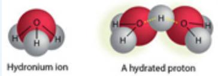</td></tr><tr><td>2. The Link between the Autoionization of Water and Gibbs Free Energy</td><td>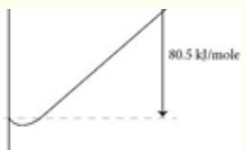</td></tr><tr><td>3. Theory of Acid-Base Reactions</td><td>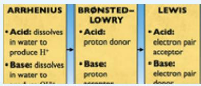</td></tr><tr><td>4. Equilibrium and Free Energy in Acidic Solutions</td><td>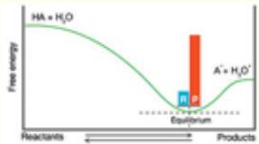</td></tr><tr><td>5. Solutions that are Basic: Manipulation of pOH and  $pK_a$ </td><td>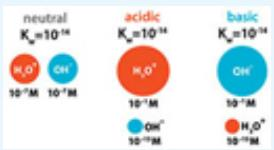</td></tr><tr><td>6. Reactions of a Strong Acid with a Strong Base</td><td>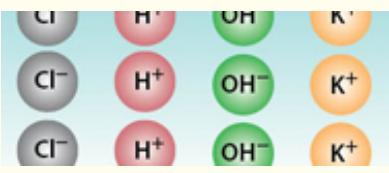</td></tr><tr><td>7. Reaction of a Strong Base with a Weak Acid</td><td>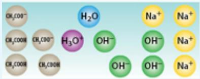</td></tr><tr><td>8. Buffer Solutions: The Henderson-Hasselbalch Equation</td><td>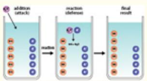</td></tr><tr><td>9. Titration Reactions</td><td>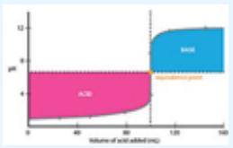</td></tr></table>

## Introduction

We move our discussion of equilibria to the solution or liquid phase, with a concentration on water as the primary solvent. Nature provides remarkable themes that are laced through many interconnected plots guiding the progression of spontaneous processes that dictate the course of events. These include the inexorable drive toward increasing entropy, the release of free energy in any spontaneous process, the quantum nature of atomic and molecular structure, and the distinction between thermodynamics and kinetics. But the role of proton transfer—the transfer of a hydrogen ion, $\mathrm { H ^ { + } }$ from one species to another, often involving water as a solvent—is a theme of broad importance. This is clearly the case for processes central to the cells that sustain life in all known organisms. It is also critical, as we will see, to sustaining living systems in the world's oceans as increasing amounts of $\mathrm { C O } _ { 2 } ,$ released by fossil fuel combustion, enter the oceans. The proton, as we will see, organizes the molecular level structure of liquid water, controls life's biochemical pathways, is held in delicate control in the blood of all organisms, constructs and deconstructs polymers, and aids in the synthesis of exquisite calcium containing structures at the intersection of organic and inorganic architectures in living systems as displayed in Figure 6.1.

## The Bonding Structure of Water

An investigation of chemical and physical processes that take place in water requires first that we understand the dynamic nature of water itself. This investigation of water and the reactions that are engendered by the unique properties of water are particularly important when it is realized that virtually all processes on Earth take place in this solvent. For a thorough understanding of processes that take place within a solution, we must be careful to distinguish the specific mechanistic role played by the solvent versus the role played by the compound itself.

:::{figure} ../images/fig-p1-ch06-28.jpg
:name: fig-p1-ch06-28
:alt: Figure from the University Chemistry source textbook
:::

In an aqueous solution, the chemical species added to the mixture is surrounded by water molecules—but those water molecules have a large permanent dipole moment created by the large electronegative character of oxygen relative to that of hydrogen. However, even in pure water, the structure is a dynamic, ever changing combination of monomers, dimers, trimers, etc., because of the hydrogen bonding that constantly attempts to organize the structure of water by constraining the kinetic motion (translation, rotation, vibration) of the individual water molecules. The addition of a proton, H<sup>+</sup>, leads to a rearrangement in the structure of water around the proton because the net positive charge of the protons attracts the electronegative (oxygen) end of the surrounding water molecule, as shown in Figure 6.9.

:::{figure} ../images/fig-p1-ch06-29.jpg
:name: fig-p1-ch06-29
:alt: FIGURE 6.9 The proton H+, acts as an organizing center in liquid water because it electrostatically attracts the electronegative end of the water molecules such that it bridges between the oxygen end of the water molecules forming hydrogen
FIGURE 6.9 The proton H+, acts as an organizing center in liquid water because it electrostatically attracts the electronegative end of the water molecules such that it bridges between the oxygen end of the water molecules forming hydrogen bonded structures.
:::


This rearrangement of the water molecules that determines the local structure around the proton results in the shielding of the protons by the molecules that “hydrate” the proton. The “cage” of water molecules that forms around the proton, which serves as an organizing core, becomes rapidly weaker with radial distance from the H<sup>+</sup> proton.

Another important property of water as a solvent for acid-base chemical reactions is that water can both donate and accept a proton. In the jargon of acid-base chemistry, this property is referred to as amphoteric—the ability to either donate or accept H<sup>+</sup>.

This amphoteric character of water leads to a very important result: the self-ionization or autoionization of water:

```{math}
:label: eq-p1-ch06-5
\mathrm{H} _ {2} \mathrm{O} (\mathrm{l}) + \mathrm{H} _ {2} \mathrm{O} (\mathrm{l}) \rightleftharpoons \mathrm{H} _ {3} \mathrm{O} ^ {+} (\mathrm{aq}) + \mathrm{OH} ^ {-} (\mathrm{aq})
```


which is an equilibrium reaction with an equilibrium constant, $K _ { \mathrm { e q } } = { \bf 1 } \ \times $ $1 0 ^ { - 1 4 }$ at 298 K. We know from our study of equilibrium processes that, ignoring the concentration of pure liquids,

```{math}
:label: eq-p1-ch06-6
K _ {\mathrm{eq}} = [ \mathrm {H_ {3} O^ {+}} ] [ \mathrm {OH^ {-}} ] = 1 0 ^ {- 1 4}
```


## The link between the autoionization of water and Gibbs free energy

When we analyze the behavior of pure water, an important characteristic that emerges is the self-ionization or autoionization reaction:

```{math}
:label: eq-p1-ch06-7
\mathrm{H} _ {2} \mathrm{O} + \mathrm{H} _ {2} \mathrm{O} \rightleftharpoons \mathrm{OH} ^ {-} + \mathrm{H} _ {3} \mathrm{O} ^ {+}
```


with an equilibrium constant, $K _ { w } = 1 0 ^ { - 1 4 }$ at 298 K. This is a very small equilibrium constant. Expressed as a free energy, we have

```{math}
:label: eq-p1-ch06-8
\Delta G ^ {\mathrm{o}} = - R T \ln K _ {\mathrm{w}} = - 2. 4 7 \mathrm{kJ/mole} \ln (1 0 ^ {- 1 4}) = 7 9. 9 \mathrm{kJ/mole}
```


This change in Gibbs free energy is rather large, so the free energy diagram for the autoionization reaction has the following form:

:::{figure} ../images/fig-p1-ch06-30.jpg
:name: fig-p1-ch06-30
:alt: Figure from the University Chemistry source textbook
:::

The equilibrium is thus very far to the left and the reaction proceeds only slightly to the right, with little $\mathrm { H } _ { 3 } \mathrm { O } ^ { + } + \mathrm { O H } ^ { - }$ formed. Of course we could see this immediately because $K _ { \mathrm { w } }$ is very small $( 1 0 ^ { - 1 4 } )$ , so little product $\mathrm { ( H _ { 3 } O ^ { + } + O H ^ { - } ) }$ is formed in the autoionization reaction. However, the magnitude of $K _ { \mathrm { w } } ~ \left( = ~ 1 0 ^ { - 1 4 } \right)$ when viewed from the perspective of autoionization disguises the fact that the reaction in the reverse direction:

```{math}
:label: eq-p1-ch06-9
\mathrm{H} _ {3} \mathrm{O} ^ {+} + \mathrm{OH} ^ {-} \rightleftharpoons \mathrm{H} _ {2} \mathrm{O} + \mathrm{H} _ {2} \mathrm{O}
```


```{math}
:label: eq-p1-ch06-10
K = 1 / K _ {\mathrm{w}} = 1 0 ^ {1 4}
```


is, in fact, very large. The change in Gibbs free energy, $\mathrm { D } G ^ { \mathrm { o } } .$ , is thus large and negative:

```{math}
:label: eq-p1-ch06-11
\Delta G ^ {\mathrm{o}} = - R T \ln (1 / K _ {\mathrm{w}}) = - 7 9. 9 \mathrm{kJ/mole}
```


Thus the Gibbs free energy diagram takes the form

:::{figure} ../images/fig-p1-ch06-31.jpg
:name: fig-p1-ch06-31
:alt: Figure from the University Chemistry source textbook
:::

and the reaction proceeds essentially to completion.

But this, we will see, has very significant consequences because any combination of acids or bases added to water first proceeds through “neutralization”—a process that reacts all available $\mathrm { H } _ { 3 } \mathrm { O } ^ { + }$ with all available OH<sup>-</sup>, forming water as the product, and leaving only the remaining $\mathrm { H } _ { 3 } \mathrm { O } ^ { + }$ or OH<sup>-</sup>, whichever is in excess.

This is why it is always necessary, when analyzing a reaction of an acid with a base (commonly called a “neutralization reaction”), to account first for this process of $\mathbf { O H ^ { - } / H _ { 3 } O ^ { + } }$ “annihilation,” resulting in the formation of $\mathbf { H _ { 2 } O }$

So in pure water we have $\mathbf { 1 0 ^ { - 7 } }$ moles of OH<sup>-</sup> and $\mathbf { 1 0 ^ { - 7 } }$ moles of $\mathrm { H } _ { 3 } \mathrm { O } ^ { + }$ in each liter of water. This unit, of moles/liter, is called the molarity of the solute. While this equilibrium constant, $K _ { \mathrm { e q } } ,$ is very small and on the face of it, rather unimportant, this is most decidedly not the case. In fact, because we will be investigating the behavior of acids and bases in the “sea” of solvent, this autoionization exerts powerful control over the behavior of acid/base systems. The reason for this is that $\Delta G$ for the reverse reaction, $\mathrm { O H ^ { - } + H _ { 3 } O ^ { + } }$ $\mathrm {  \ H _ { 2 } O \ + \ H _ { 2 } O }$ , is large and negative such that $\mathrm { H } _ { 3 } \mathrm { O } ^ { + }$ or OH<sup>-</sup> resulting, respectively, from the addition of an acid or a base, results in the formation of water (see sidebar on the previous page).

Because we will be dealing with a very large dynamic range in the concentrations of $\mathrm { H } _ { 3 } \mathrm { O } ^ { + }$ and OH<sup>-</sup>, we adopt a convention that, rather than constantly writing out the concentrations of $\mathrm { H } _ { 3 } \mathrm { O } ^ { + }$ and OH<sup>-</sup> in the tedious exponential form, we simplify the nomenclature by introducing logarithmic relations such that

```{math}
:label: eq-p1-ch06-12
\mathrm{pH} = - \log [ \mathrm{H} _ {3} \mathrm{O} ^ {+} ] \quad \mathrm{pOH} = - \log [ \mathrm{OH} ^ {-} ]
```


pH is, therefore, a measure of the relative acidity or basicity of a solution. In fact, in pure water

```{math}
:label: eq-p1-ch06-13
\mathrm{pH} = - \log [ \mathrm{H} _ {3} \mathrm{O} ^ {+} ] = - \log [ 1 0 ^ {- 7} ] = - (- 7) = 7
```


If the concentration of $\mathrm { H } _ { 3 } \mathrm { O } ^ { + }$ increases, for example by adding a substance that dissociates to form a $\mathrm { H } _ { 3 } \mathrm { O } ^ { + }$ cation and an anion, the solution becomes more acidic; $\mathrm { [ H _ { 3 } O ^ { + } ] }$ increases and pH decreases. For example, if after the addition of an acid, $\mathrm { [ H _ { 3 } O ^ { + } ] }$ goes from $\mathbf { 1 0 ^ { - 7 } }$ M to $\mathbf { 1 0 ^ { - 6 } M }$ , the pH decreases to $\mathrm { p H } = - \mathrm { l o g } [ \mathrm { H _ { 3 } O ^ { + } } ] = - \mathrm { l o g } [ { \bf 1 0 } ^ { - 6 } ] = 6$ . However, because the autoionization of water locks the product

```{math}
:label: eq-p1-ch06-14
K _ {\mathrm{eq}} = [ \mathrm {H_ {3} O^ {+}} ] [ \mathrm {OH^ {-}} ] = 1 0 ^ {- 1 4}
```


this increase in $\mathrm { [ H _ { 3 } O ^ { + } ] }$ means that [OH<sup>-</sup>] must decrease such as to keep the product of $\mathrm { [ H _ { 3 } O ^ { + } ] }$ and [OH<sup>-</sup>] constant.

We can then write, because of the equilibrium of water resulting from autoionization,

```{math}
:label: eq-p1-ch06-15
\begin{array}{r l} \mathrm{pH} + \mathrm{pOH} & = - \log [ \mathrm{H} _ {3} \mathrm{O} ^ {+} ] + - \log [ \mathrm{OH} ^ {-} ] \\ & = - \log [ \mathrm{H} _ {3} \mathrm{O} ^ {+} ] [ \mathrm{OH} ^ {-} ] \\ & = p K _ {\mathrm{eq}} = 1 4 \\ & \text { or } \quad p K _ {\mathrm{w}} = 1 4 \end{array}
```


where henceforth the equilibrium constant for

```{math}
:label: eq-p1-ch06-16
\mathrm{H} _ {2} \mathrm{O} + \mathrm{H} _ {2} \mathrm{O} \rightleftharpoons \mathrm{H} _ {3} \mathrm{O} ^ {+} + \mathrm{OH} ^ {-}
```


will be designated $K _ { \mathrm { w } } = \mathrm { [ H _ { 3 } O ^ { + } ] } \mathrm { [ O H ^ { - } ] } = \mathbf { 1 0 } ^ { - 1 4 }$ at $2 5 ^ { \circ } \mathrm { C }$ or 298 K.

## Theory of Acid-Base Reactions

The foundations of acid-base chemistry emerged from the work of Svante Arrhenius (1859-1927), Figure 6.10, who approached the subject from the perspective of the conduction of electricity in salt solutions. Arrhenius’ studies revealed the nature of ions that resulted from the dissociation of salt into cations (positively charged ions) and anions (negatively charged ions). This foundation of the ionic character of various salts in solution initiated a series of theories regarding acid-base chemistry, summarized in Figure 6.11.

:::{figure} ../images/fig-p1-ch06-32.jpg
:name: fig-p1-ch06-32
:alt: FIGURE 6.10 Svante Arrhenius was one of the most versatile scientists of the modern era. He was the first to recognize that an acid achieves its unique chemical characteristics in water by donating a proton to the solution, and that a base
FIGURE 6.10 Svante Arrhenius was one of the most versatile scientists of the modern era. He was the first to recognize that an acid achieves its unique chemical characteristics in water by donating a proton to the solution, and that a base dissociates in water to produce hydroxide ion, OH<sup>-</sup>. Arrhenius also deduced the exponential temperature dependence of the rates of chemical reactions and was one of the first scientists to recognize the role of $\mathsf { C O } _ { 2 }$ in the control of climate.
:::


:::{figure} ../images/fig-p1-ch06-33.jpg
:name: fig-p1-ch06-33
:alt: FIGURE 6.11 The theory of acid-base reactions evolved in steps. The original concept of Arrhenius that acids react in water to produce mathematical notation and bases react in water to produce mathematical notation evolved to the Brønsted-
FIGURE 6.11 The theory of acid-base reactions evolved in steps. The original concept of Arrhenius that acids react in water to produce $\mathsf { H } ^ { + }$ and bases react in water to produce $\mathsf { O H } ^ { - }$ evolved to the Brønsted- Lowry formulation that designated acids as proton donors and bases as proton acceptors. G. N. Lewis generalized the picture of acid-base reactions by designating the acid as an electron pair acceptor and a base as the electron pair donor. All three views of acid-base reactions are used today.
:::


According to Arrhenius, as summarized in Figure 6.12, all acids release $\mathrm { H ^ { + } }$ ions in water. For example, when HCl is added to water, HCl dissociates into $\mathrm { H ^ { + } }$ and $\mathrm { C l ^ { - } }$ , and the $\mathrm { H ^ { + } }$ combines with the solvent to form $\mathrm { H } _ { 3 } \mathrm { O } ^ { + }$ . As we have already seen, $\mathrm { H } _ { 3 } \mathrm { O } ^ { + }$ is really a shorthand representation of a structure that involves a number of $\mathrm { H } _ { 2 } \mathrm { O }$ molecules organized in a cage around the $\mathrm { H ^ { + } }$ core. Arrhenius identified all bases as those compounds that release hydroxide ions, $\mathrm { O H ^ { - } }$ , into water. An example is the addition of ammonia, $\mathrm { N H } _ { 3 } ,$ to water. $\mathrm { N H } _ { 3 }$ reacts with water, extracting a proton to form the ammonium cation, $\mathrm { N H _ { 4 } } ^ { + }$ , leaving OH<sup>-</sup> in solution.

```{math}
:label: eq-p1-ch06-17
\mathrm{NH} _ {3} + \mathrm{H} _ {2} \mathrm{O} \rightarrow \mathrm{NH} _ {4} ^ {+} + \mathrm{OH} ^ {-}
```


Based on our Gibbs free energy analysis, that excess OH<sup>-</sup> reacts with the $\mathrm { H ^ { + } }$ until the equilibrium is again established and

```{math}
:label: eq-p1-ch06-18
[ \mathrm{H} ^ {+} ] = K _ {\mathrm{w}} / [ \mathrm{OH} ^ {-} ] = 1 0 ^ {- 1 4} / [ \mathrm{OH} ^ {-} ]
```


Given that Arrhenius approached acid-base chemistry from the broader perspective of electrolytic solutions formed in general from salts, he defined a salt as any ionic compound that does not contain either the hydroxide ion, OH<sup>-</sup>, or the oxide ion, $\mathrm { O ^ { = } }$ . Ionic compounds that contain OH<sup>-</sup> or $\mathrm { O ^ { = } }$ are bases.

All acids release H⁺ ions in water:

:::{figure} ../images/fig-p1-ch06-34.jpg
:name: fig-p1-ch06-34
:alt: Figure from the University Chemistry source textbook
:::

:::{figure} ../images/fig-p1-ch06-35.jpg
:name: fig-p1-ch06-35
:alt: Figure from the University Chemistry source textbook
:::

:::{figure} ../images/fig-p1-ch06-36.jpg
:name: fig-p1-ch06-36
:alt: Figure from the University Chemistry source textbook
:::

:::{figure} ../images/fig-p1-ch06-37.jpg
:name: fig-p1-ch06-37
:alt: Figure from the University Chemistry source textbook
:::

lonization of HCl in water. Collisions between HCl molecules and water molecules lead to a transfer of H+ from HCl to ${ \mathsf { H } } _ { 2 } { \mathsf { O } }$ giving Cl- and ${ \mathsf { H } } _ { 3 } { \mathsf { O } } ^ { * }$ as products.
And all bases release hydroxide ions, OH in water:

:::{figure} ../images/fig-p1-ch06-38.jpg
:name: fig-p1-ch06-38
:alt: Figure from the University Chemistry source textbook
:::

:::{figure} ../images/fig-p1-ch06-39.jpg
:name: fig-p1-ch06-39
:alt: Figure from the University Chemistry source textbook
:::

:::{figure} ../images/fig-p1-ch06-40.jpg
:name: fig-p1-ch06-40
:alt: Figure from the University Chemistry source textbook
:::

:::{figure} ../images/fig-p1-ch06-41.jpg
:name: fig-p1-ch06-41
:alt: Figure from the University Chemistry source textbook
:::

lonization of ammonia in water. Collisions between $N { \mathsf { H } } _ { 3 }$ molecules and water molecules lead to a transfer of H+ from ${ \mathsf { H } } _ { 2 } { \mathsf { O } }$ to ${ \mathsf { N H } } _ { 3 ^ { \prime } }$ giving $\mathsf { N H } _ { 4 } ^ { + }$ and OH- ions.

FIGURE 6.12 When an acid is placed into water, the water molecule successfully extracts a proton, $\mathsf { H } ^ { + } ,$ from the structure of the acid leaving a negative ion (anion) and ${ \sf H } _ { 3 } { \sf O } ^ { + }$ formed by the attachment of the proton, $\mathsf { H } ^ { + } ,$ , to the oxygen end of the water molecule. “Strong” acids are those for which virtually every H<sup>+</sup> is released into water solution from the acid, as shown for HCl. Bases extract an $\mathsf { H } ^ { + }$ from water leaving an OH<sup>-</sup> behind in solution.

Representing the autoionization of water in terms of the lone electron pairs in water, hydronium, and hydroxide is illustrative and important to keep in mind. The bonding structure of water (we will treat this in more detail in Chapters 10 and 11) is such that there are two lone pairs with the two H atoms occupying positions separated by 104.5°:

:::{figure} ../images/fig-p1-ch06-42.jpg
:name: fig-p1-ch06-42
:alt: Figure from the University Chemistry source textbook
:::

When the autoionization reaction takes place and hydronium, $\mathrm { H } _ { 3 } \mathrm { O } ^ { + }$ , and hydroxyl, OH<sup>-</sup>, are formed, we express the reaction as

:::{figure} ../images/fig-p1-ch06-43.jpg
:name: fig-p1-ch06-43
:alt: Figure from the University Chemistry source textbook
:::

$\mathrm { H } _ { 3 } \mathrm { O } ^ { + }$ thus has a single lone pair; OH<sup>-</sup> has three lone pairs of electrons.

The Brønsted-Lowry theory of acids and bases, introduced in Figure 6.11, generalized the conceptual framework laid down by Arrhenius to consider acid-base reactions as a symmetric reaction of a proton acceptor in water and a proton donor in water. Figure 6.13 tracks the proton exchange when an acid is added to water.

Consider the reaction of a proton donor in water:

:::{figure} ../images/fig-p1-ch06-44.jpg
:name: fig-p1-ch06-44
:alt: FIGURE 6.13 The Brønsted-Lowry theory creates a symmetry between acid behavior and base behavior by identifying the proton as the species exchanged in any acid-base reaction. With this picture the acid (the proton donor) forms the conjugate
FIGURE 6.13 The Brønsted-Lowry theory creates a symmetry between acid behavior and base behavior by identifying the proton as the species exchanged in any acid-base reaction. With this picture the acid (the proton donor) forms the conjugate base following the reaction. The proton acceptor is the base (in this case water) that becomes the conjugate acid after the reaction.
:::


## Classifying the relative strengths of acids and bases

While it is necessary to use a table of equilibrium constants when actually working acid/base reaction problems—values that are tabulated in Appendix C of this text—it is instructive to analyze the relative strengths of acids and bases in a systematic way.

Strong Acids. There are two classes of strong acids:

1. The halogen based acids that derive their acidity from the highly electronegative character of chlorine, bromine, and iodine: HCl, HBr, and HI.

<div class="mineru-algorithm" style="white-space: pre-wrap; font-family:monospace;">
2. The “oxoacids” in which the number of O atoms exceeds the number of ionizable protons by two or more. These oxoacids include HONO$_{2}$, H$_{2}$SO$_{4}$, and HClO$_{4}$. The acid behavior in this case is caused by the electronegative character of oxygen that draws electron density from the ionizable hydrogens.

A key point here is that there are very few strong acids. We have only listed six here—and that's largely the full inventory! The remaining acids (several hundred) are all weak acids.

Weak Acids. So there are a far greater number of weak acids than strong acids. We identify here four types of acids:

1. The halogen based hydrogen containing diatomic that is not a strong acid: HF. Hydrofluoric acid is not a strong acid because the HF bond is so strong that, even though fluorine is very electronegative, it does not easily dissociate in water.

2. Acids in which H is not bonded to O or to a halogen—for example, HCN and H$_{2}$S.

3. Oxoacids in which the number of O atoms equals or exceeds by no more than 1 the number of ionizable protons, such as HClO, HNO$_{2}$, and H$_{3}$PO$_{4}$.

4. Carboxylic acids such as acetic acid, CH$_{3}$COOH, or benzoic acid, C$_{6}$H$_{5}$COOH, where the ionizable hydrogen is indicated in red. Note, of course, that it is the hydrogen immediately adjacent to the electronegative oxygen centers that are most easily ionized.

Strong Bases. Water soluble compounds containing the O$^{-}$ or OH$^{-}$ ions are the strong bases.

1. M$_{2}$O or MOH, where M ≡ Group 1A metals—Li, Na, K, Rb, Cs.

2. MO or M(OH)$_{2}$, where M ≡ Group 2A metals—Ca, Sr, Ba.

Weak Bases. Many compounds with an electron rich nitrogen atom are weak bases. They are proton acceptors (Brønsted-Lowry bases), not OH$^{-}$
</div>

producers (Arrhenius bases), when dissolved in water. The common structural feature is an N atom with a lone electron pair.

```{math}
:label: eq-p1-ch06-19
\begin{array}{l} 1. \mathrm {Ammonia, NH_ {3}}. \\ 2. \mathrm {Amines (RNH_ {2} , R_ {2} NH, R_ {3} N) such as CH_ {3} CH_ {2} NH_ {2} ,(CH_ {3}) _ {2} NH, and} \\ \mathrm {(CH_ {3} H_ {7}) _ {3} N}. \end{array}
```


If we consider the reaction of a proton acceptor in water, the tracking of the proton exchange is shown in Figure $_ { 6 . 1 4 }$ . What links acid-base chemistry inextricably in aqueous solution is that $\mathrm { H } _ { 3 } \mathrm { O } ^ { + }$ has a particularly favored reaction partner—specifically the hydroxide ion, OH<sup>-</sup>. The two species, $\mathrm { H } _ { 3 } \mathrm { O } ^ { + }$ and OH<sup>-</sup>, react on virtually every encounter in solution, interlocking the two species, through the reaction

```{math}
:label: eq-p1-ch06-20
\mathrm{H} _ {3} \mathrm{O} ^ {+} + \mathrm{OH} ^ {-} \rightarrow 2 \mathrm{H} _ {2} \mathrm{O}.
```


:::{figure} ../images/fig-p1-ch06-45.jpg
:name: fig-p1-ch06-45
:alt: FIGURE 6.14 When a base (a proton acceptor) is placed in water, it reacts by extracting the proton, from water, forming a conjugate acid in the process. The water, with a proton removed, becomes the conjugate base after reaction.
FIGURE 6.14 When a base (a proton acceptor) is placed in water, it reacts by extracting the proton, from water, forming a conjugate acid in the process. The water, with a proton removed, becomes the conjugate base after reaction.
:::


Driven by the large negative free energy shown on page 6.11, the equilibrium constant for the reaction is $1 0 ^ { + 1 4 }$ , which is just the reciprocal of the autoionization reaction

```{math}
:label: eq-p1-ch06-21
\mathrm{H} _ {2} \mathrm{O} + \mathrm{H} _ {2} \mathrm{O} \rightarrow \mathrm{H} _ {3} \mathrm{O} ^ {+} + \mathrm{OH} ^ {-}
```


for which

```{math}
:label: eq-p1-ch06-22
K _ {\mathrm{w}} = 1 \times 1 0 ^ {- 1 4}
```


This is delineated in terms of the Gibbs free energy in the sidebar on page 6.11.

## Check Yourself 1—Identifying Brønsted-Lowry Acids and Bases and Their Conjugates

For each of the following, identifying the acids and bases in both the forward and reverse reactions in the manner analogous to

```{math}
:label: eq-p1-ch06-23
\begin{array}{r l}&\mathrm{NH} _ {3} + \mathrm{H} _ {2} \mathrm{O} \quad \rightleftharpoons \quad \mathrm{NH} _ {4} ^ {+} + \mathrm{OH} ^ {-}\\&\text { base(1) } \quad \text { acid(2) } \quad \text { acid(1) } \quad \text { base(2) }\end{array}
```


where $^ { 6 6 } \vec { 1 } ^ { \prime \prime }$ prefers to the related pair $\mathrm { N H } _ { 3 }$ and $\mathrm { N H \Omega _ { 4 } ^ { + } }$ and $^ { \mathfrak { s } } 2 ^ { \mathfrak { s } }$ refers to $\mathrm { H } _ { 2 } \mathrm { O }$ and OH<sup>-</sup>

```{math}
:label: eq-p1-ch06-24
\mathrm{(a)} \mathrm{HClO} _ {2} + \mathrm{H} _ {2} \mathrm{O} \rightleftharpoons \mathrm{ClO} _ {2} ^ {-} + \mathrm{H} _ {3} \mathrm{O} ^ {+}
```


(b) $\mathrm { O C l ^ { - } + H _ { 2 } O  H O C l + O H ^ { - } }$

```{math}
:label: eq-p1-ch06-25
\mathrm{(c)} \mathrm{NH} _ {3} + \mathrm{H} _ {2} \mathrm{PO} _ {4} ^ {-} \rightleftharpoons \mathrm{NH} _ {4} ^ {+} + \mathrm{HPO} _ {4} ^ {2 -}
```


```{math}
:label: eq-p1-ch06-26
\mathrm{(d)} \mathrm{HCl} + \mathrm{H} _ {2} \mathrm{PO} _ {4} ^ {-} \rightleftharpoons \mathrm{Cl} ^ {-} + \mathrm{H} _ {3} \mathrm{PO} _ {4}
```


## Solution

Consider $\mathrm { { H C l O } } _ { 2 }$ in reaction (a). It gives up a proton, $\mathrm { H ^ { + } }$ , to become $\mathrm { C l O } _ { 2 } ^ { - }$ Therefore, $\mathrm { { H C l O } } _ { 2 }$ is an acid, and $\mathrm { C l O } _ { 2 } ^ { - }$ is its conjugate base. Now consider $\mathrm { H } _ { 2 } \mathrm { O }$ . It takes the proton from $\mathrm { { H C l O } } _ { 2 }$ and becomes $\mathrm { H } _ { 3 } \mathrm { O } ^ { + }$ . Thus, $\mathrm { H } _ { 2 } \mathrm { O }$ is a base, and $\mathrm { H } _ { 3 } \mathrm { O } ^ { + }$ is its conjugate acid. In reaction (b), OCl<sup>-</sup> is a base and gains a proton from water. OH<sup>-</sup> produced in this reaction is the conjugate base of $_ \mathrm { H _ { 2 } O }$ Taken together, reactions (a) and (b) show that $_ \mathrm { H _ { 2 } O }$ is amphiprotic. Reactions (c) and (d) illustrate the same for $\mathrm { H } _ { 2 } \mathrm { P O } _ { 4 } { } ^ { - }$

Practice Example A: For each of the following reactions, identify the acids and bases in both the forward and reverse directions.

```{math}
:label: eq-p1-ch06-27
\mathrm{(a)} \mathrm{HF} + \mathrm{H} _ {2} \mathrm{O} \rightleftharpoons \mathrm{F} ^ {-} + \mathrm{H} _ {3} \mathrm{O} ^ {+}
```


```{math}
:label: eq-p1-ch06-28
\mathrm{(b)} \mathrm{HSO} _ {4} ^ {-} + \mathrm{NH} _ {3} \rightleftharpoons \mathrm{SO} _ {4} ^ {2 -} + \mathrm{NH} _ {4} ^ {+}
```


```{math}
:label: eq-p1-ch06-29
\mathrm{(c)} \mathrm{C} _ {2} \mathrm{H} _ {3} \mathrm{O} _ {2} ^ {-} + \mathrm{HCl} \rightleftharpoons \mathrm{HC} _ {2} \mathrm{H} _ {3} \mathrm{O} _ {2} + \mathrm{Cl} ^ {-}
```


Practice Example B: Of the following species, one is acidic, one is basic, and one is amphiprotic in their reactions with water: $\mathrm { H N O _ { 2 } } , ~ \mathrm { P O _ { 4 } } ^ { 3 - }$ $\mathrm { H C O _ { 3 } } ^ { - }$ . Write the four equations needed to represent these facts.

## Equilibria and Free Energy in Acidic Solutions

If we represent an acid in a generalized nomenclature as HA, the addition of that acid to water results in the equilibrium reaction

```{math}
:label: eq-p1-ch06-30
\mathrm{HA} (\mathrm{aq}) + \mathrm{H} _ {2} \mathrm{O} (\mathrm{l}) \rightleftharpoons \mathrm{A} ^ {-} (\mathrm{aq}) + \mathrm{H} _ {3} \mathrm{O} ^ {+} (\mathrm{aq})
```


with the equilibrium constant, $K _ { \mathrm { e q } } ,$ given by the “acid dissociation constant”

```{math}
:label: eq-p1-ch06-31
K _ {a} = \frac {[ \mathrm{H} _ {3} \mathrm{O} ^ {+} ] [ \mathrm{A} ^ {-} ]}{[ \mathrm{HA} ]}
```


We can immediately identify the acid-conjugate base pair and the baseconjugate acid pair in terms of the Brønsted-Lowry formulation of an acid as a proton donor and a base as a proton acceptor:

:::{figure} ../images/fig-p1-ch06-46.jpg
:name: fig-p1-ch06-46
:alt: Figure from the University Chemistry source textbook
:::

The equilibrium represents the relative proportion amongst the acid, [HA], its conjugate base, [A<sup>-</sup>], the base, $\mathrm { [ H _ { 2 } O ] }$ , that acts as a proton acceptor, and finally the conjugate acid $\mathrm { [ H _ { 3 } O ^ { + } ] }$ . As we know from Chapter 5, the equilibrium is quantitatively governed by $K _ { \mathrm { a } } ,$ which we refer to as the acid dissociation constant or acid ionization constant. If $K _ { \mathrm { a } }$ is large, the reaction comes to equilibrium far to the right, such that products $\mathrm { A } ^ { - }$ and $\mathrm { H } _ { 3 } \mathrm { O } ^ { + }$ dominate. This means that a large fraction of the HA has dissociated so that HA is largely ionized in solution, which earns it the designation “strong acid.” Notice that there is a potential confusion here because a strong acid has a weak bond between the anion A<sup>-</sup> and the proton $\mathrm { H ^ { + } }$ resulting in the successful extraction of $\mathrm { H ^ { + } }$ from $\mathrm { A } ^ { - }$ by the electronegative (oxygen) end of the water solvent.

Conversely, a small $K _ { \mathrm { a } }$ indicates a small fraction of the HA acid dissociating to form $\mathrm { H } _ { 3 } \mathrm { O } ^ { + }$ . This is the case for a weak acid. A schematic representation for this is shown in Figure 6.15.

:::{figure} ../images/fig-p1-ch06-47.jpg
:name: fig-p1-ch06-47
:alt: FIGURE 6.15 (a) A strong acid reacts with water, donating virtually every proton to mathematical notation forming mathematical notation and the anion of acid. (b) A weak acid donates only a small fraction of the available protons to water t
FIGURE 6.15 (a) A strong acid reacts with water, donating virtually every proton to ${ \sf H } _ { 2 } \sf O$ forming ${ \sf H } _ { 3 } { \sf O } ^ { + }$ and the anion of acid. (b) A weak acid donates only a small fraction of the available protons to water to form ${ \sf H } _ { 3 } { \sf O } ^ { + }$
:::


We generally separate acids into the categories of strong or weak such that if $K _ { \mathrm { a } } \geq 1$ , the acid is strong; if $K _ { \mathrm { a } } < < 1$ , the acid is weak. In practice, however, strong acids (HCl, $\mathrm { H } _ { 2 } \mathrm { S O } _ { 4 }$ $\mathrm { H N O } _ { 3 } ,$ etc.) dissociate to such a degree that the dissociation is virtually complete. As a result the reaction “goes to completion,” $\mathrm { K _ { a } }$ is very large, we quantitatively ignore the back reaction, and all strong acids are essentially identical.

For weak acids $( K _ { \mathrm { a } } < < 1 )$ , the equilibrium calculation is very important, sometimes complex in multicomponent systems, and, as a reward, both interesting and important to virtually all natural systems. But, as with all systems driven spontaneously, we know that free energy is liberated in going from reactant to product. A strong acid with $K _ { \mathrm { a } } \geq 1$ , when added to water

```{math}
:label: eq-p1-ch06-32
\mathrm{HA} (\mathrm{aq}) + \mathrm {H_ {2} O(l)} \rightarrow \mathrm {A^ {-} (aq)} + \mathrm {H_ {3} O^ {+} (aq)}
```


occupies, with its companion reagent $\mathrm { H } _ { 2 } \mathrm { O } ( \mathrm { l } )$ , a position of high free energy relative to the products $\mathrm { A ^ { - } ( a q ) + H _ { 3 } O ^ { + } ( a q ) }$ . We can sketch the free energy surface, as shown in Figure 6.16.

:::{figure} ../images/fig-p1-ch06-48.jpg
:name: fig-p1-ch06-48
:alt: FIGURE 6.16 The Gibbs free energy diagram defines the equilibrium point between reactants and products—the minimum on the Gibbs free energy occurs where mathematical notation . Also, the larger the difference in free energy, the greater the
FIGURE 6.16 The Gibbs free energy diagram defines the equilibrium point between reactants and products—the minimum on the Gibbs free energy occurs where $\Delta \dot { G } = 0 .$ . Also, the larger the difference in free energy, the greater the shift toward the right-hand side and the stronger the acid.
:::


The decrease in free energy drives the reaction (shown in the molecular level diagram in Figure $\underline { { 6 . 1 7 } } )$ “downhill” to the right with respect to the reactants $\mathrm { H A } + \mathrm { H } _ { 2 } \mathrm { O }$ , with the reaction quotient

```{math}
:label: eq-p1-ch06-33
Q = \frac {[ \mathrm{A} ^ {-} ] [ \mathrm{H} _ {3} \mathrm{O} ^ {+} ]}{[ \mathrm{HA} ]}
```


increasing until equilibrium is achieved when $Q = K _ { \mathrm { e q } } = K _ { \mathrm { a } }$

:::{figure} ../images/fig-p1-ch06-49.jpg
:name: fig-p1-ch06-49
:alt: Figure from the University Chemistry source textbook
:::

:::{figure} ../images/fig-p1-ch06-50.jpg
:name: fig-p1-ch06-50
:alt: FIGURE 6.17 Acetic acid is a prototypical weak acid. It has a mathematical notation of mathematical notation at mathematical notation , and thus has a mathematical notation of 4.75. The value of mathematical notation is a convenient measure
FIGURE 6.17 Acetic acid is a prototypical weak acid. It has a $K _ { \mathfrak { a } }$ of $1 . 7 6 \times 1 0 ^ { - 5 }$ at $\boldsymbol { 2 5 ^ { \circ } \mathrm { C } }$ , and thus has a $\mathsf { p } K _ { \mathsf { a } }$ of 4.75. The value of $\mathsf { p } K _ { \mathsf { a } }$ is a convenient measure of both the magnitude of the equilibrium constant and the associated change in Gibbs free energy under standard conditions.
:::


Strong acids are converted to weak conjugate bases and strong bases are converted to weak conjugate acids. In the former case (strong acid → weak conjugate base), this is clearly because in the water solvent, the polar character of water, with the highly electronegative (oxygen) end of $_ \mathrm { H _ { 2 } O }$ successfully strips the proton from HA. But this means that $\mathrm { A } ^ { - }$ is incapable of “winning back” the proton; thus, A<sup>-</sup> is a weak base. But, as an inspection of Figure 6.16 reveals, any conjugate species that is referred to as “weak” means, in the language of thermodynamics, that it results in a low free energy relative to its parent species.

Now we are in a position to quantitatively link $K _ { \mathrm { a } }$ and $\Delta G ^ { \mathbf { o } }$ via the equation

```{math}
:label: eq-p1-ch06-34
\Delta G ^ {\mathrm{o}} = - R T \ln K _ {\mathrm{a}}
```


This is a very useful equation; it links the enthalpic $( \Delta H ^ { \mathrm { o } } )$ and entropic $( \Delta S ^ { \circ } )$ changes with the concentrations [HA], [A<sup>-</sup>], and $\mathrm { [ H _ { 3 } O ^ { + } ] }$ at equilibrium.

We can link this expression for the pH or $\mathsf { p } K _ { \mathrm { a } }$ of an acid solution by noting that, in general,

```{math}
:label: eq-p1-ch06-35
\ln x = 2. 3 0 3 \log_ {1 0} x
```


So we can write

```{math}
:label: eq-p1-ch06-36
\Delta G ^ {\mathrm{o}} = - R T \ln K _ {\mathrm{a}} = - 2. 3 0 3 R T \log K _ {\mathrm{a}}
```


Thus,

```{math}
:label: eq-p1-ch06-37
\mathrm{p} K _ {\mathrm{a}} = - \log K _ {\mathrm{a}} = \Delta G ^ {\mathrm{o}} / 2. 3 0 3 R T
```


## Solutions That Are Basic: Manipulation of pOH and ${ \mathsf { p } } K _ { \mathsf { a } }$

There is an intrinsic bias toward concentrating on the “acidic side,” pH $< 7 ,$ , in the development of acid-base chemical processes: first, perhaps because the loss of a proton can be a rather straightforward process and, second, because many applied processes in chemistry are executed in an acidic environment. However, living systems (e.g., human blood) and the global ocean systems are basic in character. So we investigate systems that are characterized by proton acceptance (the Brønsted-Lowry (B-L) definition of a base) rather than by proton donation (B-L definition of an acid).

In the aqueous solution of a base

:::{figure} ../images/fig-p1-ch06-51.jpg
:name: fig-p1-ch06-51
:alt: Figure from the University Chemistry source textbook
:::

$\mathrm { H } _ { 2 } \mathrm { O }$ assumes the role of an acid because it donates (loses!) a proton to the base, B(aq), to form the conjugate base OH<sup>-</sup>. The equilibrium constant for this process is termed the base dissociation constant or base ionization constant, $K _ { \mathrm { b } } ,$ and, as for all equilibrium constants is written

```{math}
:label: eq-p1-ch06-38
K _ {\mathrm{b}} = \frac {[ \mathrm{BH} ^ {+} ] [ \mathrm{OH} ^ {-} ]}{[ \mathrm{B(aq)} ]}
```


But the treatment of basic systems follows the same governing protocol as that for acids. Let's review them:

Water can both donate and accept protons, but in an aqueous solution the product of the hydronium ion, $\mathrm { H } _ { 3 } \mathrm { O } ^ { + }$ , and the hydroxide ion, $\mathrm { O H ^ { - } }$ , is

invariant under any condition imposed by the addition of an acid or a base to the solution

```{math}
:label: eq-p1-ch06-39
[ \mathrm{H} _ {3} \mathrm{O} ^ {+} ] [ \mathrm{OH} ^ {-} ] = 1 \times 1 0 ^ {- 1 4} = K _ {\mathrm{w}}
```


which is, as we noted above, referred to as the autoionization constant for water, $K _ { \mathrm { w } }$ . Thus the details of how a particular combination of acids or bases is added to a solution is irrelevant to the calculation of the $\mathrm { [ H _ { 3 } O ^ { + } ] }$ [OH<sup>-</sup>] product: $K _ { \mathrm { w } }$ rules, and it is always $1 \times 1 0 ^ { - 1 4 }$ at $2 5 ^ { \circ } \mathrm { C }$

We diagram this condition in Figure 6.18 to emphasize the point:

A base, dissolved in water, extracts a proton from water, generating a hydroxide ion, OH<sup>-</sup>; a strong base is so named because it has a more pronounced tendency to accept (steal!) $\mathrm { H ^ { + } }$ from water to form $\mathrm { B H ^ { + } }$ thereby splitting $\mathrm { H } _ { 2 } \mathrm { O }$ into OH<sup>-</sup> and $\mathrm { B H ^ { + } }$

Just as is the case for acids, $\mathrm { p ( a n y t h i n g ) = - l o g _ { 1 0 } ( a n y t h i n g ) }$ and so - $\log _ { 1 0 } [ \mathrm { O H ^ { - } } ] = \mathrm { p O H }$ and from

```{math}
:label: eq-p1-ch06-40
K _ {\mathrm{b}} = \frac {[ \mathrm{OH} ^ {-} ] [ \mathrm{BH} ^ {+} ]}{[ \mathrm{B} ]} \quad \text { we   have } \quad \mathrm{p} K _ {\mathrm{b}} = - \log_ {1 0} K _ {\mathrm{b}}
```


With increasing strength, the concentration of OH<sup>−</sup> increases and, as a result, $K _ { \mathrm { b } }$ increases for increasing strength of the base.

As is clear when conjugate acid-base pairs are considered, a strong base has a weak conjugate acid and a weak base has a strong conjugate acid.

:::{figure} ../images/fig-p1-ch06-52.jpg
:name: fig-p1-ch06-52
:alt: FIGURE 6.18 The autoionization of water establishes an equilibrium mathematical notation such that the product of mathematical notation and [OH−] is fixed at mathematical notation and thus an equilibrium constant of mathematical notation ,
FIGURE 6.18 The autoionization of water establishes an equilibrium $\mathsf { H } _ { 2 } \mathsf { O } + \mathsf { H } _ { 2 } \mathsf { O } \mathsf { H } _ { 3 } \mathsf { O } ^ { + } + \mathsf { O } \mathsf { H } ^ { - }$ such that the product of $[ \mathsf { H } _ { 3 } \mathsf { O } ^ { + } ]$ and [OH<sup>−</sup>] is fixed at $1 0 ^ { - 1 4 }$ and thus an equilibrium constant of $1 \times 1 0 ^ { - 1 4 }$ , the autoionization constant for water. If we add an acid to water, $[ \mathsf { H } _ { 3 } \mathsf { O } ^ { + } ]$ can become very large, 0.1 M in this case, but the product $[ \mathsf { H } _ { 3 } \mathsf { O } ^ { + } ] [ \mathsf { O } \mathsf { H } ^ { - } ] = 1 0 ^ { - 1 4 }$ still holds such that $\left[ { \mathsf { O H } } \right] = 1 0 ^ { - 1 3 } \mathsf { M }$ . Similarly, if a base is added, [OH<sup>−</sup>] can become very large (in this case 0.1 M) and thus $[ \mathsf { H } _ { 3 } 0 ^ { + } ] = 1 0 ^ { - 1 3 }$ M in order to keep $[ \mathsf { H } _ { 3 } \mathsf { O } ^ { + } ] [ \mathsf { O } \mathsf { H } ^ { - } ] = 1 0 ^ { - 1 4 }$
:::


Finally, we can tie together the acid dissociation constant, $K _ { \mathrm { a } } ,$ , for the acid dissociation reaction

```{math}
:label: eq-p1-ch06-41
\mathrm{HA} + \mathrm{H} _ {2} \mathrm{O} \rightarrow \mathrm{H} _ {3} \mathrm{O} ^ {+} + \mathrm{A} ^ {-} \qquad K _ {\mathrm{a}} = \frac {[ \mathrm{H} _ {3} \mathrm{O} ^ {+} ] [ \mathrm{A} ^ {-} ]}{[ \mathrm{HA} ]}
```


with the base dissociation constant $K _ { \mathrm { b } }$ for the base dissociation reaction to yield an important net reaction:

```{math}
:label: eq-p1-ch06-42
\begin{array}{r l}\mathrm {H_ {2} O+ A^ {-} \rightarrow OH^ {-} + HA}&K _ {\mathrm{b}} = \frac {[ \mathrm {OH^ {-}} ] [ \mathrm{HA} ]}{[ \mathrm {A^ {-}} ]}\\\text {Net:} \overline {{\mathrm {H_ {2} O+ H_ {2} O\rightarrow H_ {3} O^ {+} + OH^ {-}}}}&K _ {\mathrm{w}} = [ \mathrm {H_ {3} O^ {+}} ] [ \mathrm {OH^ {-}} ]\end{array}
```


We have simply used our rule that the equilibrium constant for addition of two reactions to form a net overall reaction is the product of the two equilibrium constants for each of the reactions involved.

```{math}
:label: eq-p1-ch06-43
K _ {\mathrm{a}} K _ {\mathrm{b}} = \frac {[ \mathrm{H} _ {3} \mathrm{O} ^ {+} ] [ \mathrm{A} ^ {-} ]}{[ \mathrm{HA} ]} \frac {[ \mathrm{OH} ^ {-} ] [ \mathrm{HA} ]}{[ \mathrm{A} ^ {-} ]} = [ \mathrm{OH} ^ {-} ] [ \mathrm{H} _ {3} \mathrm{O} ^ {+} ] = K _ {\mathrm{w}}
```


This, in practice, is a powerful relationship. Just as we always search for constants in dynamic processes in order to simplify complex systems, so too can we quantitatively rationalize the relative strengths of acid-conjugate base, and base-conjugate acid pairs, by recognizing that while $K _ { \mathrm { a } }$ and $K _ { \mathrm { b } }$ range over many orders of magnitude for various acid/base systems, $K _ { \mathrm { w } }$ is invariant. Thus,

```{math}
:label: eq-p1-ch06-44
K _ {\mathrm{a}} = K _ {\mathrm{w}} / K _ {\mathrm{b}} \qquad \mathrm{and} \qquad K _ {\mathrm{b}} = K _ {\mathrm{w}} / K _ {\mathrm{a}}
```


means that a strong acid (large $K _ { \mathrm { a } } )$ is paired with a weak conjugate base (small $K _ { \mathrm { b } } )$ . In the same vein, a strong base (large $K _ { \mathrm { b } } )$ is paired with a weak conjugate acid (small $K _ { \mathrm { a } } )$ . It is the intrinsic symmetry of proton donation and proton acceptance that simplifies the way we deal with the potentially complex nature of acid-base processes. We have already explored this symmetry when we identified the acid-conjugate base and base-conjugate acid pairs in Figure 6.17.

## Check Yourself 2—Relating $[ \mathsf { H } _ { 3 } \mathsf { O } ^ { + } ]$ , [OH<sup>-</sup>], pH, and pOH

When we analyze solutions that are basic, it is essential that we develop a facility with both the mathematical relationships between $\mathrm { [ H _ { 3 } O ^ { + } ] }$ , [OH<sup>-</sup>], pH and pOH as well as an understanding of the chemical reactions that underlie these relationships.

## Problem:

Suppose we carry out a laboratory experiment on two samples: (1) a sample of rainwater and (2) a sample of ammonia. The experimental results:

<table><tr><td>(1) Rainwater</td><td>pH= 4.35</td></tr><tr><td>(2) Ammonia</td><td>pH = 11.28</td></tr></table>

Calculate $\mathrm { [ H _ { 3 } O ^ { + } ] }$ in rainwater and [OH<sup>-</sup>] in the ammonia.

## Solution:

We can calculate $\mathrm { [ H _ { 3 } O ^ { + } ] }$ for rainwater from the pH equation

```{math}
:label: eq-p1-ch06-45
\mathrm{pH} = - \log_ {1 0} [ \mathrm{H} _ {3} \mathrm{O} ^ {+} ] = 4. 3 5
```


Thus

```{math}
:label: eq-p1-ch06-46
\log_ {1 0} [ \mathrm{H} _ {3} \mathrm{O} ^ {+} ] = - 4. 3 5
```


```{math}
:label: eq-p1-ch06-47
\begin{array}{r} \left[ \mathrm{H} _ {3} \mathrm{O} ^ {+} \right] = 1 0 ^ {- 4. 3 5} \\ = 4. 5 \times 1 0 ^ {- 5} \mathrm{M} \end{array}
```


To calculate [OH<sup>-</sup>] in the ammonia solution we employ the equation

```{math}
:label: eq-p1-ch06-48
\mathrm{pOH} = - \log_ {1 0} [ \mathrm{OH} ^ {-} ]
```


But $\mathrm { p O H } = 1 4 . 0 0 \mathrm { - p H } = 1 4 . 0 0 \mathrm { - } 1 1 . 2 8 = 2 . 7 2$

Then from $\mathrm { p O H } = - \mathrm { l o g } _ { 1 0 } \mathrm { [ O H ^ { - } ] }$ we have

```{math}
:label: eq-p1-ch06-49
\mathrm{pOH} = - \log_ {1 0} [ \mathrm{OH} ^ {-} ] = 2. 7 2 \mathrm{and}
```


```{math}
:label: eq-p1-ch06-50
\mathrm {so [ OH^ {-} ] = 10^ {-2.72} = 1.9\times 10^ {-3} M}
```


## Practice:

It is instructive to consider the pH of some of the food and drinks we routinely use. For example:

<table><tr><td>(pH)Coca-Cola = 2.53</td><td>(pH)sugar = 5.0 to 6.2</td></tr><tr><td>(pH)coffee = 4.5</td><td>(pH)meat = 5.2 to 7.0</td></tr><tr><td>(pH)yogurt = 4.4</td><td>(pH)egg yolk = 6.0</td></tr></table>

Calculate the $\mathrm { [ H _ { 3 } O ^ { + } ] }$ and [OH<sup>-</sup>] for yogurt.

## Neutralization Reactions: The Addition of an Acid to a Base

Three overbearing themes have now emerged in our treatment of acid-base reactions:

1. Acid-base reactions release free energy as they progress from their initial condition to their state of equilibrium.

2. Analysis of the acid-base pairs that emerges naturally from the symmetry of proton donation (acid) matched with proton acceptance (base) in

combination with the fact that the product of the acid dissociation constant, $K _ { \mathrm { a } } ,$ for the acid and the base dissociation constant for the conjugate base is equal to the autoionization constant for water

```{math}
:label: eq-p1-ch06-51
K _ {\mathrm{a}} K _ {\mathrm{b}} = K _ {\mathrm{w}}
```


means that strong acid → weak conjugate base, strong base → weak conjugate acid, weak acid → strong conjugate base and weak base → strong conjugate acid.

3. When an acid and a base square off in (are added to) an aqueous solution, there is an overwhelming tendency to form water, driven by the release of free energy! This important conclusion emerges directly from the fact that for

```{math}
:label: eq-p1-ch06-52
\mathrm{H} _ {3} \mathrm{O} ^ {+} + \mathrm{OH} ^ {-} \rightarrow \mathrm{H} _ {2} \mathrm{O} + \mathrm{H} _ {2} \mathrm{O} \quad K _ {\mathrm{eq}} = \frac {1}{K _ {\mathrm{w}}} = 1 \times 1 0 ^ {1 4}
```


This is a very large equilibrium constant and because at equilibrium

```{math}
:label: eq-p1-ch06-53
\Delta G ^ {\mathrm{o}} = - \mathrm{RT} \ln K _ {\mathrm{eq}} \approx - 8 0. 5 \mathrm{kJ/mole}
```


it follows that $\Delta G ^ { \mathbf { o } }$ is large and negative and thus the reaction is driven spontaneously to completion.

The analysis of solutions involving the addition of an acid to a base are, therefore, termed neutralization reactions because $\mathrm { H } _ { 3 } \mathrm { O } ^ { + }$ and OH<sup>-</sup> seek out one another and singlemindedly annihilate each other in the reaction

```{math}
:label: eq-p1-ch06-54
\mathrm{H} _ {3} \mathrm{O} ^ {+} + \mathrm{OH} ^ {-} \rightarrow \mathrm{H} _ {2} \mathrm{O} + \mathrm{H} _ {2} \mathrm{O}
```


The technique for handling such neutralization reactions is to first analyze the relative strengths of the acids and bases involved. We define, in the process, four categories of such reactions:

1. when a strong acid is added to a strong base;

2. when a strong acid is added to a weak base;

3. when a strong base is added to a weak acid; and, finally

4. when a weak base is added to a weak acid.

Check Yourself 3—Calculating Ion Concentrations in an Aqueous Solution of a Strong Acid

Calculate $\mathrm { [ H _ { 3 } O ^ { + } ] , [ C l ^ { - } ] }$ , and [OH<sup>-</sup>] in 0.015 M HCl(aq).

## Solution:

We can assume that HCl is completely ionized and is the sole source of $\mathrm { H } _ { 3 } \mathrm { O } ^ { + }$ in solution. Therefore,

```{math}
:label: eq-p1-ch06-55
[ \mathrm{H} _ {3} \mathrm{O} ^ {+} ] = 0. 0 1 5 \mathrm{M}
```


Furthermore, because one $\mathrm { C l ^ { - } }$ ion is produced for every $\mathrm { H } _ { 3 } \mathrm { O } ^ { + }$ ion,

```{math}
:label: eq-p1-ch06-56
[ \mathrm{Cl} ^ {-} ] = [ \mathrm{H} _ {3} \mathrm{O} ^ {+} ] = 0. 0 1 5 \mathrm{M}
```


To calculate [OH<sup>-</sup>], we must use the following fact.

1. All the $\mathrm { O H ^ { - } }$ is derived from the self-ionization of water.

2. [OH<sup>-</sup>] and $\mathrm { [ H _ { 3 } O ^ { + } ] }$ must have values consistent with $K _ { \mathrm { w } }$ for water.

```{math}
:label: eq-p1-ch06-57
K _ {w} = \left[ \mathrm{H} _ {3} \mathrm{O} ^ {+} \right] \left[ \mathrm{OH} ^ {-} \right] = 1. 0 \times 1 0 ^ {- 1 4}
```


```{math}
:label: eq-p1-ch06-58
(0. 0 1 5) \left[ \mathrm{OH} ^ {-} \right] = 1. 0 \times 1 0 ^ {- 1 4}
```


```{math}
:label: eq-p1-ch06-59
\left[ \mathrm{OH} ^ {-} \right] = \frac {1 . 0 \times 1 0 ^ {- 1 4}}{1 . 5 \times 1 0 ^ {- 2}} = 0. 6 7 \times 1 0 ^ {- 1 2} = 6. 7 \times 1 0 ^ {- 1 3} \mathrm{M}
```


Practice Example A: A 0.0025 M solution of HI(aq) has $\mathrm { [ H _ { 3 } O ^ { + } ] ~ = }$ 0.0025 M. Calculate the $[ \mathrm { I ^ { - } } ] , [ \mathrm { O H ^ { - } } ]$ , and pH of the solution.

Practice Example B: If 535 mL of gaseous HCl, at $2 6 . 5 ^ { \circ } \mathrm { C }$ and 747 mmHg, is dissolved in enough water to prepare 625 mL of solution, what is the pH of this solution?

## Strong Acid Reacting with a Strong Base

Given that a strong acid (such as HCl, $\mathrm { H } _ { 2 } \mathrm { S O } _ { 4 } , \mathrm { H N O } _ { 3 } )$ dissociates completely when added to water:

```{math}
:label: eq-p1-ch06-60
\mathrm{HCl} + \mathrm{H} _ {2} \mathrm{O} \rightarrow \mathrm{H} _ {3} \mathrm{O} ^ {+} + \mathrm{Cl} ^ {-}
```


and that a strong base (KOH, NaOH) reacts completely to form OH<sup>-</sup> when added to water:

```{math}
:label: eq-p1-ch06-61
\mathrm{KOH} \xrightarrow {\mathrm{H} _ {2} \mathrm{O}} \mathrm{OH} ^ {-} + \mathrm{K} ^ {+}
```


the neutralization of a strong acid and a strong base is quite simple to analyze. It is a problem of simple counting (stoichiometry). But the way the reaction is envisioned is important for dealing with more complicated systems. Thus we pursue it graphically in some depth.

Suppose we add equal amounts of HCl and KOH, each in its own beaker, to a beaker containing pure water. The beaker of HCl will contain a molar concentration of $\mathrm { H _ { 3 } O ^ { + } , \ [ H _ { 3 } O ^ { + } ] }$ , equal to the molar concentration of Cl<sup>−</sup>, [Cl<sup>-</sup>]. The KOH beaker will contain a molar concentration of OH<sup>-</sup>, [OH<sup>-</sup>], equal to that of $\mathrm { K ^ { + } }$ , [K<sup>+</sup>].

:::{figure} ../images/fig-p1-ch06-53.jpg
:name: fig-p1-ch06-53
:alt: Figure from the University Chemistry source textbook
:::

It doesn't matter if we have added 3 molecules of HCl and 3 molecules of KOH or 3 moles of each.

:::{figure} ../images/fig-p1-ch06-54.jpg
:name: fig-p1-ch06-54
:alt: Figure from the University Chemistry source textbook
:::

When these are added together, but before they react, we will have a beaker with the following composition:

:::{figure} ../images/fig-p1-ch06-55.jpg
:name: fig-p1-ch06-55
:alt: Figure from the University Chemistry source textbook
:::

But at the moment the beaker of HCl is mixed with the beaker of KOH the annihilation begins—each $\mathrm { H } _ { 3 } \mathrm { O } ^ { + }$ finds an OH<sup>-</sup> and the reaction is predestined by the large release of free energy to go to completion:

```{math}
:label: eq-p1-ch06-62
\mathrm{H} _ {3} \mathrm{O} ^ {+} + \mathrm{OH} ^ {-} \rightarrow 2 \mathrm{H} _ {2} \mathrm{O}
```


Thus each $\mathrm { H } _ { 3 } \mathrm { O } ^ { + }$ annihilates OH<sup>-</sup> (or vise versa!) and our head count after reaction is

:::{figure} ../images/fig-p1-ch06-56.jpg
:name: fig-p1-ch06-56
:alt: Figure from the University Chemistry source textbook
:::

The water so formed disappears into the background solution, leaving no trace of history. The solution is indistinguishable from a solution formed by the addition of KCl salt to pure water.

If we had not added equal amounts of the strong acid (HCl) to the strong base (KOH), but rather, for example, a 0.2 M (mol/liter) solution of HCl to a 0.1 M solution of KOH, the solution to this problem is simple because no equilibrium is involved. The first 0.1 M of HCl goes toward the annihilation of KOH, leaving a 0.1 M HCl solution behind. We can immediately calculate the pH of that mix:

```{math}
:label: eq-p1-ch06-63
[ \mathrm{H} _ {3} \mathrm{O} ^ {+} ] = 0. 1 \mathrm{M}
```


```{math}
:label: eq-p1-ch06-64
\mathrm{pH} = - \log_ {1 0} (0. 1 \mathrm{M}) = - \log (0. 1) = - (- 1) = 1
```


We can diagram this situation by starting with a 0.1 M KOH solution in a 1 liter beaker:

:::{figure} ../images/fig-p1-ch06-57.jpg
:name: fig-p1-ch06-57
:alt: Figure from the University Chemistry source textbook
:::

If we add 0.2 moles of HCl to the beaker, we will have, before reaction:

:::{figure} ../images/fig-p1-ch06-58.jpg
:name: fig-p1-ch06-58
:alt: Figure from the University Chemistry source textbook
:::

But the 0.1 mole of $\mathrm { H } _ { 3 } \mathrm { O } ^ { + }$ will find the 0.1 mole of OH<sup>-</sup>

```{math}
:label: eq-p1-ch06-65
\mathrm{H} _ {3} \mathrm{O} ^ {+} + \mathrm{OH} ^ {-} \rightarrow 2 \mathrm{H} _ {2} \mathrm{O}
```


leaving

:::{figure} ../images/fig-p1-ch06-59.jpg
:name: fig-p1-ch06-59
:alt: Figure from the University Chemistry source textbook
:::

We thus have 0.1 M $\mathrm { H } _ { 3 } \mathrm { O } ^ { + }$ and the $\mathrm { p H } = \mathbf { 1 }$ . The addition of a strong acid to a strong base does not involve an equilibrium, but rather is a simple process of counting how much $\mathrm { H } _ { 3 } \mathrm { O } ^ { + }$ or $\mathrm { O H ^ { - } }$ is left over after neutralization.

## Strong Base Reacting with a Weak Acid

The behavior that distinguishes this combination (strong base to weak acid) from the strong base-strong acid combination is that we must recognize that the weak acid component requires an analysis of the equilibrium behavior of the weak acid with its conjugate base as depicted in Figure 6.19. Let's consider the weak acid, acetic acid

```{math}
:label: eq-p1-ch06-66
\mathrm{CH} _ {3} \mathrm{COOH(aq)} + \mathrm{H} _ {2} \mathrm{O(l)} \rightleftharpoons \mathrm{CH} _ {3} \mathrm{COO} ^ {-} (\mathrm{aq}) + \mathrm{H} _ {3} \mathrm{O} ^ {+}\tag{6.1}
```


```{math}
:label: eq-p1-ch06-67
K _ {\mathrm{a}} = 1. 7 6 \times 1 0 ^ {- 5}
```


Addition of a strong base introduces OH<sup>-</sup>, for example, by adding NaOH because the base splits water to form OH<sup>-</sup>

```{math}
:label: eq-p1-ch06-68
\mathrm{NaOH} \xrightarrow {\mathrm{H} _ {2} \mathrm{O}} \mathrm{Na} ^ {+} + \mathrm{OH} ^ {-}
```


The key point to recognize is that the $\mathrm { H } _ { 3 } \mathrm { O } ^ { + }$ from the dissociation of $\mathrm { C H _ { 3 } C O O H }$ will react with the OH<sup>-</sup>

```{math}
:label: eq-p1-ch06-69
\mathrm{H} _ {3} \mathrm{O} ^ {+} (\mathrm{aq}) + \mathrm{OH} ^ {-} (\mathrm{aq}) \rightleftharpoons 2 \mathrm{H} _ {2} \mathrm{O} (\mathrm{l}) \tag{6.2}
```


```{math}
:label: eq-p1-ch06-70
K = 1 / K _ {\mathrm{w}} = 1 \times 1 0 ^ {1 4}
```


Adding $7 . 1$ and $7 . 2$ yields the net overall reaction:

```{math}
:label: eq-p1-ch06-71
\begin{array}{r l}&\mathrm {CH_ {3} COOH(aq) + OH^ {-} \rightleftharpoons CH_ {3} COO^ {-} + H_ {2} O}\\&\text {with } K_{eq} = K_{a} (1/K_{w})\end{array}
```


which, as Le Chatelier would tell us, shifts the equilibrium to the right, and strongly to the right because $1 / K _ { \mathrm { w } } = 1 \times 1 0 ^ { 1 4 }$ , and $K _ { \mathrm { a } } \approx 1 0 ^ { - 5 }$ yields $K _ { \mathrm { e q } } \approx 1 0 ^ { 9 }$

:::{figure} ../images/fig-p1-ch06-60.jpg
:name: fig-p1-ch06-60
:alt: FIGURE 6.19 A weak acid added to a strong base results in a sequence of steps. First a small number of mathematical notation from the weak acid reacts with the large number of OH- from the strong base in a neutralization process to form mat
FIGURE 6.19 A weak acid added to a strong base results in a sequence of steps. First a small number of ${ \sf H } _ { 3 } { \sf O } ^ { + }$ from the weak acid reacts with the large number of OH<sup>-</sup> from the strong base in a neutralization process to form ${ \sf H } _ { 2 } \mathrm { O }$ . But the OH<sup>-</sup> reacts with the weak acid ${ \mathsf { C H } } _ { 3 } { \mathsf { C O O H } }$ to form ${ \sf H } _ { 2 } \mathrm { O }$ and the conjugate base ${ \mathsf { C H } } _ { 3 } { \mathsf { C O O } } ^ { - }$
:::


We can calculate this new equilibrium constant immediately:

```{math}
:label: eq-p1-ch06-72
K = K _ {\mathrm{a}} \frac {1}{K _ {\mathrm{w}}} = \frac {[ \mathrm{CH} _ {3} \mathrm{COO} ^ {-} ]}{[ \mathrm{CH} _ {3} \mathrm{COOH(aq)} ] [ \mathrm{OH} ^ {-} ]} = \frac {1 . 7 6 \times 1 0 ^ {- 5}}{1 \times 1 0 ^ {- 1 4}} = 1. 8 \times 1 0 ^ {9}
```


But this is a remarkable result. It says that, even with a weak acid, and thus a small equilibrium constant, the inexorable drive to form water from $\mathrm { H } _ { 3 } \mathrm { O } ^ { + }$ and OH<sup>-</sup> forces the combined reaction

```{math}
:label: eq-p1-ch06-73
\mathrm{CH} _ {3} \mathrm{COOH} + \mathrm{OH} ^ {-} \rightarrow \mathrm{CH} _ {3} \mathrm{COO} ^ {-} + \mathrm{H} _ {2} \mathrm{O}
```


down the free energy slope to completion. Again we refer to the hand-to-hand combat going on at the molecular level in Figure 6.19.

Each $\mathrm { H } _ { 3 } \mathrm { O } ^ { + }$ consumed by an OH<sup>-</sup> to form water is replaced by the dissociation of another $\mathrm { C H _ { 3 } C O O H }$ molecule until all that remains is the excess OH<sup>-</sup>, each of the $\mathrm { H } _ { 3 } \mathrm { O } ^ { + }$ (and thus $\mathrm { C H _ { 3 } C O O H ) }$ being eliminated to form $_ \mathrm { H _ { 2 } O }$ . After each $\mathrm { H } _ { 3 } \mathrm { O } ^ { + }$ released by $\mathrm { C H _ { 3 } C O O H }$ dissociation has been annihilated by the excess OH<sup>-</sup> available from the strong base, the net result is to remove all available acetic acid, leaving one OH<sup>-</sup> removed for each original $\mathrm { C H _ { 3 } C O O H }$ in the solution.

But now comes the interesting point. The conjugate base, $\mathrm { C H _ { 3 } C O O ^ { - } }$ of the weak acid, $\mathrm { C H _ { 3 } C O O H } ,$ , is a base. This means that it can compete to extract an $\mathrm { H ^ { + } }$ from water to form OH<sup>-</sup>. The $\mathrm { C H _ { 3 } C O O H }$ has been eliminated, but the $\mathrm { C H _ { 3 } C O O ^ { - } }$ that is formed determines the pH of the solution by the equation

```{math}
:label: eq-p1-ch06-74
\mathrm{CH} _ {3} \mathrm{COO} ^ {-} + \mathrm{H} _ {2} \mathrm{O} \rightarrow \mathrm{OH} ^ {-} + \mathrm{CH} _ {3} \mathrm{COOH}
```


We know the resulting solution will be basic, but we need to be quantitative. How do we calculate the pH of such a mixture?

Before we solve quantitatively for the pH of this mixture of a base and a weak acid, we consider a unifying theme—the possible circumstances facing a weak acid in aqueous solution:

1. We know that we can just add a weak acid to pure water: This corresponds to HA in equilibrium with a small (and equal) concentration of $\mathrm { H } _ { 3 } \mathrm { O } ^ { + }$ and $\mathrm { A } ^ { - }$

```{math}
:label: eq-p1-ch06-75
\mathrm{HA} + \mathrm{H} _ {2} \mathrm{O} \rightleftharpoons \mathrm{H} _ {3} \mathrm{O} ^ {+} + \mathrm{A} ^ {-}
```


2. We know that we can add a strong base to a weak acid; the OH<sup>-</sup> from the strong base will “take out” each $\mathrm { H } _ { 3 } \mathrm { O } ^ { + }$ produced from the subsequent dissociation of the HA, leaving the conjugate base $\mathrm { A } ^ { - }$ with small concentrations of OH<sup>-</sup> and HA

```{math}
:label: eq-p1-ch06-76
\mathrm{HA} + \mathrm{OH} ^ {-} \rightleftharpoons \mathrm{A} ^ {-} + \mathrm{H} _ {2} \mathrm{O}
```


3. We could add a salt containing the conjugate base, A<sup>-</sup>, of the weak acid, leaving a significant concentration of HA (from the weak acid) and $\mathrm { A } ^ { - }$ from the dissociation of the salt.

The important point is that all of these cases are fundamentally the same. They are all equilibrium problems. Let's work them in order.

## Case 1:

Consider the calculation of the pH of a weak acid, acetic acid, with 0.1 mole $\mathrm { C H _ { 3 } C O O H }$ added to 1 liter of water. We work our standard equilibrium problem with a RICE chart:

```{math}
:label: eq-p1-ch06-77
\begin{array}{r l}\text {Reaction}&\mathrm{CH} _ {3} \mathrm{COOH} + \mathrm{H} _ {2} \mathrm{O} \rightleftharpoons \mathrm{CH} _ {3} \mathrm{COO} ^ {-} + \mathrm{H} _ {3} \mathrm{O} ^ {+} \quad K _ {\mathrm{a}} = 1. 7 6 \times 1 0 ^ {- 5}\\\text {Initial Concentration}&0. 1 \mathrm{M} \quad 0 \mathrm{M} \quad 0 \mathrm{M}\\\text {Change}&- x \quad x \quad x\\\text {Equilibrium}&K _ {\mathrm{a}} = \frac {[ \mathrm{CH} _ {3} \mathrm{COO} ^ {-} ] [ \mathrm{H} _ {3} \mathrm{O} ^ {+} ]}{[ \mathrm{CH} _ {3} \mathrm{COOH} ]}\end{array}
```


With $\mathrm { [ C H _ { 3 } C O O H ] _ { i n i t i a l } = 0 . 1 }$ M we have

```{math}
:label: eq-p1-ch06-78
K _ {\mathrm{a}} = \frac {x ^ {2}}{(0 . 1 - x)} = 1. 7 6 \times 1 0 ^ {- 5}
```


We can, of course, solve the quadratic equation:

```{math}
:label: eq-p1-ch06-79
x ^ {2} + 1. 7 6 \times 1 0 ^ {- 5} x - 1. 7 6 \times 1 0 ^ {- 6} = 0
```


But we could also try a simplifying assumption that $x < < 0 . 1$ and replace (0.1 $- x )$ with 0.1, yielding a far simpler equation:

```{math}
:label: eq-p1-ch06-80
\frac {x ^ {2}}{(0 . 1 - x)} \approx \frac {x ^ {2}}{0 . 1} = 1. 7 6 \times 1 0 ^ {- 5}
```


or

```{math}
:label: eq-p1-ch06-81
x ^ {2} = 1. 7 6 \times 1 0 ^ {- 6} \quad \text {or} \quad x = [ \mathrm{H} _ {3} \mathrm{O} ^ {+} ] = 1. 3 3 \times 1 0 ^ {- 3}
```


This is indeed much smaller than 0.1, so the approximation is valid within the accuracy of our objective here. We can then calculate the pH

```{math}
:label: eq-p1-ch06-82
\mathrm{pH} = - \log_ {1 0} (1. 3 3 \times 1 0 ^ {- 3}) = - (- 2. 8 8) = 2. 8 8
```


Thus the pH of this 0.1 M weak acid solution is 2.88, which means that the mix is indeed quite acidic.

Before we relegate this calculation to the bin of excessive simplicity—take note of a couple of points:

While only 1.3% of the acid is dissociated (we added 0.1 mole $\mathrm { C H _ { 3 } C O O H }$ to the liter of water and our equilibrium calculation showed $\mathrm { [ H _ { 3 } O ^ { + } ] } = 1 . 3$ × 10<sup>-3</sup> M), the balance of $\mathrm { [ H _ { 3 } O ^ { + } ] }$ and [OH<sup>-</sup>] has been dramatically shifted. With pure water, $\mathrm { \left[ H _ { 3 } O ^ { + } \right] } = \bf { 1 } \times \bf { 1 0 } ^ { - 7 }$ , so the $\mathrm { H } _ { 3 } \mathrm { O } ^ { + }$ concentration has increased by a factor of $\mathbf { 1 . 3 \times 1 0 ^ { - 3 } } / \mathbf { 1 \times 1 0 ^ { - 7 } } = \mathbf { 1 3 } , 0 0 0 !$

Since the autoionization of water requires the product of $\mathrm { [ H _ { 3 } O ^ { + } ] }$ and [OH<sup>-</sup>] to be

```{math}
:label: eq-p1-ch06-83
[ \mathrm{H} _ {3} \mathrm{O} ^ {+} ] [ \mathrm{OH} ^ {-} ] = 1 \times 1 0 ^ {- 1 4}
```


it means that

```{math}
:label: eq-p1-ch06-84
[ \mathrm{OH} ^ {-} ] = \frac {1 \times 1 0 ^ {- 1 4}}{1 . 3 \times 1 0 ^ {- 3}} = 7. 6 \times 1 0 ^ {- 1 2}
```


The $\mathbf { 1 0 ^ { - 7 } }$ M of OH<sup>−</sup> in pure water is swept away by the tsunami of $\mathrm { H } _ { 3 } \mathrm { O } ^ { + }$ from the acetic acid, reducing the concentration of $\mathrm { O H ^ { - } }$ by more than four orders of magnitude!

## Case 2:

Now we return to our case of a base added to a weak acid, which leaves us with an excess of OH<sup>-</sup> and a considerable concentration of the (strong) conjugate base, $\mathrm { C H _ { 3 } C O O ^ { - } }$ , of the weak acid, $\mathrm { C H _ { 3 } C O O H }$ . But this too is just an equilibrium problem. We write down the reaction, state the initial condition, define the change in concentrations, and write the equilibrium expression (a.k.a., RICE diagram):

```{math}
:label: eq-p1-ch06-85
\begin{array}{r l}\text {Reaction}&\mathrm{CH} _ {3} \mathrm{COO} ^ {-} + \mathrm{H} _ {2} \mathrm{O} \rightleftharpoons \mathrm{OH} ^ {-} + \mathrm{CH} _ {3} \mathrm{COOH}\\\text {Initial Concentration}&c \quad 0 \quad 0\\\text {Change}&- x \quad + x \quad + x\\\text {Equilibrium}&c - x \quad x \quad x\end{array}
```


Suppose, as we did for the calculation in Case 1 above, that we have an initial concentration of acetate of 0.1 M. Notice that it doesn't matter how the acetate was formed: We could have added sodium acetate $\mathrm { ( N a C H _ { 3 } C O O ) }$ or we could have added a strong base, NaOH—it doesn't matter. But now the equilibrium constant is not $K _ { \mathrm { a } } ,$ as in Case 1, but

```{math}
:label: eq-p1-ch06-86
K _ {\mathrm{b}} = \frac {K _ {\mathrm{w}}}{K _ {\mathrm{a}}} = \frac {[ \mathrm{OH} ^ {-} ] [ \mathrm{CH} _ {3} \mathrm{COOH} ]}{[ \mathrm{CH} _ {3} \mathrm{COO} ^ {-} ]} = 5. 7 \times 1 0 ^ {- 1 0}
```


because the $K _ { \mathrm { e q } }$ equilibrium is $\mathrm { C H } _ { 3 } \mathrm { C O O } ^ { - } + \mathrm { H } _ { 2 } \mathrm { O }  \mathrm { O H } ^ { - } + \mathrm { C H } _ { 3 } \mathrm { C O O H }$ , as we derived above for the addition of a strong base to a weak acid.

The first point to note is that, while $K _ { \mathrm { b } } = 5 { \cdot } 7 \times 1 0 ^ { - 1 0 }$ is a small equilibrium constant, it is much greater than $K _ { \mathrm { w } } = 1 \times 1 0 ^ { - 1 4 }$ ; in fact, it is 50,000 times larger! This increase in the equilibrium constant is a reflection of the strong basic character of the conjugate base $\mathrm { ( C H _ { 3 } C O O ^ { - } ) }$ of the weak acid $\mathrm { ( C H _ { 3 } C O O H ) }$ . The $\mathrm { C H _ { 3 } C O O ^ { - } }$ anion successfully splits water to form OH<sup>-</sup> far more effectively than $\mathrm { H } _ { 2 } \mathrm { O }$ splits itself. Now we can solve this problem just as we have any other equilibrium problem, by inserting equilibrium concentrations from our RICE table

```{math}
:label: eq-p1-ch06-87
K _ {\mathrm{eq}} = \frac {(x) (x)}{(0 . 1 - x)} = 5. 7 \times 1 0 ^ {- 1 0}
```


Again, with the approximation $0 . 1 - x \approx 0 . 1$ , we have

```{math}
:label: eq-p1-ch06-88
\begin{array}{r} x ^ {2} = (5. 7 \times 1 0 ^ {- 1 0}) 0. 1 = 5. 7 \times 1 0 ^ {- 1 1} \\ x = [ \mathrm{OH} ^ {-} ] = 7. 5 \times 1 0 ^ {- 6} \mathrm{M} \end{array}
```


Thus, from $\mathrm { [ H _ { 3 } O ^ { + } ] [ O H ^ { - } ] = 1 \times 1 0 ^ { - 1 4 } }$ we have

```{math}
:label: eq-p1-ch06-89
\begin{array}{r l} & {[ \mathrm {H_ {3} O^ {+}} ] = \frac {1 \times 1 0 ^ {- 1 4}}{7 . 5 \times 1 0 ^ {- 6} \mathrm{M}} = 1. 3 3 \times 1 0 ^ {- 9} \mathrm{M}} \\ & {\qquad \mathrm{pH} = - \log_ {1 0} (1. 3 3 \times 1 0 ^ {- 9}) = 8. 8 8} \end{array}
```


This means that the 0.1 M acetate mixture is a weak base with a pH 1.88 units above that of neutral water.

## Case 3:

Now we can recognize that we could construct the solution of a weak acid and a base by adding these two ingredients, CH COOH and $\mathrm { C H _ { 3 } C O O ^ { - } }$ , but that the result is identical to simply adding the same molar concentration of the acetate (the conjugate base) by merely adding a salt of that anion, for example, sodium acetate, to pure water. The resulting pH would be the same. It would be impossible to tell, after reaction, how the solution was prepared— by adding a weak base to a strong acid, or by adding a salt of the conjugate base.

Before we examine what happens when we create a “designer solution” by adding both a substantial amount of a weak acid and a substantial amount of the conjugate base, $\mathrm { C H _ { 3 } C O O ^ { - } }$ , by adding the salt of that anion, let's consider how vulnerable Case 1 and Case 2 are to small added amounts of an acid to Case 1 and a base to Case 2. That is, with only acid or only base, the equilibrium that determines pH is very sensitive to added $\mathrm { H } _ { 3 } \mathrm { O } ^ { + }$ or OH<sup>-</sup>. This was, of course, just what happened when we added a small amount of acid or base to pure water. The autoionization of water is so weak

```{math}
:label: eq-p1-ch06-90
\mathrm{H} _ {2} \mathrm{O} + \mathrm{H} _ {2} \mathrm{O} \rightarrow \mathrm{H} _ {3} \mathrm{O} ^ {+} + \mathrm{OH} ^ {-} \quad K _ {\mathrm{w}} = 1 \times 1 0 ^ {- 1 4}
```


that large swings in pH occur with small additions of even a weak acid or base.

To investigate the sensitive nature of a solution containing only acid, suppose we take our 0.1 M acetic acid solution, for which we have already determined that $\mathrm { [ H _ { 3 } O ^ { + } ] } = 0 . 0 0 1 3$ M and $\mathrm { p H } = 2 . 8 8$ . Now let's add 0.1 M HCl, a strong acid. What happens? The delicate equilibrium that existed in the acetic acid solution

```{math}
:label: eq-p1-ch06-91
\mathrm{CH} _ {3} \mathrm{COOH} + \mathrm{H} _ {2} \mathrm{O} \rightleftharpoons \mathrm{CH} _ {3} \mathrm{COO} ^ {-} + \mathrm{H} _ {3} \mathrm{O} ^ {+} \quad K _ {\mathrm{a}} = 1. 7 \times 1 0 ^ {- 5}
```


is obliterated by the 0.1 M $\mathrm { [ H _ { 3 } O ^ { + } ] }$ that results from the complete dissociation of the strong acid

```{math}
:label: eq-p1-ch06-92
\mathrm{HCl} + \mathrm {H_ {2} O} \rightleftharpoons \mathrm {H_ {3} O^ {+}} + \mathrm {Cl^ {-}}
```


The $\mathrm { H } _ { 3 } \mathrm { O } ^ { + }$ concentration jumps from 0.0013 to 0.1, a hundredfold increase, and the pH drops from 2.88 to 1.0. The acetic acid is virtually unaffected because only 0.13% of it was dissociated anyway, so while $\mathrm { H _ { 3 } O ^ { + } }$ from HCl dissociation drives the equilibrium of acetic acid to the left (Le Chatelier), the change is inconsequential.

For the case in which we added a base to a weak acid, converting virtually all the acetic acid to its conjugate base (the acetate anion)

```{math}
:label: eq-p1-ch06-93
\mathrm{CH} _ {3} \mathrm{COOH(aq)} + \mathrm{OH} ^ {-} (\mathrm{aq}) \rightarrow \mathrm{CH} _ {3} \mathrm{COO} ^ {-} + \mathrm{H} _ {2} \mathrm{O(l)}
```


the equilibrium is pushed almost completely to the right. This was Case 2, above. Now, if we add a base to this mixture, the pH will respond dramatically because there is no acetic acid to neutralize the added base, and a 0.1 M KOH strong base will yield $[ \mathrm { O H ^ { - } } ] = 0 . 1$ M, the pOH will be $\mathrm { p O H } = - \mathrm { l o g } [ \mathrm { O H } ^ { - } ] = 1$ and because $\mathrm { \small { [ H _ { 3 } O ^ { + } ] [ O H ^ { - } ] } = 1 0 ^ { - 1 4 } }$ , we have

```{math}
:label: eq-p1-ch06-94
[ \mathrm{H} _ {3} \mathrm{O} ^ {+} ] = \frac {1 0 ^ {- 1 4}}{1 0 ^ {- 1}} = 1 0 ^ {- 1 3} \quad \mathrm{and} \quad \mathrm{pH} = 1 3
```


But suppose we create a solution comprised of 0.1 M acetic acid and 0.1 M acetate anion, which we can do by adding $\mathrm { N a C H _ { 3 } C O O }$ to the acetic acid mixture. Now we have a very different but easily understood situation. If we add acid, $\mathrm { H } _ { 3 } \mathrm { O } ^ { + }$ , to this mixture, the acetate anion will react with the $\mathrm { H } _ { 3 } \mathrm { O } ^ { + }$

```{math}
:label: eq-p1-ch06-95
\mathrm{CH} _ {3} \mathrm{COO} ^ {-} + \mathrm{H} _ {3} \mathrm{O} ^ {+} \rightarrow \mathrm{CH} _ {3} \mathrm{COOH} + \mathrm{H} _ {2} \mathrm{O}
```


If we add a base, the OH<sup>-</sup> will react with the acid

```{math}
:label: eq-p1-ch06-96
\mathrm{CH} _ {3} \mathrm{COOH} + \mathrm{OH} ^ {-} \rightarrow \mathrm{CH} _ {3} \mathrm{COO} ^ {-} + \mathrm{H} _ {2} \mathrm{O}
```


From the molecular point of view, we can diagram the battle between the invading $\mathrm { H } _ { 3 } \mathrm { O } ^ { + }$ from an added acid in the following way, as shown in Figure

:::{figure} ../images/fig-p1-ch06-61.jpg
:name: fig-p1-ch06-61
:alt: FIGURE 6.20 For the case of a buffered solution we have a reservoir of the weak acid and its conjugate base. When an acid is added, the mathematical notation reacts with the conjugate base to form water and the weak acid. The pH of the solu
FIGURE 6.20 For the case of a buffered solution we have a reservoir of the weak acid and its conjugate base. When an acid is added, the ${ \sf H } _ { 3 } { \sf O } ^ { + }$ reacts with the conjugate base to form water and the weak acid. The pH of the solution is essentially unchanged.
:::


While a weak acid solution has no defense against added $\mathrm { H } _ { 3 } \mathrm { O } ^ { + }$ , this solution has a readily available means to defend against added $\mathrm { H } _ { 3 } \mathrm { O } ^ { + }$ , reacting with the conjugate base (the acetate anion)

```{math}
:label: eq-p1-ch06-97
\mathrm{CH} _ {3} \mathrm{COO} ^ {-} + \mathrm{H} _ {3} \mathrm{O} ^ {+} \rightarrow \mathrm{CH} _ {3} \mathrm{COOH} + \mathrm{H} _ {2} \mathrm{O}
```


The hydronium ion is removed, and the “bank” of $\mathrm { C H _ { 3 } O O H }$ is augmented, but while the equilibrium is stressed slightly, the invading $\mathrm { H } _ { 3 } \mathrm { O } ^ { + }$ is neutralized.

Suppose now that we attack the solution with a strong base:

:::{figure} ../images/fig-p1-ch06-62.jpg
:name: fig-p1-ch06-62
:alt: FIGURE 6.21 When a base is added to a buffer solution, the base reacts with the weak acid to form water and a (small) additional amount of the conjugate base, again leaving the pH of the solution unaffected.
FIGURE 6.21 When a base is added to a buffer solution, the base reacts with the weak acid to form water and a (small) additional amount of the conjugate base, again leaving the pH of the solution unaffected.
:::


In this case, the invading OH<sup>−</sup> reacts with the weak acid $\mathrm { C H _ { 3 } C O O H + O H ^ { - }  }$ $\mathrm { C H _ { 3 } C O O ^ { - } + H _ { 2 } O }$ , removing the hydroxide ion and augmenting the conjugate base. This is described schematically in Figure 6.21. The key point to notice is that the acid (HA) does not react with its conjugate base (A<sup>−</sup>) and thus they can coexist in solution.

## Buffer Solutions

This technique of building in a defense to limit pH changes by employing a reservoir of a weak acid and a reservoir of the conjugate base of that weak acid, is called a Buffer Solution and it is of immense importance to the cells of living organisms, to the global oceans, to the design of pharmaceuticals, and to the design and manufacture of photovoltaic cells.

Buffering uses the “weak” nature of a weak acid as a strength; the small degree of dissociation provides the means for counteracting an added OH<sup>-</sup> from a base. The addition of the conjugate base of that weak acid provides a line of defense against any added $\mathrm { H } _ { 3 } \mathrm { O } ^ { + }$ by neutralization. The “weakness” of the acid means that the weak acid can coexist with its conjugate base—they do not attack each other (thus we can line them up on each side of the reaction chambers above!).

While it is very important to recognize what is occurring in the acid-base solution at the molecular level and to recognize qualitatively what is occurring, it is also important to assess the situation quantitatively. To do this, we simply return to our equilibrium treatment. The equilibrium expression for acid dissociation

```{math}
:label: eq-p1-ch06-98
\mathrm{HA} + \mathrm{H} _ {2} \mathrm{O} \rightleftharpoons \mathrm{H} _ {3} \mathrm{O} ^ {+} + \mathrm{A} ^ {-}
```


is, of course, simply

```{math}
:label: eq-p1-ch06-99
K _ {\mathrm{a}} = \frac {[ \mathrm{H} _ {3} \mathrm{O} ^ {+} ] [ \mathrm{A} ^ {-} ]}{[ \mathrm{HA} ]}
```


Taking -log of both sides yields

```{math}
:label: eq-p1-ch06-100
- \log K _ {\mathrm{a}} = - \log [ \mathrm{H} _ {3} \mathrm{O} ^ {+} ] - \log \frac {[ \mathrm{A} ^ {-} ]}{[ \mathrm{HA} ]}
```


or

```{math}
:label: eq-p1-ch06-101
\mathrm{p} K _ {\mathrm{a}} = \mathrm{pH} - \log \frac {[ \mathrm{A} ^ {-} ]}{[ \mathrm{HA} ]}
```


and therefore

```{math}
:label: eq-p1-ch06-102
\mathrm{pH} = \mathrm{pK} _ {\mathrm{a}} + \log \frac {[ \mathrm{A} ^ {-} ]}{[ \mathrm{HA} ]}
```


This is a very versatile equation. It is called the Henderson-Hasselbalch Equation. The equation provides the opportunity to “design” the pH of a buffered solution by selecting the acid equilibrium constant, $K _ { \mathrm { a } } ,$ and then creating the solution from that acid and the salt of the conjugate base. To first order, as long as there is sufficient weak acid, HA, and conjugate base, $\mathrm { A } ^ { - }$ , the ratio of [A<sup>-</sup>] to [HA] will not change significantly and log ([A<sup>-</sup>]/[HA]) will be approximately zero within the range ±1 and pH $\approx \mathrm { p } K _ { \mathrm { a } }$ within 1 pH unit.

In addition, because pH, for a given choice of the weak acid (and thus a given $\mathrm { p } K _ { \mathrm { a } } )$ is controlled by the ratio of conjugate base to weak acid, a buffer also protects the pH against changes in dilution caused, for example, by adding solvent to the system. The reason, of course, is that if a solution is added to pure solvent, each of the concentrations, [A<sup>-</sup>] and [HA], are decreased by the same fraction and pH is unchanged. For example, if the solution is diluted by a factor of 10,

```{math}
:label: eq-p1-ch06-103
\frac {[ \mathrm{A} ^ {-} ] / 1 0}{[ \mathrm{HA} ] / 1 0} = \frac {[ \mathrm{A} ^ {-} ]}{[ \mathrm{HA} ]}
```


and $\mathrm { p H } = \mathrm { p } K _ { \mathrm { a } } + \mathrm { l o g } \left[ \mathrm { A ^ { - } } \right] / \left[ \mathrm { H A } \right]$ is unchanged.

We can work buffer problems from a number of different angles, but they generally involve the same equation, the Henderson-Hasselbalch Equation, turned various different ways. Consider the most straightforward type of buffer problem—the calculation of pH from a known concentration of a weak acid and the conjugate base. Using our prototype weak acid, $\mathrm { C H _ { 3 } C O O H } _ { \mathrm { \Omega } }$ suppose we create a solution from 1 L of water, 0.05 moles of acetic acid, and 0.05 moles of sodium acetate. What will be the change in pH if we add 0.001 moles of OH<sup>-</sup>?

We know that the acid ionization constant, $K _ { \mathrm { a } } ,$ for the reaction of acetic acid in water is

```{math}
:label: eq-p1-ch06-104
\mathrm{CH} _ {3} \mathrm{COOH} + \mathrm{H} _ {2} \mathrm{O} \rightleftharpoons \mathrm{CH} _ {3} \mathrm{COO} ^ {-} + \mathrm{H} _ {3} \mathrm{O} ^ {+}
```


```{math}
:label: eq-p1-ch06-105
K _ {\mathrm{a}} = 1. 7 6 \times 1 0 ^ {- 5} \qquad \mathrm{p} K _ {\mathrm{a}} = 4. 7 5
```


Before we add the 0.001 mole of OH<sup>-</sup>

```{math}
:label: eq-p1-ch06-106
\mathrm{pH} = \mathrm {p K _ {a}} + \ln ([ \mathrm {A^ {-}} ] / [ \mathrm{HA} ]) = 4. 7 5 + \ln 1 = 4. 7 5 + 0 = 4. 7 5
```


If we add 0.001 mole of OH<sup>-</sup>, then OH<sup>-</sup> and $\mathrm { H } _ { 3 } \mathrm { O } ^ { + }$ will find each other and react to completion such that [HA] decreases by 0.001 moles and [A<sup>-</sup>] increases by an equal amount such that

```{math}
:label: eq-p1-ch06-107
\mathrm{[HA]} = 0. 0 5 - 0. 0 0 1 = 0. 0 4 9
```


```{math}
:label: eq-p1-ch06-108
\left[ \mathrm{A} ^ {-} \right] = 0. 0 5 + 0. 0 0 1 = 0. 0 5 1
```


```{math}
:label: eq-p1-ch06-109
\mathrm{pH} = \mathrm {p K _ {a}} + \ln ([ \mathrm {A^ {-}} ] / [ \mathrm{HA} ]) = 4. 7 5 + \ln (0. 0 5 1 / 0. 0 4 9) = 4. 7 7
```


The conclusion is immediate. The pH changes very little.

The calculation of pH changes for a buffer solution proceeds in two steps. First, we assume that the neutralization reaction proceeds to completion and thereby establishes the new stoichiometric concentrations. Second, these new concentrations are substituted into the Henderson-Hasselbalch Equation. When you are given the concentration of a weak acid and the conjugate base (and you are given or can look up $K _ { \mathrm { a } } )$ the Henderson-Hasselbalch Equation provides a very easy method to calculate pH. And, it is very easy to calculate pH for the addition of small amounts of acid or base.

## Check Yourself 4—Determining Whether a Solution Is a Buffer Solution

Suppose we create a solution of $\mathrm { N H _ { 4 } C l { - } N H _ { 3 } }$ Is the solution a buffer solution, and if so, over what pH range would you expect it to behave like a buffer solution?

## Solution:

The first step is to determine which species in the solution is capable of neutralizing an acid and which species is capable of neutralizing a base. Given that $\mathrm { N H } _ { 4 } \mathrm { C l }$ will dissociate in water to form $\mathrm { N H _ { 4 } } ^ { + }$ and $\mathrm { C l ^ { - } }$ , and that $\mathrm { N H _ { 4 } } ^ { + }$ is an acid, the base neutralization reaction is

```{math}
:label: eq-p1-ch06-110
\mathrm{NH} _ {4} ^ {+} + \mathrm{OH} ^ {-} \rightarrow \mathrm{NH} _ {3} + \mathrm{H} _ {2} \mathrm{O}
```


and the acid neutralization reaction is

```{math}
:label: eq-p1-ch06-111
\mathrm{NH} _ {3} + \mathrm{H} _ {3} \mathrm{O} ^ {+} \rightarrow \mathrm{NH} _ {4} ^ {+} + \mathrm{H} _ {2} \mathrm{O}
```


Next, we employ the fact that in all solutions containing $\mathrm { N H _ { 4 } } ^ { + }$ and $\mathrm { N H } _ { 3 }$ we have

```{math}
:label: eq-p1-ch06-112
\mathrm{NH} _ {3} + \mathrm{H} _ {2} \mathrm{O} \rightleftharpoons \mathrm{NH} _ {4} ^ {+} + \mathrm{OH} ^ {-}
```


So that

```{math}
:label: eq-p1-ch06-113
K _ {\mathrm{b}} = \frac {[ \mathrm{OH} ^ {-} ] [ \mathrm{NH} _ {4} ^ {+} ]}{[ \mathrm{NH} _ {3} ]}
```


and that $K _ { \mathrm { b } } = 1 . 8 \times 1 0 ^ { - 5 }$

If our solution has approximately equal concentrations of $\mathrm { N H _ { 4 } } ^ { + }$ and $\mathrm { N H } _ { 3 } ,$ then

```{math}
:label: eq-p1-ch06-114
\frac {\left[ \mathrm{NH} _ {4} ^ {+} \right] \left[ \mathrm{OH} ^ {-} \right]}{\left[ \mathrm{NH} _ {3} \right]} \approx \left[ \mathrm{OH} ^ {-} \right] = 1. 8 \times 1 0 ^ {- 5}
```


```{math}
:label: eq-p1-ch06-115
\mathrm{pOH} = - \log_ {1 0} (1. 8 \times 1 0 ^ {- 5}) = 4. 7 4
```


and $\mathrm { p H } = 1 4 . 0 \mathrm { - p O H } = 1 4 . 0 \mathrm { - } 4 . 7 4 = 9 . 2 6$

Thus ammonium chloride-ammonia solutions are basic buffer solutions and, using our rule of thumb that buffer solutions operate over a range of two orders of magnitude, the pH range over which this buffer operates is from 8 to 10.

## Practice:

Suppose we form a solution by mixing $\mathrm { N H } _ { 3 }$ and HCl. Can this result in a buffer solution?

## Calculating pH changes in a Buffer Solution

Suppose we prepare a solution that is 0.250 M $\mathrm { { H C _ { 3 } H _ { 3 } O _ { 2 } } }$ and 0.560 M $\mathrm { N a _ { 2 } C _ { 2 } H _ { 3 } O _ { 2 } }$ with the volume of 0.300 liters. If we then add (1) 0.0060 mol HCl and (2) 0.0060 mol NaOH to this solution, how will the pH change?

## Solution

The first step is to calculate the pH of the solution before we add the HCl or the NaOH. To do this we use the Henderson-Hasselbalch Equation:

```{math}
:label: eq-p1-ch06-116
\begin{array}{r l} \mathrm{pH} & = \mathrm {p K _ {a}} + \log \frac {[ \mathrm {C_ {2} H_ {3} O_ {2} ^ {-}} ]}{[ \mathrm {HC_ {2} H_ {3} O_ {2}} ]} \\ & = 4. 7 4 + \log \frac {0 . 5 6 0}{0 . 2 5 0} = 4. 7 4 + 0. 3 5 = 5. 0 9 \end{array}
```


Consider first the addition of the 0.006 mol HCl to our buffer solution. The first point to recognize is that we must calculate the number of moles of each species involved in the reaction because the addition of the strong acid results in the neutralization (acid/base) reaction going to completion. That is, with the addition of 0.006 moles of $\mathrm { H } _ { 3 } \mathrm { O } ^ { + }$ , 0.006 moles of $\mathrm { C H _ { 3 } O O ^ { - } }$ is converted to $\mathrm { C _ { 2 } H _ { 3 } }$ OOH in the neutralization reaction

```{math}
:label: eq-p1-ch06-117
\mathrm{C} _ {2} \mathrm{H} _ {3} \mathrm{OO} ^ {-} + \mathrm{H} _ {3} \mathrm{O} ^ {+} \rightarrow \mathrm{C} _ {2} \mathrm{H} _ {3} \mathrm{OOH} + \mathrm{H} _ {2} \mathrm{O}
```


No equilibrium is involved; the reaction goes to completion. We can tabulate this, as shown in Table 6.1, including recalculating the molar concentrations in moles/liter. Notice that Table 6.1 is not a RICE table; there is no equilibrium involved.

TABLE 6.1

<table><tr><td></td><td> $C_{2}H_{3}O_{2}^{-}$ </td><td>+</td><td> $H_{3}O^{+}$ </td><td>→</td><td> $HC_{2}H_{3}O_{2}$ </td><td>+</td><td> $H_{2}O$ </td></tr><tr><td>Original buffer:</td><td>0.300 L × 0.560 M0.168 mol</td><td></td><td></td><td></td><td>0.300 L × 0.250 M0.075 mol</td><td></td><td></td></tr><tr><td>Add:</td><td></td><td></td><td>0.0060 mol</td><td></td><td></td><td></td><td></td></tr><tr><td>Changes:</td><td>-0.0060 mol</td><td></td><td>-0.0060 mol</td><td></td><td>+0.0060 mol</td><td></td><td></td></tr><tr><td>Final buffer amounts:</td><td>0.162 mol</td><td></td><td>(?)</td><td></td><td>0.0810 mol</td><td></td><td></td></tr><tr><td>Concentrations:</td><td>0.162 mol/0.300 L0.540 M</td><td></td><td>(?)</td><td></td><td>0.0810 mol/0.300 L0.270 M</td><td></td><td></td></tr></table>

Thus, our calculation of the pH change for an acid added to a buffer solution involves two steps: (1) the (simple) stoichiometric calculation, and (2) the equilibrium calculation that uses the Henderson-Hasselbalch Equation:

## (1) Acid Stoichiometric Calculation

Let's convert all concentrations to amounts in moles and assume that the neutralization goes to completion. Essentially, this is a limiting reactant calculation, but perhaps simpler than many of those in Chapter 5. In neutralizing the added $\mathrm { H } _ { 3 } \mathrm { O } ^ { + }$ , 0.0060 mol $\mathrm { C _ { 2 } H _ { 3 } O _ { 2 } ^ { - } }$ is converted to 0.0060 mol $\mathrm { H C _ { 2 } H _ { 3 } O _ { 2 } }$

## (2) Acid Equilibrium Calculation

We can redetermine the pH using the new equilibrium concentrations:

```{math}
:label: eq-p1-ch06-118
\begin{array}{r l} \mathrm{pH} & = \mathrm {p K _ {a}} + \log \frac {[ \mathrm {C_ {2} H_ {3} O_ {2} ^ {-}} ]}{[ \mathrm {HC_ {2} H_ {3} O_ {2}} ]} \\ & = 4. 7 4 + \log \frac {0 . 5 4 0}{0 . 2 7 0} = 4. 7 4 + 0. 3 0 = 5. 0 4 \end{array}
```


This addition of 0.0060 mol HCl lowers the pH from 5.09 to 5.04; this is only a small change in pH.

Calculation of the pH change for the addition of 0.006 moles of the strong base NaOH follows the same two-step sequence:

## (1) Base Stoichiometric Calculation

In neutralizing the added OH<sup>-</sup>, 0.0060 mol $\mathrm { H C _ { 2 } H _ { 3 } O _ { 2 } }$ is converted to 0.0060 mol $\mathrm { C _ { 2 } H _ { 3 } O _ { 2 } ^ { - } }$ . The calculation of the new stoichiometric concentrations is shown on the last line of Table 6.2.

TABLE 6.2

<table><tr><td></td><td> $HC_2H_3O_2$ </td><td>+</td><td> $OH^-$ </td><td>→</td><td> $C_2H_3O_2^-$ </td><td>+</td><td> $H_2O$ </td></tr><tr><td>Original buffer:</td><td>0.300 L × 0.250 M0.075 mol</td><td></td><td></td><td></td><td>0.300 L × 0.560 M0.168 mol</td><td></td><td></td></tr><tr><td>Add:</td><td></td><td></td><td>0.0060 mol</td><td></td><td></td><td></td><td></td></tr><tr><td>Changes:</td><td>-0.0060 mol</td><td></td><td>-0.0060 mol</td><td></td><td>+0.0060 mol</td><td></td><td></td></tr><tr><td>Final buffer amounts:</td><td>0.0690 mol</td><td></td><td>(?)</td><td></td><td>0.174 mol</td><td></td><td></td></tr><tr><td>Concentrations:</td><td>0.0690 mol/0.300 L0.230 M</td><td></td><td>(?)</td><td></td><td>0.174 mol/0.300 L0.580 M</td><td></td><td></td></tr></table>

## (2) Base Equilibrium Calculation

This is the same type of calculation as for acid, but with slightly different concentrations:

```{math}
:label: eq-p1-ch06-119
\mathrm{pH} = 4. 7 4 + \log \frac {0 . 5 8 0}{0 . 2 3 0} = 4. 7 4 + 0. 4 0 = 5. 1 4
```


The addition of 0.0060 mol OH<sup>-</sup> raises the pH from 5.09 to 5.14—another small change.

## Titration Reactions

While the very word conjures up visions of pipettes and beakers, the concept of titration helps to tie together the pH “landscape” shaped by shifting equilibria created by the interplay of $\mathrm { H } _ { 3 } \mathrm { O } ^ { + }$ , OH<sup>-</sup>, weak acids, strong acids, weak bases, and strong bases. What is important for a useful (a.k.a. lasting) understanding of acid-base interplay is to develop an intuition for how acidbase reactions control these pH landscapes. The basic execution of a titration involves the sequential addition of small incremental amounts of an acid to a basic solution, or incremental amounts of a base to an acidic solution. Typically, the pH of the solution is not known, but the pH of the incrementally added solution is—resulting in a determination of the pH of the unknown solution. The “titration curve” is simply a plot of pH on the vertical axis—determined by a pH meter or by pH indicators—against volume of the acid or base added to the mixture on the horizontal axis.

First, we consider the titration of a strong acid with a strong base, and in the process establish the basic form of the titration curve shown in Figure 6.22. We know a great deal from our discussion of neutralization about what will happen in this case. The solution starts out with a pH determined simply by the molar concentration of the strong acid in solution because dissociation is complete. For example, suppose we begin with a 100 mL solution of HCl that is 0.1 M in acid concentration. To this mix we add, in small increments, 0.1 M NaOH and sequentially map out the pH as a function of the volume of NaOH added.

:::{figure} ../images/fig-p1-ch06-63.jpg
:name: fig-p1-ch06-63
:alt: FIGURE 6.22 The titration curve for a strong base added to a strong acid. The pH of the solution begins, before addition of the base, at the pH of the strong acid. As base is added to the solution, the OH− from the base reacts in a neutrali
FIGURE 6.22 The titration curve for a strong base added to a strong acid. The pH of the solution begins, before addition of the base, at the pH of the strong acid. As base is added to the solution, the OH<sup>−</sup> from the base reacts in a neutralization reaction to form ${ \sf H } _ { 2 } \mathrm { O }$ . When the amount of OH<sup>−</sup> added is equal to the $[ \mathsf { H } _ { 3 } \mathsf { O } ^ { + } ]$ originally present, we reach the equivalence point where an equal amount of [OH<sup>−</sup>] and $[ \mathsf { H } _ { 3 } \mathsf { O } ^ { + } ]$ are present such that with $\lbrack { \mathsf { O H } } ^ { - } ] [ { \mathsf { H } } _ { 3 } { \mathsf { O } } ^ { + } ] = 1 0 ^ { - 1 4 }$ , we have $[ 0 \mathsf { H } ^ { - } ] = 1 0 ^ { - 7 }$ and $[ \mathsf { H } _ { 3 } \mathsf { O } ^ { + } ] = 1 0 ^ { - 7 }$ . For each additional OH<sup>−</sup> added, the pH increases accordingly.
:::


In this case the titration proceeds from left to right as shown by the arrows, with the neutralization occurring via the added OH<sup>-</sup> reacting with the $\mathrm { H } _ { 3 } \mathrm { O } ^ { + }$

```{math}
:label: eq-p1-ch06-120
\mathrm{OH} ^ {-} + \mathrm{H} _ {3} \mathrm{O} ^ {+} \rightarrow \mathrm{H} _ {2} \mathrm{O} + \mathrm{H} _ {2} \mathrm{O}
```


in a simple lock-step; one-for-one with no subtlety or complications—a simple process of counting, a simple calculation of stoichiometry. The “titration” curve begins prior to addition of the base at $\mathrm { p H } = - \mathrm { l o g } [ \mathrm { H _ { 3 } O ^ { + } } ] = -$ log(0.1 M) = 1 at the left-hand side of the graph and marches through each titration step until the point is approached where the amount of OH<sup>−</sup> added begins to approach the amount of $\mathrm { H } _ { 3 } \mathrm { O } ^ { + }$ (0.1 M) originally in the solution. Then the situation changes abruptly at 100 mL of added base because the last $\mathrm { H } _ { 3 } \mathrm { O } ^ { + }$ , present in the solution by virtue of the HCl originally placed there, is neutralized by the last OH<sup>-</sup> before the solution switches to a condition with

OH<sup>-</sup> in excess. At the point where the added $[ \mathrm { O H ^ { - } } ] = [ \mathrm { H _ { 3 } O ^ { + } } ]$ originally in place, the equivalence point is reached and the only source of $\mathrm { H } _ { 3 } \mathrm { O } ^ { + }$ and $\mathrm { O H ^ { - } }$ is the autoionizaton of water

```{math}
:label: eq-p1-ch06-121
\mathrm{H} _ {2} \mathrm{O} + \mathrm{H} _ {2} \mathrm{O} \rightarrow \mathrm{H} _ {3} \mathrm{O} ^ {+} + \mathrm{OH} ^ {-}
```


As a result, at the equivalence point, $\mathrm { \ p H = - l o g \left[ H _ { 3 } O ^ { + } \right] = 7 } ;$ , just as it is for pure water. The OH<sup>-</sup> and $\mathrm { H } _ { 3 } \mathrm { O } ^ { + }$ have sought each other out and annihilated each other in the neutralization reaction. The neutralization is driven by the large, negative free energy in the formation of water from $\mathrm { H _ { 3 } O ^ { + } + O H ^ { - } }$ . There is no buffering, no hydrolysis, and no partial dissociation. If we had begun with the KOH 0.1 M solution and proceeded to incrementally add acid instead, as shown in Figure 6.23, the titration curve, which by convention always proceeds from left to right, would have taken the form of Figure 6.23.

:::{figure} ../images/fig-p1-ch06-64.jpg
:name: fig-p1-ch06-64
:alt: FIGURE 6.23 If we begin with a strong base and add a strong acid, the titration curve follows a path the reverse of that in Figure 6.22.
FIGURE 6.23 If we begin with a strong base and add a strong acid, the titration curve follows a path the reverse of that in Figure 6.22.
:::


## Titration of a Weak Acid by a Strong Base

Suppose, now, that we examine the titration curve of a weak acid by a strong base. Adopting our canonical acetic acid case, suppose we begin with a 0.1 M solution—we already know the pH of that solution from our previous examples—it is pH = 2.88.

This establishes the initial point, (a), on our pH versus volume-of-baseadded titration diagram, as shown in Figure 6.24. Now we proceed with the titration, moving incrementally from left to right on the titration plot. Now the “counting” begins, with each OH<sup>-</sup> introduced seeking an acetic acid molecule and neutralizing it

```{math}
:label: eq-p1-ch06-122
\mathrm{OH} ^ {-} + \mathrm{CH} _ {3} \mathrm{COOH} \rightarrow \mathrm{CH} _ {3} \mathrm{COO} ^ {-} + \mathrm{H} _ {2} \mathrm{O}
```


:::{figure} ../images/fig-p1-ch06-65.jpg
:name: fig-p1-ch06-65
:alt: FIGURE 6.24 The titration curve for a weak acid by a strong base.
FIGURE 6.24 The titration curve for a weak acid by a strong base.
:::


Each OH<sup>-</sup> added then produces one acetate anion and one less acetic acid molecule. But this is a pattern, a process, that we have already studied. As we build up the conjugate base concentration, we are developing a buffer solution, with a pH given by the Henderson-Hasselbalch equation:

```{math}
:label: eq-p1-ch06-123
\mathrm{pH} = \mathrm{pK} _ {\mathrm{a}} + \log \frac {[ \mathrm{CH} _ {3} \mathrm{COO} ^ {-} ]}{[ \mathrm{CH} _ {3} \mathrm{COOH} ]}
```


At the point where we have added enough OH<sup>-</sup> that we have converted half the $\mathrm { C H _ { 3 } C O O H }$ to its conjugate base, $\mathrm { C H _ { 3 } C O O ^ { - } }$ , then

```{math}
:label: eq-p1-ch06-124
[ \mathrm{CH} _ {3} \mathrm{COO} ^ {-} ] = [ \mathrm{CH} _ {3} \mathrm{COOH} ]
```


and

```{math}
:label: eq-p1-ch06-125
\mathrm{pH} = \mathrm{p} K _ {\mathrm{a}} + \log 1 = \mathrm{p} K _ {\mathrm{a}}
```


at this point, we have reached the center of the “buffer region” of the titration curve, displayed by the vertical dotted line in Figure 6.24, point (b).

As we move incrementally to the right as additional (strong) base is added, the next transition occurs as the point is reached where the added OH<sup>−</sup> equals the amount of CH COOH originally in solution before we began the titration. This point is the “equivalence point,” point (c) in Figure ${ 6 . 2 4 } ,$ and at that point extremely small increments of added base create very large changes in pH as Figure 6.24 demonstrates. At the equivalence point all the $\mathrm { C H _ { 3 } C O O H }$ has been converted to $\mathrm { C H _ { 3 } C O O ^ { - } }$ and any additional OH<sup>-</sup> will result in hydrolysis, a strong base in water:

```{math}
:label: eq-p1-ch06-126
\mathrm{KOH} + \mathrm{H} _ {2} \mathrm{O} \rightarrow \mathrm{OH} ^ {-} + \mathrm{H} _ {2} \mathrm{O} + \mathrm{K} ^ {+}
```


The pH at the equivalence point is determined entirely by the hydrolysis of the conjugate base

```{math}
:label: eq-p1-ch06-127
\mathrm{CH} _ {3} \mathrm{COO} ^ {-} (\mathrm{aq}) + \mathrm{H} _ {2} \mathrm{O} (\mathrm{l}) \rightleftharpoons \mathrm{CH} _ {3} \mathrm{COOH} + \mathrm{OH} ^ {-} (\mathrm{aq})
```


```{math}
:label: eq-p1-ch06-128
K _ {\mathrm{b}} = \frac {[ \mathrm{CH} _ {3} \mathrm{COOH} ] [ \mathrm{OH} ^ {-} ]}{[ \mathrm{CH} _ {3} \mathrm{COO} ^ {-} ]} = \frac {K _ {\mathrm{w}}}{K _ {\mathrm{a}}} = \frac {1 \times 1 0 ^ {- 1 4}}{1 . 8 \times 1 0 ^ {- 5}} = 5. 7 \times 1 0 ^ {- 1 0}
```


Given that $\mathrm { [ C H _ { 3 } C O O ^ { - } ] } \ = \ 0 . 1$ M because all the $\mathrm { C H _ { 3 } C O O H }$ has, at the equivalence point, been converted to the conjugate base, and from the hydrolysis reaction we know one OH<sup>-</sup> is produced for each $\mathrm { C H _ { 3 } C O O H }$ present at equilibrium, we have

```{math}
:label: eq-p1-ch06-129
\frac {[ \mathrm{OH} ^ {-} ] [ \mathrm{CH} _ {3} \mathrm{COOH} ]}{[ \mathrm{CH} _ {3} \mathrm{COO} ^ {-} ]} = \frac {[ \mathrm{OH} ^ {-} ] ^ {2}}{[ \mathrm{CH} _ {3} \mathrm{COO} ^ {-} ]} = K _ {\mathrm{b}}
```


Then

```{math}
:label: eq-p1-ch06-130
\begin{array}{r l} \mathrm {[OH^ {-} ] = \sqrt {(K_ {b}) [CH_ {3} COO^ {-} ]}} & = \sqrt {(5 . 7 \times 1 0 ^ {- 1 0}) 0 . 1 \mathrm{M}} \\ & = 7. 5 \times 1 0 ^ {- 6} \end{array}
```


Because $\mathrm { [ O H ^ { - } ] [ H _ { 3 } O ^ { + } ] } = 1 0 ^ { - 1 4 }$ , we know $\mathrm { { [ H _ { 3 } O ^ { + } ] = 1 . 3 3 \times 1 0 ^ { - 9 } } }$ . Therefore, pH $= 8 . 9$

So, marching through the titration curve, we begin with pure acid (all $\mathrm { C H _ { 3 } C O O H ) }$ ; develop the buffer solution with the addition of the strong base until we reach the middle of the buffer zone, where $\mathrm { [ C H _ { 3 } C O O ^ { - } ] } \ =$ $\mathrm { \Delta ^ { 1 / 2 } [ C H _ { 3 } C O O H ] _ { i n i t i a l } ; }$ and then reach the equivalence point, where the original weak acid, $\mathrm { C H _ { 3 } C O O H }$ , has been converted to the conjugate base, $\mathrm { C H _ { 3 } C O O ^ { - } }$ 2 at which point each additional OH<sup>-</sup> added corresponds to the simple addition of a strong base to water. This sequence is sketched in Figure 6.25.

:::{figure} ../images/fig-p1-ch06-66.jpg
:name: fig-p1-ch06-66
:alt: FIGURE 6.25 Titration curve tracing out the progression from a solution of a weak acid mathematical notation with a strong base. The point at which the conjugate base mathematical notation concentration equals one-half the original acid con
FIGURE 6.25 Titration curve tracing out the progression from a solution of a weak acid $[ \mathsf { C H } _ { 3 } \mathsf { C O O H } ]$ with a strong base. The point at which the conjugate base $[ \mathsf { C H } _ { 3 } \mathsf { C O O } ^ { - } ]$ concentration equals one-half the original acid concentration is shown as well as the equivalence point where $[ \mathsf { C H } _ { 3 } \mathsf { C O O } ^ { - } ] =$ $[ \mathsf { C H } _ { 3 } \mathsf { C O O H } ] _ { \mathsf { i n i t } } .$
:::


## Titration of a Weak Base by a Strong Acid

What about the titration of a weak base with a strong acid? We know, first, that the initial point on our titration curve will be at a pH corresponding to the equilibrium constant of the base at the initial molar concentration—let's assume we have formed a 0.1 M solution of acetate anion, $\mathrm { C H _ { 3 } O O ^ { - } }$ . We know

```{math}
:label: eq-p1-ch06-131
K _ {\mathrm{b}} = K _ {\mathrm{w}} / K _ {\mathrm{a}} = \frac {1 . 0 \times 1 0 ^ {- 1 4}}{1 . 7 6 \times 1 0 ^ {- 5}} = 5. 7 \times 1 0 ^ {- 1 0}
```


So

```{math}
:label: eq-p1-ch06-132
\mathrm{CH} _ {3} \mathrm{COO} ^ {-} + \mathrm{H} _ {2} \mathrm{O} \rightleftharpoons \mathrm{OH} ^ {-} + \mathrm{CH} _ {3} \mathrm{COOH}
```


```{math}
:label: eq-p1-ch06-133
K _ {\mathrm{b}} = \frac {K _ {\mathrm{w}}}{K _ {\mathrm{a}}} = \frac {[ \mathrm{OH} ^ {-} ] [ \mathrm{CH} _ {3} \mathrm{COOH} ]}{[ \mathrm{CH} _ {3} \mathrm{COO} ^ {-} ]} = 5. 7 \times 1 0 ^ {- 1 0}
```


```{math}
:label: eq-p1-ch06-134
[ \mathrm{OH} ^ {-} ] = 7. 5 \times 1 0 ^ {- 6} \mathrm{M}
```


and $\mathrm { [ O H ^ { - } ] [ H _ { 3 } O ^ { + } ] } = 1 0 ^ { - 1 4 }$

so

```{math}
:label: eq-p1-ch06-135
[ \mathrm{H} _ {3} \mathrm{O} ^ {+} ] = \frac {1 \times 1 0 ^ {- 1 4}}{[ \mathrm{OH} ^ {-} ]} = \frac {1 \times 1 0 ^ {- 1 4}}{7 . 5 \times 1 0 ^ {- 6}} = 1. 3 3 \times 1 0 ^ {- 9}
```


So $\mathrm { p H } = - \mathrm { l o g } \left[ \mathrm { H } _ { 3 } \mathrm { O } ^ { + } \right] = 8 . 8 8$

But with the incremental addition of a strong acid, the buffer zone is created by the conversion of the base to its conjugate acid

```{math}
:label: eq-p1-ch06-136
\mathrm{CH} _ {3} \mathrm{COO} ^ {-} + \mathrm{H} _ {3} \mathrm{O} ^ {+} \rightarrow \mathrm{CH} _ {3} \mathrm{COOH} + \mathrm{H} _ {2} \mathrm{O}
```


We can calculate the pH of the mixture using the same two-step process we developed for calculating the changes in pH of a buffer solution:

1. the stoichiometric conversion of $\mathrm { \Delta ^ { 1 } C H _ { 3 } O O ^ { - } \ t o \ 1 C H _ { 3 } O O H }$ for each $\mathrm { H } _ { 3 } \mathrm { O } ^ { + }$ added;

2. application of the Henderson-Hasselbalch Equation for each new value of $\mathrm { [ C H _ { 3 } O O ^ { - } ] }$ and $\mathrm { [ C H _ { 3 } C O O H ] }$ along the titration curve.

## Calculating the pH of a Polyprotic Acid

Problem: Compute the concentration of the bicarbonate and carbonate ions, ${ \mathrm { H C O } } _ { 3 } ^ { - }$ and $\mathrm { C O } _ { 3 } ^ { 2 - }$ , respectively, in a solution where $\mathrm { { H _ { 2 } C O _ { 3 } } }$ is initially 0.05 M.

Inspection of the acid dissociation constants (the equilibrium constants $K _ { \mathrm { a 1 } }$ and $K _ { \mathrm { a 2 } } )$ reveals that the first dissociation constant is some four orders of magnitude larger than the second. Thus, while $K _ { \mathrm { a 2 } }$ will control the concentration of $\mathrm { C O } _ { 3 } ^ { 2 - }$ , the pH of the solution will be dictated by the first dissociation.

We can demonstrate this by direct calculation using the same calculation approach we developed for our standard acid equilibrium problems: the RICE chart:

<table><tr><td>Reaction</td><td> $H_{2}CO_{3}$ </td><td>+</td><td> $H_{2}O$ </td><td> $\rightleftharpoons$ </td><td> $HCO_{3}^{-}$ </td><td>+</td><td> $H_{3}O^{+}$ </td></tr><tr><td>Initial</td><td>0.05 M</td><td></td><td></td><td></td><td>o M</td><td></td><td>o M</td></tr><tr><td>Change</td><td>-x</td><td></td><td></td><td></td><td>+x</td><td></td><td>+x</td></tr><tr><td>Equilibrium</td><td>0.05 - x</td><td></td><td></td><td></td><td>x</td><td></td><td>x</td></tr><tr><td></td><td colspan="7"> $\frac{[HCO_{3}^{-}][H_{3}O^{+}]}{[H_{2}CO_{3}]} = \frac{x^{2}}{0.05 - x} = K_{a1} = 4.3 \times 10^{-7}$  $x = [H_{3}O^{+}] = [HCO_{3}^{-}] = 0.00015 \text{ M}$ </td></tr></table>

Considering the next dissociation, we use the same calculation method, but with $\operatorname { \big [ H C O _ { 3 } ^ { - } \big ] } = 0 . 0 0 0 1 5 \operatorname { M }$

<table><tr><td>Reaction</td><td> $HCO_{3}^{-}$ </td><td>+</td><td> $H_{2}O$ </td><td></td><td> $CO_{3}^{2-}$ </td><td>+</td><td> $H_{3}O^{+}$ </td></tr><tr><td>Initial</td><td> $1.5 \times 10^{-4} \text{ M}$ </td><td></td><td></td><td></td><td>0 M</td><td></td><td> $1.5 \times 10^{-4} \text{ M}$ </td></tr><tr><td>Change</td><td>-x</td><td></td><td></td><td></td><td>+x</td><td></td><td>+x</td></tr><tr><td>Equilibrium</td><td> $1.5 \times 10^{-4} - x$ </td><td></td><td></td><td></td><td>x</td><td></td><td> $1.5 \times 10^{-4} + x$ </td></tr><tr><td></td><td colspan="7"> $\frac{[H_{3}O^{+}][CO_{3}^{2-}]}{[HCO_{3}^{-}]} = K_{a2} = 5.6 \times 10^{-11}$ </td></tr></table>

But here we need to recognize that $K _ { \mathrm { a 2 } } < < K _ { \mathrm { a 1 } }$ , so the $\mathrm { [ H _ { 3 } O ^ { + } ] }$ concentration is not measurably affected by the second dissociation, so $\mathrm { [ H _ { 3 } O ^ { + } ] = [ H C O _ { 3 } ^ { - } ] }$ , so

```{math}
:label: eq-p1-ch06-137
\frac {[ \mathrm{H} _ {3} \mathrm{O} ^ {+} ] [ \mathrm{CO} _ {3} ^ {2 -} ]}{[ \mathrm{HCO} _ {3} ^ {-} ]} \approx [ \mathrm{CO} _ {3} ^ {2 -} ] = K _ {\mathrm{a2}} = 5. 6 \times 1 0 ^ {- 1 1}
```


```{math}
:label: eq-p1-ch06-138
\left[ \mathrm{H} _ {2} \mathrm{CO} _ {3} \right] = 0. 0 5 \mathrm{M}, \left[ \mathrm{HCO} _ {3} ^ {-} \right] = 0. 0 0 0 1 5 \mathrm{M}, \left[ \mathrm{CO} _ {3} ^ {-} \right]
```


```{math}
:label: eq-p1-ch06-139
= 5. 6 \times 1 0 ^ {- 1 1}
```


```{math}
:label: eq-p1-ch06-140
- \log_ {1 0} [ \mathrm{H} _ {3} \mathrm{O} ^ {+} ] = - \log_ {1 0} (0. 0 0 0 1 5)
```


This process occurs until all the $\mathrm { C H _ { 3 } C O O ^ { - } }$ has been converted to the conjugate acid at the equivalence point. At that point, the pH is governed by the hydrolysis of $\mathrm { C H _ { 3 } C O O H }$

```{math}
:label: eq-p1-ch06-141
\mathrm{CH} _ {3} \mathrm{COOH} + \mathrm{H} _ {2} \mathrm{O} \rightleftharpoons \mathrm{CH} _ {3} \mathrm{COO} ^ {-} + \mathrm{H} _ {3} \mathrm{O} ^ {+}
```


and so

```{math}
:label: eq-p1-ch06-142
\frac {\left[ \mathrm{CH} _ {3} \mathrm{COO} ^ {-} \right] \left[ \mathrm{H} _ {3} \mathrm{O} ^ {+} \right]}{\left[ \mathrm{CH} _ {3} \mathrm{COOH} \right]} = \frac {\left[ \mathrm{H} _ {3} \mathrm{O} ^ {+} \right] ^ {2}}{\left[ \mathrm{CH} _ {3} \mathrm{COOH} \right]} = 1. 8 \times 1 0 ^ {- 5}
```


```{math}
:label: eq-p1-ch06-143
\left[ \mathrm{H} _ {3} \mathrm{O} ^ {+} \right] ^ {2} = (1. 8 \times 1 0 ^ {- 5}) (0. 1 \mathrm{M}) = 1. 8 \times 1 0 ^ {- 6}
```


```{math}
:label: eq-p1-ch06-144
\left[ \mathrm{H} _ {3} \mathrm{O} ^ {+} \right] = 1. 3 4 \times 1 0 ^ {- 3}
```


```{math}
:label: eq-p1-ch06-145
\mathrm{pH} = - \log_ {1 0} \left[ \mathrm{H} _ {3} \mathrm{O} ^ {+} \right] = - \log 1. 8 + 3 = 2. 8 7
```


## Is the change in $[ ^ { \mathsf { C O } _ { 3 } ^ { 2 - } } ]$ resulting from the addition of $\mathtt { C O } _ { 2 }$ to the atmosphere compensated primarily by change in pH of the ocean?

To test this hypothesis, suppose we take the initial conditions to be $\mathrm { p H } =$ $8 . 2 3 , [ \mathrm { H C O } _ { 3 } ^ { - } ] _ { \mathrm { ~ = ~ 1 . 8 ~ \times ~ 1 0 ^ { - 3 } ~ \hat { M } , ~ [ } \mathrm { C O } _ { 3 } ^ { 2 - } ] \mathrm { ~ = ~ 2 ~ \times ~ 1 0 ^ { - 4 } ~ \hat { M } ~ } } ^ { - }$ , at $\mathrm { p H } = 8 . 2 3 $ and $T =$ 293 K, $\mathrm { [ H _ { 3 } O ^ { + } ] } = 5 . 9 \times 1 0 ^ { - 9 }$ M. Suppose now that we add $\mathbf { 2 } \times \mathbf { 1 0 ^ { - 5 } M } \mathrm { ~ H _ { 2 } C O _ { 3 } }$ to the ocean. What happens?

Consideration of Case Study 6.1 demonstrates that our key net reaction

```{math}
:label: eq-p1-ch06-146
\mathrm{H} _ {2} \mathrm{CO} _ {3} (\mathrm{aq}) + \mathrm{CO} _ {3} ^ {2 -} (\mathrm{aq}) \rightarrow 2 \mathrm{HCO} _ {3} ^ {-} (\mathrm{aq})
```


we note that the stoichiometry tells us that

$[ ^ { \mathrm { C O } _ { 3 } ^ { 2 - } } ]$ decreases by $\mathbf { 2 } \times \mathbf { 1 0 } ^ { - 5 } \mathbf { M }$

$[ ^ { \mathrm { H C O _ { 3 } ^ { - } } } ]$ increases by twice that amount, $4 \times 1 0 ^ { - 5 }$ M

But the equilibrium between $[ ^ { \mathrm { C O _ { 3 } ^ { 2 - } } } ]$ and $[ ^ { \mathrm { H C O _ { 3 } ^ { - } } } ]$ is controlled by

```{math}
:label: eq-p1-ch06-147
K _ {2 \mathrm{a}} = \frac {[ \mathrm{H} _ {3} \mathrm{O} ^ {+} ] [ \mathrm{CO} _ {3} ^ {2 -} ]}{[ \mathrm{HCO} _ {3} ^ {-} ]}
```


so

```{math}
:label: eq-p1-ch06-148
[ \mathrm{H} _ {3} \mathrm{O} ^ {+} ] = \frac {K _ {2 \mathrm{a}} [ \mathrm{HCO} _ {3} ^ {-} ]}{[ \mathrm{CO} _ {3} ^ {2 -} ]}
```


Using $K _ { 2 \mathrm { a } } = 6 . 5 9 \times 1 0 ^ { - 1 0 } \mathrm { M }$ , corresponding to 293 K, we have

```{math}
:label: eq-p1-ch06-149
\begin{array}{r l} {[ \mathrm {H_ {3} O^ {+}} ] =} & {\frac {(6 . 5 9 \times 1 0 ^ {- 1 0} \mathrm{M}) (1 . 8 4 \times 1 0 ^ {- 3} \mathrm{M})}{1 . 8 0 \times 1 0 ^ {- 4} \mathrm{M}}} \\ & {= 6. 7 4 \times 1 0 ^ {- 9} \mathrm{M}} \end{array}
```


Thus

```{math}
:label: eq-p1-ch06-150
\begin{array}{r l} \mathrm{pH} & = - \log_ {1 0} (6. 7 4 \times 1 0 ^ {- 9} \mathrm{M}) \\ & = 8. 1 7 \end{array}
```


Thus, indeed the change in $[ ^ { \mathrm { C O _ { 3 } ^ { 2 - } } } ]$ resulting from adding $[ ^ { \mathrm { H C O _ { 3 } ^ { - } } } ]$ to the ocean is compensated for in the equilibrium, not by $[ \mathrm { \bar { H } C O _ { 3 } ^ { - } } ]$ , but by $\mathrm { [ H _ { 3 } O ^ { + } ] }$

Note also that each $\mathrm { { H _ { 2 } C O _ { 3 } } }$ added is consumed such that $\Delta [ \mathrm { H _ { 2 } C O _ { 3 } } ] \approx 0$

After the equivalence point is reached, the titration of a weak base by a strong acid is identical to the addition of a strong acid to water. One $\mathrm { H } _ { 3 } \mathrm { O } ^ { + }$ enters the solution for each molecule of acid added. Tracing this progression on the titration curve is the same process, in principle, that we had for the titration of a weak acid by a strong base. Figure 6.26 traces the case for titration of a weak base by a strong acid.

:::{figure} ../images/fig-p1-ch06-67.jpg
:name: fig-p1-ch06-67
:alt: FIGURE 6.26 Titration curve for a strong acid added to a weak base. Shown as before are the initial concentration of the base, the buffer zone, and the equivalence point.
FIGURE 6.26 Titration curve for a strong acid added to a weak base. Shown as before are the initial concentration of the base, the buffer zone, and the equivalence point.
:::


## Summary Concepts

## 1. Bonding Structure of Water

Water molecules have a large permanent dipole moment created by the large electronegative character of oxygen relative to that of hydrogen. However, even in pure water, the structure is a dynamic, ever changing combination of monomers, dimers, trimers, etc., because of the hydrogen bonding that constantly attempts to organize the structure of water by constraining the kinetic motion (translation, rotation, vibration) of the individual water molecules. The addition of a proton, $\mathrm { H } ^ { + }$ , leads to a rearrangement in the structure of water around the proton because the net positive charge of the protons attracts the electronegative (oxygen) end of the surrounding water molecules, as shown at the right.

:::{figure} ../images/fig-p1-ch06-68.jpg
:name: fig-p1-ch06-68
:alt: Figure from the University Chemistry source textbook
:::

Another important property of water as a solvent for acidbase chemical reactions is that water can both donate and accept a proton. In the jargon of acid-base chemistry, this property is referred to as amphoteric—the ability to either donate or accept $\mathrm { H } ^ { + }$

This amphoteric character of water leads to a very important result: the self-ionization or autoionization of water:

```{math}
:label: eq-p1-ch06-151
\mathrm{H} _ {2} \mathrm{O} (\mathrm{l}) + \mathrm{H} _ {2} \mathrm{O} (\mathrm{l}) \rightleftharpoons \mathrm{H} _ {3} \mathrm{O} ^ {+} (\mathrm{aq}) + \mathrm{OH} ^ {-} (\mathrm{aq})
```


## 2. The Link between the Autoionization of Water and Gibbs Free Energy

When we analyze the behavior of pure water, an important characteristic that emerges is the self-ionization or autoionization reaction:

```{math}
:label: eq-p1-ch06-152
\mathrm{H} _ {2} \mathrm{O} + \mathrm{H} _ {2} \mathrm{O} \rightleftharpoons \mathrm{OH} ^ {-} + \mathrm{H} _ {3} \mathrm{O} ^ {+}
```


with an equilibrium constant, $K _ { w } = { \bf 1 0 } ^ { - 1 4 }$ at 298 K. This is a very small equilibrium constant. Expressed as a free energy, we have

```{math}
:label: eq-p1-ch06-153
\begin{array}{l} \Delta G ^ {\mathrm{o}} = - R T \ln K _ {\mathrm{w}} = - 2. 4 7 \mathrm {kJ / mole\ln(10^ {- 14}) = 80.5} \\ \mathrm{kJ/mole} \end{array}
```


:::{figure} ../images/fig-p1-ch06-69.jpg
:name: fig-p1-ch06-69
:alt: Figure from the University Chemistry source textbook
:::

Hydronium ion

:::{figure} ../images/fig-p1-ch06-70.jpg
:name: fig-p1-ch06-70
:alt: Figure from the University Chemistry source textbook
:::

A hydrated proton

:::{figure} ../images/fig-p1-ch06-71.jpg
:name: fig-p1-ch06-71
:alt: Figure from the University Chemistry source textbook
:::

A hydrated hydronium ion
Pages 324-326

:::{figure} ../images/fig-p1-ch06-72.jpg
:name: fig-p1-ch06-72
:alt: Figure from the University Chemistry source textbook
:::

<table><tr><td>This change in Gibbs free energy is rather large. The free energy diagram for the autoionization reaction is shown on the right, upper panel.The equilibrium is thus very far to the left and the reaction proceeds only slightly to the right, with little  $H_{3}O^{+} + OH^{-}$  formed. Of course we could see this immediately because  $K_{w}$  is very small ( $10^{-14}$ ), so little product ( $H_{3}O^{+} + OH^{-}$ ) is formed in the autoionization reaction. However, the magnitude of  $K_{w} (= 10^{-14})$  when viewed from the perspective of autoionization disguises the fact that the reaction in the reverse direction: $H_{3}O^{+} + OH^{-} \rightleftharpoons H_{2}O + H_{2}O$  $K = 1/K_{w} = 10^{14}$ is, in fact, very large. The change in Gibbs free energy,  $\Delta G^{\circ}$ , is thus large and negative: $\Delta G^{\circ} = -RT\ln(1/K_{w}) = -80.5 \text{ kJ/mole}$ Thus the Gibbs free energy diagram takes the form shown at right in the lower panel.</td><td>[IMAGE]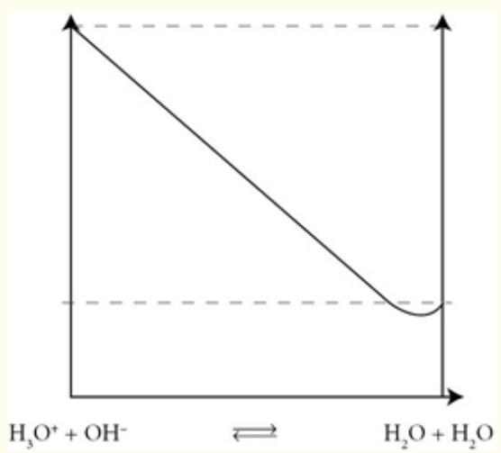This is why it is always necessary, when analyzing a reaction of an acid with a base (commonly called a “neutralization reaction”), to account first for this process of  $OH^{-}/H_{3}O^{+}$  “annihilation,” resulting in the formation of  $H_{2}O$ .Page 325</td></tr><tr><td>3. Theory of Acid-Base ReactionsThe theory of acid-base reactions evolved in steps. The original concept of Arrhenius that acids react in water to produce  $H^{+}$  and bases react in water to produce  $OH^{-}$ </td><td>The Brønsted-Lowry theory creates a symmetry between acid behavior and base behavior by identifying the proton as the species exchanged in any acid-</td></tr></table>

evolved to the Brønsted-Lowry formulation that designated acids as proton donors and bases as proton acceptors. G. N. Lewis generalized the picture of acid-base reactions by designating the acid as an electron pair acceptor and a base as the electron pair donor. All three views of acid-base reactions are used today. We will develop the Lewis theory later in the text.

:::{figure} ../images/fig-p1-ch06-74.jpg
:name: fig-p1-ch06-74
:alt: Figure from the University Chemistry source textbook
:::

## 4. Equilibrium and Free Energy in Acidic Solutions

If we represent an acid in a generalized nomenclature as HA, the addition of that acid to water results in the equilibrium reaction

```{math}
:label: eq-p1-ch06-154
\mathrm{HA} (\mathrm{aq}) + \mathrm{H} _ {2} \mathrm{O} (\mathrm{l}) \rightleftharpoons \mathrm{A} ^ {-} (\mathrm{aq}) + \mathrm{H} _ {3} \mathrm{O} ^ {+} (\mathrm{aq})
```


with the equilibrium constant, $K _ { \mathrm { e q } } ,$ given by the “acid dissociation constant”

```{math}
:label: eq-p1-ch06-155
K _ {a} = \frac {[ \mathrm{H} _ {3} \mathrm{O} ^ {+} ] [ \mathrm{A} ^ {-} ]}{[ \mathrm{HA} ]}
```


We can immediately identify the acid-conjugate base pair and the base-conjugate acid pair in terms of the Brønsted- Lowry formulation of an acid as a proton donor and a base as a proton acceptor:

base reaction. With this picture the acid (the proton donor) forms the conjugate base following the reaction. The proton acceptor is the base (in this case water) that becomes the conjugate acid after the reaction.

:::{figure} ../images/fig-p1-ch06-75.jpg
:name: fig-p1-ch06-75
:alt: Figure from the University Chemistry source textbook
:::

Pages 326-330

The Gibbs free energy diagram defines the equilibrium point between reactants and products—the minimum on the Gibbs free energy occurs where $\Delta G = 0$ . Also, the larger the difference in free energy, the greater the shift toward the right-hand side and the stronger the acid.

:::{figure} ../images/fig-p1-ch06-76.jpg
:name: fig-p1-ch06-76
:alt: Figure from the University Chemistry source textbook
:::

Pages 330-332

<table><tr><td>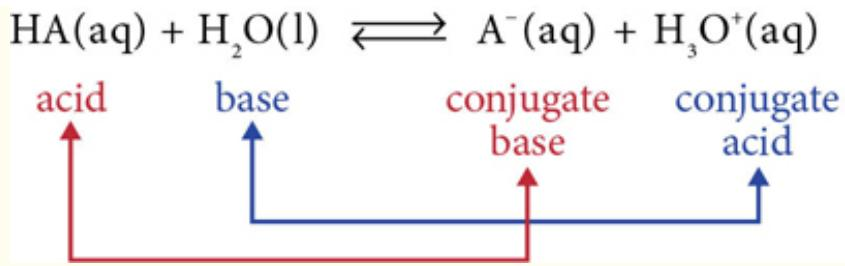The equilibrium represents the relative proportion amongst the acid, [HA]; its conjugate base, [A-]; the base, [H2O], which acts as a proton acceptor; and finally the conjugate acid [H3O+]. As we know from Chapter 5, the equilibrium is quantitatively governed by Ka, which we refer to as the acid dissociation constant or acid ionization constant. If Ka is large, the reaction comes to equilibrium far to the right, such that products A- and H3O+ dominate. This means that a large fraction of the HA has dissociated so that HA is largely ionized in solution, which earns it the designation “strong acid.”</td><td></td></tr><tr><td>5. Solutions that are Basic: Manipulation of pOH and pKaIn the aqueous solution of a base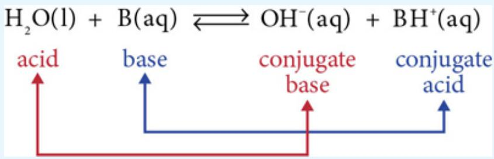H2O assumes the role of an acid because it donates (loses!) a proton to the base, B(aq), to form the conjugate base OH-. The equilibrium constant for this process is termed the base dissociation constant or base ionization constant, Kb, and, as for all equilibrium constants is writtenKb = [BH+][OH-]/[B(aq)]But the treatment of basic systems follows the same</td><td>The autoionization of water establishes an equilibrium H2O + H2O ⇌ H3O+ + OH- such that the product of [H3O+] and [OH-] is fixed at 10-14 and thus an equilibrium constant of 1 × 10-14, the autoionization constant for water. If we add an acid to water, [H3O+] can become very large, 0.1 M in this case, but the product [H3O+][OH-] = 10-14 still holds such that [OH-] = 10-13 M. Similarly, if a base is added, [OH-] can become very large (in this case 0.1 M) and thus [H3O+] = 10-13 M in order to keep [H3O+][OH-] = 10-14.</td></tr></table>

governing protocol as that for acids. Let's review them. Water can both donate and accept protons, but in an aqueous solution the product of the hydronium ion, $\mathrm { H } _ { 3 } \mathrm { O } ^ { + }$ and the hydroxide ion, $\mathrm { O H ^ { - } }$ is invariant under any condition imposed by the addition of an acid or a base to the solution $[ \mathrm { H } _ { 3 } \mathrm { O } ^ { + } ] [ \mathrm { O H } ^ { - } ] = \bf { 1 } \times \bf { 1 0 } ^ { - 1 4 } = \it { K } _ { \mathrm { w } }$ which is, as we noted above, referred to as the autoionization constant for water, $K _ { \mathrm { w } } .$ Thus the details of how a particular combination of acids or bases is added to a solution is irrelevant to the calculation of the $[ \mathrm { H } _ { 3 } \mathrm { O } ^ { + } ] [ \mathrm { O H } ^ { - } ]$ product: it rules, and it is always $\mathbf { 1 } \times \mathbf { 1 0 } ^ { - 1 4 }$ at $2 5 ^ { \circ } \mathrm { C } .$ We diagram this condition in the figure at right to emphasize the point.

## 6. Reactions of a Strong Acid with a Strong Base Given that a strong acid (such as HCl, $\mathrm { H } _ { 2 } \mathrm { S O } _ { 4 } , \mathrm { H N O } _ { 3 } )$ dissociates completely when added to water:

```{math}
:label: eq-p1-ch06-156
\mathrm{HCl} + \mathrm{H} _ {2} \mathrm{O} \rightarrow \mathrm{H} _ {3} \mathrm{O} ^ {+} + \mathrm{Cl} ^ {-}
```


and that a strong base (KOH, NaOH) reacts completely to form $\mathrm { O H ^ { - } }$ when added to water:

```{math}
:label: eq-p1-ch06-157
\mathrm{KOH} \xrightarrow {\mathrm{H} _ {2} \mathrm{O}} \mathrm{OH} ^ {-} + \mathrm{K} ^ {+}
```


the neutralization of a strong acid and a strong base is remarkably simple. It is a problem of simple counting (stoichiometry). But the way the reaction is envisioned is important for dealing with more complicated systems. Thus we pursue it graphically in some depth. Suppose we add equal amounts of HCl and KOH, each in its own beaker, to a beaker containing pure water. The beaker of HCl will contain a molar concentration of $\mathrm { H } _ { 3 } \mathrm { O } ^ { + }$ $\mathrm { [ H _ { 3 } O ^ { + } ] }$ , equal to the molar concentration of Cl<sup>−</sup>, [Cl<sup>-</sup>]. The KOH beaker will contain a molar concentration of OH<sup>-</sup>, [OH<sup>-</sup>], equal to that of $\mathrm { K } ^ { + } , [ \mathrm { K } ^ { + } ]$

:::{figure} ../images/fig-p1-ch06-79.jpg
:name: fig-p1-ch06-79
:alt: Figure from the University Chemistry source textbook
:::

Pages 333-334

## Addition of Strong Acid to Strong Base

:::{figure} ../images/fig-p1-ch06-80.jpg
:name: fig-p1-ch06-80
:alt: Figure from the University Chemistry source textbook
:::

It doesn't matter if we have added 3 molecules of HCl and 3 molecules of KOH or 3 moles of each.

:::{figure} ../images/fig-p1-ch06-81.jpg
:name: fig-p1-ch06-81
:alt: Figure from the University Chemistry source textbook
:::

## after addition but before reaction

:::{figure} ../images/fig-p1-ch06-82.jpg
:name: fig-p1-ch06-82
:alt: Figure from the University Chemistry source textbook
:::

after reaction

<table><tr><td></td><td>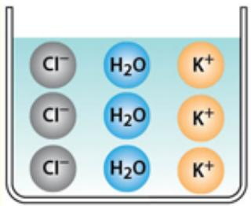Pages 335-337</td></tr><tr><td>7. Reaction of a Strong Base with a Weak AcidThe behavior that distinguishes this combination (strong base to weak acid) from the strong base-strong acid combination is that we must recognize that the weak acid component requires an analysis of the equilibrium behavior of the weak acid with its conjugate base as depicted inFigure 6.19. Let&#x27;s consider the weak acid, acetic acid,  $CH_3COOH(aq) + H_2O(l) \rightleftharpoons CH_3COO^-(aq) + H_3O^+$  $K_a = 1.76 \times 10^{-5}$ Addition of a strong base introduces  $OH^-$ , for example, by adding NaOH because the base splits water to form  $OH^-$  $NaOH \xrightarrow{H_2O} Na^+ + OH^-$ The key point to recognize is that the  $H_3O^+$  from the dissociation of  $CH_3COOH$  will react with the  $OH^-$  $H_3O^+(aq) + OH^-(aq) \rightleftharpoons 2H_2O(l)$  $K = 1/K_w = 1 \times 10^{14}$ Adding yields the net overall reaction: $CH_3COOH(aq) + OH^- \rightleftharpoons CH_3COO^- + H_2O$ with  $K_{eq} = K_a(1/K_w)$ which, as Le Chatelier would tell us, shifts the equilibrium to the right, and strongly to the right because  $1/K_w = 1 \times 10^{14}$ , and  $K_a \sim 10^{-5}$  yields  $K_{eq} \approx 10^9$ .We can calculate this new equilibrium constant immediately: $K = K_a \frac{1}{K_w} = \frac{[CH_3COO^-]}{[CH_3COOH(aq)][OH^-]} = \frac{1.76 \times 10^{-5}}{1 \times 10^{-14}} = 1.8 \times 10^9$ </td><td>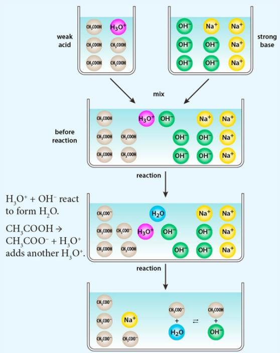Pages 338-343</td></tr><tr><td>8. Buffer Solutions: The Henderson-Hasselbalch</td><td>For the case of a buffered solution we</td></tr></table>

## Equation

While it is very important to recognize what is occurring in the acid-base solution at the molecular level and to recognize qualitatively what is occurring, it is also important to assess the situation quantitatively. To do this, we simply return to our equilibrium treatment. The equilibrium expression for acid dissociation $\mathrm { H A } + \mathrm { H } _ { 2 } \mathrm { O }  \mathrm { H } _ { 3 } \mathrm { O } ^ { + } + \mathrm { A } ^ { - }$

is, of course, simply

```{math}
:label: eq-p1-ch06-158
K _ {\mathrm{a}} = \frac {[ \mathrm{H} _ {3} \mathrm{O} ^ {+} ] [ \mathrm{A} ^ {-} ]}{[ \mathrm{HA} ]}
```


Taking -log of both sides yields

```{math}
:label: eq-p1-ch06-159
- \log K _ {\mathrm{a}} = - \log [ \mathrm{H} _ {3} \mathrm{O} ^ {+} ] - \log \frac {[ \mathrm{A} ^ {-} ]}{[ \mathrm{HA} ]}
```


or

```{math}
:label: eq-p1-ch06-160
\mathrm{p} K _ {\mathrm{a}} = \mathrm{pH} - \log \frac {[ \mathrm{A} ^ {-} ]}{[ \mathrm{HA} ]}
```


```{math}
:label: eq-p1-ch06-161
\mathrm{pH} = \mathrm{pK} _ {\mathrm{a}} + \log \frac {[ \mathrm{A} ^ {-} ]}{[ \mathrm{HA} ]}
```


This is a very versatile equation. It is called the Henderson- Hasselbalch Equation. The equation provides the opportunity to “design” the pH of a buffered solution by selecting the acid equilibrium constant, $K _ { \mathrm { a } } .$ , and then creating the solution from that acid and the salt of the conjugate base.

## 9. Titration Reactions

The concept of titration helps to tie together the pH “landscape” shaped by shifting equilibria created by the interplay of $\mathrm { H } _ { 3 } \mathrm { O } ^ { + }$ , OH<sup>-</sup>, weak acids, strong acids, weak bases, and strong bases. What is important for a useful have a reservoir of the weak acid and its conjugate base. When an acid is added, the $\mathrm { H } _ { 3 } \mathrm { O } ^ { + }$ reacts with the conjugate base to form water and the weak acid. The pH of the solution is essentially unchanged.

:::{figure} ../images/fig-p1-ch06-85.jpg
:name: fig-p1-ch06-85
:alt: Figure from the University Chemistry source textbook
:::

Pages 344-347

The titration curve for a strong base added to a strong acid. The pH of the solution begins, before addition of the base, at the pH of the strong acid. As base is added to the solution, the OH<sup>−</sup> (a.k.a. lasting) understanding of acid-base interplay is to develop an intuition for how acid-base reactions control these pH landscapes. The basic execution of a titration involves the sequential addition of small incremental amounts of an acid to a basic solution, or incremental amounts of a base to an acidic solution. Typically, the pH of the solution is not known, but the pH of the incrementally added solution is—resulting in a determination of the pH of the unknown solution. The “titration curve” is simply a plot of pH on the vertical axis—determined by a pH meter or by pH indicators—against volume of the acid or base added to the mixture on the horizontal axis.

from the base reacts in a neutralization reaction to form $\mathrm { H } _ { 2 } \mathrm { O }$ When an amount of OH<sup>−</sup> added is equal to the $\mathrm { [ H _ { 3 } O ^ { + } ] }$ originally present, we reach the equivalence point where an equal amount of [OH<sup>−</sup>] and $\mathrm { [ H _ { 3 } O ^ { + } ] }$ are present such that with $[ \mathrm { O H ^ { - } } ] [ \mathrm { H } _ { 3 } \mathrm { O } ^ { + } ]$ $= { 1 0 } ^ { - 1 4 }$ , we have $[ \mathrm { O H ^ { - } } ] = 1 0 ^ { - 7 }$ and $\mathrm { { [ H _ { 3 } O ^ { + } ] = 1 0 ^ { - 7 } } }$ . For each additional OH<sup>−</sup> added, the pH increases accordingly.

:::{figure} ../images/fig-p1-ch06-86.jpg
:name: fig-p1-ch06-86
:alt: Figure from the University Chemistry source textbook
:::

Pages 347-352

## BUILDING A GLOBAL ENERGY PERSPECTIVE

## CASE STUDY 6.1 Acid Base Reactions, Carbonic Acid Chemistry of the Ocean, and the Control of Climate

## Introduction

A watery Sahara? We may not normally hold oceans and deserts in the same light, yet the scarcity of nutrients in the open ocean has inspired numerous comparisons to the bleak inhospitableness of deserts. What infrequent and often ephemeral centers of nourishment exist, such as algal blooms, strongly dictate the distribution of marine creatures. This harsh reality makes the existence of stationary and persistent coral reefs all the more remarkable. Making up a mere 0.1% of the oceans’ surface area, coral reefs support nearly a quarter of all known marine species that are closely linked through trophic interdependence.

As of late, much attention has been given to the future of coral reefs in the face of ocean acidifcation, and rightfully so. As we will shortly discuss, yet another side effect of anthropogenically driven carbon dioxide build up in the atmosphere is the increased dissolution of $\mathrm { C O } _ { 2 }$ into the oceans, and the subsequent formation of carbonic acid. Changing the atmospheric partial pressure of $\mathrm { C O } _ { 2 }$ places stress on a system that has long been in equilibrium—an equilibrium that has been up until now, conducive to the formation of calcium carbonate.

Through this discussion of carbonate equilibria we will try to gain a better understanding of the threat to marine ecosystems posed by increasing atmospheric $\mathrm { C O } _ { 2 } ,$ as well as a whole host of phenomena that are influenced if not controlled by carbonate equilibria including rain and ocean pH, the ability of the ocean to draw down atmospheric $\mathrm { C O } _ { 2 } ,$ and climate control through silicate weathering. Let us begin.

:::{figure} ../images/fig-p1-ch06-87.jpg
:name: fig-p1-ch06-87
:alt: FIGURE CS6.1A Each of these pictures has been taken from different parts of the Great Barrier Reef, and shows the projected progression of ecosystem destruction due to ocean acidification (O. Hoegh, et al., Science 318, no. 1737 [2007]).
FIGURE CS6.1A Each of these pictures has been taken from different parts of the Great Barrier Reef, and shows the projected progression of ecosystem destruction due to ocean acidification (O. Hoegh, et al., Science 318, no. 1737 [2007]).
:::


## In the Lab

If we place a beaker of deionized water on a bench top and let it sit out in the open for an hour, it will equilibrate with the atmosphere. But what does that mean? Let's take $\mathrm { N } _ { 2 } ( \mathrm { g } )$ as an example. Gaseous $\mathbf { N } _ { 2 }$ will begin to dissolve into the water, becoming aqueous $\mathbf { N } _ { 2 }$

```{math}
:label: eq-p1-ch06-162
\mathrm{N} _ {2} (\mathrm{g}) \rightarrow \mathrm{N} _ {2} (\mathrm{aq})
```


$\mathrm { N } _ { 2 } ( \mathrm { g } )$ will continue to dissolve into the beaker of water until it has reached its capacity to dissolve $\mathrm { N } _ { 2 } ( \mathrm { g } )$ , in which case $\mathrm { N } _ { 2 } ( \mathrm { g } )$ will come back out of solution, and return to the air as the equilibrium is established.

```{math}
:label: eq-p1-ch06-163
\mathrm{N} _ {2} (\mathrm{g}) \leftarrow \mathrm{N} _ {2} (\mathrm{aq})
```


Eventually the rate of dissolution will equal the rate of the gas leaving the water, in which case we say the beaker is in equilibrium.

```{math}
:label: eq-p1-ch06-164
\mathrm{N} _ {2} (\mathrm{g}) \rightleftarrows \mathrm{N} _ {2} (\mathrm{aq})
```


The concentration of $\mathrm { N } _ { 2 } ( \mathrm { a q } )$ at equilibrium is given to us using Henry's law,

```{math}
:label: eq-p1-ch06-165
[ \mathrm{N} _ {2} (\mathrm{aq}) ] = \mathrm{P} _ {\mathrm{N} _ {2} (\mathrm{g})} / \mathrm{K} \mathfrak {D} _ {\mathrm{H} (\mathrm{N} _ {2})}
```


where $\mathrm { P _ { N _ { 2 } ( g ) } }$ is the partial pressure of $\mathrm { N _ { 2 } ( g ) }$ and $\mathrm { K } \mathsf { E } _ { \mathrm { H ( N _ { 2 } ) } }$ is the Henry's law constant for the process. We can do the same for $\mathrm { C O } _ { 2 }$

```{math}
:label: eq-p1-ch06-166
\left[ \mathrm{CO} _ {2} (\mathrm{aq}) \right] = \mathrm{P} _ {\mathrm{CO} _ {2} (\mathrm{g})} / \mathrm{KD} _ {\mathrm{H} \left(\mathrm{CO} _ {2}\right)}
```


However, the solvation of $\mathrm { C O } _ { 2 }$ is quickly followed by the chemical reaction of $\mathrm { C O } _ { 2 }$ with $\mathrm { H } _ { 2 } \mathrm { O }$ to form carbonic acid.

```{math}
:label: eq-p1-ch06-167
\mathrm{CO} _ {2} (\mathrm{aq}) + \mathrm{H} _ {2} \mathrm{O} \rightleftharpoons \mathrm{H} _ {2} \mathrm{CO} _ {3} (\mathrm{aq})
```


Which is governed by its own equilibrium constant, $\mathrm { K _ { s } }$

```{math}
:label: eq-p1-ch06-168
\mathrm{K} _ {\mathrm{s}} = \frac {\left[ \mathrm{H} _ {2} \mathrm{CO} _ {3} (\mathrm{aq}) \right]}{\left[ \mathrm{CO} _ {2} (\mathrm{aq}) \right] \left[ \mathrm{H} _ {2} \mathrm{O} \right]} = \frac {\left[ \mathrm{H} _ {2} \mathrm{CO} _ {3} (\mathrm{aq}) \right]}{\left[ \mathrm{CO} _ {2} (\mathrm{aq}) \right]}
```


where we assume that the solution is dilute enough that the concentration of water is near unity $\mathrm { ( [ H _ { 2 } O ] = \mathbf { 1 } ) }$

As noted in the opening of this chapter, the carbon chemistry of the ocean is initiated by the equilibrium reaction between $\mathrm { C O } _ { 2 } ( \mathrm { g } )$ in the atmosphere and $\mathrm { C O } _ { 2 } ( \mathrm { a q } )$ in the ocean. The Gibbs free energy surface for this reaction is displayed in Figure CS6.1b.

:::{figure} ../images/fig-p1-ch06-88.jpg
:name: fig-p1-ch06-88
:alt: FIGURE CS6.1B The Gibbs free energy diagram for the equilibrium between mathematical notation on the left and mathematical notation on the right. The equilibrium point corresponds to the mathematical notation point on the horizontal axis
FIGURE CS6.1B The Gibbs free energy diagram for the equilibrium between $\mathsf { C O } _ { 2 } ( g )$ on the left and ${ \mathsf { C O } } _ { 2 } ( a q )$ on the right. The equilibrium point corresponds to the $\Delta G = 0$ point on the horizontal axis
:::


In many discussions of the carbon chemistry of the oceans, the dissolution of $\mathrm { C O } _ { 2 }$ and the formation of carbonic acid are combined into a single equilibrium constant, which we will do now.

```{math}
:label: eq-p1-ch06-169
\begin{array}{r l} & {\mathrm {K_ {H}} = \frac {\mathrm {K_ {H(CO_ {2})} ^ {\prime}}}{\mathrm {K_ {s}}} = \frac {\frac {\mathrm {P_ {CO_ {2} (g)}}}{[ \mathrm {CO_ {2} (aq)} ]}}{\frac {[ \mathrm {H_ {2} CO_ {3}} ]}{[ \mathrm {CO_ {2} (aq)} ]}} = \frac {\mathrm {P_ {CO_ {2} (g)}}}{[ \mathrm {H_ {2} CO_ {3}} ]}} \\ & {\mathrm {K_ {H}} = 2 9. 4 1 \frac {\mathrm{atm}}{\mathrm{mol/L}}} \end{array}
```


The equilibrium constant, $\mathrm { K } _ { \mathrm { H } } .$ , is known as the Henry's law constant, and represents the observed fact that the concentration of carbonic acid is linearly proportional to the partial pressure of $\mathrm { C O } _ { 2 }$ over the liquid phase.

Carbonic acid is diprotic, therefore it has two protons that it can donate, and each one has its own equilibrium constant. For the first deprotonation we can write:

```{math}
:label: eq-p1-ch06-170
\begin{array}{r l}&\mathrm {H_ {2} CO_ {3}} \rightleftharpoons \mathrm {H^ {+}} + \mathrm {HC O _ {3} ^ {-}}\\&\mathrm {K_ {1}} = \frac {[ \mathrm {H^ {+}} ] [ \mathrm {HC O _ {3} ^ {-}} ]}{[ \mathrm {H_ {2} CO_ {3}} ]} = 4. 5 \times 1 0 ^ {- 7} \mathrm{mol/L}\end{array}
```


The result is the formation of a hydrogen ion and the bicarbonate ion ( $\mathrm { H C O } _ { 3 } ^ { - } \mathrm { \bar { ) } }$ . Likewise for the second deprotonation.

```{math}
:label: eq-p1-ch06-171
\begin{array}{r l}&\mathrm {HCO_ {3} ^ {-}} \rightleftharpoons \mathrm {H^ {+}} + \mathrm {CO_ {3} ^ {2 - }}\\&\mathrm {K_ {2}} = \frac {[ \mathrm {H^ {+}} ] [ \mathrm {CO_ {3} ^ {2 - }} ]}{[ \mathrm {HCO_ {3} ^ {-}} ]} = 4. 7 \times 1 0 ^ {- 1 1} \mathrm{mol/L}\end{array}
```


Which yields another proton and the carbonate ion $( ^ { \mathrm { C O } _ { 3 } ^ { 2 - } } )$

:::{figure} ../images/fig-p1-ch06-89.jpg
:name: fig-p1-ch06-89
:alt: FIGURE CS6.1C Compared to nitrogen dioxide gas, the equilibration between carbon dioxide in the gas phase and carbon dioxide in solution is made more complex by the formation of carbonic acid.
FIGURE CS6.1C Compared to nitrogen dioxide gas, the equilibration between carbon dioxide in the gas phase and carbon dioxide in solution is made more complex by the formation of carbonic acid.
:::


To visualize the relationship between the abundance of carbonic acid, the bicarbonate ion, and the carbonate ion, and pH (Remember: pH = −log([H<sup>+</sup>])), it is useful to define a value we will call dissolved inorganic carbon (DIC), which is just the sum of carbonate species:

```{math}
:label: eq-p1-ch06-172
[ \mathrm{DIC} ] = [ \mathrm{H} _ {2} \mathrm{CO} _ {3} ] + [ \mathrm{HCO} _ {3} ^ {-} ] + [ \mathrm{CO} _ {3} ^ {2 -} ]
```


With some clever substitutions, we can express the ratio of the mole fraction of each of the carbonate species in terms of equilibrium constants and [H<sup>+</sup>]:

```{math}
:label: eq-p1-ch06-173
\frac {[ \mathrm{H} _ {2} \mathrm{CO} _ {3} ]}{[ \mathrm{DIC} ]} = \frac {1}{1 + \frac {\mathrm{K} _ {1}}{[ \mathrm{H} ^ {+} ]} + \frac {\mathrm{K} _ {1} \mathrm{K} _ {2}}{[ \mathrm{H} ^ {+} ] ^ {2}}}
```


```{math}
:label: eq-p1-ch06-174
\frac {[ \mathrm{HCO} _ {3} ^ {- 1} ]}{[ \mathrm{DIC} ]} = \frac {1}{1 + \frac {[ \mathrm{H} ^ {+} ]}{\mathrm{K} _ {1}} + \frac {\mathrm{K} _ {2}}{[ \mathrm{H} ^ {+} ]}}
```


```{math}
:label: eq-p1-ch06-175
\frac {[ \mathrm{CO} _ {3} ^ {2 -} ]}{[ \mathrm{DIC} ]} = \frac {1}{1 + \frac {[ \mathrm{H} ^ {+} ]}{\mathrm{K} _ {2}} + \frac {[ \mathrm{H} ^ {+} ] ^ {2}}{\mathrm{K} _ {1} \mathrm{K} _ {2}}}
```


:::{figure} ../images/fig-p1-ch06-90.jpg
:name: fig-p1-ch06-90
:alt: FIGURE CS6.1D This figure shows the relative abundance of carbonic acid, bicarbonate ion, and carbonate ion as pH changes. As we will see later, we can also control pH if we can control the abundance of the different ions. Take note of wher
FIGURE CS6.1D This figure shows the relative abundance of carbonic acid, bicarbonate ion, and carbonate ion as pH changes. As we will see later, we can also control pH if we can control the abundance of the different ions. Take note of where the system switches between carbonic acid dominated to bicarbonate dominated, and bicarbonate dominated to carbonate dominated. These transitions occur at $- \mathrm { l o g } ( \mathsf { K } _ { \mathsf { e q } } )$
:::


The plot of mole fraction verses pH is a valuable one to remember. It not only shows the relationship between the abundance of different carbonate species as a function of pH, but also how the pH of a solution can be controlled by controlling the abundance of the different ions. We will return to this when we discuss controls on ocean pH. Before we do that, we should consider the pH of the water that comes from the sky…

## Rainwater pH

Since rain precipitates from the atmosphere, it is fair to assume that the water droplets that form are in chemical equilibrium with the atmosphere. Assuming there are no other abundant chemical species that would affect pH, we should be able to calculate the pH of rainwater if we know $\mathrm { P _ { C O _ { 2 } } }$

We now have $4$ equilibrium equations and 5 unknowns if we consider all of the possible dissolved chemical species $\mathrm { ( [ H _ { 2 } C O _ { 3 } ] }$ $[ \mathrm { H C O _ { 3 } ^ { - } } ] _ { , } [ \mathrm { C O _ { 3 } ^ { 2 - } } ]$ $\textstyle \left[ \mathrm { H } ^ { + } \right]$ and [OH<sup>−</sup>]). Since we don't usually know [DIC] a priori, we need one more equation before we can calculate pH of rain water. Since the overall system must be charge neutral, we can write the charge balance equation.

```{math}
:label: eq-p1-ch06-176
\left[ \mathrm{H} ^ {+} \right] = \left[ \mathrm{OH} ^ {-} \right] + \left[ \mathrm{HCO} _ {3} ^ {-} \right] + 2 \left[ \mathrm{CO} _ {3} ^ {2 -} \right]
```


If we use the equilibrium expressions in addition to the equilibrium expression for the self ionization of water,

```{math}
:label: eq-p1-ch06-177
\mathrm{K} _ {w} = [ \mathrm{H} ^ {+} ] [ \mathrm{OH} ^ {-} ] = 1 0 ^ {- 1 4} \mathrm{mol/L}
```


we can rewrite the charge balance equation solely in terms of $\mathrm { P _ { C O _ { 2 } , [ H ^ { + } ] } }$ and equilibrium constants.

```{math}
:label: eq-p1-ch06-178
[ \mathrm{H} ^ {+} ] = \frac {\mathrm{K} _ {w}}{[ \mathrm{H} ^ {+} ]} + \frac {\mathrm{K} _ {1} \mathrm{P} _ {\mathrm{CO} _ {2}}}{\mathrm{K} _ {\mathrm{H}} [ \mathrm{H} ^ {+} ]} + \frac {2 \mathrm{K} _ {1} \mathrm{K} _ {2} \mathrm{P} _ {\mathrm{CO} _ {2}}}{\mathrm{K} _ {\mathrm{H}} [ \mathrm{H} ^ {+} ] ^ {2}}
```


A simple rearrangement of terms yields a polynomial, the roots of which would be $\textstyle \left[ \mathrm { H } ^ { + } \right]$

```{math}
:label: eq-p1-ch06-179
[ \mathrm{H} ^ {+} ] ^ {3} = \mathrm{K} _ {w} [ \mathrm{H} ^ {+} ] + \frac {\mathrm{K} _ {1} \mathrm{P} _ {\mathrm{CO} _ {2}}}{\mathrm{K} _ {\mathrm{H}}} [ \mathrm{H} ^ {+} ] + \frac {2 \mathrm{K} _ {1} \mathrm{K} _ {2} \mathrm{P} _ {\mathrm{CO} _ {2}}}{\mathrm{K} _ {\mathrm{H}}}
```


If we were feeling lazy, yet enterprising, we would find our favorite polynomial root finder to solve for [H<sup>+</sup>]. However, in this case we can be clever by using an approximation. Let us start with a couple of justifiable assumptions. Since this is a carbonic acid solution, it is probably reasonable to assume that the concentration of [OH<sup>−</sup>] is small enough to be ignored. Likewise, we know from the measured values of $\mathrm { K } _ { 1 }$ and $\mathrm { K } _ { 2 }$ that $\left[ \mathrm { H C O } _ { 3 } ^ { - } \right]$ must be much larger than $\left[ \mathrm { C O } _ { 3 } ^ { 2 - } \right]$ This simplifies our charge balance equation nicely, and we are left with

```{math}
:label: eq-p1-ch06-180
[ \mathrm{H} ^ {+} ] = \frac {\mathrm{K} _ {1} \mathrm{P} _ {\mathrm{CO} _ {2}}}{\mathrm{K} _ {\mathrm{H}} [ \mathrm{H} ^ {+} ]}
```


which simply is rearranged to yield

```{math}
:label: eq-p1-ch06-181
\left[ \mathrm{H} ^ {+} \right] = \sqrt {\frac {\mathrm{K} _ {1} \mathrm{P} _ {\mathrm{CO} _ {2}}}{\mathrm{K} _ {\mathrm{H}}}}
```


In problem 1 we will calculate the pH of rainwater.

## Ocean pH

In the ocean there is an additional equilibrium process that we must concern ourselves with, and that is the equilibrium between calcium carbonate and its ions. Let's write the equilibrium expression, and the equilibrium rate constant called the solubility product.

```{math}
:label: eq-p1-ch06-182
\mathrm{CaCO} _ {3} \rightleftharpoons [ \mathrm{Ca} ^ {2 +} ] + [ \mathrm{CO} _ {3} ^ {2 -} ]
```


```{math}
:label: eq-p1-ch06-183
\mathrm{K} = \left[ \mathrm{Ca} ^ {2 +} \right] \left[ \mathrm{CO} _ {3} ^ {2 -} \right] = 4. 3 \times 1 0 ^ {- 7} \mathrm{mol} ^ {2} / \mathrm{L} ^ {2}
```


Calcium carbonate is an important constituent in the shells and skeletons of marine organism, like our coral reefs, and the limestone basin walls and floor that these creatures eventually form. This introduces an additional cation which we must take into consideration in the charge balance equation:

```{math}
:label: eq-p1-ch06-184
\left[ \mathrm{H} ^ {+} \right] + 2 \left[ \mathrm{Ca} ^ {2 +} \right] = \left[ \mathrm{OH} ^ {-} \right] + \left[ \mathrm{HCO} _ {3} ^ {-} \right] + 2 \left[ \mathrm{CO} _ {3} ^ {2 -} \right]
```


In the ocean, the presence of these additional ions will actually shift the carbonic acid equilibrium. Consequently, because dissolved ions in seawater affect carbonate equilibrium, we need to use different equilibrium constants for seawater and bicarbonate, which are

```{math}
:label: eq-p1-ch06-185
\mathrm{K} _ {1} = \frac {[ \mathrm{H} ^ {+} ] [ \mathrm{HCO} _ {3} ^ {-} ]}{[ \mathrm{H} _ {2} \mathrm{CO} _ {3} ]} = 9. 0 \times 1 0 ^ {- 7} \mathrm{mol/L}
```


```{math}
:label: eq-p1-ch06-186
\mathrm{K} _ {2} = \frac {[ \mathrm{H} ^ {+} ] [ \mathrm{CO} _ {3} ^ {2 -} ]}{[ \mathrm{HCO} _ {3} ^ {-} ]} = 7. 0 \times 1 0 ^ {- 1 0} \mathrm{mol/L}
```


Again we can substitute the equilibrium expressions into the charge balance equations to yield an expression for $\textstyle \left[ \mathrm { H } ^ { + } \right]$ in terms of equilibrium constants and $\mathrm { P _ { C O _ { 2 } } }$

```{math}
:label: eq-p1-ch06-187
\left[ \mathrm{H} ^ {+} \right] + \frac {2 \mathrm{K} _ {\mathrm{sp}} \mathrm{K} _ {\mathrm{H}} \left[ \mathrm{H} ^ {+} \right] ^ {2}}{\mathrm{K} _ {1} \mathrm{K} _ {2} \mathrm{P} _ {\mathrm{CO} _ {2}}} = \frac {\mathrm{K} _ {w}}{\left[ \mathrm{H} ^ {+} \right]} + \frac {\mathrm{K} _ {1} \mathrm{P} _ {\mathrm{CO} _ {2}}}{\mathrm{K} _ {\mathrm{H}} \left[ \mathrm{H} ^ {+} \right]} + \frac {2 \mathrm{K} _ {1} \mathrm{K} _ {2} \mathrm{P} _ {\mathrm{CO} _ {2}}}{\mathrm{K} _ {\mathrm{H}} \left[ \mathrm{H} ^ {+} \right] ^ {2}}
```


We could rearrange this expression to yield a fourth order polynomial in $\textstyle \left[ \mathrm { H } ^ { + } \right]$ or we could be clever again and make our job easier with some educated assumptions. If we make the same assumptions as before about the relative abundances of the different anions, and assume that $\left[ \mathrm { C a ^ { 2 + } } \right]$ is much greater than $\textstyle \left[ \mathrm { H } ^ { + } \right]$ , then our charge balance equation simplifies to

```{math}
:label: eq-p1-ch06-188
\frac {2 \mathrm{K} _ {\mathrm{sp}} \mathrm{K} _ {\mathrm{H}} [ \mathrm{H} ^ {+} ] ^ {2}}{\mathrm{K} _ {1} \mathrm{K} _ {2} \mathrm{P} _ {\mathrm{CO} _ {2}}} = \frac {\mathrm{K} _ {1} \mathrm{P} _ {\mathrm{CO} _ {2}}}{\mathrm{K} _ {\mathrm{H}} [ \mathrm{H} ^ {+} ]}
```


This is handily rearranged to get

```{math}
:label: eq-p1-ch06-189
\left[ \mathrm{H} ^ {+} \right] = \sqrt [ 3 ]{\frac {\mathrm{K} _ {1} ^ {2} \mathrm{K} _ {2} \mathrm{P} _ {\mathrm{CO} _ {2}} ^ {2}}{2 \mathrm{K} _ {\mathrm{H}} ^ {2} \mathrm{K} _ {\mathrm{sp}}}}
```


In problem 2 we will calculate the pH of the oceans.

## Ocean Acidification

Projections of future carbon emissions put atmospheric $\mathrm { C O } _ { 2 }$ concentrations of 950 ppm well within possibility by the end of this century. What will this do to the average ocean pH? How much $\mathrm { C a C O _ { 3 } }$ would dissolve in the process? To address these questions, let's begin by calculating the ocean pH with $\mathrm { P _ { C O _ { 2 } } } = 9 5 0$ ppm using the same expression we did before:

```{math}
:label: eq-p1-ch06-190
\left[ \mathrm{H} ^ {+} \right] = \sqrt [ 3 ]{\frac {\mathrm{K} _ {1} ^ {2} \mathrm{K} _ {2} \mathrm{P} _ {\mathrm{CO} _ {2}} ^ {2}}{2 \mathrm{K} _ {\mathrm{H}} ^ {2} \mathrm{K} _ {\mathrm{sp}}}}
```


```{math}
:label: eq-p1-ch06-191
\left[ \mathrm{H} ^ {+} \right] = \sqrt [ 3 ]{\frac {(9 \times 1 0 ^ {- 7} \mathrm{mol} / \mathrm{L}) ^ {2} (7 \times 1 0 ^ {- 1 0} \mathrm{mol} / \mathrm{L}) (9 5 0 \times 1 0 ^ {- 6} \mathrm{atm}) ^ {2}}{2 \left(2 9 . 4 1 \frac {\mathrm{atm}}{\mathrm{mol} / \mathrm{L}}\right) ^ {2} (4 . 3 \times 1 0 ^ {- 7} \mathrm{mol} ^ {2} / \mathrm{L} ^ {2})}}
```


```{math}
:label: eq-p1-ch06-192
[ \mathrm{H} ^ {+} ] = 8. 8 \times 1 0 ^ {- 9} \mathrm{mol/L}.
```


This yields a pH of

```{math}
:label: eq-p1-ch06-193
\mathrm{pH} = - \log (8. 8 \times 1 0 ^ {- 9}) = 8. 0
```


This may not seem like much of a change, but remember that pH is on a logarithmic scale. Therefore this change is significant, and would have dramatic consequences for the life in the ocean that has adapted to a less acidic higher pH.

Based upon what we have learned from Le Chatelier, in addition to increased hydrogen ion concentration, we would expect there to be a large amount of calcium carbonate dissolution after increasing $\mathrm { P _ { C O _ { 2 } } }$ . To get a feel for how much calcium carbonate (in both the form of limestone and calcium carbonate in living creatures) would dissolve under these circumstances, let's calculate the amount of $\mathrm { C a ^ { 2 + } }$ at the present and after we have reached an atmospheric mixing ratio of 950 ppm $\mathrm { C O } _ { 2 }$ and assume that the difference was the result of calcium carbonate dissolution.

We can obtain the expression for the concentration of calcium ion from our charge balance equation from the ocean.

```{math}
:label: eq-p1-ch06-194
\left[ \mathrm{Ca} ^ {2 +} \right] = \frac {2 \mathrm{K} _ {\mathrm{sp}} \mathrm{K} _ {\mathrm{H}} \left[ \mathrm{H} ^ {+} \right] ^ {2}}{\mathrm{K} _ {1} \mathrm{K} _ {2} \mathrm{P} _ {\mathrm{CO} _ {2}}}
```


Using the current $\mathrm { P _ { C O _ { 2 } } }$ and the hydrogen ion concentration that we calculated for the modern ocean, we find

```{math}
:label: eq-p1-ch06-195
\left[ \mathrm{Ca} ^ {2 +} \right] = \frac {2 \left(4 . 3 \times 1 0 ^ {- 7} \mathrm{mol} ^ {2} / \mathrm{L} ^ {2}\right) \left(2 9 . 4 1 \frac {\mathrm{atm}}{\mathrm{mol} / \mathrm{L}}\right) \left(4 . 8 \times 1 0 ^ {- 9} \mathrm{mol} / \mathrm{L}\right) ^ {2}}{(9 \times 1 0 ^ {- 7} \mathrm{mol} / \mathrm{L}) (7 \times 1 0 ^ {- 1 0} \mathrm{mol} / \mathrm{L}) (3 8 8 \times 1 0 ^ {- 6} \mathrm{atm})}
```


```{math}
:label: eq-p1-ch06-196
[ \mathrm{Ca} ^ {2 +} ] = 2. 4 \times 1 0 ^ {- 3} \mathrm{mol/L}.
```


And after 950 ppm,

```{math}
:label: eq-p1-ch06-197
\left[ \mathrm{Ca} ^ {2 +} \right] = \frac {2 \left(4 . 3 \times 1 0 ^ {- 7} \mathrm{mol} ^ {2} / \mathrm{L} ^ {2}\right) \left(2 9 . 4 1 \frac {\mathrm{atm}}{\mathrm{mol} / \mathrm{L}}\right) \left(1 . 0 \times 1 0 ^ {- 8 . 0} \mathrm{mol} / \mathrm{L}\right) ^ {2}}{(9 \times 1 0 ^ {- 7} \mathrm{mol} / \mathrm{L}) (7 \times 1 0 ^ {- 1 0} \mathrm{mol} / \mathrm{L}) (9 5 0 \times 1 0 ^ {- 6} \mathrm{atm})}
```


```{math}
:label: eq-p1-ch06-198
[ \mathrm{Ca} ^ {2 +} ] = 3. 3 \times 1 0 ^ {- 3} \mathrm{mol/L}.
```


The difference is therefore

```{math}
:label: eq-p1-ch06-199
\begin{array}{r l} \Delta [ \mathrm{Ca} ^ {2 +} ] & = 3. 3 \times 1 0 ^ {- 3} \mathrm{mol/L} - 2. 4 \times 1 0 ^ {- 3} \mathrm{mol/L} \\ & = 0. 9 \times 1 0 ^ {- 3} \mathrm{mol/L}. \end{array}
```


:::{figure} ../images/fig-p1-ch06-91.jpg
:name: fig-p1-ch06-91
:alt: FIGURE CS6.1E This tiny creature is a foraminifer. Foraminifera are just a few of the ocean going creatures with shells made of calcium carbonate.
FIGURE CS6.1E This tiny creature is a foraminifer. Foraminifera are just a few of the ocean going creatures with shells made of calcium carbonate.
:::


If for the sake of simplicity we assume that the ocean volume remains constant throughout this process, about $\bf { 1 . 3 } \times \bf { 1 0 ^ { 2 1 } } \bf { L } ,$ we find that the actual mass of calcium carbonate that this would correspond to is quite large,

```{math}
:label: eq-p1-ch06-200
\begin{array}{l} \mathrm {mass_ {CaCO_ {3}}} = \frac {(1 \mathrm{mol} \mathrm {CaCO_ {3}})}{(1 \mathrm{mol} \mathrm {Ca^ {2 + }})} (9 \times 1 0 ^ {- 4} \mathrm{mol/L}) (1. 3 \times 1 0 ^ {2 1} \mathrm{L}) (1 0 0 \mathrm{g/mol}) \\ \mathrm {mass_ {CaCO_ {3}}} = 1. 2 \times 1 0 ^ {2 0} \mathrm{g} \mathrm {CaCO_ {3}} \end{array}
```


This number is obviously very large. And it does not bode well for the coral reefs we spoke of at the beginning of our discussion, nor the numerous marine animals that secrete calcium carbonate shell. Concern over marine ecosystems therefore is a founded concern for the future, and should not be ignored in our discourse over climate change.

## Silicate Weathering

A natural mechanism for the removal of $\mathrm { C O } _ { 2 }$ from the atmosphere and oceans that is not at the expense of dissolving calcium carbonate does exist. However, it does not act on the time scale needed to enter our discussions of anthropogenic climate change. Over tens of millions of years, the chemical weathering of silicate rock on the land occurs and the process is hastened by increased temperatures, water vapor, and $\mathrm { P _ { C O _ { 2 } } }$

```{math}
:label: eq-p1-ch06-201
\mathrm{CaSiO} _ {3} (\mathrm{s}) + 2 \mathrm{CO} _ {2} (\mathrm{aq}) + \mathrm{H} _ {2} \mathrm{O} \rightarrow \mathrm{Ca} ^ {2 +} (\mathrm{aq}) + 2 \mathrm{HCO} _ {2} ^ {- 1} (\mathrm{aq}) + \mathrm{SiO} _ {2} (\mathrm{aq})
```


where $\mathrm { C a S i O _ { 3 } ( s ) }$ represents a generic silicate rock. The runoff of dissolved minerals helps to replenish the store of $\mathrm { C a ^ { 2 + } }$ in the ocean, which increases the rate of calcium carbonate deposition.

```{math}
:label: eq-p1-ch06-202
\mathrm{Ca} ^ {2 +} (\mathrm{aq}) + 2 \mathrm{HCO} _ {2} ^ {- 1} (\mathrm{aq}) \rightarrow \mathrm{CaCO} _ {3} (\mathrm{s}) + \mathrm{CO} _ {2} (\mathrm{aq}) + \mathrm{H} _ {2} \mathrm{O}
```


The net result is the overall loss of carbon dioxide from the atmosphere due to the precipitation of calcium carbonate

```{math}
:label: eq-p1-ch06-203
\mathrm{CaSiO} _ {3} (\mathrm{s}) + \mathrm{CO} _ {2} (\mathrm{aq}) \rightarrow \mathrm{CaCO} _ {3} (\mathrm{s}) + \mathrm{SiO} _ {2} (\mathrm{aq})
```


as displayed schematically in Figure CS6.1f.

:::{figure} ../images/fig-p1-ch06-92.jpg
:name: fig-p1-ch06-92
:alt: FIGURE CS6.1F The weathering of silicate minerals results in the net draw-down of atmospheric mathematical notation
FIGURE CS6.1F The weathering of silicate minerals results in the net draw-down of atmospheric ${ \mathsf { C O } } _ { 2 }$
:::


Even though $\mathrm { C a C O _ { 3 } }$ plays an important role in maintaining the pH of the ocean, it is important to realize that the weathering of carbonate per se on land has no net effect on the sequestration of $\mathrm { C O } _ { 2 } ,$ as shown in Figure CS6.1g.

:::{figure} ../images/fig-p1-ch06-93.jpg
:name: fig-p1-ch06-93
:alt: FIGURE CS6.1G The weathering of carbonate minerals has no net effect on the draw-down of atmospheric mathematical notation
FIGURE CS6.1G The weathering of carbonate minerals has no net effect on the draw-down of atmospheric ${ \mathsf { C O } } _ { 2 }$
:::


Removal of $\mathrm { C O } _ { 2 }$ from the atmosphere requires the silicate content of crustal rocks on the Earth's surface. Over very long time scales, this is the process that controls atmospheric carbon dioxide removal, and is responsible for the draw down of carbon dioxide following the Eocene (35 to 55 million years ago), as shown in Figure CS6.1h.

:::{figure} ../images/fig-p1-ch06-94.jpg
:name: fig-p1-ch06-94
:alt: FIGURE CS6.1H The Eocene saw increased temperatures and mathematical notation . Over time the weathering of silicate rocks helped return the concentration of atmospheric mathematical notation closer to what it is today.
FIGURE CS6.1H The Eocene saw increased temperatures and $\mathsf { P } _ { \mathsf { C O } _ { 2 } }$ . Over time the weathering of silicate rocks helped return the concentration of atmospheric $\mathsf { P } _ { \mathsf { C O } _ { 2 } }$ closer to what it is today.
:::


However, since the rate of weathering is proportional to water content, atmospheric carbon dioxide, and temperature, eventually the weathering process is slowed down. If enough ice forms as a result, the silicate weathering can be shut down, allowing carbon dioxide to build up again by volcanic release, allowing the cycle to start over again.

## Problem 1

1. Calculate the pH of rainwater at current $\mathrm { C O } _ { 2 }$ levels of 420 ppm.

2. Is rainwater acidic or basic?

3. What role does the pH of rainwater play in the weathering of terrestrial rocks?

## Problem 2

1. Calculate the pH of the oceans if the atmospheric $\mathrm { C O } _ { 2 }$ mixing ratio is 270 ppm.

2. Calculate the pH of the oceans if the atmospheric $\mathrm { C O } _ { 2 }$ mixing ratio is 420 ppm.

3. At the pH level corresponding to 400 ppm, write the net reaction for the combination of $\mathrm { H _ { 2 } C O _ { 3 } , H C O _ { 3 } ^ { - } , C O _ { 3 } ^ { 2 - } , C a ^ { 2 + } }$ , and $\mathrm { C a C O _ { 3 } }$ in sea water.

## BUILDING A QUANTITATIVE FOUNDATION

## CASE STUDY 6.2 Direct Air Capture of Carbon Dioxide from the Atmosphere

## Introduction

Carbon dioxide added to the atmosphere from the combustion of fossil fuel remains in the atmosphere for time scales of centuries to millennia. Therefore, once the mixing ratio of $\mathrm { C O } _ { 2 }$ has reached the level wherein irreversible changes to the Earth's climate structure are reached, the only avenue available to return to a stable climate is to extract $\mathrm { C O } _ { 2 }$ directly from the atmosphere. This process is referred to as Direct Air Capture or DAC. DAC has several important advantages. We review the scale of the issue of DAC for $\mathrm { C O } _ { 2 }$ removal and a potential method for doing so in this Case Study. The basic approach used in DAC is displayed schematically in Figure CS6.2a. Air high in $\mathrm { C O } _ { 2 }$ concentration is passed through a system that has a flowing liquid chemical solution that reacts preferentially with $\mathrm { C O } _ { 2 }$ in the atmosphere reducing its concentration by \~80%. The air reduced in $\mathrm { C O } _ { 2 }$ reenters the atmosphere on the backside of the air capture system.

:::{figure} ../images/fig-p1-ch06-95.jpg
:name: fig-p1-ch06-95
:alt: FIGURE CS6.2A Air with 420 ppm mathematical notation is passed through the contact reactor, reducing the mathematical notation mixing ratio to about 100 ppm.
FIGURE CS6.2A Air with 420 ppm ${ \mathsf { C O } } _ { 2 }$ is passed through the contact reactor, reducing the ${ \mathsf { C O } } _ { 2 }$ mixing ratio to about 100 ppm.
:::


## Establishing the Need for Direct Air Capture

Capturing $\mathrm { C O } _ { 2 }$ from the atmosphere is difficult. With two double bonds, $\mathrm { C O } _ { 2 }$ is an extremely stable molecule. Therefore, it is difficult to break $\mathrm { C O } _ { 2 }$ bonds and form a new molecule. Further, despite the significance of the 420 ppm atmospheric $\mathrm { C O } _ { 2 }$ concentration for the forcing of the climate, 400 parts per million means that only $0 . 0 4 \%$ of a given volume of air is $\mathrm { C O } _ { 2 } .$ Given this degree of dilution, removing any significant amount of $\mathrm { C O } _ { 2 }$ requires the processing of large volumes of air. Further, a number of thermodynamic barriers exist, which establish relatively steep energy demand for extracting $\mathrm { C O } _ { 2 }$ from the ambient air, as well as for removing $\mathrm { C O } _ { 2 }$ from a sorbent (to which atmospheric $\mathrm { C O } _ { 2 }$ bonds in a DAC reaction). However, despite these challenges, DAC is of key importance for at least two reasons.

First, as noted in the introduction, DAC is the only possible method to draw down $\mathrm { C O } _ { 2 }$ levels on a short time scale. Most “solutions” to climate change address reducing future emissions, but there is far less discussion of eliminating $\mathrm { C O } _ { 2 }$ that is already present in the atmosphere. Therefore, DAC is required to reduce emissions that have accumulated over the past 150 years in order to return to a stable climate state.

Second, what makes DAC important is the fact that this technology is geography independent. Therefore, because atmospheric $\mathrm { C O } _ { 2 }$ is well mixed, both on local and global scales, DAC technologies can be installed anywhere in the world, and will have an equal effect. The geographic independence of DAC technologies means that $\mathrm { C O } _ { 2 }$ can be captured directly next to the location where it will be utilized or sequestered. Furthermore, $\mathrm { C O } _ { 2 }$ extraction can be done at the site of renewable energy sources.

## Carbon Dioxide Capture: The Numbers

The first question we must address is the total mass of $\mathrm { C O } _ { 2 }$ that must be removed from the atmosphere to return to preindustrial levels of $\mathrm { C O } _ { 2 } .$ Currently there are 420 ppm of $\mathrm { C O } _ { 2 }$ in the atmosphere; in preindustrial times there were 280 ppm.

We first calculate the number of moles of gas $( \mathrm { N } _ { 2 }$ and $\mathrm { O } _ { 2 } )$ in the atmosphere because 420 ppm means that the mole fraction of $\mathrm { C O } _ { 2 }$ in air is 420 ppm or $4 2 0 \times 1 0 ^ { - 6 }$ or $4 \times 1 0 ^ { - 4 }$ . Thus if we know the number of moles of air molecules there are in the atmosphere we can immediately calculate the number of moles of $\mathrm { C O } _ { 2 } .$

The mass of the atmosphere is ${ 5 . 2 \times 1 0 ^ { 1 8 } }$ kg and the atmosphere is 20 percent $\mathrm { O } _ { 2 }$ and 80 percent $\mathrm { N } _ { 2 }$ With $\mathrm { O } _ { 2 }$ at 32 amu and $\mathrm { N } _ { 2 }$ at 28 amu, the average molecular weight of air is 28.8 amu or (28.8 amu) $\mathbf { ( 1 . 6 6 \times 1 0 ^ { - 2 7 } }$ $\mathrm { k g / a m u ) = 4 7 . 8 \times 1 0 ^ { - 2 7 } }$ kg/molecule of air $\mathbf { \Sigma } = \mathbf { \Sigma } 4 . 8 \ \times \ \mathbf { 1 0 ^ { - 2 6 } }$ kg/molecule. Thus the atmosphere contains

```{math}
:label: eq-p1-ch06-204
\frac {5 . 2 \times 1 0 ^ {1 8} \mathrm{kg}}{4 . 8 \times 1 0 ^ {- 2 6} \mathrm{kg/molecules}} = 1. 1 \times 1 0 ^ {4 4} \text { molecules   of   air }
```


Converting to moles, we have

```{math}
:label: eq-p1-ch06-205
\frac {1 . 1 \times 1 0 ^ {4 4} \text { molecules }}{6 . 0 2 \times 1 0 ^ {2 3} \text { molecules   /   mole }} = 1. 8 3 \times 1 0 ^ {2 0} \text { moles }
```


If $\mathrm { C O } _ { 2 }$ currently has a mixing ratio of $4 \times { \bf 1 0 } ^ { - 4 }$ , there are then

```{math}
:label: eq-p1-ch06-206
(4 \times 1 0 ^ {- 4}) (1. 8 3 \times 1 0 ^ {2 0} \mathrm{moles}) = 7. 3 \times 1 0 ^ {1 6} \mathrm {molesCO_ {2}}
```


The number of moles of $\mathrm { C O } _ { 2 }$ in the preindustrial atmosphere is then, with a mixing ratio of 280 ppm or $2 . 8 \times 1 0 ^ { - 4 }$

```{math}
:label: eq-p1-ch06-207
(2. 8 \times 1 0 ^ {- 4}) (1. 8 3 \times 1 0 ^ {2 0} \mathrm{moles}) = 5. 1 \times 1 0 ^ {1 6} \mathrm{molesCO} _ {2}
```


The number of moles that must be removed from the atmosphere to return to preindustrial levels is then

```{math}
:label: eq-p1-ch06-208
7. 3 \times 1 0 ^ {1 6} \mathrm{moles} - 5. 1 \times 1 0 ^ {1 6} \mathrm{moles} = 2. 2 \times 1 0 ^ {1 6} \mathrm{molesCO} _ {2}
```


The mass of $\mathrm { C O } _ { 2 }$ that must be removed can then be calculated. The mass of a single $\mathrm { C O } _ { 2 }$ molecule is

```{math}
:label: eq-p1-ch06-209
(4 4 \mathrm{amu}) (1. 6 6 \times 1 0 ^ {- 2 7} \mathrm{kg}) = 7. 3 \times 1 0 ^ {- 2 6} \mathrm{kg/molecule}
```


The number of $\mathrm { C O } _ { 2 }$ molecules that must be removed is

```{math}
:label: eq-p1-ch06-210
(2. 2 \times 1 0 ^ {1 6} \mathrm{molesCO} _ {2}) (6. 0 2 \times 1 0 ^ {2 3} \mathrm{molecules/mole})
```


```{math}
:label: eq-p1-ch06-211
= 1 3. 2 \times 1 0 ^ {3 9} \mathrm{molecules}
```


```{math}
:label: eq-p1-ch06-212
= 1. 3 \times 1 0 ^ {4 0} \mathrm{molecules}
```


Thus the mass of $\mathrm { C O } _ { 2 }$ that must be removed to return to preindustrial levels is

```{math}
:label: eq-p1-ch06-213
\begin{array}{r l} (1. 3 \times 1 0 ^ {4 0} \mathrm{molecules}) & (7. 3 \times 1 0 ^ {- 2 6} \mathrm{kg/molecule}) \\ & = 9. 5 \times 1 0 ^ {1 4} \mathrm{kg} \end{array}
```


It is also of interest to calculate the mass of $\mathrm { C O } _ { 2 }$ added to the atmosphere in a single year. For example in 2011 the world emitted $3 2 ~ \times$ $1 0 ^ { 9 }$ metric tons of $\mathrm { C O } _ { 2 }$ to the atmosphere. This is $3 2 \times 1 0 ^ { 1 2 } \mathrm { k g C O _ { 2 } }$ or 3.2 $\times \ 1 0 ^ { 1 3 } \mathrm { k g } \mathrm { C O _ { 2 } }$

Thus the ratio of (1) the mass of $\mathrm { C O } _ { 2 }$ that must be removed from the atmosphere to reach preindustrial levels to (2) the mass of $\mathrm { C O } _ { 2 }$ added each year is

```{math}
:label: eq-p1-ch06-214
9. 5 \times 1 0 ^ {1 4} \mathrm{kgCO} _ {2} / 3. 2 \times 1 0 ^ {1 3} \mathrm{kgCO} _ {2} = 2 9. 7
```


We will approximate this to say that the mass of $\mathrm { C O } _ { 2 }$ that must be removed to return to preindustrial levels is a factor of 30 more than the amount of $\mathrm { C O } _ { 2 }$ now added each year. This is an important number to keep in mind.

## DAC Basics

The essence of a direct air capture unit is simple. “High carbon” (400 ppm) air must flow through a capture system such that a large fraction of the $\mathrm { C O } _ { 2 }$ present in the air is extracted, forming a new chemical compound that results in the permanent removal of $\mathrm { C O } _ { 2 }$ from the atmosphere. While many types of $\mathrm { C O } _ { 2 }$ trapping are being explored (membranes, physisorption, etc.), the most common method of $\mathrm { C O } _ { 2 }$ trapping involves passing air over a liquid containing a molecule with which the $\mathrm { C O } _ { 2 }$ molecule reacts. Once the $\mathrm { C O } _ { 2 }$ is isolated from the air and bound to a surface or to a different molecule, the $\mathrm { C O } _ { 2 }$ is either extracted from the substrate or the entire new chemical compound is disposed $\operatorname { o f } ,$ while the “low carbon” (\~100 ppm) air is released as exhaust. In practice, almost all companies working on DAC add energy in order to remove the $\mathrm { C O } _ { 2 }$ from the substrate to form pure $\mathrm { C O } _ { 2 }$ due to the non-negligible cost of the absorbent. In many cases, the absorbent undergoes a regeneration process, and is returned to the air contactor, where it can absorb more $\mathrm { C O } _ { 2 } .$ Thus, in summary, energy is expended, the concentration of $\mathrm { C O } _ { 2 }$ in the exhaust air decreases by $7 5 \mathrm { - } 8 0 \%$ and a stream of pure (captured) $\mathrm { C O } _ { 2 }$ remains to be permanently sequestered either under ground or in deposits at the ocean floor.

We will consider here one such example to establish basic parameters for a future world with widespread DAC implementation.

## An Example of DAC Technology

The example we will consider here is a “wet-scrubbing” technology that can be used to remove $\mathrm { C O } _ { 2 }$ from the atmosphere. A diagram of how the process works is shown in Figure CS6.2b.

:::{figure} ../images/fig-p1-ch06-96.jpg
:name: fig-p1-ch06-96
:alt: FIGURE CS6.2B Schematic of DAC using a hydroxide solution to react with the CO2 in the atmosphere.
FIGURE CS6.2B Schematic of DAC using a hydroxide solution to react with the CO<sub>2</sub> in the atmosphere.
:::


As seen in Figure CS6.2b, there are two main cycles to this DAC process: $\mathrm { C O } _ { 2 }$ precipitation in the air contactor, and hydroxide regeneration.

The first step of the $\mathrm { C O } _ { 2 }$ removal process involves pushing air through the “air-contactor,” a high-surface area passage containing an aqueous hydroxide solution that reacts with the $\mathrm { C O } _ { 2 }$ present in the air. The contactor typically has 10,000 $\mathrm { m } ^ { 2 }$ of surface area allowing for maximum contact of the hydroxide solution with the incoming air. Further, this air contactor surface must be engineered to have optimal air turbulence rates and continued solution refresh rate, in order to obtain constant $\mathrm { C O } _ { 2 }$ extraction. Moreover, the velocity at which the air travels through the contactor is directly proportional to the amount of $\mathrm { C O } _ { 2 }$ that can be extracted from the air per second. However, while increased air speed allows more $\mathrm { C O } _ { 2 }$ to come into contact with the hydroxide solution, the $\mathrm { C O } _ { 2 }$ must also have time to fully diffuse into the solution before it has passed through the contactor. Therefore, the actual hydroxide composition is important for determining an optimized airflow speed.

The reagent that reacts with $\mathrm { C O } _ { 2 }$ is NaOH, sodium hydroxide, or KOH, potassium hydroxide. For the purpose of this case study, we will use NaOH as the primary hydroxide used for $\mathrm { C O } _ { 2 }$ removal.

The overall reaction of a sodium hydroxide with $\mathrm { C O } _ { 2 }$ is:

```{math}
:label: eq-p1-ch06-215
\mathrm{CO} _ {2} (\mathrm{g}) + 2 \mathrm{NaOH(aq)} \rightarrow \mathrm{H} _ {2} \mathrm{O} + \mathrm{Na} _ {2} \mathrm{CO} _ {3} (\mathrm{aq})
```


The Gibbs free energy of the reaction can be calculated as follows:

```{math}
:label: eq-p1-ch06-216
\Delta \mathrm{G} _ {\mathrm{rxn}} = \Sigma \Delta \mathrm{G} _ {\mathrm{f,products}} ^ {\mathrm{o}} - \Sigma \Delta \mathrm{G} _ {\mathrm{f,reactants}} ^ {\mathrm{o}}
```


In kJ/mole:

```{math}
:label: eq-p1-ch06-217
\Delta \mathrm{G} _ {\mathrm{rxn}} = \left[ - 2 3 7. 1 4 + (- 1 0 5 1. 6) \right] - \left[ - 3 9 4. 3 9 + 2 (- 4 1 9. 2) \right]
```


```{math}
:label: eq-p1-ch06-218
= - 5 0. 9 5 \mathrm{kJ/mole}
```


Therefore, we can see that at STP, the reaction of $\mathrm { C O } _ { 2 }$ with NaOH(aq) will occur spontaneously.

The second phase of the cycle, after the $\mathrm { C O } _ { 2 }$ has been captured, involves the release of the $\mathrm { C O } _ { 2 }$ from the $\mathrm { N a _ { 2 } C O _ { 3 } }$ compound and the regeneration of the sodium hydroxide solution. As seen in Figure CS6.2c below, heat is required in order to free the $\mathrm { C O } _ { 2 }$ from the $\mathrm { N a } _ { 2 } \mathrm { C O } _ { 3 } ,$ and both $\mathrm { H } _ { 2 } \mathrm { O }$ and $\mathrm { F e _ { 2 } O _ { 3 } }$ must be added in order for the regeneration process to go to completion.

:::{figure} ../images/fig-p1-ch06-97.jpg
:name: fig-p1-ch06-97
:alt: FIGURE CS6.2C The chemical equations governing the mathematical notation absorption reaction as well as the NaOH regeneration cycle.
FIGURE CS6.2C The chemical equations governing the ${ \mathsf { C O } } _ { 2 }$ absorption reaction as well as the NaOH regeneration cycle.
:::


While it is quite difficult to calculate the exact amount of input energy needed to extract 1 mole of $\mathrm { C O } _ { 2 } ,$ we will make the plausible estimate here using the fact that experiments have shown that the extraction of 1 ton of $\mathrm { C O } _ { 2 }$ costs 0.5 tons of $\mathrm { C O } _ { 2 }$ emission from the natural gas used to fuel the reaction. Using this fact, we can back-calculate the approximate amount of energy needed to remove 1 ton of $\mathrm { C O } _ { 2 }$

The MIT Energy Fact Sheet states that 50.3 kg of $\mathrm { C O } _ { 2 }$ are released per GJ of natural gas used. Therefore:

```{math}
:label: eq-p1-ch06-219
\frac {0 . 5 \text { tons } \mathrm{CO} _ {2} \text { from   natural   gas }}{1 . 0 \text { tons } \mathrm{CO} _ {2} \text { removed }} \times \frac {1 \mathrm{GJ} \text { natural   gas }}{5 0 . 3 \mathrm{kg} \mathrm{CO} _ {2}} \times \frac {1 0 0 0 \mathrm{kg}}{1 \text { ton }}
```


```{math}
:label: eq-p1-ch06-220
\approx 1 0 \mathrm{GJ/1.0tonCO} _ {2} \text {removed}.
```


This 10 $\mathrm { G J } / 1$ ton of $\mathrm { C O } _ { 2 }$ is used primarily to power the fans used to ensure a speed of $1 . 5 \ : \mathrm { m } / \mathrm { s }$ airspeed through the air contactor, as well as to heat the $\mathrm { N a _ { 2 } C O _ { 3 } }$ in order to release and isolate the $\mathrm { C O } _ { 2 }$ . Later in this case study, we will reuse this parameter to establish the amount of energy necessary to sequester massive amounts of $\mathrm { C O } _ { 2 }$ from the atmosphere. Moreover, in the future the 10 $\mathrm { G J / t } \ \mathrm { C O } _ { 2 }$ will be supplied, not by fossil fuels, but by noncarbon renewables.

In addition to understanding why so much energy is required to remove one ton of $\mathrm { C O } _ { 2 }$ from the air, it is also important to analyze the volume of air that must be processed in order to extract 1 ton of $\mathrm { C O } _ { 2 }$ . We know that:

At STP, density of $\mathrm { a i r } = 1 . 2 7 5 \mathrm { k g } / \mathrm { m } ^ { 3 }$

At 400 ppm, $\mathrm { C O } _ { 2 }$ is 0.06% of air by weight.

Therefore, in $\mathbf { 1 \ m ^ { 3 } }$ of air, there is 0.000765 kg $\mathrm { C O } _ { 2 }$

Thus, in order to extract $\mathbf { 1 \times 1 0 ^ { 3 } }$ kg (1 metric ton) of $\mathrm { C O _ { 2 } } , 1 . 3 \times 1 0 ^ { 6 }$ tons of air must be processed. However, this assumes 100% extraction efficiency. In reality, efficiency is around $7 5 \%$ , so therefore, $\mathbf { 1 . 7 4 \times 1 0 ^ { 6 } }$ $\mathbf { m ^ { 3 } }$ of air must be passed through the air contactor per ton of $\mathrm { C O } _ { 2 }$ removed.

Finally, it is also important to perform a spatial analysis to look at how much physical space is required to remove a specified amount of $\mathrm { C O } _ { 2 } .$ A cost effective DAC installation must be able to capture at least one megaton (Mt) of $\mathrm { C O } _ { 2 }$ per annum. A proposed full-scale, 1 Mt model would be comprised of ten units, each 20 m tall, 8 m deep, and 200 m long. With ten of these units, there would be a combined 38,000 $\mathrm { m } ^ { 2 }$ of inlet surface area, capable of processing $4 6 { , } 0 0 0 \mathrm { m } ^ { 3 }$ of air per second given a 1.5 m/s air speed. Given a 0.75 capture rate, this means that the unit could capture:

```{math}
:label: eq-p1-ch06-221
\frac {4 6 , 0 0 0 \mathrm{m} ^ {3} \text {air}}{1 \sec} \times \frac {0 . 0 0 0 7 6 5 \mathrm{kgCO} _ {2}}{1 \mathrm{m} ^ {3} \text {air}} \times 0. 7 5 \mathrm{eff} = 2 6. 3 9 \mathrm{kg/s}
```


Or, given 38,000 $\mathrm { m } ^ { 2 }$ of inlet space, we can calculate that at 1.5 m/s air speed, each $\mathrm { m } ^ { 2 }$ of inlet corresponds with 0.69 grams $\mathrm { C O } _ { 2 }$ per second.

Just to verify these numbers, we can multiply 26.39 kg/s by $3 . 1 5 \times 1 0 ^ { 7 }$ seconds/year to find that the entire installation would capture 0.8 Mt of $\mathrm { C O } _ { 2 }$ per year, a reasonable answer given that the installation will likely need maintenance ${ \sim } 1 5 \%$ of the time. In terms of space, this $1 \ \mathrm { M t / y r }$ installation would take up a space of 20 m high, 8 m deep, and 2000 m (2 km) long.

In terms of spatial arrangements, it is important to note that the air coming out of the DAC units has a $\mathrm { C O } _ { 2 }$ concentration of \~100 ppm. Therefore, it is not possible for the DAC units to be arranged one in front of the next, as the low $\mathrm { C O } _ { 2 }$ exhaust air of one unit would be the intake air of the next unit. Over a distance of 2-3 km, however, the air returns to its well-mixed state of \~400 ppm, so it is possible to arrange thee units consecutively as long as there are a few kilometers between each row. One could imagine these 1 $\mathbf { M } \mathbf { t } / \mathbf { y } \mathbf { r }$ units placed into square of 10 km on each side, with 1 Mt units forming a 10 km “column” that is able to handle 5 Mt/yr, and 5 rows of these columns, with 2.5 km between each row. One of these combined systems would be 10 km × 10 km and would have a capacity of removing 25 Mt $\mathrm { C O _ { 2 } / y r }$ . Finally, it seems logical that these units could be located in regions with high wind velocity so that maximum amounts of air pass through the air contactor with the use of energy-hungry fans.

A schematic of what a single unit would look like is displayed in Figure CS6.2d below.

:::{figure} ../images/fig-p1-ch06-98.jpg
:name: fig-p1-ch06-98
:alt: Figure from the University Chemistry source textbook
:::

Finally, one of the most important considerations for any technology, especially one such as DAC, is the cost. Critics of DAC have cited costs as high as \$1000/ton $\mathrm { C O } _ { 2 }$ extracted, while hopeful optimists have cited

prices around \$10-\$15/ton $\mathrm { C O } _ { 2 }$ extracted. Currently the estimated costs for DAC of $\mathrm { C O } _ { 2 }$ yields values in the range of \$200/ton $\mathrm { C O } _ { 2 }$

Now that we have established our basic parameters, we can examine what large-scale implementation of DAC would cost, in terms of energy and financial resources.

## Problem 1

1. Using the design and cost estimates from this Case Study, calculate the kWh of energy required to extract the total $\mathrm { C O } _ { 2 }$ emissions of 2021 from the atmosphere; while the $\mathrm { C O } _ { 2 }$ emission in 2011 was 32 Gt $\mathrm { C O _ { 2 } / y r } ,$ in 2021 it reached 50 Gt $\mathrm { C O _ { 2 } / y r ! }$

2. At \$.11/kWh, how much would the energy for that extraction cost?

3. With the global GDP in 2019 of $\$ 88 \times10^ { 1 2 }$ , what percent of global GDP would be required to extract the $\mathrm { C O } _ { 2 }$ emitted in 2019?

## Problem 2

1. If we extract $\mathrm { C O } _ { 2 }$ from its present level of 420 ppm to its preindustrial level of 280 ppm in 20 years, how many Gt $\mathrm { C O } _ { 2 }$ must be removed each year?

2. Using the design and cost estimates from this Case Study, calculate the kWh of energy required to extract $\mathrm { C O } _ { 2 }$ from its present mixing ratio of 420 ppm to its preindustrial level of 280 ppm.

3. If this were done in 20 years, how much energy would be required each year?

4. How much would this cost at \$.11/kWh?

5. What fraction of current global GDP does this correspond to each year?

## BUILDING A TECHNOLOGY BACKBONE

## CASE STUDY 6.3 Concentrated Solar Power

## Introduction

Concentrated solar power or CSP is a class of primary energy generation that uses the visible and near infrared radiation from the Sun in combination with a variety of optical systems to focus the Sun's radiation on collectors that convert those photons to heat that then, typically, produces steam to operate a turbine to produce electricity. Thus a conventional electricity generating plant that employs coal or natural gas is modified by simply replacing the chemically derived (fossil fuel) source of heat with the input of heat from the Sun, employing an optical collection system to concentrate the solar power to achieve the high temperatures required for thermodynamic efficiency in the steam turbine. An array of possible configurations of CSP is displayed in Figure CS6.3a.

:::{figure} ../images/fig-p1-ch06-99.jpg
:name: fig-p1-ch06-99
:alt: FIGURE CS6.3A There are now an array of techniques for capturing and concentrating solar radiation for the purpose of generating electricity with steam turbine systems. We will review each of the techniques in this Case Study.
FIGURE CS6.3A There are now an array of techniques for capturing and concentrating solar radiation for the purpose of generating electricity with steam turbine systems. We will review each of the techniques in this Case Study.
:::


CSP is now being widely commercialized on a global basis and the US has installed significant capacity in California, Arizona, and Nevada. By the end of 2013, CSP electricity generating capacity that includes projects either in operation or under construction in 2015 will have the following capacity:

<table><tr><td>California</td><td>1280 MW</td></tr><tr><td>Arizona</td><td>280 MW</td></tr><tr><td>Nevada</td><td>110 MW</td></tr></table>

Thus the US will have some 1.7 GW of installed CSP by early 2016. Our objective in this Case Study is to (1) investigate the technology of various types of CSP and (2) carry out an appraisal of the CSP potential in the US in order to judge the possible role CSP might play in the nation's future energy resources.

## Methods of Solar Power Collection and Concentration

There are four principal methods for collecting energy from the Sun and concentrating that radiation to provide the high temperatures (500- 1000°C) required for efficient electricity generation using a conventional steam turbine.

The first approach we discuss is the collection of solar radiation by a parabolic trough shown schematically in Figure CS6.3b. A parabolic mirror has the unique characteristic that it takes a parallel rays and focuses all of them at a single “focal point.”

:::{figure} ../images/fig-p1-ch06-100.jpg
:name: fig-p1-ch06-100
:alt: FIGURE CS6.3B The parabolic optical collector takes parallel rays from the Sun and focuses all the radiation at the focal point, concentrating the intensity by a factor of \~500, producing the high temperatures required for a steam turbine.
FIGURE CS6.3B The parabolic optical collector takes parallel rays from the Sun and focuses all the radiation at the focal point, concentrating the intensity by a factor of \~500, producing the high temperatures required for a steam turbine.
:::


Placed at that focal point is a linear tube that carries the circulating high temperature fluid along the axis of the trough and delivers that high temperature fluid either to a steam turbine for the direct generation of electric power or to a heat exchanger that transfers the heat to a second fluid that in turn drives the steam turbine. A typical modern steam turbine system is shown in Figure CS6.3c.

:::{figure} ../images/fig-p1-ch06-101.jpg
:name: fig-p1-ch06-101
:alt: FIGURE CS6.3C Then high temperature steam is collected from the trough array and is used either to drive a steam turbine or store heat to use during the night to maintain electricity-generating capacity after the sun has set.
FIGURE CS6.3C Then high temperature steam is collected from the trough array and is used either to drive a steam turbine or store heat to use during the night to maintain electricity-generating capacity after the sun has set.
:::


The parabolic troughs are typically aligned in rows as shown in Figure CS6.3d to create a vast array of collection systems covering many acres. In a subsequent section we will consider the optimal location of these solar collection “forms” within the US.

:::{figure} ../images/fig-p1-ch06-102.jpg
:name: fig-p1-ch06-102
:alt: FIGURE CS6.3D The solar troughs are combined in large arrays covering many square kilometers in “solar farms” capable of providing electricity generation at the GW level.
FIGURE CS6.3D The solar troughs are combined in large arrays covering many square kilometers in “solar farms” capable of providing electricity generation at the GW level.
:::


## Compact Linear Fresnel Reflection

A second approach to solar collection and concentration is the Compact Linear Fresnel Reflector (CLFR) that employs long thin segments of mirrors to focus solar photons on either one or multiple absorbers. The reflectors are aligned by a tracking system that optimizes the light intensity at the absorber using the geometry displayed in Figure CS6.3e panel A.

:::{figure} ../images/fig-p1-ch06-103.jpg
:name: fig-p1-ch06-103
:alt: Figure from the University Chemistry source textbook
:::

:::{figure} ../images/fig-p1-ch06-104.jpg
:name: fig-p1-ch06-104
:alt: FIGURE CS6.3E The Fresnel mirror configuration uses multiple mirrors aligned parallel to one another but staggered to capture the radiation and direct the beam to dual absorbers for maximum collection efficiency. Panel A displays the tracki
FIGURE CS6.3E The Fresnel mirror configuration uses multiple mirrors aligned parallel to one another but staggered to capture the radiation and direct the beam to dual absorbers for maximum collection efficiency. Panel A displays the tracking and collecting mirror geometry. Panel B displays the cross section from the mirror system.
:::


The long axis of the Fresnel collectors are typically aligned with the north-south axis and rotate about a single axis. The steam tubes that collect the focused solar radiation are installed in the linear absorber as shown in Figure CS6.3e panel B. This use of multiple absorbers shown in Figure CS6.3e panel A has some notable advantages:

The alternating inclination of the Fresnel collectors minimize the effect of reflectors blocking adjacent reflectors access to sunlight. This significantly improves the collection efficiency over a diurnal cycle.

Multiple absorbers reduce the amount of ground area required for a given power output.

The multiple absorbers reduce the length of the steam lines in the absorbers, thereby increasing efficiency by reducing radiation losses from the system.

## Solar Power Tower

A third approach that is gaining wide acceptance is the technique of using an array of individually directed mirrors, or heliostats, that direct the Sun's radiation to a central receiver as displayed schematically in Figure CS6.3f.

:::{figure} ../images/fig-p1-ch06-105.jpg
:name: fig-p1-ch06-105
:alt: FIGURE CS6.3F The “power tower” configuration uses multiple heliostats that track the sun and focuses the radiation on the central receiver at the top of the tower.
FIGURE CS6.3F The “power tower” configuration uses multiple heliostats that track the sun and focuses the radiation on the central receiver at the top of the tower.
:::


The working fluid in the central receiver, or tower, is heated to between 500°C and 1000°C and then used either directly to power a steam turbine for electric power generation or in conjunction with a heat exchanger from which high pressure steam is extracted for input to a steam turbine. The field of heliostats is typically two square miles in area arranged as shown in Figure CS6.3g.

:::{figure} ../images/fig-p1-ch06-106.jpg
:name: fig-p1-ch06-106
:alt: FIGURE CS6.3G The configuration of the heliostats and the collection tower for modern CSP systems employs as many as 600 heliostats feeding a single tower.
FIGURE CS6.3G The configuration of the heliostats and the collection tower for modern CSP systems employs as many as 600 heliostats feeding a single tower.
:::


There are two advantages to this approach. One is that the heliostats are rotated about two axes so the solar collection is very efficient over the full extent of the day. Second, the high operating temperature of the system provides the opportunity to store thermal energy (heat) so that the system produces steam for electricity generation through several hours of the night. This is an important feature for reducing the intermittency problem associated with all solar energy generation.

Modern designs using the power tower configuration are operating at a yield of 1 MW per 4 acres of land area (16,000 m<sup>2</sup>). Spain has been a particularly aggressive developer of solar power using primarily the power tower configuration.

## Stirling Engine Dish Design

A fourth configuration, displayed schematically in Figure CS6.3h, uses a parabolic dish design to focus the Sun's radiation at a single focal point. That focused solar radiation is then used to deliver heat to a unique heat engine called a Stirling engine after its inventor (in 1816!) Robert Stirling.

:::{figure} ../images/fig-p1-ch06-107.jpg
:name: fig-p1-ch06-107
:alt: FIGURE CS6.3H The collector for a Stirling engine dish design uses a parabolic dish that focuses the collected radiation on a single Stirling engine placed at the focal point of the system.
FIGURE CS6.3H The collector for a Stirling engine dish design uses a parabolic dish that focuses the collected radiation on a single Stirling engine placed at the focal point of the system.
:::


A Stirling engine in its original design is a heat engine that uses an external heat source such as burned coal, wood, or oil to create a cyclical expansion and compression of air at different temperature levels such that there is a net conversion of heat to mechanical work. This is distinct from internal combustion engines that we are familiar with in gasoline and diesel automobile and truck engines. The reason that Stirling engines have experienced a renewal is that the combustion of hydrocarbon fuels can be replaced by concentrated solar radiation or geothermal as an external heat source.

The Stirling cycle of four trajectories on a pV graph is displayed in Figure CS6.3i.

:::{figure} ../images/fig-p1-ch06-108.jpg
:name: fig-p1-ch06-108
:alt: FIGURE CS6.3I The pV cycle executed by the Stirling engine is the familiar combination of two isothermal trajectories and two isochoric trajectories.
FIGURE CS6.3I The pV cycle executed by the Stirling engine is the familiar combination of two isothermal trajectories and two isochoric trajectories.
:::


2. The gas is now at its maximum volume. The hot cylinder piston begins to move most of the gas into the cold cylinder, where it cools and the pressure drops.

Leg 1: The expansion occurs along an isothermal trajectory in response to the external heat supply by the concentrated solar radiation.

Leg 2: The isochoric (constant volume) trajectory during which the gas is passed through the “regenerator” between the hot and cold cylinders in Figure CS6.3j that serves to extract heat for use in the next cycle.

Leg 3: A second isothermal trajectory during which the gas undergoes compression.

Leg 4: A final isochoric trajectory wherein the compressed air flows back through the regenerator and picks up heat as it enters the heated expansion space.

The mechanical device that accomplishes this closed trajectory on the pV diagram is shown in Figure CS6.3j. It is ingenious and represents an important union between theoretical thermodynamics represented in Figure CS6.3i and the practical execution of the “external” heat engine.

:::{figure} ../images/fig-p1-ch06-109.jpg
:name: fig-p1-ch06-109
:alt: Figure from the University Chemistry source textbook
:::

:::{figure} ../images/fig-p1-ch06-110.jpg
:name: fig-p1-ch06-110
:alt: Figure from the University Chemistry source textbook
:::

1. Most of the working gas is in contact with the hot cylinder walls, it has been heated and expansion has pushed the hot piston to the bottom of its travel in the cylinder. The expansion continues in the cold cylinder, which is 90° behind the hot piston in its cycle, extracting more work from the hot gas.

:::{figure} ../images/fig-p1-ch06-111.jpg
:name: fig-p1-ch06-111
:alt: Figure from the University Chemistry source textbook
:::

3. Almost all the gas is now in the cold cylinder and cooling continues. The cold piston, powered by flywheel momentum (or other piston pairs on the same shaft) compresses the remaining part of the gas.

:::{figure} ../images/fig-p1-ch06-112.jpg
:name: fig-p1-ch06-112
:alt: Figure from the University Chemistry source textbook
:::

4. The gas reaches its minimum volume, and it will now expand in the hot cylinder where it will be heated once more, driving the hot piston in its power stroke.

FIGURE CS6.3J The four primary strokes of the Stirling engine are displayed in order from the top left of the diagram.

This configuration of the Stirling engine (termed the alpha Stirling) is constructed from two power pistons in separate cylinders with the high temperature side heated by concentrated solar thermal radiation and the low temperature side cooled by the atmosphere. This type of engine has a high power-to-volume ratio and is thus well suited to be placed at the focal point of a large solar collection mirror as displayed in Figure CS6.3k.

:::{figure} ../images/fig-p1-ch06-113.jpg
:name: fig-p1-ch06-113
:alt: FIGURE CS6.3K As with the parabolic trough collection, the Fresnel collector and the heliostat-tower design, the Stirling dish design uses multiple systems placed together in a solar farm.
FIGURE CS6.3K As with the parabolic trough collection, the Fresnel collector and the heliostat-tower design, the Stirling dish design uses multiple systems placed together in a solar farm.
:::


## Available Resources for CSP

We turn now to the analysis of the geographic distribution of available solar radiation in the US. The direct solar radiation in the US in kWh/m<sup>2</sup>·day is displayed in Figure CS6.3l, and the focus is on the southwestern sector of the US because there is a remarkable amount of available solar radiation available in this region. From the perspective of site selection for CSP, this is the most important consideration because power can be supplied to the rest of the country by a nation-wide power grid. As we will see, CSP has the potential for supplying a very significant fraction of the country's electricity generating capacity.

:::{figure} ../images/fig-p1-ch06-114.jpg
:name: fig-p1-ch06-114
:alt: FIGURE CS6.3L The solar radiation map of the U.S., designated here as a color display in kWh/m2·d places clear emphasis on the southwestern part of the country. This map serves to emphasize the very large resources available in the U.S. for
FIGURE CS6.3L The solar radiation map of the U.S., designated here as a color display in kWh/m<sup>2</sup>·d places clear emphasis on the southwestern part of the country. This map serves to emphasize the very large resources available in the U.S. for CSP.
:::


In order to estimate the available power that can be practically extracted from CSP, it is necessary to remove from consideration all areas with significant population density, all areas that are involved in supplying other resources such as water, etc., all land areas with greater than a 1% slope and all areas that have a contiguous area of less than 1 square kilometer.

When this is done, we have left the following table, Table CS6.3a, of available land area, solar capacity, and solar generation capacity for a subset of seven states. We will use this table in problem #2.

TABLE CS6.3A

<table><tr><td>State</td><td>Land Area (mi2)</td><td>Solar Capacity (MW)</td><td>Solar Generation Capacity (GWh)</td></tr><tr><td>AZ</td><td>13,613</td><td>1,742,461</td><td>4,121,268</td></tr><tr><td>CA</td><td>6278</td><td>803,647</td><td>1,900,786</td></tr><tr><td>CO</td><td>6232</td><td>797,758</td><td>1,886,858</td></tr><tr><td>NV</td><td>11,090</td><td>1,419,480</td><td>3,357,355</td></tr><tr><td>NM</td><td>20,356</td><td>2,605,585</td><td>6,162,729</td></tr><tr><td>TX</td><td>6374</td><td>815,880</td><td>1,929,719</td></tr><tr><td>UT</td><td>23,288</td><td>2,980,823</td><td>7,050,242</td></tr><tr><td>Total</td><td>87,232</td><td>11,165,633</td><td>26,408,956</td></tr></table>

Inspection of Table CS6.3a reveals that while California has the largest region of solar radiation exceeding 7.5 kWh/m<sup>2</sup>·day, Arizona, New Mexico, and Nevada have the largest solar generating capacity because of the flat terrain, low population density, and available land.

## Problem 1

## Thermodynamic Efficiency of Concentrated Solar Power

It is an illustrative example of applied thermodynamics to calculate the maximum conversion efficiency of solar-to-work by applying what we know about thermodynamics, radiation collection, and radiative cooling by infrared emission.

If the overall efficiency of a CSP system is η, then that efficiency will be the product of the efficiency of the collection device, $\mathrm { \sf ~ \sf ~ \sf ~ \eta ~ } _ { \mathrm { \sf ~ c o l l } } ,$ and the Stirling efficiency of the heat engine (turbine or Stirling engine) used to generate electricity. Since the efficiency of the electric generator is \~95%, we can ignore it in this calculation.

The Stirling efficiency is just $\eta _ { \mathrm { S t e r } } = \mathbf { 1 } - \mathbf { T } _ { \mathrm { c } } / \mathrm { T } _ { \mathrm { H } }$ Recall that this is the maximum efficiency of a heat engine. In practice the achieved efficiency is approximately ½ the Carnot efficiency. The efficiency of the collection we can express as

```{math}
:label: eq-p1-ch06-222
\eta_ {\mathrm{coll}} = \frac {\mathrm{Q} _ {\mathrm{absorbed}} - \mathrm{Q} _ {\mathrm{lost}}}{\mathrm{Q} _ {\mathrm{solar}}}
```


where $\mathrm { Q } _ { \mathrm { s o l a r } }$ is the incoming solar flux,

$\mathrm { Q _ { a b s o r b e d } }$ is the heat absorbed by the system, and

$\mathrm { Q } _ { \mathrm { l o s t } }$ is the heat lost by the system.

Each of those quantities is interesting.

$\mathrm { Q } _ { \mathrm { s o l a r } }$ is equal to the product of the solar flux F (in units of $\mathrm { w } / \mathrm { m } ^ { 2 } )$ , the concentration ratio, C, expressing the ratio of the area of the collection mirrors divided by the area A of the high temperature collector, and the efficiency of the collection and optics, $\boldsymbol \eta _ { \mathrm { o p t i c s } } ,$ for collecting the solar flux incident in the CSP site.

Thus

```{math}
:label: eq-p1-ch06-223
\mathrm {Q_ {solar} = \eta_ {optics} FCA}
```


The energy absorbed by the CSP system, $\mathrm { Q _ { a b s } } ,$ is the product of absorptivity of the optical system times $\mathrm { Q } _ { \mathrm { s o l a r } } .$ Thus

```{math}
:label: eq-p1-ch06-224
\mathrm {Q_ {absorbed} = \alpha Q_ {solar}}
```


The loss of heat from the system, $\mathrm { Q } _ { \mathrm { l o s t } } ,$ is primarily from the blackbody radiation of the high temperature system into the surroundings. That is just the Stefan-Boltzmann relationship so

```{math}
:label: eq-p1-ch06-225
\mathrm {Q_ {lost} = A\sigma T_ {H} ^ {4}}
```


We then have an explicit calculation for the overall efficiency

```{math}
:label: eq-p1-ch06-226
\eta_ {\mathrm{overall}} = \eta_ {\mathrm{coll}} \eta_ {\mathrm{Ster}}
```


1. Write the expression for $\boldsymbol { \mathrm { \Pi } } _ { \mathrm { { l o v e r a l l } } }$ in terms of $\mathrm { F } , \mathrm { C } , \mathrm { T } _ { \mathrm { H } } .$ , and $\mathrm { T _ { c } } .$

2. If $\mathrm { F } = \mathrm { 1 0 0 0 ~ w / m ^ { 2 } , C } = 5 0 0 , \mathrm { T _ { H } } = \mathrm { 1 1 0 0 ~ K }$ , and $\mathrm { T _ { C } } = 3 0 0 \mathrm { K }$ calculate η<sub>coll</sub>, $\boldsymbol \eta _ { \mathrm { { S t e r } } }$ and $\boldsymbol { \mathrm { \ n } } _ { \mathrm { o v e r a l l } } .$

1. From Table CS6.3a, determine the power generating capability of the seven listed states in TW (1 × 10<sup>12</sup> Watts).

2. What is the approximate electricity generating capacity in the US in TWs? What is the total rate of primary energy generation capacity in the US in TWs?

3. How do the figures in step 2 above compare with step 1?

4. If we wish to produce 1 TW of electric power, what fraction of the available land area would be needed if each state provided an amount of land area equal to the desired electrical energy generation divided by the total available power from all seven states combined?

5. Table CS6.3b provides the total land area of each state. Calculate the fraction of land area needed for each state needed in order to provide the requisite electric energy generation capability for that state.

<table><tr><td>State</td><td>Total Land Area of State</td></tr><tr><td>AZ</td><td>114,006</td></tr><tr><td>CA</td><td>163,707</td></tr><tr><td>CO</td><td>104,100</td></tr><tr><td>NV</td><td>110,567</td></tr><tr><td>NM</td><td>121,598</td></tr><tr><td>TX</td><td>268,820</td></tr><tr><td>UT</td><td>84,904</td></tr></table>

6. Summarize this by providing:

• Total land area of the seven states

mi<sup>2</sup>

• Land area required to generate US electrical demand

mi<sup>2</sup>

• Fraction of land required to generate US electrical demand