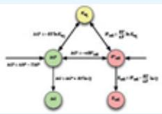
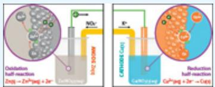
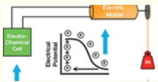
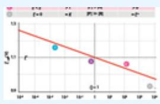
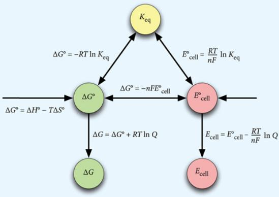
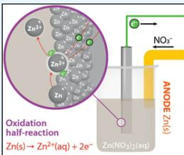
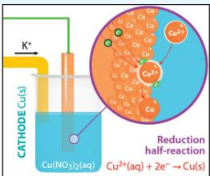
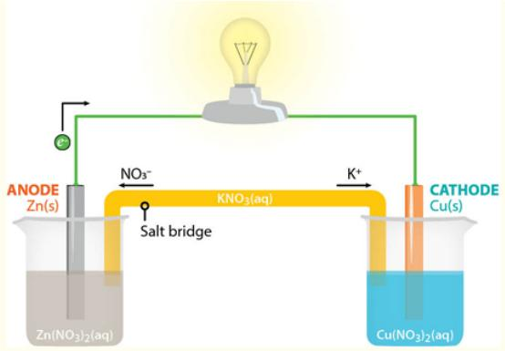
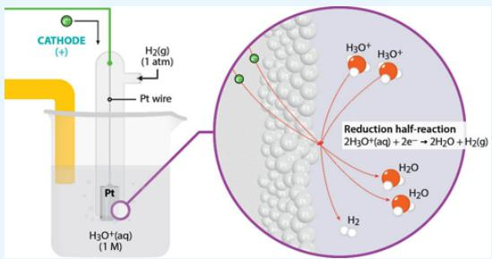
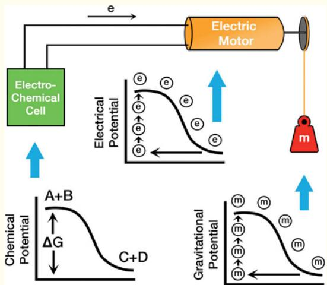

# 7 Electrochemistry

## THE UNION OF GIBBS FREE ENERGY, ELECTRON FLOW, AND CHEMICAL TRANSFORMATION

“When I was in college, I wanted to be involved in things that would change the world. Now I am. 7

—Elon Musk

:::{figure} ../images/fig-p1-ch07-1.jpg
:name: fig-p1-ch07-1
:alt: Figure from the University Chemistry source textbook
:::

## Framework

The study of the union between chemistry and electricity—the flow of electrons driven spontaneously by free energy release in a chemical reaction—has provided a rich history of remarkable discoveries. These studies constitute the discipline of electrochemistry, a subject that has experienced a dramatic rebirth. That rebirth has been propelled by the emergence of energy production and storage as a dominant problem confronting both science and public policy. A key part of why the rebirth of electrochemistry has been sparked by efforts to advance key technologies associated with global demands for energy is contained in the third diagram in this text—Figure 1.3. That figure traces the flow of electrons, supplied to the power distribution grid by a combination of photovoltaics, wind, and concentrated solar thermal. That primary energy generation is coupled to a combination of batteries, electrolysis cells, fuel cells, and hydrogen storage systems by the power grid. In each of these cases, chemical transformations are coupled to the flow of electrons and visa versa. There is a clear implication that the energy contained in the chemical bond can be harnessed to generate the flow of electrons, and conversely that the flow of electrons, driven by an external voltage source, can enact chemical change.

We are already acutely aware, through our study of thermodynamics, that no chemical change occurs without bringing a requisite increase in disorder to the universe. There is always a cost, a cost to be paid in the currency of free energy, ΔG, such that:

## Reactants → Products + Free Energy

With the release of free energy, ΔG, comes the ability to do work. If the flow of electrons is to produce work, we first need a difference in electrical potential between two points, just as we need a difference in gravitational potential energy between two points that can be converted to kinetic energy. Second, we need a source of electrons; third, a conducting path for those electrons; and fourth, a pump to raise electrons from a region of low electrical potential to a region of high electrical potential. For the case of gravitational potential energy, we can sketch such a cycle, shown in Figure 7.2, displaying a series of mass elements that move in a gravitational field. The “pump” that carries the mass elements to a position of higher gravitational potential energy requires work. When a mass acquires gravitational potential energy, work can be done. This has a direct analogy with the chemical potential shown in Figure 7.3 that drives reactants to products in a chemical reaction, releasing free energy. We can sketch a similar free energy diagram for an electrical potential that drives the flow of electrons through an electric motor, light bulb or electronic device. It was the recognition that the ability to extract useful work from either an electrical potential or from a chemical potential that lead to the conceptual linking of voltage (that is a measure of electrical potential) to the concept of free energy release, ΔG, of a chemical reaction. This constitutes one of many critically important contributions of electrochemistry to science and society as a whole.

:::{figure} ../images/fig-p1-ch07-2.jpg
:name: fig-p1-ch07-2
:alt: FIGURE 7.1 The Tesla Roadster is an example of a new breed of electric cars that are now dominating the design divisions of a number of automobile corporations. These cars are fast, quiet, and extremely efficient. They are a key component i
FIGURE 7.1 The Tesla Roadster is an example of a new breed of electric cars that are now dominating the design divisions of a number of automobile corporations. These cars are fast, quiet, and extremely efficient. They are a key component in the elimination of dependence on imports of petroleum and, with the introduction of alternative energy, the elimination of carbon dioxide release for the transportation sector.
:::


:::{figure} ../images/fig-p1-ch07-3.jpg
:name: fig-p1-ch07-3
:alt: FIGURE 7.2 As we have continued to stress, there is a direct analogy between the release of energy in a chemical reaction and the conversion of potential energy to mechanical work when a mass, m, falls through a gravitational field. As time
FIGURE 7.2 As we have continued to stress, there is a direct analogy between the release of energy in a chemical reaction and the conversion of potential energy to mechanical work when a mass, m, falls through a gravitational field. As time progresses, the internal potential energy, mgh, is released when the mass reaches its lowest point on the potential energy surface.
:::


:::{figure} ../images/fig-p1-ch07-4.jpg
:name: fig-p1-ch07-4
:alt: FIGURE 7.3 As electrons flow from the anode (where oxidation occurs liberating those electrons into the external circuit) to the cathode (with the higher standard reduction potential), free energy is released that is capable of doing useful
FIGURE 7.3 As electrons flow from the anode (where oxidation occurs liberating those electrons into the external circuit) to the cathode (with the higher standard reduction potential), free energy is released that is capable of doing useful work by virtue of that external circuit.
:::


We can link the concepts of gravitational potential, chemical potential, and electrical potential in a single diagram. Figure 7.4 displays an electrochemical cell, which we will study in this chapter, where the electrochemical cell engages a chemical potential to deliver an electrical potential through an external circuit to an electric motor that in turn performs mechanical work by raising a mass, m, in a gravitational field. As we will see, it was Michael Faraday who used just such an experimental arrangement to quantitatively link free energy, the electrical potential, and the gravitational potential to the work done by an electrochemical cell. This provided the conceptual foundation to quantitatively link the vertical axes in each of the energy diagrams in Figure 7.4.

:::{figure} ../images/fig-p1-ch07-5.jpg
:name: fig-p1-ch07-5
:alt: FIGURE 7.4 The ability of electrochemistry to unify key concepts in chemistry, electricity, and mechanical work is one of the major contributions electrochemistry has made to modern science. Because an understanding of electrochemistry lies
FIGURE 7.4 The ability of electrochemistry to unify key concepts in chemistry, electricity, and mechanical work is one of the major contributions electrochemistry has made to modern science. Because an understanding of electrochemistry lies at the heart of important new developments in energy storage and energy transformations, electrochemistry occupies a prominent position in research and technology today. The diagram displayed here links the concept of the chemical potential defined in terms of Gibbs free energy, to the electrical potential defined by the volt, to the gravitational potential of a mass, m, in a gravitational field.
:::


Electrochemistry is the study of how electrical potential and Gibbs free energy are quantitatively linked. However, in the spirit of setting the context, we frame the problem by first exploring some of the potent contributions electrochemistry will make to the new global energy structure as we move into the next decade. These examples range from the global scale to the cellular scale to the molecular scale, and each is at the forefront of the global research enterprise in science and technology.

We begin with the automobile, which occupies center stage in the energy debate because it represents a major consumer of petroleum and a remarkable opportunity to infuse technology into the lives of a large fraction of the population. The transition to an electrified transportation system will radically reduce dependence on fossil fuels and thereby improve the strategic and economic position of many nations, including the US, while markedly reducing $\mathrm { C O } _ { 2 }$ emissions. For these objectives, electrochemistry is essential.

We consider first the energy requirements to propel a gasoline automobile using, as an example, a car that gets 20 miles per gallon. This is close to the US average fuel economy for passenger vehicles. From Case Study 1.1 we know that a liter of gasoline contains $3 . 5 \times 1 0 ^ { 7 }$ joules of energy. If we convert this to the units of kilowatt-hours (kWh), it will allow us to easily calculate the equivalent amount of energy from electricity used to propel an electric automobile with that required to propel a gasoline automobile. We purchase electricity in units of kWh from the electric power grid. A kWh of energy is ${ \bf ( 1 \times 1 0 ^ { 3 } }$ joules/sec)(3.6 $\mathbf { \times 1 0 ^ { 3 } s e c o n d s } ) = \mathbf { 3 . 6 \times 1 0 ^ { 6 } }$ joules of energy. Thus the energy contained in a liter of gasoline, $3 . 5 ~ \times ~ 1 0 ^ { 7 }$ joules, in units of kWh, is $( 3 . 5 ~ \times ~ 1 0 ^ { 7 }$ joules/liter) $/ 3 . 6 \times 1 0 ^ { 6 }$ joules/kWh) = 9.7 kWh/liter. We will repeatedly approximate this as 10 kWh/liter. If a vehicle gets 20 miles per gallon, this fuel mileage converts to approximately 8 km/liter because there are approximately $4$ liters per gallon and 1.6 km per mile. In order to compare a diverse range of automobiles including passenger cars, SUVs, gasoline-electric hybrids, and all-electric automobiles, we adopt a consistent approach by calculating the amount of energy in kWh required to propel a particular vehicle 100 km. We can then quickly calculate, in all cases, the cost to drive each vehicle 100 km, or any other distance. For example, an automobile that gets 20 mpg, which, by the above is 8 km/liter, requires an amount of energy to drive 100 km of [(100 km)/(8 km/liter)] (10 kWh/liter) = 125 kWh of energy.

Calculate the amount of energy in kWh required to propel a car 100 km. To begin the comparison, consider five representative cases:

<table><tr><td>Example 1:</td><td>The energy required to propel an automobile that gets 20 mpg 100 km.</td></tr><tr><td>Example 2:</td><td>The energy required to propel an SUV in traffic, which gets 10 mpg.</td></tr><tr><td>Example 3:</td><td>The energy required to propel a hybrid electric such as the Toyota Prius, which gets 40 mpg.</td></tr><tr><td>Example 4:</td><td>The energy required to propel a large, all-electric sedan such as the Tesla Model S, shown in Figure 7.5, which requires 15 kWh per 100 km of driving.</td></tr><tr><td>Example 5:</td><td>The energy required to propel a 4-door, all-electric sedan such as the Citroen C-Zero, shown in Figure 7.6, which requires 10 kWh per 100 km of driving.</td></tr></table>

## Example 1

For a gasoline powered automobile that gets 20 miles per gallon (the U.S. average for the combined automobile and light truck fleet is 17 mpg), this converts to 8 km/liter because there are approximately 4 liters per gallon and 1.6 km per mile so

```{math}
:label: eq-p1-ch07-1
2 0 \mathrm{miles/gallon} = \frac {(2 0 \mathrm{miles/gal})}{4 \mathrm{liters/gal}} = (5 \mathrm{miles/} \ell) 1. 6 \mathrm{km/mile} = 8 \mathrm{km/} \ell
```


With 10 kWh of energy contained in each liter of fuel, this gives us, for 100 km of driving distance,

```{math}
:label: eq-p1-ch07-2
\begin{array}{c} \text {[energy required to drive 100 km] = (100 km / 8 km/}\ell\text {) 10 kWh/}\ell\text { = 125} \\ \mathrm{kWh} \end{array}
```


## Example 2

For comparison a large SUV in city driving with high traffic density will achieve a mileage of approximately 10 miles per gallon. This is twice the fuel consumption of our “U.S. average automobile” and thus we need to simply double the energy consumption of Example 1, so

```{math}
:label: eq-p1-ch07-3
\mathrm{[energyrequiredtodrive100km]} = 2 \times 1 2 5 \mathrm{kWh} = 2 5 0 \mathrm{kWh}
```


## Example 3

A hybrid-electric such as the Toyota Prius or Honda Civic hybrid uses an electric motor linked directly to the crankshaft of a gasoline engine, which serves both to assist in powering the automobile but also to recapture energy when decelerating or going downhill by switching the electric motor to a generator and recharging the metalhydride batteries. The Prius and Civic hybrids get approximately 40 miles per gallon in city driving. They have the important added feature that the gasoline engine switches off when the car is stopped so no fuel is wasted at idle in traffic. Because the hybrid gets 40 miles to the gallon it uses one-half the amount of energy of the “U.S average automobile” of Example 1, so

[energy required to drive 100 km] = ½(125 kWh) = 62.5 kWh

## Example 4

Figure 7.5 displays a picture of the Tesla Model S that seats 5 adults and is powered by lithium-ion batteries. It is a large sedan and is allelectric which means that it has no gasoline engine, but it has a range of 300 miles or 480 km. With a battery capacity of 72 kWh of energy, the Model S uses

[energy required to drive 100 km] = 72 kWh/480 km = 15 kWh/100 km

## Example 5

Figure 7.6 shows the Citroen Model C-Zero which is a smaller 4-door family sedan. The C-Zero has a rating per 100 km of

[energy required to drive 100 km] = 10 kWh

:::{figure} ../images/fig-p1-ch07-6.jpg
:name: fig-p1-ch07-6
:alt: FIGURE 7.5 The Tesla Model S is a new all-electric automobile built in California that seats five adults and two children and is powered by lithium-ion batteries.
FIGURE 7.5 The Tesla Model S is a new all-electric automobile built in California that seats five adults and two children and is powered by lithium-ion batteries.
:::


:::{figure} ../images/fig-p1-ch07-7.jpg
:name: fig-p1-ch07-7
:alt: FIGURE 7.6 The Citroen C-Zero represents a new generation of all electric 4-door passenger sedans from Europe that are designed to carry 4-5 adults in comfort with very high efficiency. These cars consume approximately 10 kWh of electrical
FIGURE 7.6 The Citroen C-Zero represents a new generation of all electric 4-door passenger sedans from Europe that are designed to carry 4-5 adults in comfort with very high efficiency. These cars consume approximately 10 kWh of electrical energy for each 100 km traveled.
:::


Inspection of the five examples immediately raises the question: how can there be such a large discrepancy between the energy required to propel a gasoline powered automobile vs. an electric powered automobile? The answer to this question involves three primary considerations. First, a gasoline powered automobile, which is governed by the thermodynamics of a heat engine, is less than 15% efficient in the conversion of chemical energy contained in the gasoline to energy available for moving the automobile. The electric motor, in sharp contrast, is 95% efficient in converting energy stored in the battery to energy available for propelling the car. The second reason that the electric car (as well as the hybrid-electric) is more efficient is that it recaptures energy during braking and in going downhill. Finally, in traffic, neither the electric nor hybrid consume fuel when stopped. In contrast, the gasoline engine consumes a considerable amount of fuel at idle. Of course, for the all-electric car, the electric power must be supplied to the power socket used to charge the battery. If this is done through hydroelectric power or the use of renewables such as from wind, solar thermal, geothermal, photovoltaics, etc., there is no other energy source involved. If the electricity is generated by a coal or a natural gas fired power plant, then the amount of net energy required depends upon the efficiency of the power plant. In the case of older coal burning power plants this is approximately 35%. For modern gas burning power plants the efficiency approaches 50%.

We can then compare the primary energy extracted from either coal or natural gas by simply multiplying the required amount of energy to go 100km by the inverse of the efficiency: 1/35% ≂ 3 for an old coal burning power plant and 1/50% ≂ 2 for a modern natural gas burning power plant. The result is displayed in Figure 7.7.

:::{figure} ../images/fig-p1-ch07-8.jpg
:name: fig-p1-ch07-8
:alt: FIGURE 7.7 When comparing the energy consumed by various categories of automobiles what is typically done is to calculate the distance traveled for a given amount of energy contained in the fuel for a gasoline powered automobile. For an ele
FIGURE 7.7 When comparing the energy consumed by various categories of automobiles what is typically done is to calculate the distance traveled for a given amount of energy contained in the fuel for a gasoline powered automobile. For an electric vehicle, the calculation is usually based on the electrical energy in kWh required to go a given distance. However because in many parts of the country electricity is generated from coal or natural gas, we can relate the electrical energy back to the chemical energy contained in fuel used to generate the electricity. For the case of an old coal burning power plant, the efficiency in converting chemical energy to electricity is about 35%. Thus we multiply the electrical energy a given car uses by a factor of three to determine the corresponding chemical energy. For a modern natural gas fired electrical power plant the efficiency is 50%, so we multiply by a factor of two.
:::


Notice in particular that the Tesla Model S, a large all-electric powered sedan, when charged from an old coal burning power plant increases from 15 kWh/100 km to 45 kWh/100 km, which is approximately 3/4 of the energy required by the hybrid. With electrical power generated by natural gas, the Model S requires 30 kWh/100 km, or approximately half that required by the hybrid, but one-quarter that of an average US automobile, and one-eighth that required by a large SUV in urban traffic. The Citroen powered by electricity from an aging coal burning power plant requires 30 kWh of (chemical) energy from coal and 20 kWh of energy from natural gas to go 100 km. That corresponds, respectively, to one-quarter the chemical energy consumption of an average U.S. gasoline powered automobile for a coal burning power plant and onesixth the chemical energy consumption for natural gas generated electricity.

This raises the next question. We know that electricity in the U.S. is generated by a combination of coal and natural gas burning power plants, hydroelectric, geothermal, nuclear and renewables—wind, photovoltaics and concentrated solar thermal. The cost of electric power, as a result, varies significantly across the country. Costs per kWh of electricity for each of the states is displayed in Figure 7.8.

:::{figure} ../images/fig-p1-ch07-9.jpg
:name: fig-p1-ch07-9
:alt: FIGURE 7.8 A remarkable fact in the United States is that the cost of electricity—universally cited units of cents per kWh—varies remarkably from state to state. By region, the highest price for electricity is in the Northeast; the lowest p
FIGURE 7.8 A remarkable fact in the United States is that the cost of electricity—universally cited units of cents per kWh—varies remarkably from state to state. By region, the highest price for electricity is in the Northeast; the lowest price in the Northwest. The average residential retail price of electricity in the U.S. (2007) was 10.64 cents per kWh. In the US, 48% of the electrical power is generated by the burning coal, 21% by natural gas, 18% by nuclear, 6% by hydroelectric, 3% by renewables (wind, solar, geothermal, etc.), 1% by petroleum.
:::


This information allows us to calculate the actual cost of driving the various categories of automobiles. We will take 10 cents per kWh for our average cost of electricity in the U.S. which is close to the national average in 2010, and in addition, this will make it easy to adjust for differences between states. Gasoline is currently about \$3.80/gallon, which translates conveniently to \$1/liter. With the energy content of gasoline at 10 kWh/liter, we can directly convert kWh to the cost of driving.

We can take the kWh/100 km from Figure 7.7, and for the case of gasoline powered vehicles calculate cost per 100 km of driving from the expression

```{math}
:label: eq-p1-ch07-4
\left[ \text { cost   per } 1 0 0 \mathrm{km} \text { of   driving } \right] = \frac {\left(\mathrm{kWh} / 1 0 0 \mathrm{km}\right)}{\left(\mathrm{kWh} / \text { liter   fuel }\right)} (\text { cost   fuel } / \text { liter })
```


For the electric automobiles, we simply need to multiply the kWh/100 km by the cost of electricity in kWh. Calculate the cost of purchasing the energy to drive the following five automobiles a distance of 100 km:

1. Gasoline automobile that gets 20 mpg

2. SUV in traffic that gets 10 mpg

3. Prius hybrid that gets 40 mpg

4. Tesla Model S that uses 15 kWh

5. Citroën C-Zero that uses 10 kWh

Assume a gasoline cost of \$1.00/liter and a cost of electricity of \$.10/kWh.

1. Cost of driving the average US vehicle at 20 mpg 100 km.

2. Cost of driving an SUV 100 km in traffic at 10 mpg.

3. Cost of driving a Prius 100 km at 40 mpg.

4. Cost of driving a Tesla Model S 100 km at 15 kWh/100 km.

5. Cost of driving a Citroën C-Zero 100 km at 10 kWh/100 km.

An inspection of the results of this calculation along with a consideration of the performance of electric cars reveals several key conclusions. First, there is a remarkable savings in driving cost inherent in the electric automobile. As noted before, this results from the high efficiency of the all-electric automobile motor (\~95%) and the ability of the electric automobile to recapture energy as well as the low efficiency of the gasoline powered automobile “heat” engine (<15%). So even though electricity in the U.S. is generated primarily by combustion of coal and natural gas, the cost of driving an electric automobile is dramatically lower than that of the gasoline powered automobile. It is important also to note that there is no technical reason why a large SUV could not be powered by an electric motor with no compromise in performance. In a head-to-head comparison of vehicles, the comparison of the calculated costs for the five examples shows that it costs approximately one-eighth as much to drive an electric power vehicle than it does a comparable gasoline powered vehicle.

Battery technology and fuel cells are the focus of Case Study 7.1. Electrochemistry of the cell is treated in Case Study 7.2.

:::{figure} ../images/fig-p1-ch07-10.jpg
:name: fig-p1-ch07-10
:alt: Figure from the University Chemistry source textbook
:::

The next question: For an average annual driving distance in the US of 20,000 km (12,500 mile), how much does it cost annually to drive each of our five examples? We can answer this question by referring to our previous calculation of cost and simply multiplying the cost to drive 100 km by 20,000 km/100 km. The results are:

<table><tr><td>Example 1:</td><td>$2500/year</td><td>Auto/light truck U.S. average 20 mpg</td></tr><tr><td>Example 2:</td><td>$5000/year</td><td>Large SUV in traffic</td></tr><tr><td>Example 3:</td><td>$1250/year</td><td>Prius hybrid</td></tr><tr><td>Example 4:</td><td>$300/year</td><td>Tesla Model S</td></tr><tr><td>Example 5:</td><td>$200/year</td><td>Citroën C-Zero</td></tr></table>

The results are worthy of note. Shifting from a large gasoline powered SUV in traffic to a large all-electric sedan in traffic would save approximately \$4,700 per year in costs associated with powering the vehicle. Shifting from a sedan with average U.S. fuel economy of 20 mpg to a large all-electric sedan would save \$2,200 per year and shifting to a small all-electric sedan would save \$2,300 per year. This corresponds to a savings of approximately \$200 per month. This constitutes a major fraction of an auto loan for an all-electric vehicle as they emerge on the market.

The final calculation we consider is the total annual expenditure in the U.S. for these five examples assuming an annual total driving distance of 3 trillion miles—the total number of miles driven in the U.S. in 2008. Three trillion miles is $4 . 8 ~ \times ~ 1 0 ^ { 1 2 }$ km, so for each of our examples:

<table><tr><td>Example 1:</td><td> $(\$12.50/100 \text{ km}) 4.8 \times 10^{12} \text{ km} = \$600 \text{ billion}$ </td></tr><tr><td>Example 2:</td><td> $(\$25.00/100 \text{ km}) 4.8 \times 10^{12} \text{ km} = \$1.2 \text{ trillion}$ </td></tr><tr><td>Example 3:</td><td> $(\$6.25/100 \text{ km}) 4.8 \times 10^{12} \text{ km} = \$300 \text{ billion}$ </td></tr><tr><td>Example 4:</td><td> $(\$1.50/100 \text{ km}) 4.8 \times 10^{12} \text{ km} = \$72 \text{ billion}$ </td></tr><tr><td>Example 5:</td><td> $(\$1.00/100 \text{ km}) 4.8 \times 10^{12} \text{ km} = \$48 \text{ billion}$ </td></tr></table>

This puts in place a very important question. Suppose the U.S. were to shift from (1) driving the current U.S. national average gasoline powered vehicle that gets 20 mpg, with gasoline costs of \$1/liter (\$3.80/gallon), to (2) a large all-electric sedan that requires 15 kWh of energy to go 100 km. How much would be saved on a national basis? We can determine this by subtracting the amount for Example 4 from the amount for Example $\bf 1 \colon \bf \ S 6 0 0 \times \bf 1 0 ^ { 1 2 } - 7 2 \times \bf 1 0 ^ { 1 2 } = \$ 5 2 8$ billion. That is 528 billion dollars each year in national fuel cost expenditures. To emphasize the point, we capture this annual savings graphically in Figure 7.9.

:::{figure} ../images/fig-p1-ch07-11.jpg
:name: fig-p1-ch07-11
:alt: FIGURE 7.9 A number of very high efficiency smaller all-electric cars are coming on the market. The Loremo, built in Europe, consumes 6 kWh of energy per 100 km. The car holds two children. In New York City this translates into a cost of [(
FIGURE 7.9 A number of very high efficiency smaller all-electric cars are coming on the market. The Loremo, built in Europe, consumes 6 kWh of energy per 100 km. The car holds two children. In New York City this translates into a cost of [(6 kWh)/(100 km)] × (\$0.171/kWh) = \$1.03/100 km. This is to be compared with \$23.44/100 km for a large gasoline powered SUV.
:::


The principles behind both power generation by electromagnetic induction and power delivery by electric motors are the subject of Case Study 7.3.

Case Study 7.3 Electricity, Magnetism, and Electric Motors to Power the Transportation Sector

:::{figure} ../images/fig-p1-ch07-12.jpg
:name: fig-p1-ch07-12
:alt: Figure from the University Chemistry source textbook
:::

Shifting from petroleum to electrical energy to power the transportation sector places the energy debate and public policy strategy squarely in the field of electrochemistry for scientific and technical advances. While we have an effective option in lithium-ion batteries discussed in this chapter, how do we advance battery technology to increase the energy storage per unit mass and per unit volume of batteries used in the transportation sector? What are the implications for total electricity consumption if all automobiles and light trucks draw their energy from the electrical power grid? While we can eliminate the need for imported petroleum by switching to electrically powered vehicles, how do we take the next step and eliminate the release of $\mathrm { C O } _ { 2 }$ added to the atmosphere by fossil fuel combustion? If we respond to the constraints put in place by feedbacks in the climate structure, with its requisite requirements to reduce $\mathrm { C O } _ { 2 }$ emission, how do we control the balance between supply and demand on the national electricity power grid? An answer to these questions directly engages the study of electrochemistry.

An inspection of Figure CS4.3E emphasizes that when we transition to an energy infrastructure based on sources of primary energy that would both free us of petroleum purchases from other countries and reduce the amount of carbon deposited in the atmosphere, a careful quantitative analysis is required. We must investigate in detail the scientific and technical underpinning of the relationship between the flow of electrons, the chemical storage of energy in batteries, and the generation of electron flow through a “load” by virtue of the energy in chemical bonds. We must also understand the mechanisms by which a flow of electrons can produce a chemical fuel that can store electrical energy reversibly, releasing it on demand. These are the questions that motivate this chapter on electrochemistry.

The next segment in the development of “50 Questions on Global Scale Energy and Power” constitutes Case Study 7.4.

Case Study 7.4 Linking Global Scale Calculations: The “50 Questions on Global Scale Energy and Power” Part II

:::{figure} ../images/fig-p1-ch07-13.jpg
:name: fig-p1-ch07-13
:alt: Figure from the University Chemistry source textbook
:::

## Chapter Core

## Road Map for Chapter 7

In a fundamental sense, the study of electrochemistry is a grand unifier, tying together the concepts of free energy, oxidation-reduction, electronegativity, chemical equilibria, acid-base reactions, thermochemistry, and electron delocalization. Thus in this chapter we begin with a treatment of how electrodes—metals placed in solution—constitute an important example of oxidation-reduction reactions in mixed phases and how oxidation at the anode is isolated from reduction at the cathode in an electrochemical cell capable of generating an external flow of electrons. This flow of electrons is instigated by the difference in the ability of two metals to draw electrons to them. This separation of oxidation and reduction into isolated physical entities connected by an external conductor through which electrons can flow, is called a galvanic cell or alternatively a voltaic cell. These cells are analyzed in terms of half-cell reactions defined by the relative ability of one cell to draw electrons from the other measured by a quantity termed the standard reduction potential. This provides the ability to calculate the voltage generated by the cell under various conditions. The road map of key concepts is:

<table><tr><td colspan="2">Road Map to Core Concepts</td></tr><tr><td>1. The Master Diagram: How Electrochemistry Unifies Thermodynamics</td><td></td></tr><tr><td>2. Reviewing Oxidation-Reduction Reactions</td><td></td></tr><tr><td>3. Visualization of Oxidation and Reduction at Metal Electrodes</td><td></td></tr><tr><td>4. Building a Voltaic Cell from its Components</td><td></td></tr><tr><td>5. The Standard Hydrogen Electrode: Setting the Reduction Potential Scale</td><td></td></tr><tr><td>6. Linking the Chemical Potential, Gravitational Potential, and Electrical Potential</td><td></td></tr><tr><td>7. Cell Potential for Nonstandard Conditions</td><td></td></tr></table>

## Free Energy, Electron Flow, and Electrochemistry

Chemical transformations, which in turn govern changes in all chemical structures, are guided by the movement of electrons either as subtle delocalizations within bonding architectures or by the explicit transfer of electrons, but always in their quest to seek the state of lower free energy. As we have noted, distilled to its fundamentals, any chemical reaction may be expressed as Reactants → Products + Free Energy. Chemical species—in fact all matter in general—at a high chemical potential seek any available path with $\Delta G < 0$ and release free energy in the process. By whatever means matter rearranges the configuration of its bonds, there is a corresponding release of free energy as a result. As developed in Chapter 4, at a constant temperature and pressure—which characterizes the preponderance of processes in nature—that free energy release is Gibbs free energy:

```{math}
:label: eq-p1-ch07-5
\Delta G = \Delta H - T \Delta S
```


## Check Yourself 1

As we have seen, Gibbs free energy is one of, if not the, most important thermodyamic variable. It quantitatively links the concepts of spontaneous change, enthalpy, entropy, the equilibrium constant, and the relationship between the change in Gibbs free energy at standard condition as well as under conditions for which reactants and products are not at equilibrium.

As a review from Chapter 4, consider the following

(a) Under standard conditions, what is the relationship between $\Delta \mathbf { G } ^ { \mathbf { o } }$ $\Delta \mathrm { H } ^ { \mathbf { o } }$ , and $\Delta \mathbb { S } ^ { \mathbf { \circ } } ?$

(b) At a temperature, T, other than 298 K, can we calculate the change in Gibbs free energy, $\Delta \mathrm { G } _ { \mathrm { T } } ,$ from tables of $\Delta \mathrm { H } ^ { \mathbf { o } }$ and $\Delta \mathrm { S ^ { \circ } } ?$ If so, why? If not, why not?

(c) What is the relationship between $\Delta \mathbf { G } ^ { \mathbf { o } }$ and the equilibrium constant $\mathrm { K _ { e q } 2 }$

(d) If the chemical reaction is not at equilibrium, what is the relationship between ΔG and Q?

Electrochemistry is a particularly compelling branch of the physical sciences because it draws together the concepts of oxidation-reduction, electron transfer, free energy release, and electrical potentials in the context of cutting-edge technology for global-scale energy production and storage. For example, were a single technology, lithium-ion batteries, incorporated into plug-in hybrid technology in automobiles and light trucks, the US would reduce its petroleum imports by 60%. While much of electron delocalization and electron transfer in chemical processes is implicit—we cannot observe it directly—electrochemistry makes such processes explicit by separating the flow of electrons physically from the reactants and products such that chemical energy can be used to execute work through an external circuit. It is this feature of electrochemistry that effectively links the microscopic (molecular) level battle for electrons to the macroscopic harnessing of creative new ideas to address the challenge of global energy sources for the next century.

## Oxidation-Reduction Reactions

We have considered oxidation-reduction reactions in some detail beginning in Chapter 2. The movement of electrons away from an atom or element constitutes an oxidation process. It is caused by an atom with greater electronegativity successfully extracting electron density from a less electronegative species. That “extraction of electron density” can be a subtle delocalization of electron density or an explicit and complete extraction of the electron from the atom or element. No matter the degree of “extraction of electron density,” it is all referred to as oxidation. Reduction is, as we have treated in detail for many different cases, the opposite of oxidation. Reduction is the transfer of electron density to or toward an atom or element. As with oxidation, this can be a subtle delocalization of electron density toward another atom or element, or it can be the explicit and complete donation of the electron.

## Check Yourself 2

Oxidation-reduction reactions in the aqueous medium are very important in electrochemistry. To review redox reactions, balance the following reaction in an acidic solution:

```{math}
:label: eq-p1-ch07-6
\mathrm{Al} (\mathrm{s}) + \mathrm{Cu} ^ {2 +} (\mathrm{aq}) \rightarrow \mathrm{Al} ^ {3 +} (\mathrm{aq}) + \mathrm{Cu} (\mathrm{s})
```


Step 1 Assign oxidation states to all atoms and identify the substances being oxidized and reduced.

Step 2 Separate the overall reaction into two half-reactions: one for oxidation and one for reduction.

Step 3 Balance each half-reaction with respect to mass in the following order:

Balance all elements other than H and O.

Balance O by adding $\mathrm { H } _ { 2 } \mathrm { O }$

Balance H by adding $\mathrm { H ^ { + } }$

Step 4 Balance each half-reaction with respect to charge by adding electrons. (The sum of the charges on both side of the equation should be made equal by adding as many electrons as necessary.)

Step 5 Make the number of electrons in both half-reactions equal by multiplying one or both half-reactions by a small whole number.

Step 6 Add the two half-reactions together, canceling electrons and other species as necessary.

What makes electrochemistry both extremely potent as a source of energy for practical applications and conceptually important for understanding oxidation and reduction, is that the electrons involved are explicitly and completely transferred from the site of oxidation to the site of reduction. As we will see, this is so because those electrons flow through an external circuit and can be individually counted!

While electrochemistry does not deal exclusively with metals, it is safe to say that because of the ease with which electrons flow in metals and the relative ease with which electrons can be removed from metals, metals constitute the foundation for our understanding of electrochemistry.

We can schematically represent the oxidation or reduction process at the interface of a metal immersed in a liquid containing cations (positive ions) of that metal. This is displayed graphically in Figures 7.10 and 7.11. The key interaction occurs at the metal-solution interface. For oxidation:

a metal atom M(s) on the surface of the electrode may lose n electrons to the electrode, as shown at the atomic level in Figure 7.10, and enter the solution as the cation ${ { \bf { M } } ^ { { \bf { n + } } } }$ . The metal atom is oxidized in the process.

```{math}
:label: eq-p1-ch07-7
\mathrm{M} (\mathrm{s}) \rightarrow \mathrm{M} ^ {\mathrm{n+}} (\mathrm{aq}) + \mathrm{ne} ^ {-}
```


Or for reduction:

a metal ion ${ { \bf { M } } ^ { { \bf { n + } } } }$ from solution may collide with the electrode, gaining electrons from it, as shown in Figure 7.11, thereby converting the metal cation to a metal atom M(s),

```{math}
:label: eq-p1-ch07-8
\mathbf {M} ^ {\mathrm{n+}} (\mathrm{aq}) + \mathrm{ne} ^ {-} \rightarrow \mathbf {M} (\mathrm{s})
```


where the metal cation is reduced in the process.

:::{figure} ../images/fig-p1-ch07-21.jpg
:name: fig-p1-ch07-21
:alt: FIGURE 7.10 When viewed at the atomic level, the oxidation that occurs at the anode at the interface between the metal surface and the solution reveals the zinc atom leaving the solid metal structure to enter the solution as mathematical no
FIGURE 7.10 When viewed at the atomic level, the oxidation that occurs at the anode at the interface between the metal surface and the solution reveals the zinc atom leaving the solid metal structure to enter the solution as $Z n ^ { 2 + } ( \mathsf { a q } )$ with the electron moving into and through the metal electrode. The removal of two electrons from zinc metal, $Z _ { \mathsf { I } \mathsf { I } } ( \mathsf { s } )$ , to form the cation, $Z n ^ { 2 + } ( mathsf { a q } )$ , constitutes the oxidation step at the anode.
:::


:::{figure} ../images/fig-p1-ch07-22.jpg
:name: fig-p1-ch07-22
:alt: FIGURE 7.11 Reduction, when viewed at the atomic level occurs at the interface between the cathode and the solution containing mathematical notation cations. The union of the copper cations to form copper metal at the electrode surface, mat
FIGURE 7.11 Reduction, when viewed at the atomic level occurs at the interface between the cathode and the solution containing ${ \mathsf { C } } { \mathsf { U } } ^ { 2 + } ( { \mathsf { a q } } )$ cations. The union of the copper cations to form copper metal at the electrode surface, $\mathsf { C u } ^ { 2 + } ( \mathsf { a q } ) + 2 \mathsf { e } ^ { - } \to \mathsf { C u } ( \mathsf { s } )$ constitutes the reduction step at the cathode of the electrochemical half-cell.
:::


## Check Yourself 3

Consider Figure 7.10 and 7.11 together. Suppose we connect the beaker in which oxidation occurs, Figure 7.10, to the beaker in which reduction occurs, Figure 7.11, with a conducting wire between the two electrodes.

:::{figure} ../images/fig-p1-ch07-23.jpg
:name: fig-p1-ch07-23
:alt: Figure from the University Chemistry source textbook
:::

Oxidation-reduction reactions, as displayed in Figures 7.10 and 7.11, lie at the heart of electrochemistry. Oxidation-reduction is a conceptual framework in chemistry wherein one or more electrons are transferred from one species to another. One species is the oxidant, or oxidizing agent, that takes electrons from the reductant, or reducing agent. Therefore, oxidation denotes a loss of electrons; reduction denotes a gain in electrons.

The oxidizing agent gains electrons causing oxidation to take place such that the oxidizing agent, acting as a recipient for the liberated electrons, undergoes reduction. Consider the case where the metal electrode is a copper rod. The reduction reaction is

```{math}
:label: eq-p1-ch07-9
\begin{array}{c c c c c}\text {Oxidizing agent}&\text {Electrons}&\text {Reduced species}&(\text {reduction})\\\mathrm{Cu} ^ {2 +}&+&2 e ^ {-}&\rightarrow&\mathrm{Cu}\end{array}(\text {electron gain})
```


The oxidation number of the oxidizing agent therefore decreases.

The oxidation reaction involves the reducing agent that loses electrons, so we can write:

```{math}
:label: eq-p1-ch07-10
\begin{array}{c c c c c}\text { Reducing   agent }&\text { Oxidized   species }&\text { Electrons }&\text {(oxidation)}\\\mathrm{Zn}&\rightarrow&\mathrm{Zn} ^ {2 +}&+ 2 e ^ {-}&\text {(electron   loss)}\end{array}
```


The reducing agent's oxidation number increases, going from 0 to +2.

For every electron lost, there is one gained; for every oxidation there is a reduction. It is a two-step process such that oxidation and reduction constitute an inseparable pair—you can't have one without the other, because electrons are neither created nor destroyed in an oxidation-reduction reaction.

We have studied this reciprocity between oxidation and reduction repeatedly before. All oxidation-reduction chemical equations must be balanced with respect to the number of electrons lost in an oxidation step and the number of electrons gained in a reduction step.

## Check Yourself 4

As a review, balance the following reaction in a basic solution:

```{math}
:label: eq-p1-ch07-11
\mathrm{Cd(s)} + 2 \mathrm{NiO(OH)(s)} + 2 \mathrm {H_ {2} O(l)} \rightarrow \mathrm {Cd(OH) _ {2} (s)} + 2 \mathrm{Ni(OH) _ {2} (s)}
```


In a basic solution.

1. Assign oxidation states.

2. Separate the overall reaction into two half-reactions.

3. Balance each half-reaction with respect to mass.

Balance all elements other than H and O

Balance O by adding $\mathrm { H } _ { 2 } \mathrm { O }$

Balance H by adding $\mathrm { H ^ { + } }$

Neutralize $\mathrm { H ^ { + } }$ by adding enough OH<sup>-</sup> to neutralize each $\mathrm { H ^ { + } }$ . Add the same number of $\mathrm { O H ^ { - } }$ ions to each side of the equation.

4. Make the number of electrons in both half-reactions equal.

5. Add the half-reactions together.

6. Verify that the reaction is balanced.

Suppose we initiate an oxidation-reduction reaction by placing a coil of clean copper into a solution of silver nitrate. As the reaction proceeds, displayed in Figure 7.12, the clear solution of $\mathrm { A g ^ { + } ( a q ) }$ cations and $\mathrm { N O _ { ~ 3 ~ } ^ { - } }$ anions begins to turn a bluish color as copper cations, $\mathrm { C u ^ { 2 + } }$ , are released into solution. The reduction reaction occurs at the metal-solution interface converting $\mathrm { A g ^ { + } ( a q ) }$ cations in solution to $\operatorname { A g } ( \mathbf { s } )$ silver atoms on the surface of the copper coil.

```{math}
:label: eq-p1-ch07-12
\mathrm{Ag} ^ {+} (\mathrm{aq}) + \mathrm{e} ^ {-} \xrightarrow {\text { reduction }} \mathrm{Ag} (\mathrm{s})
```


The copper atoms at the metal surface, $\operatorname { C u } ( \mathbf { s } )$ , enter solution as $\mathrm { C u ^ { 2 + } }$ cations in the oxidation step

```{math}
:label: eq-p1-ch07-13
\mathrm{Cu(s)} \xrightarrow {\text { oxidation }} \mathrm{Cu} ^ {2 +} (\mathrm{aq}) + 2 \mathrm{e} ^ {-}
```


The net reaction is the sum of these two steps, balanced according to the number of electrons involved in the overall reaction

```{math}
:label: eq-p1-ch07-14
\begin{array}{r l} 2 \left(\mathrm{Ag} ^ {+} (\mathrm{aq}) + \mathrm{e} ^ {-} \longrightarrow \mathrm{Ag} (\mathrm{s})\right) & \\ \mathrm{Cu} (\mathrm{s}) \longrightarrow \mathrm{Cu} ^ {2 +} (\mathrm{aq}) + 2 \mathrm{e} ^ {-} & \\ \hline 2 \mathrm{Ag} ^ {+} (\mathrm{aq}) + \mathrm{Cu} (\mathrm{s}) \longrightarrow 2 \mathrm{Ag} (\mathrm{s}) + \mathrm{Cu} ^ {2 +} (\mathrm{aq}) & \text { net   reaction } \end{array}
```


:::{figure} ../images/fig-p1-ch07-24.jpg
:name: fig-p1-ch07-24
:alt: Figure from the University Chemistry source textbook
:::

:::{figure} ../images/fig-p1-ch07-25.jpg
:name: fig-p1-ch07-25
:alt: Figure from the University Chemistry source textbook
:::

:::{figure} ../images/fig-p1-ch07-26.jpg
:name: fig-p1-ch07-26
:alt: FIGURE 7.12 When clean copper is placed in a solution of silver nitrate mathematical notation , a reaction occurs at the surface of the copper releasing mathematical notation ions into solution and forming silver deposits on the copper surf
FIGURE 7.12 When clean copper is placed in a solution of silver nitrate $( \mathsf { A g N O } _ { 3 } )$ , a reaction occurs at the surface of the copper releasing ${ \mathsf { C u } } ^ { 2 + }$ ions into solution and forming silver deposits on the copper surface. The result is a messy mixture of silver and copper on the one hand, and a blue solution containing ${ \mathsf { C u } } ^ { 2 + }$ cations on the other. While the temperature of the beaker contents increased, no electrical energy could be captured.
:::


## It is important to note that

1. The original metal (copper) turns into an amorphous blob of silver and copper.

2. Although the (spontaneous) reaction is exothermic, no usable energy, other than the heat released, can be harnessed from the process resulting from the transfer of electrons in the chemical reaction.

What is unique to electrochemistry is the strategy used to gain control over a process such as the reaction shown in Figure 7.12, that occurs when a metal such as copper is placed in a beaker of silver nitrate, $\mathrm { { A g N O } _ { 3 } . }$ Silver nitrate in solution produces an equilibrium resulting in the release of $\mathrm { A g ^ { + } }$ into solution.

```{math}
:label: eq-p1-ch07-15
\mathrm{AgNO} _ {3} \rightleftharpoons \mathrm{Ag} ^ {+} + \mathrm{NO} _ {3} ^ {-}
```


Insertion of the copper metal into the solution initiates a chemical reaction wherein copper is oxidized to form $\mathrm { C u ^ { 2 + } }$

```{math}
:label: eq-p1-ch07-16
\mathrm{Cu(s)} \rightarrow \mathrm {Cu^ {2 + }} + 2 e ^ {-}
```


and $\mathrm { A g ^ { + } }$ is reduced

```{math}
:label: eq-p1-ch07-17
\mathrm{Ag} ^ {+} + e ^ {-} \rightarrow \mathrm{Ag(s)}
```


We can also run an experiment where, instead of a solution of $\mathrm { \Delta A g N O _ { 3 } ( a q ) }$ we use zinc nitrate, $\mathrm { Z n ( N O _ { 3 } ) _ { 2 } ( a q ) }$ , as contrasted in Figure 7.13. The beaker on the left is a repeat of the experiment depicted in Figure 7.12. A strip of clean copper sheet is inserted into a silver nitrate solution. $\mathrm { A g ^ { + } }$ cations are displaced from the clear silver nitrate solution as silver builds up on the copper surface. In the right-hand beaker of Figure 7.13, a distinctly different occurrence is observed. The same clean copper strip is placed in a beaker of zinc nitrate $\mathrm { Z n ( N O _ { 3 } ) _ { 2 } ( a q ) }$ . But no reaction takes place. Since the zinc nitrate solution results in the existence of $\mathrm { Z n ^ { 2 + } ( a q ) }$ cations in solution, the fact that no chemical reaction occurs means that the reaction between the solid copper, Cu(s), and the zinc cations, $\mathrm { Z n ^ { 2 + } }$

```{math}
:label: eq-p1-ch07-18
\mathrm{Cu(s)} + \mathrm {Z n ^ {2 + } (aq)} \xrightarrow {\text { reduction }} \text { Products }
```


simply does not occur. It is not spontaneous, it does not release free energy.

:::{figure} ../images/fig-p1-ch07-27.jpg
:name: fig-p1-ch07-27
:alt: Figure from the University Chemistry source textbook
:::

(a)

:::{figure} ../images/fig-p1-ch07-28.jpg
:name: fig-p1-ch07-28
:alt: Figure from the University Chemistry source textbook
:::

(b)
FIGURE 7.13 Gibbs free energy dictates the direction of spontaneous chemical reactions in electrothermal processes just as with all chemical reactions. While silver can extract electrons from copper, zinc cannot so

```{math}
:label: eq-p1-ch07-19
\mathrm{Cu(s)} + 2 \mathrm {Ag^ {+} (aq)} \mathrm {Cu^ {2 + } (aq)} + 2 \mathrm{Ag(s)}
```


is spontaneous $( \Delta G < 0 )$ while

```{math}
:label: eq-p1-ch07-20
\mathrm{Cu(s)} + \mathrm {Z n ^ {2 + } (aq) Cu^ {2 + } (aq)} + \mathrm{Zn(s)}
```


is nonspontaneous $( \Delta G > 0 )$

So while silver cations can extract electrons from copper

```{math}
:label: eq-p1-ch07-21
\mathrm{Cu(s)} + 2 \mathrm {Ag^ {+} (aq)} \rightarrow 2 \mathrm{Ag(s)} + \mathrm {Cu^ {2 + } (aq)}
```


because $\Delta \mathrm { G } < 0$ for this reaction, zinc cations cannot extract electrons from copper, $\operatorname { C u } ( \mathbf { s } )$ , so

```{math}
:label: eq-p1-ch07-22
\mathrm{Cu(s)} + \mathrm {Zn^ {2 + } (aq)} \rightarrow \mathrm {Cu^ {2 + } (aq)} + \mathrm{Zn(s)}
```


is nonspontaneous and $\Delta \mathrm { G } > 0$ for the reaction as written, and, therefore, there is no release of free energy in the reaction.

## SPONTANEOUS PROCESS (ΔG < 0)

Consider what you see in Figure 7.13. How is this observed contrast captured in a free energy diagram?

(a) Sketch the Gibbs free energy diagram qualitatively for the reaction in the left-hand beaker:

```{math}
:label: eq-p1-ch07-23
\mathrm{Cu(s)} + 2 \mathrm {Ag^ {+} (aq)} \rightarrow \mathrm {Cu^ {2 + } (aq)} + 2 \mathrm{Ag(s)}
```


:::{figure} ../images/fig-p1-ch07-29.jpg
:name: fig-p1-ch07-29
:alt: FIGURE 7.14 We can diagram the relationship between Gibbs free energy and the electrochemical reaction between mathematical notation at the anode and mathematical notation at the cathode. Electrons are transported from the copper anode to t
FIGURE 7.14 We can diagram the relationship between Gibbs free energy and the electrochemical reaction between ${ \mathsf { C u } } ( { \mathsf { s } } )$ at the anode and $\mathsf { A } \mathsf { g } ( \mathsf { s } )$ at the cathode. Electrons are transported from the copper anode to the silver cathode, a reaction for which $\Delta G < 0$ Because $\Delta G < 0$ , the reaction is spontaneous.
:::


## (b) Sketch the Gibbs free energy diagram qualitatively for the reaction on the right:

```{math}
:label: eq-p1-ch07-24
\mathrm{Cu(s)} + \mathrm {Zn^ {2 + } (aq)} \rightarrow \mathrm {Cu^ {2 + } (aq)} + \mathrm{Zn(s)}
```


:::{figure} ../images/fig-p1-ch07-30.jpg
:name: fig-p1-ch07-30
:alt: FIGURE 7.15 The Gibbs free energy diagram for copper as the anode and zinc as the cathode displays why the reaction is nonspontaneous: Electrons must move uphill, mathematical notation 0, in order to execute the reaction.
FIGURE 7.15 The Gibbs free energy diagram for copper as the anode and zinc as the cathode displays why the reaction is nonspontaneous: Electrons must move uphill, $\Delta G >$ 0, in order to execute the reaction.
:::


But the objective of electrochemistry is to develop strategies wherein electrical energy (free energy) can be extracted in an effective manner from such oxidation-reduction reactions. The first step in this strategy is to isolate the two oxidation-reduction half reactions, each in a separate cell. It is difficult to overstate the importance of realizing that it was necessary to separate this electrochemical reaction into two separate cells in order to extract electrical energy that can do work from the redox reaction, rather than simply releasing the free energy as heat.

## The Galvanic or Voltaic Cell

The basic set up for electrochemistry is the union of Figures 7.10 and 7.11 shown in Figure 7.16: this is called a galvanic or voltaic cell. It consists of two electrodes. The first electrode, dipped in a solution, has the ability to release positive ions from its surface into the solution. A positive ion is an atom stripped of some (or all) of its valence electrons. Positive ions are called cations. The second electrode is also dipped in a (generally different) solution and has the ability to acquire cations from the solution. The electrode that releases cations is called the anode; the electrode that acquires cations is called the cathode. When a cation is released from the anode, there is an extra negative charge, one or more electrons, that remains behind. Similarly, when a cation is acquired by the cathode, there is an extra positive charge on the cathode. If the anode and the cathode are connected by a good conductor, the excess electrons leave the negatively charged anode and travel to the positively charged cathode to restore the charge balance. As long as the release of cations from the anode and the capture of cations by the cathode continue, there is a current of electrons traveling from the anode to the cathode. If we put a voltmeter into the circuit connecting the anode to the cathode, it will register a voltage. The voltage difference measured in this process is defined to be positive when electrons travel from the anode to the cathode. The architecture of the copper-zinc galvanic cell is shown in Figure 7.16.

:::{figure} ../images/fig-p1-ch07-31.jpg
:name: fig-p1-ch07-31
:alt: FIGURE 7.16 A complete electrothermal cell consists of: (1) an anode material that is an electrode in solution where oxidation occurs, releasing electrons into an external circuit and a positive ion into solution, (2) a cathode material tha
FIGURE 7.16 A complete electrothermal cell consists of: (1) an anode material that is an electrode in solution where oxidation occurs, releasing electrons into an external circuit and a positive ion into solution, (2) a cathode material that is an electrode in solution where reduction occurs, recombining electrons from the external circuit with positive ions from solution to plate-out metal in the surface of the cathode, and (3) a salt bridge that provides negative ions to the anode solution to neutralize the positive ions produced in the oxidation step and (by the salt bridge) positive ions to the cathode solution to neutralize the negative ions produced.
:::


Figure 7.16 displays a typical “galvanic cell,” the key components of which consists of the following: the anode is made of zinc (Zn), the cathode is made of copper (Cu), and the solutions in each case are $\mathrm { C u ( N O _ { 3 } ) _ { 2 } }$ and $\mathrm { Z n ( N O _ { 3 } ) _ { 2 } } .$ . If we connect these two with a conducting wire and a voltmeter, and if the concentration of the $\mathrm { C u ( N O _ { 3 } ) _ { 2 } }$ and $\mathrm { Z n ( N O _ { 3 } ) _ { 2 } }$ are exactly 1 M at temperature 298 K (that is, ${ 2 5 } ^ { \circ } \mathrm { C } ,$ , or room temperature), the voltmeter will show 1.10 V. To sustain the current through the external circuit we have to close the loop, which is accomplished by the so called “salt bridge,” a tube containing a solution of $\mathrm { K N O } _ { 3 }$ that dissociates into $\mathrm { K ^ { + } }$ ions and $\breve { \mathrm { N O } } _ { 3 . } ^ { - }$ . This is connected by two semipermeable membranes to the $\mathrm { C u ( N O _ { 3 } ) _ { 2 } }$ and $\mathrm { Z n ( N O _ { 3 } ) _ { 2 } }$ solutions.

## Check Yourself 6

Consider Figure 7.16, a galvanic cell with a zinc anode and a copper cathode.

(a) Draw the oxidation step at the atomic scale that is occurring at the interface of the zinc electrode and the $\mathrm { Z n ( N O _ { 3 } ) _ { 2 } }$ solution. Include in your drawing the Zn atom, the $\mathrm { Z n ^ { 2 + } }$ cation, and the relevant electrons.

(b) Repeat a, but for the cathode side. Again include in your drawing the Cu atom, the $\mathrm { C u ^ { 2 + } }$ cation, and the relevant electrons.

Now the whole system works as follows: $\mathrm { Z n ^ { 2 + } }$ cations are released from the anode into the solution containing $Z _ { \mathrm { { n } } } ( \mathrm { { N O } _ { 3 } ) _ { 2 } , }$ and the extra electrons move from the zinc anode to the external wire; the $\mathrm { Z n ^ { 2 + } }$ in solution attracts $\mathrm { N O } _ { 3 } ^ { - }$ from the salt bridge to balance the charge in the anode solution. To balance the charge on the cathode side, the $\mathrm { K ^ { + } }$ cations enter the cathode solution in place of the $\mathrm { C u ^ { 2 + } }$ cations removed from solution.

## Check Yourself 7

Consider the salt bridge in Figure 7.16.

(a) Sketch a picture of the species in the $\mathrm { K N O } _ { 3 } ( \mathrm { a q } )$ salt bridge including only the relevant potassium and nitrate species.

(b) Sketch the migration of species from the salt bridge into the anode side of the galvanic cell.

(c) Sketch the migration of species from the salt bridge into the cathode side of the galvanic cell.

At the cathode, the $\mathrm { C u } ^ { 2 + } ( \mathrm { a q } )$ cations in solution combine with the electrons at the interface of the metal and solution that have arrived to that interface from the anode through the external circuit, thereby forming $\operatorname { C u } ( \mathbf { s } )$ on the surface of the cathode. This makes a complete circuit. As long as there is $\mathrm { Z n ( N O _ { 3 } ) _ { 2 } }$ in the anode solution and $\mathrm { C u ( N O _ { 3 } ) _ { 2 } }$ in the cathode solution, the process can keep going, producing current between the anode and cathode. It is that current, that flow of electrons, that can be used for useful purposes. The system is then described by the following reactions:

```{math}
:label: eq-p1-ch07-25
\text { Cathode: } \quad \mathrm{Cu} ^ {2 +} (\mathrm{aq}) + 2 \mathrm{e} ^ {-} \rightarrow \mathrm{Cu} (\mathrm{s})\tag{7.1}
```


Anode :

```{math}
:label: eq-p1-ch07-26
\mathrm{Zn(s)} \rightarrow \mathrm {Z n ^ {2 + } (aq)} + 2 \mathrm {e^ {-}}\tag{7.2}
```


```{math}
:label: eq-p1-ch07-27
\text { Net   reaction: } \quad \mathrm{Zn(s)} + \mathrm{Cu} ^ {2 +} (\mathrm{aq}) \rightarrow \mathrm{Cu(s)} + \mathrm{Zn} ^ {2 +} (\mathrm{aq})\tag{7.3}
```


The functioning of this system depends on the relative ability of the copper and zinc electrodes to capture electrons when they are connected through the conducting wire that constitutes the external circuit. In other words, there is a balance in the system which has to do with the intrinsic properties of the metals that comprise the two electrodes. This balance is determined by the so-called “half-reactions.” We choose to write these half reactions, for consistency, with the cation always on the left-hand side:

```{math}
:label: eq-p1-ch07-28
\begin{array}{l l}\mathrm {Zn^ {2 + } (aq) + 2e^ {-} \rightarrow Zn(s)}&(\mathbf {7}. \mathbf {4})\\\mathrm {Cu^ {2 + } (aq) + 2e^ {-} \rightarrow Cu(s)}&(\mathbf {7}. \mathbf {5})\end{array}
```


There is a reason why these half reactions are written with the metal cation as a reactant on the left-hand side of the chemical reaction. The reason is that it is the ability of that cation to draw electrons to it in competition with another cation that determines whether an electrochemical reaction pair is spontaneous $\left( \Delta \mathbf { G } < \mathbf { o } \right)$ or is nonspontaneous $\left( \Delta \mathbf { G } > \mathbf { o } \right)$ . It is the ability of the cation of one metal to more strongly attract electrons than the cation of another metal that ultimately determines whether an electrochemical cell, as constructed, will in fact produce electricity. This is all about the battle of the cations to gain electrons.

In the galvanic cell described by the net reaction (7.3), the first reaction $( 7 . 1 )$ proceeds forwards and the second reaction (7.2) proceeds backwards because $\mathrm { C u } ^ { 2 + } ( \mathrm { a q } )$ cations attract electrons more strongly than $\mathrm { Z n ^ { 2 + } } ( \mathrm { a q } )$ cations. Recall that the reaction in which a cation is combined with electrons to produce a neutral atom is a reduction reaction and the reaction in which a cation and free electrons are produced, is called an oxidation reaction. In the present example, the reduction of Cu cations wins (proceeds forward) and the reduction of Zn cations loses (proceeds backward). To balance the electric charges, for each $\mathrm { Z n ^ { 2 + } }$ cation that is produced, one $\mathrm { C u ^ { 2 + } }$ cation is reduced, because both cations have charge +2.

So let's review the specific processes that bring the electrochemistry (galvanic) cell to life:

Free energy drives the process downhill wherein copper cations $\left( \mathrm { C u } ^ { 2 + } \right)$ in solution successfully extract electrons from Zn, oxidizing Zn to $\mathrm { Z n ^ { 2 + } }$ at the anode. This produces two electrons that flow through the external circuit connecting the anode to the cathode. The Gibbs free energy diagram for the process is displayed in Figure 7.17.

:::{figure} ../images/fig-p1-ch07-32.jpg
:name: fig-p1-ch07-32
:alt: FIGURE 7.17 The voltaic cell operates because one metal electrode in solution has a greater ability (a greater reduction potential) to pull electrons from another metal electrode in solution through an external circuit. This propensity to p
FIGURE 7.17 The voltaic cell operates because one metal electrode in solution has a greater ability (a greater reduction potential) to pull electrons from another metal electrode in solution through an external circuit. This propensity to pull electrons from the anode “down hill” to the cathode means that the electrons move from a position of higher Gibbs free energy to a position of lower Gibbs free energy, as equilibrium is approached, releasing free energy, $\Delta G .$
:::


Zn atoms release electrons at the anode in an oxidation step and those Zn atoms, each stripped of two electrons, enter the solution as $\mathrm { Z n ^ { 2 + } }$ ions

```{math}
:label: eq-p1-ch07-29
\mathrm{Zn} \rightarrow \mathrm{Zn} ^ {2 +} (\mathrm{aq}) + 2 \mathrm{e}
```


Electrons lost by Zn atoms pass through the wire linking the half cells to the cathode where they are acquired by $\mathrm { C u ^ { 2 + } }$ cations at the cathode in a reduction step:

```{math}
:label: eq-p1-ch07-30
\mathrm{Cu} ^ {2 +} (\mathrm{aq}) + 2 \mathrm{e} \rightarrow \mathrm{Cu} (\mathrm{s})
```


We construct our electrochemical cell, designating the anode (Zn) and cathode (Cu), as, respectively, the site of oxidation (anode) and of reduction (cathode) as shown in Figure 7.16.

## The Half-Cell Reactions

It is important to sketch out these components to keep the half-cell reactions correctly identified whenever working a problem. (Notice that an important mnemonic is that the order of anode/cathode and oxidation/reduction are in alphabetical order from left to right across the diagram, which is the same direction as the electron motion!)

As electrons flow from the anode to the cathode, and the cathode collects cations from solution, simultaneously anions $( \bar { \mathrm { N O } _ { 3 } ^ { - } } )$ move from the salt bridge into the Zn half of the cell to electrically neutralize the $\mathrm { Z n ^ { 2 + } }$ formed at the anode in the oxidation step.

Cations (K<sup>+</sup>) from the $\mathrm { K N O } _ { 3 }$ salt bridge migrate into the Cu half cell and neutralize the net negative charge resulting from the loss of $\mathrm { C u ^ { 2 + } }$ cations.

As a result, no net charge builds up in either the anode solution nor the cathode solution.

The key point is that electrons seek whatever pathway is available to them to find the lowest free energy state that they can, as displayed in Figure 7.17. This motive force to seek a lower free energy state generates a potential that serves to extract electrons from the anode and transport them through the external conductor (wire) to the cathode. Just as a mass in a gravitational field has a potential energy equal to mgh (where m is the mass, g is the acceleration of gravity, and h is the height above the “ground”), so too will the electron “fall through” the potential created by the free energy release producing useful work as displayed in Figure 7.17. From the perspective of energy and work, the principles are the same; only the names change.

Electrons flow because there is an electrical potential difference generated between the two half cells of the electrochemical cell. That electrical potential difference is termed the cell voltage and it has the units of joule/coulomb, where the coulomb is the unit of charge—a unit we will explore more fully in the following sections.

As noted in Figure 7.16, which depicts our $\mathrm { Z n / C u }$ electrochemical cell, if we place a voltmeter in our external circuit, that voltmeter (if it is accurate) will read 1.103 volts. That voltage is a measure of the relative ability of Cu to extract electrons from $\mathrm { Z n } .$ . This ability to extract electrons by one element in competition with another is expressed as a Reduction Potential for it is the measure of an element's ability to steal electrons (oxidation) from another element that serves as a reducing agent; thus the term reduction potential. The measured overall cell potential, determined by a voltmeter connected between the anode and cathode of the electrochemical cell, arises from a competition, a tug-of-war, between the two half cells for the electrons wherein Cu outduels $\mathrm { Z n }$ for the electrons and in the process oxidizes $\mathrm { Z n }$ at the anode and reduces $\mathrm { C u ^ { 2 + } }$ at the cathode. This competition for electrons, this tug-of-war to extract electrons, is shown in Figure 7.18. Note that it is the more powerful reducer that wins! Each element has a Standard Reduction Potential when measured under standard conditions $( 2 5 ^ { \circ } \mathrm { C } ,$ , 1 molar, 1 atm). We will, in the next section, tabulate these reduction potentials. In electrochemistry, we express the standard reduction potential as

:::{figure} ../images/fig-p1-ch07-33.jpg
:name: fig-p1-ch07-33
:alt: FIGURE 7.18 Whenever two metals are connected by a pathway that allows electrons to flow, a tug-ofwar ensues, wherein one of the metals, the metal with the greater reduction potential, successfully pulls electrons away from the metal with t
FIGURE 7.18 Whenever two metals are connected by a pathway that allows electrons to flow, a tug-ofwar ensues, wherein one of the metals, the metal with the greater reduction potential, successfully pulls electrons away from the metal with the lesser reduction potential. Oxidation occurs at the anode because that electrode loses electrons (in the tug-of-war) to the cathode where reduction occurs.
:::


When two half cells are connected, the Standard Cell Potential is the difference between the standard reduction potentials of the two electrodes such that

```{math}
:label: eq-p1-ch07-31
E _ {\text { cell }} ^ {\circ} = \left[ \begin{array}{c} \text { standard   reduction   potential } \\ \text { of   the   substance   reduced } \end{array} \right] - \left[ \begin{array}{c} \text { standard   reduction   potential } \\ \text { of   the   substance   oxidized } \end{array} \right]\tag{7.6}
```


as summarized in Figure 7.18 and Figure 7.19.

## When two half cells are connected

standard reduction potential of the substance reduced (standard reduction potential of the substance oxidized

Example:

```{math}
:label: eq-p1-ch07-32
\mathrm{Zn} (s) + \mathrm{Cu} ^ {2 +} \rightarrow \mathrm{Cu} (s) + \mathrm{Zn} ^ {2 +}
```


Zn(s) is oxidized Cu2+is reduced

```{math}
:label: eq-p1-ch07-33
\mathrm{Cu} ^ {2 +} + 2 \mathrm{e} ^ {-} \rightarrow \mathrm{Cu}
```


```{math}
:label: eq-p1-ch07-34
\mathrm{Zn} ^ {2 +} + 2 \mathrm{e} ^ {-} \rightarrow \mathrm{Zn}
```


has the greater tendency to extract electrons

:::{figure} ../images/fig-p1-ch07-34.jpg
:name: fig-p1-ch07-34
:alt: Figure from the University Chemistry source textbook
:::

```{math}
:label: eq-p1-ch07-35
\mathrm{Zn} ^ {2 +} + 2 \mathrm{e} ^ {-} \rightarrow \mathrm{Zn} \xrightarrow [ \text {direction of electron flow} ]{\mathrm{e} ^ {-}} \mathrm{Cu} ^ {2 +} + 2 \mathrm{e} ^ {-} \rightarrow \mathrm{Cu}
```


∴ proceeds such that

stronger reducer is

```{math}
:label: eq-p1-ch07-36
\mathrm{Zn(s)} + \mathrm {Cu^ {2 + }} \rightarrow \mathrm{Cu(s)} + \mathrm {Zn^ {2 + }}
```


satisfied.

```{math}
:label: eq-p1-ch07-37
E _ {\mathrm{cell}} ^ {\circ} = E _ {\mathrm {Cu^ {2 + }}} ^ {\circ} - E _ {\mathrm {Zn^ {2 + }}} ^ {\circ}
```


FIGURE 7.19 When two half-cells (a half-cell consists of a metal electrode in solution) are connected with an external circuit (a wire) opening up a pathway for electrons to flow, the electrode with the greater reduction potential pulls electrons from the electrode with the lesser reduction potential in a tug-of-war. The cell potential, $\dot { E } _ { \mathrm { c e l l } } .$ , calculated from the individual reduction potentials by subtracting the smaller reduction potential from the larger.

## Check Yourself 8

Suppose we consider the galvanic cell constructed from an electrode of silver and an electrode of copper. Examine the relationship between Figure 7.19 and Figure 7.14 to answer the following:

1. Identify the cation with the greater ability to compete for electrons, and sketch a figure indicating the tug-of-war between the respective cation.

2. Identify the element that is reduced. Identify the element that is oxidized.

3. Write the half-cell reactions indicating which reaction occurs at the anode and which reaction occurs at the cathode.

4. Write the equation for the cell voltage, $E _ { \mathrm { \ c e l l } } ^ { \circ }$ , as given by Equation 7.6. properly identifying the reduced and oxidized species as is done in the framed equation in Figure 7.19.

## The Standard Hydrogen Electrode

There are many possible combinations of anodes and cathodes that could make up a galvanic cell. To characterize the relative ability of these systems to produce useful electrical energy, we need a standard way to compare them. This is done by the definition of a reduction potential relative to a standard electrode. The objective of the standard electrode is to establish a reference value of zero for the reduction potential of that standard electrode. Once the zero of the reduction potential scale is set, the reduction potential for every half-cell configuration is referenced to that standard electrode. The standard electrode is chosen by international decree to be made of hydrogen gas, $\mathrm { H } _ { 2 } ,$ and the potential of the following reduction reaction is taken to be zero:

```{math}
:label: eq-p1-ch07-38
2 \mathrm{H} ^ {+} (\mathrm{aq}) + 2 \mathrm{e} ^ {-} \rightarrow \mathrm{H} _ {2} (\mathrm{g}) \quad (7. 7)
```


Since the free energy release of the reaction is affected by the concentration, the temperature and the pressure, the standard conditions are chosen to be 1 M concentration of $\mathrm { H ^ { + } }$ , a temperature of 298 K and a pressure of 1 atm of $\mathrm { H } _ { 2 } ( \mathbf { g } )$ . Also, because it is difficult (in fact impossible!) to have an electrode made of pure $\mathrm { H } _ { 2 }$ at standard conditions, the reaction is done on a Pt catalyst, using $\mathrm { H } _ { 2 }$ gas at the standard conditions of temperature and pressure. Relative to this potential, the potential of any other electrode is called the Standard Electrode Potential. The Standard Hydrogen Electrode is shown in Figure 7.20.

## Standard Hydrogen Electrode

• Gaseous hydrogen at a pressure of 1 atm is bubbled over a platinum electrode

$\mathrm { H } _ { _ 3 } \mathrm { O } ^ { + }$ concentration of the solution is maintained at 1.00 M

• Temperature is maintained at $2 5 ^ { \circ } \mathrm { C }$

• The half cell reaction is written:

```{math}
:label: eq-p1-ch07-39
\begin{array}{r l} 2 \mathrm{H} ^ {+} (\mathrm{aq}, 1. 0 \mathrm{M}) + 2 \mathrm{e} ^ {-} & \xlongequal {\quad} \mathrm{H} _ {2} (\mathrm{g}, 1 \mathrm{atm}) \\ E _ {\mathrm{H} ^ {+}} ^ {\circ} = 0. 0 \text { Volts } \end{array}
```


:::{figure} ../images/fig-p1-ch07-35.jpg
:name: fig-p1-ch07-35
:alt: FIGURE 7.20 Given that what matters in a voltaic cell (a.k.a. galvanic cell) is only the difference in the reduction potential between the two electrode materials, the absolute value of the reduction potential is not fundamental to the oper
FIGURE 7.20 Given that what matters in a voltaic cell (a.k.a. galvanic cell) is only the difference in the reduction potential between the two electrode materials, the absolute value of the reduction potential is not fundamental to the operation of the cell. However, in order to set in place an international scale that can be universally employed for electrochemical calculations, the international community has adopted the standard hydrogen electrode as the electrode for which the standard reduction potential is equal to 0.0 volts.
:::


This standard hydrogen electrode potential provides the means to set a quantitative scale for a vast array of possible anode/cathode combinations and to thereby determine the cell potential and thus the spontaneous direction of electron flow in a wide array of anode and cathode materials to form an electrochemical cell. Table 7.1 lists an array of standard electrode potentials at $2 5 ^ { \circ } \mathrm { C }$ in order of decreasing reduction potential. Thus, the electrodes at the top of the chart have the greatest ability to attract electrons in a battle with electrodes of lower reduction potential, which appear at the bottom of the table.

TABLE 7.1 Some selected Standard Electrode (Reduction) Potentials at $\mathtt { \rVert 5 ^ { \circ } C }$

<table><tr><td>Reduction Half-Reaction</td><td> $E^{\circ}$ , V</td></tr><tr><td>Acidic Solution</td><td></td></tr><tr><td> $F_2(g) + 2e^- \rightarrow 2F^-(aq)$ </td><td>+2.866</td></tr><tr><td> $O_3(g) + 2H^+(aq) + 2e^- \rightarrow O_2(g) + H_2O(l)$ </td><td>+2.075</td></tr><tr><td> $S_2O_8^{2-}(aq) + 2e^- \rightarrow 2SO_4^{2-}(aq)$ </td><td>+2.01</td></tr><tr><td> $H_2O_2(aq) + 2H^+(aq) + 2e^- \rightarrow 2H_2O(l)$ </td><td>+1.763</td></tr><tr><td> $MnO_4^-(aq) + 8H^+(aq) + 5e^- \rightarrow Mn^{2+}(aq) + 4H_2O(l)$ </td><td>+1.51</td></tr><tr><td> $PbO_2(s) + 4H^+(aq) + 2e^- \rightarrow Pb^{2+}(aq) + 2H_2O(l)$ </td><td>+1.455</td></tr><tr><td> $Cl_2(g) + 2e^- \rightarrow 2Cl^-(aq)$ </td><td>+1.358</td></tr><tr><td> $Cr_2O_7^{2-}(aq) + 14H^+(aq) + 6e^- \rightarrow 2Cr^{3+}(aq) + 7H_2O(l)$ </td><td>+1.33</td></tr><tr><td> $MnO_2(s) + 4H^+(aq) + 2e^- \rightarrow Mn^{2+}(aq) + 2H_2O(l)$ </td><td>+1.23</td></tr><tr><td> $O_2(g) + 4H^+(aq) + 4e^- \rightarrow 2H_2O(l)$ </td><td>+1.229</td></tr><tr><td> $2IO_3^-(aq) + 12H^+(aq) + 10e^- \rightarrow I_2(s) + 2H_2O(l)$ </td><td>+1.20</td></tr><tr><td> $Br_2(l) + 2e^- \rightarrow 2Br^-(aq)$ </td><td>+1.065</td></tr><tr><td> $NO_3^-(aq) + 4H^+(aq) + 3e^- \rightarrow NO(g) + 2H_2O(l)$ </td><td>+0.956</td></tr><tr><td> $Ag^+(aq) + e^- \rightarrow Ag(s)$ </td><td>+0.800</td></tr><tr><td> $Fe^{3+}(aq) + e^- \rightarrow Fe^{2+}(aq)$ </td><td>+0.771</td></tr><tr><td> $O_2(g) + 2H^+(aq) + 2e^- \rightarrow H_2O_2(aq)$ </td><td>+0.695</td></tr><tr><td> $I_2(s) + 2e^- \rightarrow 2I^-(aq)$ </td><td>+0.535</td></tr><tr><td> $Cu^{2+}(aq) + 2e^- \rightarrow Cu(s)$ </td><td>+0.340</td></tr><tr><td> $SO_4^{2-}(aq) + 4H^+(aq) + 2e^- \rightarrow 2H_2O(l) + SO_2(g)$ </td><td>+0.17</td></tr><tr><td> $Sn^{4+}(aq) + 2e^- \rightarrow Sn^{2+}(aq)$ </td><td>+0.154</td></tr><tr><td> $S(s) + 2H^+(aq) + 2e^- \rightarrow H_2S(g)$ </td><td>+0.14</td></tr><tr><td> $2H^+(aq) + 2e^- \rightarrow H_2(g)$ </td><td>0</td></tr><tr><td> $Pb^{2+}(aq) + 2e^- \rightarrow Pb(s)$ </td><td>-0.125</td></tr><tr><td> $Sn^{2+}(aq) + 2e^- \rightarrow Sn(s)$ </td><td>-0.137</td></tr><tr><td> $Cd^{2+}(aq) + 2e^- \rightarrow Cd(s)$ </td><td>-0.403</td></tr><tr><td> $Fe^{2+}(aq) + 2e^- \rightarrow Fe(s)$ </td><td>-0.440</td></tr><tr><td> $Zn^{2+}(aq) + 2e^- \rightarrow Zn(s)$ </td><td>-0.763</td></tr><tr><td> $Al^{3+}(aq) + 3e^- \rightarrow Al(s)$ </td><td>-1.676</td></tr><tr><td> $Mg^{2+}(aq) + 2e^- \rightarrow Mg(s)$ </td><td>-2.356</td></tr><tr><td> $Na^+(aq) + e^- \rightarrow Na(s)$ </td><td>-2.713</td></tr><tr><td> $Ca^{2+}(aq) + 2e^- \rightarrow Ca(s)$ </td><td>-2.84</td></tr><tr><td> $K^+(aq) + e^- \rightarrow K(s)$ </td><td>-2.924</td></tr><tr><td> $Li^+(aq) + e^- \rightarrow Li(s)$ </td><td>-3.040</td></tr><tr><td>Basic Solution</td><td></td></tr><tr><td> $O_3(g) + H_2O(l) + 2e^- \rightarrow O_2(g) + 2OH^-(aq)$ </td><td>+1.246</td></tr><tr><td> $OCl^-(aq) + H_2O(l) + 2e^- \rightarrow Cl^-(aq) + 2OH^-(aq)$ </td><td>+0.890</td></tr><tr><td> $O_2(g) + 2H_2O(l) + 4e^- \rightarrow 4OH^-(aq)$ </td><td>+0.401</td></tr><tr><td> $2H_2O(l) + 2e^- \rightarrow H_2(g) + 2OH^-(aq)$ </td><td>-0.828</td></tr></table>

However, before we proceed to discuss the design of electrochemical cells, it is important to visualize in detail what occurs at the platinum electrode interface with the solution. This is shown with atomic level resolution in Figure 7.21. Specifically, the platinum electrode plays no chemical role in the reaction. It is chemically inert—it serves only as a stable physical interface through which electrons readily move. As such, it constitutes an important class of inert electrodes, a topic we will develop in more detail. However, carefully follow the sequence of events displayed in Figure 7.21. The $\mathrm { H ^ { + } }$ cations, which we express as $\mathrm { H } _ { 3 } \mathrm { O } ^ { + }$ following Chapter 7, extract electrons from the platinum surface producing $\mathrm { H } _ { 2 } ( \mathbf { g } )$ that creates a bubble of hydrogen at the surface of two electrodes. The other product, $_ \mathrm { H _ { 2 } O }$ , enters the solution.

:::{figure} ../images/fig-p1-ch07-36.jpg
:name: fig-p1-ch07-36
:alt: FIGURE 7.21 While mathematical notation does not constitute a physically viable electrode material, the reaction mathematical notation + mathematical notation represent a very important reduction step. An electrochemical cell can be constru
FIGURE 7.21 While ${ \sf H } _ { 2 } ( { \sf g } )$ does not constitute a physically viable electrode material, the reaction $2 \mathsf { H } ^ { + }$ + $2  { \Theta } ^ { - }   { \mathsf { H } } _ { 2 } ( \mathfrak { g } )$ represent a very important reduction step. An electrochemical cell can be constructed to employ this important reaction by using platinum metal as the electrode. The platinum is chemically inert so it does not influence the half-reaction, it is physically stable, and platinum conducts electrons. The platinum electrode is an important example of an inert electrode.
:::


The patterns evident in the tabulation of Standard Electrode Potentials in Table 7.1 emerge from the pattern of electronegativities across the periodic table reviewed in Figure 7.22. The highly electronegative elements and compounds have the greatest reduction potentials. The halogen compounds, oxygen, and oxides dominate the higher reduction potentials, while the alkali metals and alkaline earth metals with extremely low electronegativity possess the lowest reduction potentials. Just as fluorine, oxygen, chlorine, and nitrogen draw electrons to them in chemical bonds, so too do these species act as excellent cathodes, vying very successfully for electrons. In a similar vein, just as lithium, sodium, potassium, etc., donate electrons to ionic bonds, so too do these species readily give up electrons in an electrochemical cell, thereby constituting an excellent anode material where they undergo oxidation. When viewed from the perspective of electronegativity, the periodic table takes the form shown in Figure 7.22.

:::{figure} ../images/fig-p1-ch07-37.jpg
:name: fig-p1-ch07-37
:alt: Figure from the University Chemistry source textbook
:::

Electronegativity (tendency of atoms to “grab” electrons) is related to electrochemical potential—relative to H!

FIGURE 7.22 Different elements have varying abilities to draw electrons to them. The relative ability of individual elements in the periodic table to attract electrons is quantified by a scale called the electronegativity scale. The pattern of electronegativity that occurs in the periodic table is shown here. The elements with the greatest electronegativity appear in the upper right of the periodic table (F, O, N, Cl, Br, C, etc.) and the elements with the lowest electronegativity appear in the lower left of the periodic table. Electronegativity of the individual elements is related to the reduction potential of those elements in an electrochemical cell.

## Calculation of the Cell Potential

It is important to examine the behavior of a number of electrodes in an electrochemical cell when one of those electrodes is a standard hydrogen electrode. To analyze the behavior of such a cell we must first establish which electrode is the anode, the site of oxidation (where electrons are lost), and which electrode is the cathode, the site of reduction (where electrons are gained). We can determine this experimentally using a voltmeter inserted into the external circuit. If we attach the positive lead of the voltmeter to the anode, the meter will read a positive value. If we make a mistake and connect the voltmeter the wrong way, the voltmeter will read a negative voltage. Alternatively, we can consult our table of standard electrode potentials to determine which of the two electrodes has the higher reduction potential. If, for example, we choose Cu as the companion electrode to the standard hydrogen electrode, we see that $E _ { \mathrm { C u } } ^ { \circ } = + 0 . { \dot { 3 } } 4 0$ volts. Because ${ \cal E } _ { \mathrm { H } _ { 2 } } ^ { \circ } = 0 . 0$ volts, we know that the Cu electrode will successfully extract electrons from the hydrogen electrode. This cell is diagramed in Figure 7.23.

## Check Yourself 9

It is important to always keep in mind the relative energy (voltage) difference between the half cells involved in an electrochemical cell.

(a) Sketch the hydrogen and copper half cells on an energy diagram indicating which half cell lies at the higher potential.

(b) Connect those two half cells with a conductor and a salt bridge and indicate the direction of electron flow.

## Solution

:::{figure} ../images/fig-p1-ch07-38.jpg
:name: fig-p1-ch07-38
:alt: FIGURE 7.23 With the standard reduction potential of the hydrogen electrode set at 0.0 volts, the reduction potential of other electrochemical half-cells are measured relative to the hydrogen electrode. In the case shown here, the copper el
FIGURE 7.23 With the standard reduction potential of the hydrogen electrode set at 0.0 volts, the reduction potential of other electrochemical half-cells are measured relative to the hydrogen electrode. In the case shown here, the copper electrode has a higher standard reduction potential (+0.34 volts) because copper pulls electrons from the hydrogen anode to the copper cathode.
:::


It is instructive to analyze the hydrogen-copper galvanic cell in some detail. Figure 7.23, in the upper panel, represents the two half-cells on an energy diagram before they are connected. Because the copper electrode has a higher reduction potential, it has a greater ability to draw electrons to it than does the hydrogen electrode. Thus the copper electrode lies at a lower energy than does the hydrogen electrode. If the half-cells are connected by an external circuit consisting of a conducting wire between the hydrogen half-cell and the copper half-cell, and a salt bridge joins the two half-cells, electrons will flow downhill in energy. This is displayed in the lower panel of Figure 7.23.

We can also condense the complete picture presented in Figure 7.23 and place just the half-reactions on an energy diagram

:::{figure} ../images/fig-p1-ch07-39.jpg
:name: fig-p1-ch07-39
:alt: Figure from the University Chemistry source textbook
:::

The fact that the $\mathrm { C u ^ { 2 + } + 2 e ^ { - }  }$ Cu reaction lies at a lower energy than ${ \mathrm { 2 H ^ { + } } }$ $+ ~ 2 \mathrm { e } ^ { - }  \mathrm { H } _ { 2 }$ means that in a tug-of-war over electrons, the copper cation will win:

:::{figure} ../images/fig-p1-ch07-40.jpg
:name: fig-p1-ch07-40
:alt: Figure from the University Chemistry source textbook
:::

As a result, electrons will flow from the hydrogen half-cell to the copper half-cell. This means that if we are to write the net reaction for the electrochemical cell comprised of the two half-cells, then we must balance the electrons in the overall reaction. The reason is that electrons cannot be created nor destroyed in the electrochemical cell. Thus, since the copper halfcell reaction extracts electrons from the hydrogen half-cell by virtue of the greater reduction potential of $\mathrm { C u ^ { 2 + } }$ , we must write the reduction of $\mathrm { C u } ^ { 2 + } ( \mathrm { a q } )$ in the forward direction.

```{math}
:label: eq-p1-ch07-40
\mathrm{Cu} ^ {2 +} (\mathrm{aq}) + 2 \mathrm{e} ^ {-} \rightarrow \mathrm{Cu(s)}
```


The hydrogen half-cell, in contrast, must give up electrons to the copper cell, so we write that half-cell reaction backwards because that reaction must produce electrons taken up by $\mathrm { C u } ^ { 2 + } ( \mathrm { a q } )$ at the cathode

```{math}
:label: eq-p1-ch07-41
\mathrm{H} _ {2} (\mathrm{g}) \rightarrow 2 \mathrm{H} ^ {+} (\mathrm{aq}) + 2 \mathrm{e} ^ {-}
```


When we add those two reactors to give the net reaction, the electrons cancel.

```{math}
:label: eq-p1-ch07-42
\begin{array}{r l} & \mathrm {Cu^ {2 + } + 2e^ {-} \longrightarrow Cu(s)} \\ & \mathrm {H_ {2} (g) \longrightarrow 2H^ {+} (aq) + 2e^ {-}} \\ \text { net } & \frac {\mathrm {Cu^ {2 + } + H_ {2} (g) \longrightarrow Cu(s) + 2H^ {+} (aq)}}{\mathrm {Cu^ {2 + } + H_ {2} (g) \longrightarrow Cu(s) + 2H^ {+} (aq)}} \end{array}
```


To complete the analysis we calculate the cell potential by subtracting the standard reduction potential of the cell that loses electrons from the standard reduction potential of cell that gains electrons:

```{math}
:label: eq-p1-ch07-43
\begin{array}{r l} E _ {\text { cell }} ^ {\circ} & = \left[ \begin{array}{l} \text { standard   reduction } \\ \text { potential   of   the   electrode } \\ \text { that   gains   electrons } \end{array} \right] - \left[ \begin{array}{l} \text { standard   reduction } \\ \text { potential   of   the   electrode } \\ \text { that   loses   electrons } \end{array} \right] \\ & = 0. 3 4 0 \mathrm{V} - 0. 0 0 \mathrm{V} = + 0. 3 4 0 \mathrm{V} \end{array}
```


## Check Yourself 10

The standard cell potential of the silver-copper galvanic cell has a value of 0.46 V. The cell reaction is:

```{math}
:label: eq-p1-ch07-44
2 \mathrm{Ag} ^ {+} (\mathrm{aq}) + \mathrm{Cu} (\mathrm{s}) \rightarrow 2 \mathrm{Ag} (\mathrm{s}) + \mathrm{Cu} ^ {2 +} (\mathrm{aq})
```


Calculate the standard reduction potential for $\mathrm { A g ^ { + } }$ if the standard reduction potential for $\mathrm { C u ^ { 2 + } }$ is 0.34 volts.

## Solution

This requires that we identify the substance oxidized and the substance reduced. Silver changes from $\mathrm { A g ^ { + } }$ to $\operatorname { A g } ;$ its oxidation number decreases from +1 to 0, so $\mathrm { A g ^ { + } }$ is reduced. Similar reasoning tells us that copper is oxidized from Cu to $\mathrm { C u ^ { 2 + } }$ . Therefore, according to Equation 7.6,

:::{figure} ../images/fig-p1-ch07-41.jpg
:name: fig-p1-ch07-41
:alt: Figure from the University Chemistry source textbook
:::

Substituting values for $E _ { \mathrm { A g ^ { + } } } ^ { \circ }$

```{math}
:label: eq-p1-ch07-45
\begin{array}{r l} E _ {\mathrm{Ag} ^ {+}} ^ {\circ} & = 0. 4 6 \mathrm{V} + 0. 3 4 \mathrm{V} \\ & = 0. 8 0 \mathrm{V} \end{array}
```


The standard reduction potential of silver ion is therefore +0.80 V.

## Does the answer seem reasonable?

We know the cell potential is the difference between the two reduction potentials. The difference between +0.80 V and +0.34 V (subtracting the smaller from the larger) is 0.46 V. Our calculated reduction potential for $\mathrm { A g ^ { + } }$ appears to be correct. We can, of course, cross check our answer against Table 7.1!

If, on the other hand, we pair a Zn electrode with our standard hydrogen electrode, the analysis demonstrates that ${ \cal E } _ { \mathrm { H } _ { 2 } } ^ { \circ } = 0 . 0$ volts, but $E _ { \mathrm { Z n } ^ { 2 + } } ^ { \circ } = - \mathbf { 0 } . 7 6$ volts. Therefore, we know that, because $E _ { \mathrm { H } _ { 2 } } ^ { \circ } > E _ { \mathrm { Z n } ^ { 2 + } } ^ { \circ }$ , electrons will be extracted from Zn by the $\mathrm { H } _ { 2 }$ electrode so that the Zn electrode is the anode, the $\mathrm { H } _ { 2 }$ electrode is the cathode; oxidation occurs at the Zn electrode, and reduction occurs at the Hydrogen electrode. Figure 7.24 sets out the electrochemical cell comprised of Zn as the anode and $\mathrm { H } _ { 2 }$ as the cathode. The cell voltage is

```{math}
:label: eq-p1-ch07-46
\begin{array}{r l} E _ {\text { cell }} ^ {\circ} & = \left[ \begin{array}{c} \text { standard   reduction   potential } \\ \text { of   the   substance   reduced } \end{array} \right] - \left[ \begin{array}{c} \text { standard   reduction   potential } \\ \text { of   the   substance   oxidized } \end{array} \right] \\ & = E _ {\text { "winner" }} ^ {\circ} - E _ {\text { "loser" }} ^ {\circ} = E _ {\text { reduc }} ^ {\circ} - E _ {\text { oxid }} ^ {\circ} \\ & = E _ {\text { cathode }} ^ {\circ} - E _ {\text { anode }} ^ {\circ} = + 0. 7 6 \text { volts } \end{array}
```


:::{figure} ../images/fig-p1-ch07-42.jpg
:name: fig-p1-ch07-42
:alt: FIGURE 7.24 If we form a voltaic (a.k.a. galvanic) cell with one half-cell constructed from zinc, and the other from hydrogen, we discover that the hydrogen successfully extracts electrons from zinc and thus zinc has a lower standard reduct
FIGURE 7.24 If we form a voltaic (a.k.a. galvanic) cell with one half-cell constructed from zinc, and the other from hydrogen, we discover that the hydrogen successfully extracts electrons from zinc and thus zinc has a lower standard reduction potential than hydrogen. Thus zinc becomes the anode in the electrochemical cell donating electrons to hydrogen, which is the cathode.
:::


The key points to remember are:

When the half-cells are connected, this establishes an open path for electrons to flow.

With the establishment of an open path for electron flow, a tug-of-war is set up between the two half-cells for electrons.

It is the half-cell with the greater standard reduction potential that has the greater ability to draw electrons to it.

The half-cell with the greater standard reduction potential lies at a lower free energy, and electrons move to a state of lower free energy.

Electrons flow to the reducing electrode, which is the cathode.

Electrons flow from the electrode where oxidation occurs which is the anode.

The cell voltage is the difference between standard reduction potential of the cathode and the standard reduction potential of the anode:

```{math}
:label: eq-p1-ch07-47
E _ {\text { cell }} ^ {\mathrm{o}} = E _ {\text { winner }} ^ {\mathrm{o}} - E _ {\text { loser }} ^ {\mathrm{o}} = E _ {\text { cathode }} ^ {\mathrm{o}} - E _ {\text { anode }} ^ {\mathrm{o}}
```


As we discussed in the presentation of Figure 7.17, electrochemical systems are driven in their spontaneous direction toward the release of free energy that in turn is established by the difference in the standard reduction potential between the cathode and the anode with the larger reduction potential drawing electrons “downhill” to the cathode. By the same argument, the calculated cell potential,

```{math}
:label: eq-p1-ch07-48
E _ {\mathrm{cell}} ^ {\mathrm{o}} = E _ {\mathrm{cathode}} ^ {\mathrm{o}} - E _ {\mathrm{anode}} ^ {\mathrm{o}}
```


can tell us whether a reaction, as written, is spontaneous, i.e. for which $\Delta G <$ 0. The key point is that in an electrochemical (galvanic) cell, the calculated cell potential for a spontaneous reaction is always positive. Therefore, if the calculated cell potential is negative, the reaction, as written, is spontaneous in the reverse direction.

## Check Yourself 11

Determine whether the following reaction is spontaneous as written. If it is not spontaneous, write the equation for the reaction that is spontaneous. Consider the reaction

```{math}
:label: eq-p1-ch07-49
\mathrm{Cd} ^ {2 +} (\mathrm{aq}) + \mathrm{Cu} (\mathrm{s}) \rightarrow \mathrm{Cd} (\mathrm{s}) + \mathrm{Cu} ^ {2 +} (\mathrm{aq})
```


## Analysis

First we must determine the standard reduction potential for each element or compound involved in the half-cell reaction of the electrochemical cell. We recognize, by the definition of the standard reduction potential that it is the ability of an electrode material to extract electrons that determines the reduction potential. Thus we can write, based on an inspection of Table 7.1, that $\mathrm { C u } ^ { 2 + } ( a q )$ has the greater standard reduction potential so we write to half-cell reaction as

```{math}
:label: eq-p1-ch07-50
\mathrm{Cu} ^ {2 +} (\mathrm{aq}) + 2 \mathrm{e} ^ {-} \rightarrow \mathrm{Cu} (\mathrm{s}) \quad E _ {\mathrm{Cu} ^ {2 +}} ^ {\circ} = + 0. 3 4 \mathrm{V}
```


The cadmium half-cell reaction has a standard reduction potential of $E _ { \mathrm { C d ^ { 2 + } } } ^ { \circ } = - 0 . 4 0 3 \ : \mathrm { V } .$ Thus the copper half-cell lies at lower free energy and electrons will flow from the Cd half-cell to the Cu half-cell.

:::{figure} ../images/fig-p1-ch07-43.jpg
:name: fig-p1-ch07-43
:alt: Figure from the University Chemistry source textbook
:::

Thus we write the Cd half-cell reaction as

```{math}
:label: eq-p1-ch07-51
\mathrm{Cd} (\mathrm{s}) \rightarrow \mathrm{Cd} ^ {2 +} (\mathrm{aq}) + 2 \mathrm{e} ^ {-} \quad E _ {\mathrm{Cd} ^ {2 +}} ^ {\circ} = - 0. 4 0 3 \mathrm{V}
```


Combining the two half-reactions we have

```{math}
:label: eq-p1-ch07-52
\begin{array}{c} \mathrm {Cu^ {2 + } (aq) + 2 e ^ {-} \longrightarrow Cu(s)} \\ \mathrm {Cd(s) \longrightarrow Cd^ {2 + } (aq) + 2 e ^ {-}} \\ \text {net} \quad \overline {{\mathrm {Cu^ {2 + } (aq) + Cd(s) \longrightarrow Cd^ {2 + } (aq) + Cu(s)}}} \end{array}
```


Inspection of our original chemical reaction reveals that, as written, the reaction is non-spontaneous. Only in the reverse direction is the reaction spontaneous.

## Discussion of Electrodes

At this point it may appear that the metal from which the electrodes are made must match the cation in solution—namely that in the zinc-copper electrochemical cell the anode must be zinc and the cathode must be copper.

However, consider first what the zinc anode and copper cathode look like after an electrochemical cell has operated for a period of time. This is displayed in Figure 7.25. The anode is decidedly eroded away because the reaction

```{math}
:label: eq-p1-ch07-53
\mathrm{Zn(s)} \rightarrow \mathrm {Z n ^ {2 + } (aq)} + 2 \mathrm {e^ {-}}
```


has transferred zinc metal from the electrode into solution. Thus the anode must indeed be zinc because it is the reactant in the anode (oxidation) halfreaction.

:::{figure} ../images/fig-p1-ch07-44.jpg
:name: fig-p1-ch07-44
:alt: FIGURE 7.25 Examination of the zinc anode and copper cathode reveals that the anode has been eaten away, depositing mathematical notation cations into solution. The buildup of copper metal on the cathode results from the reduction of mathem
FIGURE 7.25 Examination of the zinc anode and copper cathode reveals that the anode has been eaten away, depositing $Z n ^ { 2 + } ( \mathsf { a q } )$ cations into solution. The buildup of copper metal on the cathode results from the reduction of ${ \mathsf { C u } } ^ { 2 + } ( { \mathsf { a q } } )$ in the cathode solution. While the anode must be constructed of $Z _ { \mathsf { I } \mathsf { I } } ( \mathsf { s } )$ to supply $Z n ^ { 2 + } ( { \mathsf { a q } } )$ to the solution, ${ \mathsf { C u } } ^ { 2 + } ( { \mathsf { a q } } )$ cations will plate out on any cathode that is conductive and sufficiently inert so as not to interface with the reduction of copper cations to form copper metal.
:::


Inspection of the cathode reveals that copper metal, Cu(s), has built up on the surface of the electrode because $\mathrm { C u } ^ { 2 + } ( \mathrm { a q } )$ cations from solution have been reduced by electrons emergent from the cathode:

```{math}
:label: eq-p1-ch07-54
\mathrm{Cu} ^ {2 +} (\mathrm{aq}) + 2 \mathrm{e} ^ {-} \rightarrow \mathrm{Cu(s)}
```


This immediately raises the question: is it necessary that the cathode be composed of the same materials as the metal that plates out on the cathode surface? Must copper metal compose the cathode in order for copper cations to be successfully reduced at the electrode-solution interface? The answer is that the cathode material need not be identical to the metal that plates out on the electrode surface.

The conclusion that the cathode material need not be the same as the metal that plates out on it has important implications. What the cathode electrode must provide is (1) a conductive path for electrons coming from the anode through the external circuit, (2) a solid interface at the electrodesolution interface, and (3) the absence of any chemical activity that would impede the union of the cation-electron reduction at the surface. Two cathode materials are particularly good at achieving these objectives. One is platinum and the other carbon. We can depict what happens in a galvanic cell constructed from a zinc anode and a platinum cathode, with the platinum cathode placed in a solution of $\mathrm { C u ( N O _ { 3 } ) _ { 2 } }$ in Figure 7.26.

:::{figure} ../images/fig-p1-ch07-45.jpg
:name: fig-p1-ch07-45
:alt: FIGURE 7.26 At the interface between the platinum cathode and the mathematical notation (aq) solution, electrons from the Zn anode recombine to form copper metal that plates out, atom-by-atom, on the cathode.
FIGURE 7.26 At the interface between the platinum cathode and the ${ \mathsf { C u } } ^ { 2 + }$ (aq) solution, electrons from the Zn anode recombine to form copper metal that plates out, atom-by-atom, on the cathode.
:::


## Active vs. Inactive Electrodes

It is important to recognize the role taken by an electrode that is not explicitly involved in an electrochemical half-reaction. An electrode that is not explicitly involved in a half reaction is not oxidized or reduced. It therefore does not appear in the half-reactions that establish oxidation at the anode or reduction at the cathode. In practice the role an inert electrode can play in electrochemistry dramatically widens the array of possible electrochemical reactions. The most ubiquitous example of an inert electrode is that of the standard hydrogen electrode. It is obvious that hydrogen, $\mathrm { H } _ { 2 } ( \mathbf { g } )$ , does not constitute a physically viable electrode material. Rather, as we discussed, platinum is used as a mechanically stable, chemically inert interface with the flowing hydrogen gas and the protons, $\mathrm { H ^ { + } }$ , in solution as depicted in the atomic level schematic in Figure 7.21.

What about other oxidation-reduction reactions that appear in Table 7.1 that do not possess viable electrode materials in their half-reaction? For example the reaction:

:::{figure} ../images/fig-p1-ch07-46.jpg
:name: fig-p1-ch07-46
:alt: Figure from the University Chemistry source textbook
:::

This is clearly an aqueous phase oxidation-reduction reaction with a standard reduction potential of +1.51 volts defined in Table 7.1. However, what is the electrode material? There does not appear to be any viable physically stable electrode material in the half-reaction.

Another example from Table 7.1 is the reaction

```{math}
:label: eq-p1-ch07-55
\mathrm{I} _ {2} (\mathrm{s}) + 2 \mathrm{e} ^ {-} \rightarrow 2 \mathrm{I} ^ {-} (\mathrm{aq})
```


with a standard reduction potential of +0.535 volts.

Inspection of those two reactions reveals that were they to be combined somehow in an electrochemical cell, the first reaction involving $\mathrm { M n O _ { 4 } } ^ { - } ( a q )$ would be the cathode half-reaction because of the greater standard reduction potential. The second reaction would constitute the anode half-reaction such that the net reaction would be:

Cathode: Reduction half-reaction: MnO4−(aq) + 8H⁺(aq) + 5e− → Mn2+(aq) + 4H2O

Anode: Oxidation half-reaction: 2I−(aq) → I2(s) + 2e−

Net overall cell reaction: $2 \mathrm { M n O } _ { 4 } ^ { - } + 1 6 \mathrm { H } ^ { + } ( \mathrm { a q ) } + 1 0 \mathrm { I } ^ { - } ( \mathrm { a q ) }  2 \mathrm { M n } ^ { 2 + } ( \mathrm { a q ) } + 5 \mathrm { I } _ { 2 } ^ { } ( \mathrm { s ) } + 8 \mathrm { H } _ { 2 } \mathrm { O } ( \mathrm { l } )$

But how is it possible to construct a viable electrochemical cell when there is no participant in the reduction half-reaction that is a solid? Also in this case the oxidation half-reaction involves the solid $\mathrm { I } _ { 2 } ,$ which lacks the strength to serve as physically stable electrode. In cases such as this, an inert material such as graphite or platinum is used as an electrode. The inert graphite or platinum serves to deliver electrons and provide a stable interface with the solution. In the anode half cell, I<sup>-</sup>(aq) is oxidized to $\mathrm { I } _ { 2 } ( s )$ on a graphite rod as shown in Figure 7.27. Electrons so released flow to the cathode, which is also an inert graphite electrode. Electrons flow through the graphite reducing $\mathrm { M n O _ { 4 } } ^ { - } ( a q )$ to $\mathbf { M } \mathbf { n } ^ { 2 + } ( a q )$ at the interface between the graphite and the solution. A salt bridge of $\mathrm { K N O } _ { 3 }$ is used to maintain charge neutrality with $\mathrm { N O _ { 3 } } ^ { - }$ entering the anode half-reaction and $\mathrm { K ^ { + } }$ entering the cathode halfreaction. The design of the complete electrochemical cell is displayed in Figure 7.27.

:::{figure} ../images/fig-p1-ch07-47.jpg
:name: fig-p1-ch07-47
:alt: FIGURE 7.27 When the reactants and products of an oxidation-reduction reaction remain in solution, as aqueous ions, an electrochemical cell can be constructed using inert, electrically conducting electrodes that provide the surface for eith
FIGURE 7.27 When the reactants and products of an oxidation-reduction reaction remain in solution, as aqueous ions, an electrochemical cell can be constructed using inert, electrically conducting electrodes that provide the surface for either oxidation or reduction. In the case shown here $\mathsf { M n O } _ { 4 } \bar { }$ <sup>-</sup>(aq) is reduced to $\mathsf { M n } ^ { 2 + } ( \mathsf { a q } )$ at the graphite cathode. At the anode, I<sup>-</sup>(aq) anions are oxidized to $\mathsf { I } _ { 2 } ( \mathsf { s } )$ on the graphite anode.
:::


The idea of using inert electrodes represents a major advance in extending the field of electrochemistry to a far broader compliment of redox reactions. This becomes particularly important in the design of new batteries, as we will see in the Case Studies at the end of the Chapter.

An inspection of Table 7.1 reveals how important the use of inert electrodes is to modern electrochemistry. Nearly half of the reactions listed in Table 7.1 require inert electrodes to function.

## Notation for an Electrochemical Cell: A Shorthand Technique

To this point in the chapter, we have taken pains to present for each case a complete drawing of an electrochemical cell showing explicitly the oxidation at the anode, the external circuit, the reduction at the cathode, the direction of electron movement and the salt bridge that maintains charge neutrality. Once the operation of the electrochemical cell is mastered, the focus turns to breaking the voltaic cell down to just represent the species oxidized and the species reduced.

Consider the voltaic cell in Figure 7.28 which uses an inert platinum cathode to mediate the reduction of $\mathrm { M n O _ { 4 } ^ { - } ( a q ) _ { \ t o } \mathrm { M n ^ { 2 + } ( a q ) } }$ and an iron anode that is sacrificed in the oxidation reaction $\mathrm { F e } ( \mathrm { s } )  \mathrm { F e } ^ { 2 + } ( \mathrm { a q } ) + 2 \mathrm { e } ^ { - }$ . The overall redox reaction is

```{math}
:label: eq-p1-ch07-56
5 \mathrm{Fe} (\mathrm{s}) + 2 \mathrm{MnO} _ {4} ^ {-} (\mathrm{aq}) + 1 6 \mathrm{H} ^ {+} (\mathrm{aq}) \rightarrow 5 \mathrm{Fe} ^ {2 +} (\mathrm{aq}) + 2 \mathrm{Mn} ^ {2 +} (\mathrm{aq}) + 8 \mathrm{H} _ {2} \mathrm{O} (\ell)
```


:::{figure} ../images/fig-p1-ch07-48.jpg
:name: fig-p1-ch07-48
:alt: FIGURE 7.28 It is very important to become familiar with both (1) the architecture of a voltaic cell and (2) the atomic-level oxidation and reduction at the anode and cathode respectively. However, once comfortable with the operation of a v
FIGURE 7.28 It is very important to become familiar with both (1) the architecture of a voltaic cell and (2) the atomic-level oxidation and reduction at the anode and cathode respectively. However, once comfortable with the operation of a voltaic cell, the shorthand notation for an electrochemical cell represents an important simplification. Here the notation identifies the formation of $\mathsf { F e } ^ { 2 + } ( \mathsf { a q } )$ cations from Fe(s) at the anode, the salt bridge, the reduction of $\mathsf { M n O _ { 4 } } ^ { - } ( \mathsf { a q } )$ to $\mathsf { M n } ^ { 2 + } ( \mathsf { a q } )$ at the cathode, and the inert platinum electrode on the cathode side.
:::


While this is a rather complex reaction that occurs in the two chambers of the voltaic cell in Figure $_ { - 7 . 2 8 }$ the entire structure of the voltaic cell, the anode half-reaction, the cathode half-reaction, the salt bridge, and the inert electrode, can be captured in the electrochemical cell notation displayed below the cell with each segment of the cell notation coupled by an arrow to the corresponding segment of the voltaic cell itself. In this condensed notation, the following protocol is used:

1. In keeping with the convention of placing the oxidation half-reaction cell on the left and the reduction half-reaction on the right, so too does the condensed cell notation retain this convention. The double vertical line separating the anode and cathode designates the salt bridge.

2. The species oxidized at the anode are separated by a single vertical line to indicate the change in phase. For example in Figure 7.28 the Fe(s) and ${ \mathrm { F e } } ^ { 2 + } ( \mathsf { a q } )$ are separated by a vertical line.

3. For the important example of redox reactions for which species within a given half cell remain in the same phase, reactants and products are distinguished from each other with a comma as is the case with $\mathbf { M n O _ { 4 } } ^ { - }$ $( \mathrm { a q } ) , \mathrm { H ^ { + } ( a q ) }$ , and $\mathbf { M } \mathbf { n } ^ { 2 + } ( \mathbf { a q } )$ in the cathode side of voltaic cell notation in Figure 7.28.

4. The Pt(s) on the far right of the voltaic cell notation designates the inert electrode material. If an inert electrode material is used on the anode side, that electrode appears at the far left extremity of the condensed notation separated by a vertical line before listing the reagents in the anode half cell.

## Check Yourself 12

A $\mathrm { C l } _ { 2 } | \mathrm { C l } ^ { - }$ half-cell can be built by saturating a NaCl solution with $\mathrm { C l } _ { 2 } ( \mathrm { g } )$ and inserting an inert electrode such as Pt(s) or C(gr). What voltage will be generated by a standard $\mathrm { C l } _ { 2 } | \mathrm { C l } ^ { - }$ half-cell combined with a standard hydrogen electrode? With a standard $\mathrm { A l ^ { 3 + } \mid A l }$ half-cell? Give the balanced cell reactions and the line notation for these cells.

## Solution

For $\mathrm { C l } _ { 2 } | \mathrm { C l } ^ { - }$ combined with $\mathrm { H } ^ { + } | \mathrm { H } _ { 2 } ,$ we find and record the half reactions and their reduction potentials from Table 7.1, and subtract the one with the lower voltage from that with the higher, in accord with Equation 7.6:

```{math}
:label: eq-p1-ch07-57
\mathrm{Cl} _ {2} + 2 \mathrm{e} ^ {-} \rightarrow 2 \mathrm{Cl} ^ {-}
```


```{math}
:label: eq-p1-ch07-58
E ^ {\circ} = 1. 3 6 0 \mathrm{V} \quad (\text { cathode })
```


```{math}
:label: eq-p1-ch07-59
\mathrm{H} _ {2} \rightarrow 2 \mathrm{H} ^ {+} + 2 \mathrm{e} ^ {-}
```


```{math}
:label: eq-p1-ch07-60
E ^ {\circ} = 0. 0 0 0 \mathrm{V} \quad (\text { anode })
```


```{math}
:label: eq-p1-ch07-61
\mathrm{H} _ {2} + \mathrm{Cl} _ {2} \rightarrow 2 \mathrm{H} ^ {+} + 2 \mathrm{Cl} ^ {-}
```


```{math}
:label: eq-p1-ch07-62
1. 3 6 0 \mathrm{V} = E _ {\text { cell }} ^ {\circ}
```


The line notation for this cell, since $\mathrm { H } ^ { + } | \mathrm { H } _ { 2 }$ is the anode, is $\mathrm { P t ( s ) | H _ { 2 } | H ^ { + } | | C l ^ { - } | C l _ { 2 } | C ( g r ) }$ ; in this cell both electrodes are inert. Note that for any cell constructed with a hydrogen electrode, the magnitude of $E ^ { \circ } { } _ { \mathrm { c e l l } }$ is given by that of the reduction potential for the other half-reaction, since $E ^ { \circ } = 0 . 0 0 0 \mathrm { V } .$ . For $\mathrm { C l } _ { 2 } | \mathrm { C l } ^ { - }$ with $\mathrm { A l ^ { 3 + } } | \mathrm { A l }$ , we reuse the $\mathrm { C l } _ { 2 } | \mathrm { C l } ^ { - } E ^ { \circ }$ , and apply the factors of the least common multiple needed to balance the electrons.

```{math}
:label: eq-p1-ch07-63
\mathrm{Cl} _ {2} + 2 \mathrm{e} ^ {-} \rightarrow 2 \mathrm{Cl} ^ {-} \quad E ^ {\circ} = 1. 3 6 0 \mathrm{V} \quad (\text { cathode })
```


```{math}
:label: eq-p1-ch07-64
\mathrm{Al} \rightarrow \mathrm{Al} ^ {3 +} + 3 \mathrm{e} ^ {-} \quad E ^ {\circ} = - 1. 6 8 \mathrm{V} (\text { anode })
```


```{math}
:label: eq-p1-ch07-65
2 \mathrm{Al} + 3 \mathrm{Cl} _ {2} \rightarrow 2 \mathrm{Al} ^ {3 +} + 6 \mathrm{Cl} ^ {-} \quad 3. 0 4 \mathrm{V} = E _ {\mathrm{cell}} ^ {\circ}
```


For this cell the line notation is $\mathrm { \ A l | A l ^ { 3 + } | | C l ^ { - } | C l _ { 2 } | C ( g r ) }$

## Maximum Work from a Cell: Gibbs Free Energy

With the ability to calculate the cell voltage for a wide variety of redox reactions, we are in a position to calculate the amount of work, the amount of energy, that can be extracted from an electrochemical cell. Before we do that, however, recall from Chapter 1 how we expressed the potential energy of a mass, m, in a gravitational field, and how that potential energy is released as the mass falls through the gravitational field, releasing potential energy in the form of kinetic energy. This sequence was depicted in Figures 7.2 and 7.4.

Notice in Figure 7.2 that we could just as easily label the vertical axis “available work” or “kinetic energy released” because, indeed, the maximum amount of work, w, that this mechanical system can deliver is $w = m g h$ . Any friction or dissipation forces intrinsic to the system will remove an amount of available work by converting some of that potential energy + kinetic energy into thermal energy (heat) that is unavailable to do mechanical work, as we discussed in Chapter 3.

Embodied in this mechanical system is a gravitational force that is the genesis of the potential energy and of the system's ability to convert potential energy into available work. Likewise, embodied in the oxidation-reduction reaction that constitutes the motive force in the electrochemical cell is an electromotive force. This electromotive force provides the capacity to do purposeful work through the external circuit linking the anode to the cathode: to pump water, move an automobile, heat a building, or light a lecture hall. To understand this release of purposeful energy by an electrochemical system, we seek to formulate how the electromotive force in such a system is related to the force (i.e., mg) in our mechanical system. While there are a number of ways of developing the quantitative parallel between work and energy release in a mechanical system versus work and energy release in an electrochemical system, the most straightforward way is to recognize that we can simply replace the “potential energy” label on the vertical axis of Figure 7.2 with the free energy label, G, for the electrochemical cell, thus creating the free energy diagram that was introduced in Figures 7.3 and 7.4.

We now see a key link between the mechanical (gravitational) system and the electrochemical system because the maximum amount of work that can be extracted from the mechanical system is equal to mgh, and in the case of the electrochemical system, the maximum amount of work that can be extracted is the free energy, G (under conditions of constant pressure and temperature).

We know, however, that the ability, the Electromotive Force, to move electrons is determined by

```{math}
:label: eq-p1-ch07-66
E _ {\mathrm{cell}} ^ {\mathrm{o}} = E _ {\mathrm{cathode}} ^ {\mathrm{o}} - E _ {\mathrm{anode}} ^ {\mathrm{o}}
```


But how do we calculate the number of joules released in an electrochemical system?

So, as has been demonstrated in countless carefully executed experiments based upon the coupled system displayed in Figure $. 7 . 4$ dating back to the experiments of Michael Faraday, Figure 7.29, the number of joules is equal to the maximum work available resulting from electrons sliding down the free energy surface from the anode to the cathode. But the charge of the electron, e, in combination with the number of electrons, n, and the cell voltage, $E _ { \mathrm { c e l l } } .$ is what determines the force on the electrons, -n e $E _ { \mathrm { c e l l } } ,$ in the presence of a voltage difference between two electrodes. Thus we know that the free energy available to do work will be equal to the product of the charge on the electron, the number of electrons, and the electromotive force between the two electrodes, $E _ { \mathrm { c e l l } }$

:::{figure} ../images/fig-p1-ch07-49.jpg
:name: fig-p1-ch07-49
:alt: FIGURE 7.29 Michael Faraday (C. 1842) was, and is, regarded as one of the great experimental scientists in human history. Born in 1791 as one of four children, his father, a blacksmith, had moved to London in 1790. With little formal educat
FIGURE 7.29 Michael Faraday (C. 1842) was, and is, regarded as one of the great experimental scientists in human history. Born in 1791 as one of four children, his father, a blacksmith, had moved to London in 1790. With little formal education, Faraday began working with Sir Humphrey Davey of the Royal Institution and Royal Society. He had many discoveries (benzene, chlorine clathrates) and established the laws of electrochemistry developing the terms we use today: anode, cathode, electrode, and ion. His most famous work involved employing electromagnetism to develop generators, motors, and transformers based on the discovery that a changing magnetic field produces an electric field. His contribution to electrochemistry is captured in the “Faraday Constant,” F, which is equal to the magnitude of the charge contained in 1 mole of electrons. Specifically, $F = 9 . 6 4 8 5 \times 1 0 ^ { 4 }$ coulombs/mole.
:::


It was Michael Faraday (1791-1867) who made the measurements necessary to relate (1) the free energy (maximum available work) in joules to (2) the cell potential, $E _ { \mathrm { c e l l } } ^ { \circ }$ . We know that the charge on the electron is measured in coulombs; the charge on a single electron is $1 . 6 ~ \times ~ 1 0 ^ { - 1 9 }$ coulombs. The number of electrons in a mole is, of course, $6 . 0 2 2 \ \times \ 1 0 ^ { 2 3 }$ electrons, so the number of coulombs per mole of electrons is

```{math}
:label: eq-p1-ch07-67
\begin{array}{r l} F = (1. 6 0 2 \times 1 0 ^ {- 1 9} \mathrm{C/electron}) (6. 0 2 2 \times 1 0 ^ {2 3} \mathrm{electron/mole}) \\ & = 9. 6 4 8 5 \times 1 0 ^ {4} \mathrm{C/mole} \end{array}
```


That quantity is the Faraday Constant; it is the magnitude of the charge contained in one mole of electrons. Thus, if we have n moles of electrons passing from the anode to the cathode, the total negative charge possessed by those electrons is

```{math}
:label: eq-p1-ch07-68
\text { Total   Negative   Charge } \equiv - n F \tag{7.7}
```


The capacity of the external circuit in our electrochemical cell to do work is the product of the total charge passing between the anode and cathode times the voltage between the two electrodes, $E _ { \mathrm { c e l l } } { \mathrm { : } }$

```{math}
:label: eq-p1-ch07-69
\begin{array}{r l} \mathrm{Work} & = (\mathrm{Cellvoltage}) (\mathrm{Totalchargepassingthroughecircuit}) \\ & = (E _ {\mathrm{cell}}) (- n F) \end{array}
```


However, Faraday showed that the maximum amount of work that could be extracted from an electrochemical cell was equal to the free energy, $\Delta G ,$ such that

```{math}
:label: eq-p1-ch07-70
\text { Maximum   amount   of   work } = \Delta G = - n F E _ {\text { cell }} \tag{7.8}
```


That provides the quantitative basis for linking a change in chemical energy, $\Delta G ,$ , with a matching change in electrical energy, $- n F E _ { \mathrm { c e l l } }$

We can now tie these concepts together in a single plot, shown in Figure 7.30, of Gibbs free energy, $\Delta G _ { \mathrm { \Omega } }$ , for an electrochemical cell, in the case for the reaction

```{math}
:label: eq-p1-ch07-71
\mathrm{Zn(s)} + \mathrm {Cu^ {2 + } (aq)} \rightleftharpoons \mathrm {Zn^ {2 + } (aq)} + \mathrm{Cu(s)}
```


by adding the arrow designating the electrical energy, $- n F E _ { \mathrm { c e l l } }$

:::{figure} ../images/fig-p1-ch07-50.jpg
:name: fig-p1-ch07-50
:alt: FIGURE 7.30 Faraday succeeded in measuring the amount of work done by a voltaic cell when a total change of mathematical notation (where n is the number of moles of electrons and F is the number of coulombs of charge per mole of electrons)
FIGURE 7.30 Faraday succeeded in measuring the amount of work done by a voltaic cell when a total change of $m F$ (where n is the number of moles of electrons and F is the number of coulombs of charge per mole of electrons) passes between electrodes with a cell potential of $E _ { \mathrm { c e l l } }$ . Recognizing that $\Delta G$ for the electrochemical process is the maximum amount of work that can be extracted means that $\Delta G =$ $- n F E _ { \mathrm { c e l l } }$ , and we can include this on the free energy diagram for the voltaic cell as shown here.
:::


## Check Yourself 13

We have been careful to keep the concepts of energy, work, and power clearly defined and frequently applied. Equation 7.8 equates the maximum amount of work, $\mathbf { W _ { \mathrm { m a x } } } ,$ with $\Delta \mathbf { G }$ and the product of total charge $\left( - \mathbf { n } \mathbf { F } = \mathbf { Q } \right)$ and the cell voltage, $E _ { \mathrm { c e l l } }$

```{math}
:label: eq-p1-ch07-72
\mathbf {w} _ {\mathrm{max}} = \Delta \mathbf {G} = - \mathbf {n} \mathbf {F} E _ {\mathrm{cell}} = \mathbf {Q} E _ {\mathrm{cell}}
```


1. Find the work done in pushing electrons through a 100 W light bulb with a potential difference of 120 V for 1 hr. Proceed by finding the current I from the relationship power, $\mathrm { P } = \mathrm { I } E _ { \mathrm { c e l l } } .$ then find the charge Q = I t in coulombs. By analyzing your calculation, suggest an easier way to do it.

2. How many electrons passed through the light bulb in an hour? How many moles of electrons?

We can also review the logic that links (a) the maximum work that can be extracted from an electrochemical cell to (b) the cell potential, $E _ { \mathrm { c e l l } }$ . It is the ability to quantitatively link (1) the chemical $e n e r g y , \Delta G ,$ released in a chemical reaction with (2) the electrical energy, $- \mathrm { n F } \dot { E } _ { \mathrm { c e l l } , } ^ { \circ }$ contained in an electrochemical cell that succeeds in the coupling of chemical thermodynamics, chemical equilibria, and electrochemical cell voltages. Because of the importance of the link between chemical energy and the cell voltage, we review this union for emphasis.

From a strictly experimental foundation emerged two key results: (1) it was determined that the maximum amount of work that can be extracted from a chemical reaction is $- \Delta \mathbf { G }$ , and (2) it was determined that the maximum amount of work that can be extracted from an electrochemical cell was $\mathrm { n F } E ^ { \mathrm { o } } \mathrm { c e l l }$

It was these empirically (experimentally) determined facts that led Faraday to equate these two quantities:

```{math}
:label: eq-p1-ch07-73
\Delta G = - \mathrm{nFE} _ {\mathrm{cell}}
```


At standard conditions we can write

```{math}
:label: eq-p1-ch07-74
\Delta G ^ {\mathrm{o}} = - \mathrm{nFE} _ {\mathrm{cell}} ^ {\mathrm{o}}
```


We know from Chapter $\lrcorner$ that the units of $\Delta G$ are joules. What about the units of $\mathrm { n F } E _ { \mathrm { c e l l } } ^ { \circ } ?$

```{math}
:label: eq-p1-ch07-75
\mathrm{n} = \mathrm{molesofelectrons}
```


```{math}
:label: eq-p1-ch07-76
\mathrm{F} = 9. 6 5 \times 1 0 ^ {4} \mathrm{coulombs/mole}
```


and $E _ { \mathrm { \ c e l l } } ^ { \circ }$ is measured in volts

where the unit of volts

is joules/coulomb.

The units of $\mathrm { n F } E _ { \mathrm { c e l l } } ^ { \circ }$ are therefore

```{math}
:label: eq-p1-ch07-77
(\text {moles}) (\text {coulomb / mole}) (\text {joules / coulomb}) = \text {joules}
```


Thus, as it must be if we are to equate $\Delta \mathbf { G }$ and $- \mathrm { n F } E _ { \mathrm { c e l l } , } ^ { \circ }$ , the units of both must be the units of energy; joules.

## Link Between $K _ { \mathrm { e q } } , \Delta G ^ { \circ }$ , and $\pmb { E } _ { \mathrm { c e l l } } ^ { \circ }$

This union of $\Delta G ^ { \circ }$ and the cell voltage $E _ { \mathrm { c e l l } } ^ { \circ } ,$ is a remarkable result—a remarkable conclusion. It says that at standard conditions, the change in Gibbs free energy, $\Delta G ^ { \circ }$ , is simply equal to the cell potential, $E _ { \mathrm { c e l l } } ^ { \acute { \circ } } = E _ { \mathrm { c a t h o d e } } ^ { \circ } - \acute { E } _ { \mathrm { a n o d e } } ^ { \circ }$ , times the total number of electrons that pass through the external circuit, - n, times a constant F. But this suggests another key relationship because we know, from Chapter 6, that the change in Gibbs free energy at standard conditions $( 2 5 ^ { \circ } \mathrm { C } ,$ , 1 atm pressure, 1 M solution), $\Delta G ^ { \mathbf { o } }$ , is given by

```{math}
:label: eq-p1-ch07-78
\Delta G ^ {\mathrm{o}} = - R T \ln K _ {\mathrm{eq}} (7. 9)
```


An obvious question is: is that the same Gibbs free energy without any modification? Remarkably, that is so. Combining the above equation with

```{math}
:label: eq-p1-ch07-79
\Delta G ^ {\mathrm{o}} = - n F E _ {\text { cell }} ^ {\mathrm{o}} \tag{7.10}
```


we have the key expression that links the cell voltage $E _ { \mathrm { c e l l } } ^ { \circ } = E _ { \mathrm { c a t h o d e } } ^ { \circ } - E _ { \mathrm { a n o d e } } ^ { \circ }$ , at standard conditions, to the equilibrium constant, $K _ { \mathrm { e q } }$

```{math}
:label: eq-p1-ch07-80
- n F E _ {\mathrm{cell}} ^ {\circ} = - R T \ln K _ {\mathrm{eq}} \tag{7.11}
```


So that

```{math}
:label: eq-p1-ch07-81
E _ {\mathrm{cell}} ^ {\circ} = \frac {R T}{n F} \ln K _ {\mathrm{eq}} \tag{7.12}
```


where $R = { \mathrm { g a s } }$ constant = 8.3 J/mole·K, F = Faraday constant $\mathbf { \tau } = 9 . 6 5 \times 1 0 ^ { 4 }$ coulomb/mole, and n = number of moles of electrons transferred. This expression for $E _ { \mathrm { c e l l } } ^ { \circ }$ in terms of the equilibrium constant, $K _ { \mathrm { e q } } ,$ immediately implies that from a measured equilibrium constant we can calculate the cell voltage or cell reduction potential. But, because $E _ { \mathrm { c e l l } } ^ { \circ }$ is usually far easier to measure (it only requires a voltmeter), the equilibrium constant can be calculated from the cell voltage, $E _ { \mathrm { c e l l } } ^ { \circ } ,$ at standard conditions. Taking the antilog of each side of Equation 7.12, we have

```{math}
:label: eq-p1-ch07-82
K _ {\mathrm{eq}} = \exp \left[ \frac {n F E _ {\mathrm{cell}} ^ {\circ}}{\mathrm{RT}} \right] \tag{7.13}
```


## Check Yourself 14

Calculate $K _ { \mathrm { e q } }$ for the reaction

```{math}
:label: eq-p1-ch07-83
\mathrm{NiO} _ {2} (\mathrm{s}) + 2 \mathrm{Cl} ^ {-} (\mathrm{aq}) + 4 \mathrm{H} ^ {+} (\mathrm{aq}) \rightarrow \mathrm{Cl} _ {2} (\mathrm{g}) + \mathrm{Ni} ^ {2 +} (\mathrm{aq}) + 2 \mathrm{H} _ {2} \mathrm{O}
```


The measured cell voltage is

```{math}
:label: eq-p1-ch07-84
E _ {\mathrm{cell}} ^ {\mathrm{o}} = + 0. 3 2 0 \text { volts   @ } 2 5 ^ {\circ} \mathrm{C}
```


## Solution

For this reaction, 2 electrons are transferred, so

```{math}
:label: eq-p1-ch07-85
n = 2
```


```{math}
:label: eq-p1-ch07-86
F = 9. 6 5 \times 1 0 ^ {4} \mathrm{C/mole}
```


```{math}
:label: eq-p1-ch07-87
R = 8. 3 \mathrm{J/mol} \cdot \mathrm{K}
```


```{math}
:label: eq-p1-ch07-88
T = 2 9 8 \mathrm{K}
```


so

```{math}
:label: eq-p1-ch07-89
\begin{array}{r l} K _ {\mathrm{eq}} = \exp \left[ \frac {(2 \mathrm{moles}) (9 . 6 5 \times 1 0 ^ {4} \mathrm{C/mole}) (0 . 3 2 \mathrm{J/C})}{(8 . 3 \mathrm{J/mol} \cdot \mathrm{K}) 2 9 8 \mathrm{K}} \right] \\ = 7. 1 \times 1 0 ^ {1 0} \end{array}
```


We now have equations linking $K _ { \mathrm { e q } } , \Delta G ^ { \circ }$ , and $E _ { \mathrm { c e l l . } } ^ { \circ }$ . We also have methods for determining each of these by direct observation:

:::{figure} ../images/fig-p1-ch07-51.jpg
:name: fig-p1-ch07-51
:alt: Figure from the University Chemistry source textbook
:::

Thus we can summarize these key relationships with a “master diagram” linking $\Delta G ^ { \circ } , { \cal E } _ { \mathrm { c e l l } } ^ { \circ } ,$ and $K _ { \mathrm { e q } } ,$ as shown in Figure 7.31.

:::{figure} ../images/fig-p1-ch07-52.jpg
:name: fig-p1-ch07-52
:alt: FIGURE 7.31 The concept of equating the maximum amount of work extracted from an electrochemical cell with the change in Gibbs free energy, mathematical notation provided the equality mathematical notation But that relationship opens the do
FIGURE 7.31 The concept of equating the maximum amount of work extracted from an electrochemical cell with the change in Gibbs free energy, $- \Delta G ,$ provided the equality $\begin{array} { r } { \Delta G ^ { \circ } = ^ { - n F E _ { \mathrm { c e l l . } } ^ { \circ } } } \end{array}$ But that relationship opens the door for establishing the relationship between and the equilibrium constant, $K _ { \mathsf { e q } }$ because $K _ { \mathrm { e q } } = \mathsf { e x p } ( - \Delta G ^ { \circ } / R T )$ such that $E _ { \mathrm { c e l l } } ^ { \circ } = ( R T / n \dot { F } ) ~ { \mathsf { I n } } K _ { \mathrm { e q } }$ . This triangle linking $\Delta G ^ { \circ } , \mathsf { \Delta } E _ { \mathrm { c e l l } } ^ { \circ } ,$ and $K _ { \mathsf { e q } }$ is of immense importance to both electrochemistry and to thermodynamics.
:::


## Check Yourself 15

Linking between $K _ { \mathrm { e q } } , \Delta G ^ { \circ }$ , and $E _ { \mathrm { c e l l } } ^ { \circ }$

## Problem

It is frequently the case, particularly in regions of the western United States, that lead and silver coexist in ore deposits. Because silver is the more valuable of the metals, it is important to employ the fact that lead can displace silver from solution:

```{math}
:label: eq-p1-ch07-90
\mathrm{Pb(s)} + 2 \mathrm {Ag^ {+} (aq)} \rightarrow \mathrm {Pb^ {2 + } (aq)} + 2 \mathrm{Ag(s)}
```


This provides a chemical method for extracting pure silver. Calculate K and $\Delta G ^ { \mathbf { o } }$ , at 298 K $\left( 2 5 ^ { \circ } \mathrm { C } \right)$ for this reaction.

## Solution

First, recall the relationship between the signs of $K _ { \mathrm { e q } } , \Delta G ^ { \circ }$ and $E _ { \mathrm { c e l l } } ^ { \circ }$ at standard state

<table><tr><td> $\Delta G^{\circ}$ </td><td>K</td><td> $E_{\text{cell}}^{\text{o}}$ </td><td>Reaction at standard state condition</td></tr><tr><td></td><td></td><td></td><td>spontaneous</td></tr><tr><td></td><td></td><td></td><td>at equilibrium</td></tr><tr><td></td><td></td><td></td><td>nonspontaneous</td></tr></table>

Using values of $E ^ { \circ }$ from Table 7.1, write the half-reactions:

<table><tr><td> $\mathrm{Ag}^{+}(aq) + e^{-} \rightarrow \mathrm{Ag}(s)$ </td><td> $E^{\circ} = 0.80 \, \mathrm{V}$ </td></tr><tr><td> $\mathrm{Pb}^{2+}(aq) + 2e^{-} \rightarrow \mathrm{Pb}(s)$ </td><td> $E^{\circ} = -0.13 \, \mathrm{V}$ </td></tr></table>

Next calculate $E _ { \mathrm { { c e l l } } } ^ { \circ } \cdot$

because $\mathbf { A } \mathbf { g } ^ { + } ( a q )$ has the larger reduction potential, it is the winner, and thus the cathode and is written in the forward direction. To balance the number of electrons, we multiply it by 2 and add it to the reverse of the $\mathrm { P b ^ { 2 + } }$ reduction reaction:

```{math}
:label: eq-p1-ch07-91
2 \mathrm{Ag} ^ {+} (\mathrm{aq}) + 2 \mathrm{e} ^ {-} \rightarrow 2 \mathrm{Ag} (\mathrm{s})
```


```{math}
:label: eq-p1-ch07-92
E ^ {\circ} = 0. 8 0 \mathrm{V}
```


```{math}
:label: eq-p1-ch07-93
\mathrm{Pb} (\mathrm{s}) \rightarrow \mathrm{Pb} ^ {2 +} (\mathrm{aq}) + 2 \mathrm{e} ^ {-}
```


```{math}
:label: eq-p1-ch07-94
E ^ {\circ} = - 0. 1 3 \mathrm{V}
```


```{math}
:label: eq-p1-ch07-95
2 \mathrm{Ag} ^ {+} (\mathrm{aq}) + \mathrm{Pb} (\mathrm{s}) \rightarrow 2 \mathrm{Ag} (\mathrm{s}) + \mathrm{Pb} ^ {2 +} (\mathrm{aq})
```


```{math}
:label: eq-p1-ch07-96
E _ {\mathrm{cell}} ^ {\circ} = 0. 8 0 \mathrm{V} - (- 0. 1 3 \mathrm{V}) = 0. 9 3 \mathrm{V}
```


From our master diagram in Figure 7.31

```{math}
:label: eq-p1-ch07-97
E _ {\mathrm{cell}} ^ {\circ} = \frac {R T}{n F} \ln K _ {\mathrm{eq}} = 2. 3 0 3 \frac {R T}{n F} \log K _ {\mathrm{eq}}
```


Inspection of the half reaction demonstrates that 2 moles of electrons are transferred for each mole of the reaction so ${ \mathfrak { n } } = 2$ . Substituting in for R, T, $n ,$ and $F ,$ we have

```{math}
:label: eq-p1-ch07-98
E _ {\mathrm{cell}} ^ {\circ} = \frac {0 . 0 5 9 2 \mathrm{V}}{2} \log K _ {\mathrm{eq}} = 0. 9 3 \mathrm{V}
```


```{math}
:label: eq-p1-ch07-99
\log K _ {\mathrm{eq}} = \frac {0 . 9 3 \mathrm{V} \times 2}{0 . 0 5 9 2 \mathrm{V}} = 3 1. 4 2
```


```{math}
:label: eq-p1-ch07-100
\boxed {K = 2. 6 \times 1 0 ^ {3 1}}
```


Next we calculate $\Delta G ^ { \mathbf { o } }$

```{math}
:label: eq-p1-ch07-101
\begin{array}{r l} \Delta G ^ {\circ} & = - n F E _ {\mathrm{cell}} ^ {\circ} = \left(- \frac {2 \mathrm{mol} e}{\mathrm{mol} \mathrm{r} \times \mathrm{n}}\right) \left(\frac {9 6 . 5 \mathrm{kJ}}{\mathrm{V} \cdot \mathrm{mol} e}\right) (0. 9 3 \mathrm{V}) \\ & = - 1. 8 \times 1 0 ^ {2} \mathrm{kJ} \end{array}
```


## The Death of an Electrochemical Cell: The Nernst Equation

We typically create an electrochemical cell from fresh components. For example, we can assemble a fresh Cu cathode, a fresh $\mathrm { Z n }$ anode, fresh 1 M solution of $Z _ { \mathrm { { n } } } ( \mathrm { { N O } _ { 3 } ) _ { 2 } , }$ fresh 1 M solution of $\mathrm { C u ( N O _ { 3 } ) _ { 2 } } ,$ and a fresh $\mathrm { K N O } _ { 3 }$ salt bridge, as shown in Figure 7.16. We read the voltage produced by this new cell at $2 5 ^ { \circ } \mathrm { C }$ and it reads 1.10 volts. But we also recognize that, as is the case for all cells (a.k.a. batteries, which we will study in the following sections), these energy sources that power our iPods, iPhones, computers, flashlights, automobile starter motors, cordless power tools, etc., slowly (or rapidly) “go dead” and must be discarded or unless they are “recharged” by some external source of power. How does this process of “going dead” happen?

We know from our discussion of Gibbs free energy that the electrochemical cell operates by virtue of the fact that the difference in the reduction potentials of the cathode and anode establish a downhill path from reactants higher in free energy to products lower in free energy. The electrochemical cell's capability to execute work depends upon the fact that the reactants and products are not in equilibrium—just as the cells in your body that sustain you are far from equilibrium. Were your cells in equilibrium, you would not be alive. But an electrochemical cell, in the process of releasing free energy, expends its (high free energy) reactants and moves inexorably toward a state of equilibrium. As the cell approaches equilibrium, its ledge or hill of high chemical potential, initially separating fresh reactants from products, is eroded away by the conversion of reactants to products until the driving force, which depends on the height differential, $\Delta G ,$ , of that potential surface, is eliminated. This is shown schematically in Figure 7.32. The free energy surface becomes flat, equilibrium is attained, and the electrochemical cell is exhausted—the battery is dead, $\Delta G = 0$

:::{figure} ../images/fig-p1-ch07-53.jpg
:name: fig-p1-ch07-53
:alt: FIGURE 7.32 We have built our understanding of electrochemistry (indeed all chemical reactions) on the back of the Gibbs free energy diagram. How does the structure of the free energy diagram change as the cell ages? As the electrochemical
FIGURE 7.32 We have built our understanding of electrochemistry (indeed all chemical reactions) on the back of the Gibbs free energy diagram. How does the structure of the free energy diagram change as the cell ages? As the electrochemical cell ages, the cell potential $E _ { \mathrm { c e l l } }$ drops, which means that the available free energy drops as shown here.
:::


But this is familiar territory for us, because we studied equilibria in Chapter 6. We recognized how such reactions progress from their initial conditions to a state of equilibrium. If we consider the redox reaction of our $\mathrm { Z n / C u }$ electrochemical cell, we know the overall reaction is

```{math}
:label: eq-p1-ch07-102
\mathrm{Zn(s)} + \mathrm {Cu^ {2 + } (aq)} \rightarrow \mathrm {Zn^ {2 + } (aq)} + \mathrm{Cu(s)}
```


with the voltaic cell notation given by $\mathrm { Z n ( s ) } \mid \mathrm { Z n ^ { 2 + } \mid \mid C u ^ { 2 + } ( a q ) \mid C u ( s ) }$ . But this is a chemical reaction, so by the law of mass action, we can write the reaction quotient, $Q ,$ as

```{math}
:label: eq-p1-ch07-103
Q = \frac {[ \text { products } ]}{[ \text { reactants } ]} = \frac {[ \mathrm{Zn} ^ {2 +} (\mathrm{aq}) ] [ \mathrm{Cu} (\mathrm{s}) ]}{[ \mathrm{Zn} (\mathrm{s}) ] [ \mathrm{Cu} ^ {2 +} (\mathrm{aq}) ]}
```


We also know that, as long as some of the pure solids $\mathrm { Z n } ( \mathrm { s } )$ and $\operatorname { C u } ( \mathbf { s } )$ are present (which is to say the pure metals are present in excess), we can drop them from the reaction quotient and write

```{math}
:label: eq-p1-ch07-104
Q = \frac {[ \mathrm{Zn} ^ {2 +} (\mathrm{aq}) ]}{[ \mathrm{Cu} ^ {2 +} (\mathrm{aq}) ]}
```


With a fresh cell, before any of the reactants $\mathrm { [ C u ^ { 2 + } ] }$ have been converted to products, very little additional $\mathrm { Z n ^ { 2 + } ( a q ) }$ will have been formed, and a maximum amount of $\mathrm { C u ^ { 2 + } }$ will be available. Thus, the reaction quotient, Q, will be at its minimum value. Each oxidation of $\mathrm { Z n }$ to $\mathrm { Z n ^ { 2 + } }$ erodes away material at the anode and increases the $\mathrm { Z n ^ { 2 + } }$ concentration in solution. On the other hand, each union of electrons with $\mathrm { C u ^ { 2 + } }$ at the cathode (reduction), adds Cu(s) to the cathode, decreasing $\mathrm { C u ^ { 2 + } }$ in the $\mathrm { C u ( N O _ { 3 } ) _ { 2 } }$ solution. Steadily the reaction quotient, $Q = [ \mathrm { Z n ^ { 2 + } } ] / [ \mathrm { C u ^ { 2 + } } ]$ , increases as the reaction progresses toward equilibrium.

But our study of chemical equilibria (see Chapter 6) demonstrated that the relationship between $\Delta G ^ { \mathbf { o } }$ , the change in Gibbs free energy under standard conditions, and $\Delta G ,$ , the change in Gibbs free energy under any conditions, is given by

```{math}
:label: eq-p1-ch07-105
\Delta G = \Delta G ^ {0} + R T \ln Q \tag{7.14}
```


Because $E _ { \mathrm { c e l l } } = - \Delta G / n F _ { \mathrm { : } }$ as $\Delta G$ goes to zero, so too does the cell voltage, $E _ { \mathrm { c e l l } } .$

However, we are now in a position to rewrite our expression for $\Delta G$ under any conditions by a direct substitution of $\Delta G = - n F E _ { \mathrm { c e l l } }$ and $\Delta G ^ { \mathrm { o } } = - n F E _ { \mathrm { c e l l } } ^ { \mathrm { o } }$ to yield the equation of central importance to electrochemistry, the Nernst equation:

```{math}
:label: eq-p1-ch07-106
E _ {\mathrm{cell}} = E _ {\mathrm{cell}} ^ {\circ} - \frac {R T}{n F} \ln Q \tag{7.15}
```


The Nernst equation relates the cell potential, $E _ { \mathrm { c e l l } }$ , to the progress of the reaction, expressed by $Q .$ .

Before we move on to apply this Nernst equation to specific problems, let's review some important points using our $\mathrm { Z n / C u }$ electrochemical cell shown in Figure 7.26 as an explicit example.

The zinc-copper electrochemical cell, operating at standard conditions $( 2 5 ^ { \circ } \mathrm { C } ,$ 1 M, 1 atm), yields a cell voltage, $E _ { \mathrm { c e l l } } ^ { \circ } ,$ of 1.103 volts, as shown in the diagram. Because the volt is a joule/coulomb, that voltage difference, generated between the anode and cathode, imparts 1.103 joules of energy to each coulomb of charge transferred from Zn metal to the $\mathrm { C u ^ { 2 + } }$ ions (recall that one coulomb is $6 \times 1 0 ^ { 1 7 }$ electrons!). That means that if 1 coulomb of electrons moves from the anode to the cathode, the maximum work available is 1.10 joules, the change in Gibbs free energy, $\Delta G$ . If two coulombs of charge pass from the anode to the cathode, 2.20 joules are available to execute work via the external circuit. But the voltage, $\dot { E _ { \mathrm { c e l l } } ^ { \mathrm { v } } } ,$ measured in joules per coulomb does not depend on the size of the cell. $\dot { E } _ { \mathrm { c e l l } } ^ { \circ }$ depends on the concentrations, not on the cell size. $E _ { \mathrm { c e l l } } ^ { \circ }$ is identical to $\Delta G ^ { \mathbf { o } }$ within a constant, $E ^ { \mathrm { o } } = - \Delta G / n F _ { \mathrm { : } }$ , and $E _ { \mathrm { c e l l } } ^ { \circ }$ is therefore simply related to the equilibrium constant, $K \colon$

```{math}
:label: eq-p1-ch07-107
E _ {\mathrm{cell}} ^ {\circ} = \frac {R T}{n F} \ln K _ {\mathrm{eq}}
```


Just as $\Delta G$ goes to zero when Q goes to $K _ { \mathrm { e q } } ,$ so too does $E _ { \mathrm { c e l l } }$ go to zero as $Q$ goes to $K _ { \mathrm { e q } } .$

:::{figure} ../images/fig-p1-ch07-54.jpg
:name: fig-p1-ch07-54
:alt: Figure from the University Chemistry source textbook
:::

WALTHER NERNST was born in West Prussia in 1864. He was responsible for formulating the Third Law of Thermodynamics and he worked extensively with chemical explosives. Nernst worked at the intersection of thermodynamics and electrochemistry and in so doing, developed the Nernst equation that relates the cell voltage at standard condition to the cell voltage as concentrations within the cell change.

## Check Yourself 16—Application of the Nernst Equation

The Nernst equation is one of the most important in electrochemistry and it results from the straightforward linking of (a) the expression for Gibbs free energy under non-standard conditions

```{math}
:label: eq-p1-ch07-108
\Delta G = \Delta G ^ {\mathrm{o}} + R T \ln Q
```


with (b) the Faraday expression relating cell voltage to $\Delta \mathbf { G }$

```{math}
:label: eq-p1-ch07-109
\Delta G = - n F E _ {\mathrm{cell}}
```


to yield

```{math}
:label: eq-p1-ch07-110
E _ {\mathrm{cell}} = E _ {\mathrm{cell}} ^ {\circ} - \frac {R T}{n F} \ln Q
```


## Problem:

A galvanic cell that employs electrodes of Ni(s) and Cr(s) with the half reactions

```{math}
:label: eq-p1-ch07-111
\mathrm{Cr} ^ {3 +} (\mathrm{aq}) + 3 \mathrm{e} \rightarrow \mathrm{Cr} (\mathrm{s})
```


```{math}
:label: eq-p1-ch07-112
\mathrm{Ni} ^ {2 +} (\mathrm{aq}) + 2 \mathrm{e} ^ {-} \rightarrow \mathrm{Ni} (\mathrm{s})
```


is used in a circuit.

Calculate the cell voltage if $[ \mathrm { C r ^ { 3 + } ( a q ) } ] = 2 . 0 \times 1 0 ^ { - 3 }$ M and $[ \mathrm { N i } ^ { 2 + } ( \mathrm { a q } ) ] = 1 . 0$ $\times { \bf 1 0 ^ { - 4 } M }$

## Solution:

First recognize that because both $\left[ \mathrm { C r ^ { 3 + } } ( \mathrm { a q } ) \right]$ and $\mathrm { [ N i ^ { 2 + } ( a q ) ] }$ are not 1.0 M, the cell is not at standard conditions. Thus we must use the Nernst equation to calculate the cell voltage.

Next we need to determine the number of electrons involved in the anode-cathode reactions. Finally, we must note that while $\mathrm { C r ^ { 3 + } ( a q ) }$ and $\mathrm { N i ^ { 2 + } ( a q ) }$ enter the calculation of Q in the Nernst equation, the pure solids Cr(s) and Ni(s) do not.

Given that $E _ { \mathrm { \small ~ C r 3 + } } ^ { \mathrm { \scriptsize { o } } } = - 0 . 7 4$ volts and $E _ { \mathrm { \Delta N i 2 + } } ^ { \circ } = - 0 . 2 5$ volts, it is $\mathrm { N i ^ { 2 + } }$ that has the higher standard reduction potential so the $\mathrm { N i } / \mathrm { N i } ^ { 2 + }$ electrode is the cathode and the $\mathrm { C r / C r ^ { 3 + } }$ electrode is the anode. The balanced half-cell reactions are thus

```{math}
:label: eq-p1-ch07-113
2 \times [ \mathrm{Cr} (\mathrm{s}) \rightarrow \mathrm{Cr} ^ {3 +} (\mathrm{aq}) + 3 \mathrm{e} ] \text {   oxidation   }
```


```{math}
:label: eq-p1-ch07-114
3 \times [ \mathrm{Ni} ^ {2 +} (\mathrm{aq}) + 2 \mathrm{e} \rightarrow \mathrm{Ni} (\mathrm{s}) ] \text { reduction }
```


```{math}
:label: eq-p1-ch07-115
3 \mathrm{Ni} ^ {2 +} (\mathrm{aq}) + 2 \mathrm{Cr} (\mathrm{s}) \rightarrow 3 \mathrm{Ni} (\mathrm{s}) + \mathrm{Cr} ^ {3 +} (\mathrm{aq})
```


Moreover, six electrons are exchanged in the reaction so $\mathrm { ~ n ~ } = \mathrm { ~ 6 ~ }$ This provides the information we need to apply the Nernst equation to calculate the cell voltage, $E _ { \mathrm { c e l l } }$ , under non-standard conditions:

```{math}
:label: eq-p1-ch07-116
E _ {\mathrm{cell}} = E _ {\mathrm{cell}} ^ {\circ} - \frac {R T}{n F} \ln Q
```


```{math}
:label: eq-p1-ch07-117
E _ {\mathrm{cell}} ^ {\circ} = - 0. 2 5 \mathrm{V} - [ - 0. 7 4 \mathrm{V} ] = + 0. 4 9 \mathrm{V}
```


```{math}
:label: eq-p1-ch07-118
\mathrm{n=6} \quad \mathrm{R=8.314J/molK} \quad T = 2 9 8 \mathrm{K}
```


```{math}
:label: eq-p1-ch07-119
\mathrm{F} = 9. 6 5 \times 1 0 ^ {4} \mathrm{C/mol}
```


```{math}
:label: eq-p1-ch07-120
\mathrm{Q} = [ \mathrm{Cr} ^ {3 +} ] [ \mathrm{Ni} ^ {2 +} ] = 4 \times 1 0 ^ {- 6}
```


So

```{math}
:label: eq-p1-ch07-121
\begin{array}{r l} E _ {\mathrm{cell}} & = + 0. 4 9 \mathrm{V} - \frac {(8 . 3 1 4 \mathrm{J/mol} \cdot \mathrm{K}) (2 9 8 \mathrm{K})}{6 (9 . 6 5 \times 1 0 ^ {4} \mathrm{C/mol})} \ln (4 \times 1 0 ^ {- 6}) \\ & = 0. 4 9 \mathrm{V} - 0. 0 6 5 1 \mathrm{V} = 0. 4 2 \mathrm{V} \end{array}
```


It is important to note that $E _ { \mathrm { c e l l } }$ is just slightly lower than $E _ { \mathrm { c e l l } } ^ { \circ }$ even though the cell is far from standard conditions.

The reason is that $\mathrm { R T / n F }$ is very small (just $4 . 2 8 \times 1 0 ^ { - 3 }$ in this case) and the natural log of Q suppresses changes in Q as the cell ages.

## The Master Diagram

We are now in a position to link three major domains of modern chemistry using a disarmingly concise set of equations. Specifically:

1. Measurements of $\Delta H ^ { \mathrm { o } } , S ^ { \mathrm { o } }$ , and $\Delta S ^ { \circ }$ from thermochemistry provide the foundation for determining $\Delta G ^ { \mathrm { o } } = \Delta H ^ { \mathrm { o } } - T \Delta S ^ { \mathrm { o } }$ , the Gibbs free energy for a vast array of new chemical compounds;

2. Equilibrium composition measurements of new materials provide the measurement of $K _ { \mathrm { e q } } ;$ and

3. Electrical measurements of $E ^ { \circ }$ and $E _ { \mathrm { c e l l } } ^ { \circ }$ establish the power delivery and storage capabilities for innovative new battery technology, fuel cells, etc.

But we can join these ostensibly separate domains of chemistry by extending our master diagram of Figure 7.31 to include the analysis of how electrochemical cells behave as they “run down” through the process of extracting usable work from the cell.

Thus we assemble our diagram linking $K _ { \mathrm { e q } } , \Delta G ^ { \mathrm { o } } , \Delta G , E _ { \mathrm { c e l l } } ^ { \mathrm { o } } .$ , and $E _ { \mathrm { c e l l } }$ using our network of equations, as shown in Figure 7.33.

:::{figure} ../images/fig-p1-ch07-55.jpg
:name: fig-p1-ch07-55
:alt: FIGURE 7.33 We can now extend our Master diagram linking mathematical notation and mathematical notation to nonstandard conditions. In particular the Nernst equation provides the relationship between the cell potential at standard condition
FIGURE 7.33 We can now extend our Master diagram linking $\Delta G , \epsilon _ { \mathrm { c e l l } } ^ { \circ } ,$ and $K _ { \mathsf { e q } }$ to nonstandard conditions. In particular the Nernst equation provides the relationship between the cell potential at standard conditions, $E _ { \mathrm { c e l l } } ^ { \circ } ,$ and the reaction quotient Q, wherein
:::


```{math}
:label: eq-p1-ch07-122
E _ {\mathrm{cell}} = E _ {\mathrm{cell}} ^ {\circ} - (R T / n F) \ln Q
```


This greatly extends our ability to dissect different states of both electrochemical systems and thermodynamic systems associated with chemical reactions.

## Check Yourself 17

When you use a battery in an electronic device or a flashlight, you know that the device works fine until the battery voltage begins to drop, then the battery goes down very quickly.

:::{figure} ../images/fig-p1-ch07-56.jpg
:name: fig-p1-ch07-56
:alt: Figure from the University Chemistry source textbook
:::

The discharge curves for several battery types are displayed here as a plot of cell voltage vs. percent of capacity that has been discharged. As we will see in a Case Study, the chemical reactions in each of the cells are very different, yet the shapes of the discharge curves are virtually identical. From the Nernst equation, explain why this is so.

## Nonspontaneous Reactions: Driving the Electrochemical Cell Uphill

## Electrolysis

We mentioned earlier that nonspontaneous reactions can be driven by applying an external electrical potential. For example, in the first case of a voltaic cell that we described, involving Zn and Cu, with $\mathrm { C u ^ { 2 + } }$ being reduced (cathode) and Zn being oxidized (anode), we can imagine running the reaction in the opposite sense by hooking the two electrodes to an external source of electrical potential (voltage), namely a battery.

The source (an external battery) would have to be strong enough (i.e. have a large enough cell potential) to overcome the natural tendency of the system to produce electrical current from the spontaneous chemical reaction. We know that the potential for this reaction is 1.10 V, so the external battery would have to have higher voltage than that. In addition, the battery must be connected in a way that will drive the current in the opposite direction from that of the spontaneous reaction. Recall that in the $\mathrm { Z n / C u }$ voltaic cell, electrons are leaving the anode (Zn) to travel to the cathode (Cu), which implies that Zn acts as the negative pole and Cu acts as the positive pole. In order to drive the reaction backward, the external battery should be connected with its positive pole to Cu and its negative pole to Zn: in this way, the battery will draw electrons from the Cu electrode and send electrons toward the Zn electrode, exactly the opposite of what was happening in the two half reactions involved in the $\mathrm { Z n / C u }$ voltaic cell. The result of this process is that the net reaction $( 7 . 3 )$ will be reversed, with Cu dissolving as $\mathrm { C u ^ { 2 + } }$ cations into the solution and $\mathrm { Z n ^ { 2 + } }$ cations from the solution being incorporated into the Zn electrode. All this would take place at the expense of energy provided by the external battery.

There is one case in particular where this kind of reverse reaction is of great importance: the process called electrolysis, displayed in Figure 7.34. This is the breakdown of water into oxygen and hydrogen gas using electricity. We can imagine a cell in which the following two reactions take place:

Reduction:

```{math}
:label: eq-p1-ch07-123
2 \left[ 2 \mathrm{H} _ {2} \mathrm{O} (\mathrm{l}) + 2 \mathrm{e} ^ {-} \rightarrow \mathrm{H} _ {2} (\mathrm{g}) + 2 \mathrm{OH} ^ {-} (\mathrm{aq}) \right]\tag{7.22}
```


Oxidation:

```{math}
:label: eq-p1-ch07-124
2 \mathrm{H} _ {2} \mathrm{O} (\mathrm{l}) \rightarrow \mathrm{O} _ {2} (\mathrm{g}) + 4 \mathrm{H} ^ {+} (\mathrm{aq}) + 4 \mathrm{e} ^ {-}\tag{7.23}
```


```{math}
:label: eq-p1-ch07-125
\text { Neutralization: } \quad 4 \mathrm{OH} ^ {-} + 4 \mathrm{H} ^ {+} \rightarrow 4 \mathrm{H} _ {2} \mathrm{O}
```


Net reaction:

```{math}
:label: eq-p1-ch07-126
2 \mathrm{H} _ {2} \mathrm{O} (\mathrm{l}) \rightarrow 2 \mathrm{H} _ {2} (\mathrm{g}) + \mathrm{O} _ {2} (\mathrm{g})\tag{7.24}
```


where, in the third step, four OH<sup>-</sup> and four $\mathrm { H ^ { + } }$ have combined to form four $\mathrm { H } _ { 2 } \mathrm { O }$ molecules. From Table 7.1, we find that the potential for this reaction is:

```{math}
:label: eq-p1-ch07-127
E _ {\mathrm{cell}} ^ {\circ} = E _ {\mathrm {H_ {2} O/ H_ {2}}} ^ {\circ} - E _ {\mathrm {O_ {2} / H_ {2} O}} ^ {\circ} = (- 0. 8 3 \mathrm{V}) - (+ 1. 2 3 \mathrm{V}) = - 2. 0 6 \mathrm{V}
```


That is, the net reaction is nonspontaneous (the calculated cell voltage for the reaction as written is negative) and an external source of electrical energy (battery) is required to drive it, with a potential exceeding +2.06 V.

:::{figure} ../images/fig-p1-ch07-57.jpg
:name: fig-p1-ch07-57
:alt: FIGURE 7.34 The electrolysis of water, whereby the passage of current between the anode where the oxidation of water occurs mathematical notation and the cathode where the reduction of water occurs mathematical notation . In the net product
FIGURE 7.34 The electrolysis of water, whereby the passage of current between the anode where the oxidation of water occurs $2 \mathsf { H } _ { 2 } \mathsf { O } ( 1 ) \to \mathsf { O } _ { 2 } ( \mathsf { g } ) + 4 \mathsf { H } ^ { + } ( \mathsf { a q } ) + 4 \mathsf { e } ^ { - }$ and the cathode where the reduction of water occurs $2 \mathsf { H } _ { 2 } O ( \mathsf { I } ) + 2 e ^ { - } \to \mathsf { H } _ { 2 } ( \mathsf { g } ) + 2 O \mathsf { H } ^ { - } ( \mathsf { a q } )$ . In the net production of ${ \sf H } _ { 2 }$ and $\mathsf { O } _ { 2 }$ from the electrolysis of water: $2 \mathsf { H } _ { 2 } \mathsf { O } ( \mathsf { I } ) \to 2 \mathsf { H } _ { 2 } ( \mathsf { g } ) + \mathsf { O } _ { 2 } ( \mathsf { g } )$ , we see that two moles of ${ \sf H } _ { 2 }$ are formed for each mole of ${ \sf O } _ { 2 } .$ . This we can see from the differing fluid levels in the two test tubes in the figure with the anode on the left (where $\mathrm { O } _ { 2 }$ is produced) and the cathode on the right (where ${ \sf H } _ { 2 }$ is produced).
:::


Pursuing our desire to understand, and thereby simplify, all processes by defining the free energy surface over which they take place, we ask the question: What is the form of the Gibbs free energy surface in the case of electrolysis?

When we allow an electrochemical cell to fully discharge such that it can supply no additional work to an external circuit, it remains “dead,” with products and reactants in a specific ratio such that $Q = K _ { \mathrm { e q } }$ and with equal free energies for reactants and products; i.e., $\Delta G = 0$ . However, we are not out of options. If we can harness an external energy source to drive the electrochemical cell back up the free energy “hill” to reestablish a difference in free energy between reactants and products, we can thereby bring new life to an old, spent, electrochemical cell.

We can express this coupling of spontaneous and nonspontaneous systems in the free energy diagram of Figure 7.35. This coupled free energy diagram applies equally well to the electrolysis of water to form $\mathrm { H } _ { 2 } ( \mathbf { g } )$ and $\mathrm { O } _ { 2 } ( \mathrm { g } )$

:::{figure} ../images/fig-p1-ch07-58.jpg
:name: fig-p1-ch07-58
:alt: FIGURE 7.35 An electrolytic cell operates because a spontaneous process with a larger mathematical notation is coupled to a nonspontaneous process with a smaller mathematical notation such that the spontaneous process pumps electrons uphill
FIGURE 7.35 An electrolytic cell operates because a spontaneous process with a larger $\Delta G$ is coupled to a nonspontaneous process with a smaller $\Delta G$ such that the spontaneous process pumps electrons uphill in the Gibbs free energy surface.
:::


A key issue in transitioning from a voltaic cell to an electrolytic cell is to keep clearly in mind what is happening at the anode and cathode of the cell in each case. The key points are these:

(a) The terms anode and cathode are derived directly from the specific half reactions that occur at the interface between the solution and the electrode itself.

(b) The terms anode and cathode are in general not determined by whether the electrode is positive (+) or negative (-).

(c) In particular, the anode is where oxidation occurs in an electrochemical cell.

(d) Electrons are produced at the anode in a half reaction of a voltaic cell (such as $\mathrm { Z n ( s ) } \to \mathrm { Z n ^ { 2 + } ( s ) } + 2 \mathrm { e } )$ , so the anode of a voltaic cell is negative (-1) and electrons leave the anode.

(w) In an electrolytic cell, electrons are extracted from the anode so that the anode in an electrolytic cell is positive (+).

(f) For both the voltaic cell and the electrolytic cell, electrons enter the cell from the external circuit and the electrode that receives the electrons is the cathode because cations are drawn to that electrode from the solution to accept the incoming electrons.

(g) This provides us with an important fact that is independent of whether we are referring to an electrolytic cell or a voltaic cell:

1. Electrons leave the cell at the anode to enter the external circuit.

2. Electrons enter the cell at the cathode from the external circuit.

We can summarize the designations, contrasting the voltaic cell versus the electrolytic cell.

<table><tr><td></td><td>Voltaic Cell</td><td>Electrolytic Cell</td></tr><tr><td>Oxidation: Reduction: Overall:</td><td> $A \rightarrow A^{+} + e^{-}$  Anode (negative) $B^{+} + e^{-} \rightarrow B$  Cathode (positive) $A + B^{+} \rightarrow A^{+} + B$  $\Delta G < 0$ Spontaneous redox reaction releases energyThe system (the cell) does work on the surroundings</td><td> $B \rightarrow B^{+} + e^{-}$  Anode (positive) $A^{+} + e^{-} \rightarrow A$  Cathode (negative) $A^{+} + B \rightarrow A + B^{+}$  $\Delta G > 0$ Nonspontaneous redox reaction absorbs energy to drive itThe surroundings (the source of energy) do work on the system</td></tr></table>

Electrolysis plays a central role in a vast array of industrial processes. The applications range from the electroplating of chromium onto steel for decoration, to the industrial production of aluminum, to the refining of copper, and to the production of chlorine gas from seawater.

Electroplating is a particularly straightforward example of electrolysis. Figure 7.36a displays the chromium plated components of a motorcycle, which both add cosmetic appeal and serve to suppress the corrosion of the steel used to construct the valve covers, exhaust system, air cleaner, and engine block of the cycle. Figure 7.36b demonstrates how electroplating is accomplished in an electrochemical cell driven “backwards” by the application of an external voltage.

Referring to the electroplating cell in panel B of Figure 7.36, the silver cations in solution are reduced at the cathode, leaving a thin coating of silver metal on the surface of the fork. At the anode, electrons are extracted from the silver electrode releasing $\mathrm { A g ^ { + } ( a q ) }$ into solution. Thus silver atoms are transferred from the solid silver anode to the surface of the steel fork, which is the cathode. This results in a fork that appears to be solid silver and a fork that does not easily corrode. Both of these attributes raise the value of the fork with a minimal amount of silver—thus constituting a viable industry! For the case of the chromium (“chrome”) trim on motorcycles, automobiles, etc., the anode is a bar of chromium and the steel part to be plated is lowered into solution as the cathode.

:::{figure} ../images/fig-p1-ch07-59.jpg
:name: fig-p1-ch07-59
:alt: FIGURE 7.36 A form of electrolysis termed electroplating is commonly used to protect parts from corrosion and to enhance the appearance of automobiles and motorcycles. Panel A shows an example of chromium plated out on exhaust systems, valv
FIGURE 7.36 A form of electrolysis termed electroplating is commonly used to protect parts from corrosion and to enhance the appearance of automobiles and motorcycles. Panel A shows an example of chromium plated out on exhaust systems, valve covers and air cleaner covers on a motorcycle. Panel B displays the electrochemical cell used to electroplate silver onto the common table fork. Note that the device to be electroplated is the cathode of the electrochemical cell.
:::


## Production of Aluminum by Electrolysis

Perhaps the most famous example of industrial electrolysis is that of aluminum extraction from the oxide form $\mathrm { { A l } _ { 2 } \mathrm { { O } _ { 3 } ( s ) } }$ . Aluminum is the third most abundant element in the Earth's crust after oxygen and silicon. It is a metal of great strength-to-weight ratio and it is a metal that does not continue to corrode because the $\mathrm { { A l } } _ { 2 } \mathrm { { O } } _ { 3 }$ surface oxidation layer is both very hard and very inert chemically. But the inertness of $\mathrm { { A l } } _ { 2 } \mathrm { { O } } _ { 3 }$ combined with the fact that most of the available aluminum occurs in this form made its extraction from aluminum ore very difficult—until a young student at Oberlin College, Charles Hall, discovered how to employ electrolysis! Hall discovered that by heating the mineral cryolite, $\mathrm { N a } _ { 3 } \mathrm { A l F } _ { 6 } ,$ to above its melting point, $\mathrm { { A l } } _ { 2 } \mathrm { { O } } _ { 3 }$ would dissolve in the cryolite producing a mixture that conducts electricity, but more importantly, the process could be used to extract pure aluminum. Figure 7.37 diagrams the design of the electrolysis cell. The $\mathrm { { A l } } _ { 2 } \mathrm { { O } } _ { 3 } ,$ , which dissolves in molten cryolite, dissociates to form $\mathrm { A l ^ { 3 ^ { + } } }$ and $\mathrm { O ^ { 2 - } }$ . The cathode reaction is the reduction of aluminum cations to produce pure aluminum, Al(s):

```{math}
:label: eq-p1-ch07-128
\mathrm{Al} ^ {3 +} + 3 \mathrm{e} ^ {-} \rightarrow \mathrm{Al(s)}
```


which is more dense than the molten mixture of ${ \mathrm { N a } } _ { 3 } { \mathrm { A l F } } _ { 6 }$ and $\mathrm { { A l } } _ { 2 } \mathrm { { O } } _ { 3 }$ . Thus the aluminum sinks to the bottom of the tank. At the anode, in this case made from carbon, the oxide anion is oxidized to yield free oxygen

```{math}
:label: eq-p1-ch07-129
2 \mathrm{O} ^ {2 -} \rightarrow \mathrm{O} _ {2} (\mathrm{g}) + 4 \mathrm{e} ^ {-}
```


The net reaction is

```{math}
:label: eq-p1-ch07-130
4 \mathrm{Al} ^ {3 +} + 6 \mathrm{O} ^ {2 -} \rightarrow 4 \mathrm{Al(s)} + 3 \mathrm{O} _ {2} (\mathrm{g})
```


:::{figure} ../images/fig-p1-ch07-60.jpg
:name: fig-p1-ch07-60
:alt: FIGURE 7.37 Aluminum was a very expensive metal until the late mathematical notation century when Charles Hall developed the electrolysis technique still used today. A high temperature mixture of cryolite, mathematical notation and mathemat
FIGURE 7.37 Aluminum was a very expensive metal until the late $1 9 ^ { \mathrm { t h } }$ century when Charles Hall developed the electrolysis technique still used today. A high temperature mixture of cryolite, ${ \mathsf { N a } } _ { 3 } { \mathsf { A l F } } _ { 6 } ,$ and $\mathsf { A l } _ { 2 } \mathsf { O } _ { 3 }$ is placed in an electrolysis cell made from carbon with carbon anodes. Aluminum is drained off from the bottom of the mixture.
:::


## Corrosion: A Redox Reaction That Causes Problems

As we have emphasized many times in the book, the chemistry of oxygen and the chemistry of water are of central importance to virtually every branch of chemistry. However, we now have a new and important perspective on the role of $\mathrm { O } _ { 2 }$ and of $\mathrm { H } _ { 2 } \mathrm { O }$ in an important class of oxidation-reduction reactions. Consider the reduction of oxygen in the presence of neutral water in Table 7.1

```{math}
:label: eq-p1-ch07-131
\mathrm{O} _ {2} (\mathrm{g}) + \mathrm{H} _ {2} \mathrm{O} (\mathrm{l}) + 4 \mathrm{e} ^ {-} \rightarrow 4 \mathrm{OH} ^ {-} (\mathrm{aq}) E ^ {\mathrm{o}} = + 0. 4 0 \mathrm{V}
```


Also listed in Table 7.1 is the reduction of oxygen in the presence of acidic water

```{math}
:label: eq-p1-ch07-132
\mathrm{O} _ {2} (\mathrm{g}) + 4 \mathrm{H} ^ {+} (\mathrm{aq}) + 4 \mathrm{e} ^ {-} \rightarrow 2 \mathrm{H} _ {2} \mathrm{O} (\mathrm{l}) E ^ {\mathrm{o}} = + 1. 2 3 \mathrm{V}
```


which has a markedly higher standard reduction potential, +1.23 V vs. + 0.40 V. Thus the reduction of oxygen both in neutral water and in aqueous acid are spontaneous and for the acidic case, strongly so. With $\Delta G ^ { \mathrm { o } } = - \mathrm { n F } \ E _ { \mathrm { \mathrm { ~ c e l l } } } ^ { \mathrm { o } } ,$ , the acidic free energy release for the reduction of water is

```{math}
:label: eq-p1-ch07-133
\Delta G ^ {\mathrm{o}} = - (4) (9. 6 5 \times 1 0 ^ {4}) (1. 2 3 \mathrm{V}) = - 4. 7 \times 1 0 ^ {5} \mathrm{J} = - 4. 7 \times 1 0 ^ {2} \mathrm{kJ}
```


This is a large free energy release. Even the reduction of water in the absence of an acid has a free energy release of $\Delta G ^ { \mathrm { o } } = - 1 5 0 \mathrm { k J }$ for each mole of $\mathrm { O } _ { 2 }$

The next point to notice is that the reduction potentials of all the metals in Table 7.1 are less than that of oxygen reduction in neutral water except for silver, $\mathrm { A g ^ { + } ( a q ) + e ^ { - }  A g ( s ) ( + 0 . 8 0 0 \ V ) }$ and iron, $\mathrm { F e ^ { 3 + } ( a q ) + e ^ { - } \to F e ^ { 2 + } ( a q ) }$ $\left( + \mathbf { 0 . 7 7 1 \ V } \right)$ . For the case of $\mathrm { O } _ { 2 }$ reduction in an acidic solution, all reduction potentials of metals lie below that of $\mathrm { O } _ { 2 }$ reduction in water. As a result the oxidation of all metals listed in Table 7.1 will be spontaneous when paired with the reduction of $\mathrm { O } _ { 2 }$ in water that is in contact with air because the $\mathrm { C O } _ { 2 }$ in the atmosphere reacts in water to form carbonic acid. The process of oxidation of metals is termed corrosion, and it is a serious problem for objects constructed from common metals except aluminum that reside outside in the presence of water and oxygen: bridges, cars, light fixtures, buildings, etc.

Some metals, such as aluminum, form impermeable oxides that protect the metal against further corrosion. Aluminum in the presence of oxygen, acid, and water forms a surface layer of $\mathrm { { A l } } _ { 2 } \mathrm { { O } } _ { 3 }$ that is chemically inert and a durable surface coating. The oxides of iron, however, are not mechanically stable, forming flakes of $\mathrm { F e } _ { 2 } \mathrm { O } _ { 3 } \cdot \mathrm { n H } _ { 2 } \mathrm { O }$ that is commonly called “rust,” the hydrated form of $\mathrm { F e } _ { 2 } \mathrm { O } _ { 3 }$

Rusting is a redox reaction that is initiated by the simple oxidation of iron:

```{math}
:label: eq-p1-ch07-134
\mathrm{Fe(s)} \rightarrow \mathrm {Fe^ {2 + } (aq)} + 2 \mathrm {e^ {-}} E ^ {\mathrm{o}} = - 0. 4 4 \mathrm{V}
```


But this is where the corrosion of iron becomes an intriguing story. The oxidation step of solid iron occurs in small defects of the metal, as shown in Figure 7.38. Because it is these sites that initiate the oxidation step, these defects are termed the anodic domain of what will become a coupled electrochemical cell.

:::{figure} ../images/fig-p1-ch07-61.jpg
:name: fig-p1-ch07-61
:alt: FIGURE 7.38 Corrosion occurs in an electrochemical “cell” created by the displacement of the anodic domain, where Fe(s) is oxidized to mathematical notation with an electron flow to the cathodic domain where oxygen reacts with mathematical
FIGURE 7.38 Corrosion occurs in an electrochemical “cell” created by the displacement of the anodic domain, where Fe(s) is oxidized to $\mathsf { F e } ^ { 2 + } ( a q )$ with an electron flow to the cathodic domain where oxygen reacts with $\mathsf { F e } ^ { 2 + } ( \mathsf { a q } )$ forming $2 F e _ { 2 } O _ { 3 } \cdot n H _ { 2 } O$ that contributes the “rust” created in the exposure of iron to the combination of water and oxygen. The result is serious damage done to automobiles, bridges, and other exposed structures.
:::


Because the metal and water conduct electricity, the electrons produced at the anode move through the metal to the cathodic domain where they react with $\mathrm { H ^ { + } }$ present in the water in the presence of $\mathrm { O } _ { 2 }$ in the air to reduce $\mathrm { O } _ { 2 }$ to $\mathrm { H } _ { 2 } \mathrm { O } ( \mathrm { l } )$

```{math}
:label: eq-p1-ch07-135
\mathrm{O} _ {2} (\mathrm{g}) + 4 \mathrm{H} ^ {+} (\mathrm{aq}) + 4 \mathrm{e} ^ {-} \rightarrow 2 \mathrm{H} _ {2} \mathrm{O} (\mathrm{l})
```


Again the acidic character of water results primarily from the carbonic acid present in the water resulting from $\mathrm { C O } _ { 2 }$ in the atmosphere.

Combining these two half-reactions results in the net conversion of Fe(s) to $\mathrm { F e } ^ { 2 + } ( \mathrm { a q } )$

```{math}
:label: eq-p1-ch07-136
\begin{array}{r l r}2 \mathrm{Fe(s)}&\rightarrow 2 \mathrm {Fe^ {2 + } (aq) + 4e^ {-}}&E _ {\text {cell}} ^ {\circ} = - 0. 4 5 \mathrm{V}\\\mathrm {O_ {2} (g) + 4H^ {+} + 4e^ {-}}&\rightarrow 2 \mathrm {H_ {2} O(l)}&E _ {\text {cell}} ^ {\circ} = + 1. 2 3 \mathrm{V}\\\hline 2 \mathrm{Fe(s)} + \mathrm {O_ {2} (g) + 4H^ {+}}&\rightarrow 2 \mathrm {Fe^ {2 + } (aq) + 2 H_ {2} O(l)}&E _ {\text {cell}} = E _ {\text {cathode}} ^ {\circ} - E _ {\text {anode}} ^ {\circ}\end{array}
```


What happens next is that from the anodic domain, sketched schematically below in Figure 7.38, the ${ \mathrm { F e } } ^ { 2 + } ( \mathsf { a q } )$ cations diffuse through the water film on the metal surface to the cathodic domain where they undergo the next stage in oxidation from $\mathrm { F e ^ { 2 + } }$ to $\mathrm { F e ^ { 3 ^ { + } } }$ in the form of $\mathrm { F e _ { 2 } O _ { 3 } \cdot n H _ { 2 } O }$ via reaction with oxygen

```{math}
:label: eq-p1-ch07-137
4 \mathrm{Fe} ^ {2 +} (\mathrm{aq}) + \mathrm{O} _ {2} (\mathrm{g}) + (4 + 2 \mathrm{n}) \mathrm{H} _ {2} \mathrm{O} (\mathrm{l}) \rightarrow 2 \mathrm{Fe} _ {2} \mathrm{O} _ {3} \cdot \mathrm{nH} _ {2} \mathrm{O} + 8 \mathrm{H} ^ {+} (\mathrm{aq})
```


The “rust” is the structurally weak $\mathrm { 2 F e _ { 2 } O _ { 3 } \cdot n H _ { 2 } O }$ material whose molecular form is a hydrate with the number of bound water molecules dependent on the amount of moisture present.

The right-hand panel in Figure 7.38 deserves careful consideration because it involves important categories of chemical reactions. In particular, notice the combined roles that oxygen and water play in both the chemical changes and the physical construct of the corrosion “cell.” While oxygen is the dominant oxidizing agent, water (with $\mathrm { H ^ { + } }$ added from carbonic acid formed from reaction of $\mathrm { C O } _ { 2 }$ with water), is necessary to provide a pathway for the flow of charge from the anode to the cathode. Water is also important as a reagent in the second stage of reaction that oxidizes ${ \mathrm { F e } } ^ { 2 + } ( a q )$ to $\mathrm { F e } _ { 2 } \mathrm { O } _ { 3 }$ Because pure water is not a good conductor of electricity, the addition of either a salt or an acid speeds the rate of corrosion. Thus salt added to roadways in the winter accelerates the corrosion of metals in the structure of automobiles and acidity in rain accelerates the weakness of bridge structures.

Given what we know about electrochemical cells, in many instances corrosion of valuable structural parts can be slowed by the use of sacrificed metals attached to the desired part of the structure or by plating a layer of a metal such as zinc over the metal to be protected.

## Check Yourself 18

The discovery of the Titanic by Robert Ballard in 1985 ignited the idea of floating the shipwreck to the surface using electrochemistry. The idea was to place pontoons inside the hull of the ship and to then employ electrolysis to inflate these pontoons with $\mathrm { H } _ { 2 }$ by placing the cathode inside the pontoon and using electricity supplied from the surface. Calculations demonstrated that approximately $7 \times 1 0 ^ { 8 }$ mol of hydrogen gas would be required to lift the ship to the surface.

## Problem:

1. Given that the electrified current would be supplied by generators at the surface, how many coulombs of electrical charge would supply the $7 \times 1 0 ^ { 8 }$ mol of $\mathrm { H } _ { 2 } ?$

2. Given that the total pressure at the depth of the Titanic is 300 atmospheres and the temperature is $4 ^ { \circ } \mathrm { C } ,$ what voltage is required to drive the electrolysis of water to produce $\mathrm { H } _ { 2 }$ and $\mathrm { O } _ { 2 } ?$

3. Calculate then the minimum electrical energy to raise the Titanic from the sea floor to the surface.

:::{figure} ../images/fig-p1-ch07-62.jpg
:name: fig-p1-ch07-62
:alt: Figure from the University Chemistry source textbook
:::

A view of the bow and railing of the RMS Titanic. Image copyright Emory Kristof/National Geographic. http://oceanexplorer.noaa.gov/

Summary Concepts

<table><tr><td>1. Electrochemistry is the subject that links the concepts of stoichiometry, thermodynamics, oxidation-reduction reactions, chemical potentials, Gibbs free energy, acid-base behavior, and photochemistry within a single framework. In addition, electrochemistry connects the principles of chemical reactivity to the forefront of modern technology in an era strongly influenced by demand for greater production of primary energy, energy storage, and efficient energy transformations displayed in of Figure CS4.3E to support modern society. The quantitative relationship between  $\Delta G$ ,  $\Delta G^{\circ}$ ,  $K_{eq}$ ,  $E_{cell}$ , and  $E^{\circ}_{cell}$  can be summarized in a single coupled diagram.</td><td colspan="2">The Master Diagram Linking  $K_{eq}$ ,  $\Delta G^{\circ}$ , and  $E^{\circ}_{cell}$ </td></tr><tr><td>An understanding of Electrochemistry is built upon a foundation of the following concepts:2. Oxidation-reduction reactions, which can be balanced by the half-reaction approach wherein the oxidation half-reaction is analyzed separately from the reduction half-reaction and then the half-reactions are added, balancing the number of electrons such that the net reaction neither produces nor destroys electrons. Redox reactions in acidic or basic media can also be balanced using the sequence given here.</td><td colspan="2">1. Assign oxidation states2. Separate the overall redox reaction into two half-reactions, one of oxidation the other for reduction3. Balance each half-reaction: balance all elements except H and O, balance O with  $H_2O$ , balance H by adding  $H^+$  (for a basic solution neutralize  $H^+$  by adding enough OH- to neutralize each  $H^+$ )4. Balance each half-reaction with respect to charge5. Balance number of electrons6. Add the half-reactions</td></tr><tr><td>3. Analysis of the oxidation and reduction reactions at the atomic level at the anode and cathode respectively of an electrochemical cell. This atomic level visualization underpins the concepts defining how a spontaneous overall reaction comprised of the sum of an oxidizing half-reaction and a reducing half-reaction can release electrical energy through an external circuit.</td><td></td><td></td></tr><tr><td>4. The design of a voltaic cell that employs a separated anode and cathode joined by a salt bridge to maintain charge neutrality and an external circuit to deliver the flow of electrons to a specific load to produce light or accomplish work. The flow of electrons is measured in amperes whereone ampere is one coulomb of electrons per second. The voltage generated by the cell is measured in units of the volt, which is equal to one joule per coulomb.</td><td colspan="2"></td></tr><tr><td>5. The quantitative voltage scale that is set by definition to be 0.00 volts for a standard hydrogen electrode for the reaction $2H^{+}(aq) + 2e \rightarrow H_{2}(g)$ All cell voltages are measured against this half-reaction. The cell voltage,  $E^{\circ}_{cell}$ , under standard conditions (298 K, 1 atm, 1 molar concentrations) is determined by the standard reduction potential listed for each half-reaction inTable 7.1.This establishes the cathode reduction potential,  $E^{\circ}_{\text{cathode}}$ , and the anode reduction potential,  $E^{\circ}_{\text{anode}}$ . The cell voltage is calculated by subtracting the half-reaction reduction potential at the anode from the half-reaction reduction potential at the cathode: $E^{\circ}_{\text{cell}} = E^{\circ}_{\text{cathode}} - E^{\circ}_{\text{anode}}$ </td><td colspan="2"></td></tr><tr><td>6. The key link between the free energy change of a spontaneous chemical reaction under standard conditions,  $\Delta G^{\circ}$ , and the maximum work that can be extracted from an electrochemical cell,  $-nFE^{\circ}_{cell}$ , establishes the equality  $\Delta G^{\circ} = -nFE^{\circ}_{cell}$ But because, from our studies of thermodynamics inChapter 4, we know $\Delta G^{\circ} = -RT \ln K_{eq}$ so we can link the cell voltage directly to the equilibrium constant  $K_{eq}$  $E^{\circ}_{\text{cell}} = \frac{RT}{nF} \ln K_{eq} = \frac{0.0592}{n} \log K$ using the values for R, T, and F and the identity ln x = 2.303 log x.</td><td colspan="2"></td></tr></table>

7. For nonstandard conditions, we can employ the thermodynamic expression from Chapter 6 to write $\Delta G = \Delta G ^ { \circ } + R T$ ln Q

and by direct substitution that

```{math}
:label: eq-p1-ch07-138
E _ {\mathrm{cell}} = E _ {\mathrm{cell}} ^ {\circ} - \frac {R T}{n F} \ln Q = E _ {\mathrm{cell}} ^ {\circ} - \frac {0 . 0 5 9 2}{n} \log Q
```


This is the Nernst equation that allows us to calculate the cell voltage over a wide range of reactant concentrations. An example is displayed for the case of a zinc-copper electrochemical cell with the reaction quotient Q spanning nine orders of magnitude with the cell voltage changing from 1.26 volts to 0.98 volts.

Changes in $\pmb { \varepsilon } _ { \mathrm { c e l l } }$ and Concentration

<table><tr><td></td><td>Stage in cell operation</td><td>Q</td><td>Relative [P] and [R]</td><td> $\frac{0.0592\mathrm{\;V}}{n}$ </td><td>log Q</td></tr><tr><td>A</td><td> $E > {E}^{ \circ }$ </td><td>&lt; 1</td><td>[P] &lt; [R]</td><td>&lt; 0</td><td></td></tr><tr><td>B</td><td> $E = {E}^{ \circ }$ </td><td>= 1</td><td>[P] = [R]</td><td>= 0</td><td></td></tr><tr><td>C</td><td> $E < {E}^{ \circ }$ </td><td>&gt;1</td><td>[P] &gt; [R]</td><td>&gt;0</td><td></td></tr><tr><td>D</td><td> $E = 0$ </td><td>= K</td><td>[P] &gt;&gt; [R]</td><td> $= {E}^{ \circ }$ </td><td></td></tr></table>

:::{figure} ../images/fig-p1-ch07-69.jpg
:name: fig-p1-ch07-69
:alt: Figure from the University Chemistry source textbook
:::

## BUILDING A TECHNOLOGY BACKBONE

## CASE STUDY 7.1 The Electrochemistry of Batteries

Battery design constitutes a top priority in chemical research today. One of the most challenging aspects of modern energy distribution systems such as that displayed in of Figure CS4.3E is the storage of energy. Energy storage that optimizes energy content per unit mass and per unit volume is extremely important for electrification of the transportation sector- particularly for automobiles and light trucks. Energy storage that optimizes energy content per unit of cost is important for balancing production and demand on the power grid.

Fuel cells are important for converting chemical fuels—for example hydrogen—directly to electricity. Fuel cell technology provides, thereby, an important option for storing energy by using excess electrical power to produce hydrogen by electrolysis, storing the hydrogen, and then producing electricity from that stored hydrogen with a fuel cell to supply the power grid during periods of peak demand.

We will explore the frontiers of battery technology in a subsequent chapter, but we must first explore current battery technology.

Batteries, that date back to the 19th century as shown in Figure CS7.1a, consist of electrochemical cells that involve a spontaneous net reaction. There are various type of batteries, many employed in various common devices and applications. They are classified in two categories: primary cells in which the reaction is not reversible, and when the reactants have been completely transformed into products, the cell is dead; and secondary cells, in which the chemical reaction can be reversed by passing electrons through the cell in the opposite direction, thus “recharging” the battery.

:::{figure} ../images/fig-p1-ch07-70.jpg
:name: fig-p1-ch07-70
:alt: FIGURE CS7.1A Batteries are devices that store electrochemical energy. They are critical to developments in modern technology where the usefulness of innovations in electronics, automobiles, aircraft, etc. are dependent upon the amount of e
FIGURE CS7.1A Batteries are devices that store electrochemical energy. They are critical to developments in modern technology where the usefulness of innovations in electronics, automobiles, aircraft, etc. are dependent upon the amount of energy stored per kg of battery mass. The oldest known battery was discovered in Baghdad, Iraq. We, categorize modern batteries according to three designations: primary cells that are not reversible (nonrechargeable), secondary cells that are reversible (rechargeable), and fuel cells wherein chemical reactants pass through the cell, converting their chemical potential to electric current.
:::


## Lead-Acid Storage Battery

As a first example, we look at the so-called lead-acid storage battery displayed in Figure CS7.1b, in which the cathode is lead oxide, $\mathrm { P b O } _ { 2 } ( \mathbf { s } )$ and the anode is lead, Pb(s), with a sulfuric acid, $\mathrm { H } _ { 2 } \mathrm { S O } _ { 4 }$ solution (about 35% by mass sulfuric acid in water). The acidic nature of the electrolyte produces $\mathrm { H S O _ { 4 } } ^ { - } ( \mathrm { a q } )$ which is involved in both the reduction and oxidation half reactions:

```{math}
:label: eq-p1-ch07-139
\text { Reduction: } \mathrm{PbO} _ {2} (\mathrm{s}) + 3 \mathrm{H} ^ {+} (\mathrm{aq}) + \mathrm{HSO} _ {4} ^ {-} (\mathrm{aq}) + 2 \mathrm{e} ^ {-} \rightarrow \mathrm{PbSO} _ {4} (\mathrm{s}) + 2 \mathrm{H} _ {2} \mathrm{O} (\mathrm{l})
```


```{math}
:label: eq-p1-ch07-140
\text { Oxidation:   } \mathrm{Pb(s)} + \mathrm{HSO} _ {4} ^ {-} (\mathrm{aq}) \rightarrow \mathrm{PbSO} _ {4} (\mathrm{s}) + \mathrm{H} ^ {+} (\mathrm{aq}) + 2 \mathrm{e} ^ {-}
```


Net reaction: $\mathrm { P b O } _ { 2 } ( s ) + \mathrm { P b } ( s ) + 2 \mathrm { H } ^ { + } ( \mathrm { a q } ) + 2 \mathrm { H S O } _ { 4 } ^ { - }  2 \mathrm { P b S O } _ { 4 } ( s ) + 2 \mathrm { H } _ { 2 } \mathrm { O } ( 1 )$

which has a cell potential

```{math}
:label: eq-p1-ch07-141
E _ {\text { cell }} ^ {\mathrm{o}} = E _ {\mathrm{PbO} _ {2} / \mathrm{PbSO} _ {4}} ^ {\mathrm{o}} - E _ {\mathrm{PbSO} _ {4} / \mathrm{Pb}} ^ {\mathrm{o}} = (+ 1. 7 0 \mathrm{V}) - (- 0. 3 1 \mathrm{V}) = + 2. 0 1 \mathrm{V}
```


The advantage of this cell is that the reaction can be run backwards when connected to an external source of electrical potential, which recharges the battery. This type of battery is used extensively in conventional cars, typically with six cells in series, to generate a total voltage of 12.1 V. It stores the necessary energy to start the car engine, and is then recharged by the alternator when the engine is running. Its disadvantage is that it is bulky and heavy, and uses potentially harmful substances (lead, sulfuric acid).

:::{figure} ../images/fig-p1-ch07-71.jpg
:name: fig-p1-ch07-71
:alt: Figure from the University Chemistry source textbook
:::

## Alkaline Battery

Alkaline batteries, shown in Figure $\underline { { \mathbf { C S } } } 7 . 1 \mathbf { c } .$ , dominate the primary cell market. They are sold in AAA, AA, C, and D cell sizes for everything from flashlights to radios. In alkaline batteries, the following reactions take place:

<div class="mineru-algorithm" style="white-space: pre-wrap; font-family:monospace;">
Reduction: $2\mathrm{MnO}_2(s) + \mathrm{H}_2\mathrm{O} + 2\mathrm{e}^- \rightarrow \mathrm{Mn}_2\mathrm{O}_3(s) + 2\mathrm{OH}^-(aq)$ Oxidation: $\mathrm{Zn(s)} + 2\mathrm{OH}^-(aq) \rightarrow \mathrm{ZnO(s)} + \mathrm{H}_2\mathrm{O} + 2\mathrm{e}^-$ Net reaction: $\mathrm{MnO}_2(s) + \mathrm{Zn(s)} \rightarrow \mathrm{ZnO(s)} + \mathrm{Mn}_2\mathrm{O}_3(s)$
</div>

with KOH as the electrolyte. This produces a voltage of +1.54 V. The anode is zinc metal and the cathode is actually an inert rod of graphite in contact with the manganese oxide, which is being reduced (Mn is in $\mathrm { \textbf { a } } + 4$ oxidation state in $\mathbf { M n O _ { 2 } }$ and in a +3 oxidation state in $\mathrm { { M n } _ { 2 } \mathrm { { O } _ { 3 } ) } }$ . The advantage of this cell is that zinc dissolves slowly in the basic medium, which gives the cell a long useful life when it is in operation. This is the basic design of many common batteries used in various devices (note that most of these batteries have a rating of 1.5 V).

:::{figure} ../images/fig-p1-ch07-72.jpg
:name: fig-p1-ch07-72
:alt: FIGURE CS7.1C The alkaline battery is the most prominent non-rechargeable battery used today— primarily for portable electronics, flashlights, etc. The anode material is Zn(s) and the cathode material is MnO2 (s). The electrolyte is KOH. Th
FIGURE CS7.1C The alkaline battery is the most prominent non-rechargeable battery used today— primarily for portable electronics, flashlights, etc. The anode material is Zn(s) and the cathode material is MnO<sub>2</sub> (s). The electrolyte is KOH. The cell voltage, E<sub>cell</sub>, is 1.5 volts.
:::


## Nickel-Cadmium Battery

A typical secondary cell—that is, rechargeable battery—involves a nickel compound as the cathode and cadmium as the anode:

<div class="mineru-algorithm" style="white-space: pre-wrap; font-family:monospace;">
Reduction: $2\mathrm{NiO(OH)(s)} + 2\mathrm{H}_2\mathrm{O} + 2\mathrm{e}^{-}\rightarrow 2\mathrm{Ni(OH)}_2(s) + 2\mathrm{OH}^-(aq)$ Oxidation: $\mathrm{Cd(s) + 2OH^{-}(aq)\rightarrow Cd(OH)(s) + 2e^{-}}$ Net reaction: $\overline{\mathrm{Cd(s) + 2NiO(s) + 2H_2O(l)\rightarrow 2Ni(OH)_2(s) + Cd(OH)_2(s)}}$
</div>

This cell produces a voltage of 1.4 V. Ni is reduced at the cathode because it has an oxidation state of +3 in NiO(OH) and +2 in $\mathrm { N i ( O H ) _ { 2 } } .$ The advantage of this design is that it can be recharged many times, because the reactants and products are solids that easily adsorb on the electrode surfaces.

## Nickel-Metal Hydride Battery

While lead-acid, alkaline, and Ni-Cd batteries have dominated the battery market for decades, battery technology is now moving forward rapidly. One class of modern high performance batteries is called the metal hydride and involves the following reactions:

```{math}
:label: eq-p1-ch07-142
\text { Reduction:   } \mathrm{NiO} (\mathrm{OH}) (s) + \mathrm{H} _ {2} \mathrm{O} + 2 e ^ {-} \rightarrow \mathrm{Ni} (\mathrm{OH}) _ {2} (s) + \mathrm{OH} ^ {-} (\mathrm{aq})
```


```{math}
:label: eq-p1-ch07-143
\text { Oxidation:   } \mathrm{MH} (\mathrm{s}) + \mathrm{OH} ^ {-} (\mathrm{aq}) \rightarrow \mathrm{M} (\mathrm{s}) + \mathrm{H} _ {2} \mathrm{O} + 2 \mathrm{e} ^ {-}
```


```{math}
:label: eq-p1-ch07-144
\text { Net   reaction: } \mathrm{MH} (s) + \mathrm{NiO} (\mathrm{OH}) (s) \rightarrow \mathrm{Ni} (\mathrm{OH}) _ {2} (s) + \mathrm{M} (s)
```


where MH(s) is a solid hydride of some metal, M. The electrolyte is a solution of KOH. As in the nickel-cadmium battery, Ni is reduced at the cathode from an oxidation state of +3 to one of +2. At the anode, the reactant is hydrogen, which is removed from the hydride MH. This is a secondary cell used in many devices such as cell phones and computers. The great advantage of these batteries is that they can store 50% more energy per unit volume than other cells, such as the nickel-cadmium battery. This important class of battery is diagrammed and described in Figure CS7.1d.

## Modern High Performance Batteries

Key properties: • Energy Density: the ratio of energy available to the volume of the battery. • Specific Energy: the ratio of available energy to weight.

• Secondary cell

• Used in cell phones, computers, automobiles

• Named for the alloys (e.g., LaNig or Mg,Ni) that absorb H, and thus store hydrogen

• Hydrogen is the anode reactant

:::{figure} ../images/fig-p1-ch07-73.jpg
:name: fig-p1-ch07-73
:alt: FIGURE CS7.1D Major efforts and financial resources are now being invested in advanced development of new battery technology. The nickel-metal hydride cell has been refined for use in rechargeable electronics, cordless tools, and the curren
FIGURE CS7.1D Major efforts and financial resources are now being invested in advanced development of new battery technology. The nickel-metal hydride cell has been refined for use in rechargeable electronics, cordless tools, and the current line of hybrid automobiles.
:::


The nickel metal hydride cell is the energy storage technology used in the Toyota Prius and Honda Civic hybrid automobiles, as described in Figure CS7.1e.

:::{figure} ../images/fig-p1-ch07-74.jpg
:name: fig-p1-ch07-74
:alt: Figure from the University Chemistry source textbook
:::

:::{figure} ../images/fig-p1-ch07-75.jpg
:name: fig-p1-ch07-75
:alt: FIGURE CS7.1E During the 1980s and 1990s the Japanese automakers Toyota and Honda began the development of hybrid technology that couples an electric motor/generator to the crankshaft of an internal combustion engine. A large battery (nicke
FIGURE CS7.1E During the 1980s and 1990s the Japanese automakers Toyota and Honda began the development of hybrid technology that couples an electric motor/generator to the crankshaft of an internal combustion engine. A large battery (nickel-metal hydride) drives the electric motor to assist the internal combustion engine, but also receives electric charge from the same motor in generator mode when the car is going downhill or is braking. This recaptures the kinetic energy of the vehicle motion and stores the energy as electrochemical energy. When the car is not moving in traffic or at a stop light, the internal combustion engine shuts off to conserve fuel. The two vehicles, the Prius hybrid on the left and Honda Civic hybrid, get 50 mpg on the highway and 40 mpg in town.
:::


## Lithium-Ion Battery

Perhaps the most important category of battery technology sitting on the cusp of full scale acceptance is the lithium-ion battery. We have seen before that Li is the element with the lowest value of standard electrode potential (-3.05 V). In this sense, it is an ideal candidate for an anode. It is also rather light in weight, which always is a desirable feature in batteries. Its main drawback is that Li reacts with water strongly, so it cannot be used in the usual type of battery cell that involves a water electrolyte solution.

In lithium batteries, as shown in cross section in Figure CS7.1f, instead of the standard design, there is transport of Li ions through a porous medium. A typical porous medium is graphite, which consists of layers of atoms strongly bonded among themselves within each layer, but weakly interacting across layers. This makes it possible for the Li ions to be stored between the layers, a process called intercalation. Another material in which Li ions can intercalate is $\mathrm { L i C o O } _ { 2 } .$ In a lithium battery during charging, $\mathrm { L i ^ { + } }$ ions leave $\mathrm { L i C o O _ { 2 } }$ and travel through the electrolyte (liquid $\mathrm { L i P F } _ { 6 } = \mathrm { L i } ^ { + } + \mathrm { P F } _ { 6 } ^ { - } )$ to the graphite electrode. In the discharging phase, the reverse takes place. The charging-discharging process simply moves $\mathrm { L i ^ { + } }$ ions between the two electrodes. The two reactions can be described as follows:

```{math}
:label: eq-p1-ch07-145
\text { Charging: } \mathrm{LiCoO} _ {2} + \mathrm{C} _ {6} \rightarrow \mathrm{Li} _ {1 - x} \mathrm{CoO} _ {2} + \mathrm{Li} _ {x} \mathrm{C} _ {6}
```


```{math}
:label: eq-p1-ch07-146
\text { Discharging: } \mathrm{Li} _ {1 - x} \mathrm{CoO} _ {2} + \mathrm{Li} _ {x} \mathrm{C} _ {6} \rightarrow \mathrm{Li} _ {1 - x + y} \mathrm{CoO} _ {2} + \mathrm{Li} _ {x - y} \mathrm{C} _ {6}
```


## Modern High Performance Batteries

:::{figure} ../images/fig-p1-ch07-76.jpg
:name: fig-p1-ch07-76
:alt: Figure from the University Chemistry source textbook
:::

• Lit ions are able to slip between layers of atoms in certain crystal: a process called intercalation

• Examples: graphite, LiCoO{2

FIGURE CS7.1F The lithium-ion battery is the focus of major efforts to refine the technology for an array of applications extending from computers to plug-in hybrid automobiles and light trucks. The large improvement in energy storage per kg of battery mass over the nickel-metal hydride battery opens the possibility of propelling an automobile for up to 60 miles without recharging—the socalled plug in hybrid. This technology alone offers the opportunity to eliminate up to 60% of US imports of petroleum.

This is an efficient process for generating electrical current but cannot go on forever, because at each discharging step a small fraction of the available $\mathrm { L i ^ { + } }$ ions is lost $( x \neq y$ in the second reaction above). These features of the Li battery are summarized in Figure CS7.1g.

:::{figure} ../images/fig-p1-ch07-77.jpg
:name: fig-p1-ch07-77
:alt: Figure from the University Chemistry source textbook
:::

Lithium-ion batteries are a critical part of the emerging technology for the coming era of “plug-in hybrids,” which are capable of operating for some 40 to 60 miles unassisted by recharging from an internal combustion engine. An example of a plug-in hybrid is the Chevy Volt—a car released for production in 2012, and shown in Figure CS7.1h.

:::{figure} ../images/fig-p1-ch07-78.jpg
:name: fig-p1-ch07-78
:alt: FIGURE CS7.1H General Motors has made a major investment in plug-in hybrid technology with the introduction of the Chevy Volt. What is interesting about this venture is that first of all, the car was designed to combine style and performanc
FIGURE CS7.1H General Motors has made a major investment in plug-in hybrid technology with the introduction of the Chevy Volt. What is interesting about this venture is that first of all, the car was designed to combine style and performance. Second, the rate at which the Volt will be brought to market depends not on the refinement of the car itself, but on the Li ion batteries required to propel the car between charges—currently expected to be 40 miles.
:::


## Problem 1

## Analyze a lead-acid battery

A car battery is based on an electrochemical reaction between lead and sulfuric acid. It is a stable and robust energy storage system and can be regenerated many times. The properties of a lead-acid battery can be determined from the analysis of the electrochemical reactions that occur in the battery. The overall cell equation for a lead-acid battery is:

```{math}
:label: eq-p1-ch07-147
\mathrm{PbO} _ {2} (\mathrm{s}) + \mathrm{Pb} (\mathrm{s}) + 2 \mathrm{H} ^ {+} (\mathrm{aq}) + 2 \mathrm{HSO} _ {4} ^ {-} (\mathrm{aq}) \rightarrow 2 \mathrm{PbSO} _ {4} (\mathrm{s}) + 2 \mathrm{H} _ {2} \mathrm{O} (\mathrm{l})
```


a. Using the table of standard reduction potentials, calculate $E ^ { \circ }$ for a lead-acid battery at $2 5 ^ { \circ } \mathrm { C } .$ . If a car battery contains 6 such cells in series, what is its approximate total voltage?

b. Explain why the voltage slowly decreases over time as a car battery is discharged, and then at a point near the end of the discharge, the voltage drops very quickly. Hint: consider the Nernst equation.

c. If the starter motor draws a current of 300 amperes, and it takes 2.0 seconds to start the car, calculate the mass of $\mathrm { P b S O } _ { 4 }$ that is produced in the battery each time the car is started.

## Diagnose a battery problem

It's a beautiful winter morning in Boston $( \mathrm { T } = - 5 ^ { \mathrm { o } } \mathrm { F } )$ , and you are on your way to work. You get in your car and attempt to start the engine, but the starter motor will not turn over.

a. You remember that the car battery is a lead-acid storage battery, in which the following oxidation-reduction reaction takes place:

```{math}
:label: eq-p1-ch07-148
\mathrm{PbO} _ {2} (\mathrm{s}) + \mathrm{Pb} (\mathrm{s}) + 2 \mathrm{H} ^ {+} (\mathrm{aq}) + 2 \mathrm{HSO} _ {4} ^ {-} (\mathrm{aq}) \rightarrow 2 \mathrm{PbSO} _ {4} (\mathrm{s}) + 2 \mathrm{H} _ {2} \mathrm{O} (\mathrm{l})
```


You find $\Delta H ^ { \mathrm { o } } = - 3 7 4 . 4 \mathrm { k J / m o l }$ and $\Delta S ^ { \mathrm { o } } = 4 0 . 0 1 \mathrm { J / m o l }$ K for the above reaction. You then remember how important free energy is for any process of this type. Calculate $\Delta G ^ { \mathbf { o } }$ for the lead-acid battery reaction at the time when you tried to start the car.

b. You look in your car's manual and find that the ignition spark, which starts the car, cannot occur if the battery has a potential below 12.00 V. You want to find out if the car is not starting for this reason or because of some other problems. You inspect the battery and find that it is made of six individual lead acid storage cells in series. Calculate the standard cell reduction potential $E ^ { \circ } { } _ { \mathrm { c e l l } }$ for the battery at the time when you tried to start the car, and determine if this is the cause behind why the car will not start.

c. You are now very anxious to get to work. What can you do to fix the problem with the car?

## Problem 3

## Design an alkaline battery

An alkaline battery with two unknown electrodes $\mathrm { { X } _ { 2 } O }$ and Y has the following overall equation.

```{math}
:label: eq-p1-ch07-149
\mathrm{Y(s)} + \mathrm {X_ {2} O(s)} \rightarrow \mathrm{YO(s)} + 2 \mathrm{X(s)}
```


a. Write the balanced half-reactions for the cathode and the anode.

b. Explain briefly why the cell voltage does not decrease significantly as the reaction proceeds.

c. When this battery was used for 1 hour at a current of 0.300 A, it was found that the weight of Y decreased by 0.366 g, while the weight of X increased by 1.207 g. Identify X and Y.

## Problem 4

## Design a pacemaker

Artificial pacemakers are used to regulate the beating of the heart. Such devices, once implanted, should be able to function continuously for long periods of time to minimize the need for repeated surgeries. They are usually powered with a lithium iodide battery. The overall reaction in a typical lithium iodide battery and some relevant thermodynamic data are:

```{math}
:label: eq-p1-ch07-150
2 \mathrm{Li} (\mathrm{s}) + \mathrm{I} _ {2} (\mathrm{s}) \rightarrow 2 \mathrm{LiI} (\mathrm{s})
```


<table><tr><td>Substance</td><td> $S^{\circ}$ (J/K mol)</td><td> $\Delta H^{\circ}_{\text{f}}$  (kJ/mol)</td></tr><tr><td>Li (s)</td><td>29.1</td><td>-238.6</td></tr><tr><td> $I_{2}$  (s)</td><td>116.1</td><td>-110.5</td></tr><tr><td>LiI (s)</td><td>85.65</td><td>-270.0</td></tr></table>

a. Lithium iodide batteries are not to be confused with lithium-ion batteries. Explain the difference between the two.

b. Calculate $E _ { \mathrm { c e l l } } ^ { \circ }$ of a pacemaker at a normal body temperature $\mathrm { ( 3 7 ^ { \circ } C ) }$

c. Assume that the pacemaker must generate a 10 mA pulse lasting 2 ms to trigger each heartbeat, and that over the lifetime of the battery the average heart rate is 80 beats/minute. The electrodes are manufactured with 1.5 g of lithium and 30 g of iodine, respectively. How long will the battery last before it needs to be replaced? Assume that $E _ { \mathrm { c e l l } }$ remains approximately the same over the lifetime of the battery.

## DEVELOPING QUANTITATIVE REASONING

## CASE STUDY 7.2 Electrochemistry in the Cell and the Role of ATP in Powering Organisms

Electrochemistry is critical to the ability of the cell to create membrane structures that can separate charge, generate proton concentration gradients, induce oxidation on one side of the membrane and reduction on the other. The structure of cells turns out to be designed to apply the principles of electrochemistry in a variety of ways, but one of the most important is the ability to couple the chemical bond energy in food to generate an electrochemical potential, $E ^ { \circ }$ .

We analyze this step in terms of the cell as an electrochemical model.

Coupling Bond Energy to Electrochemical Potential. We know from our “Master Diagram,” Figure 7.33, that the Gibbs free energy release, $\Delta G _ { \mathrm { \Omega } }$ , is related to the cell potential via the equation

```{math}
:label: eq-p1-ch07-151
\Delta G ^ {\mathrm{o} \prime} = - n F E ^ {\mathrm{o} \prime}
```


where the superscript on $E ^ { \circ \prime }$ is used to denote standard conditions within biological systems, specifically at $\mathrm { p H } = 7$ The cell employs a controlled energy release by passing electrons along the electron-transport chain (ETC) that is situated along the inner membrane of the mitochondrion—a subunit of the cell that produces the cell's energy. The sequence linking the cell structure to the mitochondrion to the membrane containing the ETC sequence is shown in Figure CS7.2a.

:::{figure} ../images/fig-p1-ch07-79.jpg
:name: fig-p1-ch07-79
:alt: FIGURE CS7.2A The mitochondrion—a subunit of the cell—is displayed at increasing spatial resolution that reveals the membrane structure that serves to separate the oxidizing reaction of NADH(aq) with mathematical notation from the reduction
FIGURE CS7.2A The mitochondrion—a subunit of the cell—is displayed at increasing spatial resolution that reveals the membrane structure that serves to separate the oxidizing reaction of NADH(aq) with ${ \mathsf { H } } ^ { + } ( { \mathsf { a q } } )$ from the reduction reaction of $\mathsf { O } _ { 2 } ( \mathsf { a q } )$ with ${ \mathsf { H } } ^ { + } ( { \mathsf { a q } } )$ forming ${ \sf H } _ { 2 } { \sf O }$
:::


The reaction that provides the chemical energy (free energy) that sustains this ETC sequence is the simple oxidation of hydrogen:

```{math}
:label: eq-p1-ch07-152
\mathrm{H} _ {2} + \frac {1}{2} \mathrm{O} _ {2} \rightarrow \mathrm{H} _ {2} \mathrm{O}
```


But, as we saw, $\mathrm { H } _ { 2 }$ does not exist in the cell, but rather nicotinamide adenine dinucleotide hydride, or NADH. The reaction sequence is as follows: the oxidizing agent, $\mathrm { N A D ^ { + } }$ requires two protons and two electrons in the process of oxidizing molecules in food in the half-reaction

```{math}
:label: eq-p1-ch07-153
\mathrm{NAD} ^ {+} (\mathrm{aq}) + 2 \mathrm{H} ^ {+} (\mathrm{aq}) + 2 \mathrm{e} ^ {-} \rightarrow \mathrm{NADH} (\mathrm{aq}) + \mathrm{H} ^ {+} (\mathrm{aq})
```


At the mitochondrial inner membrane (Figure CS7.2a), the NADH(aq) and $\mathrm { H ^ { + } }$ (aq) transfer the two electrons to the first redox couple of the ETC and release two protons.

```{math}
:label: eq-p1-ch07-154
\mathrm{NADH(aq)} + \mathrm {H^ {+} (aq)} \rightarrow \mathrm {NA D ^ {+} (aq)} + 2 \mathrm {H^ {+} (aq)} + 2 \mathrm {e^ {-}}
```


```{math}
:label: eq-p1-ch07-155
E ^ {\mathrm{o} \prime} = - 0. 3 1 5 \mathrm{V}
```


As the electrons are guided down the chain of redox couples they finally reduce $\mathrm { O } _ { 2 }$ to $\mathrm { H } _ { 2 } \mathrm { O }$

```{math}
:label: eq-p1-ch07-156
\begin{array}{r l}&\frac {\mathrm {^ {1 / 2} O_ {2} (aq) + 2 e^ {-} + 2 H^ {+} (aq)\rightarrow H_ {2} O(l)}}{E ^ {6} = 0 . 8 1 5 \mathrm{V}}\\&\text { Net: } \frac {\mathrm{NADH(aq)+H^ {+} (aq)} + \mathrm {^ {1 / 2} O_ {2} (aq)\rightarrow NAD^ {+} (aq)+ H_ {2} O(l)}}{E _ {\text { overall }} ^ {\mathrm{o} ^ {\prime}} = 0 . 8 1 5 \mathrm{V} - (- 0 . 3 1 5 \mathrm{V}) = 1 . 1 3 \mathrm{V}}\end{array}
```


The result is that for every mole of NADH that enters the redox chain, the free energy equivalent of 1.13 V is available, so

```{math}
:label: eq-p1-ch07-157
\begin{array}{r l} \Delta G ^ {\mathrm{o} \prime} = - n F E ^ {\mathrm{o} \prime} = - (2 \mathrm{mol} \mathrm{e} ^ {-} / \mathrm{molNADH}) \\ & \times (9 6. 5 \mathrm{kJ/V} \cdot \mathrm{mol} \cdot \mathrm{e} ^ {-}) (1. 1 3 0 \mathrm{V}) \\ & = - 2 1 8 \mathrm{kJ/molNADH} \end{array}
```


Turning to the role of ATP in powering living organisms, the variety of living forms that have evolved over Earth's history number in the millions. But virtually all of these organisms use the same reaction to provide the Gibbs free energy to drive a manifold of nonspontaneous reactions to sustain life. The reaction of central importance is the hydrolysis of the molecule adenosine triphosphate (ATP) to form adenosine diphosphate (ADP):

```{math}
:label: eq-p1-ch07-158
\begin{array}{r l}\mathrm{ATP} ^ {4 -} + \mathrm{H} _ {2} \mathrm{O}&\rightleftharpoons \mathrm{ADP} ^ {3 -} + \mathrm{HPO} _ {4} ^ {2 -} + \mathrm{H} ^ {+}\\\Delta G ^ {\mathrm{o} ^ {\prime}} = - 3 0. 5 \mathrm{kJ}\end{array}
```


While this release of free energy is not large on the scale of all chemical reactions (the release of free energy in the combustion of octane is $\Delta G ^ { \circ } =$ -10,000 kJ), within the manifold of chemical reactions that take place within living organisms, -30 kJ of free energy release is indeed large. So what aspects of the ATP bond structure relative to ADP yield this large free energy difference—thus making ATP a uniquely potent supplier of free energy? The answer lies in the phosphate portions of ATP, ADP, and $\mathrm { H P O } _ { 4 } ^ { 2 - }$

Figure CS7.2b diagrams the bonding structure of ATP, ADP, and the phosphate anion. The first reason for the large energy release is that at pH ${ \sim } 7 .$ the triphosphate portion of ATP has four negative charges grouped closely together. Because of this, ATP has a large charge repulsion intrinsic to its structure. This charge repulsion is reduced in ADP, as shown in Figure CS7.2b in the upper panel.

:::{figure} ../images/fig-p1-ch07-80.jpg
:name: fig-p1-ch07-80
:alt: FIGURE CS7.2B The bonding structure of ATP and ADP displaying the conversion of ATP to ADP in panel A resulting in the release of the phosphate anion and a proton. Panel B displays the resonance bonding structure of phosphate that serves to
FIGURE CS7.2B The bonding structure of ATP and ADP displaying the conversion of ATP to ADP in panel A resulting in the release of the phosphate anion and a proton. Panel B displays the resonance bonding structure of phosphate that serves to lower the energy of the phosphate anion.
:::


The second reason for the large free energy release is that in the $\mathrm { H P O } _ { 4 } ^ { 2 - }$ product, there is an electron delocalization that takes place within the bonds of the phosphate that lowers the energy of $\mathrm { H P O } _ { 4 } ^ { 2 - }$ in solution. This delocalization forms the resonant structure that serves to lower the energy of the phosphate product.

Given this 30.5 kJ of free energy, the ATP hydrolysis reaction to form ADP can couple with a series of subsequent nonspontaneous reactions to sustain an organism.

A common second step is the metabolic breakdown of glucose with the addition of a phosphate group to glucose in the dehydration reaction

```{math}
:label: eq-p1-ch07-159
\begin{array}{r l}\text {   Glucose   } + \mathrm{HPO} _ {4} ^ {2 -}&\rightleftharpoons [ \text {   glucose   -   phosphate   } ] ^ {2 -} + \mathrm{H} _ {2} \mathrm{O}\\\Delta G ^ {\mathrm{o} ^ {\prime}}&= + 1 3. 8 \mathrm{kJ}\end{array}
```


If the hydrolysis of ATP is coupled to this glucose-phosphate reaction, the net reaction, after cancelling $\mathrm { \hat { H } P O } _ { 4 } ^ { 2 - }$ and $_ \mathrm { H _ { 2 } O }$ , yields the net reaction

```{math}
:label: eq-p1-ch07-160
\begin{array}{l l}\mathrm{ATP} ^ {4 -} + \mathrm{H} _ {2} \mathrm{O} \rightleftharpoons \mathrm{ADP} ^ {3 -} + \mathrm{HPO} _ {4} ^ {2 -} + \mathrm{H} ^ {+}&\Delta G ^ {\circ^ {\prime}} = - 3 0. 5 \mathrm{kJ}\\\text {Glucose} + \mathrm{HPO} _ {4} ^ {2 -} \rightleftharpoons [ \text {glucose - phosphate} ] ^ {2 -} + \mathrm{H} _ {2} \mathrm{O}&\Delta G ^ {\circ^ {\prime}} = + 1 3. 8 \mathrm{kJ}\\\hline \text {Glucose} + \mathrm{ATP} ^ {4 -} \rightleftharpoons [ \text {glucose - phosphate} ] ^ {2 -} + \mathrm{ADP} ^ {3 -} + \mathrm{H} ^ {+}&\Delta G ^ {\circ^ {\prime}} = - 1 6. 7 \mathrm{kJ}\end{array}
```


But in the case of the ATP → ADP net reaction, there is more involved in guiding the course of the reaction than simply occupying common physical proximity. The reaction converting ATP to ADP is so slow under those conditions that it is not of biochemical interest.

What must be added to the process is a way of “docking” the glucose and the ATP in a geometrically optimal configuration to instigate reaction. This process of enzyme catalyzed reactions can be viewed at a number of levels of molecular complexity. On the strictly diagrammatic level, shown in Figure CS7.2c, the catalyst (in this case the enzyme hexose kinase) provides the required docking site.

:::{figure} ../images/fig-p1-ch07-81.jpg
:name: fig-p1-ch07-81
:alt: FIGURE CS7.2C The relationship between the enzyme-substrate complex and the glucose-ATP complex that catalyzes the formation of glucose-phosphate and ADP.
FIGURE CS7.2C The relationship between the enzyme-substrate complex and the glucose-ATP complex that catalyzes the formation of glucose-phosphate and ADP.
:::


When ATP is properly positioned, the glucose is retained in position such that the [glucose-phosphate]<sup>-</sup> anion forms as the ADP product forms, and both products decouple from the enzyme. If the enzyme were not present, the reactants (ATP and glucose) would be largely isolated in their respective solvent “cages.” With the presence of the enzyme active site (the “docking” site), the reaction is fostered by a combination of proximity, orientation, bond distance, and, in many cases, the correct site specific acid or base characteristic.

At one step greater detail, the interaction of the enzyme active site and the ATP-ADP-[glucose-phosphate]<sup>2-</sup> interaction is shown in Figure CS7.2d. In this more detailed view, the ATP molecule (shown here as $\mathrm { A D P \mathrm { \mathrm { - O \mathrm { - P O _ { 3 } H ) } } } }$ is (weakly) bonded to the enzyme in such a way that the cavity of the enzyme active site contains the glucose. The terminal hydrogen on the glucose transfers to the terminal oxygen on the ADP as the phosphate group replaces the terminal hydrogen on the glucose, forming the [glucose-phosphate $] ^ { 2 - }$ anion.

:::{figure} ../images/fig-p1-ch07-82.jpg
:name: fig-p1-ch07-82
:alt: FIGURE CS7.2D A high-resolution molecular view of the cavity of the enzyme that shepherds the reaction of glucose and ATP.
FIGURE CS7.2D A high-resolution molecular view of the cavity of the enzyme that shepherds the reaction of glucose and ATP.
:::


## Problem 1

The body would rapidly run out of ATP if there were not some process by which it could be regenerated from ADP. The hydrolysis of $^ { 1 , 3 - }$ diphosphoglycerat $\begin{array} { r l } { \mathrm { e } ^ { 4 ^ { - } } } & { { } \left( 1 , 3 { - } \mathrm { D P G } ^ { { 4 } { - } } \right) } \end{array}$ to 3-phosphoglycerate<sup>3-</sup> $\left( 3 { \mathrm { - P G } } ^ { 3 - } \right)$ drives the conversion of $\mathrm { \ A D P 3 ^ { - } }$ into $\mathrm { A T P ^ { 4 ^ { - } } }$ . The hydrolysis reaction has a large negative $\Delta G ^ { \circ }$ value. Calculate $\Delta G ^ { \circ }$ for the reaction

```{math}
:label: eq-p1-ch07-161
\mathrm{ADP} ^ {3 -} + 1, 3 \text {-diphosphoglycerate} ^ {4 -} \rightarrow
```


```{math}
:label: eq-p1-ch07-162
3 \text {-phosphoglycerate} ^ {3 -} + \mathrm{ATP} ^ {4 -}
```


from the following changes in standard free energy:

```{math}
:label: eq-p1-ch07-163
\begin{array}{r l r}{(1) 1, 3 \mathrm {-DPG^ {4 - } (aq)+ H_ {2} O(l)\rightarrow}}\\{3 \mathrm {-PG^ {3 - } (aq) + HP O _ {4} ^ {2 - } (aq)+ H^ {+} (aq)}}&&{\Delta G ^ {\mathrm{o}} = - 4 9. 0 \mathrm{kJ}}\end{array}
```


```{math}
:label: eq-p1-ch07-164
\begin{array}{r l}&{\mathrm {ADP^ {3 - } (aq) + HP O _ {4} ^ {2 - } (aq)+ H^ {+} (aq)\rightarrow}}\\&{\qquad \mathrm {ATP^ {4 - } (aq)+ H_ {2} O(l)} \qquad \Delta G ^ {\circ} = 3 0. 5 \mathrm{kJ}}\end{array}\tag{2}
```


:::{figure} ../images/fig-p1-ch07-83.jpg
:name: fig-p1-ch07-83
:alt: Figure from the University Chemistry source textbook
:::

Problem 2

The conversion of glucose into lactic acid drives the phosphorylation of 2 moles of ADP to ATP:

```{math}
:label: eq-p1-ch07-165
\begin{array}{r}\mathrm {C_ {6} H_{12} O_ {6} (aq) + 2HP O _ {4} ^ {2 - } (aq) + 2AD P ^ {3 - } (aq) + 2H^ {+} (aq)\rightarrow}\\2 \mathrm {CH_ {3} CH(OH)COOH(aq) + 2AT P ^ {4 - } (aq) + 2H_ {2} O(l)}\end{array}
```


```{math}
:label: eq-p1-ch07-166
\Delta G ^ {\mathrm{o}} = - 1 3 5 \mathrm{kJ/mol}
```


What is $\Delta G ^ { \circ }$ for the conversion of glucose into lactic acid?

```{math}
:label: eq-p1-ch07-167
\mathrm{C} _ {6} \mathrm{H} _ {1 2} \mathrm{O} _ {6} (\mathrm{aq}) \rightarrow 2 \mathrm{CH} _ {3} \mathrm{CH} (\mathrm{OH}) \mathrm{COOH} (\mathrm{aq})
```


:::{figure} ../images/fig-p1-ch07-84.jpg
:name: fig-p1-ch07-84
:alt: Figure from the University Chemistry source textbook
:::

Glucose

:::{figure} ../images/fig-p1-ch07-85.jpg
:name: fig-p1-ch07-85
:alt: Figure from the University Chemistry source textbook
:::

Lactic acid

## BUILDING A GLOBAL ENERGY PERSPECTIVE

CASE STUDY 7.3 Electricity, Magnetism, and Electric Motors to Power the Transportation Sector

## Introduction

As the implications of continued use of fossil fuels to meet primary energy generation demands becomes more widely understood, there will be a rapidly increasing demand for the generation of electric power. This increased demand for electric power means that the sources of primary energy generation will shift to the incorporation of wind power generation, concentrated solar thermal power generation, and geothermal power generation into the nation's power grid. All these primary energy sources involve the conversion of mechanical energy or thermal energy to electric power through the use of generators that are very similar to the large generators currently used in coal and natural gas burning power plants as well as in nuclear and hydroelectric power plants. The ubiquitous application of electric generators begs the question: how do they work? What are the principles of electricity and magnetism upon which their performance depends? Electric motors are required to convert an electrical potential into mechanical work to propel automobiles, high speed rail systems, and other modes of transport. How do electric motors work? How are they different from generators? How are they similar?

This combination of energy generation and energy end use is summarized in Figure CS7.3a, with the top row of figure panels focused on energy production and the bottom row focused on energy uses.

:::{figure} ../images/fig-p1-ch07-86.jpg
:name: fig-p1-ch07-86
:alt: FIGURE CS7.3A As the consequences of burning fossil fuels are more widely understood, there will be a shift in both the production of electricity and the use of electricity. The upper row of figures represents four important sources of elec
FIGURE CS7.3A As the consequences of burning fossil fuels are more widely understood, there will be a shift in both the production of electricity and the use of electricity. The upper row of figures represents four important sources of electric power generation: concentrated solar thermal, wind, and hydroelectric do not release carbon dioxide; in the last panel is a coal burning power plant that does release carbon dioxide. In all four cases, mechanical energy is converted to electrical energy by an electric generator. In the lower panels the use and distribution of electric power is represented: high-speed rail, electric cars, electric monorail systems, and finally power lines used to distribute electrical energy through a “power grid.”
:::


The interaction of a magnetic field with a moving charge or the creation of a magnetic field by a moving charge establishes an intimate linkage between electric fields, magnetic fields, and associated forces that challenge any effort at clearly separating cause and effect. Thus, we choose to begin by examining the force exerted on a moving charge by a time independent magnetic field.

We will assume, therefore, that we have a magnetic field with both a magnitude and direction that is invariant with time, such as that established between the pole pieces of a permanent magnet as shown in Figure CS7.3b. By direct experimentation we can determine the net force on a charge q passing through a magnetic field B. The force exerted by the magnetic field B on the charge q turns out to depend not only on the charge q, but also on both the direction of motion of the charge with respect to the magnetic field and the velocity of the charge. As displayed in Figure CS7.3b, a positive charge moving across magnetic field lines, B, experiences a force perpendicular to both the velocity of the particle, v, and the direction of the magnetic field. The direction of the force on a positive charge, +q, is determined by the right-hand rule: if the fingers of the right hand are extended in the direction of the particle's velocity and the fingers are rotated into the direction of the magnetic field, the positively charged particle will experience a force, f, in the direction in which the thumb is extended. For a negative charge, the force is in the opposite direction as is also shown in Figure CS7.3b.

:::{figure} ../images/fig-p1-ch07-87.jpg
:name: fig-p1-ch07-87
:alt: FIGURE CS7.3B The application of the right-hand rule to determine the direction of force on a charge +q moving with velocity v through a fixed magnetic field B. If the fingers of the right hand are pointed in the direction of the positively
FIGURE CS7.3B The application of the right-hand rule to determine the direction of force on a charge +q moving with velocity v through a fixed magnetic field B. If the fingers of the right hand are pointed in the direction of the positively charged particle's direction and the fingers are rotated into the direction of the B field, the thumb points in the direction of the force on the positively charged particle. If the particle is negatively charged, the force is in the opposite direction.
:::


Figure CS7.3c displays the result of three experiments. In the left panel of Figure CS7.3c the charge is moving parallel to the magnetic field and that charge experiences no net force. When the charge moves perpendicular to the magnetic field, as shown in the right panel of Figure CS7.3c, the force is a maximum and is equal in magnitude to the product q ν B and in a direction perpendicular to the direction of the B field—the case reviewed in Figure CS7.3b. In the center panel of Figure CS7.3c, the direction of the particle is movement is at an angle α with respect to the B field. In this case the magnitude of the force on the charge q is qνB sin α and the direction is perpendicular to the plane containing the B field direction and the direction of motion of the charged particle.

:::{figure} ../images/fig-p1-ch07-88.jpg
:name: fig-p1-ch07-88
:alt: FIGURE CS7.3C The magnitude of the force imparted to a charge q moving through an external magnetic field depends on the angle between the velocity of the particle, v, and the direction of the magnetic field, B. In the left-hand panel, the
FIGURE CS7.3C The magnitude of the force imparted to a charge q moving through an external magnetic field depends on the angle between the velocity of the particle, v, and the direction of the magnetic field, B. In the left-hand panel, the velocity is parallel to the magnetic field and the resulting force is zero. In the right-hand panel the velocity is at 90° to the direction of the B field and the force is a maximum and equal to qvB. At any other angle α, as displayed in the center panel, the force is F = qvBsinα.
:::


The magnetic field B exerts a force on a moving charge q, and the magnitude of that force has the following properties:

1. When a charge is at rest in a magnetic field, no force is delivered to the charge.

2. If the charge is moving parallel to or antiparallel to the direction of the magnetic field, no force is applied to that charge by the B field.

3. When a charged particle is moving through a magnetic field, the force applied to that charge by the magnetic field is perpendicular to both v and B.

4. If the charge q is negative, the direction of the force applied to the charge by the magnetic field is opposite of the case for a positive charge.

5. The most convenient way of defining the relationship between the velocity v, the magnetic field B, and the force applied to the charged particle is to use the “right-hand rule.” As displayed in Figure CS7.3b, if you extend the fingers of the right hand in the direction of the motion of the charge, q, and you rotate the fingers into the direction of the magnetic field, B, then the force is aligned with the direction of the thumb.

## Magnetic Force on a Current-Carrying Wire

We can easily determine the force exerted on a current carrying wire by an externally applied magnetic field by a straightforward application of the principle outlined above for the forces on a single charge. To begin, we calculate the force that a uniform magnetic field exerts on a long straight wire that carries a current I through a magnetic field B. As we can deduce from our experiments with single charges, if the wire is parallel to the magnetic field, no force will be exerted on the wire. If the wire is perpendicular to the magnetic field, as shown in Figure CS7.3d, with the magnetic field pointing into the plane of the figure (as designated by the Xs in the figure), each charge has a force qνB on it as a result of the motion of the charges through the field B. With no current flowing, as shown in the left panel, there is no force exerted on the wire. With a current I flowing in the wire, there is a force, F, exerted in the plane of the figure in the direction defined by the right-hand rule—the force is to the left as displayed in the right panel of Figure CS7.3d.

:::{figure} ../images/fig-p1-ch07-89.jpg
:name: fig-p1-ch07-89
:alt: Figure from the University Chemistry source textbook
:::

The magnitude of the force can be directly calculated by recognizing that a section of wire of length ℓ contains charge carriers with total charge q moving with speed, ν. The current I, by definition, is simply the charge q divided by the time it takes for the charge to flow out of that section of the wire: specifically $\mathrm { I } = \mathrm { q } / \Delta \mathrm { t }$ The time required is $\Delta { \sf t } = { \sf t } / { \sf v }$ where ℓ is the length of the wire and ν is the velocity of charges moving through the wire. This gives us an expression for I as a function of q, ν, and ℓ:

```{math}
:label: eq-p1-ch07-168
\mathrm{I} = \frac {q}{\Delta t} = \frac {q}{\ell / \nu} = \frac {q \nu}{\ell}
```


Thus qν = I L and from $\mathbf { F } = \mathbf { q v } \mathbf { B } .$ , we have

```{math}
:label: eq-p1-ch07-169
\mathbf {F} = \mathbf {q} \mathbf {v} \mathbf {B} = \mathbf {I} \ell \mathbf {B}
```


for the force on a wire of length ℓ carrying a current I perpendicular to a magnetic field of strength B. This disarmingly simple expression for the force on a wire of length ℓ carrying a current I perpendicular to the magnetic field B provides an opportunity to examine the units involved in the expression. We know that force in SI units is measured in units of Newtons, N. We also know that current I is measured in Amperes, A, and length ℓ is measured in meters, m. Thus the SI units of the B field must have units of N/A·m. The SI unit of magnetic field strength is the Tesla, where 1 $\mathrm { T } = { \bf 1 } \mathrm { N } / \mathrm { A } { \cdot } \mathrm { m }$

We can now summarize what we know about the force exerted by a magnetic field on a wire carrying current I as follows. From direct experiment we know:

The force exerted on the wire is proportional to the current in the wire

The force is proportional to the length of wire that is within the magnetic field, B

The force is proportional to the strength of the magnetic field

The force depends on the angle between the B field and the current direction

As a result, we can write the proportionality: F α I ℓ B sinΘ where Θ is defined in Figure CS7.3e.

:::{figure} ../images/fig-p1-ch07-90.jpg
:name: fig-p1-ch07-90
:alt: FIGURE CS7.3E A wire of length ℓ carrying a current I at an angle θ through a magnetic field B is a acted on by a force F = IℓB sinθ.
FIGURE CS7.3E A wire of length ℓ carrying a current I at an angle θ through a magnetic field B is a acted on by a force F = IℓB sinθ.
:::


Because the field strength, B, is defined in SI units by the force exerted on a moving charge, the proportionality factor between the force, F, and I ℓ B sinΘ in equation (1) above is unity, so we can directly equate the force F with the quantity I ℓ B sinΘ. Thus we have the key result that: F = I ℓ B sinΘ.

## Forces and Torques on Current Loops

A key objective of this Case Study is to understand the principles underpinning the operation of an electric motor, so we now explore how this calculated force on a wire carrying a current I through a magnetic field can be used to develop the torque required to propel a car, drive a water pump or otherwise provide the mechanical means for doing work.

The key idea that transforms the simple force on a segment of wire that carries a current through a magnetic field, to a torque is that of a current loop, as displayed in Figure CS7.3f.

The remarkable result of combining a current loop with a magnetic field: a torque is created.

:::{figure} ../images/fig-p1-ch07-91.jpg
:name: fig-p1-ch07-91
:alt: Figure from the University Chemistry source textbook
:::

:::{figure} ../images/fig-p1-ch07-92.jpg
:name: fig-p1-ch07-92
:alt: Figure from the University Chemistry source textbook
:::

:::{figure} ../images/fig-p1-ch07-93.jpg
:name: fig-p1-ch07-93
:alt: FIGURE CS7.3F The torque on a current loop within an externally imposed magnetic field, B, results from the fact that the direction of the force is in the opposite direction on the two sides of the loop carrying current across the direction
FIGURE CS7.3F The torque on a current loop within an externally imposed magnetic field, B, results from the fact that the direction of the force is in the opposite direction on the two sides of the loop carrying current across the direction of the magnetic field. In the upper panel of Figure CS 8.3f, the left-hand side of the current loop has force F = IℓB directed into the page (indicated by the ) and the right-hand side has force F = IℓB directed out of the page (indicated by the ). As shown in the center panel, this results in forces F1 and F2 operating in opposite directions resulting in a torque that depends on the angle of the loop, θ, with respect to the magnetic field direction as shown in the lower panel.
:::


When a current flows in a closed loop of wire immersed in an externally imposed magnetic field, the magnetic force on the moving charge carried by the wire loop can produce a torque as shown in panel A of Figure CS7.3f. With the B field in the plane of the diagram pointing to the right, the current moving through the wire, also in the plane of the diagram, will create a force $\mathbf { F } = \mathbf { I } \{ \mathbf { B } = \mathbf { I } \mathbf { a B }$ where a is the length of the current loop perpendicular to the B field in panel A. The direction of the force will be into the plane of the diagram, as indicated in panel A. The current segment of length b that is parallel to the B field exerts no force because the current carried by the wire is parallel to the B field. The segment of the loop of length a carrying current from top to bottom in panel A will have a force of magnitude IaB, but the direction of that force will be out of the plane of the diagram, in the opposite direction to that of the wire segment on the left-hand side carrying current from the bottom to the top of panel A.

Because the force created by the current flowing through the loop in a uniform magnetic field is equal but opposite in direction on each side of the loop, the oppositely directed forces apply a net torque on the current loop about the axis of rotation shown in panel A. Panel B defines the force vectors operating on the current loop as viewed along the axis of rotation and perpendicular to the B field. If the current loop is allowed to rotate by an angle θ in the B field, the direction of the force vectors and their magnitude is still perpendicular to the B field but the torque is reduced. The reason is that torque is defined by the product of the length of the moment arm, $\mathbf { r } ,$ from the center of rotation to the point at which the force is applied perpendicular to the vector connecting that point to the center of rotation as displayed in Figure CS7.3f.

We can calculate the torque on the current loop in Figure CS7.3f by calculating the torque for each segment of wire (of length a) perpendicular to the magnetic field multiplied by the moment arm (length b/2) from the point of force to center of rotation. Thus the force on each segment is

```{math}
:label: eq-p1-ch07-170
\mathbf {F} = \mathbf {I a B}
```


and the torque from each segment is

```{math}
:label: eq-p1-ch07-171
\tau = \left(\frac {\mathrm{b}}{2}\right) \mathrm{IaB}
```


Adding the torque from each of the two segments gives a total torque, $\tau _ { \mathrm { T } } ,$ of

```{math}
:label: eq-p1-ch07-172
\tau_ {\mathrm{T}} = \left(\frac {\mathrm{b}}{2}\right) \mathrm{IaB} + \left(\frac {\mathrm{b}}{2}\right) \mathrm{IaB} = \mathrm{IabB}
```


But the area of the current loop is A = ab, so we have the simple expression for the torque developed by the current loop in terms of the current carried by the wire, I, the area of the current loop, A, and the applied magnetic field, B.

```{math}
:label: eq-p1-ch07-173
\tau_ {\mathrm{T}} = \mathrm{IabB} = \mathrm{IAB}
```


If there are N turns in the current loop, then the torque is increased in proportion to the number of turns, N, such that:

```{math}
:label: eq-p1-ch07-174
\tau_ {\mathrm{T}} = \mathrm{NIAB}
```


because for each turn, the current is increased by I.

As panel C of Figure CS7.3f makes clear, as the current loop rotates about the axis of rotation in the fixed magnetic field, the moment arm decreases as the angle θ decreases so the moment arm b/2 must be replaced by $\left( \mathrm { b } / { 2 } \right)$ sin θ, and thus $\pmb { \tau } _ { \Theta } = \pmb { \tau } _ { \mathrm { T } }$ sin θ = NIAB sin θ. As a result, when the current loop rotates to the point where the plane of the current loop aligns with the magnetic field, B, the torque on the loop $\tau _ { \theta } = \mathrm { N I A B }$ sin $\theta = \sigma$ because $\boldsymbol \theta = \boldsymbol 0 ^ { \circ }$ and thus sin $\theta = \sigma$

Therefore, while we have solved the problem of how to generate a torque using a loop of wire immersed in a magnetic field, we have a device that only supplies torque for ½ a rotation. We need to modify the design such that the shaft of the device rotates continuously. This requires a device known as a “commutator” which is displayed in CS7.3g.

:::{figure} ../images/fig-p1-ch07-94.jpg
:name: fig-p1-ch07-94
:alt: FIGURE CS7.3G A “commutator” is a very important device in an electric motor. It serves two functions. First it allows the delivery of current to a rotating loop of wire in a magnetic field without “winding up” the wires supplying that curr
FIGURE CS7.3G A “commutator” is a very important device in an electric motor. It serves two functions. First it allows the delivery of current to a rotating loop of wire in a magnetic field without “winding up” the wires supplying that current. Second, it allows the direction of that current to be reversed as the shaft of the motor rotates within the brushes that conduct current from the external voltage to the current loop within the magnetic field.
:::


The commutator provides two crucial functions. First, it supplies the required voltage to the current loop(s) as the current loop rotates in the magnetic field so the wires do not “wind-up” as the current loop continues to rotate. This is accomplished by having the ends of the current loop slide, with minimal friction, inside the curved metal electrodes that are split so as to apply the positive side of the applied voltage to one electrode and the negative side of the applied voltage to the other electrode as shown in Figure CS7.3h.

Linking an external magnetic field with a current loop and a commutator yields a remarkable device: an electric motor.
:::{figure} ../images/fig-p1-ch07-95.jpg
:name: fig-p1-ch07-95
:alt: FIGURE CS7.3H We can assemble the components of an electric motor into a single diagram by showing the magnetic pole pieces that impose an external magnetic field, B, the current loop that carries the current, I, through the magnetic field
FIGURE CS7.3H We can assemble the components of an electric motor into a single diagram by showing the magnetic pole pieces that impose an external magnetic field, B, the current loop that carries the current, I, through the magnetic field that creates a torque on the current loop, and finally, the commutator that connects the battery to the current loop through the sliding brushes that reverse the current direction as the plane of the loop becomes perpendicular to the magnetic field direction.
:::


Second, and equally important, the commutator serves to systematically reverse the polarity of the applied voltage just as the current loop reaches the point where the plane of the current loop is perpendicular to the direction of the magnetic field. It is at that point where the force imparted but the magnetic field on the current loop is perpendicular to the axis of rotation (as displayed in Figure CS7.3h) and thus it is the point of zero torque. If the current is reversed through the current loop at that point, then the force vectors on each side of the wire loop are reversed and a torque is then applied in the same direction as the rotation. That torque then increases as θ increases from $0 ^ { \circ }$ toward $9 0 ^ { \circ }$ such that τ = NIAB sin θ. The polarity of the voltage and thus the direction of the current is then fixed for the next $1 8 0 ^ { \circ }$ of rotation to keep the direction of the torque the same, although the magnitude of the torque varies as sin θ of the angle between the plane of the current loop and the direction of the magnetic field.

The configuration of the commutator and the “brushes” between which the commutator rotates are displayed in panel A of Figure CS7.3i along with the torque, τ, as a function of time as the wire loop rotates in the magnetic field.

:::{figure} ../images/fig-p1-ch07-96.jpg
:name: fig-p1-ch07-96
:alt: FIGURE CS7.3I If the electric motor had a single “sector” of windings and a commutator that reversed the current direction only once per rotation of the shaft, the torque would vary as a simple sinusoidal function and would be very uneven.
FIGURE CS7.3I If the electric motor had a single “sector” of windings and a commutator that reversed the current direction only once per rotation of the shaft, the torque would vary as a simple sinusoidal function and would be very uneven. If the windings are divided into many sectors and the commutator is designed to supply current only to the current loop that is nearly parallel to the B field, then the torque varies by only a small amount as the shaft of the motor rotates.
:::


As we observed above, the torque delivered by the motor with a single plane of wire loop is given by

## τ = NIAB sin θ

A motor with a single plane of “windings” on the armature would provide a very uneven torque as a function of shaft angle as shown in panel (a) and would thus deliver very uneven power to the motor shaft. This problem is dramatically reduced by using a design that uses many “sectors” of windings, as displayed in panel (b) of Figure CS7.3i. Each sector is, in this design, supplied with the full current to its individual winding when the plane of that winding is nearly perpendicular to the magnetic field such that the torque is very near the maximum $\mathbf { \tau } _ { \mathrm { T } } = \mathrm { N I A B }$ sin θ ≈ NIAB because $\theta \ : \approx \ : 9 0 ^ { \circ }$ and sin $\boldsymbol \theta \approx \mathbf 1$ This results in a torque delivered by the motor shaft that is far smoother as shown in panel (b) of Figure CS7.3i.

## Problem 1

We observed the video of the drag race between a BMW M5 and the Tesla Model S. At the end of that race, the moderator noted that the Model S produced 420 hp.

Calculate the amperage delivered to the electric motor of the Model S.

## Problem 2

The Tesla Model S develops 450 lb·ft of torque. If the Model S motor has 100 windings and the current loop has an area of 0.2 $\mathrm { m } ^ { 2 }$ what is the magnetic field strength of the motor?

## NEXT OF THE 50 QUESTIONS

## CASE STUDY 7.4 Linking Global Scale Calculations: The “50 Questions on Global Scale Energy and Power” Part II

We continue from Case Study 3.4 the development of the quantitative relationships involving global energy and power that are essential for wise stewardship of national security, international relations and informed public policy decisions in a modern democracy. The condensed summary of these key quantitative relationships at the global scale is contained within the set of 50 questions—questions that any informed member of modern society must know in order to proactively engage in both national and international discourse. In the development of these “50 Questions” segments, we will repeatedly revisit previous sectors of the text and previous Case Studies.

## Problem 1

## Energy required to propel gas vs. electric automobiles

How much chemical energy in kWh is required to propel an average US sedan 100 km? How much energy is required to propel an electric car 100 km? What is the energy consumed per person per day driving an SUV in traffic vs. driving an electric car in traffic? If you drive 20,000 km a year, how much does it cost to drive a gasoline powered car at 8 km/liter (20 mpg) and \$1/liter, for a year. How much per year does it cost to drive an SUV at 4 km/liter? How much does it cost to drive an electric car 20,000 km a year? The total number of km driven per year in the US is $3 . 8 \times 1 0 ^ { 1 2 }$ km. How much does it cost if everyone drives an 8km/liter gasoline car? If everyone switches to an electric car, how much would the US spend per year?

:::{figure} ../images/fig-p1-ch07-97.jpg
:name: fig-p1-ch07-97
:alt: Figure from the University Chemistry source textbook
:::

:::{figure} ../images/fig-p1-ch07-98.jpg
:name: fig-p1-ch07-98
:alt: FIGURE CS7.4A There are now designs for SUVs in both all electric and gasoline. Shown in the left panel is the Chevrolet Tahoe and in the right panel a Tesla Model X.
FIGURE CS7.4A There are now designs for SUVs in both all electric and gasoline. Shown in the left panel is the Chevrolet Tahoe and in the right panel a Tesla Model X.
:::


## Problem 2

## Power consumption by different modes of transportation

How much power is required to sustain a medium/large jet liner in flight? What is the power output of the first stage of the Saturn V rocket that launched men to the moon? What is the ratio of energy consumption in kWh/t-km for shipping by truck vs. shipping by rail? For shipping by air vs. shipping by rail?

:::{figure} ../images/fig-p1-ch07-99.jpg
:name: fig-p1-ch07-99
:alt: FIGURE CS7.4B There is a remarkable difference in the energy expenditure per km between freight transport by train and by truck. This difference constitutes an important consideration in national energy policy.
FIGURE CS7.4B There is a remarkable difference in the energy expenditure per km between freight transport by train and by truck. This difference constitutes an important consideration in national energy policy.
:::


## Problem 3

## Comparison of energy release

What is the ratio of the energy released in a medium sized rain storm to the energy release in the first atomic bomb? What is the ratio of the energy released in a hurricane to the energy release in the first atomic bomb? What is the ratio of the energy contained in 100 tons of coal to the energy contained in the energy generated by the Grand Coulee Dam in a year? What is the ratio of the energy contained in the fuel of a fully fueled jet liner to the kinetic energy of the airliner in flight? What is the ratio of the energy contained in the gas tank of an automobile to the kinetic energy of the car at 100 km/hr? What is the power output of the first stage of the Saturn V rocket that launched men to the moon?

:::{figure} ../images/fig-p1-ch07-100.jpg
:name: fig-p1-ch07-100
:alt: FIGURE CS7.4C Development of an understanding of energy scales and power scales involves important considerations between different sources of primary energy. For example, the energy release per kg between nuclear fission, shown in the uppe
FIGURE CS7.4C Development of an understanding of energy scales and power scales involves important considerations between different sources of primary energy. For example, the energy release per kg between nuclear fission, shown in the upper panel, and coal, shown in the lower panel.
:::


## Problem 4

## Length Scales

What is the ratio of the diameter of an atom to the diameter of the nucleus? What is the ratio of the diameter of the Sun to the diameter of the Earth? How does the height of Mt. Everest compare with the depth of the deepest part of the ocean? What is the ratio of distance to the next galaxy compared to the diameter of our galaxy? What is the ratio of the diameter of a virus to the length of a bacterium? What is the ratio of the length of a carbon-carbon bond to the thickness of the cell wall? What is the ratio of the length of a C-C bond to the width of a carbon nanotube?

Setting the Context: Spatial Scales in Meters
:::{figure} ../images/fig-p1-ch07-101.jpg
:name: fig-p1-ch07-101
:alt: Figure from the University Chemistry source textbook
:::

:::{figure} ../images/fig-p1-ch07-102.jpg
:name: fig-p1-ch07-102
:alt: FIGURE CS7.4D Coming to terms with the relative length scales is critical to the development of how natural systems are constructed and of how they exchange energy. Natural systems are architected by building up sequentially from the scale
FIGURE CS7.4D Coming to terms with the relative length scales is critical to the development of how natural systems are constructed and of how they exchange energy. Natural systems are architected by building up sequentially from the scale of the nucleus to the scale of the universe and it is important to relate the size of the prominent structures within those boundaries. The reason an understanding of length scales is important for understanding energy transformations in nature is that electromagnetic radiation is a primary mechanism for converting energy of one form into energy of another form and electromagnetic radiation is defined by its frequency, ν, and its wavelength, λ, such that the product λν = c, where c is the speed of light. As we will see, this places great importance on knowing the wavelength, λ, of electromagnetic energy relative to all spatial scales in nature.
:::


## Problem 5

## Carbon release

How many tons of carbon does each US citizen add to the atmosphere each year? How many tons of carbon does a 20 mpg gasoline auto emit each year? How many tons of carbon does the US add to the atmosphere each year? How many tons of carbon does China add to the atmosphere each year? When did the carbon release from China equal that of the US?

When will China add twice the carbon to the atmosphere that the US adds? How many tons of carbon does the global economy add to the atmosphere each year?

:::{figure} ../images/fig-p1-ch07-103.jpg
:name: fig-p1-ch07-103
:alt: Figure from the University Chemistry source textbook
:::

:::{figure} ../images/fig-p1-ch07-104.jpg
:name: fig-p1-ch07-104
:alt: FIGURE CS7.4E We can compare the mass and the volume of mathematical notation emitted by a number of different devices and for the global economy as a whole. In the first panel the mass of mathematical notation emitted by an automobile is d
FIGURE CS7.4E We can compare the mass and the volume of ${ \mathsf { C O } } _ { 2 }$ emitted by a number of different devices and for the global economy as a whole. In the first panel the mass of $\mathsf { C O } _ { 2 }$ emitted by an automobile is displayed showing that a mass of ${ \mathsf { C O } } _ { 2 }$ emitted from an automobile driven (the national average) 20,000 km per year by the automobile that nearly twice the mass of the automobile. The corresponding volume of ${ \mathsf { C O } } _ { 2 }$ emitted by the automobile at STP is displayed in the second panel—a sphere 18 m in diameter containing pure ${ \mathsf { C O } } _ { 2 }$
:::


## Comparison of energy content

How much energy in kWh is contained in a liter of gasoline? In a liter of ethanol? What is the ratio of the energy content per kg in TNT vs. gasoline? Ratio of energy content per kg in a lead-acid battery to that of gasoline?

TABLE CS7.4A Energy per kg for various objects and substances.

<table><tr><td></td><td>Kilowatt-hours</td><td>Compared to TNT</td><td>kJ</td></tr><tr><td>Bullet (1000 ft/s)</td><td>0.005</td><td>0.015</td><td> $1.8 \times 10^{1}$ </td></tr><tr><td>Auto battery</td><td>0.016</td><td>0.046</td><td> $5.8 \times 10^{1}$ </td></tr><tr><td>Computer battery</td><td>0.053</td><td>0.15</td><td> $1.9 \times 10^{2}$ </td></tr><tr><td>Alkaline battery</td><td>0.079</td><td>0.23</td><td> $2.8 \times 10^{2}$ </td></tr><tr><td>TNT</td><td>0.343</td><td>1</td><td> $1.2 \times 10^{3}$ </td></tr><tr><td>High explosive (PETN)</td><td>0.528</td><td>1.5</td><td> $1.9 \times 10^{3}$ </td></tr><tr><td>Chocolate chip cookies</td><td>2.6</td><td>7.7</td><td> $9.4 \times 10^{3}$ </td></tr><tr><td>Coal</td><td>3.2</td><td>9.2</td><td> $1.2 \times 10^{4}$ </td></tr><tr><td>Butter</td><td>3.7</td><td>11</td><td> $1.3 \times 10^{4}$ </td></tr><tr><td>Ethanol</td><td>3.2</td><td>9</td><td> $1.2 \times 10^{4}$ </td></tr><tr><td>Gasoline</td><td>5.3</td><td>15</td><td> $1.9 \times 10^{4}$ </td></tr><tr><td>Natural gas (methane)</td><td>6.9</td><td>20</td><td> $2.5 \times 10^{4}$ </td></tr><tr><td>Hydrogen</td><td>14</td><td>40</td><td> $5.0 \times 10^{4}$ </td></tr><tr><td>Asteroid (30 km/s)</td><td>57</td><td>165</td><td> $2.1 \times 10^{5}$ </td></tr><tr><td> $^{235}\text{U}$ </td><td>11 million</td><td>32 million</td><td> $4.0 \times 10^{10}$ </td></tr></table>

:::{figure} ../images/fig-p1-ch07-105.jpg
:name: fig-p1-ch07-105
:alt: FIGURE CS7.4F It is important to know the ratios of the energy content per kg of the major energy sources from automobile batteries to nuclear fuel. Shown in the top panel is the schematic of a lithium-ion battery and in the bottom panel th
FIGURE CS7.4F It is important to know the ratios of the energy content per kg of the major energy sources from automobile batteries to nuclear fuel. Shown in the top panel is the schematic of a lithium-ion battery and in the bottom panel the molecular structure of TNT.
:::


## Problem 7

## Comparison of energy content in different battery types

How many watt-hours (Wh) of energy per kg are contained in a full charged lead-acid battery? In a NiMH battery? In a state-of-the-art lithium-ion battery? What is the range of a Tesla Model S with current

production Li<sup>+</sup> batteries? By what fraction is that predicted to increase over the next few years?
TABLE CS7.4B

<table><tr><td>Battery type</td><td>Cost $ per Wh</td><td>Wh / kg</td><td>Joules / kg</td><td>Wh / liter</td></tr><tr><td>Lithium-ion</td><td>$0.47</td><td>180</td><td>460,000</td><td>230</td></tr><tr><td>Alkaline long-life</td><td>$0.19</td><td>110</td><td>400,000</td><td>320</td></tr><tr><td>NiMH</td><td>$0.99</td><td>95</td><td>340,000</td><td>300</td></tr><tr><td>Lead-acid</td><td>$0.17</td><td>41</td><td>146,000</td><td>100</td></tr><tr><td>NiCad</td><td>$1.50</td><td>39</td><td>140,000</td><td>140</td></tr><tr><td>Carbon-zinc</td><td>$0.31</td><td>36</td><td>130,000</td><td>92</td></tr></table>

:::{figure} ../images/fig-p1-ch07-106.jpg
:name: fig-p1-ch07-106
:alt: FIGURE CS7.4G There is now extreme pressure in the research and technology sectors to advance the energy content per unit mass of batteries. This is the primary determinant that establishes the distance an electric car can go between charge
FIGURE CS7.4G There is now extreme pressure in the research and technology sectors to advance the energy content per unit mass of batteries. This is the primary determinant that establishes the distance an electric car can go between charges. Shown in the upper panel is the arrangement of metal-hybrid batteries used in a gasoline-electric hybrid automobile. In the lower panel is the leadacid battery used to start the engine in a gasoline automobile.
:::


## Problem 8

## Comparison of power consumption per capita in different countries

What is the average power consumption of every man, woman and child in the U.S.? In Western Europe? In China? In India? In Sub-Saharan Africa? The population of Africa is predicted by the UN to increase from 1.2 billion to 3.7 billion; if per capita power consumption of Africans increases from the present 200 watts to the current western European average, by what fraction would current power consumption in Africa increase? By what fraction would world power consumption increase?

:::{figure} ../images/fig-p1-ch07-107.jpg
:name: fig-p1-ch07-107
:alt: FIGURE CS7.4H While it is important to determine specifically the average power consumption per capita in example nations such as the US, China, Western Europe, India, Brazil, Kenya, Bangladesh, etc., it is also important to consider the pa
FIGURE CS7.4H While it is important to determine specifically the average power consumption per capita in example nations such as the US, China, Western Europe, India, Brazil, Kenya, Bangladesh, etc., it is also important to consider the pattern of energy consumption per year (the power consumption) across the globe.
:::


## Problem 9

What are the principal (top 5) primary energy sources in the US? What fraction of primary energy generation goes to electricity production? What fraction of primary energy generation is wasted? Why is this fraction so high? What fraction of primary energy generation goes to transportation? What fraction of primary energy generation that goes to transportation is wasted?

:::{figure} ../images/fig-p1-ch07-108.jpg
:name: fig-p1-ch07-108
:alt: FIGURE CS7.4I Energy flow. (Source: Lawrence Livermore National Laboratory, March 2021. https://flowcharts.llnl.gov.)
FIGURE CS7.4I Energy flow. (Source: Lawrence Livermore National Laboratory, March 2021. https://flowcharts.llnl.gov.)
:::


## Problem 10

When 100 units of chemical energy is expended in a typical power generation plant, how many units of electrical energy is generated? How many units of the original 100 units is typically lost in transmission? Of the remaining power delivered to the home, if that electrical energy is used to power an incandescent light, how many of the original 100 units of chemical energy is released as visible light?

:::{figure} ../images/fig-p1-ch07-109.jpg
:name: fig-p1-ch07-109
:alt: FIGURE CS7.4J
FIGURE CS7.4J
:::


## DEVELOPING QUANTITATIVE REASONING

## CASE STUDY 7.5 Linking Acid-Base Reaction, Oxidation-Reduction, and Electrochemistry

Remarkably, the most common battery in use today is the lead-acid storage battery that is universally used with a “starter-motor” to start automobile, truck, and bus engines—both gasoline and diesel. As noted in Case Study 7.1, the lead-acid battery half-reactions are:

Cathode: $\mathrm { P b O } _ { 2 } ( \mathrm { s } ) + 3 \mathrm { H } ^ { + } ( \mathrm { a q } ) + \mathrm { H S O } _ { 4 } ^ { - } ( \mathrm { a q } ) + 2 \mathrm { e } ^ { - }  \mathrm { \ P b S O } _ { 4 } ( \mathrm { s } ) + 2 \mathrm { H } _ { 2 } \mathrm { O } ( 1 )$

Anode: $\mathrm { P b } ( s ) + \mathrm { H S O } _ { 4 } ^ { - } ( \mathrm { a q } )  \mathrm { P b S O } _ { 4 } ( s ) + \mathrm { H } ^ { + } ( \mathrm { a q } ) + 2 \mathrm { e } ^ { - }$

NET: $\mathrm { P b O } _ { 2 } ( s ) + \mathrm { P b } ( \mathrm { s } ) + 2 \mathrm { H } ^ { * } ( \mathrm { a q } ) + 2 \mathrm { H S O } _ { 4 } ^ { - }  ~ 2 \mathrm { P b S O } _ { 4 } ( \mathrm { s } ) + 2 \mathrm { H } _ { 2 } \mathrm { O } ( \mathrm { l } )$

Inspection of the half-reactions of the lead-acid battery reveals the following:

1. The solid cathode is $\mathrm { P b O } _ { 2 } ( \mathbf { s } )$ .

2. The anode is pure lead, Pb(s).

3. The solution is sulfuric acid, $\mathrm { H } _ { 2 } \mathrm { S O } _ { 4 } ( \mathrm { a q } )$

4. Reduction occurs at the cathode.

5. Oxidation occurs at the anode.

6. The reaction is spontaneous at standard conditions (otherwise the lead-acid battery would not be in general use) and as also noted in Case Study 7.1, the cell potential under standard conditions is

```{math}
:label: eq-p1-ch07-175
E _ {\mathrm{cell}} ^ {\circ} = E _ {\mathrm{PbO} _ {2} / \mathrm{PbSO} _ {4}} ^ {\circ} - E _ {\mathrm{PbSO} _ {4} / \mathrm{Pb}} ^ {\circ} = + 2. 0 1 \mathrm{V}
```


7. The bisulfate anion, $\mathrm { H S O } _ { 4 } ^ { - }$ , is involved as a reactant in both the oxidation and reduction reactions.

Before we analyze the behavior of the lead-acid battery under nonstandard conditions, we consider first the oxidation-reduction reactions that take place, respectively, at the anode and cathode. Consider the graphical representation of what occurs within the lead-acid battery in Figure CS7.5a.

:::{figure} ../images/fig-p1-ch07-110.jpg
:name: fig-p1-ch07-110
:alt: FIGURE CS7.5A
FIGURE CS7.5A
:::


We first analyze the change in oxidation state of Pb in $\mathrm { P b } { \cal O } _ { 2 }$ when it reacts at the cathode to form $\mathrm { P b S O } _ { 4 }$

```{math}
:label: eq-p1-ch07-176
\mathrm{PbO} _ {2} + 3 \mathrm{H} ^ {+} (\mathrm{aq}) + 2 \mathrm{HSO} _ {4} ^ {-} (\mathrm{aq}) + 2 \mathrm{e} ^ {-} \rightarrow \mathrm{PbSO} _ {4} + 2 \mathrm{H} _ {2} \mathrm{O} (\mathrm{l})
```


In $\mathrm { P b O } _ { 2 } ,$ the oxidation state of Pb is determined by applying our rules outlined in Case Study 2.4 (shown here as Table CS7.5a).

## TABLE CS7.5A (From Case Study 2.4, Table CS2.4a)

## Rules of oxidation states

1. As noted, the oxidation state of an atom in a free element is zero

2. The oxidation state of a monoatomic ion is equal to its charge

3. Because electrons are neither produced nor destroyed in a redox reaction, the sum of the oxidation states of all atoms in:

A neutral molecule or molecular formula is 0

An ion is equal to the charge of the ion

4. Metals, when they form compounds, have positive oxidation states

Group 1A metals always have an oxidation state of +1

Group 2A metals always have an oxidation state of +2

5. When non-metals form compounds, those non-metals are assigned values according to the table displayed here. Within this table, there is an ordering of importance with the most important rule beginning at the top

<table><tr><td colspan="3">Oxidation States of Nonmetals</td></tr><tr><td>Nonmetal</td><td>Oxidation State</td><td>Example</td></tr><tr><td>Fluorine</td><td>-1</td><td> $MgF_{2}$  - 1 ox state</td></tr><tr><td>Hydrogen</td><td>+1</td><td> $H_{2}O$  + 1 ox state</td></tr><tr><td>Oxygen</td><td>-2</td><td> $CO_{2}$  - 2 ox state</td></tr><tr><td>Group 7A</td><td>-1</td><td> $CCl_{4}$  - 1 ox state</td></tr><tr><td>Group 6A</td><td>-2</td><td> $H_{2}S$  - 2 ox state</td></tr><tr><td>Group 5A</td><td>-3</td><td> $NH_{3}$  - 3 ox state</td></tr></table>

:::{figure} ../images/fig-p1-ch07-111.jpg
:name: fig-p1-ch07-111
:alt: Figure from the University Chemistry source textbook
:::

Given that there is neither fluorine nor hydrogen involved in ${ \mathrm { P b O } } _ { 2 } ,$ we assign an oxidation state of -2 to each oxygen and so, recognizing that $\mathrm { P b O } _ { 2 }$ is neutral so the sum of oxidation states must be zero, the oxidation state of Pb in $\mathrm { P b O } _ { 2 }$ must be $+ 4$

On the product side, we similarly analyze the oxidation state of Pb in $\mathrm { P b S O } _ { 4 }$ The sulfate anion has an oxidation state of -2, so the oxidation state of Pb in $\mathrm { P b S O } _ { 4 }$ is $^ { + 2 }$ Therefore, Pb in $\mathrm { P b O } _ { 2 }$ is reduced from an oxidation state of $+ 4$ to an oxidation state of +2 at the cathode. Analysis of the anode reaction

```{math}
:label: eq-p1-ch07-177
\mathrm{Pb} (\mathrm{s}) + \mathrm{HSO} _ {4} ^ {-} (\mathrm{aq}) \rightarrow \mathrm{PbSO} _ {4} + \mathrm{H} ^ {+} + 2 \mathrm{e}
```


reveals that Pb(s) goes from an oxidation state of 0 to an oxidation state of +2. Thus Pb is oxidized at the anode.

However, in order to analyze the behavior of the lead-acid battery under nonstandard conditions, we need to calculate not only $\Delta \mathbf { G } ^ { \mathbf { o } }$ from which we can determine $E ^ { \circ }$ from $- \mathrm { n F } E ^ { \mathrm { o } } = \Delta \mathrm { G } ^ { \mathrm { o } }$ , but we need both $\Delta \mathrm { H } ^ { \mathbf { o } }$ and $\Delta \mathbf { S } ^ { \circ }$ so we can calculate $\Delta \mathrm { G } _ { \mathrm { T } } { } ^ { \circ }$ at temperatures other that 295 K and thus we can calculate

```{math}
:label: eq-p1-ch07-178
\Delta \mathrm{G} = \Delta \mathrm{G} ^ {\circ} + R T \ln \mathrm{Q}
```


for nonstandard conditions.

For the overall reaction of the lead-acid battery

```{math}
:label: eq-p1-ch07-179
\begin{array}{r l}\mathrm{PbO} _ {2} (\mathrm{s}) + \mathrm{Pb} (\mathrm{s}) + 2 \mathrm{H} ^ {+} (\mathrm{aq}) + 2 \mathrm{HSO} _ {4} ^ {-} (\mathrm{aq})&\rightarrow\\2 \mathrm{PbSO} _ {4} (\mathrm{s}) + 2 \mathrm{H} _ {2} \mathrm{O} (\mathrm{l})\\\Delta \mathrm{H} _ {\mathrm{R}} ^ {\circ} = - 3 7 4. 4 \mathrm{kJ/mol}\\\Delta \mathrm{S} _ {\mathrm{R}} ^ {\circ} = + 4 0. 0 1 \mathrm{J/mol} \cdot \mathrm{K}\end{array}
```


Inspection of the overall reaction reveals that

```{math}
:label: eq-p1-ch07-180
Q = \frac {1}{\left[ \mathrm{H} ^ {+} (\mathrm{aq}) \right] ^ {2} \left[ \mathrm{HSO} _ {4} ^ {-} (\mathrm{aq}) \right] ^ {2}}
```


Given that we wish to investigate the behavior of the lead-acid battery under different conditions such as the degree of discharge and the behavior under decreasing and increasing temperature, we employ the Faraday equation

```{math}
:label: eq-p1-ch07-181
\Delta \mathrm{G} = - \mathrm{nFE} _ {\mathrm{cell}}
```


to calculate $\mathrm { E _ { c e l l } }$ under nonstandard conditions. Specifically

```{math}
:label: eq-p1-ch07-182
\Delta \mathbf {G} = \Delta \mathbf {G} ^ {\mathrm{o}} + R T \ln \mathbf {Q}
```


so, substitution for $\Delta \mathrm { G } = - \mathrm { n F } E _ { \mathrm { c e l l } }$ we have the Nernst equation $- \mathrm { n F } E _ { \mathrm { c e l l } } =$ $- \mathrm { n F } E _ { \mathrm { \small ~ c e l l } } ^ { \mathrm { o } } + R T$ ln Q or

```{math}
:label: eq-p1-ch07-183
E _ {c e l l} = E _ {c e l l} ^ {\circ} - \frac {R T}{n F} \ln Q
```


In order to analyze the behavior of the lead-acid battery under a range of conditions, we first ask: “At what temperature is the lead-acid battery no longer spontaneous reactants and products are at standard state?” To address this part of the analysis, we recognize first that if reactants and products are at standard state, then $\Delta \mathrm { G _ { T } } ^ { \circ } = \Delta \mathrm { H ^ { o } } - \mathrm { T } \Delta \mathrm { S ^ { o } }$ where $\Delta \mathrm { G } _ { \mathrm { T } } { } ^ { \circ }$ is at standard conditions except for the temperature. And thus we can solve for the temperature at which $\Delta { \sf G } _ { \mathrm { T } } { } ^ { \circ } = 0$ with $\Delta \mathrm { H } ^ { \mathrm { o } } = - 3 7 4 . 4$ kJ/mol and $\Delta { \bf S } ^ { \circ } =$ $+ 4 0 . 0 1 \mathrm { J / m o l { \cdot } K } .$

Then from

```{math}
:label: eq-p1-ch07-184
\Delta \mathrm{G} _ {\mathrm{T}} ^ {\mathrm{o}} = \Delta \mathrm{H} ^ {\mathrm{o}} - \mathrm{T} \Delta \mathrm{S} ^ {\mathrm{o}}
```


it is clear that the right-hand side of the equation is negative for all possible temperatures because T is measured in Kelvin, and the minimum temperature is $\mathbf { T } = \mathbf { O } \mathbf { K }$ so $\Delta \mathrm { G } _ { \mathrm { T } } { } ^ { \circ }$ is spontaneous at all temperatures.

To demonstrate this explicitly we can solve for T at $\Delta { \sf G } _ { \mathrm { T } } { } ^ { \circ } = 0$ at which point the reaction is no longer spontaneous. Inserting our values for $\Delta \mathrm { H } ^ { \mathbf { o } }$ and $\Delta \mathbf { S } ^ { \circ }$ , we have

```{math}
:label: eq-p1-ch07-185
\Delta \mathrm{G} _ {\mathrm{T}} ^ {\mathrm{o}} = \Delta \mathrm{H} ^ {\mathrm{o}} - \mathrm{T} \Delta \mathrm{S} ^ {\mathrm{o}}
```


```{math}
:label: eq-p1-ch07-186
= - 3 7 4. 4 \mathrm{kJ/mol} - \mathrm{T} (. 0 4 0 0 1 \mathrm{kJ/mol} \cdot \mathrm{K}) = 0
```


So the temperature at which $\Delta { \sf G } _ { \mathrm { T } } { } ^ { \circ } = 0$ and the reaction is no longer spontaneous is $\mathrm { T } = - 9 3 6 0 \mathrm { K }$

Since this is negative and physically impossible, we see explicitly that the lead-acid battery reaction is spontaneous at all (possible) temperatures.

Next we analyze under what condition the net overall reaction would become more spontaneous, i.e. what factors would make $\Delta \mathbf { G } = \Delta \mathbf { G } ^ { \circ } + R T$ ln Q more negative. We know from the above analysis that

```{math}
:label: eq-p1-ch07-187
Q = \frac {1}{\left[ \mathrm{H} ^ {+} (\mathrm{aq}) \right] ^ {2} \left[ \mathrm{HSO} _ {4} ^ {-} (\mathrm{aq}) \right] ^ {2}}
```


Thus if we increase $\left[ \mathrm { H } ^ { + } ( \mathrm { a q } ) \right]$ we decrease RT ln Q and $\Delta \mathbf { G } = \Delta \mathbf { G } ^ { \circ } + R T$ ln Q becomes more negative.

What about changing the temperature? This has significant practical importance because as nearly everyone has experienced, when conditions are very cold, your car will not start because the battery lacks sufficient voltage to successfully operate the starter motor. Analysis of the temperature dependence requires that we consider two factors.

First we have

```{math}
:label: eq-p1-ch07-188
\Delta \mathbf {G} = \Delta \mathbf {G} ^ {\mathrm{o}} + R T \ln \mathbf {Q}
```


and

```{math}
:label: eq-p1-ch07-189
\Delta G ^ {\mathrm{o}} = - R T \ln Q
```


Combining these two expressions gives us

```{math}
:label: eq-p1-ch07-190
\begin{array}{r l} \Delta G & = - R T \ln K _ {\mathrm{eq}} + R T \ln Q \\ & = R T (\ln Q - \ln K _ {\mathrm{eq}}) \\ & = R T \ln (Q / K _ {\mathrm{eq}}) \end{array}
```


But now it is instructive to sketch the free energy surface for the reaction. For a (standard) temperature of 298 K

```{math}
:label: eq-p1-ch07-191
\begin{array}{r} \Delta G = - 3 7 4. 4 \mathrm{kJ/mol} - (2 9 8) (0. 0 4 0 \mathrm {kJ / mol\cdot K}) \\ = - 3 8 6. 4 \mathrm{kJ/mol} \end{array}
```


Thus the equilibrium point lies very close to the complete conversion of reactants to products and our Gibbs free energy surface takes the following form:

:::{figure} ../images/fig-p1-ch07-112.jpg
:name: fig-p1-ch07-112
:alt: Figure from the University Chemistry source textbook
:::

When the battery is fully charged, Q lies well to the left of $\mathrm { K _ { e q } }$ and $\mathrm { Q / K _ { \mathrm { e q } } < < 1 \Omega }$ and thus

```{math}
:label: eq-p1-ch07-192
\Delta \mathrm{G} = R T \ln \mathrm{Q} / \mathrm{K} _ {\mathrm{eq}} <   0
```


For example if $\mathrm { Q } / \mathrm { K } _ { \mathrm { e q } } = . 0 1$ then $\mathrm { l n } ( \mathrm { Q } / \mathrm { K _ { \mathrm { e q } } } ) = - 4 . 6 1$ .

However, as the battery discharges, $\mathrm { Q / K _ { \mathrm { e q } } }$ increases, so when we calculate $\Delta \mathbf { G }$ at, for example, $\mathrm { Q } / \mathrm { K } _ { \mathrm { e q } } = 0 . 5$ , we have $\Delta \mathsf { G } = R T$ ln $\left( 0 . 5 \right) = -$ 0.69.

Now $\Delta \mathrm { G } = - 0 . 6 9 \mathrm { R T }$

Thus as we decrease $\mathrm { T } , \Delta \mathrm { G }$ becomes less negative and thus

```{math}
:label: eq-p1-ch07-193
E _ {\mathrm{cell}} = - \mathrm{nF} \Delta \mathrm{Gdecreases}
```


This is why, as a lead-acid battery becomes increasingly discharged, it is more susceptible to failure at low temperature.
