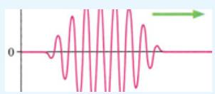
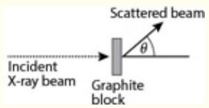
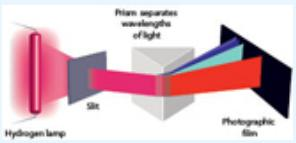
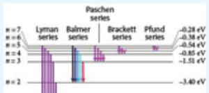
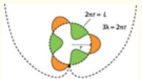
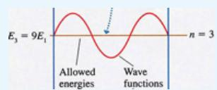
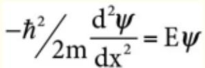
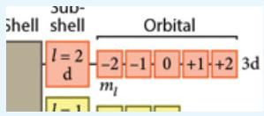
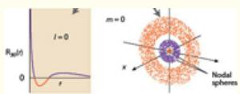
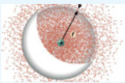

# 8 Quantum Mechanics, Wave-Particle Duality, and the Single Electron Atom


“The task is not so much to see what no one has yet seen; but to think what nobody has yet thought, about that which everybody sees.” ■

—Erwin Schrödinger

:::{figure} ../images/fig-p1-ch08-1.jpg
:name: fig-p1-ch08-1
:alt: Figure from the University Chemistry source textbook
:::

## Framework

Figure 8.1 displays a pattern of individual iron atoms on a copper surface by imaging the electron density with a sharpened tip of tungsten used to map the topography of the electron density surrounding individual atoms. If Figure 8.1 shows the position of individual atoms made of electrons, protons, and neutrons, all of which are particles, where does the apparent wave pattern come from? The image looks like a pond into which a stone has been thrown. How can this be?

:::{figure} ../images/fig-p1-ch08-2.jpg
:name: fig-p1-ch08-2
:alt: FIGURE 8.1 The observed position of individual iron atoms on flat copper arranged in a “corral” and detected with a scanning tunneling microscope (STM) has opened the atomic scale to the direct observation of electron density and atomic and
FIGURE 8.1 The observed position of individual iron atoms on flat copper arranged in a “corral” and detected with a scanning tunneling microscope (STM) has opened the atomic scale to the direct observation of electron density and atomic and molecular geometry.
:::


Atomic structure and the relationship between the spatial distribution of electrons in separated atoms vs. those same atoms in a molecular structure has always been a central challenge for chemistry. While we will develop an understanding of atomic structure, and the remarkable interplay between the wave properties of electrons and that of electromagnetic radiation, we move first to the forefront of research that is rapidly revealing revolutionary new developments in visualizing, imaging, and the physical manipulation of individual atoms.

Within the last few years, techniques have been developed that are capable of detailing the position of individual atoms as well as the distribution of electron density that constitutes the bonding geometry that establishes the structure of exotic new materials related to energy generation, nanoscale computing, memory storage devices, and drug delivery. Figure 8.1 is an image of individual iron atoms arranged on the surface of flat copper. The specific position of the “corral” of iron atoms was arranged by moving individual iron atoms with the tip of an extremely sharp needle.

Figure 8.2 displays the sequence by which the corral of iron atoms was assembled one by one. The technique is called scanning tunneling microscopy (STM). While the iron atoms form the circle or corral, the wave pattern of electron density confined within the corral represents direct evidence of the wave nature of electrons. Specifically, while electrons are viewed as identifiable particles, they possess a waveparticle duality that constitutes the foundation of quantum mechanics— the scientific foundation that underpins our understanding of atomic structure and of molecular bonding.

:::{figure} ../images/fig-p1-ch08-3.jpg
:name: fig-p1-ch08-3
:alt: FIGURE 8.2 The sequential placement of iron atoms in a ring using STM to create specific geometrical arrangements at the atomic scale.
FIGURE 8.2 The sequential placement of iron atoms in a ring using STM to create specific geometrical arrangements at the atomic scale.
:::


While it is both remarkable and counterintuitive, a major component in the solution of global scale energy demand for what will be 10 billion inhabitants of the planet lies within the atomic scale spatial domain dominated by quantum mechanics. There are many reasons for this: (1) the interaction of photons of light with molecular structures engages directly the wave properties of the electron and the particle properties of light, (2) the development of new materials at the scale of 10 to 100 atoms provides remarkable control over electrical properties for high speed computing and high density information storage, and (3) chemical processes at the 10 to 100 atom scale can be controlled by molecular selfassembly where the architecture of the system is controlled by moleculemolecule interactions opening up the new field of nanochemistry and the ability to design large structures from the “bottom up”—to build from the molecular level to the macroscopic.

When we come to understand and to utilize the principles that dictate the behavior of electrons and atoms in molecular bonding—the domain of quantum mechanics—we open new technologies that can very effectively and inexpensively generate electrical power from sunlight, and can create new materials capable of significantly reducing energy demand through far more efficient automobiles, high speed train systems and buildings. Technologies based on the principles of quantum mechanics can bring hundreds to thousands of people into meetings linked by the movement of electrons rather than the transport of materials or of people.

Thus we extend our exploration to the realm of the individual atom. From the principles that govern the structure of the individual atom, we will gain remarkable insight into the world of “nanomaterials” that constitute structures on the scale of $1 0 ^ { - 9 }$ meters where the principles of quantum mechanics play a central role. Figure 8.3 displays the image of a device developed to convert solar photons to electrons and to then collect those electrons with “wires” only ${ \sim } 1 0 ^ { - 6 } \mathrm { m }$ in width.

:::{figure} ../images/fig-p1-ch08-4.jpg
:name: fig-p1-ch08-4
:alt: FIGURE 8.3 Image of a microscopic array of the top side of a silicon wafer based photovoltaic cell with a low reflectivity surface. The surface appears blue-violet due to the silicon nitride antireflective coating. The photons of light from
FIGURE 8.3 Image of a microscopic array of the top side of a silicon wafer based photovoltaic cell with a low reflectivity surface. The surface appears blue-violet due to the silicon nitride antireflective coating. The photons of light from the sun generate electrons that are collected by the <40 micron silver conducting “wires” that appear gold-colored in the image.
:::


In Chapter 2 we reviewed the development of the atomic view of matter by John Dalton. But humans could not actually “see” individual atoms until the early 1980s. Then with the development of the STM— individual atoms of iron manipulated on a surface of copper opened a new era of visualization at the atomic level.

An inspection of Figure 8.1, taken by an STM, immediately raises three questions: (1) What are the waves that appear between the central point within the corral of iron atoms, (2) Why does the name of the device that made the observation contain the word “tunneling,” and (3) Why does the apparent wave pattern within the corral of iron atoms virtually mimic the waves created by throwing a stone into a pond, resulting in concentric rings of waves in water?

With the discovery of the electron by J. J. Thomson in 1897, electrons were viewed as particles. With the development of electromagnetic theory in the 19th century and the observed behavior of light, it was taken as a fundamental tenet of physics that electromagnetic radiation was a wave phenomenon. Electrons were particles, light was a wave. Any student of the physical world knew that to be true!

But as we will see, the behavior of an electron on the scale of an atom has far more in common with a violin string than it does with a particle such as the stone thrown into a pond that creates waves. But, as we will also see, the wave nature of the electron allows it to penetrate into places forbidden by what we know in our macroscopic world—such as how when an object strikes a wall of concrete it will stop, unable to penetrate the barrier.

Electrons, in sharp contrast, can penetrate into barriers without damaging themselves or the barrier they penetrate. This is called “tunneling”—an electron passing through a barrier and appearing on the other side unscathed. On the macroscopic scale it is as if we were riding on a roller coaster, as shown in Figure $\underline { { 8 . 4 } } ,$ and instead of moving from point A, with initial potential energy of mgh and kinetic energy of zero that would carry us (in the absence of friction) to point C, we actually “tunneled” through from point C to point E on the other side of the (energy) barrier! This phenomenon is treated in Case Study 8.1.

:::{figure} ../images/fig-p1-ch08-5.jpg
:name: fig-p1-ch08-5
:alt: FIGURE 8.4 Conservation of energy dictates that macroscopic devices, such as a roller coaster, are constrained by conservation of energy and the physical barrier of the track to remain between points A and C, if the roller coaster begins at
FIGURE 8.4 Conservation of energy dictates that macroscopic devices, such as a roller coaster, are constrained by conservation of energy and the physical barrier of the track to remain between points A and C, if the roller coaster begins at A with zero kinetic energy. In the world of quantum mechanics controlled by the wave properties of electrons, electrons can “tunnel” through barriers and emerge on the other side of the barrier. It is as though the roller coaster can reach point E without having to go over the barrier through point D.
:::


## Case Study 8.1 Quantum Mechanical Tunneling

:::{figure} ../images/fig-p1-ch08-6.jpg
:name: fig-p1-ch08-6
:alt: Figure from the University Chemistry source textbook
:::

In order to take an active and effective role in the big questions confronting modern society, we must be in command of the world of electrons and how they behave on the scale of single atoms to tens of atoms to thousands of atoms. The behavior of electrons at the nanoscale defines developments in energy generation, capture and storage, information technologies, computer design, medical imaging, battery technology, drug delivery, catalytic processes, molecular motors, and genetic mapping.

In 1986 Gerd Binnig and Heinrich Rohrer were awarded the Nobel prize in physics for recognizing a simple fact: If they could create a metal tip with a terminus comparable to the dimension of an atom, they could use this tunneling effect of electrons to “map” the presence of individual atoms on a surface by bringing the metal tip within approximately an atomic radius of an atom on the surface. They could measure the position of that atom by observing the current flow (the number of electrons passing per unit time) between that tip and the atom on the surface by holding the metal tip at a fixed electrical potential (voltage) difference with respect to the surface.

Although it took Binnig and Rhorer three years of intensive work to develop the extremely sharp metal tips required and to develop extremely precise positional control (both vertically and horizontally), their new scanning (movement of the tip) tunneling (electron tunneling) microscope (ability to see small objects) or STM proved to be exquisitely sensitive to features at the atomic scale. A new era was born. Not only could science now resolve spatial features at the atomic level, science could dream of new objects to construct at the atomic scale and to then view the handiwork directly.

Figure 8.5 shows a computer reconstruction of an STM needle point fabricated to achieve atomic level resolution. The operation of the STM is depicted in Figure 8.6, wherein the tip of the probe approaches the array of atoms on the surface and, by virtue of the voltage difference between the tip and the surface, electrons flow from the tip to the surface. The tunneling of the electrons is extremely sensitive to the potential barrier, which is controlled at a fixed voltage difference by the distance between the probe tip and the electron cloud of the atom on the surface. Thus, as the STM tip is moved across the surface, the flow of the electrons from the tip to the surface rises sharply when passing over the top of an atom. As the tip moves to a position between two atoms on the surface, the current decreases sharply because of the increased distance between the probe and any surface atom. By systematically observing the current through the STM tip as a function of horizontal position, the surface topography is determined.

:::{figure} ../images/fig-p1-ch08-7.jpg
:name: fig-p1-ch08-7
:alt: FIGURE 8.5 A computer image of the tungsten tip of an STM approaching within atomic dimensions of atoms on a surface. The electron flow (electric current) from the tungsten tip to the atoms in the surface is a sensitive function of the dist
FIGURE 8.5 A computer image of the tungsten tip of an STM approaching within atomic dimensions of atoms on a surface. The electron flow (electric current) from the tungsten tip to the atoms in the surface is a sensitive function of the distance from the probe tip to the electron cloud around each atom as well as the voltage between the tip of the probe and the surface.
:::


:::{figure} ../images/fig-p1-ch08-8.jpg
:name: fig-p1-ch08-8
:alt: FIGURE 8.6 The operation of the STM employs not only the sharpened tungsten tip shown in Figure 8.5, but also the use of piezoelectric crystals that either expand or contract depending on the voltage applied to the crystal. This provides th
FIGURE 8.6 The operation of the STM employs not only the sharpened tungsten tip shown in Figure 8.5, but also the use of piezoelectric crystals that either expand or contract depending on the voltage applied to the crystal. This provides the ability to very precisely control the vertical and horizontal position of the tip by simply changing the voltage across the piezoelectric crystals controlling the horizontal and vertical position of the tungsten tip with respect to the surface.
:::


The STM, and variations of the STM, have become both the “eyes” and the “hands” of cutting edge research because the high spatial resolution images carry information heretofore inaccessible to science and the ability to manipulate the position of individual atoms on a surface has opened a new field of atomic level architecture. We consider first the development of high density data storage and the remarkable potential increase in the density of stored information using atomic level nanostructures. Figure 8.7 displays an STM image of atom manipulation with STM tip. Bi adatoms are moved to form the “0” and “1” patterns on the surface of CeBi displayed in panel (a). The term “adatom” is commonly used in surface science to refer to an atom that lies on a crystal surface. Those patterns of adatoms in panel (a) can be used to store information on the surface at very high density serving the important objective of markedly increasing the amount of information storage per unit area. The distance between individual Bi atom centers is approximately 1 nm in the image, defining the remarkable spatial resolution of the STM. Panel (b) demonstrates the ability of STM to execute atom manipulation to construct a variety of functional structures on the surface for a range of applications in this rapidly developing field of research.

:::{figure} ../images/fig-p1-ch08-9.jpg
:name: fig-p1-ch08-9
:alt: FIGURE 8.7 STM image of atom manipulation with an STM tip. In panel (a) Bi adatoms are moved to form the “0” and “1” patterns on the surface of CeBi. Those patterns can be used to store information at very high density on the surface. Panel
FIGURE 8.7 STM image of atom manipulation with an STM tip. In panel (a) Bi adatoms are moved to form the “0” and “1” patterns on the surface of CeBi. Those patterns can be used to store information at very high density on the surface. Panel (b) displays another configuration of Bi adatoms on the surface of CeBi demonstrating the ability of STM to execute atom manipulation to construct multiple functional structures on the surface.
:::


Another domain that atomic level visualization using STM technology has opened up is in the area of carbon nanotubes, which can be formed with a range of diameters and lengths, creating the ability to “wire up” circuits on the scale of the atomic dimension. Figure 8.8 displays an STM image of these nanotubes of different diameters on a gold (Au) surface. The ability to both synthesize carbon nanotubes and to manipulate them on metal as well as electrically insulating surfaces has lead to the ability to tailor these carbon nanotubes into molecular scale nanowires with increasingly effective control over nanowire growth and geometry. Figure 8.9 displays nanowires with triangular joints linked to straight sections of controllable length. This provides the technological foundation for the fabrication of molecular scale nanocircuits that will revolutionize electronic circuit design.

:::{figure} ../images/fig-p1-ch08-10.jpg
:name: fig-p1-ch08-10
:alt: FIGURE 8.8 The advent of carbon nanotubes fabricated at selected diameters and in controlled lengths opens the possibility of far smaller electric circuits.
FIGURE 8.8 The advent of carbon nanotubes fabricated at selected diameters and in controlled lengths opens the possibility of far smaller electric circuits.
:::


:::{figure} ../images/fig-p1-ch08-11.jpg
:name: fig-p1-ch08-11
:alt: FIGURE 8.9 It is now possible to create nanotubes with articulated geometries to facilitate the wiring of nanocircuits critical to the continuing miniaturization of electronics and computers.
FIGURE 8.9 It is now possible to create nanotubes with articulated geometries to facilitate the wiring of nanocircuits critical to the continuing miniaturization of electronics and computers.
:::


With an increasing level of sophistication in the fabrication of nanowires, it is now possible to create radially layered tubes for a new generation of photovoltaic devices for converting sunlight to electrical power. These devices, shown in Figure 8.10, are capable of higher collection efficiency and they have a potentially lower cost of fabrication. This opens up the possibility of developing low cost techniques for converting sunlight to electrical power. The fundamentals of energy generation by solar radiation is treated in Case Study 8.2.

:::{figure} ../images/fig-p1-ch08-12.jpg
:name: fig-p1-ch08-12
:alt: FIGURE 8.10 By fabricating nanowires from radially layered tubes that are far more efficient at gathering photons, the efficiency for converting solar photons to electric power can be increased considerably over planar arrays.
FIGURE 8.10 By fabricating nanowires from radially layered tubes that are far more efficient at gathering photons, the efficiency for converting solar photons to electric power can be increased considerably over planar arrays.
:::

Case Study 8.2 Fundamentals of Energy Generation by Solar Radiation

:::{figure} ../images/fig-p1-ch08-13.jpg
:name: fig-p1-ch08-13
:alt: Figure from the University Chemistry source textbook
:::

## Chapter Core

## Road Map for Chapter 8

Development of the quantum theory of atomic structure begins with a treatment of the distinction between properties associated with waves and the properties associated with particles. At the macroscopic level of systems that we both observe on a day-to-day basis and manipulate with our hands, there is no ambiguity between waves and particles. As the behavior of electromagnetic radiation—light—was investigated with increasingly sophisticated experimental systems, it became clear that certain phenomena could only be explained by assigning particle behavior to light; these particles of light were termed “photons.” The fact that electromagnetic waves could possess particle behavior proved difficult for science to accept—but the evidence was irrefutable.

Along initially separate lines of investigation, it became increasingly clear that electrons, always assumed to be particles, exhibited wave properties when confined to spatial domains on the atomic scale. In order to reconcile the observed behavior of light emitted by atoms at discrete wavelengths, the structure of the atom was proposed—the Bohr atom—with electrons occupying discrete orbits about the nucleus. With the hypothesis put forward by the French physicist Louis de Broglie that the electron was in fact a “matter wave” with wavelength $\lambda = \mathrm { h / p }$ (where h is Planck's constant and p is the momentum of the electron) came the advent of quantum mechanics and the birth of modern physics. Quantum mechanics recognized that at the atomic scale, electrons were controlled by their wave properties, and those wave properties were in turn defined mathematically by the wavefunction, ψ, of the electron. The wavefunction in turn defined the distribution of electron density about the nucleus. The electrons thus occupy discrete geometric domains called “orbitals” that can be uniquely defined by “quantum numbers” that define the energy, shape, and orientation of the orbitals.

In the core of this chapter we thus explore the concepts displayed here.

<table><tr><td colspan="2">Road Map to Core Concepts</td></tr><tr><td>1. Origin of the Concept of the Photon: Einstein&#x27;s Union of Planck&#x27;s ε = nhv and the Photoelectric Effect</td><td></td></tr><tr><td>2. Momentum of the Photon</td><td></td></tr><tr><td>3. Spectroscopy and the Study of Light Emission from Atoms</td><td></td></tr><tr><td>4. Bohr Model of the Hydrogen Atom</td><td></td></tr><tr><td>5. Relationship Between the Bohr Model of the Hydrogen Atom and the Rydberg Expression</td><td></td></tr><tr><td>6. De Broglie and the Wave nature of the Electron</td><td></td></tr><tr><td>7. Particle-in-a-Box</td><td></td></tr><tr><td>8. The Schrödinger Equation</td><td></td></tr><tr><td>9. Quantum Numbers that Define the Radial and Angular Solutions to the Schrödinger Equation</td><td></td></tr><tr><td>10. Radial and Angular Solution to the Schrödinger Equation</td><td></td></tr><tr><td>11. Physical Interpretation of the Atomic Orbitals and the Radial Distribution Function</td><td></td></tr></table>

## Waves and Particles: From Separation to Union

## Separation of the Concepts of Waves and Particles

As observing creatures we are guided by what we see and what we experience. We first experiment by throwing stones into a lake, observing that the impact of the stone leaves a circular pattern of waves emanating from the point where the stone struck the water as shown in Figure 8.11. Obviously, while the impact of the stone resulted in the genesis of the wave pattern, they—the particle and the wave—are clearly independent and fully distinguishable at the spatial scale of our direct observation, the macroscopic world.

:::{figure} ../images/fig-p1-ch08-25.jpg
:name: fig-p1-ch08-25
:alt: FIGURE 8.11 When a stone is dropped into water, waves emanate radially from the center outward. At the macroscopic level, the stone is a particle and the disturbance in the water is a wave. The particle and the wave are distinct.
FIGURE 8.11 When a stone is dropped into water, waves emanate radially from the center outward. At the macroscopic level, the stone is a particle and the disturbance in the water is a wave. The particle and the wave are distinct.
:::


We also come to recognize that waves occur in many forms: ocean waves, light waves, sound waves; and that waves transmit energy, momentum, heat, and information from a source to a destination.

What we believe to be true, even what we imagine, is based almost entirely on what we can, or have, visualized. Electromagnetic radiation, light, is real and sensible, yet lacking in substance it appears to carry with it no momentum, no physical impulse. In stark contrast, matter can be physically grasped, it can be given a trajectory, and when matter collides with matter, considerable consequences can result from the combination of mass and velocity.

What we consider reasonable, what we term common sense, is built upon the accumulated evidence obtained in the macroscopic world around us. Our intuitive ability to judge the outcome of future events is constructed from observations of the macroscopic. But just as our intuition leaves us unprepared to define the consequences of a planet like ours with a population of 10 billion people, each with a standard of living comparable to developed countries today, so too does what we expect by projecting our macroscopic intuition on the microscopic—the atomic level—prove to be wrong.

## Einstein, the Photon, and the Union of Planck and the Photoelectric Effect

Two cornerstones of scientific thinking were, at the opening of the 20<sup>th</sup> century, viewed as unassailable. The first, having stood the test of 250 years of experimental verification, were Newton's laws of motion and the mechanics associated therewith. The second were the laws governing electromagnetic radiation developed by Maxwell and published in 1862. Newtonian mechanics explained the behavior of particles. Maxwell's equations explained the wave properties of electromagnetic radiation. Particles were particles and waves were waves. The distinction was clear-cut and unequivocal. Particles were categorized as entities that possessed welldefined masses, trajectories, velocities, energies, and momenta. Electromagnetic waves, in sharp contrast, possessed no apparent mass, could not be specifically located, and were best characterized in terms of their characteristic frequency and wavelength. Waves also possessed the characteristics that they could interact, such as to produce constructive (additive) and destructive (subtractive) interference because the amplitude of two or more waves summed algebraically at any point in space.

As discussed in Chapter 1, the work of Max Planck in the study of radiation from blackbody cavities and the resulting “ultraviolet catastrophe” marked the beginning of the end for the clear distinction between the wave nature and the particle nature of natural phenomena.

:::{figure} ../images/fig-p1-ch08-26.jpg
:name: fig-p1-ch08-26
:alt: FIGURE 8.12 It was Max Planck who resolved the discrepancy between the wavelength dependence of the observed radiation from a blackbody cavity and the predicted dependence based on Maxwell's equations for electromagnetic radiation. Planck r
FIGURE 8.12 It was Max Planck who resolved the discrepancy between the wavelength dependence of the observed radiation from a blackbody cavity and the predicted dependence based on Maxwell's equations for electromagnetic radiation. Planck reconciled the difference by proposing that electromagnetic radiation was composed of photons of light with energy $\begin{array} { r } { \mathfrak { E } _ { \mathfrak { p h o t o n } } = \mathfrak { h v } . } \end{array}$
:::


Recall from Chapter 1 that the only way Planck could reconcile the observed wavelength dependence of the intensity of radiation from a blackbody cavity was if light was comprised of individual energy bundles with energy ε = nhν where ε was the energy of the individual photons, n was an integer, ν was the frequency of the radiation from the blackbody, and h was a constant.

Relating Frequency and Wavelength of Electromagnetic Radiation. Most of the light from a sodium vapor lamp has a wavelength of 589 nm. What is the frequency of this radiation?

## Solution

We can first convert the wavelength of the light from nanometers to meters and then apply the equation linking wavelength, frequency, and the speed of light: $\lambda \nu = c$

```{math}
:label: eq-p1-ch08-1
\begin{array}{l} \lambda = 5 8 9 \mathrm{nm} \times \frac {1 \times 1 0 ^ {- 9} \mathrm{m}}{1 \mathrm{nm}} = 5. 8 9 \times 1 0 ^ {- 7} \mathrm{m} \\ c = 2. 9 9 8 \times 1 0 ^ {8} \mathrm{ms} ^ {- 1} \\ \nu = ? \end{array}
```


Rearrange $\lambda \nu = c$ to the form $\nu = c / \lambda ,$ , and solve for ν.

```{math}
:label: eq-p1-ch08-2
\begin{array}{r l} \nu & = \frac {c}{\lambda} = \frac {2 . 9 9 8 \times 1 0 ^ {8} \mathrm{ms} ^ {- 1}}{5 . 8 9 \times 1 0 ^ {- 7} \mathrm{m}} = 5. 0 9 \times 1 0 ^ {1 4} \mathrm{s} ^ {- 1} \\ & = 5. 0 9 \times 1 0 ^ {1 4} \mathrm{Hz} \end{array}
```


Practice Example A: The light from red LEDs (light-emitting diodes) is commonly seen in many electronic devices. A typical LED produces 690 nm light. What is the frequency of this light?

Practice Example B: An FM radio station broadcasts on a frequency of 91.5 megahertz (MHz). What is the wavelength of these radio waves in meters?

Prior to and during the intensifying study of blackbody radiation leading to Planck's highly controversial conclusion, Heinrich Hertz (for whom the unit of frequency is named) was carrying out a series of experiments using light of different wavelengths incident on metal surfaces with the apparatus shown in Figure 8.13. These observations investigated the emission of electrons from the metal surfaces as Figure 8.13 shows. These emitted electrons were called “photoelectrons” because they were electrons liberated from the metal surface by light. The concept of light as a wave would imply that, with the impinging radiation, energy would be imparted to the metal surface until sufficient energy was “stored up” to release the photoelectron from the surface of the metal. With this wave picture of light there would be a delay as the energy was stored in the metal. That delay would decrease as the intensity of light increased, and radiation with longer wavelengths could release a photoelectron simply by increasing the delay between when the radiation first impinged on the surface and when the electron was released.

:::{figure} ../images/fig-p1-ch08-27.jpg
:name: fig-p1-ch08-27
:alt: FIGURE 8.13 The apparatus for observing the photoelectric effect consists of an evacuated chamber into which photons of different wave-lengths can be focused on a metal plate. A voltage applied to a collecting electrode measures the flow of
FIGURE 8.13 The apparatus for observing the photoelectric effect consists of an evacuated chamber into which photons of different wave-lengths can be focused on a metal plate. A voltage applied to a collecting electrode measures the flow of electrons liberated from the metal surface by the incident photons.
:::


Yet this is not what was observed. Rather than a threshold for photoelectron release determined by the total amount of energy added to the metal surface by the impinging electromagnetic wave, the threshold for photoelectron release was determined by the frequency of the radiation. Below a threshold frequency, ${ \bf { \delta } } _ { v _ { 0 } } ,$ , no photoelectrons were emitted, no matter how long the light impinged on the metal surface. Each metal possessed a different threshold frequency, $\nu _ { 0 } .$ . In addition, when that threshold frequency, $\mathbf { v } _ { 0 } ,$ was reached, there was no delay before photoelectrons were ejected from the surface. It was as though a single “particle” of light knocked a single photoelectron from the surface of the metal. When the photoelectron's kinetic energy was plotted against the frequency of the impinging light, as shown in Figure 8.14, there was an intercept, $\mathbf { v } _ { 0 } ,$ and a slope that represented a linear increase in the relationship between maximum kinetic energy of the photoelectron and the frequency of the incident radiation. Furthermore, if the intensity of the radiation was increased but the frequency was kept constant, a greater number of photoelectrons was emitted from the surface, but the maximum kinetic energy of the photoelectrons was proportional to the frequency of that radiation.

:::{figure} ../images/fig-p1-ch08-28.jpg
:name: fig-p1-ch08-28
:alt: Figure from the University Chemistry source textbook
:::

The kinetic energy of the emitted photoelectron is directly proportional to the frequency of light striking the surface of the metal.

FIGURE 8.14 The photoelectric effect provided key evidence that electromagnetic radiation had particle properties as well as wave properties. Experiments done by shining light on the surface of metals and measuring the energy of the electrons emergent from the surface demonstrated that no electrons were released by the surface unless the light had a frequency higher than a threshold frequency $\mathsf { v } _ { 0 }$ . Moreover, the energy of the “photoelectron” released was proportional to the frequency of light above that threshold $\mathsf { v } _ { 0 } .$ . No amount of light intensity when the frequency of the light was less than $\mathsf { v } _ { 0 }$ resulted in the release of a photoelectron.

The observation that the emission of the electrons from the surface of the metal was independent of the intensity of radiation falling on the surface of the metal was in direct conflict with Maxwell's theory of light, which was built upon the wave nature of electromagnetic radiation. That wave-based theory of radiation stipulated that the energy delivered by electromagnetic radiation was proportioned to the intensity of the light. Thus, given this wave formulation of light, how could both the threshold for photoelectron emission and the kinetic energy of the emitted electrons be independent of the intensity of light impinging on the metal surface?

The suggestion for a solution to this dilemma emerged from Planck's hypothesis that the radiant energy of the light striking the surface of the metal arrives in discrete packets such that the energy of each packet of light delivered was given by the Planck formula

```{math}
:label: eq-p1-ch08-3
\mathbf {E} = \mathbf {h} \mathbf {v}
```


## Check Yourself 2

Using Planck's Equation to Calculate the Energy of Photons of Light. For radiation of wavelength 242.4 nm, the longest wavelength that will bring about the photodissociation of $\mathrm { O } _ { 2 } ,$ what is the energy of (a) one photon, and (b) a mole of photons of this light?

## Solution

(a) To use Planck's equation, we need the frequency of the radiation. This we can get from the equation $\lambda \nu = c$ after first expressing the wavelength in meters.

```{math}
:label: eq-p1-ch08-4
\nu = \frac {c}{\lambda} = \frac {2 . 9 9 8 \times 1 0 ^ {8} \mathrm{ms} ^ {- 1}}{2 4 2 . 4 \times 1 0 ^ {- 9} \mathrm{m}} = 1. 2 3 7 \times 1 0 ^ {1 5} \mathrm{s} ^ {- 1}
```


Planck's equation is written for one photon of light. We emphasize this by including the unit, photon<sup>-1</sup>, in the value of h.

```{math}
:label: eq-p1-ch08-5
\begin{array}{r l} E & = h \nu = 6. 6 2 6 \times 1 0 ^ {- 3 4} \frac {\mathrm{Js}}{\text {photon}} \times 1. 2 3 7 \times 1 0 ^ {1 5} \mathrm{s} ^ {- 1} \\ & = 8. 1 9 6 \times 1 0 ^ {- 1 9} \mathrm{J/photon} \end{array}
```


(b) Once we have the energy per photon, we can multiply it by the Avogadro's number to convert to a per-mole basis.

```{math}
:label: eq-p1-ch08-6
\begin{array}{r l} E & = 8. 1 9 6 \times 1 0 ^ {- 1 9} \mathrm{J/photon} \times 6. 0 2 2 \times 1 0 ^ {2 3} \text { photons / mol } \\ & = 4. 9 3 6 \times 1 0 ^ {5} \mathrm{J/mol} \end{array}
```


(This quantity of energy is sufficient to raise the temperature of 10.0 L of water by $\mathbf { 1 1 . 8 \ ^ { \circ } C . ) }$

Practice Example A: The protective action of ozone in the atmosphere comes through ozone's absorption of UV radiation in the 230 to 290 nm wavelength range. What is the energy, in kilojoules per mole, associated with radiation in this wavelength range?

Practice Example B: Chlorophyll absorbs light at energies of $3 . 0 5 6 \times$ 10<sup>-19</sup> J/photon and $\mathbf { 4 . 4 1 4 \times 1 0 ^ { - 1 9 } }$ J/photon. To what color and frequency do these absorptions correspond?

We can sketch this confluence of ideas by asking another question: What did the combination of the photoelectric effect and blackbody radiation tell us? This linkage is diagrammed in Figure 8.15. It was Einstein in 1905 who put these lines of evidence together and postulated that these quanta of energy, E = hν, implied that the energy of light was delivered to the metal surface as particles of light energy, which he termed photons. This interpretation by Einstein created a direct link between the collision of a single photon with energy E = hν, and a single electron within the metal, releasing that electron at any energy above the threshold energy $\mathrm { E } _ { 0 } = \mathrm { h v } _ { 0 }$ Any photon with energy less than $\mathrm { E } _ { 0 } = \mathrm { h v } _ { 0 }$ was unable to release the electron. Any photon with energy greater than $\mathrm { E } _ { 0 } = \mathrm { h v } _ { 0 }$ could release an electron from the surface of the metal and if an electron was released, it would leave the surface with kinetic energy equal to the difference between the original energy of the incident photon, E = hν, and the threshold energy $\mathrm { E } _ { 0 } = \mathrm { h v } _ { 0 }$ required to free the electron. Thus, with KE = kinetic energy of the liberated electron, we can write

```{math}
:label: eq-p1-ch08-7
\mathrm{KE} = \mathrm{hv} - \mathrm{hv} _ {0} = \mathrm{h} (\mathrm{v} - \mathrm{v} _ {0}) \qquad \mathrm{for} \mathrm{v} > \mathrm{v} _ {0}
```


KE = 0 for ν ≤ ν<sub>0</sub>
:::{figure} ../images/fig-p1-ch08-29.jpg
:name: fig-p1-ch08-29
:alt: FIGURE 8.15 It was Einstein, in 1905, who combined evidence from Planck's quantization of blackbody radiation and evidence from the photoelectric effect, to hypothesize that light consisted of particles, or photons.
FIGURE 8.15 It was Einstein, in 1905, who combined evidence from Planck's quantization of blackbody radiation and evidence from the photoelectric effect, to hypothesize that light consisted of particles, or photons.
:::


This quantity $\begin{array} { r } { \mathrm { ~ E } _ { 0 } ~ = ~ \mathrm { h v } _ { \mathrm { o } } , } \end{array}$ the minimum energy required to release an electron from the metal surface, is different for each metal and is termed the work function of the metal.

Thus we have the energy level diagram for the interaction of the photon, hν, with the electron bound to the surface of the metal by an energy hν<sub>0</sub> as shown in Figure 8.16.

:::{figure} ../images/fig-p1-ch08-30.jpg
:name: fig-p1-ch08-30
:alt: FIGURE 8.16 The electron is held within a potential energy well of depth mathematical notation by the metal surface. When a photon of energy hν mathematical notation is absorbed, the electron is released from the metal surface with kinetic
FIGURE 8.16 The electron is held within a potential energy well of depth $\mathsf { h v } _ { 0 }$ by the metal surface. When a photon of energy hν $> \mathsf { h v } _ { 0 }$ is absorbed, the electron is released from the metal surface with kinetic energy $\mathsf { K E } = \mathsf { h v } - \mathsf { h v } _ { 0 } = \mathsf { h } \left( \mathsf { v } - \mathsf { v } _ { 0 } \right)$
:::


In summary, the electron is bound in a potential energy well of depth h $\nu _ { 0 } .$ If the photon has energy hν $> \mathrm { { \ h v } } _ { 0 } ,$ the electron can escape the potential energy well and leave the surface of the metal with kinetic energy, KE, equal to the difference in energy between the incident photon, hν, and the binding energy, $\mathrm { h v } _ { 0 } .$

To Einstein the evidence was overwhelming. Specifically that light must exhibit particle properties—that light must be comprised of what he termed “photons.” Yet the very idea that light could exhibit both wave and particle properties was, for the majority of the scientific community, unimaginable.

This study of the interaction of light with the surface of metals became a significant field of research. The linkage between photons of frequency ν and wavelength $\lambda = \mathbf { c } / \nu$ with electron ejection from metal surfaces introduced yet another unit of energy—the electron volt or eV. One electron volt is the energy acquired by an electron when it falls through a potential of 1 volt. As we will see, it is very convenient unit of energy for many applications.

The charge on the electron, as we discussed in Chapter 2, is $\mathbf { 1 . 6 0 2 \times 1 0 ^ { - 1 9 } }$ coulomb or $\mathbf { 1 . 6 0 2 \times 1 0 ^ { - 1 9 } }$ C. We also know that one volt is equal to a joule/coulomb or $\textbf { 1 V } = \textbf { 1 J } / \mathrm { C }$ . Thus if an electron volt is the energy of one electron falling through a potential of 1 volt

```{math}
:label: eq-p1-ch08-8
1 \mathrm{eV} = (1. 6 0 2 \times 1 0 ^ {- 1 9} \mathrm{C}) 1 \mathrm{V} = 1. 6 0 2 \times 1 0 ^ {- 1 9} \mathrm{J}
```


## Check Yourself 3

## Analyzing the Photoelectric Effect.

The speed of an electron emitted from the surface of a sample of potassium by a photon is 668 km $\cdot \mathbf { s } ^ { - 1 }$ . (a) What is the kinetic energy of the ejected electron? (b) What is the wavelength of the radiation that caused photoejection of the electron? (c) What is the longest wavelength of the electromagnetic radiation that could eject electrons from potassium? The work function of potassium is 2.29 eV.

Approach (a) Find the kinetic energy of the ejected electron from $E _ { \mathrm { k } } =$ $\mathbf { 1 } / 2 \ m _ { \mathrm { e } } \mathbf { V } ^ { 2 }$ To use SI base units, first convert the speed to meters per second. (b) The energy of the ejected electron is equal to the difference in energy between the incident radiation and the work function. The photon needs to provide enough energy to eject the electron from the surface (the work function) as well as to impart a velocity of 668 $\mathrm { k m } { \cdot } \mathbf { s } ^ { - 1 }$ to the electron. Convert that value of the work function into joules and use $h v =$ $\mathrm { K E } + h v _ { \mathrm { o } }$ to determine the value of hv for the photon. Then use $\lambda v = c$ to convert that energy to wavelength. (c) The longest wavelength of radiation that can eject electrons from a substance is the wavelength that results in the ejected electron having zero kinetic energy.

Solve:

(a) From $E _ { \mathrm { k } } = { \frac { 1 } { 2 } } m \mathrm { v } ^ { 2 } ,$

```{math}
:label: eq-p1-ch08-9
\begin{array}{r l} E _ {\mathrm{k}} & = \frac {1}{2} \times (9. 1 0 9 \times 1 0 ^ {- 3 1} \mathrm{kg}) \times (6. 6 8 \times 1 0 ^ {5} \mathrm{m} \cdot \mathrm{s} ^ {- 1}) ^ {2} \\ & = 2. 0 3 \times 1 0 ^ {- 1 9} \mathrm{J} \end{array}
```


(b) Convert the work function from electronvolts to joules.

```{math}
:label: eq-p1-ch08-10
2. 2 9 \mathrm{eV} \times \frac {1 . 6 0 2 \times 1 0 ^ {- 1 9} \mathrm{J}}{1 \mathrm{eV}} = 3. 6 7 \times 1 0 ^ {- 1 9} \mathrm{J}
```


From

```{math}
:label: eq-p1-ch08-11
\frac {1}{2} m _ {\mathrm{e}} \mathrm{v} ^ {2} = h \nu - h \nu_ {0}, h \nu = h \nu_ {0} + \frac {1}{2} m _ {\mathrm{e}} \mathrm{v} ^ {2} = h \nu_ {0} + E _ {\mathrm{k}},
```


```{math}
:label: eq-p1-ch08-12
h \upsilon = 3. 6 7 \times 1 0 ^ {- 1 9} \mathrm{J} + 2. 0 3 \times 1 0 ^ {- 1 9} \mathrm{J} = 5. 7 0 \times 1 0 ^ {- 1 9} \mathrm{J}
```


so

```{math}
:label: eq-p1-ch08-13
\nu = \frac {5 . 7 0 \times 1 0 ^ {- 1 9} \mathrm{J}}{h} = \frac {5 . 7 0 \times 1 0 ^ {- 1 9} \mathrm{J}}{6 . 6 3 \times 1 0 ^ {- 3 4} \mathrm{J} \cdot \mathrm{s}} = 8. 6 0 \times 1 0 ^ {1 4} / \mathrm{s}
```


Now use $\lambda = c / v$ :

```{math}
:label: eq-p1-ch08-14
\begin{array}{r l} \lambda = & \frac {(3 . 0 0 \times 1 0 ^ {8} \mathrm{m} \cdot \mathrm{s} ^ {- 1}) \times (6 . 6 2 6 \times 1 0 ^ {- 3 4} \mathrm{J} \cdot \mathrm{s})}{5 . 7 0 \times 1 0 ^ {- 1 9} \mathrm{J}} \\ = & 3. 4 9 \times 1 0 ^ {- 7} \mathrm{m} \quad \text { or } \quad 3 4 9 \mathrm{nm} \end{array}
```


(c) To find the longer wavelength of radiation able to eject an electron, set $E _ { \mathrm { k } } = \mathbf { 0 }$ in Eq. 5, so $h v = h v _ { \mathrm { o } }$ , and therefore $\lambda = c h / h v _ { \mathrm { o } }$

```{math}
:label: eq-p1-ch08-15
\begin{array}{r l} \lambda & = \frac {\left(3 . 0 0 \times 1 0 ^ {8} \mathrm{m} \cdot \mathrm{s} ^ {- 1}\right) \times \left(6 . 6 2 6 \times 1 0 ^ {- 3 4} \mathrm{J} \cdot \mathrm{s}\right)}{3 . 6 7 \times 1 0 ^ {- 1 9} \mathrm{J}} \\ & = 5. 4 2 \times 1 0 ^ {- 7} \mathrm{m} \quad \text { or } \quad 5 4 2 \mathrm{nm} \end{array}
```


Practice Example 1: The work function of zinc is 3.63 eV. What is the longest wavelength of electromagnetic radiation that could eject electrons from zinc?

[Answer: 342 nm]

Practice Example 2: The speed of an electron that is emitted from the surface of a sample of zinc by a photon is $7 8 5 ~ \mathrm { k m } { \cdot } \mathrm { s } ^ { - 1 }$ . (a) What is the kinetic energy of the ejected electron? (b) The work function of zinc is 3.63 eV. What is the wavelength of the radiation that caused photoejection of the electron?

## Momentum of the Photon

The interaction of photons with electrons demonstrates that the photon possesses energy and it can transfer that energy to an electron. But if the photon has energy and it can be treated as a particle, does it possess momentum? Does it possess mass?

To answer these questions, we can obtain the energy of the photon from Einstein's equation $\mathrm { E } = \mathrm { m c } ^ { 2 }$ where the mass refers to the inertial mass of the photon that is a result of the energy possessed by the photon. We know that the energy of the photon is E = hν, so equating those two expressions for the energy of the photon yields

```{math}
:label: eq-p1-ch08-16
\mathrm{E} = \mathrm{mc} ^ {2} = \mathrm{hv} = (\mathrm{hc} / \lambda)
```


```{math}
:label: eq-p1-ch08-17
\mathrm{since} \lambda v = c
```


The momentum of the photon is mc so

```{math}
:label: eq-p1-ch08-18
\mathrm {p_ {phot} = mc = h/ \lambda_ {phot}}
```


So while the rest mass of the photon is zero, this calculation of the momentum of the photon suggests that the momentum of the photon is not only nonzero, but should be a measurable quantity.

The momentum of the photon was measured in 1923 by Compton, using a beam of x-rays (photons) incident on a sample of graphite as shown in Figure 8.17a. When photons were observed after they passed through the graphite block, there were some photons with an identical wavelength as those incidents on the graphite block. Those photons had passed through the graphite block without colliding with any material. However, there was another group of photons emergent from the back side of the graphite block that were characterized by a longer wavelength. Those photons, Compton hypothesized, had a longer wavelength because they had lost energy by collision with electrons in the graphite. Compton designated those photons (those with lower energy) as scattered photons with wavelength $\lambda _ { \mathrm { s } }$ as shown in Figure 8.17b.

:::{figure} ../images/fig-p1-ch08-31.jpg
:name: fig-p1-ch08-31
:alt: FIGURE 8.17 Compton measured the momentum of the photon by using high energy X-rays impinging on a graphite block. The graphite block bonds electrons with a bonding energy much less than the energy of the X-ray photon so electrons are essen
FIGURE 8.17 Compton measured the momentum of the photon by using high energy X-rays impinging on a graphite block. The graphite block bonds electrons with a bonding energy much less than the energy of the X-ray photon so electrons are essentially unbound within the graphite block when struck by a photon. The transfer of momentum from the photon to the electron removes momentum from the photon, shifting its wavelength accordingly.
:::


The key is that the energy binding outer electrons in graphite is very small compared to the energy of the x-ray photon. Therefore the electron behaves as a free electron suspended in the block of graphite.

If we assume that we have a simple system of a photon (with energy hν and momentum $\mathrm { p } _ { \mathrm { p h o t } } = \mathrm { h } / \lambda _ { \mathrm { p h o t } } )$ and an electron (with mass $\mathrm { m _ { e } ) }$ , then conservation of energy and momentum in this collision yields a wavelength shift of

```{math}
:label: eq-p1-ch08-19
\lambda_ {\mathrm{s}} - \lambda_ {\mathrm{i}} = \Delta \lambda = \mathrm{h} / \mathrm {m_ {e} c(1- \cos\theta)}
```


where the geometry of the collision is displayed in Figure 8.17a. In our expression for $\varDelta \lambda _ { \mathrm { { \scriptsize ; } } }$ , the wavelength shift between the incident and scattered photon is $\Delta \lambda , \mathrm { m _ { e } }$ is the mass of the electron, θ is the angle measured from the incident direction, h is Planck's constant, and c is the speed of light. But the key point is this: the observed wavelength shift $\Delta \lambda = \lambda _ { \mathrm { s } } - \lambda _ { \mathrm { i } }$ was in excellent agreement with the calculated wavelength shift when the momentum of the x-ray photon was taken to be $\mathrm { h } / \lambda$ . This was compelling evidence that the photon indeed carries a momentum of ${ \mathrm { p } } = { \mathrm { h } } / \lambda$

The fact that a photon of zero rest mass has a defined momentum that is directly observable held great importance for the development of the idea of wave-particle duality of photons.

It was Einstein, in 1905, who explained these results by proposing that light behaves as a particle—a particle he termed a photon of light with energy E = hν, where ν is the frequency of radiation and h is a constant—Planck's constant, in fact, the same quantity that Max Planck invoked to explain blackbody radiation.

```{math}
:label: eq-p1-ch08-20
\mathrm{p} = \mathrm{h} / \lambda
```


An important consequence of recognizing that the photon has momentum p $= ~ \mathrm { { h } } / \lambda$ is that, just as the energy of a photon is quantized, so too is its momentum. Momentum is imparted by photons to their target in discrete parcels of h $/ \lambda$ in the same way energy is delivered in units of hν. What ties these ideas together is Planck's constant h, which was developing into a quantity of great fundamental importance. Planck's constant thus represented an indivisible amount of energy associated with a quantum of light but linked as well to the structure of matter.

The immutable barrier between particle behavior and wave behavior, built from observations of the macroscopic world, was beginning to crumble as science pressed toward the microscopic. To possess mass, momentum, and physical impact is to be a particle. To have a wavelength, to interfere, and to diffract is to be a wave. To be a photon, however, is to posses both the attributes of a particle and of a wave. The photon can collide like a projectile yet interfere like a wave.

## Check Yourself 4

Calculate the momentum of an X-ray photon with a wavelength of 0.17 nm. How does this compare with the momentum of an electron that has been accelerated through a potential difference of 100 volts?

Answer: The momentum of the photon is given by the equation:

```{math}
:label: eq-p1-ch08-21
p = \frac {h}{\lambda} = \frac {6 . 6 2 6 \times 1 0 ^ {- 3 4} \mathrm{Js}}{0 . 1 7 \times 1 0 ^ {- 9} \mathrm{m}} = 3. 9 \times 1 0 ^ {- 2 4} \mathrm{kgms} ^ {- 1}
```


In this problem the velocity of the electron is much less than the velocity of light and relativistic corrections to the mass need not be made. Under these circumstances the momentum of the electron, p, can be obtained from the classical equation relating energy and momentum:

```{math}
:label: eq-p1-ch08-22
E = \frac {1}{2} m v ^ {2} = \frac {p ^ {2}}{2 m}
```


where v is the velocity and m is the mass of the electron. Thus:

```{math}
:label: eq-p1-ch08-23
p = \sqrt {2 m E}
```


The energy is equal to the electronic charge multiplied by the voltage. Thus:

```{math}
:label: eq-p1-ch08-24
E = (1. 6 0 2 \times 1 0 ^ {- 1 9} \mathrm{C}) \times (1 0 0 \mathrm{V}) = 1. 6 0 2 \times 1 0 ^ {- 1 7} \mathrm{J}
```


And thus the momentum of the electron is

```{math}
:label: eq-p1-ch08-25
\begin{array}{r l} p & = \sqrt {2 m E} = \sqrt {2 \times (9 . 1 0 9 \times 1 0 ^ {- 3 1} \mathrm{kg}) \times (1 . 6 0 2 \times 1 0 ^ {- 1 7} \mathrm{J})} \\ & = 5. 4 0 \times 1 0 ^ {- 2 4} \mathrm{kgms} ^ {- 1} \end{array}
```


It can be seen that the momenta of the electron and the X-ray photon have similar magnitudes.

## Spectroscopy and the Study of Light Emission from Atoms

While human sentiment gave grudgingly to the idea that light could somehow exhibit the characteristics of a particle, no one believed in the early part of the $2 0 ^ { \mathrm { { t h } } }$ century that particles could exhibit wave character. But information was pouring in from yet another domain, that of spectroscopy—the study of light emitted by atoms and molecules and separated into specific wavelengths by devices such as a prism as shown in Figure 8.18.

:::{figure} ../images/fig-p1-ch08-32.jpg
:name: fig-p1-ch08-32
:alt: FIGURE 8.18 The remarkable, sharply defined emission lines that emanate from electrical discharge tubes that are separated in wavelength by a prism proved to be critically important to developing an understanding of atomic structure.
FIGURE 8.18 The remarkable, sharply defined emission lines that emanate from electrical discharge tubes that are separated in wavelength by a prism proved to be critically important to developing an understanding of atomic structure.
:::


This spectroscopic evidence was extracted from a variety of systems—some using high temperature flames to vaporize metals and some using discharge tubes that applied a high voltage between two electrodes within a sealed tube containing a specific gas such as hydrogen, helium, or neon. This discharge tube was similar to the one J. J. Thomson used in the discovery of the electron, and it was also used increasingly by placing small amounts of metal, such as mercury or strontium, within the sealed tube. In all cases, spectacular individual emission lines were revealed within the spectra obtained by the prism apparatus used to separate or “disperse” the light emitted from the discharge tube. For each element contained within the discharge tube, a unique set of lines were observed by the “spectrometer” as shown in Figure

8.18. It was the series of discrete, separated emission lines of limited number from a given element that began to suggest that the pattern of the emission lines could be quantitatively deciphered and analytically or mathematically represented.

The spectrum of atomic hydrogen was the first to yield a simple relationship between the wavelength of emitted light from the atom and a mathematical expression linking all the observed lines in the spectrum to a single simple equation. These lines in the spectrum of atomic hydrogen extend from the infrared to the visible region to the “vacuum ultraviolet” so named because, as we will see, molecular oxygen absorbs radiation between 100 and 200 nm. Thus $\mathrm { O } _ { 2 }$ must be pumped out of any system observing radiation in this wavelength interval. For that reason a vacuum is used to study radiation in the region between 100 and 200 nm, thereby creating the term vacuum ultraviolet.

The full spectrum of atomic hydrogen is displayed in Figure 8.19 showing the “ultraviolet series” in the vicinity of 100nm, the “visible series” from 400 to 750 nm and the “infrared series” from 800 to 2000 nm.

:::{figure} ../images/fig-p1-ch08-33.jpg
:name: fig-p1-ch08-33
:alt: FIGURE 8.19 The atomic emission lines of hydrogen extend from the ultraviolet through the visible to the infrared. This relatively simple progression of atomic emission lines provided the first quantitative structural information of atomic
FIGURE 8.19 The atomic emission lines of hydrogen extend from the ultraviolet through the visible to the infrared. This relatively simple progression of atomic emission lines provided the first quantitative structural information of atomic hydrogen.
:::


What was discovered was that within a given series, the wavelength of the emitted light could be calculated from the disarmingly simple expression

```{math}
:label: eq-p1-ch08-26
\big / \lambda = R _ {\mathrm{H}} \left(\frac {1}{n _ {\mathrm{f}} ^ {2}} - \frac {1}{n _ {\mathrm{i}} ^ {2}}\right)
```


where $\lambda$ was the specific wavelength of emitted radiation, ${ \sf R } _ { \mathrm { H } }$ was a constant, called the Rydberg constant, $\mathbf { n } _ { \mathrm { f } }$ was the integer common to each series of spectral lines (i.e. infrared series, visible series, etc.), and $\mathbf { n } _ { \mathrm { i } }$ was a set of integers corresponding to each of the several lines in the series. The Rydberg constant for hydrogen always had the same value, independent of the series; its value was determined to be $\mathbf { R } = \mathbf { 1 . 0 9 } 7 \times \mathbf { 1 0 } ^ { 7 } \mathbf { m } ^ { - 1 }$ . The “visible series” had a value of $\mathbf { n } _ { \mathrm { f } } = 2$ such that all lines in the series could be calculated with $\mathtt { n _ { i } } = 3 .$ 4, 5, 6, etc. The “ultraviolet series” corresponded to a value of $\mathbf { n } _ { \mathrm { f } } = \mathbf { 1 }$ such that all lines in the series could be calculated with ${ \mathfrak { n } } _ { \mathrm { i } } = 2 , 3 , 4 , 5$ , etc. The Rydberg equation $\mathrm { 1 / \lambda = R _ { H } ( 1 / n _ { f } ^ { 2 } - 1 / n _ { i } ^ { 2 } ) }$ brought both a quantitative foundation to studies of molecular structure and the clear recognition that science could not explain why the equation worked! There was no model for atomic structure and no coherent theory to link the observed spectra of atoms to a picture of the atom's architecture.

## Bohr Model of the Hydrogen Atom

A young Danish physicist, Niels Bohr, went to England immediately after receiving his PhD to work with Rutherford who had just proposed his nuclear model of the atom. Bohr was interested in building a new model of the atom using three lines of evidence: (1) the Rutherford picture of negatively charged electrons attracted to a far more massive positively charged nucleus, (2) the spectroscopic information defining the sharp atomic emission lines from the hydrogen atom, and (3) the concept of the photon of light with energy E = hν where ν is the frequency of the radiation.

From those distinct lines of evidence Bohr put forward a radically new model of the atom with the following assertions:

1. The hydrogen atom consists of a negatively charged electron that can occupy one of several circular orbits about the central, positively charged nucleus, as shown in Figure 8.20.

:::{figure} ../images/fig-p1-ch08-34.jpg
:name: fig-p1-ch08-34
:alt: FIGURE 8.20 The Bohr model of atomic hydrogen placed the electron in specific orbits around the nucleus at the center of the atom. Each orbit was designated by a principal quantum number n, with n = 1 assigned to the inner, lowest energy or
FIGURE 8.20 The Bohr model of atomic hydrogen placed the electron in specific orbits around the nucleus at the center of the atom. Each orbit was designated by a principal quantum number n, with n = 1 assigned to the inner, lowest energy orbit.
:::


2. Those atoms have only certain allowable energy levels called “stationary states” with each of these stationary states corresponding to a fixed circular orbit of the electron around the nucleus. These distinct states, these distinct orbits, are designated by a quantum number n, which can take integer values n = 1, 2, 3, …

3. When the atom is in one of these stationary states, it does not emit electromagnetic radiation unless it jumps in a discrete step to a stationary state of lower energy, or it absorbs a photon and jumps to a stationary state of higher energy.

4. Each stationary state has a discrete, well-defined energy, $\mathrm { E _ { n } }$ . These atomic energy levels are quantized with the lowest energy level, $\mathrm { E } _ { 1 } ,$ being the energy of ground state, and all other stationary states lying at a higher energy such that $\mathrm { E } _ { 1 } < \mathrm { E } _ { 2 } < \mathrm { E } _ { 3 } < \mathrm { E } _ { 4 }$

5. When the atom transitions from one stationary state to another, the electron jumps to a new orbit only by absorbing or emitting a photon of energy equal to the difference between the energy of two stationary states. The energy difference between the initial and final state is

```{math}
:label: eq-p1-ch08-27
\Delta \mathbf {E} = \mathbf {E _ {f}} - \mathbf {E _ {i}}
```


However, because $\Delta \mathrm { E }$ is negative for emission, in order to calculate the frequency of the emitted photon, we take the absolute value of $\Delta \mathbf { E }$ so that

```{math}
:label: eq-p1-ch08-28
\left| \mathbf {E} _ {\mathrm{f}} - \mathbf {E} _ {\mathrm{i}} \right| = \left| \Delta \mathbf {E} \right| = \mathbf {h} \mathbf {v}
```


where ν is the frequency of the absorbed or emitted photon as displayed in Figure 8.21.

:::{figure} ../images/fig-p1-ch08-35.jpg
:name: fig-p1-ch08-35
:alt: Figure from the University Chemistry source textbook
:::

6. Atoms will seek the lowest energy state, emitting a photon in each transition from a higher energy stationary state to a lower energy stationary state until the lowest, or ground state, energy level is reached.

While Bohr's model was based fundamentally on Rutherford's nuclear model of the atom, the Bohr model added two new and important ideas. The first is that only certain electron orbits (the “stationary states”) can exist. The second linked Einstein's photon with the energy of the jump of the electron from one orbit to another. Moreover, these emitted (or absorbed) photons of energy hν corresponded to the frequency of light emitted from the atoms that appear in the Rydberg relationship between the wavelength of the light and the integers designating the series in the hydrogen atom's emission. This critically important link between the electron orbits, the spectroscopic data, the Rydberg equation, and the concept of the photon set a new course for scientific understanding. This union is displayed in Figure 8.22.

:::{figure} ../images/fig-p1-ch08-36.jpg
:name: fig-p1-ch08-36
:alt: FIGURE 8.22 The Bohr model brought together the ideas embodied in (1) the emission spectrum of atomic hydrogen, (2) the Rydberg equation quantitatively defining the wavelength of the photons emitted from the hydrogen atom, and (3) the circu
FIGURE 8.22 The Bohr model brought together the ideas embodied in (1) the emission spectrum of atomic hydrogen, (2) the Rydberg equation quantitatively defining the wavelength of the photons emitted from the hydrogen atom, and (3) the circular orbits that represented the stationary states of the Bohr hydrogen atom.
:::


Calculating the Wavelength of a Line in the Hydrogen Spectrum. Determine the wavelength of the line in the Balmer series of hydrogen corresponding to the transition from n = 5 to n = 2.

## Solution

The specific data for the Rydberg equation are $n _ { \mathrm { i } } = 5$ and $n _ { \mathrm { f } } = 2$

```{math}
:label: eq-p1-ch08-29
\begin{array}{r l} \frac {1}{\lambda} & = R _ {\mathrm{H}} \left(\frac {1}{n _ {\mathrm{f}} ^ {2}} - \frac {1}{n _ {\mathrm{i}} ^ {2}}\right) \\ & = 1. 0 9 7 \times 1 0 ^ {7} \mathrm{m} ^ {- 1} \left(\frac {1}{2 ^ {2}} - \frac {1}{5 ^ {2}}\right) \\ & = 2. 3 0 \times 1 0 ^ {6} \mathrm{m} ^ {- 1} \\ \lambda & = 4. 3 4 \times 1 0 ^ {- 7} \mathrm{m} \end{array}
```


Practice Example A: Determine the wavelength of light absorbed in an electron transition from n = 2 to $n = 4$ in a hydrogen atom.

Practice Example B: Consider Figure 8.22 and determine which transition produces the longest wavelength line in the Lyman series of the hydrogen spectrum. What is the wavelength of this line in nanometers and in angstroms?

What Bohr's model of the hydrogen atom did was provide a basis for applying the laws of physics to the motion of the electron in these circular orbits. Specifically the total energy, E, of the electron with velocity v moving in the potential energy created by the Coulomb attraction of the nucleus is: E = Kinetic Energy + Potential Energy = KE + PE

```{math}
:label: eq-p1-ch08-30
\mathrm{E} = \mathrm{KE} + \mathrm{PE} = \frac {1}{2} \mathrm{mv} ^ {2} - \frac {\mathrm{e} ^ {2}}{4 \pi \varepsilon_ {0} \mathrm{r}}
```


In addition, the circular trajectory of radius r required that the Coulomb force of attraction,

```{math}
:label: eq-p1-ch08-31
\mathrm{F} = \frac {\mathrm{e} ^ {2}}{4 \pi \varepsilon_ {0} \mathrm{r} ^ {2}}
```


balance the centripetal force, $\operatorname { m v } ^ { 2 } / \mathrm { r } ,$ , such that

```{math}
:label: eq-p1-ch08-32
\mathrm{e} ^ {2} / 4 \pi \varepsilon_ {0} \mathrm{r} ^ {2} = \mathrm{mv} ^ {2} / \mathrm{r}
```


as displayed in Figure 8.23.

The key elements of the Bohr atom that provides the physical basis for calculating the energy of an electron "stationary state"

:::{figure} ../images/fig-p1-ch08-37.jpg
:name: fig-p1-ch08-37
:alt: FIGURE 8.23 The circular orbits of the Bohr atom provided the physical model of the atom, which could then be used to apply the laws of physics to the motion of the negatively charged electrons orbiting the positively charged nucleus. In pa
FIGURE 8.23 The circular orbits of the Bohr atom provided the physical model of the atom, which could then be used to apply the laws of physics to the motion of the negatively charged electrons orbiting the positively charged nucleus. In particular, the balance of forces between the Coulomb attraction of the nucleus, $\mathsf { e } ^ { 2 } / 4 \Pi \bar { \mathfrak { E } } _ { 0 } \mathsf { r } ^ { 2 }$ and the centrifugal force $\mathsf { m v } ^ { 2 } / \mathsf { r }$ on the electron in the circular orbit provided a key equation: $\mathtt { e } ^ { 2 } / 4 \Pi \mathfrak { E } _ { 0 } \mathfrak { r } ^ { 2 } = \mathsf { m } \mathsf { v } ^ { 2 } / \mathfrak { r } .$
:::


Bohr knew that if his model of the atom was correct, it must quantitatively predict the wavelength of emitted radiation with the same functional form as that of the Rydberg equation

```{math}
:label: eq-p1-ch08-33
\big / \lambda = R _ {\mathrm{H}} \left(\frac {1}{n _ {\mathrm{f}} ^ {2}} - \frac {1}{n _ {\mathrm{i}} ^ {2}}\right)
```


but moreover, it must provide a way of calculating the Rydberg constant, ${ \bf R } _ { \mathrm { H } }$ , from first principles.

Bohr hypothesized that the angular momentum of the electron, L, which is given classically by the expression

```{math}
:label: eq-p1-ch08-34
\mathbf {L} = \mathbf {m v r}
```


must be quantized in analogy with the photon such that

```{math}
:label: eq-p1-ch08-35
\mathrm {L_ {n} = mv_ {n} r_ {n} = n h / 2\pi = n \hbar}
```


where the allowed velocities are ${ \bf v _ { n } }$ and the allowed orbital radii are $\mathbf { r } _ { \mathrm { n } } .$ . The quantity $\hbar = \mathrm { h } / 2 \pi$ appears so frequently that we introduce it here for future use.

The balance of Coulomb and centrifuged forces (Figure 8.23) provided the expression for the quantized velocities for a given quantum number, n:

```{math}
:label: eq-p1-ch08-36
\frac {\mathrm{mv} _ {\mathrm{n}} ^ {2}}{\mathrm{r} _ {\mathrm{n}}} = \frac {\mathrm{e} ^ {2}}{4 \pi \varepsilon_ {0} \mathrm{r} _ {\mathrm{n}} ^ {2}} \quad \text { or } \quad \mathrm{mv} _ {\mathrm{n}} ^ {2} \mathrm{r} _ {\mathrm{n}} = \frac {\mathrm{e} ^ {2}}{4 \pi \varepsilon_ {0}}
```


```{math}
:label: eq-p1-ch08-37
\begin{array}{c} \text {so} \\ \mathrm {mv_ {n} ^ {2} r_ {n}} = \mathrm{n} \hbar \mathrm {v_ {n}} = \mathrm{e} ^ {2} / 4 \pi \varepsilon_ {0} \\ \mathrm {mv_ {n} r_ {n}} = \mathrm{n} \hbar \\ \mathrm {mv_ {n} ^ {2} r_ {n}} = \frac {\mathrm{e} ^ {2}}{4 \pi \varepsilon_ {0}} \end{array}
```


Thus, solving for ${ \bf v _ { n } }$ yields

```{math}
:label: eq-p1-ch08-38
\mathrm{v} _ {\mathrm{n}} = \frac {1}{\mathrm{n}} \frac {\mathrm{e} ^ {2}}{4 \pi \varepsilon_ {0} \hbar}
```


But, from above

```{math}
:label: eq-p1-ch08-39
\mathrm {r_ {n}} = \frac {\mathrm{e} ^ {2}}{4 \pi \varepsilon_ {0} \mathrm{mv} _ {\mathrm{n}} ^ {2}}
```


so, using expression for $\mathbf { v _ { n } } ,$ ,

```{math}
:label: eq-p1-ch08-40
\mathrm {r_ {n}} = \frac {4 \pi \varepsilon_ {0} \hbar^ {2}}{\mathrm{me} ^ {2}} \mathrm{n} ^ {2}
```


The allowed values of the radius, $\mathbf { r } _ { \mathrm { n } } ,$ and of the velocity, $\mathbf { v _ { n } } ,$ , provided the key expressions needed to check the predictions of the Bohr model against the observed Rydberg expression. When the values of ${ \bf v _ { n } }$ and $\mathbf { r _ { n } }$ were substituted into the expression of the total energy of the electron in orbit, we have

```{math}
:label: eq-p1-ch08-41
\mathrm{KE} = \frac {1}{2} \mathrm{mv} _ {\mathrm{n}} ^ {2} = \mathrm{m} / 2 \frac {1}{\mathrm{n} ^ {2}} \frac {\mathrm{e} ^ {4}}{\left(4 \pi \varepsilon_ {0}\right) ^ {2} \hbar^ {2}}
```


and

```{math}
:label: eq-p1-ch08-42
\mathrm{PE} = \frac {- \mathrm{e} ^ {2}}{4 \pi \varepsilon_ {0} \mathrm{r} _ {\mathrm{n}}} = \left(\frac {- \mathrm{e} ^ {2}}{\left(4 \pi \varepsilon_ {0}\right)}\right) \frac {\mathrm{me} ^ {2}}{4 \pi \varepsilon_ {0} \hbar^ {2}} \frac {1}{\mathrm{n} ^ {2}}
```


so the total energy

```{math}
:label: eq-p1-ch08-43
\mathrm{E} _ {\mathrm{n}} = \mathrm{KE} + \mathrm{PE} = - \frac {\mathrm{me} ^ {4}}{2 (4 \pi \varepsilon_ {0}) ^ {2} \hbar^ {2}} \frac {1}{\mathrm{n} ^ {2}} = - \frac {1}{\varepsilon_ {0} ^ {2}} \frac {\mathrm{me} ^ {4}}{8 \mathrm{n} ^ {2} \mathrm{h} ^ {2}}
```


Thus the energy difference between two electron orbits with initial quantum number $\mathbf { n } _ { \mathrm { i } }$ and final quantum number $\mathrm { n _ { f } }$ would be

```{math}
:label: eq-p1-ch08-44
\Delta \mathrm{E} = \mathrm{E} _ {\mathrm{f}} - \mathrm{E} _ {\mathrm{i}} = \frac {- \mathrm{me} ^ {4}}{8 \varepsilon_ {0} ^ {2} \mathrm{h} ^ {2}} \left[ \frac {1}{\mathrm{n} _ {\mathrm{f}} ^ {2}} - \frac {1}{\mathrm{n} _ {\mathrm{i}} ^ {2}} \right]
```


When emitting a photon

```{math}
:label: eq-p1-ch08-45
\Delta \mathrm{E} <   \mathrm{OsO}
```


```{math}
:label: eq-p1-ch08-46
\left| \Delta \mathrm{E} \right| = - \left(\mathrm {E_ {f}} - \mathrm {E_ {i}}\right)
```


```{math}
:label: eq-p1-ch08-47
= \frac {\mathrm{me} ^ {4}}{8 \varepsilon_ {0} ^ {2} \mathrm{h} ^ {2}} \left[ \frac {1}{\mathrm{n} _ {\mathrm{f}} ^ {2}} - \frac {1}{\mathrm{n} _ {\mathrm{i}} ^ {2}} \right]
```


The question is, how does this compare quantitatively with the observed Rydberg relationship from the atomic emission of hydrogen:

```{math}
:label: eq-p1-ch08-48
\frac {1}{\lambda} = \mathrm{R} _ {\mathrm{H}} \left[ \frac {1}{\mathrm{n} _ {\mathrm{f}} ^ {2}} - \frac {1}{\mathrm{n} _ {\mathrm{i}} ^ {2}} \right]
```


Observations of atomic hydrogen emission demonstrated that

```{math}
:label: eq-p1-ch08-49
\mathrm {R_ {H} = 1.097\times 10^ {7} m^ {- 1}}
```


Since $\Delta \mathrm { E } = \mathrm { h v }$ and $\lambda { \bf v } = { \bf c } ,$ the emitted energy of a photon from a quantum jump of the Bohr atom would be

```{math}
:label: eq-p1-ch08-50
\left(\Delta \mathrm{E}\right) _ {\mathrm{BOHR}} = \mathrm{h} \upsilon = \frac {\mathrm{me} ^ {4}}{8 \varepsilon_ {0} ^ {2} \mathrm{h} ^ {2}} \left[ \frac {1}{\mathrm{n} _ {\mathrm{f}} ^ {2}} - \frac {1}{\mathrm{n} _ {\mathrm{i}} ^ {2}} \right]
```


and for the Rydberg equation

```{math}
:label: eq-p1-ch08-51
\left(\Delta \mathrm{E}\right) _ {\mathrm{RYDBERG}} = \mathrm{h} \left(\frac {c}{\lambda}\right) = \mathrm{hc} \left(\frac {1}{\lambda}\right) = \mathrm{hc} \mathrm{R} _ {\mathrm{H}} \left[ \frac {1}{\mathrm{n} _ {\mathrm{f}} ^ {2}} - \frac {1}{\mathrm{n} _ {\mathrm{i}} ^ {2}} \right]
```


Thus the comparison between theory, the Bohr factor

```{math}
:label: eq-p1-ch08-52
\frac {\mathrm{me} ^ {4}}{8 \varepsilon_ {0} ^ {2} \mathrm{h} ^ {2}}
```


and the observation, the Rydberg constant ${ \tt R } _ { \mathrm { H } }$ times hc, hc $\mathsf { R } _ { \mathrm { H } }$ became the key test of the validity of the Bohr hypothesis. Inserting the known quantities for the electron mass, the electron charge, the permeability of space, $\mathfrak { \varepsilon } _ { \mathrm { o } } ,$ and the Planck constant h, yields

```{math}
:label: eq-p1-ch08-53
\begin{array}{r l} \frac {\mathrm{me} ^ {4}}{8 \varepsilon_ {0} ^ {2} \mathrm{h} ^ {2}} & = \frac {(9 . 1 0 9 \times 1 0 ^ {- 3 1} \mathrm{kg}) (1 . 6 0 2 \times 1 0 ^ {- 1 9} \mathrm{C}) ^ {4}}{(8) \left(8 . 8 5 4 \times 1 0 ^ {- 1 2} \mathrm{C} ^ {2} / \mathrm{N} \cdot \mathrm{m} ^ {2}\right) ^ {2} (6 . 6 2 6 \times 1 0 ^ {- 3 4} \mathrm{J} \cdot \sec)} \\ & = 2. 1 7 9 \times 1 0 ^ {- 1 8} \mathrm{J} = 1 3. 6 0 \mathrm{ev} \end{array}
```


The corresponding Rydberg expression is

```{math}
:label: eq-p1-ch08-54
\begin{array}{r l} \mathrm {hcR_ {H}} & = (6. 6 2 6 \times 1 0 ^ {- 3 4} \mathrm{J} \cdot \sec) (2. 9 9 8 \times 1 0 ^ {8} \mathrm{m/sec}) (1. 0 9 7 \times 1 0 ^ {7} \mathrm{m} ^ {- 1}) \\ & = 2. 1 7 9 \times 1 0 ^ {- 1 8} \mathrm{J} = 1 3. 6 0 \mathrm{eV} \end{array}
```


The equality of the expression for $( \Delta \mathrm { E } ) _ { \mathrm { B O H R } }$ and $( \Delta \mathrm { E } ) _ { \mathrm { R Y D B E R G } }$ represented a triumph for the Bohr theory. Not only did the Bohr model correctly express the energy difference with respect to the quantum numbers, n, but the independently derived (from first principles) factor $\mathrm { m e ^ { 4 } / 8 \mathfrak { c } _ { 0 } { } ^ { 2 } h ^ { 2 } }$ quantitatively matched the Rydberg constant times hc.

## Check Yourself 6

Using the Bohr Model. Determine the kinetic energy of the electron ionized from a $\mathrm { L i ^ { 2 + } }$ ion in its ground state, using a photon of frequency $5 . 0 0 0 \times 1 0 ^ { 1 6 } \mathrm { s } ^ { - 1 }$

## Solution

The energy of the electron in the $\mathrm { L i } ^ { 2 + }$ ion is calculated using the Rydberg equation.

```{math}
:label: eq-p1-ch08-55
E _ {1} = \frac {- 3 ^ {2} \times 2 . 1 7 9 \times 1 0 ^ {- 1 8} \mathrm{J}}{1 ^ {2}} = - 1. 9 6 1 \times 1 0 ^ {- 1 7} \mathrm{J}
```


The energy of a photon of frequency $5 . 0 0 0 \times 1 0 ^ { 1 6 } \mathrm { s } ^ { - 1 }$ is

```{math}
:label: eq-p1-ch08-56
\begin{array}{r l} E & = h \nu = 6. 6 2 6 \times 1 0 ^ {- 3 4} \times \frac {\mathrm{Js}}{\text { photon }} \times 5. 0 0 0 \times 1 0 ^ {1 6} \mathrm{s} ^ {- 1} \\ & = 3. 3 1 3 \times 1 0 ^ {- 1 7} \mathrm{Jphoton} ^ {- 1} \end{array}
```


Thus 1 $. 9 6 \times 1 0 ^ { - 1 7 }$ J is required to ionize $\mathrm { L i ^ { 2 + } }$ , so in order to calculate the kinetic energy of the electron, that amount of energy must be subtracted from the energy of the incident photon:

```{math}
:label: eq-p1-ch08-57
\mathrm{KE} _ {\mathrm{e}} = 3. 3 1 \times 1 0 ^ {- 1 7} \mathrm{J} - 1. 9 6 \times 1 0 ^ {- 1 7} \mathrm{J} = 1. 3 5 \times 1 0 ^ {- 1 7} \mathrm{J}
```


Practice Example A: Determine the wavelength of light emitted in an electron transition from $n = 5$ to $n = 3$ in a $\mathrm { B e ^ { 3 ^ { + } } }$ ion.

Practice Example B: The frequency of the $n = 3$ to $n = 2$ transition for an unknown hydrogen-like ion occurs at a frequency 16 times that of the

The Bohr model represented an important stability point, or niche, in the march toward an understanding of atomic structure and thus of chemical bonding. It was an important model of the atom because it represented a comprehensible geometry for the atom, it provided quantitatively accurate predictions for the specific energy levels of the hydrogen atom, and it linked those concepts to the observed emission spectrum of atomic hydrogen.

The conventions associated with the assignment of specific energies to the Bohr orbits of atomic hydrogen are worth careful consideration. Bohr wrote down the expression for calculating the energy level of the hydrogen atom as

```{math}
:label: eq-p1-ch08-58
\mathrm{E} = - 2. 1 8 \times 1 0 ^ {- 1 8} \mathrm{J} \left(\mathrm{z} ^ {2} / \mathrm{n} ^ {2}\right)
```


where $\mathrm { _ { Z } }$ is the charge of the nucleus, n is the quantum number of the orbit, and the constant $\bf { 2 . 1 8 \times \nu 1 0 ^ { - 1 8 } }$ J is calculated directly from the Rydberg equation

```{math}
:label: eq-p1-ch08-59
\frac {1}{\lambda} = \mathrm{R} _ {\mathrm{H}} \left(\frac {1}{\mathrm{n} _ {\mathrm{f}} ^ {2}} - \frac {1}{\mathrm{n} _ {\mathrm{i}} ^ {2}}\right)
```


with $\mathrm { R _ { H } } = 1 . 0 9 7 \times 1 0 ^ { 7 } \mathrm { m ^ { - 1 } }$ for the wavelength of emission lines from atomic hydrogen and with $\mathrm { E } _ { \mathrm { p h o t o n } } = \mathrm { h } \mathrm { v } = \mathrm { h } \mathrm { c } / \lambda$

For hydrogen $Z = 1$ and, for the energy of the ground state, n = 1, and we have

```{math}
:label: eq-p1-ch08-60
\mathrm {E_ {grd}} = - 2. 1 8 \times 1 0 ^ {- 1 8} \mathrm {J(Z^ {2} / n^ {2})} = - 2. 1 8 \times 1 0 ^ {- 1 8} \mathrm{J}
```


But notice the sign convention of the ground state energy: it is negative. This is an important convention in defining the energy of electrons in an atomic structure $o r$ in a chemical bond. An electron free from the attractive Coulomb potential of the proton, with no kinetic energy, is taken to have a total energy, $\mathrm { E , }$ of zero. As the electron is drawn into the attractive electrostatic field of the nucleus, the energy decreases. It is as though we defined the potential energy of a mass m to be zero at ground level, which we typically do, and then lowered that mass into a well of depth h and assigned the energy of the mass

lowered into the well to be at a potential energy of -mgh, as shown in the left panel Figure 8.24. The mass at a “well depth” of h meters is thus at a negative potential energy and only when the mass is raised to the surface is its energy equal to zero. In direct analogy, any electron with energy less than zero is captured within the “potential well” by the Coulomb attraction between the nucleus and the electron as shown in the right-hand panel of Figure 8.24.
:::{figure} ../images/fig-p1-ch08-38.jpg
:name: fig-p1-ch08-38
:alt: FIGURE 8.24 The potential energy of a mass, m, within a well of depth h in a gravitational field is V = - mgh. The potential energy of an electron of charge -e in the Coulomb field of a nucleus of charge +Ze is mathematical notation . The f
FIGURE 8.24 The potential energy of a mass, m, within a well of depth h in a gravitational field is V = - mgh. The potential energy of an electron of charge -e in the Coulomb field of a nucleus of charge +Ze is $\mathsf { V } = Z { \mathsf e } ^ { 2 } / 4 \pi \varepsilon _ { 0 } \mathsf { r }$ . The figure displays the analogy explicitly in terms of the potential well resulting from the gravitational force field on the left and the Coulomb force field on the right.
:::


Notice that for the Bohr model of the hydrogen atom, as the electron jumps from a stationary state with a larger quantum number n, to a stationary state with smaller quantum number n, the energy, E, of that electron becomes a larger negative number and as a result, the atom becomes more stable.

## Problem with the Bohr Model

While the quantitative prediction of the Bohr model for the absolute value of the energy differences between quantum states of the hydrogen atom represented a triumph of science at the time, the very idea of a stationary state raised a major problem for scientific thought because the electron, in its orbit about the nucleus, was accelerating (moving in a curved orbit, as shown in Figure 8.23), so, by the laws of electromagnetism, that electron must continually emit electromagnetic radiation. If the electron emits electromagnetic radiation, then by the law of conservation of energy it must spiral into the nucleus as it loses energy, leading to the collapse of the atom. The ad hoc and highly arbitrary postulate of Bohr that such stationary states exist was unacceptable within the laws of electromagnetic radiation. It was not a satisfying state of affairs.

But here human intuition, built upon our experience with objects approximately our own size, proves inadequate to step into the world of the atomic scale. In order to cross over to the “other side,” to the scale of the atom, it was necessary to be presented with a hypothesis that violated the fundamentals of our intuition.

Returning to Figure CS1.4c, we recall that the analysis of blackbody radiation and then the photoelectric effect forced Planck and Einstein to conclude that electromagnetic waves were actually comprised of photons of light—that there was an intrinsic duality of wave and particle behavior associated with light. This was a preamble for the reassessment of the behavior of electrons confined on the spatial scale of the atom.

## The de Broglie Wavelength of the Electron

In the early 1920s there was considerable unrest in the segment of the scientific community that was trying to reconcile this Bohr picture of the atom.

It was a young French nobleman by the name of Louis de Broglie who, in 1923, joined three lines of evidence to present a fundamentally new view of the electron when that electron was confined to spatial scales on the order of the atomic size. First, de Broglie was curious about the fact that the wavelengths of the spectral lines of hydrogen were described quantitatively by integers, as they are in the Rydberg equation and in the Bohr formula for $\Delta \mathrm { E } = \mathrm { E _ { f } - E _ { i } }$ of the emitted or absorbed photon. The only other place where integers appeared in physics was when wave motion was confined within boundaries, such as a violin string that is a standing wave. Second, he was aware that the wave nature of electromagnetic radiation had undergone a fundamental reformulation in terms of the inherent particle characteristics of light; of Einstein's photon. Third, de Broglie considered the possibility that if waves (electromagnetic radiation) could be particles, could particles (electrons) also be waves?

:::{figure} ../images/fig-p1-ch08-39.jpg
:name: fig-p1-ch08-39
:alt: Figure from the University Chemistry source textbook
:::

Louis de Broglie

How could the wavelength of the electron be expressed? De Broglie knew that the Planck expression for the photon was

```{math}
:label: eq-p1-ch08-61
\mathrm{E} = \mathrm{hv} = \mathrm{h} (\mathrm{c} / \lambda)
```


and that Einstein's theory of relativity relating energy and mass was

```{math}
:label: eq-p1-ch08-62
\mathrm{E} = \mathrm{mc} ^ {2}
```


Setting the equations for energy equal to each other, yielded a simple expression for the wavelength of a photon:

```{math}
:label: eq-p1-ch08-63
\lambda \mathrm{photon} = \mathrm{h} / \mathrm{mc} = \mathrm{h} / \mathrm {p_ {\mathrm{photon}}}
```


where the momentum of the photon is $\mathrm { \Delta p _ { p h o t o n } = \ m c }$ . What would be the corresponding wavelength of the electron? By analogy with the photon, the wavelength for a material particle (the electron) would be

```{math}
:label: eq-p1-ch08-64
\lambda \mathrm{el} = \mathrm{h} / \mathrm{mv} = \mathrm{h} / \mathrm {p_ {\mathrm{el}}}
```


De Broglie proposed in his PhD thesis in 1924 that “matter waves,” with $\lambda _ { \mathrm { e l } }$ $= \mathrm { h / p _ { e l } } .$ , described the electron. While experts close to the problem had tried unsuccessfully to reconcile Newton, Maxwell, and Einstein based on scientifically held views of the time, de Broglie was young and not so constrained.

His hypothesis, even before it was substantiated experimentally three years later, had an immediate and, it turned out, irreversible impact. De Broglie's standing “electron wave” linked to the orbits of Bohr with the simplest of analogies. Each “stationary state” of Bohr corresponds to a standing wave of the electron, confined to the circumference of the orbit. Only certain orbits fulfill the condition of the standing wave, which in turn demands that an integer number of wavelengths fit into the circumference of the orbit such that $\mathrm { n } \lambda _ { \mathrm { e } } = 2 \pi \mathrm { r }$ with n = 1, 2, 3. This union of the Bohr model of the atom with the de Broglie hypothesis of the wave property of the electron is displayed in Figure 8.25.

:::{figure} ../images/fig-p1-ch08-40.jpg
:name: fig-p1-ch08-40
:alt: FIGURE 8.25 The union of the Bohr orbits of the electron and the de Broglie wavelength of the electron provided an immediate connection where the electron wavelength mathematical notation fit into the circumference of a given orbit with an
FIGURE 8.25 The union of the Bohr orbits of the electron and the de Broglie wavelength of the electron provided an immediate connection where the electron wavelength $\lambda _ { \mathrm { e } } = \mathsf { h } / \mathsf { p } _ { \mathrm { e } }$ fit into the circumference of a given orbit with an integer number of half wavelengths.
:::


## Check Yourself 7

Calculating the Wavelength Associated with a Beam of Particles. What is the wavelength associated with electrons traveling at one-tenth

the speed of light?

## Solution

The electron mass, expressed in kilograms, is $9 . 1 0 9 ~ \times ~ 1 0 ^ { - 3 1 }$ kg. The electron velocity is $\mathbf { v } = \mathbf { 0 . 1 0 0 } \times c = 0 . 1 0 0 \times 3 . 0 0 \times 1 0 ^ { 8 } \mathrm { { m } ~ \mathrm { { s } ^ { - 1 } = 3 . 0 0 ~ \times 1 0 ^ { 7 } } }$ m $\mathbf { S } ^ { - 1 }$ . Planck's constant $h = 6 . 6 2 6 \times 1 0 ^ { - 3 4 } \mathrm { ~ J ~ s ~ } = 6 . 6 2 6 \times 1 0 ^ { - 3 4 } \mathrm { ~ k g ~ m ~ } ^ { 2 } \mathrm { ~ s ~ } ^ { - 2 } \mathrm { ~ s ~ } =$ $6 . 6 2 6 \times 1 0 ^ { - 3 4 } \mathrm { ~ k g ~ m ^ { 2 } ~ s ^ { - 1 } }$ . Substituting these data into the equation $\lambda _ { \mathrm { e l } } =$ $\mathrm { h / p _ { e l } }$

```{math}
:label: eq-p1-ch08-65
\begin{array}{r l} \lambda_ {\mathrm{el}} & = \frac {6 . 6 2 6 \times 1 0 ^ {- 3 4} \mathrm{kgm} ^ {2} \mathrm{s} ^ {- 1}}{(9 . 1 0 9 \times 1 0 ^ {- 3 1} \mathrm{kg}) (3 . 0 0 \times 1 0 ^ {7} \mathrm{ms} ^ {- 1})} \\ & = 2. 4 2 \times 1 0 ^ {- 1 1} \mathrm{m} = 2 4. 2 \mathrm{pm} \end{array}
```


Practice Example A: Assuming Superman has a mass of 91 kg, what is the wavelength associated with him if he is traveling at one-fifth the speed of light?

Practice Example B: To what velocity (speed) must a beam of protons be accelerated to display a de Broglie wavelength of 10.0 pm?

## Nature of Waves and the Wave Equation

Two key aspects emerged from de Broglie's hypothesis that the electron possessed an intrinsic wavelength, $\lambda _ { \mathrm { e l } } = \mathrm { h } / \mathrm { p _ { e l } } .$ , and that this wavelength was confined to the spatial domain surrounding the nucleus, as shown in Figure 8.25. This combination of wave properties and confinement, while never applied in the context of a particle, was a mathematics problem treated rigorously by the developing mathematics of the ${ \bf { 1 9 } } ^ { \mathrm { { t h } } }$ century, decades before de Broglie put forward his hypothesis. What happened following de Broglie's contention that the electron had an integer wavelength was an explosion of work that engaged previously developed mathematics with the application associated with the properties of the electron in the context of atomic structure.

Before we treat the hydrogen atom explicitly with this new “wave mechanics,” it is well worth examining the character of waves confined by physical boundaries that establish the characteristics of the wave properties of the electron.

We all know a wave when we see it; ocean waves, waves in a jump rope, waves in a field of grass, waves in an oscillating string on a concert bass. We also know the shape of a sine function in mathematics. It, in fact, reflects rather accurately what we know a wave to be: a repetitive oscillation with an ordered sequence of peaks and valleys. The wave has an amplitude, A, and a wavelength, λ, as shown in Figure 8.26.

:::{figure} ../images/fig-p1-ch08-41.jpg
:name: fig-p1-ch08-41
:alt: FIGURE 8.26 The mathematical sine function represents a wave with an amplitude A and a wavelength λ. The mathematical representation of the wave is then sin(2πx/λ) where x is the displacement along the xaxis. Whenever x = λ/2, sin(2πx/λ) =
FIGURE 8.26 The mathematical sine function represents a wave with an amplitude A and a wavelength λ. The mathematical representation of the wave is then sin(2πx/λ) where x is the displacement along the xaxis. Whenever x = λ/2, sin(2πx/λ) =
:::


```{math}
:label: eq-p1-ch08-66
\sin \left(2 \pi x / \lambda\right) = \sin \left[ \frac {2 \pi}{\lambda} \left(\frac {\lambda}{2}\right) \right] = 0
```


We can represent that wave by a mathematical function, which we call a wavefunction, that connects what we know a wave looks like with the mathematical function that quantitatively represents the amplitude, A, the wavelength, λ, and the displacement, x, along the direction of propagation as displayed in Figure 8.27.

:::{figure} ../images/fig-p1-ch08-42.jpg
:name: fig-p1-ch08-42
:alt: FIGURE 8.27 The observed behavior of a standing wave can be represented as a sine wave with a wavefunction ψ(x) such that a series of solutions are possible with the dimension of the fi rst wave λ/2, of the second wave λ, the third wave 3λ/
FIGURE 8.27 The observed behavior of a standing wave can be represented as a sine wave with a wavefunction ψ(x) such that a series of solutions are possible with the dimension of the fi rst wave λ/2, of the second wave λ, the third wave 3λ/2, etc.
:::


The constant k simply allows us to represent the wavelength, λ, in units of the displacement x such that we can have any number of wavelengths in a given unit of distance within the domain occupied by the wave.

The question is, if $\psi ( \mathbf { x } ) = \mathbf { A }$ sin kx is the wavefunction, is there an equation for which the wavefunction, ψ(x), is a solution? If so, then this equation would constitute a partnership: namely the wave equation for which the wavefunction is a solution.

We can, of course, try guessing at an equation for which wavefunction ψ(x) = A sin kx is a solution, but we consider first what the functional form of that wave equation must be to mathematically generate the oscillating behavior in the wavefunction.

If we begin at $\mathbf { X } = \mathbf { X } _ { 0 } = \mathbf { 0 }$ in Figure 8.28, we see that the gradient in $\psi ( \mathbf { x } )$ , d $\psi ( \mathbf { x } ) / \mathrm { d } \mathbf { x } .$ , is positive, but that as we progress along x to $\mathbf { X } = \mathbf { X } _ { 1 } ,$ the gradient decreases such that

```{math}
:label: eq-p1-ch08-67
\left(\mathrm{d} \psi (\mathrm{x}) / \mathrm{dx}\right) _ {x = x _ {0}} > \left(\mathrm{d} \psi (\mathrm{x}) / \mathrm{dx}\right) _ {x = x _ {1}}
```


If the wave is to form, then ψ(x) must return to the x-axis by bending around until it reaches the x-axis; then it must begin to bend in the opposite direction when ψ(x) becomes negative so as to return again to the x-axis, repeating this sequence in each wavelength.

:::{figure} ../images/fig-p1-ch08-43.jpg
:name: fig-p1-ch08-43
:alt: FIGURE 8.28 The wave equation provides the mathematical relationship for which the wavefunction is a solution. The wave equation thus represents the oscillatory, repetitive behavior of the wave. If
FIGURE 8.28 The wave equation provides the mathematical relationship for which the wavefunction is a solution. The wave equation thus represents the oscillatory, repetitive behavior of the wave. If
:::


:::{figure} ../images/fig-p1-ch08-44.jpg
:name: fig-p1-ch08-44
:alt: Figure from the University Chemistry source textbook
:::

is the slope of the wave at any point then the curvature of the wave is

:::{figure} ../images/fig-p1-ch08-45.jpg
:name: fig-p1-ch08-45
:alt: Figure from the University Chemistry source textbook
:::

As the figure shows, the curvature,

:::{figure} ../images/fig-p1-ch08-46.jpg
:name: fig-p1-ch08-46
:alt: Figure from the University Chemistry source textbook
:::

is negative when $\Psi ( { \sf x } )$ is positive and the wave bends around toward the x axis. As soon as the wave passes through the x-axis, it becomes negative and the curvature becomes positive. This bends the wave back toward the x-axis.

The bending, or curvature, in $\psi ( \mathbf { x } )$ is the change in the slope (the gradient) as a function of x. Thus

```{math}
:label: eq-p1-ch08-68
\mathrm{CURVATURE} = \frac {\mathrm{d}}{\mathrm{dx}} \left(\mathrm{d} \psi (\mathrm{x}) / \mathrm{dx}\right) = \frac {\left(\left(\mathrm{d} \psi (\mathrm{x}) / \mathrm{dx}\right) _ {\mathrm{x} _ {1}} - \left(\mathrm{d} \psi (\mathrm{x}) / \mathrm{dx}\right) _ {\mathrm{x} _ {0}}\right)}{\Delta \mathrm{x}}
```


However, since

```{math}
:label: eq-p1-ch08-69
\left(\mathrm{d} \psi (\mathrm{x}) / \mathrm{dx}\right) _ {\mathrm{x} _ {0}} > \left(\mathrm{d} \psi (\mathrm{x}) / \mathrm{dx}\right) _ {\mathrm{x} _ {1}}
```


then

```{math}
:label: eq-p1-ch08-70
\left(\mathrm{d} \psi (\mathrm{x}) / \mathrm{dx}\right) _ {\mathrm{x} _ {1}} - \left(\mathrm{d} \psi (\mathrm{x}) / \mathrm{dx}\right) _ {\mathrm{x} _ {0}} <   0
```


and since

```{math}
:label: eq-p1-ch08-71
\frac {\mathrm{d}}{\mathrm{dx}} \left(\frac {\mathrm{d} \psi (\mathrm{x})}{\mathrm{dx}}\right) = \frac {\mathrm{d} ^ {2} \psi (\mathrm{x})}{\mathrm{dx} ^ {2}}
```


we have the result that the curvature is negative as long as $\psi ( \mathbf { x } )$ is positive.

```{math}
:label: eq-p1-ch08-72
\mathrm{d} ^ {2} \psi (\mathrm{x}) / \mathrm{dx} ^ {2} <   0 \mathrm{aslongas} \psi (\mathrm{x}) > 0
```


We can check this by noting that

```{math}
:label: eq-p1-ch08-73
\left(\frac {\mathrm{d} \psi (\mathrm{x})}{\mathrm{dx}}\right) _ {\mathrm{x} _ {0}} > \left(\frac {\mathrm{d} \psi (\mathrm{x})}{\mathrm{dx}}\right) _ {\mathrm{x} _ {1}} > \left(\frac {\mathrm{d} \psi (\mathrm{x})}{\mathrm{dx}}\right) _ {\mathrm{x} _ {2}} > \left(\frac {\mathrm{d} \psi (\mathrm{x})}{\mathrm{dx}}\right) _ {\mathrm{x} _ {3}}
```


in Figure 8.28.

When $\psi _ { \mathrm { ( x ) } }$ passes through zero and becomes negative, d $\psi ( \mathrm { x } ) / \mathrm { d } \mathrm { x }$ begins to increase from its maximum negative value and

```{math}
:label: eq-p1-ch08-74
\frac {\mathrm{d}}{\mathrm{dx}} \left(\frac {\mathrm{d} \psi (\mathrm{x})}{\mathrm{dx}}\right) = \frac {\mathrm{d} ^ {2} \psi (\mathrm{x})}{\mathrm{dx} ^ {2}} > 0
```


Thus when $\psi ( \mathbf { x } )$ is positive, $\mathrm { d } ^ { 2 } \psi ( \mathrm { x } ) / \mathrm { d } \mathrm { x } ^ { 2 }$ is negative and when $\psi ( \mathbf { x } )$ is negative, $\mathrm { d } ^ { 2 } \psi ( \mathrm { x } ) / \mathrm { d } \mathrm { x } ^ { 2 }$ is positive.

The requirement for oscillatory motion of $\psi ( \mathbf { x } )$ thus establishes an important relationship between $\mathrm { d } ^ { 2 } \psi ( \mathrm { x } ) / \mathrm { d } \mathrm { x } ^ { 2 }$ and $\psi ( \mathbf { x } )$ , namely that they are of opposite sign but also that the curvature, $\mathrm { d } ^ { 2 } \psi ( \mathrm { x } ) / \mathrm { d } \mathrm { x } ^ { 2 }$ , determines how quickly $\psi ( \mathbf { x } )$ returns to the x-axis. That is, the curvature, $\mathrm { d } ^ { 2 } \psi ( \mathrm { x } ) / \mathrm { d } \mathrm { x } ^ { 2 }$ , determines how many wavelengths fit within a given displacement x along the x-axis.

Since the oscillatory behavior of our wave bears considerable resemblance to a sine wave, if we take the second derivative of $\psi ( \mathbf { x } ) = \mathbf { A }$ sin kx, we have

```{math}
:label: eq-p1-ch08-75
\frac {\mathrm{d}}{\mathrm{dx}} \psi (\mathrm{x}) = \frac {\mathrm{d}}{\mathrm{dx}} (\mathrm{A} \sin \mathrm{kx}) = \mathrm{Ak} \cos \mathrm{kx}
```


```{math}
:label: eq-p1-ch08-76
\frac {\mathrm{d} ^ {2} \psi (\mathrm{x})}{\mathrm{dx} ^ {2}} = \frac {\mathrm{d}}{\mathrm{dx}} (\mathrm{Ak} \cos \mathrm{kx}) = - \mathrm{Ak} ^ {2} \sin \mathrm{kx}
```


But then $\psi ( \mathbf { x } )$ is a solution to the differential equation

```{math}
:label: eq-p1-ch08-77
\mathrm{d} ^ {2} \psi (\mathrm{x}) / \mathrm{dx} ^ {2} = - \mathrm{k} ^ {2} \psi (\mathrm{x})
```


This is indeed the wave equation for which $\psi ( \mathbf { x } )$ is the solution. This $\psi ( \mathbf { x } )$ = A sin kx is referred to as the wavefunction of the wave equation.

What we will see is that this wave equation and this wavefunction form the basis for the mathematical representation of an array of different phenomena extending from ocean waves to electromagnetic radiation to stringed musical instruments to the behavior of electrons in an atom or molecule. We simply need to adapt the equation to the particular objectives, select the most appropriate coordinate system, and physically identify k for our particular application.

We can interpret the physical meaning of k by noting that the repetitive nature of $\psi ( \mathbf { x } ) = \mathbf { A }$ sin kx means that

```{math}
:label: eq-p1-ch08-78
\mathrm{A} \sin \mathrm{kx} = \mathrm{A} \sin \mathrm{k(x+λ)} = \mathrm{A} \sin (\mathrm{kx+kλ})
```


We also know that sin $\theta = \sin \left( \theta + \mathbf { 2 \pi } \right)$ so kλ must equal 2π and therefore

```{math}
:label: eq-p1-ch08-79
\mathbf {k} \lambda = 2 \pi \mathrm{and} \mathbf {k} = 2 \pi / \lambda
```


Thus our wavefunction is

```{math}
:label: eq-p1-ch08-80
\psi (\mathrm{x}) = \mathrm{A} \sin \left(\frac {2 \pi \mathrm{x}}{\lambda}\right)
```


and our wave equation is

```{math}
:label: eq-p1-ch08-81
\mathrm{d} ^ {2} \psi (\mathrm{x}) / \mathrm{dx} ^ {2} = - \left(2 \pi / \lambda\right) ^ {2} \psi (\mathrm{x})
```


What is remarkable is the ease with which this general treatment of the mathematical representation of a wave adapts to the wave properties of the electron. As we deduced above, $\mathrm { ~ k ~ } ~ = ~ 2 \pi / \lambda$ . However, the de Broglie's hypothesis that the electron possess a wavelength given by

```{math}
:label: eq-p1-ch08-82
\lambda_ {\mathrm{el}} = \mathrm{h} / \mathrm {p_ {el}}
```


means that for our electron with $\lambda _ { \mathrm { e l } } = \mathrm { h } / \mathrm { p _ { e l } }$ our wave equation

```{math}
:label: eq-p1-ch08-83
\mathrm{d} ^ {2} \psi (\mathrm{x}) / \mathrm{dx} ^ {2} = - \left(\frac {2 \pi}{\lambda}\right) ^ {2} \psi (\mathrm{x})
```


becomes

```{math}
:label: eq-p1-ch08-84
\frac {\mathrm{d} ^ {2} \psi (\mathrm{x})}{\mathrm{dx} ^ {2}} = - \left(\frac {2 \pi \mathrm{p}}{\mathrm{h}}\right) ^ {2} \psi (\mathrm{x})
```


But the kinetic energy, $\mathrm { E _ { k } , }$ of a particle (the electron) is

```{math}
:label: eq-p1-ch08-85
\mathrm {E_ {k} = 1 / 2 m v^ {2} = p^ {2} /2m}
```


So our wave equation becomes

```{math}
:label: eq-p1-ch08-86
\frac {\mathrm{d} ^ {2} \psi}{\mathrm{dx} ^ {2}} = - \frac {2 \mathrm{m}}{\hbar^ {2}} \mathrm{E} _ {\mathrm{k}} \psi (x)
```


Where again ħ $= \operatorname { h } / 2 \pi$ . We can multiply our new wave equation through by - $\hbar ^ { 2 } / 2 \mathrm { m }$ to yield

```{math}
:label: eq-p1-ch08-87
- \hbar^ {2} / 2 \mathrm{m} \frac {\mathrm{d} ^ {2} \psi}{\mathrm{dx} ^ {2}} = \mathrm{E} _ {e l} \psi (\mathrm{x})
```


This wave equation expresses mathematically a very important physical relationship between the curvature of the wavefunction, $\mathrm { d } ^ { 2 } \psi ( \mathrm { x } ) / \mathrm { d } \mathrm { x } ^ { 2 } $ , and the kinetic energy of the electron, $\mathrm { E _ { k } } ;$ specifically that as the curvature of the wavefunction increases, the kinetic energy of the electron increases. Increasing curvature also means, of course, that more wavelengths fit into the same spatial dimensions. More curvature, more energy, and more wavelengths per unit distance as shown graphically in Figure 8.29.

:::{figure} ../images/fig-p1-ch08-47.jpg
:name: fig-p1-ch08-47
:alt: FIGURE 8.29 As the curvature mathematical notation increases in magnitude, more and more half-wavelengths fit between the boundaries at mathematical notation and mathematical notation . As the curvature increases, the energy in the wave inc
FIGURE 8.29 As the curvature ${ \mathsf { d } } ^ { 2 } \Psi ( \mathsf { x } ) / { \mathsf { d } } \mathsf { x } ^ { 2 }$ increases in magnitude, more and more half-wavelengths fit between the boundaries at ${ \sf x } = 0$ and $\mathsf { x } = \mathsf { L }$ . As the curvature increases, the energy in the wave increases.
:::


We have developed this wave equation for a particle (an electron) with kinetic energy, $\mathrm { E _ { k } = ^ { 1 / 2 } \ m v _ { 2 } = p ^ { 2 } / 2 m }$ . However, when an electron is attracted to the positive charge of the nucleus (to the proton in a hydrogen atom) it is clearly in a potential energy field. How, then, is the potential energy considered in this wave equation such that we can use the wave equation to describe the electron in the hydrogen atom?

Before we answer this question, we consider a very important example for which the potential energy can be taken as zero.

## Particle-in-a-Box: An Important Example

To consider this problem of an electron confined to physical boundaries within which the potential energy, V, is zero, and the resulting wave properties associated therewith, we consider an electron captured in a potential energy well with walls infinitely high in potential such that the electron cannot escape from the confinement. We further assume that the potential energy between the walls of the potential well (one wall located at x = 0 and the other at $\mathbf { X } = \mathbf { L } )$ is zero. This potential is sketched in Figure 8.30.

:::{figure} ../images/fig-p1-ch08-48.jpg
:name: fig-p1-ch08-48
:alt: FIGURE 8.30 The potential well that confines the electron in our particle-in-a-box model is displayed graphically with one potential barrier at mathematical notation with height mathematical notation and a similar potential barrier at mathe
FIGURE 8.30 The potential well that confines the electron in our particle-in-a-box model is displayed graphically with one potential barrier at ${ \sf x } = 0$ with height $\mathsf { V } = \infty$ and a similar potential barrier at $\mathsf { x } = \mathsf { L } .$ The potential energy between ${ \sf x } = 0$ and $\mathsf { x } = \mathsf { L }$ is $\mathsf { V } ( \mathsf { x } ) = 0$
:::


If the electron lies within the boundaries of this potential well, the wave defining the behavior of the electron is confined and is thus a standing wave within a one dimensional box—just as a violin string is confined between the bridge and the neck of the violin. The resonance that allows a violin string to sustain a musical note results from the matching of the wavelengths of the oscillating string of the instrument with the dimensions of the confinement. As we saw above, because the electron has a wavelength $\lambda _ { \mathrm { e l } } = \mathrm { h } / \mathrm { p _ { e l } } .$ , the mathematical function that describes the electron confined within a dimension L is termed the wavefunction of the electron, $\psi ( \mathbf { x } )$

The wavefunction of either the violin string, or the electron in a onedimension box, is

```{math}
:label: eq-p1-ch08-88
\psi (\mathrm{x}) = \mathrm{A} \sin \mathrm{kx} = \mathrm{A} \sin \left(\frac {\mathrm{n} \pi \mathrm{x}}{\mathrm{L}}\right) \quad \text { because } \mathrm{k} = \mathrm{n} \pi / \mathrm{L}
```


where n is an integer $\mathrm { n } = 1 , 2 , 3 , . . . , \mathrm { L }$ is the dimension of the box, and x is the position between $\mathbf { X } = \mathbf { O }$ at one wall and $\mathbf { x } = \mathbf { L }$ at the other. The quantity A is termed the normalization factor and is, as we will see, determined such that the probability of finding the electron in the box is equal to unity.

Before we move to determine the allowed energies of this electron in a one-dimensional box, we consider how to calculate the normalization factor, N, that quantitatively establishes the probability for finding the electron somewhere in the box. De Broglie's hypothesis was that the electron had a wavelength $\lambda _ { \mathrm { e l } } = \mathrm { h } / \mathrm { p _ { e l } }$ and that, when confined to the dimension of an atom, it was controlled primarily by its wave properties. However, the physical interpretation of the electron wavefunction was a subject of intense debate. It was Max Born in 1928, three years after de Broglie's hypothesis, who put forward the supposition that the square of the wavefunction, $\psi ( \mathbf { x } ) ^ { 2 }$ represented the probability that the electron would be found at position x in space. Applied to an electron confined to a potential well with infinite walls from which it cannot escape, the probability of finding the electron somewhere within the box must be unity. Thus,

```{math}
:label: eq-p1-ch08-89
\int_ {x = 0} ^ {x = L} \psi^ {2} (x) d x = 1
```


with our wavefunction

```{math}
:label: eq-p1-ch08-90
\psi (\mathrm{x}) = \mathrm{A} \sin (\mathrm{n} \pi \mathrm{x} / \mathrm{L})
```


this gives us

```{math}
:label: eq-p1-ch08-91
\int_ {\mathrm{x} = 0} ^ {\mathrm{x} = \mathrm{L}} \mathrm{A} ^ {2} \sin^ {2} \left(\frac {\mathrm{n} \pi \mathrm{x}}{\mathrm{L}}\right) \mathrm{dx} = 1
```


We can integrate this expression using the trigonometric identity

```{math}
:label: eq-p1-ch08-92
\sin^ {2} \theta = 1 / 2 (1 - \cos 2 \theta)
```


Thus, pulling the normalization constant A from under the integral and using our trigonometric identity, yields

```{math}
:label: eq-p1-ch08-93
\begin{array}{l} \int_ {x = 0} ^ {x = L} \psi^ {2} (x) d x = A ^ {2} \int_ {x = 0} ^ {x = L} \sin^ {2} \left(\frac {n \pi x}{L}\right) d x = \frac {A ^ {2}}{2} \int_ {x = 0} ^ {L} \left[ 1 - \cos \left(\frac {2 n \pi x}{L}\right) \right] d x \\ = \frac {1}{2} A ^ {2} \left[ L - \left(\frac {L}{2 n \pi}\right) \left\{\sin (2 n \pi) - \sin 0 \right\} \right] = 1 \end{array}
```


Given that $\sin ( 2 \mathrm { n } \pi ) = \sin 0 = 0$ , we can easily solve directly for the normalization constant because our equation collapses to

```{math}
:label: eq-p1-ch08-94
^ {1 / 2} \mathrm{A} ^ {2} \mathrm{L} = 1
```


and thus the normalization term that ensures that the electron exists somewhere within the box is:

```{math}
:label: eq-p1-ch08-95
\mathrm{A} = \sqrt {\frac {2}{\mathrm{L}}}
```


Thus our properly “normalized” wavefunction for the electron in a box is

```{math}
:label: eq-p1-ch08-96
\psi (\mathrm{x}) = \sqrt {\frac {2}{\mathrm{L}}} \sin \left(\frac {\mathrm{n} \pi \mathrm{x}}{\mathrm{L}}\right) \quad \text { with } \mathrm{n} = 1, 2, 3, \dots
```


This raises the question: what are the allowed energies of the particle (the electron) in the square well potential? The total energy of the electron within the square well is the sum of the kinetic and potential energy

```{math}
:label: eq-p1-ch08-97
\mathrm {E_ {el} = E_ {k} + V(x) = \frac {1}{2} m v^ {2} + V(x)}
```


However, because $\mathrm { V } ( \mathrm { x } ) = \mathbf { 0 }$ between x = 0 and x = L, the total energy of the electron is

```{math}
:label: eq-p1-ch08-98
\mathrm {E_ {el} = E_ {k} = 1 / 2 mv^ {2} = p_ {el} ^ {2} /2m}
```


The confined electron wave of wavelength

```{math}
:label: eq-p1-ch08-99
\lambda_ {\mathrm{el}} = \mathrm{h} / \mathrm {p_ {el}}
```


must obey the (boundary) condition that an integer (n) number of halfwaves, n $\lambda _ { \mathrm { e l } } / { 2 }$ , must fit within the dimensions of the box, L, so

```{math}
:label: eq-p1-ch08-100
\mathrm{n} \lambda_ {\mathrm{el}} / 2 = \mathrm{L}
```


And so

```{math}
:label: eq-p1-ch08-101
\mathrm{E} _ {\mathrm{el}} = \mathrm{P} _ {\mathrm{el}} ^ {2} / 2 \mathrm{m} = \frac {1}{2 \mathrm{m}} \left(\mathrm{h} / \lambda_ {\mathrm{el}}\right) ^ {2} = \frac {\mathrm{n} ^ {2} \mathrm{h} ^ {2}}{8 \mathrm{mL} ^ {2}}
```


Before we continue with this important case of an electron trapped in a box with $\mathbf { V } ( \mathbf { x } ) = \mathbf { 0 }$ between two walls of infinite height at $\mathbf { X } \ : = \ : \mathbf { O }$ and $\mathbf { x } = \mathbf { L }$ , it is important to see whether the quantized values of the allowed energies agree quantitatively with our wave equation for the electron

```{math}
:label: eq-p1-ch08-102
- \hbar^ {2} / 2 \mathrm{m} \frac {\mathrm{d} ^ {2} \psi (\mathrm{x})}{\mathrm{dx} ^ {2}} = \mathrm{E} _ {\mathrm{el}} \psi (\mathrm{x})
```


with

```{math}
:label: eq-p1-ch08-103
\psi (\mathrm{x}) = \sqrt {\frac {2}{\mathrm{L}}} \sin \left(\frac {\mathrm{n} \pi \mathrm{x}}{\mathrm{L}}\right)
```


we have

```{math}
:label: eq-p1-ch08-104
\frac {\mathrm{d} ^ {2} \psi (\mathrm{x})}{\mathrm{dx} ^ {2}} = - \left(\frac {\mathrm{n} \pi}{\mathrm{L}}\right) ^ {2} \psi (\mathrm{x}) = \left(\frac {2 \pi}{\lambda_ {\mathrm{el}}}\right) ^ {2} \psi (\mathrm{x}) = \left(\frac {2 \pi \mathrm{p} _ {\mathrm{el}}}{\mathrm{h}}\right) ^ {2} \psi (\mathrm{x})
```


```{math}
:label: eq-p1-ch08-105
\mathrm{L} = \frac {\mathrm{n} \lambda_ {\mathrm{el}}}{2} \qquad \lambda_ {\mathrm{el}} = \frac {\mathrm{h}}{\mathrm{p} _ {\mathrm{el}}}
```


But

```{math}
:label: eq-p1-ch08-106
\left(\frac {2 \pi p _ {\mathrm{el}}}{\mathrm{h}}\right) ^ {2} = \left(\mathrm{P} _ {\mathrm{el}} / \hbar\right) ^ {2} = \left(\mathrm{P} _ {\mathrm{el}} ^ {2} / 2 \mathrm{m}\right) \frac {2 \mathrm{m}}{\hbar^ {2}} = \mathrm{E} _ {\mathrm{el}} \left(\frac {2 \mathrm{m}}{\hbar^ {2}}\right)
```


so

```{math}
:label: eq-p1-ch08-107
\frac {\mathrm{d} ^ {2} \psi (\mathrm{x})}{\mathrm{dx} ^ {2}} = - \left(\frac {2 \pi \mathrm{p} _ {\mathrm{el}}}{\mathrm{h}}\right) ^ {2} \psi (\mathrm{x})
```


becomes

```{math}
:label: eq-p1-ch08-108
\frac {\mathrm{d} ^ {2} \psi (\mathrm{x})}{\mathrm{dx} ^ {2}} = - \frac {2 \mathrm{m}}{\hbar^ {2}} \mathrm{E} _ {\mathrm{el}} \psi (\mathrm{x})
```


or

```{math}
:label: eq-p1-ch08-109
- \hbar^ {2} / 2 \mathrm{m} \frac {\mathrm{d} ^ {2} \psi (\mathrm{x})}{\mathrm{dx} ^ {2}} = \mathrm{E} _ {\mathrm{el}} \psi (\mathrm{x})
```


Thus, for our particle-in-a-box, the wavefunction, wave equation, and quantized energies are correct.

We can display these wavefunctions

```{math}
:label: eq-p1-ch08-110
\psi_ {\mathrm{n}} (\mathrm{x}) = \sqrt {2 / \mathrm{L}} \sin \left(\frac {\mathrm{n} \pi \mathrm{x}}{\mathrm{L}}\right)
```


and the associated quantized energies

```{math}
:label: eq-p1-ch08-111
\mathrm{E} _ {\mathrm{n}} = \frac {\mathrm{n} ^ {2} \mathrm{h} ^ {2}}{8 \mathrm{mL} ^ {2}}
```


in the square well potential as shown in Figure 8.31.

:::{figure} ../images/fig-p1-ch08-49.jpg
:name: fig-p1-ch08-49
:alt: FIGURE 8.31 The solutions to the wave equation are the wavefunctions mathematical notation for which the energy mathematical notation mathematical notation corresponding to each quantum number, n, is given for the corresponding wavefunction
FIGURE 8.31 The solutions to the wave equation are the wavefunctions $\psi \mathsf { n } ( \mathsf { x } )$ for which the energy $\mathsf { E n } =$ $\mathsf { n } ^ { 2 } \mathsf { h } ^ { 2 } / 8 \mathsf { m } \mathsf { L } ^ { 2 }$ corresponding to each quantum number, n, is given for the corresponding wavefunction.
:::


It is important to note that the case for $\mathbf { n } = \mathbf { 0 }$ is not allowed. The reason is that were $\mathbf { n } = \mathbf { 0 }$ , the wavefunction would be equal to zero everywhere in the box

```{math}
:label: eq-p1-ch08-112
\psi_ {\mathrm{n=0}} (\mathrm{x}) = \sqrt {2 / \mathrm{L}} \sin \left(\frac {\mathrm{n} \pi 0}{\mathrm{L}}\right) _ {2} = \sqrt {2 / \mathrm{L}} \sin 0 = 0
```


This would mean, because ${ \psi _ { \mathrm { n } } } ^ { 2 } ( \mathbf { x } )$ is the probability for finding the particle somewhere in the box, that ${ \psi _ { \mathrm { n } } } ^ { 2 } ( \mathrm { x } ) = 0$ so there would be no particle in the potential well of the system. Therefore, the minimum energy corresponds to $\mathbf { n } = \mathbf { 1 }$ and the energy of this “ground state” is

```{math}
:label: eq-p1-ch08-113
\mathrm{E} _ {1} = \frac {\mathrm{n} ^ {2} \mathrm{h} ^ {2}}{8 \mathrm{mL} ^ {2}} = \frac {\mathrm{h} ^ {2}}{8 \mathrm{mL} ^ {2}}
```


We can, as displayed in Figure 8.32, show both the wavefunctions $\psi _ { \mathrm { { n } } } ( \mathbf { x } )$ and the probability ${ \psi _ { \mathrm { n } } } ^ { 2 } ( \mathbf { x } )$ for finding the particle (the electron) at any position x within the potential well of the box.

:::{figure} ../images/fig-p1-ch08-50.jpg
:name: fig-p1-ch08-50
:alt: FIGURE 8.32 Displayed in the left panel are the wavefunctions from Figure 8.31 and on the right the probability mathematical notation for finding the particle at position x within the box.
FIGURE 8.32 Displayed in the left panel are the wavefunctions from Figure 8.31 and on the right the probability $\boldsymbol { \Psi } ^ { 2 } ( \boldsymbol { \mathsf { x } } )$ for finding the particle at position x within the box.
:::


Recognizing that the probability of finding the electron at a position x is given by ${ \psi _ { \mathrm { n } } } ^ { 2 } ( \mathbf { x } )$ , the $\textbf { n } = \textbf { 1 }$ quantized level is characterized by a maximum probability of finding the electron at the center of the well at ${ \bf { X } } = { \bf { L } } / 2$ . For the next higher quantized level, $\mathbf { n } = \mathbf { 2 }$ , the probability of finding the electron at the center of the well is zero because $\psi _ { 2 } ( \mathbf { x } )$ is zero and thus so too is ${ \psi } _ { 2 } ^ { ~ 2 } ( \mathrm { x } )$ for ${ \bf { X } } = { \bf { L } } / 2$ . For the next higher wavefunction, $\psi _ { 3 } ( \mathbf { x } )$ , there are two nodes and thus two points with zero probability of finding the electron along the x-axis.

The dependence of the energy level on the principal quantum number n is also important. For n = 1, the energy is nonzero; it is equal to

```{math}
:label: eq-p1-ch08-114
\mathrm{E} _ {\mathrm{n=1}} = \frac {\mathrm{h} ^ {2} \mathrm{n} ^ {2}}{8 \mathrm{L} ^ {2} \mathrm{m} _ {\mathrm{e}}} = \frac {\mathrm{h} ^ {2}}{8 \mathrm{L} ^ {2} \mathrm{m} _ {\mathrm{e}}}
```


The energy of the next quantized level, n = 2, is

```{math}
:label: eq-p1-ch08-115
\mathrm{E} _ {\mathrm{n=2}} = \frac {\mathrm{h} ^ {2} \mathrm{n} ^ {2}}{8 \mathrm{L} ^ {2} \mathrm{m} _ {\mathrm{e}}} = \frac {4 \mathrm{h} ^ {2}}{8 \mathrm{L} ^ {2} \mathrm{m} _ {\mathrm{e}}}
```


and the next quantized level has energy

```{math}
:label: eq-p1-ch08-116
\mathrm{E} _ {\mathrm{n=3}} = \frac {\mathrm{h} ^ {2} \mathrm{n} ^ {2}}{8 \mathrm{L} ^ {2} \mathrm{m} _ {\mathrm{e}}} = \frac {9 \mathrm{h} ^ {2}}{8 \mathrm{L} ^ {2} \mathrm{m} _ {\mathrm{e}}}
```


The energy separation between energy levels thus increases with increasing principal quantum number, n. In fact we can write the expression for the separation between energy levels with the general expression

```{math}
:label: eq-p1-ch08-117
\Delta \mathrm{E} _ {\mathrm{n} \rightarrow \mathrm{n+1}} = \mathrm{E} _ {\mathrm{n+1}} - \mathrm{E} _ {\mathrm{n}} = \frac {\mathrm{h} ^ {2}}{8 \mathrm{L} ^ {2} \mathrm{m} _ {\mathrm{e}}} \Big [ (\mathrm{n+1}) ^ {2} - \mathrm{n} ^ {2} \Big ] = \frac {\mathrm{h} ^ {2}}{8 \mathrm{L} ^ {2} \mathrm{m} _ {\mathrm{e}}} (2 \mathrm{n+1})
```


Also of great importance is the dependence of the energy of the quantized levels on the width of the well, L. If we enlarge the well width to 2L from L, the energies become

```{math}
:label: eq-p1-ch08-118
\mathrm {E_ {n}} = \frac {\mathrm{h} ^ {2} \mathrm{n} ^ {2}}{8 (2 \mathrm{L}) ^ {2} \mathrm{m} _ {\mathrm{e}}}
```


Thus the energy of each quantized level has decreased by a factor of 4 by increasing the well width by a factor of 2 as shown in Figure 8.33. This, as it turns out, is related to why a molecular bond forms when two atoms combine to form a molecule; the wavefunction of the electrons “spreads out” and the energy of the ensemble of electrons and protons decreases such that the molecule is more stable than the individual atoms.

:::{figure} ../images/fig-p1-ch08-51.jpg
:name: fig-p1-ch08-51
:alt: FIGURE 8.33 When we expand the dimension of the well width containing an electron, the energy of that electron wave decreases as the square of the well width. Thus if we double the width of the well, the lowest energy level of the electron
FIGURE 8.33 When we expand the dimension of the well width containing an electron, the energy of that electron wave decreases as the square of the well width. Thus if we double the width of the well, the lowest energy level of the electron decreases by a factor of four. This represents the simplest model of the formation of the molecular bond from two atoms.
:::


## Check Yourself 8

## Calculating the Energies of a Particle in a Box

Very simple expressions can often be used to estimate the order of magnitude of an important property without doing a detailed calculation. For example, treat a hydrogen atom as a one-dimensional box of length 150 pm (the approximate diameter of the atom) containing an electron. Predict the wavelength of the radiation emitted when the electron falls to the lowest energy level from the next higher energy level.

Approach: The lowest energy level has $n = 1$ , and so we can use the equation

```{math}
:label: eq-p1-ch08-119
\Delta E = E _ {n + 1} - E _ {n} = \frac {h ^ {2}}{8 m _ {\mathrm{e}} L ^ {2}} \left[ (n + 1) ^ {2} - n ^ {2} \right]
```


with $n = 1$ and m = the mass of the electron. The energy difference is carried away as a photon of radiation; we set the energy difference equal to hv and express v in terms of the corresponding wavelength by using $\lambda =$ $c / v$

Solution: From our equation above with $n = 1 , 2 n + 1 = 3$

```{math}
:label: eq-p1-ch08-120
E _ {2} - E _ {1} = \frac {3 h ^ {2}}{8 m _ {\mathrm{e}} L ^ {2}}
```


From $E _ { 2 } - E _ { 1 } = h v _ { \mathrm { z } }$ ,

```{math}
:label: eq-p1-ch08-121
h \nu = \frac {3 h ^ {2}}{8 m _ {\mathrm{e}} L ^ {2}}, \quad \text { so } \quad \nu = \frac {3 h}{8 m _ {\mathrm{e}} L ^ {2}}
```


From λ = c/v

```{math}
:label: eq-p1-ch08-122
\lambda = \frac {c}{\left(3 h / 8 m _ {\mathrm{e}} L ^ {2}\right)} = \frac {8 m _ {\mathrm{e}} c L ^ {2}}{3 h}
```


Now substitute the values of each quantity:

```{math}
:label: eq-p1-ch08-123
\begin{array}{l} \lambda = \frac {8 \times \overbrace {(9 . 1 0 9 3 9 \times 1 0 ^ {- 3 1} \mathrm{kg})} ^ {m _ {\mathrm{e}}} \times \overbrace {(2 . 9 9 8 \times 1 0 ^ {8} \mathrm{m} \cdot \mathrm{s} ^ {- 1})} ^ {c} \times \overbrace {(1 . 5 0 \times 1 0 ^ {- 1 0} \mathrm{m}) ^ {2}} ^ {L = 1 5 0 \mathrm{pm}}}{\underbrace {3 \times (6 . 6 2 6 \times 1 0 ^ {- 3 4} \mathrm{J} \cdot \mathrm{s})} _ {h}} \\ = \frac {8 \times 9 . 1 0 9 3 9 \times 1 0 ^ {- 3 1} \times 2 . 9 9 8 \times 1 0 ^ {8} \times (1 . 5 0 \times 1 0 ^ {- 1 0}) ^ {2}}{3 \times 6 . 6 2 6 \times 1 0 ^ {- 3 4}} \frac {\mathrm{kg} \cdot \mathrm{m} \cdot \mathrm{s} ^ {- 1} \cdot \mathrm{m} ^ {2}}{\underbrace {\mathrm{kg} \cdot \mathrm{m} ^ {2} \cdot \mathrm{s} ^ {- 2} \cdot \mathrm{s}} _ {\mathrm{J}}} \\ = 2. 4 7 \times 1 0 ^ {- 8} \mathrm{m} \end{array}
```


Analysis: This wavelength corresponds to 24.7 nm. The experimental value for the actual transition in a hydrogen atom is 122 nm. Although there is a big discrepancy, an atom does not have the hard boundaries that confine a particle in a box, and is three-dimensional. The fact that the predicted wavelength has nearly the same order of magnitude as the actual value suggests that a quantum theory of the atom, based on a more realistic three-dimensional model, should give good agreement.

Practice Example: Use the same model for helium but suppose that the box is 100 pm in width, because the atom is smaller. Estimate the wavelength of the same transition.

## Uncertainty in the Position of the Electron in the Square Well Potential

In the formulation of classical mechanics, an object, a macroscopic particle, has a trajectory specified as a function of time to any desired degree of accuracy fully determined by the initial conditions of that trajectory and the force field within which it moves. By virtue of the fully specified position and velocity, both the momentum and the location of the particle in space can be calculated simultaneously at any time.

With the introduction of the wave nature of electrons, there emerges fundamental constraints on the accuracy with which the position and the momentum of the electron can be simultaneously determined. We will examine the ramifications of this fundamental constraint for a number of cases, but consider first the case of the electron in a box, our particle-in-abox, wherein the electron is confined within a potential well as described above. The available energy levels are given by

```{math}
:label: eq-p1-ch08-124
\mathrm{E} _ {\mathrm{n}} = \frac {\mathrm{n} ^ {2} \mathrm{h} ^ {2}}{8 \mathrm{mL} ^ {2}}
```


While we can calculate the energy exactly, we do not know if, at any given instant, the particle is moving from left to right or right to left.

With the momentum of the particle given by

```{math}
:label: eq-p1-ch08-125
\mathrm {p_ {el} ^ {2} = 2m E_ {el}}
```


we have

```{math}
:label: eq-p1-ch08-126
\mathrm{p} = \pm \sqrt {2 \mathrm{mE} _ {e l}} = \pm \frac {\mathrm{nh}}{2 \mathrm{L}}
```


reflecting the fact that we don't know the direction of particle motion.

There is also uncertainty in the position of the particle because we cannot accurately locate the particle within the envelope of its wavefunction. We can adopt a number of assumptions regarding the particle's position, say within half the width of the box, or $\mathrm { L } / 2 .$ , but this is somewhat arbitrary. The fundamental point is that the wave nature of the particle prevents locating it exactly along the x-axis of the potential well in Figure 8.32. If the uncertainty in momentum along the x-axis is $\Delta \mathfrak { p } _ { \mathrm { x } } ,$ then for the lowest energy state $\Delta \mathrm { p } _ { \mathrm { x } } =$ (h/2L) the uncertainty in the product of momentum and position is given by

```{math}
:label: eq-p1-ch08-127
\Delta \mathrm{p} _ {x} \Delta \mathrm{x} \approx \left(\frac {\mathrm{h}}{2 \mathrm{L}}\right) \left(\mathrm{L} / 2\right) = \mathrm{h} / 4
```


Notice that if we attempt to increase the accuracy of determining the position of the particle by shrinking the dimension of the box, the uncertainty in the momentum of the particle increases proportionately.

There are other implications of this uncertainty in the product of position and momentum. For example, the energy of the particle cannot equal zero because then $\mathrm { p } _ { \mathrm { x } } = \mathbf { 0 }$ and that would force $\Delta \mathbf { x }$ to infinity.

Werner Heisenberg developed the idea that measuring the position of an electron disturbs its momentum and measuring the momentum of an electron can result in altering its position. This leads to a detailed quantitative analysis of the coupled uncertainty of measurements of momentum and position that lead to the Heisenberg Uncertainty Principle.

The principle states that for position x and momentum along x, $\mathrm { p } _ { \mathrm { x } } ,$ the product of the errors in the measurement of $\mathbf { \boldsymbol { x } } , \Delta \mathbf { \boldsymbol { x } } ,$ and in the measurement of $\mathrm { p } _ { \mathrm { x } } , \Delta \mathrm { p } _ { \mathrm { x } } ,$ can never be smaller than h $/ 4 \pi$ such that

```{math}
:label: eq-p1-ch08-128
\Delta \mathrm{x} \Delta \mathrm{p} _ {\mathrm{x}} \geq \mathrm{h} / 4 \pi .
```


This is a purely quantum mechanical effect. It means that the more precisely we measure the position of the electron, the less precisely we can know the momentum, and vice versa.

## Check Yourself 9

Suppose that by some means an electron in a hydrogen atom with a total energy of -3.40 eV is determined to be between 2.0 and 2.2 $\text{\AA}$ away from its proton. By using Δp $\Delta \mathrm { x } \geq \mathrm { h } / 4 \pi$ estimate the resulting uncertainty in radial momentum of the electron, and compare this to the root-meansquare average total momentum obtained from $K = p ^ { 2 } / 2 m = - E$

## Solution:

```{math}
:label: eq-p1-ch08-129
\Delta p _ {r} = \mathrm{h} / (4 \pi r) = 6. 6 3 \times 1 0 ^ {- 3 4} \mathrm{Js} / [ (4 \pi) (0. 2 \times 1 0 ^ {- 1 0} \mathrm{m}) ]
```


```{math}
:label: eq-p1-ch08-130
= 2. 6 4 \times 1 0 ^ {- 2 4} \mathrm{kgms} ^ {- 1}
```


```{math}
:label: eq-p1-ch08-131
\begin{array}{r} p = [ 2 m K ] ^ {1 / 2} = [ (2) (9. 1 1 \times 1 0 ^ {- 3 1} \mathrm{kg}) (3. 4 0 \mathrm{eV}) (1. 6 0 \times 1 0 ^ {- 1 9} \mathrm{J/eV}) ] ^ {1 / 2} \\ = 9. 9 6 \times 1 0 ^ {- 2 5} \mathrm{kgms} ^ {- 1} \end{array}
```


So $\Delta p$ is more than twice as large as $p$ itself. This is another way of explaining the impossibility of the Bohr orbits, with their fixed total momentum, and of understanding the breadth of the radial distribution functions.

## Check Yourself 10

## The Uncertainty Principle Applied to Macroscopic Objects

To hit a baseball squarely, a batter must locate the 140 g ball (by eye) within about 1 mm. Use the Heisenberg Uncertainty Principle to find the uncertainty in momentum of the ball, and compare this to the total momentum of a 92 mph fastball.

## Solution:

```{math}
:label: eq-p1-ch08-132
\begin{array}{r l} & {\Delta p _ {r} = \mathrm{h} / (4 \pi \Delta x) = 6. 6 3 \times 1 0 ^ {- 3 4} \mathrm{Js} / [ (4 \pi) (1. 0 \times 1 0 ^ {- 3} \mathrm{m}) ]} \\ & {\qquad = 5. 2 8 \times 1 0 ^ {- 3 2} \mathrm{kgms} ^ {- 1}} \\ & {\qquad p = (0. 1 4 0 \mathrm{kg}) (9 2 \mathrm{mph}) (1 6 0 9 \mathrm{m/mi}) (1 \mathrm{hr/3600s})} \\ & {\qquad = 5. 7 6 \mathrm{kgms} ^ {- 1}} \end{array}
```


The uncertainty in momentum in this case influences only the 32nd decimal place of the total! The completely unmeasurable error means that ballplayers and you in your everyday life don't have to cope with intrinsic uncertainties that are so critically important at the atomic scale.

## To summarize, we emphasize several key points

1. As the width of the box, $\mathrm { L } ,$ increases, the energy decreases for a given n and mass, m. This important fact follows from the relationship between the curvature, $\mathrm { d } ^ { 2 } \psi ( \mathrm { x } ) / \mathrm { d } \mathrm { x } ^ { 2 }$ , and the kinetic energy of the particle, $\mathrm { E _ { k } , }$ in the wave equation

```{math}
:label: eq-p1-ch08-133
- \hbar^ {2} / 2 \mathrm{m} \frac {\mathrm{d} ^ {2} \psi (\mathrm{x})}{\mathrm{dx} ^ {2}} = \mathrm{E} _ {\mathrm{k}} \psi (\mathrm{x})
```


2. Because n can take on only integer values, the energy of the particle (the electron) is quantized. That is, the energy of the particle is restricted to a series of discrete values called energy levels (Figure 8.32).

3. The shape of the wavefunction of a confined particle contains important information. Consider the wavefunction for the first two allowed energy levels, n = 1 and n = 2.

```{math}
:label: eq-p1-ch08-134
\mathrm {For n = 1 E_ {1} = h^ {2} /8mL^ {2}}
```


And ${ \psi _ { 1 } } ^ { 2 } ( \mathrm { x } )$ , the probability of finding the particle at x, peaks in the center of the box as shown by the shaded area in Figure 8.32.

```{math}
:label: eq-p1-ch08-135
\mathrm{For} \mathrm{n} = 2 \quad \mathrm{E} _ {2} = \frac {4 \mathrm{h} ^ {2}}{8 \mathrm{mL} ^ {2}} = \frac {\mathrm{h} ^ {2}}{2 \mathrm{mL} ^ {2}}
```


And ${ \psi } _ { 2 } ^ { ~ 2 } ( \mathrm { x } )$ reaches a maximum on either side of the center of the box with zero probability of finding the particle in the center of the box. The point where $\psi ^ { 2 } ( \mathbf { x } ) = 0$ is called a node of the wavefunction.

4. A particle in a contained space cannot have zero energy, thus a particle can never be motionless. It must have energy if it is to exist.

5. The fact that the electron confined in a box is described by a wavefunction, $\psi _ { \mathrm { { n } } } ( \mathbf { x } )$ , and that the probability of finding the electron at a point x within the box, ${ \psi _ { \mathrm { n } } } ^ { 2 } ( \mathrm { x } )$ , is distributed throughout the dimension of the box, places a very important constraint on the accuracy of simultaneously determining the position of the electron and its momentum.

## The Schrödinger Equation

To this point we have combined two lines of reasoning to arrive at the point where we can mathematically describe the behavior of an electron in a confined one-dimensional box. Those two lines of reasoning are (1) the de Broglie hypothesis that the electron has a wavelength $\lambda _ { \mathrm { e l } } = \mathrm { h } / \mathrm { p _ { e l } }$ and (2) the application of the mathematics developed to formulate both a wave equation and the associated wavefunctions that are a solution to that wave equation. The allowed, quantized, energies of the electron result from the boundary conditions imposed on the solution by the square-well potential $\mathbf { \left( V ( x ) \right) } = \mathbf { 0 }$ between x = 0 and $\mathbf { \delta X } = \mathrm { L } , \mathbf { V } ( \mathbf { \delta X } ) = \infty$ elsewhere).

Development of the new “wave mechanics” to describe the behavior of these new “matter waves” occurred remarkably quickly following the hypothesis put forward by de Broglie in 1924. In the winter of 1925, Erwin Schrödinger, a mathematical physicist, pictured in Figure 8.34, gave a lecture discussing some of the implications of de Broglie's hypothesis. At that meeting Peter Debye, a well-known physical chemist, rose at the end of Schrödinger's talk and remarked, “What is this foolishness? If there are waves they must obey a wave equation!” The reaction by Schrödinger was swift and decisive. He recognized the truth in Debye's words and turned full time to working out the wave equation for electrons confined in the Coulomb potential of the proton.

:::{figure} ../images/fig-p1-ch08-52.jpg
:name: fig-p1-ch08-52
:alt: FIGURE 8.34 Erwin Schrödinger, by his work on the wave equation for the electron, became a giant of 20th century science.
FIGURE 8.34 Erwin Schrödinger, by his work on the wave equation for the electron, became a giant of 20th century science.
:::


The first problem Schrödinger had to contend with was how to treat the combination of the kinetic energy, $\mathrm { E _ { k } } ,$ and potential energy, V, of the electron in the wave equation. When the potential energy is zero $\mathbf { \left( V _ { \alpha } = 0 \right) }$ , the total energy $\mathrm { E } = \mathrm { E _ { k } } + \mathrm { V }$ reduces to $\mathrm { E = E _ { k } }$ . Under that condition, $\mathrm { E _ { k } }$ is constant and the wave equation is just our wave equation for the electron-in-a-box

```{math}
:label: eq-p1-ch08-136
- \hbar^ {2} / 2 \mathrm{m} \frac {\mathrm{d} ^ {2} \psi (\mathrm{x})}{\mathrm{dx} ^ {2}} = \mathrm{E} _ {\mathrm{k}} \psi (\mathrm{x})
```


This suggests that if the mathematical “operation”

```{math}
:label: eq-p1-ch08-137
- \hbar^ {2} / 2 \mathrm{m} \frac {\mathrm{d} ^ {2}}{\mathrm{dx} ^ {2}}
```


is applied to the wavefunction, $\psi ( \mathbf { x } )$ , such that

```{math}
:label: eq-p1-ch08-138
- \hbar^ {2} / 2 \mathrm{m} \frac {\mathrm{d} ^ {2} \psi (\mathrm{x})}{\mathrm{dx} ^ {2}}
```


is executed mathematically, the result is the determination of the allowed values of the kinetic energy, $\mathrm { E _ { k } } ,$ , where the potential energy is zero.

This concept of an “operator,” in this case

```{math}
:label: eq-p1-ch08-139
- \hbar^ {2} / 2 \mathrm{m} \frac {\mathrm{d} ^ {2}}{\mathrm{dx} ^ {2}},
```


was very familiar to mathematical physics at the time. It had been applied by Hamilton to solve problems in classical (Newtonian) mechanics decades earlier. In this formulation, the “Hamiltonian” operator, $\hat { \mathrm { H } }$ (where the “hat” on H designates it as an operator), for the general case of a particle in motion, represented mathematically the sum of the kinetic and potential energy.

Thus, arguing by analogy for the case where $\begin{array} { r } { { { \mathrm { V } } } ( \mathbf { x } ) \mathbf { \Psi } = \mathbf { \Psi } \mathbf { 0 } } \end{array}$ , the Hamiltonian represents just the kinetic energy of the particle and

```{math}
:label: eq-p1-ch08-140
- \hbar^ {2} / 2 \mathrm{m} \frac {\mathrm{d} ^ {2} \psi (\mathrm{x})}{\mathrm{dx} ^ {2}} = \hat {\mathrm{H}} \psi (\mathrm{x})
```


where again $\hat { \mathrm { H } }$ is the Hamiltonian operator

```{math}
:label: eq-p1-ch08-141
\hat {\mathrm{H}} = - \hbar^ {2} / 2 \mathrm{m} \frac {\mathrm{d} ^ {2}}{\mathrm{dx} ^ {2}}
```


Schrödinger's objective, however, was to formulate a wave equation that could mathematically describe the electron in an atom under the influence (the confinement) of the Coulomb potential of the nucleus. This meant that Schrödinger needed to solve the problem for which the potential energy was no longer zero, but varied in space as a function of position.

When $\mathbf { V } \neq \mathbf { 0 } .$ , then the total energy E is given by $\mathrm { E } = \mathrm { E _ { k } } + \mathrm { V }$ and while $\mathrm { E _ { k } }$ is no longer constant, the total energy E is. After considerable effort, Schrödinger expressed the wave equation of the electron in a potential V as

```{math}
:label: eq-p1-ch08-142
- \hbar^ {2} / 2 \mathrm{m} \frac {\mathrm{d} ^ {2} \psi (\mathrm{x})}{\mathrm{dx} ^ {2}} + \mathrm{V(x)} \psi (\mathrm{x}) = \mathrm{E} \psi (\mathrm{x})
```


for one dimension, x, by analogy with the Hamiltonian operator formulation. What is commonly done is to express the left-hand side of the equation in terms of the “Hamiltonian operator”

```{math}
:label: eq-p1-ch08-143
\hat {\mathrm{H}} = - \hbar^ {2} / 2 \mathrm{m} \frac {\mathrm{d} ^ {2}}{\mathrm{dx} ^ {2}} + \mathrm{V(x)}
```


such that the one-dimensional Schrödinger equation is then given by

```{math}
:label: eq-p1-ch08-144
\hat {\mathrm{H}} \psi (\mathrm{x}) = \mathrm{E} \psi (\mathrm{x})
```


The concept of an “operator” in mathematics is quite familiar in calculus because, for example, when we take the derivative of some function, f(x), we “operate” on f(x) with the derivative such that

```{math}
:label: eq-p1-ch08-145
\left(\frac {\mathrm{d}}{\mathrm{dx}}\right) \mathrm{f(x)} = \frac {\mathrm{df(x)}}{\mathrm{dx}}
```


and (d/dx) is the “operator.”

What Schrödinger was after, however, was not a wave equation in one dimension, but a wave equation in three dimensions appropriate to the electron in the hydrogen atom moving in the Coulomb field of the proton. As it turns out, the three-dimensional wave equation can be deduced from the one-dimensional case by a straightforward modification to the Hamiltonian, extending it to three dimensions:

```{math}
:label: eq-p1-ch08-146
\hat {\mathrm{H}} = - \hbar^ {2} / 2 \mathrm{m} \left(\frac {\partial^ {2}}{\partial \mathrm{x} ^ {2}} + \frac {\partial^ {2}}{\partial \mathrm{y} ^ {2}} + \frac {\partial^ {2}}{\partial \mathrm{z} ^ {2}}\right) + \mathrm{V} (\mathrm{x}, \mathrm{y}, \mathrm{z})
```


The formulation expresses the fact that the derivatives, $\partial ^ { 2 } / \partial \mathrm { x } ^ { 2 } ,$ , etc., are partial derivatives, which means that the second derivative is taken with respect to x while holding y and z constant.

Thus, while we will not solve the Schrödinger equation,

```{math}
:label: eq-p1-ch08-147
- \hbar^ {2} / 2 \mathrm{m} \left(\frac {\partial^ {2} \psi}{\partial \mathrm{x} ^ {2}} + \frac {\partial^ {2} \psi}{\partial \mathrm{y} ^ {2}} + \frac {\partial^ {2} \psi}{\partial \mathrm{z} ^ {2}}\right) + \mathrm{V} (\mathrm{x}, \mathrm{y}, \mathrm{z}) \psi (\mathrm{x}, \mathrm{y}, \mathrm{z}) = \mathrm{E} \psi (\mathrm{x}, \mathrm{y}, \mathrm{z})
```


we will examine solutions to the equation that establish the spatial distribution of the electron around the proton. We limit ourselves, therefore, to the important case of electrons in the Coulomb potential of the nucleus.

## The Hydrogen Atom

Given what we developed for the wave equation, wavefunctions, boundary condition, and quantized energies appropriate to the particle-in-a-box, when we consider the case of an electron confined by the Coulomb attraction of the nucleus, we can expect some important analogies. First, the combination of wave behavior and confinement will result in only those energies for which the wave fits within the spatial dimension of the potential. Second, the potential will have a spatial domain defined by the mathematical representation of that potential energy.

In fact, from our solution of the Bohr atom, we can write the potential energy of an electron in the Coulomb field of a single proton (which is the case for a hydrogen atom) as

```{math}
:label: eq-p1-ch08-148
\mathrm{V} (\mathrm{r}) = \frac {(- \mathrm{e}) (+ \mathrm{e})}{4 \pi \varepsilon_ {0} \mathrm{r}} = \frac {- \mathrm{e} ^ {2}}{4 \pi \varepsilon_ {0} \mathrm{r}}
```


where r is the distance from the electron to the nucleus and $\mathfrak { \varepsilon } _ { 0 }$ is the permeability of space. We can diagram this potential in three dimensions as displayed in Figure 8.35.

:::{figure} ../images/fig-p1-ch08-53.jpg
:name: fig-p1-ch08-53
:alt: FIGURE 8.35 A three-dimensional surface for the Coulomb potential is displayed with the electron (shown in green) moving down into the potential well.
FIGURE 8.35 A three-dimensional surface for the Coulomb potential is displayed with the electron (shown in green) moving down into the potential well.
:::


Just as is the case for a gravitational field, the Coulomb potential is a central or radial force field and is a function only of r.

We can, with this mathematical expression for the potential energy, insert V(r) into the Schrödinger wave equation, find the wavefunctions that are solutions, and determine the allowed energies.

While we could use our Schrödinger equation in Cartesian coordinates, by expressing the potential energy in Cartesian coordinates:

```{math}
:label: eq-p1-ch08-149
\mathrm{V} (\mathrm{r}) = \mathrm{V} (\mathrm{x}, \mathrm{y}, \mathrm{z}) = \frac {- \mathrm{e} ^ {2}}{4 \pi \varepsilon_ {0} \left(\mathrm{x} ^ {2} + \mathrm{y} ^ {2} + \mathrm{z} ^ {2}\right) ^ {1 / 2}}
```


it turns out to be more mathematically convenient (in the long run!) to write the potential energy in terms of $\mathrm {  ~ r , \nabla ~ } \mathrm { V } ( \mathrm { r } ) = - { \mathrm e } ^ { 2 } / 4 \pi { \bf \mathfrak { c } } _ { 0 } \mathrm { \bf r } .$ and to convert the wave equation from Cartesian coordinates to polar coordinates. Figure 8.36 shows explicitly the coordinate conversion: x = r sin θ cos $\phi$ and z = r cos θ.

:::{figure} ../images/fig-p1-ch08-54.jpg
:name: fig-p1-ch08-54
:alt: Figure from the University Chemistry source textbook
:::

F 8.36 Polar coordinates are shown within the Cartesian coordinates system where x = r sin θ cos ϕ, y= sin θ sin ϕ and z = r cos θ. Polar coordinates are used for the hydrogen atom because the Coulomb force field is radial because the potential energy is only a function of r: ${ \mathsf { V } } ( { \mathsf { r } } ) = - { \mathsf { e } } ^ { 2 } / 4 { \pi } { \varepsilon } _ { 0 } { \mathsf { r } } .$

While the Schrödinger equation in three dimensions in polar coordinates appears to be more complex than the same equation in Cartesian coordinates, the solutions (the wavefunctions) are simpler when expressed in polar coordinates.

As we saw, our Hamiltonian operator in Cartesian coordinates is

```{math}
:label: eq-p1-ch08-150
\hat {\mathrm{H}} = - \frac {\hbar^ {2}}{2 \mathrm{m}} \left(\frac {\partial^ {2}}{\partial \mathrm{x} ^ {2}} + \frac {\partial^ {2}}{\partial \mathrm{y} ^ {2}} + \frac {\partial^ {2}}{\partial \mathrm{z} ^ {2}}\right) - \frac {\mathrm{e} ^ {2}}{4 \pi \varepsilon_ {0} (\mathrm{x} ^ {2} + \mathrm{y} ^ {2} + \mathrm{z} ^ {2}) ^ {1 / 2}}
```


in polar coordinates it is

```{math}
:label: eq-p1-ch08-151
\hat {\mathrm{H}} = - \frac {\hbar^ {2}}{2 \mathrm{m}} \left(\frac {1}{\mathrm{r} ^ {2}} \frac {\partial}{\partial \mathrm{r}} \left(\mathrm{r} ^ {2} \partial / \partial \mathrm{r}\right) + \frac {1}{\mathrm{r} ^ {2} \sin \theta} \frac {\partial}{\partial \theta} \left(\sin \theta \frac {\partial}{\partial \theta}\right) + \frac {1}{\mathrm{r} ^ {2} \sin^ {2} \theta} \frac {\partial^ {2}}{\partial \phi^ {2}}\right) - \frac {\mathrm{e} ^ {2}}{4 \pi \varepsilon_ {0} \mathrm{r}}
```


And Schrödinger's equation in polar coordinates is written

```{math}
:label: eq-p1-ch08-152
\hat {\mathrm{H}} \psi (\mathrm{r}, \theta , \phi) = \mathrm{E} \psi (\mathrm{r}, \theta , \phi)
```


What is remarkable is that this equation had already been solved, over 100 years earlier, by the French mathematicians Laguerre and Legendre. At the time they had no idea that their solution had anything to do with the wave properties of the electron and that their work would revolutionize the fields of chemistry and physics, but so it is.

Schrödinger began developing solutions to the wave equation by assuming that the wave equation could be separated into radial and angular functions such that

```{math}
:label: eq-p1-ch08-153
\psi (\mathbf {r}, \theta , \phi) = \mathrm{R} (\mathbf {r}) \mathrm{Y} (\theta , \phi)
```


where R(r) is the radial wave equation that is a function only of r, and $\mathrm { Y } ( \theta , \phi )$ is the angular wavefunction that is a function only of θ and ϕ. Following Laguerre and Legendre, Schrödinger demonstrated that the wave equation $\psi ( { \bf r } , \ \theta , \ \phi )$ indeed separated into the product of two wavefunctions, one a function only of r and the other a function only of θ and ϕ.

## Boundary Conditions

Boundary conditions are what transform mathematical abstraction, a general mathematical solution, to physical reality: the bridge and neck of a violin, the acoustics of a concert hall, the quantized energy level of a particle-in-a-box, and the quantized levels of the hydrogen atom. Because we seek a wavefunction, $\psi ( \mathbf { r } , \theta , \phi )$ , that captures the three-dimensional wave properties of the electron confined by the Coulomb attraction of the nucleus, $\psi ( \mathbf { r } , \theta , \phi )$ must exhibit certain characteristics.

1. The wavefunction must possess just one value for a given position in space. The reason is that $\psi ^ { 2 } ( { \bf r } , \theta , \phi )$ is the probability for finding the electron at a given position and there can be only one value for that probability.

2. The wavefunction must vary smoothly in space such that there are no discontinuities in $\psi$ or its first derivative. The reason is that ψ as well as ∂ $\boldsymbol { \psi } / \partial \mathbf { r } , \partial \boldsymbol { \psi } / \partial \boldsymbol { \theta }$ , and $\partial \psi / \mathrm { d } \phi$ must be defined at every point in space.

3. The integral of $\psi ^ { 2 }$ over all of space must be equal to unity such that the electron exists within the volume considered (the atom). Thus the

wavefunction must remain finite.

These requirements on $\psi ( \bf r , \theta _ { \lambda } \phi )$ (single valued, smooth, and finite everywhere) constitute the boundary conditions for acceptable solutions to the Schrödinger equation for the hydrogen atom.

It was the application of those boundary conditions by Schrödinger to the array of solutions to the general equation discovered by Laguerre and Legendre that selected the physically acceptable solutions for an electron in a hydrogen atom. Therefore, the difficult part of the task for Schrödinger was first to account for the potential energy that varied in space, $\mathrm { V } ( \mathbf { r } )$ , and then to employ the boundary conditions on the physical problem to identify the proper formulation of the wavefunction for the electron in the hydrogen atom from an array of possibilities.

Once that correct wavefunction was identified, operating on that wavefunction with the Hamiltonian resulted directly in the determination of the quantized energy levels of the electron in the hydrogen atom.

## Energy Levels of the Hydrogen Atom

As we established in the previous section, Bohr had cast the structure of the hydrogen atom in terms of a planetary model with the electron occupying one of several circular orbits around the nucleus. Combined with the formula for the energy difference, ΔE = hν, between two states of the hydrogen atom, which was equal to the energy of the photon emitted in jumping from an upper energy level to a lower one, Bohr could calculate the Rydberg constant for hydrogen, ${ \mathrm { R } } _ { \mathrm { H } } .$ , in the Rydberg formula

```{math}
:label: eq-p1-ch08-154
\begin{array}{r l} \frac {1}{\lambda} = R _ {\mathrm{H}} \left[ \frac {1}{n _ {1} ^ {2}} - \frac {1}{n _ {2} ^ {2}} \right] & n _ {1} = 1, 2, 3 \\ & n _ {2} = n _ {1} + 1, n _ {1} + 2, \text { etc. } \end{array}
```


with

```{math}
:label: eq-p1-ch08-155
\mathrm {R_ {H}} = \frac {\mathrm {m_ {e} e^ {4}}}{8 \mathrm{h} ^ {3} \varepsilon_ {0} ^ {2}}
```


The question for Schrödinger was: how did the predictions of his wave equation and associated wavefunctions and quantized energies square with the Bohr and Rydberg results?

## Radial and Angular Solutions to the Schrödinger Equation

When Schrödinger applied the boundary conditions that in turn selected the correct solutions to the wave equation for the specific case of the hydrogen atom, the solutions were found to be specified by integers such that $\psi ( \mathbf { r } , \theta , \phi )$ was given by

```{math}
:label: eq-p1-ch08-156
\psi_ {\mathrm{n}, \ell , \mathrm{m}} (\mathrm{r}, \theta , \phi) = \mathrm{R} _ {\mathrm{n}, \ell} (\mathrm{r}) \mathrm{Y} _ {\ell , \mathrm{m} _ {\ell}} (\theta , \phi)
```


where the integers n, ℓ, m<sub>ℓ</sub> specified or imposed the standing wave boundary conditions on motions in three dimensions. The three dimensions defined by the polar coordinates r, θ, and $\phi$ in Figure 8.36 for the Coulomb potential displayed in Figure 9.35.

As it turns out, these integers n, ℓ, m , which specify the explicit functional form of the wavefunctions that are solutions to the Schrödinger equation for the hydrogen atom, each have an important physical interpretation.

The quantum number n is called the principal quantum number. When Schrödinger solved for the allowed energies of the hydrogen atom, the energies were

```{math}
:label: eq-p1-ch08-157
\mathrm{E} _ {\mathrm{n}} = - \frac {\mathrm{m} _ {\mathrm{e}} \mathrm{e} ^ {4}}{8 \mathrm{h} ^ {2} \varepsilon_ {0} ^ {2}} \frac {1}{\mathrm{n} ^ {2}}
```


These allowed energies, and the energy difference between energy levels predicted by the Schrödinger equation for the hydrogen atom, was therefore:

```{math}
:label: eq-p1-ch08-158
\Delta \mathrm{E} = \mathrm{E} _ {\mathrm{f}} - \mathrm{E} _ {i} = \frac {- \mathrm{m} _ {\mathrm{e}} \mathrm{e} ^ {4}}{8 \mathrm{h} ^ {2} \varepsilon_ {0} ^ {2}} \left(\frac {1}{\mathrm{n} _ {\mathrm{f}} ^ {2}} - \frac {1}{\mathrm{n} _ {\mathrm{i}} ^ {2}}\right)
```


What was immediately apparent was that this expression for the energy of the photon emitted from the hydrogen atom matched the energy given by the Bohr expression.

In addition, because, as we have seen, Bohr's model predicted the correct value for the Rydberg constant, there was now an entirely new model of the hydrogen atom based on the wave characteristics of the electron that agreed with the spectroscopic data. The energy levels of the hydrogen atom were thus uniquely determined by the single integer, n.

:::{figure} ../images/fig-p1-ch08-55.jpg
:name: fig-p1-ch08-55
:alt: FIGURE 8.37 A key test of the Bohr model was whether it could quantitatively calculate the energy of the photon emitted from (or absorbed by) the hydrogen atom, mathematical notation . With the development of the Schrödinger equation, the q
FIGURE 8.37 A key test of the Bohr model was whether it could quantitatively calculate the energy of the photon emitted from (or absorbed by) the hydrogen atom, $( \Delta E ) _ { \dot { \mathsf { B O H R } } } = ( \Delta E ) _ { \mathsf { R Y D } }$ . With the development of the Schrödinger equation, the question became: can the equation calculate the energy levels of the hydrogen atom such that $( \Delta E ) _ { \mathrm { S C H } } = ( \Delta E ) _ { \mathrm { B O H R } } = ( \Delta E ) _ { \mathrm { R Y D } }$ such that the theoretical calculation would quantitatively match the observed energy separation in the spectrum of atomic hydrogen?
:::


## Quantum Numbers That Define the Radial and Angular Solutions to the Schrödinger Equation

With the application of the boundary conditions appropriate to the electron confined by the Coulomb potential of the atomic nucleus, and the recognition that the wavefunction could be separated into radial and angular functions such that

```{math}
:label: eq-p1-ch08-159
\psi_ {\mathrm{n}, \ell , \mathrm{m} _ {\ell}} (\mathrm{r}, \theta , \phi) = \mathrm{R} _ {\mathrm{n}, \ell} (\mathrm{r}) \psi_ {\ell , \mathrm{m} _ {\ell}} (\theta , \phi)
```


## the issue is to determine

1. The physical interpretation of those integers n, ℓ, $\mathbf { m } _ { \ell }$ that we will call “quantum numbers”;

2. The spatial shapes of ${ \bf R } _ { \mathrm { n } , \ell } ( { \bf r } )$ and $\psi _ { \ell , \mathrm { m } _ { \ell } } ( \theta , \phi )$ because these spatial functions determine the position in space of the electron about the nucleus; and

3. The explicit mathematical function for ${ \sf R } _ { \mathrm { n } , \ell } ( { \bf r } )$ and $\psi _ { \ell , \mathrm { m } _ { \ell } } ( \theta , \phi )$ for specific values of n, ℓ, m<sub>ℓ</sub>.

While we can treat these issues in any order, and all three are important, we will take them in the order presented above. So we begin with the physical interpretation of the quantum number n.

As noted above, n is termed the principal quantum number because it is the primary determinant of the energy corresponding to a given solution to the Schrödinger equation. It is also the principal quantum number because, as we will see, it determines the allowed values of the other two quantum numbers ℓ and m<sub>ℓ</sub>.

As noted above, the energy E that Schrödinger determined from his wave equation for the hydrogen atom depended only on this principal quantum number, n, and $\mathrm { E } _ { \mathrm { n } }$ was calculated by the formula

```{math}
:label: eq-p1-ch08-160
\mathrm{E} _ {\mathrm{n}} = - \frac {\mathrm{me} ^ {4}}{8 \varepsilon_ {0} \mathrm{h} ^ {2}} \left(\frac {1}{\mathrm{n} ^ {2}}\right)
```


which is identical to the formula determined by Bohr. This is made explicit in Figure 8.38. As is the case with Bohr's expression, n can take the values n = 1,

:::{figure} ../images/fig-p1-ch08-56.jpg
:name: fig-p1-ch08-56
:alt: FIGURE 8.38 The quantum numbers, mathematical notation form a nested set such that the principal quantum number n places bounds on the azimuthal quantum number ℓ restricting ℓ to mathematical notation . For a given value of ℓ, the magnetic
FIGURE 8.38 The quantum numbers, $\mathsf { n } , \ell , \mathsf { m } _ { \ell }$ form a nested set such that the principal quantum number n places bounds on the azimuthal quantum number ℓ restricting ℓ to $\ell = 0 , 1 , 2 . . . \ n - 1$ . For a given value of ℓ, the magnetic quantum number ${ \sf m } _ { \ell }$ can only assume the values $m _ { \ell } = - \ell , - \ell + 1 \ldots 0 \ldots \ell - 1 , \ell$
:::


Of course, since Bohr's expression agreed with the Rydberg expression, which is based on direct experimental evidence, the Schrödinger expression for $\mathrm { E _ { n } }$ must necessarily yield the same functional form.

As we will see, the three quantum numbers $\mathrm { n } , \ell ,$ and $\mathbf { m } _ { \ell }$ form a “nested set.” That is, they are linked according to rules set by the mathematical relationship between $\boldsymbol { \mathrm { R } } _ { \mathrm { n } , \ell } ( \mathrm { r } )$ and $\mathrm { Y } _ { \ell , \mathrm { m } } ( \theta , \phi )$ . The quantum number ℓ is termed the azimuthal quantum number or the angular momentum quantum number. The allowed values of ℓ are limited by the value of n such that $\ell = 0$ $\mathbf { 1 } , 2 , \ldots \mathbf { n } - \mathbf { 1 }$

The third quantum number, $\mathbf { m } _ { \ell } ,$ , is called the magnetic quantum number because it defines the behavior of the hydrogen atom in a magnetic field. The value of $\textrm { m } _ { \ell }$ is limited by the value of the angular momentum quantum number, ℓ, such that $\mathrm { m } = - \ell , - \ell + 1 , - \ell + 2 , \ldots - 1 , 0 , 1 , \ldots \ell - 1 , \ell$ . Thus $\mathrm { m } _ { \ell } ,$ for a given value of ℓ, spans from -ℓ to + ℓ in integer steps through zero.

Before discussing the spatial shapes of $\mathrm { \sf R } _ { \mathrm { n } , \mathrm { ~ \ell ~ } } ( \mathrm { \bf r } )$ , and $\mathrm { Y } _ { \ell , \mathrm { m } \ell } ( \theta , \phi )$ we summarize the nested nature of these three quantum numbers in Figure $8 . 3 8$ . The key point is that for a given value of the principal quantum number, n, the allowed values of ℓ and $\mathbf { m } _ { \ell }$ are determined because ℓ is limited to values of $0 , 1 , 2 , . . . 1 - 1$ . Thus if ${ \bf n } = 3$ then ℓ is limited to ℓ = 0, 1, 2, etc. as shown in Figure 8.38. Once the value of ℓ is set, the range of $\mathbf { m } _ { \ell }$ is also set. This is the reason $\mathbf { m } _ { \ell }$ is given the subscript ℓ, such that $\mathbf { m } _ { \ell }$ ranges from -ℓ through zero to +ℓ as shown in the Figure 8.38.

For example, with n = 3, ℓ can take the values ℓ = 0, 1, 2. For each value of ℓ, $\mathbf { m } _ { \ell }$ can assume a range of values from -ℓ through zero to +ℓ. For example, as Figure 8.39 delineates, for n = 3, ℓ = 2, m <sub>ℓ</sub> ranges from -2 to +2 in integer increments.

<table><tr><td colspan="5">Quantum Numbers for Electrons in Atoms</td></tr><tr><td>Name</td><td>Symbol</td><td>Values</td><td>Specifics</td><td>Indicates</td></tr><tr><td>principal</td><td>n</td><td>1, 2, . . .</td><td>shell</td><td>size</td></tr><tr><td>orbital angular momentum*</td><td>l</td><td>0, 1, . . ., n - 1</td><td>subshell: l = 0, 1, 2, 3, 4, . . . s, p, d, f, g, . . .</td><td>shape</td></tr><tr><td>magnetic</td><td>ml</td><td>l, l - 1, . . ., -l</td><td>orbitals of subshell</td><td>orientation</td></tr><tr><td>spin magnetic</td><td>ms</td><td>+1⁄2, -1⁄2</td><td>spin state</td><td>spin direction</td></tr><tr><td colspan="5">*Also called the azimuthal quantum number.</td></tr></table>

FIGURE 8.39 We can summarize the quantum numbers n, ℓ, and ${ \sf m } _ { \ell }$ with respect to name, symbol, allowed range of values, shell/subshell/orbital designation, and the geometric or physical characterization indicated for each quantum number.

Moreover, in the language of atomic structure, the shell is designated by n, the subshell is designated by the value of ℓ with ℓ = 0 referred to as the $^ { 6 6 } \mathrm { \bf S }$ subshell,” $\ell = 1$ referred to as the $^ { \mathfrak { s } } \mathfrak { p }$ subshell” and ℓ = 2 referred to as the “d subshell.” For each value of $\ell ,$ the value of $\mathbf { m } _ { \ell }$ designates the particular orbital within which the electron resides. We can summarize the nested relationship between n, ℓ and $\mathbf { m } _ { \ell }$ as displayed in Figure 8.38, and we can tabulate the relationship between these quantum numbers as shown in the table in Figure 8.39.

In summary, the principal quantum number designates the shell size; the angular momentum quantum number, ℓ, designates the subshell shape; and the magnetic quantum number, m , designates the individual orbital's orientation.

What is most important for understanding the behavior of the atomic orbitals that contain the electrons in a given atomic structure, and for gaining an understanding of how atoms form bonds with other atoms to create molecules, is the spatial geometry of the individual orbitals corresponding to a specific set of quantum number n, ℓ, and $\mathrm { m } _ { \ell } .$ . While each of the orbitals has a corresponding mathematical representation for the radial part, $\mathrm { R } _ { \mathrm { n } , \ \ell } ( \mathrm { r } )$ and the angular part, $\mathrm { Y } _ { \ell , \mathrm { m } } ( \theta , \phi )$ , it is the geometry of each of the corresponding orbitals that is most important to understand at this point. Thus we investigate the geometry of the orbitals corresponding to a given set of quantum numbers n, ℓ , and m . Becoming familiar with the relationship between the quantum number designation and the geometry of the corresponding radial and angular orbitals provides the critical insight into the relationship between the structure of those orbitals and their interaction with photons and with bonding structures in molecules.

## Check Yourself 11

List all possible values for the unspecified quantum number or numbers for the cases: n = 2; n = 3; n = 4, ℓ = 2.

## Solution:

Using the preceding ℓ-rule, for n = 2, ℓ can be 0 or 1; using the mℓ-rule for each ℓ, for $\ell = 0$ , mℓ can only be 0, while for ℓ = 1, mℓ can be -1, 0, or 1. Writing the possible combinations as a string of three digits, $n \ell m \ell = 2 0 0$ 211, 210, and 21−1. For n = 3, ℓ may be 0, 1, or 2, and we have $n \ell m \ell = 3 0 0$ 311, 310, 31-1, 322, 321, 320, 32-1, and 32-2. When n and ℓ are specified, then only mℓ may vary, so for n = 4, ℓ = 2 we have nℓmℓ = 422, 421, 420, $4 2 { - } 1$ , and 42-2. Note that for n = 2, four combinations are allowed, while for $n = 3$ , nine are allowed. In general there are $n ^ { 2 }$ combinations for a given n. For a given n and ℓ, mℓ can take on 2ℓ + 1 possible values, and the number of combinations is therefore 2ℓ + 1. Right now this seems like just “playing with numbers,” but this numerology will prove to be pivotal in understanding the structure of atoms and the periodic table.

## Geometry and Spatial Characteristics of the Three-Dimensional Waves of the Hydrogen Atom

We build up our knowledge of the geometry of the atomic orbitals by beginning with the lowest energy atomic orbital, for which the corresponding quantum numbers are ${ \bf { n } } = { \bf { 1 } } , { \bf { \ell } } = { \bf { 0 } }$ , and $\mathbf { m } _ { \ell } = \mathbf { 0 }$ . We can define the geometry of this lowest energy orbital by systematically presenting the dependence of the radial and angular parts of the wavefunction $\psi _ { \mathrm { n } , \ell , \mathrm { m } _ { p } } ( \mathrm { r } , \forall , \phi ) = \mathrm { R } _ { \mathrm { n } , \ell } ^ { \bullet } ( \mathrm { r } ) \psi _ { \ell , \mathrm { m } _ { \ell } } ( \theta , \phi )$ in three dimensions. For the case n = 1, ℓ = 0, and $\mathbf { m } _ { \ell } = \mathbf { 0 }$ , the wavefunction is thus $\psi _ { \mathrm { n } , \ell , \mathrm { m } _ { \ell } } ( \mathrm { r } , \theta , \phi ) _ { } = \psi _ { \mathrm { 1 0 0 } } ( \mathrm { r } , \theta , \phi ) _ { } = \mathrm { R } _ { \mathrm { 1 , 0 } } ( \mathrm { r } ) \mathrm { Y } _ { \mathrm { 0 , 0 } } ( \theta , \phi )$ . We can represent $\psi _ { 1 0 0 }$ as a function of ${ \bf r , }$ the distance from the nucleus as shown in Figure $8 . 4 0 \mathrm { a }$ . If this function $\psi _ { 1 0 0 }$ is rotated about the vertical axis it forms a cone as shown in Figure $\underline { { 8 . 4 0 \mathrm { b } } } .$ , and the projection of this cone when viewed from the top is displayed in Figure $8 . 4 0 \mathrm { c }$ . The three-dimensional representation is displayed in Figure $8 . 4 0 \mathrm { d }$ as a cloud of points with the density of points representing the amplitude of the wavefunction $\psi _ { 1 0 0 }$ . This cloud of points is represented in Figure $8 . 4 0 \mathrm { e }$ by the boundary to $\psi _ { 1 0 0 }$ within which 90% of the density of points resides.

:::{figure} ../images/fig-p1-ch08-57.jpg
:name: fig-p1-ch08-57
:alt: FIGURE 8.40 There are a number of important ways to graphically represent the 1s orbital of the hydrogen. (a) The radial dependence of ψ(r, θ, ϕ) as a function of r. (b) The two dimensional surface of ψ(r, θ, ϕ) obtained by rotating the gra
FIGURE 8.40 There are a number of important ways to graphically represent the 1s orbital of the hydrogen. (a) The radial dependence of ψ(r, θ, ϕ) as a function of r. (b) The two dimensional surface of ψ(r, θ, ϕ) obtained by rotating the graph from (a) about the vertical axis. This plot represents the orbital amplitude in the x-y plane. (c) The contour map of the 2-D surface in (b) as viewed from the top. (d) The three-dimensional cloud with density of points proportional to the amplitude of ψ(r, θ, ϕ) at each position in space about the nucleus at the origin of the coordinate system. (e) The 3-D boundary within which 90% of the cloud in (d) resides.
:::


As we will see when we begin to use these orbitals to understand how atoms interact with photons and how these atomic orbitals combine to form molecular bonds, the spatial geometry of each orbital that corresponds to a unique set of quantum numbers n, ℓ, m<sub>ℓ</sub>, is of critical importance. At the same time, it is important to realize that the solution to the Schrödinger equation provides the explicit mathematical function $\psi _ { 1 0 0 } ( \mathbf { r } , \theta , \phi )$ describing the radial and angular dependence of the orbital for each set of quantum numbers. In particular, for the orbital in Figure $\underline { { 8 . 4 0 } }$ for which n = 1, ℓ = 0, and $\mathbf { m } _ { \ell } = \mathbf { 0 } _ { : }$ the solution to the Schrödinger equation is

```{math}
:label: eq-p1-ch08-161
\psi_ {1 0 0} (\mathrm{r}, \theta , \phi) = \mathrm{R} _ {1, 0} (\mathrm{r}) \mathrm{Y} _ {0, 0} (\theta , \phi) = \left[ \frac {2 \mathrm{e} ^ {- \mathrm{r} / \mathrm{a} _ {0}}}{\mathrm{a} _ {0} ^ {2 / 3}} \right] \left[ \frac {1}{2 \pi^ {1 / 2}} \right]
```


where the first bracket is

```{math}
:label: eq-p1-ch08-162
\mathrm{R} _ {1, 0} (\mathrm{r}) = \frac {2 \mathrm{e} ^ {- \mathrm{r} / \mathrm{a} _ {0}}}{\mathrm{a} _ {0} ^ {2 / 3}} \text {with} \mathrm{a} _ {0} = \frac {4 \pi \varepsilon_ {0} \hbar^ {2}}{\mathrm{m} _ {\mathrm{e}} \mathrm{e} ^ {2}}
```


which is the radius of the lowest energy orbit of the Bohr hydrogen atom. The second bracket is the solution

```{math}
:label: eq-p1-ch08-163
\mathrm{Y} _ {0, 0} (\theta , \phi) = \left. \frac {1}{2 \pi^ {1 / 2}} \right.
```


that for the specific case of $\ell = 0$ and $\mathbf { m } _ { \ell } = \mathbf { 0 }$ is a constant, independent of θ and $\phi .$ . Since $\psi _ { 1 0 0 }$ is independent of θ and $\Phi _ { : }$ , it is spherically symmetric. This spherical symmetry reflects the fact that at any particular distance r from the nucleus, $\psi ( \mathbf { r } , \theta , \phi )$ does not depend on $\theta$ or $\phi$ . In the (history based) jargon of orbital designations, this $\psi _ { 1 0 0 }$ orbital is termed the 1s orbital corresponding to n = 1 and the s representing $\ell = 0$ as indicated in Figure 8.39.

Before moving on to sequentially higher values of n, with the corresponding options for ℓ and $\mathbf { m } _ { \ell } ,$ it is important to note that the 1s orbital has, in addition to spherical symmetry, the characteristic that (1) it is a decaying exponential with respect to the distance r from the nucleus, and (2) the wavefunction $\psi _ { 1 0 0 }$ has no nodes (where a node represents the passage of the wavefunction ψ through zero). Recall that the same was true of the lowest energy level of the one-dimensional particle-in-a-box, Figure 8.31.

As we progress to increasing values of n, and therefore to a widening manifold of corresponding ℓ and $\textrm { m } _ { \ell }$ values, the allowed array of orbital geometries, with each orbital corresponding to a specific set of $\mathbf { n } , \ell ,$ and $\mathbf { m } _ { \ell }$ values, expands accordingly. When we consider the allowed geometries for n $= 2 .$ , we have allowed values of $\ell = 0$ and $\ell = 1$ . For $\ell = 0$ we have only one allowed value of $\mathbf { m } _ { \ell }$ , that of m $_ { \ell } = 0$ . This corresponds to the wavefunction $\psi _ { 2 0 0 } ( \mathrm { r } , \theta , \phi ) \ = \ \mathrm { R } _ { 2 , 0 } ( \mathrm { r } ) \mathrm { Y } _ { 0 , 0 } ( \theta , \phi )$ shown in Figure $8 . 4 1$ on the top row. This graphical representation demonstrates that $\mathrm { R _ { 2 , 0 } ( r ) }$ has a node where $\mathtt { R } _ { 2 , 0 } ( \mathrm { r } )$ equals zero at a distance $\mathbf { r } = 2 \mathbf { a } _ { 0 }$ from the nucleus. The angular dependence, $\mathrm { Y } _ { 0 , 0 } ( \theta , \phi )$ is spherically symmetric and thus $\mathtt { Y _ { 0 , 0 } }$ is a constant, independent of angle around the nucleus.

:::{figure} ../images/fig-p1-ch08-58.jpg
:name: fig-p1-ch08-58
:alt: Figure from the University Chemistry source textbook
:::

:::{figure} ../images/fig-p1-ch08-59.jpg
:name: fig-p1-ch08-59
:alt: FIGURE 8.41 Graphical representation of the n = 2 orbitals for atomic hydrogen. (a) The threedimensional boundary within which resides 90% of the wave amplitude; the color of the lobe represents the phase of the wave. (b) Two-dimensional cu
FIGURE 8.41 Graphical representation of the n = 2 orbitals for atomic hydrogen. (a) The threedimensional boundary within which resides 90% of the wave amplitude; the color of the lobe represents the phase of the wave. (b) Two-dimensional cuts through the 3-D clouds of density proportional to orbital amplitude. Of particular importance is that the phase of the wave is indicated by the color of the spots that represent the amplitude of the wavefunction ψ(r, θ, ϕ). Also indicated are the nodal planes that separate the positive and negative phases of the wave.
:::


With $\mathbf { n } = \mathbf { 2 }$ and $\ell = 1$ , we open the options of $ { \bf m } _ { \ell } = - { \bf 1 } , { \bf o } _ { \mathrm { { } } }$ , and +1, which correspond to three orbitals that share the same shape (determined by $\ell = 1 )$ but have three different orientations (determined by $\mathbf { m } _ { \ell } = \mathbf { o } , \pm \mathbf { 1 } )$ . The three resulting orbitals are displayed in Figure $8 . 4 1$ in the second, third, and fourth rows.

## Check Yourself 12

## Calculating the Probability of Finding an Electron at a Certain Location:

Suppose the electron is in a 1s orbital of a hydrogen atom. What is the probability of finding the electron in a small region a distance $a _ { \scriptscriptstyle 0 }$ from the nucleus relative to the probability of finding it in the same small region located right at the nucleus?

Anticipate: We should expect a lower probability because the wavefunction decays exponentially with distance from the nucleus.

Approach: The probability density is independent of angle when $\ell = 0$ We need to compare the probability densities at the two locations. To do that, we take the ratio of the squares of the wavefunction at the two locations.

## Solve:

The ratio of the probability that the electron is found at the nucleus vs. at $\boldsymbol { r } = \boldsymbol { a } _ { 0 }$ is:

```{math}
:label: eq-p1-ch08-164
\frac {\text { Probability   density   at } r = a _ {0}}{\text { Probability   density   at } r = 0} = \frac {\psi^ {2} (a _ {0})}{\psi^ {2} (0)}
```


From $\psi ^ { 2 } ( r , \theta , \phi ) = ( 1 / \pi a _ { 0 } ^ { 3 } ) \mathrm { e } ^ { - 2 \mathrm { r / a } _ { 0 } }$

```{math}
:label: eq-p1-ch08-165
\frac {\psi^ {2} \left(a _ {0}\right)}{\psi^ {2} (0)} = \frac {\left(1 / \pi a _ {0} ^ {3}\right) \overbrace {\mathrm{e} ^ {- 2 a _ {0} / a _ {0}}} ^ {\mathrm{e} ^ {- 2}}}{\left(1 / \pi a _ {0} ^ {3}\right) \underbrace {\mathrm{e} ^ {0}} _ {1}} = \mathrm{e} ^ {- 2} = 0. 1 4
```


Analyze: As expected, the probability of finding the electron in a small region at a distance $a _ { 0 }$ from the nucleus is lower than at the nucleus itself: the probability is only $14 \%$ of that of finding the electron in a region of the same volume located at the nucleus.

Practice Example A: Calculate the same ratio but for the more distant point at $r = 2 a _ { 0 } \mathrm { . }$ , twice as far from the nucleus.

[Answer: 0.018]

Practice Example B: Calculate the same ratio but for a point at $3 \mathbf { a } _ { 0 }$ from the nucleus.

Just as was the case for the wavefunction $\psi _ { 1 0 0 } ,$ for each specific set of quantum numbers $\operatorname { n } , \ell , \operatorname { m } _ { \ell }$ , there is a unique atomic orbital and a unique wavefunction. Therefore for each $\mathbf { n } , \ell , \mathbf { m } _ { \ell }$ , there is a specific mathematical function defining the radial and angular dependence of that orbital.

While our intuition for how electrons are distributed in space around the atom's nucleus is built primarily on the shape (defined by ℓ) and orientation (defined by $\textbf { m } _ { \ell } )$ , we can write down the mathematical function that corresponds to each of the orbitals shown in Figure $\underline { { 8 . 4 1 } }$

For the quantum numbers $\mathbf { n } = \mathbf { 2 } , \mathbf { \ell } = \mathbf { 0 }$ , and $\mathbf { m } _ { \ell } = \mathbf { 0 }$ the wavefunction is

```{math}
:label: eq-p1-ch08-166
\psi_ {2 1 0} (\mathrm{r}, \theta , \phi) = \underbrace {\left[ \frac {1}{2 \sqrt {6}} \left(\frac {1}{\mathrm{a} _ {0}}\right) ^ {3 / 2} \left(\frac {\mathrm{r}}{\mathrm{a} _ {0}}\right) \mathrm{e} ^ {- \mathrm{r} / 2 \mathrm{a} _ {0}} \right]} _ {\mathrm{R} _ {2 1} (\mathrm{r})} \underbrace {\left[ \left(3 / 4 \pi\right) ^ {1 / 2} \cos \theta \right]} _ {\mathrm{Y} _ {1 0} (\theta , \phi)}
```


This mathematical function, the wavefunction, corresponds to the $\mathrm { p } _ { \mathrm { Z } }$ orbital in the second row of Figure 8.41. It has lobes in $\theta$ and $\phi$ oriented along the $\mathbf { Z } ^ { - }$ axis. However, note that the wavefunction is independent of $\phi ,$ , the azimuthal angle, and is, as a consequence, cylindrically symmetric. This wavefunction is designated the ${ \displaystyle 2 \mathrm { p } _ { \mathrm { Z } } }$ orbital.

This leaves us with two more wavefunctions, namely the two orbitals corresponding to $\textbf { n } = \textbf { 2 } , \ \ell \ = \textbf { 1 }$ , and $\mathbf { m } _ { \ell } = \pm \mathbf { 1 }$ . The geometry of these two wavefunctions are displayed in the next-to-last and last row of Figure $\underline { { 8 . 4 1 } }$ The ${ 2 \mathrm { p } _ { \mathrm { x } } }$ orbital has lobes aligned along the x axis, and the ${ } ^ { 2 } \mathrm { p } _ { \mathrm { y } }$ orbital has lobes aligned along the y axis. The corresponding wavefunctions are, for $\mathrm { p _ { x } }$

```{math}
:label: eq-p1-ch08-167
\begin{array}{l} \psi_ {2, 1, + 1} (\mathrm{r}, \theta , \phi) = \left[ \frac {1}{2 \sqrt {6}} \frac {1}{\mathrm{a} _ {0} ^ {\frac {5}{2}}} \mathrm{re} ^ {- \mathrm{r} / 2 \mathrm{a} _ {0}} \right] \left[ \left(\frac {3}{4 \pi}\right) ^ {\frac {1}{2}} \sin \theta \cos \phi \right] \\ = \frac {1}{4} \left(\frac {1}{2 \pi \mathrm{a} _ {0} ^ {5}}\right) ^ {\frac {1}{2}} \mathrm{re} ^ {- \mathrm{r} / 2 \mathrm{a} _ {0}} \sin \theta \cos \phi \end{array}
```


and for $\mathsf { p } _ { \mathrm { y } }$

```{math}
:label: eq-p1-ch08-168
\psi_ {2, 1, - 1} (\mathrm{r}, \theta , \phi) = \frac {1}{4} \left(\frac {1}{2 \pi \mathrm{a} _ {0} ^ {5}}\right) ^ {1 / 2} \mathrm{re} ^ {- \mathrm{r} / 2 \mathrm{a} _ {0}} \sin \theta \sin \phi
```


Note that, as the graphical representation in Figure $8 . 4 1$ suggests, $\mathrm { p _ { x } }$ and $\mathsf { p } _ { \mathrm { y } }$ differ only in their orientation expressed in the angular factor.

While it may seem peculiar to revert to Cartesian coordinates for both the graphical visualization of the various orbitals and the orbital designations $( \mathrm { p } _ { \mathrm { x } } ,$ $\mathrm { { p _ { y } , p _ { z } ) } }$ , when the geometry of the orbitals is visualized, this turns out to be the most useful form, and it is virtually universal in both chemistry and physics. The reason the $\mathrm { p _ { x } }$ orbital is so designated comes from the fact that x = r sin $\theta$ cos $\phi$ in the conversion between Cartesian and polar coordinates and the angular dependence of $\mathrm { Y } _ { \ell , \mathrm { m } \ell } ( \theta , \phi )$ for the $\mathrm { p _ { x } }$ orbital has the same functional form. The same analogy holds for the $\mathsf { p } _ { \mathtt { y } }$ and $\mathrm { p } _ { \mathrm { z } }$ orbitals.

Sketch radial wavefunctions $R _ { n l } ( r )$ on a single set of labeled axes for 1s, 2s, and 3s orbitals, explicitly calculating and indicating the values of r (in units of $a _ { 0 }$ and in angstroms) at the nodal positions. How are these nodes manifested in the $3 ^ { - \mathrm { D } }$ orbitals?

When we consider the orbitals that arise for $\mathbf { n } = 3 \mathrm { : }$ , we again refer back to Figure 8.38. With ${ \bf n } = 3$ , we have three subshells: $\ell = 0$ or the s subshell, $\ell = 1$ or the p subshell, and $\ell = 2$ or the d subshell. For each of these values of ℓ, there are the corresponding values of $\mathbf { m } _ { \ell }$ . Specifically for $\ell = 0$ , there is only one option, $\mathrm { ~ { ~ m ~ } ~ } _ { \ell } ~ = ~ 0$ . For $\ell \ = \ 1$ , there are 3 possibilities: m $\mathbf { \Lambda } _ { \ell } ~ = ~ \mathbf { O } , \mathbf { \Lambda } _ { \pm 1 }$ corresponding to the $3 \mathrm { p } _ { \mathrm { x } } , ~ 3 \mathrm { p } _ { \mathrm { y } } ,$ , and $3 \mathrm { p } _ { \mathrm { z } }$ orbitals. For $\ell ~ = ~ 2 .$ , there are 5 possibilities: $\mathfrak { m } _ { \ell } = 0 , \pm 1 , \pm 2$ corresponding to the $3 \mathrm { d _ { z } ^ { 2 } , 3 \mathrm { d _ { x z } , 3 \mathrm { d _ { y z } , 3 \mathrm { d _ { x y } } } } }$ , and $3 { \mathrm { d } } _ { \mathrm { x } } ^ { \ 2 } - { \mathrm { \Sigma } } _ { \mathrm { y } } ^ { \ 2 }$ . All of these are displayed in Figure 8.42.

:::{figure} ../images/fig-p1-ch08-60.jpg
:name: fig-p1-ch08-60
:alt: FIGURE 8.42 The graphical display of the radial wavefunction, R(r), and the angular wavefunction Y(θ, ϕ) for the principal quantum number mathematical notation . The figures follow from the designation in Figure 8.41. (a) Displays the surfa
FIGURE 8.42 The graphical display of the radial wavefunction, R(r), and the angular wavefunction Y(θ, ϕ) for the principal quantum number ${ \mathsf n } = 3 .$ . The figures follow from the designation in Figure 8.41. (a) Displays the surfaces that include 90% of the wave amplitude for the 3s, 3p, and 3d orbitals. The phase of the wave is designated by the color. (b) Displays the two-dimensional cuts through the threedimensional amplitude clouds.
:::


While we will not write down the mathematical functions for the $\mathbf { n } ~ = ~ 3$ wavefunctions (they become increasingly complex) it is very important to identify the emerging patterns in the geometry of those s, p, and d orbitals. Consider first the ${ \mathbf n } = 3$ orbitals with respect to the n = 1 and n = 2 cases. The 3s orbital has two radial nodes, compared to zero radial nodes for the 1s orbital and one radial node for the 2s orbital. This is a pattern: an ns orbital has n - 1 radial nodes. As ℓ increases from 0 to n - 1, the number of nodes (n $^ { - 1 ) }$ remains the same, but in the progression from $\ell = 0$ to $\ell = \mathbf { n } - \mathbf { 1 }$ , ℓ of the radial nodes are exchanged for angular nodes. Thus, for example, the 3p orbitals have 2 total nodes with one radial node and one angular node. The 3d orbitals have 2 total nodes with zero radial nodes and 2 angular nodes.

A second and equally important pattern emerges when we compare the spatial extent of the orbitals. This is done in Figure $\underline { { 8 . 4 3 } }$ , which displays, with the same spatial scale, the relative sizes of the 1s; 2s and 2p; and 3s, 3p, and 3d orbitals. The first conclusion from inspecting this figure is that the principal quantum number, n, controls, to first order, the size of the orbitals. This reflects what the simple Bohr orbits represented: that the orbital radii were proportional to $\mathrm { n } ^ { 2 }$ . Second, as noted earlier, ℓ controls the angular shape of the orbitals and $\mathbf { m } _ { \ell }$ controls the orientation of the orbitals.

:::{figure} ../images/fig-p1-ch08-61.jpg
:name: fig-p1-ch08-61
:alt: FIGURE 8.43 The important aspect of the orbitals sequence of increasing size for increasing values of the principal quantum number, n.
FIGURE 8.43 The important aspect of the orbitals sequence of increasing size for increasing values of the principal quantum number, n.
:::


## Check Yourself 14

Make a plot on a common set of labeled axes of the (unnormalized) angular functions $Y _ { \mathrm { 1 0 } } ( \theta ) = \cos \theta$ and $Y _ { _ { 1 0 } } ( \theta ) = { ^ { 3 } / _ { 2 } } \cos ^ { 2 } \theta - { ^ { 1 } / _ { 2 } }$ versus θ for $0 < \theta$ $< \ \pi .$ Explicitly find the nodes in these functions, and indicate them on your plot. How are these nodes manifested in the corresponding 3-D orbitals ${ } ^ { 2 } \mathrm { p } _ { \mathrm { z } }$ and $3 \mathrm { d } _ { \mathbf { z } ^ { 2 } : \mathbf { \vec { \mathbf { \mathbf { \mathbf { \mathbf { \Lambda } } } } } } }$

## Physical Interpretation of the Schrödinger Wavefunction $\psi _ { \mathrm { n } , \ell , \mathrm { m } _ { \ell } } ( \mathbf { r } , \theta , \phi )$

Schrödinger was a mathematical physicist. The remarkable advance in our quantitative understanding of atomic structure that followed the introduction of the Schrödinger equation led to his concentration on extending that equation to more complicated, multielectron systems rather than the development of a deeper physical interpretation of the wavefunction $\psi _ { \mathrm { n } , \ell , \mathrm { m } _ { \ell } } ( \mathrm { r } , \theta , \phi )$ . Niels Bohr, however, was intent on developing a more physical picture of what $\psi _ { \mathrm { n } , \ell , \mathrm { m } _ { \ell } }$ represented and how that wavefunction related to experimentally observable quantities. Bohr encouraged Max Born to pursue this question of what the wavefunction represented physically and it was indeed Born who developed the insight that related the mathematics of Schrödinger to the physical reality of the wavefunction. Born used the wave theory of light, in which the intensity of light is proportional to the square of the wave amplitude, to build his analogy to the wavefunction of the electron. Born put forward the hypothesis that the probability of finding an electron at a given point in space is equal to the square of the wavefunction as we noted in our discussion of the particle-in-a-box. Thus

```{math}
:label: eq-p1-ch08-169
[ \mathrm{Probabilityoffindingtheelectronat} \mathbf {r}, \theta , \phi ] = \mathrm{P} (\mathbf {r}, \theta , \phi) = \psi_ {\mathrm{n}, \ell , \mathrm{m} _ {\ell}} ^ {2} (\mathbf {r}, \theta , \phi)
```


The careful interpretation of $\mathrm { P } ( { \bf r } , \theta , \phi )$ turns out to be very important because of the role that electron density plays in the chemical behavior of the atoms of different elements and in the structure of chemical bonding. First it must be recognized that the probability of finding the electron at any point $\mathbf { r } , \mathbf { \theta } ,$ , ϕ depends upon the size of the volume element surrounding that point. For example, if we were to ask how many students at the University were exactly 6 feet tall, it would be immediately apparent that there is no correct answer to the question because the more precise the requirement for “exact” becomes, the smaller would be the number given as an answer. If we were to provide a range of, say $6 . 0 \pm \mathbf { 0 . 1 }$ feet, then we would have a sensible question to answer.

To emphasize the point, $\mathrm { P } ( \mathrm { r } , \theta , \phi ) \ : = \ : ^ { \psi _ { \mathrm { \tiny ~ n } , \ell , \mathrm { m } _ { \ell } } ^ { 2 } ( \mathrm { r } , \theta , \phi ) }$ is called the probability density of the electron in space. The probability of finding the electron in a volume element, dv, is then equal to the product of the probability density times the size of the volume element. Thus

[Probability of finding the electron in volume element dv] =

```{math}
:label: eq-p1-ch08-170
\mathrm{P} (\mathrm{r}, \theta , \phi) \mathrm{dv} = \psi_ {\mathrm{n}, \ell , \mathrm{m} _ {\ell}} ^ {2} (\mathrm{r}, \theta , \phi) \mathrm{dv}
```


In Cartesian coordinates $\begin{array} { r } { \begin{array} { r c l } { \mathbf { d v } } & { = } & { \mathbf { d x d y d z } . } \end{array} } \end{array}$ . In polar coordinates $\mathrm { ~ \bf ~ d v ~ } = \mathrm { ~ \bf ~ r ^ { 2 } ~ }$ sin<sup>2</sup>θdrdθdϕ.

We can represent $\psi ^ { 2 } ( \mathbf { r } , \mathbf { \boldsymbol { \theta } } , \ \boldsymbol { \Phi } )$ graphically for a single electron in a given orbital (that is for a given value of $\mathbf { n } , \ell , \mathbf { m } _ { \ell } )$ as shown in Figure $\underline { { 8 . 4 4 } }$ . That figure represents both $\psi ( { \bf r } , \theta , \phi )$ and $\psi ^ { 2 } ( \mathbf { r } , \theta , \phi )$ as probability clouds where the density of points represents the magnitude of $\psi$ on the left-hand column and $\psi ^ { 2 }$ on the right-hand column. Three cases are shown, the 1s, 2p, and 3d orbitals. Note that while the nodes in $\psi ( \mathbf { r } , \theta , \phi )$ are preserved in $\psi ^ { 2 } ( \mathbf { r } , \theta , \phi )$ 2 the phase of the wavefunction is lost when the probability density $\psi ^ { 2 } ( \mathbf { r } , \theta , \phi )$ is calculated. This will turn out to be important when we add atomic orbitals together.

:::{figure} ../images/fig-p1-ch08-62.jpg
:name: fig-p1-ch08-62
:alt: FIGURE 8.44 A comparison between the densities of the orbitals and the densities of the square of the wavefunctions that determine the probability of finding the electron in a region of space around the nucleus. Notice a very important poin
FIGURE 8.44 A comparison between the densities of the orbitals and the densities of the square of the wavefunctions that determine the probability of finding the electron in a region of space around the nucleus. Notice a very important point: When the wavefunction, ψ(r, θ, ϕ) is squared to determine $\boldsymbol \psi ^ { 2 } ( \boldsymbol { \mathsf { r } } , \boldsymbol { \mathsf { \Lambda } }$ θ, ϕ), the phase information of the wave is lost.
:::


When we investigate the chemical behavior of various multielectron atoms in the next chapter, it will turn out that the probability that an electron (in a given orbital) is found a certain distance from the nucleus is very important. This probability is called the radial distribution function and it is calculated by multiplying the probability density (the square of the wavefunction, $\psi ^ { 2 } ( \mathbf { r } ,$ θ, ϕ)) by the volume of the spherical shell, $\psi \pi \mathrm { r } ^ { 2 } \mathrm { d } \mathbf { r } .$ , and then averaging over θ and $\phi .$ . This is displayed graphically in Figure 8.45.

:::{figure} ../images/fig-p1-ch08-63.jpg
:name: fig-p1-ch08-63
:alt: FIGURE 8.45 The graphical representation of the radial distribution function obtained by summing the electron density mathematical notation in the spherical shell of volume mathematical notation
FIGURE 8.45 The graphical representation of the radial distribution function obtained by summing the electron density $\boldsymbol { \Psi } ^ { 2 } ( \boldsymbol { \mathsf { r } } , \boldsymbol { \mathsf { \Theta } } , \boldsymbol { \Phi } )$ in the spherical shell of volume $\mathsf { d v } = 4 \pi ^ { 2 } \mathsf { d r } .$
:::


The averaging over $\theta$ and $\phi$ cancels the $4 \pi$ from the volume element $4 \pi \mathrm { r } ^ { 2 } \mathrm { d } \mathbf { r }$ and the radial distribution function is then given by

```{math}
:label: eq-p1-ch08-171
\mathrm{Prob} (\mathbf {r}) = \mathrm{r} ^ {2} \mathrm{R} _ {\mathrm{n}, \ell} ^ {2} (\mathbf {r})
```


Examples of the radial distribution function for n = 1, n = 2, n = 3, and $\mathbf { n } =$ 4 are displayed in Figure $\underline { { 8 . 4 6 } }$ . There are several important things to recognize in this figure.

:::{figure} ../images/fig-p1-ch08-64.jpg
:name: fig-p1-ch08-64
:alt: FIGURE 8.46 As we will see in the next chapter, the radial distribution function mathematical notation plays a very important role in determining the chemical behavior of a given atom—a given element in the Periodic Table. Shown here are th
FIGURE 8.46 As we will see in the next chapter, the radial distribution function $\mathsf { r } ^ { 2 } \mathsf { R } ^ { 2 } ( \mathsf { r } )$ plays a very important role in determining the chemical behavior of a given atom—a given element in the Periodic Table. Shown here are the radial distribution functions for the four lowest energy levels of the hydrogen atom. Notice that the distance scales for n = 3 and 4 have been compressed. Each point where $\mathsf { r } ^ { 2 } \mathsf { R } ^ { 2 } ( \mathsf { r } )$ touches the r-axis corresponds to a node. The n = 3 and 4 curves decay smoothly to zero at large r.
:::


First, note that $\mathrm { r ^ { 2 } R ^ { 2 } } _ { 1 , 0 } ( \mathrm { r } )$ peaks at $\bf { r } = \bf { a } _ { 0 } , \Delta \mathrm { { r } ^ { 2 } \mathrm { { R } ^ { 2 } { } _ { 2 , 0 } ( \mathrm { r } ) ^ { 2 } } }$ peaks at $\mathrm { \Delta r = 4 a _ { o } , }$ and $\mathrm { r ^ { 2 } R ^ { 2 } } _ { 3 , 0 } ( \mathrm { r } ) ^ { 2 }$ peaks at $\mathbf { r } = 9 \mathbf { a } _ { 0 }$ . This was true for the Bohr model of circular orbits for the electron trajectory in the hydrogen atom, specifically that ${ \bf r } _ { \mathrm { n } } = { \bf n } ^ { 2 } { \bf a } _ { 0 } .$ where ${ \bf { a } } _ { 0 }$ is the Bohr radius. However, in the Schrödinger model of the atom, rather that a specific orbital trajectory for the electron as a particle, the distribution of the electron is smeared out over a considerable range in radius as a result of the wave nature of the electron. Second, because the magnitude of the radial distribution function defines the amount of time the electron spends at a given radius, the electron spends most of its time in the outer lobe of the distribution. Third, it is the s orbital that penetrates most closely into the nucleus. This, it will turn out, is important for determining the effective (positive) charge of the nucleus that an electron “sees” when it is one of many electrons in a multielectron atom. Finally, notice how the most probable radius increases rapidly (by $\mathbf { n } ^ { 2 } )$ with increasing n. This is clearly revealed when we superimpose the radial distribution function for the 1s, 2s, and 3s electrons as shown in Figure 8.47.

:::{figure} ../images/fig-p1-ch08-65.jpg
:name: fig-p1-ch08-65
:alt: FIGURE 8.47 When the radial distribution functions mathematical notation are super imposed on the same radial scale, measure in units of r divided by the Bohr radius, a0, it becomes quantitatively clear how the penetration of the 1s orbital
FIGURE 8.47 When the radial distribution functions $\mathsf { r } ^ { 2 } \mathsf { R } ^ { 2 } ( \mathsf { r } )$ are super imposed on the same radial scale, measure in units of r divided by the Bohr radius, a0, it becomes quantitatively clear how the penetration of the 1s orbital dominates the 2s and how the 2s dominates the 3s.
:::


## Summary Concepts

## 1. Origin of the Concept of the Photon: Einstein's Union of Planck's ε = nhν and the Photoelectric Effect

With the hypothesis by Planck (based on the wavelength dependence of blackbody radiation) that electromagnetic radiation is quantized and the studies of the photoelectric effect demonstrating that electrons are liberated from metal surfaces only by radiation above a threshold frequency, Einstein postulated that light is composed of photons. Photons are individual bundles or particles of radiation with energy ε = hν where ν is the frequency of the radiation.

## 2. Momentum of the Photon

If the photon is a particle of light, and has energy ε = hν, does this imply that the photon has momentum? The fact that the photon has momentum was demonstrated conclusively by Arthur Compton using high-energy photons, x-rays, impinging on graphite. The observed wavelength shift of the scattered photons represented the momentum transfer from the photons to the electrons in the graphite.

:::{figure} ../images/fig-p1-ch08-66.jpg
:name: fig-p1-ch08-66
:alt: Figure from the University Chemistry source textbook
:::

The momentum of the photon is given by $\mathrm { \Delta p _ { p h o t } = h / \lambda _ { p h o t } . }$

:::{figure} ../images/fig-p1-ch08-67.jpg
:name: fig-p1-ch08-67
:alt: Figure from the University Chemistry source textbook
:::

## 3. Spectroscopy and the Study of Light Emission from Atoms

Light emitted from atoms in both high temperature flames and high voltage electrical discharges provided a powerful way of studying the structure of atoms. In particular, the emission spectra from atomic hydrogen revealed three distinct series of lines in the ultraviolet, visible, and infrared spectral ranges. Analysis of these hydrogen emission lines by Balmer, Paschen, and Lyman lead to a systematic formula for calculating the emitted wavelength, λ, in terms of a single constant and integers, n:

where ${ \sf R } _ { \mathrm { H } }$ is the Rydberg constant for hydrogen, $\mathbf { n } _ { \mathrm { f } }$ is the integer defining the final state and $\mathbf { n } _ { \mathrm { i } }$ is the integer defining the initial state.

```{math}
:label: eq-p1-ch08-172
\frac {1}{\lambda} = \mathrm{R} _ {\mathrm{H}} \left(\frac {1}{\mathrm{n} _ {\mathrm{f}} ^ {2}} - \frac {1}{\mathrm{n} _ {\mathrm{i}} ^ {2}}\right)
```


:::{figure} ../images/fig-p1-ch08-68.jpg
:name: fig-p1-ch08-68
:alt: Figure from the University Chemistry source textbook
:::

## 4. Bohr Model of the Hydrogen Atom

Niels Bohr combined the Rutherford model of the nuclear atom with information from the pattern in the sharp emission lines of atomic hydrogen which were defined by the simple Rydberg expression for the wavelength of emitted radiation. Bohr's model postulated that:

1. Electrons were confined in the atom by circular orbits around the central nucleus.

2. These orbits correspond to only certain allowable stationary states within which the electron will not radiate.

3. Each stationary state has a discrete, well-defined energy, $\mathrm { E _ { n } }$

:::{figure} ../images/fig-p1-ch08-69.jpg
:name: fig-p1-ch08-69
:alt: Figure from the University Chemistry source textbook
:::

4. When the atom transitions from one stationary state to another, it either absorbs or emits a photon of energy ΔE $\mathbf { \Delta } = \mathrm { E _ { f } - E _ { i } = }$ hν where ν is the frequency of the emitted or absorbed photon.

## 5. Relationship Between the Bohr Model of the Hydrogen Atom and the Rydberg Expression

The Bohr model of the hydrogen atom with the electron moving in well-defined circular orbits about the central nucleus (as planets move about the Sun) gave explicit structure to the atom. Moreover, the Bohr model provided the equation for the total energy of the electron and the equation for the balance of forces on the electron in a circular orbit. This allowed the energy difference between two orbits to be calculated and compared with the observed wavelength of the Rydberg equation. From

```{math}
:label: eq-p1-ch08-173
\left(\Delta \mathrm{E}\right) _ {\mathrm{BOHR}} = \mathrm{h} \nu = \frac {\mathrm{me} ^ {4}}{8 \varepsilon_ {0} ^ {2} \mathrm{h} ^ {2}} \left[ \frac {1}{\mathrm{n} _ {\mathrm{f}} ^ {2}} - \frac {1}{\mathrm{n} _ {\mathrm{i}} ^ {2}} \right]
```


for the Bohr model, and

```{math}
:label: eq-p1-ch08-174
\left(\Delta \mathrm{E}\right) _ {\mathrm{RYDBERG}} = \mathrm{h} \left(\frac {\mathrm{c}}{\lambda}\right) = \mathrm{hcR} _ {\mathrm{H}} \left[ \frac {1}{\mathrm{n} _ {\mathrm{f}} ^ {2}} - \frac {1}{\mathrm{n} _ {\mathrm{i}} ^ {2}} \right]
```


:::{figure} ../images/fig-p1-ch08-70.jpg
:name: fig-p1-ch08-70
:alt: Figure from the University Chemistry source textbook
:::

:::{figure} ../images/fig-p1-ch08-71.jpg
:name: fig-p1-ch08-71
:alt: Figure from the University Chemistry source textbook
:::

for the Rydberg equation based on observations of the emission spectrum of atomic hydrogen, it turned out that

```{math}
:label: eq-p1-ch08-175
\frac {\mathrm{me} ^ {4}}{8 \varepsilon_ {0} ^ {2} \mathrm{h} ^ {2}} = \mathrm{hcR} _ {\mathrm{H}}
```


demonstrating the predictive capability of the Bohr model.

6. De Broglie and the Wave Nature of the Electron Louis de Broglie, in his PhD thesis, postulated that if light could exhibit particle properties, where the photon is a particle of light with momentum $\mathrm { p } _ { \mathrm { p h o t } } = \mathrm { h } / \lambda _ { \mathrm { p h o t } }$ , then the electron could possess wave properties where $\lambda _ { \mathrm { e l } } = \mathrm { h } / \mathrm { p _ { e l } }$

## 7. Particle-in-a-Box

The wave nature of the electron confined within a potential well is described by the combination of (1) the wave equation and (2) the boundary conditions, namely the walls of infinite potential at $\mathbf { X } = \mathbf { O }$ and $\mathbf { x } = \mathbf { L }$ with the potential energy $\mathbf { V } ( \mathbf { x } ) = \mathbf { 0 }$ between the walls of the potential. The boundary conditions that the wave amplitude must be zero at $\mathbf { X } = \mathbf { O }$ and $\mathbf { x } = \mathbf { L }$ and thus that an integral number of half wavelengths, n $\lambda / 2 ,$ fit between the potential walls requires that kx $\mathbf { \mu } = \mathbf { n } \pi \mathbf { x } / \mathrm { L }$ The requirement that the electron exists within the square well potential means that the probability of finding the electron at position $\mathbf { x } , \Psi ^ { 2 } ( \mathbf { x } )$ integrated over the available range of x be equal to 1:

```{math}
:label: eq-p1-ch08-176
\int \psi^ {2} (\mathrm{x}) \mathrm{dx} = 1
```


:::{figure} ../images/fig-p1-ch08-72.jpg
:name: fig-p1-ch08-72
:alt: Figure from the University Chemistry source textbook
:::

:::{figure} ../images/fig-p1-ch08-73.jpg
:name: fig-p1-ch08-73
:alt: Figure from the University Chemistry source textbook
:::

```{math}
:label: eq-p1-ch08-177
\mathrm{N} = \sqrt {\frac {2}{\mathrm{L}}}
```


This establishes the normalization constant, Thus the normalized wavefunction for an electron in the infinite potential well is

```{math}
:label: eq-p1-ch08-178
\psi (\mathrm{x}) = \sqrt {\frac {2}{\mathrm{L}}} \sin \left(\frac {\mathrm{n} \pi \mathrm{x}}{\mathrm{L}}\right)
```


When this wavefunction is substituted into the wave equation, the quantized energy levels are given by

```{math}
:label: eq-p1-ch08-179
\mathrm{E} _ {\mathrm{n}} = \frac {\mathrm{n} ^ {2} \mathrm{h} ^ {2}}{8 \mathrm{mL} ^ {2}}
```


## 8. The Schrödinger Equation

With the hypothesis by de Broglie that the electron possessed a wavelength $\lambda _ { \mathrm { e l } } = \mathrm { h } / \mathrm { p _ { e l } } ,$ , Schrödinger addressed the problem of determining the wave equation that would mathematically describe the wave behavior of the negatively charged electron in the Coulomb field of the positively charged nucleus described by the potential energy $\mathrm { V } ( \mathrm { r } ) = - \mathrm { Z e } ^ { 2 } / 4 \pi \mathfrak { c } _ { 0 } \mathrm { r }$ . Schrödinger recognized that the kinetic energy of the electron is proportional to the curvature of the wavefunction, $\mathrm { d } ^ { 2 } \Psi ( \mathrm { x } ) / \mathrm { d } \mathrm { x } ^ { 2 }$ , such that

```{math}
:label: eq-p1-ch08-180
- \hbar^ {2} / 2 \mathrm{m} \frac {\mathrm{d} ^ {2} \psi (\mathrm{x})}{\mathrm{dx} ^ {2}} = \mathrm{E} _ {\mathrm{k}} \psi (\mathrm{x})
```


where $\mathrm { E _ { k } }$ is the kinetic energy of the electron. With the inclusion of the potential energy term, $\mathrm { V ( n ) } = - \mathrm { Z e } ^ { 2 } / 4 \pi \mathrm { { \mathfrak { c } } _ { 0 } \mathrm { r } } ,$ and the conversion to polar coordinates, the equation becomes

```{math}
:label: eq-p1-ch08-181
- \hbar^ {2} / 2 \mathrm{m} \frac {\mathrm{d} ^ {2} \psi (\mathrm{x})}{\mathrm{dx} ^ {2}} + \mathrm{V(x)} \psi (\mathrm{x}) = \mathrm{E} \psi (\mathrm{x})
```


```{math}
:label: eq-p1-ch08-182
\begin{array}{r l} - \hbar^ {2} / _ {2 \mathrm{m}} & \left[ \frac {1}{\mathrm{r} ^ {2}} \frac {\partial}{\partial \mathrm{r}} \left(\mathrm{r} ^ {2} \partial / _ {\partial \mathrm{r}}\right) + \frac {1}{\mathrm{r} ^ {2} \sin^ {2} \theta} \frac {\partial^ {2}}{\partial \phi^ {2}} \left(\sin \theta \frac {\partial}{\partial \theta}\right) + \frac {1}{\mathrm{r} ^ {2} \sin^ {2} \theta} \frac {\partial^ {2}}{\partial \phi^ {2}} \right] \psi (\mathrm{r}, \theta , \phi) \\ & + \frac {- Z e ^ {2}}{4 \pi \varepsilon_ {0} \mathrm{r}} \psi (\mathrm{r}, \theta , \phi) = E \psi (\mathrm{r}, \theta , \phi) \end{array}
```


This Schrödinger equation can be written in a more convenient form in terms of the Hamiltonian Ĥ as $\hat { \mathrm { H } } \Psi ( \mathrm { r } , \theta , \phi ) = \mathrm { E } \Psi ( \mathrm { r } , \theta , \phi )$

where the quantized energies are given by E.

## 9. Quantum Numbers that Define the Radial and Angular Solutions to the Schrödinger Equation Angular Solutions to the Schrödinger Equation

When the Schrödinger equation is submitted to the boundary conditions imposed by the Coulomb field of the proton in the nucleus of the hydrogen atom, three quantum numbers result from the confinement of the wave properties of the electron in three dimensions. Those quantum numbers constitute a nested array of integers:

1. The principal quantum number n designates the “shell” occupied by the electron. The principal quantum number is the primary determinant of the energy of the electron with the quantized energy levels for the hydrogen atom given by

:::{figure} ../images/fig-p1-ch08-74.jpg
:name: fig-p1-ch08-74
:alt: Figure from the University Chemistry source textbook
:::

```{math}
:label: eq-p1-ch08-183
\mathrm{E} _ {\mathrm{n}} = \frac {- \mathrm{m} _ {\mathrm{e}} \mathrm{e} ^ {4}}{8 \varepsilon_ {0} ^ {2} \mathrm{h} ^ {2}} \left(\frac {1}{\mathrm{n} ^ {2}}\right)
```


:::{figure} ../images/fig-p1-ch08-75.jpg
:name: fig-p1-ch08-75
:alt: Figure from the University Chemistry source textbook
:::

:::{figure} ../images/fig-p1-ch08-76.jpg
:name: fig-p1-ch08-76
:alt: Figure from the University Chemistry source textbook
:::

2. The angular momentum or azimuthal quantum number ℓ designates the subshell occupied by the electron that in turn designates the shape of the atomic orbital. The azimuthal quantum number ℓ can assume the values $\ell = 0 , 1 , 2 . . . \mathrm { n - 1 }$ . Thus the values of ℓ are constrained by the principal quantum number n.

3. The quantum number $\mathbf { m } _ { \ell } ,$ termed magnetic quantum number designates the shape of the individual orbital occupied by an electron. Allowed values of $\mathbf { m } _ { \ell } { \mathrm { ~ a r e } } ,$ , for a given value of $\ell : - \ell , - \ell + 1 , - \ell + 2 , . . . 0 , 1 , 2 , + \ell$

10. Radial and Angular Solution to the Schrödinger Equation

The wavefunction, $\Psi _ { \mathrm { n } , \ell , \mathrm { m } _ { \ell } } ( \mathrm { r } , \theta , \phi )$ that is a solution to the Schrödinger equation can be factored into the product of two wavefunctions. The radial solution, $\mathtt { R } _ { \mathtt { n } , \ell } ( \mathrm { r } )$ , is a function only of the radial distance of the electron from the nucleus. The angular solution to the Schrödinger equation, $\mathrm { Y } _ { \ell , \mathrm { m } _ { \ell } } ( \theta , \phi )$ is a function only of the polar angle θ and the azimuthal angle ϕ. The total wavefunction, $\bar { \Psi _ { \mathrm { n } , \ell , \mathrm { m } _ { \ell } } } ( \mathrm { r } , \theta , \phi )$ , is then given by the product

```{math}
:label: eq-p1-ch08-184
\Psi_ {\mathrm{n}, \ell , \mathrm{m} _ {\ell}} (\mathrm{r}, \theta , \phi) = \mathrm{R} _ {\mathrm{n}, \ell} (\mathrm{r}) \mathrm{Y} _ {\ell , \mathrm{m} _ {\ell}} (\theta , \phi)
```


With the specification of the quantum numbers $\mathrm { n } , \ell ,$ and m<sub>ℓ</sub>, the size (determined by n), the shape (determined by ℓ), and the orientation (determined by ${ \bf m } _ { \ell } )$ are established. An example for the $\mathbf { n } = 3 , \ell = 0$ case is shown to the right.

## 11. Physical Interpretation of the Atomic Orbitals and the Radial Distribution Function

While the wavefunction, $\Psi _ { \mathrm { n } , \ell , \mathrm { m } _ { \ell } } ( \mathrm { r } , \theta , \phi )$ as a solution to the Schrödinger equation provides the mathematical foundation for the wave behavior of the electron confined by the Coulomb potential of the proton, the physical interpretation of the wavefunction was developed by Max Born. Born linked the wavefunction of the electron to the probability of finding the electron at position r, θ, ϕ through the square of the wavefunction, $\boldsymbol { \Psi } ^ { 2 } ( \boldsymbol { \mathrm { r } } , \boldsymbol { \Theta } , \boldsymbol { \Phi } )$ . In particular, the probability density, $\mathrm { P } ( { \bf r } , \theta , \phi )$ , at position r, θ, ϕ is given by the square of the wavefunction

```{math}
:label: eq-p1-ch08-185
\mathrm{P} (\mathrm{r}, \theta , \phi) = \psi_ {\mathrm{n}, \ell , \mathrm{m} _ {\ell}} ^ {2} (\mathrm{r}, \theta , \phi)
```


and the probability the electron exists in a volume element $\mathrm { d } \mathrm { v } = \mathrm { d } \mathrm { x } \mathrm { d } \mathrm { y } \mathrm { d } \mathrm { z } = \mathrm { r } ^ { 2 }$ sin<sup>2</sup>θdrdθdϕ is

```{math}
:label: eq-p1-ch08-186
\mathrm{P} (\mathrm{r}, \theta , \phi) \mathrm{dv} = \psi_ {\mathrm{n}, \ell , \mathrm{m} _ {\ell}} ^ {2} (\mathrm{r}, \theta , \phi) \mathrm{r} ^ {2} \sin^ {2} \theta \mathrm{drd} \theta \mathrm{d} \phi
```


:::{figure} ../images/fig-p1-ch08-77.jpg
:name: fig-p1-ch08-77
:alt: Figure from the University Chemistry source textbook
:::

:::{figure} ../images/fig-p1-ch08-78.jpg
:name: fig-p1-ch08-78
:alt: Figure from the University Chemistry source textbook
:::

<table><tr><td>The total radial probability is obtained by integrating (adding up) the probability in each shell of thickness dr. When this is plotted as a function of r, it defines the total radial probability, $P(r) = r^{2} R_{n,\ell}^{(r)}$ .</td><td></td></tr></table>

## BUILDING QUANTITATIVE REASONING

## CASE STUDY 8.1 Quantum Mechanical Tunneling

Because atomic behavior is so unlike ordinary experience, it is very difficult to get used to, and it appears peculiar and mysterious to everyone—both to the novice and to the experienced physicist. Even the experts do not understand it the way they would like to, and it is perfectly reasonable that they should not, because all of direct, human experience and of human intuition applies to large objects. We know how large objects will act, but things on a small scale just do not act that way, so we have to learn about them in a sort of abstract or imaginative fashion and not by connection with our experience.

—Richard Feynman, The Feynman Lectures on Physics

Perhaps nowhere is this both (1) a more appropriate admonition yet (2) of immense practical importance to modern science and technology than in the case of “tunneling” in quantum mechanical systems. One of the most startling consequences of the de Broglie wave hypothesis for the electron when incorporated with the mathematics of the Schrödinger equation, was the realization that electrons can tunnel through a potential energy barrier that is forbidden to classical motion of macroscopic objects. Some graphical examples of what we will explore in this Case Study are displayed in Figure CS8.1a.

:::{figure} ../images/fig-p1-ch08-79.jpg
:name: fig-p1-ch08-79
:alt: FIGURE CS8.1A A vast array of new scientific and technical advances are based on the fact that the wave properties of electrons (and protons) allow them to penetrate, or tunnel through, potential energy barriers that would prevent microscop
FIGURE CS8.1A A vast array of new scientific and technical advances are based on the fact that the wave properties of electrons (and protons) allow them to penetrate, or tunnel through, potential energy barriers that would prevent microscopic objects from penetrating. Panel A shows the wave property of an electron impinging from the left on a potential energy barrier, and tunneling through to the other side. Panel B is a scanning tunneling microscope (STM) image of spiral gallium antimonide structures grown on a gallium arsenide substrate. Panel C displays an image of crossed carbon nanotubes arranged on a silicon surface. Panel D is a picture of an atomic bomb explosion. All examples depend upon quantum mechanical tunneling.
:::


We received our first glimpse of this in the somewhat whimsical display in Figure 8.4 wherein if we released our roller coaster at point A, and ignored small frictional losses, the car would pass over the barrier at B and ascend the next grade (potential barrier) to point C. At that point, the conservation of mechanical energy dictates that the car would reverse direction, having insufficient energy to pass over the barrier. Because of this barrier, the region from C through D to E is “classically forbidden.”

However, at the molecular scale, because of the intrinsic wave property of electrons, there is a finite probability that the electron will tunnel through a repulsive barrier. We can contrast the classical picture by considering the case of an electron colliding with a barrier in which the kinetic energy of the electron is insufficient to overcome the potential energy barrier created by an electric field as shown in the upper panel of Figure CS8.1b. In the classical picture, the barrier region and the region to the right-hand side of the barrier is forbidden by the laws of energy conservation.

:::{figure} ../images/fig-p1-ch08-80.jpg
:name: fig-p1-ch08-80
:alt: FIGURE CS8.1B A graphical depiction contrasting (1) the classical picture of an electron repelled by a potential energy barrier with (2) the quantum picture of an electron wave penetrating the potential energy barrier and emerging on the ba
FIGURE CS8.1B A graphical depiction contrasting (1) the classical picture of an electron repelled by a potential energy barrier with (2) the quantum picture of an electron wave penetrating the potential energy barrier and emerging on the back side of the barrier.
:::


In the quantum picture, in sharp contrast, the wave property of the electron means that there is a nonzero probability that the wave will penetrate the potential energy barrier and emerge on the backside of the barrier. Our objectives here are first to develop the quantitative analysis of how such remarkable behavior emerges naturally from the wave properties of the electron, and second to explore how critical this behavior is to the operation of transistors, integrated circuits, scanning tunneling microscopes, and an array of new electronic devices.

## An Electron In-A-Box: Transitioning from a Box with Infinite Potential Walls to Finite Potential Walls

We have already solved for the quantized energy levels for an electron trapped in a potential energy well with walls of infinitely high energy in the chapter core. Recall that well was characterized as shown in Figure CS8.1c with the potential V = 0 between x = 0 and x = L and the potential V = ∞ outside the “walls” of the box.

:::{figure} ../images/fig-p1-ch08-81.jpg
:name: fig-p1-ch08-81
:alt: FIGURE CS8.1C The solution for the quantized energy levels of an electron confined within a potential well with an infinitely high potential energy barrier at mathematical notation and mathematical notation
FIGURE CS8.1C The solution for the quantized energy levels of an electron confined within a potential well with an infinitely high potential energy barrier at ${ \sf x } = 0$ and $\mathsf { x } = \mathsf { L }$
:::


The wavefunction for the electron, normalized to ensure the probability for finding the electron is equal to 1, is

```{math}
:label: eq-p1-ch08-187
\Psi_ {\mathrm{n}} (x) = \sqrt {2 / \mathrm{L}} \sin \left(\frac {\mathrm{n} \pi \mathrm{x}}{\mathrm{L}}\right)
```


and the energy levels are

```{math}
:label: eq-p1-ch08-188
\mathrm {E_ {n}} = \frac {\mathrm{n} ^ {2} \mathrm{h} ^ {2}}{8 \mathrm{mL} ^ {2}}
```


We consider next what happens when the potential, $\mathrm { V } ( \mathbf { x } )$ , is again zero between x = 0 and x = L, but that outside the potential well, the potential energy is finite. This configuration is shown in Figure CS8.1d.

:::{figure} ../images/fig-p1-ch08-82.jpg
:name: fig-p1-ch08-82
:alt: FIGURE CS8.1D If the condition of an infinitely high potential barrier at mathematical notation and mathematical notation is relaxed to allow for a variable well depth mathematical notation for mathematical notation , we have the important
FIGURE CS8.1D If the condition of an infinitely high potential barrier at ${ \sf x } = 0$ and $\mathsf { x } = \mathsf { L }$ is relaxed to allow for a variable well depth $\mathsf { V } _ { \mathsf { o } }$ for $\mathsf { x } < 0$ and $\mathsf { x } > \mathsf { L }$ , we have the important case of a finite potential well.
:::


In classical mechanics, the particle would be strictly trapped within the boundaries of the potential well if the kinetic energy of the particle was less than the potential energy of the barrier. Thus a classical particle would never be observed for $\mathbf { \nabla } \mathbf { X } \ < \ \mathbf { \nabla } \mathbf { O }$ or for x > L—the classically forbidden zone.

To solve this problem for the quantum mechanical case, where solutions must obey the Schrödinger equation

```{math}
:label: eq-p1-ch08-189
- \hbar^ {2} / 2 \mathrm{m} \frac {\mathrm{d} ^ {2} \Psi (\mathrm{x})}{\mathrm{dx} ^ {2}} + \mathrm{V(x)} \Psi (\mathrm{x}) = \mathrm{E} \Psi (\mathrm{x})
```


we break the problem into domains; the region between $\mathbf { X } = \mathbf { O }$ and $\mathbf { x } = \mathbf { L }$ , for which $\mathrm { \nabla V } = \mathbf { 0 }$ , and everywhere else, where $\mathrm { V } = \mathrm { V } _ { 0 }$

In the region between $\mathbf { X } = \mathbf { 0 }$ and $\mathbf { x } = \mathbf { L }$ where $\mathbf { V } = \mathbf { 0 } { \mathrm { { } } }$ the Schrödinger equation is simply

```{math}
:label: eq-p1-ch08-190
- \hbar^ {2} / 2 \mathrm{m} \frac {\mathrm{d} ^ {2} \Psi (\mathrm{x})}{\mathrm{dx} ^ {2}} = \mathrm{E} \Psi (\mathrm{x})
```


and the energy of the free electron (the electron free of any influence by the potential energy) is just

```{math}
:label: eq-p1-ch08-191
\mathrm{E} = \frac {\hbar^ {2} k ^ {2}}{2 m} \text { and   so } \mathrm{k} = \sqrt {2 m \mathrm{E} / \hbar}
```


where k is the wave number $\mathrm { ~ k ~ } = 2 \pi / \lambda$ . Inside the well where ${ \bf V } = { \bf 0 }$ our general solution is

```{math}
:label: eq-p1-ch08-192
\begin{array}{r l} \Psi (x) & = A \sin k x + B \cos k x \\ & = A \cos \sqrt {2 m E} / \hbar x + B \cos \sqrt {2 m E} / \hbar x \end{array}
```


where A and B are constants, and represent the wave amplitude.

But what about the region outside the potential energy barrier, where V $= \mathrm { \nabla V _ { 0 } ? }$ In this region, the Schrödinger equation with nonzero potential energy must be used:

```{math}
:label: eq-p1-ch08-193
- \hbar^ {2} / 2 m \frac {\mathrm{d} ^ {2} \Psi (\mathrm{x})}{\mathrm{dx} ^ {2}} + \mathrm{V} _ {0} \Psi (\mathrm{x}) = \mathrm{E} \Psi (\mathrm{x})
```


We can rearrange the equation:

```{math}
:label: eq-p1-ch08-194
\frac {\mathrm{d} ^ {2} \Psi (\mathrm{x})}{\mathrm{dx} ^ {2}} = \frac {2 m (\mathrm{V} _ {0} - \mathrm{E})}{\hbar^ {2}} \Psi (\mathrm{x})
```


In this domain the quantity $\mathrm { ( V _ { 0 } - E ) }$ is positive, so the general solution to the equation is $\Psi ^ { \mathrm { ( x ) } } = \mathrm { C e } ^ { \mathrm { k x } } + \mathrm { D e } ^ { - \mathrm { k x } }$ where $\mathrm { k } = [ 2 \mathrm { m } ( \mathrm { V } _ { 0 } - \mathrm { E } ) ] ^ { 1 / 2 } / \hbar$ and C and D are constants but with different values in the $\mathrm { ~ \bf ~ X ~ } < \mathrm { ~ \bf ~ O ~ }$ and $\mathbf { x } > \mathbf { L }$ regions.

This is a very important result. While the wavefunction is sinusoidal inside the well where $\mathbf { V } = \mathbf { 0 }$ the wavefunction is exponential outside the well! But one criterion that the wavefunction must meet is that it remains finite at all points in space, thus D must equal zero for $\mathbf { X } < \mathbf { \theta } _ { \mathbf { } } \mathbf { O }$ and C must equal zero for $\mathbf { x } > \mathbf { L }$ . If this were not the case, ψ(x) would diverge to infinity.

The next consideration we apply in our solution of joining the domains inside and outside the potential well is a very interesting one. First $\psi ( \ x )$ and d $\Psi ^ { \mathrm { ( x ) / d x } }$ must be continuous at $\mathbf { X } = \mathbf { O }$ and at $\mathbf { X } = \mathbf { L }$ . If either $\psi ( \ x )$ or d $\Psi ^ { \mathrm { ( x ) / d x } }$ were to change discontinuously at the edge of the potential well, $\mathrm { d } ^ { 2 } \Psi ( \mathrm { x } ) / \mathrm { d } \mathrm { x } ^ { 2 }$ would be infinite at that point. But we know the energy of the electron is proportional to $\mathrm { d } ^ { 2 } \ \Psi ( \mathrm { x } ) / \mathrm { d } \mathrm { x } ^ { 2 } ;$ so the energy of the electron would be infinite at that point in space—a physically unacceptable situation. Thus both ψ(x) and d $\Psi ^ { \mathrm { ( x ) / d x } }$ must be smoothly varying and continuous at the potential energy wall.

But the matching of both ψ and d $\psi ( \mathrm { x } ) / \mathrm { d } \mathrm { x }$ at the boundaries between the domain where ${ \bf V } = { \bf 0 }$ and $\mathrm { V } = \mathrm { V } _ { 0 }$ is possible only for certain values of the total energy E. This is a somewhat more complicated manifestation of the simple quantization we saw for the infinite square well (Figure CS8.1c) where we had only to match the wavelength of the electron, $\lambda ,$ to the well width, L. This gave us the relationship

```{math}
:label: eq-p1-ch08-195
\mathrm{L} = \frac {\mathrm{n} \lambda}{2}
```


and from the de Broglie wavelength $\lambda _ { \mathrm { e } } = \mathrm { h } / \mathrm { p _ { e } }$ the relationship

```{math}
:label: eq-p1-ch08-196
\mathrm{p} _ {\mathrm{e}} = \mathrm{h} / \lambda_ {\mathrm{e}} = \frac {\mathrm{nh}}{2 \mathrm{L}} \text {and E} = \mathrm{P} _ {\mathrm{e}} ^ {2} / 2 m = \frac {\mathrm{n} ^ {2} \mathrm{h} ^ {2}}{8 \mathrm{mL} ^ {2}}.
```


However, while the wavefunction of the electron in a finite potential well looks very much like the electron wavefunction for the infinite well, there is no simple formula for the energy levels corresponding to the simple formula for the infinite square well.

However, we can graphically display the solutions of the electron wave in the finite potential well. Thus is displayed in Figure CS8.1e in panel a. The center panel of Figure CS8.1e displays the energies of the quantized levels for the case where $\mathrm { V } _ { 0 }$ is six times the value of the lowest energy level for the infinite potential well case. The probability distribution, $\Psi ^ { 2 } ( \mathbf { x } )$ is displayed in panel c on the far right of Figure CS8.1e. An inspection of Figure CS8.1e reveals the following: first, qualitatively, the shape of the wavefunction within the well, where $\mathrm { { \bf V } } = { \bf O } ,$ is very similar to the wavefunction for the infinite potential well case. The wavefunction for the lowest energy, $\mathrm { E } _ { \mathrm { 1 } } ,$ has a single maximum at the center of the well and dies off in magnitude toward the wall of the potential. The wavefunction corresponding to the next higher energy level has a node in the middle of the well with two maxima of opposite phase on either side of the center node and the amplitude dies off toward the well.

:::{figure} ../images/fig-p1-ch08-83.jpg
:name: fig-p1-ch08-83
:alt: Figure from the University Chemistry source textbook
:::

:::{figure} ../images/fig-p1-ch08-84.jpg
:name: fig-p1-ch08-84
:alt: Figure from the University Chemistry source textbook
:::

:::{figure} ../images/fig-p1-ch08-85.jpg
:name: fig-p1-ch08-85
:alt: FIGURE CS8.1E The behavior of the electron wavefunction for a finite potential well. Panel (a) displays the wavefunction for the lowest three energy levels, panel (b) provides the energy of those first three energy levels in comparison with
FIGURE CS8.1E The behavior of the electron wavefunction for a finite potential well. Panel (a) displays the wavefunction for the lowest three energy levels, panel (b) provides the energy of those first three energy levels in comparison with the lowest energy level of the infinite square well potential and panel (c) displays the probability, $\Psi ^ { 2 }$ , of finding the electron at any position x.
:::


Second, in sharp contrast to the case of the infinite potential case, the wavefunction for the finite potential well has a nonzero amplitude at the wall of the finite potential, and the wave amplitude dies off exponentially with increasing penetration depth into the wall. Importantly, because $\Psi ^ { 2 } ( \mathbf { x } )$ represents the probability of finding the electron at any point in space, this means that there is a nonzero probability of finding the electron outside the potential well at positions $\mathbf { \nabla } \mathbf { X } ~ < ~ \mathbf { 0 }$ and $\mathbf { x } > \mathbf { L }$ This is a purely quantum mechanical effect—it means that in a system controlled by quantum mechanical behavior, electrons can penetrate into classically forbidden territory! This characteristic of barrier penetration by electrons is the foundation upon which much of modern electronics is based.

Before developing these ideas further, let's compare the finite and infinite square well solutions in a little more detail.

## Contrasting Infinite and Finite Square Well Solutions

The recognition that the wavefunction for the finite potential square well is not zero at $\mathbf { X } = \mathbf { O }$ and $\mathbf { x } = \mathbf { L }$ means that the wavelength of the sinusoidal part of each wavefunction is longer than is the case for the infinite square well potential. This in turn means that the curvature of the wavefunction is reduced for the finite square well when compared with the comparable energy level for the infinite potential square well. If the curvature is reduced, so too is the energy reduced for a given quantum number. This is immediately evident on the inspection of Figure CS8.1e, panel b. A similar conclusion can be drawn immediately from the de Broglie relation $\mathrm { { p _ { e } } = h / }$ $\lambda _ { \mathrm { e } } . \mathrm { A s } \lambda _ { \mathrm { e } }$ increases, the momentum of the of the electron decreases, and so too does the energy. The result is that each energy level, including the ground state, is lower for the finite potential square well in comparison to the infinite potential square well of the same width L for a given quantum number n.

A second important distinction between the finite potential case and the infinite potential case is that the finite potential case has only a finite number of bound states and thus a finite number of energy levels. The number of bound states depends on $\mathrm { V } _ { 0 }$ and thus on the depth of the well. A very useful way of quantifying the energy levels for a finite well of depth $\mathrm { { V } } _ { 0 } ,$ without doing the complicated mathematics associated with the finite potential case, is to scale the comparison to the ground state (lowest energy level) for the infinite potential case

```{math}
:label: eq-p1-ch08-197
\mathrm{E} _ {\infty} = \frac {\mathrm{n} ^ {2} \mathrm{h} ^ {2}}{8 m _ {e} \mathrm{L} ^ {2}} = \frac {\pi^ {2} \hbar^ {2}}{2 m \mathrm{L} ^ {2}}
```


The key comparisons are these:

When $\mathrm { V } _ { 0 }$ is significantly larger than $\mathrm { E } _ { \infty } .$ , which corresponds to a very deep well, there are a large number of bound states and the energies of the lowest quantized energy levels are very similar in energy to the infinite square well case.

When $\mathrm { V } _ { 0 }$ is only a few times $\mathrm { E } _ { \infty }$ there are a small number of bound states and those states are significantly lower in energy than are the corresponding energy levels for the infinite potential case.

No matter how shallow the well, how small $\mathrm { V } _ { 0 } .$ , there is always one bound state within the well. There is no state with $\mathbf { E } = \mathbf { 0 }$

As the well becomes shallower, the electron wave penetrates more deeply into the wall of the potential.

Referring again to Figure CS8.1e, the case for which $\mathrm { V } _ { 0 } = 6 \mathrm { E } _ { \infty }$ is a case in point. There are three bound states, all displayed in panel a. For each quantum number n, the energy of each bound state is expressed in terms of $\mathrm { V } _ { 0 }$ and in terms of $\mathrm { E } _ { \infty }$ as shown in panel b.

For the finite potential well case, there are states for which E is greater than $\mathrm { V } _ { 0 } .$ . In this domain the electron is not bound but is $f r e e$ to move through all values of x. These free particle states form a continuum of states rather than a discrete set of states with definite energy levels. In practice, those are important states, and they have important characteristics displayed in Figure CS8.1f.

:::{figure} ../images/fig-p1-ch08-86.jpg
:name: fig-p1-ch08-86
:alt: FIGURE CS8.1F Graphical display of the electron wavefunction for the condition of the total energy of the electron (kinetic energy plus potential energy) exceeding the potential energy. The wavefunction is still affected by the potential en
FIGURE CS8.1F Graphical display of the electron wavefunction for the condition of the total energy of the electron (kinetic energy plus potential energy) exceeding the potential energy. The wavefunction is still affected by the potential energy at any value of x as shown.
:::


The wavefunction for the free electrons where $\mathrm { { E } > V _ { 0 } }$ is sensitive to the shape of the potential that it “sees” below it as is clear from Figure CS8.1f.

In particular, in domain I and III in Figure CS8.1f, the wavelength of the electron is greater than in domain II because the kinetic energy of the electron, equal to $\mathrm { E - V _ { o } , }$ is greater in domain II and thus the curvature of the wavelength in domain II is greater, decreasing the wavelength of the electron.

## Application of Tunneling: The Scanning Tunneling Microscope

We have already seen the remarkable ability of the scanning tunneling microscope (STM) to observe the position of individual atoms—such a display is shown in Figure 8.1. The resolution of the STM is approximately 0.1 nm. The insight afforded by the STM replaced standard optical imaging techniques using visible light that could only resolve objects of dimension equal to or larger than the wavelength of light—about 500 nm. With a dimension for a typical atom of about .5 nm, optical techniques in the visible have a resolution 1000 times less than that required to image an individual atom. Electron microscopes are limited by the de Broglie wavelength of a free electron—about 10 times the dimension of the atom.

With the invention of the STM in 1981, the situation changed dramatically. For the first time the positioning of single atoms could by determined in remarkable detail. An example of the geometry of the STM is displayed in Figure CS8.1g. The microscope tip, made of a drawn point of tungsten, is positioned approximately 0.5 nm above the position of an atom on a metal surface. The position of the STM probe tip is moved both vertically and horizontally using a material that lengthens or contracts depending on the voltage applied. A voltage is applied between the tip and an individual atom on the surface and the current flow from the tip to the surface that is proportioned to the probability of electrons tunneling through the air gap between the tip and the atoms on the surface.

:::{figure} ../images/fig-p1-ch08-87.jpg
:name: fig-p1-ch08-87
:alt: FIGURE CS8.1G STM image of carbon atoms on the surface of graphite.
FIGURE CS8.1G STM image of carbon atoms on the surface of graphite.
:::


The image in Figure CS8.1G displays the STM image of carbon atoms residing on a surface of graphite. Many different combinations of atoms and base materials can be imaged because the STM uses the tunneling current between the metal tip and the electron orbitals of the atoms on the surface—and all atoms have electrons in orbitals. Figure CS8.1H shows an STM image of bismuth strontium calcium copper oxide (BSCCO) imaged with atomic resolution. BSCCO is a cuprate superconductor, an important category of high-temperature superconductors sharing a two-dimensional layered structure. The structure of BSCCO provides the basis for high temperature superconductivity up to 108K, making these structures important for advances in the application of superconductors.

:::{figure} ../images/fig-p1-ch08-88.jpg
:name: fig-p1-ch08-88
:alt: FIGURE CS8.1H STM image of BSCCO, which is a high temperature superconductor with Tc = 91 K. The bright spot corresponds to Bi atoms. Electrons in BSCCO form copper-pairs that can carry current without any loss, thus creating the capability
FIGURE CS8.1H STM image of BSCCO, which is a high temperature superconductor with Tc = 91 K. The bright spot corresponds to Bi atoms. Electrons in BSCCO form copper-pairs that can carry current without any loss, thus creating the capability for superconductivity.
:::


So in the context of our analysis of quantum mechanical barrier tunneling, how does the STM work?

As shown in Figure CS8.1i, panel a, a conducting needle with a (very) sharp tip that is just a few atoms across is brought within approximately 0.5 nm of the surface to be imaged. A great deal of development and refinement has gone into preparing the needle tips and controlling the dimensional adjustment of the needle tip over the surface to be imaged. However, these practical problems have been overcome to the point where images such as those in Figures 8.1, CS8.1a, and CS8.1g have become marquee displays of modern scientific prowess. So we turn to the issue of how the STM works.

:::{figure} ../images/fig-p1-ch08-89.jpg
:name: fig-p1-ch08-89
:alt: FIGURE CS8.1I The configuration of an STM probe tip in proximity with a metal surface is displayed in panel (a) as the physical geometry corresponding to the potential energy diagram shown in panel (b).
FIGURE CS8.1I The configuration of an STM probe tip in proximity with a metal surface is displayed in panel (a) as the physical geometry corresponding to the potential energy diagram shown in panel (b).
:::


To analyze the principles behind the STM, recall first our analysis of the photoelectric effect (Figure 8.16) wherein an electron, bound to the surface of a metal by an amount of energy, $\mathrm { E } _ { \mathrm { o } } ,$ the work function, is liberated from the metal surface by a photon. Typically, the work function is between 4 and 5 eV. The energy of the electron in the metal is thus an amount $\mathrm { E } _ { \mathrm { o } }$ less than what its energy would be just outside the metal surface. We can capture this in the context of our probe (or needle) tips brought to the vicinity of metal surface by drawing a potential energy diagram that includes the metal surface, the air gap, and the probe tip as shown in panel b of Figure CS8.1i. The key point is that the air gap represents a potential energy barrier—the energy of the electron on the metal surface is 4 eV less than the energy of the electron on the air gap. We could liberate the electron by using a photon with energy hν equal to or greater than 4 eV, to lift the electron over the barrier. Or, we could use the quantum mechanical wave property of the electron to tunnel through the barrier (the air gap), provided that the dimension of the air gap is sufficiently small to yield a measurable current flow.

In operation, the probe tip is biased slightly positive in voltage, shown in Figure CS8.1j, and the current is recorded as the probe tip is scanned across the surface.

:::{figure} ../images/fig-p1-ch08-90.jpg
:name: fig-p1-ch08-90
:alt: FIGURE CS8.1J The relationship between the STM tip, the applied voltage V, and the “tunnel current” between the tip and the surface of the sample.
FIGURE CS8.1J The relationship between the STM tip, the applied voltage V, and the “tunnel current” between the tip and the surface of the sample.
:::


The tunneling probability is exponentially dependent on the gap between the STM probe tip and the nearest atom. As the tip scans over the proximity of the closest atom on the surface, the gap decreases by \~0.1 nm and the current increases. When the tip moves into a position between two atoms, the gap increases and the current decreases. Modern STMs can detect changes in the gap of as little as 0.001 nm, which is approximately 1% of an atomic diameter. The STM images are generated using a computer to systematically scan the surface.

The STM has revolutionized modern scientific research and has revolutionized the technology of materials so important for innovation in nanotechnology, micro- and nanoelectronics, drug delivery, and laser systems just to note a few.

## Electron in a Square Well

An electron is trapped in a square well with a width of 0.50 nm (comparable to a few atomic diameters). (a) Find the ground-level energy if the well is infinitely deep. (b) If the actual well depth is six times the ground-level energy found in part (a), find the energy levels. (c) If the atom makes a transition from a state with energy $\mathrm { E } _ { 2 }$ to a state with energy $\mathrm { E _ { 1 } }$ by emitting a photon, find the wavelength of the photon. In what region of the electromagnetic spectrum does the photon lie? (d) If the electron is initially in its ground level and absorbs a photon, what is the minimum energy the photon must have to liberate the electron from the well? In what region of the spectrum does the photon lie?

## BUILDING A GLOBAL ENERGY BACKBONE

## CASE STUDY 8.2 Fundamentals of Energy Generation by Solar Radiation

Energy from the Sun, as we have seen, exceeds by nearly four orders of magnitude the total energy per unit time—the power—consumed by humans on Earth. But how does this large ratio of power received by the Earth from the Sun to power consumed by humanity translate in practical terms to providing power to the Earth's population distribution? Could solar power provide a practical solution at scale to sustain the human endeavor, replacing fossil fuels?

To answer this question we first note the various means by which energy received from the sun as visible radiation can be converted to primary energy generation. The principal techniques for generating power from sunlight are:

1. Solar thermal that involves the heating of water using roof panels on buildings or homes.

2. Concentrated solar thermal that uses reflectors or lenses to focus the light to achieve high temperatures to provide steam to drive a turbine to generate electricity that is then linked to the power grid.

3. Solar photovoltaics that convert photons from the sun directly to electrical power that can be used either locally or connected to the power grid.

Second, we must track the solar energy received by the Earth to calculate the actual power received per unit area in various regions of the world to accurately calculate power delivered to various population centers. We begin with the quantitative analysis of how to calculate the power delivered.

As we saw in Chapter 1 (see pages 17-20), the Sun produces some 1.2 × 10<sup>37</sup> joules of energy each year, and an overwhelming fraction of that energy is radiated into the blackness of space. If we wish to calculate the fraction of this energy that enters the Earth's climate system each year we need to calculate (1) the amount of energy per year incident on the Earth by virtue of its proximity to the Sun and (2) the fraction of that solar energy reflected from the Earth back to space before it enters the climate system. We treat these issues in order.

## (1) The amount of solar energy incident on the Earth.

We know from experience that if we were to place a card with a hole in it 1 meter from a light bulb, as shown in Figure CS8.2a, and then we increased the distance from the card to the light bulb, the fraction of light emitted by the bulb that passed through the hole would decrease.

:::{figure} ../images/fig-p1-ch08-91.jpg
:name: fig-p1-ch08-91
:alt: FIGURE CS8.2A Radiation (visible light in this case) emitted from the light bulb emanates outward through the hole in the card. As the distance between the light bulb and the card increases, the fraction of the light that is emitted from th
FIGURE CS8.2A Radiation (visible light in this case) emitted from the light bulb emanates outward through the hole in the card. As the distance between the light bulb and the card increases, the fraction of the light that is emitted from the bulb that passes through the hole in the card decreases.
:::


Suppose we were to move the card with the hole in it to a distance of 10 meters from the bulb—by how much would the fraction of energy per unit time emitted by the bulb that passes through the hole decrease? We can deduce this from a very simple “thought experiment” that goes like this: Suppose we begin with our light bulb modeled as a glowing sphere with an output of $P _ { 0 }$ joules/sec $( P _ { 0 }$ is the power in watts!) and suppose we construct a series of concentric spheres with different radii about that glowing sphere, as shown in Figure CS8.2b.

:::{figure} ../images/fig-p1-ch08-92.jpg
:name: fig-p1-ch08-92
:alt: FIGURE CS8.2B As radiation (light) moves outward from the source, the same amount of energy per unit time passes through each of the concentric spheres.
FIGURE CS8.2B As radiation (light) moves outward from the source, the same amount of energy per unit time passes through each of the concentric spheres.
:::


The first thing to realize is that because no energy is absorbed, the total amount of energy per unit time (joules/sec) is the same at each distance from the glowing sphere at the center. But the area of each sequential sphere $( 4 \pi { r _ { 0 } } ^ { 2 } , 4 \pi { r _ { 1 } } ^ { 2 } , 4 \pi { r _ { 2 } } ^ { 2 } )$ is increasing as the square of the distance from the center of each sphere. Thus, $P _ { 0 } = P _ { 1 } = P _ { 2 }$ —the energy per unit time (the power) passing through each sphere is the same. But if we need to know how much energy per unit time (joules/sec) is passing through the hole in our card as we move it to greater distances from the light bulb, then we need to calculate the energy per unit time passing through a unit area on the surface of each sphere. If S is the energy per unit time per unit area, then the energy per unit time per unit area at each distance $\mathbf { r } _ { 0 } ,$ $\mathbf { r } _ { 1 } , \mathbf { r } _ { 2 }$ is just

```{math}
:label: eq-p1-ch08-198
S _ {0} = P _ {0} / \mathrm{areaofsphere} = P _ {0} / 4 \pi r _ {0} ^ {2}
```


```{math}
:label: eq-p1-ch08-199
S _ {1} = P _ {0} / 4 \pi r _ {1} ^ {2}
```


```{math}
:label: eq-p1-ch08-200
S _ {2} = P _ {0} / 4 \pi r _ {2} ^ {2}
```


Or, because $P _ { 0 }$ is the same for each sphere and setting each quantity equal to $P _ { 0 } ,$ we have

```{math}
:label: eq-p1-ch08-201
P _ {0} = 4 \pi r _ {0} ^ {2} S _ {0}
```


```{math}
:label: eq-p1-ch08-202
P _ {0} = 4 \pi r _ {1} ^ {2} S _ {1}
```


```{math}
:label: eq-p1-ch08-203
P _ {0} = 4 \pi r _ {2} ^ {2} S _ {2}
```


and

```{math}
:label: eq-p1-ch08-204
4 \pi r _ {0} ^ {2} S _ {0} = 4 \pi r _ {1} ^ {2} S _ {1} = 4 \pi r _ {2} ^ {2} S _ {2}
```


so

```{math}
:label: eq-p1-ch08-205
S _ {1} = S _ {0} (r _ {0} ^ {2} / r _ {1} ^ {2}) S _ {2} = S _ {0} (r _ {0} ^ {2} / r _ {2} ^ {2})
```


We can easily generalize this for any distance, r, so that

```{math}
:label: eq-p1-ch08-206
S = S _ {0} (r _ {0} / r) ^ {2}
```


This “inverse square law” dependence provides a very simple way to calculate energy (joules) per unit area $( \mathrm { m } ^ { 2 } )$ at any distance from a source. We can also calculate power (joules/sec) per unit area (m<sup>2</sup>) at any distance from a source using the identical approach. The energy per unit time per unit area $( \mathrm { j o u l e s } / \mathrm { s e c } \cdot \mathrm { m } ^ { 2 }$ or $\mathrm { w a t t s } / \mathrm { m } ^ { 2 } )$ is often referred to as the flux of energy.

From Chapter 1 we know that the Sun generates $3 . 9 \times 1 0 ^ { 2 6 }$ watts and we know from above that this same amount of energy per unit time passes through the surface of concentric spheres with the Sun at the center, no matter what the radius of the sphere. Thus, the fraction of that total number of watts intercepted by the Earth is equal to the area intercepted by the Earth, as shown in Figure CS8.2c, divided by the area of the sphere with radius equal to this distance from the Sun to the Earth $( \bf { 1 . 5 \times 1 0 ^ { 1 1 } m } )$

:::{figure} ../images/fig-p1-ch08-93.jpg
:name: fig-p1-ch08-93
:alt: FIGURE CS8.2C Radiation from the Sun falling on the Earth in its orbit about the Sun results in an intercepted area equal to the disk of the Earth with area mathematical notation
FIGURE CS8.2C Radiation from the Sun falling on the Earth in its orbit about the Sun results in an intercepted area equal to the disk of the Earth with area $\pi \mathsf { R } _ { \mathsf { E } } ^ { 2 }$
:::


```{math}
:label: eq-p1-ch08-207
\left(\begin{array}{c}\text { Power   received }\\\text { by   Earth }\end{array}\right) = \left(\begin{array}{c}\text { Power }\\\text { emitted }\\\text { by   Sun }\end{array}\right) \times \left(\begin{array}{c}\text { Area   intecepted }\\\text { by   Earth   at }\\\text { distance   } R _ {\mathrm{S} \rightarrow \mathrm{E}}\\\hline \text { Area   of   sphere   of }\\\text { radius   } R _ {\mathrm{S} \rightarrow \mathrm{E}}\end{array}\right)
```


where $R _ { \mathrm { S \to E } }$ is the radius from the Sun to the Earth. Thus the power received by the Earth from the Sun each year is

```{math}
:label: eq-p1-ch08-208
\begin{array}{r l}\binom {\text { Power   received }} {\text { by   Earth }}&= (3. 9 \times 1 0 ^ {2 6} \text { watts }) \left(\frac {\pi R _ {\mathrm{E}} ^ {2}}{4 \pi R _ {\mathrm{S} \rightarrow \mathrm{E}} ^ {2}}\right)\\&= (3. 9 \times 1 0 ^ {2 6} \text { watts }) (4. 6 \times 1 0 ^ {- 1 0})\\&= 1. 7 9 \times 1 0 ^ {1 7} \text { watts } = 1 7 9 \text { petawatts }\end{array}
```


## (2) The fraction of the solar energy reflected from the Earth back to space.

When Earth is viewed from space, what we see is a spectacular image of oceans, continents, ice caps, clouds, and a stunning blue luminescence that blend to create one of the most remarkable photogenic sights in our collective experience, as shown in Figure CS8.2d.

:::{figure} ../images/fig-p1-ch08-94.jpg
:name: fig-p1-ch08-94
:alt: FIGURE CS8.2D The Earth appears from Space as a bright orb of blue, white, green, and brown because the Earth reflects back to Space approximately 30% of the incident solar radiation falling on it.
FIGURE CS8.2D The Earth appears from Space as a bright orb of blue, white, green, and brown because the Earth reflects back to Space approximately 30% of the incident solar radiation falling on it.
:::


That image is created by a fraction of the incoming solar energy reflected back from Earth to space in the visible region of the spectrum. Consider what happens to the incoming shortwave solar radiation in the visible. The 179 PW of incident radiation received from the Sun is first broken down into a component reflected back by clouds and the atmosphere. This removes 50 PW that is returned directly to space. In addition, 7 PW is reflected by the surface and returned directly to space. The combination of cloud, atmosphere, and surface reflection is the image you see when looking at Earth from space. After reflection of 50 PW from the cloud/atmosphere component and 7 PW from the surface, we have 179 PW - (50 + 7) PW = 122 PW of energy entering the climate system, as summarized in Figure CS8.2e. Of this 122 PW, 80 PW is absorbed by the surface comprised of the land and ocean, and 42 PW is absorbed by the clouds and atmosphere. That is, within this model defining the input of heat to each of the component reservoirs, all of the incoming energy from the Sun is accounted for.

:::{figure} ../images/fig-p1-ch08-95.jpg
:name: fig-p1-ch08-95
:alt: FIGURE CS8.2E Visible radiation (“sunlight”) received from the Sun amounts to mathematical notation joules/yr, or 179 pettawatts; of that, 50 PW is reflected back to space by the atmosphere and clouds, and 7 PW more are reflected from the E
FIGURE CS8.2E Visible radiation (“sunlight”) received from the Sun amounts to $1 7 9 \times 1 0 ^ { 1 5 }$ joules/yr, or 179 pettawatts; of that, 50 PW is reflected back to space by the atmosphere and clouds, and 7 PW more are reflected from the Earth's surface. These components of the visible radiation budget are what you “see” in photographs of the earth from space. 42 PW from the Sun are absorbed by the clouds and atmosphere directly wherein the electromagnetic radiation from the Sun is converted into thermal energy (heat) that increases the internal energy of the atmosphere. The remaining 80 PW are absorbed by the Earth's surface, which includes the ocean, continents, etc.
:::


When we account for the amount of power reflected back to space by the Earth—the albedo—the Earth reflects approximately 33% of the solar radiation incident in it in the visible back to space so

```{math}
:label: eq-p1-ch08-209
\begin{array}{r l} \binom {\text { Power   entering }} {\text { Earth / atmosphere }} & = \binom {\text { Power   received }} {\text { by   the }} (1 - 0. 3 3) \\ & = (1. 7 9 \times 1 0 ^ {1 7} \text { watts }) (0. 6 7) \\ & = 1. 2 4 \times 1 0 ^ {1 7} \text { watts } = 1 2 2 \text { PW } \end{array}
```


But what does this mean in terms of the power delivered per unit area $\mathrm { ( W / m ^ { 2 } ) }$ if we live in New York City or Seattle or Minneapolis or Denver or Phoenix?

First, to get a global view, we note that this total power delivered must be divided by the area of the Earth to calculate the average amount of energy received per unit area. The area of the Earth is $5 . 1 \times 1 0 ^ { 8 } \mathrm { k m ^ { 2 } } = 5 . 1$ $\times \ 1 0 ^ { 1 4 } \ \mathrm { m } ^ { 2 }$ Thus the average power delivered by the sun per unit area is $\mathbf { 1 . 2 2 \times 1 0 ^ { 1 7 } }$ watts $/ 5 . 1 \times 1 0 ^ { 1 4 } \mathrm { ~ m } ^ { 2 } = 2 3 9 \mathrm { ~ W } / \mathrm { m } ^ { 2 }$ This is an important number because it gives us an idea of the average amount of power received from the sun per unit area on the Earth's surface. However, in order to convert this to actual power received in specific locations by actual solar receptors we must account for such factors as cloud cover, the angle of the sun, the season, etc. It is also important to recognize that direct sunshine at midday on a cloudless day is approximately 1000 $\mathrm { W } / \mathrm { m } ^ { 2 }$ We can immediately calculate this to reasonable accuracy by recognizing that with \~1350 watts $/ \mathrm { m } ^ { 2 }$ falling in the disc of Figure CS8.2c, and an albedo of 33%, this gives us $( 1 3 5 0 ) ( 1 - 0 . 3 3 ) = 9 5 0 \mathrm { W } / \mathrm { m } ^ { 2 }$

If we are considering the power per unit area delivered to a flat panel - for example a solar thermal panel on a roof to heat water or a photovoltaic (PV) panel we must calculate the amount of power lost by the fact that the angle between the direction to the Sun and the plane of the panel is not $9 0 ^ { \circ }$ but some smaller angle. Figure CS8.2g gives some examples. The latitude of New York City is $\mathrm { ~ N ~ } 4 0 ^ { \circ } 4 7 ^ { \prime }$ ; the latitude of Denver, CO is N $3 9 ^ { \circ } 4 5 ^ { \prime }$ ; the latitude of Seattle is N $4 7 ^ { \circ } 3 7 ^ { \prime }$ ; the latitude of Phoenix, AZ is N $3 3 ^ { \circ } 2 9 ^ { \prime }$ ; and the latitude of Los Angeles is N $3 4 ^ { \circ } 3 ^ { \prime }$ ʹ. The latitude of Nairobi, Kenya is $\bf N _ { 1 } \mathrm { \mathrm { \Omega } ^ { o } \mathrm { \mathbf { 1 6 } ^ { \prime } } }$ ; the latitude of Mogadishu, Somalia is $\mathbf { N _ { \lambda ^ { 2 } } } ^ { \mathbf { o _ { 2 } } }$ ; the latitude of Rio de Janeiro, Brazil is S $2 2 ^ { \circ } 5 7 ^ { \prime }$ ; the latitude of London is N $5 1 ^ { \circ } 3 2 ^ { \prime }$ and the latitude of Shanghai, China is N $3 1 ^ { \circ } 1 0 ^ { \prime }$ . We can display graphically the impact of latitude on power received per unit area by a flat solar panel parallel to the ground in CS8.2f, choosing the examples of Seattle and Nairobi.

:::{figure} ../images/fig-p1-ch08-96.jpg
:name: fig-p1-ch08-96
:alt: FIGURE CS8.2F The amount of solar radiation collected by a panel parallel to the ground decreases with increasing latitude. For a panel of a given area, less power is produced in Seattle than in Nairobi, Kenya.
FIGURE CS8.2F The amount of solar radiation collected by a panel parallel to the ground decreases with increasing latitude. For a panel of a given area, less power is produced in Seattle than in Nairobi, Kenya.
:::


For example the angle between the incoming solar radiation and the land surface reduces the power delivered per unit area by 33% in Seattle, 18% in Phoenix, and 1% in Nairobi.

Next, and perhaps most obvious, we must account for the fact that it is not noon all day! This reduces the average power delivered per day to about 36% of the midday maximum for regions in the middle of the continental United States. All these factors, including cloud cover, have lead to the direct measure of the average power delivered by the sun per square meter for a number of locations in the U.S. and globally. This is verified experimentally at each of these sites.

:::{figure} ../images/fig-p1-ch08-97.jpg
:name: fig-p1-ch08-97
:alt: FIGURE CS8.2G Examples of the actual annually averaged power per unit area obtained for various major cities. Because these are experimentally determined numbers, they include the effects of latitude, cloud cover, etc.
FIGURE CS8.2G Examples of the actual annually averaged power per unit area obtained for various major cities. Because these are experimentally determined numbers, they include the effects of latitude, cloud cover, etc.
:::


Armed with the amount of power per unit area actually delivered by the Sun for a variety of locations, we can proceed to estimate the actual yield from the three options identified at the outset.

## Solar Thermal

As noted, in the language of solar energy technology, “solar thermal” is taken to mean the heating of water using panels installed on the roofs of homes or buildings. This heated water is used for boosting the temperature of water for bathing or for preheating water for heating the house or building. It is the least sophisticated form of energy production from the sun, but it is also one of the most efficient because it can deliver approximately 60% of the power available from the sun as heated water. See problem 1 at the end of this Case Study.

## Concentrated Solar Thermal

The term “concentrated solar thermal” in the jargon of global energy technology refers to the use of large reflectors that concentrate solar radiation to produce high temperature steam to drive turbines for electrical power generation. A diagram of a typical system is displayed in Figure CS8.2h. There are a number of options for converting the concentrated solar power to electricity, notably including pressurized water driving a steam turbine, shown in Figure CS8.2h. In general, concentrated solar thermal is a technology that operates at large scale as shown in the two panels of Figure CS8.2i.

:::{figure} ../images/fig-p1-ch08-98.jpg
:name: fig-p1-ch08-98
:alt: FIGURE CS8.2H Concentrated solar thermal operates by focusing solar radiation onto a small area to achieve very high temperatures, generating steam to drive a steam turbine.
FIGURE CS8.2H Concentrated solar thermal operates by focusing solar radiation onto a small area to achieve very high temperatures, generating steam to drive a steam turbine.
:::


A
:::{figure} ../images/fig-p1-ch08-99.jpg
:name: fig-p1-ch08-99
:alt: Figure from the University Chemistry source textbook
:::

B
:::{figure} ../images/fig-p1-ch08-100.jpg
:name: fig-p1-ch08-100
:alt: FIGURE CS8.2I There are a number of different designs available for concentrated solar thermal power generating stations. Panel A is a parabolic reflector with power collection at a single point: the tower extending up to the center of the
FIGURE CS8.2I There are a number of different designs available for concentrated solar thermal power generating stations. Panel A is a parabolic reflector with power collection at a single point: the tower extending up to the center of the mirror. Panel B uses a parabolic reflector to heat a tube of flowing fluid at the focus.
:::


A reasonably accurate figure for delivered concentrated solar thermal power per unit area for desert based systems is 60 $\mathrm { W } / \mathrm { m } ^ { 2 }$ These concentrated solar facilities are typically constructed to produce on the order of 100 MW per installation. In the United States, those facilities are destined for construction in Arizona, Southern California, and New Mexico. Because these concentrated solar thermal systems provide large amounts of power, they will see their full potential only when linked to a national grid. But we seek here to ask the question: How realistic is the idea of generating a significant fraction of the power demands of the U.S. using concentrated solar thermal? See problem 2 at the end of this Case Study.

## Solar Photovoltaics (PVs)

We will develop a thorough understanding of photovoltaics as the text progresses, but at this juncture we seek to determine the power generating potential for each category of solar energy. Photovoltaic (PV) panels convert solar photons to electrons, where the electrons are at a higher electrical potential such that each PV cell generates a voltage and when connected to a “load” it supplies a flow of electrons just as does a coal fired or concentrated solar thermal electrical power generating plant. The PV cells are arranged in an array within a solar panel and the solar panel can be placed on the roof of houses or buildings or situated in “solar farms” where hundreds of panels are arranged to maximize the capture of solar energy—usually in places with high delivered solar power per unit area, such as in desert locations. These solar panels are also very important for supplying power to remote locations off the power grid. See problem 3 at the end of this Case Study.

## Problem 1

The calculation of the average power for low temperature solar thermal for two examples: Chicago and Los Angeles. We will assume the solar thermal panels are mounted on the south facing roof and that the angle of that roof gives us approximately the delivered power per unit area given in Figure CS8.2g. We take the efficiency of conversion of solar power to heated water of 60%, and that we have solar panels with an area of 10 m<sup>2</sup> per person in the house. In Chicago how much power would we net as a yearly average? In Los Angeles?

We next need to convert this to our preferred units—the number of kWh per person per day delivered to the home. Since a watt is one joule/sec and there are 3.1 × 10<sup>7</sup> seconds/year and there are 365 days/yr, for Chicago how many kWh/p · d would we generate? For Los Angeles?

One important point to emphasize here is that while this energy per person per day is a significant contribution to the personal energy budget, it is low-grade energy in that it can be used to heat water, but it can not be used to generate electricity. It is energy that cannot be stored for extended periods and it is not necessarily delivered in a timely manner—it peaks in the summer when less heating is called for. However, it is one of the lowest cost contributions to the energy budget of a home or office and thus constitutes a universally important component of a sustainable energy structure. When you travel through Europe, you will notice the large number of homes with low temperature solar thermal panels on the roof.

## Problem 2

We turn next to the question of determining whether concentrated solar thermal is capable of generating a major fraction of the primary energy consumed by the United States.

To answer this question, let's assume that we wish to generate a third of the total primary energy of the U.S. by this method. What fraction of the area of the state of Arizona would be required? One-third of the total power consumption of the US corresponds to 1 TW, $\mathrm { ~ 1 ~ \times ~ 1 0 ^ { 1 2 } }$ watts, of power.

a. If we realize 15 $\mathrm { W / m ^ { 2 } }$ from concentrated solar thermal, what area of concentrated solar thermal collectors are required?

b. The area of the state of Arizona is 2.95 × 10<sup>5</sup> km<sup>2</sup> so what percentage of the state does this correspond to?

c. Of course it is our objective to keep track of what this means in terms of kWh/p · d for citizens of the U.S. With a population of $3 . 1 \times 1 0 ^ { 8 }$ people, 365 days in a year, and 24 hours in a day, this $\mathbf { 1 \times 1 0 ^ { 1 2 } }$ watts converts to how many kWh/p · d?

## Problem 3

Typical solar panels have efficiencies of between 10% and 30% depending on the technology and cost. Calculate using Figure CS8.2g the average power delivered by a 20% efficiency south-facing solar panel on a residential home, assuming 100 $\mathrm { m } ^ { 2 }$ of solar panels for the following cities:

Anchorage:

New York:

Phoenix:

Miami: