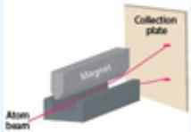
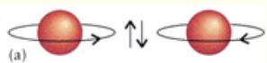
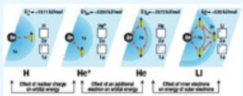
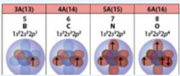
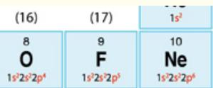
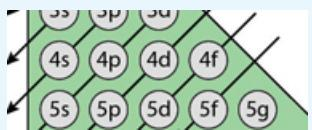
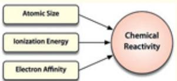
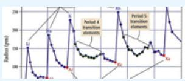
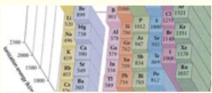

# 9 Quantum Mechanics of Multielectron Systems and the Link Between Orbital Structure and Chemical Reactivity


“If quantum mechanics hasn't profoundly shocked you, you haven't understood it yet.”

—Niels Bohr

:::{figure} ../images/fig-p1-ch09-1.jpg
:name: fig-p1-ch09-1
:alt: Figure from the University Chemistry source textbook
:::

## Framework

The internet represents a development of immense importance to modern society—that much is obvious. What is less obvious, but of great importance, is that the worldwide web opens up the conceptual revolution of transporting electrons around the planet instead of chemicals, conference attendees, and materials. [Figure 9.1](#fig-p1-ch09-2) contrasts the flight paths of commercial aircraft in the United States with the pattern of electron movement on the internet. The energy required to execute the aircraft flights in the upper panel of [Figure 9.1](#fig-p1-ch09-2) represents the combustion of $6 \times 1 0 ^ { 9 }$ barrels of petroleum per year, representing an energy expenditure of 3500 billion kWh of energy with the corresponding addition of $3 \times 1 0 ^ { 8 }$ tons of $\mathrm { C O } _ { 2 }$ to the atmosphere each year. The energy required to operate the internet within the US each year, in contrast, is 350 billion kWh, the energy for which can easily be generated by renewable sources. While aircraft will be used to transport individuals for vacations, for certain business matters, and to universities, the development of teleconferencing and the development of high speed rail systems for both passengers and freight holds the promise of significantly reducing dependence on fossil fuels at the same time communication pathways are dramatically opened up. International exchanges between peoples of the world hold the possibility of establishing an entirely new venue of societal exchange among countries. And it is the movement of electrons that will foster these developments.

:::{figure} ../images/fig-p1-ch09-2.jpg
:name: fig-p1-ch09-2
:alt: FIGURE 9.1 Displayed are images that represent large data sets with the upper margins representing a visualization of flight patterns of commercial aircraft over the continental United States and the lower image displaying bit flows on the
FIGURE 9.1 Displayed are images that represent large data sets with the upper margins representing a visualization of flight patterns of commercial aircraft over the continental United States and the lower image displaying bit flows on the internet developed at Carnegie Mellon University.
:::


Remarkably, it is quantum mechanics, operating as it does at the atomic scale, that brought and continues to bring a revolution in our understanding that has in turn opened a gateway to new innovation in the command and control of new materials with properties that were unimagined just a few years ago. Quantum mechanics introduced three key attributes of the behavior of electrons at the atomic scale: (1) the wave properties of the electron when confined to the spatial scale of atoms and molecules, (2) the electron spin that dictates the number of electrons allowed in any atomic (or molecular) orbital, and (3) the placement of electrons in, and the transfer of electrons between, both occupied energy levels and unoccupied energy levels. The relationship between electronic structure and chemical reactivity is treated in Case Study 9.1.

Case Study 9.1 The Union of Electronic Structure and Chemical Reactivity in Multielectron Atoms

:::{figure} ../images/fig-p1-ch09-3.jpg
:name: fig-p1-ch09-3
:alt: Figure from the University Chemistry source textbook
:::

As we progress from the single electron hydrogen atom to the case of multielectron systems, the laws of quantum mechanics become more complicated to apply, but far more powerful for the creative process of developing new materials and new architectures, opening the pathway to integrated designs of new systems. The power of developing a hierarchy of scale from the atomic level to the molecular level to the cellular level is the hallmark of biological systems—systems that evolved for a very specific, and often sophisticated, objective, yet systems designed to selfassemble! In fact, those systems capable of self assembly are those systems with the greatest complexity and interconnectedness. As we have noted, the photosynthetic chloroplast in a green plant is in fact a solar cell constructed as a hierarchy of atomic and molecular level subsystems. The ATP produced by the mitochondria in a cell is a chemical energy converter of remarkable adaptability, yet it is selfassembled.

It is tempting to jump immediately from the properties of individual multielectron atoms to theories of the formation of the molecular bond. But revolutionary advances in technology have refocused attention and a new generation of innovative research on the reanalysis of how characteristics of individual multielectron atoms map into larger dimensions to study nanostructures (dimensions of $1 0 ^ { - 9 }$ meters) and how these nanostructures link physically and chemically to architectures on the microscale (dimensions of $1 0 ^ { - 6 }$ meters). As we will see, when we begin to seriously examine the design of integrated systems that require a hierarchy of connected subsystems linking scales from the atomic to the macroscopic, we must view the problem in terms of an array of bonding forces that operate over a large range of length scales and over a large range of bonding energies.

As we will see, quantum mechanics and associated restrictions on how electrons are allowed to enter the energy levels associated with atomic orbitals sets the stage for understanding how the associated hierarchal assembly constitutes the foundation for two critically important lines of development. The first category is the pathway to integrated chemical systems, which include (1) the study of catalysts that provide control over the rate at which chemical reactions proceed, (2) the development of photochemical cells for converting sunlight to electrical power, (3) the development of new materials for dramatically improving energy storage capability of batteries, and (4) new membranes capable of improving the performance of fuel cells that can convert hydrogen and oxygen to electrical power. The second gateway opened by studies of the properties of multielectron systems is that of integrated physical systems, which include (1) the assembly of atoms into specifically tailored conductors, semiconductors, and insulators that constitute the key components for (2) the development of transistors, diodes, and integrated circuits for (3) the development of computers, memory storage, and high resolution graphical displays that (4) allow the development of the integrated system we now call the “internet.” The first transistor, shown in [Figure 9.2](#fig-p1-ch09-5) was developed using a combination of multielectron elements by Shockley, Brattain, and Bardeen shown in [Figure 9.3](#fig-p1-ch09-6).

:::{figure} ../images/fig-p1-ch09-4.jpg
:name: fig-p1-ch09-4
:alt: Figure from the University Chemistry source textbook
:::

:::{figure} ../images/fig-p1-ch09-5.jpg
:name: fig-p1-ch09-5
:alt: FIGURE 9.2 Shown are the first transistors with the left panel a replica of the point-contact transistor invented by Bardeen and Brattain. The Shockley junction transistor is shown in the right panel and while it is less elegant architectur
FIGURE 9.2 Shown are the first transistors with the left panel a replica of the point-contact transistor invented by Bardeen and Brattain. The Shockley junction transistor is shown in the right panel and while it is less elegant architecturally, it was easier to fabricate.
:::


:::{figure} ../images/fig-p1-ch09-6.jpg
:name: fig-p1-ch09-6
:alt: FIGURE 9.3 The three inventors of the transistor at the time they announced the development. Shockley is on the left, Brattain in the center, and Bardeen on the right.
FIGURE 9.3 The three inventors of the transistor at the time they announced the development. Shockley is on the left, Brattain in the center, and Bardeen on the right.
:::


As the understanding and ability to control combinations of multielectron elements developed, it became possible to create increasingly complex integrated circuits, microprocessors, and computers—the first microprocessor is shown in [Figure 9.4](#fig-p1-ch09-7).

:::{figure} ../images/fig-p1-ch09-7.jpg
:name: fig-p1-ch09-7
:alt: FIGURE 9.4 The first microprocessor was constructed by Ted Hoff at Intel. It combines all the components of a programmable computer on a single chip. The chip shown here has the dimensions of approximately 3 mm by 4 mm and contains approxim
FIGURE 9.4 The first microprocessor was constructed by Ted Hoff at Intel. It combines all the components of a programmable computer on a single chip. The chip shown here has the dimensions of approximately 3 mm by 4 mm and contains approximately 2000 transistors.
:::


What is remarkable to watch is how the the quantum mechanical behavior at the atomic level “maps” onto the global reach of the internet and to think carefully about how the unfolding revolution in nanotechnology and nanochemistry bridges the union between the microscopic, atomic scale behavior of materials and the macroscopic manifestation of integrated systems capable of advancing societal objectives: human health, human communication, and an improving global standard of living through sustainable energy sources, distribution, and storage.

While we must come to understand the scientific foundation that underpins multielectron atoms before we can understand the direct impact of quantum mechanics on modern society, we can set in place the chain of interlocking concepts that, when taken together, establishes the union of quantum mechanics with modern society. This sequence of connected elements is shown in [Figure 9.5](#fig-p1-ch09-8).

:::{figure} ../images/fig-p1-ch09-8.jpg
:name: fig-p1-ch09-8
:alt: FIGURE 9.5 Quantum mechanical properties of the electron constitute a linkage from the atomic scale mathematical notation meters) to the nanoscale mathematical notation meters) to the microscale mathematical notation meters) to the macrosca
FIGURE 9.5 Quantum mechanical properties of the electron constitute a linkage from the atomic scale $( 1 0 ^ { - 1 2 }$ meters) to the nanoscale $( 1 0 ^ { - 9 }$ meters) to the microscale $( 1 0 ^ { - 6 }$ meters) to the macroscale that links together a vast array of new developments in chemistry and physics that must be understood and integrated in order to make progress in all phases of modern technology.
:::


This mapping of quantum mechanics onto the current explosive developments in nanotechnology has its roots in the understanding of multielectron systems. As we have seen, it was Dimitri Mendeleev, seeking a coherent structure for teaching the behavior of chemical elements to students of inorganic chemistry, who created the first Periodic Table that assigned repetitive patterns to chemical behavior. Mendeleev succeeded in grouping all the known elements (63 at the time) into distinct families and in so doing he not only radically simplified the study of chemistry, he also identified gaps in his periodic table. Mendeleev recognized that these gaps were as yet undiscovered elements. Because he could use the patterns of chemical behavior to predict the chemical characteristics of the missing elements, they were far more easily searched for and identified. Indeed, gallium, scandium, and germanium—some of the most important elements for the development of innovative electronic devices today—were discovered in his lifetime as a direct result of his ability to predict their chemical and physical behavior.

But why did the elements exhibit this periodic behavior? Why was there this unbroken sequence of elements going from the lightest (hydrogen) to the heaviest? It was a full half century before the physicist Wolfgang Pauli, shown in [Figure 9.6](#fig-p1-ch09-9), articulated his “exclusion principle” stating that no two electrons could share the same (i.e. identical) set of quantum numbers. This brought order to the considerable confusion regarding how the sequence of multielectron elements was “built up” by adding an additional electron as the atomic number of the elements progressed to larger and larger atoms.

:::{figure} ../images/fig-p1-ch09-9.jpg
:name: fig-p1-ch09-9
:alt: FIGURE 9.6 Wolfgang Pauli (1900-1958) proposed the now famous “Pauli Exclusion Principle” in 1925, which stated that no two electrons in an orbital (atomic or molecular) can share the same set of quantum numbers n, mathematical notation and
FIGURE 9.6 Wolfgang Pauli (1900-1958) proposed the now famous “Pauli Exclusion Principle” in 1925, which stated that no two electrons in an orbital (atomic or molecular) can share the same set of quantum numbers n, $\ell , \mathsf { m } _ { \ell } ,$ and $\mathsf { m } _ { \mathsf { s } } .$ . Pauli received the Nobel Prize in 1945..
:::


The answer to how the full complement of quantum numbers, including electron spin, defined the sequence of building up the multielectron atom's designation of orbital occupancy is a central theme in this chapter. It is also of considerable interest to recall how the intrinsic spin of the electron came to be understood. It was well known from studies of electromagnetism in the ${ \bf { 1 9 } } ^ { \mathrm { { t h } } }$ century that a loop of wire carrying an electric current produces a magnetic field. That is, a current moving in a wire loop acts just like a small magnet—it has a “north pole” and a “south pole” and this separation between the poles of the magnet constitutes a magnetic moment that establishes the intrinsic axis of the magnet in space. As we will see in this chapter, the famous experiments by Otto Stern and Walther Gerlach demonstrated that the magnetic moment of the electron is quantized in space. That is, the value of the magnetic moment of the electron cannot assume any value such that there is a continuum of possible values of the magnetic moment, but rather the magnetic moment of the electron can take only specific, discrete values. This spatial quantization of the magnetic moment of the electron is a strictly quantum mechanical phenomenon—it has no analog in classical physics. But what wasn't realized at the time Stern and Gerlach announced their discovery in 1922 was that the magnetic moment of the electron was not a result of its motion in orbit about the nucleus, but rather a result of the electron spin about its own axis!

The hypothesis that the electron had a spin, angular momentum, analogous to the spin of the Earth on its axis, was put forward by two young physicists, George Uhlenbeck and Sam Goudsmit. Uhlenbeck and Goudsmit proposed the idea of intrinsic electron spin in 1925, a full year before Schrödinger published his wave equation that provided the mathematical solution defining the electron orbitals as discussed in Chapter 8. Uhlenbeck and Goudsmit realized that their suggestion of an intrinsic electron spin was, to put it gently, controversial. Thus they sought advice from their professor Paul Ehrenfest. Ehrenfest thought over their hypothesis, but decided it was best that they consult the regarded expert on the subject, Hendrik Lorentz. Lorentz agreed to consider their proposition, and after mulling it over, expressed the strong view to Uhlenbeck and Goudsmit that there were too many reasons why such an idea as an intrinsic electron spin was incompatible with any known behavior in physics. This lead Uhlenbeck and Goudsmit to reconsider publishing the hypothesis of electron spin so they asked Ehrenfest to withdraw their paper. However, too late! Ehrenfest had already submitted the paper for publication on their behalf and it was already in print. That lead Ehrenfest to say: “You are both young enough to allow yourselves such foolishness.” The impact of electron spin on the magnetic properties of the elements is featured in Case Study 9.2 on rare earth elements.

Case Study 9.2 Rare Earth Elements: Applications, Chemistry, Resources & Production
:::{figure} ../images/fig-p1-ch09-10.jpg
:name: fig-p1-ch09-10
:alt: Figure from the University Chemistry source textbook
:::

But there was more to be learned. At the same time Uhlenbeck and Goudsmit put forward their hypothesis of intrinsic electron spin, Ralph Kronig, also a young physicist, had put forward the same idea—except that when he approached Wolfgang Pauli with his idea, Pauli convinced him that such an idea could not be correct. Kronig acquiesced and did not publish. The remarkable irony, of course, is that it is on the shoulders of electron spin that the famous Pauli Exclusion Principle is built!

With this, we turn our attention to the construction and characterization of the multielectron atom. Multielectron atoms hold the key to reducing our carbon footprint, a subject featured in Case Study 9.3.

Case Study 9.3 Calculating the Personal Carbon Footprint
:::{figure} ../images/fig-p1-ch09-11.jpg
:name: fig-p1-ch09-11
:alt: Figure from the University Chemistry source textbook
:::

## Chapter Core

## Road Map for Chapter 9

Quantum mechanics was developed first to quantitatively describe the structure of the hydrogen atom—one electron and one proton—an accomplishment that set the world of chemistry and physics on a gateway to dramatic change. The impact of the changes that quantum mechanics has brought, and continues to bring, to both the core of scientific thought and to the emerging objectives of society as a whole are striking indeed. That era is marked by the innovation, exploration, and insight brought to bear on the atomic scale, nanoscale, and macroscale leading to new methods of controlling the interaction of light with the molecular structure, profound advances in miniaturization of electronics and data storage, revolutionary new imaging techniques, vectored drug delivery, and unprecedented new techniques for energy generation and storage. A critically important bridge from the atomic to the molecular to the nanoscale depends upon an understanding of the multielectron atom. Thus we proceed to develop an understanding of the quantum mechanics of increasingly complex atomic structure with the following topics.

## Road Map to Core Concepts

<table><tr><td>1. The Fourth Quantum Number: Electron Spin</td><td></td></tr><tr><td>2. The Pauli Exclusion Principle</td><td></td></tr><tr><td>3. Penetration and Shielding I</td><td></td></tr><tr><td>4. Penetration and Shielding II</td><td></td></tr><tr><td>5. Building Up Principle</td><td></td></tr><tr><td>6. Relationship Between the Electronic Configuration and Chemical Properties</td><td></td></tr><tr><td>7. Organization of the Periodic Table</td><td></td></tr><tr><td>8. Chemical Reactivity and its Relationship to Atomic Size, Ionization Energy, and Electron Affinity</td><td></td></tr><tr><td>9. Atomic Size</td><td></td></tr><tr><td>10. Ionization Energy</td><td></td></tr><tr><td>11. Electron Affinity</td><td>Li Be B C N O F-60 &gt;0 -27 -122 &gt;0 -141 -328Na Mg Al Si P S Cl-53 &gt;0 -43 -134 -72 -200 -349K Ca Ga Ge As Se Br-48 -2 -30 -119 -78 -195 -325</td></tr></table>

## Multielectron Atoms

Development of the theory underpinning our understanding of atomic structure was built on the back of the one electron system: atomic hydrogen. The reasons for this were many. But two important ones include the simplified emission spectrum of H atoms, which allowed a simple formulation of the wavelength of the emitted lines in terms of integers, and the quantitative success of the Bohr model using the quantized photon energy, ΔE = hν, from Planck and Einstein. A third reason for the importance of atomic hydrogen to the development of theories of atomic structure was the fact that the Schrödinger wave equation predicted the radial position of the maximum probability for finding the 1s electron at the same radius as the first Bohr radius in hydrogen deduced from the emission lines of atomic hydrogen. As we have seen, confinement of the electron matter wave leads to quantization that leads to eigenfunctions that in turn determine the energies of the orbitals in three dimensions that require three quantum numbers to uniquely define the energy, shape, and orientation—the principal quantum number n, the angular momentum quantum number ℓ , and the magnetic quantum number m respectively.

But questions remained unanswered concerning atoms that contained more than one electron. Why didn't subsequent electrons added to the single electron hydrogen atoms simply “stack up” in the lowest orbital? Why could the Schrödinger equation calculate the exact energies of the hydrogen atom, but not of the multi-electron atoms?

Answers to these questions were emerging nearly simultaneously with the hypothesis that the electron had wave properties and that the distribution of electron density about the nucleus could be calculated with the Schrödinger equation. The key experiment that set in place the foundation for assigning quantum numbers to electrons in multielectron atoms was done in 1922 by Otto Stern and Walther Gerlach at the University of Frankfurt before de Broglie hypothesized the wave property of electrons. That experiment used a beam of silver atoms passed through a magnetic field as shown in [Figure 9.7](#fig-p1-ch09-22). The beam of silver atoms, emergent into a vacuum from a high temperature oven was captured on a target, a glass plate that could be used to image the pattern of the spatial distribution of silver atoms deflected by the magnetic field. At the time of the Stern-Gerlach experiment, it was known that electrons possessed angular momentum and it was thought that angular momentum would lead to a magnetic moment intrinsic to the individual atoms. By passing individual atoms through a magnetic field that increased in strength as a function of the distance from the magnetic pole piece shown in [Figure 9.7](#fig-p1-ch09-22), a force would be imparted to the silver atom according to the orientation of the angular momentum of the electrons in orbit about the nucleus and thus to the orientation of the magnetic moment of the electrons. Since the orientation of the magnetic moment of the electrons would, from a classical perspective, be random, it would be expected that the distribution of silver atoms on the glass target would be random—that is with a continuously varying probability that would produce a continuous “smear” of silver atoms deflected by the magnetic field striking the target. However, the results of the Stern-Gerlach experiment demonstrated conclusively that just two spatially separated spots appeared on the glass target struck by the beam of Ag atoms as shown in [Figure 9.7](#fig-p1-ch09-22)!

:::{figure} ../images/fig-p1-ch09-22.jpg
:name: fig-p1-ch09-22
:alt: FIGURE 9.7 The experimental apparatus used by Otto Stern and Walther Gerlach that demonstrated for the first time that angular momentum is quantized in the world of quantum mechanics. This was done by firing a beam of silver atoms through a
FIGURE 9.7 The experimental apparatus used by Otto Stern and Walther Gerlach that demonstrated for the first time that angular momentum is quantized in the world of quantum mechanics. This was done by firing a beam of silver atoms through a magnetic field that was stronger close to one pole piece than at the other. This “inhomogeneous” magnetic field applies a net force perpendicular to the beam direction on a magnetic moment. It was the separation of the beam of silver atoms into just two spots on the target that was the first evidence for the spatial quantization of angular momentum in quantum mechanics.
:::


The silver atoms exhibited a spatial quantization of angular momentum, a spatial quantization of the magnetic moment. The experiment was direct justification for the hypothesis that angular momentum is quantized in a system that obeys the laws of quantum mechanics. It is important to note that this experiment was performed just before quantum mechanics was born. It was not until 1925 that Samuel Goudsmit and George Uhlenbeck put forward the hypothesis that the electron possessed a magnetic moment resulting from its intrinsic spin, rather than a magnetic moment resulting from its motion in orbit about the nucleus and that the electron possessed a spin quantum number, $\mathrm { m } _ { \mathrm { s } } ,$ which could assume only one of two values, $\pm \nobreakspace { \frac { \bf 1 / 2 } { \sqrt { 2 } } }$ It was Wolfgang Pauli in 1926 who first articulated the implications for atomic structure of the remarkable discovery that the magnetic moment of the electron is quantized (Stern-Gerlach) and that the magnetic moment results from the intrinsic spin of the electron (Goudsmit & Uhlenbeck): the Pauli Exclusion Principle, which states that no two electrons can share the same set of quantum numbers. We summarize the quantum numbers of electrons in multielectron atoms in [Table 9.1](#original-table-9-1) —they are the three quantum numbers of the electron orbitals, n, ℓ, and $\mathbf { m } _ { \ell }$ that we developed in Chapter 8, with the addition of the spin quantum number $\mathrm { m } _ { \mathrm { s } } = + 1 / 2 \ \mathrm { { o r } \ - 1 / 2 }$ defining the direction of the electron spin.

(original-table-9-1)=
TABLE 9.1 Summary: Quantum Numbers of Electrons in Atoms

<table><tr><td>Name</td><td>Symbol</td><td>Permitted Values</td><td>Property</td></tr><tr><td>principal</td><td>n</td><td>positive integers (1, 2, 3, ...)</td><td>orbital energy (size)</td></tr><tr><td>angular momentum shape of wavefunction</td><td>l</td><td>integers from o to n-1</td><td>orbital shape (The l values 0, 1, 2, and 3 correspond to s, p, d, and f orbitals, respectively.)</td></tr><tr><td>magnetic</td><td>ml</td><td>integers from -l to o to +l</td><td>orbital orientation</td></tr><tr><td>spin</td><td>ms</td><td>+1/2 or -1/2</td><td>direction of e- spin</td></tr></table>

The implications for the structure of multielectron atoms, and for molecules constructed from these atoms, of the electron spin and the associated Pauli Exclusion Principle are profound. The fact that each electron must have a unique set of quantum numbers means that as we move from a single electron system to multiple electrons, those electrons must sequentially “pair up,” one with the spin quantum number $\mathrm { m } _ { \mathrm { s } } = + { } 1 / 2$ and one with the spin quantum number $\mathrm { m } _ { \mathrm { s } } = - { 1 } / { 2 }$ . If we consider the solution to the Schrödinger equation for electrons in our infinite square well potential—the “particle in a box”—this means that for each value of the principal quantum number n (one dimensional wavefunction, one quantum number) there will be two electrons allowed for n = 1, there will be two allowed for $\mathbf { n } = \mathbf { 2 }$ , two allowed for n = 3, etc. Those electrons are inserted, one with $\mathrm { m } _ { \mathrm { s } } = + { } 1 / 2$ (“spin up”) and one with $\mathrm { m } _ { \mathrm { s } } = - { 1 } / { 2 }$ (“spin down”), as shown in [Figure 9.8](#fig-p1-ch09-23).

:::{figure} ../images/fig-p1-ch09-23.jpg
:name: fig-p1-ch09-23
:alt: FIGURE 9.8 When electrons are inserted into the eigenstates, the wavefunctions, of a square well potential, the Pauli Exclusion Principle states that no two electrons can share the same set of quantum numbers. Thus for each value of the pri
FIGURE 9.8 When electrons are inserted into the eigenstates, the wavefunctions, of a square well potential, the Pauli Exclusion Principle states that no two electrons can share the same set of quantum numbers. Thus for each value of the principal quantum number n, one electron must enter the wavefunction with spin up, $\mathfrak { m } _ { \mathrm { s } } = + 1 / 2$ , and one electron must enter the wavefunction with spin down, or $\mathsf { m } _ { \mathsf { s } } = - 1 / 2 .$
:::


When we move from the one-dimensional square well potential to the three-dimensional Coulomb potential for multielectron configurations, the Pauli Exclusion Principle applies as well—each electron must have a unique set of quantum numbers $\mathbf { n } , \ell , \mathbf { m } _ { \ell } ,$ and $\mathbf { m } _ { \mathrm { s } } .$ . That is, no two electrons can have the same set of quantum numbers n, $\ell , \mathbf { m } _ { \ell } .$ , and $\mathbf { m } _ { \mathrm { s } } .$ . This means that as we move from hydrogen, to helium, to lithium, to beryllium, etc. through the periodic table, electrons will be inserted sequentially into shells and subshells in order of increasing energy with a maximum of two electrons, one with spin up $( \mathrm { m } _ { \mathrm { s } } = + 1 / 2 )$ and one with spin down $( \mathrm { m } _ { \mathrm { s } } = - 1 / 2 )$ up to the total number of electrons possessed by that element in the periodic table.

While for the single electron case, the energy of each subshell was determined uniquely by the principal quantum number n (i.e. the 2s and 2p subshells were of identical energy; the 3s, 3p, and 3d were of identical energy), in multielectron atoms, orbitals with the same n but different ℓ have different energies. The reason for this is that the electron-nuclear attraction is more important for low ℓ (low angular momentum), whereas the electronelectron repulsion is more significant for high ℓ (high angular momentum). Thus the 2p orbitals are higher in energy than the 2s orbital.

We can diagram the electron-nucleus and electron-electron interaction in [Figure 9.9](#fig-p1-ch09-24) for the first three elements H, He, and Li. Also displayed in [Figure 9.9](#fig-p1-ch09-24) are the sequentially assigned orbitals for each electron, a pattern we will repeat for the assignment of electrons to orbitals that constitutes the electron configuration for each element. The binding energy of the outermost electron is indicated in each case.

:::{figure} ../images/fig-p1-ch09-24.jpg
:name: fig-p1-ch09-24
:alt: FIGURE 9.9 With the addition of each electron, and with the Pauli Exclusion Principle stating that no two electrons can share the same set of quantum numbers, the single electron of hydrogen enters the 1s orbital with mathematical notation
FIGURE 9.9 With the addition of each electron, and with the Pauli Exclusion Principle stating that no two electrons can share the same set of quantum numbers, the single electron of hydrogen enters the 1s orbital with $\mathsf { m } _ { \mathsf { s } } = 1 / 2$ and the second electron of helium enters the 1s orbital with $\mathfrak { m } _ { \mathtt { s } } = - 1 / 2$ . The third electron (from lithium) enters the 2s subshell because the 1s subshell is fully occupied. This diagram relates the electronic configuration with the placement of electron in the atom.
:::


Notice in particular in [Figure 9.9](#fig-p1-ch09-24) that the energy of the electron $( ^ { \mathrm { E _ { H } ^ { 1 s } , ~ } \mathrm { E _ { H e ^ { + } } ^ { 1 s } } }$ $\mathrm { E } _ { \mathrm { H e } } ^ { 2 s } , \mathrm { E } _ { \mathrm { L i } } ^ { 2 s } )$ is markedly different for each of the four cases. These differences turn out to be of great importance for understanding patterns of chemical reactivity across the periodic table. Thus we seek to understand those differences before building up the periodic table.

## Penetration, Shielding, and Effective Nuclear Charge, $Z _ { e f f }$

With the introduction of multielectron configurations for all elements other then hydrogen in the periodic table, it becomes essential that we develop an intuition for how the electron-electron (e-e) repulsion is balanced against the electron-proton (e-p) attraction that binds the electrons to the nucleus. We need to understand this competitive balance between e-p attraction and e-e repulsion because it is this balance that determines the energy of the individual orbitals in the structure of any atom and it is this balance that determines the size of the atom, the ability of a given atom to retain its own electrons and the ability of a given atom to draw other electrons to it. These are the characteristics that ultimately determine the chemical behavior of atoms and the chemical behavior of the molecules formed from them.

We can break this problem down by considering two ideas: penetration and shielding. For our purposes here, penetration is taken to mean a measure of how close an electron comes to the nucleus—it is important because the Coulomb force between a single electron and the proton or protons in the nucleus is given, in the absence of other electrons, by

```{math}
:label: eq-p1-ch09-1
F _ {e - p} = \frac {Z e ^ {2}}{4 \pi \varepsilon_ {0} r ^ {2}}
```


where Z is the atomic number of the atom in question, e is the charge in the electron, and r is the distance between the electron and the protons in the nucleus. The potential energy of the electron a distance r from the Z protons is then given by

```{math}
:label: eq-p1-ch09-2
V = \frac {- Z e ^ {2}}{4 \pi \varepsilon_ {0} r}.
```


Thus the potential energy becomes more negative with increasing Z and decreasing r. We can emphasize the dramatic effect of increasing Z on the energy of the 1s orbital by extending the pattern set forth in [Figure 9.9](#fig-p1-ch09-24) to include $Z = \bf 1$ to $Z = 3$ for a single electron. As [Figure 9.10](#fig-p1-ch09-25) makes clear, the energy of the 1s orbital decreases (becomes more negative and thus more stable) from -1311 kJ/mol for H(1s) to -11,815 kJ/mol for $\mathrm { L i ^ { 2 + } } ( 1 \mathrm { s } )$ . This is an increase of nearly an order of magnitude. As Z increases, the force between the electron and the nucleus increases, for a given distance r, and the energy of the electron becomes more negative. But the increasing attractive force between the nucleus with an increasing number of protons and the electron draws the electron closer to the nucleus, decreasing r and in turn making its potential energy more negative. The result is that the 1s electron of $\mathrm { L i ^ { 2 + } }$ is far more stable than the 1s orbital of H and in turn the electron is far more difficult to remove from $\mathrm { L i } ^ { 2 + }$ than from H, as [Figure 9.10](#fig-p1-ch09-25) shows.

:::{figure} ../images/fig-p1-ch09-25.jpg
:name: fig-p1-ch09-25
:alt: FIGURE 9.10 Graphic displaying the energy, in kJ/mol, required to remove an electron from H (one proton), from mathematical notation (two protons), and from mathematical notation (three protons).
FIGURE 9.10 Graphic displaying the energy, in kJ/mol, required to remove an electron from H (one proton), from ${ \mathsf { H } } { \mathsf { e } } ^ { + }$ (two protons), and from ${ \mathsf { L } } { \mathsf { i } } ^ { 2 + }$ (three protons).
:::


The second consideration in analyzing the energy of orbitals in a multielectron system is the issue of shielding. Shielding is a measure of how electrons that occupy a spatial domain closer to the nucleus serve to reduce the attraction between the nucleus and electrons at greater distances from the nucleus. This distinction between an inner electron shielding the nuclear charge from an outer electron is shown in [Figure 9.11](#fig-p1-ch09-26). In this case, with Z = 3, the inner electrons with charge -e serve to shield (or “screen”) the charge on the nucleus from the outer electron. For example, if the inner electrons are in the 1s orbital of Li and the outer electron is in the 2s orbital of Li, the inner electrons will experience the attraction of three protons, reducing their orbital radius below that of the 1s electron in H. The outer electron, on the other hand, will see a reduced attraction to the nucleus because of the shielding by the inner electrons and will move to a larger distance from the nucleus as result.

:::{figure} ../images/fig-p1-ch09-26.jpg
:name: fig-p1-ch09-26
:alt: Figure from the University Chemistry source textbook
:::

Penetration implies reaching closer to the nucleus, achieving greater stability by virtue of a greater negative energy binding the electron to the nucleus. An outer electron that is shielded by another electron residing at a smaller distance from the nucleus is, as a result, less stable, and more easily removed as a result of a less negative binding energy. While we have placed our two separated orbitals, the 1s and the 2s, in [Figure 9.10](#fig-p1-ch09-25) to make a clear distinction between penetration and shielding, we can also compare quantitatively the binding energy of a single electron in $\mathrm { H e ^ { + } }$ and an electron in the filled ${ \bf 1 5 ^ { 2 } }$ orbital of He as shown in [Figure 9.12](#fig-p1-ch09-27). The presence of the second 1s electron in He decreases the energy required to remove one electron from the system from 5250 kJ/mole to 2372 kJ/mole as a result of both shielding and penetration—a very large difference.

:::{figure} ../images/fig-p1-ch09-27.jpg
:name: fig-p1-ch09-27
:alt: FIGURE 9.12 The effect of shielding on the amount of energy required to remove the first electron from He compared with the amount of energy required to remove the second electron.
FIGURE 9.12 The effect of shielding on the amount of energy required to remove the first electron from He compared with the amount of energy required to remove the second electron.
:::


The concepts of penetration and shielding come together in a single variable called the effective nuclear charge, $\mathrm { Z _ { e f f } . }$ . This quantity turns out to be very important for understanding the chemical behavior of isolated atoms and for the molecules comprised of those atoms. $\mathrm { Z _ { \mathrm { e f f } } }$ can range from a maximum of the atomic number $\mathrm { Z , }$ corresponding to an inner electron that “sees” only the bare nucleus, to a minimum of unity. We will return often to the concepts of penetration and shielding and the manifestation of both in the form of $\mathrm { Z _ { e f f } }$

Drawing from Chapter 8, we can use the radial density of the probability of finding an electron at a given radius to draw important conclusions about the balance between penetration and shielding. Most strongly penetrating are the s orbitals, and it is instructive to examine the superposition of s and p orbitals by graphing the radial probability as a function of distance r from the nucleus as shown in [Figure 9.13](#fig-p1-ch09-28). The 1s orbital will always be of lowest energy because it dominates the most deeply penetrating domain close to the nucleus. But the competition between the 2s and 2p orbitals is less straightforward. While the 2p radial probability peaks at a smaller radius from the nucleus, the 2s orbital is of greater negative energy (greater stability, lower energy) than the 2p orbital because of the deeply penetrating lobe of the 2s orbital as shown in [Figure 9.13](#fig-p1-ch09-28). Electrons in the p, d, and f orbitals possess higher angular momentum, which results in greater radial distances from the nucleus (for the same principal quantum number n) resulting in a smaller and smaller effective nuclear charge $\mathrm { Z _ { e f f } }$ when we progress from p to d to f.

:::{figure} ../images/fig-p1-ch09-28.jpg
:name: fig-p1-ch09-28
:alt: FIGURE 9.13 The probability of finding the electron at a distance r from the nucleus for the 1s, 2s, and 2p atomic orbitals. The radial probability defines the degree of penetration of the electron in the respective orbitals.
FIGURE 9.13 The probability of finding the electron at a distance r from the nucleus for the 1s, 2s, and 2p atomic orbitals. The radial probability defines the degree of penetration of the electron in the respective orbitals.
:::


We can compare the radial probability as a function of the distance r from the nucleus for the n = 3 orbitals as shown in [Figure 9.14](#fig-p1-ch09-29). [Figure 9.14](#fig-p1-ch09-29) displays the 3p radial probability and the 3s radial probability emphasizing the fact that the lower angular momentum (3s) orbital is characterized by an electron distribution closer to the nucleus. So while the s orbital penetrates more effectively than the p orbital, the p is better shielded than the s. Thus we are left with the general conclusion that for a given principal quantum number n, the orbitals will be ordered in energy from lower to higher angular momentum such that for the sequence from s to p to d to f we have the energy ordering $\mathrm { E _ { s } } < \mathrm { E _ { p } } < \mathrm { E _ { d } } < \mathrm { E _ { f } }$

:::{figure} ../images/fig-p1-ch09-29.jpg
:name: fig-p1-ch09-29
:alt: FIGURE 9.14 Graphical display of the total radial probability as a function of the distance from the nucleus for the 3s, 3p, and 3d orbitals.
FIGURE 9.14 Graphical display of the total radial probability as a function of the distance from the nucleus for the 3s, 3p, and 3d orbitals.
:::


This results in an important relationship between (1) the ordering of the energies of orbitals with the same n value but different ℓ values and (2) the penetration of the electron in a given subshell. In particular, for a given principal quantum number, n,

s electrons penetrate closer to the nucleus than p electrons

p electrons penetrate closer to the nucleus than do d electrons

d electrons penetrate closer to the nucleus than do f electrons

Thus the ns orbitals are lower in energy than the (n-1)d orbitals and so the 4s orbital fills before the 3d, the 5s before the 4d, etc. This provides the basis for the simple (but powerful) diagram that determines energy ordering displayed in [Figure 9.15](#fig-p1-ch09-30).

:::{figure} ../images/fig-p1-ch09-30.jpg
:name: fig-p1-ch09-30
:alt: FIGURE 9.15 While the ordering of orbitals does not follow a simple sequence in the principle quantum number n, there is a simple diagrammatic way of keeping track of the subshell ordering as shown in the diagram.
FIGURE 9.15 While the ordering of orbitals does not follow a simple sequence in the principle quantum number n, there is a simple diagrammatic way of keeping track of the subshell ordering as shown in the diagram.
:::


We can summarize the close connection between shielding, penetration and effective charge, $Z _ { \mathrm { e f f } } ,$ by considering [Figure 9.16](#fig-p1-ch09-31). That figure traces:

1. The effect of nuclear charge on orbital energy;

2. The effect of an additional electron (and proton) on orbital energy;

3. The effect of inner electron on the energy of an outer electron (shielding);

4. The effect of an additional nuclear charge on the energy of an additional electron; and

5. The effect of orbital shape (ℓ value) on orbital energy (penetration).

The concepts of penetration and shielding taken together then determine the effective nuclear charge, $\mathrm { Z _ { e f f } , }$ experienced by the valence electron.

:::{figure} ../images/fig-p1-ch09-31.jpg
:name: fig-p1-ch09-31
:alt: FIGURE 9.16 The direct effect of nuclear charge on orbital energy can be seen by comparing the 1s orbital of H versus that of He+. The binding energy of a 1s electron in He vs. that in H reflects the minimal shielding by one 1s electron on
FIGURE 9.16 The direct effect of nuclear charge on orbital energy can be seen by comparing the 1s orbital of H versus that of He<sup>+</sup>. The binding energy of a 1s electron in He vs. that in H reflects the minimal shielding by one 1s electron on the other 1s electrons in the same orbital. Comparing Li to He demonstrates the strong shielding of the nuclear charge by the 1s electrons on the 2s electron of Li. With the addition of the second 2s electron in Be, the screening of the 2s electrons by He 1s electrons does not fully compensate for the additional nuclear charge. With the addition of the first 2p electron in boron, the shielding of the ${ \mathsf { 1 } } { \mathsf { s } } ^ { 2 }$ and $2 \mathsf { s } ^ { 2 }$ inner electrons significantly reduce the binding energy of the 2p electron.
:::


With this background we are now in a position to work our way through the periodic table inserting the electrons into the correct orbitals with increasing atomic number. The conceptual basis for this progression uses three primary considerations:

1. The Pauli Exclusion Principle, which requires that each electron possess a unique set of quantum numbers n, $\ell , \mathrm { m } _ { \ell } ,$ and $\mathbf { m } _ { \mathrm { s } } .$

2. The idea that the energy ordering of orbitals is controlled by the combination of penetration, shielding and electron-electron repulsion.

3. The recognition that for degenerate orbitals—those with the same n and ℓ quantum numbers but with different $\mathbf { m } _ { \ell }$ values—the electron-electron repulsion requires that orbitals with different $\mathbf { m } _ { \ell }$ are filled with unpaired electrons before electrons pair up in the same orbital. This is known as Hund's rule.

With this we are ready to determine the ground state electron configuration for each element in the periodic table. This is a process of building $u p$ (termed the Aufbau principle) from the elements with the smallest number of electrons to those with the largest. Each time we add a proton to the nucleus, we add an electron to the orbital structure and the energy ordering of those orbitals is such as to maximize the attractions and minimize the repulsions, thereby minimizing the energy of the ensemble of electrons and protons.

We can now proceed, using this structure of identifying each orbital with its unique set of quantum numbers n, ℓ, and $\mathbf { m } _ { \ell }$ with the insertion of each subsequent electron with its unique spin quantum number $\mathbf { m } _ { \mathrm { s } } .$ Picking up where [Figure 9.9](#fig-p1-ch09-24) left off, we proceed along the second row of the periodic table in [Figure 9.17](#fig-p1-ch09-32) with the electron configuration associated with each element (e.g. Boron $\mathbf { 1 s ^ { 2 } 2 s ^ { 2 } 2 p }$ , etc.) and the energy-ordered orbitals filled sequentially in energy such that each electron has a unique set of quantum numbers $\mathrm { n } , \ell , \mathrm { m } _ { \ell } ,$ and $\mathbf { m } _ { \mathrm { s } }$

:::{figure} ../images/fig-p1-ch09-32.jpg
:name: fig-p1-ch09-32
:alt: FIGURE 9.17 Displayed here is the electron configuration of the Period 2 elements with the orbital assignment of the electrons into the appropriate orbitals with the energy ordering of the orbitals shown with ascending energy from the 1s or
FIGURE 9.17 Displayed here is the electron configuration of the Period 2 elements with the orbital assignment of the electrons into the appropriate orbitals with the energy ordering of the orbitals shown with ascending energy from the 1s orbital (lowest energy, most stable) to the 2p orbital (highest energy, least stable).
:::


There are some important things to note in [Figure 9.17](#fig-p1-ch09-32). First, in the isolated atom, the energy of each of the orbitals with the same value of ℓ is the same. Thus given a designated principal quantum number n, and angular momentum quantum number ℓ, all orbitals with that n and ℓ have exactly the same energy—these orbitals are referred to as “degenerate” because they are all of equal energy. Second, in filling the orbitals with $\ell \geq 1$ , electrons enter orbitals with different values of m before the electrons pair up to fill the remaining orbitals. The reason for this is both simple and very important! Because electron-electron repulsion dominates the interaction energy of the system within a given set of quantum numbers n, ℓ, and $\mathrm { m } _ { \ell } ,$ the configuration that maximizes the distance between electrons is the configuration of lowest energy. This is clear if we revisit the geometry of, for example, the p orbitals in [Figure 8.41](#fig-p1-ch08-59). The double lobed geometry of the $\mathrm { p } _ { \mathrm { x } } , \mathrm { p } _ { \mathrm { y } } ,$ and $\mathrm { p } _ { \mathrm { z } }$ orbitals aligned along the orthogonal axes of the Cartesian coordinate system provides a greater distance between two electrons, wherein each electron is located within its own p orbital, than if two electrons are located within a single p orbital. Third, the number of electrons occupying each of the orbitals is designated by the superscript on the orbital sequence in the configuration designation. Thus, for example oxygen has 4 electrons in the 2p orbital, so we designate that electron configuration 2p<sup>4</sup>; boron has 2 electrons in the 2s orbital, 2s<sup>2</sup>; etc.

We can represent this progressive addition of electrons in a variety of graphical approaches, and we will do so with greater detail for the first two periods of the periodic table and then seek to simplify the notation for Period 3 through 8. [Figure 9.18](#fig-p1-ch09-33) captures the sequence of building up from hydrogen through neon—the first 10 elements in the periodic table, demonstrating the energy ordering of the orbitals and the shape and orientation of the orbitals graphically. The filling of orbitals 1s, 2s, and 2p is shown indicating the number of electrons in each orbital and the energy ordering for each element with the filling of the orbitals indicated by the degree of shading with doubly occupied orbitals shaded darker. Notice that we order the subshells vertically in order of increasing energy in the designation of the electron configuration. We will do this in all cases to keep track of both the electron occupancy and the energy ordering. The reason for this will become evident when we begin to combine atomic orbitals to form molecules in subsequent chapters.

:::{figure} ../images/fig-p1-ch09-33.jpg
:name: fig-p1-ch09-33
:alt: FIGURE 9.18 Diagram of the first two Periods in the periodic table that links the energy ordering of the subshells, the electron assignment to each subshells for each atom, and the geometrical distribution of the s and p subshells. The occu
FIGURE 9.18 Diagram of the first two Periods in the periodic table that links the energy ordering of the subshells, the electron assignment to each subshells for each atom, and the geometrical distribution of the s and p subshells. The occupancy of the orbitals is indicated by the degree of shading of the specific orbitals.
:::


With the 1s orbital filled with two electrons, $\mathrm { m } _ { \mathrm { s } } = + { } 1 / 2$ and $- 1 / 2 ,$ , the first Period is complete with He, the smallest noble gas. Lithium, the crucial element in modern battery development, places its third electron in the 2s orbital to establish the 1s<sup>2</sup>2s<sup>1</sup> configuration with beryllium filling the 2s orbital to establish the ${ \bf 1 5 ^ { 2 } 2 S ^ { 2 } }$ configuration. The next available orbital is the 2p, which can accept a total of six electrons into the degenerate $\mathrm { p } _ { \mathrm { x } } , \mathrm { p } _ { \mathrm { y } } .$ , and $\mathrm { p } _ { \mathrm { z } }$ orbitals as shown in [Figure 9.18](#fig-p1-ch09-33). So boron inserts its $5 ^ { \mathrm { t h } }$ electron into the ${ 2 \mathrm { p } _ { \mathrm { x } } }$ orbital, carbon inserts its $6 ^ { \mathrm { { t h } } }$ electron into the ${ } ^ { 2 } \mathrm { p } _ { \mathrm { y } }$ orbital to minimize the electron-electron repulsion that would occur if that electron was paired into the same $\mathrm { p _ { x } }$ orbital. Nitrogen inserts its $7 ^ { \mathrm { t h } }$ electron into the ${ 2 \mathrm { p } _ { \mathrm { z } } }$ orbital for the same reason. Now each 2p orbital has a single, unpaired electron and with oxygen, the $8 ^ { \mathrm { t h } }$ electron has a choice. Either it can be “promoted” to the 3s orbital, or it can be paired with the electron already in the $\mathrm { p _ { x } }$ orbital. Because the empty 3s orbital is higher in energy than the half filled ${ 2 \mathrm { p } _ { \mathrm { x } } }$ orbital, the $8 ^ { \mathrm { t h } }$ electron of oxygen chooses to pay the “pairing-up” cost of entering the half occupied ${ 2 \mathrm { p } _ { \mathrm { x } } }$ and so oxygen has the ${ 2 \mathrm { s } ^ { 2 } 2 \mathrm { p } ^ { 4 } }$ electronic configuration, as shown in [Figure 9.18](#fig-p1-ch09-33). Fluorine with 9 electrons inserts the next electron in the sequence into the ${ } ^ { 2 } \mathrm { p } _ { \mathrm { y } }$ orbital and neon completes the filling of the 2p orbitals with its $1 0 ^ { \mathrm { { t h } } }$ electron into the ${ 2 \mathrm { p } _ { \mathrm { z } } }$ orbital as shown in [Figure 9.18](#fig-p1-ch09-33).

It should be emphasized that we designate the $\mathrm { p } _ { \mathrm { x } } , \mathrm { p } _ { \mathrm { y } }$ , and $\mathrm { p } _ { \mathrm { z } }$ orbitals with subscripts simply to keep track of the electron pairing in the electron configuration. The designation is arbitrary because the 2p orbitals are all of equal energy — they are degenerate. It is also important to remember that the three 2p orbitals; $\mathrm { p } _ { \mathrm { x } } , \mathrm { p } _ { \mathrm { y } } ,$ , and $\mathrm { p } _ { \mathrm { z } }$ correspond to the magnetic quantum numbers $\mathbf { m } _ { \ell } = - \mathbf { 1 } , \mathbf { 0 } , + \mathbf { 1 }$ , but that assignment correllating the axes definition $\left( \mathbf { x } , \mathbf { y } , \mathbf { z } \right)$ to the value of $\mathbf { m } _ { \ell }$ is also arbitrary. The important point is that all 2p orbitals possess the same angular momentum for they all have $\mathbf { n } = \mathbf { 2 } , \ell = \mathbf { 1 }$ . It's just that, in the world of quantum mechanics, all angular momenta are quantized along a spatial axes! The Stern-Gerlach experiment demonstrated that principle for electron spin, which results from an intrinsic angular momentum of the electron; but the spatial quantization of angular momentum is a general property of quantum mechanical systems and one that is distinctly counterintuitive based on our observation of the macroscopic world!

## Building Up Period 3

Period 3 elements share the same principal quantum number $\mathbf { n } ~ = ~ 3$ . Thus, based on the energy sequencing so far $( \mathrm { E _ { 1 s } < E _ { 2 s } < E _ { 2 p } < E _ { 3 s } < E _ { 3 p } ) }$ we would expect to contend with the 3s, 3p, and 3d orbitals that would involve 18 elements in the third row of the periodic table $\mathrm { ( 3 s ^ { 2 } 3 p ^ { 6 } 3 d ^ { 1 0 } }$ corresponding to 18 electrons). We stated that energy of the orbitals increases with principal quantum number n because an electron's average distance from the nucleus increases with increasing n resulting in a weaker attraction and higher (less negative) energy. The case was also made that as the angular momentum (ℓ) increased, so too did the radius of the radial probability distribution of the electron such that $\mathrm { E _ { s } < \mathrm { ~ E _ { p } ~ < ~ E _ { d } ~ } }$ based upon the progressive decrease in electron penetration and a corresponding increase in shielding. We could already see, however, from [Figure 9.14](#fig-p1-ch09-29), that the battle between deeper penetration inherent in the s orbital and the effect of modest increases in the radial probability distribution with increasing angular momentum (ℓ), implies that the possibility exists for a reversal in energy ordering of an ns orbital with an (n-1)d or (n-1)f orbital. Such is the case with the 4s and 3d orbital. The 4s electron is better able to penetrate than the more strongly shielded 3d orbitals such that $\mathrm { Z _ { \mathrm { e f f } } }$ is greater for the 4s than the 3d rendering the 4s lower in energy (more stable) than the 3d. Thus Period 3 does not include the 3d orbitals and as a consequence has 8 members rather than 18. [Figure 9.19](#fig-p1-ch09-34) delineates the full electron configuration of the 8 members of Period 3: sodium through argon indicating the energy ordering of the orbitals. We note again and will adopt the convention that whenever diagramming the electron configuration, the orbitals will be ordered vertically with increasing energy. Notice that for Period 3, the insertion of electrons into the energy ordered orbitals follows exactly the same principles that held for the Period 2 elements wherein the 3p orbitals are filled first with the electrons unpaired (Hund's rule) until the $3 \mathrm { p } _ { \mathrm { x } } , ~ 3 \mathrm { p } _ { \mathrm { y } }$ , and $3 \mathrm { p } _ { \mathrm { z } }$ orbitals each have an unpaired electron, then the electrons pair up to complete the Period.

:::{figure} ../images/fig-p1-ch09-34.jpg
:name: fig-p1-ch09-34
:alt: FIGURE 9.19 The energy ordering and electron assignments for the Period 3 elements.
FIGURE 9.19 The energy ordering and electron assignments for the Period 3 elements.
:::


With the addition of sodium, magnesium, aluminum, silicon, phosphorus, sulfur, chlorine, and argon in Period 3, we have now surveyed the electronic configuration of 18 elements in the periodic table and this affords us the opportunity to examine the relationship between our electron configuration and the chemical behavior of those elements—a central objective of chemistry. The vertical columns in the periodic table comprise the Groups, and we can condense and summarize the electronic configuration periodic table, as shown in [Figure 9.20](#fig-p1-ch09-35), and note that within each group, the configuration of the outer electrons is the same with the exception of the principal quantum number, n. Examination of [Figure 9.20](#fig-p1-ch09-35) reveals the following correlations between the electronic configuration in each Group and the chemical properties of that Group.

1. In Group 1A, lithium has a three proton nucleus with the inner ${ \bf 1 } { \bf S } ^ { 2 }$ electrons shielding the proton charge from the third electron in the outer 2s orbital. Calculations demonstrate that the attraction of the ${ \bf 1 } { \bf S } ^ { 2 }$ electrons by the 3 protons in the nucleus draws them in, penetrating to small radii and shielding the 2s electron such that $\mathrm { Z } _ { \mathrm { e f f } } = 1 . 3$ for the third electron in lithium. This leaves the 2s electron in lithium at a high energy (i.e. a relatively small negative potential energy), making its removal relatively easy. The next element down the Group 1 column is sodium with 10 electrons in its $\mathrm { 1 s ^ { 2 } 2 s ^ { 2 } 2 p ^ { 6 } }$ core and the 3s electron significantly shielded $( Z _ { \mathrm { e f f } } = 2 . 5 )$ by the penetration of the core electrons. Both lithium and

sodium are highly reactive metals that form ionic compounds with nonmetals because they easily donate their electrons, and all react vigorously with water to displace $\mathrm { H } _ { 2 } .$

2. At the other end of the periodic table, the Group 7A elements, the halogens fluorine and chlorine, have the same np<sup>5</sup> configuration and both are highly reactive nonmetals that form ionic compounds with metals (KCl, $\mathbf { M g F _ { 2 } } )$ , homonuclear covalently bonded diatomic molecules with each other $\left( \operatorname { F } _ { 2 } , \operatorname { C l } _ { 2 } \right)$ , and covalent compounds with hydrogen (HF, HCl). But the $\mathrm { p } ^ { 5 }$ electrons penetrate effectively to relatively small distances from the nucleus and as a result are less shielded by the inner electrons. As a result $\mathrm { Z _ { e f f } }$ is 5.5 for fluorine and roughly as large for chlorine. Thus the Group $7 \mathrm { A }$ elements react by removing electrons from other elements— they are strong oxidizing agents.

3. The Group 8A elements in [Figure 9.20](#fig-p1-ch09-35), helium, neon, and argon, share fully filled electron configurations, and are virtually inert. They have no propensity to donate electrons and no propensity to extract electrons. They are the noble gases—unreactive monatomic gases.

:::{figure} ../images/fig-p1-ch09-35.jpg
:name: fig-p1-ch09-35
:alt: FIGURE 9.20 A summary of the electron configuration for the Period 1, 2, and 3 elements.
FIGURE 9.20 A summary of the electron configuration for the Period 1, 2, and 3 elements.
:::


## Building Up Period 4

With the insertion of the 4s orbital at lower energy (more stable) than the 3d orbital, we now have a Period with 18 elements that fill out the ${ 4 \mathrm { s } ^ { 2 } 3 \mathrm { d } ^ { 1 0 } 4 \mathrm { p } ^ { 6 } }$ configuration spanning from potassium $\left[ 1 \mathrm { s } ^ { 2 } 2 \mathrm { s } ^ { 2 } 2 \mathrm { p } ^ { 6 } 3 \mathrm { s } ^ { 2 } 3 \mathrm { p } ^ { 6 } \right] 4 \mathrm { s } ^ { 1 }$ to krypton $\mathrm { [ 1 s ^ { 2 } 2 s ^ { 2 } 2 p ^ { 6 } 3 s ^ { 2 } 3 p ^ { 6 } ] 4 s ^ { 2 } 3 d ^ { 1 0 } 4 p ^ { 6 } }$ . The first thing we typically do, for the sake of brevity, is to condense the argon core $[ 1 \mathrm { s ^ { 2 } 2 \mathrm { s ^ { 2 } 2 p ^ { 6 } 3 \mathrm { s ^ { 2 } 3 p ^ { 6 } } } } ]$ into the abreviation [Ar] such that the electron configuration for potassium becomes [Ar] $4 \mathrm { s } ^ { 1 }$ and the configuration for krypton becomes [Ar] ${ 4 \mathrm { s } ^ { 2 } 3 \mathrm { d } ^ { 1 0 } 4 \mathrm { p } ^ { 6 } }$

But now the close competition between the energy ordering of the $4 \mathrm { s }$ and 3d orbitals manifests itself as we build up the Period 4 elements. As shown in [Figure 9.21](#fig-p1-ch09-36), potassium [Ar] $4 \mathrm { s } ^ { 1 }$ and calcium [Ar] $4 \mathrm { s } ^ { 2 }$ electron configurations reflect the fact that the $4 \mathrm { s }$ orbital lies lower in the energy than the 3d—when the 3d is unpopulated. But the next element, scandium, places the next electron in the 3d orbital such that we have the configuration Sc: [Ar] $4 \mathrm { s } ^ { 2 }$ 3d<sup>1</sup> but with the addition of the third electron, the 3d orbitals displace the 4s in energy ordering as shown in [Figure 9.21](#fig-p1-ch09-36). Experiments have conclusively demonstrated that the $4 \mathsf { s }$ electron in scandium is higher in energy than the 3d electron. This observed fact highlights two important points:

1. The presence of an electron in an orbital affects the energy spacing of all outer electrons because of the interplay between penetration and shielding that in turn control the effective nuclear charge, $\mathrm { Z _ { e f f } , }$ that a given electron “sees.”

2. An atom's total energy is not simply equal to the sum of its orbital energies. The electron-electron repulsion forces each electron to account for the existence of all other electrons.

:::{figure} ../images/fig-p1-ch09-36.jpg
:name: fig-p1-ch09-36
:alt: FIGURE 9.21 The energy ordering of the subshells for the first four elements in Period 4 of the periodic table showing the inversion in energy ordering of the 4s and 3d subshells for scandium relative to potassium and calcium.
FIGURE 9.21 The energy ordering of the subshells for the first four elements in Period 4 of the periodic table showing the inversion in energy ordering of the 4s and 3d subshells for scandium relative to potassium and calcium.
:::


Thus scandium arranges its electrons so as to minimize the energy of the ensemble of all electrons and protons such that the two electrons remain in the 4s orbital and the third electron enters the 3d that is lower in energy than the 4s.

We can now complete the electron configuration through the filling of the d orbital in Period 4 as displayed in [Figure 9.22](#fig-p1-ch09-37). Note that because of the close energy separation of the 4s and 3d subshells, chromium adds to the next (the 6<sup>th</sup>) electron to the 3d orbital but also moves one of the 4s electrons to the 3d yielding a 3d<sup>5</sup> electron configuration. Copper adds the tenth electron to the 3d orbital by moving a 4s electron to the 3d orbital as shown in [Figure 9.22](#fig-p1-ch09-37). This rearrangement, which creates a half filled subshell (3d<sup>5</sup>) for Cr and a filled 3d subshell for Cu(3d<sup>10</sup>), decreases the total energy of the electronproton ensemble by reducing the electron-electron repulsions.

:::{figure} ../images/fig-p1-ch09-37.jpg
:name: fig-p1-ch09-37
:alt: FIGURE 9.22 The electron assignments for scandium through zinc in Period 4 that displays the specific orbitals for each element.
FIGURE 9.22 The electron assignments for scandium through zinc in Period 4 that displays the specific orbitals for each element.
:::


Zinc, with its $3 \mathrm { d } ^ { 1 0 }$ configuration closes the ${ \bf n } = 3$ shell. The next orbitals to be filled in the valence shell of Period $4$ are the $4 \mathrm { p }$ orbitals, starting with gallium $\mathrm { ( z = 3 1 , [ A r ] ~ 4 s ^ { 2 } 3 d ^ { 1 0 } 4 p ^ { 1 } ) }$ and ending with the noble gas krypton $( \mathbf { z } =$ 36, [Ar] $\mathrm { 4 s ^ { 2 } 3 d ^ { 1 0 } 4 p ^ { 6 } } )$

## Organization of the Periodic Table

Our objective is to use the intrinsic organization of the periodic table to develop an understanding and an intuition for chemical reactivity based upon similarities and patterns revealed by systematic domains within the periodic table.

Before we employ the insight gained by the radial and angular geometry of the s, $p , d ,$ and $f$ orbitals that set the energy ordering of the subshells, it is important to recall the distinction between the Periods and the Groups that constitute the organizing structure of the periodic table. [Figure 9.23](#fig-p1-ch09-38) summarizes those key distinctions, and it is well worth noting them as they are a recurring theme.

Elements within a Group have the same number of outer electrons and have similar chemical properties because they have similar outer electron configurations.

:::{figure} ../images/fig-p1-ch09-38.jpg
:name: fig-p1-ch09-38
:alt: FIGURE 9.23 In the analysis of patterns in the periodic table, it is very important to keep clearly in mind the distribution between (1) the Group designation that determines the number of outer electrons and (2) the Period designation that
FIGURE 9.23 In the analysis of patterns in the periodic table, it is very important to keep clearly in mind the distribution between (1) the Group designation that determines the number of outer electrons and (2) the Period designation that is defined by the principal quantum number, n, of the highest energy level.
:::


In particular, note that elements within a given Period, the horizontal rows of the table, share the same principal quantum number, n, of their highest energy level. Elements within a Group, the vertical columns of the table, have the same number of outer electrons and have similar chemical properties because they have similar outer electron configurations.

Next we note the correlation between the s, p, and d block elements within the periodic table and the corresponding s, p, and d atomic orbital shapes that distinguish the specific geometry of the outer electrons in each case.

In developing the pattern recognition that guides our systematic understanding of chemical reactivity, we can divide the whole of the periodic table into blocks according to the orbital angular momentum quantum number ℓ, as displayed in [Figure 9.24](#fig-p1-ch09-39). That is, we partition the periodic table into the s, p, d, and f blocks and we identify the systematic behavior within each block. This links chemical behavior to orbital shape and size that are in turn controlling factors in electron penetration and shielding that in turn control $\mathrm { Z _ { e f f } , }$ recalling that $\mathrm { Z _ { e f f } }$ controls the propensity for specific elements to donate or extract electrons or electron density from other elements.

:::{figure} ../images/fig-p1-ch09-39.jpg
:name: fig-p1-ch09-39
:alt: FIGURE 9.24 The “blocks” in the periodic table provide important insight into reactivity. Each block has a unique orbital geometry designated in the figure. Both the radial and angular geometry of the s, p, and d orbitals that in turn defin
FIGURE 9.24 The “blocks” in the periodic table provide important insight into reactivity. Each block has a unique orbital geometry designated in the figure. Both the radial and angular geometry of the s, p, and d orbitals that in turn define the block designations in the periodic table play an important role in determining chemical properties of the elements.
:::


Note from [Figure 9.24](#fig-p1-ch09-39) that the s and p blocks constitute the “main group” elements. These main group elements capture, to a remarkable degree, the full range of chemical reactivity across the periodic table.

Referring to [Figure 9.24](#fig-p1-ch09-39), the s block takes up the first two columns. The chemical reactivity of those elements is determined by one or two electrons respectively in the valence ns orbital. Lithium is grouped with cesium extending from 1s to 6s with beryllium grouped with barium extending from $2 \mathsf { S } ^ { 2 }$ and $6 \mathrm { { s } ^ { 2 } }$ valence orbitals. Because of the shielding of the core noble gases that precede them in the periodic table, $\mathrm { Z _ { e f f } }$ for each of those 2s-6s electrons is very small, and thus these alkali metals easily donate the electron. As a result, the alkali metals are very easily oxidized and thus acquire oxidation states of +1. The next column in the s block includes the metals beryllium and magnesium and the alkaline earth metals calcium and strontium, which also easily surrender their s electrons to chemical encounter. Thus they typically acquire oxidation states of +2 in their respective compounds.

The p block of elements, with the six columns corresponding to the $\mathrm { \ n p ^ { 1 } }$ through $\mathrm { n p } ^ { 6 }$ electron configurations, represent a remarkable range in chemical behavior. In fact a majority of chemical research has been expended on the understanding of the remarkable variability in chemical behavior of the p block elements alone.

## Joining Periodic Behavior to Chemical Reactivity

Our central objective is to develop an understanding of how the chemical properties of the elements, that evolve across the periodic table as patterns, can be traced to the insight in atomic structure that evolves from the quantum mechanical structure of orbitals.

To this end we address the linkage between the organization of the periodic table and the s, p, d orbitals as they inform the linkage between electron shielding and penetration; atomic size; effective nuclear charge, $\mathrm { Z _ { e f f } , }$ ionization energy (IE) and electron affinity (EA); and chemical reactivity. This coupling is displayed graphically in [Figure 9.25](#fig-p1-ch09-40).

:::{figure} ../images/fig-p1-ch09-40.jpg
:name: fig-p1-ch09-40
:alt: FIGURE 9.25 The terminology of shielding or screening are used interchangeably and are determined by the radial distribution of the inner electrons. Penetration is determined by the radial distribution of the outer electrons. Shielding and
FIGURE 9.25 The terminology of shielding or screening are used interchangeably and are determined by the radial distribution of the inner electrons. Penetration is determined by the radial distribution of the outer electrons. Shielding and penetration together exert considerable control over $Z _ { \mathrm { e f f } }$ which in turn controls atomic size, electron affinity, and ionization energy. These factors, together, establish the pattern of reactivity of the elements in the periodic table.
:::


Before we go into any more detail in our pursuit of those factors that influence chemical behavior, we review four points that are intrinsic to the periodic table:

1. Elements within a Group (a column) in the periodic table have similar chemical properties because they have similar outer electron configurations.

2. The sequence of elements in the periodic table is built up by filling orbitals in order of increasing energy, and while that ordering of energy is not simply a sequence in principal quantum number n, the energy ordering can be coherently represented and is displayed in [Figure 9.15](#fig-p1-ch09-30).

3. The chemical behavior of the elements in the periodic table is based upon three categories of electrons

a. The core electrons that constitute the inner, lower energy levels of an atom. While the core electrons do not engage directly in a chemical reaction, they do influence the penetration and shielding of all electrons in the atom.

b. The outer electrons that occupy the highest (least stable) energy level. Those are the electrons that must directly “see” or are seen by, electrons in other atoms as the internuclear distance between two potentially reactive partners (atoms) decreases.

c. The valence electrons that are involved directly in forming molecules comprised of individual atoms. In the case of the main group elements, the valence electrons and the outer electrons are one-and-the-same. When considering the transition elements, while all the d electrons are formally counted as valence electrons, it is often the case that some of those d electrons are not involved in the actual formation of bonding structures in certain classes of compounds.

4. The distinction between the Group number (which for main group elements is the number of outer electrons) and the Period number (the principle quantum number n of the highest energy level) is the central organizing concept in the periodic table. The Group number determines the column and the Period number determines the row for a given element. Notice that the princip quantum number squared (n<sup>2</sup>) provides the total number of orbitals in that energy level.

## Electron Shielding and Penetration

We turn now to the question of which factors determine the periodic properties of atoms and how those periodic properties control chemical reactivity.

Treatment of this issue depends to a remarkable degree on how lowerenergy inner electrons shield higher-energy outer electrons from experiencing the full Coulomb charge of the nucleus. The general picture for a multielectron system then is displayed in [Figure 9.26](#fig-p1-ch09-41).

:::{figure} ../images/fig-p1-ch09-41.jpg
:name: fig-p1-ch09-41
:alt: FIGURE 9.26 Analysis of the interaction of a given electron with the nucleus underscores the fact that inner electrons at a smaller distance from the nucleus than the electron of interest have a very significant impact on the energy of the
FIGURE 9.26 Analysis of the interaction of a given electron with the nucleus underscores the fact that inner electrons at a smaller distance from the nucleus than the electron of interest have a very significant impact on the energy of the electron of interest. In sharp contrast, outer electrons at a larger distance from the nucleus have a marginal effect on the energy of the electron of interest.
:::


In particular [Figure 9.26](#fig-p1-ch09-41) graphically displays the fact that the Coulomb interaction between the electron of interest and the positively charged nucleus is controlled by the inner electrons in the atom that reside between the nucleus and the electron of interest. The degree to which an electron experiences the Coulomb attraction of the nucleus depends upon two key factors: (a) the shielding or screening provided by the inner electrons, and (b) the radial penetration of the orbital within which the electron of interest resides. This relationship is displayed graphically in [Figure 9.27](#fig-p1-ch09-42) for the case of the element sodium, Na.

:::{figure} ../images/fig-p1-ch09-42.jpg
:name: fig-p1-ch09-42
:alt: FIGURE 9.27 The relationship between screening (a.k.a. shielding) and penetration, which together establish mathematical notation is best demonstrated graphically by distinguishing between the radial distributions of the inner electrons sho
FIGURE 9.27 The relationship between screening (a.k.a. shielding) and penetration, which together establish $Z _ { \mathrm { e f f } } ,$ is best demonstrated graphically by distinguishing between the radial distributions of the inner electrons shown in pink and the degree of penetration of the valence electron shown in yellow for the case of sodium.
:::


The core electrons for Na are comprised of the 1s, 2s, and 2p electronic configuratios of neon (Ne $[ \mathbf { 1 5 ^ { 2 } 2 s ^ { 2 } 2 p ^ { 6 } } ] )$ together yield the radial electron density distribution displayed as the pink shaded domain in [Figure 9.27](#fig-p1-ch09-42). The 3s electron's radial electron density distribution of Na, shaded in yellow, is superimposed on the $\mathrm { 1 s ^ { 2 } 2 s ^ { 2 } 2 p ^ { 6 } }$ radial electron density of the core that establishes the shielding of the nuclear charge. This superposition relates directly to the quantum mechanical calculation of the radial distribution of electron density and thus [Figure 9.27](#fig-p1-ch09-42) serves to emphasize the interplay of shielding of the inner electrons and the penetration of the valence electron radial wavefunction. As is the convention in descriptions of atomic structure, the terms “shielding” and “screening” are used interchangeably.

Referring again to [Figure 9.27](#fig-p1-ch09-42), this balance between the screening of the nuclear charge, Z, and the penetration of the valence electron is very important for establishing the periodic behavior of the elements. The reason is that the degree of penetration serves to increase the Coulomb attraction between the valence electron and the nuclear charge because it reduces the distance between the valence electron and the nucleus and it places part of the valence electron's radial density inside a fraction of the radial distribution of the screening electron density. This is emphasized graphically in [Figure 9.27](#fig-p1-ch09-42) by the multiple lobes of the Na 3s electron radial density.

The effect of this combination of inner electron shielding and valence electron penetration is quantitatively represented by calculating the effective nuclear charge, $\mathrm { Z _ { e f f } , }$ which is commonly written as

```{math}
:label: eq-p1-ch09-3
Z _ {\mathrm{eff}} = Z - S
```


where Z is the atomic number equal to the number of protons in the atom and S is the shielding constant. Because of the importance of $\mathrm { Z _ { e f f } }$ for an understanding of atomic size, ionization energy, electron affinity, and chemical reactivity, considerable effort has been expended in carrying out the quantum mechanical calculations of S in order to establish $\mathrm { Z _ { \mathrm { e f f } } }$ for each element in the periodic table.

[Figure 9.28](#original-fig-9-28) presents calculated values of $\mathrm { Z _ { e f f } }$ for the s and p block “main group” elements, and we will repeatedly refer to this figure as we explore key patterns in the periodic table.

Calculated Values of $\boldsymbol { \mathsf { Z } } _ { \mathrm { e f f } }$ for the s and p Block "Main Group" Elements

<table><tr><td>H1.0</td><td></td><td></td><td></td><td></td><td></td><td></td><td>He1.8</td></tr><tr><td>Li1.27</td><td>Be1.92</td><td>B2.42</td><td>C3.14</td><td>N3.83</td><td>O4.45</td><td>F5.10</td><td>Ne5.76</td></tr><tr><td>Na2.51</td><td>Mg3.31</td><td>Al4.06</td><td>Si4.28</td><td>P4.89</td><td>S5.48</td><td>Cl6.12</td><td>Ar6.76</td></tr><tr><td>K3.50</td><td>Ca4.40</td><td>Ga6.22</td><td>Ge6.78</td><td>As7.45</td><td>Se8.29</td><td>Br9.03</td><td>Kr9.34</td></tr><tr><td>Rb4.99</td><td>Sr6.07</td><td>In8.47</td><td>Sn9.10</td><td>Sb10.0</td><td>Te10.8</td><td>I11.6</td><td>Xe12.4</td></tr><tr><td>Cs6.36</td><td>Ba7.58</td><td>Tl10.8</td><td>Pb12.4</td><td>Bi13.3</td><td>Po14.2</td><td>At15.2</td><td>Rn16.1</td></tr></table>

(original-fig-9-28)=
FIGURE 9.28 A considerable amount of calculational effort is required to establish specific values of $Z _ { \mathsf { e f f } }$ for the main group elements shown here for each element. Notice in particular the trends in $Z _ { \mathsf { e f f } }$ across a Period and down a Group.

## Periodic Trends in Atomic Size

Continuing the development of the coupling of shielding, penetration, $Z _ { \mathrm { e f f } } ,$ and atomic size as they inform an understanding of chemical reactivity, we turn next to the important question of atomic size. As we will see, the size of an atom in important ways affects an element's chemical activity as well as exerting influence on the geometry of chemical bonding.

While there are various definitions of atomic size, and it is important to recognize these definitions, determination of the size of the atom varies little depending on the chosen definition. In [Figure 9.29](#fig-p1-ch09-44) are displayed four examples of how atomic radii are defined. In panel A, the case of a noble gas in a frozen matrix is shown corresponding to the fact that a chemical bond is not formed, but rather the frozen crystal structure is maintained by weak Van der Waals forces. In this case the atomic radius is simply one-half the length between nuclei of the element.

:::{figure} ../images/fig-p1-ch09-43.jpg
:name: fig-p1-ch09-43
:alt: Figure from the University Chemistry source textbook
:::

A.

:::{figure} ../images/fig-p1-ch09-44.jpg
:name: fig-p1-ch09-44
:alt: FIGURE 9.29 There are various ways of determining the radius of an atom and four important cases are shown here. For solid argon, the interatomic distance in the crystal structure is taken as twice the atomic radius. In a homonuclear molecu
FIGURE 9.29 There are various ways of determining the radius of an atom and four important cases are shown here. For solid argon, the interatomic distance in the crystal structure is taken as twice the atomic radius. In a homonuclear molecule that atomic radius is half the distance from nucleus to nucleus. For a covalent heteronuclear molecule the internuclear distance is subtracted from the covalent radius of Cl to determine the radius of carbon. In a metallic bond it is just half the distance between the internuclear distance in the metallic crystal.
:::


In panel B the case of a covalent bond between two identical atoms is displayed—in this case two Cl atoms. The atomic radius is taken as one-half the internuclear distance of the $\mathrm { C l } _ { 2 }$ molecule. In panel C the case of a molecular bond comprised of two different atoms, Cl and C, is displayed. In this case the radius of the C atom is taken as the bond length between nuclei minus the radius of the covalent Cl atom: 177 pm - 100 pm = 77 pm. Finally, panel D presents the case of metallic bonds—in this case for magnesium, in which the atomic radius is simply one-half the metallic bond length.

Atomic size is controlled by (1) the number of electrons and protons, (2) the radial and angular geometry of the outer electrons, and (3) the effective nuclear charge, $\mathrm { Z _ { e f f } . }$ . As a comparison between [Figure 9.28](#original-fig-9-28) and [Figure 9.30](#fig-p1-ch09-45) reveals for a given radial and angular geometry of the atomic orbitals along a given period (horizontal row) of the periodic table, as the number of electrons increases, $\mathrm { Z _ { e f f } }$ increases and the size of the atom decreases. As we progress down a given Group (vertical column) in the periodic table, the principal quantum number, n, increases with the addition of a new shell and the size of the atom increases.

:::{figure} ../images/fig-p1-ch09-45.jpg
:name: fig-p1-ch09-45
:alt: FIGURE 9.30 The main group atomic radii are displayed here to graphically emphasize the large range in atomic size going down a particular Group as well as along a Period. The units are in picometers (10-12 meters).
FIGURE 9.30 The main group atomic radii are displayed here to graphically emphasize the large range in atomic size going down a particular Group as well as along a Period. The units are in picometers (10<sup>-12</sup> meters).
:::


Thus as we progress down a given Period in the main group elements both $\mathrm { Z _ { e f f } }$ and the atomic radius increase.

As a result of careful measurements we can summarize the main group atomic radii as displayed in [Figure 9.30](#fig-p1-ch09-45) in units of picometers (pm) or ${ \bf 1 0 ^ { - 1 2 } }$ meters.

Notice, in particular, in [Figure 9.30](#fig-p1-ch09-45), the remarkably systematic trend in atomic radii both with respect to increasing size as you progress down a given Group (column) and with respect to decreasing size as you progress from left to right along a given Period.

It is also important to emphasize that among members of a Group, the differences in the size of the atom plays a key role in determining the chemical behavior of the element. Taking Group 4A as an example, there is a stark difference in the chemical properties of carbon vs. lead as summarized in [Figure 9.31](#fig-p1-ch09-46).

:::{figure} ../images/fig-p1-ch09-46.jpg
:name: fig-p1-ch09-46
:alt: Figure from the University Chemistry source textbook
:::

We can summarize the periodic pattern of atomic radii across the periodic table in [Figure 9.32](#fig-p1-ch09-47). The precipitous increase in atomic radius occurs for each of the alkali metals as we progress to the next integer value of the principal quantum number, n. Following that precipitous rise in atomic radius for each new Period, (for each new row in the periodic table) the atomic radius decreases as $\mathrm { Z _ { e f f } }$ rapidly increases across a given Period.

:::{figure} ../images/fig-p1-ch09-47.jpg
:name: fig-p1-ch09-47
:alt: FIGURE 9.32 We emphasize in the graph of atomic radius (pm) versus atomic number the sharp transition between the noble gas radius and the following alkali metal in the periodic table. Also note the sharp drop in atomic radius in going from
FIGURE 9.32 We emphasize in the graph of atomic radius (pm) versus atomic number the sharp transition between the noble gas radius and the following alkali metal in the periodic table. Also note the sharp drop in atomic radius in going from the alkali metal to the adjoining alkaline earth.
:::


Therefore, the observed pattern in atomic size results from two opposing influences. As the principal quantum number, n, increases, the outer electrons are farther from the nucleus, decreasing the Coulomb force between the nucleus and the added electron

```{math}
:label: eq-p1-ch09-4
F _ {n u c - e} = \frac {Z _ {\mathrm{eff}} e ^ {2}}{4 \pi \varepsilon_ {0} r ^ {2}}
```


As we move across a given Period, $\mathrm { Z _ { e f f } }$ increases such that the outer electrons are pulled closer to the nucleus thereby decreasing the atomic radius.

It is the combination of atomic size (i.e. radius) and effective nuclear charge, $\mathrm { Z _ { e f f } , }$ , that determines, in large measure, (a) the energy required to remove an electron from the atom, the “ionization energy,” IE, and (b) the ability of a given atom to attract an electron, the “electron affinity,” EA. As we will repeatedly see, it is the IE and EA of an atom that in turn controls its chemical reactivity. We consider, therefore, the trends in IE and EA across the periodic table.

## Periodic Trends in Ionization Energy

Although not obvious, more than any other atomic property, the ionization energy, IE, ties together the orbital model and periodicity and exerts surprising control over chemical reactivity. Thus we explore patterns in ionization energy across the periodic table in some detail.

Extracting an electron from an atom requires energy because the electrons in a stable atom reside in bound states. This is made explicit by examining [Figures 9.9](#fig-p1-ch09-24), [9.11](#fig-p1-ch09-26), [9.12](#fig-p1-ch09-27), and 9.16. The first ionization energy, $\mathrm { I E } _ { 1 } ,$ is defined to be the energy needed to remove the most weakly bound electron in an atom, which is the electron in the highest occupied atomic orbital. Thus the first ionization energy, $\mathrm { I E } _ { 1 } ,$ , is defined as the energy, $\Delta \mathrm { E } = \mathrm { I E } _ { 1 }$ , required to remove an electron from an atom wherein

```{math}
:label: eq-p1-ch09-5
\mathrm{Atom} \rightarrow \mathrm{A} ^ {+} + e \Delta \mathrm{E} = \mathrm{IE} _ {1} > 0
```


To remove a second electron

```{math}
:label: eq-p1-ch09-6
\mathbf {A} ^ {+} \rightarrow \mathbf {A} ^ {+ +} + e
```


requires an amount of energy $\Delta \mathrm { E } = \mathrm { I E } _ { 2 } > 0$

There is a roughly inverse relationship between $\mathrm { I E } _ { 1 }$ and atomic size. As we proceed down a given Group in the periodic table, the distance from the nucleus to the outer electron increases. Thus because the Coulomb interaction decreases as $\mathbf { 1 / r ^ { 2 } } ,$ , the attraction between the outer electron and the nucleus decreases, thus reducing $\mathrm { I E } _ { 1 }$ . This important covariance between atomic size and the first ionization energy, $\mathrm { I E } _ { 1 }$ , is displayed in [Figure 9.33](#fig-p1-ch09-49).

:::{figure} ../images/fig-p1-ch09-48.jpg
:name: fig-p1-ch09-48
:alt: Figure from the University Chemistry source textbook
:::

:::{figure} ../images/fig-p1-ch09-49.jpg
:name: fig-p1-ch09-49
:alt: FIGURE 9.33 It is important to note explicitly the anticorrelation between the atomic radius and the first ionization energy—a relationship that holds throughout the periodic table.
FIGURE 9.33 It is important to note explicitly the anticorrelation between the atomic radius and the first ionization energy—a relationship that holds throughout the periodic table.
:::


We summarize the main group trends in $\mathrm { I E } _ { 1 }$ graphically in [Figure 9.34](#fig-p1-ch09-50). Note first the general increase in $\mathrm { I E } _ { 1 }$ as we progress from left to right along a Period in the periodic table and the general decrease in $\mathrm { I E } _ { 1 }$ as we progress down a Group in the periodic table.

:::{figure} ../images/fig-p1-ch09-50.jpg
:name: fig-p1-ch09-50
:alt: FIGURE 9.34 When the first ionization energy is mapped across the main group, the trend is clear. IE decreases as we proceed down a Group, but mathematical notation increases as we proceed across a Period. Important counterexamples include
FIGURE 9.34 When the first ionization energy is mapped across the main group, the trend is clear. IE decreases as we proceed down a Group, but $\mathsf { I E } _ { 1 }$ increases as we proceed across a Period. Important counterexamples include nitrogen to oxygen and beryllium to boron. See text for a discussion of those cases.
:::


As we progress across a given Period, the effective charge, $\mathrm { Z _ { e f f } , }$ increases so the atomic radii become smaller such that the valence electron becomes more difficult to remove, increasing $\mathrm { I E } _ { 1 }$ across a given Period. Important exceptions to this pattern include, in Period 2, oxygen and boron, and in Period 3, aluminum and sulfur. The decrease in $\mathrm { I E } _ { 1 }$ for oxygen results from the fact that the addition of the $\mathrm { 2 p ^ { 4 } }$ electron into a shared p orbital increases the electron-electron repulsion, raising the energy of that electron and thereby decreasing $\mathrm { I E } _ { 1 }$ for that valence electron. The decrease in $\mathrm { I E } _ { 1 }$ for boron relative to beryllium results from the fact that the 2p orbital of B is of higher energy than the $2 \mathbf { S } ^ { 2 }$ orbital of Be. The argument for the drop in $\mathrm { I E } _ { 1 }$ for aluminum (3p) versus magnesium $( 3 \mathbf { s } ^ { 2 } )$ is the same as for B relative to Be. The drop from P(3p<sup>3</sup>) to $\mathrm { S ( 3 p ^ { 4 } ) }$ is caused by the pairing of the fourth electron in the 3p subshell with another electron in the same subshell increasing Coulomb repulsion and decreasing $\mathrm { I E } _ { 1 }$ for S relative to P.

We can gain insight into the relationship between the energy of an n ℓ subshell, the effective nuclear charge $\mathrm { Z _ { e f f } }$ and the principal quantum number, n, by noting that the energy of the Bohr orbit (see Chapter 8) is

```{math}
:label: eq-p1-ch09-7
E _ {n} = - \frac {Z _ {\mathrm{eff}} ^ {2} e ^ {2}}{2 a _ {0} n ^ {2}}
```


where $a _ { \scriptscriptstyle 0 }$ is the Bohr radius

```{math}
:label: eq-p1-ch09-8
a _ {0} = \frac {h ^ {2}}{4 \pi^ {2} m _ {e} e ^ {2}}.
```


Each passage of a chemical Period corresponds to a jump from n to $n { + 1 }$ . As the Period is traversed, n is held fixed while $\mathrm { Z _ { e f f } }$ increases, thereby lowering the orbital energy and increasing $\mathrm { I E } _ { 1 }$ . This sharp differentiation in $\mathrm { I E } _ { 1 }$ as n jumps to $\mathbf { n } + \mathbf { 1 }$ is displayed quantitatively in [Figure 9.35](#original-fig-9-35).

<table><tr><td>Element</td><td>Number of valence electrons</td><td> $IE_1$  [kJ/mol]</td><td> $IE_2$  [kJ/mol]</td><td> $IE_3$  [kJ/mol]</td></tr><tr><td>Li</td><td>1</td><td>520</td><td>7300</td><td>11810</td></tr><tr><td>Be</td><td>2</td><td>899</td><td>1760</td><td>14850</td></tr><tr><td>B</td><td>3</td><td>801</td><td>2430</td><td>3660</td></tr><tr><td>C</td><td>4</td><td>1086</td><td>2350</td><td>4620</td></tr><tr><td>N</td><td>5</td><td>1402</td><td>2860</td><td>4580</td></tr><tr><td>O</td><td>6</td><td>1314</td><td>3390</td><td>5300</td></tr><tr><td>F</td><td>7</td><td>1681</td><td>3370</td><td>6050</td></tr><tr><td>Ne</td><td>8</td><td>2081</td><td>3950</td><td>6120</td></tr><tr><td>Na</td><td>1</td><td>469</td><td>4560</td><td>6910</td></tr><tr><td>Mg</td><td>2</td><td>738</td><td>1450</td><td>7730</td></tr><tr><td>Al</td><td>3</td><td>578</td><td>1820</td><td>2750</td></tr><tr><td>Si</td><td>4</td><td>786</td><td>1580</td><td>3230</td></tr><tr><td>P</td><td>5</td><td>1012</td><td>1900</td><td>2910</td></tr><tr><td>S</td><td>6</td><td>1000</td><td>2250</td><td>3360</td></tr><tr><td>Cl</td><td>7</td><td>1251</td><td>2300</td><td>3820</td></tr><tr><td>Ar</td><td>8</td><td>1521</td><td>2670</td><td>3930</td></tr></table>

(original-fig-9-35)=
FIGURE 9.35 Trends in the first $( \mathsf { I E } _ { 1 } )$ , second $( \mathsf { I E } _ { 2 } )$ , and third $( | \mathsf { E } _ { 3 } )$ ionization energies are tabulated to show trends across the periodic table as well as across the first-to-third ionization energy.

The second ionization energy, $\mathrm { I E } _ { 2 } ,$ corresponds to removing the highest energy (most easily removed) electron from $\mathrm { A ^ { + } ; I E _ { 3 } }$ the most easily removed electron from $\mathbf { A } ^ { + + }$ , etc. Because $\mathrm { Z _ { e f f } }$ increases with the removal of each subsequent electron, the sequence of ionization energies increase rapidly in the progression from $\mathrm { I E } _ { 1 }$ to $\mathrm { { I E } } _ { 2 }$ to $\mathrm { { I E } } _ { 3 }$ , etc.

We can make this explicit by tabulating the subsequent ionization energies for lithium vs. sodium in [Figure 9.35](#original-fig-9-35).

As illustrated below, the increase in ionization energy from left to right in the periodic table and the increase from top to bottom imply a general pattern in $\mathrm { I E } _ { 1 }$ increasing from lower left to upper right. Thus any element lying to the right or above a given element in the periodic table will, with minor exceptions, have a higher IE as displayed in [Figure 9.36](#fig-p1-ch09-51).

:::{figure} ../images/fig-p1-ch09-51.jpg
:name: fig-p1-ch09-51
:alt: FIGURE 9.36 While the explicit values of mathematical notation are presented in Figure 9.35, the trends in mathematical notation are emphasized here with mathematical notation increasing up a given Group and across a given Period.
FIGURE 9.36 While the explicit values of $\mathsf { I E } _ { 1 }$ are presented in [Figure 9.35](#original-fig-9-35), the trends in $\mathsf { I E } _ { 1 }$ are emphasized here with $\mathsf { I E } _ { 1 }$ increasing up a given Group and across a given Period.
:::


As indicated in the figure above, as we descend a given Group (column) in the periodic table, IE falls slowly. The Bohr equation for the orbital energy

```{math}
:label: eq-p1-ch09-9
E _ {n} = - \frac {Z _ {\mathrm{eff}} ^ {2} e ^ {2}}{2 a _ {0} n ^ {2}}
```


does not make this trend obvious because as we proceed down a Group, both $\mathrm { Z _ { e f f } }$ and n increase, tending to offset (cancel) the tendency in each. However, the screening (see [Figure 9.27)](#fig-p1-ch09-42) allows only a modest increase in $\mathrm { Z _ { e f f } }$ allowing the n dependence of the orbital energies to dominate.

## Periodic Trends in Electron Affinity

We discuss EA after ionization energy because while it plays a critical role in chemical reactivity along with atomic size and ionization energy, the pattern of EA across the periodic table is not as straightforward as the others.

The electron affinity (EA) for a singly charged negative ion is defined as the energy required to remove the highest energy (least tightly bound) electron, leaving a neutral atom.

Thus for the reaction

```{math}
:label: eq-p1-ch09-10
\mathrm{A} ^ {-} \rightarrow \mathrm{A} + \mathrm{e} ^ {-} \quad \Delta \mathrm{E} = \mathrm{E(A)} - \mathrm{E(A} ^ {-}) = \mathrm{EA}
```


A key point to note is that EAs are invariably smaller than IEs because the extra electron that creates the anion from the neutral atom enters an atom for which the number of protons and electrons is equal such that the Coulomb attraction is just the residual effective charge of the atom with all electrons in place. Alternatively stated, the potential energy that creates the atom-electron pairing in the anion, A<sup>-</sup>, is much weaker than for an $e { \mathrm { - } } \mathrm { \mathrm { A } } ^ { + }$ pairing that forms a stable atom.

So, in general across the periodic table, the added electron to form the anion provides increased electron-electron repulsion and therefore $\mathrm { E A } < < -$ $\mathrm { E _ { H O A O } }$ where $\mathrm { E } _ { \mathrm { H O A O } }$ is the energy of the highest occupied atomic orbital of the neutral atom.

The most common atomic negative ions are halogen anions, the halide ions $\mathrm { F } ^ { - } , \mathrm { C l } ^ { - } , \mathrm { B r } ^ { - }$ , and $\mathrm { I } ^ { - }$ , wherein the extra electron enters a “hole” in the $p$ shell aided by (stabilized by) the very large $\mathrm { Z _ { e f f } }$ of the Group $7 \mathrm { A }$ elements.

We can graph the measured EAs of the elements in two equivalent ways as displayed in [Figure 9.37](#original-fig-9-37) where panel A plots EA versus atomic number, $\mathrm { Z , }$ and panel B assigns the EA value of each element in the main group of the periodic table. It is important to note that those atoms (elements) for which $\mathrm { E A } = \mathrm { ~ } 0$ corresponds to the cases where it actually costs energy to add the electron to a filled shell or subshell.

A)
:::{figure} ../images/fig-p1-ch09-52.jpg
:name: fig-p1-ch09-52
:alt: Figure from the University Chemistry source textbook
:::

B)
:::{figure} ../images/fig-p1-ch09-53.jpg
:name: fig-p1-ch09-53
:alt: Figure from the University Chemistry source textbook
:::

<table><tr><td>Rb-46.9</td><td>Sr0</td><td rowspan="2"></td><td>In-28.9</td><td>Sn-107</td><td>Sb-103</td><td>Te-190</td><td>I-295</td><td>Xe0</td></tr><tr><td>Cs-45.5</td><td>Ba0</td><td>Tl-19.3</td><td>Pb-35.1</td><td>Bi-91.3</td><td>Po-183</td><td>At-270</td><td>Rn0</td></tr></table>

(original-fig-9-37)=
FIGURE 9.37 The electron affinities of the main group elements exhibit a similar pattern to that of the ionization energy with the halogens displaying the largest (negative) values of EA because of the correspondingly large value of Z . However, the EAs are significantly smaller in magnitude when compared with the corresponding IEs so subtleties in other effects related to atomic structure cloud a simple pattern in EAs.

## Linking Periodic Trends in IE and EA

When we compare trends in IE, and EA across the periodic table, three important patterns emerge:

1. Elements in Group 6A (oxygen through polonium) and 7A (the halogens) exhibit large ionization energies and highly negative electron affinities. These elements in particular both strongly retain their electrons and strongly attract electrons in neutral atoms. Thus they exhibit very large values of IE - EA, and they readily form negative ions.

2. Elements in Group 1A and 2A exhibit low ionization energies and either small or zero electron affinities. Thus Group 1A and 2A lose electrons from their neutral atoms easily and have little or no ability to attract electrons to their neutral atoms. Thus they exhibit very small values of IE - EA and they readily form positive ions.

3. The Group 8A (noble gas) elements have very large ionization energies and electron affinities of zero such that noble gases neither lose nor gain electrons to their closed shells and are thus chemically inert, thereby earning the designation “noble gases.”

## Electronegativity: Unify the Concepts of Ionization Energy and Electron Affinity

In 1932 Linus Pauling introduced the idea of electronegativity that quantitatively defines the ability of an element in the periodic table to draw electrons to it when engaged in a chemical bond. While we will turn to chemical bonding in the next chapter, it is instructive to point out here that the electronegativity (EN) of a given atom is one of the most important concepts in chemistry. In 1934, the American physicist Robert S. Mulliken developed an approach to electronegativity based entirely on the two key properties of an atom in the periodic table, the ionization energy, IE, and the electron affinity, EA, such that

```{math}
:label: eq-p1-ch09-11
\mathrm{EN} = \frac {\mathrm{IE-EA}}{2}
```


While we will develop the concept of electron affinity when we examine chemical bonding, it is important to note here that:

1. Patterns in IE and EA across the periodic table translate directly into the character of chemical bonding because the resulting electronegativity, EN, establishes the propensity for a given atom (element) to either draw electron density from a neighboring atom or donate electron density to a neighboring atom in a chemical bond.

2. Remarkably, the quantitative property of electronegativity in an isolated atom, determined by IE and EA of the isolated atom, is to a large degree maintained even when the atom is taking part in a chemical bond, making electronegativity a very valuable concept as the EN for an element can be assigned (to a close approximation) without specific reference to the molecular bond in question.

## Sidebar: Reviewing the Trends

1. As we move from left to right across a Period in the periodic table, the effective charge, $Z _ { \mathrm { e f f } } ,$ seen by valence electron increases.

2. As we move from top to bottom down a given Group in the periodic table, the effective charge, $\mathrm { Z _ { e f f } , }$ seen by valence electron increases.

3. As we move from left to right across a Period in the periodic table, the first ionization energy, $\mathrm { E I } _ { 1 } ,$ increases significantly.

4. As we move from top to bottom down a given Group in the periodic table, the first ionization energy, $\operatorname { E I } _ { 1 } { } ;$ , decreases.

5. As we move from left to right across a Period in the periodic table, metallic character decreases.

6. As we move down a Group in the periodic table metallic behavior increases.

## Trends in the Chemical Behavior of Metals

Metals are the subject of increasingly intensive study with an increasingly effective blend of experimental sophistication and theoretical capability. The chemistry of metals hold the promise for the development of new materials, new methods for generating energy, and new catalytic pathways for selective chemistry in organo-metallic research linking the organic and inorganic worlds. As [Figure 9.38](#fig-p1-ch09-54) makes clear, virtually the entire left-hand threequarters of the periodic table is comprised of metals. Metals as a category tend to reflect light, are excellent conductors of electricity, and are excellent conductors of heat. Metals can be drawn into long, thin wires (ductile), can be pounded into thin sheets (malleable), and tend to donate electrons to nonmetals. Their chemical behavior pervades nearly all modern research into the properties of innovative new materials.

:::{figure} ../images/fig-p1-ch09-54.jpg
:name: fig-p1-ch09-54
:alt: FIGURE 9.38 A key point to emphasize when considering patterns in the periodic table is that a large fraction of the elements fall in the category of metals with a far smaller fraction of nonmetals and a very limited number of metalloids.
FIGURE 9.38 A key point to emphasize when considering patterns in the periodic table is that a large fraction of the elements fall in the category of metals with a far smaller fraction of nonmetals and a very limited number of metalloids.
:::


## 1. The Fourth Quantum Number: Electron Spin

The hypothesis by Goudsmit and Uhlenbeck that the electron possesses an intrinsic spin that produces a magnetic moment gives rise to a fourth quantum number, $\mathbf { m } _ { \mathbf { s } , \mathbf { \Lambda } }$ called the spin quantum number. The spin quantum number can assume only one of two possible values $\mathrm { m } _ { \mathrm { s } } = \pm { 1 } / { 2 }$ . The electron spin was detected by Stern and Gerlach using a magnetic field to split a beam of metal atoms.

:::{figure} ../images/fig-p1-ch09-55.jpg
:name: fig-p1-ch09-55
:alt: Figure from the University Chemistry source textbook
:::

:::{figure} ../images/fig-p1-ch09-56.jpg
:name: fig-p1-ch09-56
:alt: Figure from the University Chemistry source textbook
:::

## 2. The Pauli Exclusion Principle

Wolfgang Pauli put forward the hypothesis that within a given orbital (defined as we have seen by a specific set of quantum numbers n, ℓ, and ${ \bf m } _ { \ell } )$ no two electrons can share the same set of quantum numbers n, $\ell , \mathrm { m } _ { \ell } ,$ and $\mathbf { m } _ { s } .$ Thus each orbital can contain a maximum of two electrons, one with spin quantum number $\mathrm { m } _ { \mathrm { s } } = + { } 1 / 2$ and one with $\mathrm { m } _ { \mathrm { s } } = -$ $\mathbf { 1 / 2 }$

:::{figure} ../images/fig-p1-ch09-57.jpg
:name: fig-p1-ch09-57
:alt: Figure from the University Chemistry source textbook
:::

:::{figure} ../images/fig-p1-ch09-58.jpg
:name: fig-p1-ch09-58
:alt: Figure from the University Chemistry source textbook
:::

When we consider multielectron atoms and their chemical properties it is essential to develop an intuition for how electron-electron (e-e) repulsion is balanced against electron-proton (e-p) attraction. It is this balance of forces that determines the energy ordering of individual orbitals in the structure of multielectron atoms. It is also this balance that determines the size of the atom, the ability of a given atom to retain its own electrons as well as the ability of a given atom to draw electrons to it from another atom.

## 3. Penetration and Shielding I

## 4. Penetration and Shielding II

The size of the atom and the ability of a given atom to retain electrons or draw other electrons to it ultimately determines the chemical behavior of atoms of a given element. Two ideas are particularly important for determining chemical behavior: penetration and shielding.

:::{figure} ../images/fig-p1-ch09-59.jpg
:name: fig-p1-ch09-59
:alt: Figure from the University Chemistry source textbook
:::

1. Penetration is taken to mean a measure of how close an electron comes to the nucleus. This is important because the force of proton-electron attraction is $\mathrm { F _ { p - e } = - }$ $\mathrm { Z e } ^ { 2 } / 4 \pi \mathfrak { e } _ { 0 } \mathrm { r } ^ { 2 }$ and this increases as the square of distance between the electron and the nucleus decreases.

2. Shielding is a measure of how electrons that occupy a spatial domain closer to the nucleus serve to reduce the attraction between the nucleus and the electrons at greater distances from the nucleus.

## 5. Building Up Principle

The ground state electron configuration for each element in the periodic table is determined using the building up principle that uses three primary considerations:

1. The Pauli Exclusion Principle that requires that each electron possess a unique set of quantum numbers n, ℓ, $\mathbf { m } _ { \ell } ,$ and $\mathbf { m } _ { s } .$

2. The idea that the energy ordering of orbitals is controlled by the combination of penetration, shielding and electron-electron repulsion.

:::{figure} ../images/fig-p1-ch09-60.jpg
:name: fig-p1-ch09-60
:alt: Figure from the University Chemistry source textbook
:::

$\mathtt { e ^ { - } }$ Outer o electron

:::{figure} ../images/fig-p1-ch09-61.jpg
:name: fig-p1-ch09-61
:alt: Figure from the University Chemistry source textbook
:::

<table><tr><td>3A(13)</td><td>4A(14)</td><td>5A(15)</td><td>6A(16)</td></tr><tr><td>5B $1s^{2}2s^{2}2p^{1}$ </td><td>6C $1s^{2}2s^{2}2p^{2}$ </td><td>7N $1s^{2}2s^{2}2p^{3}$ </td><td>8O $1s^{2}2s^{2}2p^{4}$ </td></tr><tr><td></td><td></td><td></td><td></td></tr></table>

<table><tr><td>3. The recognition that for degenerate orbitals (those with the same n and l quantum numbers but with different  $m_{l}$  values) the electron-electron repulsion requires that orbitals with different  $m_{l}$  values are filled with unpaired electrons before electrons pair up in the same orbital.</td><td></td><td></td><td></td></tr><tr><td rowspan="5">6. Relationship Between the Electronic Configuration and Chemical PropertiesThese are important correlations between the electronic configuration in each Group and the chemical properties of that Group.1. In Group 1A, lithium has a three proton nucleus with the inner  $1s^{2}$  electrons shielding the proton charge from the third electron in the outer 2s orbital. This leaves the 2s electron in lithium at a high energy (i.e. relatively small negative potential energy), making its removal relatively easy. The next element down the Group 1 column is sodium with 10 electrons in its  $1s^{2}2s^{2}2p^{6}$  core and the 3s electron significantly shielded ( $Z_{eff} = 2.5$ ) by the penetration of the core electrons. Both lithium and sodium are highly reactive metals that form ionic compounds with nonmetals because they easily donate their electrons, and all react vigorously with water to displace  $H_{2}$ .2. At the other end of the periodic table, the Group 7A elements, the halogens fluorine and chlorine, have the same  $np^{5}$  configuration and both are highly reactive nonmetals that form ionic compounds with metals (KCl,  $MgF_{2}$ ), homonuclear covalent compounds with hydrogen (HF, HCl). But the  $p^{5}$  electrons penetrate effectively to relatively small distances from the nucleus and as a result are less shielded by the inner electrons. As a result  $Z_{eff}$  is 5.5 for fluorine and roughly as large for chlorine. Thus the Group 7A elements react by removing electrons from other elements—they are strong oxidizing agents.3. The Group 8A elements in <a href="#fig-p1-ch09-33">Figure 9.18</a>, helium, neon, and argon, share fully filled electron configurations, and are virtually inert. They have no propensity to donate electrons and no propensity to extract electrons. They are the noble gases—unreactive monatomic gases.</td><td rowspan="5">Period</td><td>1A(1)</td><td>8A(18)</td></tr><tr><td>1H $1s^{1}$ </td><td>7A(17)</td></tr><tr><td>3Li $1s^{2}2s^{1}$ </td><td>9F $1s^{2}2s^{2}2p^{5}$ </td></tr><tr><td>11Na $1s^{2}2s^{2}2p^{6}3s^{1}$ </td><td>17Cl $1s^{2}2s^{2}2p^{6}3s^{3}3p^{5}$ </td></tr><tr><td></td><td></td></tr></table>

## 7. Organization of the Periodic Table

While the ordering of orbitals does not follow a simple sequence in the principal quantum number n, there is a simple diagrammatic way of keeping track of the subshell ordering as shown in the diagram at the right. This diagram is used by following the sequence of subshells along the axis of the arrow.

## 8. Chemical Reactivity and its Relationship to Atomic Size, Ionization Energy, and Electron Affinity

Because the patterns of reactivity are strongly influenced by the willingness of an element to give up one or more electrons (the ionization energy), the ability of an element to draw electrons to it (the electron affinity), and the size of the atom that reflects how closely bound orbitals are held to the nucleus, it is important to link those characteristics to the pattern of chemical reactivity across the periodic table.

## 9. Atomic Size

There are two broad patterns determining atomic size that are evident across the periodic table. First, when we progress along a Period from left to right, the effective nuclear charge increases. Each added proton increases, Z, but the electrons in the p orbital are unable to shield additional electrons that are inserted as we progress across the Period so $\mathrm { Z _ { e f f } }$ continues to increase. As $\mathrm { Z _ { e f f } }$ increases, the electrons in the outer shells are bound more tightly and are drawn closer to the core electrons, making the outer electrons more difficult to remove. Thus, across the Period, the size of the atoms decreases, they become more difficult to ionize and more able to draw electron density from other atoms toward them. Second, as we progress down a Group, the size of the atom increases simply because we are adding more electrons, the principal quantum number is increasing, and the outer electrons are more easily removed because they are further from the nucleus.

:::{figure} ../images/fig-p1-ch09-62.jpg
:name: fig-p1-ch09-62
:alt: Figure from the University Chemistry source textbook
:::

Atomic Size

:::{figure} ../images/fig-p1-ch09-63.jpg
:name: fig-p1-ch09-63
:alt: Figure from the University Chemistry source textbook
:::

lonization Energy

Electron Affinity

:::{figure} ../images/fig-p1-ch09-64.jpg
:name: fig-p1-ch09-64
:alt: Figure from the University Chemistry source textbook
:::

## 10. Ionization Energy

The energy required to move an electron from a specific orbital and move it to a position such that the bonding energy drops to zero is termed the ionization energy of that electron from a specific orbital. The first ionization energy, $\mathrm { I E } _ { 1 }$ , is the minimum energy required to remove from the atom the most weakly bound electron. We are primarily interested in $\mathrm { I E } _ { 1 }$ , the first ionization energy, because it is a key factor determining the chemical reactivity of an atom. The pattern in $\mathrm { I E } _ { 1 }$ vs. atomic number Z is easy to understand because it follows directly from the trend in $\mathrm { Z _ { e f f } }$ —as $\mathrm { Z _ { e f f } }$ increases so does the first ionization energy. As the size of the atom increases as we proceed down a given Group, the first ionization energy decreases because of the increasing distance of the electron from the nucleus.

## 11. Electron Affinity

By virtue of the fact that $\mathrm { Z _ { e f f } }$ is greater than zero, most neutral atoms are capable of adding an additional electron to their orbital structure—with the exception of the noble gases. The energy release when a neutral atom acquires an electron is called the electron affinity, EA. Patterns in EA are important because they affect patterns in chemical reactivity. Moving from left to right in the periodic table, electron affinity increases (becomes more negative). Halogens are particularly hungry for an additional electron, transforming the $\mathtt { n s ^ { 2 } p ^ { 5 } }$ configuration to the $\mathrm { n s ^ { 2 } p ^ { 6 } }$ configuration of a noble gas. Electron affinity tends to decrease as the atomic size increases.

Trends in First lonization Energy
:::{figure} ../images/fig-p1-ch09-65.jpg
:name: fig-p1-ch09-65
:alt: Figure from the University Chemistry source textbook
:::

## Electron Affinities (kJ/mol)

<table><tr><td colspan="7">1A</td></tr><tr><td>H-73</td><td>2A</td><td>3A</td><td>4A</td><td>5A</td><td>6A</td><td>7A</td></tr><tr><td>Li-60</td><td>Be&gt;0</td><td>B-27</td><td>C-122</td><td>N&gt;0</td><td>O-141</td><td>F-328</td></tr><tr><td>Na-53</td><td>Mg&gt;0</td><td>Al-43</td><td>Si-134</td><td>P-72</td><td>S-200</td><td>Cl-349</td></tr><tr><td>K-48</td><td>Ca-2</td><td>Ga-30</td><td>Ge-119</td><td>As-78</td><td>Se-195</td><td>Br-325</td></tr><tr><td>Rb-47</td><td>Sr-5</td><td>In-30</td><td>Sn-107</td><td>Sb-103</td><td>Te-190</td><td>I-295</td></tr></table>

## BUILDING QUANTITATIVE REASONING

## CASE STUDY 9.1 The Union of Electronic Structure and Chemical Reactivity in Multielectron Atoms

Before proceeding to develop quantitative reasoning around concepts related to multielectron atoms, we consider the question:

## What did the hydrogen atom tell us about atomic structure that applies to the structure of all elements in the periodic table?

As we will see when we move to consider multielectron atoms, science owes a great debt to the simple hydrogen atom. One proton, one electron; but the key gateway to the structure of all atoms because from this single proton and single electron there emerges a stable atomic structure—it does not collapse and it demonstrates that the home for the electron is the orbital that is drawn from the wavefunction that is a solution to the Schrödinger equation.

While there are many facets involved in the answer to this question, one of the most important is that the hydrogen atom orbitals, the solution to the Schrödinger wave equation, provided a remarkable array of wavefunctions depending on the particular set of quantum numbers. These quantum numbers include the principal quantum number n, the angular momentum quantum number ℓ and the magnetic quantum number m. Just to review, a selection of these angular hydrogen wavefunctions are recalled in [Figure CS9.1A](#fig-p1-ch09-66).

:::{figure} ../images/fig-p1-ch09-66.jpg
:name: fig-p1-ch09-66
:alt: FIGURE CS9.1A The angular dependence of the wavefunctions for n = 1, 2, and 3 with candidate ℓ = 1 and ℓ = 2 angular wavefunctions that displays both the geometry of the angular wavefunctions and the number of angular nodes.
FIGURE CS9.1A The angular dependence of the wavefunctions for n = 1, 2, and 3 with candidate ℓ = 1 and ℓ = 2 angular wavefunctions that displays both the geometry of the angular wavefunctions and the number of angular nodes.
:::


But recall that there are limitations on ℓ determined by the value of n. To explore this we pose the following question:

Which of the following are impossible combinations of n and ℓ: 1p, 2s, 3f, 3g, 4f, 5g?

To address this question, recall that the orbitals are designated as nℓ, with the spdf letter code used for ℓ:

<table><tr><td>Orbital</td><td>n</td><td>l</td></tr><tr><td>1p</td><td>1</td><td>1</td></tr><tr><td>2s</td><td>2</td><td>0</td></tr><tr><td>3f</td><td>3</td><td>3</td></tr><tr><td>3g</td><td>3</td><td>4</td></tr><tr><td>4f</td><td>4</td><td>3</td></tr><tr><td>5g</td><td>5</td><td>4</td></tr></table>

Since ℓ is restricted to the values 0, 1, 2, …, n - 1, the 1p (ℓ = n), 3f (ℓ = n), and 3g (ℓ > n) orbitals do not exist.

For each set of allowed quantum numbers, as [Figure CS9.1A](#fig-p1-ch09-66) reminds us, there is a unique geometry and orientation defining the 1s, 2s, 2p, 3s, 3p, and 3d orbitals. We also are reminded that while the ground (lowest energy) state of the hydrogen atom has but one electron in the 1s orbital, that electron can be excited to higher energy orbitals such as the 2p or 3d orbital. Each of these orbitals has both a radial dependence and an angular/orientational dependence. [Figure CS9.1B](#fig-p1-ch09-67) summarizes the important radial part of the wavefunction.

:::{figure} ../images/fig-p1-ch09-67.jpg
:name: fig-p1-ch09-67
:alt: FIGURE CS9.1B The radial dependence of the wavefunctions for n = 1, 2, 3, and 4 demonstrating the degree of penetration to the nucleus and the number of radial nodes.
FIGURE CS9.1B The radial dependence of the wavefunctions for n = 1, 2, 3, and 4 demonstrating the degree of penetration to the nucleus and the number of radial nodes.
:::


We can focus briefly on the distinction between these quantum numbers n, ℓ, and m by drawing on an analogy with the classical motion of the electron in orbit about the nucleus. To do this we first distinguish between the energy contained in the “in-and-out” or vibrational motion of the electron vs. the energy contained in the “round-and-round” rotational motion of the electron. This is depicted in [Figure CS9.1C](#fig-p1-ch09-68) for the case of s and p orbitals. In general, the amount of energy that the electron has is a mixture of this in-and-out motion and the round-and-round motion depending on the values of n and ℓ. The amount of energy contained in the angular mode is given by the angular momentum quantum number, ℓ , and the number of nodes in the angular wavefunction specifies this. For example, for n = 2, ℓ can equal zero (2s) or ℓ can equal 1 (2p). The angular wavefunction has zero nodes for the 2s and one node for the 2p. Thus the electron in the 2p orbital has higher angular momentum than the 1s. However, the number of radial nodes is a measure of the energy contained in the in-and-out mode, and the number of those radial nodes is given by n - ℓ - 1. So for n = 3 and ℓ = 0, the 3s, the number of radial nodes is 3 - 0 - 1 = 2. Thus all the energy is tied up in the in-and-out mode, none in the angular momentum mode. For the case n = 3, ℓ = 2, the number of radial nodes is $\mathbf { \eta } \mathbf { 1 } - \mathbf { \left\{ - 1 = 3 - 2 - 1 = 0 \right. } $ and no energy is tied up in the in-and-out mode, all the energy is in the round-and-round (angular momentum) mode.

:::{figure} ../images/fig-p1-ch09-68.jpg
:name: fig-p1-ch09-68
:alt: FIGURE CS9.1C The upper panel is a graphical depiction of the in-and-out radial motion of the electron for n = 1, ℓ = 0 and n = 2, ℓ = 0 orbital that takes a statistical average of the motion. The lower panel is a graphical depiction of the
FIGURE CS9.1C The upper panel is a graphical depiction of the in-and-out radial motion of the electron for n = 1, ℓ = 0 and n = 2, ℓ = 0 orbital that takes a statistical average of the motion. The lower panel is a graphical depiction of the round-and-round motion of the electron that constitutes the angular momentum component of the total energy.
:::


Consider the following question:

How many radial nodes are contained in the 1s, 2s, 3s, 4s, and 5s orbitals? To answer this question, we have just a simple repetition of the exercise above. But there is a point worth making: s orbitals are spherically symmetric. They have no angular nodes.

Since each s orbital is free of angular nodes ( ℓ = 0), the full complement of n - 1 nodes is exclusively radial:

<table><tr><td>Orbital</td><td>n</td><td>l</td><td>Angular Nodes</td><td>Radial Nodes</td><td>Total</td></tr><tr><td>1s</td><td>1</td><td>0</td><td>0</td><td>0</td><td>0</td></tr><tr><td>2s</td><td>2</td><td>0</td><td>0</td><td>1</td><td>1</td></tr><tr><td>3s</td><td>3</td><td>0</td><td>0</td><td>2</td><td>2</td></tr><tr><td>4s</td><td>4</td><td>0</td><td>0</td><td>3</td><td>3</td></tr><tr><td>5s</td><td>5</td><td>0</td><td>0</td><td>4</td><td>4</td></tr></table>

Notice how the number of nodes increases with orbital energy.

The third quantum number, m, the “magnetic quantum number,” is really a “projection quantum number,” because it defines the orientation of the angular component of the wavefunction. That is, it specifies the projection of the angular momentum on a specific axis. For a given ℓ, m = 0 requires that the plane of rotation contain the z-axis, as shown for the options available to the 2p orbitals in [Figure CS9.1C](#fig-p1-ch09-68). When m = ℓ , the plane of rotation lies in the xy plane. The sign of m determines the direction of rotation. For m = +1 the rotation of the electron in orbit is counterclockwise, for m = -1 the rotation of the electron in orbit is clockwise. Thus the allowed values of $\mathbf { m } _ { \ell }$ depend upon the value of ℓ that in turn depends upon the value of n.

## This raises the question:

How many orbitals are contained within the fifth shell? Name them and specify quantum numbers for each.

To answer this, we just follow the rules. With n = 5, the azimuthal quantum number $( \ell = 0 , 1 , . . . , n - 1 )$ ranges from 0 to 4. In each subshell there are then 2ℓ + 1 orbitals with magnetic quantum numbers $m _ { \ell } = \mathbf { 0 } , \pm \mathbf { 1 }$ $\pm 2 , . . . , \pm \ell .$

The s subshell, as always, supports only one magnetic orientation. The p subshell, as always, supports three. The d subshell, five. The f subshell, seven. etc. Quantum numbers are summarized in the table below:

<table><tr><td>Orbital</td><td>n</td><td> $\ell$ </td><td> $m_{\ell}$ </td></tr><tr><td>5s</td><td>5</td><td>0</td><td>0</td></tr><tr><td>5p</td><td>5</td><td>1</td><td>-1 0 1</td></tr><tr><td>5d</td><td>5</td><td>2</td><td>-2 -1 0 1 2</td></tr><tr><td>5f</td><td>5</td><td>3</td><td>-3 -2 -1 0 1 2 3</td></tr><tr><td>5g</td><td>5</td><td>4</td><td>-4 -3 -2 -1 0 1 2 3 4</td></tr></table>

Count them up: $\mathbf { 1 } + \mathbf { 3 } + \textstyle 5 + 7 + 9 = 2 5 = 5 ^ { 2 }$ . There are always n subshells and $n ^ { 2 }$ orbitals in a shell.

From an analysis of the orbitals of the hydrogen atom, we are equipped with a remarkable array of possible orbitals with a manifold of available radial and angular geometries and associated energies and quantum numbers. But in the hydrogen atom, we have only one electron! However, there are 116 elements in the periodic table. If we are to embrace the chemistry of the elements, where do all those electrons go?

So hydrogen with one electron has this large array of available orbitals. Lowest in energy is, of course, the ground state 1s orbital and then the second shell $\left( \mathtt { n } = 2 \right)$ with the 2s, $\mathrm { 2 p _ { x } , 2 p _ { y } }$ , and ${ } ^ { 2 } \mathrm { p } _ { \mathrm { z } }$ all with the same energy in hydrogen because there is no preferred direction in space with a single electron. To the electron in hydrogen, all orbitals with a specific value of n and ℓ have the same energy—all directions look the same to the electron in hydrogen. Sitting next in energy are the nine orbitals for $\mathrm { { n } = 3 \mathrm { { : } 3 \mathrm { { s } , 3 p _ { x } } ; } }$ $\mathrm { 3 p _ { y } , 3 p _ { z } , 3 d _ { z } ^ { 2 } , 3 d _ { x } ^ { 2 } - y ^ { 2 } , 3 d _ { x y } , 3 d _ { x z } , }$ and $3 \mathrm { d } _ { \mathrm { y z } } .$ But, once we move past hydrogen to any other element, where do the electrons go?

Before we proceed to add electrons, we should answer the question:

Consider the one-electron species $\mathrm { H } , \mathrm { H e } ^ { + }$ , and $\mathrm { L i ^ { 2 + } }$ in their ground states. (a) Which atom has the smallest radius? (b) Compute the ionization energy for each.

Turning to the first question: start by noting that: (1) H has a nuclear charge of $+ { \bf 1 } ( Z = { \bf 1 } ) , \ \mathrm { H e ^ { + } }$ has a nuclear charge of +2, and $\mathrm { L i } ^ { + 2 }$ a nuclear charge of +3. (2) The ground state for each species is the 1s orbital. (3) one electron orbital energies

```{math}
:label: eq-p1-ch09-12
E _ {n} = - R _ {\infty} \frac {Z ^ {2}}{n ^ {2}}
```


depend strictly on Z and n. With that, we have all the information we need.

(a) Radius. In H, one proton attracts one electron. In $\mathrm { H e ^ { + } }$ , two protons attract one electron. In $\mathrm { L i } ^ { 2 + }$ three protons attract one electron. The progressively stronger attraction pulls the 1s orbital in more tightly, leaving $\mathrm { L i ^ { 2 + } }$ as the smallest of the three. The radii increase in the order $\mathrm { L i ^ { 2 + } , H e ^ { + } , H } .$

(b) Ionization energy. To ionize the atom, we must supply sufficient energy to promote the electron from n = 1 to n = ∞. The ionization energy is therefore

```{math}
:label: eq-p1-ch09-13
E _ {\infty} - E _ {1} = - R _ {\infty} Z ^ {2} \left(\frac {1}{\infty^ {2}} - \frac {1}{1 ^ {2}}\right) = + R _ {\infty} Z ^ {2}
```


where $R _ { \infty } = 2 . 1 8 \times 1 0 ^ { - 1 8 }$ J/atom (or $\mathbf { 1 . 3 1 \times 1 0 ^ { 3 } k J / m o l } )$ . The sign is positive. We put energy into the atom to tear off its electron.

For H, the requisite energy is $R _ { \infty } .$ . For $\mathrm { H e ^ { + } }$ , where $Z = 2$ the amount is four times greater $\left( 2 ^ { 2 } \right)$ ; for $\mathrm { L i } ^ { 2 + }$ nine times greater $( 3 ^ { 2 } )$ The numbers scale directly with $Z ^ { 2 }$

<table><tr><td></td><td> $\Delta E$ </td><td>Per Atom</td><td>Per Mole</td></tr><tr><td>H</td><td> $R_{\infty}$ </td><td> $2.18 \times 10^{-18}$  J</td><td> $1.31 \times 10^{3}$  kJ</td></tr><tr><td>He+</td><td> $4R_{\infty}$ </td><td> $8.72 \times 10^{-18}$  J</td><td> $5.24 \times 10^{3}$  kJ</td></tr><tr><td>Li2+</td><td> $9R_{\infty}$ </td><td> $1.96 \times 10^{-17}$  J</td><td> $1.18 \times 10^{4}$  kJ</td></tr></table>

It is also important to review the distinction between kinetic energy and potential energy. A free electron moves with velocity $\mathbf { V } = \mathbf { 1 . 0 0 } \times \mathbf { 1 0 } ^ { 6 }$ m $\mathbf { S } ^ { - 1 }$ before being captured by a hydrogen nucleus. Eventually it lands in the 1s orbital. What is the change in energy?

To answer this question, we begin by noting that the free electron's energy, entirely kinetic, is initially $\mathbf { 1 } / 2 \mathrm { m } \mathbf { v } ^ { 2 }$ The bound electron's energy is $E _ { n } = - R _ { \infty } ( Z ^ { 2 } / n ^ { 2 } )$ . Trapped by the nucleus, then, the electron suffers a loss equal to

```{math}
:label: eq-p1-ch09-14
E = E _ {\text { bound }} - E _ {\text { unbound }} = - R _ {\infty} \frac {Z ^ {2}}{n ^ {2}} - \frac {1}{2} \mathrm{mv} ^ {2}
```


Substituting the quantities $Z = \mathbf { 1 } , n = \mathbf { 1 } , m = 9 . 1 \mathbf { 1 } \times \mathbf { 1 0 } ^ { - 3 1 } \mathrm { k g } , \mathrm { v = \mathbf { 1 . 0 0 } \times \mathbf { 1 0 } ^ { 6 } }$ m $\mathbf { S } ^ { - 1 }$ , and $R _ { \infty } { = } 2 . 1 8 \times 1 0 ^ { - 1 8 } \mathrm { J }$ , we have,

```{math}
:label: eq-p1-ch09-15
\begin{array}{r l} E & = - R _ {\infty} - \frac {1}{2} \mathrm{mv} ^ {2} \\ & = - 2. 1 8 \times 1 0 ^ {- 1 8} \mathrm{J} - \frac {1}{2} (9. 1 1 \times 1 0 ^ {- 3 1} \mathrm{kg}) \times (1. 0 0 \times 1 0 ^ {6} \mathrm{ms} ^ {- 1}) ^ {2} \\ & = - 2. 1 8 \times 1 0 ^ {- 1 8} \mathrm{J} - 4. 5 6 \times 1 0 ^ {- 1 9} \mathrm{J} = - 2. 6 4 \times 1 0 ^ {- 1 8} \mathrm{J} \end{array}
```


Where does the energy go?

The last step before we address the multielectron atom involves one of the great surprises in the development of quantum mechanics: the spin of the electron.

This raises the question: What did the Stern-Gerlach experiment tell us?

Prior to the formulation of quantum mechanics in 1925 with the introduction of the de Broglie wavelength $\lambda _ { \mathrm { e } } = \mathrm { h } / \mathrm { p }$ for the electron, and the Schrödinger wave equation that defined the orbitals we have just discussed, Stern and Gerlach in 1922 had demonstrated, for a series of elements with a single unpaired electron (such as sodium or silver), that a beam of that atom split into two distinct beams when passed through an inhomogeneous magnetic field as shown in [Figure 9.7](#fig-p1-ch09-22). As an inspection of [Figure 9.17](#fig-p1-ch09-32) reveals, sodium has an unpaired 3s electron. But if the only unpaired electron in sodium (or silver) is in an “s” orbital with $\ell = 0 _ { : }$ , then the only unpaired electron possesses no orbital rotational motion. It has no angular momentum. The fundamental cause of the splitting of the beam of sodium atoms into two beams when passed through an inhomogeneous magnetic field was not clear in 1922. What was clear was that there was undeniably quantization, separation, along a preferred direction in space and that the preferred direction was established by the direction of the magnetic field.

It was known from classical physics that a circulating charge, a charge in a circular orbit, will generate a magnetic field. Based on the Bohr model of the atom, with its fixed planetary orbits, it was natural to ascribe this behavior of sodium or silver atoms in a magnetic field as simply the result of the interaction between the externally applied inhomogeneous magnetic field and the magnetic field generated by the electron in orbit in one of two directions: clockwise or counterclockwise as shown in [Figure CS9.1D](#fig-p1-ch09-70). But, as we have just seen, quantum mechanics makes clear that an “s” orbital has no angular momentum associated with the electron. Thus following the Bohr theory of the atom with defined “planetary” orbits for the electron, it was reasonable to ascribe the splitting of the beam of sodium atoms in the Stern-Gerlach experiment to the magnetic fields generated by the motion of the electron in orbit. What was mysterious was the clear spatial quantization along the axis defined by the magnetic field. This brings us to the next question:

Why was the union of (1) the Stern-Gerlach experiment with (2) the hypothesis by Goudsmit and Uhlenbeck that the electron possessed intrinsic angular momentum, or spin, so important for an understanding of atomic structure in general and multielectron atoms in particular?

:::{figure} ../images/fig-p1-ch09-69.jpg
:name: fig-p1-ch09-69
:alt: Figure from the University Chemistry source textbook
:::

:::{figure} ../images/fig-p1-ch09-70.jpg
:name: fig-p1-ch09-70
:alt: FIGURE CS9.1D A charged particle in a circular orbit generates a magnetic field. By convention, a charged particle moving clockwise produces a magnetic field pointing upward from its plane of motion as indicated in the upper panel. A charge
FIGURE CS9.1D A charged particle in a circular orbit generates a magnetic field. By convention, a charged particle moving clockwise produces a magnetic field pointing upward from its plane of motion as indicated in the upper panel. A charged particle in a circular orbit moving on a counterclockwise direction produces a magnetic field pointing downward from that plane as shown in the lower panel.
:::


## Exercise:

What mysteries did the union of Goudsmit-Uhlenbeck hypothesis, shown schematically in [Figure CS9.1E](#fig-p1-ch09-71), that the electron possesses an intrinsic spin, clear up?

:::{figure} ../images/fig-p1-ch09-71.jpg
:name: fig-p1-ch09-71
:alt: FIGURE CS9.1E The intrinsic spin of the electron generates a magnetic field that is either “spin up” (ms = + ½) as shown in the upper panel or “spin down” (ms = - ½) as shown in the lower panel.
FIGURE CS9.1E The intrinsic spin of the electron generates a magnetic field that is either “spin up” (ms = + ½) as shown in the upper panel or “spin down” (ms = - ½) as shown in the lower panel.
:::


## Answer:

1. The physical basis for the Stern-Gerlach experiment

2. The structure of multielectron atoms

3. The periodic properties of the elements

4. The Aufbau principle

The key result was that a new quantum number, a fourth quantum number must be added to the set of three: n, ℓ , and m. That fourth quantum number was the spin quantum number $\mathbf { m } _ { \mathrm { s } }$ that can have only one of two values, +½ or -½, depending on the projection of the intrinsic electron spin on any axis. This is displayed graphically in [Figure CS9.1E](#fig-p1-ch09-71).

What did the union of the Stern-Gerlach experiment, the Goudsmit and Uhlenbeck hypothesis of intrinsic electron spin and the Pauli Exclusion Principle tell us?

By any reasonable analysis of the classical laws of electrostatic interactions, as we add electrons they would all seek to minimize their distance from the nucleus in search of the position of lowest potential energy and they would balance that tendency against the electrostatic repulsion by all other electrons seeking the same minimum in potential energy. But it was Pauli who articulated the principle that brought order to this chaotic picture when he stated: No two electrons in the same atom may occupy the same quantum state, lest they be identical in both space and spin. This brought coherence and order to the assignment of electrons to available orbitals in multielectron atoms. If the spins are the same, both up $\left( \mathrm { m } _ { \mathrm { s } } = + { 1 } / { 2 } \right)$ or both down $( \mathbf { m } _ { \mathrm { s } } = - \mathbf { 1 } / 2 )$ then those two electrons must occupy different orbitals (i.e. they must not be in an orbital with the same n, l, m). If they are in the same orbital (same n, ℓ, ${ \bf m } _ { \ell } )$ then one must be spin up $( \mathrm { m } _ { \mathrm { s } } = + 1 / 2 )$ and one must be spin down $( \mathrm { m } _ { \mathrm { s } }$ $= - 1 / 2 )$

With this principle, all electrons must compete to get as close as possible to the nucleus, they all repel each other and they cannot coexist in an orbital unless they are of opposite spin. They both repel each other and they exclude each other. The analysis of this is Problem 1 at the end of this Case Study.

We now have our model, not only of the simple electron hydrogen atom, but also of the multielectron atom. The spatial domain is set by the orbital geometry, the occupancy is set by the Pauli Exclusion Principle that allows only electrons of opposite spin to occupy each room—each orbital. From this perspective we have constructed a “condominium” with the partners in each domain defined by their spin.

So emerge the orbitals of our multielectron atom. But with the addition of electrons, even the second electron in helium, come complications. On the face of it, to proceed from the hydrogen atom to He, should be straightforward:

1. Add one proton to the nucleus and one more electron to the 1s orbital with opposite spin

2. Sort out the electron-electron repulsion and the electron-proton attraction

3. Write the Schrödinger equation

## 4. Solve the Schrödinger equation

However, while the strategy is easy to lay out, the execution proves problematic—even for helium. As we pile on more electrons and protons, the situation gets even more difficult. This fact led one of the great mathematical chemical physicists of the ${ 2 0 } ^ { \mathrm { t h } }$ century, Paul A. M. Dirac, to exclaim:

“The underlying physical laws necessary for…the whole of Chemistry are thus completely known, and the difficulty is only that the exact application of these laws leads to equations much to complicated to be soluble.”

With the advent of modern high speed computers, we can now make considerable progress, but we cannot solve the Schrödinger equation exactly for multielectron atoms to this day.

The fact that the Schrödinger equation for multielectron atoms cannot be solved exactly does not mean we cannot develop an insightful and highly effective understanding of multielectron atoms and their chemical behavior. To the contrary, we gain an appreciation for chemical behavior by dissecting those aspects of electron behavior that control a manifold of chemical interplay.

For multielectron atoms, no longer does the energy of the orbital depend only on the principal quantum number n—the spherical symmetry of the one electron system is broken by the presence of the second electron. In helium an electron in the 1s orbital lies closer to the nucleus than an electron in the 2p orbital (see [Figure CS9.1B)](#fig-p1-ch09-67) and thus it penetrates more effectively. In addition, an electron in the 2p orbital has more angular momentum and is thus more distant from the nuclear charge. So two important considerations emerge. First, the 1s electron screens or shields the 2p electron from the positive charge of the nucleus by inserting negative charge between the nucleus and the 2p electron. Second, the higher angular momentum moves the 2p electron further from the nucleus. As a result the 2p electron sees a diminished nuclear charge such that the full nuclear charge Z, is replaced by a smaller effective nuclear charge $\mathrm { Z _ { e f f } }$ . We can write this reduction in nuclear charge

```{math}
:label: eq-p1-ch09-16
Z _ {\mathrm{eff}} = Z - S.
```


The result is that for each shell (same n, different ℓ) the orbital energies increase in the order

```{math}
:label: eq-p1-ch09-17
\mathrm {E_ {ns} <   E_ {np} <   E_ {nd} <   E_ {nf}}.
```


Electrons with higher angular momentum penetrate less and are screened more, thus their energies increase.

We therefore consider how we can calculate $\mathrm { Z _ { e f f } }$ by using what we know about the hydrogen atom and thinking about reasonable methods of approximation.

Suppose the He atom was a hydrogen atom. Then, using the formula for the energy of an electron, we know that the orbitals have energies

```{math}
:label: eq-p1-ch09-18
E _ {n} = - R _ {\infty} \frac {Z ^ {2}}{n ^ {2}}
```


where $R _ { \infty } = - 1 3 1 2$ kJ $\mathrm { m o l ^ { - 1 } }$ . The energy needed to ionize the one electron from hydrogen's 1s orbital is therefore $R _ { \infty }$

```{math}
:label: eq-p1-ch09-19
I _ {1} = E _ {\infty} - E _ {1} = 0 - \left(- R _ {\infty}\right) = R _ {\infty}
```


Now consider helium and its two 1s electrons, attracted to a nucleus containing two protons $\left( Z = 2 \right)$ . Competing for the same nuclear charge, the electrons screen one another. They repel. Exactly how much we cannot say, but we certainly can establish upper and lower limits for ionization energy.

Lower limit: Pretend that each 1s electron screens the other completely, interposing a full charge of -1 between its orbital mate and the nucleus. If so, the screened electron sees roughly an effective nuclear charge of +1 $\left( Z _ { \mathrm { e f f } } \textbf { = } \textbf { 2 } - \textbf { 1 } \right)$ ; and, if it does, we have a pseudo-hydrogen atom. The lowest possible ionization energy is $R _ { \infty }$ , the value expected for a single electron bound to a nucleus with $\mathrm { Z } _ { \mathrm { e f f } } = { \bf 1 }$

Upper limit: At the other extreme, pretend that there is no screening at all. Assume that each electron interacts with the full nuclear charge so as to make $\mathrm { Z } _ { \mathrm { e f f } } = 2$ . The ionization energy, proportional to

## then quadruples to $4 R _ { \infty } \mathrm { . }$

To complete this analysis, see Problem 2 at the end of this Case Study.

As it turns out, these concepts of penetration, screening or shielding, and effective nuclear charge play directly into the chemical behavior of multielectron atoms so we pursue some important examples of how those factors affect atomic radii, ionization energy, and electron affinity.

## ATOMIC RADII

For elements in the s and p blocks, we rely on two broad guidelines. (1) Atomic size generally decreases across a row, consistent with a progressive deshielding of the valence electrons. Left to right, $Z _ { \mathrm { e f f } }$ grows larger as the ns and np subshells are sequentially filled. The atom contracts. (2) Top to bottom, the principal quantum number increases. Radii expand as the new valence shell is layered upon a larger and larger core. See Problem 3.

## IONIZATION ENERGY

The same trends apply. Across: Shielding decreases. $Z _ { \mathrm { e f f } }$ increases. Atoms become smaller and more difficult to ionize. Down: Atoms grow larger. The valence electrons, more distant now, are easier to remove. See Problem 4.

## ELECTRON AFFINITY

Trends for electron affinity are not as sharply drawn as those for radius and ionization energy, but still we ask the same kinds of questions. Which atom has the higher effective nuclear charge? Which system can better accommodate the added electron? Must the electron be added to a singly occupied orbital, so as to increase the electron-electron repulsion? Will an extra electron open a subshell (say from $\mathrm { n } \mathrm { \mathsf { S } } ^ { 2 }$ to $\mathrm { n s ^ { 2 } n p ^ { 1 } } )$ or close a subshell (as from $\mathrm { n s ^ { 2 } n p ^ { 5 } }$ to $\mathrm { n s ^ { 2 } n p ^ { 6 } ) ? }$ How does the attached electron alter the balance between attractions and repulsions in the system? To illuminate these issues, see Problem 5.

## Problem 1

Which of the following $\mathrm { p } ^ { 2 }$ configurations should realize the lowest energy? Which should realize the highest? Which are forbidden?

(a) ↑↑ —

## Problem 2

Without attempting a detailed calculation, estimate the first ionization energy for a ground-state helium atom. Determine the lowest and highest values possible.

## Problem 3

Which atom in each pair has the smaller radius? (a) Be, N. (b) B, Br. (c) C, Si. (d) Al, Ca.

## Problem 4

Which atom or ion in each pair has the larger ionization energy? (a) C, N. (b) N, O. (c) O, S. (d) Na, Na<sup>+</sup>.

## Problem 5

Which atom in each pair has the stronger electron affinity? (a) S, Cl. (b) Be, B.

## BUILDING A TECHNOLOGY BACKBONE

## CASE STUDY 9.2 Rare Earth Elements: Applications, Chemistry, Resources, and Production

## Introduction

The rare earth elements have emerged from their initial discovery in 1787 in a mine in the village of Ytterby, Sweden and over a century of obscurity and marginal involvement in commerce and industry, to a position of extreme importance to modern technology with associated economic impact. As [Figure CS9.2A](#fig-p1-ch09-72) graphically illustrates, the rare earths play a central role in jet engine design, laser systems, light emitting diodes, high speed rail systems, X-ray imaging, magnetic resonance imaging, wind turbine design and production, electric cars, and flat screen TVs.

:::{figure} ../images/fig-p1-ch09-72.jpg
:name: fig-p1-ch09-72
:alt: FIGURE CS9.2A With the advent of high technology sectors in jet engine design, high-speed rail, diodes, high performance electric automobiles, and high performance wind turbines the demand for rare earth elements has expanded dramatically.
FIGURE CS9.2A With the advent of high technology sectors in jet engine design, high-speed rail, diodes, high performance electric automobiles, and high performance wind turbines the demand for rare earth elements has expanded dramatically.
:::


The rare earth elements (hereafter REEs) occupy the position in the periodic table of the inner transition f block elements as displayed in [Figure CS9.2B](#fig-p1-ch09-73). It is customary to designate the Period 6 rare earths as the “lanthanides,” which include lathanum, cerium, praseodymium, neobium, promethium, samarium, europium, gadolinium, terbium, dysprosium, holmium, erbium, thulium, ytterbium, and lutetium. Convention adds scandium (<sup>21</sup>Sc) and yttrium (<sup>39</sup>Y) to the list of rare earths because of their very similar chemical properties.

:::{figure} ../images/fig-p1-ch09-73.jpg
:name: fig-p1-ch09-73
:alt: FIGURE CS9.2B With the insertion of the f-block lanthanides and actinides, the periodic table expands to its full dimensions showing the s-block, p-block, d-block and f-block elements. Modern technological developments have brought intensiv
FIGURE CS9.2B With the insertion of the f-block lanthanides and actinides, the periodic table expands to its full dimensions showing the s-block, p-block, d-block and f-block elements. Modern technological developments have brought intensive study of the rare earth elements.
:::


Before moving on to discuss the characteristics of these critically important elements, note that these inner transition elements in Period 6 begin the filling of the f orbitals for which $\mathbf { l } = 3 , \mathbf { s o } \ \mathbf { m } _ { \mathrm { l } } = - 3 , - 2 , - 1 , \mathbf { 0 } , + \mathbf { 1 }$ +2, +3, so there are seven f orbitals and thus 14 rare earth elements in addition to lathanum, scandium (Period 4, Group 3B), and yittrium (Period 5, Group 3B). The rare earths all have similar atomic radii and tend to form ions with a $3 ^ { + }$ charge, so they can easily substitute for one another in crystal lattices. This results in their being found interlaced within the same ore deposits making their extraction as purified metals more complex.

It is important to examine the electron configuration of the rare earths because they serve as an important review of the causes for orbital energy ordering and the associated chemical behavior of all elements in the periodic table. The first point is that beginning with Period 3, n = 3, the energetic effects of screening become comparable to the energy differences between shells. The result is that high-ℓ orbitals of a given n may lie higher in energy than a low-ℓ orbital of the next higher n. Thus the principal quantum number, n, no longer rules the energy ordering as it did in hydrogen (where the ℓ levels are all degenerate and the energy depends only on n) and as it does in n = 1 and n = 2 in multi electron systems. As we progress to n = 4, 5, and 6, the splitting and interweaving of orbital energies becomes pronounced, but also the energy separation between orbitals becomes increasingly smaller. The effect of this is displayed in [Figure CS9.2C](#fig-p1-ch09-74).

:::{figure} ../images/fig-p1-ch09-74.jpg
:name: fig-p1-ch09-74
:alt: FIGURE CS9.2C One of the most useful diagrams in chemistry summarizes the ordering of the subshells of elements in the periodic table. As both the principal quantum number n and angular momentum quantum number ℓ increase, the energy separat
FIGURE CS9.2C One of the most useful diagrams in chemistry summarizes the ordering of the subshells of elements in the periodic table. As both the principal quantum number n and angular momentum quantum number ℓ increase, the energy separation of the subshells becomes smaller and smaller leading to “annotators behavior” in the order of electron configurations.
:::


Let's review quickly the structure of the periodic table displayed in [Figure CS9.2B](#fig-p1-ch09-73) with the energy of the orbitals in [Figure 9.2C](#fig-p1-ch09-75) that determines the electron configuration. Considering the Period 3 elements,

Na to Ar in [Figure CS9.2B](#fig-p1-ch09-73), there are only 8 elements instead of 18 that would logically occur because $\mathrm { ~ n ~ } = 3 , \mathrm { ~ s o ~ } \ell = 0 , 1 , 2$ and there are then s, p and d orbitals with $2 , 6 ,$ and 10 electrons each. However, as [Figure CS9.2C](#fig-p1-ch09-74) shows, the $4 s$ orbital lies lower in energy than the 3d, so the 3d subshell does not begin to fill until Period $^ { 4 , }$ and the 4s orbital fills before the 3d. We saw this explicitly in the discussion of Period $3$ and Period $4$ in the chapter core. The 3d subshell would have filled before the 4s except the screening by the n = 1 and n = 2 shells and the deeper penetration of the 4s determines the energy ordering. Next in energy following the 3d subshells, as [Figure CS9.2C](#fig-p1-ch09-74) shows, the 4p subshell so the periodic table completes Period 4 with Ga through Kr. The insertion of the 5s orbital at a lower energy than either the 4d or the 5p means that Period 5 has the same sequence of orbitals and elements as Period $4$ except that both n and ℓ advance by an integer. Therefore, for both Period $4$ and Period $5 ,$ the ns, (n -1)d and np orbitals fill sequentially giving 18 elements.

This brings us to the rare earth or lanthanide series. From the orbital energy ordering of [Figure CS9.2C](#fig-p1-ch09-74) we see that the 6s orbital lies lower in energy than the 4f and 5d orbitals. Therefore Cs and Ba initiate Period 6 and fill the 6s orbital. Based on the energy ordering in [Figure CS9.2C](#fig-p1-ch09-74) we would expect the next electron, for lanthanum (La) would go in the 4f orbital but it doesn't, it occupies the 5d orbital. It is the relationship between the screening by the inner electrons and the differing geometry of the d an f orbitals that creates this “anomalous behavior,” inverting the orbital ordering between the 5d and the $4 \mathrm { f } .$ We saw a similar anomalous behavior in both Cr and Cu in Period $4$ and it also occurs in Nb, Mo, Ru, Rh, Pd, and Ag in Period 5.

Following La, in the f block of Period 6, Ce also departs from the “standard” energy/orbital ordering of [Figure CS9.2C](#fig-p1-ch09-74). The electron configuration of Ce is [Xe] $6 \mathbf { s } ^ { 2 } 4 \mathbf { f } ^ { 1 } 5 \mathbf { d } ^ { 1 }$ . Following Ce, the 4f orbitals fill in sequence through Eu [Xe] $6 s ^ { 2 } 4 \mathrm { f } ^ { 7 }$ but Gd is anomalous because the 5d orbital fills with the next electron so the configuration of Gd is $\boldsymbol { \mathrm { [ X e ] } 6 s ^ { 2 } }$ $4 ^ { \mathsf { f } ^ { \prime } } 5 ^ { \mathsf { d } ^ { 1 } }$ . Just to remind ourselves what the full electron configuration is for the Period elements, including the rare earths, the first few examples are displayed in [Figure CS9.2D](#fig-p1-ch09-75).

:::{figure} ../images/fig-p1-ch09-75.jpg
:name: fig-p1-ch09-75
:alt: FIGURE CS9.2D The lanthanide Period 6 electron configurations provide a good example of anomalous behavior in the filling of subshells with mathematical notation filling the 5d orbital before the 4f and 64Gd inserting one electron into the
FIGURE CS9.2D The lanthanide Period 6 electron configurations provide a good example of anomalous behavior in the filling of subshells with $^ { 5 7 } 6 4 ^ { \bar { L } a }$ filling the 5d orbital before the 4f and <sup>64</sup>Gd inserting one electron into the 5d orbital before completing the filling of the 4f.
:::


The f orbitals, displayed in [Figure CS9.2E](#fig-p1-ch09-76), are characterized by higher angular momentum, less penetration into the vicinity of the nucleus and a diminished ability to screen the charge of the nucleus. As a result, the filling of the 4f subshell prior to the 5d subshell of causes an increase in $\mathrm { Z _ { e f f } }$ and thus the valence orbitals shrink in size as we progress from left to right along Period 6. This is termed the “lanthanide contraction.”

:::{figure} ../images/fig-p1-ch09-76.jpg
:name: fig-p1-ch09-76
:alt: FIGURE CS9.2E The wavefunctions for the seven f orbitals are displayed with their coordinate designators. As the angular momentum increases from p to d to f, the electrons in the higher angular momentum orbitals are less and less effective
FIGURE CS9.2E The wavefunctions for the seven f orbitals are displayed with their coordinate designators. As the angular momentum increases from p to d to f, the electrons in the higher angular momentum orbitals are less and less effective in shielding the outer electrons form the nuclear charge.
:::


## Uses of the Rare Earths

As noted in the introduction, the importance of REEs spans fields as diverse as medicine, information technology, energy generation, high speed transportation, electric automobiles, super conductors, lasers, and camera lens manufacturing just to name a few. For example, consider the following MRI images of the defective blood-brain barrier in a stroke victim's head shown in [Figure CS9.2F](#fig-p1-ch09-77).

:::{figure} ../images/fig-p1-ch09-77.jpg
:name: fig-p1-ch09-77
:alt: FIGURE CS9.2F Because of the high spin of members of the lanthanide series leading to paramagnetic behavior in combination with attraction to water molecules preventing passage of trace elements across the blood-brain barrier, these element
FIGURE CS9.2F Because of the high spin of members of the lanthanide series leading to paramagnetic behavior in combination with attraction to water molecules preventing passage of trace elements across the blood-brain barrier, these elements are powerful tracers of internal bleeding.
:::


The image on the right is clearly more helpful than that on the left in highlighting the problematic area. The difference is that, before taking the image on the right, the patient's bloodstream was injected with a gadolinium contrast agent. Gadolinium (<sup>64</sup>Gd) is a rare earth element with 64 protons; its position in the lanthanide series shown in [Figure CS9.2B](#fig-p1-ch09-73). Its electron configuration ([Xe] 6s 5d<sup>1</sup> 4f<sup>7</sup>) makes it paramagnetic, which means it has unpaired electrons and thus responds to a magnetic field. Gd is also greatly attracted to water molecules, so it will remain in the bloodstream and not pass through the blood-brain barrier unless there is a lesion that allows blood itself to seep through. These properties make it a perfect contrast agent for locating brain tumors or lesions in blood vessels via magnetic resonance imaging.

REEs are vital in other technologies, too. Europium is the only known red-colored phosphor, so it is the only material currently used for manufacturing the colored cathode-ray tubes found in computer screens and televisions. Hard drives and speakers incorporate neodymium magnets—a type of permanent magnet composed of an alloy of iron, boron, and the rare earth neodymium. The combination of lightness, strength and high spin resulting from the large number of unpaired spins in the 4f subshell in neodymium magnets also makes these magnets extremely well suited for high torque, low volume, low mass electric motors, like those being used in the new generation of electric cars discussed in Chapter 7.

In many cases, electric cars also depend upon supplies of lanthanum, another rare earth metal, because it is a typical component of rechargeable batteries. To get an idea of the importance of rare earths in modern automobile technology, consider this: each hybrid Toyota Prius requires 1 kilogram of neodymium for its motor and 10 kilograms of Lanthanum for its nickel-metalhydride battery.

Wind-turbines use neodymium magnet-based motors; compact fluorescent light bulbs use europium; lasers depend upon neodymium, samarium, europium, gadolinium, dysprosium, and erbium; flat-screen televisions depend upon rare earth phosphors. The modern list of REE uses is lengthy, and as technology advances, it will only grow longer.

## Abundance and Supply

It would be useful, then, to estimate the world's REE supply to find out how “rare” these elements actually are. The result is surprising given this category of element's name! Earth's crust actually proves to be home to a vast mass of REEs. The upper crustal abundance of the most common rare earth, cerium, is higher than that of copper (64 ppm, compared to 60 ppm), for example, and neodymium is over 8000 times as abundant as gold (26 ppm/0.0031 ppm). Table 1 summarizes the list of rare earths, their atomic numbers, and their upper crust abundance.

## Estimating Earth's total supply of REEs:

Given the abundance in the chart above, we could estimate the uppercrust supply of REEs if we knew the mass of the upper crust. Let us assume that the Earth is spherical, of radius RE = 6378 km. We also know that the continental crust is 30-50 km thick. However, the deepest hole ever dug into the Earth's crust was only 12.3 km (at Kola Hole in Russia), and that the deepest mines reach to approximately 4 km. So let's take 3 km as our thickness of interest for accessible REEs. Referring to [Figure CS9.2G](#fig-p1-ch09-78), we can estimate the mass of the accessible crust as follows:

Mass of 3 km crust = (density of crust) × (volume of crust) = (2.8 g/cm<sup>3</sup>)

```{math}
:label: eq-p1-ch09-20
[ 4 / 3 \pi (\mathrm {R^ {3} _ {E}} - \mathrm {R^ {3} _ {intern}}) ] = (2. 8 \mathrm{g} / \mathrm{cm} ^ {3}) (\mathrm{kg} / 1 0 0 0 \mathrm{g}) (1 0 0 ^ {3} \mathrm{cm} ^ {3} / \mathrm{m} ^ {3})
```


```{math}
:label: eq-p1-ch09-21
(1 0 0 0 ^ {3} \mathrm{m} ^ {3} / \mathrm{km} ^ {3}) \times [ 4 / 3 \pi (6 3 7 8 ^ {3} - 6 3 7 5 ^ {3}) \mathrm{km} ^ {3} ] = 4. 3 \times 1 0 ^ {2 1} \mathrm{kg}
```


However, what really interests us is the mass of REEs accessible for technical and industrial use. That does not include any of the REEs found in oceanic crust, or even most of the continental crust. So before we continue, let's restrict our calculation specifically to identified US reserves and research some more helpful figures:

:::{figure} ../images/fig-p1-ch09-78.jpg
:name: fig-p1-ch09-78
:alt: FIGURE CS9.2G The physical structure of the Earth is comprised of the atmosphere, crust, mantle, outer core and inner core. The Earth's crust is 30-50 km thick. Mining operations reach to a maximum depth of approximately 4 km.
FIGURE CS9.2G The physical structure of the Earth is comprised of the atmosphere, crust, mantle, outer core and inner core. The Earth's crust is 30-50 km thick. Mining operations reach to a maximum depth of approximately 4 km.
:::


If we add the values in the fourth column of [Table CS9.2A](#xref-visual-p1-ch09-multielectron-systems-1227) above to get the total rare earth oxide content in the US, we get $\mathbf { 1 1 . 7 \times 1 0 ^ { 9 } }$ kg REEs. For comparison, the total mass of rare earth oxides estimated to be found within Chinese borders is about 36 million metric tons, or $3 3 \times 1 0 ^ { 9 }$ kg.

REEs, atomic numbers, and abundances

:::{table} TABLE CS9.2A
:label: xref-visual-p1-ch09-multielectron-systems-1227
:enumerated: false
<table><tr><td>Element</td><td>Symbol</td><td>Atomic Number</td><td>Upper Crust Abundance, ppm*</td><td>Chondrite Abundance, ppm†</td></tr><tr><td>Yttrium</td><td>Y</td><td>39</td><td>22</td><td>na‡</td></tr><tr><td>Lanthanum</td><td>La</td><td>57</td><td>30</td><td>0.34</td></tr><tr><td>Cerium</td><td>Ce</td><td>58</td><td>64</td><td>0.91</td></tr><tr><td>Praseodymium</td><td>Pr</td><td>59</td><td>7.1</td><td>0.121</td></tr><tr><td>Neodymium</td><td>Nd</td><td>60</td><td>26</td><td>0.64</td></tr><tr><td>Promethium</td><td>Pm</td><td>61</td><td>na</td><td>na</td></tr><tr><td>Samarium</td><td>Sm</td><td>62</td><td>4.5</td><td>0.195</td></tr><tr><td>Europium</td><td>Eu</td><td>63</td><td>0.88</td><td>0.073</td></tr><tr><td>Gadolinium</td><td>Gd</td><td>64</td><td>3.8</td><td>0.26</td></tr><tr><td>Terbium</td><td>Tb</td><td>65</td><td>0.64</td><td>0.047</td></tr><tr><td>Dysprosium</td><td>Dy</td><td>66</td><td>3.5</td><td>0.30</td></tr><tr><td>Holmium</td><td>Ho</td><td>67</td><td>0.80</td><td>0.078</td></tr><tr><td>Erbium</td><td>Er</td><td>68</td><td>2.3</td><td>0.20</td></tr><tr><td>Thulium</td><td>Tm</td><td>69</td><td>0.33</td><td>0.032</td></tr><tr><td>Ytterbium</td><td>Yb</td><td>70</td><td>2.2</td><td>0.22</td></tr><tr><td>Lutetium</td><td>Lu</td><td>71</td><td>0.32</td><td>0.034</td></tr></table>
:::

\* Source: Taylor and McClennan 1985
† Source: Wakita, Rey, and Schmitt 1971.
‡ na = not available.

Though Chinese reserves are almost triple those of the United States, if we compare US reserves to the global demand for REEs in 2010, the US reserves of 11.7 million tons is significant: in 2010, global consumption was about 130,000 tons. By that measure, the US could supply the world for the next century. From the perspective of supplying the US, where demand is at about 10,200 tons, we could meet our current demand for approximately a thousand years.

## Production

If America has such a significant mass of rare earth elements, then why are we dependent entirely upon imports? The reason is that mining and purification of the rare earths are challenging endeavors from both an entrepreneurial and an environmental perspective.

The first step in establishing any type of a mining operation is exploration. However, REE exploration has been minimal in the United States—the Mountain Pass reserves, for example, were actually discovered accidentally during a USGS search for uranium. Once reserves are identified, a company must be willing to invest up to \$500 million for testing, construction, and other operation costs. This is before the company has sold any product to make revenue. That up-front investment, as a result, creates a significant barrier to entry.

Once ore has been extracted, it must be processed extensively. Techniques for separation include gravitational, magnetic, and electrostatic techniques, in combination with strong acid/strong base leaching and selective precipitation. The need for large quantities of HCl, NaOH, ${ \mathrm { H } } 2 { \mathrm { S O } } _ { 4 } ,$ etc. makes waste disposal an expensive and demanding process, as well as an environmental hazard. Equally problematic is the fact that most REE ores contain a good deal of thorium, which is radioactive, and whose decay products include other radioactive elements like radon. Monazite, for example, is a yellow-brown, resinous mineral that was once the principal source of rare earth oxides. However, because it contains $4 \%$ thorium, extensive environmental regulations drove monazite purification off the market in the 1980s. In 1992, Mitsubishi Chemical had to quietly close its operations in Malaysia and begin the long, expensive clean-up of radioactive wastes. What exactly went wrong is unclear, but Mitsubishi has had to invest about \$100 million in cleanup operations. In order to get rid of the material that is rumored to be causing leukemia cases in the local community, engineers have cut the top off a hill three miles away in a forest reserve, buried the material inside the hill's core, and then entombed it under more than 20 feet of clay and granite. And the major REE production site in the United States— Mountain Pass Mine in the Mojave Desert—faced regulatory issues in 1998. A spill accident involved waste with a high radioactive element content, so the California EPA suspended the mine's actions. It was closed in 2002.

Unfortunately, then, REE processing is an expensive and sophisticated operation.

## Current global supply

Necessary environmental concerns, combined with cheap labor and abundant supply in China, have allowed that country to take over the world's supply of REEs. As a result, China is now responsible for some 97% of the current, global supply of rare earth elements, while the United States argues about whether or not to reopen Mountain Pass with stronger environmental regulations. The evolution of rare earth production as a function of time is displayed in [Figure CS9.2H](#fig-p1-ch09-79). Until 1948, Brazil and India were the primary global source for rare earths. In 1950, extensive deposits of monazite were discovered in South Africa and that country became the dominant exporter of of rare earths. From the mid 1960s to the mid 1980s, the Mountain Pass rare earth mine in California lead world production. Beginning in 1985, China rapidly grew in importance, until it now commands 95% of the world supply market for rare earths.

:::{figure} ../images/fig-p1-ch09-79.jpg
:name: fig-p1-ch09-79
:alt: FIGURE CS9.2H The global production of rare earth elements has passed through a number of phases over the past seven decades. Until the 1950s, Brazil and India dominated world production until South Africa took the lead until the mid-1960s
FIGURE CS9.2H The global production of rare earth elements has passed through a number of phases over the past seven decades. Until the 1950s, Brazil and India dominated world production until South Africa took the lead until the mid-1960s when the Mountain Pass mine on the California-Nevada border grew in prominence. Since 1990 China has taken the lead such that today 95% of rare earth elements are mined in China.
:::


Despite the challenging financial and environmental concerns, the world needs REEs for uses as diverse as MRIs and batteries—as explored earlier—so the sharp decline in non-Chinese production of REEs is now an international concern. In 2002, the USGS Fact Sheet on Rare Earth Elements included the warning, “Availability of Chinese REE to US markets depends on continued stability in China's internal politics and economy, and its relations to other countries.” Changes in the level of export from China in the last two years has demonstrated the importance of its grip on global REE production. China has cracked down on environmental hazards associated with the mining of rare earth elements. Though the environmental hazards are obviously quite significant, some say “environmental concerns” are a pretext, and that China is actually using its control over REE exports to shift its economy from low-value goods to high-value goods. In other words, by monopolizing the supply of raw materials needed for producing high-tech merchandise, China will be able to attract producers of such merchandise into its borders. Whatever the reason, the country has significantly restricted supply: The Ministry of Industry and Information Technology has cut the country's target output from rare earth mines by 8.1 percent in 2010 and is forcing mergers of mining companies in a bid to improve technical standards, according to the government-controlled China Mining Association, a government-led trade group. In late 2010, the nation continued to limit supplies, causing prices to skyrocket as displayed in [Figure CS9.2I](#fig-p1-ch09-80).

:::{figure} ../images/fig-p1-ch09-80.jpg
:name: fig-p1-ch09-80
:alt: FIGURE CS9.2I The rapidly increasing demand for rare earth elements in the global high technology industry combined with China's environmental and export policies have driven up the rare earth price index dramatically.
FIGURE CS9.2I The rapidly increasing demand for rare earth elements in the global high technology industry combined with China's environmental and export policies have driven up the rare earth price index dramatically.
:::


China even imposed an embargo against Japan, forcing the island nation to develop recycling techniques to try to bolster its REE supply. In

2015 the US began to rapidly increase the extraction of rare oxides.

## Conclusions

Wind power, electric cars, batteries, CFCs, etc. are all in need of rare earth elements, so the world must develop a broadly cast method for meeting this demand—a method that does not rely entirely upon China, nor entirely upon an environmentally destructive refining processes.

What then are the practical realities of this objective? Regarding non-Chinese resources, the issue is not supply but rather complications arising from collateral damage in extraction. Though China possesses the largest fraction of estimated global REE reserves, Australia, Canada, and the United States have significant enough fractions to avoid a total Chinese monopoly, if these other nations could tap their respective supplies. In an attempt to do so, the Australian Lynas corporation is currently working to open a processing plant in Malaysia, and Molycorp is planning to reopen the Mountain Pass Mine in California.

But just as important as expanding the world supply of REEs is doing so in a responsible manner. Though the wind turbines and hybrid vehicles will help us reduce our dependence on fossil fuels, advanced chemical technology must be employed to limit toxic damage. In the meantime, perhaps instead of relying entirely upon new ores and additional processing, more effective recycling techniques could be investigated to make use of the REEs collecting currently in discarded electronics.

The take-home point is this: the issue is not the global supply of rare earth elements—we have plenty. The issue is to find a way to extract them cleanly and economically and that is the reason the chemistry of rare earth elements is so critical to the future.

## Problem 1

Tabulated below are the categories of principal uses of rare earth elements (REEs) globally. For each category, list the REEs associated with each application.

## Hybrid and Electric Vehicles

REEs:

A typical electric vehicle contains approximately 28 kg of REEs. Many forecasts for electric vehicles show rapid growth rates, up to 60% per annum.

:::{figure} ../images/fig-p1-ch09-81.jpg
:name: fig-p1-ch09-81
:alt: Figure from the University Chemistry source textbook
:::

:::{figure} ../images/fig-p1-ch09-82.jpg
:name: fig-p1-ch09-82
:alt: Figure from the University Chemistry source textbook
:::

:::{figure} ../images/fig-p1-ch09-83.jpg
:name: fig-p1-ch09-83
:alt: Figure from the University Chemistry source textbook
:::

:::{figure} ../images/fig-p1-ch09-84.jpg
:name: fig-p1-ch09-84
:alt: Figure from the University Chemistry source textbook
:::

## Catalytic Converters

REEs:

Automotive catalytic converters transform the primary pollutants in engine exhaust gases into nontoxic compounds. Rare earth element coatings on the catalyst surface play a critical role in the chemical reactions within a catalytic converter whereby CO and ozone are oxidized to $\mathrm { C O } _ { 2 }$ and $\mathrm { O } _ { 2 } .$ REEs also enable reactions to be run at high temperatures where efficiency is gained, at a significantly lower cost than Pt metal group alternatives.

:::{figure} ../images/fig-p1-ch09-85.jpg
:name: fig-p1-ch09-85
:alt: Figure from the University Chemistry source textbook
:::

## Wind Power Generators

REEs:

Wind power generation provides a clean alternative to hydrocarbon fuels, and assists in reducing the output of greenhouse gas emissions. New wind power generator designs are larger (up to 7 megawatts) by the inclusion of REE magnets enabling gearless generators for better reliability and online performance. Large wind turbine generators require 2 tonnes of high strength magnets, which contain approximately 30% REEs.

Designs exist for wind turbines to be built with batteries installed to allow stable power output. Such designs greatly increase REE consumption in this important green technology.

:::{figure} ../images/fig-p1-ch09-86.jpg
:name: fig-p1-ch09-86
:alt: Figure from the University Chemistry source textbook
:::

## Hard Disk Drives

REEs:

Rare earth element permanent magnets are installed in all computer hard drives, CD-ROM drives, AND DVDs.The voice coil motor controls the arm that reads and writes information onto the disk and a rare earth magnet gives better control allowing thinner tracks and more information storage. More stable spinning is achieved with a rare earth magnet driving the spindle of the disk drive.

:::{figure} ../images/fig-p1-ch09-87.jpg
:name: fig-p1-ch09-87
:alt: Figure from the University Chemistry source textbook
:::

## Flat Panel Display Screens

REEs:

Cathode ray tube (CRT) and plasma televisions as well as computer monitors are coated with phosphors, which when subject to low pressure UV excitation generate the primary colors red, blue, and green. Red colors require phosphors of the rare earth element europium, for which there is no alternative. The introduction of plasma televisions saw the development of a new blue europium phosphor that retains brightness ten times longer than previous blue phosphors. Phosphors generating the color green are doped with the rare earth element terbium. A combination of these primary color phosphors are used to create the white ‘backlight’ used in LCD screens and the energy efficient ‘tri-phosphor’ light bulbs.

Flat screen and plasma televisions provide a new and growing field of consumption of REEs, the traditional supply of which is extremely restricted and concentrated within China.

In addition to the consumption of REEs in phosphors, cerium oxide, through its unique physical and chemical properties, has been the building block upon which glass polishing has been based for over 40 years. It is a very efficient polishing compound as it removes glass both by its chemical dissolution and by mechanical abrasion.

Polishing powders are used to polish cathode ray tubes (CRT), plasma (PDP), and liquid crystal display (LCD) glass, along with many other circumstances where highly polished glass is required.

:::{figure} ../images/fig-p1-ch09-88.jpg
:name: fig-p1-ch09-88
:alt: Figure from the University Chemistry source textbook
:::

## Medical Applications

REEs:

Rare earth elements play a key role in a wide range of health and medical applications, including drug treatments, diagnostic techniques and equipment. REEs act as catalysts in biomedical and chemical research, are used as tracing agents during imaging, and in laser and radioisotopic treatment for cancer.

The largest single use of rare earth elements in the medical industry is the incorporation of REE permanent magnets to generate high strength magnetic fields for MRI imaging. 700 kg of magnets are consumed in each MRI machine, which are playing an increased and growing role in routine diagnostics. REE permanent magnets are replacing expensive traditional systems of wire coils in liquid helium, where the helium super cooled the wire coil to reduce the electrical resistance.

:::{figure} ../images/fig-p1-ch09-89.jpg
:name: fig-p1-ch09-89
:alt: Figure from the University Chemistry source textbook
:::

## Portable Electronics and Small Motors

REEs:

Neodymium and samarium magnets are much more powerful than traditional ferric magnet alternatives. These magnets providing much better performance under a wider range of operating conditions, thereby allowing effective miniaturization and production of compact, lightweight and powerful motors.

In portable electronics, including Apple's popular iPod music player, tiny neodymium magnets are used to drive the speakers within earphones resulting in smaller, lighter speakers with faster base response and lower overall distortion. Such technology would not be possible without the role played by rare earth elements.

:::{figure} ../images/fig-p1-ch09-90.jpg
:name: fig-p1-ch09-90
:alt: Figure from the University Chemistry source textbook
:::

:::{figure} ../images/fig-p1-ch09-91.jpg
:name: fig-p1-ch09-91
:alt: Figure from the University Chemistry source textbook
:::

:::{figure} ../images/fig-p1-ch09-92.jpg
:name: fig-p1-ch09-92
:alt: Figure from the University Chemistry source textbook
:::

:::{figure} ../images/fig-p1-ch09-93.jpg
:name: fig-p1-ch09-93
:alt: Figure from the University Chemistry source textbook
:::

## BUILDING A GLOBAL ENERGY BACKBONE

## CASE STUDY 9.3 Calculating the Personal Carbon Footprint

Analysis of an individual's “carbon footprint” has become a widely used means for measuring the amount of $\mathrm { C O } _ { 2 }$ emitted to the atmosphere by an individual each year. As such, it has a great deal in common with the personal energy budget in $\mathrm { k W h / p \cdot d }$ that we developed in Case Study 2.1. But these are important differences. It should be recognized first that the objective of calculating a “carbon footprint” is actually to determine the amount of climate forcing resulting from the greenhouse gas trapping of infrared radiation. Thus what we seek is to determine the net impact on greenhouse gas trapping resulting from our various activities: purchasing and driving a car, heating our homes, purchasing food, purchasing goods and services, etc. Thus it is important to recognize that while carbon dioxide is the dominant greenhouse gas added to the atmosphere, it is not the only one. [Figure CS9.3A](#fig-p1-ch09-94) captures this quantitatively by breaking out the fractional contributions to the global greenhouse gas emission that includes, in addition to $\mathrm { C O } _ { 2 } ,$ methane, nitrous oxide, sulfur, hexafluoride, CFCs, HFCs, and other miscellaneous contributions.

:::{figure} ../images/fig-p1-ch09-94.jpg
:name: fig-p1-ch09-94
:alt: FIGURE CS9.3A The fractional contribution of the various gases both for mathematical notation and mathematical notation sources.
FIGURE CS9.3A The fractional contribution of the various gases both for $\mathsf { C O } _ { 2 }$ and $\mathsf { n o n - C O } _ { 2 }$ sources.
:::


The inclusion of the other greenhouse gases is typically done by calculating the carbon dioxide equivalent, $\mathrm { C O } _ { 2 } \ \mathrm { \bf { e } } ,$ for each activity that constitutes an individual's contribution to climate forcing.

We will, therefore, use the unit of tons of $\mathrm { C O } _ { 2 }$ equivalent per year, t $\mathrm { C O } _ { 2 } \mathrm { e } / \mathrm { y }$ , to calculate the spectrum of personal usage globally. We will take the world view first, examining the contribution to per capita t $\mathrm { C O } _ { 2 } \ : \mathrm { e } / \mathrm { y r }$ for an array of countries in the categories of food, shelter, construction, clothing, manufactured products, transportation, services and trade. After we establish the baseline for a selected set of representative countries, we will examine, quantitatively, specific choices for different lifestyles in the U.S. as we did in Case Study 2.1 for personal energy usage.

## The Global Picture

We examine first the range of annual per capita carbon release in $\mathbf { t } \ \mathbf { C O } _ { 2 }$ e/p for a representative range of countries in [Figure CS9.3B](#fig-p1-ch09-95). The first point to note from an examination of [Figure CS9.3B](#fig-p1-ch09-95) is the large range in annual per capita carbon release that ranges $2 8 . 6 \mathrm { ~ t ~ C O _ { 2 } \ e / p ~ }$ in the US to $1 . 1 \mathrm { ~ t ~ } \mathrm { C O } _ { 2 } \mathrm { ~ e / p ~ }$ in Bangladesh and Uganda. Note that Western European countries, whose standard of living is approximately equivalent to that of the US, have a per capita carbon release about one-half that of the US. China has a per capita carbon release about 4.5 times less than the US and India 10 times less.

:::{figure} ../images/fig-p1-ch09-95.jpg
:name: fig-p1-ch09-95
:alt: FIGURE CS9.3B Carbon footprint as a national average for a series of representative countries. The units are annual tons of mathematical notation equivalent per person, mathematical notation e/p.
FIGURE CS9.3B Carbon footprint as a national average for a series of representative countries. The units are annual tons of ${ \mathsf { C O } } _ { 2 } ^ { \dot { } }$ equivalent per person, $\bar { \mathsf { t } } { \mathsf { C O } } _ { 2 }$ e/p.
:::


The next step in the analysis of the carbon footprint is to consider the various categories of goods and services that comprise the demand for carbon. For this purpose we break the total contribution to carbon emission into eight categories:

Construction

Shelter

Food

Clothing

Manufactured Products

Mobility

Service

Trade

Those categories support three primary sectors

1. Households

2. Government

## 3. Investment

The household segment, which includes heat and light, and where appropriate, in the place of work, is fairly straightforward; goods and services that sustain the standard of living for all individuals in their place of residence or work whether that is a single family home, an apartment, or a dormitory room. The government sector includes administration, defense, nondefense equipment purchases, etc. The investment sector includes roads, building construction, electronic infrastructure, transportation associated with design and construction, furniture, lighting, etc. associated with any new commercial construction or infrastructure.

[Figure CS9.3C](#fig-p1-ch09-96) summarizes the annual $\mathrm { C O } _ { 2 }$ release, the $\mathrm { \ n o n C O _ { 2 } }$ release, and the total greenhouse gas release in units of gigatons carbon equivalent, Gt $\mathrm { C O } _ { 2 } \ \mathrm { \bf ~ e } ,$ for each sector—household, government, and investment—indicating the contribution for each category as a global annual average.

:::{figure} ../images/fig-p1-ch09-96.jpg
:name: fig-p1-ch09-96
:alt: FIGURE CS9.3C Summary graphic of mathematical notation and mathematical notation equivalent globally averaged in the categories of construction, shelter, food, clothing, manufactured products, mobility, service and trade.
FIGURE CS9.3C Summary graphic of $\mathsf { C O } _ { 2 } , \mathsf { n o n - C O } _ { 2 } ,$ and $\mathsf { C O } _ { 2 }$ equivalent globally averaged in the categories of construction, shelter, food, clothing, manufactured products, mobility, service and trade.
:::


The most important point to note is that, at the global level, 72% of greenhouse gas emissions are in support of household consumption, 10% to government consumption, and 18% to investments in building and other infrastructure. As a global average, food accounts for 20% of GHG emissions; the heating, cooling, operation, and maintenance of offices and residences 19%; and transportation some 17%.

But just as there is a very large dynamic range in greenhouse gas release per capita in different countries (see [Figure CS9.3B)](#fig-p1-ch09-95) so too is there a large dynamic range in per capita income in different countries. A sampling of per capita income for the same countries summarized for GHG release is presented in [Figure CS9.3D](#fig-p1-ch09-97). Methods for determining per capita income figures vary significantly. We use here the information from the World Bank, which uses a variant on the Purchasing Power Parity (PPP) method that attempts to use the U.S. as the base for comparing the price of a basket of goods in each country, then establishing the approximate per capita income from that comparison. This results in the distribution for the year 2003 as displayed in [Figure CS9.3D](#fig-p1-ch09-97).

:::{figure} ../images/fig-p1-ch09-97.jpg
:name: fig-p1-ch09-97
:alt: FIGURE CS9.3D Summary of the per capita income for a representative selection of countries.
FIGURE CS9.3D Summary of the per capita income for a representative selection of countries.
:::


A global analysis of how the GHG emission in $\ t \ C O _ { 2 }$ e per capita increases as a function of per capita income results in some consistent trends and considerable coherence. The global analysis of each of the eight categories as a function of per capita income is shown in [Figure CS9.3E](#fig-p1-ch09-98).

:::{figure} ../images/fig-p1-ch09-98.jpg
:name: fig-p1-ch09-98
:alt: FIGURE CS9.3E A plot of the log of GHG emission in mathematical notation e/p vs. log of per capita income for a range of different countries (70 countries were included).
FIGURE CS9.3E A plot of the log of GHG emission in ${ \mathfrak { t } } \complement 0 _ { 2 }$ e/p vs. log of per capita income for a range of different countries (70 countries were included).
:::


An inspection of [Figure CS9.3E](#fig-p1-ch09-98) reveals that the category with the least rapid increase with increasing per capita income is food. While food costs dominate in countries with low per capita income, food ranks near the bottom in countries with high per capita income. On the other hand, transportation costs and manufactured products dominate in countries with high per capita income. This was clearly reflected in our analysis of personal energy budgets in Case Study 2.2.

Given this global view as a context, we next consider the calculation of carbon footprints for a number of cases in the United States. We consider five cases:

1. A person living in California within a family of three in a three bedroom house.

2. One car in the family driven 12,000 miles per year.

3. “Standard” US diet with a mix of chicken, fish, and beef.

4. Typical array of purchased goods for middle class.

5. One coast-to-coast airplane trip per year.

6. Nominal recycling.

7. Train travel of 1000 miles per year.

The annual carbon footprint for Case 1:

<table><tr><td>1.</td><td>House:</td><td> $4.7 \, tCO_{2}e/p$ </td></tr><tr><td>2.</td><td>Car:</td><td> $5.6 \, tCO_{2}e/p$ </td></tr><tr><td>3.</td><td>Food:</td><td> $4.1 \, tCO_{2}e/p$ </td></tr><tr><td>4.</td><td>Purchased Goods:</td><td> $6.7 \, tCO_{2}e/p$ </td></tr><tr><td>5.</td><td>Air Travel:</td><td> $0.8 \, tCO_{2}e/p$ </td></tr><tr><td>6.</td><td>Recycling and Waste:</td><td> $1.2 \, tCO_{2}e/p$ </td></tr><tr><td>7.</td><td>Train:</td><td> $0.1 \, tCO_{2}e/p$ </td></tr><tr><td></td><td colspan="2">____</td></tr><tr><td></td><td>Total</td><td> $23.2 \, tCO_{2}e/p$ </td></tr></table>

## Case 2:

1. A person living in Massachusetts within a family of three in a three bedroom house.

2. One car in the family driven 12,000 miles per year.

3. “Standard” US diet with a mix of chicken, fish, and beef.

4. Typical array of purchased goods for middle class.

5. One coast-to-coast airplane trip per year.

6. Nominal recycling.

7. Train travel of 1000 miles per year.

The annual carbon footprint for Case 2:

<table><tr><td>1.</td><td>House:</td><td> $11.0 \text{ tCO}_2e/p$ </td></tr><tr><td>2.</td><td>Car:</td><td> $5.6 \text{ tCO}_2e/p$ </td></tr><tr><td>3.</td><td>Food:</td><td> $4.1 \text{ tCO}_2e/p$ </td></tr><tr><td>4.</td><td>Purchased Goods:</td><td> $6.7 \text{ tCO}_2e/p$ </td></tr><tr><td>5.</td><td>Air Travel:</td><td> $0.8 \text{ tCO}_2e/p$ </td></tr><tr><td>6.</td><td>Waste and Recycling:</td><td> $1.2 \text{ tCO}_2e/p$ </td></tr><tr><td>7.</td><td>Train:</td><td> $0.1 \text{ tCO}_2e/p$ </td></tr><tr><td></td><td colspan="2">____</td></tr><tr><td></td><td>Total</td><td> $29.5 \text{ tCO}_2e/p$ </td></tr></table>

## Case 3:

1. A person living in Massachusetts within a family of three in a large house

2. SUV driven 15,000 miles per year.

3. “Standard” US diet with a mix of chicken, fish, and beef.

4. Typical array of purchased goods for middle class.

5. Fairly intense business travel that includes round trip to Beijing, China from NY, two round trip flights to western Europe, four round trip flights from NY to San Francisco, four round trip flights from NY to Chicago, ten round trip flights from NY to Wash., DC.

6. Nominal recycling.

7. Train travel of 1000 miles per year.

The annual carbon footprint for Case 3:

<table><tr><td>1.</td><td>House:</td><td>22.0  $tCO_{2}e/p$ </td></tr><tr><td>2.</td><td>Car:</td><td>13.0  $tCO_{2}e/p$ </td></tr><tr><td>3.</td><td>Food:</td><td>4.1  $tCO_{2}e/p$ </td></tr><tr><td>4.</td><td>Purchased Goods:</td><td>8.0  $tCO_{2}e/p$ </td></tr><tr><td>5.</td><td>Air Travel:</td><td>17.0  $tCO_{2}e/p$ </td></tr><tr><td>6.</td><td>Waste and Recycling:</td><td>1.2  $tCO_{2}e/p$ </td></tr><tr><td>7.</td><td>Train:</td><td>0.1  $tCO_{2}e/p$ </td></tr><tr><td></td><td colspan="2">____</td></tr><tr><td></td><td>Total</td><td>65.4  $tCO_{2}e/p$ </td></tr></table>

## Case 4:

1. A person living in Massachusetts within a family of three in a three bedroom attached town house that recycles carefully and has used all available energy savings approaches on the house structure, windows, heating, etc.

2. One car, a hybrid, in the family driven 12,000 miles per year.

3. Vegetarian diet or diet with very little meat.

4. Typical array of purchased goods for middle class.

5. One coast-to-coast airplane trip per year.

6. Careful recycling.

7. Train travel of 1000 miles per year.

The annual carbon footprint for Case 4:

<table><tr><td>1.</td><td>House:</td><td> $4.3 \, tCO_{2}e/p$ </td></tr><tr><td>2.</td><td>Car:</td><td> $1.6 \, tCO_{2}e/p$ </td></tr><tr><td>3.</td><td>Food:</td><td> $1.1 \, tCO_{2}e/p$ </td></tr><tr><td>4.</td><td>Purchased Goods:</td><td> $6.7 \, tCO_{2}e/p$ </td></tr><tr><td>5.</td><td>Air Travel:</td><td> $0.8 \, tCO_{2}e/p$ </td></tr><tr><td>6.</td><td>Waste and Recycling:</td><td> $0.5 \, tCO_{2}e/p$ </td></tr><tr><td>7.</td><td>Train:</td><td> $0.1 \, tCO_{2}e/p$ </td></tr><tr><td></td><td colspan="2">____</td></tr><tr><td></td><td>Total</td><td> $15.1 \, tCO_{2}e/p$ </td></tr></table>

## Case 5:

1. A person living anywhere in the US within a family of three in a three bedroom attached town house that recycles carefully and has used all available energy savings approaches on the house structure, windows, heating, and heats and cools the house with a heat pump.

2. One car, a plug in/hybrid, in the family driven 12,000 miles per year and charged from the power grid with renewable energy sources (wind, concentrated solar thermal, nuclear, hydro, etc.).

3. Vegetarian diet.

4. Limited array of purchased goods for middle class.

5. All business via teleconferencing with no air travel.

6. Careful recycling.

7. High speed rail travel of 5000 miles per year.

The annual carbon footprint for Case 5:

<table><tr><td>1.</td><td>House:</td><td> $1.0 \text{ tCO}_2e/p$ </td></tr><tr><td>2.</td><td>Car:</td><td> $0.2 \text{ tCO}_2e/p$ </td></tr><tr><td>3.</td><td>Food:</td><td> $1.1 \text{ tCO}_2e/p$ </td></tr><tr><td>4.</td><td>Purchased Goods:</td><td> $3.0 \text{ tCO}_2e/p$ </td></tr><tr><td>5.</td><td>Air Travel:</td><td> $0.0 \text{ tCO}_2e/p$ </td></tr><tr><td>6.</td><td>Waste and Recycling:</td><td> $0.5 \text{ tCO}_2e/p$ </td></tr><tr><td>7.</td><td>Train:</td><td> $0.5 \text{ tCO}_2e/p$ </td></tr><tr><td></td><td colspan="2">____</td></tr><tr><td></td><td>Total</td><td> $6.3 \text{ tCO}_2e/p$ </td></tr></table>

## Problem 1

It is very important to study and to contrast the 5 cases treated in this Case Study because the analysis clearly identifies both the principal contributors to the carbon foot print and the impact that life choices make in the total carbon footprint for an individual.

Therefore, construct a bar graph with the vertical axis in units of $\mathrm { \ t C O _ { 2 } e _ { \prime } }$ /person and the horizontal axis separated into the 5 cases delineated in the Case Study.

The (vertical) bar graph for each case is to be broken down into the categories: house, car, food, purchased goods, air travel, recycling and waste, and train travel.

Indicate each of the categories by color, by arrows, or whatever way you wish to make it clear what contribution each category makes to each case.

For clarity it is suggested that the vertical axis use the full range of the long dimension of a sheet of $8 1 / 2 \mathrm { x }$ 11 inch paper or graph paper.
