# 10 Theories of Molecular Bonding I


VALENCE ELECTRON CONFIGURATION, ELECTRON SHARING, AND PREDICTION OF MOLECULAR SHAPE

“There are ancient cathedrals which, apart from their consecrated purpose, inspire solemnity and awe. Even the curious visitor speaks of serious things, with hushed voice, and as each whisper reverberates through the vaulted nave, the returning echo seems to bear a message of mystery. The labor of generations of architects and artisans has been forgotten, the scaffolding erected for the toil has long since been removed, their mistakes have been erased, or have become hidden by the dust of centuries. Seeing only the perfection of the completed whole, we are impressed as by some superhuman agency. But sometimes we enter such an edifice that is still partly under construction; then the sound of hammers, the reek of tobacco, the trivial jests bandied from workman to workman, enable us to realize that these great structures are but the result of giving to ordinary human effort a direction and a purpose.

“Science has its cathedrals, built by the efforts of a few architects and many workers…

—Gilbert Newton Lewis, from the preface to Thermodynamics and the Free Energy of Chemical Substances

:::{figure} ../images/fig-p1-ch10-1.jpg
:name: fig-p1-ch10-1
:alt: Figure from the University Chemistry source textbook
:::

## Framework

The evolution of theories to understand and to explain the nature of the chemical bond represents a case study in scientific development entangled with the personalities associated therewith. At the center of developments attempting to bring rationality and order to the apparent complexity of molecular bonding in the early part of the ${ 2 0 } ^ { \mathrm { t h } }$ century was Gilbert Newton Lewis. G. N. Lewis, a physical chemist, was well known initially for the reformulation of thermodynamics in a form quantitatively applicable to problems at the intersection of chemistry and physics. Lewis was born in Weymouth, Massachusetts in 1875 and the family moved to Nebraska in $1 8 8 4$ when he was 9 years old. Lewis, home schooled until departing for college, began his studies at the University of Nebraska but transferred to Harvard in 1892 when his father, a lawyer, brought the family back to Boston. Lewis graduated with a degree in chemistry in 1895. From his college years, Lewis showed little interest in the descriptive branches of chemistry—he received a D in advanced organic chemistry as a senior—but gravitated strongly toward a blend of chemistry, physics, and mathematics. Following graduation and a year teaching at Phillips Andover Academy, Lewis returned to Harvard as a Ph.D. candidate studying under T. W. Richards. The focus of Lewis's graduate work was on chemical thermodynamics, where his grasp of physics and mathematics was considerably more sophisticated than that of his mentor. Richards was, however, a superb experimentalist and was the first American chemist to receive a Nobel Prize for his remarkably accurate determination of atomic weights. But increasingly Lewis realized that while the laws of thermodynamics controlled the direction of spontaneous change through the release of free energy, thermodynamics had little to say about processes inside molecules during a chemical reaction. Within the domain of chemistry there were $> \ 1 0 ^ { 6 }$ molecular structures, but no coherent way of understanding or predicting what governed the architecture of those structures.

:::{figure} ../images/fig-p1-ch10-2.jpg
:name: fig-p1-ch10-2
:alt: FIGURE 10.1 Notre Dame Cathedral, Paris, France.
FIGURE 10.1 Notre Dame Cathedral, Paris, France.
:::


Now, if the story of the evolution of thinking about, and reaching an understanding of, the nature of the chemical bond that Lewis led did not lend valuable insight into an intuitive and predictive ability to determine bonding structures, we would not frame this problem. What is remarkable about the Lewis theory of bonding, which we visited briefly in Chapter 2 and will develop in some detail in this chapter, is that while the Lewis theory of bonding came after the discovery of the electron (J. J. Thomson 1897), the Lewis theory preceded the development of quantum mechanics. This is remarkable because quantum mechanics was so revolutionary that it rendered obsolete much of the scientific literature addressing the formation of the chemical bond written prior to 1925. But it did not eliminate the Lewis electron dot structure, nor the fundamental idea of shared electron pair bonding in molecules. So here is what happened.

First, we note what the state of thinking was in 1915 regarding the structure and underlying physical principles determining the formation of molecular bonding when Lewis published his paper on electron pair bonding. As early as the 1860s, chemists were drawing chemical formulas in a way recognizable to any of us today—the nomenclature of atoms linked together by lines drawn between them as displayed in [Figure 10.2](#fig-p1-ch10-4).

:::{figure} ../images/fig-p1-ch10-3.jpg
:name: fig-p1-ch10-3
:alt: Figure from the University Chemistry source textbook
:::

:::{figure} ../images/fig-p1-ch10-4.jpg
:name: fig-p1-ch10-4
:alt: FIGURE 10.2 By the late 1800s chemists were drawing the structure of molecules with the relative position of atoms within a molecule indicated by the placement of those atoms linked by straight lines.
FIGURE 10.2 By the late 1800s chemists were drawing the structure of molecules with the relative position of atoms within a molecule indicated by the placement of those atoms linked by straight lines.
:::


At the time, chemical reactions were recognized to be rearrangements in the placement of atoms into different molecular structures, with the number of specific atoms occurring in the reactants being equal to the number of specific atoms present in the product molecules—atoms are neither created nor destroyed in a chemical reaction. As far as what held the reactant molecules, the product molecules, or any molecule together, the abiding explanations were to a large degree within the “dualistic” theory put forward by Jöns Berzelius, a Swedish chemist. The dualistic theory held that atoms were electrically charged and that molecules were held together by the Coulomb attraction of those atoms. How the atoms somehow acquired a charge when they went from a neutral, isolated atom to a participant in a molecular bond was a problem that went largely unaddressed and clearly not understood. When J. J. Thomson discovered the electron in 1897, the prevailing thought was that this discovery lent substantial weight to the Berzelius dualistic theory in that this new negatively charged particle was the key to bonding because it was the entity transferred from one atom to the other in the formation of the chemical bond. This transfer of the electron resulted in the Coulomb force between the resulting positive ion and negative ion in the molecular bond.

This dualistic theory would explain the formation of sodium chloride: the sodium atom would transfer an electron to a chlorine atom creating an $\mathrm { N a ^ { + } }$ cation and a Cl<sup>-</sup> anion. The typical descriptive notation at the time diagrammed the chemical bond created by this electron transfer as an arrow from the donating atom to the receiving atom

```{math}
:label: eq-p1-ch10-1
\mathrm{Na} \rightarrow \mathrm{Cl}
```


Which meant simply that the electron was transferred:

```{math}
:label: eq-p1-ch10-2
\mathrm{Na} \xrightarrow {\mathrm{e}} \mathrm{Cl} \text {so that } \mathrm{Na}^{+}\mathrm{Cl}^{-}\text { resulted.}
```


What was particularly telling is that at the time, 1900-1915, it was strongly believed that for atoms with comparable abilities to attract electrons, the electrons could be transferred in either direction to form the bond. For example, for the case of $\mathrm { N C l } _ { 3 } ,$ two possible “electromeres” (named in analogy with isomers, which are molecules with the same number and identity of atoms but arranged in different geometries) were possible depending on the direction of electron transfer. One electromere could be created by transferring an electron from each chlorine to the nitrogen; the other electromere could be formed by transferring three electrons from the nitrogen to each of the chlorine atoms as sketched in [Figure 10.3](#fig-p1-ch10-5).

:::{figure} ../images/fig-p1-ch10-5.jpg
:name: fig-p1-ch10-5
:alt: FIGURE 10.3 Theories of bonding prior to the work of G. N. Lewis and prior to the development of quantum mechanics involved hypothesized “electromeres” that were formed by the transfer of charge, electrons, in both directions (indicated by
FIGURE 10.3 Theories of bonding prior to the work of G. N. Lewis and prior to the development of quantum mechanics involved hypothesized “electromeres” that were formed by the transfer of charge, electrons, in both directions (indicated by the arrows) so as to form a chemical bond from the Coulomb attraction between the atoms that resulted from the attraction of positively and negatively charged atoms within the molecule.
:::


The key point within this picture of molecular bonding formation is that in order to generate the strength in the bond so formed, the electron must be transferred to create the Coulomb attraction. But what force would act not just to move one or more electrons from one atom to another, but to move an electron in the opposite direction within the same molecular structure? As a measure of the degree to which this concept of the electron transfer as the prerequisite for the formation of the molecular bond and the associated idea of the electromere, were central to the chemical thinking of the day, two leading chemists in the US, William Noyes and Julius Stieglitz—chairs of the departments of chemistry at the University of Illinois and the University of Chicago, invested nearly two decades in the search for electromeres! No rational explanation within the domain of physics existed for such an idea. It was as though some mysterious force required the electron to decide which nucleus to attach itself to, thereby generating the Coulomb attraction needed to form the molecular bond. In a sense, this idea that “something different happens” at the atomic and molecular level that violated the fundamental tenets of physics as it was known in the first two decades of the 20th century turned out to be correct. But it had little to do with the dualistic theory, electromeres, etc.

Remarkably, as early as 1902, in course material prepared for lectures he gave at Harvard with T. W. Richards, Lewis was developing a new type of diagram wherein he kept explicit track of the “new” electrons, discovered by Thomson seven years before, in the electronic structure of the atoms in the periodic table. This diagram by Lewis placed the electrons at the corners of cubes as shown in [Figure 10.4](#original-fig-10-4).

B Boron

Li Lithium

Be Beryllium

F Fluorine

C Carbon

:::{figure} ../images/fig-p1-ch10-6.jpg
:name: fig-p1-ch10-6
:alt: Figure from the University Chemistry source textbook
:::

Barium
Sodium
N Nitrogen
Aluminum
Oxygen
Silicon
Phosphorus
Sulfur
Chlorine
Argon

(original-fig-10-4)=
FIGURE 10.4 As early as 1902, in a course taught with T. W. Richards at Harvard, G. N. Lewis was developing a cubic model for atoms that placed an electron at the corner of the cube, increasing by one electron in steps across the second and third Periods of the periodic table. With the filling of the 8 electrons in neon of the second Period, that cube moved to the inside of the cube representing the sites for electron placement in building up the third Period of the periodic table.

Just as is done in the periodic table, as we progress from hydrogen to neon in the first row, an electron is added, but in Lewis's scheme, to the corner of each new cube corresponding to the next heavier element. But, as we progress to the second row of the periodic table, the cube with eight electrons, Ne, moves to the interior of the next set of cubes that progressively represent the elements from sodium to argon as shown in [Figure 10.4](#original-fig-10-4). At the time (1902) Lewis was teaching the class with T. W. Richards, Richards referred to these ideas of Lewis's as “twaddle,” which may well have been why Lewis didn't publish this cubic model of electron designation in atomic structure. The tenor of this may also have been related to why Lewis left Harvard, with a brief interlude in the Philippines where he continued to develop both his new formulation of thermodynamics and his cubic model of the atom, for MIT where he remained from 1906 to 1912. There he worked closely and productively with Arthur Noyes before being offered the position of chemistry department chairman and dean of the College of Chemistry at the University of California, Berkeley in 1912.

It was in 1916, four years after arriving at Berkeley, that Lewis published his paper “The Atom and the Molecule” where he both rejected the dualistic framework that required an explicit electron transfer to create a molecular bond via the formation of Coulomb interaction between ion pairs, and introduced the idea that the molecular bond results from the sharing of electrons. But in particular, Lewis took the clear position in that paper that it was the sharing of electron pairs that created the stable structure of the molecular bond. What lead Lewis to this formulation of the electron pair bond was the union of his cubic picture of the atom to form molecules using this explicit electron counting intrinsic to his cubic model of the atom. What particularly concerned Lewis was that first, while it might be possible to rationalize such species as NaCl in terms of an electron transfer, a vast proportion of molecular structures occurred with an even number of electrons. Molecular structures with an unpaired electron were very rare. Second, how about molecules such as $\mathrm { H } _ { 2 } , \mathrm { O } _ { 2 } ,$ and $\mathrm { { C l } _ { 2 } \mathrm { { ? } } }$ Why would an O atom arbitrarily give up an electron to the other O atom, leaving one with 5 valence electrons and the other with 7 valence electrons?

The key transition in Lewis's thinking on the matter occurred in 1915 when he realized that if he joined his cubic model of the atom to form molecules, he could explain this sharing of electron pairs by linking his cubic structures in different ways. In the case of the single bond in $\mathrm { C l } _ { 2 } ,$ he linked his cubic model for the Cl atom along an edge as shown on the right in [Figure 10.5](#fig-p1-ch10-7). For the double bond in $\mathrm { O } _ { 2 } ,$ he linked his cubic model for the O atom along a common face as shown on the left in [Figure 10.5](#fig-p1-ch10-7).

:::{figure} ../images/fig-p1-ch10-7.jpg
:name: fig-p1-ch10-7
:alt: FIGURE 10.5 It was the union of the cubic model for atoms to form molecules by sharing electron pairs that led G. N. Lewis to propose his theory of the sharing of a pair, or pairs, of electrons to form a stable molecular bond.
FIGURE 10.5 It was the union of the cubic model for atoms to form molecules by sharing electron pairs that led G. N. Lewis to propose his theory of the sharing of a pair, or pairs, of electrons to form a stable molecular bond.
:::


In each of the molecules shown in [Figure 10.5](#fig-p1-ch10-7), both atoms have eight electrons in their outer cubes, and of primary importance, they have achieved this through the sharing of electron pairs. In the course of developing this theory of the shared electron pair bond, Lewis evolved a shorthand diagram that eliminated the need to explicitly draw the cubic structure around each atom with the electrons located at the corners of each cube. Each bond was represented as a shared pair of dots between two atoms, and the structure that was most stable resulted when each atom was surrounded by eight electrons—except hydrogen, which required but two electrons to form a stable bond. Thus, the original cubic structure evolved into the electron dot structure as shown in [Figure 10.6](#fig-p1-ch10-8).

:::{figure} ../images/fig-p1-ch10-8.jpg
:name: fig-p1-ch10-8
:alt: FIGURE 10.6 Simplification of the cubic model of molecular bond formation led Lewis to develop his electron dot formation of bonding structure. It was the simplified electron dot structure that became widely adopted.
FIGURE 10.6 Simplification of the cubic model of molecular bond formation led Lewis to develop his electron dot formation of bonding structure. It was the simplified electron dot structure that became widely adopted.
:::


Thus, 1916 was the turning point for Lewis and the developing understanding of the structure of the molecular bond. In “The Atom and the Molecule” he laid out the picture of the shared electron pair bond— the covalent bond model—of molecular structure.

This concept of the sharing of an electron pair, that electron pairs would remain immovably suspended between atoms in a molecular structure, was so antithetical to the principles of physics at the time that the notion was dismissed out of hand by the physics community. Why would two negatively charged particles that repel each other mysteriously attract each other in a molecular bond? Perhaps more remarkable in retrospect, that seminal 1916 paper on the shared electron bond was largely ignored by the chemistry community. The reason was that Lewis had solved a fundamental problem that most chemists of the time didn't even know existed. That is, the nature of the molecular bond, how electrons pair to form molecular structures, was simply not regarded as central to chemical research because the preponderance of research in chemistry was focused on the determination of structure, rather than on why those structures existed. But as Case Study 10.1 makes clear, the Lewis shared electron pair concept clarifies more than just why molecular structures form. It also clarifies many aspects of why molecules react the way they do.

Case Study 10.1 Lewis Structures and Insight into Chemical Reactivity

:::{figure} ../images/fig-p1-ch10-9.jpg
:name: fig-p1-ch10-9
:alt: Figure from the University Chemistry source textbook
:::

At the time, Lewis was excused for such extraneous meanderings because the backbone of his scientific contributions continued to be in the field of chemical thermodynamics where a chain of continuing developments ensured his scientific stature, and he was rapidly building one of the most potent departments of chemistry in the world at Berkeley. Soon after publishing “The Atom and the Molecule” in 1916, Lewis became involved directly in the war effort, where he was commissioned as a major and shipped out to France as director of the Chemical Warfare Service (CWS) laboratory in France to counter the German's use of toxic gas on the battle fields of Europe. A major architect of the German chemical warfare developments was another chemist we have met—Fritz Haber, the developer of catalytic techniques for the production of fixed nitrogen for fertilizer.

In this period between 1912 and the early 1920s, there was a clear need to join the separate worlds of physics and chemistry in order to reconcile (1) the emerging recognition of the nuclear structure of the atom—that of negatively charged electrons in orbit about a positively charged nucleus, and (2) the clear ability of the Lewis approach of static electron pairs for predicting stable molecular structures. In large measure, these communities—physics on the one hand, chemistry on the other—passed one another in the night, scarcely recognizing each other. However, both the evolving Bohr model of the atom and Lewis's model of the molecular bond violated fundamental laws of classical electromagnetic theory. An electron in a Bohr orbit undergoes centripetal acceleration—the laws of electromagnetism dictate that any accelerating charge must emit electromagnetic radiation, thereby radiating energy to its surroundings, and by conservation of energy, losing energy itself. Thus, electrons in orbit about a nucleus would spiral into the nucleus and atoms would not exist as described by the Bohr model. The physics world had its hands full! As we saw in Chapter 8, Bohr was forced to hypothesize the existence of “stationary state” orbits for electrons in an atom, which was a decidedly ad hoc conjecture.

On the other hand, the static electron pair or pairs in the Lewis model would simply collapse into the positively charged nucleus, and the entire molecular structure would suffer the same fate as the Bohr atom.

Yet, unquestionably, Bohr's model quantitatively described the hydrogen atom, and Lewis's model explained the patterns of stable molecular structures. We can summarize the profoundly untenable state of affairs during this period (1912-1924) with a diagram tracing the various schools of thought that converged into irreconcilable confusion centered on the formation of the molecular bond in [Figure 10.7](#fig-p1-ch10-10). This was a world without quantum mechanics, and, to engage in a profound understatement, it was not a happy situation!

:::{figure} ../images/fig-p1-ch10-10.jpg
:name: fig-p1-ch10-10
:alt: FIGURE 10.7 Both the worlds of physics and of chemistry were faced with a serious conundrum prior to the development of quantum mechanics. The Bohr atom, emerging from the physics community, involved electrons in circular orbits about the p
FIGURE 10.7 Both the worlds of physics and of chemistry were faced with a serious conundrum prior to the development of quantum mechanics. The Bohr atom, emerging from the physics community, involved electrons in circular orbits about the positively charged nucleus—electrons that were accelerating by virtue of the centripetal force between the electron and proton. The accelerating charge would radiate electromagnetic energy to space and collapse into the nucleus according to electromagnetic theory. The Lewis model of static electrons forming a chemical bond would suffer the same fate: they would be drawn into the nucleus and the molecule would collapse.
:::


With the departure of G. N. Lewis for the war effort, his work on the electron structure of molecular bonding was suspended and was largely ignored by both the physics and chemistry communities. Except for one important case. The extremely well known physical chemist Irving Langmuir saw very early that the shared electron bond that Lewis described in his 1916 paper was an important conceptual advance, and the two had discussed Lewis's shared electron pair concept of the molecular bond at the New York symposium on the structure of matter in the fall of 1916. As early as 1917, Langmuir cited the concept in a paper, and in 1918 he began to independently incorporate Lewis's line of thinking into his own work on the formation of chemical structures on surfaces. In 1919 and 1920, Langmuir “rediscovered” Lewis's ideas with what Langmuir called his “octet theory.” The idea that molecules form physically stable octets or groups of eight electrons. Langmuir, the inventor of the gas filled electric light bulb, the hydrogen welding torch, and the mercury condensation vacuum pump, while working at the General Electric laboratories in Schenectady, NY, was a compelling speaker, whereas G. N. Lewis was not. In the spring of 1919, Langmuir presented a series of eloquent lectures at the American Chemical Society meeting in Buffalo, NY, and the National Academy of Sciences meeting in Washington, DC, that launched this “new” shared electron, octet rule, covalent bond theory straight into the limelight. It was then referred to as the Lewis-Langmuir theory—a designation that Lewis found rather irritating.

In 1923, Lewis published the seminal paper “Valence and the Structure of Atoms and Molecules.” In that paper Lewis articulated his ideas of the shared electron bond in considerable detail, and he made it clear that it was he who had both understood and then made clear in the scientific literature the importance of the shared electron pair bond. While Lewis had focused on developing an intuition about molecular bond structure through the use of his electron dot structures, Langmuir had opted for a more formal mathematical equation to represent the octet structures in stable molecular structures. By 1923, it was both Lewis's dot structure diagrams and the emerging realization that it was in fact Lewis who was the true architect of the shared electron pair chemical bond, that cemented the designation of the term Lewis theory in perpetuity. It should be emphasized, however, that Langmuir made major contributions to the Lewis theory that went well beyond its resurrection from obscurity. Langmuir coined the terms “covalent bond” and “octet rule” and the idea that if more than one structure could be drawn that satisfied the octet rule, the preferred (lowest energy) structure was that for which adjoining atoms had the least difference in “formal charge”—an idea we will develop in the following chapter.

Just two years after Lewis published his “Valence and the Structure of Atoms and Molecules,” the de Broglie view of the wave properties of the electron exploded onto the scene followed by the Schrödinger equation that mathematically defined the orbitals within which electrons reside and the Pauli Exclusion Principle that dictated electron pairs with opposite spin within orbitals. The reasons for the “stationary state” Bohr orbits and for the “static electrons” occurring in shared pairs yielding the lowest potential energy configuration all became clear.

In 1927, Walter Heitler and Fritz London performed the first quantum mechanical calculation of the chemical bond, applying the Schrödinger equation to the combination of two protons and two electrons to calculate the bond strength of the simplest molecule, $\mathrm { H } _ { 2 } .$ At the time, these calculations were done by dozens of individuals, coordinated in the same room, using mechanical hand calculators—but the worlds of physics and chemistry had formed a union in the form of theoretical chemical physics that is today standing at the forefront of efforts to develop revolutionary pathways for the generation of energy at the scale required for modern society. Case Study 10.2 sets in place a key emerging component of renewable energy: wind power. As we will see, extracting power from the wind will be of increasing importance, particularly in the US and China.

:::{figure} ../images/fig-p1-ch10-11.jpg
:name: fig-p1-ch10-11
:alt: Figure from the University Chemistry source textbook
:::

What must be gathered from this development of the Lewis structure of the shared electron pair molecular bond is that while modern computers of immense calculational power are routinely used to execute increasingly complicated electronic structure calculations in the gas, liquid, and solid states, we do not develop an intuition about molecular bonding structure without developing an understanding of the Lewis structure for molecular bonding. It is the way we can deduce the most stable molecular structure, the structure of lowest potential energy, on the back of an envelope. It has survived both (1) the advent of quantum mechanics—which made irrelevant virtually all the chemical literature on bonding written prior to 1925, and (2) the advent of the high powered digital computer that has heralded a new union between theoretical chemistry and such areas as material science, nanochemistry, and photoelectrochemistry.

An important example of the role played by different bonding structures in nature is examined in Case Study 10.3 which spotlights how important a type of bond—the hydrogen bond—is to the human body's defense against diseases such as cancer.

Case Study 10.3 Cancer, DNA, and the Structures Resulting from Hydrogen Bonding

:::{figure} ../images/fig-p1-ch10-12.jpg
:name: fig-p1-ch10-12
:alt: Figure from the University Chemistry source textbook
:::

It has been said that all truth passes through three stages. First it is ridiculed or ignored or both. Second, it is violently opposed by the established structure of the day. Third, it is accepted as being selfevident. While Lewis evolved his thinking regarding the central role played by the shared electron covalent chemical bond over many years, based purely on chemical rationale rather than physical principles, his theory not only passed from the first to the final stage in the progression above in less than ten years, it is a perspective, a framework of thinking, that is as valuable today as it was when it emerged.

## Chapter Core

## Road Map for Chapter 10

In this chapter we develop the theoretical basis for the molecular bond that provides a means for understanding both the structure of the molecular bond and the electron assignments in the Lewis structure of bonding theory. We develop the following concepts.

<table><tr><td colspan="2">Road Map to Core Concepts</td></tr><tr><td>1. Electronegativity</td><td>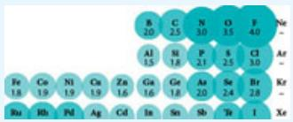</td></tr><tr><td>2. Types of Chemical Bonds</td><td>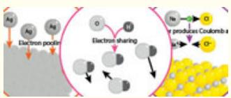</td></tr><tr><td>3. Representation of Valence Electrons with the Corresponding Lewis Electron Dot Diagram</td><td>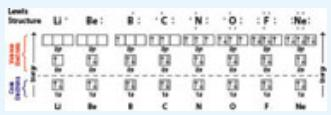</td></tr><tr><td>4. Lewis Structure for Ionic Bonds</td><td>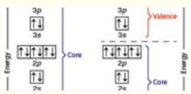</td></tr><tr><td>5. Lewis Structures for Covalent Bonds</td><td>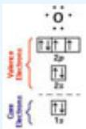</td></tr><tr><td>6. Lewis Structures and Resonance Structures</td><td>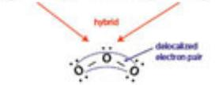</td></tr><tr><td>7. Method of Formal Charge</td><td>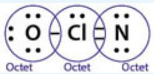</td></tr><tr><td>8. Limitations to the Lewis Theory</td><td>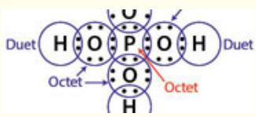</td></tr><tr><td>9. Valence Shell Electron Pair Repulsion: VSEPR Theory</td><td>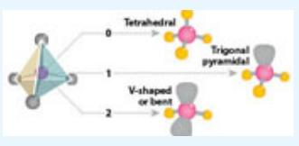</td></tr></table>

## The Structure of the Molecular Bond

Given the existence of electrons, protons, and neutrons, it is not difficult to imagine the existence of atoms simply because electrons and protons attract, capturing each other to form quantized wave structures. As we have seen, an isolated atom represents the remarkable balance between the quantum mechanical principles of electron matter waves with associated quantized energies and angular momenta on the one hand, and classical Coulomb attraction between opposite charges on the other. However, while an atom can exist alone, it usually chooses not to. It chooses, rather, to form bonds with other atoms. We can, to first order, appreciate why this may be so from a simple argument based upon our electron-in-a-box model that demonstrated a sequence of eigenvalue energies corresponding to the sequence of wavefunctions ordered upward from n=1 at the lowest energy (most stable) with the energy of each n level given by

```{math}
:label: eq-p1-ch10-3
\mathrm{E} _ {\mathrm{n}} = \frac {\mathrm{h} ^ {2} \mathrm{n} ^ {2}}{8 \mathrm{L} ^ {2} \mathrm{m} _ {\mathrm{e}} ^ {2}}
```


as displayed in [Figure 8.31](#fig-p1-ch08-49).

But we also recognize that because the energies $\mathrm { E } _ { \mathrm { n } }$ depend inversely on the width of the potential well that confines the electron, as L increases, the energy $\mathrm { E _ { n } }$ decreases. This was displayed explicitly in [Figure 8.33](#fig-p1-ch08-51). While we will develop increasingly potent theories for the details of chemical bonding, it remains fundamentally true that in the microscopic domain of quantum mechanics, molecules form from atoms because the formation of a molecule provides a means for the wavefunctions of atoms to spread out, to delocalize, thereby reducing the energy of the combined wavefunction as shown in [Figure 10.8](#fig-p1-ch10-23). This figure, in panel a, represents the simplest model of the chemical bond wherein two atoms, each with an approximate square well potential, combine to form a molecule wherein the electron wavefunction spreads out across the larger dimension of the molecule. As we saw, a wavefunction that spreads out, decreases in energy. This decrease in energy corresponds to a more stable configuration of electrons and protons and thus a stable union results. Two isolated atoms choose to form a molecule because that molecular geometry allows the wavefunction of each electron to spread to larger spatial domain resulting in decreased energy—the atoms capture each other to reduce their combined energy.

## Driving Forces for Chemical Bonding

b) Electrostatics
a) Electron delocalization
:::{figure} ../images/fig-p1-ch10-22.jpg
:name: fig-p1-ch10-22
:alt: Figure from the University Chemistry source textbook
:::

:::{figure} ../images/fig-p1-ch10-23.jpg
:name: fig-p1-ch10-23
:alt: FIGURE 10.8 The simplest model of the chemical bond involves reduction in energy of an electron when it spreads out, delocalizes, across the molecule formed from the addition of two atoms. If one of the atoms forming the molecule has a lowe
FIGURE 10.8 The simplest model of the chemical bond involves reduction in energy of an electron when it spreads out, delocalizes, across the molecule formed from the addition of two atoms. If one of the atoms forming the molecule has a lower energy, the molecule formed will draw electron density preferentially toward the atom that more strongly attracts an electron.
:::


The lower panel in [Figure 10.8](#fig-p1-ch10-23) (panel b) highlights the importance of electrostatics—Coulomb attraction—in determining the distribution of the wavefunction when two atoms of different energy of different ability to attract electrons combine to form a molecule. The atom with the greater ability to attract its valence electron (or electrons), is capable of extracting electron density from the atom that less strongly binds its valence electrons resulting in a shift in the combined wavefunction, a delocalization of electron density toward the atom with greater electronegativity.

Thus atoms combine when given the chance to create larger structures. To first order, nature does not distinguish between atoms or molecules. The protons, neutrons, and electrons are assembled by their electrical forces of attraction balanced against the electron-electron repulsion and the protonproton repulsion within the context of the wave properties of the electrons themselves.

As we will see, whether in atoms or in molecules, electrons obey the Schrödinger equation. But while the principles of quantization of angular momentum remain invariant with the formation of molecules, important changes take place as a result of the union of atomic wavefunctions to form molecular structures.

First, as we will see, the spherical symmetry inherent in the atom, which leads to the degeneracy of the orbitals with the same angular momentum quantum number, ℓ , is lost with the formation of the chemical bond. Considering the simplest case of a diatomic molecule, the spatial structure of the molecule has an axis of symmetry—the internuclear axis between the atoms in the molecular bond.

Second, the existence of a defined spatial axis and an internuclear distance means that the diatomic molecule cannot only move through space (translation), a molecule can also rotate and vibrate as depicted here respectively in panels a, b, and c.

:::{figure} ../images/fig-p1-ch10-24.jpg
:name: fig-p1-ch10-24
:alt: Figure from the University Chemistry source textbook
:::

These rotations and vibrations of the molecule are degrees of freedom unavailable to the isolated atom. In order to construct the molecular bond such that we can answer key questions related to bond strengths and bond geometry, let's consider what happens as two atoms approach one another, seeking the possibility of a more stable configuration by forming a bond with the requisite release of energy. Just as we began our study of atomic structure with the study of atomic hydrogen, we begin our investigation of the chemical bond with the formation of $\mathrm { H } _ { 2 }$ from two separate hydrogen atoms that we will designate as atom A and atom B. As we bring the separated H atoms together, the electron associated with proton A begins to sense the pull of proton B, albeit through the shielding of the electron associated with atom B so that the electron on A is attracted to atom B with a charge $\mathrm { Z _ { e f f } }$ at that internuclear distance. Similarly the electron on B senses the $\mathrm { Z _ { e f f } }$ of proton A and there is a net attraction. With decreasing internuclear distance, the electron associated with proton A begins to penetrate the shielding of the electron associated with proton B and the net attraction between the nuclei increases, lowering the potential energy of the system of two protons and two electrons. This union of the two electrons and two protons from the separated atom A and atom B provides the new wavefunction for each of the electrons to spread out, lowering the energy of the ensemble of electrons and protons that comprise the molecule.

:::{figure} ../images/fig-p1-ch10-25.jpg
:name: fig-p1-ch10-25
:alt: Figure from the University Chemistry source textbook
:::

The interaction between the two electrons and the two protons becomes increasingly complex, however, as the distance between the points decreases. As displayed here, the attraction between each electron and the two nuclei is offset by proton A repelling proton B and each electron repels the other. But the net result, the small difference between strong attraction (electronproton) and strong repulsion (proton-proton and electron-electron), is attraction, the release of energy as the potential energy of the system of electrons and protons decreases with decreasing internuclear distance. We can sketch the potential energy of this system of electrons and protons as a function of internuclear distance as displayed in [Figure 10.9](#fig-p1-ch10-26).

:::{figure} ../images/fig-p1-ch10-26.jpg
:name: fig-p1-ch10-26
:alt: FIGURE 10.9 As an H atom approaches another H atom, the electron of one atom is attracted to the nucleus of the other and visa versa. This attraction begins to reduce the potential energy of the ensemble of electrons and protons that consti
FIGURE 10.9 As an H atom approaches another H atom, the electron of one atom is attracted to the nucleus of the other and visa versa. This attraction begins to reduce the potential energy of the ensemble of electrons and protons that constitute the ${ \sf H } _ { 2 }$ molecule relative to that of the separated atoms. The attraction strengthens until the decreasing distance between the nuclei begins to rapidly increase the proton-proton repulsion and the potential energy curve begins to increase with decreasing internuclear distance. As the electrons are compressed into a smaller and smaller volume with decreasing internuclear distance, they too will increasingly contribute to the increase in the potential energy curve at small internuclear distance.
:::


The decrease in potential energy with internuclear distance doesn't continue unchecked. While the potential energy of the system decreases as the electrons delocalize and spread out to minimize the system energy across the totality of the forming $\mathrm { H } _ { 2 }$ molecule, the proton-proton repulsion begins to increase with decreasing internuclear distance. As the internuclear distance drops, the electrons are forced into a smaller and smaller spatial extent, and the electron-electron repulsion increases. The result, as displayed in [Figure 10.9](#fig-p1-ch10-26) is that the potential energy passes through a minimum and then, with further decrease in internuclear distance, begins to rise rapidly.

The net result is that the H atoms are pulled together at larger internuclear distances, pushed apart at small internuclear distance and in between resides the “equilibrium internuclear distance” at point 3 in [Figure 10.9](#fig-p1-ch10-26).

It is important to emphasize here that in the formation of the chemical bond, energy is neither created nor destroyed, but energy is released in the forming of the bond

```{math}
:label: eq-p1-ch10-4
\mathrm{H} + \mathrm{H} \rightarrow \mathrm{H} _ {2} + \mathrm{energy}
```


The energy release, by virtue of the bond formation itself, is equal to the depth of the well shown in [Figure 10.9](#fig-p1-ch10-26) at the equilibrium internuclear distance. While we developed this potential energy diagram for $\mathrm { H } _ { 2 } ,$ the basic shape of the potential energy “surface” of any chemical bond between two atoms or between an atom and a larger molecule will have the same basic shape. The next question is: What is the relationship between the electronic wavefunctions shown in [Figure 10.8](#fig-p1-ch10-23) and the potential energy curve shown in [Figure 10.9](#fig-p1-ch10-26)? The answer is that when we have two identical nuclei, as is the case for $\mathrm { H } _ { 2 } ,$ the ability of the electron-proton combinations to draw electron density to them is equal, so the electrons are shared equally between the nuclei and we have the situation depicted in the upper panel of [Figure 10.8](#fig-p1-ch10-23).

This electron sharing is termed a covalent bond, and the relationship between the simplified bond model in [Figure 10.8](#fig-p1-ch10-23) and the picture of the electron distribution about the two nuclei of the homonuclear (“same nuclei”) molecule is displayed in [Figure 10.10A](#fig-p1-ch10-27). Thus, while the electron distribution about each atom delocalizes within the structure of the molecule, thereby lowering the potential energy of the ensemble of electrons and protons, the probability density of the electrons within the new molecular bond is equally distributed between the two nuclei.

:::{figure} ../images/fig-p1-ch10-27.jpg
:name: fig-p1-ch10-27
:alt: FIGURE 10.10 In the simple box model of the chemical bond, it is the relative energies of the two bonding atoms that determines the degree of polarization of the molecular bond formed.
FIGURE 10.10 In the simple box model of the chemical bond, it is the relative energies of the two bonding atoms that determines the degree of polarization of the molecular bond formed.
:::


If a molecule is formed from two atoms, one of which has its valence orbitals more closely bound (thus lowering the energy levels of the valence in one of the atoms), the delocalized wavefunction of the resulting molecule will have the molecular wavefunction shifted preferentially toward the atom with the lower energy orbitals, as shown in [Figure 10.10B](#fig-p1-ch10-28). This leads to the formation of a “polar covalent” bond that has greater electron density centered on the atom with more tightly bound (lower energy) electrons in the separated atoms. In the extreme case where there is a large energy difference between the orbitals of the separated atoms, the molecule formed will have delocalization of the combined wavefunction toward the atom with lower energy orbitals. This case is displayed in [Figure 10.10C](#fig-p1-ch10-28), and is called an “ionic” bond because the bond is created in large measure by the simple Coulomb attraction between the cation that has donated electrons into the anion that has extracted electrons.

All three bond types—covalent, polar covalent, and ionic—however, share the same qualitative shape for their potential energy surface representing the relationship between potential energy and internuclear distance as shown in [Figure 10.9](#fig-p1-ch10-26).

A fascinating aspect of chemistry is that the chemical behavior of molecules depends, in large measure, on the spatial distribution of electron density in the chemical bond. We also developed a sense for the linkage of electron penetration and shielding in individual atoms that lead to the concept of the effective charge, $Z _ { \mathrm { e f f } } ,$ that a valence electron “sees” in an atom. It is the variation of $\mathrm { Z _ { e f f } }$ across the periodic table that provides a systematic pattern for atomic size, for the first ionization energy, IE, for electron affinity, EA, and for trends in metallic behavior as summarized in [Figure 10.11](#fig-p1-ch10-28).

:::{figure} ../images/fig-p1-ch10-28.jpg
:name: fig-p1-ch10-28
:alt: FIGURE 10.11 We can summarize trends in electron affinity, ionization energy, atomic radius, and metallic behavior of the elements in the periodic table.
FIGURE 10.11 We can summarize trends in electron affinity, ionization energy, atomic radius, and metallic behavior of the elements in the periodic table.
:::


How do these concepts of effective nuclear charge, first ionization energy, electron affinity, and atomic size translate over to help us understand the chemical behavior of molecules formed from those atoms? A significant part of the answer to this important question is that the propensity for an atom to draw electron density to it in a chemical bond exhibits a coherent pattern or tendency that is, to first order, independent of the particular pairing of atoms involved in the bond. That is, we can find a quantity that can be assigned to an atom in the periodic table, that represents a quantitative measure of that atom's ability to draw electron density to it independent of the identity of the other atom.

The ability of a given atom to draw electrons to itself in a chemical bond is called electronegativity. The concept of electronegativity provides a useful way to estimate the degree to which electron density is delocalized in a chemical bond toward a particular atom in that bond structure. Linus Pauling, an American chemist, succeeded in assembling a coherent scale defining the electronegativity for each element in the periodic table. The Pauling electronegativity scale is an empirical system by which the ability of a particular atom in the periodic table to draw electron density to it is rated on a dimensionless scale, with the maximum value of electronegativity of 4.0 assigned to fluorine (F). The electronegativity scale for the periodic table is displayed in [Figure 10.12](#fig-p1-ch10-29).

:::{figure} ../images/fig-p1-ch10-29.jpg
:name: fig-p1-ch10-29
:alt: FIGURE 10.12 The Pauling electronegativity scale, derived by consideration of each element's ability to attract electrons in a chemical bond, is displayed for the elements in the periodic table.
FIGURE 10.12 The Pauling electronegativity scale, derived by consideration of each element's ability to attract electrons in a chemical bond, is displayed for the elements in the periodic table.
:::


Fluorine has the highest electronegativity (EN), which we can understand from our discussion of penetration, shielding, $\mathrm { Z _ { e f f } , }$ and $\mathrm { E I } _ { 1 }$ . Fluorine has a very large $\mathrm { Z _ { e f f } }$ because its valence electrons are poorly shielded, needing only one electron to complete the 2p configuration. Not only is $\mathrm { Z _ { e f f } }$ large for the valence electrons of fluorine, the fluorine atom is small so it attracts available negative charge more strongly than any other element. That large EN for fluorine is in stark contrast with, for example, rubidium (Rb) or cesium (Cs), which are each large with strong shielding of the valence electrons. Rb and Cs have ENs of 0.8 and 0.7 respectively. Hydrogen, which is able to both extract electron density in a chemical bond from alkali (Group 1A) and alkaline earth (Group 2A) elements and donate electron density to nonmetals in the upper right of the periodic table, has an EN of 2.1.

The electronegativity (EN) scale is both extremely useful in practice and remarkable in the fact that, for all the possible combinations of atom-atom pairs that exist in the myriad of possible molecules, a single value of EN can be assigned to each element in the periodic table. [Figure 10.13](#fig-p1-ch10-30) summarizes the trend in EN across and down the periodic table. The electronegativity scale uses a combination of the first ionization energy, $\mathrm { I E } _ { 1 } ,$ and electric affinity, to establish the electronegativity ranking displayed in [Figure 10.12](#fig-p1-ch10-29) and [10.13](#fig-p1-ch10-30). For example, a species A with small $\mathrm { I E } _ { 1 : }$ , and small EA will easily surrender an electron but will not compete to extract an electron. Confronted with a species B with higher $\mathrm { I E } _ { 1 : }$ , and high EA, A will transfer electron density to B in the formation of a chemical bond. Atoms characterized by small $\mathrm { I E } _ { 1 }$ and EA are the metals that have, as a result, low values of electronegativity. Atoms in the upper right of the periodic table, the non-metals, have high EN values.

:::{figure} ../images/fig-p1-ch10-30.jpg
:name: fig-p1-ch10-30
:alt: FIGURE 10.13 A summary of the trends in the Pauling electronegativity scale for the first six periods of the periodic table.
FIGURE 10.13 A summary of the trends in the Pauling electronegativity scale for the first six periods of the periodic table.
:::


While values of EN are unitless, what matters in the formation of a chemical bond is the difference in EN between two atoms involved in a chemical bond. The larger the difference in EN between two species, the more polar will be the bond formed from those species. For example, in the formation of $\mathrm { O } _ { 2 } ,$ , while the EN for oxygen is very large (3.5) the difference in electronegativity in the bond is $\Delta \mathrm { E N } _ { \mathrm { b o n d } } = \mathrm { E N } _ { \mathrm { o } } - \mathrm { E N } _ { \mathrm { o } } = 3 . 5 - 3 . 5 = 0$ . The bond so formed is covalent with electron density balanced evenly between the two O atoms in the $\mathrm { O } _ { 2 }$ bond so formed. For the case of NaF, the EN of Na is 0.9 and the EN of F is 4.0, so for the NaF bond $\Delta \mathrm { E N } _ { \mathrm { N a F } } = \mathrm { E N } _ { \mathrm { F } } - \mathrm { E N } _ { \mathrm { N a } } = 4 . 0 -$ $0 . 9 = 3 . 1 $ . This is a very large difference in EN and thus the bond will be highly polar.

We can relate the range of differences in EN between two species in a bond to the range in bond character from nonpolar covalent, to polar covalent, to ionic as shown in [Figure 10.14](#fig-p1-ch10-31).

:::{figure} ../images/fig-p1-ch10-31.jpg
:name: fig-p1-ch10-31
:alt: FIGURE 10.14 There is a continuum of bond types ranging from pure, nonpolar covalent bonds through polar covalent bonds to ionic bonds displayed here in relation to the difference in electronegativity between the two atoms in the bond.
FIGURE 10.14 There is a continuum of bond types ranging from pure, nonpolar covalent bonds through polar covalent bonds to ionic bonds displayed here in relation to the difference in electronegativity between the two atoms in the bond.
:::


## Types of Chemical Bonds

Our identification and analysis of covalent, polar covalent, and ionic bond structure, which emerges directly from the concept of electronegativity, establishes the foundation for the three types of chemical bonds found in nature. [Figure 10.15](#fig-p1-ch10-32) displays examples of the three types: ionic bonding, covalent bonding, and metallic bonding.

:::{figure} ../images/fig-p1-ch10-32.jpg
:name: fig-p1-ch10-32
:alt: FIGURE 10.15 There are three types of chemical bonds categorized according to the difference in electronegativity, ΔEN, between the two atoms in the bond. Ionic bonding for ΔEN larger than 2.0 leads to a lattice structure as shown here for
FIGURE 10.15 There are three types of chemical bonds categorized according to the difference in electronegativity, ΔEN, between the two atoms in the bond. Ionic bonding for ΔEN larger than 2.0 leads to a lattice structure as shown here for standard table salt. For moderate to small values of ΔEN (2.0 to 0.4) the covalent bond forms such as in hydrocarbon molecules found in pasta. For small ΔEN for the bond and small values of EN for the atoms, metallic bonding occurs wherein the outer electrons are loosely bound to the positive cation core. This type of bond is found in metals such as a standard dinner fork.
:::


Ionic bonding results when there is a large difference in the electronegativity of the two atoms that comprise the chemical bond. When metals on the left-hand side of the periodic table (with small EN) bond to nonmetals on the upper right of the periodic table (with large EN), electron density is extracted from the metal and drawn to the nonmetal forming a cation (the metal ion) and an anion (the nonmetal ion). The cation and anion are thus attracted to each atom by the Coulomb force.

When a nonmetal forms a chemical bond with another nonmetal, both partners have large, or fairly large, ENs and thus the difference in EN is fairly modest. Thus the valence electrons are shared between the atoms participating in the bond. The “shared electron” bond is, as we have seen, termed the covalent bond. However, as [Figure 10.14](#fig-p1-ch10-31) demonstrates, there is a continuum of the degree of electron delocalization from strongly ionic (e.g. NaCl) to polar covalent (e.g. HF) to covalent (e.g. NO) depending on the difference in electronegativity between the two atoms that form the molecular bond. The third type of chemical bond is the metallic bond that, as the name suggests, occurs when metal atoms bond to each other in an ordered lattice as depicted in [Figure 10.15](#fig-p1-ch10-32). Metals have a low electronegativity and a low ionization energy and thus lose their electrons easily. The simplest model for metallic bonding is termed the “electron sea” model because the valence electrons of metals in a lattice delocalize throughout the lattice structure such that the metal cations are surrounded by a continuous “sea” of delocalized electrons. This freedom of movement of electrons throughout the metal lattice is the reason metals reflect light, conduct electricity, and conduct heat. In each case, it is the freedom of movement of electrons in the metal lattice that is responsible.

Metals are also capable of being pounded into thin sheets (a characteristic termed malleability) and metals can be drawn into long wires (termed ductility). The reason for this emerges from the “electron sea” model because while the metal cation in the sea of electrons can be displaced laterally with respect to a neighbor, chemical bonds are not explicitly broken, but rather seamlessly shifted as displayed in [Figure 10.16](#fig-p1-ch10-33).

:::{figure} ../images/fig-p1-ch10-33.jpg
:name: fig-p1-ch10-33
:alt: FIGURE 10.16 The “sea” of loosely bound electrons that reside around the cation core of metals allows the metal bond to deform without rupturing. This produces the malleability and ductility of metals. It also explains the excellent conduct
FIGURE 10.16 The “sea” of loosely bound electrons that reside around the cation core of metals allows the metal bond to deform without rupturing. This produces the malleability and ductility of metals. It also explains the excellent conductance of both electricity and heat in metals.
:::


We can summarize the relationship between the types of atoms that comprise a chemical bond and the type of chemical bond that results from the union of the two atoms:

<table><tr><td>Type of Atom</td><td>Type of Bond</td><td>Electron Movement</td></tr><tr><td>Metal and nonmetal</td><td>Ionic</td><td>Electron transferred</td></tr><tr><td>Nonmetal and nonmetal</td><td>Covalent</td><td>Electron shared</td></tr><tr><td>Metal and metal</td><td>Metallic</td><td>Electron delocalized through lattice</td></tr></table>

While the delocalization of electron density throughout the lattice structure of a metal is typically treated theoretically using the “electron sea” model at various levels of sophistication, metal-metal bonds tend to exhibit far less variety in chemical behavior than chemical bonds that explicitly bind electrons within a molecular structure. We consider here models used to understand chemical bonds that involve electrons bound within a specific chemical bond. Thus we consider a series of increasingly detailed models applied to covalent and ionic bonds that respectively involve the sharing of valence electrons or the transfer of an electron from one atom to its partner.

## Representation of Valence Electrons in a Chemical Bond

A key part of the development of quantitative reasoning in science is built upon a foundation of physical models that are as simple as possible, but still capture the essence of the factors that control the behavior of a given system.

The development of theories regarding molecular bonding have been developed to span from the simple to the complex, but they are all models that employ simplifications. The key judgment is to know when to apply a particular model to a particular problem, depending upon the scientific question to be answered or the scientific hypothesis to be tested. This evolution in complexity spans the range from simply keeping track of the valence electrons in a chemical bond (Lewis electron dot symbols) to solutions to the Schrödinger equation for many electron systems that demand (and often exceed) the capacity of the world's largest supercomputers. If the evolution from the simple models through increasingly complex models did not represent an effective progression that contributed significantly to our chemical intuition, we would not take the trouble to present that sequence of increasingly sophisticated models here because computing power is now available to easily solve the Schrödinger equation for important systems on a desktop computer. But there is an important difference between solving an equation with a computer on the one hand, and understanding how the formation of molecular bonds is tied to chemical behavior on the other. An understanding of the sequence of increasingly complex models of the chemical bond will provide very useful insight into the different character of chemical bonds that comprise molecular structure, and as a result, a fundamental grasp of chemical behavior that opens doors to an array of exciting opportunities.

As we have seen, the inner “core” electrons are bound so tightly (have such large negative potential energies) that they do not engage in the exchange of electron density with other atoms in a molecular bond. We thus focus attention on the outer valence electrons that are far less tightly held, and are thus the ones that are engaged in the formation of the chemical bond.

As we noted in Chapter 2 and in the Framework section of this chapter, it was G. N. Lewis who developed a systematic way of both (1) representing the valence electrons in an atom and (2) representing those same electrons in the chemical bond formed from those atoms.

We already know how to determine the electron configuration for each atom in the periodic table. What the Lewis electron dot symbol represents is a simplified representation of the detailed electron configuration in a form that keeps track of the valence electrons in both the atom and in the bonding structure of the molecules formed from those atoms. We simply need to link the electron configuration to the Lewis dot structure. In order to do this, we need to first isolate the core electrons from the valence electrons. We can do this by linking the elements in a given Period with the corresponding electron configuration. The separation between the core electrons and the valence electrons occurs with the progression from a principal quantum number n, to the next higher principal quantum number n+1.

This is shown for the Period 2 (i.e. n=2) elements in [Figure 10.17](#fig-p1-ch10-34). The core electrons in this case are the ${ \bf 1 } { \bf S } ^ { 2 }$ electrons, which are the most tightly bound electrons in each of the Period 2 elements. It is the n=2 electrons that constitute the valence electrons from lithium (Li) to the noble gas neon (Ne). The reason for the distinct demarcation in energy between inner core electrons and outer valence electrons is shown in the left-hand panel of [Figure 10.17](#fig-p1-ch10-34). Specifically, with the progression from the n=1 to the $\mathbf { n } = \mathbf { 2 }$ principal quantum number, there exists a dramatic drop in the first ionization energy, $\mathrm { I E } _ { 1 : }$ , of the next electron, in this case lithium (Li), resulting from the shielding of the closed shell He ${ \bf 1 } { \bf S } ^ { 2 }$ electrons and the increase in radius of the 2s electron that reduces the potential energy of the Li 2s electron thereby reducing how tightly bound that electron is to the Li nucleus. Displayed at the top of each of the elements electron configuration is the corresponding Lewis structure. Notice that the Lewis structure involves only the valence electrons and those electrons are organized according to whether the orbitals are singly occupied or doubly occupied. It is very important when constructing a Lewis diagram to first clearly identify the valence electrons.

:::{figure} ../images/fig-p1-ch10-34.jpg
:name: fig-p1-ch10-34
:alt: Figure from the University Chemistry source textbook
:::

Moving to the next Period in the periodic table, Period 3, [Figure 10.18](#fig-p1-ch10-35) steps sequentially through the elements corresponding to n=3 from sodium, Na, to argon, Ar. The first ionization energy, $\mathrm { I E } _ { 1 } ,$ , for Ne $( \mathrm { 1 s ^ { 2 } 2 s ^ { 2 } 2 p ^ { 6 } } )$ is 2100 kJ/mole while $\mathrm { I E } _ { 1 }$ for Na $\mathrm { ( 1 s ^ { 2 } 2 s ^ { 2 } 2 p ^ { 6 } 3 s ^ { 1 } ) }$ is 500 kJ/mole. The core electrons of Na $( \mathrm { 1 s ^ { 2 } 2 s ^ { 2 } 2 p ^ { 6 } } )$ are tightly held and do not engage in molecular bond formation, while the valence electrons are dramatically less tightly bound, and those valence electrons are displayed in [Figure 10.18](#fig-p1-ch10-35) for each element in Period 3.

:::{figure} ../images/fig-p1-ch10-35.jpg
:name: fig-p1-ch10-35
:alt: FIGURE 10.18 The link between the electronic configuration of elements in the periodic table and the Lewis structure is shown here for the third Period elements. Note that it is particularly important to distinguish between the core electro
FIGURE 10.18 The link between the electronic configuration of elements in the periodic table and the Lewis structure is shown here for the third Period elements. Note that it is particularly important to distinguish between the core electrons, which are not included in the Lewis dot structure, and the valence electrons, which are included.
:::


## Lewis Structure for Ionic Bonds

While we will focus the application of Lewis structure models on the vast array of covalent bonds in chemistry, the Lewis structure can be used for ionic bonding as well. In fact we begin with ionic bonding because it is simple, yet provides an introductory framework for building Lewis structures for a diverse range of molecules.

Consider, as an example, the bonding structure for potassium chloride, KCl. We can write the Lewis symbols for potassium and for chlorine as shown in [Figure 10.19](#fig-p1-ch10-36).

:::{figure} ../images/fig-p1-ch10-36.jpg
:name: fig-p1-ch10-36
:alt: FIGURE 10.19 The electron configuration of potassium and of chlorine and the Lewis dot structure for each.
FIGURE 10.19 The electron configuration of potassium and of chlorine and the Lewis dot structure for each.
:::


When potassium and chlorine bond, the electronegativity of Cl (EN=3.0) is so much greater than that of $\operatorname { K } ( \operatorname { E N } { = } 0 . 8 )$ that potassium effectively transfers its electron to Cl

```{math}
:label: eq-p1-ch10-5
K. +: \ddot {C} \dot {I}: \longrightarrow K ^ {+} [: \ddot {C} \dot {I}: ] ^ {-}
```


This transfer of an electron from potassium gives chlorine an octet of electrons and as a result a closed shell electron configuration. The transfer of the electron from potassium leaves it without a valence electron, but with a closed $\mathbf { n } { = } 3$ shell electron configuration. However, because K has donated an electron, it becomes a cation, $\mathrm { K ^ { + } }$ , and Cl, receiving an electron, becomes an anion, Cl<sup>-</sup>. The Coulomb attraction of the cation to the anion decreases the potential energy of $\mathrm { K ^ { + } C l ^ { - } }$ below that of the separated atoms, resulting in the formation of an ionic bond, as displayed in [Figure 10.20](#fig-p1-ch10-37). It is common practice to write the cation without brackets and the anion with brackets.

:::{figure} ../images/fig-p1-ch10-37.jpg
:name: fig-p1-ch10-37
:alt: FIGURE 10.20 The potential energy diagram for the ionic compound KCl.
FIGURE 10.20 The potential energy diagram for the ionic compound KCl.
:::


The Lewis model of ionic bonding has, it turns out, considerable predictive power. For example, if we use Lewis structures to determine the bonding between magnesium, Mg, and chlorine, Cl, we note that, from [Figure 10.18](#fig-p1-ch10-35),

magnesium has the Lewis structure and chlorine . However, a chlorine atom can only accept a single electron, so how is it possible to leave both Mg and Cl with a closed shell octet? The answer is that a single magnesium atom bonds to two chlorine atoms

```{math}
:label: eq-p1-ch10-6
\mathrm{Mg}: + \begin{array}{c} \vdots \\ \vdots \\ \vdots \end{array} \stackrel {{\ddot {\mathrm{Cl}}:}} {{\vdots}} \longrightarrow \mathrm{Mg} ^ {2 +} \left[ \vdots \stackrel {{\ddot {\mathrm{Cl}}:}} {{\vdots}} \right] _ {2} ^ {-} \longrightarrow \mathrm{MgCl} _ {2}
```


to form the ionic bond joining the magnesium cation with two chlorine anions to form $\mathrm { { \bf M g C l } } _ { 2 } .$ . The key observation is that it is indeed $\mathbf { M g C l } _ { 2 }$ that is the observed structure in nature. Notice that with an EN of 1.2 for magnesium (and EN for Cl of 3.0) the large difference in electronegativity results in the transfer of the electrons from magnesium to the two chlorine atoms.

What does Lewis theory predict for the bond structure of aluminum ([Figure 10.18](#fig-p1-ch10-35), ) with oxygen ([Figure 10.17)](#fig-p1-ch10-34)? First, the difference in electronegativity for those two elements is $\Delta \mathrm { E N } { = } \mathrm { E N } _ { \mathrm { O } } - \mathrm { E N } _ { \mathrm { A l } } = 3 . 5 - 1 . 5 = 2$ so aluminum will transfer an electron to oxygen. But each oxygen can receive just two electrons to fill its octet, while each aluminum has three electrons to donate in order to attain a closed shell octet of its own. The solution, by the prediction of Lewis's theory, is that two aluminum atoms bond to three oxygen atoms with the following electron transfer

:::{figure} ../images/fig-p1-ch10-38.jpg
:name: fig-p1-ch10-38
:alt: Figure from the University Chemistry source textbook
:::

The oxide of aluminum, $\mathrm { { A l } } _ { 2 } \mathrm { { O } } _ { 3 } ,$ is ubiquitous in nature, in the industrial production of aluminum metal, and in abrasives because of its intrinsic hardness, and it is a primary reason why the durability of aircraft, boats, and housing structures makes aluminum so valuable.

## Lattice Energy and the Formation of Ionic Crystals

There is a very interesting feature of the energy trade-off that occurs when ionically bonded molecules coalesce to form crystal structures. Consider the case of common table salt, sodium chloride, that is formed from elemental sodium (a solid metal) and gas phase chlorine atoms $\mathrm { N a } ( \mathrm { s } ) + \mathrm { C l } ( \mathrm { g } )  \mathrm { N a C l } ( \mathrm { s } )$ $\Delta \mathrm { H } ^ { \circ } { } _ { f } = - 4 1 1 \mathrm { k J } / \mathrm { m o l e }$ . At first glance, it would seem reasonable to assume that the exothermicity of the reaction results from the energy release of the electron transfer to form the ionic bond. However, the first ionization energy (EI<sub>1</sub>) of sodium is +496 kJ/mol and the electron affinity (EA) of Cl is -349 kJ/mole. Thus the transfer of the electron, as shown in [Figure 10.21](#fig-p1-ch10-39), is +147 kJ/mole. It is endothermic! It requires the input of energy to form the NaCl bond. Why, then, is the reaction of elemental sodium and chlorine exothermic?

:::{figure} ../images/fig-p1-ch10-39.jpg
:name: fig-p1-ch10-39
:alt: FIGURE 10.21 The electron transfer shown for the electron configuration of Na and of Cl in the formation of the ionic bond in NaCl.
FIGURE 10.21 The electron transfer shown for the electron configuration of Na and of Cl in the formation of the ionic bond in NaCl.
:::


The answer lies in the Coulomb attraction between the cation $\mathrm { N a ^ { + } }$ and anion Cl<sup>-</sup> when the crystal structure is formed with alternating $\mathrm { N a ^ { + } }$ and $\mathrm { C l ^ { - } }$ ions as shown in [Figure 10.22](#fig-p1-ch10-40). Thus it is the reduction in potential energy, resulting from the Coulomb attraction as energy is expended to transfer the electrons from the sodium to the chlorine while at the same time energy is released as the cation and anion are attracted toward each other to form the crystal structure. We can summarize the sequence of energy expended to form the cation and anion from Na(s) and $\mathrm { C l } ( { \bf g } )$ followed by the release of energy resulting from the Coulomb attraction of the cation-anion pairs that form the lattice resulting in the formation of the NaCl crystal structure, shown as a two-step process in [Figure 10.23](#fig-p1-ch10-41).

:::{figure} ../images/fig-p1-ch10-40.jpg
:name: fig-p1-ch10-40
:alt: FIGURE 10.22 The crystal structure of NaCl showing the alternating position of the mathematical notation and mathematical notation cation and anion.
FIGURE 10.22 The crystal structure of NaCl showing the alternating position of the ${ \mathsf { N a } } ^ { + }$ and $\complement \vdash$ cation and anion.
:::


:::{figure} ../images/fig-p1-ch10-41.jpg
:name: fig-p1-ch10-41
:alt: FIGURE 10.23 The energy level diagram showing the energy required to execute the electron transfer from Na to Cl, followed by the release of energy in forming the crystal lattice of NaCl.
FIGURE 10.23 The energy level diagram showing the energy required to execute the electron transfer from Na to Cl, followed by the release of energy in forming the crystal lattice of NaCl.
:::


The lattice energy, $\Delta \mathrm { H } _ { \mathrm { l a t } } ,$ corresponding to the wide variety of metalnonmetal ionic bonds range over large values for two principal reasons:

1. The potential energy release in the crystal lattice formation is proportional to the product of the charge on the cation times the charge on the anion and inversely proportional to the distance between the ions. As a result of the range in bond lengths there is a corresponding range in lattice energy.

2. The product of the ionic charge, which appears in the numerator of the potential energy expression, exerts powerful control over the lattice energy. For example $\mathrm { N a ^ { + } F ^ { - } }$ has a bond length of 231 pm and $\mathrm { C a ^ { 2 + } O ^ { 2 - } } _ { 2 }$ has a bond length of 239 pm, nearly identical. But the lattice energy for NaF is $( \Delta \mathrm { H } _ { \mathrm { l a t } } ) _ { \mathrm { N a F } } = - 9 1 0$ kJ/mol while that for CaO is $( \Delta \mathrm { H } _ { \mathrm { l a t } } ) _ { \mathrm { C a O } } = - 3 4 1 4$ kJ/mol reflecting the factor of 4 larger product of the ionic charge for CaO.

3. The trend in lattice energy as a function of the ionic bond length in a series of Group 1A cations with $\mathrm { C l ^ { - } }$ demonstrates clearly (see sidebar) that as the internuclear distance increases as a result of increasing size of the cation, the lattice energy decreases markedly.

:::{figure} ../images/fig-p1-ch10-42.jpg
:name: fig-p1-ch10-42
:alt: Figure from the University Chemistry source textbook
:::

The lattice energy (energy release when the gas phase cation-anion pair form the ionic crystal) as a function of internuclear distance for a range of

Group 1A cations with Cl<sup>-</sup>. As the nuclear distance increases, the lattice energy decreases markedly.

## Lewis Structures and Covalent Bonding

While ionic bonding of main group elements represents a clear and straightforward application of Lewis bonding theory, it is the treatment of covalent bonding using Lewis theory that constitutes a simple but powerful foundation for a series of increasingly complex approaches to bonding theory.

As an introduction to covalent bonding using Lewis theory, we briefly summarize the central elements of that theory:

1. Valence electrons, because they are as a group less tightly bound to the nucleus, play a fundamental role in chemical bonding. Thus it is important to carefully distinguish the inner core electrons from the valence electrons. The Lewis structure is a systematic way of representing only the valence electrons of an atom, and that separation between the core electrons and the valence electrons is displayed in [Figures 10.17](#fig-p1-ch10-34) and [10.18](#fig-p1-ch10-35).

2. Electrons are either transferred or they are shared in such a way that each atom in the bond acquires a stable electron configuration. This stable electron configuration is usually a filled shell. For main group elements this filled shell is an octet (ns<sup>2</sup>np<sup>6</sup>).

3. Ionic bonds result when there is a transfer of one more electrons from one atom (of low electronegativity) to another atom (of high electronegativity) in a chemical bond.

4. When electrons are shared in a chemical bond, a covalent bond results— typically between atoms with small to moderate differences in electronegativity.

5. Lewis theory is very effective in the analysis of main group elements— those for which the filled valence shell is octet. For d and f orbital systems, other bonding models are more appropriate. But that is important—simple but powerful models always have their limitations, and so it is with Lewis theory.

## Lewis Structures for Covalent Bonds

Chemical behavior is controlled by the distribution of electrons about the nuclear centers in the bonding structure of a molecule. Indeed, the position and ordering of the nuclei in a bonding structure is controlled by the electron distribution that leads to the lowest possible potential energy of the ensemble of electrons and nuclei that comprise a molecular bonding structure. When we develop the Lewis electron dot theory for molecules, it is important to remember that the Lewis theory is a model that helps select the molecular structure of lowest potential energy. Thus, while the procedures for writing a Lewis structure appear to be simply a list of rules, those rules represent a technique for predicting a structure of lowest potential energy. As is typically the case, we begin with the simple application of Lewis theory for diatomic molecules and then build toward polyatomic structures; always keeping in mind that the Lewis model brings important chemical insight, but it is not without its limitations.

## Lewis Structures for Single Covalent Bonds: Diatomics

If we extract the diagram linking the electron configuration of a chlorine atom, Cl, with its Lewis dot structure, [Figure 10.24](#fig-p1-ch10-43), we observe first that only the valence electrons are displayed in a Lewis diagram. Second, that there are seven electrons in the valence shell. As we will see, setting the correct bonding structure in a Lewis diagram always begins and ends with the counting of electrons! Third we recognize that the difference in electronegativity between the bonding atoms is zero because $\mathrm { C l } _ { 2 }$ is a homonuclear molecule—the bonding partners are the same. Thus the bond has no intrinsic polarity and the electrons are shared equally between the Cl atoms. Fourth, Lewis theory postulates that for elements in the second and third row of the periodic table, the outer shell of electrons must be an octet of electrons.

:::{figure} ../images/fig-p1-ch10-43.jpg
:name: fig-p1-ch10-43
:alt: FIGURE 10.24 The Lewis structure of Cl shown with the electronic configuration of chlorine.
FIGURE 10.24 The Lewis structure of Cl shown with the electronic configuration of chlorine.
:::


For the case of $\mathrm { C l } _ { 2 } ,$ we have a total of $2 \times 7 = 1 4$ valence electrons so if we are to form a bonding structure for $\mathrm { C l } _ { 2 }$ wherein each Cl atom in the molecule is surrounded by 8 electrons, then the Cl atoms must each share an electron from the other Cl atom. Thus the Lewis electron dot diagram for $\mathrm { C l } _ { 2 }$ is

```{math}
:label: eq-p1-ch10-7
: \mathrm{ci}: \mathrm{ci}:
```


where the two electrons forming the bond between the two atoms are shared.

```{math}
:label: eq-p1-ch10-8
: \mathrm{Cl} \cdot \mathrm{Cl}: \text {   shared   electrons   }
```


If we were to write the Lewis structure for HCl, we would first count valence electrons, 7 for Cl and 1 for H. While completing the closed shell configuration for Cl requires an octet (8), completing the closed shell configuration for H requires just two electrons, a duet. Thus by sharing a pair of bonding electrons, both H and Cl complete their respective closed shell configuration:

:::{figure} ../images/fig-p1-ch10-44.jpg
:name: fig-p1-ch10-44
:alt: Figure from the University Chemistry source textbook
:::

Because the electronegativity of Cl exceeds that of H, electron density will delocalize from the H atom to the Cl atom, but the Lewis diagram is not written to reflect this delocalization unless the electron is transferred as is the case for an ionic bond previously discussed.

There is an important distinction to be made in each of the Lewis diagrams we have written: the distinction between the bonding pair of electrons and the electron not involved in the shared electron bond. This latter category of electrons is termed the “lone pair” electrons. The distinction is highlighted to emphasize the point for $\mathrm { C l } _ { 2 }$ and for HCl.

:::{figure} ../images/fig-p1-ch10-45.jpg
:name: fig-p1-ch10-45
:alt: Figure from the University Chemistry source textbook
:::

The distinction between the bonding electron pairs and the lone pairs will become increasingly important as we examine more complex bonding structures and the relationship between molecular shape and bonding structure.

## Lewis Structures for Single Covalent Bonds: Polyatomic Molecules

Let's next consider two of the most important atoms that sustain life on the planet: oxygen and hydrogen. To determine the Lewis structure of bonds involving those two elements we first count valence electrons: six electrons for oxygen and one electron for hydrogen, a total of seven.

:::{figure} ../images/fig-p1-ch10-46.jpg
:name: fig-p1-ch10-46
:alt: Figure from the University Chemistry source textbook
:::

We can write the Lewis dot structure for diatomic OH:

However, while H has the requisite two electrons to form a closed shell, oxygen is left with seven electrons in the outer shell.

:::{figure} ../images/fig-p1-ch10-47.jpg
:name: fig-p1-ch10-47
:alt: Figure from the University Chemistry source textbook
:::

Thus, Lewis theory deems this structure unacceptable because it violates the octet rule, the outer electron shell of oxygen has seven, not eight electrons. Thus Lewis theory predicts that there is a structure of lower potential energy than OH—what is it?

We recognize that if we were to add another hydrogen atom to the structure, that hydrogen atom would contribute one shared bonding electron to O such that the octet rule would be satisfied for oxygen and the duet rule for hydrogen.

:::{figure} ../images/fig-p1-ch10-48.jpg
:name: fig-p1-ch10-48
:alt: Figure from the University Chemistry source textbook
:::

Thus Lewis theory predicts that the lowest potential energy (i.e. most stable) structure involving hydrogen atoms bonded to oxygen atoms is $\mathrm { H } _ { 2 } \mathrm { O }$ . Indeed it

is.

It is also important to distinguish between the bonding pairs of electrons and the lone pair electrons in water.

:::{figure} ../images/fig-p1-ch10-49.jpg
:name: fig-p1-ch10-49
:alt: Figure from the University Chemistry source textbook
:::

It is the convention that electron pair bonds in Lewis structures are represented by a straight line to emphasize the distinction between electron pairs that are bonding vs. lone pairs, so we typically use this convention because it contains more information and it is quicker to write!

```{math}
:label: eq-p1-ch10-9
\mathrm{H} - \stackrel {\cdot \cdot} {\mathrm{O}} - \mathrm{H}
```


We should stop to reflect upon the fact that, while Lewis theory is very simple, it has already exhibited significant predictive power — it has given us the first order structure for water and it has distinguished between bonding electron pairs and lone pairs not directly involved in the bonding structure.

This emerging ability of Lewis structures to predict why specific combination of atoms form stable molecules while other do not, begs the question: what about $\mathrm { H } _ { 3 } \mathrm { O } ?$

We can immediately write a candidate Lewis structure.

:::{figure} ../images/fig-p1-ch10-50.jpg
:name: fig-p1-ch10-50
:alt: Figure from the University Chemistry source textbook
:::

Because the 9 electrons in the shell of oxygen violates the octet rule, Lewis theory predicts that $\mathrm { H } _ { 3 } \mathrm { O }$ is not stable. However, if we remove one electron to form the cation

:::{figure} ../images/fig-p1-ch10-51.jpg
:name: fig-p1-ch10-51
:alt: Figure from the University Chemistry source textbook
:::

we are left with the hydronium ion $\mathrm { H _ { 3 } O ^ { + } }$ . We know the hydronium ion is stable; it is the central species in acid-base chemistry!

Lewis theory also provides insight into other possible combinations of hydrogen-oxygen bonding. For example if we create the bonding structure of $\mathrm { O } _ { 2 } ,$ we combine two oxygen atoms with 6 electrons each, for a total of 12 electrons:

:::{figure} ../images/fig-p1-ch10-52.jpg
:name: fig-p1-ch10-52
:alt: Figure from the University Chemistry source textbook
:::

But this structure violates the octet rule! It is not an acceptable Lewis structure. If, alternatively, we draw a structure that involves four shared bonding electrons

:::{figure} ../images/fig-p1-ch10-53.jpg
:name: fig-p1-ch10-53
:alt: Figure from the University Chemistry source textbook
:::

then we can satisfy the Lewis octet rule with a double bond.

```{math}
:label: eq-p1-ch10-10
\begin{array}{c} \ddots \\ \ddots \end{array} = \begin{array}{c} \ddots \\ \ddots \end{array}
```


As we develop more sophisticated models of bonding based upon quantum mechanics we will reveal inadequacies in this Lewis structure for $\mathrm { O } _ { 2 } ,$ but for simple models of bonding, this is an acceptable Lewis structure. But this structure of $\mathrm { O } _ { 2 }$ immediately suggests alternative possibilities for bonding structures between oxygen and hydrogen. Specifically if each oxygen contributes six electrons and each hydrogen contributes one electron, the double bond in $\mathrm { O } _ { 2 }$ can be replaced by a single bond and the seven outer shell electrons in our first guess at the Lewis structure

```{math}
:label: eq-p1-ch10-11
\cdot \ddot {\mathrm{O}}: \ddot {\mathrm{O}} \cdot
```


can share the $7 ^ { \mathrm { t h } }$ electron with hydrogen to form the structure

```{math}
:label: eq-p1-ch10-12
\mathrm{H}: \ddot {\mathrm{O}}: \ddot {\mathrm{O}}: \mathrm{H}
```


that satisfies the octet rule for oxygen and the duet rule for hydrogen:

```{math}
:label: eq-p1-ch10-13
\mathrm{H} - \stackrel {\cdot \cdot} {\mathrm{O}} - \stackrel {\cdot \cdot} {\mathrm{O}} - \mathrm{H}
```


This is the structure of a very important category of compounds, the peroxides. In this case hydrogen peroxide $\mathrm { H } _ { 2 } \mathrm { O } _ { 2 }$ is a widely used disinfectant as well as a powerful catalytic agent in biological systems. The hydroxide structure of chlorine

```{math}
:label: eq-p1-ch10-14
: \mathrm{Cl}: \mathrm{O}: \mathrm{O}: \mathrm{Cl}:
```


or

```{math}
:label: eq-p1-ch10-15
: \ddot {\mathrm{Cl}} - \mathrm{O} - \mathrm{O} - \ddot {\mathrm{Cl}}:
```


is the species singularly responsible for the Antarctic ozone hole as we will see in Chapter 12.

## Lewis Structures and Bonding Character

This idea, intrinsic to the Lewis theory, that the attraction between two covalently bonded atoms is due to the sharing of one or more electron pairs is very important to the development of chemical intuition. The shared electron pair, or pairs, idea implies that each bond links a specific pair of atoms. As a consequence, the fundamental units within covalently bonded compounds are atom pairs leading to a bonding structure dominated by forces within molecular structures. This is in stark contrast to ionic bonding, which creates structures that are not directional between atoms in a specific molecule; rather, ionic bonding creates a lattice of positive and negative charges among an entire array of ions.

Thus for covalently bonded molecules, the bonding interactions within the molecules (intramolecular forces) are far stronger than the interactions between molecules (intermolecular forces). As a consequence, when a molecular compound undergoes a phase transition, such as when water boils or ice melts, the $\mathrm { H } _ { 2 } \mathrm { O }$ molecular structure remains intact, but only the weaker forces between $\mathrm { H } _ { 2 } \mathrm { O }$ molecules play a role in the phase transition.

## Constructing Lewis Structures For Polyatomic Molecular Compounds

We now develop a strategy for writing the Lewis structure for a molecular compound. As we will see, this process depends primarily on practice, and as the molecules become more complicated, it is helpful to establish a consistent sequence of steps to sort out the details.

## Step 1: Draw the Correct Skeletal Structure for the Molecule

For simple molecules, this step in the sequence is easy. As the molecular structure becomes increasingly complicated, this step becomes increasingly difficult. It is also important to recognize that the only way to be certain that the correct skeletal structure has been identified is to verify the structure by experiment. However, there are two important guidelines. The first is that hydrogen atoms are almost invariably terminal atoms because hydrogen has a single electron and thus cannot form multiple bonds that is required of a central atom. The second important guideline is that the more electronegative atoms reside in the terminal positions, the less electronegative in the central positions.

Bookkeeping; we need to count the total number of valence electrons contributed by each atom to the molecular structure. Given that Lewis structures are almost exclusively for elements in Period 1 through 3, the number of valence electrons for any main group element is equal to its group number in the periodic table. In practice it is essentially necessary to memorize [Figures 10.17](#fig-p1-ch10-34) and [10.18](#fig-p1-ch10-35). A small price in practice!

## Step 3:

Place electrons within the skeletal structure giving octets to the atoms other than hydrogen, and duets to the hydrogen atoms. Begin this process by placing two electrons between every pair of atoms—those are the minimal number of bonding electron pairs. Next distribute the remaining electrons as lone pairs beginning with the terminal atoms and then moving to the central atoms.

## Step 4:

Count the electrons around each atom and the total number of available electrons. If the available electrons have been used up and any atoms lack an octet, form double or triple bonds as necessary to satisfy the octet (duet) rule.

In [Figure 10.25](#fig-p1-ch10-54), we can summarize this final step in a logic diagram that captures the sequence in completing the Lewis diagram.

:::{figure} ../images/fig-p1-ch10-54.jpg
:name: fig-p1-ch10-54
:alt: Figure from the University Chemistry source textbook
:::

:::{figure} ../images/fig-p1-ch10-55.jpg
:name: fig-p1-ch10-55
:alt: Figure from the University Chemistry source textbook
:::

Let's work out the Lewis structure for three of the most important polyatomic molecules to life using this strategy: $\mathrm { H } _ { 2 } \mathrm { O } , \mathrm { C O } _ { 2 } ,$ and $\mathrm { { O } } _ { 3 }$ in [Table 10.1](#xref-visual-p1-ch10-molecular-bonding-i-705).

:::{table} TABLE 10.1
:label: xref-visual-p1-ch10-molecular-bonding-i-705
:enumerated: false
<table><tr><td></td><td>Steps in the Procedure</td><td>Lewis Structure for H2O</td><td>Lewis Structure for CO2</td><td>Lewis Structure for Ozone</td></tr><tr><td rowspan="2">1</td><td rowspan="2">Correct skeletal structure for the molecule.</td><td>Hydrogen atoms are terminal atoms. Thus O is the central atom</td><td>Oxygen is more electronegative than carbon; carbon is the central atom</td><td rowspan="2">All atoms are the same</td></tr><tr><td>H O H</td><td>O C O</td></tr><tr><td>2</td><td>Determine total number of electrons for the Lewis structure by adding the valence electrons contributed by each atom. See <a href="#fig-p1-ch10-34">Figures 10.17</a> and <a href="#fig-p1-ch10-35">10.18</a>.</td><td>Each hydrogen contributes one electron: 2 electrons from hydrogen, oxygen is Group 6 so the total is 6 + 2 = 8 electrons</td><td>Carbon has 4 valence electrons, oxygen 6. Total number of electrons: 6 + 6 + 4 = 16 electrons</td><td>Total number of electrons: 6 electrons from each oxygen atom 3 × 6 = 18 electrons</td></tr><tr><td>3</td><td>Distribute electrons beginning with bonding electrons, then assigning lone pairs to terminal atoms, then to lone pairs on the central atom. Check to see whether each atom has an octet (duet for hydrogen atoms.)</td><td>Bonding electrons firstH:O:H4 electrons left; lone pairs on terminal atoms nextH:O:HNone needed; lone pairs on central atom next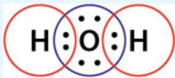Zero electrons left</td><td>Bonding electrons firstO:C:O12 electrons left; lone pairs on terminal atoms next:O:C:O:Zero electrons left</td><td>Bonding electrons firstO:O:O4 electrons used, 14 remain; lone pairs on terminal atoms next:O:O:O:16 electrons used, two remain:O:O:O:</td></tr><tr><td rowspan="2">4</td><td rowspan="2">If an atom lacks an octet, form double or triple bonds as necessary to give them octets.</td><td rowspan="2">All atoms have an octet or duet. No electrons left; Lewis diagram complete</td><td>Carbon lacks an octet, so move terminal lone pairs to central atom to form double bonds</td><td>Central atom does not have an octet, create double (or triple) bonds on central atom</td></tr><tr><td>Correct Lewis Structure</td><td>This would imply that two different structures exist for ozone:  $\ddot{O} - \ddot{O} = \ddot{O} :$  and:  $\ddot{O} = \ddot{O} - \ddot{O} :$ </td></tr></table>
:::

Is it correct to have two different Lewis structures for the same molecule? Is it physically plausible that a molecule could have an asymmetric structure wherein one of the O-O bonds in ozone is a double bond and one a single bond? Experiments have shown conclusively that the bonds in ozone are identical. How can such an observation be reconciled with the predictions of the Lewis model? The answer is that, as we will see in Chapter 10, electrons are capable of delocalizing within the bond structure of a molecule such that the two bond structures represented by the two Lewis structures of $\mathrm { { O } } _ { 3 }$ are of equal energy.

```{math}
:label: eq-p1-ch10-16
: \ddot {\mathbf {O}} - \ddot {\mathbf {O}} = \ddot {\mathbf {O}}: \quad \stackrel {\text {   Resonance   }} {\longleftrightarrow} \quad \ddot {\mathbf {O}} = \ddot {\mathbf {O}} - \ddot {\mathbf {O}}:
```


and are thus “resonance structures.” That is, neither the structure on the left nor the structure on the right actually exist, but rather a hybrid of the two structures exists with the extra electron pair delocalized along the spine of the $\mathrm { { O } } _ { 3 }$ molecules. Ozone is actually a bent molecule and we draw the bonding structure of ozone with the delocalized electron pair spread along the backbone of the molecule.

:::{figure} ../images/fig-p1-ch10-57.jpg
:name: fig-p1-ch10-57
:alt: Figure from the University Chemistry source textbook
:::

As we will see, this resonance structure, which leads to the concept of a hybrid structure involving the delocalization of electron density over an extended domain in the bonding structure of a molecule, is quite common in chemistry. It is a manifestation of the fact that electrons distribute themselves within the structure of a molecule such as to minimize the potential energy of the ensemble of all electrons and protons in the structure. If the electrons “need” to delocalize to reduce the potential energy of the molecule system, they will do just that.

One of the most important applications of modern chemistry is the development of the techniques to enhance the productivity of crops worldwide. An important compound for fertilizing agricultural crops is ammonium nitrate, $\mathrm { N H _ { 4 } N O _ { 3 } }$ which is produced from ammonia, $\mathrm { N H } _ { 3 } ,$ and various forms of nitrogen oxides. As noted in Chapter 5, the annual ammonia production is 150 billion kg produced in the Haber process that reacts $\mathrm { N } _ { 2 }$ with $\mathrm { H } _ { 2 }$ over an iron catalyst at elevated temperature and pressure:

```{math}
:label: eq-p1-ch10-17
\mathrm{N} _ {2} + 3 \mathrm{H} _ {2} \rightarrow 2 \mathrm{NH} _ {3}
```


The ammonia is oxidized to ammonium nitrate fertilizer and applied to crops worldwide. The use of ammonium nitrate fertilizers has become so widespread that the majority of fixed nitrogen entering the Earth's biosphere is from synthetic fertilizers. A key problem in chemistry today is the development of more efficient ways of producing fixed nitrogen and in controlling the amount of fixed nitrogen used. Let's examine the Lewis structures for $\mathrm { N H _ { 3 } , N H ^ { + } } _ { 4 }$ , and $\mathrm { N O _ { ~ 3 ~ } ^ { - } }$ using our stepwise procedure in [Table 10.2](#xref-visual-p1-ch10-molecular-bonding-i-734).

:::{table} TABLE 10.2
:label: xref-visual-p1-ch10-molecular-bonding-i-734
:enumerated: false
<table><tr><td></td><td>Steps in the Procedure</td><td>Lewis Structure for NH3</td><td>Lewis Structure for NH4+</td><td>Lewis Structure for NO3-</td></tr><tr><td>1</td><td>Correct skeletal structure for the molecule.</td><td>Hydrogen is always terminal so nitrogen is the central atom</td><td>Hydrogen's terminal so nitrogen is the central atom</td><td>Nitrogen is least electronegative so is central atom</td></tr><tr><td>2</td><td>Determine total number of electrons for the Lewis structure by adding the valence electrons contributed by each atom. See <a href="#fig-p1-ch10-34">Figures 10.17</a> and <a href="#fig-p1-ch10-35">10.18</a>.</td><td>Nitrogen has 5 valence electrons and hydrogen has 1. $5 + 3 \times 1 = 8$ electrons</td><td>Nitrogen has 5 valence electrons, hydrogen has 1, and because  $NH^{+}_{4}$  is a +1 Cation, subtract 1 electron $5 + 4 \times 1 - 1 = 8$ electrons</td><td>Nitrogen has 5 valence electrons, oxygen has 6 valence electrons, and 1 negative charge adds 1 electron $5 + 3 \times 6 + 1 = 24$ </td></tr><tr><td>3</td><td>Distribute electrons beginning with bonding electrons and then assigning lone pairs to terminal atoms then to lone pairs on the central atom. Check to see whether each atom has an octet (duet for hydrogen atoms.)</td><td>Bonding electrons added firstH:N:HHThis uses 6 of 8 electrons. Last 2 electrons added to central NOctet Duet H:N:H Duet</td><td>Bonding electronsEight electrons available, eight electrons used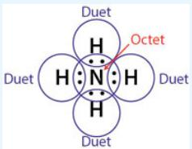Octet and duets satisfied</td><td>Bonding electrons firstO O:N:ODistribute remaining electrons first to terminal atom24 electrons used but central N does not have octet move a lone pair to form double bonds</td></tr><tr><td>4</td><td>If an atom lacks an octet, form double or triple bonds as necessary to give them octets.</td><td>The central nitrogen has an octet, the hydrogen a duet. All electrons accounted for. Correct Lewis structure</td><td>As a convention enclose the Lewis structure in brackets with charge of ion in upper right $\left[ \begin{array}{c} H \\ | \\ H-N-H \\ | \\ H \end{array} \right]^+$ </td><td>Enclose in brackets with charge designated $\left[ \begin{array}{c} :\ddot{\text{O}} : \\ :\ddot{\text{O}}-N=O \\ :\ddot{\text{O}} \end{array} \right]^-$ </td></tr></table>
:::

Inspection of the derived Lewis diagram for $\mathrm { N O _ { 3 } } ^ { - }$ reveals, as was the case for ozone, that the nitrate anion has a single bonding pair of electrons between two of the oxygen atoms and the central nitrogen, and a double bonding pair of electrons between one of the oxygens and the central nitrogen. However, experiments reveal that all three oxygen-nitrogen bonds in $\mathrm { N O _ { ~ 3 ~ } ^ { - } }$ are equivalent, so the actual structure of the nitrate anion is a hybrid of the three structures, with the electron pair that forms the double bond delocalized across the structure of the anion:

:::{figure} ../images/fig-p1-ch10-62.jpg
:name: fig-p1-ch10-62
:alt: Figure from the University Chemistry source textbook
:::

While the determination of the correct Lewis structure generally results in either a single structure or a hybrid of equivalent resonance structures, all with the same positioning of the atoms within the structure (the only differences being the location of single, double and triple bonds within the same structure), there are important cases where there are structures with alternative positions of the atoms within the inferred molecular structure. How do we decide which structure is the correct one? Which one has the lowest potential energy?

Consider the case of nitrosyl chloride, NOCl, which is an important constituent in the powerful acid aqua regia that is a mixture of concentrated nitric acid and hydrochloric acid. NOCl reacts with water to form HCl and it photodissociates to form the nitric oxide radical, NO, and the atomic chlorine radical, Cl:

```{math}
:label: eq-p1-ch10-18
\mathrm{NOCl} + \mathrm{hv} \rightarrow \mathrm{NO} + \mathrm{Cl}
```


Let's submit nitrosyl chloride to our sequence for determining the Lewis structure of the molecule.

At this point we are left with four structures, each of which satisfy the Lewis structure octet rule, yet only one of them is correct. We are thus left with a choice. Either we can do a full quantum mechanical structure calculation on a computer to determine which structure is of lowest potential energy, or we can employ the methods of formal charge to gain insight into which structure is the correct one, an approach developed by Irving Langmuir.

<table><tr><td></td><td>Steps in the Procedure</td><td>Lewis Structure for NOCI</td></tr><tr><td>1</td><td>Correct skeletal structure for the molecule</td><td>We recognize immediately that the common chemical formula for nitrosyl chloride is not the correct skeletal placement because it places the most electronegative atom in the central position. Nitrogen has an electronegativity of 3.0, but so too does Cl. Thus we have two possible skeletal structures:Choice A Choice BO CI N O N CI</td></tr><tr><td>2</td><td>Number of electrons</td><td>Nitrogen has 5 valence electrons, oxygen has 6, and chlorine 7, so we have a total of  $5 + 6 + 7 = 18$  Electrons</td></tr><tr><td>3</td><td>Distribute the electrons</td><td>We assign the bonding electrons firstChoice A Choice BO : CI : N O : N : CINext place the electrons on the terminal atomsChoice A Choice BO : CI : N : O : N : CIThis uses 16 of the available 18 electrons. Place the last 2 electrons on the central atomChoice A Choice B 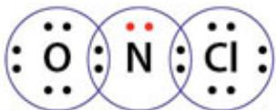Octet 6 electron Octet Octet 6 electron Octet</td></tr></table>

:::{figure} ../images/fig-p1-ch10-65.jpg
:name: fig-p1-ch10-65
:alt: Figure from the University Chemistry source textbook
:::

## Method of Formal Charge

Just as the Lewis dot structure is a bookkeeping technique for electrons in a molecular structure, so too is the formal charge method. The method assumes, regardless of the electronegativity of a given atom, that the electrons in a bond are shared equally—that the bonds are fully covalent with no delocalization of electron density toward a more electronegative member of a bonding pair. The technique is to assign half the bonding electrons to one atom in the bonding pair, and half the bonding electrons to the other atom in the bonding pair. After assigning the bonding electrons, the lone pair electrons on each atom are assigned fully to that atom. We therefore calculate the formal charge of each atom in a molecular structure with the formula

```{math}
:label: eq-p1-ch10-19
\begin{array}{c} \text {Formal} \\ \text {charge} \end{array} = \begin{array}{l} \text {Number} \\ \text {of valence} \\ \text {electrons} \end{array} - \left( \begin{array}{l l l} \text {Number} & & ^ 1 / _ 2 \text {number} \\ \text {of lone pair} & + & \text {of bonding} \\ \text {electrons} & & \text {electrons} \end{array} \right)
```


We can do this for each of our candidate structures for nitrosyl chloride, indicating the formal charge within a circle associated with each atom:

<table><tr><td rowspan="2"></td><td rowspan="2" colspan="3">Structure A1 $\overset{\cdot\cdot}{\text{O}} = \overset{\cdot\cdot}{\text{Cl}} - \overset{\cdot\cdot}{\text{N}} :$ </td><td rowspan="2" colspan="3">Structure A2 $\overset{\cdot\cdot}{\text{O}} - \overset{\cdot\cdot}{\text{Cl}} = \overset{\cdot\cdot}{\text{N}}$ </td></tr><tr></tr><tr><td>Number of valence e-</td><td>6</td><td>7</td><td>5</td><td>6</td><td>7</td><td>5</td></tr><tr><td>- number of lone pair e-</td><td>4</td><td>2</td><td>6</td><td>6</td><td>2</td><td>4</td></tr><tr><td>- 1/2 (number of bonding e-)</td><td>2</td><td>3</td><td>1</td><td>1</td><td>3</td><td>2</td></tr><tr><td>Formal charge</td><td>0</td><td>+2</td><td>-2</td><td>-1</td><td>+2</td><td>-1</td></tr><tr><td rowspan="2"></td><td rowspan="2" colspan="3">Structure B1 $\overset{\cdot\cdot}{\text{O}} = \overset{\cdot\cdot}{\text{N}} - \overset{\cdot\cdot}{\text{Cl}} :$ </td><td rowspan="2" colspan="3">Structure B2 $\overset{\cdot\cdot}{\text{O}} - \overset{\cdot\cdot}{\text{N}} = \overset{\cdot\cdot}{\text{Cl}}$ </td></tr><tr></tr><tr><td>Number of valence e-</td><td>6</td><td>5</td><td>7</td><td>6</td><td>5</td><td>7</td></tr><tr><td>- number of lone pair e-</td><td>4</td><td>2</td><td>6</td><td>6</td><td>2</td><td>4</td></tr><tr><td>- 1/2 (number of bonding e-)</td><td>2</td><td>3</td><td>1</td><td>1</td><td>3</td><td>2</td></tr><tr><td>Formal charge</td><td>0</td><td>0</td><td>0</td><td>-1</td><td>0</td><td>+1</td></tr></table>

The next question is, how do we use the formal charge to distinguish between the various competing structures? To determine the molecular structure of lowest potential energy (most stable), we apply the following rules:

1. The sum of the formal charges in a Lewis structure must equal zero for a neutral molecule and must equal the net charge on a cation or anion.

2. A smaller formal charge on an individual atom is favored over larger formal charges. Molecular structures with the smallest formal charge represent the structures of lowest potential energy and are thus the most stable.

3. Negative formal charges should appear on the most electronegative atoms.

4. Structures having formal charges of the same sign on adjoining atoms are not favored.

We are now in a position to use the formal charge analysis to select the favored (lowest potential energy, most stable) structure for nitrosyl chloride from the four candidate possibilities (each of which satisfy the Lewis octet rule). First, we note that rule 1 is satisfied for all four structures; each structure has a sum of formal charges equal to zero. The requirement (#2) that a smaller formal charge on each atom is favored over a larger formal charge eliminates both structure $\mathbf { A _ { 1 } }$ and structure $\mathbf { A } _ { 2 } .$ . The third requirement that negative formal charges should appear on the most electronegative atom is also violated by both structure $\mathbf { A _ { 1 } }$ and structure $\mathbf { A } _ { 2 } .$ . Structure ${ \bf B _ { 1 } }$ is the structure with the smallest formal charge, which is zero for each atom. Thus the structure

```{math}
:label: eq-p1-ch10-20
\begin{array}{c} \ddot {\mathrm{O}} = \ddot {\mathrm{N}} - \ddot {\mathrm{Cl}}: \\ \ddots \end{array}
```


is the favored structure. It is indeed the structure verified by experiment.

## Limitation to the Lewis Theory

The major limitation to the Lewis structure analysis of chemical bonding is that it is of use primarily for Period 1 through 3 elements of the periodic table. However, since a vast range of chemical behavior occurs within these first three periods, a great deal of critically important chemical intuition is captured by Lewis theory. However, there are, within the first three periods of the periodic table, some important exceptions to the octet rule.

## Exceptions to the Octet Rule: Free Radical Structures

There exists a class of molecular structures called free radicals that have an odd number of valence electrons—specifically an unpaired electron in the valence shell of the structure. One of the most important of those is the hydroxyl radical, OH, which has an electron dot structure

:::{figure} ../images/fig-p1-ch10-66.jpg
:name: fig-p1-ch10-66
:alt: Figure from the University Chemistry source textbook
:::

The hydroxyl radical, often written to indicate the existence of an unpaired electron, is physically stable but chemically highly reactive because it seeks to form an electron pair bond with any of a number of species. The hydroxyl radical is a major oxidizing agent in the attack on DNA and is thus implicated in both the aging of organisms and in the initiation of cancer. Hydroxyl is also the primary oxidizing agent in the atmosphere and is centrally responsible for the catalytic destruction of ozone in the Earth's stratosphere as will be discussed in Chapter 12.

Another important radical is nitric oxide

```{math}
:label: eq-p1-ch10-21
. \ddot {N} = \ddot {O}:
```


which is both a key signaling species in biological systems and a key catalytic species in the production of ozone in the lower atmosphere (troposphere) and a key catalytic species in the destruction of ozone in the stratosphere.

## Exception to the Octet Rule: Expanded Valence Shells

While we have built our analysis of Lewis structures on the concept of the octet rule (duet for H), there are some important examples wherein the octet rule is broken by having 10 or 12 electrons around a central atom, rather than 8. While those structures are not common, they are very important because they involve both phosphoric acid and sulfuric acid and are thus of considerable importance to modern chemistry. Consider first the phosphoric acid molecule, $\mathrm { H _ { 3 } P O _ { 4 } }$ . We can quickly write down a Lewis structure. We have 4 oxygen atoms, 3 hydrogen atoms and a phosphorus atom. Phosphorus has a lower electronegativity than oxygen so the skeleton is

```{math}
:label: eq-p1-ch10-22
\begin{array}{c c c c c} & & O \\ H & O & P & O & H \\ & & O \\ & & H \end{array}
```


The total number of electrons is, with 6 for oxygen, 5 for phosphoros, and 1 for hydrogen

```{math}
:label: eq-p1-ch10-23
4 \times 6 + 1 \times 5 + 3 \times 1 = 3 2 \mathrm{electrons}
```


Inserting the bonding electrons

```{math}
:label: eq-p1-ch10-24
\begin{array}{c} \text {O} \\ \text {H: O: P: O: H} \\ \text {O} \\ \text {H} \end{array}
```


uses 14 of the 32 electrons and the addition of lone pair electrons to the oxygen atoms

:::{figure} ../images/fig-p1-ch10-67.jpg
:name: fig-p1-ch10-67
:alt: Figure from the University Chemistry source textbook
:::

uses up 18 more for a total of $1 4 ^ { + 1 8 } \ = \ 3 2$ electrons. All electrons are accounted for, all octets are satisfied, as are all duets.

:::{figure} ../images/fig-p1-ch10-68.jpg
:name: fig-p1-ch10-68
:alt: Figure from the University Chemistry source textbook
:::

However when we calculate the formal charge we find that the central P atom has a formal charge of +1, the oxygen that is not bonded to a hydrogen has a formal charge of −1 and the remaining oxygens have a formal charge of zero. However, if we move one of the lone pairs on the oxygen that is not bound to a hydrogen, we have the structure

:::{figure} ../images/fig-p1-ch10-69.jpg
:name: fig-p1-ch10-69
:alt: Figure from the University Chemistry source textbook
:::

When we calculate the formal charge on the phosphorus and oxygen atoms, they are identically zero. Thus the formal charge analysis suggests that the second structure is preferable, but it violates the octet rule! We thus have a conflict between the octet rule of Lewis and the formal charge analysis. The dilemma can only be settled unequivocally by observation. Experimental analysis of the structure demonstrates that the bond length of the oxygen-phosphorus bond with the oxygen not bound to the hydrogen is less than that of the oxygen bounded to the hydrogens. Thus the structure with 10 electrons around the central phosphorus is the structure with lower potential energy and thus the more stable structure. The method of formal charge trumps the octet rule in this case.

Sulfuric acid, $\mathrm { H } _ { 2 } \mathrm { S O } _ { 4 }$ , is another important case in point of “expanded valence shell” structures. If we construct a Lewis structure using our normal protocol, we would deduce the structure

:::{figure} ../images/fig-p1-ch10-70.jpg
:name: fig-p1-ch10-70
:alt: Figure from the University Chemistry source textbook
:::

An assignment of formal charge gives a value of +2 to the central sulfur and −1 to the oxygens without a bonded hydrogen. We can eliminate the formal charge by modifying the structure by moving the lone pair electrons from the oxygens that are not bonded to the hydrogen to form double bonds between the sulfur and the oxygens.

:::{figure} ../images/fig-p1-ch10-71.jpg
:name: fig-p1-ch10-71
:alt: Figure from the University Chemistry source textbook
:::

This structure results in a zero formal charge on all oxygens and the central sulfur. This results in a expanded valence shell for sulfuric acid—the central sulfur has 12 electrons in its valence shell. Experimental evidence suggests that the double bonded, expanded valence shell structure is correct based on an analysis of bond lengths: the single bond O-S bond length is 154 pm and the double bond O-S bond length is 143 pm.

## Determination of Molecular Shapes: Valence Shell Electron Pair Repulsion Theory

Chemical behavior, chemical reactivity, and physical behavior are very sensitive to molecular shape, molecular size, the size of the atoms that constitute the molecular structure, and the charge distribution within the molecular structure itself. Does it matter that $_ \mathrm { H _ { 2 } O }$ is bent rather than linear? Does it matter that methane is tetrahedral rather than planar? As we have seen, and will increasingly see, it matters indeed.

When we consider the chemical behavior of a molecular structure, we become concerned immediately with the distribution of electron density about the nuclei that depends to first order upon the electronegativity of the constituent atoms, on the existence or absence of lone pair electrons, and on the shape of the skeletal structure of the molecule.

A prime example is the water molecule. Water is not only ubiquitous in nature, it is unique with respect to all other liquids. Water is small and it is highly polar. It is a particularly strong solvent capable of interacting with both positive and negative solutes. For an anion or in fact any electron-rich molecular structure, water offers its partially positive hydrogens—the $\mathrm { H } ^ { \& + }$ end members that are separated by the bond angle in water that make them easily accessible as diagramed here.

Water: the small but highly polar molecule that is ubiquitous in nature
:::{figure} ../images/fig-p1-ch10-72.jpg
:name: fig-p1-ch10-72
:alt: Figure from the University Chemistry source textbook
:::

For a cation, or an electron-poor atom, the lone pair on the oxygen provides an easily available concentration of exposed negative charge. The highly electronegative oxygen is, by virtue of the bent configuration of water, ideally positioned to engage the positive charge of the cation:

:::{figure} ../images/fig-p1-ch10-73.jpg
:name: fig-p1-ch10-73
:alt: Figure from the University Chemistry source textbook
:::

Lone pair on oxygen provides easily accessed negative charge

Thus we must develop an ability to determine molecular shapes, and then combine knowledge of the fundamental architecture of the molecule with our knowledge of electronegativity and size of the constituent atoms in the bonding structure of the molecule to link that structure with the chemical and physical properties of the molecule in question. We seek, therefore, a method, a model, with which to link electronic structure, molecular geometry and chemical properties.

Atoms form molecules because the spatial options provided by the molecular structure offers opportunities to distribute the electron wavefunctions over less confined spatial domains, thereby lowering the (potential) energy of the ensemble of electrons and protons relative to that of the separated atoms. But within that larger context that drives atoms to bond to form molecules, electrons will use every option available to minimize the (potential) energy of the system. They will seek to balance their role in maximizing the shielding of proton-proton repulsion while minimizing the electron-electron repulsion by maximizing the distance between neighboring electrons. We saw this property for electrons to maximize the distance between themselves in the determination of the electronic configuration of atoms wherein, with the addition of electrons to orbitals using the building up (aufbau) principle, electrons entered unfilled subshells (those with different magnetic quantum numbers) rather than pairing up within the same subshell. The reason was simply that electrons in different subshells were farther apart than those in the same subshells, thus reducing Coulomb repulsion.

The model that provides a method for establishing the shape of molecules is commonly termed the Valence Shell Electron Pair Repulsion model or

VSEPR model. This model is based on the simple concept that electron groups that surround an atom repel each other through Coulombic forces and that repulsion of electron groups controls the geometry—the shape—of a molecule. We define an “electron group” as a lone pair, a single bond, a double bond, a triple bond, or a single electron in the case of a radical. For molecules having just one central atom, the molecular geometry depends upon

1. the number of electron groups around the central atom

2. how many of those groups are bond pairs and how many are lone pairs

Let's consider what VSEPR theory says about the geometry of the $\mathrm { H } _ { 2 } \mathrm { O }$ molecule. First, while the Lewis structure tells us nothing about the shape of the molecule

```{math}
:label: eq-p1-ch10-25
\mathrm{H}: \stackrel {\cdot \cdot} {\mathrm{O}}: \mathrm{H}
```


it does tell us how many electron groups surround the central atom. There are four electron groups surrounding the oxygen atom, two bonding groups and two lone pairs. The geometry that maximizes the distance between these four electron groups is the tetrahedral structure shown in [Figure 10.26](#fig-p1-ch10-74):

:::{figure} ../images/fig-p1-ch10-74.jpg
:name: fig-p1-ch10-74
:alt: FIGURE 10.26 The electron groups are shown for the mathematical notation molecule using the valence shell electron pair repulsion (VSEPR) model wherein the electron groups, either lone pair or bonding pairs, seek to maximize their distance
FIGURE 10.26 The electron groups are shown for the ${ \sf H } _ { 2 } { \sf O }$ molecule using the valence shell electron pair repulsion (VSEPR) model wherein the electron groups, either lone pair or bonding pairs, seek to maximize their distance apart to lower the energy of the structure. This results in the tetrahedral structure of the electron groups and in so doing, establishes the shape of the molecule so formed.
:::


The tetrahedral structure has four triangular faces, and each of the four electron pairs in the $_ \mathrm { H _ { 2 } O }$ points to one of the four vertices of the tetrahedral. The two bonding pairs occupy the others.

Several features of the geometrical figure of the bonding structure of water are important for setting up the VSEPR theory in the practice:

1. It is the number of electron groups that determines the first order geometry of the structure. This is termed the electron-group geometry.

2. The number of electron groups is determined from the Lewis structure of the molecule.

3. Once the basic architecture of the molecule is set by the electron group geometry, the molecular geometry is set by the relationship between the number of electron groups and the number of lone pairs in the structure. Thus for water, there are two lone pairs and four electron groups so the molecular geometry is bent with an angle between the central atom and the vertices of the tetrahedral.

4. The lone pair electrons occupy a greater volume of space than do the bonding electrons and thus the bond angles in the actual molecule deviate from that of a perfect tetrahedral because the lone pair-lone pair repulsion exceeds the lone pair-bond pair repulsion, which in turn exceeds the bond pair-bond pair repulsion. Thus the lone pair-lone pair angle exceeds 109.5°. In fact, the bond angle in $\mathrm { H } _ { 2 } \mathrm { O }$ is measured to be 104.5 degrees.

:::{figure} ../images/fig-p1-ch10-75.jpg
:name: fig-p1-ch10-75
:alt: Figure from the University Chemistry source textbook
:::

The backbone of VSEPR theory is thus the linkage between (1) the Lewis structure that establishes the number of electron groups, and (2) the electron group geometry that is a direct consequence of the number of electron groups. Before we move to lay out the full strategy of the VSEPR model, let's consider two more examples, carbon dioxide $\mathrm { C O } _ { 2 }$ and the formaldehyde molecule $\mathrm { C H } _ { 2 } \mathrm { O }$

On the face of $\mathrm { i t } , \mathrm { C O } _ { 2 }$ appears to be similar to $\mathrm { H } _ { 2 } \mathrm { O }$ . Carbon dioxide is a triatomic molecule that is comprised of nonmetals. However, we now know that the first two steps in using the VSEPR model to determine the shape of a molecule is to (1) generate the Lewis structure and (2) determine the electron group geometry by counting the number of electron groups. Thus for $\mathrm { C O } _ { 2 } ,$ the skeletal structure places the least electronegative species in the central position

## O C O

and there are $\mathbf { 2 } ~ \times ~ 6 ~ + ~ \mathbf { 1 } ~ \times ~ 4 ~ = ~ \mathbf { 1 6 }$ total electrons. Inserting the bonding electrons first

```{math}
:label: eq-p1-ch10-26
\mathrm{O}: \mathrm{C}: \mathrm{O}
```


and terminal electrons second initiates the Lewis structure determination:

```{math}
:label: eq-p1-ch10-27
: \ddot {\mathrm{O}}: \mathrm{c}: \ddot {\mathrm{O}}:
```


All electrons are used up but the octet rule for the central carbon is violated

Now we move an electron pair from each of the terminal oxygens to the central carbon

:::{figure} ../images/fig-p1-ch10-76.jpg
:name: fig-p1-ch10-76
:alt: Figure from the University Chemistry source textbook
:::

and we have the correct Lewis structure

```{math}
:label: eq-p1-ch10-28
\ddot {\mathbf {O}} = \mathbf {C} = \ddot {\mathbf {O}}
```


To determine the electron group geometry we must count the number of electron groups on the central atom. Remember that an electron group is a lone pair, one bonding pair, a double bonding pair, a triple bonding pair or a single electron. For the central carbon in $\mathrm { C O } _ { 2 } ,$ there are two electron groups, each electron group is a double bond in this case. The maximum angle between two electron groups (that minimizes the electron-electron repulsion and therefore lowers the potential energy of the structure) is a linear geometry with a bond angle of $\mathbf { 1 8 0 ^ { \circ } }$

:::{figure} ../images/fig-p1-ch10-77.jpg
:name: fig-p1-ch10-77
:alt: Figure from the University Chemistry source textbook
:::

Thus a molecule with a central atom with two electron groups has an electron group geometry that is linear.

If we consider the molecular shape of formaldehyde, $\mathrm { C H } _ { 2 } \mathrm { O }$ , we first generate the correct Lewis structure, placing the hydrogens in the terminal position and the less electronegative atom in the center

## 0 H C H

There are $\mathbf { 1 } \times 6 + \mathbf { 1 } \times 4 + \mathbf { 2 } \times \mathbf { 1 } = \mathbf { 1 2 }$ electrons. Placing the bonding electrons first

:::{figure} ../images/fig-p1-ch10-78.jpg
:name: fig-p1-ch10-78
:alt: Figure from the University Chemistry source textbook
:::

then adding the terminal electrons

:::{figure} ../images/fig-p1-ch10-79.jpg
:name: fig-p1-ch10-79
:alt: Figure from the University Chemistry source textbook
:::

which leaves the central carbon with just six electrons

:::{figure} ../images/fig-p1-ch10-80.jpg
:name: fig-p1-ch10-80
:alt: Figure from the University Chemistry source textbook
:::

We can satisfy the octet rule by moving a lone pair of electrons into the bonding position between the oxygen and carbon creating correct Lewis structure.

:::{figure} ../images/fig-p1-ch10-81.jpg
:name: fig-p1-ch10-81
:alt: Figure from the University Chemistry source textbook
:::

To determine the electron group geometry, we count the number of electron groups around the central carbon. There is a double bond (a double bond counts as one electron group) and two single bonds. Thus a total of three electron groups. The electron group geometry that maximizes the distance between the electron groups is the trigonal planar geometry, which has a bond angle of 120° between the electron groups.

:::{figure} ../images/fig-p1-ch10-82.jpg
:name: fig-p1-ch10-82
:alt: Figure from the University Chemistry source textbook
:::

Spectroscopic analysis of the formaldehyde molecule shows that the bond angles deviate somewhat from 120°. The HCO bond angles are 121.9° and the HCH bond angle is 116.2°. The reason is that the double bond contains more electron density than the single bond and thus the repulsion is greater between a double bond and a single bond than between two single bonds. This expands the HCO bond angle and “squeezes” the HCH bond angle.

:::{figure} ../images/fig-p1-ch10-83.jpg
:name: fig-p1-ch10-83
:alt: Figure from the University Chemistry source textbook
:::

So these examples establish the relationship between (1) the number of electron groups and (2) the electron group geometry that maximizes the distance between electron groups and thereby minimizes the potential energy of the ensemble of electrons and protons in the structure. We have thus established the electron group geometry for 2, 3, and 4 electron group molecules. We have also put in place an approach that can determine the architecture of the molecule independent of the specific type of electron group—lone pair, single bond, multiple bond, or single electron. What about molecular structure with 5 or 6 electron groups around the central atom? The electron group geometry for those cases is determined simply by answering the question: What geometry maximizes the distance between 5 electron groups around the central atom? For the case of 6 electron groups we must answer the same question: the answer is pure geometry. For 5 electron groups the trigonal bipyramid structure maximizes the distance between electron groups; for 6 electron groups the octahedral structure maximizes the distance between electron groups. Thus we have a one-to-one relationship between the number of electron groups and the electron group geometry! The relationship is shown in [Figure 10.27](#fig-p1-ch10-84).

:::{figure} ../images/fig-p1-ch10-84.jpg
:name: fig-p1-ch10-84
:alt: FIGURE 10.27 The geometry of the electron group is set uniquely by the number of electron groups as shown.
FIGURE 10.27 The geometry of the electron group is set uniquely by the number of electron groups as shown.
:::


Once we have established the electron group geometry, the next question is: What is the molecular geometry? What is the shape of the molecule itself? What are the bond angles between the actual atoms that comprise the molecular structure? The answer to these questions involves taking each of the electron group geometries and then placing the atoms, the lone pairs or the single electron (in the case of a radical) in the electron group position.

Consider first the case of 3 electron groups. We already know that the electron group geometry is trigonal planar. What about the molecule geometry? If we have zero lone pairs, we have three atoms bonded into the central atom. This is the case for formaldehyde. The molecular geometry is trigonal planar. If we have one lone pair, the molecular geometry is bent. These cases are shown in [Figure 10.28](#fig-p1-ch10-85).

:::{figure} ../images/fig-p1-ch10-85.jpg
:name: fig-p1-ch10-85
:alt: FIGURE 10.28 For the case of 3 electron groups, the electron group geometry is trigonal planar. If there are zero lone pairs, the shape of the molecule is also trigonal planar. If there is a lone pair electron group, the molecule is V-shape
FIGURE 10.28 For the case of 3 electron groups, the electron group geometry is trigonal planar. If there are zero lone pairs, the shape of the molecule is also trigonal planar. If there is a lone pair electron group, the molecule is V-shaped or bent.
:::


If we have $4$ electron groups, we have three possibilities: zero lone pairs, 1 lone pair, or 2 lone pairs. This case is displayed in [Figure 10.29](#fig-p1-ch10-86).

:::{figure} ../images/fig-p1-ch10-86.jpg
:name: fig-p1-ch10-86
:alt: FIGURE 10.29 If there are 4 electron groups, the electron group geometry is tetrahedral. If there are zero lone pairs, the molecular shape is the same as that of the electron group geometry—tetrahedral. If there is one lone pair, the molecu
FIGURE 10.29 If there are 4 electron groups, the electron group geometry is tetrahedral. If there are zero lone pairs, the molecular shape is the same as that of the electron group geometry—tetrahedral. If there is one lone pair, the molecular shape is trigonal pyramidal. If there are two lone pair groups the molecular geometry is V-shaped or bent.
:::


A number of patterns can now be recognized. First, we need simply determine the number of electron groups to establish the electron group geometry. After establishing the electron group geometry, if the number of lone pairs is zero, then the molecular geometry and the electron group geometry are identical. The number of molecular geometries available is equal to the number of electron groups minus 1.

Proceeding to VSEPR theory for 5 electron group systems, we link the number of electron groups to the electron group geometry just as we did for the 2, 3, and 4 electron group systems. But for the 5 electron group systems, we must explicitly recognize that the lone pair electron group spreads out more than the bond pair electron group and this fact aids in the selection of the option for the molecular geometries that are available for a given electron group geometry. [Figure 10.30](#fig-p1-ch10-87) demonstrates the role played by lone pair repulsion in limiting the available molecular geometry.

:::{figure} ../images/fig-p1-ch10-87.jpg
:name: fig-p1-ch10-87
:alt: FIGURE 10.30 If the number of electron groups is 5, the electron group geometry is trigonal bipyramidal. For each case of the number of lone pairs, the molecular geometry is shown.
FIGURE 10.30 If the number of electron groups is 5, the electron group geometry is trigonal bipyramidal. For each case of the number of lone pairs, the molecular geometry is shown.
:::


The key point in choosing the correct structure for the 1 lone pair case is to recognize that the electron group repulsion is greater (and thus the potential energy is higher) for the axial lone pair placement because (1) the angle between the lone pair and the bond pair electron groups is $9 0 ^ { \circ }$ whereas (2) for the equatorial lone pair the angle is $\mathbf { 1 2 0 ^ { \circ } }$ between the lone pair and the equatorial groups and (3) that there are two not three bond pair electron groups at $9 0 ^ { \circ }$ to the lone pair. For the case of both the two lone pair and the three lone pair structures, it is the larger $\mathbf { 1 2 0 ^ { \circ } }$ angle between electron groups that maximizes the distance between electron groups and thus minimizes the potential energy of the structure with the lone pairs in the equatorial position.

For the six electron group case, the electron group geometry is set—it is the octahedral and the important cases are for 0, 1, and 2 lone pairs. This results in molecular geometries that are octahedral, square pyramidal and square planar respectively as shown in [Figure 10.31](#fig-p1-ch10-88).

:::{figure} ../images/fig-p1-ch10-88.jpg
:name: fig-p1-ch10-88
:alt: FIGURE 10.31 If the number of electron groups is 6, the electron group geometry is octahedral. The molecular geometry depends upon the number of lone pairs as shown.
FIGURE 10.31 If the number of electron groups is 6, the electron group geometry is octahedral. The molecular geometry depends upon the number of lone pairs as shown.
:::


## Shapes of Molecules: Bond Lengths and Bond Energies

We are now in a position to determine the bond angles in broad classes of molecules, but in the determination of molecular shape, we must also consider the length of the chemical bonds. The length of a given chemical bond is dependent on many factors, some easily recognized from the structure such as whether the bond is single, double, or triple. Other factors that control bond length involve the size of the atoms, the electronegativity of the species involved, etc. In general there is no simple way of predicting bond length—they must be measured or calculated using advanced computational methods. Of course bond lengths depend upon the details of the molecular structure within which the bond resides, but there are average bond lengths that emerge when a given bond is analyzed across a broad range of molecules.

A table of some of the most important average bond energies and lengths is presented in [Table 10.5](#xref-visual-p1-ch10-molecular-bonding-i-1112). These bond lengths are given as the distance between the nuclei in the bond in units of picometers (pm), which is ${ \bf 1 0 } ^ { - 1 2 }$ meters. Interestingly, bond lengths range from 74 pm for $\mathrm { H } _ { 2 }$ to 266 pm for $\mathrm { I } _ { 2 } .$ Examination of [Table 10.5](#xref-visual-p1-ch10-molecular-bonding-i-1112) reveals several important features.
1. As the number of bonds increases the bond length decreases. If C−C bond has a bond length of 154 pm, the C=C bond a length of 134 pm, and the CC bond a length of 120 pm. The C−O bond has a length of 143 pm and the C=O bond 120 pm.

2. The C−C bond, N−N bond, and O−O bond are all approximately 150 pm, and the H−C, H−N, and H−O bonds decrease in bond length with increasing electronegativity of the species bonded to hydrogen.

:::{table} TABLE 10.5
:label: xref-visual-p1-ch10-molecular-bonding-i-1112
:enumerated: false
<table><tr><td colspan="6">Average Bond Energies</td></tr><tr><td>Bond</td><td>Bond Energy (kJ/mol)</td><td>Bond</td><td>Bond Energy (kJ/mol)</td><td>Bond</td><td>Bond Energy (kJ/mol)</td></tr><tr><td>H—H</td><td>436</td><td>N—N</td><td>163</td><td>Br—F</td><td>237</td></tr><tr><td>H—C</td><td>414</td><td>N≡N</td><td>418</td><td>Br—Cl</td><td>218</td></tr><tr><td>H—N</td><td>389</td><td>N≡N</td><td>946</td><td>Br—Br</td><td>193</td></tr><tr><td>H—O</td><td>464</td><td>N—O</td><td>222</td><td>I—Cl</td><td>208</td></tr><tr><td>H—S</td><td>368</td><td>N=O</td><td>590</td><td>I—Br</td><td>175</td></tr><tr><td>H—F</td><td>565</td><td>N—F</td><td>272</td><td>I—I</td><td>151</td></tr><tr><td>H—Cl</td><td>431</td><td>N—Cl</td><td>200</td><td>Si—H</td><td>323</td></tr><tr><td>H—Br</td><td>364</td><td>N—Br</td><td>243</td><td>Si—Si</td><td>226</td></tr><tr><td>H—I</td><td>297</td><td>N—I</td><td>159</td><td>Si—C</td><td>301</td></tr><tr><td>C—C</td><td>347</td><td>O—O</td><td>142</td><td>Si=O</td><td>368</td></tr><tr><td>C=C</td><td>611</td><td>O=O</td><td>498</td><td>Si=Cl</td><td>464</td></tr><tr><td>C≡C</td><td>837</td><td>O—F</td><td>190</td><td>S—O</td><td>265</td></tr><tr><td>C—N</td><td>305</td><td>O—Cl</td><td>203</td><td>S=O</td><td>523</td></tr><tr><td>C≡N</td><td>615</td><td>O—I</td><td>234</td><td>S=S</td><td>418</td></tr><tr><td>C≡N</td><td>891</td><td>F—F</td><td>159</td><td>S—F</td><td>327</td></tr><tr><td>C—O</td><td>360</td><td>Cl—F</td><td>253</td><td>S—Cl</td><td>253</td></tr><tr><td>C=O</td><td>736*</td><td>Cl—Cl</td><td>243</td><td>S—Br</td><td>218</td></tr><tr><td>C≡O</td><td>1072</td><td></td><td></td><td>S—S</td><td>266</td></tr><tr><td>C—Cl</td><td>339</td><td></td><td></td><td></td><td></td></tr><tr><td colspan="6">*799 in CO2</td></tr></table>
:::

One of the key reasons for highlighting bond lengths, in addition to the important role bond lengths play in the shape of molecules, is the relation between bond length and bond energy. As we have worked out, the bond energy is the energy required to remove two atoms (or molecular entities) bound in a potential energy well, and to separate them to a distance such that they are no longer interacting.

For example, if we break the bond in $\mathrm { N } _ { 2 } ,$ one of the strongest bonds in nature, we must invest 946 kJ of energy to dissociate a mole of $\mathrm { N } _ { 2 } \mathrm { : }$ :

```{math}
:label: eq-p1-ch10-29
\mathrm{N} \equiv \mathrm{N(g)} \rightarrow \mathrm{N(g)} + \mathrm{N(g)} \Delta \mathrm{H} = 9 4 6 \mathrm{kJ/mole}
```


To remove a hydrogen atom from methane we must invest 438 kJ/mole of energy

```{math}
:label: eq-p1-ch10-30
\begin{array}{c} \mathrm{H} \\ | \\ \mathrm{H} - \mathrm{C} - \mathrm{H} \\ | \\ \mathrm{H} \end{array} \longrightarrow \begin{array}{c} \mathrm{H} \\ | \\ \mathrm{H} - \mathrm{C} + \mathrm{H} \\ | \\ \mathrm{H} \end{array} \quad \Delta \mathrm{H} = 4 3 8 \mathrm{kJ/mol}
```


However, as we noted, the enthalpy required to break bonds does depend on the molecular structure. For example, if we wish to remove a hydrogen atom from a selection of halocarbon species, we find that for

:::{figure} ../images/fig-p1-ch10-89.jpg
:name: fig-p1-ch10-89
:alt: Figure from the University Chemistry source textbook
:::

```{math}
:label: eq-p1-ch10-31
\begin{array}{c} \mathrm{Br} \\ | \\ \mathrm{Br} - \mathrm{C} - \mathrm{H} \\ | \\ \mathrm{Br} \end{array} \longrightarrow \begin{array}{c} \mathrm{Br} \\ | \\ \mathrm{Br} - \mathrm{C} + \mathrm{H} \\ | \\ \mathrm{Br} \end{array} \quad \Delta H = 4 0 2 \mathrm{kJ/mol}
```


:::{figure} ../images/fig-p1-ch10-90.jpg
:name: fig-p1-ch10-90
:alt: Figure from the University Chemistry source textbook
:::

Thus, when we list bond energies, those bond energies are average bond energies, bond energies taken over a large number of molecules containing that particular bond. Nevertheless, while we give up some accuracy when we use average bond energies, we gain considerable utility in deciphering patterns in chemical behavior by condensing a vast number of molecules into a small number of characteristic bond strengths and bond lengths. Note that the bond energies depend on the type of bond (single, double, triple), the kind of atom invoked in the bond, and the size of the atom.

When we compare the bond energy with the bond length, it becomes clear that when we progress from single to double to triple bonds, the bond length decreases and the bond energy increases. Also in general, as the bond length increases, the bond strength decreases.

One practical application of the bond energies (enthalpies) is that we can quickly estimate, with considerable accuracy, the enthalpy change for a reaction, $\Delta \mathrm { H _ { R } }$ , using the table of bond strengths using our familiar equation

```{math}
:label: eq-p1-ch10-32
\Delta \mathrm{H} _ {\mathrm{R}} = \Sigma \Delta \mathrm{Hbondsbroken} + \Sigma \Delta \mathrm{Hbondsformed}.
```


## Summary Concepts

## 1. Electronegativity

Electronegativity describes, and attempts to quantitatively define, the ability of one atom of an element in the periodic table to compete for electron density in a chemical bond with another atom of another element in the periodic table. The remarkable aspect of the electronegativity scale is that it can be constructed so as to be generally applicable independent of the pairing of the two atoms as they compete with each other for electron density. The electronegativity scale devised by Linus Pauling is displayed at right. The electronegativity of an atom, A, $\mathrm { E N } _ { \mathrm { A } } ,$ , is proportional to the difference between the ionization energy, $\mathrm { I E _ { A } }$ of element A and the electron affinity, $\mathrm { E A } _ { \mathrm { A } } .$ , of that element such that $\mathrm { E N _ { A } \propto I E _ { A } - E A _ { A } }$

## 2. Types of Chemical Bonds

There are three major categories of chemical bonding, the fundamentals of which result from the large range of electronegativities across the periodic table: (1) ionic bonding that results from the formation of a chemical bond between a metal with very low electronegativity and a nonmetal with high electronegativity; (2) covalent bonding between two nonmetals with comparable electronegativity; and (3) metallic bonding between atoms, each with low electronegativities, where electrons are delocalized through the lattice of metal cations.

## 3. Representation of Valence Electrons with the Corresponding Lewis Electron Dot Diagram

A key concept in chemical bonding is that core electrons in an atom are not directly involved in the formation of chemical bonds, but rather the outer or valence electrons are the important participants in bonding. It is, therefore of great importance to be able to identify the valence electrons in an electronic configuration. Core electrons are those for which a shell of electrons is complete. Valence electrons are those for which a subshell within a shell remains unfilled. An example is shown at right with the corresponding Lewis electron dot diagram.

<table><tr><td colspan="101">H2.1</td><td></td><td></td><td></td><td></td><td></td><td></td><td></td><td></td><td></td><td></td><td></td><td></td><td></td><td></td><td></td><td></td><td></td><td></td><td></td><td></td><td></td><td></td><td></td><td></td><td></td><td></td><td></td><td></td><td></td><td></td><td></td><td></td><td></td><td></td><td></td><td></td><td></td><td></td><td></td><td></td><td></td><td></td><td></td><td></td><td></td><td></td><td></td><td></td><td></td><td></td><td></td><td></td><td></td><td></td><td></td><td></td><td></td><td></td><td></td><td></td><td></td><td></td><td></td><td></td><td></td><td></td><td></td><td></td><td></td><td></td><td></td><td></td><td></td><td></td><td></td><td></td><td></td><td></td><td></td><td></td><td></td><td></td><td></td><td></td><td></td><td></td><td></td><td></td><td></td><td></td><td></td><td></td><td></td><td></td><td></td><td></td><td></td><td></td><td></td><td></td><td></td><td></td><td></td><td></td><td></td><td></td><td></td><td></td><td></td><td></td><td></td><td></td><td></td><td></td><td></td><td></td><td></td><td></td><td></td><td></td><td></td><td></td><td></td><td></td><td></td><td></td><td></td><td></td><td></td><td></td><td></td><td></td><td></td><td></td><td></td><td></td><td></td><td></td><td></td><td></td><td></td><td></td><td></td><td></td><td></td><td></td><td></td><td></td><td></td><td></td><td></td><td></td><td></td><td></td><td></td><td></td><td></td><td></td><td></td><td></td><td></td><td></td><td></td><td></td><td></td><td></td><td></td><td></td><td></td><td></td><td></td><td></td><td></td><td></td><td></td><td></td><td></td><td></td><td></td><td></td><td></td><td></td><td></td><td></td><td></td><td></td><td></td><td></td><td></td><td></td><td></td><td></td><td></td><td></td><td></td><td></td><td></td><td></td><td></td><td></td><td></td><td></td><td></td><td></td><td></td><td></td><td></td><td></td><td></td><td></td><td></td><td></td><td></td><td></td><td></td><td></td><td></td><td></td><td></td><td></td><td></td><td></td><td></td><td></td><td></td><td></td><td></td><td></td><td></td><td></td><td></td><td></td><td></td><td></td><td></td><td></td><td></td><td></td><td></td><td></td><td></td><td></td><td></td><td></td><td></td><td></td><td></td><td></td><td></td><td></td><td></td><td></td><td></td><td></td><td></td><td></td><td></td><td></td><td></td><td></td><td></td><td></td><td></td><td></td><td></td><td></td><td></td><td></td><td></td><td></td><td></td><td></td><td></td><td></td><td></td><td></td><td></td><td></td><td></td><td></td><td></td><td></td><td></td><td></td><td></td><td></td><td></td><td></td><td></td><td></td><td></td><td></td><td></td><td></td><td></td><td></td><td></td><td></td><td></td></tr><tr><td rowspan="2" colspan="100">Li1.0</td><td rowspan="2" colspan="98">He2.0</td><td rowspan="2"></td><td rowspan="2"></td><td></td><td></td><td></td><td></td><td></td><td></td><td></td><td></td><td></td><td></td><td></td><td></td><td></td><td></td><td></td><td></td><td></td><td></td><td></td><td></td><td></td><td></td><td></td><td></td><td></td><td></td><td></td><td></td><td></td><td></td><td></td><td></td><td></td><td></td><td></td><td></td><td></td><td></td><td></td><td></td><td></td><td></td><td></td><td></td><td></td><td></td><td></td><td></td><td></td><td></td><td></td><td></td><td></td><td></td><td></td><td></td><td></td><td></td><td></td><td></td><td></td><td></td><td></td><td></td><td></td><td></td><td></td><td></td><td></td><td></td><td></td><td></td><td></td><td></td><td></td><td></td><td></td><td></td><td></td><td></td><td></td><td></td><td></td><td></td><td></td><td></td><td></td><td></td><td></td><td></td><td></td><td></td><td></td><td></td><td></td><td></td><td></td><td></td><td></td><td></td><td></td><td></td><td></td><td></td><td></td><td></td><td></td><td></td><td></td><td></td><td></td><td></td><td></td><td></td><td></td><td></td><td></td><td></td><td></td><td></td><td></td><td></td><td></td><td></td><td></td><td></td><td></td><td></td><td></td><td></td><td></td><td></td><td></td><td></td><td></td><td></td><td></td><td></td><td></td><td></td><td></td><td></td><td></td><td></td><td></td><td></td><td></td><td></td><td></td><td></td><td></td><td></td><td></td><td></td><td></td><td></td><td></td><td></td><td></td><td></td><td></td><td></td><td></td><td></td><td></td><td></td><td></td><td></td><td></td><td></td><td></td><td></td><td></td><td></td><td></td><td></td><td></td><td></td><td></td><td></td><td></td><td></td><td></td><td></td><td></td><td></td><td></td><td></td><td></td><td></td><td></td><td></td><td></td><td></td><td></td><td></td><td></td><td></td><td></td><td></td></tr><tr><td></td><td></td><td></td><td></td><td></td><td></td><td></td><td></td><td></td><td></td><td></td><td></td><td></td><td></td><td></td><td></td><td></td><td></td><td></td><td></td><td></td><td></td><td></td><td></td><td></td><td></td><td></td><td></td><td></td><td></td><td></td><td></td><td></td><td></td><td></td><td></td><td></td><td></td><td></td><td></td><td></td><td></td><td></td><td></td><td></td><td></td><td></td><td></td><td></td><td></td><td></td><td></td><td></td><td></td><td></td><td></td><td></td><td></td><td></td><td></td><td></td><td></td><td></td><td></td><td></td><td></td><td></td><td></td><td></td><td></td><td></td><td></td><td></td><td></td><td></td><td></td><td></td><td></td><td></td><td></td><td></td><td></td><td></td><td></td><td></td><td></td><td></td><td></td><td></td><td></td><td></td><td></td><td></td><td></td><td></td><td></td><td></td><td></td><td></td><td></td><td></td><td></td><td></td><td></td><td></td><td></td><td></td><td></td><td></td><td></td><td></td><td></td><td></td><td></td><td></td><td></td><td></td><td></td><td></td><td></td><td></td><td></td><td></td><td></td><td></td><td></td><td></td><td></td><td></td><td></td><td></td><td></td><td></td><td></td><td></td><td></td><td></td><td></td><td></td><td></td><td></td><td></td><td></td><td></td><td></td><td></td><td></td><td></td><td></td><td></td><td></td><td></td><td></td><td></td><td></td><td></td><td></td><td></td><td></td><td></td><td></td><td></td><td></td><td></td><td></td><td></td><td></td><td></td><td></td><td></td><td></td><td></td><td></td><td></td><td></td><td></td><td></td><td></td><td></td><td></td><td></td><td></td><td></td><td></td><td></td><td></td><td></td><td></td><td></td><td></td><td></td><td></td><td></td><td></td><td></td><td></td><td></td><td></td><td></td><td></td></tr><tr><td colspan="100">Na0.9</td><td rowspan="2"></td><td rowspan="2"></td><td rowspan="2"></td><td rowspan="2"></td><td rowspan="2"></td><td rowspan="2"></td><td rowspan="2"></td><td rowspan="2"></td><td rowspan="2"></td><td rowspan="2"></td><td rowspan="2"></td><td rowspan="2"></td><td rowspan="2"></td><td rowspan="2"></td><td rowspan="2"></td><td rowspan="2"></td><td rowspan="2"></td><td rowspan="2"></td><td rowspan="2"></td><td rowspan="2"></td><td rowspan="2"></td><td rowspan="2"></td><td rowspan="2"></td><td rowspan="2"></td><td rowspan="2"></td><td rowspan="2"></td><td rowspan="2"></td><td rowspan="2"></td><td rowspan="2"></td><td rowspan="2"></td><td rowspan="2"></td><td rowspan="2"></td><td rowspan="2"></td><td rowspan="2"></td><td rowspan="2"></td><td rowspan="2"></td><td rowspan="2"></td><td rowspan="2"></td><td rowspan="2"></td><td rowspan="2"></td><td rowspan="2"></td><td rowspan="2"></td><td rowspan="2"></td><td rowspan="2"></td><td rowspan="2"></td><td rowspan="2"></td><td rowspan="2"></td><td rowspan="2"></td><td rowspan="2"></td><td rowspan="2"></td><td rowspan="2"></td><td rowspan="2"></td><td rowspan="2"></td><td rowspan="2"></td><td rowspan="2"></td><td rowspan="2"></td><td rowspan="2"></td><td rowspan="2"></td><td rowspan="2"></td><td rowspan="2"></td><td rowspan="2"></td><td rowspan="2"></td><td rowspan="2"></td><td rowspan="2"></td><td rowspan="2"></td><td rowspan="2"></td><td rowspan="2"></td><td rowspan="2"></td><td rowspan="2"></td><td rowspan="2"></td><td rowspan="2"></td><td rowspan="2"></td><td rowspan="2"></td><td rowspan="2"></td><td rowspan="2"></td><td rowspan="2"></td><td rowspan="2"></td><td rowspan="2"></td><td rowspan="2"></td><td rowspan="2"></td><td rowspan="2"></td><td rowspan="2"></td><td rowspan="2"></td><td rowspan="2"></td><td rowspan="2"></td><td rowspan="2"></td><td rowspan="2"></td><td rowspan="2"></td><td rowspan="2"></td><td rowspan="2"></td><td rowspan="2"></td><td rowspan="2"></td><td rowspan="2"></td><td rowspan="2"></td><td rowspan="2"></td><td rowspan="2"></td><td rowspan="2"></td><td rowspan="2"></td><td rowspan="2"></td><td rowspan="2"></td><td></td><td rowspan="2"></td><td rowspan="2"></td><td rowspan="2"></td><td rowspan="2"></td><td rowspan="2"></td><td rowspan="2"></td><td rowspan="2"></td><td rowspan="2"></td><td rowspan="2"></td><td rowspan="2"></td><td rowspan="2"></td><td rowspan="2"></td><td rowspan="2"></td><td rowspan="2"></td><td rowspan="2"></td><td rowspan="2"></td><td rowspan="2"></td><td rowspan="2"></td><td rowspan="2"></td><td rowspan="2"></td><td rowspan="2"></td><td rowspan="2"></td><td rowspan="2"></td><td rowspan="2"></td><td rowspan="2"></td><td rowspan="2"></td><td rowspan="2"></td><td rowspan="2"></td><td rowspan="2"></td><td rowspan="2"></td><td rowspan="2"></td><td rowspan="2"></td><td rowspan="2"></td><td rowspan="2"></td><td rowspan="2"></td><td rowspan="2"></td><td rowspan="2"></td><td rowspan="2"></td><td rowspan="2"></td><td rowspan="2"></td><td rowspan="2"></td><td rowspan="2"></td><td rowspan="2"></td><td rowspan="2"></td><td rowspan="2"></td><td rowspan="2"></td><td rowspan="2"></td><td rowspan="2"></td><td rowspan="2"></td><td rowspan="2"></td><td rowspan="2"></td><td rowspan="2"></td><td rowspan="2"></td><td rowspan="2"></td><td rowspan="2"></td><td rowspan="2"></td><td rowspan="2"></td><td rowspan="2"></td><td rowspan="2"></td><td rowspan="2"></td><td rowspan="2"></td><td rowspan="2"></td><td rowspan="2"></td><td rowspan="2"></td><td rowspan="2"></td><td rowspan="2"></td><td rowspan="2"></td><td rowspan="2"></td><td rowspan="2"></td><td rowspan="2"></td><td rowspan="2"></td><td rowspan="2"></td><td rowspan="2"></td><td rowspan="2"></td><td rowspan="2"></td><td rowspan="2"></td><td rowspan="2"></td><td rowspan="2"></td><td rowspan="2"></td><td rowspan="2"></td><td rowspan="2"></td><td rowspan="2"></td><td rowspan="2"></td><td rowspan="2"></td><td rowspan="2"></td><td rowspan="2"></td><td rowspan="2"></td><td rowspan="2"></td><td rowspan="2"></td><td rowspan="2"></td><td rowspan="2"></td><td rowspan="2"></td><td rowspan="2"></td><td rowspan="2"></td><td rowspan="2"></td><td rowspan="2"></td><td rowspan="2"></td><td rowspan="2"></td><td rowspan="2"></td><td></td><td></td><td></td><td></td><td></td><td></td><td></td><td></td><td></td><td></td><td></td><td></td><td></td><td></td><td></td><td></td><td></td><td></td><td></td><td></td><td></td><td></td><td></td><td></td><td></td><td></td><td></td><td></td><td></td><td></td><td></td><td></td><td></td><td></td><td></td><td></td><td></td><td></td><td></td><td></td><td></td><td></td><td></td><td></td><td></td><td></td><td></td><td></td><td></td><td></td><td></td><td></td><td></td><td></td><td></td><td></td><td></td><td></td><td></td><td></td><td></td><td></td><td></td><td></td><td></td><td></td><td></td><td></td><td></td><td></td><td></td><td></td><td></td><td></td><td></td><td></td><td></td><td></td><td></td><td></td><td></td><td></td><td></td><td></td><td></td><td></td><td></td><td></td><td></td><td></td><td></td><td></td><td></td><td></td><td></td><td></td><td></td><td></td><td></td><td></td></tr><tr><td colspan="100">Mg1.2</td><td></td><td></td><td></td><td></td><td></td><td></td><td></td><td></td><td></td><td></td><td></td><td></td><td></td><td></td><td></td><td></td><td></td><td></td><td></td><td></td><td></td><td></td><td></td><td></td><td></td><td></td><td></td><td></td><td></td><td></td><td></td><td></td><td></td><td></td><td></td><td></td><td></td><td></td><td></td><td></td><td></td><td></td><td></td><td></td><td></td><td></td><td></td><td></td><td></td><td></td><td></td><td></td><td></td><td></td><td></td><td></td><td></td><td></td><td></td><td></td><td></td><td></td><td></td><td></td><td></td><td></td><td></td><td></td><td></td><td></td><td></td><td></td><td></td><td></td><td></td><td></td><td></td><td></td><td></td><td></td><td></td><td></td><td></td><td></td><td></td><td></td><td></td><td></td><td></td><td></td><td></td><td></td><td></td><td></td><td></td><td></td><td></td><td></td><td></td><td></td><td>Lr</td></tr><tr><td colspan="100">K0.8</td><td>Hf1.3</td><td>Ta1.5</td><td>W1.7</td><td>Re1.9</td><td>Os2.2</td><td>Ir2.2</td><td>Pt2.2</td><td>Au2.4</td><td>Hg1.9</td><td>Tl1.8</td><td>Pb1.9</td><td>Bi1.9</td><td>Po2.0</td><td>Rb1.9</td><td>I1.9</td><td>Xe2.5</td><td>Ra0.9</td><td>Rf-</td><td>Db</td><td>Sg</td><td>Bh</td><td>Hs</td><td>Mt</td><td>Ds</td><td>Rg</td><td>Cn</td><td>Nh</td><td>Fl</td><td>Mc</td><td>Lv</td><td>Ts</td><td>Og</td><td>La1.1</td><td>Ce1.1</td><td>Pr1.1</td><td>Nd1.1</td><td>Pm1.2</td><td>Sm1.2</td><td>Eu1.1</td><td>Gd1.2</td><td>Tb1.2</td><td>Dy1.2</td><td>Ho1.2</td><td>Er1.2</td><td>Tm1.2</td><td>Yb1.2</td><td>Lu1.3</td><td>Ac1.1</td><td>Th1.3</td><td>Pa1.5</td><td>U1.7</td><td>N1.3</td><td>Pu1.3</td><td>Am1.3</td><td>Cm1.3</td><td>Bk1.3</td><td>Cf1.3</td><td>Es1.3</td><td>Fm1.3</td><td>Md1.3</td><td>No1.5</td><td>Lr1.5</td><td>Color and size scale with-electronegativity</td><td>He2.0</td><td>C2.5</td><td>N3.0</td><td>O3.5</td><td>F4.0</td><td>Ne3.0</td><td>Ar3.0</td><td>B2.0</td><td>Si1.5</td><td>P2.1</td><td>S2.5</td><td>Cl3.0</td><td>Ar3.0</td><td>Ca1.6</td><td>Ge1.6</td><td>As2.0</td><td>Se2.4</td><td>Br2.8</td><td>Kr2.8</td><td>Rb0.8</td><td>Sr1.0</td><td>Y1.2</td><td>Zr1.4</td><td>Nb1.6</td><td>Mo1.8</td><td>Tc1.9</td><td>Ru2.2</td><td>Rh2.2</td><td>Pd2.2</td><td>Ag2.2</td><td>Cd1.9</td><td>In1.9</td><td>Sn1.9</td><td>Sb1.9</td><td>Te2.1</td><td>I2.5</td><td>Xe0.7</td><td>Ba0.9</td><td>Hf1.3</td><td>Ta1.5</td><td>W1.7</td><td>Re1.9</td><td>Os2.2</td><td>Ir2.2</td><td>Pt2.2</td><td>Au2.4</td><td>Hg1.9</td><td>Tl1.8</td><td>Pb1.9</td><td>Bi1.9</td><td>Po2.0</td><td>At2.2</td><td>Rn2.2</td><td>Rf-</td><td>Db</td><td>Sg</td><td>Bh</td><td>Hs</td><td>Mt</td><td>Ds</td><td>Rg</td><td>Cn</td><td>Nh</td><td>Fl</td><td>Mc</td><td>Lv</td><td>Ts</td><td>Og</td><td>La1.1</td><td>Ce1.1</td><td>Pr1.1</td><td>Nd1.1</td><td>Pm1.2</td><td>Sm1.2</td><td>Eu1.1</td><td>Gd1.2</td><td>Tb1.2</td><td>Dy1.2</td><td>Ho1.2</td><td>Er2.2</td><td>Tm1.2</td><td>Yb1.2</td><td>Lu1.3</td><td>Ac1.1</td><td>Th1.3</td><td>Pa1.5</td><td>U1.7</td><td>N1.3</td><td>Pu1.3</td><td>Am1.3</td><td>Cm1.3</td><td>Bk1.3</td><td>Cf1.3</td><td>Es1.3</td><td>Fm1.3</td><td>Md1.3</td><td>No1.5</td><td>Lr1.5</td><td></td><td></td><td></td><td></td><td></td><td></td><td></td><td></td><td></td><td></td><td></td><td></td><td></td><td></td><td></td><td></td><td></td><td></td><td></td><td></td><td></td><td></td><td></td><td></td><td></td><td></td><td></td><td></td><td></td><td></td><td></td><td></td><td></td><td></td><td></td><td></td><td></td><td></td><td></td><td></td><td></td><td></td><td></td><td></td><td></td><td></td><td></td><td></td><td></td><td></td><td></td><td></td><td></td><td></td><td></td><td></td><td></td><td></td><td></td><td></td><td></td><td></td><td></td><td></td><td></td><td></td><td></td><td></td><td></td><td></td><td></td><td></td><td></td><td></td><td></td><td></td><td></td><td></td><td></td><td></td><td></td><td></td><td></td><td></td><td></td><td></td><td></td><td></td><td></td><td></td><td></td><td></td><td></td><td></td><td></td><td></td><td></td><td></td><td></td><td></td><td></td><td></td><td></td><td></td><td></td><td></td><td></td><td></td><td></td><td></td><td></td><td></td><td></td><td></td><td></td><td></td><td></td><td></td><td></td><td></td><td></td><td></td><td></td><td></td><td></td><td></td><td></td><td></td><td></td><td></td><td></td><td></td><td></td><td></td><td></td><td></td><td></td><td></td><td></td></tr></table>

:::{figure} ../images/fig-p1-ch10-91.jpg
:name: fig-p1-ch10-91
:alt: Figure from the University Chemistry source textbook
:::

<table><tr><td colspan="2">Lewis Structure</td><td>Li</td><td>Be:</td><td>B:</td><td>C:</td><td>N:</td><td>O:</td><td>F:</td><td>Ne:</td></tr><tr><td rowspan="2">Valence Electrons</td><td rowspan="2">Energy</td><td>2p</td><td>2p</td><td>2p</td><td>2p</td><td>2p</td><td>2p</td><td>2p</td><td>2p</td></tr><tr><td>2s</td><td>2s</td><td>2s</td><td>2s</td><td>2s</td><td>2s</td><td>2s</td><td>2s</td></tr><tr><td rowspan="2">Core Electrons</td><td rowspan="2">Energy</td><td>1s</td><td>1s</td><td>1s</td><td>1s</td><td>1s</td><td>1s</td><td>1s</td><td>1s</td></tr><tr><td>Li</td><td>Be</td><td>B</td><td>C</td><td>N</td><td>O</td><td>F</td><td>Ne</td></tr></table>

<table><tr><td>4. Lewis Structure for Ionic BondsWhile Lewis electron dot structures are used primarily for determining the molecular structure for the vast array of covalent bonds, Lewis structures are used widely for ionic bond structures as well.On the right we show the core and valence electrons for potassium and chlorine and the resulting Lewis structure for KCl.</td><td>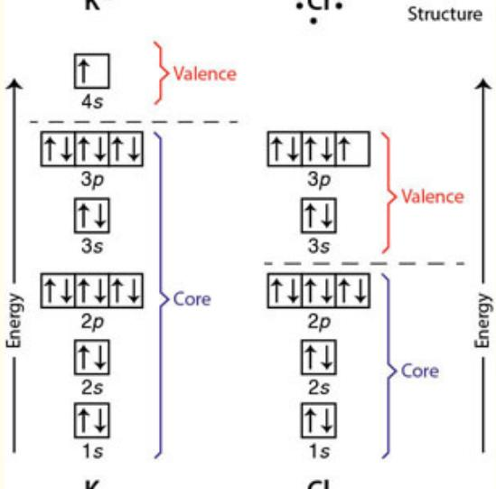</td></tr><tr><td>5. Lewis Structures for Covalent BondsTo determine the Lewis structure for bonds involving two elements we first count the total number of valence electrons. For example for O and H we count valence electrons as shown at right. Next we write the Lewis dot structure for OH as shown at right. While H has the requisite two electrons to form a duet, oxygen is left with seven electrons in its outer shell. Lewis theory deems this structure unacceptable because it violates the octet rule—the outer electron shell of oxygen has seven not eight electrons. If we were to add another hydrogen atom, the octet rule for oxygen would be satisfied. Lewis theory predicts that the lowest potential energy (most stable) structure involving hydrogen atoms bonded to oxygen is  $H_{2}O$ , which indeed it is.</td><td>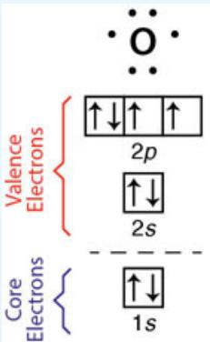</td></tr><tr><td>6. Lewis Structures and Resonance StructuresWhen the Lewis structure is worked out for ozone, the octet rule results in two different structures for  $O_{3}$ , one with a double bond on one side of the central oxygen and a single bond in the other. As shown at right, this would mean that two different structures exist for ozone. Experimental evidence, however, demonstrates that the two bonds in  $O_{3}$  are in all ways equivalent. This dilemma is reconciled by forming a hybrid structure wherein an electron pair is delocalized across the  $O_{3}$  structure as shown at right.</td><td></td></tr></table>

## 7. Method of Formal Charge

There are cases for polyatomic molecules where there are multiple Lewis structures, all of which obey the octet rule. An example is that for NOCl as shown at right.

In the case, the question becomes how to determine the structure of lowest energy. This is resolved by the method of formal charge where

Formal charge = Number of valence electrons - (Number of lone pair electrons + ½ number of bonding electrons) To determine the molecular structure of lowest potential energy, we apply the following rules after determining the formal charge for each atom:

1. The sum of the formal charges in a Lewis structure must equal zero for a neutral molecule and must equal the net charge on a cation or anion.

2. A smaller formal charge on an individual atom is favored over larger formal charges. Molecular structures

<table><tr><td>Steps in the Procedure</td><td>Lewis Structure for  ${\mathrm{H}}_{2}\mathrm{O}$ </td><td>Lewis Structure for  ${\mathrm{{CO}}}_{2}$ </td><td>Lewis Structure for Ozone</td></tr><tr><td>1 Correct skeletal struc-ture for the molecule.</td><td>Hydrogen atoms are terminal atoms. Thus O is the central atom H O H</td><td>Oxygen is more electrone-gative than carbon; carbon is the central atom O C O</td><td>All atoms are the same O O O</td></tr><tr><td>2 Determine total number of electrons for the Lewis structure by adding the valence electrons contributed by each atom. See Fig- ures 11.17 and 11.18.</td><td>Each hydrogen con- tributes one electron: 2 electrons from hydro- gen, oxygen is Group 6 so the total is  $6 + 2 = 8$  electrons</td><td>Carbon has 4 valence electrons, oxygen 6. Total number of electrons:  $6 + 6 + 4 = {16}$  electrons</td><td>Total number of electrons: 6 elec- trons from each oxygen atom  $3 \times  6$  = 18 electrons</td></tr><tr><td>3 Distribute electrons beginning with bond- ing electrons, then assigning lone pairs to terminal atoms, then to lone pairs on the central atom. Check to see whether each atom has an octet (duet for hydrogen atoms.)</td><td>Bonding electrons first H : O : H 4 electrons left Lone pairs on terminal atoms next H : O : H None needed Lone pairs on central atom next  Zero electrons left</td><td>Bonding electrons first O : C : O 12 electrons left lone pairs on terminal atoms next : : : : : : : : : : : : : : : : : : : : : : : : : : : : : : : : : : : : : : : : : : : : : : : : : : : : : : : : : : : : : : : : : : : : : : : : : : : : : : : : : : : : : : : : : : : : : : : : : : : :</td><td>Bonding electrons first O : O : O 4 electrons used, 14 remain Lone pairs on terminal atoms next : : : : : : : : : : : : : : : : : : : : : : : : : : : : : : : : : : : : : : : : : : : : : : : : : : : : : : : : : : : : : : : : : : : : : : : : : : : : : : : : : : : : : : : : : : : : : : 16 electrons used, two remain : : : : : : : : : : : : : : : : : : : : : : : : : : : : : : : : : : : : : : : : : : : : : : : : : : : : : : : : : : : : : : : : : : : : : : : : : : : : : : : : : : : : : : : : : : : : : : : : : : : 16 electrons used.</td></tr><tr><td>4 If an atom lacks an octet, form double or triple bonds as necessary to give them octets.</td><td>All atoms have an octet or duet. No electrons left Lewis Diagram complete</td><td>Carbon lacks an octet, so move terminal lone pairs to central atom to form double bonds Octet Octet Octet Octet Octet Octet Octet Octet Octet Octet Octet Octet Octet Octet Octet Octet Octet Octet Octet Octet Octet Octet Octet Octet Octet Octet Octet Octet Octet Octet Octet Octet Octet Octet Octet Octet Octet Octet Octet Octet Octet Octet Octet Octet Octet Octet Octet Octet Octet Octet Octe: C = O Correct Lewis Structure</td><td>Central atom does not have an oc- tet, create double (or triple) bonds on central atom Octet Octet Octet Octet Octet Octet Octet Octet Octet Octet Octet Octet Octet Octet Octet Octet Octet Octet Octet Octet Octet Octet Octet Octet Octet Octet Octet Octet Octet Octet Octet Octet Octet Octet Octet Octet Octet Octet Octet Octet Octet Octet Octet Octet Octet Octet Octet Octet Octet Octer: C = O Correct Lewis Structure This would imply that two different structures exist for ozone and:  $\because \mathrm{O} = \mathrm{O} - \mathrm{O}$ </td></tr></table>

:::{figure} ../images/fig-p1-ch10-95.jpg
:name: fig-p1-ch10-95
:alt: Figure from the University Chemistry source textbook
:::

Structure A,
Structure B
:::{figure} ../images/fig-p1-ch10-96.jpg
:name: fig-p1-ch10-96
:alt: Figure from the University Chemistry source textbook
:::

:::{figure} ../images/fig-p1-ch10-97.jpg
:name: fig-p1-ch10-97
:alt: Figure from the University Chemistry source textbook
:::

Structure B{2

Structure A2
:::{figure} ../images/fig-p1-ch10-98.jpg
:name: fig-p1-ch10-98
:alt: Figure from the University Chemistry source textbook
:::

:::{figure} ../images/fig-p1-ch10-99.jpg
:name: fig-p1-ch10-99
:alt: Figure from the University Chemistry source textbook
:::

:::{table} TABLE 11.4S
:label: original-table-11-4s
:enumerated: false
<table><tr><td rowspan="5">with the smallest formal charge represent the structures of lowest potential energy and are thus the most stable.3. Negative formal charges should appear on the most electronegative atoms.4. Structures having formal charges of the same sign on adjoining atoms are not favored.</td><td rowspan="5"><a href="#original-table-11-4s">TABLE 11.4S</a>tructure A1O = Cl - N : [IMAGE]Number of valence e-675- number of lone pair e-426- 1⁄2 (number of bonding e-)231Formal charge0+2-2-1+2-1</td><td colspan="3">Structure A2O = Cl = N : [IMAGE]</td></tr><tr><td>6</td><td>7</td><td>5</td></tr><tr><td>4</td><td>2</td><td>6</td></tr><tr><td>2</td><td>3</td><td>1</td></tr><tr><td>0</td><td>+2</td><td>-2</td></tr><tr><td rowspan="5"></td><td rowspan="5">Structure B1O = N - Cl : [IMAGE]Number of valence e-657- number of lone pair e-426- 1⁄2 (number of bonding e-)231Formal charge000-10+1</td><td>6</td><td>5</td><td>7</td></tr><tr><td>6</td><td>5</td><td>7</td></tr><tr><td>4</td><td>2</td><td>6</td></tr><tr><td>2</td><td>3</td><td>1</td></tr><tr><td>0</td><td>0</td><td>0</td></tr><tr><td>8. Limitations to the Lewis TheoryWhile the Lewis theory is a remarkably effective approach for identifying the molecular structure of lowest potential energy (i.e. the most stable structure) there are important cases that are exceptions to the Lewis octet (duet) rule.1. Free radical structures that are characterized by an unpaired electron in the valence shell of the molecule. These radicals are physically stable but highly reactive chemically. Important examples include OH and NO.2. Expanded valence shells. There are some important examples where the octet rule is broken by having 10 or 12 electrons around a central atom. Examples include phosphoric acid, shown at right.</td><td colspan="4">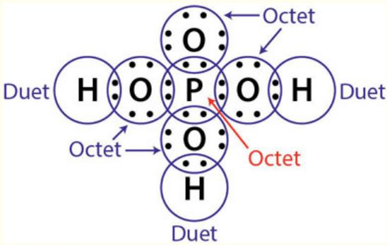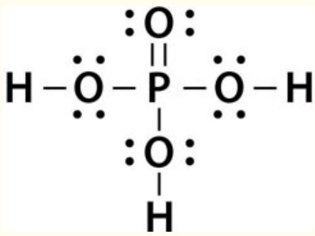</td></tr><tr><td>9. Valence Shell Electron Pair Repulsion: VSEPR TheoryChemical behavior, chemical reactivity and the physical behavior of molecules are very sensitive to molecular shape, molecular size and the charge distribution within the molecular structure. The VSEPR model is based on the simple concept thatelectron groups that surround an atom repel each other through Coulombic forces and that</td><td colspan="4">For example, if the number of electron groups is equal to 4, the electron group geometry is tetrahedral and themolecular geometryis determined by the number of lone pairs as shown.</td></tr><tr><td rowspan="4">repulsion of electron groups controls the geometry of the molecule. We define an “electron group” as a lone pair, a single bond, a double bond, a triple bond, or a single electron in the case of a radical.</td><td>Number of electron groups</td><td>Electron-group geometry</td><td>Number of lone pairs</td><td>Molecular geometry</td></tr><tr><td rowspan="3">4</td><td rowspan="3">Tetrahedral</td><td>0</td><td>Tetrahedral</td></tr><tr><td>1</td><td>Trigonal pyramidal</td></tr><tr><td>2</td><td>V-shaped or bent</td></tr></table>
:::

## BUILDING QUANTITATIVE REASONING

## CASE STUDY 10.1 Lewis Structures and Insight into Chemical Reactivity

Quantum mechanics in combination with today's high power computers can calculate, to a reasonable degree of accuracy, the bond lengths, bond angles and, most importantly, the distribution of electron charge in a molecular structure. So why do we spend time developing the Lewis dot formulation of chemical bonding? Of what use is the concept of “formal charge”? Why VSEPR theory? VSEPR theory is, after all, only an approximation. The answer is that electrons, small as they are, determine chemical behavior. An intuition about how chemical reactions take place is built upon a grasp of what instigates electrons to shift in any chemical transformation leading from reactants to products. Thus, in the process of bridging from the revolutionary developments of quantum mechanics for multielectron atomic systems to the quantum mechanics of molecular bonding, we pause to examine the nature of the chemical bond from the perspective of the electrons and the implications the assignment of electrons between bond and lone pairs has on the deduced shape of the resulting molecule. As we will see in Chapter 11, the shape of a molecule is important for strategic decisions regarding how quantum mechanics is best implemented to optimize the accuracy in the calculated properties of complex molecules.

So while we will revisit many of the chemical reaction types discussed here in subsequent chapters, we begin by viewing the world of chemical reactions through the eyes of the Lewis structure for chemical bonds.

## A Chemical Reaction from the Perspective of the Lewis Structure

We consider first the reaction between sodium and chlorine to form NaCl

```{math}
:label: eq-p1-ch10-33
\mathrm{Na(g)} + \mathrm {Cl_ {2} (g)} \rightarrow \mathrm{NaCl(g)} + \mathrm{Cl(g)}
```


In terms of the Lewis structures, we write the reaction as

```{math}
:label: eq-p1-ch10-34
\mathrm{Na} ^ {\cdot} +: \ddot {\mathrm{Cl}} - \ddot {\mathrm{Cl}}: \longrightarrow \mathrm{Na} ^ {+} [: \ddot {\mathrm{Cl}}: ] ^ {-} +: \ddot {\mathrm{Cl}}:
```


If we compare this reaction between gas phase sodium atoms and $\mathrm { C l } _ { 2 }$ with that of the reaction between two atoms, one of sodium the other of atomic chlorine,

```{math}
:label: eq-p1-ch10-35
\mathrm{Na} ^ {\cdot} + \cdot \stackrel {{\cdot}} {{\cdot}} \mathrm{Cl}: \longrightarrow \mathrm{Na} ^ {+} + \left[: \stackrel {{\cdot}} {{\cdot}} \mathrm{Cl}: \right] ^ {-}
```


it is more difficult to see how the products

```{math}
:label: eq-p1-ch10-36
\mathrm{Na} ^ {+} \left[: \ddot {\mathrm{Cl}}: \right] ^ {-} \quad \text { and } \quad : \ddot {\mathrm{Cl}}:
```


would be formed in the molecular reaction because the chlorine atoms in

```{math}
:label: eq-p1-ch10-37
: \ddot {\mathrm{ci}}: \ddot {\mathrm{ci}}:
```


are bonded such that each chlorine has an octet of electrons. It fully satisfies the Lewis octet rule.

However, Lewis structures are all about how we can determine the resulting molecular structure with the lowest potential energy—we always seek ways to figure out the structure with the lowest potential energy without having to use a large computer to solve the multielectron Schrödinger equation.

So how does this work using the Lewis structure approach? A key insight is to recognize that the drive of Cl atoms is to minimize their energy by achieving a noble gas electron configuration—that is what dictates the octet rule in Lewis structures. But a chlorine anion,

```{math}
:label: eq-p1-ch10-38
\left[: \ddot {\mathrm{Cl}}: \right] ^ {-}
```


is a more complete octet than each of the Cl atoms in a

```{math}
:label: eq-p1-ch10-39
: \ddot {\mathrm{ci}}: \ddot {\mathrm{ci}}:
```


molecule wherein they must share an electron in order to complete the octet. So in order to lower the potential energy of the ensemble of atoms, one Cl atom relinquishes one of the shared electrons to the other Cl atom in exchange for the complete electron transfer shown in [Figure CS10.1A](#fig-p1-ch10-102).

:::{figure} ../images/fig-p1-ch10-102.jpg
:name: fig-p1-ch10-102
:alt: FIGURE CS10.1A The donation of an electron from sodium results in the rupture of the mathematical notation bond with one of the shared electrons in the mathematical notation bond going to Cl and the resulting mathematical notation ionic bon
FIGURE CS10.1A The donation of an electron from sodium results in the rupture of the $\mathsf { C l } _ { 2 }$ bond with one of the shared electrons in the $\mathsf { C l } _ { 2 }$ bond going to Cl and the resulting $N a ^ { + } C F$ ionic bond retaining the electron from ${ \mathsf { N a } } ^ { + }$ . The reaction proceeds because the energy of the ensemble NaCl and Cl is lower than the energy of Na and $\mathsf { C l } _ { 2 }$
:::


This is an example of the general rule that the acceptor molecule in an electron transfer reaction suffers a bond rupture if that molecule began as a species satisfying the Lewis (noble gas) octet rule.

Before we work through a number of important categories of reactions that Lewis structures help elucidate, we highlight a number of general rules that emerge from the Lewis formalism:

1. Most Group 1 and Group 2 metals give away electrons in redox reactions with water. The reason is that the polar structure of water draws the weakly bound electron(s) from those metals, releasing significant energy in the formation of products.

2. Metals and nonmetals form ionic bonds with each other because of the much larger electron affinity of the nonmetals.

3. Nonmetals share electrons with each other because of the roughly equal electron affinity among nonmetals.

4. Metals react with water to yield basic solutions and $\mathrm { H } _ { 2 }$ in the gas phase.

5. Nonmetals react with water to give acidic solutions and finally, from our example above.

6. If a metal reacts with an acceptor molecule that itself satisfies the Lewis octet rule, that molecule will suffer a bond rupture.

Let's see how the Lewis structures provide insight across an array of chemical reaction categories.

## Lewis Picture for Acid-Base Reactions

The Lewis formulation extends this picture of acid-base chemistry by generalizing acid-base behavior as a class of electron transfer reactions. In particular the Lewis acid-base formulation stipulates that the important factor in an acid-base reaction is the attainment of a new shared pair of electrons in a new polar covalent bond as displayed in [Figure CS10.1B](#fig-p1-ch10-103).

:::{figure} ../images/fig-p1-ch10-103.jpg
:name: fig-p1-ch10-103
:alt: Figure from the University Chemistry source textbook
:::

Thus for Lewis,

A base is any species that donates an electron pair.

An acid is any species that accepts an electron pair and the creation results in the formation of a new species, the adduct.

The species A and can be neutral or charged.

For example, consider the neutralization reaction between a proton and the hydroxide ion in the formation of the adduct $_ \mathrm { H _ { 2 } O }$ as shown in [Figure CS10.1C](#fig-p1-ch10-104).

:::{figure} ../images/fig-p1-ch10-104.jpg
:name: fig-p1-ch10-104
:alt: FIGURE CS10.1C In the reaction between mathematical notation and OH- the base, OH- donates an electron pair to mathematical notation forming the new electron pair bond between H and O in the adduct, water.
FIGURE CS10.1C In the reaction between $\mathsf { H } ^ { + }$ and OH<sup>-</sup> the base, OH<sup>-</sup> donates an electron pair to $\mathsf { H } ^ { + }$ forming the new electron pair bond between H and O in the adduct, water.
:::


In this case $\mathrm { H ^ { + } }$ is just a particular example of an electron pair acceptor.

Lewis expressed strongly (as he often did) his objection to hanging the definition of acid-base reactions on the presence of the proton as the defining feature of an acid: $^ { 6 6 } T 0$ restrict the group of acids to those substances which contain hydrogen interferes as seriously with the systematic understanding of chemistry as would the restriction of the term oxidizing agent to those substances containing oxygen.”

A key attribute of the Lewis picture of acid-base reactions is that it vastly expands the class of acids. One such example is the reaction of quicklime (CaO) with $\mathrm { S O } _ { 2 }$ (shown in [Figure CS10.1D)](#fig-p1-ch10-105) wherein the latter is emitted in the combustion of coal:

:::{figure} ../images/fig-p1-ch10-105.jpg
:name: fig-p1-ch10-105
:alt: FIGURE CS10.1D Quickline, a base, reacts with sulfur dioxide by donating a lone pair on its oxygen to mathematical notation forming the mathematical notation adduct.
FIGURE CS10.1D Quickline, a base, reacts with sulfur dioxide by donating a lone pair on its oxygen to ${ \mathsf { S O } } _ { 2 }$ forming the $\mathsf { C a S O } _ { 3 }$ adduct.
:::


In this case no hydrogen ion is involved, but the base is CaO, which donates an electron pair to the acid, $\mathrm { { S O } _ { 2 } , }$ forming $\mathrm { C a S O _ { 3 } }$ as the adduct.

When quicklime is added to water, it reacts to form calcium hydroxide, a base as displayed in [Figure CS10.1E](#fig-p1-ch10-106).

:::{figure} ../images/fig-p1-ch10-106.jpg
:name: fig-p1-ch10-106
:alt: FIGURE CS10.1E Quickline reacts with water by extracting a lone pair forming Ca(OH)2.
FIGURE CS10.1E Quickline reacts with water by extracting a lone pair forming Ca(OH)<sub>2</sub>.
:::


Another example is the case of $\mathrm { { S O } _ { 2 } , }$ when added to water, that produces weak acid $\mathrm { H } _ { 2 } \mathrm { S O } _ { 3 }$ shown in [Figure CS10.1F](#fig-p1-ch10-107):

:::{figure} ../images/fig-p1-ch10-107.jpg
:name: fig-p1-ch10-107
:alt: FIGURE CS10.1F Water reacts with mathematical notation by donating a lone pair of electrons to form mathematical notation that dissociates leaving mathematical notation in solution.
FIGURE CS10.1F Water reacts with ${ \mathsf { S O } } _ { 2 }$ by donating a lone pair of electrons to form ${ \mathsf { H O S O } } ^ { - } _ { 2 } { - } { \mathsf { H } } ^ { + }$ that dissociates leaving $\mathsf { H } ^ { + }$ in solution.
:::


## Reactions of Metal and Nonmetals with ${ \sf H } _ { 2 } { \sf O }$

Just as we stressed in Case Study 2.2, the chemistry of water and of oxygen lies at the heart of a large fraction of chemistry—both in natural systems and in laboratory systems. We note again in [Figure CS10.1G](#fig-p1-ch10-108) the structure of water displaying oxygen and hydrogen with bent geometry, featuring a strongly electronegative end and a strongly electropositive end that has, as we will see, major consequences:

:::{figure} ../images/fig-p1-ch10-108.jpg
:name: fig-p1-ch10-108
:alt: FIGURE CS10.1G The structure of water is established by the geometry of the electron groups first. The electron lone pairs constitute two axes of the tetrahedral structure with the two H-O bonds forming the other two axes.
FIGURE CS10.1G The structure of water is established by the geometry of the electron groups first. The electron lone pairs constitute two axes of the tetrahedral structure with the two H-O bonds forming the other two axes.
:::


The separation of charge results from the electronegativity difference between $\mathrm { ~ O ~ } ( \chi = 3 . 5 )$ and H $( \chi = 2 . 2 )$ . It is this dual capability to attract cations to the electronegative end of $\mathrm { H } _ { 2 } \mathrm { O }$ and attract anions to the electropositive end of $\mathrm { H } _ { 2 } \mathrm { O }$ that underpins the versatility of water as a solvent. When salts (which invariably contain a metal donor and nonmetal acceptor) are placed in water, cations and anions result. A key part of the chemical vocabulary is the naming of these cations and anions. We can make a short list of the anions that repeatedly appear, and are summarized in [Table CS10.1A](#original-table-cs10-1a). Given the importance of vocabulary to any discussion or any thought process, it may be wise to simply conquer this list once and for all with a set of flashcards!

(original-table-cs10-1a)=
TABLE CS10.1A Commonly encountered anions.

<table><tr><td>Formula</td><td>Name</td><td>Protonated Form(s)</td><td>Names(s)</td></tr><tr><td> $H^{-}$ </td><td>Hydride</td><td> $H_{2}$ </td><td>Hydrogen(g)</td></tr><tr><td> $F^{-}$ </td><td>Fluoride</td><td>HF</td><td>Hydrogen fluoride (g); hydrofluoric acid (aq)</td></tr><tr><td> $Cl^{-}$ </td><td>Chloride</td><td>HCl</td><td>Hydrogen chloride (g); hydrochloric acid (aq)</td></tr><tr><td> $O^{2-}$ </td><td>Oxide</td><td> $OH^{-}$ </td><td>Hydroxide</td></tr><tr><td> $S^{2-}$ </td><td>Sulfide</td><td> $HS^{-}$ </td><td>Hydrogen sulfide (bisulfide)</td></tr><tr><td> $N^{3-}$ </td><td>Nitride</td><td> $NH_{2}^{-}$ </td><td>Amide</td></tr><tr><td> $OH^{-}$ </td><td>Hydroxide</td><td> $H_{2}O$ </td><td>Water</td></tr><tr><td> $CO^{2-}_{3}$ </td><td>Carbonate</td><td> $HCO_{3}^{-}$ </td><td>Hydrogen carbonate (bicarbonate)</td></tr><tr><td></td><td></td><td> $H_{2}CO_{3}$ </td><td>Carbonic acid [also  $CO_{2}(aq)$ ]</td></tr><tr><td> $C_{2}H_{3}O_{2}^{-}$ </td><td>Acetate</td><td> $HC_{2}HO_{2}$ </td><td>Acetic acid</td></tr><tr><td> $SiO^{2-}_{3}$ </td><td>Silicate</td><td> $H_{4}SiO_{4}$ </td><td>Silicic acid ( $H_{2}SiO_{3}H_{2}O$ )</td></tr><tr><td> $NO_{3}^{-}$ </td><td>Nitrate</td><td> $HNO_{3}$ </td><td>Nitric Acid</td></tr><tr><td> $PO^{3-}_{4}$ </td><td>Phosphate</td><td> $HPO_{4}^{2-}$ </td><td>Monohydrogen phosphate</td></tr><tr><td> $O_{2}^{2-}$ </td><td>Peroxide</td><td> $H_{2}O_{2}$ </td><td>Hydrogen Peroxide</td></tr><tr><td> $SO_{4}^{2-}$ </td><td>Sulfate</td><td> $HSO_{4}$ </td><td>Hydrogen sulfate (bisulfate)</td></tr><tr><td> $SO_{3}^{2-}$ </td><td>Sulfite</td><td> $HSO_{3}^{-}$ </td><td>Hydrogen sulfite (bisulfite)</td></tr><tr><td></td><td></td><td> $H_{2}SO_{3}$ </td><td>Sulfurous acid [also  $SO_{2}(aq)$ ]</td></tr><tr><td> $ClO_{4}^{-}$ </td><td>Perchlorate</td><td> $HClO_{4}$ </td><td>Perchloric acid</td></tr></table>

A key part of understanding chemical reactions, as distinct from chemical structure, is to develop an intuition concerning how electrons move in a chemical reaction. Thus, in what follows, we will use a sequence of arrows to indicate the movement of electrons between the Lewis structures of reactants that result in the formation of the new covalent bonding structure of the adduct.

In the reaction of sodium metal with water,

```{math}
:label: eq-p1-ch10-40
\mathrm {2Na(s) + 2H_ {2} O(l)\rightarrow 2NaOH(aq)+ H_ {2} (g)}
```


we break the reaction down to a sequence of electron donater-acceptor steps displayed in [Figure 10.1H](#fig-p1-ch10-109).

:::{figure} ../images/fig-p1-ch10-109.jpg
:name: fig-p1-ch10-109
:alt: FIGURE CS10.1H Sodium reacts rapidly and violently with water when the electron poor end of water extracts the valence electron from sodium and the hydrogen donates an electron pair to the OH in water to form H and OH-. Energy is released b
FIGURE CS10.1H Sodium reacts rapidly and violently with water when the electron poor end of water extracts the valence electron from sodium and the hydrogen donates an electron pair to the OH in water to form H and OH<sup>-</sup>. Energy is released because the energy of $\mathsf { N a } ^ { + }$ and H and OH<sup>-</sup> is lower than that of Na and ${ \sf H } _ { 2 } \mathrm { O }$
:::


The H atom produced, $\mathsf { H } ^ { \bullet }$ , reacts with another $\mathsf { H } ^ { \bullet }$ to produce gas phase $\mathrm { H } _ { 2 } ,$ which burns in air to create an explosion. Thus reaction is a flagship example of general rules 1, 4, and 6 above, because while $\mathrm { H } _ { 2 } \mathrm { O }$ satisfies the Lewis octet rule, it undergoes bond breakage in accepting the electron from sodium.

The prototype reaction above between sodium, an alkali metal, and water is exactly what happens between any of the alkali atoms (Na, Li, K, Rb, or Cs) and water. This chemical similarity results from (1) their common ns electron configuration and (2) their low electron affinity that makes them excellent electron donors.

Group 2A metals, the alkaline earths, are characterized by their $\mathrm { n } \mathrm { \mathsf { S } } ^ { 2 }$ valence configurations and their somewhat higher electron affinities.

Thus the Period 1 member, calcium, is the electron donor in the reaction

```{math}
:label: eq-p1-ch10-41
\mathrm{Ca(s)} + 2 \mathrm {H_ {2} O(l)} \rightarrow \mathrm {Ca(OH) _ {2} (aq)} + \mathrm {H_ {2}}
```


which, when we track the movement of electrons in a Lewis diagram, yields a two step process initiated by the reaction shown in [Figure CS10.1I](#fig-p1-ch10-110) where the electron moves from Ca to $\mathrm { H } _ { 2 } \mathrm { O }$ with the electron pair going to form OH<sup>-</sup>.

:::{figure} ../images/fig-p1-ch10-110.jpg
:name: fig-p1-ch10-110
:alt: FIGURE CS10.1I Calcium reacts with water with the same mechanism as that for sodium. In the second step of the reaction, the mathematical notation reacts again with water.
FIGURE CS10.1I Calcium reacts with water with the same mechanism as that for sodium. In the second step of the reaction, the ${ \mathsf { C a } } ^ { + }$ reacts again with water.
:::


The reaction of alkaline earths in Group 2A with water, in contrast with the alkali atoms, is not true for every element in the Group. Only the heavier atoms, Ca through Ra, react spontaneously with water. Be does not react at all with water, and Mg only slowly. A key understanding as to why this is true resides in the ionization energy of the metal and tracks back to our discussion of shielding and penetration in multielectron systems. Recalling that the ionization energy is a measure of the ease of electron removal, both Be and Mg have a higher IE than Ca through Ra.

What about the reaction of water with nonmetals? Let's examine a reaction that is of central importance to the energy-climate link, the reaction of water with carbon dioxide to form carbonic acid:

```{math}
:label: eq-p1-ch10-42
\mathrm{H} _ {2} \mathrm{O} + \mathrm{CO} _ {2} \rightleftharpoons \mathrm{H} _ {2} \mathrm{CO} _ {3}
```


When we diagram the electron shift(s) associated with this reaction in a Lewis formulation, we require two steps. The first step is an electron donation from the lone pair of water (the base) to the carbon of $\mathrm { C O } _ { 2 }$ as shown in [Figure CS10.1J](#fig-p1-ch10-111).

:::{figure} ../images/fig-p1-ch10-111.jpg
:name: fig-p1-ch10-111
:alt: FIGURE CS10.1J Water and carbon dioxide react to form the adduct carbonic acid. This is a very important reaction in seawater, drawing mathematical notation from the atmosphere and making carbonate available for inclusion into biological st
FIGURE CS10.1J Water and carbon dioxide react to form the adduct carbonic acid. This is a very important reaction in seawater, drawing $\mathsf { C O } _ { 2 }$ from the atmosphere and making carbonate available for inclusion into biological structures in the ocean.
:::


Following the donation from the lone pair of water, the next steps are by the transfer of an electron pair to oxygen in $\mathrm { C O } _ { 2 }$ and the donation of an electron pair from the oxygen in $\mathrm { C O } _ { 2 }$ to form a new hydrogen-oxygen bond as diagramed in [Figure CS10.1J](#fig-p1-ch10-111).

It is this remarkable inorganic reaction between a non-metal and water that makes carbon available to the organic/biological process in the world's oceans that creates the skeletal structures for all living things in the ocean. It is also the removal process that extracts massive amounts of $\mathrm { C O } _ { 2 }$ from the atmosphere as we add $\mathrm { C O } _ { 2 }$ to the atmosphere by the combustion of fossil fuels.

So, keeping track of reactivity to this point we note that alkali metals and the heavier alkaline earths react with water as summarized in [Figure CS10.1K](#fig-p1-ch10-112).

:::{figure} ../images/fig-p1-ch10-112.jpg
:name: fig-p1-ch10-112
:alt: FIGURE CS10.1K All alkali metals react with water as described in Figure CS10.1H. The heavier alkaline earth metals from calcium to radium react with water as described in Figure CS10.1l.
FIGURE CS10.1K All alkali metals react with water as described in [Figure CS10.1H](#fig-p1-ch10-109). The heavier alkaline earth metals from calcium to radium react with water as described in [Figure CS10.1L](#fig-p1-ch10-113).
:::


Heavier alkaline earth metals react directly with water to form ${ { \bf { M } } ^ { + } }$ cations, $\mathrm { H } _ { 2 }$ in the gas phase and OH<sup>-</sup> in the aqueous phase. Alkali metals react directly with water in a Lewis acid-base reaction forming an ${ { \bf { M } } ^ { + } }$ metal cation and $\mathrm { H } _ { 2 } ,$ leaving OH<sup>-</sup> in aqueous solution, thus forming a base.

## Reaction of Metals with Acids

As we witnessed with Be and Mg, when the IE of a metal reaches approximately 600 kJ/mol, that element no longer reacts directly with water. Thus the clear demarcation between magnesium and calcium in the reactivity of alkaline earths with water. The first ionization energies of key elements in the periodic table are displayed in [Figure CS10.1L](#fig-p1-ch10-113).

:::{figure} ../images/fig-p1-ch10-113.jpg
:name: fig-p1-ch10-113
:alt: FIGURE CS10.1L The trends in first ionization energy across the periodic table.
FIGURE CS10.1L The trends in first ionization energy across the periodic table.
:::


However, metals in Group 3A and $4 \mathrm { A }$ along with beryllium and magnesium react with protons, $\mathrm { H ^ { + } }$ in solution, i.e. react with acidic solutions. For example, magnesium reacts to produce the cation of the metal and $\mathrm { H } _ { 2 }$ in the gas phase:

```{math}
:label: eq-p1-ch10-43
\mathrm{Mg(s)} + 2 \mathrm {H^ {+} (aq)} \rightarrow \mathrm {Mg^ {2 + } (aq)} + \mathrm {H_ {2} (g)}
```


The reason these metals with higher ionization energies react with an acidic solution is that the proton, $\mathrm { H } ^ { + } ( \mathrm { a q } )$ has a $f a r$ greater ability to extract electrons than does neutral water. This opens up a large segment of the periodic table to acidic reaction with metals in Groups 2A, 3A, and $4 \mathrm { A }$ as shown in [Figure CS10.1M](#fig-p1-ch10-114).

:::{figure} ../images/fig-p1-ch10-114.jpg
:name: fig-p1-ch10-114
:alt: FIGURE CS10.1M A major fraction of all elements in the periodic table—all the metals and some metalloids—react with H+ in an acidic solution.
FIGURE CS10.1M A major fraction of all elements in the periodic table—all the metals and some metalloids—react with H<sup>+</sup> in an acidic solution.
:::


It is important to recall where the proton in the acidic solution came from. When an acid is placed in water, it dissociates

```{math}
:label: eq-p1-ch10-44
\mathrm{HCl} \xrightarrow {\mathrm{H} _ {2} \mathrm{O}} \mathrm{H} ^ {+} + \mathrm{Cl} ^ {-}
```


Thus we can write the complete reaction as

```{math}
:label: eq-p1-ch10-45
\mathrm{Mg(s)} + 2 \mathrm {H^ {+} (aq)} + 2 \mathrm {Cl^ {-} (aq)} \rightarrow \mathrm {Mg^ {2 + } (aq)} + 2 \mathrm {Cl^ {-} (aq)} + \mathrm {H_ {2} (g)}
```


It is important to write out this full equation to keep track of all species, including the spectator ions, Cl<sup>-</sup>(aq), that do not enter directly in the chemical transformation, but are for keeping track of what has actually occurred in the solution.

The key point here is that by adding $\mathrm { H ^ { + } }$ to an aqueous solution through the addition of an acid, the reactivity of that solution then encompasses a very large segment of the periodic table because $\mathrm { H ^ { + } }$ can extract electrons from all those metals.

## Water Reactions with Nonmetallic Elements

As we have seen, what instigates the reaction between water and the alkaline metals and the heavier alkaline earths is water's ability to extract electrons from those elements because of their very low ionization energy. If we spike that aqueous solution with protons by adding an acid, the greatly enhanced ability to extract electrons extends reactivity of an aqueous solution to encompass virtually all metals in the periodic table.

This encompasses a very large fraction of all elements in the periodic table.

But what about the reaction of water with nonmetals? The first point to note is that water is a nonmetal. Water has the ability to react with a nonmetal only if it can extract electrons from the nonmetal or if the nonmetal can extract electrons from water. The result is that water does not react with nonmetals except for the case of fluorine gas. Chlorine gas reacts very weakly when bubbled through water to form HCl and hypochlorous acid, HClO:

```{math}
:label: eq-p1-ch10-46
\mathrm {H_ {2} O(l) + Cl_ {2} (g)\rightarrow HClO(aq) + HCl(aq)}
```


The reaction products are acidic, and we can track the electron movement in the Lewis structure formulation as displayed in [Figure CS10.1N](#fig-p1-ch10-115).

:::{figure} ../images/fig-p1-ch10-115.jpg
:name: fig-p1-ch10-115
:alt: FIGURE CS10.1N Electron movement within the Lewis formulation for the reaction of mathematical notation with water.
FIGURE CS10.1N Electron movement within the Lewis formulation for the reaction of $\mathsf { C l } _ { 2 }$ with water.
:::


Thus, except for the extremely electronegative elements fluorine and chlorine, water, a nonmetal, does not react with other nonmetals. But recall that the reaction between water and metals was dramatically enhanced by the addition of $\mathrm { H } ^ { + }$ —the reason is that the reactions of water with metals depends upon the more electronegative species (the oxygen end of water) extracting electrons from the metal. But when water reacts with another nonmetal, we only have a reaction if water donates an electron to a more electronegative species (fluorine or chlorine).

This raises the question: What happens if we spike our aqueous solution, not with an electron extractor $\left( \mathrm { H } ^ { + } \right)$ , but with an electron donor? Will that strategy induce reactions between nonmetals and water?

Since $\mathrm { F } _ { 2 }$ reacts with water, and $\mathrm { C l } _ { 2 }$ reacts very weakly with water, but neither $\mathbf { B r } _ { 2 }$ nor $\mathrm { I } _ { 2 }$ react with water, if we add a base (an electron donor) to water will a reaction occur? The answer is, yes indeed. Molecular bromine and molecular iodine both react with water in the presence of a base:

```{math}
:label: eq-p1-ch10-47
\mathrm{Br} _ {2} (\mathrm{aq}) + 2 \mathrm{OH} ^ {-} \rightarrow \mathrm{BrO} ^ {-} + \mathrm{Br} ^ {-} + \mathrm{H} _ {2} \mathrm{O}
```


Interestingly this reaction is followed by the self-reaction of $\mathbf { B r O ^ { - } }$ anions in solution to form $\mathrm { B r ^ { - } }$ and $\mathrm { B r O } _ { 3 } { } ^ { - }$

```{math}
:label: eq-p1-ch10-48
3 \mathrm{BrO} ^ {-} \rightarrow 2 \mathrm{Br} ^ {-} + \mathrm{BrO} _ {3} ^ {-}
```


This self-reaction of a species is termed disproportionation.

The reaction of the halogen with water or OH<sup>-</sup> results from the highly electronegative halogen attacking the lone pair on water or the hydroxide anion as diagrammed in [Figure CS10.1O](#fig-p1-ch10-116).

:::{figure} ../images/fig-p1-ch10-116.jpg
:name: fig-p1-ch10-116
:alt: FIGURE CS10.1O The electron movement in the reaction of a halogen with water.
FIGURE CS10.1O The electron movement in the reaction of a halogen with water.
:::


This gives us some chemical perspective. When metals were involved, it was the positive domain of the electron deficient hydrogen in water that was the center of interest. It was the electron deficient hydrogen that attacked the metal, inducing the donation of the electron from the metal, releasing energy in the process of supplying electron density to the electron deficient hydrogen as diagrammed in [Figure CS10.1P](#fig-p1-ch10-117).

:::{figure} ../images/fig-p1-ch10-117.jpg
:name: fig-p1-ch10-117
:alt: FIGURE CS10.1P Electron movement in the reaction of metals with the electron deficient hydrogen.
FIGURE CS10.1P Electron movement in the reaction of metals with the electron deficient hydrogen.
:::


For metals with higher ionization potentials, the incomplete extraction of electron density from the hydrogen end of water (because the electronegativity of oxygen $\mathrm { ~ ( ~ \chi ~ \ = ~ \ 3 . 5 ) ~ }$ cannot fully overcome the electronegativity of hydrogen $( \mathbb { \chi } = \ 2 . 2 ) )$ limits the electron extraction capability of the electron deficient end of water. However, spiking the aqueous solution with an acidic solution provides protons that have a far greater ability to steal electrons, and thus essentially all metals are attacked by H<sup>+</sup> in that specie's quest for electrons.

In principle, the attack of halogens (nonmetals) on water is all about electron hungry (high electronegativity) species attempting to steal electrons, and in so doing, instigating a chemical reaction with its requisite release of energy. So it is the lone pair electrons on water that provide the site of attack, for they are the most vulnerable source of electron density in the structure of the water molecule. Thus, since electrons are the prize that the highly electronegative halogens (nonmetals) seek, if a base is added, providing the electron rich OH<sup>-</sup> to the solution, halogens less electronegative than fluorine or chlorine are presented with an easy target—the extra electron on OH<sup>-</sup>.

In the jargon of chemistry, species that extract electron density are called electrophilic, or “electron loving.” They might more aptly be called “electron stealing.” In contrast, metals, with their loosely bound electrons, seek domains that are electron poor, or “nucleus rich” and are thus termed nuclophilic or “nucleus loving.” In the end, however, these “philicities” are euphemisms for the theft of electrons—no more and no less.

We have, to this point, taken a very large part of the periodic table and investigated the reaction of those elements with water, and with water spiked with H<sup>+</sup> to enhance reactivity with metals (electron donors) and with OH<sup>-</sup> to enhance reactivity with a far smaller number, but important, nonmetals (electron extractors). But in this analysis, including tracking electron shifts with Lewis structures, we can see a pattern emerging wherein a vast array of chemical reactivity revolves around oxygen and hydrogen, albeit centered thus far on their remarkably versatile behavior within the structure of water with its hydrogen (electron deficient) end and its oxygen (electron rich) end with lone pair electrons as an additional dimension in the competitive market place of electron exchange.

It is a logical step, then, to extend this discussion in two related and important directions:

1. An analysis of oxides that occur along Periods in the periodic table and

2. Analysis of hydrides that occur along Periods in the periodic table.

## The Chemistry of Binary Oxides

We have swept the full extent of the periodic table with respect to its reactivity patterns with water and its counterparts with H<sup>+</sup> and OH<sup>-</sup> spiked into the aqueous solution. Given that a vast fraction of all reactions occur in water, this is a big step forward.

Underscoring the fact that an intuitive understanding of chemical reactions is all about patterns in chemical reactivity, we next pursue the patterns in chemical reactivity by cutting horizontally across the periodic table examining the oxygen containing binary (“containing two elements”) compounds, selecting the third Period as an example highlighted in [Figure CS10.1Q](#fig-p1-ch10-118).

:::{figure} ../images/fig-p1-ch10-118.jpg
:name: fig-p1-ch10-118
:alt: FIGURE CS10.1Q Highlighting Period 3 in the chemistry of binary oxides.
FIGURE CS10.1Q Highlighting Period 3 in the chemistry of binary oxides.
:::


From the third Period, we have the following binary compounds with oxygen:

```{math}
:label: eq-p1-ch10-49
\mathrm{Na} _ {2} \mathrm{O}, \mathrm{MgO}, \mathrm{Al} _ {2} \mathrm{O} _ {3}, \mathrm{SiO} _ {2}, \mathrm{P} _ {2} \mathrm{O} _ {5}, \mathrm{SO} _ {3}, \text {and} \mathrm{Cl} _ {2} \mathrm{O} _ {7}.
```


The nonmetal Period Three elements form other oxides; those listed here are the most fully oxidized. We first think about electrons and electronegativity. Oxygen is more electronegative than all elements in Period Three. If these oxygen containing binary compounds were ionic, each of the third Period elements would give up all their valence electrons to oxygen. The first two binary oxides are in fact ionic. $\mathrm { N a } _ { 2 } \mathrm { O }$ and MgO are ionic. But the remainder are polar covalent becoming less polar, as expected from the trend in electronegativity as we proceed to the right across Period Three. How do these binary oxides react with water? As we can guess by analogy with the reaction of sodium with water, $\mathrm { N a } _ { 2 } \mathrm { O }$ is an ionic compound

```{math}
:label: eq-p1-ch10-50
\mathrm {Na_ {2} O\rightarrow 2Na^ {+} + O^ {2 - }}
```


```{math}
:label: eq-p1-ch10-51
\mathrm{Na}: \stackrel {\bullet \bullet} {\ddot {\mathrm{O}}}: \mathrm{Na} \longrightarrow 2 \mathrm{Na} ^ {+} + \left[: \stackrel {\bullet \bullet} {\ddot {\mathrm{O}}}: \right] ^ {2 -}
```


and so we write the balanced chemical equation $\mathrm { N a _ { 2 } O + H _ { 2 } O  2 N a O H }$

The $\mathrm { N a ^ { + } }$ is a spectator cation in water, but the oxide anion is a strong base, donating an electron pair to water, a Lewis acid:

```{math}
:label: eq-p1-ch10-52
\left[: \ddot {\mathrm{O}}: \right] ^ {2 -} \xrightarrow [ \mathrm{e} ]{\mathrm{e}} \underset {\mathrm{H}} {\overset {\bullet} {\mathrm{O}}} \longrightarrow \left[: \ddot {\mathrm{O}}: \mathrm{H} \right] ^ {-} + \left[: \ddot {\mathrm{O}}: \mathrm{H} \right] ^ {-}
```


The sodium hydroxide is soluble in water forming a strong base. For $\bf { M g O }$ the reaction is similar:

```{math}
:label: eq-p1-ch10-53
\mathrm{MgO} + \mathrm {H_ {2} O} \rightarrow \mathrm{Mg(OH)} _ {2} (\mathrm{aq})
```


However, $\mathrm { M g ( O H ) _ { 2 } }$ is quite insoluble so the resulting solution is weakly basic. $\mathrm { M g ( O H ) _ { 2 } }$ is a commonly used stomach antacid—milk of magnesium.

But what a difference one step across Period Three makes! Aluminum forms the familiar binary oxide $\mathrm { { A l } } _ { 2 } \mathrm { { O } } _ { 3 }$ that is extremely insoluble in water and in acid. $\mathrm { { A l } } _ { 2 } \mathrm { { O } } _ { 3 }$ is remarkably durable, is used as an abrasive in sandpaper, as a cutting tool and in toothpaste. Large crystals can be doped with metal impurities to form gemstones such as ruby or sapphire. Aluminum is the most abundant element in the Earth's crust when measured by mass and more surprisingly, only oxygen and silicon are more abundant in the crust.

:::{figure} ../images/fig-p1-ch10-119.jpg
:name: fig-p1-ch10-119
:alt: Figure from the University Chemistry source textbook
:::

The second most abundant element in the Earth's crust is silicon that is the metalloid transition from metals to non-metals in the periodic table. Its binary oxide, $\mathrm { S i O } _ { 2 }$ is also extremely inert—in fact it is the glass that chemical beakers are made from and the primary substance in glass. The reason $\mathrm { { A l } } _ { 2 } \mathrm { { O } } _ { 3 }$ and $\mathrm { S i O } _ { 2 }$ are inert is that the increasing electronegativity of aluminum and of silicon draws the lone pairs on oxygen to more tightly hold them—fending off attack from any electrophilic intruder. The other possibility, attack by the oxygen end of water on the more electropositive Al or Si, is thwarted by the highly stable network of bonds in those oxides. For example, just as carbon forms -C-C- chains that dominate organic chemistry, Si forms -Si-O- chains and groupings that repeat in a wide variety of silicates, particularly in minerals in the Earth's crust. Three examples include the minerals zircon, hemimorphite, and beryl that are constructed as shown in [Figure CS10.1R](#fig-p1-ch10-120).

:::{figure} ../images/fig-p1-ch10-120.jpg
:name: fig-p1-ch10-120
:alt: FIGURE CS10.1R Silicon forms chained networks of -Si-O bonds that create a wealth of different geometries.
FIGURE CS10.1R Silicon forms chained networks of -Si-O bonds that create a wealth of different geometries.
:::


The next binary oxides in Period Three are the phosphorus containing oxides that react with water to form phosphoric acid

```{math}
:label: eq-p1-ch10-54
\mathrm{P} _ {4} \mathrm{O} _ {1 0} (\mathrm{s}) + 6 \mathrm{H} _ {2} \mathrm{O} (\mathrm{l}) \rightarrow 4 \mathrm{H} _ {3} \mathrm{PO} _ {4} (\mathrm{aq})
```


This tetraphosphorus decaoxide, $\mathrm { P } _ { 4 } \mathrm { O } _ { 1 0 } ,$ is formed by burning solid phosphorus, $\mathrm { P _ { 4 } ( s ) }$ , in excess oxygen

```{math}
:label: eq-p1-ch10-55
\mathrm{P} _ {4} (\mathrm{s}) + 5 \mathrm{O} _ {2} (\mathrm{g}) \rightarrow \mathrm{P} _ {4} \mathrm{O} _ {1 0} (\mathrm{s})
```


and has the structure shown in [Figure CS10.1S](#original-fig-cs10-1s).

:::{figure} ../images/fig-p1-ch10-121.jpg
:name: fig-p1-ch10-121
:alt: Figure from the University Chemistry source textbook
:::

Phosphorus skeleton

:::{figure} ../images/fig-p1-ch10-122.jpg
:name: fig-p1-ch10-122
:alt: Figure from the University Chemistry source textbook
:::

Phosphorus (V) oxide
(original-fig-cs10-1s)=
FIGURE CS10.1S Phosphorus forms bonding structures with oxygen that are important precursors for the inclusion of phosphorous into the structure of organisms.

Unlike the silicates, these binary oxygen compounds with phosphorus do not form bonded networks. So the reaction of $\mathrm { P _ { 4 } O _ { 1 0 } ( s ) }$ with water producing phosphoric acid has the following structure displayed in [Figure CS10.1T](#fig-p1-ch10-123):

:::{figure} ../images/fig-p1-ch10-123.jpg
:name: fig-p1-ch10-123
:alt: FIGURE CS10.1T Phosphoric acid is ubiquitous both in natural systems and is a key ingredient in Coke and Pepsi.
FIGURE CS10.1T Phosphoric acid is ubiquitous both in natural systems and is a key ingredient in Coke and Pepsi.
:::


This structure results from the simple protonation of the phosphate ion

:::{figure} ../images/fig-p1-ch10-124.jpg
:name: fig-p1-ch10-124
:alt: Figure from the University Chemistry source textbook
:::

Phosphorus, phosphoric acid, and phosphate have critically important roles in modern chemistry and chemical biology that we will explore in subsequent chapters. The point here is to look at patterns in chemical reactivity. When water attacks the electropositive P atom, it does so with its lone pair as diagrammed in [Figure CS10.1U](#fig-p1-ch10-125).

:::{figure} ../images/fig-p1-ch10-125.jpg
:name: fig-p1-ch10-125
:alt: FIGURE CS10.1U Mechanism for the reaction of phosphorus with water.
FIGURE CS10.1U Mechanism for the reaction of phosphorus with water.
:::


The next Period Three element, sulfur, shares a great deal in common with phosphorus. It reacts with water to produce sulfuric acid

```{math}
:label: eq-p1-ch10-56
\mathrm{SO} _ {3} + \mathrm{H} _ {2} \mathrm{O} \rightarrow \mathrm{H} _ {2} \mathrm{SO} _ {4} (\mathrm{aq})
```


Analyzed from the perspective of Lewis structures, ${ \mathrm { S O } } _ { 3 }$ is a resonance structure

:::{figure} ../images/fig-p1-ch10-126.jpg
:name: fig-p1-ch10-126
:alt: Figure from the University Chemistry source textbook
:::

In the reaction with water, it is the lone pair on the oxygen of water that goes after the vulnerable sulfur

:::{figure} ../images/fig-p1-ch10-127.jpg
:name: fig-p1-ch10-127
:alt: Figure from the University Chemistry source textbook
:::

Thus, rather than breaking the S-O bond, the double bond is converted to a single bond with the “acidic” hydrogen attached. Thus we have the clear groupings of Period Three elements with water as displayed in [Figure CS10.1V](#fig-p1-ch10-128).
:::{figure} ../images/fig-p1-ch10-128.jpg
:name: fig-p1-ch10-128
:alt: FIGURE CS10.1V Summary of the reactivity pattern for Period 3 elements with water.
FIGURE CS10.1V Summary of the reactivity pattern for Period 3 elements with water.
:::


The final binary oxide in Period Three is $\mathrm { C l } _ { 2 } \mathrm { O } _ { 7 } ( \mathrm { l } )$ , which is a viscous, explosive yellow oil that reacts with water to form perchloric acid

```{math}
:label: eq-p1-ch10-57
\mathrm{Cl} _ {2} \mathrm{O} _ {7} (\mathrm{l}) + \mathrm{H} _ {2} \mathrm{O} (\mathrm{l}) \rightarrow 2 \mathrm{HClO} _ {4} (\mathrm{aq})
```


Perchloric acid is a strong, inorganic (non-carbon-containing) acid. When added to water it readily gives up its hydrogen. Then relative acidic strengths of $\mathrm { H C l O } _ { 4 } , \mathrm { H } _ { 2 } \mathrm { S O } _ { 4 }$ and $\mathrm { H _ { 3 } P O _ { 4 } }$ are $\mathrm { H C l O } _ { 4 } \mathrm { ~ > ~ } \mathrm { H } _ { 2 } \mathrm { S O } _ { 6 } \mathrm { ~ > ~ } \mathrm { H } _ { 3 } \mathrm { P O } _ { 4 }$ Because we are interested in reaction patterns and their causes, we can link this strength of acidity (willingness to donate an $\mathrm { H } ^ { + }$ when added to water) to the degree of electronegativity of the nonmetal central atom in the structure. The most electronegative is Cl, so in the polar covalent bond between H and Cl, electron density has been extracted from the H, giving it a highly electropositive character leaving it exposed to extraction by the electronegative end of $\mathrm { H } _ { 2 } \mathrm { O }$ . As the electronegativity of the central atom decreases, so does the electropositive character of the acidic hydrogen, leaving it less vulnerable to attack by the oxygen end of $\mathrm { H } _ { 2 } \mathrm { O }$ . We turn finally to the hydrides.

## Reactivity Patterns of the Period Two Hydrides

We are in pursuit of reactivity trends that we can link back to coherent patterns in electronegativity across the periodic table and for which we can use Lewis structures to make sense of those reactivity patterns. When we add the hydrides into the mix we know first of all that some of these hydrogen containing compounds will donate one or more hydrogens into aqueous solution forming an acid.

But why do some hydrides act as acids while others do not? Why is $\mathrm { H } _ { 2 } \mathrm { S }$ acidic but $\mathrm { C H } _ { 4 }$ is not? Why is HCl a strong acid, but its partner HF is not?

In order to make this systematic, let's run across the Period Two elements, examining patterns in chemical behavior of the binary hydrides. The second row elements for which we examine the hydrides are recalled in [Figure CS10.1W](#fig-p1-ch10-129).

:::{figure} ../images/fig-p1-ch10-129.jpg
:name: fig-p1-ch10-129
:alt: FIGURE CS10.1W Reactivity of Period 2 hydrides.
FIGURE CS10.1W Reactivity of Period 2 hydrides.
:::


What makes hydrogen unique is that it is a Period all to itself. If we remove an electron, we have an ion with no electrons, similar to that of the alkali metals. If we add an electron, it becomes noble-gas-like as do halogens with an additional electron. The electronegativity of hydrogen, 2.2, lies in the vicinity of the metal/nonmetal boundary in the periodic table. Thus, when it forms compounds with other elements in Period Two or Period Three, it may be expected to extract electrons from as many elements on the left-hand side of the periodic table as it donates to on the right-hand side. We can list the binary hydrides of Period 2 from Group 1A to Group 7A with the nonhydrogen element labeled first:

<table><tr><td>LiH(s)LithiumHydride</td><td>BeH2(s)BerylliumHydride</td><td>B2H6(g)Diborane</td><td>CH4(g)Methane</td><td>NH3(g)Ammonia</td><td>OH2(l)Water</td><td>FHHydrogenFluoride</td></tr></table>

In the lexicon of chemistry, only the first two and last one are named logically. The others are so central to the history of chemistry that they have names coined from the historical beginnings of chemistry.

Because hydrogen is not highly electronegative, none of the compounds are fully ionic. LiH is strongly polar covalent with hydrogen extracting electron density from lithium, $\mathrm { L i } ^ { + 8 } \mathrm { H } ^ { - 8 }$ Hydrogen fluoride is strongly polar covalent with hydrogen donating electron density to fluoride, $\mathrm { F ^ { - } }$ $\pmb { \delta } _ { \mathrm { H } ^ { + } } \pmb { \delta }$

When lithium hydride reacts with water, the hydrogen in LiH donates an electron pair to the electron deficient end of $\mathrm { H } _ { 2 } \mathrm { O }$ as that hydrogen donates an electron pair to the newly formed OH<sup>-</sup>, producing $\mathrm { H } _ { 2 } ( \mathbf { g } )$ as shown in [Figure CS10.1X](#fig-p1-ch10-130).

:::{figure} ../images/fig-p1-ch10-130.jpg
:name: fig-p1-ch10-130
:alt: FIGURE CS10.1X Electron movement in the reaction of LiH with water.
FIGURE CS10.1X Electron movement in the reaction of LiH with water.
:::


Moving to beryllium hydride and diborane, both react slowly with water, but a slightly acidic aqueous solution increases the rate of the reaction and produces $\mathrm { H } _ { 2 } .$ . This exhausts the metals and metalloids in Period Two. The nonmetal hydrides have very different reactivity. Given that the electronegativity of carbon is only 0.3 units greater than that of hydrogen, $\mathrm { C H } _ { 4 }$ is an example of a balanced (nonpolar) covalent bond with no lone pairs. As a result, it is completely nonreactive with water. Ammonia, when placed in water, is an example of a Lewis base because it donates its lone electron pair to water as shown in [Figure CS10.1Y](#fig-p1-ch10-131).

:::{figure} ../images/fig-p1-ch10-131.jpg
:name: fig-p1-ch10-131
:alt: FIGURE CS10.1Y Lewis acid-base reaction of ammonia in water.
FIGURE CS10.1Y Lewis acid-base reaction of ammonia in water.
:::


While we have used water as our reference reactant, it would be logical to jump over it to HF. However, water reacts with itself to a small degree in a Lewis acid-base reaction diagrammed in [Figure CS10.1Z](#fig-p1-ch10-132).

:::{figure} ../images/fig-p1-ch10-132.jpg
:name: fig-p1-ch10-132
:alt: FIGURE CS10.1Z The self-reaction of water.
FIGURE CS10.1Z The self-reaction of water.
:::


This self-reaction of water is of immense importance to acid-base reactions because it forces the product of the hydronium ion concentration $\mathrm { [ H _ { 3 } O ^ { + } ] }$ and the hydroxide concentrate [OH<sup>-</sup>] to be a constant

```{math}
:label: eq-p1-ch10-58
[ \mathrm{H} _ {3} \mathrm{O} ^ {+} ] [ \mathrm{OH} ^ {-} ] = \mathrm{K}
```


The final hydride, HF, is the only hydride polar enough (resulting from the very high electronegativity of fluorine) to donate its hydrogen to water.

```{math}
:label: eq-p1-ch10-59
\mathrm{HF} + \mathrm {H_ {2} O} \rightarrow \mathrm {F^ {-}} + \mathrm {H_ {3} O^ {+}}
```


This is accomplished by using the lone pair on the oxygen of water.

## Problem 1

“To restrict the group of acids to those substances which contain hydrogen interferes as seriously with the systematic understanding of chemistry as would the restriction of the term oxidizing agent to those substances containing oxygen.”

The most flexible and widely applicable definition of an acid-base reaction is that of the Lewis formulation:

The Lewis acid-base formulation states that the important factor in an acid-base reaction is the attainment of a new shared pair of electrons in a new polar covalent bond.

## Therefore:

A base is any species that

An acid is any species that

The product of a Lewis acid-base reaction is called an

One of the most important reactions involved in the critically important reduction of $\mathrm { S O } _ { 2 }$ from coal-fired power plants is the reaction between lime (CaO(s)) and $\mathrm { S O } _ { 2 } ( \mathrm { g ) }$ . This reaction is an important example of:

A Lewis acid-base reaction

The fact that a Lewis acid-base reaction can occur between two different phases.

For the reaction of CaO(s) with $\mathrm { S O } _ { 2 } ( \mathrm { g ) }$ sketch the Free Energy surface for the reaction and identify the acid and the base as well as the donated electron pair and the adduct formed.

## Problem 2

Consider the reaction of potassium, K, with water.

1. Write the balanced chemical reaction.

2. Sketch the reactants and products on a free energy diagram and note the transfer of electrons that occurs in the reaction.

## Problem 3

Why is IE of Be higher than IE of Ra? Explain in terms of the multielectron analysis of Chapter 4.

## Problem 4

As we saw so clearly in Chapter 6, the chemistry of $\mathrm { C O } _ { 2 } ( \mathrm { g } )$ with water, both freshwater and seawater, constitutes one of the most important reactions in global climate change.

1. Write the balanced chemical equation for $\mathrm { C O } _ { 2 } ( \mathrm { g } )$ reacting with water.

2. Sketch the free energy diagram for $\mathrm { C O } _ { 2 } ( \mathrm { g } )$ reacting with water and note carefully the electron exchange sequence that takes place to form $\mathrm { { H _ { 2 } C O _ { 3 } } }$

## Problem 5

Why do the heavier alkaline earth metals react with water, where as the lighter alkaline earths (Be and Mg) do not react with water?

## Problem 6

a. Write out the complete reaction for magnesium, Mg(s), reacting with nitric acid in water. Be sure to include both the metal and the acid.

b. Approximately what fraction of the periodic table reacts with acids?

c. Why does the addition of an acid to water so significantly increase the number of elements that will react with the acidic solution?

## Problem 7

a. Draw the electron exchange that occurs when $\mathrm { F } _ { 2 }$ is bubbled through water.

b. Is the product solution acidic or basic?

c. What other nonmetals does water react with?

## Problem 8

Draw the Lewis structure for $\mathrm { { A l } _ { 2 } \mathrm { { O } _ { 3 } } }$

## Problem 9

Why doesn't the reaction $\mathrm { N H _ { 3 } + H _ { 2 } O  N H _ { 2 } ^ { - } + H _ { 3 } O ^ { + } }$ occur instead?

## BUILDING A GLOBAL ENERGY BACKBONE

## CASE STUDY 10.2 The Potential for Generating Electric Power from Wind in the US

## Introduction

A central axiom of any discussion of energy options is that the scale of potential energy generation, the order of magnitude of the available power, must be considered first. In all the discussion of renewable power generation from wind, is it feasible to produce a major fraction of current demand in the U.S. from this source? How would we accurately calculate the available amount of wind power? How much would it cost? Could it be reasonably integrated into the energy structure of the U.S.? Given that, in 2010, wind generated power constituted less than 2% of the total primary energy generation in the U.S., specifically what are the relevant numbers?

## Defining the Objective

We begin by setting our objective of 1 terrawatt (1 TW) or $\mathbf { 1 \times 1 0 ^ { 1 2 } }$ watts of power generated from land based wind turbines within the continental United States. This constitutes one third of the total power demand in the U.S.—a country that consumes 3 TW of power which is approximately 10.5 kW for every man, woman and child in the U.S. Recall that with a global power consumption of 15 TW and a global population of 6.5 billion, the average per capita power consumption world wide is 2.3 kW—about 20% of the US per capita power consumption.

## The Fundamentals of Wind Power Generation

Before we move to establish how much power we can generate in the U.S. from wind, we need to consider the physics behind how the kinetic energy contained in wind is actually converted to electrical power. On the face of it, we know that the kinetic energy of a mass in air moving at velocity v is $\mathrm { K E } = 1 / 2 ~ \mathrm { m v } ^ { 2 }$ . But what is m? How do we calculate it?

To establish how we calculate the coupling between the motion of the atmosphere, a fluid moving with velocity v, and the blades of a wind turbine, we consider a cylinder of air passing through a hoop with an area equal to the circle swept out by the rotor blades. The wind turbine we have selected is the GE 2.5 MW, which has a blade length of 50 meters. Thus the area swept out is $\mathbf { A } = \pi \mathbf { r } ^ { 2 } ,$ with $\mathrm { ~ r ~ } = ~ 5 0 \mathrm { ~ m ~ }$ We can represent graphically the volume of air moving past the rotor blades in time t by starting at t = 0 with the cylinder of air coincident in space with our hoop of area $\mathbf { A } = \pi \mathbf { r } ^ { 2 }$ as shown in the upper panel of [Figure CS10.2A](#fig-p1-ch10-133).

:::{figure} ../images/fig-p1-ch10-133.jpg
:name: fig-p1-ch10-133
:alt: FIGURE CS10.2A Tracking the flow of a volume of air crossing the wind turbine blade sweep area at velocity ν.
FIGURE CS10.2A Tracking the flow of a volume of air crossing the wind turbine blade sweep area at velocity ν.
:::


At time t later, that cylinder of air will have moved a distance equal to vt as displayed in the bottom panel of [Figure CS10.2A](#fig-p1-ch10-133).

The kinetic energy of this volume of air is then

```{math}
:label: eq-p1-ch10-60
\mathrm{KE} = \frac {1}{2} \mathrm{mv} ^ {2} = \frac {1}{2} \rho [ \mathrm{vt} ] \mathrm{Av} ^ {2}
```


where s is the density of the air $\mathrm { ( k g / m ^ { 3 } ) }$ and [vt]A is the volume of air in $\mathrm { m } ^ { 3 } .$ That is, the mass passing through the hoop, which is the same as the mass passing the plane of the turbine blades, is m = ρ [vt] A. Thus the kinetic energy of the air passing through the sweep area of the blades is

```{math}
:label: eq-p1-ch10-61
\mathrm{KE} = \frac {1}{2} \mathrm{mv} ^ {2} = \frac {1}{2} \rho \mathrm{Av} ^ {3} \mathrm{t}
```


The power delivered is the energy per unit time or

```{math}
:label: eq-p1-ch10-62
\mathrm{P} = \text {Energy} / \text {time} = \mathrm{KE} / t = 1 / 2 \frac {\mathrm{mv} ^ {2}}{t} = 1 / 2 \frac {\rho \mathrm{Av} ^ {3} \mathrm{t}}{\mathrm{t}} = 1 / 2 \rho \mathrm{Av} ^ {3}
```


The density of air at sea level is 1.25 $\mathrm { k g / m ^ { 3 } }$ . At an altitude of 4000 ft above sea level, the atypical altitude of the high plains of the central United States, the density of air is close to 1 $\mathrm { k g / m ^ { 3 } } ,$ . This is a very handy number to remember.

Therefore, the power delivered by the wind per square meter of the blade aerial sweep for a wind speed of 10 m/sec is

```{math}
:label: eq-p1-ch10-63
\begin{array}{r l} \frac {1}{2} \rho v ^ {3} = & \frac {1}{2} (1. 0 k g / m ^ {3}) (1 0 m / s e c) ^ {3} \\ = & 5 0 0 W / m ^ {2} \end{array}
```


For a wind speed of 5 m/sec, the power delivered is

```{math}
:label: eq-p1-ch10-64
{ } ^ { 1 / 2 } \rho v ^ { 3 } = { } ^ { 1 / 2 } ( 1 . 0 k g / m ^ { 3 } ) ( 5 m / s e c ) ^ { 3 } = 6 3 W / m ^ { 2 }
```


As we will see, not all of this kinetic energy is successfully captured by the turbine blades.

Wind speed counts! Thus we should look, albeit briefly, at the dependence of wind speed on height above the ground. The primary reason that wind speed increases rapidly above the ground is that there is considerable friction generated by the roughness of the grasses, trees, etc. experienced by the air moving over land. The upper panel of [Figure CS10.2B](#fig-p1-ch10-134) presents a plot of wind speed vs. the $\log _ { 1 0 }$ of the height above the ground.

:::{figure} ../images/fig-p1-ch10-134.jpg
:name: fig-p1-ch10-134
:alt: FIGURE CS10.2B The dependence of wind speed on height above the ground and the dependence of the power density of wind vs. height. The upper panel displays the wind speed; the lower panel displays the power density.
FIGURE CS10.2B The dependence of wind speed on height above the ground and the dependence of the power density of wind vs. height. The upper panel displays the wind speed; the lower panel displays the power density.
:::


As a rule of thumb, increasing the height above the ground by a factor of two increases wind speed by 10%. But, as the lower panel of [Figure CS10.2B](#fig-p1-ch10-134) shows, the power delivered by the wind increases by 30%.

## Selection of a Wind Turbine

It is now clear that if we are to carry out a quantitative analysis of the wind power potential for the U.S. we will need to select a wind turbine, because the length of the turbine blades and the height of the turbine hub above the ground are key quantities in the calculation. For our calculations here, we choose the new generation of wind turbines built by GE—in particular the 2.5 MW turbine with three blades of 50 meter length and a hub height of 100 meters shown in [Figure CS10.2C](#fig-p1-ch10-135).

:::{figure} ../images/fig-p1-ch10-135.jpg
:name: fig-p1-ch10-135
:alt: FIGURE CS10.2C The 2.5 MW series of GE wind turbine, which constitutes the selected turbine design for the calculations here.
FIGURE CS10.2C The 2.5 MW series of GE wind turbine, which constitutes the selected turbine design for the calculations here.
:::


The rating of a wind turbine is typically measured by the maximum or “peak power” that the system will deliver. Wind turbines are designed to begin producing power at wind speeds of approximately 3 m/sec, to increase in power output rapidly with increasing wind speed (recall the basic formula goes as v<sup>3</sup>) and to plateau at the rated peak power. At wind speeds greater than 25 m/sec, the blades are “feathered” to stop rotation to protect the turbine under high wind conditions. The output of the GE 2.5 MW turbine as a function of wind speed is shown in [Figure CS10.2D](#fig-p1-ch10-136).

:::{figure} ../images/fig-p1-ch10-136.jpg
:name: fig-p1-ch10-136
:alt: FIGURE CS10.2D The power curve for the GE 2.5 MW wind turbine.
FIGURE CS10.2D The power curve for the GE 2.5 MW wind turbine.
:::


## Wind Power Calculations for the Continental U.S.

The next and most difficult part of the calculation is to determine the wind speed as a function of geographic position and height above the ground for everywhere in the U.S. with adequate temporal and spatial resolution to accurately represent the wind speed and air density passing through the blade sweep area of a GE 2.5 MW turbine placed at any point in the U.S. For this calculation we follow the recent work by Xi Lu and colleagues (Lu, Xi, M.B. McElroy and J. Kiviluoma, PNAS 106, 10933, 2009). They used a simulation of global wind fields from the fifth generation Goddard Earth Observatory System Data Assimilation System (GEOS-5 DAS). This approach uses a state-of-the-art weather climate model, but includes thousands of observations from ground-based, aircraft, balloon and satellite platforms. The derived wind fields are tested against the entire array of observations systematically coupled to the atmospheric model. The wind fields are determined every six hours within grid boxes 66 km × 50 km which corresponds to a resolution of $2 / 3 ^ { \circ }$ in longitude by $\mathbf { 1 / 2 } ^ { \mathbf { o } }$ in latitude. The lowest layers of the model are at the ground, 71 meters, 201 meters, and 332 meters. The wind field is interpolated between these points and superimposed on the sweep area of the GE 2.5 MW turbine.

The power generated by the 2.5 MW turbine is given by

```{math}
:label: eq-p1-ch10-65
\mathrm{P} = \frac {1}{2} \rho \pi r ^ {2} f _ {\mathrm{p}} v ^ {3}
```


where the efficiency factor, $\mathrm { f _ { p } , }$ is taken into account in the turbine power curve displayed in [Figure CS10.2D](#fig-p1-ch10-136). Assembly of the wind turbine system is shown in [Figure CS10.2E](#fig-p1-ch10-137).

:::{figure} ../images/fig-p1-ch10-137.jpg
:name: fig-p1-ch10-137
:alt: FIGURE CS10.2E The sequence of assembly for a GE 2.5 MW wind turbine.
FIGURE CS10.2E The sequence of assembly for a GE 2.5 MW wind turbine.
:::


The next issue to settle is: how close together can these large wind turbines be located with respect to each other? If the turbines are placed too close together, they will interfere with each other. They will interfere both because each turbine extracts kinetic energy from the moving atmosphere (reducing the wind speed downwind of the turbine) and because the presence of turbines creates turbulence that significantly reduces the effective velocity of the air motion past the turbine rotors. On the other hand, the amount of power extracted per unit area of land is important to the owners of the property upon which the wind turbines are placed.

Both calculations of atmospheric flow in the presence of this class of wind turbine and direct field trials have demonstrated that to reduce power loss to less than 20%, a wind turbine must be placed 7 rotor diameters or more downwind of its partner and greater than 4 rotor diameters across wind. In practice this means that each 2.5 MW wind turbine requires 0.28 km<sup>2</sup> of land.

A final consideration is given to those regions that are not suitable for installation of wind turbines—most notably forested regions, water and/or permanent snow-bound areas.

The calculated wind generating potential for the continental U.S. using the 2.5 MW GE wind turbine and the wind fields as calculated above is displayed as a state-by-state map in [Figure CS10.2F](#fig-p1-ch10-138) in units of terawatt hour, TWh, per annum.

:::{figure} ../images/fig-p1-ch10-138.jpg
:name: fig-p1-ch10-138
:alt: FIGURE CS10.2F The state-by-state power generating potential from wind in units of TWh per annum. The electrical power generating potential is color coded.
FIGURE CS10.2F The state-by-state power generating potential from wind in units of TWh per annum. The electrical power generating potential is color coded.
:::


A key issue, given this very large wind generated potential for electric power, is the balance of production and demand as well as the need for power distribution nationally. This issue will be explored repeatedly in subsequent Case Studies. It will require a smart grid for national distribution as first displayed in [Figure CS4.3E](#fig-p1-ch04-84) of the text, and other forms of renewable energy generation and storage, also noted in [Figure CS4.3E](#fig-p1-ch04-84), such as concentrated solar thermal as well as energy storage that can be drawn from during periods of peak demand.

While we have focused here on the big picture of wind generated power in large regions of the Midwest, it is important to recognize that very important sources of wind power also exist along selected ridges such as shown here in the hills above San Francisco Bay in [Figure CS10.2G](#fig-p1-ch10-139).

:::{figure} ../images/fig-p1-ch10-139.jpg
:name: fig-p1-ch10-139
:alt: FIGURE CS10.2G Wind turbines located in the hills above San Francisco Bay demonstrating the importance of localized high yield sites to the national strategy.
FIGURE CS10.2G Wind turbines located in the hills above San Francisco Bay demonstrating the importance of localized high yield sites to the national strategy.
:::


## Problem 1

It was our stated objective to develop wind power in the US so as to provide 1 TW of power to the electrical grid. [Figure CS10.2F](#fig-p1-ch10-138) provides a state-by-state breakdown of the number of TWh per annum generated from each state.

a. Calculate the number of TWh per annum realized from 1 TW of power production from wind.

b. Compare the number of TWh/yr provided by wind power in Texas alone to 1 TW. What about from North and South Dakota alone?

c. Given the wind power production from all states indicated by the red and orange states in [Figure CS10.2F](#fig-p1-ch10-138), calculate the fraction of that power generation from wind that is required to produce 1 TW of power to the grid.

## BUILDING A TECHNOLOGY BACKBONE

## CASE STUDY 10.3 Cancer, DNA, and the Structures Resulting from Hydrogen Bonding

We have already observed the importance of hydrogen bonding in the structure of water. The bonding between the electronegative oxygen end of the water molecule and the electron deficient hydrogen end of the water molecule serves to organize the molecules of water in the liquid phase. In the solid phase of water (ice), it is the hydrogen bonds that establish the crystal structure of water as displayed in [Figure CS10.3A](#fig-p1-ch10-140).

:::{figure} ../images/fig-p1-ch10-140.jpg
:name: fig-p1-ch10-140
:alt: FIGURE CS10.3A The structure of ice is established by the hydrogen bonding between the electron rich (electronegative) oxygen and the electron poor hydrogen that establishes the Coulomb attraction between the positive charge on the hydrogen
FIGURE CS10.3A The structure of ice is established by the hydrogen bonding between the electron rich (electronegative) oxygen and the electron poor hydrogen that establishes the Coulomb attraction between the positive charge on the hydrogen and negative charge in the oxygen.
:::


A single hydrogen bond is weak in comparison with a fully developed covalent or ionic bond. Hydrogen bonds fall in the range of 10 kJ/mole whereas covalent bonds range from 100 to 500 kJ/mole. However, a key attribute of hydrogen bonding is that a large number can occur within a single molecular structure. Many large molecules can have tens to hundreds of hydrogen bonds within their structure resulting in remarkable architectures. Thus, collectively multiple hydrogen bonds can establish a strong bonding structure that controls a potentially complex three-dimensional structure. A key example is the DNA molecule, as displayed in [Figure CS10.3B](#fig-p1-ch10-141).

:::{figure} ../images/fig-p1-ch10-141.jpg
:name: fig-p1-ch10-141
:alt: FIGURE CS10.3B The hydrogen bonding in water, shown in the upper panel, is the same mechanism that bonds the base pairs across the double helix of DNA.
FIGURE CS10.3B The hydrogen bonding in water, shown in the upper panel, is the same mechanism that bonds the base pairs across the double helix of DNA.
:::


Hydrogen bonds

As [Figure CS10.3B](#fig-p1-ch10-141) shows, DNA is constructed from two long, helical strands containing many thousands of atoms and molecules. The double helix is linked across its structure by hydrogen bonds between base pairs, the sequence of which encodes information defining the genetic signature of an organism.

A key consideration in the structure of DNA, complementary to its ability to encode genetic information, is the balance between the cumulative strength of many hydrogen bonds with the weakness of individual hydrogen bonds. If an interaction between two molecules involves a limited number of hydrogen bonds, the structure can be altered quite easily. This aspect of hydrogen bonding plays an important role in enzyme-mediated reactions in biological systems—a subject we will develop sequentially through this text. This balance between the strength of many hydrogen bonds and the vulnerable nature of a small number of hydrogen bonds serves as a preamble to our discussion of the causes of cancer as well as an organism's ability to defend itself against cancer.

## Mutations: The Link between the Structure of DNA and Cancer

Genetic information is encoded in DNA for the synthesis of proteins. When a gene is expressed, DNA is unchanged in the process. However, on occasion, in approximately 1 case in $\mathbf { 1 0 ^ { 8 } }$ transcriptions, a mutation may occur where a mutation is defined as a heritable change in genetic material. As a result of the mutation, the structure of DNA is changed by an unintended alteration in the sequence of base pairings along the spine of DNA. This alteration is passed from the parent DNA to daughter cells during cell division.

However, mutations cut both ways. On the positive side, mutations supply the variation that enables species to evolve and become more proficient at coping with their adversaries and their environment. Mutations drive evolutionary change. The genes within modern species evolved over billions of years. Once a species has acquired the attributes that provide it with the ability to compete successfully within its surroundings, random mutations are more likely to disrupt genes than to enhance the species ability to survive.

Because mutations can be quite harmful, all species are armed with mechanisms to repair damaged DNA. Such DNA repair strategies are among the most remarkable processes found in the natural world. These DNA repair mechanisms are capable of reversing DNA damage before a permanent mutation can occur. Were DNA repair mechanisms not as effective as they are, mutations would be so prevalent that few, if any, species would survive.

We will develop the mechanisms for DNA repair in chapters following our full development of molecular bonding. We turn here to the context of cancer as a major disease affecting humans.

## Cancer

Cancer is a disease inherent in all multicellular organisms and is characterized by uncontrolled cell division. Over 1 million individuals in the United States alone are diagnosed with cancer each year. About half that number, or 500,000, die each year from the disease. In about 10% of cancers, a higher predisposition to develop the disease is associated with inherited traits. However, research has shown that nearly 90% of cancers do not involve genetic changes that are passed from parents to offspring. Instead, cancer is an acquired condition that occurs later in life as a result of exposure to carcinogens. Carcinogens are chemical or photochemical agents that induce mutations that in turn lead to the development of cancer. The most common form of cancer is skin cancer. The mechanism for the onset of skin cancer is the severing of the hydrogen bonded base pairs across the spine of the double helix by the absorption of a UV photon as shown in [Figure CS10.3C](#fig-p1-ch10-142). The breakage of the base pair linking the base pairs results in the formation of the thymine dimer as shown in [Figure CS10.3C](#fig-p1-ch10-142).

:::{figure} ../images/fig-p1-ch10-142.jpg
:name: fig-p1-ch10-142
:alt: FIGURE CS10.3C UV radiation supplies photons with sufficient energy to break the base pairing across the double helix of DNA by forming a thymine dimer, which, as a result, alters the genetic code of the DNA.
FIGURE CS10.3C UV radiation supplies photons with sufficient energy to break the base pairing across the double helix of DNA by forming a thymine dimer, which, as a result, alters the genetic code of the DNA.
:::


## Mechanisms for Cancer

As noted above, cancers occur when normal mechanisms that limit cell growth and division are disrupted. It has been demonstrated that several mutations are required to transpose a normal cell into a cancerous one. This requires that multiple mutations are required and explains why there is a long latency period, typically decades, between exposure to a substance capable of inducing a mutation and the actual detection of the cancer. Another important consideration is that because of the probabilistic nature of mutations, the risk of cancer increases with age. As a result, while children and young adults do develop cancer, the disease is primarily one of old age. In addition, with increasing life expectancy, the probability for increasing cancer cases increases significantly.

To review briefly, deoxyribonucleic acid (DNA) gains its acidic character because it releases hydrogen ions, H<sup>+</sup>, into solution and thus has a net negative charge at neutral pH. We can consider the structural features of DNA at different levels of complexity. With reference to [Figure CS10.3D](#fig-p1-ch10-144):

:::{figure} ../images/fig-p1-ch10-143.jpg
:name: fig-p1-ch10-143
:alt: Figure from the University Chemistry source textbook
:::

Nucleotide

Single strand

Double helix

Protein coils

:::{figure} ../images/fig-p1-ch10-144.jpg
:name: fig-p1-ch10-144
:alt: FIGURE CS10.3D The architecture of DNA is set by the hydrogen bonding of the nucleotides across the double helix and the DNA. The DNA strand associates with selected proteins to form a chromosome as shown in the lower sector of the diagram.
FIGURE CS10.3D The architecture of DNA is set by the hydrogen bonding of the nucleotides across the double helix and the DNA. The DNA strand associates with selected proteins to form a chromosome as shown in the lower sector of the diagram.
:::


## 1. Nucleotides, shown in [Figure CS10.3E](#fig-p1-ch10-145), are the building blocks of DNA and are constructed from the covalent linkage of these nucleotides in a linear chain, as shown in [Figure CS10.3F](#original-fig-cs10-3f).

:::{figure} ../images/fig-p1-ch10-145.jpg
:name: fig-p1-ch10-145
:alt: FIGURE CS10.3E Nucleotides are the building blocks of the DNA structure and are themselves constructed of a phosphate group, a sugar, and a base. The nucleotide is distinguished by both the structure of the sugar and the structure of the ba
FIGURE CS10.3E Nucleotides are the building blocks of the DNA structure and are themselves constructed of a phosphate group, a sugar, and a base. The nucleotide is distinguished by both the structure of the sugar and the structure of the base.
:::


(original-fig-cs10-3f)=
FIGURE CS10.3F The nucleotides are ordered along the spine of DNA and are linked to one another by the phosphate bridge that serves, in the linked sequence, to covalently bond the sugars.

:::{figure} ../images/fig-p1-ch10-146.jpg
:name: fig-p1-ch10-146
:alt: Figure from the University Chemistry source textbook
:::

2. Two strands of DNA can be hydrogen bonded to each other to form the double helix with two structural categories of bases: the double ring purines and the single ringed pyrimidines, as shown in [Figure CS10.3G](#fig-p1-ch10-147).

:::{figure} ../images/fig-p1-ch10-147.jpg
:name: fig-p1-ch10-147
:alt: FIGURE CS10.3G The designation of the deoxyribose nucleotides is set by the particular base that is bonded to the sugar. There are four unique bases—two double ring purines and two single ring pyrimidines as shown in the figure.
FIGURE CS10.3G The designation of the deoxyribose nucleotides is set by the particular base that is bonded to the sugar. There are four unique bases—two double ring purines and two single ring pyrimidines as shown in the figure.
:::


3. There are two purines that constitute the bases that cross-link the nucleotides single strand of the DNA backbone: adenine (A) and guanine (G), shown in [Figure CS10.3G](#fig-p1-ch10-147). There are also two pyrimidines that are bases capable of cross-linking the nucleotide strand of DNA: thymine (T) and cytosine (C), also displayed in [Figure CS10.3G](#fig-p1-ch10-147).

4. In living cells, DNA is associated with an array of different proteins to form chromosomes. This association of proteins with DNA organizes the extended DNA strands into compact architectures that are incorporated into the cell nucleus.

5. Finally, a genome is the complete complement of an organism's genetic encoding.

So the nucleotide is composed of three components: a phosphate, a five member sugar (pentose), and a nitrogen containing base that repeats along the nucleotide strand as shown in [Figure CS10.3H](#fig-p1-ch10-148). A numbering system has been established to identify the attachment sites of the base and the phosphate to the deoxyribose sugar as shown in [Figure CS10.3H](#fig-p1-ch10-148).

:::{figure} ../images/fig-p1-ch10-148.jpg
:name: fig-p1-ch10-148
:alt: FIGURE CS10.3H The numbering system of the carbons in the sugar is used to distinguish the order of the bonding in a DNA nucleotide sequence. The numbering begins at the bonding site of the base to the sugar ring and continues clockwise to
FIGURE CS10.3H The numbering system of the carbons in the sugar is used to distinguish the order of the bonding in a DNA nucleotide sequence. The numbering begins at the bonding site of the base to the sugar ring and continues clockwise to the $5 '$ point that is the carbon above the plane of the sugar where the phosphate bonds covalently to the sugar.
:::


This numbering system is important for understanding the sequencing along the nucleotide strand, so we quickly summarize. With reference to [Figure CS10.3H](#fig-p1-ch10-148), in the sugar ring, carbon atoms are numbered in a clockwise direction beginning at the bonding site of the base to the deoxyribose, which is also the carbon atom to the immediate right of the oxygen atom in the sugar ring. The second, third and fourth carbon atoms are in the ring; the fifth carbon atom lies above the ring. All carbon atom numerical designations are primed: $\mathbf { 1 } ^ { \prime } , \mathbf { 2 } ^ { \prime } , \mathbf { 3 } ^ { \prime } , \mathbf { 4 } ^ { \prime }$ , and $5 ^ { \prime }$ to distinguish the number of carbons associated with the sugar. Carbon atoms in the ring structure of the bases are not primed. Thus a base is attached to the $_ { 1 ^ { \prime } }$ position and a phosphate to the $5 ^ { \prime }$ position.

Consider again [Figure CS10.3F](#original-fig-cs10-3f), which displays a short strand of DNA with four nucleotides. A key characteristic of this linkage is to notice that a phosphate group connects two sugar molecules together such that the phosphate and sugar molecules form the backbone of the DNA strand. The bases project inward from the backbone; the backbone is negatively charged due to the phosphate anion. A key structural feature of a nucleic acid strand is the orientation of the nucleotides. Each phosphate is covalently bonded to the $5 ^ { \prime }$ carbon in one nucleotide and to the 3′ $3 ^ { \prime }$ carbon on the other (see [Figure CS10.3F)](#original-fig-cs10-3f). In a strand, all sugar molecules are oriented in the same direction, which means that all $5 ^ { \prime }$ carbons in each sugar ring lies above the $3 ^ { \prime }$ carbons. This establishes a directionality based on the orientation of the sugar molecules within that strand.

Referring again to [Figure CS10.3F](#original-fig-cs10-3f), the direction of the strand is designated $5 ^ { \prime }$ to $3 ^ { \prime }$ in going from top to bottom; the $5 ^ { \prime }$ end of the DNA strand has a phosphate group and the $3 ^ { \prime }$ end has a hydroxyl (-OH) group. The genetic information contained in DNA is the information contained in the specific sequence of bases. Referring again to [Figure CS10.3F](#original-fig-cs10-3f), the sequence of bases is thymine-adenine-cytosine-guanine or TACG. To orient the sequence of bases to the directionality, the strand is abbreviated ${ \mathsf { J } } ^ { \prime } { \mathrm { - T A C G } } { - 3 } ^ { \prime }$ . While the bases in DNA are hydrogen bonded across the double helix, the nucleotides within a strand are covalently bonded such that the sequence of bases cannot be altered, cannot be rearranged except by a mutation.

## DNA Structure and the Complementary Base Pairing of Nucleotides

Watson and Crick, shown in [Figure CS10.3I](#fig-p1-ch10-149), proposed the structure of DNA as the double helix with the sugar-phosphate backbone on the outside with specific complementary base pairing in the inside. The key feature of the base pairing (which Watson and Crick worked out after a number of false starts) is the specificity of the hydrogen bonding between the bases.

:::{figure} ../images/fig-p1-ch10-149.jpg
:name: fig-p1-ch10-149
:alt: FIGURE CS10.3I James Watson and Francis Crick, in 1953, were the first to determine the detailed bonding structure of DNA. Their work opened a profoundly new arena of research that has served to bring together the fields of chemistry, biolo
FIGURE CS10.3I James Watson and Francis Crick, in 1953, were the first to determine the detailed bonding structure of DNA. Their work opened a profoundly new arena of research that has served to bring together the fields of chemistry, biology, and physics, which has fundamentally reshaped the scientific endeavor.
:::


An adenine base in one strand links across the double helix with two hydrogen bonds to a thymine base on the opposite strand as displayed in the uppermost sector of [Figure CS10.3J](#fig-p1-ch10-150). A second specific hydrogen bonded pair is the three-bond guanine link to cytosine displayed in [Figure CS10.3J](#fig-p1-ch10-150). The double hydrogen bonded AT pair and the triple bonded GC pair constitute the AT/GC rule of DNA bare pair bonding. According to this AT/GC rule, purines always bond with pyrimidines, keeping the width of the double helix approximately constant along the length of the double helix.

:::{figure} ../images/fig-p1-ch10-150.jpg
:name: fig-p1-ch10-150
:alt: FIGURE CS10.3J Both the physical dimensions and the detailed bonding structure linking the DNA nucleotide strands are displayed in the figure including the designation of the mathematical notation phosphate end and the 3’ OH end of the nucl
FIGURE CS10.3J Both the physical dimensions and the detailed bonding structure linking the DNA nucleotide strands are displayed in the figure including the designation of the $5 '$ phosphate end and the 3’ OH end of the nucleotide chain.
:::


As a result of the AT/GC rule, the base sequences of two DNA strands are complementary to one another such that if you know the sequence along one strand, you can predict the sequence in the opposite strand. ${ \bf S 0 , }$ if one strand has the sequence $5 ^ { \prime } - \mathrm { G C G G A T T T - 3 ^ { \prime } }$ the opposite strand must be $3 ^ { \prime } { \mathrm { - C G C C T A A A } } { \mathrm { - } } 5 ^ { \prime }$ . This also dictates the fact that two strands of a DNA double helix must be antiparallel. Inspection again of [Figure CS10.3J](#fig-p1-ch10-150) demonstrates that if one strand runs in the $5 ^ { \prime }$ to $3 ^ { \prime }$ direction from top to bottom, the other strand must run from $3 ^ { \prime }$ to $5 ^ { \prime }$ bottom to top.

## Mechanisms for Cancer Initiation

Having established the structure of DNA and the critical importance of the sequence of base pairs that contain the genetic code for cell reproduction, we return to the question of how cancers can be initiated within a living organism. The key initial step in cancer development is that mutations occur in the cell's DNA at positions that specify the synthesis of key regulating proteins. An important consideration is that several such mutations are required to transform a normal cell into a cancerous cell.

A mutation occurs when DNA is incorrectly transcribed during cell division. Of course, maintaining the correct genetic encoding requires the correct pairing of bases when a new DNA strand is copied from the original. If an incorrect base is incorporated in the sequence along the spine of the double helix, then, unless repaired, the error will be passed to subsequent generations of the cell. If that incorrect base is an integral part of a gene, the error is then introduced into the protein for which the gene codes and this can lead to a misfunction of the protein.

What is important to realize is that while mutations are more-or-less random, occurring in 1 in 10<sup>8</sup> transcriptions, there is some probability that they will occur at key sites coding for regulatory proteins and even a smaller probability that this will lead to the alteration of the cell resulting from the accumulation of enough critical mutations. However, because our bodies contain billions of cells, and because we live through scores of cell division cycles, each of us harbors precancerous or cancerous cells but the body has remarkable lines of defense.

There are two primary lines of defense. The first is the presence of repair enzymes capable of detecting and correcting incorrect base pairs. Enzymes, as we will more fully develop in Chapter 14, are capable of “proofreading” the newly formed DNA. The enzyme detects the improper base pairing, reverses its direction and digests the linkages between nucleotides at the end of the newly made strand in the 3′ to 5′ direction. Once the enzyme passes the mismatched base and removes it, it changes direction and continues to synthesize the new, now corrected, DNA in the 5′ to 3′ direction.

The second line of defense is the body's immune system. Cancer cells can be and are detected by the immune system by virtue of the ability to detect variations in the surface molecules of the cancerous cells. In addition, the fast-growing cancer cells require a large local blood flow. This in turn requires a network of “foreign” blood vessels that can be detected and destroyed by the immune system.

Against these lines of defense, occasionally a cancerous domain may develop in the tissue structure in a sequence depicted in [Figure CS10.3K](#fig-p1-ch10-154). While the probability of overcoming the body's defense mechanism is small, the probability is a function of several factors. One important consideration is genetics. Individuals may inherit a defect that compromises the normal lines of defense outlined above. Examples include a faulty repair enzyme that allows mutations to pass undetected or uncorrected. Another possibility is that there may be an inherited, preexisting mutation in a gene for one of the regulatory proteins, opening the possibility of linking with other accidental mutations. This genetic mapping is now uncovering an array of genes in which mutations increase the probability of developing specific cancers as well as the propensity for other diseases involving the cardiovascular and circulating systems.

Invasive tumor cells break the wall of basal cells

:::{figure} ../images/fig-p1-ch10-151.jpg
:name: fig-p1-ch10-151
:alt: Figure from the University Chemistry source textbook
:::

Localized mass of tumor cells replicated from the original

:::{figure} ../images/fig-p1-ch10-152.jpg
:name: fig-p1-ch10-152
:alt: Figure from the University Chemistry source textbook
:::

:::{figure} ../images/fig-p1-ch10-153.jpg
:name: fig-p1-ch10-153
:alt: Figure from the University Chemistry source textbook
:::

Tumor cells invade the blood vessel, allowing mestastasis

:::{figure} ../images/fig-p1-ch10-154.jpg
:name: fig-p1-ch10-154
:alt: FIGURE CS10.3K The evaluation of a single tumor cell through a sequence of cell multiplication and invasion to a blood vessel in proximity opens both the availability of increased blood flow to provide accelerated growth and the opportunity
FIGURE CS10.3K The evaluation of a single tumor cell through a sequence of cell multiplication and invasion to a blood vessel in proximity opens both the availability of increased blood flow to provide accelerated growth and the opportunity to metastasize through the blood stream.
:::


## Exposure to Carcinogens: Chemically Induced Cancers

As noted in the beginning of the Case Study, the vast proportion of cancers are caused by exposure to chemical or photochemical factors in our environment. Research is becoming increasingly detailed in the identification of the specific mechanisms responsible at the molecular level. As a general rule carcinogens can operate in two distinct ways. First, they can induce mutations by attacking the hydrogen bonding linking the DNA bases. Second, they can increase cancer probability indirectly, as for example, alcohol consumption, which is linked to liver cancer because it induces cell proliferation in the liver. The liver is the organ wherein alcohol is metabolized.

The chemistry involved in cancer initiation is interesting in its own right, in addition to being important for human health. There are, broadly speaking, two requirements for mutagens.

1. They must react with the DNA base pairs in ways that alter their hydrogen bonding structure with the complementary base. Because bases are inherently electron rich, the mutagens are usually electrophiles.

2. The carcinogens (the mutagens) must gain access to the nucleus, because that is where the DNA resides. Interestingly, many electrophiles are not carcinogens simply because they react with other molecules and are chemically transformed (deactivated) before they can reach the nucleus. A key consequence of this fact is that

carcinogens are not reactive themselves, but rather are converted to reactive intermediates by the body's own biochemistry.

A key ability of the body is the capability of removing foreign chemicals either directly through excretion or by chemically transforming these “xenobiotics.” An important example is the hydroxylation of lipophilic (affinity for fats) organic compounds. Consider the example of benzanthracene $\mathrm { ( C _ { 1 8 } H _ { 1 4 } ) }$ , a molecule that has four-linked benzene rings as shown in [Figure CS10.3L](#fig-p1-ch10-155) and is carcinogenic.

:::{figure} ../images/fig-p1-ch10-155.jpg
:name: fig-p1-ch10-155
:alt: FIGURE CS10.3L The carcinogen benzanthracene can be converted via enzyme activation to an epoxide. The epoxide can either (1) react with DNA, leading to the possibility of genetic alteration or (2) pass through a sequence of chemical activa
FIGURE CS10.3L The carcinogen benzanthracene can be converted via enzyme activation to an epoxide. The epoxide can either (1) react with DNA, leading to the possibility of genetic alteration or (2) pass through a sequence of chemical activation steps leading to excretion from the body and the elimination of the molecule from the body.
:::


The hydroxylation of benzanthracene is accomplished by enzyme activation that forms an intermediate epoxide that then pursues one of two paths. Either the epoxide reacts with DNA or it is detoxified. It is detoxified by hydroxylation that replaces the epoxide oxygen bridge with a hydroxyl group that in turn serves to increase water solubility. In addition, the presence of the reactive -OH group serves as a reaction center attaching other hydrophilic groups that further increase water solubility, promoting excretion by the kidneys. Hydroxylation involves the insertion of one of the O atoms from $\mathrm { O } _ { 2 }$ into the C-H bond of a hydrocarbon with the remaining O atom being reduced to $\mathrm { H } _ { 2 } \mathrm { O }$ by supplying two electrons from a biological reductant:

```{math}
:label: eq-p1-ch10-66
\mathrm{O} _ {2} + - \mathrm{C} - \mathrm{H} + 2 \mathrm{e} ^ {-} + 2 \mathrm{H} ^ {+} \rightarrow - \mathrm{C} - \mathrm{O} - \mathrm{H} + \mathrm{H} _ {2} \mathrm{O}
```


What is interesting about this important reaction is that the chemical transformation must simultaneously form the bonding structure between the carbon and the OH radical as it forms the $\mathrm { H } _ { 2 } \mathrm { O }$ product. If a free O atom is formed in isolation, the high reactivity intrinsic to the O atom (a free radical) can damage surrounding tissue.

The hydroxylation is carried out, as shown in Figure CS10.3m, by an important class of enzymes, cytochrome P450, that contains a heme group to bond the $\mathrm { O } _ { 2 } ,$ just as it does to transport $\mathrm { O } _ { 2 }$ in the blood stream. However, the P450 not only bonds the $\mathrm { O } _ { 2 } ,$ it binds the xenobiotic invader at an adjacent site leading to hydroxylation. The issue is that the epoxide precursor is a potent electrophile and because the precursor is generated inside the cell, the possibility exists that the epoxide, which is a potent electrophile, will reach the nucleus by diffusion thereby potentially reacting with DNA before it is converted to the hydroxylated intermediate. It is by virtue of this explicit mechanism that polycyclic aromatic hydrocarbons (PAH) are carcinogenic.

## Problem 1

The mutagenic effect of UV light is:

a. the alteration of cytosine bases to adenine bases;

b. the formation of purine dimers that interfere with genetic expression;

c. the breaking of the sugar-phosphate backbone of the DNA molecule;

d. the formation of pyrimidine dimers that disrupt DNA replication;

e. the deletion of thymine bases along the DNA molecule.

## Problem 2

Discuss three ways that alterations in DNA structure can be repaired.
