# 11 Theories of Molecular Bonding II


## QUANTUM MECHANICAL BASED THEORIES OF COVALENT BONDING

“If you want to have good ideas, you must have many ideas. Most of them will be wrong, and what you have to learn is which ones to throw away. —Linus Pauling

:::{figure} ../images/fig-p1-ch11-1.jpg
:name: fig-p1-ch11-1
:alt: Figure from the University Chemistry source textbook
:::

## Framework

The water splitting reaction, termed by Professor Harry Gray of California Institute of Technology as the most important reaction in nature and for the future of the planet:

```{math}
:label: eq-p1-ch11-1
\mathrm {2H_ {2} O\rightarrow 4H^ {+} + 4e^ {-} + O_ {2}}
```


appears to be a reasonably simple reaction. Yet to effectively execute this reaction to both initiate the release of oxygen to support life on the planet and to provide the chemical energy needed to sustain the supply of organic material to create the biological world as we know it, nature had to develop photosynthesis. To understand photosynthesis, we must develop a more sophisticated theory of molecular bonding based on quantum mechanics that explicitly links molecular orbitals with the specific electrons that occupy those orbitals.

:::{figure} ../images/fig-p1-ch11-2.jpg
:name: fig-p1-ch11-2
:alt: FIGURE 11.1 In green plants, the manganese-containing oxygen-evolving complex (OEC) in Photosystem II (blue ribbons) plucks electrons from water molecules. The electrons hop to a tyrosine mathematical notation yellow), a chlorophyll (P680,
FIGURE 11.1 In green plants, the manganese-containing oxygen-evolving complex (OEC) in Photosystem II (blue ribbons) plucks electrons from water molecules. The electrons hop to a tyrosine $( \mathsf { Y } _ { z } ,$ yellow), a chlorophyll (P680, green), a pheophytin (Pheo, orange), and two quinones $( \mathsf { Q } _ { \mathsf { A } }$ and $\mathsf Q _ { \mathsf B }$ , magenta), not to mention an iron atom (Fe), and eventually cross the chloroplast's membrane (gray) to a second light-absorbing system, Photosystem I, which reunites them with their protons.
:::


Photosynthesis is, by almost any measure, one of the chemical miracles of life. It is responsible for the conversion of photons of light from the sun that supply energy to convert two inorganic substances, $_ \mathrm { H _ { 2 } O }$ and $\mathrm { C O } _ { 2 } ,$ into virtually all the organic material we see in the world around us. Yet as we shall see, early research in photosynthesis provided remarkable insight into chemical processes in a far more general sense with very simple experiments. A full understanding of photosynthesis is a major research area today motivated by the potential of photosynthesis to supply a significant component to sustainable energy. Remarkably, we still don't understand fundamental aspects of photosynthesis, but the use of femtosecond lasers and the most advanced quantum mechanical calculations hold the promise of solving one of the mysteries of nature. When we come to understand the photosynthesis system, one of nature's engineering marvels, we will gain considerable insight into how quantum mechanics links to the macroscopic world. Quantum mechanics also determines how $\mathrm { C O } _ { 2 }$ and $\mathrm { H } _ { 2 } \mathrm { O }$ in the atmosphere control climate as described in Case Study 11.1.

Case Study 11.1 Chemical Bonds, Spectroscopy, and Molecular Motion

:::{figure} ../images/fig-p1-ch11-3.jpg
:name: fig-p1-ch11-3
:alt: Figure from the University Chemistry source textbook
:::

Case Study 11.2 Chemical Bonds, Spectroscopy, and Control of Climate

Case Study 11.3 Materials: From Molecular Orbital Theory to Solid-State Electronics

:::{figure} ../images/fig-p1-ch11-4.jpg
:name: fig-p1-ch11-4
:alt: Figure from the University Chemistry source textbook
:::

Case Study 11.4 Foundation of Modern Electronics: From the p-n Junction to Photovoltaics and LEDs

The water splitting reaction is not only the most important single reaction in nature; it is also the explicit link between molecular level quantum mechanics and global energy production, storage and distribution. Figuring out a way to execute the water splitting reaction at the molecular level is one of the great challenges for chemistry and physics in the coming decades. We thus frame the problem of photosynthesis.

Early experiments in photosynthesis were some of the most important in the history of chemical understanding. As early as the mid 1600s, the Flemish physician Baptista van Helmont carried out experiments wherein he studied the mass acquired by a young willow tree as it grew, the mass of the soil within which it grew, and the mass of water added to the soil over five years. After 5 years the mass of the willow tree had increased by 75 kilograms, but the soil had lost only 56 milligrams. Van Helmont concluded that the tree did not constitute its organic structure from what it extracted from the soil. He did, however, incorrectly conclude that the bark, wood, roots, and leaves come from the water alone, which he had added over those five years. We now know, of course that it was the $\mathrm { C O } _ { 2 }$ extracted directly from the atmosphere that combined with $\mathrm { H } _ { 2 } \mathrm { O }$ to form the hydrocarbon molecular structure of the plant.

In the late 1700s, Joseph Priestley carried out a series of famous experiments in which he first placed a burning candle in a closed chamber and it extinguished quickly. He repeated the experiment but included a mint plant in the chamber that was placed in the sunlight. Again the candle extinguished. But after a few days, he could relight the candle in the chamber with the mint plant, but not in the chamber without the mint plant. At the time Priestley concluded that plants restore to the air whatever the burning candle removed. These experiments not only demonstrated that photosynthesis releases $\mathrm { O } _ { 2 } ,$ the experiments demonstrated this before $\mathrm { O } _ { 2 }$ was identified.

In the late $1 8 ^ { \mathrm { t h } }$ century and early ${ \bf 1 9 } ^ { \mathrm { t h } }$ century a series of observations were made. Jan Ingenhousz, a Dutch physician, immersed green plants in water and discovered that when illuminated with light, they released bubbles of oxygen. Next, Jean Senebier, a Swiss botanist, discovered that $\mathrm { C O } _ { 2 }$ is a necessary ingredient for plant growth. Nicolas-Théodore de Saussure, a Swiss chemist, demonstrated that the other required ingredient was indeed water.

With the developments in the latter part of the ${ \bf 1 9 } ^ { \mathrm { t h } }$ century, particularly the understanding of Gibbs free energy, it became well understood that photosynthesis was the reaction of $\mathrm { C O } _ { 2 }$ and $\mathrm { H } _ { 2 } \mathrm { O }$ , in the presence of sunlight, to form hydrocarbon compounds, represented by the critically important molecule glucose:

```{math}
:label: eq-p1-ch11-2
\mathrm {6CO_ {2} + 6H_ {2} O + lightenergy\rightarrow C_ {6} H_ {12} O_ {6} + 6O_ {2}}
```


The change in Gibbs free energy for this reaction is (a very large):

```{math}
:label: eq-p1-ch11-3
\Delta \mathrm{G} = + 2 8 7 0 \mathrm{kJ}
```


What is remarkable about the natural photosynthesis mechanism is that the solar photon is captured and its energy is carefully marshaled to achieve a very sophisticated objective, that of chemical synthesis. That is, the energy of the solar photon is harnessed to build very complicated organic molecules from the inorganic molecules $\mathrm { C O } _ { 2 }$ and $\mathrm { O } _ { 2 } .$ Just to emphasize this point we can diagram photosynthesis from the perspectives of the energy transformations that are possible. We know three possibilities for the fate of the energy contained in a solar photon after being absorbed by chlorophyll: (1) that photon can be reemitted as a photon of the same or lower energy; (2) that photon can be absorbed by the plant and converted to an increase in the internal energy of the plant material—the conversion of electromagnetic energy to heat; or (3) the desired objective, and by for the most complicated, is to capture the energy of that photon and couple it into the mechanism of molecular synthesis. Those possible pathways are displayed in Figure 11.2.

:::{figure} ../images/fig-p1-ch11-5.jpg
:name: fig-p1-ch11-5
:alt: FIGURE 11.2 When the solar photon is absorbed by the chlorophyll, the energy contained in that photon can be converted into one of three channels: the photon energy can be converted to heat, it can be reemitted as a photon of equal or lower
FIGURE 11.2 When the solar photon is absorbed by the chlorophyll, the energy contained in that photon can be converted into one of three channels: the photon energy can be converted to heat, it can be reemitted as a photon of equal or lower energy, or it can be used in the synthesis of molecular structures.
:::


The mechanism of photosynthesis can be divided into two stages. The first stage involves the absorption of photons from the sun to produce the $\mathrm { O } _ { 2 }$ and the energy containing molecules such as ATP and NADPH (nicotinamide adenine dinucleotide phosphate). The second stage, the Calvin cycle, involves the coupling of energy from ATP and NADPH to synthesize an array of organic structures that sustain the plant. We focus here on the reactions that involve photons from the sun to create ATP.

The conversion of solar photons into usable chemical energy begins with the light gathering ability of the chlorophyll molecule displayed in Figure 11.3. An understanding of the molecular bonding structure of chlorophyll requires an understanding of the quantum mechanical bonding theories presented in this chapter. The absorption of a photon of light by chlorophyll initiates a series of energy conversions beginning with the removal of an excited (high energy) electron produced within the chlorophyll molecule by the absorption of the photon from the sun, and the transfer of that high energy electron to another molecule where the electron is more stable. When this transfer of the high-energy electron to another pigment molecule occurs, the energy contained in the electron is successfully captured because the electron does not readily drop to a lower energy level releasing that energy as heat or light as diagrammed in Figure 11.2.

:::{figure} ../images/fig-p1-ch11-6.jpg
:name: fig-p1-ch11-6
:alt: FIGURE 11.3 The structure of the chlorophyll molecule. The segment of the molecule containing the Mg2+ center that absorbs light occupies the right-hand segment of the molecule as shown.
FIGURE 11.3 The structure of the chlorophyll molecule. The segment of the molecule containing the Mg<sup>2+</sup> center that absorbs light occupies the right-hand segment of the molecule as shown.
:::


The chlorophyll molecule shown in Figure 11.3 contains a structure called a porphyrin ring that forms a molecular cage around the $\mathrm { M g ^ { 2 + } }$ magnesium cation that occupies the right-hand sector of Figure 11.3. A detail of the $\mathrm { M g ^ { 2 + } }$ porphyrin is shown in Figure 11.4. Within the porphyrin ring an electron can follow a pathway wherein it can delocalize among a number of atoms in the structure, providing a temporarily stable holding site for the high-energy electron. How do molecular bonding structures allow an electron to be captured? An understanding of this requires the development of molecular orbital theory in this chapter.

:::{figure} ../images/fig-p1-ch11-7.jpg
:name: fig-p1-ch11-7
:alt: FIGURE 11.4 The ringed structure of the chlorophyll molecule is organized around the Mg2+ center. The structure is categorized by the five central 5-atom rings.
FIGURE 11.4 The ringed structure of the chlorophyll molecule is organized around the Mg2+ center. The structure is categorized by the five central 5-atom rings.
:::


The energy contained in the excited electron is transferred among pigment molecules by a process called resonance energy transfer (RET) until it reaches a particular chlorophyll called P680, which leaves that pigment molecule in an excited state designated $\mathbf { P 6 8 0 } ^ { * }$ , which is at the site of the reaction center shown in Figure 11.5. The high energy electron in $\mathbf { P 6 8 0 } ^ { * }$ is transferred to the primary electron acceptor, as shown schematically in Figure 11.5, where it is stable. This step oxidizes $\mathbf { P 6 8 0 } ^ { * }$ so that it becomes $\mathrm { P 6 8 0 ^ { + } }$ , the cation. A keypoint is that the transfer of an electron from $\mathbf { P 6 8 0 } ^ { * }$ to the primary electron acceptor is remarkably fast. It occurs in less than a few picoseconds $( 1 0 ^ { - 1 2 }$ seconds). Because this transfer of the electron occurs so quickly, the excited electron does not have sufficient time to release its energy in the form of heat or light.

:::{figure} ../images/fig-p1-ch11-8.jpg
:name: fig-p1-ch11-8
:alt: FIGURE 11.5 The energy contained in the excited electron created by the absorption of a solar photon is passed sequentially along a chain of pigment molecules by resonance energy transfer (RET) to the reaction center.
FIGURE 11.5 The energy contained in the excited electron created by the absorption of a solar photon is passed sequentially along a chain of pigment molecules by resonance energy transfer (RET) to the reaction center.
:::


Now a very important step in photosynthesis occurs. A low energy electron from the structure of $\mathrm { H } _ { 2 } \mathrm { O }$ is transferred to $\mathrm { P 6 8 0 ^ { + } }$ to reduce it to P680 as shown in Figure 11.6 resulting in the “splitting” of water

```{math}
:label: eq-p1-ch11-4
2 \mathrm{H} _ {2} \mathrm{O} \rightarrow 4 \mathrm{H} ^ {+} + 4 \mathrm{e} ^ {-} + \mathrm{O} _ {2}
```


that releases $4 \mathrm { H ^ { + } }$ into the thylakoid interior of the cytoplast and $\mathrm { O } _ { 2 }$ into the atmosphere. The $4$ electrons are balanced by the reaction

```{math}
:label: eq-p1-ch11-5
4 \mathrm{P} 6 8 0 ^ {+} + 4 \mathrm{e} ^ {-} \rightarrow 4 \mathrm{P} 6 8 0
```


:::{figure} ../images/fig-p1-ch11-9.jpg
:name: fig-p1-ch11-9
:alt: FIGURE 11.6 It is in the reaction center where the excited P680 chlorophyll designated P680\* transfers an electron to the electron acceptor forming mathematical notation . It is the mathematical notation cation that oxidizes water, splitti
FIGURE 11.6 It is in the reaction center where the excited P680 chlorophyll designated P680\* transfers an electron to the electron acceptor forming $\mathsf { P 6 8 0 ^ { + } }$ . It is the $\mathsf { P 6 8 0 ^ { + } }$ cation that oxidizes water, splitting ${ \sf H } _ { 2 } \mathrm { O }$ into $2 \mathsf { H } ^ { + } + 2 \mathsf { e } ^ { - }$ and O in the water splitting reaction $2 { \mathsf { H } } _ { 2 } { \mathsf { O } } \to 4 { \mathsf { H } } ^ { + } + 4 { \mathsf { e } } ^ { - } + { \mathsf { O } } _ { 2 } .$
:::


The release of the electron from $\mathbf { P 6 8 0 } ^ { * }$ to the primary electron acceptor and the splitting of water to return ${ \mathrm { P 6 8 0 } } ^ { + }$ to P680 occurs in the “reaction center” of Photosystem II, which is a protein complex that is the initial step in converting photon energy from the sun into chemical energy in the plant. This protein complex is the only known protein complex that can oxidize water, resulting in the release of $\mathrm { O } _ { 2 }$ to the atmosphere.

While we will return to photosynthesis as a key contextual structure for understanding the most important principles in chemistry, we complete this Framework by noting that the chemical energy captured from the separation of $\mathrm { H ^ { + } }$ and $\mathbf { e } ^ { - }$ in the water splitting reaction is used to synthesize the molecule adenosine triphosphate (ATP) in the thykaloid membrane. The structure of this molecule is shown in Figure 11.7.

Cells have the capacity to extract energy from molecules (primarily sugars) through a coupled series of reactions that release energy in a controlled sequence that can either release heat directly or control that energy to be used for muscular control, nerve function, etc. In almost all organisms this transfer of energy along chains of coupled reactions is accomplished by ATP. The energy content of ATP that is readily transferred is in the phosphate subunit of the molecule, highlighted in red in Figure 11.7a. The conversion of ATP to adenosine diphosphate, or ADP, shown in Figure 11.7b, occurs in the reaction with water

```{math}
:label: eq-p1-ch11-6
\mathrm{ATP} \xrightarrow {\mathrm{H} _ {2} \mathrm{O}} \mathrm{ADP} + \mathrm{energy}
```


and energy is released in going from two phosphate-phosphate bonds to one phosphate-phosphate bond.

:::{figure} ../images/fig-p1-ch11-10.jpg
:name: fig-p1-ch11-10
:alt: FIGURE 11.7A One of the most important molecules used in nature to control the flow and the coupling of energy within living organisms is adenosine triphosphate, or ATP. The containment of available energy for biological systems is in the d
FIGURE 11.7A One of the most important molecules used in nature to control the flow and the coupling of energy within living organisms is adenosine triphosphate, or ATP. The containment of available energy for biological systems is in the double bond of the phosphate groups linked to the adenosine structure.
:::


:::{figure} ../images/fig-p1-ch11-11.jpg
:name: fig-p1-ch11-11
:alt: FIGURE 11.7B With the elimination of one of the high energy phosphate bonds, ATP is converted to adenosine diphosphate, or ADP which, as a consequence, contains less chemical energy than does ATP.
FIGURE 11.7B With the elimination of one of the high energy phosphate bonds, ATP is converted to adenosine diphosphate, or ADP which, as a consequence, contains less chemical energy than does ATP.
:::


:::{figure} ../images/fig-p1-ch11-12.jpg
:name: fig-p1-ch11-12
:alt: FIGURE 11.7C We can represent the distinction between ATP and ADP on an energy diagram that represents the energy difference between the two molecules with the elimination of the double phosphate bond in ATP to form the single phosphate bon
FIGURE 11.7C We can represent the distinction between ATP and ADP on an energy diagram that represents the energy difference between the two molecules with the elimination of the double phosphate bond in ATP to form the single phosphate bond in ADP.
:::


Inspection of Figure 11.7a reveals that an ATP molecule has two phosphate-phosphate bonds, which are often written in short hand form as Ap\~p\~p where the red highlighted bonds correspond to those in Figure 11.7a. Inspection of Figure 11.7b reveals that an ADP molecule has one phosphate-phosphate bond.

We can represent the relationship between ATP and ADP on an energy diagram, a “reaction coordinate,” just as we did in Figure 1.11 for the reaction $\mathrm { 2 H _ { 2 } + O _ { 2 } \to 2 H _ { 2 } O ; }$ but retaining the molecular structure.

If the phosphate group in ATP were to break in this reaction with water in a single step, which we can write in short hand by representing the high energy phosphate bonds as p\~p, then the reaction may be written

```{math}
:label: eq-p1-ch11-7
\mathrm{Ap} \sim \mathrm{p} \sim \mathrm{p} + \mathrm{H} _ {2} \mathrm{O} \rightarrow \mathrm{Ap} \sim \mathrm{p} + \mathrm{P} _ {\mathrm{i}} + \mathrm{H} ^ {+} + \text {energy}
```


where $\mathrm { \mathrm { P _ { i } } }$ is an inorganic phosphate and $\mathrm { H ^ { + } }$ is a proton. In this case, the energy difference displayed in Figure 11.7c would appear as heat—an increase in the disorganized energy of motion contained in the product molecules ADP, phosphate, etc. This disorganized energy is contained in the kinetic energy of motion of the products, ADP, $\mathrm { \mathrm { P _ { i } } } ,$ etc. and is rapidly transferred to the surrounding solution and appears as an increase in temperature reflecting the release of energy contained in the bond structure of ATP.

However, nature does not typically use the energy difference between ATP and ADP in this simple, uncontrolled way. Rather, within the cellular structure of organisms, nature uses the energy difference between ATP and ADP to drive controlled reactions that convert $\mathrm { C O } _ { 2 }$ and $_ \mathrm { H _ { 2 } O }$ to sugars—most notably glucose $\mathrm { C _ { 6 } H _ { 1 2 } O _ { 6 } }$

We can represent this coupled set of reactions (the details of which will emerge in the chapters that follow) in terms of the energy released from the conversion of ATP to ADP and the energy required to form glucose from carbon dioxide and water in a single diagram, displayed in Figure 11.8. Specifically how chemical reactions couple together to use the available energy from one reaction to “drive” reactions that form a desired product is a key part of the study of thermochemistry.

:::{figure} ../images/fig-p1-ch11-13.jpg
:name: fig-p1-ch11-13
:alt: FIGURE 11.8 One of the most important concepts in thermochemistry is the way the energy released in one reaction couples to the energy required in another. One of the many important examples of this is the formation of glucose, mathematical
FIGURE 11.8 One of the most important concepts in thermochemistry is the way the energy released in one reaction couples to the energy required in another. One of the many important examples of this is the formation of glucose, ${ \sf C } _ { 6 } { \sf H } _ { 1 2 } { \sf O } _ { 6 }$ , from the constituents $\mathsf { C O } _ { 2 }$ and ${ \mathsf { H } } _ { 2 } { \mathsf { O } } .$
:::


We can also write the coupling of the reaction displayed in Figure 11.8 in shorthand form as

:::{figure} ../images/fig-p1-ch11-14.jpg
:name: fig-p1-ch11-14
:alt: Figure from the University Chemistry source textbook
:::

which indicates that the energy to synthesize the bonds in glucose, $\mathrm { C _ { 6 } H _ { 1 2 } O _ { 6 } } ,$ is supplied by the energy difference between ATP and ADP.

A critically important product of photosynthesis is ATP, formed from ADP using the energy contained in a solar photon. Plants then use that energy difference between ATP and ADP to construct hydrocarbon molecules for the structure of the plant (such as lignin or cellulose) and for the feeding of the plant (such as glucose).

Animals consume the products of plant photosynthesis and “burn” them for energy in the process of respiration; using glucose as our prime example

```{math}
:label: eq-p1-ch11-8
\mathrm{C} _ {6} \mathrm{H} _ {1 2} \mathrm{O} _ {6} + 6 \mathrm{O} _ {2} \rightarrow 6 \mathrm{CO} _ {2} + 6 \mathrm{H} _ {2} \mathrm{O} + \mathrm{energy}
```


But the energy in that reaction can either be released as heat, to maintain our body temperature at $3 8 ^ { \circ } \mathrm { C } ,$ , or can be coupled to synthesize ATP from ADP within the cells of animals in the generalized reaction

```{math}
:label: eq-p1-ch11-9
\mathrm{C} _ {6} \mathrm{H} _ {1 2} \mathrm{O} _ {6} + 6 \mathrm{O} _ {2} + 3 8 \mathrm{P} _ {\mathrm{i}} + 3 8 \mathrm{ADP} \rightarrow 6 \mathrm{CO} _ {2} + 6 \mathrm{H} _ {2} \mathrm{O} + 3 8 \mathrm{ATP}
```


This reaction, driven by the energy contained in the bonding structure of glucose, is found in all higher plant and animal cells. Thus the overall result of glucose respiration

```{math}
:label: eq-p1-ch11-10
\mathrm{C} _ {6} \mathrm{H} _ {1 2} \mathrm{O} _ {6} + 6 \mathrm{O} _ {2} \rightarrow 6 \mathrm{CO} _ {2} + 6 \mathrm{H} _ {2} \mathrm{O}
```


is the exact reverse of the photosynthesis reaction in which glucose is formed:

```{math}
:label: eq-p1-ch11-11
\mathrm {6CO_ {2} + 6H_ {2} O\rightarrow C_ {6} H_ {12} O_ {6} + 6O_ {2} .}
```


Respiration and photosynthesis are the two major processes constituting the carbon cycle in nature: sugars and oxygen produced by plants are the raw materials for respiration and the generation of ATP by plant and animal cells alike; the end products of respiration, $\mathrm { C O } _ { 2 }$ and $_ \mathrm { H _ { 2 } O }$ , are the raw materials for the photosynthetic production of sugars and oxygen. The only net source of energy in the cycle is sunlight.

The scale of energy trapped per unit time by photosynthesis worldwide is remarkable—approximately $\mathbf { 1 0 0 \times 1 0 ^ { 1 2 } }$ watts or 100 TW. Remember that the power required to sustain the human endeavor worldwide is 15 TW, so photosynthesis requires about six times the power consumed by the global economic system. But in addition to the energy captured by photosynthesis, the mass of organic material created each year from, $\mathrm { C O } _ { 2 }$ and $_ \mathrm { H _ { 2 } O }$ in the atmosphere by photosynthesis is ${ \bf 1 0 0 } \times { \bf 1 0 ^ { 9 } }$ tonnes (100 Gt).

We can directly observe the scale of the impact of photosynthesis by looking at the seasonal record of $\mathrm { C O } _ { 2 }$ in the atmosphere obtained from Mauna Loa, Hawaii, displayed in Figure 11.9. The seasonal decrease in $\mathrm { C O } _ { 2 }$ in the spring is a direct result of carbon dioxide extraction from the atmosphere by plants as their foliage and growth progress into summer. The seasonal increase in $\mathrm { C O } _ { 2 }$ in the fall reflects the oxidation of plant material after it dies with the onset of cold temperatures.

:::{figure} ../images/fig-p1-ch11-15.jpg
:name: fig-p1-ch11-15
:alt: FIGURE 11.9 We can examine the observations of mathematical notation from Mauna Loa, Hawaii, which reveal the remarkable signature of photosynthesis and respiration as a function of season in the northern hemisphere. In the spring, mathemat
FIGURE 11.9 We can examine the observations of $\mathsf { C O } _ { 2 }$ from Mauna Loa, Hawaii, which reveal the remarkable signature of photosynthesis and respiration as a function of season in the northern hemisphere. In the spring, ${ \mathsf { C O } } _ { 2 }$ decreases as it is drawn from the atmosphere to supply carbon to the foliage developing with the season. In the fall, $\mathsf { C O } _ { 2 }$ is returned to the atmosphere when that foliage dies and is oxidized back to $\mathsf { C O } _ { 2 }$ and ${ \sf H } _ { 2 } \sf O$ in the process of respiration.
:::


A key strategy in the development of alternative, renewable energy sources is the development of biofuels that use the organic materials formed in photosynthesis to produce steam for heating or driving turbines to generate electricity. A major debate resides around the competition for organic material as a food to supply humans and farm animals worldwide versus the use of biomass as a fuel.

We can summarize the cycle linking ATP and ADP in Figure 11.10 which emphasizes that the sole primary source of energy creating ATP from ADP is the energy contained in solar photons. However, that energy

difference between ATP and ADP is used by nature to execute broad categories of objectives critical to life on the planet.
:::{figure} ../images/fig-p1-ch11-16.jpg
:name: fig-p1-ch11-16
:alt: Figure from the University Chemistry source textbook
:::

The developing technology of photovoltaic cells that convert photons from the sun to electric power is described in Case Study 11.2.

## Chapter Core

## Road Map for Chapter 11

The quantum mechanical formulation of covalent bonding constitutes a cornerstone of modern chemistry. In this chapter we develop molecular bonding in the context of quantum mechanics using two complementary approaches. First we develop the valence bond (VB) formulation of molecular bonding that combines atomic orbitals (and the electrons associated with two atomic orbitals) to form bonding structures with the electrons assigned to those atomic orbitals. In order to achieve agreement with observed molecular structures, the atomic orbitals used to create the molecular bonds are often “hybridized” by a judicious combination of atomic orbitals before creating the overlap of those atomic orbitals to form the molecular bond. Second, we develop the molecular orbital (MO) theory of chemical bonding that takes linear combinations of atomic orbitals to form new molecular orbitals that are distributed such as to reduce the potential energy of the molecular structure. Electrons are inserted into those new MOs in order of their ascending energy according to the Pauli Exclusion Principle.

<table><tr><td colspan="2">Road Map to Core Concepts</td></tr><tr><td>1. Formation of a Molecular Bond from Atomic Orbitals</td><td>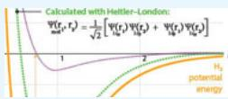</td></tr><tr><td>2. Mixing of Atomic Orbitals to Form Hybrid Orbitals</td><td>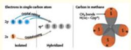</td></tr><tr><td>3. Different Combinations of Atomic Orbitals Yield Different Geometries of the Hybridized Orbitals: the  $sp^{2}$  and sp Examples</td><td>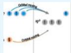 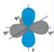</td></tr><tr><td>4. Hybridization of More Than Two Atomic Orbital Types</td><td></td></tr><tr><td>5. Molecular Orbital (MO) Theory</td><td>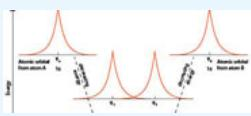</td></tr><tr><td>6. Combining Atomic Orbitals To Form Bonding and Antibonding Molecular Orbitals</td><td></td></tr><tr><td>7. Molecular Orbital Structure of Molecular Oxygen</td><td>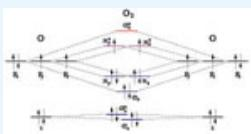</td></tr><tr><td>8. Molecular Orbital Structures of Heteronuclear Molecules</td><td>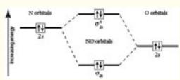</td></tr><tr><td>9. Molecular Orbital Bonding Structure of Benzene: Delocalization</td><td>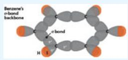</td></tr></table>

## Valence Bond Theory: Orbital Overlap and the Name of the Chemical Bond

We have now come to a significant juncture in molecular bonding theory— the point at which we must join the quantum mechanical picture of atomic orbitals with empirically based approaches that guide our intuition concerning the molecular structure of lowest potential energy: Lewis structures and VSEPR theory. The thread running through the Lewis and VSEPR models of representing the bonding structure of molecules is the abiding drive of electrons in any assemblage of atoms to “find” the configurations of lowest potential energy.

We have developed in Chapter 8 a facility with quantum mechanics to the extent that we know that electrons in isolated atoms are described by s, p, d, and f orbitals, which are wavefunctions; solutions to the Schrödinger wave equation. For each of those wavefunctions there is a corresponding energy representing the energy of that electron in the specific orbital. But now we wish to make the leap from atomic structure to molecular structure:

:::{figure} ../images/fig-p1-ch11-27.jpg
:name: fig-p1-ch11-27
:alt: Figure from the University Chemistry source textbook
:::

But when we turn to how molecules are constructed from the combination of those atomic orbitals, we are confronted with the question: How does the ensemble of electrons and protons that constitutes a molecular structure minimize the potential energy of the ensemble? Or more pointedly, how can we determine the bonding structure that represents the minimum energy configuration?

While Lewis structures appear on the surface to be just a set of rules for the placements of electrons in a molecular architecture, what in fact Lewis developed was a way to find the molecular structure of lowest potential energy. Of course, since all molecules seek to find their potential energy surface of minimum energy, what Lewis created was an electron pair bonding arrangement guided by countless examples of molecules with structures resulting directly from minimizing their potential energy. The technique of formal charges applies to the cases where there is ambiguity in the Lewis diagram leading to the determination of the true minimum energy. The method of formal charges attempts to resolve the ambiguity over which molecular structure is of minimum energy. But Lewis structures are, by nature, two-dimensional so insight into the three-dimensional structure is advanced by the use of the valence shell electron pair repulsion (VSEPR) approach detailed in Chapter 10. As we will see, this overview of the Lewis structure to determine the electron configuration of minimum energy (aided in some cases by analysis of formal charge) in combination with the VSEPR picture of the geometry of the molecular bonding structure, plays a surprisingly important role in the application of quantum mechanics to molecular bonding.

But we need a theory of bonding that recognizes the central role of quantum mechanics, of the wave properties of electrons, in order to explain why the structures deduced from Lewis theory and VSEPR theory are indeed the ones of lowest potential energy. It is important to realize that while a number of our most important molecules have tetrahedral or trigonal bipyramid structures, none of the s, p, or d orbitals are oriented such that they could rationalize such geometries. This is a serious problem if we are to use just atomic orbitals that are a solution to the Schrödinger equation for isolated atoms to describe molecular bonding. In addition to molecular bonding geometry, for modern chemical applications we must also develop an understanding of the spectroscopic behavior of molecules and the magnetic properties of molecules. None of those critically important aspects of molecular bonding emerge from non-quantum mechanical theories.

First, we examine the critical role that Linus Pauling played in the union of Lewis structures with the emerging development of quantum mechanics as it was applied to molecular structures. Pauling, it turns out, was the unifier of two major, yet unreconciled, communities within the domain of chemical thought when quantum mechanics burst on the scene in 1925. A major component of chemical reasoning had just realigned with the Lewis structure formulation in the mid-1920s. The chemistry community was using it to great advantage in bringing coherence to an otherwise disjointed myriad of chemical facts that had characterized the field for decades. When the Schrödinger equation emerged as a profoundly successful solution to the hydrogen atom, and was at least a reasonable approximation to atoms with a few electrons, the question immediately arose: If the Schrödinger equation works for atoms, does it also work for molecules?

:::{figure} ../images/fig-p1-ch11-28.jpg
:name: fig-p1-ch11-28
:alt: Figure from the University Chemistry source textbook
:::

Linus Pauling

The next year, 1927, Heitler and London published their work on the quantum mechanics of molecular bonding using $\mathrm { H } _ { 2 }$ as the prototype molecule. Heitler and London built their model of the $\mathrm { H } _ { 2 }$ molecule arguing by simple analogy. As we have seen, the Schrödinger wave equation is written as

```{math}
:label: eq-p1-ch11-12
\hat {\mathrm{H}} \Psi_ {\mathrm{n}} = \mathrm{E} _ {\mathrm{n}} \Psi_ {\mathrm{n}}
```


where $\Psi _ { \mathfrak { n } }$ is the wavefunction for the electron, Ĥ is a mathematical operator that represents the sum of the kinetic and potential energies of the electron, and the energy of the atomic levels are given by the values of $\mathrm { E _ { n } }$

The wavefunctions, $\Psi _ { \mathrm { n } } ,$ for the square well potential from Chapter 8 are

```{math}
:label: eq-p1-ch11-13
\Psi_ {n} (x) = \sqrt {\frac {2}{L}} \sin \left(\frac {n \pi x}{L}\right)
```


and the wave equation for which these wavefunctions are a solution is

```{math}
:label: eq-p1-ch11-14
\left. d ^ {2} \Psi \right/ _ {d x ^ {2}} = - \left(2 \pi / \lambda\right) ^ {2} \Psi
```


To obtain the Schrödinger equation, we substitute for the de Broglie wavelength of the electron

```{math}
:label: eq-p1-ch11-15
\lambda_ {\mathrm{el}} = \mathrm{h} / \mathrm {p_ {el}}
```


and we have

```{math}
:label: eq-p1-ch11-16
d ^ {2} \Psi / d x ^ {2} = - \left(2 \pi p / h\right) ^ {2} \Psi
```


But

```{math}
:label: eq-p1-ch11-17
\mathrm {E_ {kinetic} = p^ {2} /2m}
```


So

```{math}
:label: eq-p1-ch11-18
\left. d ^ {2} \Psi / d x ^ {2} = - \frac {4 \pi^ {2} p ^ {2}}{h ^ {2}} \Psi = - \frac {4 \pi^ {2} 2 \mathrm{mE} _ {k} \Psi}{h ^ {2}} \right.
```


Or

```{math}
:label: eq-p1-ch11-19
- \frac {\hbar^ {2}}{2 m} \frac {d ^ {2} \Psi}{d x ^ {2}} = E _ {k} \Psi
```


This is the Schrödinger equation for electrons in a potential for which the potential energy V(x) is zero for $0 < \mathbf { X } < \mathbf { I }$ and is infinite everywhere else.

But if the electron is moving in a potential that is not zero, we can generalize the Schrödinger equation to include the potential energy term by recognizing that in the Schrödinger equation

```{math}
:label: eq-p1-ch11-20
\mathbf {H} \boldsymbol {\Psi} _ {\mathrm{n}} = \mathbf {E} _ {\mathrm{n}} \boldsymbol {\Psi} _ {\mathrm{n}}
```


the Hamiltonian H is the sum of the kinetic and potential energy and that the $\mathrm { E } _ { \mathrm { n } }$ are the eigenvalues for the total energy of the electron. Thus, we can rewrite our equation for the electron in the square well potential by adding the potential energy terms to the kinetic energy term:

```{math}
:label: eq-p1-ch11-21
- \frac {\hbar^ {2}}{2 m} \frac {d ^ {2} \Psi}{d x ^ {2}} + V (x) \Psi (x) = E _ {t o t a l} \Psi (x)
```


However, if we are considering an electron moving in a 3-dimensional potential, then we need to extend the one dimensional Schrödinger equation to three dimensions:

```{math}
:label: eq-p1-ch11-22
- \frac {\hbar^ {2}}{2 m} \left[ \frac {\partial^ {2} \Psi}{\partial x ^ {2}} + \frac {\partial^ {2} \Psi}{\partial y ^ {2}} + \frac {\partial^ {2} \Psi}{\partial z ^ {2}} \right] + V (x, y, z) \Psi (x, y, z) = E _ {t o t a l} \Psi (x, y, z)
```


The Coulomb potential is the potential between an electron and a nucleus with charge $\boldsymbol { \mathrm Z }$ as a function of distance, ${ \bf r , }$ between the two charged bodies:

```{math}
:label: eq-p1-ch11-23
\mathrm{V} (\mathrm{r}) = - \mathrm{Ze} ^ {2} / \mathrm{r}
```


The dependence on r suggests that we convert from Cartesian coordinates to polar coordinates. Substitution of the values for $\mathbf { X } , \ \mathbf { y } ,$ and z in polar coordinates transforms the Schrödinger equation to

:::{figure} ../images/fig-p1-ch11-29.jpg
:name: fig-p1-ch11-29
:alt: Figure from the University Chemistry source textbook
:::

What Heitler and London did was to advance this treatment to the molecular case by rewriting the potential energy term to include the interaction of the electrons with themselves and the two electrons with the two hydrogen nuclei. This can be done for the case of two H atoms with the two electrons centered on their individual nuclei as shown in Figure 11.11.

:::{figure} ../images/fig-p1-ch11-30.jpg
:name: fig-p1-ch11-30
:alt: FIGURE 11.11 The potential energy for an electron interacting, via the Coulomb potential, with a proton can be generalized to the case for two electrons each of which interacts with one proton appropriate for large internuclear distances.
FIGURE 11.11 The potential energy for an electron interacting, via the Coulomb potential, with a proton can be generalized to the case for two electrons each of which interacts with one proton appropriate for large internuclear distances.
:::


In this case the potential energy of the systems involves just two terms, electron 1 moving in the Coulomb potential of nucleus a and electron 2 moving in the Coulomb potential of nucleus b.

However, as we move the two nuclei close together, we introduce a new combination of interactions that includes the interaction of electron 1 with both nuclei a and b, the interaction of electron 2 with both nuclei a and b, and the interaction of the two nuclei and the two electrons. This yields a potential energy term that contains six terms as Figure 11.12 shows.

:::{figure} ../images/fig-p1-ch11-31.jpg
:name: fig-p1-ch11-31
:alt: FIGURE 11.12 When the protons are brought together, each electron interacts with each of the two protons and with the other electron such that the potential energy term, V, has six terms.
FIGURE 11.12 When the protons are brought together, each electron interacts with each of the two protons and with the other electron such that the potential energy term, V, has six terms.
:::


Writing down a potential energy function is rather straight forward. The more challenging step is to write down a wavefunction that when substituted into the Schrödinger equation yields a realistic potential energy surface for the $\mathrm { H } _ { 2 }$ molecule.

Here, Heitler and London made a first approximation that the wavefunction for the molecule would have some mathematical resemblance to the wavefunction for the atom. As an initial guess, they constructed the $\mathrm { H } _ { 2 }$ wavefunction as the product of (1) the wavefunction for electron 1 in the Coulomb field of nucleus a, $\Psi _ { 1 s _ { \mathrm { a } } } ( \mathbf { r } _ { 1 } )$ and (2) the wavefunction for electron 2 in the Coulomb field of nucleus b, $\Psi _ { _ { 1 5 _ { 6 } } } ( \mathbf { r } _ { 2 } )$

```{math}
:label: eq-p1-ch11-24
\Psi_ {\mathrm{mol} ^ {1}} \left(\mathrm{r} _ {1}, \mathrm{r} _ {2}\right) = \Psi_ {1 s a} \left(\mathrm{r} _ {1}\right) \cdot \Psi_ {1 s b} \left(\mathrm{r} _ {2}\right)
```


We can picture what this wavefunction would be like by superimposing (multiplying together) two 1s hydrogen atomic orbitals.

Beginning with a representation of the two separated hydrogen atoms displayed in Figure 11.13

:::{figure} ../images/fig-p1-ch11-32.jpg
:name: fig-p1-ch11-32
:alt: FIGURE 11.13 The wavefunction for each of the separated hydrogen atoms with an internuclear distance great enough so there is no overlap of the individual wavefunctions.
FIGURE 11.13 The wavefunction for each of the separated hydrogen atoms with an internuclear distance great enough so there is no overlap of the individual wavefunctions.
:::


that represents the wavefunction for the separated atoms, we can decrease the internuclear distance to form the molecular wavefunction from the product of the two atomic wavefunctions as shown in Figure 11.14.

:::{figure} ../images/fig-p1-ch11-33.jpg
:name: fig-p1-ch11-33
:alt: FIGURE 11.14 Formation of the molecular wavefunction for mathematical notation created from the hydrogen atom wavefunctions by taking the product.
FIGURE 11.14 Formation of the molecular wavefunction for ${ \sf H } _ { 2 }$ created from the hydrogen atom wavefunctions by taking the product.
:::


Notice that this product wavefunction for the molecule is zero anywhere either atomic wavefunction is zero and it tends to a maximum along the internuclear axis in the region between the nuclei. This would tend to reduce the nuclear proton-proton repulsion and enhance the electron-proton attraction such that there is the possibility of forming a stable bond—a minimum in the potential energy curve for the molecule.

When this guess for the mathematical form for the wavefunction of molecular $\mathrm { H _ { 2 } , \Psi _ { m o l } ( r _ { 1 } , r _ { 2 } ) }$ , was inserted into the Schrödinger wave equation, the calculated energy as a function of internuclear distance did indeed have a minimum, but it was a minimum far shallower than the experimentally determined depth of the potential energy surface for $\mathrm { H } _ { 2 }$ obtained by spectroscopic evidence. This comparison is displayed in Figure 11.15.

:::{figure} ../images/fig-p1-ch11-34.jpg
:name: fig-p1-ch11-34
:alt: FIGURE 11.15 The potential energy surface for mathematical notation showing the experimentally observed potential energy as a function of internuclear distance (solid line) and the calculated potential energy surface using the mathematical
FIGURE 11.15 The potential energy surface for ${ \sf H } _ { 2 }$ showing the experimentally observed potential energy as a function of internuclear distance (solid line) and the calculated potential energy surface using the ${ \sf H } _ { 2 }$ molecular wavefunction from Figure 11.14.
:::


Heitler and London then recast the mathematical structure of the molecular wavefunction by hypothesizing that if the Lewis electron pair bond represented a true sharing of the two electrons, then the appropriate molecular wavefunction should reflect the indistinguishable character of the shared electrons in that bond. This could be represented mathematically by a molecular wavefunction that exchanged the electrons with respect to their originally identified nuclei. If $\Psi _ { 1 s _ { \mathrm { a } } } ( \mathbf { \vec { r } } _ { 1 } )$ represented electron 1 within the Coulomb influence of nucleus a, then $\Psi _ { 1 \mathrm { s } _ { \mathrm { a } } } ( \mathrm { r } _ { 2 } )$ would represent electron 2 within the Coulomb influence of nucleus a. Thus the molecular wavefunction for the case of both electrons shared by both nuclei would be

```{math}
:label: eq-p1-ch11-25
\Psi_ {\mathrm{mol} ^ {1}} \left(\mathrm{r} _ {1}, \mathrm{r} _ {2}\right) = \frac {1}{\sqrt {2}} \left[ \Psi_ {1 s _ {a}} \left(\mathrm{r} _ {1}\right) \Psi_ {1 s b} \left(\mathrm{r} _ {2}\right) + \Psi_ {1 s b} \left(\mathrm{r} _ {1}\right) \Psi_ {1 s a} \left(\mathrm{r} _ {2}\right) \right]
```


The $1 / \sqrt { 2 }$ in front of the brackets is just to ensure that the probability of finding an electron anywhere in space is 1. This is called the “normalization” term.

When this wavefunction was substituted into the Schrödinger equation, the potential energy curve for $\mathrm { H } _ { 2 }$ exhibited a far greater well depth as shown in Figure 11.16.

:::{figure} ../images/fig-p1-ch11-35.jpg
:name: fig-p1-ch11-35
:alt: FIGURE 11.16 The upper panel displays the comparison between the experimental potential energy surface for mathematical notation the calculated potential energy surface using the Heitler-London molecular hydrogen wavefunction including elec
FIGURE 11.16 The upper panel displays the comparison between the experimental potential energy surface for $\mathsf { H } _ { 2 } ,$ the calculated potential energy surface using the Heitler-London molecular hydrogen wavefunction including electron exchange, and finally the potential calculated energy surface for an ${ \sf H } _ { 2 }$ molecular wavefunction that does not include electron exchange. The lower panel displays the orbital overlap as a function of internuclear distance.
:::


This was a major breakthrough in the development of quantum mechanics in pursuit of a quantitative understanding of the chemical bond. While the Heitler-London bond strength of approximately 3.2 eV was considerably less than the observed 4.75 eV, it was also clear that this very approximate molecular wavefunction that represented the exchange or sharing of electrons between the nuclei contained many of the essential aspects of a shared electron bond.

Of particular importance was the fact that this rewriting of the molecular wavefunction that included the exchange of electrons between the two nuclei was an entirely quantum mechanical phenomenon. It has no classical analog because it could not be described by an electrostatic interaction among electrons or protons. Recall that the potential energy term in the Schrödinger equation was the same for both Figure 11.15 and Figure 11.16—only the wavefunction was changed. This formulation of the wavefunction that allowed the electron to spread, to delocalize, across the molecule by allowing the exchange or sharing of the electron pair in the bond lowers the energy of the ensemble of electrons and protons.

A key aspect of the formulation of the wavefunction for the molecular bond from the individual atomic wavefunctions was the emphasis placed on the importance of the overlap of the atomic orbitals intrinsic to the molecular bond. Electrons can only be exchanged between atoms and shared in pairs, if their orbitals overlap in a region of space, as shown in Figure 11.16. The cumulative overlap of two waves of two wavefunctions, is referred to as the orbital overlap, s, and it is quantitatively represented as the sum of all overlap contributions, volume element by volume element as shown in Figure 11.17.

:::{figure} ../images/fig-p1-ch11-36.jpg
:name: fig-p1-ch11-36
:alt: Figure from the University Chemistry source textbook
:::

The orbital overlap, S, as a sum over all the volume elements within the overlap region of the two wavefunctions, is just the integral of the wavefunction taken over the overlap region in the limit of small $\Delta \mathbf { v }$ :

```{math}
:label: eq-p1-ch11-26
S = \int_ {\text { overlap }} \Psi_ {\mathrm{a}} \Psi_ {\mathrm{b}} \mathrm{dv}
```


The value of this orbital overlap, S, is shown as a function of internuclear distance for the $\mathrm { H } _ { 2 }$ molecule in the lower panel of Figure 11.16. Figure 11.16 emphasizes that as the orbital overlap between two atomic orbitals increases, the exchange contribution increases the depth of the potential energy surface (and the strength of the chemical bond) until the repulsive force of the two nuclei becomes dominant at small internuclear distance and the potential energy surface increases.

Pauling, while still a very young man, recognized that:

1. Molecules exhibited similar discrete emission line spectra as atoms, although molecular spectra were considerably more complicated than atomic spectra.

2. The clear quantum mechanical implications of the Heitler-London electron exchange force for molecular wavefunctions included the sharing of electrons in a chemical bond.

3. The Pauli Exclusion Principle applied to electrons in the molecular orbitals as well as the atomic orbitals.

4. The orbital overlap was of key importance in understanding the structure and strength of the chemical bond.

These lines of evidence convinced Pauling that quantum mechanics was to play the central role in understanding the nature of the chemical bond, and he set out to formulate the union between the new quantum mechanics and the older insight brought by the Lewis formation of the shared electron chemical bond. Pauling proceeded to develop the valence bond (VB) model of the molecular bond based on the formulation of quantum mechanics using the orbital overlap of wavefunctions drawn directly from the atomic orbitals of the atoms involved in the molecular bond. In practice, Pauling proceeded to superimpose the orbitals drawn from quantum mechanics on the bonding architecture that emerged from the Lewis diagrams. When applied to a broad class of molecular systems, this revolutionized the understanding of molecular bonding.

The fundamental premise in what is termed the valence-bond (VB) theory of molecular bonding is that a covalent bond forms when the wavefunctions of two atoms of opposite spin constructively add in the region between two nuclei. Because the electron wavefunction has both an amplitude and a phase, the region where two atomic wavefunctions constructively add is commonly termed the “orbital overlap” region. From the analysis of the relationship between (1) the orbital overlap of two hydrogen atoms and (2) the potential energy surface defining the decrease in potential energy with increasing orbital overlap in Figure 11.16, we can deduce a very important fact: that with increasing overlap of two orbitals, the strength of the bond formed (the decrease in potential energy) increases until the proton-proton repulsion at very small internuclear distance begins to dominate the attraction of the two atoms that form the molecular bond.

Thus valence bond (VB) theory is based on the development of combinations of atomic orbitals that combine to form orbital overlap between two atoms such that a chemical bond is formed containing two electrons. We can extend the case of the $\mathrm { H } _ { 2 }$ bond formed from the overlap of two H atoms by considering the case of a 1s H atom orbital combining with the $3 \mathsf { s } ^ { 2 } 3 \mathsf { p } ^ { 5 }$ electron configuration of a Cl atom. The VB picture of this bond, shown in the top panel of Figure 11.18, would overlap the 1s<sup>1</sup> orbital of H with the 3p orbital of Cl.

:::{figure} ../images/fig-p1-ch11-37.jpg
:name: fig-p1-ch11-37
:alt: FIGURE 11.18 The valence bond (VB) picture of the molecular bond in HCl where the electron pair bond between H and Cl is shown in the top panel with the 1s orbital of H overlapping the 3p orbital of Cl. The VB picture of the mathematical no
FIGURE 11.18 The valence bond (VB) picture of the molecular bond in HCl where the electron pair bond between H and Cl is shown in the top panel with the 1s orbital of H overlapping the 3p orbital of Cl. The VB picture of the $\mathsf { C l } _ { 2 }$ bond showing the shared electron pair from the 3p orbital of each Cl atom shown in the bottom panel.
:::


The valence bond picture of two Cl atoms bonding to form $\mathrm { C l } _ { 2 }$ is shown in the bottom panel of Figure 11.18. In each case the half filled orbitals overlap to form an electron pair bond. For the case of HCl, the 1s electron of hydrogen combines with the half filled 3p orbital of Cl. For $\mathrm { C l } _ { 2 } ,$ the half filled 3p orbital of one Cl atom combines with the half filled 3p orbital of the other Cl atom to form the overlap region containing an electron pair that constitutes the Cl-Cl bond. A key point to note is that the constructive addition of two electron wavefunctions overlap in space. Thus, because the 3s orbital of the Cl atom does not extend out from the nucleus far enough to overlap either the 1s orbital of H or the 3p orbital of Cl, the bond is formed in each case by the overlap with the 3p orbital of Cl that extends a considerable radial distance from the Cl nucleus.

Based on the development of VB theory thus far, we have a remarkably simple quantum mechanical picture of molecular bonding: in VB theory, a covalent chemical bond is the overlap of protruding half-filled s, p, d, or f atomic orbitals that form electron pair bonds. Yet, what is fundamentally new is that we are treating electrons as waves—with the atomic orbitals explicitly forming the atom-atom bonds that constitute a molecule. Building on the idea that bonds are formed in molecules by the constructive overlap between orbitals of adjacent atoms, we can, in the simplest possible way, build molecular structures by combining atomic orbitals just as those orbitals are configured in the separated atoms! It is not at all obvious that when electron waves combine, or “mix,” to form a molecular structure that they would “remember” the geometry of the wavefunction in the separated atoms, but in a large number of cases they do.

## Molecular Shape and the Concept of Bond Hybridization

Remarkably, while many molecular structures appear to obey this simple picture of molecular bonds formed from the overlap of atomic orbitals just as they exist in the separated atoms, we can quickly identify some very important cases for which this approach fails.

## Case 1: Methane, $\mathsf { \mathbf { C H } } _ { 4 } ,$ is a molecule with tetrahedral geometry

In methane, each of the C-H bonds is of equal length and the same strength.Each bond extends from the central atom (carbon) to the vertices of the tetrahedral and each H-C-H bond angle is 109.5°.

:::{figure} ../images/fig-p1-ch11-38.jpg
:name: fig-p1-ch11-38
:alt: Figure from the University Chemistry source textbook
:::

Case 2: Ethylene $( C _ { 2 } H _ { 4 } )$ is a planar molecule

Ethylene has four equivalent carbon-hydrogen bonds of bond length 109 pm and a carbon-carbon double bond of length 134 pm. Each HCH bond angle is 120°.

:::{figure} ../images/fig-p1-ch11-39.jpg
:name: fig-p1-ch11-39
:alt: Figure from the University Chemistry source textbook
:::

Case 3: Acetylene $( C _ { 2 } H _ { 2 } )$ is a linear molecule with a triple bond between the carbon atoms

The two carbon-hydrogen bonds are equivalent and have a bond length of 106 pm; the carbon-carbon triple bond has a bond length of 120 pm.

:::{figure} ../images/fig-p1-ch11-40.jpg
:name: fig-p1-ch11-40
:alt: Figure from the University Chemistry source textbook
:::

On the face of it, these examples present a significant problem for VB theory using the atomic orbitals of carbon, which have p orbitals occupying the three orthogonal axes $\mathrm { p } _ { \mathrm { x } } , \ \mathrm { p } _ { \mathrm { y } } ,$ and ${ \bf p } _ { \bf z } .$ . How can such a geometry be reconciled with a tetrahedral structure? With a planar geometry involving a carbon-carbon double bond? What is also mystifying is that we have three molecules, three different molecular geometries, yet one kind of atom, carbon, forming bonds with one other kind of atom, hydrogen, to produce three distinct structures. We know that if we deconstructed the methane, ethylene, and acetylene molecules into atoms we would have our $\mathrm { 1 s ^ { 2 } 2 s ^ { 2 } 2 p ^ { 2 } }$ carbon atoms with orthogonal p orbitals and our 1s hydrogen atoms back again. But how can a carbon atom, which possesses a 2s and three 2p valence orbitals, make $4$ indistinguishable molecular bonds in methane? Is the VB model, which is built on the assumption that we need simply overlap the atomic orbitals of isolated atoms to form molecules, inadequate to explain the simplest hydrocarbon molecule—methane?

To first order we know why the methane molecule rearranged its configuration—it was simply seeking the molecular geometry and electron distribution that would result in the lowest potential energy configuration. How would it achieve this configuration given only 2s and 2p orbitals to work with? Is this a violation of our VB model that must be built from atomic orbitals of the constituent atoms?

The key point is that the wavefunctions, the 2s and 2p orbitals of carbon, can mix in any manner that will reduce the potential energy of the ensemble of electrons and nuclei of the methane molecule. The electrons are not locked into the orbitals of the separated atoms. The electron wavefunctions can add together and reshape into any configuration that lowers the potential energy of the resulting molecular structure.

## sp<sup>3</sup> Hybridization and the Structure of Methane

If we combine one s orbital and three p orbitals of the central atom we create a new geometrical structure. We can represent this beginning with the electron configuration of carbon that corresponds to s and p orbitals of the isolated carbon atom and mix them, resulting in four hybridized orbitals of carbon in the molecular structure of methane, as shown in Figure 11.19.

:::{figure} ../images/fig-p1-ch11-41.jpg
:name: fig-p1-ch11-41
:alt: Figure from the University Chemistry source textbook
:::

:::{figure} ../images/fig-p1-ch11-42.jpg
:name: fig-p1-ch11-42
:alt: FIGURE 11.19 The tetrahedral bonding structure of mathematical notation formed from the hybridization of three 2p orbitals and one 2s orbital of carbon.
FIGURE 11.19 The tetrahedral bonding structure of $\mathsf { C H } _ { 4 }$ formed from the hybridization of three 2p orbitals and one 2s orbital of carbon.
:::


Those four resulting hybridized orbitals of carbon are all of equal energy; they are each 25%:75% composites of s and p character with a geometry pointing to the $4$ vertices of a tetrahedron. Each of these degenerate (equal energy) orbitals is designated as an sp<sup>3</sup> hybrid orbital and, as the electron configuration in Figure 11.19 demonstrates, each contains a single unpaired electron. Thus the bonding structure of the central carbon atom in methane accepts the single 1s electron from H resulting in four electron pair bonds to form $\mathrm { C H } _ { 4 }$ . This mixing of atomic orbitals of the separated atoms to form hybrid orbitals in the molecule formed from those atoms, explicitly demonstrates the wave nature of the electron that results in its ability to combine spatially in whatever manner is required to lower the potential energy of the assembled molecule.

This revelation that atomic orbitals can mix to create new geometrical arrangements in a molecular construction is the key concept linking (1) the development of the wave properties of the electron in Chapters 8 and 9 with (2) the deduced shape of molecules that emerges from the union of Lewis theory and VSEPR theory in Chapter 10. There are a number of ways of diagrammatically representing the hybridization of atomic orbitals to create the bonding structure of the assembled molecule. Figure 11.19, which links the energy ordering of the electron configuration of the separated atoms to the four equivalent $\mathsf { s p } ^ { 3 }$ hybridized orbitals and displays the resulting molecular geometry of $\mathrm { C H } _ { 4 }$ is one approach. This approach is simple, concise, and geometrically correct. It links the electronic configuration of the separated atoms to the hybridized orbitals of the central bonding carbon and to the structure of methane including the C-H bonds, wavefunctions and electron occupation.

We can also represent the mixing of atomic orbitals in a step wise mathematical addition of the atomic orbitals with different coefficients of orbital addition that represents the different phases of adding the electron waves of the $\mathrm { p } _ { \mathrm { x } } , \mathrm { p } _ { \mathrm { y } }$ , and $\mathrm { p } _ { \mathrm { z } }$ orbitals. This systematic addition of different wave phases results in the four hybrid sp<sup>3</sup> orbitals pointing to the four vertices of the tetrahedron as shown in Figure 11.20.

:::{figure} ../images/fig-p1-ch11-43.jpg
:name: fig-p1-ch11-43
:alt: FIGURE 11.20 The combination of a 2s orbital and three 2p orbitals of carbon combine to form mathematical notation hybridized orbitals.
FIGURE 11.20 The combination of a 2s orbital and three 2p orbitals of carbon combine to form $4 \mathsf { s p } ^ { 3 }$ hybridized orbitals.
:::


Why do the $\mathrm { p } _ { \mathrm { x } } , \mathrm { p } _ { \mathrm { y } }$ , and $\mathrm { p } _ { \mathrm { z } }$ orbitals “choose” this combination of phases to create the hybrid orbitals from the s and p atomic orbitals? Because the coefficients of the wave mixing of the $\mathrm { p } _ { \mathrm { x } } , \mathrm { p } _ { \mathrm { y } } ,$ and $\mathrm { p } _ { \mathrm { z } }$ orbitals is “chosen” by the electrons in order to minimize the potential energy of the ensemble of hybrid orbitals in the assembled molecule.

In Figure 11.20, once we have established the geometry of the four resulting $\mathsf { s p } ^ { 3 }$ orbitals, we can assemble those orbitals around the central carbon atom to construct the correct orientation of the tetrahedral structure. For clarity, it is common practice to ignore the small negative lobe in each of the $\mathsf { s p } ^ { 3 }$ orbitals when configuring the final ensemble of orbitals in the molecule as shown on the right-hand side of Figure 11.20.

It is worth noting that electrons are not mathematicians—they do not solve the Schrödinger wave equation to establish the proper orbital within which they reside. Electrons are simply masters of energy minimization and they are remarkably quick-witted at what they do. As we will see in Chapter 12, it takes an ensemble of electrons only $\sim 1 0 ^ { - 1 5 }$ seconds to transition from one geometrical distribution to another—for example from an unhybridized orbital to a hybridized orbital. This is orders of magnitude faster than the calculations can be done by the world's fastest computer. It is the far slower motion of the nuclei that determines the rate at which atomic orbitals transition to molecular orbitals or the time required for molecular structures to be interconverted to other molecular structures in a chemical reaction.

## sp<sup>2</sup> Hybridization and the Formation of σ and π Double Bonds

Our next challenge is to try to figure out the bonding structure in ethylene. As we noted, ethylene, $\mathrm { C _ { 2 } H _ { 4 } }$ , is planar with a double bond between the carbons and a $\mathbf { 1 2 0 ^ { \circ } }$ HCH angle. Here, the revelation that we could create a tetrahedral structure from an s orbital and three p orbitals provides both the hope that almost anything is possible and the hint as to how to do it. If we are to solve this bonding structure we know, from Figure 11.20 for the $\mathsf { s p } ^ { 3 }$ case, that we must find coefficients for the judicious addition of $\mathrm { p } _ { \mathrm { x } } , \mathrm { p } _ { \mathrm { y } }$ , and $\mathrm { p } _ { \mathrm { z } }$ orbitals with the 1s orbital that will give us a bonding structure of three lobes, all in the same plane, that are $\mathbf { 1 2 0 ^ { \circ } }$ apart. We immediately know, then, that the combination of p orbitals that constitutes the hybridization cannot include a p orbital perpendicular to that plane. We must work with the s orbital and just two of the p orbitals—we choose the $\mathrm { p _ { x } }$ and $\mathsf { p } _ { \mathtt { y } }$ orbitals. From the point of view of the electron configuration, this implies that the 2s orbital of carbon will mix with two of the 2p orbitals as shown in Figure 11.21 that displays the electronic configuration of the s-p mixing.

:::{figure} ../images/fig-p1-ch11-44.jpg
:name: fig-p1-ch11-44
:alt: Figure from the University Chemistry source textbook
:::

:::{figure} ../images/fig-p1-ch11-45.jpg
:name: fig-p1-ch11-45
:alt: FIGURE 11.21 When one 2s orbital and two 2p orbitals mix, hybridize, three sp2 hybridized orbitals result with the single 2p orbitals remaining unhybridized.
FIGURE 11.21 When one 2s orbital and two 2p orbitals mix, hybridize, three sp<sup>2</sup> hybridized orbitals result with the single 2p orbitals remaining unhybridized.
:::


We can track the formation of these $\mathsf { s p } ^ { 2 }$ orbitals from the separated atomic orbitals explicitly using the analogous diagram to Figure 11.20 introduced for the sp<sup>3</sup> hybridization. In the case of $\mathsf { s p } ^ { 2 }$ hybridization, the mixing of the p orbitals such as to minimize the potential energy of the assembled molecule is displayed in Figure 11.22. The mixing of the p orbitals is represented by the coefficients that define both the amplitude and phase of the electron waves that are condensed to form the hybrid orbitals.

:::{figure} ../images/fig-p1-ch11-46.jpg
:name: fig-p1-ch11-46
:alt: FIGURE 11.22 The mixing of an s orbital and two p orbitals yield the three sp2 hybridized orbitals.
FIGURE 11.22 The mixing of an s orbital and two p orbitals yield the three sp<sup>2</sup> hybridized orbitals.
:::


We are now positioned to define the bonding structure of ethylene using the three degenerate sp<sup>2</sup> orbitals that all lie in a plane with an angle of $\mathbf { 1 2 0 ^ { \circ } }$ between each of the orbitals. First we form a carbon-carbon bond with the overlap of an sp<sup>2</sup> orbital from each of the carbon atoms as shown in Figure 11.23.

:::{figure} ../images/fig-p1-ch11-47.jpg
:name: fig-p1-ch11-47
:alt: FIGURE 11.23 The hybridized orbitals from each atom can overlap to create a molecular bond. In this case an sp2 hybridized orbital forms a cylindrically symmetric σ bond between two carbon atoms.
FIGURE 11.23 The hybridized orbitals from each atom can overlap to create a molecular bond. In this case an sp<sup>2</sup> hybridized orbital forms a cylindrically symmetric σ bond between two carbon atoms.
:::


These two $\mathsf { s p } ^ { 2 }$ hybridized carbon atoms establish one $\mathrm { \tt s p } ^ { 2 } - \mathrm { \tt s p } ^ { 2 }$ σ bond in a head-on arrangement creating one electron pair bond. The plane of the molecular structure is determined by the plane of the $\mathsf { s p } ^ { 2 }$ hybridized orbitals with the unhybridized p orbital perpendicular to that plane.

Having established the first carbon-carbon bond with this electron pair σ bond, the unhybridized p orbitals form a π bond that locks the remaining $\mathsf { s p } ^ { 2 }$ orbitals into a common plane. This electron pair π bond in combination with the σ bond establishes the carbon-carbon double bond, as shown in Figure 11.24.

:::{figure} ../images/fig-p1-ch11-48.jpg
:name: fig-p1-ch11-48
:alt: FIGURE 11.24 The unhybridized p orbital from two carbon atoms can overlap to form a π bond
FIGURE 11.24 The unhybridized p orbital from two carbon atoms can overlap to form a π bond
:::


The four hydrogen atoms then form electron pair σ bonds with the four protruding sp<sup>2</sup> hybrid orbitals in the molecular plane, completing the bonding structure of ethylene as displayed in Figure 11.25.

:::{figure} ../images/fig-p1-ch11-49.jpg
:name: fig-p1-ch11-49
:alt: FIGURE 11.25 The combination of the σ bond formed from the overlap of an mathematical notation hybridized orbital from each of two carbon atoms, a π bond from an unhybridized p orbital from each of two carbon atoms and 4 mathematical notati
FIGURE 11.25 The combination of the σ bond formed from the overlap of an $\mathsf { s p } ^ { 2 }$ hybridized orbital from each of two carbon atoms, a π bond from an unhybridized p orbital from each of two carbon atoms and 4 $\mathsf { s p } ^ { 2 }$ hybridized orbitals from the two carbon atoms overlap with 4 s orbitals of the hydrogen atom to form the ethylene molecular structure.
:::


A planar structure of ethylene is thus constructed with a backbone consisting of the $\mathrm { C } { = } \mathrm { C }$ double bond. The stronger of the two carbon-carbon bonds is that formed from the $\mathrm { \tt S p } ^ { 2 } - \mathrm { \tt S p } ^ { 2 }$ σ overlap, primarily because of the extension of the $\mathsf { s p } ^ { 2 }$ hybrid orbitals along the axis connecting the carbon nuclei that provides greater overlap for the σ electron pair bond. In addition the electrons reside between the nuclei providing shielding of the protonproton repulsion. The second carbon-carbon bond, the weaker of the two, is a π bond formed from the unhybridized p-p orbital overlap. This bond is not only weaker, it is also more exposed to attack by electron hungry species such as free radicals or Lewis acids.

## sp Hybridization and the Formation of Triple Bonds

We turn next to our third case, that of acetylene, H-C C-H, that is a linear molecule with a triple bond between the central carbons, each of which is bonded to a terminal hydrogen. How can we construct a triple bond from the s and p orbitals of carbon? Solving this bonding structure is, in many ways, the easiest of the three cases. We know we can mix orbitals with any combination of coefficients that minimize the energy of the molecular structure. We know that we can combine both σ and π bonding to form the molecular structure, and we have no inherent geometric problems linking the orthogonal $\mathrm { p } _ { \mathrm { x } } , \mathrm { p } _ { \mathrm { y } }$ , and $\mathrm { p } _ { \mathrm { z } }$ orbitals to create a linear structure. If we mix the s orbital of beryllium with one p orbital of beryllium, as shown in the electron configuration diagram in Figure 11.26, we have two sp hybridized orbitals and two unhybridized p orbitals.

:::{figure} ../images/fig-p1-ch11-50.jpg
:name: fig-p1-ch11-50
:alt: FIGURE 11.26 One 2s orbital and one 2p orbital hybridize to form two sp hybrid orbitals. Two unhybridized 2p orbitals remain unmixed.
FIGURE 11.26 One 2s orbital and one 2p orbital hybridize to form two sp hybrid orbitals. Two unhybridized 2p orbitals remain unmixed.
:::


We can track the creation of the resulting two sp hybrid orbitals from the one s orbital and the one p orbital (remember we always get the same number of hybrid orbitals as atomic orbits were combined to form them) as shown in Figure 11.27. When the two sp orbitals are combined we have a linear orbital extending $\mathbf { 1 8 0 ^ { \circ } }$ from each other with the carbon atom at the center.

:::{figure} ../images/fig-p1-ch11-51.jpg
:name: fig-p1-ch11-51
:alt: Figure from the University Chemistry source textbook
:::

:::{figure} ../images/fig-p1-ch11-52.jpg
:name: fig-p1-ch11-52
:alt: Figure from the University Chemistry source textbook
:::

:::{figure} ../images/fig-p1-ch11-53.jpg
:name: fig-p1-ch11-53
:alt: FIGURE 11.27 The hybridization of the s and p orbitals to form the hybridized sp orbitals.
FIGURE 11.27 The hybridization of the s and p orbitals to form the hybridized sp orbitals.
:::


When we combine the two lobe sp orbital with the unhybridized p orbitals we have the geometry displayed in Figure 11.28. This orientation of orbitals (note that the phase of the hybrid orbitals are both positive because the small negative phase orbital is suppressed as can be seen by inspection of Figure 11.28) provides for carbon-carbon σ bonding along the internuclear axis, and carbon-hydrogen bonding at the terminal positions.

:::{figure} ../images/fig-p1-ch11-54.jpg
:name: fig-p1-ch11-54
:alt: FIGURE 11.28 The geometry of the sp hybridized and unhybridized p orbitals of carbon.
FIGURE 11.28 The geometry of the sp hybridized and unhybridized p orbitals of carbon.
:::


The carbon-carbon σ bonds are shown in Figure 11.29 along with the two π bonds formed from the unhybridized p orbitals of the carbon.

:::{figure} ../images/fig-p1-ch11-55.jpg
:name: fig-p1-ch11-55
:alt: FIGURE 11.29 The bonding structure of the carbon backbone of acetylene with one σ bond created by the overlap of an sp hybridized orbital from each of two carbon atoms, and two π bonds created from the overlap of unhybridized p orbitals.
FIGURE 11.29 The bonding structure of the carbon backbone of acetylene with one σ bond created by the overlap of an sp hybridized orbital from each of two carbon atoms, and two π bonds created from the overlap of unhybridized p orbitals.
:::


With the addition of the terminal hydrogen, the VB model of the bonding structure in acetylene is complete as shown in Figure 11.30.

:::{figure} ../images/fig-p1-ch11-56.jpg
:name: fig-p1-ch11-56
:alt: FIGURE 11.30 The complete bonding structure of acetylene showing the σ bond and two π bonds from Figure 11.22 and the σ bonds between the carbon atoms and the terminal hydrogen atoms.
FIGURE 11.30 The complete bonding structure of acetylene showing the σ bond and two π bonds from Figure 11.22 and the σ bonds between the carbon atoms and the terminal hydrogen atoms.
:::


Let's review what we have done by considering another molecular structure, formaldehyde, $\mathrm { C H _ { 2 } O _ { : } }$ which we used as a case study in our discussion of Lewis structure and VSEPR theory in Chapter 10. First, quantum mechanics tells us the molecular orbitals that we have to work with —specifically s and p orbitals from carbon, s and p orbitals from oxygen, and s orbitals from hydrogen. At this point, we have our tool kit of atomic orbitals, but we don't know how to minimize the potential energy of the ensemble of electrons and nuclei in the completed molecules. We do know that the electrons will arrange their wave properties so as to find the minimum potential energy structure. While the electrons know the answer, we, at this point, do not. Thus we have two choices: Option 1 is to employ a reasonably powerful computer to solve an electron structure calculation of the Schrödinger equation to determine the potential energy surface of the most stable (lowest energy) molecular configuration. Option 2 is to use what we know from our study of Lewis structures and VSEPR theory. Reviewing quickly (see Chapter 10) the Lewis structure places hydrogen at the terminal positions and the least electronegative atom (that's carbon) at the center of the molecule and inserts electrons to satisfy the octet/duet criteria

```{math}
:label: eq-p1-ch11-27
\begin{array}{c} \mathrm{H} _ {\backslash} \\ \mathrm{H} ^ {\prime} \end{array} \mathrm{C} = \stackrel {{\cdot}} {{\mathrm{O}}}
```


We don't yet know the bond angles that constitute the lowest energy structure, but the Lewis diagram tells us that we have 3 electron groups around the central (carbon) atom and we have two lone pairs on the oxygen. VSEPR theory sets the electron group geometry to minimize the electron group-electron group repulsion by maximizing the distance between those entities: the trigonal planar geometry is the VSEPR structure for the three electron group case.

This suggests the planar configurations of bonding orbitals about carbon with bond angles of $\mathbf { 1 2 0 ^ { \circ } }$ between the protruding orbitals—this suggest $\mathsf { s p } ^ { 2 }$ hybridization on the carbon center. One of the oxygen p orbitals extends along the $\mathrm { C } { \cdot } \mathrm { O }$ axis to form a σ bond with one of the $\mathsf { s p } ^ { 2 }$ hybrid orbitals of carbon. The second carbon-oxygen bond is a π bond formed from the unhybridized bond on carbon and a second unhybridized bond on oxygen. This forms the backbone of the molecular structure for formaldehyde as shown in Figure 11.31.

:::{figure} ../images/fig-p1-ch11-57.jpg
:name: fig-p1-ch11-57
:alt: FIGURE 11.31 The bonding structure of formaldehyde showing the carbon mathematical notation hybrid orbital of carbon forming a σ bond with a p orbital of oxygen, a π bond from the unhybridized p orbital of carbon and an unhybridized p orbit
FIGURE 11.31 The bonding structure of formaldehyde showing the carbon $\mathsf { s p } ^ { 2 }$ hybrid orbital of carbon forming a σ bond with a p orbital of oxygen, a π bond from the unhybridized p orbital of carbon and an unhybridized p orbital of oxygen, and two σ bonds to the terminal hydrogen atoms with two $\mathsf { s p } ^ { 2 }$ hybridized orbitals of carbon.
:::

The complete molecule structure is achieved by adding the two hydrogen 1s orbitals to the unpaired $\mathsf { s p } ^ { 2 }$ hybrid orbitals of carbon and labeling each of the orbital overlaps as shown in Figure 11.32.

:::{figure} ../images/fig-p1-ch11-58.jpg
:name: fig-p1-ch11-58
:alt: FIGURE 11.32 Each of the bonds in formaldehyde is designated by the molecular bond type (σ or π) and the atomic orbital pair from which they were formed.
FIGURE 11.32 Each of the bonds in formaldehyde is designated by the molecular bond type (σ or π) and the atomic orbital pair from which they were formed.
:::


From one perspective, Lewis theory and VB theory are analogous: the structure of formaldehyde is set by the central carbon atom, which serves to organize four bonds: two single bonds to the terminal hydrogen atoms and a double bond to oxygen. VB theory provides extremely important additional information. VB theory distinguishes between the structure of the σ bond and that of the π bond. This distinction becomes increasingly important when we consider the chemical characteristics of molecular structures and the analysis of how photons interact with the molecular structure.

Notice again that quantum mechanics provides the tool box of atomic orbitals of the separated atoms, and provides the concept of the constructive and deconstructive addition of electronic waves within a molecular structure such that the geometry of the molecular structure is the lowest energy (most stable configuration available to the ensemble of electrons and nuclei). However, in the absence of a full computer calculation, the electron group geometry and the distinction between bonding electrons and lone pair electrons guides in the selection of the minimum potential energy structure derived from Lewis theory in combination with VSEPR theory.

## sp<sup>3</sup>d and sp<sup>3</sup>d<sup>2</sup> Hybrid Orbitals: Trigonal Bipyramidal and Octahedral Geometry

Thus from the union of quantum mechanics, which provides the atomic orbitals and the concept of wavefunction addition, with Lewis structures and VSEPR, which guide the selection of the geometry of the most stable molecular structure, we have formulated VB theory with remarkable success. To this point we have developed an understanding of linear, trigonal planar, and tetrahedral structures. But we know from observation that trigonal bipyramidal and octahedral electron geometries are common in many molecular structures. Can this concept of atomic orbital hybridization provide insight into those bonding configurations?

The way we can answer these questions is to think about what hybridization of atomic orbitals has taught us about the creation of quite different geometries for bonding within molecules.

We would first ask, can we manipulate the coefficients of s and p orbitals so as to create a trigonal bipyramidal backbone structure by hybridization of just these two wavefunction geometries? After trying a number of different possibilities we would conclude that we cannot generate the five orbitals required. In fact we know that we can only generate n hybrid orbitals from n atomic orbitals. Because we only have four atomic orbitals given one s orbital and three p orbitals, we know immediately that we can't achieve the five required orbitals of the trigonal bipyramidal configuration. Do we have any other options? Examination of the periodic table, with an eye on the atomic orbitals associated therewith provides a hint. Period 4 elements require d orbitals to define their electron configurations. What would happen if we hybridized s, p, and d atomic orbitals to create an orbital structure in a molecular bonding geometry? On the face of it, this is not an easy question to answer, but we do know how we would express this hybridization with our energy ordered electron configuration diagram. Testing the hybridization of the 3s, 3p, and one 3d atomic orbital, we would diagram the problem as shown in Figure 11.33.

:::{figure} ../images/fig-p1-ch11-59.jpg
:name: fig-p1-ch11-59
:alt: FIGURE 11.33 Hybridization of atomic orbitals can mix s, p, and d orbitals to form in this case five sp3 d orbitals.
FIGURE 11.33 Hybridization of atomic orbitals can mix s, p, and d orbitals to form in this case five sp<sup>3</sup> d orbitals.
:::


This is a remarkable result. By borrowing one d atomic orbital (which we might have guessed since we needed another atomic orbital to throw into the mix and the d orbitals were the next in energy) and mixing this d atomic orbital with three p atomic orbitals and one s atomic orbitals, we create 5 sp<sup>3</sup>d equivalent hybrid orbitals with electron density protruding from the central atom in a trigonal bipyramidal configuration! We simply have to get the proper coefficients of each atomic wavefunction to yield the correct geometry of the five resulting sp<sup>3</sup>d hybrid orbitals. This underscores again the fact that we get the same numbers of hybrid orbitals as atomic orbitals we mix to form those hybrids.

This suggests that if we are to create a set of six hybrid orbitals that are required to establish an octahedral structure, we need to hybridize six atomic orbitals. Given our success of creating the 5 hybrid orbital trigonal bipyramidal structure by engaging a d orbital, can we create a 6-hybrid bond octahedral structure by engaging a second d orbital to form a sp<sup>3</sup>d<sup>2</sup> hybrid?

The electron configuration diagram is straight forward to draw as is shown in Figure 11.34.

:::{figure} ../images/fig-p1-ch11-60.jpg
:name: fig-p1-ch11-60
:alt: FIGURE 11.34 When a 3s, three 3p, and two 3d orbitals hybridize, six mathematical notation orbitals result.
FIGURE 11.34 When a 3s, three 3p, and two 3d orbitals hybridize, six $\mathsf { s p } ^ { 3 } \mathsf { d } ^ { 2 }$ orbitals result.
:::


We now have command of the VB hybrid structures that cover a vast array of molecular geometries. In addition, we have brought the insight of quantum mechanics to the bonding structure of those molecules. It is the shape of a molecule, the electron distribution within the molecules, the character of the chemical bonds involved and the size of the species involved in the molecule that determines the chemical behavior of a molecule. We have made great progress on the back of a few simple principles! We summarize in Table 11.1 the relationship between the number of electron groups, the electron group geometry from VSEPR theory, and the hybridization of atomic orbitals that create the required geometry for the observed molecular structure.

TABLE 11.1 Hybridization Scheme from Electron Geometry

<table><tr><td>Number of Electron Groups</td><td>Electron Geometry (from VSEPR Theory)</td><td></td><td>Hybridization Scheme</td></tr><tr><td>2</td><td>Linear</td><td>sp</td><td>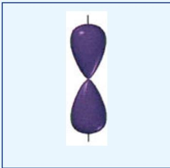</td></tr><tr><td>3</td><td>Trigonal planar</td><td> $sp^2$ </td><td>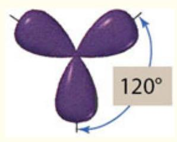</td></tr><tr><td>4</td><td>Tetrahedral</td><td> $sp^3$ </td><td>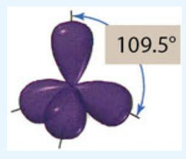</td></tr><tr><td>5</td><td>Trigonal bipyramidal</td><td> $sp^{3}d$ </td><td>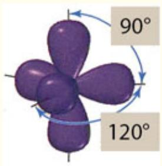</td></tr><tr><td>6</td><td>Octahedral</td><td> $sp^{3}d^{2}$ </td><td>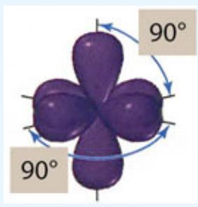</td></tr></table>

## Molecular Orbital Theory and Electron Delocalization

Modern research in chemistry and physics and modern devices that emerge from this research are increasingly dependent on a more detailed picture of molecular bonding. In particular, breakthroughs in chemistry and physics require an understanding of how photons interact with electrons in molecular structures, how magnetic properties of materials can be modified to suit particular objectives, and how electron conduction in both organic and inorganic structures can be manipulated. All of this requires an increasing degree of sophistication in models of chemical bonding and thus of molecular structure.

A key conceptual foundation that underpins the development of more sophisticated models of chemical bonding is that electrons, when given the opportunity, will employ the full spatial dimension of a molecular structure to spread out over, or to delocalize within, in an effort to minimize the potential energy of the ensemble of electrons and nuclei. It is this tendency of electrons to delocalize from the confinement of atomic orbitals to the geometrical flexibility of extended molecular orbitals that sets the stage for the molecular orbital (MO) class of bonding theories. This is in stark contrast to VB theory, which we have seen is successful, but confines electrons to atomic orbitals, only allowing them the ability to mix specific orbitals to form hybrid orbitals.

We saw that the solution to the Schrödinger equation for atomic structure yielded the complete wavefunction for multielectron system with a single nucleus. There is no limitation intrinsic to the Schrödinger equation preventing a full solution for multielectron/multinucleus systems. Thus, when the Schrödinger equation is solved for a molecule, a molecular orbital results, with the electrons delocalized in whatever configuration yields the structure with the lowest potential energy given the constraint that no two electrons share the same set of quantum numbers.

Before we develop this new molecular orbital approach to bonding, we review three characteristics of electron waves:

1. Electrons exhibit wave properties that under confinement of a nucleus yield standing wave solutions to the Schrödinger equation and electrons seek to minimize the energy of their configuration. Therefore, the waves associated with multiple electrons will add the amplitude and phase of their wavefunctions within their spatial proximity, while obeying the Pauli Exclusion Principle such as to minimize the energy of the combined ensemble of electrons and nuclei.

2. Adding the wavefunctions of the individual electrons together constructively yields a region of higher electron density between the nuclei in a molecular structure. This can create a bonding molecular orbital distributed across two or more nuclei.

3. Subtracting wavefunctions of individual electrons results in the destructive interference of two wavefunctions that can reduce the electron density between two nuclei in a molecular structure resulting in a nonbonding molecular orbital distributed across two or more nuclei.

The specifics of how wavefunctions attributed to individual atoms combine to form wavefunctions of a molecule bears some careful consideration. We must add two waves (or wavefunctions) by correctly combining both the amplitude and phase of those individual waves to find the resulting multielectron wavefunction of the molecule. The electron density, proportional to the square of the resulting wavefunction, is what controls the forces and thus the potential energy surface that defines the strength and character of a chemical bond.

To this end we consider carefully the addition of two atomic wavefunctions to create a molecular orbital by exploring ways that we can add the wavefunctions of two hydrogen atoms to form the $\mathrm { H } _ { 2 }$ molecule. While this represents a simple case, it engages a large fraction of the key concepts involved in molecular orbital (MO) development.

We begin with a hydrogen atomic wavefunction $\Psi _ { \mathrm { { A } } }$ for atom A and a wavefunction $\boldsymbol { \Psi _ { \mathrm { B } } }$ for atom B, which, at large internuclear distance do not interact. We can sketch this condition as shown in Figure 11.35. The diagram sketches the radial wavefunction for the 1s orbital of atomic hydrogen for each atom.

:::{figure} ../images/fig-p1-ch11-66.jpg
:name: fig-p1-ch11-66
:alt: FIGURE 11.35 The radial 1s wavefunction of atomic hydrogen at large internuclear distance where no interaction occurs.
FIGURE 11.35 The radial 1s wavefunction of atomic hydrogen at large internuclear distance where no interaction occurs.
:::


As we move these two hydrogen atom atomic orbitals to smaller and smaller internuclear distance, the wavefunction of atom A begins to interact with the wavefunction of atom B. In quantum mechanical language, the wavefunctions of the atoms begin to “mix.” If the waves add constructively we create a domain of partial overlap of the wavefunctions of the two hydrogen atoms and the potential energy of the combined orbitals begins to decrease because the electron in each atom “sees” the $\mathrm { Z _ { e f f } }$ of the other atom which begins to draw the atoms together as shown in Figure 11.36.

:::{figure} ../images/fig-p1-ch11-67.jpg
:name: fig-p1-ch11-67
:alt: FIGURE 11.36 As the internuclear distance begins to decrease, the overlap between the atomic orbitals begins to increase.
FIGURE 11.36 As the internuclear distance begins to decrease, the overlap between the atomic orbitals begins to increase.
:::


As the internuclear distance between the hydrogen atom atomic orbitals decreases, the individual wavefunctions begin to overlap creating, by virtue of the constructive interference between the wavefunctions, an increase in electron density between the two nuclei as shown in Figure 11.37.

:::{figure} ../images/fig-p1-ch11-68.jpg
:name: fig-p1-ch11-68
:alt: FIGURE 11.37 When the internuclear distance of the two hydrogen atoms reaches that of the mathematical notation molecule, the molecular orbital has formed from the combination of two atomic orbitals.
FIGURE 11.37 When the internuclear distance of the two hydrogen atoms reaches that of the ${ \sf H } _ { 2 }$ molecule, the molecular orbital has formed from the combination of two atomic orbitals.
:::


We can assemble Figures 11.35, 11.36, and 11.37 to form a composite figure as a function of potential energy, demonstrating the decrease in potential energy as a function of decreasing internuclear distance. This is displayed in Figure 11.38.

:::{figure} ../images/fig-p1-ch11-69.jpg
:name: fig-p1-ch11-69
:alt: FIGURE 11.38 We can track the energy of the forming molecular orbital (MO) as the internuclear distance decreases carrying the molecular formation from the separated atoms to the fully formed molecular orbital.
FIGURE 11.38 We can track the energy of the forming molecular orbital (MO) as the internuclear distance decreases carrying the molecular formation from the separated atoms to the fully formed molecular orbital.
:::


While in this case the new molecular orbital $\Psi _ { \mathrm { H } _ { 2 } } { = } \Psi _ { \mathrm { A } } { + } \Psi _ { \mathrm { B } }$ is the solution of the Schrödinger equation, the electron density distribution that determines the bond strength is given by the square of the wavefunction such that

```{math}
:label: eq-p1-ch11-28
\left( \begin{array}{l} \text {Probability} \\ \text {of finding} \\ \text {the electron} \\ \text {at any point} \end{array} \right) = \psi_ {\mathrm{H} _ {2}} ^ {2} = \left(\psi_ {\mathrm{A}} + \psi_ {\mathrm{B}}\right) ^ {2} = \psi_ {\mathrm{A}} ^ {2} + \psi_ {\mathrm{B}} ^ {2} + 2 \psi_ {\mathrm{A}} \psi_ {\mathrm{B}}
```


We can represent the electron distribution graphically and display the buildup of electron density between the nuclei as shown in Figure 11.39. Thus the square of the molecular orbital wavefunction is the contribution from the wavefunction of atom A plus the contribution from the wavefunction of atom B plus the term ${ } ^ { 2 \Psi _ { \mathrm { A } } \Psi _ { \mathrm { B } } }$ , which contributes electron density in the domain between the two nuclei.

:::{figure} ../images/fig-p1-ch11-70.jpg
:name: fig-p1-ch11-70
:alt: FIGURE 11.39 The probability of finding the electron in the newly formed molecular orbital is calculated from the square of the sum of the wavefunctions for the two atoms mathematical notation
FIGURE 11.39 The probability of finding the electron in the newly formed molecular orbital is calculated from the square of the sum of the wavefunctions for the two atoms $( \Psi _ { \mathsf { A } } + \Psi _ { \mathsf { B } } ) ^ { 2 } = \Psi _ { \mathsf { A } } { } ^ { 2 } + \Psi _ { \mathsf { B } } { } ^ { 2 } + 2 \Psi _ { \mathsf { A } } \Psi _ { \mathsf { B } } .$
:::


Thus we have the molecular orbital (MO) for molecular hydrogen and this extended domain available to both electrons leads to two effects. First, the electrons become indistinguishable from each other. Second, the fact that the electrons are free to delocalize throughout the full extent of the newly formed molecule serves to lower the potential energy of the ensemble of 2 electrons and 2 protons relative to the two isolated hydrogen atoms. Thus a stable bond is formed, and a new molecular orbital is created. A key point is that this new molecular orbital assumes the same role for the molecule that the atomic orbital played for the atom. Namely it is a solution, in its own right, to the Schrödinger equation that provides (1) a mathematical description of the spatial domain occupied by the electrons, (2) the energy of the electrons in the individual molecular orbitals, and (3) the angular momentum and spin of the electrons in each orbital.

The use of atomic orbitals of the separated atoms to form the molecular orbitals of the molecule formed therefrom is called the “linear combination of atomic orbitals” or LCAO model. The typical designation of the union of molecular orbital (MO) theory with the linear combination of atomic orbitals is the LCAO-MO model. While it is important to recognize exactly how we have combined the two atomic wavefunctions to generate a lower energy molecular wavefunction by the constructive addition of the electron waves, we can simplify our graphical representation of this union by using the diagram in Figure 11.40 that captures the union of the two 1s orbitals of atomic hydrogen to form a molecular orbital of $\mathrm { H } _ { 2 }$ that is cylindrically symmetric about the internuclear axis and add the probability distribution of the 1s orbitals of H to form the bonding MO of $\mathrm { H } _ { 2 } .$ As was the case for the VB orbitals, the MO formed is cylindrically symmetric about the internuclear axis; therefore, the bonding MO of $\mathrm { H } _ { 2 }$ is a σ bond. In addition, because the σ bond MO is formed from two 1s atomic orbitals, the MO is designated a $\sigma _ { \mathrm { 1 s } }$ with the subscript designating the atomic orbitals from which the MO was formed. We can diagram this union of 1s atomic orbitals of H to form the $\sigma _ { \mathrm { 1 s } }$ MO of $\mathrm { H } _ { 2 }$ as shown in Figure 11.40.

:::{figure} ../images/fig-p1-ch11-71.jpg
:name: fig-p1-ch11-71
:alt: FIGURE 11.40 We can summarize the details contained in Figure 11.38 by simplifying the molecular orbital formation from a linear combination of atomic orbitals and displaying that simplification as a molecular orbital diagram as shown here.
FIGURE 11.40 We can summarize the details contained in Figure 11.38 by simplifying the molecular orbital formation from a linear combination of atomic orbitals and displaying that simplification as a molecular orbital diagram as shown here.
:::


## Bonding and Antibonding Orbitals

What is of great importance, however, is that the atomic orbitals $( \mathrm { A O _ { \mathrm { s } } } )$ of hydrogen, because they are waves, can add destructively as well as constructively. That is, we can form an MO by subtracting the wavefunctions of one H atom (atom B) from the wavefunction of the other H atom (atom A). With respect to the radial wavefunction this destructive union of the two atomic orbitals as a function of internuclear distance and energy, the analogous diagram to Figure 11.38 for constructive addition is shown for destructive interference in Figure 11.41.

:::{figure} ../images/fig-p1-ch11-72.jpg
:name: fig-p1-ch11-72
:alt: FIGURE 11.41 The linear combination of atomic orbitals for the destructive addition of 1s atomic orbitals as a function of decreasing internuclear distance between the hydrogen atoms. As the internuclear distance decreases, the energy incre
FIGURE 11.41 The linear combination of atomic orbitals for the destructive addition of 1s atomic orbitals as a function of decreasing internuclear distance between the hydrogen atoms. As the internuclear distance decreases, the energy increases, forming an antibonding molecular orbital.
:::


This figure displays the fact that if we combine, if we mix, two electron wavefunctions destructively, the resultant MO will increase in potential energy with decreasing internuclear distance. This increase in potential energy results from the fact that the electron density, which goes as $( \Psi _ { \mathbf { A } } -$ $\Psi _ { \mathrm { B } } ) ^ { 2 } = \Psi _ { \mathrm { A } } { } ^ { 2 } + \Psi _ { \mathrm { B } } { } ^ { 2 } - 2 \Psi _ { \mathrm { A } } \Psi _ { \mathrm { B } }$ , reduces to zero between the nuclei, thus exposing the Coulomb repulsion of the two nuclei. We can express the probability of finding the electron in the new molecular orbital, $\Psi _ { \mathrm { ~ H } 2 } ^ { ^ { 2 } } = ( \Psi _ { \mathrm { A } } - \Psi _ { \mathrm { B } } ) ^ { 2 } = \Psi _ { \mathrm { A } } ^ { \ 2 } +$ ${ \Psi _ { \mathrm { B } } } ^ { 2 } \mathrm { - } 2 { \Psi _ { \mathrm { A } } } { \Psi _ { \mathrm { B } } }$ , as a function of internuclear distance as shown in Figure 11.42.

:::{figure} ../images/fig-p1-ch11-73.jpg
:name: fig-p1-ch11-73
:alt: FIGURE 11.42 The probability of finding an electron at any position along the internuclear axis for the molecular orbital formed from the destructive combination of atomic orbitals.
FIGURE 11.42 The probability of finding an electron at any position along the internuclear axis for the molecular orbital formed from the destructive combination of atomic orbitals.
:::


Because the energy of this $\mathrm { H } _ { 2 }$ molecular orbital is higher than that of the two separated hydrogen atomic orbitals, we define this new molecular orbital as an antibonding orbital and designate the orbital as a ${ \sigma } _ { 1 \mathrm { s } } ^ { \mathrm { ~ \ast ~ } }$ orbital. As always the σ designates an orbital that is cylindrically symmetric about the internuclear axis, the 1s subscript designates the atomic orbital from which the molecular orbital was constructed, and the asterisk superscript designates the anti bonding character of the molecular orbital.

We can summarize the two ways to combine or mix wavefunctions of two separated hydrogen atoms: either (1) constructive interference leading to an increase in electron density between the two atoms that comprise the molecule and a decrease in potential energy created by the net attraction between the atoms or (2) destructive interference leading to a decrease in electron density between the two atoms and an increase in potential energy created by the net repulsion between the atoms. Constructive interference of the two 1s hydrogen atomic orbitals leads to a bonding $\sigma _ { \mathrm { 1 s } }$ molecular orbital. Destructive interference of the two 1s atomic orbitals leads to an antibonding ${ \sigma _ { 1 \mathrm { s } } } ^ { * }$ molecular orbital. Using our representation of atomic and molecular orbitals that depict the three dimensional configuration of the orbitals as we did in Figure 11.40, but in this case for both the constructive addition and destructive addition of the atomic orbitals, we capture the energy ordering of the union of atomic orbitals to form molecular orbitals in Figure 11.43.

:::{figure} ../images/fig-p1-ch11-74.jpg
:name: fig-p1-ch11-74
:alt: FIGURE 11.43 We can combine the constructive addition of atomic orbitals to form the bonding σ molecular orbital and the destructive addition of atomic orbitals to form the antibonding mathematical notation molecular orbital of mathematical
FIGURE 11.43 We can combine the constructive addition of atomic orbitals to form the bonding σ molecular orbital and the destructive addition of atomic orbitals to form the antibonding $\sigma ^ { \star }$ molecular orbital of ${ \sf H } _ { 2 }$ into a single “molecular orbital diagram” or MO diagram.
:::


Two additional points highlighted in Figure 11.43 deserve careful consideration. First, note that the ${ \sigma _ { 1 \mathrm { s } } } ^ { * }$ antibonding orbital has a plane of zero electron density between the two nuclei. This is referred to as a “nodal plane” and, as we will see, the number of nodal planes in a wavefunction, all else being equal, determines the energy ordering of molecular orbitals. The greater the number of nodal planes the higher the potential energy. Second, the molecular orbital is a wave and thus it has both an amplitude and a phase. It is critically important to keep track of the phase of any electron wave because when any orbital combines with or mixes with another, the resulting wavefunction is created by the interference of those waves.

Once we have fully defined how this combination of bonding and antibonding molecular orbitals are created from the constructive and destructive addition of atomic orbitals respectively, we can now summarize the creation of the molecular orbital of $\mathrm { H } _ { 2 } ,$ in a shorthand diagram representing the energy evolution and energy ordering of the atomic and molecular orbitals in what is generally termed an “MO diagram.” This MO diagram for $\mathrm { H } _ { 2 }$ is displayed in Figure 11.44.

:::{figure} ../images/fig-p1-ch11-75.jpg
:name: fig-p1-ch11-75
:alt: FIGURE 11.44 It is common practice to create the molecular orbital (MO) diagram by creating the molecular orbitals simply as energy ordered boxes with the electron occupation of those boxes explicitly represented as shown here. The shape of
FIGURE 11.44 It is common practice to create the molecular orbital (MO) diagram by creating the molecular orbitals simply as energy ordered boxes with the electron occupation of those boxes explicitly represented as shown here. The shape of the molecular orbital is understood from the bonding, $\sigma ,$ nomenclature and the antibonding, ${ \mathfrak { O } } ^ { { \dot { \star } } }$ , nomenclature and the atomic orbitals from which the molecular orbital was formed appear as a subscript, $\sigma _ { 1 \updownarrow }$ and $\sigma _ { 1 \updownarrow } { ^ \star }$
:::


This raises the question: how are electrons inserted into the newly formed molecular orbitals formed from the linear combination $o f$ atomic orbitals (LCAO)? The answer is that electrons are inserted into MOs just as they were into AOs:

1. MOs are filled in their order of increasing energy.

2. A MO can be occupied by a maximum of two electrons, each with opposite spin—a manifestation of the Pauli Exclusion Principle.

3. When electrons are inserted into MOs of equal energy, the electrons first enter unoccupied MOs before they pair up into the same MO. This is a manifestation of the fact that electrons seek to maximize the distance between themselves in order to minimize the potential energy of the ensemble.

There is one other aspect of Figure 11.44 that is important. Notice that the ${ \sigma _ { 1 \mathrm { s } } } ^ { * }$ antibonding orbital of $\mathrm { H } _ { 2 }$ exists even though it is unoccupied. This simple fact becomes very important when we (1) add or subtract electrons from an MO forming anions or cations, (2) when we mix MOs to form larger molecules, or (3) when we “promote” electrons to a higher orbital with a photon of light. While the very existence of “antibonding” molecular orbitals may seem counterintuitive, as we will see, these antibonding orbitals are actually lower in energy than the bonding orbitals formed from atomic orbitals of the next higher principal quantum number.

This sets the ground work for developing the relationship between three important concepts: (1) the geometry of the formation of the molecular bond from the separated atomic orbitals by considering the probability distribution of electrons about the nuclei as a function of internuclear distance, (2) the evolving molecular orbital diagram that defines the energy splitting between the bonding and antibonding molecular orbitals as a function of internuclear distance, and (3) the potential energy surface for the bonding and antibonding molecular orbitals. Figure 11.45 tracks the evolution of these three facets of molecular bonding at three different internuclear distances.

:::{figure} ../images/fig-p1-ch11-76.jpg
:name: fig-p1-ch11-76
:alt: FIGURE 11.45 The relationship between the molecular orbital diagram (panel A), the probability density of electrons (panel B), and the potential energy surface for bonding and antibonding orbitals (panel C) is displayed as a function of int
FIGURE 11.45 The relationship between the molecular orbital diagram (panel A), the probability density of electrons (panel B), and the potential energy surface for bonding and antibonding orbitals (panel C) is displayed as a function of internuclear distance.
:::


Panel A of Figure 11.45 displays the relationship between the probability distribution of electrons as the internuclear distance decreases from the condition of large separation for which there is no overlap through the condition of marginal overlap leading to the formation of the chemical bond to the final condition of maximum bond strength represented by the equilibrium internuclear distance. Panel B of Figure 11.45 delineates the evolution of the molecular orbital diagram from large internuclear separation (for which there is no interaction of the valence electrons) through intermediate internuclear distance wherein the overlap is developing between the 1s atomic orbitals leading to a separation in energy between the bonding, $\sigma _ { s } ,$ and antibonding, ${ \sigma _ { s } } ^ { * }$ , orbitals. Finally at the equilibrium internuclear distance, the $\sigma _ { s }$ and ${ \sigma _ { s } } ^ { * }$ orbitals achieve their maximum separation and the potential energy reaches its deepest point. Panel C tracks the bonding and antibonding potential energy surfaces from the condition of large separation where the bonding and antibonding potential energy surfaces are of equal energy (i.e. degenerate) because there is no overlap of the atomic orbitals through to the condition of minimum energy of the bonding molecular orbital at the equilibrium internuclear distance.

As more electrons are added with increasing atomic number, the molecular orbital diagram becomes more complicated but the basic relationships defined in Figure 11.45 remain. We turn now to the case of molecular oxygen to develop the LCAO-MO theory for the combination of s and p orbitals.

## Molecular Orbital Structure of Molecular Oxygen

Development of the bonding structure of oxygen from the molecular orbital perspective builds on and uses the concepts developed for $\mathrm { H } _ { 2 } .$ We have developed a perspective defining how the bonding and antibonding orbitals of a molecule are formed from the atomic orbitals of the separated atoms, and how electrons are inserted into the lowest lying molecular orbitals with opposite spin. This insertion of electrons continues until all available electrons are accounted for. We also recognize that the potential energy surface of the bonding orbital has a corresponding bound state (an “electronic state” because it is defined by the orbitals of the electron) and the antibonding orbital has a corresponding repulsive potential energy surface. Armed with this perspective we are now in a position to address the orbital structure of oxygen—the most important molecule in the evolution of life forms on Earth.

First, we recall that p atomic orbitals can be combined in two distinct ways to form molecular orbitals. Namely, the p orbitals can be combined “head-on” along an axis that passes through the nuclei of the two atoms such that the p orbitals combine either constructively or destructively. This is shown explicitly in Figure 11.46. This results in a molecular orbital that is symmetric under rotation (that is it does not change when rotated about the axis linking the nuclei) for either bonding when the p orbitals (the electron waves) are added constructively or antibonding if the p orbitals are added destructively. These molecular orbitals formed from the addition of two 2p orbitals are designated $\sigma _ { \mathrm { { 2 p } } }$ when they are bonding, and $\sigma _ { \mathrm { { 2 p } } } ^ { \mathrm { ~ * ~ } }$ when they are antibonding because they are formed from 2p orbitals of atomic oxygen that are aligned along the x-axis joining the nuclei. While the designation of the x-axis as the internuclear axis is arbitrary, we will use this convention throughout our discussion of MO theory.

:::{figure} ../images/fig-p1-ch11-77.jpg
:name: fig-p1-ch11-77
:alt: FIGURE 11.46 The linear combination of two mathematical notation atomic orbitals overlapped “head on” to form the cylindrically symmetric bonding, mathematical notation , and antibonding, mathematical notation , molecular orbitals. The cons
FIGURE 11.46 The linear combination of two $\mathsf { p _ { x } }$ atomic orbitals overlapped “head on” to form the cylindrically symmetric bonding, $\sigma _ { 2 \rho }$ , and antibonding, $\sigma _ { 2 \rho } ^ { \star }$ , molecular orbitals. The constructive addition of the two 2p orbitals results in the lowering of the energy of the resulting bonding molecular orbital and the destructive addition of the $\mathsf { 2 p }$ orbitals results in the raising of the energy of the antibonding molecular orbital.
:::


But we also know that the p atomic orbitals can be combined to form a molecular orbital by bringing the $\mathrm { p }$ orbitals together perpendicular to the axis of the $p$ orbital lobes to form both a bonding and an antibonding molecular orbital as displayed in Figure 11.47. The side-by-side orientation of the $\mathsf { p } _ { \mathrm { y } }$ orbitals in Figure 11.47 is in sharp contrast to the head on orientation of the $\mathrm { p _ { x } }$ atomic orbitals forming the σ bonding in Figure 11.46. As a consequence of adding the $\mathsf { p } _ { \mathrm { y } }$ orbitals sideways to form the overlap of atomic orbitals that creates the molecular bond, the bonding pattern occurs above and below the internuclear axis.

:::{figure} ../images/fig-p1-ch11-78.jpg
:name: fig-p1-ch11-78
:alt: FIGURE 11.47 The linear combination of two mathematical notation atomic orbitals overlapped side-to-side to form the perpendicular configured mathematical notation bonding molecular orbital and mathematical notation antibonding molecular or
FIGURE 11.47 The linear combination of two $\mathsf { p } _ { \mathsf { y } }$ atomic orbitals overlapped side-to-side to form the perpendicular configured $\pi _ { 2 \rho }$ bonding molecular orbital and $\pi _ { 2 \mathsf { p } } ^ { \star }$ antibonding molecular orbital.
:::


The bonding geometry is termed a $\pi _ { \mathrm { p y } }$ orbital. The Greek π is used to denote a bond structure formed from atomic orbitals perpendicular to the internuclear axis. The antibonding molecular orbital is designated the $\pi _ { \mathrm { ~ p y ~ } } ^ { * }$ molecular orbital. We are now in a position to form molecular orbitals from both s atomic orbitals and p atomic orbitals. However, there is another pair of p orbitals of oxygen that align along the z-axis as shown in Figure $\underline { { 1 1 . 4 8 } }$ These are the bonding $\pi _ { \mathrm { p z } }$ and antibonding $\pi _ { \mathrm { ~ p z ~ } } ^ { * }$ molecular orbitals respectively.

:::{figure} ../images/fig-p1-ch11-79.jpg
:name: fig-p1-ch11-79
:alt: FIGURE 11.48 When the linear combination of two mathematical notation atomic orbitals is taken, the overlap is side-to-side as was the case for the mathematical notation atomic orbitals. The bonding mathematical notation and antibonding mat
FIGURE 11.48 When the linear combination of two ${ \mathsf p } _ { z }$ atomic orbitals is taken, the overlap is side-to-side as was the case for the $\mathsf { p } _ { \mathsf { y } }$ atomic orbitals. The bonding $\Pi _ { \mathfrak { p } z }$ and antibonding $\pi _ { \mathsf { p } z } ^ { \star }$ molecular orbitals are analogous to the $\pi _ { \rho \ y }$ and $\boldsymbol { \pi } _ { \mathsf { p } \mathsf { y } } ^ { \star }$ bonding and antibonding orbitals except they are rotated by $9 0 ^ { \circ }$ about the internuclear axis.
:::


## Molecular Orbital Structure and the Potential Energy Structure

This provides the information needed to connect three important aspects of MO theory together in the same diagram: (1) the geometry of the atomic orbitals as they form the corresponding molecular orbitals with decreasing internuclear distance between the atoms, (2) the molecular orbital diagram that defines the energy ordering and energy spacing of the molecular orbitals as a function of decreasing internuclear distance as the molecular bonds form, and (3) the potential energy surface of bound $\mathrm { O } _ { 2 }$ that defines the binding energy of the molecule as a function of internuclear distance.

Three “snapshots” of the sequence linking these three aspects of molecular orbital theory for three different internuclear distances are shown in Figures 11.49, 11.50, and 11.51. Figure 11.49 displays the molecular orbital geometry, molecular orbital diagram, and potential energy surface corresponding to the case of large separation between the oxygen atoms such that there is zero overlap between the orbitals, no splitting of the molecular orbital energies, and no decrease in the potential energy surface defining the bonding between the two separated oxygen atoms.

:::{figure} ../images/fig-p1-ch11-80.jpg
:name: fig-p1-ch11-80
:alt: FIGURE 11.49 When the orbitals of atomic oxygen, which combine to form the molecular orbitals of mathematical notation are at large internuclear distance, the lack of overlap of the atomic orbitals means that the molecular orbitals have not
FIGURE 11.49 When the orbitals of atomic oxygen, which combine to form the molecular orbitals of $\mathrm { O } _ { 2 } ,$ are at large internuclear distance, the lack of overlap of the atomic orbitals means that the molecular orbitals have not yet formed and therefore there is no splitting between the bonding and antibonding orbitals. Equally important, the potential energy surface that controls the energy of the bond between the oxygen atoms has not dropped in energy so there is not yet any attraction between the atoms.
:::


Figure 11.50 displays the case for decreasing internuclear distance as the atomic orbitals begin to interact. This condition of overlap between the atomic orbitals begins to split the molecular orbitals so formed by decreasing the energy of the bonding orbitals and increasing the energy of the antibonding orbitals. This “splits” the energy levels of the forming molecular bond with the $\sigma _ { \mathrm { { 2 p } } }$ bonding orbital being lowest in energy because of the greater overlap between the $\mathrm { p _ { x } }$ atomic orbitals aligned along the internuclear axis. The $\sigma _ { \mathrm { { 2 p } } } ^ { \mathrm { ~ * ~ } }$ antibonding overlap is higher in energy because of the large repulsion that results from the large overlap of the $\mathrm { p _ { x } }$ orbitals combined with the absence of electron density between the two nuclei. The evolving potential energy surface of $\mathrm { O } _ { 2 }$ corresponds to the point on the surface representing the decrease in energy relative to the interactive energy at large internuclear distance. This decrease in energy of the potential energy surface represents the binding energy of the $\mathrm { O } _ { 2 }$ bond at that internuclear distance.

:::{figure} ../images/fig-p1-ch11-81.jpg
:name: fig-p1-ch11-81
:alt: FIGURE 11.50 When the orbitals of atomic oxygen, which combine to form the molecular orbitals of mathematical notation approach to a distance such that the overlap of the atomic orbitals begins to develop, the molecular orbital energies beg
FIGURE 11.50 When the orbitals of atomic oxygen, which combine to form the molecular orbitals of $\mathrm { O } _ { 2 } ,$ approach to a distance such that the overlap of the atomic orbitals begins to develop, the molecular orbital energies begin to split between the bonding and antibonding orbitals. The potential energy surface that controls the energy of the bond between the oxygen atoms begins to drop in energy so that attraction between the atoms begins to increase.
:::


Figure 11.51 displays the molecular orbital geometric configuration when the internuclear distance has decreased to the position of maximum splitting between the bonding orbitals with respect to their (“unsplit”) energies at large internuclear distance. At this point, the bond has reached its maximum strength represented by the maximum depth of the potential energy well of the molecule's potential energy surface. Note that the splitting of the $\sigma _ { s }$ and ${ \sigma _ { s } } ^ { * }$ orbitals formed from the mixing of the 2s atomic orbitals of the separated oxygen atoms is small because the greater extension of the $\mathrm { p _ { x } }$ orbitals prevents any significant overlap of the 2s orbitals.

:::{figure} ../images/fig-p1-ch11-82.jpg
:name: fig-p1-ch11-82
:alt: FIGURE 11.51 When the distance between the oxygen atoms reaches the equilibrium internuclear distance of the mathematical notation molecule, the splitting between the bonding and antibonding orbitals reaches a maximum and the depth of the p
FIGURE 11.51 When the distance between the oxygen atoms reaches the equilibrium internuclear distance of the ${ \sf O } _ { 2 }$ molecule, the splitting between the bonding and antibonding orbitals reaches a maximum and the depth of the potential energy well reaches a maximum. At that point the σ and π bonds are fully formed.
:::


Development of MO theory for $\mathrm { H } _ { 2 }$ and for $\mathrm { O } _ { 2 }$ establishes the essential concepts in MO theory wherein we have formed those molecular orbitals by a simple adding together or “mixing” of atomic orbitals; the so called linear combination of atomic orbitals-molecular orbital (LCAO-MO) theory. It is important to recognize that we need not be constrained or restricted to using those explicit mathematical functions, the wavefunctions for the isolated atoms. We can use any mathematical function we choose that can be optimized in the molecular structure to minimize the potential energy of the ensemble of electrons and nuclei in the molecular structure. It just happens that to a greater or lesser degree, depending on the molecule, the atomic wavefunctions are a good (sometimes very good) first approximation that can be successfully mixed, added together constructively or destructively, to yield the resulting molecular orbitals.

Given this discussion of the molecular orbitals of $\mathrm { H } _ { 2 }$ and of $\mathrm { O } _ { 2 } ,$ we are in a position to quickly work our way through the Period 2 diatomic molecules formed from the same two atoms in each case: the homonuclear diatomic $\operatorname { L i } _ { 2 }$ $\mathrm { B e _ { 2 } , C _ { 2 } , N _ { 2 } , O _ { 2 } , F _ { 2 } , }$ and $\mathrm { N e } _ { 2 } .$

As we move through the Period 2 homonuclear cases, we will employ the basic tenets of the LCAO-MO theory:

Molecular orbitals are constructed by adding together, by mixing, combinations of atomic orbitals. The number of MOs generated from a selected set of AO will always equal the number of AOs in the set.

The atomic orbitals must be added constructively or destructively to establish the full array of molecular orbitals available to the molecule. The MOs formed from constructively added AOs will form bonding MOs. The MOs formed from the destructive addition of AOs will form antibonding MOs.

Although the complete set of bonding MOs and antibonding MOs will in most cases provide more orbitals than there are available electrons to fill them when electrons are assigned to the MOs the electrons are inserted into the lowest energy MOs first with a maximum of two electrons, paired with opposite spins, assigned for each MO.

Electrons entering MOs that are of equal energy will enter empty orbitals before pairing up with electrons of opposite spin in the same MO. This follows Hund's rule, which reflects the fact that electrons in separate MOs are at greater distance than electrons confined to the same MO.

The only electrons considered in the creation of a molecular orbital from atomic orbitals are the valence shell electrons of the atoms. Inner shell electrons are ignored as they are too tightly bound to engage in bonding.

Finally, the bond order in a diatomic molecule is calculated for an MO configuration by simply subtracting the number of electrons in antibonding orbitals from the number of electrons in bonding orbitals divided by 2.

Notice before we assemble the MO configuration of the Period 2 homonuclear molecules, that MO theory brings new insight to bonding because:

1. We are keeping track of specific electrons in specific MOs.

2. Each electron that enters a bonding molecule orbital strengthens the molecular bond; each electron that enters an antibonding weakens or destabilizes the molecular bond.

3. For each electron configuration in the available MOs, there is a corresponding potential energy surface representing the ensemble of electrons and nuclei in the molecular structure.

## Molecular Orbital Structure of Homonuclear Diatomics

We proceed to construct the MOs of the diatomic molecules formed from the elements in the second Period of the periodic table. In our development of the MO bonding structure for $\mathrm { O } _ { 2 } ,$ we have introduced the ${ \sigma } _ { \mathrm { 2 s } } , { \sigma } _ { \mathrm { 2 s } } { } ^ { \ast } , { \pi } _ { \mathrm { 2 p } } ,$ and $\pi _ { 2 \mathrm { p } } ^ { \mathrm { ~ ~ \ast ~ } }$ MO structures constructed respectively from the atomic orbitals with principal quantum number n=2 and for angular momentum subshells s and p. We have also developed arguments for the energy ordering of those MOs for molecular hydrogen and for molecular oxygen.

In particular, for $\mathrm { H } _ { 2 }$ we demonstrated that the MO ordering was $\sigma _ { \mathrm { 1 s } }$ as the most stable, lowest energy orbital and that ${ \sigma _ { 1 \mathrm { s } } } ^ { * }$ was the higher energy orbital such that the two available electrons entered the $\sigma _ { \mathrm { 1 s } }$ MO and the ${ \sigma _ { 1 \mathrm { s } } } ^ { * }$ molecular orbital was empty. The bond order for $\mathrm { H } _ { 2 }$ is thus $\mathbf { 1 } / 2 { \bigl ( } 2 - 0 { \bigr ) } = \mathbf { 1 }$

The first two homonuclear diatomics in Period 2 are $\operatorname { L i } _ { 2 }$ and $\mathbf { B e } _ { 2 }$ . We consider only the valence electrons of the atoms when constructing the MOs so we construct the appropriate MOs from the two 2s atomic orbitals in each case to create the $\sigma _ { 2 \mathrm { s } }$ bonding orbital and $\sigma _ { 2 \mathrm { s } } ^ { \mathrm { ~ \ast ~ } }$ antibonding orbital in exact analogy with $\mathrm { H } _ { 2 } .$ . For $\operatorname { L i } _ { 2 }$ we have a 2s electron from one Li atom and a 2s electron from the other Li atom so the two electrons enter the bonding $\sigma _ { 2 \mathrm { s } }$ orbital as shown in Figure 11.52. Thus $\operatorname { L i } _ { 2 }$ has a bond order of $\mathbf { 1 } / 2 \ \left( \mathbf { 2 } \mathbf { - } \mathbf { 0 } \right) = \mathbf { 1 }$ and is a stable molecular configuration.

:::{figure} ../images/fig-p1-ch11-83.jpg
:name: fig-p1-ch11-83
:alt: FIGURE 11.52 The MO diagram for the homonuclear diatomic molecule mathematical notation
FIGURE 11.52 The MO diagram for the homonuclear diatomic molecule $\mathsf { L i } _ { 2 } .$
:::


For $\mathrm { B e } _ { 2 } ,$ we have exactly the same MO diagram, but in this case we have a total of $4$ electrons two 2s electrons from each Be atom. The $\mathbf { B e } _ { 2 }$ molecule has a bond order of $1 / 2 \ \left( 2 \mathrm { ~ - ~ } 2 \right) = 0$ . Thus MO theory predicts that $\mathbf { B e } _ { 2 }$ is unstable. Indeed it is not observed in nature. Figure 11.53 displays the MO diagram for $\mathrm { B e } _ { 2 } .$

:::{figure} ../images/fig-p1-ch11-84.jpg
:name: fig-p1-ch11-84
:alt: FIGURE 11.53 The MO diagram for the homonuclear diatomic molecule mathematical notation which, because it has an equal number of bonding and antibonding electrons, does not form a stable molecular bond. Thus the mathematical notation molecu
FIGURE 11.53 The MO diagram for the homonuclear diatomic molecule ${ \mathsf { B } } { \mathsf { e } } _ { 2 }$ which, because it has an equal number of bonding and antibonding electrons, does not form a stable molecular bond. Thus the ${ \mathsf { B } } { \mathsf { e } } _ { 2 }$ molecule does not exist in nature.
:::


For oxygen, the energy ordering of the MOs, developed in the previous section, is reviewed in Figure 11.54. As that figure indicates, the energy ordering of MOs for $\mathrm { F } _ { 2 }$ and $\mathrm { N e } _ { 2 }$ is the same as for $\mathrm { O } _ { 2 } .$ . Once we have constructed the MO diagram we simply insert the total number of electrons in the MOs until we have accounted for all valence electrons. Molecular oxygen has $2 \times 6 = 1 2$ valence electrons and a bond order of $1 / 2 \ ( 8 - 4 ) = 2$ Molecular fluorine has $2 \times 7 = 1 4$ valence electrons and a bond order of $1 / 2$ (8 $- 6 ) = 1 . \mathrm { N e _ { 2 } }$ has $2 \times 8 = 1 6$ valence electrons and a bond order of $^ { 1 / 2 } \left( 8 - 8 \right) =$ 0. Thus $\mathrm { N e } _ { 2 }$ is unstable and no bond forms.

:::{figure} ../images/fig-p1-ch11-85.jpg
:name: fig-p1-ch11-85
:alt: FIGURE 11.54 The energy ordering of the MOs of mathematical notation , and mathematical notation . The greater overlap inherent in the head on combination of p orbitals to form the mathematical notation MO places that MO lower in energy tha
FIGURE 11.54 The energy ordering of the MOs of $\mathsf { O } _ { 2 } , \mathsf { F } _ { 2 }$ , and ${ \mathsf { N e } } _ { 2 }$ . The greater overlap inherent in the head on combination of p orbitals to form the $\sigma _ { 2 \rho }$ MO places that MO lower in energy than the $\pi _ { 2 \rho } \mathsf { M O } .$
:::


Turning to the final three homonuclear diatomics in Period 2, we have $\mathbf { B } _ { 2 } ,$ $\mathrm { C } _ { 2 } ,$ and $\mathrm { N } _ { 2 } .$ . It would seem to be a straight forward matter. We would simply count the total number of valence electrons in $\mathbf { B _ { 2 } } , \mathbf { C _ { 2 } } ,$ and $\mathrm { N } _ { 2 } ~ ( 6 , 8 $ , and 10 electrons respectively) and then insert them into the MO energy ordering that we used for $\mathrm { ~ O _ { 2 } , ~ F _ { 2 } }$ and $\mathrm { N e } _ { 2 }$ in Figure 11.54. However, there is a complication. Experimental evidence has shown that the $\sigma _ { \mathrm { { 2 p } } }$ MO is higher in energy than the $\pi _ { \mathrm { { 2 p } } }$ orbital in $\mathbf { B } _ { 2 } , \mathbf { C } _ { 2 } ,$ , and $\mathrm { N } _ { 2 }$ and thus the energy ordering of the MOs for these three diatomics is $\mathrm { { \bf O } _ { 2 \mathrm { s } } , \mathrm { { \bf ~ O } _ { 2 \mathrm { s } } } ^ { * } , \mathrm { { \boldsymbol ~ \pi } _ { 2 \mathrm { p } } , \mathrm { { \bf ~ O } _ { 2 \mathrm { p } } , \mathrm { { \boldsymbol ~ \pi } _ { 2 \mathrm { p } } } ^ { * } } } }$ , and $\sigma _ { \mathrm { 2 p } } ^ { \mathrm { ~ * ~ } }$ rather than the $\mathrm { { \sigma _ { 2 s } } , \mathrm { { \sigma _ { 2 s } } ^ { * } , \mathrm { { \sigma _ { 2 p } } , \mathrm { { \pi _ { 2 p } } , \mathrm { { \pi _ { 2 p } } ^ { * } } } } } }$ , and $\sigma _ { \mathrm { { 2 p } } } ^ { \mathrm { ~ * ~ } }$ ordering appropriate for $\mathrm { O } _ { 2 } , \mathrm { F } _ { 2 } ,$ and Ne . Thus we sequentially insert the 16 electrons of ${ \bf B } _ { 2 }$ into the MO diagram with the proper energy ordering as shown in Figure 11.55, then proceed with the insertion of the 18 electrons of $\mathrm { C } _ { 2 }$ and the 10 electrons of $\mathbf { N } _ { 2 }$ into that same MO ordering diagram. The bond orders are 1, 2, and 3 respectively. The bond energies of $\mathbf { B } _ { 2 } , \mathbf { C } _ { 2 }$ and $\mathrm { N } _ { 2 }$ are 290, 620, and 649 kJ/mole respectively and the bond lengths are 159, 131, and 110 pm respectively.

:::{figure} ../images/fig-p1-ch11-86.jpg
:name: fig-p1-ch11-86
:alt: FIGURE 11.55 Mixing of the atomic orbitals that form the MOs in mathematical notation , and mathematical notation create an inversion in energy ordering such that the mathematical notation orbital lies at lower energy than the mathematical
FIGURE 11.55 Mixing of the atomic orbitals that form the MOs in $\mathsf { B } _ { 2 } , \mathsf { C } _ { 2 }$ , and $\mathsf { N } _ { 2 }$ create an inversion in energy ordering such that the $\pi _ { 2 \rho }$ orbital lies at lower energy than the $\sigma _ { 2 \rho }$
:::


The interesting question, of course, is why is the energy ordering of the $\sigma _ { \mathrm { { 2 p } } }$ and $\pi _ { \mathrm { { 2 p } } }$ MOs inverted from that of the $\mathrm { O } _ { 2 } , \mathrm { F } _ { 2 } ,$ and $\mathrm { N e } _ { 2 }$ case? The answer stems from the fact that electrons will do whatever is necessary to lower the potential energy of the ensemble of electrons and nuclei that constitute a given molecular structure. In order to explain the difference in energy ordering of MOs in $\mathbf { B } _ { 2 } , \mathbf { C } _ { 2 } ,$ , and $\mathrm { N } _ { 2 } ,$ we need to reexamine how we created the MOs from the AOs. In particular a fundamental assumption of the LCAO-MO theory is that, to create an MO, we simply add pairwise the s and p orbitals of the $2 ^ { \mathrm { n d } }$ period elements to form the homonuclear diatomics. That is specifically what Figures 11.52, 11.53, and 11.54 demonstrate. However, as we have seen from our treatment of hybrid orbitals, if atomic orbitals lie close to one another in energy and they have favorable overlap geometry, they will mix together and, in so doing, the resulting wavefunction leads to a lowering of the potential energy of that structure. In the case of $\mathbf { B } _ { 2 } , \mathbf { C } _ { 2 } ,$ and $\mathrm { N } _ { 2 } ,$ 2s and 2p orbitals mix to create the MOs of the combined molecule. If we had at our disposal a full computer calculation we would see the mixed character of 2s and ${ 2 \mathrm { p } _ { \mathrm { x } } }$ atomic orbitals along the internuclear axis that forms the σ bond. What differentiates LCAO-MO theory from the more general MO theory is the simple pair-wise addition of atomic orbitals, a simplification that is easily eliminated in computer based electron structure calculations that allow s-p mixing of the atomic orbitals that constitute the basis for the computer based molecular orbital calculations. For our purposes here, it is important to realize that s-p mixing can affect the energy ordering of the σ and π MOs of the molecule, that s-p mixing is significant in $\mathbf { B } _ { 2 } , \mathbf { C } _ { 2 } ,$ and $\mathrm { N } _ { 2 } ,$ and that s-p mixing is not significant in $\mathrm { O } _ { 2 } , \mathrm { F } _ { 2 } ,$ and $\mathrm { N e } _ { 2 }$ as shown in Figure 11.55.

## Molecular Orbital Structure of Heteronuclear Molecules

When we combine the atomic orbitals of two identical atoms, the energies of the valence atomic orbitals are identical; for example in the Period 2 homonuclear examples the 2s orbitals of one of the atoms is equal in energy to that of the other 2s orbital as are the 2p orbitals of equal energy. However, when we combine the atoms of different elements, we must contend with the fact that atoms with different effective nuclear charge, $Z _ { \mathrm { e f f } } ,$ possess differing abilities to draw electronic charge toward them. An atom with a larger $\mathrm { Z _ { e f f } }$ will exert a greater Coulomb attraction on any electronic charge distribution in its vicinity and thus the corresponding valence atomic orbital will be of lower potential energy than an atom with a smaller $\mathrm { Z _ { e f f } . }$ If we consider the Period 2 elements, this serves to shift the 2s and 2p atomic orbitals of atoms with a higher $\mathrm { Z _ { e f f } }$ downward in a MO diagram relative to an atom with a small $\mathrm { Z _ { e f f } } .$ Considering again our Period 2 elements, if we plot $\mathrm { Z _ { e f f } }$ vs. atomic number we recall the pattern as reviewed here in Figure 11.56.

:::{figure} ../images/fig-p1-ch11-87.jpg
:name: fig-p1-ch11-87
:alt: FIGURE 11.56 The effective nuclear charge, mathematical notation increases with atomic number from lithium to neon.
FIGURE 11.56 The effective nuclear charge, $Z _ { \mathrm { e f f } } ,$ increases with atomic number from lithium to neon.
:::


If we consider carbon monoxide, CO, the $\mathrm { Z _ { e f f } }$ for O atoms is larger than $\mathrm { Z _ { e f f } }$ for C atoms so the atomic orbitals of oxygen are at a lower energy than the atomic orbitals of carbon. In addition, the s-p mixing in carbon is such that the energy ordering of the MOs is the same as that for diatomic carbon. Thus we have an MO diagram for CO shown in Figure 11.57.

:::{figure} ../images/fig-p1-ch11-88.jpg
:name: fig-p1-ch11-88
:alt: FIGURE 11.57 The atomic orbitals of oxygen lie at somewhat lower energy than those of carbon so, when the MOs are formed from the atomic orbitals of carbon and oxygen, electron density is drawn to the lower energy (more electronegative) ato
FIGURE 11.57 The atomic orbitals of oxygen lie at somewhat lower energy than those of carbon so, when the MOs are formed from the atomic orbitals of carbon and oxygen, electron density is drawn to the lower energy (more electronegative) atom. The energy ordering of the bonding MOs is the same as that for $\mathsf { C } _ { 2 }$
:::


Nitric oxide is one of the most important molecules in nature. It plays a significant role in biological systems as a “signaling molecule”—it is released by one system in the human body to trigger a reaction in another system of the human body. For example the inner lining of blood vessels use nitric oxide to signal the surrounding smooth muscle to relax, resulting in increased blood flow. As we will see in the MO diagram of NO, nitric oxide has an unpaired electron in its valence shell and is thus very reactive as it seeks to form an electron pair bond with any molecule with which it collides. NO has a lifetime in human systems of a few seconds, but because it is small, it diffuses easily across membranes.

Nitric oxide is also critically important to air pollution in urban centers where it is central to the photochemical production of ozone, and in the destruction of ozone in the Earth's stratosphere. At ground level, NO is produced in high temperature combustion processes such as in gasoline and diesel engines. At high temperature (> 1300 K), $\mathrm { N } _ { 2 }$ and $\mathrm { O } _ { 2 }$ are chemically broken apart to form N and O atoms that react to form NO. In the stratosphere, NO reacts with ozone, $\mathrm { { O } } _ { 3 } ,$ to form $\mathrm { N O } _ { 2 }$ and $\mathrm { O } _ { 2 } .$ . The $\mathrm { N O } _ { 2 }$ then reacts with atomic oxygen to reform NO. The net result is to convert ozone to molecular oxygen, which can, in the stratosphere, lead to net ozone destruction through the reaction sequence:

```{math}
:label: eq-p1-ch11-29
\begin{array}{r l} & \mathrm {NO+ O_ {3} \longrightarrow NO_ {2} + O_ {2}} \\ & \mathrm {NO_ {2} + O\longrightarrow NO+ O_ {2}} \\ \text { Net: } & \mathrm {O_ {3} + O\longrightarrow O_ {2} + O_ {2}} \end{array}
```


Atomic nitrogen has a $\mathrm { Z _ { e f f } }$ slightly less than that for atomic oxygen so the energy of the atomic orbitals of N are somewhat higher in energy than the corresponding atomic orbitals of O. The energy ordering of the molecular orbitals of O have the same ordering as that for CO and are shown in Figure 11.58.

:::{figure} ../images/fig-p1-ch11-89.jpg
:name: fig-p1-ch11-89
:alt: FIGURE 11.58 The atomic orbitals for oxygen lie at somewhat lower energy than the atomic orbitals of nitrogen. The MO ordering is the same as that for mathematical notation , and CO.
FIGURE 11.58 The atomic orbitals for oxygen lie at somewhat lower energy than the atomic orbitals of nitrogen. The MO ordering is the same as that for $\mathsf C _ { 2 } , \mathsf N _ { 2 } ,$ , and CO.
:::


Another important example involves the MO structure of two atoms with very different atomic orbital energies. For example, the fluorine atom has a far greater $\mathrm { Z _ { e f f } }$ than does atomic hydrogen such that the 2p atomic orbitals of fluorine lie at much lower energy than the 1s orbital of hydrogen. This large energy difference between the 1s and 2p atomic orbitals, shown in the MO diagram of HF in Figure 11.59, results in the lack of mixing between the $\mathrm { p _ { x } }$ and $\mathsf { p } _ { \mathrm { y } }$ orbitals of fluorine and the formation of only the $\sigma$ bonding MO between the 1s orbital of H and the 2p orbital of F. This underscores the fact that in order for two orbitals to mix, they must both overlap spatially and be of similar energy.

:::{figure} ../images/fig-p1-ch11-90.jpg
:name: fig-p1-ch11-90
:alt: FIGURE 11.59 The atomic orbitals of fluorine lie far below the atomic hydrogen orbitals in energy. The hydrogen 1s orbital creates a σ MO with unpaired 2p orbital of fluorine.
FIGURE 11.59 The atomic orbitals of fluorine lie far below the atomic hydrogen orbitals in energy. The hydrogen 1s orbital creates a σ MO with unpaired 2p orbital of fluorine.
:::


## Molecular Orbital Theory Applied to Benzene: The Central Role of Delocalization

As we have witnessed, the LCAO-MO theory opened important doors into the workings of molecular bonding. With MO theory we can now explicitly identify which electrons go into which orbitals in the assembled molecules, we can understand the magnetic properties of molecules, we can identify the geometry of specific molecular orbital types such as σ and π bonds and we can link the bonding and antibonding MOs to the potential energy surface of the molecule itself. We also recognize that the lingering attachment to the explicit geometrical form of the atomic orbitals that are added to form the MOs restrict the ability of the resulting MOs to fully exploit the degree of delocalization of electron density throughout the full architectural form of the molecule. We have built the molecular orbitals from bricks shaped like atomic orbitals, but electrons have a remarkable propensity to flow into whatever geometric form serves to lower the potential energy of the ensemble. This does not represent a shortcoming of the Schrödinger equation, it simply represents the limitation of sticking too closely to the spatial confinement of the atomic orbitals when building the molecular structure—a simplification that results directly from the LCAO model.

If we drop the LCAO restriction and treat a molecule as an ensemble of electrons and nuclei and solve the Schrödinger equation without bias toward specific atomic orbital geometries, the result is a true molecular orbital theory. From the Schrödinger equation will emerge molecular orbitals for the entire structure and we then fill those MOs according to the Pauli exclusion principle and Hund's rules. A state-of-the-art calculation of the molecular orbital structure of benzene is a case in point, as shown in Figure 11.60.

:::{figure} ../images/fig-p1-ch11-91.jpg
:name: fig-p1-ch11-91
:alt: FIGURE 11.60 Electrons in benzene as obtained by modern quantum mechanical computational methods: distribution of the valence electrons on the plane of the molecule; the colors indicate the concentration of electrons (the vertical bar on th
FIGURE 11.60 Electrons in benzene as obtained by modern quantum mechanical computational methods: distribution of the valence electrons on the plane of the molecule; the colors indicate the concentration of electrons (the vertical bar on the right gives the values of electron density for each color).
:::


Benzene is a molecule of great importance to modern chemistry and it is a molecule in possession of remarkable stability due to its unique bonding structure. For our purposes here, however, it serves as a unifying entity that links together all of our molecular bonding models.

This one-bond-at-a-time treatment of multiatom electronic structures works remarkably well. Far better in fact than we might well expect. There are, however, clear examples demonstrating the limitations to this electron pair bond-by-bond picture. There are examples of molecules for which electron density is uniformly distributed over the entire molecule—such an example is benzene. Is there any vestige of our VB or MO picture in such a molecule?

Experiments have demonstrated that benzene, $\mathrm { C _ { 6 } H _ { 6 } } ,$ is a planar molecule with a remarkable hexagonal geometry set in place by a backbone of carbon atoms. All carbon-carbon bonds are equal length (140 pm) and the C-C-C bond angle in each case is 120°. Valence bond theory guides an important initial assessment of the structure of benzene. The framework of the carbon backbone is comprised of a σ bonded structure that is a network of $\mathrm { \tt S p } ^ { 2 } - \mathrm { \tt S p } ^ { 2 }$ hybrid orbitals as shown in Figure 11.61A. But the unhybridized p orbitals of carbon protrude perpendicular to the plane of the σ bonding structure as displayed in Figure 11.61B.

Constrained by the sp<sup>2</sup> hybrid orbital structure, each carbon atom contributes 3 electrons to the formation of the σ bonds—one electron each to the adjoining carbons and the third electron to the hydrogen atom bonded into the carbon backbone as shown in the upper panel of Figure 11.61.

Benzene's σ-bond backbone

:::{figure} ../images/fig-p1-ch11-92.jpg
:name: fig-p1-ch11-92
:alt: Figure from the University Chemistry source textbook
:::

The 2p carbon orbitals available for π bonding

:::{figure} ../images/fig-p1-ch11-93.jpg
:name: fig-p1-ch11-93
:alt: Figure from the University Chemistry source textbook
:::

Symbol for benzene

:::{figure} ../images/fig-p1-ch11-94.jpg
:name: fig-p1-ch11-94
:alt: FIGURE 11.61 The structure of benzene is constructed from a backbone of sp2 hybridized carbon-carbon bonds in a ring with the 2p orbitals of carbon forming a π bonding structure.
FIGURE 11.61 The structure of benzene is constructed from a backbone of sp<sup>2</sup> hybridized carbon-carbon bonds in a ring with the 2p orbitals of carbon forming a π bonding structure.
:::


Now things become interesting when we consider the bonding structure resulting from the unhybridized p orbitals that lie perpendicular to the plane of the molecule. The unhybridized p orbitals are clearly situated for π molecular bonding, and when we link them we immediately see that there are two equivalent structures that constitute a resonance structure, which we saw in Chapter 10 for ozone, nitrates, etc. This is displayed in Figure 11.62.

:::{figure} ../images/fig-p1-ch11-95.jpg
:name: fig-p1-ch11-95
:alt: FIGURE 11.62 The π bonding structure in benzene is a resonance structure such that the electrons in the π bonding structure delocalize in a ring forming the cyclic structure of benzene.
FIGURE 11.62 The π bonding structure in benzene is a resonance structure such that the electrons in the π bonding structure delocalize in a ring forming the cyclic structure of benzene.
:::


So how do we couple this idea of a resonance structure with the molecular orbital picture of molecular bonding? The first point to emphasize is that the picture of having to choose between either a double bond or a single bond is a manifestation of the concept of a localized bond: a one-bond-at-a-time treatment of molecular structure. The second point is that we have six p orbitals, and if we combine them all, we will have six π molecular orbitals. Each of the p orbitals has one electron, so we insert these six electrons into the lowest energy orbitals first, inserting them sequentially into the energyordered MOs that result. The MOs for benzene as viewed from the top are displayed in Figure 11.63. The lowest energy MO is the delocalized π system that rings the molecule. Next higher in energy lie two π bonding orbitals shown in Figure 11.63 that are of equal energy. Each of these three π bonding orbitals contains two electrons such that all bonding orbitals are filled. Thus one full σ bond plus approximately half the normal π overlap holds together each pair of carbons as the π electrons delocalize in a continuous ring encompassing the carbon atoms in the backbone of the benzene molecular structure.

:::{figure} ../images/fig-p1-ch11-96.jpg
:name: fig-p1-ch11-96
:alt: FIGURE 11.63 The MOs formed from the atomic orbitals of carbon are delocalized around the benzene ring as shown for both the bonding MOs. Only the bonding MOs are occupied.
FIGURE 11.63 The MOs formed from the atomic orbitals of carbon are delocalized around the benzene ring as shown for both the bonding MOs. Only the bonding MOs are occupied.
:::


The antibonding π orbitals exist and are shown in the upper panel of Figure 11.63. Note that the antibonding orbitals have alternating phases around the benzene carbon ring and thus there are nodes between the carbon atoms thereby decreasing electron density and increasing the potential energy of the structure. None of the antibonding orbitals are filled.

Once we have diagrammed the MO of benzene from the top, we can make sense of the full MO computer calculations of the actual shape and phase of the π bonding structure that is shown in Figure 11.64. It is typically this computer generated MO picture of molecules that is displayed in the scientific literature.

:::{figure} ../images/fig-p1-ch11-97.jpg
:name: fig-p1-ch11-97
:alt: FIGURE 11.64 The π bonding states and mathematical notation antibonding states of benzene: each state is represented by its wavefunction as colored clouds (red clouds are negative values, blue clouds are positive values) and its energy as a
FIGURE 11.64 The π bonding states and $\pi ^ { \star }$ antibonding states of benzene: each state is represented by its wavefunction as colored clouds (red clouds are negative values, blue clouds are positive values) and its energy as a horizontal bar. The bonding states $( \pmb { \Pi } _ { 1 } , \pmb { \Pi } _ { 2 } , \pmb { \Pi } _ { 3 } )$ are occupied by two electrons each (with up and down spins), while the antibonding states $( \pi _ { 4 } , \pi _ { 5 } , \pi _ { 6 } )$ are unoccupied. The occupied and unoccupied states are separated by the long, grey horizontal line, the Fermi level.
:::


## 1. Formation of a Molecular Bond from Atomic Orbitals

When we address quantitatively how molecules are constructed from the combination of atomic orbitals we must develop a strategy for how to mathematically represent the ensemble of electrons and protons that constitute a molecular structure of minimum potential energy. Heitler and London developed an approach to molecular bonding that explicitly used the new wavefunctions of the hydrogen atom from the Schrödinger equation to create a molecular wavefunction, ψ<sub>MOL</sub>

```{math}
:label: eq-p1-ch11-30
\psi_ {\mathrm{MOL}} \left(\mathrm{r} _ {1}, \mathrm{r} _ {2}\right) = \psi_ {1 \mathrm{s} _ {\mathrm{a}}} \left(\mathrm{r} _ {1}\right) \psi_ {1 \mathrm{s} _ {\mathrm{b}}} \left(\mathrm{r} _ {2}\right)
```


where ψ1sa(r) is the 1s hydrogen atomic orbital of atom a and $\psi 1 \mathrm { s b } ( \mathbf { r } _ { 2 } )$ is the hydrogen atomic orbital of atom b. They found that they could only reproduce the observed bond strength of $\mathrm { H } _ { 2 }$ if they used a molecular wavefunction representing the sharing of the electron between the two nuclei

```{math}
:label: eq-p1-ch11-31
\psi_ {\mathrm{MOL}} \left(\mathrm{r} _ {1}, \mathrm{r} _ {2}\right) = \frac {1}{\sqrt {2}} \left[ \psi_ {1 \mathrm{s} _ {\mathrm{a}}} \left(\mathrm{r} _ {1}\right) \psi_ {1 \mathrm{s} _ {\mathrm{b}}} \left(\mathrm{r} _ {2}\right) + \psi_ {1 \mathrm{s} _ {\mathrm{b}}} \left(\mathrm{r} _ {1}\right) \psi_ {1 \mathrm{s} _ {\mathrm{a}}} \left(\mathrm{r} _ {2}\right) \right]
```


## 2. Mixing of Atomic Orbitals to Form Hybrid Orbitals

Very important molecular structures such as the tetrahedral methane, $\mathrm { C H } _ { 4 }$ , the planar ethylene, $\mathrm { C _ { 2 } H _ { 4 } }$ , and the linear acetylene, $\mathrm { { C _ { 2 } H _ { 2 } } }$ , molecules cannot be formed from the simple addition of atomic orbitals to form molecular bonds. Pauling developed the idea that atomic orbitals can mix in any manner that will reduce the potential energy of the ensemble of electrons and nuclei. For example, if we

Potential energy V(r) of the H₂ bond [kJ/mol]
:::{figure} ../images/fig-p1-ch11-98.jpg
:name: fig-p1-ch11-98
:alt: Figure from the University Chemistry source textbook
:::

Fractional overlap S of wavefunctions (by volume)
:::{figure} ../images/fig-p1-ch11-99.jpg
:name: fig-p1-ch11-99
:alt: FIGURE 11.16 The upper panel displays the comparison between the experimental potential energy surface for mathematical notation the calculated potential energy surface using the Heitler-London molecular hydrogen wavefunction including elec
FIGURE 11.16 The upper panel displays the comparison between the experimental potential energy surface for $\mathsf { H } _ { 2 } ,$ the calculated potential energy surface using the Heitler-London molecular hydrogen wavefunction including electron exchange, and finally the potential calculated energy surface for an ${ \sf H } _ { 2 }$ molecular wavefunction that does not include electron exchange. The lower panel displays the orbital overlap as a function of internuclear distance.
:::


Electrons in single carbon atom
:::{figure} ../images/fig-p1-ch11-100.jpg
:name: fig-p1-ch11-100
:alt: Figure from the University Chemistry source textbook
:::

<table><tr><td>combine one s orbital with three p orbitals we create a new geometrical structure resulting in fourhybridizedorbitals of carbon with electron density extending to the vertices of a tetrahedron, as shown at right.</td><td></td></tr><tr><td>3. Different Combinations of Atomic Orbitals Yield Different Geometries of the Hybridized Orbitals:the  $sp^{2}$  and sp ExamplesAtomic orbitals can mix so as to minimize the energy of molecular structures that result from the addition of the hybridized orbitals. When, for example, one 2s orbital and two 2p orbitals mix, a hybridized, three lobe,  $sp^{2}$  structure results with the single 2p orbital remaining unhybridized.That  $sp^{2}$  hybridization establishes the geometry for the planar bonding in ethylene,  $C_{2}H_{4}$ , and the double bond between the carbon atoms in ethylene. When one 2s orbital and one 2p orbital hybridize to form two sp hybrid orbitals, two unhybridized 2p orbitals remain unmixed. This establishes the linear, triple bonding in acetylene,  $C_{2}H_{2}$ .</td><td>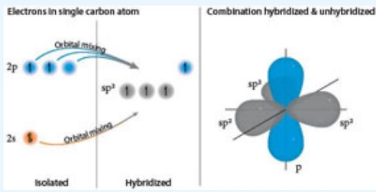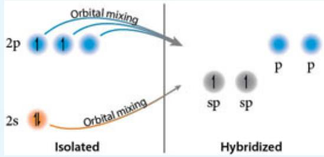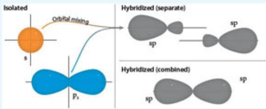</td></tr><tr><td>4. Hybridization of More Than Two Atomic Orbital TypesWhile the most common hybridization occurs between s and p orbitals, a molecular structure will mix (i.e. hybridize) any combination of atomic orbitals in an effort to create the molecular structure of minimum energy. Thus, for example, one s orbital, three p orbitals, and a d orbital of phosphorus will hybridize to form five  $sp^{3}d$  orbitals that set the structure of  $PCl_{5}$ .</td><td>Energy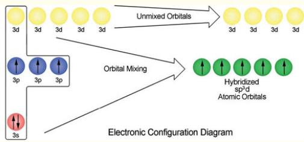</td></tr><tr><td>5. Molecular Orbital (MO) TheoryA key conceptual foundation that underpins the development of more sophisticated models of chemical bonding is that electrons, when given the opportunity, will employ the full spatial dimension of a molecular structure to spread out over, or to delocalize within, in an effort to minimize the potential energy of the ensemble of electrons</td><td></td></tr></table>

and nuclei. It is this tendency of electrons to delocalize from the confinement of atomic orbitals to the geometrical flexibility of extended molecular orbitals that sets the stage for the molecular orbital (MO) class of bonding theories. We saw that the solution to the Schrödinger equation for atomic structure yielded the complete wavefunction for multielectron system with a single nucleus. There is no limitation intrinsic to the Schrödinger equation preventing a full solution for multielectron/multinucleus systems. Thus, when the Schrödinger equation is solved for a molecule, a molecular orbital results, with the electrons delocalized in whatever configuration yields the structure with the lowest potential energy given the constraint that no two electrons share the same set of quantum numbers.

We can track the energy of the forming molecular orbital (MO) as the internuclear distance decreases carrying the molecular formation from the separated atoms to the fully formed molecular orbital for the constructive addition of two 1s atomic orbitals, shown at right, to form a bonded molecular orbital.

The linear combination of atomic orbitals for the destructive addition of 1s atomic orbitals is shown at right as a function of decreasing internuclear distance between the hydrogen atoms. As the internuclear distance decreases, the energy increases, forming an antibonding molecular orbital.

## 6. Combining Atomic Orbitals To Form Bonding and Antibonding Molecular Orbitals

Constructive interference of the two 1s hydrogen atomic orbitals leads to a bonding $\sigma _ { 1 \mathrm { s } }$ molecular orbital.

Destructive interference of the two 1s atomic orbitals leads to an antibonding $\sigma _ { 1 \mathrm { s } } \mathrm { ^ * }$ molecular orbital.

Panel A displays the relationship between the probability distribution of electrons as the internuclear distance decreases from the condition of large separation, for which there is no overlap, through the condition of marginal overlap leading to the formation of the chemical bond with maximum bond strength represented by the equilibrium internuclear distance. Panel B delineates the evolution of the molecular orbital diagram from large internuclear separation (for which there is no interaction of the valence electrons) through an intermediate internuclear distance wherein the overlap is developing between the 1s atomic orbitals leading to a separation in energy between the bonding, $\sigma _ { \mathrm { { s } } } ,$ and antibonding, ${ \sigma _ { \mathrm { { s } } } } ^ { * }$ , orbitals. Finally at the

:::{figure} ../images/fig-p1-ch11-105.jpg
:name: fig-p1-ch11-105
:alt: Figure from the University Chemistry source textbook
:::

:::{figure} ../images/fig-p1-ch11-106.jpg
:name: fig-p1-ch11-106
:alt: Figure from the University Chemistry source textbook
:::

:::{figure} ../images/fig-p1-ch11-107.jpg
:name: fig-p1-ch11-107
:alt: Figure from the University Chemistry source textbook
:::

equilibrium internuclear distance, the $\sigma _ { \mathrm { { s } } }$ and ${ \sigma _ { \mathrm { s } } } ^ { * }$ orbitals achieve their maximum separation and the potential energy reaches its deepest point.

## 7. Molecular Orbital Structure of Molecular Oxygen

The figure at right displays the case for decreasing internuclear distance as the atomic orbitals begin to interact. This condition of overlap between the atomic orbitals begins to split the molecular orbitals so formed by decreasing the energy of the bonding orbitals and increasing the energy of the antibonding orbitals. This “splits” the energy levels of the forming molecular bond with the ${ \sigma } _ { 2 \mathrm { p } }$ bonding orbital being lowest in energy because of the greater overlap between the $\mathrm { p _ { x } }$ atomic orbitals aligned along the internuclear axis. The $\sigma _ { 2 \ p } \ast$ antibonding overlap is higher in energy because of the large repulsion that results from the large overlap of the $\mathrm { p _ { x } }$ orbitals combined with the absence of electron density between the two nuclei. The evolving potential energy surface of $\mathrm { O } _ { 2 }$ corresponds to the point on the surface representing the decrease in energy relative to the interactive energy at large internuclear distance. This decrease in energy of the potential energy surface represents the binding energy of the $\mathrm { O } _ { 2 }$ bond at that internuclear distance.

Development of MO theory for $\mathrm { H } _ { 2 }$ and for $\mathrm { O } _ { 2 }$ establishes the essential concepts in MO theory wherein we have formed those molecular orbitals by a simple adding together, or “mixing” of atomic orbitals; the so called linear combination of atomic orbitals-molecular orbital (LCAO-MO) theory. It is important to recognize that we need not be constrained or restricted to using those explicit mathematical functions, the wavefunctions for the isolated atoms. We can use any mathematical function we choose that can be optimized in the molecular structure to minimize the potential energy of the ensemble of electrons and nuclei in the molecular structure. It just happens that to a greater or lesser degree, depending on the molecule, the atomic wavefunctions are a good (sometimes very good) first approximation that can be successfully mixed, added together constructively or destructively, to yield the resulting molecular orbitals.

## 8. Molecular Orbital Structures of Heteronuclear Molecules

:::{figure} ../images/fig-p1-ch11-108.jpg
:name: fig-p1-ch11-108
:alt: Figure from the University Chemistry source textbook
:::

:::{figure} ../images/fig-p1-ch11-109.jpg
:name: fig-p1-ch11-109
:alt: Figure from the University Chemistry source textbook
:::

Nitric oxide is one of the most important molecules in nature. It plays a significant role in biological systems as a “signaling molecule”—it is released by one system in the human body to trigger a reaction in another system of the human body. For example, the inner lining of blood vessels use nitric oxide to signal the surrounding smooth muscle to relax, resulting in increased blood flow. As we will see in the MO diagram of NO, nitric oxide has an unpaired electron in its valence shell and is thus very reactive as it seeks to form an electron pair bond with any molecule with which it collides. NO has a lifetime in human systems of a few seconds, but because it is small, it diffuses easily across membranes.

The atomic orbitals for oxygen lie at somewhat lower energy than the atomic orbitals of nitrogen. The MO ordering is the same as that for $\mathrm { C } _ { 2 } , \mathrm { N } _ { 2 }$ , and CO.

## 9. Molecular Orbital Bonding Structure of Benzene: Delocalization

I. Experiments have demonstrated that benzene, ${ \mathrm { C } } _ { 6 } { \mathrm { H } } _ { 6 }$ is a planar molecule with a remarkable hexagonal geometry set in place by a backbone of carbon atoms. All carbon-carbon bonds are equal length (140pm) and the C-C-C bond angle in each case is $\mathbf { 1 2 0 } ^ { \circ }$ . Valence bond theory guides an important initial assessment of the structure of benzene. The framework of the carbon backbone is comprised of a σ bonded structure that is a network of $\mathrm { s p } ^ { 2 } \mathrm { - } \mathrm { s p } ^ { 2 }$ hybrid orbitals as shown in the top panel. But the unhybridized p orbitals of carbon protrude perpendicular to the plane of the σ bonding structure as displayed in the bottom panel.

II. The π bonding states and $\pi ^ { * }$ antibonding states of benzene: Each state is represented by its wavefunction as colored clouds (red clouds are negative values, blue clouds are positive values) and its energy as a horizontal bar. The bonding states $( \pmb { \pi } _ { 1 } , \pmb { \pi } _ { 2 } , \pmb { \pi } _ { 3 } )$ are occupied by two electrons each (with up and down spins), while the antibonding states $( \pmb { \pi } _ { 4 } , \pmb { \pi } _ { 5 } , \pmb { \pi } _ { 6 } )$ are unoccupied. The occupied and unoccupied states are separated by the long, grey horizontal line, known as the Fermi level.

NO orbitals

II
:::{figure} ../images/fig-p1-ch11-110.jpg
:name: fig-p1-ch11-110
:alt: Figure from the University Chemistry source textbook
:::

:::{figure} ../images/fig-p1-ch11-111.jpg
:name: fig-p1-ch11-111
:alt: Figure from the University Chemistry source textbook
:::

:::{figure} ../images/fig-p1-ch11-112.jpg
:name: fig-p1-ch11-112
:alt: Figure from the University Chemistry source textbook
:::

:::{figure} ../images/fig-p1-ch11-113.jpg
:name: fig-p1-ch11-113
:alt: Figure from the University Chemistry source textbook
:::

## BUILDING QUANTITATIVE REASONING

## CASE STUDY 11.1 Chemical Bonds, Spectroscopy, and Molecular Motion

With the development of quantum mechanics came the ability to accurately calculate bond strengths, bond angles, and the distribution of electronic charge within the bonding structure. This provided the quantitative foundation to calculate specifically how a given molecular structure would interact with electromagnetic radiation.

As we have seen, there is an explicit relationship between the period of motion of the charge distribution within a molecule and the wavelength of light, of the photon, that can be absorbed or emitted by a molecule. In particular, because light moves with a specific velocity, $\mathbf { c } ,$ and because the relationship between the wavelength, $\lambda ,$ and the frequency, ν, of light is set by the relationship $\lambda \nu = \mathbf { c }$ , the motion of charge within the molecule must match the frequency of that emitted radiation. A molecule creates, or releases, a photon in the ultraviolet by an electron jumping from one energy level to another. If those two energy levels are separated by an energy difference, $\Delta \mathrm { E } ,$ that photon, produced by an electron jump between levels, will have energy

```{math}
:label: eq-p1-ch11-32
\Delta \mathbf {E} = \mathbf {h} \mathbf {v} _ {\mathrm{photon}}
```


But in order to create that photon, that electron can only generate the electromagnetic wave by moving in space, oscillating, with a period of electronic motion $\tau _ { \mathrm { e l } } = 1 / \nu _ { \mathrm { p h o t o n } }$

Thus the frequency of the emitted photon, $\mathrm { v _ { p h } = c / \lambda _ { p h o t o n } , }$ is locked to the frequency of the electronic motion. It follows that the period of motion of the electron, $\tau _ { \mathrm { e l } } ,$ responsible for the emission of the photon with wavelength $\lambda _ { \mathrm { p h o t o n } }$ must satisfy the relationship:

```{math}
:label: eq-p1-ch11-33
\Delta \mathrm{E} / \mathrm{h} = v _ {\mathrm{photon}} = c / \lambda_ {\mathrm{photon}} = 1 / \tau_ {\mathrm{el}}
```


We therefore have a close relationship between the structure of the chemical bond, the potential energy surface controlling the motion of charge, and the period of motion of the charge. For electronic motion, we can express this as a union between (1) the molecular orbital (MO) structure with the promotion of the electron by the absorption of a photon and (2) the transition of the molecule from the ground electronic state to an electronic state higher in energy. This is displayed in Figure CS11.1a.

:::{figure} ../images/fig-p1-ch11-114.jpg
:name: fig-p1-ch11-114
:alt: FIGURE CS11.1A Promotion of a molecule from its ground state to a surface of higher potential energy displayed in the upper right panel occurs when an electron in the molecular orbital structure is promoted to a higher energy orbital by the
FIGURE CS11.1A Promotion of a molecule from its ground state to a surface of higher potential energy displayed in the upper right panel occurs when an electron in the molecular orbital structure is promoted to a higher energy orbital by the absorption of a photon of energy $\Delta \mathsf { E } = \mathsf { h v } _ { \mathsf { p h o t o n } } .$ . The frequency of that photon must match the period of the electronic motion, $\tau _ { \mathsf { e l } }$ , such that $\bar { \mathsf { \tau } } _ { \mathsf { e } | } = 1 /$ $\mathsf { v } _ { \mathsf { p h o t o n } }$ shown in the lower panel. While this principle holds in general, it is shown here for the specific case of molecular oxygen, ${ \sf O } _ { 2 } .$
:::


Note that this locking together of the period of electronic motion, $\tau _ { \mathrm { e l } } ,$ and the wavelength of light emitted, $\lambda _ { \mathrm { p h o t o n } } ,$ when the electron jumps to another electronic energy level, has two key consequences:

1. The match between the wavelength of the photon and the period of motion of the electron holds whether the photon is emitted or absorbed.

2. The electromagnetic radiation, the photon, can interact with the molecule if and only if there is a spatial change in the distribution of charge as a result of that interaction. If the electric field of the photon cannot invoke a change of charge distribution within the molecule, the photon cannot be absorbed. If the distribution of charge within a molecule does not change, a photon cannot be emitted.

However, quantum mechanics requires that a molecule can only change its energy state in discrete steps—in quantum steps. Moreover, these quantum steps can be taken either as a result of movement of an electron, as in the case above, or by the movement of the molecule's nuclei, which alters the distribution of charge within the molecule.

This immediately raises the question: How can the motion of nuclei lead to the motion of charge? We already have two examples to draw from. One is the change in the electronic state of a hydrogen atom or the change in the electronic state of a molecule described above. The other is the emission of radiation from a blackbody—the thermal energy of the molecules that comprise solid matter. Solid matter that contains a combination of electrons and protons (negative and positive charges) that emits a continuum of electromagnetic radiation depending on temperature.

So how does the motion of nuclei lead to the absorption or emission of radiation? Let's take the water molecule as an example. First, we know the structure of the water molecule is built upon a tetrahedral structure with two lone pairs and two of the four sp<sup>3</sup> hybrid orbitals bonded to the 1s atomic hydrogens.

:::{figure} ../images/fig-p1-ch11-115.jpg
:name: fig-p1-ch11-115
:alt: Figure from the University Chemistry source textbook
:::

The far greater electronegativity of the oxygen draws electron density toward the oxygen, leaving the hydrogen atoms electron deficient. This creates a separation of negative and positive charge:

FIGURE CS11.1B The electric field intrinsic to electromagnetic radiation applies a force to a dipole that transfers energy from the photon to the vibrational motion of the molecule. Energy is transferred only if the frequency of oscillation of the electromagnetic field matches the frequency of the vibrational motion of the molecule.

:::{figure} ../images/fig-p1-ch11-116.jpg
:name: fig-p1-ch11-116
:alt: Figure from the University Chemistry source textbook
:::

This separation of charge created by the greater electronegativity of oxygen leads to a charge separation that can be represented by a vector extending from the center of the two partial positive charges on the hydrogen to the partial negative charge in the oxygen. This displacement of charge is called the “dipole moment” of the molecule and it can be simplified to a charge separation through the axis of the molecule.

:::{figure} ../images/fig-p1-ch11-117.jpg
:name: fig-p1-ch11-117
:alt: Figure from the University Chemistry source textbook
:::

When this charge separation “sees” an electric field, the charges are forced apart in one phase of the electromagnetic wave and forced together in the next phase as shown in Figure CS11.1b.

:::{figure} ../images/fig-p1-ch11-118.jpg
:name: fig-p1-ch11-118
:alt: Figure from the University Chemistry source textbook
:::

Because the structure of water can accept only quantized radiation, radiation whose frequency matches the energy difference $\Delta \mathrm { E } = \mathrm { h v } _ { \mathrm { p h o t o n } }$ between two quantized energy levels, only photons with wavelength $\lambda _ { \mathrm { { p h o t o n } } } = \mathrm { { c } } / \mathrm { { v _ { \mathrm { { p h o t o n } } } } }$ will be absorbed by the nuclear motion of the molecule. What then are the frequencies of the nuclear motions of the water molecule, and what is the character of the molecular motion associated with each of those frequencies? Of the many different molecular motions available to the two hydrogen atoms and the oxygen atom in the structure of water, there are three distinct “modes” of vibrational motion. Those are referred to as “normal modes” because any combination of vibrational motion can be uniquely represented as a combination of those normal modes. The three normal modes are displayed in Figure CS11.1c. They are designated top to bottom in that figure as $\mathbf { v _ { 1 } } .$ , the symmetric stretch; $\nu _ { 2 } ,$ the bending mode; and $\nu _ { 3 } ,$ the asymmetric stretch.

:::{figure} ../images/fig-p1-ch11-119.jpg
:name: fig-p1-ch11-119
:alt: FIGURE CS11.1C The “normal modes” of vibration of the water molecule. All vibrational motion of the water molecule can be expressed in terms of just these three normal modes.
FIGURE CS11.1C The “normal modes” of vibration of the water molecule. All vibrational motion of the water molecule can be expressed in terms of just these three normal modes.
:::


Listed in Figure CS11.1c are the frequencies of each of the normal modes and the corresponding wavelengths of photons that are either absorbed or emitted by the mode. Once we have the frequency of the mode, we can calculate the period, ${ \pmb { \tau } } _ { \mathrm { v i b } } ,$ associated with the nuclear motion and the wavelength of photons that are either absorbed or emitted by the mode. Those frequencies, vibrational periods and wavelengths are summarized in Table CS11.1a.

TABLE CS11.1A

<table><tr><td>Normal Mode</td><td>Frequency</td><td>Vibrational Period</td><td>Wavelength</td></tr><tr><td>Symmetric stretch</td><td> $1.09 \times 10^{14} \text{ sec}^{-1}$ </td><td> $9.17 \times 10^{-15} \text{ sec}$ </td><td>2.74 μ</td></tr><tr><td>Bending</td><td> $4.80 \times 10^{13} \text{ sec}^{-1}$ </td><td> $2.08 \times 10^{-14} \text{ sec}$ </td><td>6.27 μ</td></tr><tr><td>Asymmetric stretch</td><td> $1.13 \times 10^{14} \text{ sec}^{-1}$ </td><td> $8.85 \times 10^{-15} \text{ sec}$ </td><td>2.66 μ</td></tr></table>

Before we consider the spectral interval over which the water molecule absorbs radiation, we consider what it is that determines the frequencies of that motion. First, we note that in general a molecular bond is represented by a potential energy surface with the characteristic shape displayed in Figure CS11.1d.

:::{figure} ../images/fig-p1-ch11-120.jpg
:name: fig-p1-ch11-120
:alt: FIGURE CS11.1D Any chemical bond between two atoms has, qualitatively, the same general shape in terms of the potential energy as a function of internuclear distance. At large internuclear distance the potential energy is zero, but, as the
FIGURE CS11.1D Any chemical bond between two atoms has, qualitatively, the same general shape in terms of the potential energy as a function of internuclear distance. At large internuclear distance the potential energy is zero, but, as the bond forms, the potential energy drops until it reaches a minimum at the equilibrium internuclear distance. At smaller internuclear distances, the potential energy increases rapidly forming a repulsive “wall.”
:::


As we have seen, the characteristic shape of a chemical bond is a potential energy that decreases with decreasing internuclear distance until it reaches a minimum. This minimum in the potential energy surface, referred to as the equilibrium internuclear distance, is characterized by the condition that the change in potential energy divided by the change in internuclear distance, $\Delta \mathrm { V } / \Delta \mathrm { r }$ , is equal to zero. Thus, at that equilibrium internuclear distance, no force is exerted on the nuclei. As the internuclear distance decreases from that equilibrium internuclear distance, the potential energy surface increases rapidly. The force felt by the nuclei, a force that seeks to push them apart, can be represented by a simple expression:

```{math}
:label: eq-p1-ch11-34
\mathrm{F} = - \mathrm{k} \times \binom{\text { displacement   from   equilibrium }}{\text { internuclear   distance }} \quad \mathbf {E q . C S 1 1 . 1 . 1}
```


As the displacement from the equilibrium internuclear distance increases, so too does the force that tries to return the nuclei to a separation equal to the equilibrium internuclear distance. This is true whether the bond length is greater than or less than the equilibrium internuclear distance. The restoring force operating on the nuclei is proportioned to the slope of the potential energy surface, $\Delta \mathrm { V } / \Delta \mathrm { r }$ . If the “walls” of the PES are steep, the restoring force is large and the constant k in equation CS11.1.1 is proportionally larger. This is a characteristic true of all nuclear motion in a molecular structure, and thus of the normal modes of the water molecule. It is the shape of the potential energy surface that forces the nuclei back to their equilibrium position and that determines the force constant of the restoring force.

But how is the force constant, which depends upon the slope of the potential energy surface, related to the frequency of the vibrational motion of the nuclei? Using the analogy of the diatomic molecule again, the frequency of the vibrational motion depends upon the spring constant k, and the mass of the atoms in the molecular structure. Specifically, the frequency of vibration, $\mathbf { v } _ { \mathrm { V I B } } .$ , is given by the simple expression

```{math}
:label: eq-p1-ch11-35
\nu_ {\mathrm{VIB}} = \left(\frac {1}{2 \pi}\right) \sqrt {\frac {\mathrm{k}}{\mu}}
```


where k is the spring constant and $\mu$ is the “reduced mass” of the two atoms in the bond:

```{math}
:label: eq-p1-ch11-36
\mu = \frac {m _ {1} m _ {2}}{m _ {1} + m _ {2}}
```


The key points are:

1. The steeper the potential energy surface, the greater the restoring force attempting to return the nuclei in the molecule to their

equilibrium position.

2. The spring constant k is proportionally larger for steeper potential energy surfaces.

3. The frequency of a vibrational mode increases with increasing spring constant and decreases for increasing mass of the atoms in a chemical bond. Light atoms connected by stiff bonds have high frequency vibrations. Heavy atoms linked by weak bonds have low frequency vibrations.

We are now ready to connect the vibrational motion of the water molecule to the electromagnetic field in order to understand how the nuclear motion of molecules interacts with light.

An inspection of Table CS11.1a reveals that with a frequency of the three normal modes $\mathbf { v _ { 1 } } = \mathbf { 1 } \times \mathbf { 1 0 ^ { 1 4 } } ~ \mathrm { s e c ^ { - 1 } } , \mathbf { v _ { 2 } } = 4 . 8 \times \mathbf { 1 0 ^ { 1 3 } } ~ \mathrm { s e c ^ { - 1 } }$ , and $\bf { v } _ { 3 } = 1 . 1 \times$ $\mathbf { 1 0 ^ { 1 3 } s e c ^ { - 1 } }$ , the period of molecular vibration is in the range $\mathbf { 2 . 1 \times 1 0 ^ { - 1 4 } }$ sec to $9 . 1 \times 1 0 ^ { - 1 3 }$ sec. This is typical of polyatomic molecules. The wavelength of light absorbed and/or emitted by the water molecules in its vibrational modes are $\lambda _ { 1 } = 2 . 7 4 \mu , \lambda _ { 2 } = 6 . 2 7 \mu$ , and $\lambda _ { 3 } = 2 . 6 6 \mu$

We can create a table of normal modes, frequencies, vibrational periods, and wavelengths for another triatomic (3 atom) molecule, $\mathrm { C O } _ { 2 } ,$ as displayed in Table CS11.1b.

TABLE CS11.1B

<table><tr><td>Normal Mode</td><td>Frequency</td><td>Vibrational Period</td><td>Wavelength</td></tr><tr><td>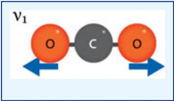</td><td> $4.2 \times 10^{13} \text{ sec}^{-1}$ </td><td> $2.3 \times 10^{-14} \text{ sec}^{-1}$ </td><td>7.2 μ</td></tr><tr><td>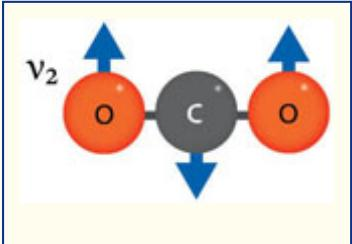</td><td> $2 \times 10^{13} \text{ sec}^{-1}$ </td><td> $5 \times 10^{-14} \text{ sec}^{-1}$ </td><td>15 μ</td></tr><tr><td>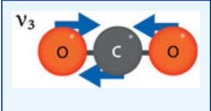</td><td> $7.0 \times 10^{13} \text{ sec}^{-1}$ </td><td> $1.4 \times 10^{-14} \text{ sec}^{-1}$ </td><td>4.3 μ</td></tr></table>

Notice that the frequency, vibrational periods, and wavelengths fall in roughly the same range as those of water. It should be noted that $\mathrm { C O } _ { 2 }$ has 4 normal modes, while $_ \mathrm { H _ { 2 } O }$ has three. This difference results from the fact that $\mathrm { C O } _ { 2 }$ is a linear molecule and it can bend in two distinct directions that are perpendicular to each other. Water, a molecule that is bent, does not have two equivalent directions of bending that are independent but equal in energy. This is an example of a consistent characteristic of nuclear motion in polyatomic molecules. Linear polyatomic molecules with n atoms have $3 \mathrm { n } \mathrm { ~  ~ { ~ - ~ } ~ } 5$ vibrational normal modes. Nonlinear polyatomic molecules have 3n - 6 normal modes. Thus $\mathrm { C O } _ { 2 } ,$ which is linear, has $3 { \mathrm { n } } - 5 = ( 3 ) 3 - 5 = 4$ normal modes. Water, which is bent, has $3 \mathrm { n } - 6 = ( 3 ) ( 3 ) - 6 = 3$ normal modes of vibration.

An inspection of Table CS11.1a and CS11.1b reveals that $_ \mathrm { H _ { 2 } O }$ and $\mathrm { C O } _ { 2 }$ absorb radiation in their normal modes throughout the wavelength region 2.7 μ to $1 5 \ \mu .$ . If we examine the blackbody radiation curve for the Earth's surface, which has an average temperature of 288 K, we see that this blackbody emission peaks in the region of the $\mathrm { C O } _ { 2 }$ and $\mathrm { H } _ { 2 } \mathrm { O } \ \mathbf { v } _ { 2 }$ bending modes.

## Problem 1

Electronic transition in most molecules occurs in the “near UV” and “vacuum UV.” The near UV region is typically between 200 and 350 nm. The vacuum UV is so designated because of the very strong $\mathrm { O } _ { 2 }$ absorption between 100 and 200 nm—requiring that an instrument operating below 200 nm must be “pumped out,” evacuated of $\mathrm { O } _ { 2 } ,$ in order for photons to pass through the instrument.

Select a representative UV wavelength, 200 nm, and calculate the frequency of electromagnetic radiation, the energy of the corresponding photon, and the period of electronic motion corresponding to that electronic transition.

## CASE STUDY 11.2 Chemical Bonds, Spectroscopy, and Control of Climate

## The Link Between Molecular Spectroscopy and Climate

We can summarize the absorption of infrared radiation by $_ \mathrm { H _ { 2 } O }$ and $\mathrm { C O } _ { 2 }$ by graphically displaying the percent of absorption on the vertical axis against wavelength on the horizontal axis as shown in Figure CS11.2a. The vibrational and rotational bands of $\mathrm { H } _ { 2 } \mathrm { O }$ and $\mathrm { C O } _ { 2 }$ are displayed along with the absorption band of the bending mode of ozone at 10 $\mu .$ . The 100% absorption regions means that photons emitted by the Earth's surface are absorbed by the infrared active gases before leaving the atmosphere.

:::{figure} ../images/fig-p1-ch11-124.jpg
:name: fig-p1-ch11-124
:alt: FIGURE CS11.2A The absorption of infrared radiation upwelling from the Earth's surface is caused by mathematical notation and mathematical notation absorbing infrared radiation in their vibrational modes of symmetric stretch, bending and as
FIGURE CS11.2A The absorption of infrared radiation upwelling from the Earth's surface is caused by ${ \sf H } _ { 2 } { \sf O }$ and ${ \mathsf { C O } } _ { 2 }$ absorbing infrared radiation in their vibrational modes of symmetric stretch, bending and asymmetric stretch. Water also absorbs in its rotational mode. This diagram displays the percent absorption as a function of wavelength for a photon leaving the surface in an upward direction. Ozone also contributes to the absorption of infrared radiation at about 10 μ.
:::


Those absorbed photons then deliver their energy to those molecules, inducing vibrational and rotational energy within the molecular structure of, for example, water. Some of that vibrational and rotational energy is transferred to the translational kinetic energy of the surrounding atmosphere. But $\mathrm { H } _ { 2 } \mathrm { O }$ and $\mathrm { C O } _ { 2 }$ are both strong absorbers of IR radiation and strong emitters of IR radiation. In fact, in regions of the atmosphere those molecules act to cool the atmosphere by emitting more IR radiation than they absorb from lower levels of the atmosphere. The result is that the emission of IR radiation downward to the surface acts to warm the surface by absorbing upwelling IR and emitting it downward, while at the same time, molecules that are in the upper troposphere and lower stratosphere cool these regions of the atmosphere by emitting IR radiation to space. So this sets up an absorption-reemission sequence that returns a significant fraction of the IR radiation downward toward the ground. This establishes a pathway for the IR photons shown in Figure CS11.2b. Depending on their wavelength, photons can escape directly to space through the “window region” between 8 and $1 4 ~ \mu$ , they can be absorbed by $\mathrm { H } _ { 2 } \mathrm { O }$ or $\mathrm { C O } _ { 2 }$ and reemitted downward toward the surface, or they can be absorbed by $_ \mathrm { H _ { 2 } O }$ or $\mathrm { C O } _ { 2 }$ and emitted upward toward space.

:::{figure} ../images/fig-p1-ch11-125.jpg
:name: fig-p1-ch11-125
:alt: FIGURE CS11.2B The pathways available to infrared photons emitted by the Earth's surface include (1) direct escape to space through the “window” region of the atmosphere, (2) absorption by mathematical notation or mathematical notation with
FIGURE CS11.2B The pathways available to infrared photons emitted by the Earth's surface include (1) direct escape to space through the “window” region of the atmosphere, (2) absorption by ${ \sf H } _ { 2 } { \sf O }$ or ${ \mathsf { C O } } _ { 2 }$ with the infrared photon re-emitted downward toward the surface, or (3) absorption by ${ \sf H } _ { 2 } { \sf O }$ or ${ \mathsf { C O } } _ { 2 }$ with the infrared photon re-emitted upward toward outer space.
:::


But the key question is, at what wavelength does the Earth's surface emit IR radiation, and how does that IR emission spectrum coincide with the absorption spectrum of $\mathrm { H } _ { 2 } \mathrm { O }$ and $\mathrm { C O } _ { 2 }$ (as well as $\mathrm { { O } _ { 3 } ) ? }$

We know from Chapter 1 that the flux of energy from a surface, any surface, is given by the Stefan-Boltzmann law

```{math}
:label: eq-p1-ch11-37
\mathbf {F} = \mathbf {A} \boldsymbol {\sigma} \mathbf {T} ^ {4}
```


The Earth, over time, must balance the energy per unit time received from the Sun and the energy per unit time emitted by the Earth in the IR. In the absence of an atmosphere, this is a straightforward calculation. The Earth receives 179 PW $\mathbf { ( 1 7 9 \times 1 0 ^ { 1 5 } }$ watts) from the sun, so it must radiate that same amount to space. This calculation is shown graphically in Figure CS11.2c. Without an atmosphere, the average surface temperature of the Earth would be 255 K.

:::{figure} ../images/fig-p1-ch11-126.jpg
:name: fig-p1-ch11-126
:alt: Figure from the University Chemistry source textbook
:::

The question we must answer is: what happens when we place $\mathrm { C O } _ { 2 }$ and $\mathrm { H } _ { 2 } \mathrm { O }$ in the atmosphere? The first step in answering this is to align the wavelengths of the absorption of $\mathrm { C O } _ { 2 }$ and $\mathrm { H } _ { 2 } \mathrm { O }$ with the blackbody emission curve of the Earth's surface. The Earth's surface emits with a blackbody distribution of intensity appropriate to its temperature as shown in the bottom panel of Figure CS11.2d.

:::{figure} ../images/fig-p1-ch11-127.jpg
:name: fig-p1-ch11-127
:alt: Figure from the University Chemistry source textbook
:::

:::{figure} ../images/fig-p1-ch11-128.jpg
:name: fig-p1-ch11-128
:alt: FIGURE CS11.2D The infrared radiation emitted as blackbody radiation from the Earth's surface displayed in the lower panel, must pass through the mathematical notation and mathematical notation in the atmosphere in order to balance the inco
FIGURE CS11.2D The infrared radiation emitted as blackbody radiation from the Earth's surface displayed in the lower panel, must pass through the ${ \mathsf { H } } _ { 2 } { \mathsf { O } } , { \mathsf { C } } { \mathsf { O } } _ { 2 }$ and ${ \sf O } _ { 3 }$ in the atmosphere in order to balance the incoming energy from the Sun. Absorption in the infrared by these infrared active molecules reduces the amount of infrared radiation that escapes to space in the spectral regions where these molecules absorb. Therefore, the spectral distribution of infrared radiation that escapes to space is clearly evident in the absorption by ${ \mathsf { H } } _ { 2 } { \mathsf { O } } , { \mathsf { C } } { \mathsf { O } } _ { 2 }$ , and $\mathsf { O } _ { 3 }$ as displayed in the upper panel of the figure.
:::


This radiation, emitted upward, either escapes to space through the window regions between 10 and 20 μ and between 7.5 and 9.5 μ, or the radiation is repeatedly absorbed and reemitted by $\mathrm { H } _ { 2 } \mathrm { O }$ and $\mathrm { C O } _ { 2 }$ as shown in Figure CS11.2b until it escapes in the higher atmosphere to space. This results in a distribution of radiation from the top of the atmosphere that follows this general shape of the blackbody emission from the surface but with IR radiation removed through absorption by $\mathrm { H } _ { 2 } \mathrm { O }$ and $\mathrm { C O } _ { 2 }$ as displayed in the upper panel of Figure CS11.2d. The blue areas denote the absorption of IR radiation by $\mathrm { H } _ { 2 } \mathrm { O }$ and $\mathrm { C O } _ { 2 } .$ with a small contribution from $\mathrm { { O } } _ { 3 }$ at about 10 μ. This is the absorbed IR radiation that returns to the Earth's surface to increase the surface temperature.

We can create a simple model of how this works using the diagram in Figure CS11.2e. This simple model takes incoming power per unit area that the Earth receives from the Sun, $\mathrm { F } _ { \mathrm { S } } ( \mathbf { 1 } - \mathbf { A } ) / 4$ , where $\mathrm { F _ { S } }$ is the flux of solar radiation received by the Earth in $\mathrm { w a t t s } / \mathrm { m } ^ { 2 }$ and A is the Earth's albedo. This incoming solar flux is then equated with the flux of radiation emitted to space by the Earth in the IR. The flux of radiation emitted by the Earth per unit area, $\mathrm { { \sigma T _ { 0 } } ^ { 4 } }$ , is the flux of radiation emitted per unit area at the surface of the Earth. The absorption by $\mathrm { H } _ { 2 } \mathrm { O }$ and $\mathrm { C O } _ { 2 }$ is approximated by a single layer, well above the Earth's surface, that resides at some lower temperature $\mathrm { T _ { 1 } }$ . The fraction of IR radiation absorbed by the layer of $\mathrm { H } _ { 2 } \mathrm { O }$ and $\mathrm { C O } _ { 2 }$ is f, such that the IR radiation transmitted through the layer is $\mathfrak { o T } _ { 0 } { } ^ { 4 } \ \left( { 1 \mathrm { ~ - ~ } \mathrm { f } } \right)$ . But strong absorbers of radiation, of photons in the infrared, are also strong emitters in the IR.

:::{figure} ../images/fig-p1-ch11-129.jpg
:name: fig-p1-ch11-129
:alt: FIGURE CS11.2E We can establish a “climate model” by representing the absorption of infrared radiation by mathematical notation , and mathematical notation as taking place in a single layer of the atmosphere at temperature mathematical nota
FIGURE CS11.2E We can establish a “climate model” by representing the absorption of infrared radiation by ${ \sf H } _ { 2 } { \sf O } , { \sf C } { \sf O } _ { 2 }$ , and $\mathsf { O } _ { 3 }$ as taking place in a single layer of the atmosphere at temperature ${ \sf T } _ { 1 }$ , a single layer above the surface that absorbs a fraction, f, of the outgoing infrared radiation emitted at temperature ${ \sf T } _ { 0 }$ from the surface. That absorbing layer reemits radiation both downward and upward. By equating the incoming radiation from the Sun in the visible spectral region to the outgoing radiation from the Earth in the infrared, we can calculate the surface temperature in the presence of absorption in the atmosphere by $\mathsf { H } _ { 2 } \mathsf { O } , \mathsf { C O } _ { 2 } ,$ and ${ \sf O } _ { 3 }$
:::


The ability of $_ \mathrm { H _ { 2 } O }$ and $\mathrm { C O } _ { 2 }$ to absorb determines f, the amount of radiation removed from the outward flow of IR from the surface. The IR absorbed by the $_ \mathrm { H _ { 2 } O }$ and $\mathrm { C O } _ { 2 }$ in the atmosphere must be reemitted in the IR. IR radiation is emitted from the absorbing layer, both upward and downward according to the temperature of the layer, $\mathrm { { T _ { 1 } } , }$ and the strength of the emission, f. Thus an amount of power per unit area of $\mathrm { f o T _ { 1 } } ^ { 4 }$ is emitted both upward and downward. Thus the outgoing infrared radiation from the Earth is given by:

```{math}
:label: eq-p1-ch11-38
\sigma \mathrm{T} _ {0} ^ {4} (1 - f) + f \sigma \mathrm{T} _ {1} ^ {4}
```


But that outgoing IR radiation must balance the incoming radiation from the Sun in the visible from Figure CS11.2d

```{math}
:label: eq-p1-ch11-39
\mathrm {F_ {S} (1 - A) / 4 = \sigma T_ {0} ^ {4} (1- f) + f \sigma T_ {1} ^ {4}}
```


However, there is one more equation available to us. The energy emitted by the absorbing layer must equal the energy absorbed, so

```{math}
:label: eq-p1-ch11-40
2 \mathrm{f} \sigma \mathrm{T} _ {1} ^ {4} = \mathrm{f} \sigma \mathrm{T} _ {0} ^ {4}
```


So we have, solving for $\mathrm { T } _ { 0 } { } ^ { , }$ the expression

```{math}
:label: eq-p1-ch11-41
\mathrm{T} _ {0} = \sqrt [ 4 ]{2} \mathrm{T} _ {1}
```


Inserting this expression for $\mathrm { T _ { 1 } }$ into our energy balance expression gives

```{math}
:label: eq-p1-ch11-42
\mathrm {F_ {S} (1 - A) / 4 = \sigma T_ {0} ^ {4} (1- f) + f\sigma T_ {0} ^ {4} /2}
```


Solving for the Earth's surface temperature we have

```{math}
:label: eq-p1-ch11-43
\mathrm{T} _ {0} = \left[ \frac {\mathrm{F} _ {s} (1 - \mathrm{A})}{4 \sigma \left(1 - \frac {f}{2}\right)} \right] ^ {1 / 4}
```


We thus have a direct link between the bonding structure of $\mathrm { H } _ { 2 } \mathrm { O }$ and $\mathrm { C O } _ { 2 } ,$ the spectroscopy of $\mathrm { H } _ { 2 } \mathrm { O }$ and $\mathrm { C O } _ { 2 } ,$ and a climate model of the Earth.

## Problem 1

Given the simple (but powerful) model of the Earth's climate presented in this Case Study, calculate the Earth's surface temperature if the fraction of IR radiation absorbed by $\mathrm { H } _ { 2 } \mathrm { O }$ and $\mathrm { C O } _ { 2 }$ is f, and $\mathbf { f } = \mathbf { 0 . 7 7 }$

## BUILDING A TECHNOLOGY BACKBONE

CASE STUDY 11.3 Materials: From Molecular Orbital Theory to Solid-State Electronics

## I. Introduction

Materials play a very important role in human society. This is reflected in the fact that the phases of human civilization are usually characterized by the type of materials used to make the basic tools and even the not quite basic but still important ornaments and other objects of everyday life. Examples are displayed in Figure CS11.3a. We refer to the Stone Age as the period when humans had mastered the formation of tools from stone, extending up to 5000 years BC, which was followed by the Bronze Age (roughly from 5000 to 1000 years BC) and the Iron Age (from 1000 years BC through the 20th century AD). In the middle of the 20th century, humans began to extensively use materials that are not found in nature as such, or in pure enough forms to be used for the purposes of modern technology.

:::{figure} ../images/fig-p1-ch11-130.jpg
:name: fig-p1-ch11-130
:alt: FIGURE CS11.3A Tools from (A) the Stone Age, (B) the Bronze Age, (C) the Iron Age.
FIGURE CS11.3A Tools from (A) the Stone Age, (B) the Bronze Age, (C) the Iron Age.
:::


The characteristic material of the current era, on which most electronic devices are based, is silicon. Silicon is a semiconductor used for the manufacturing of microchips for computers but also in other applications like solar cells in photovoltaic devices, two examples of which are shown in Figures CS11.3b and CS11.3c. Materials similar to silicon, like gallium arsenide, are used for electronic devices in CD and DVD players, cell phones, etc. The operation of these devices is based on what are called “doped semiconductors,” a class of materials with very specific electronic properties. The applications of these materials have affected human civilization in literally all of its aspects. The era of human civilization from the late ${ 2 0 } ^ { \mathrm { t h } }$ century to date has been dubbed the “Silicon Age.” Perhaps a more appropriate term would be the “Quantum Artificial Materials Age,” since silicon is only one example of a broad class of materials that are artificial (in the sense they are not found in nature but must be manufactured artificially, often with great difficulty and at great cost), and whose operation is based on purely quantum mechanical effects.

(A)
:::{figure} ../images/fig-p1-ch11-131.jpg
:name: fig-p1-ch11-131
:alt: Figure from the University Chemistry source textbook
:::

(B)
:::{figure} ../images/fig-p1-ch11-132.jpg
:name: fig-p1-ch11-132
:alt: Figure from the University Chemistry source textbook
:::

(C)

:::{figure} ../images/fig-p1-ch11-133.jpg
:name: fig-p1-ch11-133
:alt: FIGURE CS11.3B (A) A wafer of pure crystalline silicon on which computer chips are imprinted; (B) schematic operation of a photovoltaic based on doped (called p-type and n-type) silicon crystals; (C) a photovoltaic array.
FIGURE CS11.3B (A) A wafer of pure crystalline silicon on which computer chips are imprinted; (B) schematic operation of a photovoltaic based on doped (called p-type and n-type) silicon crystals; (C) a photovoltaic array.
:::


:::{figure} ../images/fig-p1-ch11-134.jpg
:name: fig-p1-ch11-134
:alt: FIGURE CS11.3C Diagram of how a photo-electrochemical cell operates: light absorbed on the semiconducting electrode (with the help of a dye which has states in the middle of the semiconductor gap) excites electrons and creates electron-hole
FIGURE CS11.3C Diagram of how a photo-electrochemical cell operates: light absorbed on the semiconducting electrode (with the help of a dye which has states in the middle of the semiconductor gap) excites electrons and creates electron-hole pairs. The holes are used to drive the electrolysis of water and the electrons travel through the wire that connects the first electrode to the second one.
:::


It is difficult to imagine an aspect of modern life that does not depend in a crucial manner on advanced materials—just think of the number of times each day you use a device like your cell phone, your computer, your iPod, even a car, which nowadays is mostly run by computers (around the year 2000, the computer components in cars started exceeding in value that of the steel content, and this trend is accelerating). And this does not include the countless other objects that you use every day (from ceramic plates, to sun glasses, to the airplane you board to travel, to your tennis racket) that involve artificial materials of various levels of sophistication.

There are several aspects of materials that are different from simpler structures, like molecules consisting of a few atoms, that we have discussed so far.

a. Materials contain a very large number of atoms. In a cubic centimeter of a typical solid there are of order $\mathbf { 1 0 ^ { 2 2 } - 1 0 ^ { 2 4 } }$ atoms (same order of magnitude as Avogadro's number).

b. The atoms in materials are usually arranged in highly symmetric patterns, known as crystal structures. This is most obvious in precious stones, in which the crystal order is evident at scales visible to the naked eye. In solids that are not obviously crystalline, at the microscopic, atomic scale, the atoms are more or less regularly placed with crystalline order extending over small distances (micrometers, 1 $\mu \mathrm { m } = 1 0 ^ { - 6 } \mathrm { m } )$ and these microcrystals are joined at their surfaces in irregular patterns. This is the case for many common objects like utensils, chocolate bars, candles, etc. As a consequence, the structure of crystals is the basis for the discussion of most solid structures.

c. The presence of crystalline order produces another important effect: the electrons that form the link between atoms in a crystal are delocalized, that is, they spread throughout the entire solid. This applies to each and every individual electron in a crystal. It is a consequence of the quantum mechanical nature of electrons, and it has important implications for the behavior of solids.

d. Solids exhibit an enormous range of physical properties. For example, their electrical conductivity can range from very good conductors to very good insulators, with a difference of the two extremes of behavior spanning a range of 30 orders of magnitude! Solids also have a wide range of mechanical properties (from very brittle to very ductile), as well as a number of other properties like magnetic behavior, thermal behavior, superconducting behavior, etc. The huge range of physical properties is what makes them useful in applications.

## II. Categories of Solids

We consider first the various categories of solids, which may be classed as follows:

1. Amorphous solids that are “glasses” comprised of long molecules that become entangled to form the solid. The structure of amorphous solids lack the long-range order found in highly ordered solids. A familiar example of an amorphous solid is common glass used to make bottles, windows, etc. The material is brittle and it breaks into incoherent shapes when sufficient force is applied, as displayed in Figure CS11.3d.

:::{figure} ../images/fig-p1-ch11-135.jpg
:name: fig-p1-ch11-135
:alt: FIGURE CS11.3D Of the two major categories of solids, the amorphous solids are comprised of long molecular chains that create a strong structure by the process of tangling those chains. There is no long-range systematic order in these “glas
FIGURE CS11.3D Of the two major categories of solids, the amorphous solids are comprised of long molecular chains that create a strong structure by the process of tangling those chains. There is no long-range systematic order in these “glasses.”
:::


2. A second general category of solids is represented by an array of crystalline structures that are all characterized by an ordered arrangement of atoms that comprise the solid. Within this crystalline category there are four prominent examples, as displayed in Figure CS11.3e.

:::{figure} ../images/fig-p1-ch11-136.jpg
:name: fig-p1-ch11-136
:alt: FIGURE CS11.3E The second category of solids is the crystalline structure. There are four primary examples: ionic crystals, molecular crystals, covalent crystals, and metals.
FIGURE CS11.3E The second category of solids is the crystalline structure. There are four primary examples: ionic crystals, molecular crystals, covalent crystals, and metals.
:::


a. Ionic crystals have cations and anions at specific lattice sites. Ionic crystals, such as table salt, are relatively hard; they have high melting points and are brittle. These properties reflect opposite charge as well as repulsion that occurs when ions of like charge are in close proximity. Ionic compounds do not conduct electricity in their solid states, but when melted or dissolved they conduct electricity well.

b. Molecular crystals are solids in which the lattice sites are occupied either by atoms (as in solid argon or krypton) or by molecules (as in solid $\mathrm { C O } _ { 2 } , \mathrm { S O } _ { 2 } ,$ or $\mathrm { H } _ { 2 } \mathrm { O } )$ . If the molecules of such solids are relatively small, the crystals tend to be soft and have low melting points because the particles in the solid experience relatively weak intermolecular attractions. In crystals of argon, for example, the attractive forces are exclusively London forces. In $\mathrm { S O } _ { 2 }$ , which is composed of polar molecules, there are dipole-dipole attractions as well as London forces. And in water crystals (ice) the molecules are held in place primarily by strong hydrogen bonds.

c. Covalent crystals are solids in which lattice positions are occupied by atoms that are covalently bonded to other atoms at neighboring lattice sites. The result is a crystal that is essentially one gigantic molecule. These solids are sometimes called network solids because of the interlocking network of covalent bonds extending throughout the crystal in all directions. A typical example is diamond. Covalent crystals tend to be very hard and to have very high melting points because of the strong attractions between covalently bonded atoms. Other examples of covalent crystals are quartz $( \mathrm { { S i O } _ { 2 } , }$ found in some types of sand) and silicon carbide (SiC) a common abrasive used in sandpaper.

d. Metallic crystals have cations at lattice sites surrounded by mobile electrons. Metallic crystals have properties that are quite different from those of the other three types. Metallic crystals conduct heat and electricity well, and they have the luster characteristically associated with metals.

## III. Building Solids from Atoms

Molecular orbital theory provides the quantum mechanical basis for a striking array of phenomena associated with the interaction of photons with molecular structure. Figure CS11.3f demonstrates the coupled concepts treating two important examples. As we progress from the upper left corner of Figure CS11.3f across the top of the figure, we recall the case for molecular oxygen, $\mathrm { O } _ { 2 } ,$ which has a molecular orbital structure constructed from the $\mathrm { p }$ orbitals of atomic oxygen forming the bonding sigma orbitals, $\sigma ^ { \mathrm { b } }$ , and the bonding $\pi ^ { \mathrm { b } }$ orbitals as discussed in the Chapter core. In addition, the antibonding $\pi ^ { * }$ orbitals and the antibonding $\sigma ^ { * }$ orbitals are formed from the destructive interference of the p orbitals of opposite phase. Given the eight electrons in the p atomic orbitals of the two oxygen atoms, we insert those electrons in pairs into the lowest orbitals filling the bonding orbitals that account for six of the eight electrons. The last two electrons enter the antibonding $\pi ^ { * }$ orbital, one electron in one of the available $\pi ^ { * }$ orbitals, the other in the other $\pi ^ { * }$ orbital such that the $\mathrm { O } _ { 2 }$ molecule has two unpaired electrons. This sets the foundation for understanding the interaction of a photon with the molecular structure of $\mathrm { O } _ { 2 } .$ In a diatomic molecule such as molecular oxygen, an electron is promoted from a bonding orbital to an antibonding orbital. The range of wavelengths of the photon that can be absorbed is determined by the relationship between the ground state potential energy surface and the excited state potential energy: specifically the energy difference between those two states and the shape of the upper potential energy surface with respect to the wavefunction of the ground vibrational state as displayed graphically in the upper right panel of Figure CS11.3f. Absorption of a photon of sufficient energy to promote the electron to an antibonding $\pi ^ { * }$ orbital leaves the excited $\mathrm { O } _ { 2 }$ molecule on the repulsive wall of the upper state and the molecule dissociates to two oxygen atoms: $\mathrm { O } _ { 2 } + \mathrm { h v }  \mathrm { O } + \mathrm { O }$

:::{figure} ../images/fig-p1-ch11-137.jpg
:name: fig-p1-ch11-137
:alt: FIGURE CS11.3F Molecular orbital (MO) theory or the linear combination of atomic orbitals (LCAO) theory constitutes the basis for an understanding of two objectives: (1) the absorption of photons by a molecule and (2) the band theory of sol
FIGURE CS11.3F Molecular orbital (MO) theory or the linear combination of atomic orbitals (LCAO) theory constitutes the basis for an understanding of two objectives: (1) the absorption of photons by a molecule and (2) the band theory of solids. Objective (1) is traced from the upper left across the top of the diagram to the lower right of the diagram. Objective (2) is traced from the upper left down the left-hand side across to the center of the diagram down to the band model in the lower left.
:::


When photons interact with a solid, we can understand the process by again using the molecular orbital formulation, but with a different model for the binding structure. It is the development of the “band model” for solids to which we now turn.

## Band Model for Bonding in Solids

First note that when we developed the MO theory of bonding for molecules, those bonds were, in general, comprised of highly directional σ and π bonds. When we first discussed categories of bonding types (ionic, covalent, metallic) in Chapter 10, it was pointed out that metals are characterized by cations of the metal embedded in a sea of electrons. The bonding theory that has emerged to describe the structure of metals and other solids is the band theory of solids. We turn now to a development of this band theory by building up from individual atomic orbitals.

To build this “band model” we begin with two lithium atoms as the first example. When we add the 2s atomic wavefunctions for the lithium atoms we form two molecular orbitals as shown in the upper panel of Figure CS11.3g. This is virtually identical to the formation of $\mathrm { H } _ { 2 }$ from two hydrogen atoms. The only difference at this point is that the bonding $\sigma _ { \mathrm { 1 s } }$ and antibonding $\sigma _ { \mathrm { ~ 1 ~ S ~ } } ^ { * }$ orbitals of $\mathrm { H } _ { 2 }$ are formed from the linear combination of two 1s atomic orbitals. In the case of $\mathrm { L i } _ { 2 } ,$ the bonding and antibonding orbitals of $\operatorname { L i } _ { 2 }$ are formed from two 2s atomic orbitals.

:::{figure} ../images/fig-p1-ch11-138.jpg
:name: fig-p1-ch11-138
:alt: Figure from the University Chemistry source textbook
:::

:::{figure} ../images/fig-p1-ch11-139.jpg
:name: fig-p1-ch11-139
:alt: Figure from the University Chemistry source textbook
:::

:::{figure} ../images/fig-p1-ch11-140.jpg
:name: fig-p1-ch11-140
:alt: Figure from the University Chemistry source textbook
:::

:::{figure} ../images/fig-p1-ch11-141.jpg
:name: fig-p1-ch11-141
:alt: FIGURE CS11.3G The molecular orbital (MO) diagram for the addition of lithium atoms to build the structure of a lithium metal crystal. As the number of atomic orbitals increases, the energy spacing decreases until the energy band with infin
FIGURE CS11.3G The molecular orbital (MO) diagram for the addition of lithium atoms to build the structure of a lithium metal crystal. As the number of atomic orbitals increases, the energy spacing decreases until the energy band with infinitesimal energy separation between levels results. The highest occupied molecular orbitals (HOMO) are filled and the lowest unoccupied molecular orbitals (LUMO) are empty. They meet at the Fermi level, $\mathsf { E } _ { \mathsf { f } }$
:::


When we add the third Li atom, we have three atomic orbitals, each of which can be occupied by up to two electrons, one spin up and one spin down. The molecular orbital lowest in energy is the orbital formed from the constructive interference of the three 2s atomic orbitals as shown in the second panel down in Figure CS11.3f that is displayed at higher resolution in Figure CS11.3g.

The molecular orbital lowest in energy in the second panel down in Figure CS11.3g contains two electrons. The next orbital higher in energy has a node between the two outer Li atoms and it contains one electron. The next higher molecular orbital has two nodes and is unoccupied. These three molecular orbitals of $\mathrm { L i } _ { 3 }$ follow the same model structure and phase relation as the simple wavefunctions for a particle-in-a-box as displayed in Figure CS11.3h. A key point is that, with $\operatorname { L i } _ { 3 } ,$ the electrons are exhibiting delocalization across the dimension of the molecular structure of $\operatorname { L i } _ { 3 }$

:::{figure} ../images/fig-p1-ch11-142.jpg
:name: fig-p1-ch11-142
:alt: FIGURE CS11.3H The molecular orbital wavefunctions share the same basic shape as the simple particle-in-a-box.
FIGURE CS11.3H The molecular orbital wavefunctions share the same basic shape as the simple particle-in-a-box.
:::


With the addition of the fourth Li atom there are now 4 molecular orbitals formed with electrons occupying the lower two molecular orbitals and the upper two molecular orbitals are vacant, as shown in Figure CS11.3g. As we add additional Li atoms, three characteristics of the bonding structure emerge

1. The energy spacing between the energy levels of the molecular orbitals decreases as the number of atomic orbitals (and thus electrons) is increased.

2. The electrons are free to delocalize across the dimension of the molecular orbital, which in turn corresponds to the dimension of the metal crystal.

3. There is a clear transition between the occupied molecular orbitals and the unoccupied molecular orbitals.

4. The clearly defined transition point between the filled molecular orbitals and the empty molecular orbitals is termed the Fermi level, $\operatorname { E } _ { \mathrm { f } } .$

5. Below the Fermi level, the continuum of filled molecular orbitals $( \mathrm { M O } _ { \mathrm { s } } )$ constitutes a band of closely spaced energy levels called the valence band.

6. Above the Fermi level, the continuum of empty MOs is called the conduction band.

This constitutes the band theory of solids, and this model makes two important predictions. First, all the occupied orbitals are strongly bonding, leading to substantial physical stability of the resulting solid. Second, the energy spacing between the highest occupied MO (HOMO) and the lowest unoccupied MO (LUMO) is very small, such that only a very small increment of energy is required to promote an electron from the valence band to the conduction band. This explains the high conductance of metals—the electrons are free to move through the crystal lattice via the conduction band such that when a voltage is applied to the metal, electrons flow freely from the negative pole of the battery to the positive pole of the battery.

To complete our picture of the band structure in a lithium crystal, we consider the relationship between the energy bands in a lithium crystal and the coulomb potential that the electrons “see” from the +3 charge of the nucleus in Figure CS11.3i. As developed above, the atomic orbitals give rise to a band of energies: The 1s band is low lying and captured in the Coulomb well. The 1s band is narrow because the outer 2s electron prevents any significant overlap of the 1s atomic orbitals in the crystal.

:::{figure} ../images/fig-p1-ch11-143.jpg
:name: fig-p1-ch11-143
:alt: FIGURE CS11.3I The band structure of lithium metal showing the bands developed from the 1s, 2s, and 2p atomic orbitals are displayed with the Coulomb potential of the individual lithium atoms in the metal crystal. The valence band is half f
FIGURE CS11.3I The band structure of lithium metal showing the bands developed from the 1s, 2s, and 2p atomic orbitals are displayed with the Coulomb potential of the individual lithium atoms in the metal crystal. The valence band is half full and the electrons are free to move or delocalize across the extent of the metal crystal.
:::


The band structure resulting from the combination of 2s orbitals has the valence band that fills half the available MOs—up to the Fermi level, E . But that provides a “sea” of electrons that are able to delocalize across the full dimension of the crystal structure. The empty 2p band overlaps in energy with the unoccupied segment of the 2s band. This overlap occurs when the metal-metal bond energy is comparable to the valance orbital energy splitting. If we move to beryllium, with the additional electron in each atom, the 2s band is filled, but because the 2s and 2p bands overlap, the unoccupied 2p band is available as a conduction band and thus Be is a good conductor.

## Nonmetallic Solids

While we developed our band model using a metal as the atomic species that combines to form the molecular orbitals that in turn evolve into a continuum of states that comprise a band, it is important to investigate the available elements more broadly to extend this band model to nonmetallic species. This is most effectively done by investigating the band structure of a coherent series of cases.

To do this we explore the bonding in solids by examining the Group 4A elements as displayed in Figure CS11.3j. This allows us to investigate the metal-nonmetal divide because the elements become progressively more metallic in character as we move down the Group.

:::{figure} ../images/fig-p1-ch11-144.jpg
:name: fig-p1-ch11-144
:alt: FIGURE CS11.3J We are concerned with the elements at the interface of the metals and nonmetals in the periodic table. Metals are conductors; nonmetals are insulators. Semiconductors lie inbetween and are often referred to as metalloids in t
FIGURE CS11.3J We are concerned with the elements at the interface of the metals and nonmetals in the periodic table. Metals are conductors; nonmetals are insulators. Semiconductors lie inbetween and are often referred to as metalloids in the periodic table.
:::


In Group 4A, carbon, silicon, and germanium (C, Si, and Ge) all form solids that are three-dimensional networks in which all the atoms have their normal valence, each making four bonds with neighboring atoms. Perhaps the most familiar example is the structure of diamond in which each C is tetrahedrally (sp<sup>3</sup>) bonded to four nearest neighbor carbons. This geometry is displayed in Figure CS11.3k and is identical to the bonding structure of methane with the hydrogens replaced by carbon atoms.

:::{figure} ../images/fig-p1-ch11-145.jpg
:name: fig-p1-ch11-145
:alt: FIGURE CS11.3K The structure of diamond, a covalent crystal with tetrahedral bonding, has a very large energy separation between the valence band and the conduction band.
FIGURE CS11.3K The structure of diamond, a covalent crystal with tetrahedral bonding, has a very large energy separation between the valence band and the conduction band.
:::


While the structure of diamond is considerably more complex than Li metal, the common feature is that the entire diamond crystal is a single giant molecule. When we combine carbon atomic orbitals to form the MOs of the diamond crystal, a sizable energy gap or band gap occurs between the highest occupied molecular orbital (HOMO) and lowest unoccupied molecular orbital (LUMO). This translates in the solid to a large energy gap between the (occupied) valence band and the (unoccupied) conduction band. In fact the band gap in diamond is a remarkably large 5.5 eV separating the valence band and conduction band. It is for this reason that diamond is such a good electrical insulator.

Stepping down Group 4A, the metallic character of the elements is increasing, with the band gap decreasing to 1.1 ev for Si, 0.8 eV for Ge, and 0.15 eV for Sn. The band gaps for C(dia), Si, Ge, and Sn are summarized graphically in Figure CS11.3l. The small band gap in silicon lies at the heart of why Si has found tremendous usefulness in the electronics industry—an issue we will explore here.

:::{figure} ../images/fig-p1-ch11-146.jpg
:name: fig-p1-ch11-146
:alt: FIGURE CS11.3L Comparison of the band gap in a selection of Group 4A elements.
FIGURE CS11.3L Comparison of the band gap in a selection of Group 4A elements.
:::


## Problem 1

a. Beginning with molecular orbital theory of molecular bonding, explain the origin of the concept of the “band gap.”

b. Why does Si have a larger band gap than Ge?

## Problem 2

a. What aspect of molecular bonding structure distinguishes crystalline structures?

b. Briefly discuss what distinguishes ionic crystals from molecular crystals from covalent crystals from metallic crystals.

## BUILDING A TECHNOLOGY BACKBONE

## CASE STUDY 11.4 Foundation of Modern Electronics: From the p-n Junction to Photovoltaics and LEDs

## IV. The p-n Junction

The reason silicon has become so important in electronic circuit design is that small amounts of judiciously selected impurities implanted in the Si crystal can be used to adjust the band gap of the resulting “doped” crystal structure.

To investigate this technique of doping semiconductors, consider the case of germanium, the next element below Si in Group 4A. In order to understand how the doping of a crystal lattice can alter the band gap, consider the case of a few parts-per-million of gallium (Ga from Period 3A) implanted in a crystal of germanium (Ge from Period 4A). Those seeded Ga atoms will randomly replace Ge atoms in the lattice as shown in Figure CS11.4a.

:::{figure} ../images/fig-p1-ch11-147.jpg
:name: fig-p1-ch11-147
:alt: FIGURE CS11.4A When a trace of (Group 3A) gallium is doped into a crystal lattice of (Group 4A) germanium, the gallium has one fewer valence electron than germanium, so gallium provides an acceptor “hole” into which an electron can move. Wh
FIGURE CS11.4A When a trace of (Group 3A) gallium is doped into a crystal lattice of (Group 4A) germanium, the gallium has one fewer valence electron than germanium, so gallium provides an acceptor “hole” into which an electron can move. When the electron moves to the left, the hole moves to the right. This means that a limited number of acceptor levels exist just above the valence band and thus the conductance of the material and the Fermi level can be “tuned” by the addition of the impurity.
:::


Because gallium is from Group 3A, it has one less electron than germanium, and this leaves vacancies or “holes” that form a narrow empty band just at the top of the valence band. This is shown on an energy level diagram in Figure CS11.4a. Rather than a band gap of 1 eV, electrons in the valence band “see” an energy gap of 0.01 eV, so electrons, albeit in limited numbers because of the part-per-million mixing ratio of gallium in germanium, are more easily elevated or promoted into those holes. The net result is that this doped material has far greater electrical conductance than does pure germanium, and the degree of electrical conductance can be “tuned” by adjusting the amount of gallium doped into the germanium lattice. In the language of semiconductor physics, germanium with a Group 3A impurity is referred to as a “p-type”

semiconductor where p designates the positive holes created by the doping impurity—in this case gallium. The addition of a Group 3A impurity to a Group 4A crystal lattice is not the only way to tune the conduction properties of a material.

If a Group 5A impurity is doped into a Group 4A crystal lattice, electrons are added to the crystal structure as displayed in Figure CS11.4b for the case of arsenic (As) doped into germanium. These few excess electrons add a valance electron to a narrow filled band at the lower edge of the conduction band, again significantly increasing the conductance, decreasing the resistance of the material. This doping method results in an n-type semiconductor with an energy ordering shown in Figure CS11.4b. Electrons need only jump 0.01 eV in energy to enter the conductor band, rather than the full band gap of 1 eV.

:::{figure} ../images/fig-p1-ch11-148.jpg
:name: fig-p1-ch11-148
:alt: FIGURE CS11.4B With the addition of trace amounts of (Group 5A) arsenic to (Group 4A) germanium, an extra electron is introduced into the crystal structure, raising the Fermi level to the lower edge of the conduction band and thereby placin
FIGURE CS11.4B With the addition of trace amounts of (Group 5A) arsenic to (Group 4A) germanium, an extra electron is introduced into the crystal structure, raising the Fermi level to the lower edge of the conduction band and thereby placing a limited number of electrons in the conduction band where they are free to move through the metal crystal.
:::


On the face of it, this control over the resistance of a solid-state material by doping impurities may seem inconsequential, but this is far from the case. The reason is that when the p-type semiconductor is used in combination with an n-type semiconductor, a unique and powerful device results. If an n-type semiconductor is brought in direct contact with a p-type semiconductor, a p-n junction is created. The p-n junction has the unique attribute that it conducts electrons in only one direction, from the n side to the p side. The p-n junction is the heart of a vast range of devices that are central to modern life:

1. transistors for electronics

2. rectifier diodes for power systems

3. light emitting diodes (LEDs) for lighting

4. solar cells for the production of electricty from sunlight

Something interesting happens when a p-doped and an n-doped semiconductor are placed in contact. Consider the interface between the two sides. The extra electrons on the n-type side will “see” the hole states on the p-type side and will cross the interface to fill those states. When an electron leaves the n-type side, it leaves a hole behind. As a consequence, the motion of electrons from the n-type to the p-type side is equivalent to the motion of holes in the reverse direction. Once a certain number of electrons have transferred from the n-type to the p-type side (and the same number of holes have traveled in the opposite direction), a layer of negative charges is set up just inside the p-type side and a layer of positive charges is set up just inside the n-type side. These layers strongly repel more charges of the same sign to make the transition from one to the other side. The region over which the charges have made this transition is known as the depletion region.

Consider diagrammatically what happens when the p-type material is brought in contact with the n-type material. Before the materials are brought into electrical contact we can sketch both the physical position of the two materials and the energy diagram referenced to the Fermi level as shown in Figure CS11.4c.

:::{figure} ../images/fig-p1-ch11-149.jpg
:name: fig-p1-ch11-149
:alt: FIGURE CS11.4C A p-type semiconductor is created by doping a trace amount of an element with acceptor “holes” in the crystal structure so the valence band has an excess of positive holes. Thus the designation “p-type.” An n-type semiconduct
FIGURE CS11.4C A p-type semiconductor is created by doping a trace amount of an element with acceptor “holes” in the crystal structure so the valence band has an excess of positive holes. Thus the designation “p-type.” An n-type semiconductor is created by doping a limited number of atoms with an excess electron such that the conduction band is occupied by a limited number of electrons.
:::


When the p-type material is brought into electrical contact with the ntype material, the excess electrons in the n-type material move toward the p-type material and the holes in the p-type material move toward the ntype material across the newly formed “junction” between the two materials as shown in the left-hand panel of Figure CS11.4d.

:::{figure} ../images/fig-p1-ch11-150.jpg
:name: fig-p1-ch11-150
:alt: FIGURE CS11.4D When the p-type semiconductor is brought into physical contact with the n-type semiconductor, electrons migrate to the p-type material to fill the holes. This creates a junction at the interface between the p-type and n-type
FIGURE CS11.4D When the p-type semiconductor is brought into physical contact with the n-type semiconductor, electrons migrate to the p-type material to fill the holes. This creates a junction at the interface between the p-type and n-type materials with excess electrons on the p-type side of the junction and excess holes on the n-type side of the junction.
:::


The result is an interface or “junction” between the p-type and n-type with excess electrons on the p side of the newly formed p-n junction and excess holes on the n side of the junction as shown in the right-hand panel of Figure CS11.4d.

This shift in charge at the junction serves to block any further charge shift because the surface of excess electrons repels any further movement of electrons from the n to the p side and the excess of holes blocks any further migration of the holes from the p side to the n side.

The next question is: what happens to the Fermi levels of the two materials when the junction is formed? There are two principles that guide us to the answer to this question:

1. The formation of the junction affects the charge distribution in the immediate vicinity of the junction, but has no effect on either the p- or n-type material within the bulk of those materials.

2. There can be only one Fermi level across the junction because there cannot be a discontinuity in energy—if there were, the charges rearrange to eliminate the discontinuity in energy. Thus, by bringing the two materials, one p-type and the other n-type, into contact, the Fermi level, E<sub>f</sub>, is established across the junction.

However, we know from Figures CS11.4a and CS11.4b that the Fermi level in a p-type material coincides with the upper edge of the valence band but the Fermi level in an n-type material coincides with the lower edge of the conduction band. This situation must be reconciled with the fact that the Fermi level must be single valued and continuous across the junction. As we bring the p-n junction together from the separated state we can envision a sequence taking place as the electrical contact is made as shown graphically in Figure CS11.4e.

:::{figure} ../images/fig-p1-ch11-151.jpg
:name: fig-p1-ch11-151
:alt: FIGURE CS11.4E Because, in the union of the p-type and n-type semiconductor, there can be only one Fermi level, E , the bands “bend” downward from the p-type to the n-type across the junction. This aligns the Fermi level at the upper edge o
FIGURE CS11.4E Because, in the union of the p-type and n-type semiconductor, there can be only one Fermi level, E , the bands “bend” downward from the p-type to the n-type across the junction. This aligns the Fermi level at the upper edge of the valence band of the p-type with the Fermi level at the bottom edge of the n-type.
:::


Because there must be a single Fermi level separating the valence band from the conduction band there occurs an effect called band bending that is a direct result of the electric field set up by the layer of electrons on the p-side of the junction and the layer of holes on the n-side of the junction. Thus the electric field is a result of the movement of charge when the electrical contact was made in the formation of the junction by bringing the materials into physical contact as shown in Figure CS11.4f.

:::{figure} ../images/fig-p1-ch11-152.jpg
:name: fig-p1-ch11-152
:alt: FIGURE CS11.4F When we examine the charge distribution across the junction of the p-n device, there is an excess of electrons on the p-side and an excess of holes in the n-sides. This creates an electric field E pointing from the n-side to
FIGURE CS11.4F When we examine the charge distribution across the junction of the p-n device, there is an excess of electrons on the p-side and an excess of holes in the n-sides. This creates an electric field E pointing from the n-side to the p-side.
:::


So we can now summarize in a single diagram displayed in Figure CS11.4f what has occurred in the formation of our p-n junction. On the left is the bulk p-type material with a slight (part-per-million) excess in holes—a.k.a. the p side. On the right is the bulk n-type material with a slight (part-per-million) excess in electrons—the n side of the p-n junction. The junction has a slight excess of electrons on the edge of the junction on the p-side and a slight excess of holes on the n-side that generates an electric field across the junction with field direction toward the p side as shown in Figure CS11.4f.

The Fermi level, $\mathrm { E } _ { \mathrm { f } } ,$ is invariant (i.e. at the same energy) across the junction and this results in the “bending” of the bands on the n side down with respect to the p side—the phenomena of band bending is common in the discussion of p-n junctions.

At this point, it may not be immediately apparent why the p-n junction constitutes the basis for all modern electronics from cell phones to solar cells to computers. To demonstrate why this is, consider what happens when a battery is attached to the p-n junction. In contrast to the case of the metal wire, now it makes a huge difference on how we attach the battery to the system. If the positive pole on the battery is attached to the p-type side, then it will attract the electrons that have passed to the p side from the n side. This will free up the hole states where these electrons had been residing, which will allow more electrons from the n-type side to cross the interface and replenish the negative charges in the depletion region, and this process will keep going as long as the battery is connected to the system. Equivalently, the holes will be attracted to the negative pole of the battery, liberating some states on the n-type side where more holes can jump from the p-type side. This way of attaching the battery to the p-n junction is called forward bias and corresponds to current flowing through the device (electrons to the left and holes to the right).

In contrast to this, the opposite polarity has a very different effect: if the positive pole of the battery were attached to the n-type side it would repel the holes on this side of the interface, and the negative pole on the p-type side would repel the electrons on this side. The net effect would be that no current could flow through the device. This is called reverse bias.

The device in the forward bias mode, with current flowing through it, represents the state 1 in a digital circuit, whereas in the reverse bias mode, with no current flowing through it, represents the 0 state. This is all that is needed to build up a representation of any number in binary code. This is the basis of operation of all digital electronic devices.

The condition of a forward bias applied to the p-n junction is displayed in Figure CS11.4g.

:::{figure} ../images/fig-p1-ch11-153.jpg
:name: fig-p1-ch11-153
:alt: FIGURE CS11.4G When a “forward bias” is applied to the p-n junction, the electric field is reduced across the junction and electrons flow through the p-side to the positive pole of the battery and the holes flow through the n-side to the ne
FIGURE CS11.4G When a “forward bias” is applied to the p-n junction, the electric field is reduced across the junction and electrons flow through the p-side to the positive pole of the battery and the holes flow through the n-side to the negative poles of the battery.
:::


When the voltage is reversed the current is very small and in the opposite direction as shown in Figure CS11.4h. But the “gate” created by the simple “on state” resulting from the forward bias condition that corresponds to a 1 and the “off state” corresponding to a 0 in binary code that constitutes the basis for all modern computers, is only the beginning of the power that the p-n junction brings to modern electronics.

:::{figure} ../images/fig-p1-ch11-154.jpg
:name: fig-p1-ch11-154
:alt: FIGURE CS11.4H When the positive pole of the battery is connected to the n-side of the p-n junction, the electric field across the junction is increased and electrons are blocked from crossing into the p-side and the p-n junction is reverse
FIGURE CS11.4H When the positive pole of the battery is connected to the n-side of the p-n junction, the electric field across the junction is increased and electrons are blocked from crossing into the p-side and the p-n junction is reverse biased.
:::


## V. Semiconductor Devices and Light

We are already familiar with the relationship between the absorption of photons of light and the elevation of an electron from a lower energy state to a higher energy state—the Bohr atom was our first example. We also saw that when an electron in an atom jumps to a lower energy level a photon is emitted. Recall our diagram from Chapter 8 that briefly summarizes these two processes, as shown in Figure CS11.4i.

:::{figure} ../images/fig-p1-ch11-155.jpg
:name: fig-p1-ch11-155
:alt: FIGURE CS11.4I The emission of a photon of energy E = hν occurs in the context of the Bohr model when an electron jumps from a higher, excited state, orbit to a lower orbit. Absorption of a photon occurs when a photon promotes the electron
FIGURE CS11.4I The emission of a photon of energy E = hν occurs in the context of the Bohr model when an electron jumps from a higher, excited state, orbit to a lower orbit. Absorption of a photon occurs when a photon promotes the electron from a lower energy orbital to a higher energy orbital.
:::


We also recognize that the photoelectric effect, a study of which was a critical part of the recognition that light possessed particle properties (the photon) as well as wave properties, was the absorption of a photon followed by the ejection of an electron from the surface of a metal. From an energy perspective, we can capture the relationship between the photon absorption and the ejection of the electron in Figure CS11.4j that shows the potential energy well that retains the electron at the surface of the metal. Whatever excess energy is available after liberating the electron from the metal surface goes into the kinetic energy of the ejected electron.

:::{figure} ../images/fig-p1-ch11-156.jpg
:name: fig-p1-ch11-156
:alt: FIGURE CS11.4J The electron is held within a potential energy well of depth mathematical notation by the metal surface. When a photon of energy mathematical notation is absorbed, the electron is released from the metal surface with kinetic
FIGURE CS11.4J The electron is held within a potential energy well of depth $\mathsf { h v } _ { 0 }$ by the metal surface. When a photon of energy $\mathsf { h v } > \mathsf { h v } _ { 0 }$ is absorbed, the electron is released from the metal surface with kinetic energy $\mathsf { K E } = \mathsf { h v } - \mathsf { h v } _ { 0 } = \mathsf { h } \left( \mathsf { v } - \mathsf { v } _ { 0 } \right)$
:::


But we are interested here in developing an understanding of the interaction of photons with the p-n junction of a semiconductor device. To this end we can express the absorption of a photon by an electron-hole pair in terms of the potential energy well and the annihilation (absorption) of an incident photon leading to the ejection of the electron as shown in Figure CS11.4k panel A. We can express this process as $[ \mathrm { h } ] \mathrm { e } ^ { \mathsf { \Theta } } + \mathrm { h } \nu  \mathrm { h } ^ { + } + \mathrm { e } ^ { - }$ where the absorption of the photon by the electronhole pair results in the physical separation of the hole and the electron. The reverse process is the recombination of a hole and an electron that results in the emission of a photon of light:

```{math}
:label: eq-p1-ch11-44
\mathrm{h} ^ {+} + \mathrm{e} ^ {-} \rightarrow \boxed {\mathrm{h}} \boxed {\mathrm{e}} + \mathrm{hv}
```


Expressed as an energy diagram, this process is displayed in Figure CS11.4k panel B. The electron recombines with the hole that constitutes the potential well, releasing the photon. The question here is: how does this relate to the process that occurs when a p-n junction emits (a light emitting diode or LED) or absorbs (a photovoltaic cell) a photon. We consider first the LED.

:::{figure} ../images/fig-p1-ch11-157.jpg
:name: fig-p1-ch11-157
:alt: FIGURE CS11.4K Panel A displays the case where the absorption of a photon liberates an electron from the potential well of an electron-hole pair. Panel B displays the case where the recombination of an electron-hole pair results in the emis
FIGURE CS11.4K Panel A displays the case where the absorption of a photon liberates an electron from the potential well of an electron-hole pair. Panel B displays the case where the recombination of an electron-hole pair results in the emission of a photon.
:::


## Semiconductor Devices and Light: The LED

When a p-n junction is forward biased, holes, h<sup>+</sup>, are pushed from their p region to the junction and electrons, e<sup>-</sup>, are pushed from their n region to the junction. Within the junction region the electrons recombine with the holes thereby emitting light with a wavelength corresponding to the band gap. A combined energy level diagram with the configuration of the p-n junction is shown in Figure CS11.4l. The reason the emitted photon is equal in energy to the band gap is made apparent in Figure CS11.4l: the electron falls through an energy separation equal to the band gap within the junction and energy is conserved in the recombination process. Thus the emitted photon is (approximately) equal in energy to the band gap.

:::{figure} ../images/fig-p1-ch11-158.jpg
:name: fig-p1-ch11-158
:alt: FIGURE CS11.4L When a voltage is applied to a p-n junction, electrons from the n-side are driven toward the holes in the p-side resulting in the recombination of electron-hole pairs and the resulting emission of photons. This is the basis o
FIGURE CS11.4L When a voltage is applied to a p-n junction, electrons from the n-side are driven toward the holes in the p-side resulting in the recombination of electron-hole pairs and the resulting emission of photons. This is the basis of the light emitting diode or LED.
:::


The technology of LEDs has progressed remarkably since the 1960s when they were first investigated intensively. This progress is summarized graphically in Figure CS11.4m which displays the logarithm of the emitted intensity per device-unit as a function of calendar time from 1968 to 2001. LEDs, because of their inherent efficiency, vastly exceed the light output per unit of power compared to incandescent light bulbs, and significantly exceed the efficiency of compact fluorescent devices (CFDs). For that reason, they are destined to take over the lighting market in the coming decades.

:::{figure} ../images/fig-p1-ch11-159.jpg
:name: fig-p1-ch11-159
:alt: FIGURE CS11.4M The increase in emitted light intensity from LEDs has increased by 20,000 times in the course of 30 years of intensive development of the devices.
FIGURE CS11.4M The increase in emitted light intensity from LEDs has increased by 20,000 times in the course of 30 years of intensive development of the devices.
:::


The relationship between the band gap of the p-n junction and the wavelength of the emitted photon from the LED immediately suggests the “tuning” of the semiconductor material to the desired color of the emitted light. A summary of the current wavelength ranges with the specific semiconductor materials is presented in Table CS11.4a.

TABLE CS11.4A Available wavelengths emitted from the modern class of LEDs now range from the ultraviolet to the infrared.

<table><tr><td>Color</td><td>Wavelength [nm]</td><td>Voltage drop [ΔV]</td><td>Semiconductor material</td></tr><tr><td>Infrared</td><td>λ &gt; 760</td><td>ΔV &lt; 1.9</td><td>Gallium arsenide (GaAs)Aluminium gallium arsenide (AlGaAs)</td></tr><tr><td>Red</td><td>610 &lt; λ &lt; 760</td><td>1.63 &lt; ΔV &lt; 2.03</td><td>Aluminium gallium arsenide (AlGaAs)Gallium arsenide phosphide (GaAsP)Aluminium gallium indium phosphide (AlGaInP)Gallium(III) phosphide (GaP)</td></tr><tr><td>Orange</td><td>590 &lt; λ &lt; 610</td><td>2.03 &lt; ΔV &lt; 2.10</td><td>Gallium arsenide phosphide (GaAsP)Aluminium gallium indium phosphide (AlGaInP)Gallium(III) phosphide (GaP)</td></tr><tr><td>Yellow</td><td>570 &lt; λ &lt; 590</td><td>2.10 &lt; ΔV &lt; 2.18</td><td>Gallium arsenide phosphide (GaAsP)Aluminium gallium indium phosphide (AlGaInP)Gallium(III) phosphide (GaP)</td></tr><tr><td>Green</td><td>500 &lt; λ &lt; 570</td><td>1.9[47] &lt; ΔV &lt; 4.0</td><td>Indium gallium nitride (InGaN) / Gallium(III) nitride (GaN)Gallium(III) phosphide (GaP)Aluminium gallium indium phosphide (AlGaInP)Aluminium gallium phosphide (AlGaP)</td></tr><tr><td>Blue</td><td>450 &lt; λ &lt; 500</td><td>2.48 &lt; ΔV &lt; 3.7</td><td>Zinc selenide (ZnSe)Indium gallium nitride (InGaN)Silicon carbide (SiC) as substrateSilicon (Si) as substrate - (under development)</td></tr><tr><td>Violet</td><td>400 &lt; λ &lt; 450</td><td>2.76 &lt; ΔV &lt; 4.0</td><td>Indium gallium nitride (InGaN)</td></tr><tr><td>Purple</td><td>multiple types</td><td>2.48 &lt; ΔV &lt; 3.7</td><td>Dual blue/red LEDs,blue with red phosphor,or white with purple plastic</td></tr><tr><td>Ultraviolet</td><td>λ &lt; 400</td><td>3.1 &lt; ΔV &lt; 4.4</td><td>Diamond (235 nm)[48]Boron nitride (215 nm)[49][50]Aluminium nitride (AIN) (210 nm)[51]Aluminium gallium nitride (AlGaN)Aluminium gallium indium nitride (AlGaInN) - (down to 210 nm)[52]</td></tr><tr><td>White</td><td>Broad spectrum</td><td>ΔV = 3.5</td><td>Blue/UV diode with yellow phosphor</td></tr></table>

## Semiconductor Devices and Light: The Photovoltaic Cell

The reverse process from the LED is the photovoltaic effect. At its most fundamental level, the photovoltaic cell uses the process shown in Figure CS11.4k panel A where a photon is absorbed, separating an electron-hole pair into an isolated electron and an isolated hole that then drives the flow of current in an eternal circuit, converting incident photons (primarily from the Sun) into electric power. But how, specifically, does this work at the semiconductor materials level?

When a photon impinges on a piece of silicon, the photon can pass through the silicon, the photon can reflect off the surface, or the photon can be absorbed by the silicon. If the photon energy exceeds the silicon band gap, that photon can generate an electron-hole pair when the energy of the photon is transferred to an electron in the lattice. While the electron is normally bound in the valence band and thus cannot migrate in position, when it is promoted to the conduction band it is free to move within the semiconductor. In a similar manner, with the promotion of the electron to the conducting band, a hole, $\mathrm { h ^ { + } }$ , is created in the valence band of the silicon. The existence of a hole in the silicon allows electrons in the valence band to move into the hole, which creates an adjoining hole. Thus the hole can migrate through the material thereby creating mobile electron-hole pairs within the semiconductor. We can represent this process of electron promotion from the valence band to the conduction band resulting from the absorption of a photon in Figure CS11.4n.

:::{figure} ../images/fig-p1-ch11-160.jpg
:name: fig-p1-ch11-160
:alt: FIGURE CS11.4N The energy level diagram for the photovoltaic formed from a silicon p-n junction is displayed with the promotion of the electron from the valence band of the p-doped side to the conduction band. The promoted electrons flow to
FIGURE CS11.4N The energy level diagram for the photovoltaic formed from a silicon p-n junction is displayed with the promotion of the electron from the valence band of the p-doped side to the conduction band. The promoted electrons flow to the electrode on the n-side.
:::


The solar cell is constructed from a large p-type panel of silicon, shown in Figure CS11.4o, that has been doped with a trace amount of boron (B).

That p-type silicon panel is in direct contact with an n-type silicon panel doped with arsenic (As).

:::{figure} ../images/fig-p1-ch11-161.jpg
:name: fig-p1-ch11-161
:alt: FIGURE CS11.4O The physical structure or architecture of a silicon photovoltaic (PV) is shown with the contact attached to the p-type side of the p-n junction and the contact attached to the n-type side of the p-n junction.
FIGURE CS11.4O The physical structure or architecture of a silicon photovoltaic (PV) is shown with the contact attached to the p-type side of the p-n junction and the contact attached to the n-type side of the p-n junction.
:::


As discussed in our introduction to the p-n junction above, when that p-n junction is formed by bringing the p-type semiconductor in direct contact with the n-type semiconductor, diffusion of electrons from the ntype to the p-type occurs that generates the band bending as shown in Figure CS11.4n for our solar cell.

When the metal contacts are connected to the junction as shown in Figure CS11.4n and Figure CS11.4o, the electrons promoted to the conduction band by the absorption of photons create a negative charge on the n-type side of the solar cell and a positive charge on the p-side. When connected to an external circuit, electrons on the n-side pass through the external load until they reach the p-type semiconductor-metal contact. They then recombine with the hole that has passed through the p-type semiconductor. The voltage generated is equal to the difference in energy of the promoted electron in the conduction band and the hole in the valence band as shown in Figure CS11.4n.

## Transistors

While the invention of the transistor by Bardeen, Brattain, and Shockley in 1948 was primarily responsible for the dawn of the modern technology age, we consider it last in our treatment of electronic devices based on the p-n semiconductor junction. A bipolar junction transistor includes two pn junctions that form a sandwich configuration as shown in Figure $\mathrm { C S 1 1 . 4 \mathrm { { p } } }$ This three-layer sandwich configuration is comprised of the emitter (E), the base (B), and the collector (C).

:::{figure} ../images/fig-p1-ch11-162.jpg
:name: fig-p1-ch11-162
:alt: FIGURE CS11.4P When mathematical notation , the current is very small. When a potential mathematical notation is applied between emitter and base, holes travel from the emitter to the base. When mathematical notation is sufficiently large,
FIGURE CS11.4P When $\mathsf { V } _ { \mathsf { e } } = 0 _ { : }$ , the current is very small. When a potential $\mathsf { V } _ { \mathsf { e } }$ is applied between emitter and base, holes travel from the emitter to the base. When $\mathsf { V } _ { \mathsf { e } }$ is sufficiently large, most of the holes continue into the collector.
:::


The “load” in this circuit is displayed in Figure CS11.4p as a simple resistor although it could be a light source, an electric motor or any other device that uses electric power. When the emitter voltage, $\mathrm { V _ { e } , }$ is zero, the current from the collector to the load is very small because the n-p junction between the base and the collector is reverse biased (see Figure CS11.4h). However, when $\mathrm { V _ { c } }$ is increased to some threshold voltage above zero (usually \~0.6 volts), the p-n junction between the emitter and the base is forward biased. Importantly, most of the holes moving from the emitter to the base travel through the base to the second (n-p) junction between the base and the collector. At the B-C junction the holes “see” the electric field caused by the collector voltage $\mathrm { V _ { c } }$ in Figure CS11.4p. The majority of the holes thus pass, not out of the base into the left-hand side of the circuit, but through the collector to the load, R. The key point is that the voltage applied to the emitter, $\mathrm { V _ { e } , }$ exerts sensitive control over the flow of holes to the collector and thus to the load. Because, as is typically the case, the collector voltage, $\mathrm { V _ { c } , }$ is considerably larger than the emitter voltage, $\mathrm { V _ { e } , }$ the power dissipated in the load will be much larger than the power supplied to the emitter circuit by $\mathrm { V _ { e } }$ Thus the transistor serves as a power amplifier.

## Problem 1

What is a p-n junction and how does it work?

a. Sketch the p-n junction including the distribution of holes and of electrons. Indicate which is the conduction band and which is the valence band.

b. Indicate the direction of the electric field within the junction.

c. Sketch in the Fermi level.

## Problem 2

From what you know about a p-n junction, how does an LED work? Why is it so much more efficient than an incandescent light bulb, and how much more efficient is it?

## Problem 3

How do an LED and a photovoltaic device differ? How are they similar?
