# 12 Kinetics


## THE PRINCIPLES THAT GOVERN THE RATE AT WHICH CHEMICAL REACTIONS OCCUR

“Climate change and ozone depletion are two global issues that are different but have many connections. In the ozone depletion case, we managed to work with decision makers effectively so that an international agreement called the Montreal Protocol was achieved.

—Mario J. Molina

:::{figure} ../images/fig-p1-ch12-1.jpg
:name: fig-p1-ch12-1
:alt: Figure from the University Chemistry source textbook
:::

## Framework

The fields of molecular bonding (molecular orbital theory), photochemistry (the interaction of photons with molecular structure), and kinetics are closely related. Chemical kinetics is a study of the rate at which chemical transformations take place, and it is a subject central to modern chemistry in a number of key areas. In particular kinetics:

defines key pathways in organic synthesis, polymers, materials and drug development,

constitutes the key to determining metabolic rates in living organisms,

controls pollutants from energy sources and is thus central to human health,

is key to developments of nanoelectronics and computer memory fabrication,

establishes the foundation of forensic medicine,

is central to patents, legislation, and international negotiations,

is a critical diagnostic for restructuring world energy strategy.

Kinetics is also central to the rapidly developing connections between science and public policy. An example of this is the potent catalytic process linking the global scale destruction of ozone to the release of chlorofluorocarbons (CFCs) that are a product of chemical synthesis on an industrial scale.

The bonding structure of molecular oxygen, its photochemistry, and its kinetics provide a unifying theme that will be our framework for kinetics.

:::{figure} ../images/fig-p1-ch12-2.jpg
:name: fig-p1-ch12-2
:alt: FIGURE 12.1 Chemical reactions require different amounts of time to transform reactants to products. The amount of time required for a chemical process to occur depends on the concentration of the reacting species, the probability per colli
FIGURE 12.1 Chemical reactions require different amounts of time to transform reactants to products. The amount of time required for a chemical process to occur depends on the concentration of the reacting species, the probability per collision that a reaction will take place, the temperature, and other factors. Shown here is a case where ClO (formed from the photodissociation of chlorine containing chlorofluorocarbon (CFC) molecules) reacts with ozone in the region over Antarctica, which causes the “ozone hole” within which large amounts of ozone are destroyed by very small amounts of ClO in a period of just three weeks.
:::


## Bonding Structure and Photodissociation of Molecular Oxygen

To understand the mechanism by which a photon of light interacts with the orbital structure of molecules—the critically important topic of photochemistry—we consider specifically the case of molecular oxygen.

The first step in breaking the molecular bond in $\mathrm { O } _ { 2 }$ by the absorption of light involves the “promotion” of one of the valence electrons of $\mathrm { O } _ { 2 }$ to a molecular orbital of higher energy—specifically a nonbonding orbital.

To understand this, we return to the molecular orbital structure of $\mathrm { O } _ { 2 } .$ This molecular orbital architecture is summarized in Figure 12.2. To briefly review, we have the configuration of MOs into which the twelve valence electrons for molecular oxygen must be inserted. Thus the first four, with opposite spins, ${ \bf g 0 }$ into the ${ \sigma } _ { \mathrm { s } } ^ { \mathrm { b } }$ and ${ \sigma _ { \mathrm { s } } } ^ { * }$ orbitals. This leaves eight electrons. The next two with opposite spins go into the $\sigma _ { \mathrm { x } } ^ { \mathrm { ~ b ~ } }$ MO. The next four go into the degenerate $\mathfrak { N } _ { \mathrm { z } } ^ { \mathrm { ~ b ~ } }$ and $\pi _ { \mathrm { y } } ^ { \mathrm { ~ b ~ } }$ MOs. This leaves two remaining electrons. The next open MOs are the $\pi _ { \mathrm { z } } ^ { \ast }$ and $\pi _ { \mathrm { y } } ^ { * }$ , each of which could hold two electrons of opposite spin. Thus we could either insert one electron in each of the $\pi _ { \mathrm { z } } ^ { * }$ and $\pi _ { \mathrm { y } } ^ { * }$ MOs or both electrons in one or the other of the $\mathfrak { N } _ { \mathrm { z } } ^ { \mathrm { ~ * ~ } }$ or $\pi _ { \mathrm { y } } ^ { * }$ antibonding orbitals.

:::{figure} ../images/fig-p1-ch12-3.jpg
:name: fig-p1-ch12-3
:alt: FIGURE 12.2 Diagram of the energy ordering of the molecular orbitals formed from the combination of atomic orbitals of two identical atoms. The atomic orbital energy ordering of the separated atoms (2s and 2p) are shown on the left- and rig
FIGURE 12.2 Diagram of the energy ordering of the molecular orbitals formed from the combination of atomic orbitals of two identical atoms. The atomic orbital energy ordering of the separated atoms (2s and 2p) are shown on the left- and right-hand sides; the molecular orbital energy levels are shown in the center. The 2s atomic orbitals combine to form the ${ \sigma } _ { \mathrm { s } } ^ { \textrm { b } }$ (bonding) and ${ \sigma _ { \updownarrow } } ^ { \star }$ (antibonding) molecular orbitals. The 2p atomic orbitals combine to form the $\sigma _ { z } ^ { \mathrm { ~ b ~ } }$ (bonding from 2p orbitals) molecular orbital and ${ \sigma } _ { z } ^ { \star }$ (antibonding from $\mathsf { 2 p }$ orbitals, but added destructively) molecular orbital. The 2p atomic orbitals also combine to form the $\scriptstyle { \frac { \mathsf { b } } { \mathsf { n } } } $ (bonding from 2p) molecular orbital and the π\* (antibonding molecular orbitals from ${ \mathsf { 2 p } } ,$ but added destructively) molecular orbital.
:::


Our intuition tells us that, given the strong repulsion between electrons in a chemical bond, the lowest energy configuration would place the last two electrons in different MOs because that would maximize the distance between them thereby minimizing their Coulomb repulsion. Thus we would place each of the last two electrons in the $\bar { \mathfrak { N } } _ { \mathrm { z } } ^ { * }$ and $\pi _ { \mathrm { y } } ^ { * }$ antibonding MOs.

Also, there is direct experimental verification that this is the correct MO assignment because with one each of the last two electrons in the antibonding $\pi _ { \mathrm { y } } ^ { * }$ and $\mathfrak { N } _ { \mathrm { z } } ^ { \mathrm { ~ * ~ } }$ orbitals, this leaves the $\mathrm { O } _ { 2 }$ molecule with two unpaired electrons, each of which have a magnetic moment. An unpaired electron, by virtue of the magnetic moment of the electron, will be attracted by a magnetic field, a phenomenon known as paramagnetism. Thus if $\mathrm { O } _ { 2 }$ has two such unpaired electrons it would be strongly attracted by a magnetic field, and this is indeed the case, as Figure 12.3 shows. Had the final two electrons been placed, with opposite spins, into one or the other of the $\pi _ { \mathrm { x } } ^ { * }$ and $\pi _ { \mathrm { y } } ^ { * }$ antibonding orbitals, the spin pair would not interact strongly with the external magnetic field as the $\mathrm { O } _ { 2 }$ molecule would not be attracted to the magnetic field.

:::{figure} ../images/fig-p1-ch12-4.jpg
:name: fig-p1-ch12-4
:alt: FIGURE 12.3 Unpaired electron spins are held by (attracted to) a magnetic field, creating a characteristic called paramagnetism. This simple experiment demonstrates that the assignment of unpaired spins in the mathematical notation molecula
FIGURE 12.3 Unpaired electron spins are held by (attracted to) a magnetic field, creating a characteristic called paramagnetism. This simple experiment demonstrates that the assignment of unpaired spins in the $\pi ^ { \star }$ molecular orbital of molecular oxygen, as shown in Figure 12.2, is, in fact, the correct assignment.
:::


We turn again to the question of the absorption of a photon by $\mathrm { O } _ { 2 } ,$ recognizing that the electric field that constitutes the photon acts on the molecular orbital structure of $\mathrm { O } _ { 2 }$ by promoting an electron to a higher energy orbital. But in the case of $\mathrm { O } _ { 2 } ,$ we have a number of orbitals to choose from. Experiments and theoretical calculations have demonstrated that the $\mathrm { O } _ { 2 }$ bond is broken to form oxygen atoms by the promotion of one of the electrons in the $\mathfrak { N } _ { \mathrm { z } } ^ { \mathrm { ~ b ~ } }$ bonding orbital (or the $\pi _ { \mathrm { y } } ^ { \mathrm { ~ b ~ } }$ bonding orbital) to the $\pi _ { \mathrm { z } } ^ { \star }$ antibonding orbital (or the $\pi _ { \mathrm { y } } ^ { * }$ antibonding orbital) leaving an electron in the $\pi _ { \mathrm { z } } ^ { \ast }$ antibonding orbital and one unpaired electron in the $\mathfrak { N } _ { \mathrm { z } } ^ { \mathrm { ~ b ~ } }$ bonding orbital. Thus, promotion of this single electron, resulting from the absorption of the photon, hν, transitions the $\mathrm { O } _ { 2 }$ molecule from a bound state to a state with sufficient energy to dissociate. In terms of the potential energy surface (PES), the $\mathrm { O } _ { 2 }$ molecule moves from a bound PES to a repulsive PES resulting in the formation of two free oxygen atoms. The photon absorption is represented in shorthand by the photochemical reaction

```{math}
:label: eq-p1-ch12-1
\mathrm{O} _ {2} + h \upsilon \rightarrow \mathrm{O} + \mathrm{O}
```


with a corresponding molecular orbital picture shown in Figure 12.4.

:::{figure} ../images/fig-p1-ch12-5.jpg
:name: fig-p1-ch12-5
:alt: FIGURE 12.4 The promotion of an electron in mathematical notation from the mathematical notation (bonding) molecular orbital to the π\* (antibonding) molecular orbital results in the photodissociation of mathematical notation as a result of
FIGURE 12.4 The promotion of an electron in $\mathrm { O } _ { 2 }$ from the $\phi$ (bonding) molecular orbital to the π\* (antibonding) molecular orbital results in the photodissociation of $\mathrm { O } _ { 2 }$ as a result of that photon absorption event. The electron promotion is shown by the vertical arrow linking the $\displaystyle \mathcal { R }$ orbital with the π\* orbital.
:::


So the promotion of that electron by the absorption of a photon leaves the $\mathrm { O } _ { 2 }$ molecule in a repulsive state.

However, inspection of the electron occupancy of the molecular orbitals of $\mathrm { O } _ { 2 }$ following the promotion of an electron induced by the absorption of a photon reveals that the bond order of the $\mathrm { O } _ { 2 }$ bond is equal to 1 even after absorption of the photon. This implies that the $\mathrm { O } _ { 2 }$ molecule should be bound (i.e. stable) even after promotion of an electron from a bonding to an antibonding orbital. Yet the $\mathrm { O } _ { 2 }$ molecule dissociates when the electron is promoted. How is that possible? To understand this, and many other aspects of photochemistry, we consider the orbital period of the electron.

## Orbital Period of the Electron

The first question we ask is, how fast do processes occur at the molecular level? To address this question, we seek to determine how long it takes for the electron to orbit the nucleus in the valence orbital of a typical molecule. We can estimate the period of the electron in orbit by a number of methods, but perhaps the most straightforward is to recall that when light is absorbed or emitted from an atom or molecule, the change in energy is given by $\Delta E = h \nu$ , as first described by Bohr for the hydrogen atom, where h is Planck's constant and ν is the frequency of the light in sec<sup>-1</sup> emitted or absorbed when the electron jumps between two quantized orbits. This idea was developed in Chapter 8. As with all electromagnetic radiation, the product of the wavelength of the light, λ, and the frequency of the light, ν, is equal to the speed of the light, c:

```{math}
:label: eq-p1-ch12-2
\lambda \mathbf {v} = \mathbf {c}
```


with λ measured in [meters], ν measured in [sec<sup>-1</sup>], and c measured in [m/sec]. Returning to the case of the photodissociation of molecular oxygen, we note that the absorption of a photon in the vicinity of 200 nm, which corresponds to the ultraviolet region of the electromagnetic spectrum, allows us to calculate the frequency of that radiation ν using the previous equation. We also know from Bohr that E = hν and we know from de Broglie that the wavelength of the electron is:

```{math}
:label: eq-p1-ch12-3
\lambda = \mathrm{h} / \mathrm{p}
```


where p is the momentum of the electron such that p = mv where m is the electron mass (at rest) and v is the velocity of the electron in orbit. But if we represent the kinetic energy of the electron as $E = 1 / 2 \mathrm { \ m v } ^ { 2 } ;$ , and we use the wavelength as an approximation for the dimension (circumference) of the orbit, we have:

```{math}
:label: eq-p1-ch12-4
E = \frac {1}{2} m v ^ {2} = \frac {1}{2} (m v) v = \frac {1}{2} p v = \frac {1}{2} \left(\frac {h}{\lambda}\right) \frac {\lambda}{\tau} = \frac {1}{2} \frac {h}{\tau}
```


In deriving this expression, the momentum, p, is replaced by $( h / \lambda )$ from de Broglie and v is determined by dividing the circumference of the orbit, approximated by the wavelength of the electron, by the period of the orbit, τ. The result is the approximation, $E \approx 1 / 2 \ h / \tau$ , which is also equal to $h \nu ,$ from Bohr, such that $E \approx 1 / 2 ~ h / \tau \approx h \nu$ . Now we can calculate the energy, E, of the ultraviolet photon that dissociates $\mathrm { O } _ { 2 }$ at \~200 nm by using the Bohr equation

```{math}
:label: eq-p1-ch12-5
E = h \nu = h \left(\frac {c}{\lambda}\right) = 6. 6 \times 1 0 ^ {- 3 4} \mathrm{J} \cdot \sec \left(\frac {3 \times 1 0 ^ {8} \mathrm{m/sec}}{2 \times 1 0 ^ {- 7} \mathrm{m}}\right) \approx 1 \times 1 0 ^ {- 1 8} \text { joules }
```


Then from our kinetic energy expression

```{math}
:label: eq-p1-ch12-6
E = \frac {1}{2} \frac {h}{\tau} \approx 1 \times 1 0 ^ {- 1 8} \mathrm{joules}
```


We can solve directly for τ and we have:

```{math}
:label: eq-p1-ch12-7
\tau = \frac {h}{(2) (1 . 0 \times 1 0 ^ {- 1 8} \mathrm{joules})} = \frac {6 . 6 \times 1 0 ^ {- 3 4} \mathrm{J} \cdot \sec}{2 \times 1 0 ^ {- 1 8} \mathrm{J}} = 3 \times 1 0 ^ {- 1 6} \sec
```


That is a very short period of time, but it is the unit of time against which all atomic and molecular processes are measured. Why is this important? Returning to the potential energy surface defining the promotion of the electron in $\mathrm { O } _ { 2 }$ from a bonding orbital to an antibonding orbital, we draw the arrow designating promotion to the excited, repulsive state as a vertical line. This means that the internuclear distance of $\mathrm { O } _ { 2 }$ does not change as the electron jumps, promoting $\mathrm { O } _ { 2 }$ to the repulsive state. However, there is another important implication of the very rapid motion of the electron that we will discuss shortly: It is that we can draw these potential energy surfaces as a single surface representing a single relationship between the potential energy and the internuclear distance. This effectively separates the potential energy from all forms of kinetic energy that take place on the surface. It is this fact that makes the potential energy surface so important and so versatile.

The fact that the $\mathrm { O } _ { 2 }$ molecule transitions from its lowest energy bound state to the higher energy potential energy surface along a vertical path for which there is no change in internuclear distance means that as a result of the electron repulsion, the $\mathrm { O } _ { 2 }$ molecule is positioned on the repulsive wall of the upper surface. But at that energy, the $\mathrm { O } _ { 2 }$ molecule will dissociate into two oxygen atoms, completing the dissociation process. The relationship between the molecular orbital diagram and the potential energy surfaces is shown in Figure 12.5.

:::{figure} ../images/fig-p1-ch12-6.jpg
:name: fig-p1-ch12-6
:alt: FIGURE 12.5 With the absorption of the photon and the resulting promotion of the electron from the bonding to the antibonding orbital, the mathematical notation molecule transitions from the lowest energy (“ground state”) potential energy s
FIGURE 12.5 With the absorption of the photon and the resulting promotion of the electron from the bonding to the antibonding orbital, the $\mathsf { O } _ { 2 }$ molecule transitions from the lowest energy (“ground state”) potential energy surface to the upper (”excited state”) surface. The $\mathrm { O } _ { 2 }$ molecule is placed on the potential energy repulsive wall such that the molecule dissociates into two oxygen atoms.
:::


Figure 12.5 summarizes graphically a number of very important concepts. First, in the upper left corner the formation of molecular orbitals from the component atomic orbitals is summarized with the electrons properly inserted into the orbitals of $\mathrm { O } _ { 2 } .$ . Second, the absorption of a photon by the electronic structure of $\mathrm { O } _ { 2 }$ is represented by the incoming photon and the promoted electron from the bonding $\mathfrak { N } _ { \mathrm { z } } ^ { \mathrm { ~ b ~ } }$ oribital to the antibonding $\bar { \mathfrak { N } } _ { \mathrm { z } } ^ { * }$ orbital in the lower left panel. Third, the correlation between the configuration of electrons inserted into the molecular orbitals of $\mathrm { O } _ { 2 }$ and the corresponding potential energy surface is shown in the right-hand panel. This is done for both the ground state and promoted state potential energy surface. Finally, the fact that the period of the electron is much shorter than the period of nuclear motion means that the promotion of the electron results in the molecule moving vertically (i.e. with no change in internuclear distance) on the potential energy diagram from the ground state to the promoted state. From the repulsive wall of the upper (promoted) potential energy surface, the $\mathrm { O } _ { 2 }$ molecule is unbound and dissociates into two oxygen atoms. The dissociation of $\mathrm { O } _ { 2 }$ from the excited state occurs because the total energy of the $\mathrm { O } _ { 2 }$ molecule exceeds the depth of the well of the upper potential energy surface.

## Vibrational, Rotational, and Translational Motion of a Molecule: Motion on a Potential Energy Surface

Before completing our treatment of $\mathrm { O } _ { 2 }$ photodissociation, we investigate more fully the categories of kinetic energy defining the types of motion a molecule undergoes on a potential energy surface. Molecules can move through space, which is represented by translational motion. Molecules can rotate in space, which is represented by rotational motion, but molecules can also oscillate along the internuclear axis, which is represented by vibrational motion.

Vibrational energy exchange occurs in discrete steps because the vibrational motion on the molecular scale, like electronic motion, also has a wave associated with it so that allowed vibrational energy levels only occur in discrete steps within the lowest potential energy surface of the molecular “electronic state” represented by the specific molecular orbitals that are occupied, as Figure 12.6 explicitly shows.

:::{figure} ../images/fig-p1-ch12-7.jpg
:name: fig-p1-ch12-7
:alt: FIGURE 12.6 Just as the square well potential created quantized energy levels of the electron in the “particle in a box” discussed in Chapter 8, so too does the potential well of the potential energy surface create quantized vibrational ene
FIGURE 12.6 Just as the square well potential created quantized energy levels of the electron in the “particle in a box” discussed in Chapter 8, so too does the potential well of the potential energy surface create quantized vibrational energy levels associated with the molecular bond. As the width of the potential well increases with increasing energy above the bottom of the well, the separation between vibrational energy levels decreases.
:::


We can represent the vibrational motion of a diatomic molecule in general on the potential energy surface because vibrational energy is simply the extension and contraction of the chemical bond along the internuclear axis.

But the wave nature of the vibrational states means that only discrete vibrational energy levels are available for the molecule to occupy, as shown in Figure 12.6.

Just as the vibrational energy levels are segmented or “quantized,” so too are the rotational energy levels of the molecule. These rotational transitions are of much lower energy than either the vibrational energy levels or the electronic energy levels. But more than that, for each vibrational energy level, the molecule can possess a number of rotational energy levels such that these rotational energy levels “stack” on top of each of the vibrational levels. Thus if we look with greater detail at the potential energy surface, we can see how these energy levels are assembled, as displayed in Figure 12.7.

:::{figure} ../images/fig-p1-ch12-8.jpg
:name: fig-p1-ch12-8
:alt: FIGURE 12.7 For each vibrational energy level within the potential energy well of a molecular bond, there are a manifold of rotational energy levels that are quantized. As the molecule rotates more rapidly, each quantized rotational level i
FIGURE 12.7 For each vibrational energy level within the potential energy well of a molecular bond, there are a manifold of rotational energy levels that are quantized. As the molecule rotates more rapidly, each quantized rotational level is separated from the lower quantized rotational level by a greater and greater amount.
:::


Because $\Delta E = h \nu$ and the energy spacing between vibrational energy levels is much less than between electronic states, the vibrations of the molecule take place on a time scale considerably longer than the orbital period of the electron. The vibrational period of a typical molecule is about $1 0 ^ { - 1 4 }$ to ${ \bf 1 0 ^ { - 1 3 } }$ seconds, about 100 times longer than the orbital period of the electron. This large difference between the orbital period of an electron in orbit about the nucleus and the vibrational period of a typical molecule begs the question of what the characteristic time scale is for other forms of molecular kinetic energy such as the rotational period of a molecule. It turns out that the rotational period of a typical molecule is approximately 100 times longer than the vibrational period of the molecule and thus the rotational period is some 10,000 times longer than the orbital period of the electron. While transitions between vibrational levels correspond to photon wavelengths in the infrared region of the spectrum $\left( \sim 1 0 ~ \mu \right)$ , transitions between rotational levels correspond to photon wavelengths in the far infrared (\~100 μ).

To summarize, the period of the electron in orbit is $\tau _ { e l } = 1 0 ^ { - 1 6 } - 1 0 ^ { - 1 5 }$ sec, the period of a single molecular vibration is $\tau _ { \mathrm { v i b } } = 1 0 ^ { - 1 4 } - 1 0 ^ { - 1 3 }$ sec, and the period of a single molecular rotation is $\tau _ { \mathrm { r o t } } = { \bf 1 0 } ^ { - 1 2 } - { \bf 1 0 } ^ { - 1 1 }$ sec.

However, the fact that electronic motion is so much faster than any other motion associated with the molecule has very important consequences. It means, for example, that we can draw a fixed potential energy surface that remains invariant when molecules “dance” over the top of that surface, either by rotation or by vibration. The reason is that for any given internuclear distance, the electrons move so fast that the energy of the ensemble of electrons and nuclei is minimized in a period short compared with any other change in the system. It also means, as a corollary, that we can separate the energy of vibration, rotation, translation, from that of the motion of the electron. That is why it is called a potential energy surface: It represents the invariant surface over which all molecular motion moves, whether it is vibrational, rotational, or translational.

Our diagram of $\mathrm { O } _ { 2 }$ photodissociation must therefore be refined to include quantized vibrational energy levels as shown in Figure 12.8.

:::{figure} ../images/fig-p1-ch12-9.jpg
:name: fig-p1-ch12-9
:alt: FIGURE 12.8 The rapid motion of the electron in orbit about the nuclei (orbital period mathematical notation sec) and the much slower vibrational motion of the nuclei mathematical notation sec) means that when the molecule absorbs a photon,
FIGURE 12.8 The rapid motion of the electron in orbit about the nuclei (orbital period $\tau _ { \mathsf { e l } } \approx 1 0 ^ { - 1 6 }$ sec) and the much slower vibrational motion of the nuclei $( \tau _ { \mathrm { v i b } } \approx 1 0 ^ { - 1 4 }$ sec) means that when the molecule absorbs a photon, the molecule is promoted to the higher energy state along a vertical line for which the internuclear distance remains invariant. The rapid motion of the electrons in orbit about the nuclei also means that the potential energy surface is invariant to all quantities except the internuclear distance.
:::


Therefore, we return to the reaction $\mathrm { O } _ { 2 } + h \mathrm { v } \to \mathrm { O } + \mathrm { O }$ and note that this process is captured by the transition from one vibrational energy level on the “ground state” (or lowest) potential energy surface to a higher energy PES, as shown in Figure 12.8. So after $\mathrm { O } _ { 2 }$ is promoted by the absorption of a photon of light to the upper repulsive potential energy surface, the molecule begins to move “outward” to a larger internuclear distance on the time scale of a vibration, and as that internuclear distance increases, it represents a larger and larger separation between the two oxygen atoms that comprise the $\mathrm { O } _ { 2 }$ molecules such that the product of the “reaction” of a photon with an $\mathrm { O } _ { 2 }$ molecule is the formation of two oxygen atoms $\mathrm { O } _ { 2 } + h \mathrm { v } \to \mathrm { O } + \mathrm { O }$ that separate on the unbound potential energy surface. They are then “free” oxygen atoms. The excess energy, $E _ { \mathrm { e x c e s s } } ,$ shown in Figure 12.9, appears as the kinetic energy of translation (i.e., ½ mv<sup>2</sup>) of the separating oxygen atoms. This sequence is shown in Figure 12.9.

:::{figure} ../images/fig-p1-ch12-10.jpg
:name: fig-p1-ch12-10
:alt: FIGURE 12.9 The representation of the photodissociation step, mathematical notation , on a potential energy surface begins with the absorption of a photon, mathematical notation that promotes mathematical notation from a bound potential ene
FIGURE 12.9 The representation of the photodissociation step, $\mathsf { O } _ { 2 } + h v \longrightarrow \mathsf { O } + \mathsf { O }$ , on a potential energy surface begins with the absorption of a photon, $h v ,$ that promotes $\mathsf { O } _ { 2 }$ from a bound potential energy surface to a repulsive state of molecular oxygen. That unbound state of molecular oxygen results in the formation of two oxygen atoms with a total kinetic energy of $E _ { \mathrm { e x c e s s } } ,$ , as shown in the figure.
:::


This is an example of a very important category of reaction, the unimolecular reaction, because the reaction involves just one molecule, in this case, $\mathrm { O } _ { 2 } .$ . Our next objective is to build on our knowledge of the photodissociation of $\mathrm { O } _ { 2 }$ in order to understand how ozone is formed because it is essential to the evolution of life as we know it.

## The Formation of Ozone

Ozone is, as seen in Chapter 10, a molecule containing three oxygen atoms, and its Lewis dot structure gives us (we have $3 ~ \times ~ 6 ~ = ~ 1 8$ electrons):

:::{figure} ../images/fig-p1-ch12-11.jpg
:name: fig-p1-ch12-11
:alt: Figure from the University Chemistry source textbook
:::

However, with this Lewis structure, we have unequivalent oxygen bonds because this implies a double bond on one oxygen, but not the other. Thus we employ the resonance structure between two structures of equal energy (i.e., two degenerate structures).

:::{figure} ../images/fig-p1-ch12-12.jpg
:name: fig-p1-ch12-12
:alt: Figure from the University Chemistry source textbook
:::

We can understand the electron delocalization in the bonding structure that creates the resonance because the electronic motion is so much faster than the vibrational motion that the electrons choose their position within the molecule to minimize the energy of the ensemble of electrons and nuclei on the time scale of ${ \bf 1 0 } ^ { - 1 6 }$ seconds! So how do we form ozone from molecular oxygen and sunlight?

First we photodissociate $\mathrm { O } _ { 2 }$ to form oxygen atoms: $\mathrm { O } _ { 2 } + h \nu \to \mathrm { O } + \mathrm { O }$ The atomic oxygen then reacts with the abundant $\mathrm { O } _ { 2 }$ to form $\mathrm { { O } } _ { 3 }$ in the reaction $0 + 0 _ { 2 } \to 0 _ { 3 }$

The question then is: what potential energy surface does this occur on? We can represent the bound $\mathrm { { O } } _ { 3 }$ molecule as a bound chemical species such that, as the O atom and oxygen molecule approach, they enter the bound region represented by the formation of the potential energy well of the ozone molecule. But if left to move freely, the newly formed ozone molecule will strike the repulsive wall of the potential energy surface and rebound, reforming a separated oxygen atom and oxygen molecule, as shown in Figures 12.10 and 12.11. We write this as the reversible reaction $\mathrm { O } + \mathrm { O } _ { 2 } { \stackrel {  } { \longleftrightarrow } } \mathrm { O } _ { 3 }$

:::{figure} ../images/fig-p1-ch12-13.jpg
:name: fig-p1-ch12-13
:alt: FIGURE 12.10 The potential energy surface defining the formation of mathematical notation from mathematical notation . As the internuclear distance of mathematical notation and O decreases, the potential energy drops as the overlap between
FIGURE 12.10 The potential energy surface defining the formation of $\mathsf { O } _ { 3 }$ from ${ \mathsf { O } } + { \mathsf { O } } _ { 2 }$ . As the internuclear distance of $\mathsf { O } _ { 2 }$ and O decreases, the potential energy drops as the overlap between the orbitals of O and $\mathrm { O } _ { 2 }$ begin to form the bond that creates the $\mathsf { O } _ { 3 }$ molecule. However, the kinetic energy contained in the vibrational and rotational energy of the newly formed $\mathsf { O } _ { 3 }$ molecule is the difference in energy between the $\mathrm { O } _ { 2 }$ and O species at large internuclear distance, and the potential energy surface as the internuclear distance decreases. Unless that kinetic energy is removed by one or more collisions with another molecule, the energy will localize in an ${ \mathsf { O } } { - } { \mathsf { O } } _ { 2 }$ bond of $\mathrm { O } _ { 3 }$ , and the newly formed $\mathsf { O } _ { 3 }$ molecule will “fall apart” into ${ \mathsf { O } } + { \mathsf { O } } _ { 2 } ,$ resulting in no net reaction.
:::


:::{figure} ../images/fig-p1-ch12-14.jpg
:name: fig-p1-ch12-14
:alt: FIGURE 12.11 The dissociation of mathematical notation resulting from the localization of energy in an mathematical notation bond of mathematical notation resulting in the dissociation of the molecule to form mathematical notation is displa
FIGURE 12.11 The dissociation of $\mathsf { O } _ { 3 }$ resulting from the localization of energy in an ${ \mathsf { O } } { - } { \mathsf { O } } _ { 2 }$ bond of $\mathsf { O } _ { 3 }$ resulting in the dissociation of the molecule to form ${ \mathsf { O } } + { \mathsf { O } } _ { 2 }$ is displayed on the potential energy diagram of the $\mathrm { O } _ { 3 }$ molecule.
:::


No $\mathrm { { O } } _ { 3 }$ product is formed in this “reaction”; it simply represents an elastic collision between an atom and a molecule. We need some help to form the ozone that protects all DNA on the Earth's surface from solar ultraviolet radiation. That help comes from the collision of that $\mathrm { O } { - } \mathrm { O } _ { 2 }$ complex with another molecule we designate M, capable of removing vibrational energy from that $\mathrm { { O } } _ { 3 }$ molecule and “dropping” it into the bound “well” of the potential energy surface. This collisional partner, M, does not interact chemically with the new $\mathrm { { O } } _ { 3 }$ molecule; it simply removes vibrational energy from the bond structure of $\mathrm { { O } } _ { 3 }$ such that the ozone molecule is trapped in the well of the potential energy surface. Thus we write the reaction for the formation of ozone that includes the “chaperone” collisional partner, M:

```{math}
:label: eq-p1-ch12-8
\mathrm{O} + \mathrm{O} _ {2} + M \rightarrow \mathrm{O} _ {3} + M.
```


And we represent the process on the potential energy surface as shown in Figure 12.12.

Case Study 12.1 Kinetics, Catalysis, Free Radicals, and the Antarctic Ozone Hole

:::{figure} ../images/fig-p1-ch12-15.jpg
:name: fig-p1-ch12-15
:alt: FIGURE 12.12 The two-step process forming mathematical notation from the reaction of mathematical notation is shown on a potential energy surface. The first step is the formation of mathematical notation resulting from the collision of O an
FIGURE 12.12 The two-step process forming $\mathrm { O } _ { 3 }$ from the reaction of ${ \mathsf { O } } + { \mathsf { O } } _ { 2 }$ is shown on a potential energy surface. The first step is the formation of $\mathsf { O } _ { 3 }$ resulting from the collision of O and $\mathsf { O } _ { 2 }$ . However, that newly formed $\mathsf { O } _ { 3 }$ has a large amount of kinetic energy present as vibrational and rotational energy in the bond structure of ${ \sf O } _ { 3 } ,$ . If a third body, M, collides with that vibrationally and rotationally excited $\mathsf { O } _ { 3 }$ molecule, removing energy, a stable $\mathsf { O } _ { 3 }$ molecule will be formed.
:::


:::{figure} ../images/fig-p1-ch12-16.jpg
:name: fig-p1-ch12-16
:alt: Figure from the University Chemistry source textbook
:::

Case Study 12.2 Oxygen, Photochemistry, and the Evolution of Life Forms on the Earth

:::{figure} ../images/fig-p1-ch12-17.jpg
:name: fig-p1-ch12-17
:alt: Figure from the University Chemistry source textbook
:::

## The Molecularity of a Chemical Reaction

This is an important result. We have explicitly identified the potential energy surface over which the formation of ozone has occurred and we have identified exactly what molecule, the “chaperone” M, collided with what molecular “complex,” ${ { \mathrm { O } } _ { 3 } } ^ { \ddagger }$ (where the superscript <sup>‡</sup> indicates vibrational excitation), to form the stable product molecule $\mathrm { { O } } _ { 3 }$ . Whereas we designate the photodissociation of $\mathrm { O } _ { 2 }$ as a unimolecular process because (a) we know exactly what potential energy surface is involved and (b) there is only one molecule involved, we designate the ozone formation step

```{math}
:label: eq-p1-ch12-9
\mathrm{O} + \mathrm{O} _ {2} + M \rightarrow \mathrm{O} _ {3} + M
```


as a termolecular reaction because (a) we know exactly what potential energy surface is involved, and (b) the reaction involves three molecules. Notice, however, that the collision of the “chaperone” molecule, M, need not be simultaneous with the collision of the oxygen atom with $\mathrm { O } _ { 2 } .$ . The molecule will vibrate many times (sometimes many thousands of times) before all the energy is localized in a single bond leading to its rupture. In general, many collisions between the ${ { 0 } _ { 3 } } ^ { * }$ vibrationally excited molecule and the chaperone are required to initiate the stabilization of the ozone molecule, but in many cases vibrational energy is removed in a period short compared with energy localization to break a chemical bond. Thus, these termolecular reactions are very common in nature and are essential for life on the planet.

In the presence of ultraviolet light, ozone will photodissociate, just as $\mathrm { O } _ { 2 }$ did, so we must consider the step $\mathrm O _ { 3 } + h \nu  \mathrm O + \mathrm O _ { 2 }$ , which is also a unimolecular reaction since only one molecule is involved in the “reaction.” However, the production of both O atoms and $\mathrm { { O } } _ { 3 }$ by virtue of sunlight breaking the $\mathrm { O } _ { 2 }$ bond results in another very important reaction that reforms the $\mathrm { O } _ { 2 }$ bond:

```{math}
:label: eq-p1-ch12-10
\mathrm{O} + \mathrm{O} _ {3} \rightarrow \mathrm{O} _ {2} + \mathrm{O} _ {2}.
```


This is a reaction of the type with which we are very familiar. It is a bimolecular reaction because it involves two reactant molecules, atomic oxygen and ozone, and multiple products $( \mathrm { O } _ { 2 } + \mathrm { O } _ { 2 }$ in this case) that are capable of removing the excess energy in the form of translational kinetic energy. The bimolecular reaction occurs on a potential energy surface that we are familiar with, and one that is shown in Figure 12.13.

:::{figure} ../images/fig-p1-ch12-18.jpg
:name: fig-p1-ch12-18
:alt: FIGURE 12.13 We can also represent the reaction of atomic oxygen, O, with ozone, mathematical notation , on a potential energy surface. In this case, as O and mathematical notation approach on a collision course as the internuclear distance
FIGURE 12.13 We can also represent the reaction of atomic oxygen, O, with ozone, $\mathrm { O } _ { 3 } ,$ , on a potential energy surface. In this case, as O and $\mathrm { O } _ { 3 }$ approach on a collision course as the internuclear distance decreases, a repulsive potential develops because of the Coulomb repulsion of the valence electrons in each species, creating an energy barrier that must be surmounted if the reaction is to take place. At the peak of the barrier, the transition state defines the highly restricted zone at minimum internuclear distance where the bond rearrangement occurs. As the molecules move through the transition state where the new bonds are formed, the products $( { \mathsf { O } } _ { 2 } +$ $\mathsf { O } _ { 2 } )$ move down a repulsive potential surface such that the product molecules gain kinetic energy.
:::


The potential energy surface of a bimolecular reaction has some very important features. First, the surface is formed by bringing two reacting molecules in from large internuclear separation where there is no interaction between the valence electrons of the individual species. As the reactants begin to approach in close proximity, the electron-electron repulsion of the valence electrons begins to generate a repulsive “barrier” to the reaction, but the electrons are moving so rapidly relative to the period of the collision that the system moves along the path of minimum energy. As the reacting species reach the minimum internuclear distance (providing the kinetic energy of collision is adequate to reach the top of the barrier) which corresponds to the maximum energy of the potential energy surface, shown in Figure 12.13, they will either bounce off of one another or the bonds will rearrange (on the time scale of electronic motion) to form the new bonds of the product molecules. The product molecules will move down the repulsive potential energy surface, releasing the potential energy in the form of vibrational, rotational, and translational energy.

Thus we have identified three distinct, but very important types of chemical reactions and identified a very important concept: the molecularity of a chemical reaction. These are summarized in Figure 12.14.

## Molecularity: Determined by Mother Nature

:::{figure} ../images/fig-p1-ch12-19.jpg
:name: fig-p1-ch12-19
:alt: FIGURE 12.14 The molecularity of a reaction is determined uniquely by the potential energy surface over which the chemical transformation occurs. The dissociation of a single molecule into products is called a unimolecular reaction. The uni
FIGURE 12.14 The molecularity of a reaction is determined uniquely by the potential energy surface over which the chemical transformation occurs. The dissociation of a single molecule into products is called a unimolecular reaction. The unimolecular process is shown in the upper panel as a two-step process: excitation followed by dissociation. The reaction of two molecules, A + B, to form multiple products is called a bimolecular reaction. The potential energy diagram for a bimolecular reaction is shown in the middle panel. A termolecular reaction involves three molecules: A and B that collide to form $\mathsf { A B } ^ { \ddagger }$ , and a third “chaperone” molecule, M, that removes the excess kinetic energy to form the stable product.
:::


Reactions that occur on a specific potential energy surface are termed elementary reactions. Elementary reactions and the associated concept of molecularity occupy a position of great importance in the study of chemical kinetics.

## Chapter Core

## Road Map for Chapter 12

We address the subject of chemical kinetics by first defining what is meant by the rate, R, of a chemical reaction. This requires us to define the distinction between the rate of an overall reaction vs. the rate of an elementary reaction. We then turn to the question of how the rate of a reaction is actually determined in the laboratory and how that leads to the concept of an observed reaction rate constant, $k _ { o b s } .$ The determination of a reaction rate constant leads to the development of the concept of a rate law that allows us to systematically and quantitatively represent how fast one species reacts with another. The concept of a rate law then leads to the issue of the functional form of the species concentrations as they appear in the statement of the rate law that in turn defines the order of the reaction. As we will emphasize, there is a crucial difference between the order of a reaction and the molecularity of a reaction. One of the most useful and powerful approximations in chemical kinetics, the steady state approximation, is discussed and applied to some important cases. The temperature dependence of reaction rate constants is then presented in the framework of the Arrhenius expression that provides a systematic way to calculate reaction rate constants over a wide range of temperatures.

<table><tr><td colspan="2">Road Map to Core Concepts</td></tr><tr><td>1. Bonding Structure and the Photodissociation of Molecular Oxygen</td><td>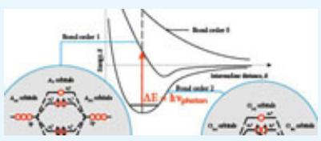</td></tr><tr><td>2. Vibrational Motion of a Molecule</td><td>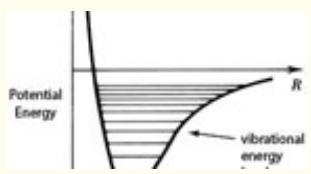</td></tr><tr><td>3. Rotational Motion of a Molecule</td><td>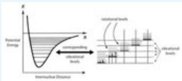</td></tr><tr><td>4. Formation of Ozone</td><td>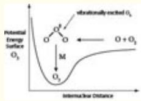</td></tr><tr><td>5. Molecularity of a Chemical Reaction</td><td>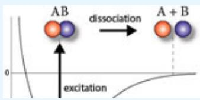</td></tr><tr><td>6. Chemical Reactions and Molecular Collisions</td><td>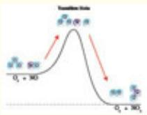</td></tr><tr><td>7. Overall Reaction vs. Elementary Reaction</td><td> $CH_{4} + 2O_{2} \rightarrow CO_{2} + 2H_{2}O$ (1)  $CH_{4} \rightarrow CH_{3}^{-} + H^{-}$ (2)  $O_{2} \rightarrow 2O^{-}$ (3)  $CH_{3}^{-} + O^{-} \rightarrow CH_{2}O + H^{-}$ (4)  $H^{+} + O^{-} \rightarrow HO^{-}$ </td></tr><tr><td>8. Determination of the Reaction Rate Constant</td><td>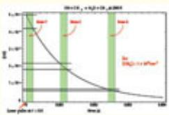</td></tr><tr><td>9. Reaction Order</td><td>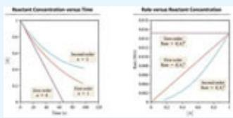</td></tr><tr><td>10. Integration of the Rate Law</td><td>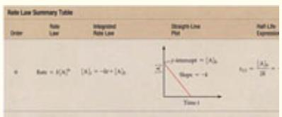</td></tr><tr><td>11. Steady State Approximation</td><td>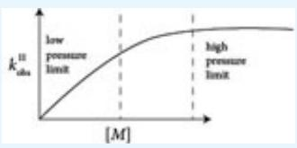</td></tr><tr><td>12. Arrhenius Expression for Temperature Dependence</td><td>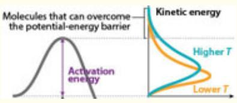</td></tr></table>

## Kinetics

As mentioned, kinetics constitutes the foundation for an immense array of topics in modern chemistry as displayed in Figure 12.15.

:::{figure} ../images/fig-p1-ch12-31.jpg
:name: fig-p1-ch12-31
:alt: FIGURE 12.15 Chemical kinetics is a branch of chemistry that is important for the understanding of many topics in modern chemistry. The rate at which a chemical reaction occurs significantly affects pathways in organic synthesis that in tur
FIGURE 12.15 Chemical kinetics is a branch of chemistry that is important for the understanding of many topics in modern chemistry. The rate at which a chemical reaction occurs significantly affects pathways in organic synthesis that in turn establishes the strategy for developments in pharmaceuticals. Living organisms are sustained by chemical reactions, the rates of which are temperature dependent. New materials are synthesized using a careful blend of reactions that take place in the gas phase and on surfaces. Solutions to and an understanding of the global structure of energy generation are built upon a foundation of chemical kinetics.
:::


Kinetics is therefore about rates in chemical and physical (and biological) processes; it is also about time scales in these processes and about timing, so we turn to the examination of the timing in these transitions on the molecular scale. Let's return to the potential energy surfaces and their associated bonding and antibonding molecular orbitals involved in the photodissociation of molecular oxygen.

We have developed a picture of the wave properties of electrons that forms the foundation for the atomic orbitals that constitute the “home” for electrons in those atoms. The geometry of those atomic orbitals establishes the structure of molecules because the molecular orbitals are built from the constructive (bonding) and destructive (antibonding) combination of atomic orbitals.

We have developed the basic idea concerning molecular orbitals and we have explored what happens when a molecule absorbs a photon of light by analyzing how electrons are “promoted” to a higher orbital, often resulting in the dissociation of the molecule into atoms or fragments of molecules. We have calculated the orbital period of the electron and discovered that it is short compared with any other type of molecular motion—vibration, rotation, or translation. We have discovered three important types of chemical reactions that are uniquely defined by the potential energy surface over which the reaction takes place: unimolecular reactions that involve a single reacting molecule; bimolecular reactions that involve two reacting molecules; and termolecular reactions that involve three molecules. We have applied these principles to the photochemistry of oxygen and to the formation of ozone from molecular oxygen in Earth's atmosphere. We turn now to the question of how the rate of a chemical reaction is defined and how it is determined.

## Key Reaction in Extraction of Energy from Natural Gas

```{math}
:label: eq-p1-ch12-11
\mathrm{CH} _ {4} + \mathrm{OH} \rightarrow \mathrm{CH} _ {3} + \mathrm{H} _ {2} \mathrm{O}
```


Rate of the Reaction: Reactants

```{math}
:label: eq-p1-ch12-12
R = - \frac {\Delta [ \mathrm{OH} ]}{\Delta t} = - \frac {\Delta [ \mathrm{CH} _ {4} ]}{\Delta t}
```


The rate of the reaction counts the number of times the reaction is completed per unit time by counting the change in the number of molecules per cubic centimeter, per unit time.

```{math}
:label: eq-p1-ch12-13
\Delta (\mathrm {molecules / c m^ {3}})
```


```{math}
:label: eq-p1-ch12-14
\Delta t
```


Rate of the Reaction: Products

```{math}
:label: eq-p1-ch12-15
R = + \frac {\Delta [ \mathrm{CH} _ {3} ]}{\Delta t} = \frac {\Delta [ \mathrm{H} _ {2} \mathrm{O} ]}{\Delta t}
```


:::{figure} ../images/fig-p1-ch12-32.jpg
:name: fig-p1-ch12-32
:alt: Figure from the University Chemistry source textbook
:::

The rate of a reaction, $R ,$ is a single quantity that establishes the number of times per second that a reaction is completed. The rate of the reaction, $R ,$ thus is a quantity that applies to both reactants and products. Because reactants are disappearing, their rate is taken as the negative value of the time rate of change of the reactants. Because products are appearing, their rate is taken as the positive value of the time rate of change of the products.

## Chemical Reactions and Molecular Collisions

The development of molecular orbital theory, as we have just seen, opens the pathway for understanding how photons interact with molecular structures by promoting one (or more) electron(s) to a higher energy orbital. This promotion of an electron leads to the idea of photodissociation of a single molecule on a specific potential energy surface. Thus the idea of a unimolecular reaction and, more generally, of the molecularity of a chemical reaction—unimolecular, bimolecular, and termolecular reactions, each occurring on a specific potential energy surface.

While unimolecular reactions and termolecular reactions are very common in nature, indeed our survival depends on them, the bimolecular reaction is often the centerpiece of chemical reaction studies. The reason is that they are very common, and they involve the collision of two molecules (or an atom and a molecule or just two atoms) that are the reactants leading to the formation of two products as displayed in Figure 12.12 and Figure 12.13.

A key point therefore, is that a chemical reaction cannot occur unless a collision occurs between two reactants that may or may not engage in a bond rearrangement leading to products of the reaction.

So we can immediately deduce the fact that because a reaction requires a collision, a chemical reaction cannot occur at a rate faster than the rate at which reactant molecules collide. If we could shrink to the size of a molecule as it collides with others, it would be a very revealing ride. It would also be a wild ride. First, as we know from Chapter 1, we would be moving at the speed of a high velocity bullet: 500 m/sec or approximately 1000 miles per hour. Suppose for example we could ride around on an ozone molecule (a convenient shape!) as shown in Figure 12.16 in a mixture of $\mathrm { { O } } _ { 3 }$ and NO.

:::{figure} ../images/fig-p1-ch12-33.jpg
:name: fig-p1-ch12-33
:alt: FIGURE 12.16 If we could ride around on the back of an ozone molecule, it is important to imagine what we would experience.
FIGURE 12.16 If we could ride around on the back of an ozone molecule, it is important to imagine what we would experience.
:::


Electrons would be moving within the structure of ozone measured on a time scale of $\displaystyle { { \bf 1 0 } ^ { - 1 6 } }$ seconds—the period of electron motion. The $\mathrm { { O } } _ { 3 }$ molecule would execute a full vibration every $1 0 ^ { - 1 4 }$ seconds and our “ride” would be pitching end over end, rotating every ${ \bf 1 0 } ^ { - 1 2 }$ seconds. The immediate question for us is: if we were in this mixture of $\mathrm { { O } } _ { 3 }$ and NO at one atmosphere pressure, how many times would we collide with another molecule of ozone or NO?

The rate at which we would collide with other molecules in this mixture, which we will call $\mathrm { Z _ { m o l e c } , }$ is just the number of collisions per second:

Z<sub>molec</sub> = rate of collisions taking place = number of collisions/sec.

Fortunately, we have already addressed this problem. In Chapter 1 we calculated the number of collisions between molecules in a gas and the wall of the vessel containing those molecules. We determined that the approximate collision rate between molecules in a gas and the wall, which we will call, $Z _ { \mathrm { w a l l } } .$ is

```{math}
:label: eq-p1-ch12-16
Z _ {\mathrm{wall}} \approx \frac {N}{\Delta t} = \frac {N v _ {x}}{L} = N v _ {x} A / V
```


where N is the number of gas molecules in the volume, V; Δt is the period between collisions of a single molecule moving with velocity ${ \bf v } _ { \mathrm { x } }$ in the x direction; and A is the area of the container wall. If [X] is the concentration of molecules in the gas (equal to N/V), and $\bar { \bf V }$ is the average velocity of the molecules in the gas, which we will approximate as $\begin{array} { r } { \bar { \bf v } \approx { \bf v } _ { \bf x } , } \end{array}$ then $\mathrm { Z _ { w a l l } } = \mathrm { [ X ] } \bar { \mathrm { v A } }$ We can use this expression to estimate the collision rate between molecules. The first step is to replace the area of the wall, A, by the collision cross section between two molecules each of radius r that defines a mutual collision area of $\pi ( 2 \mathbf { r } ) ^ { 2 } = \pi \mathbf { d } ^ { 2 }$ . This is shown in Figure 12.17. Thus for molecular collisions we have as a reasonable approximation for the number of collisions per second

```{math}
:label: eq-p1-ch12-17
Z _ {\mathrm{molec}} = [ X ] \bar {v} \pi d ^ {2}
```


:::{figure} ../images/fig-p1-ch12-34.jpg
:name: fig-p1-ch12-34
:alt: FIGURE 12.17 The cross section for a collision between two molecules with diameters mathematical notation and mathematical notation can be approximated as ½ the sum of the two diameters. Then the area of the cross section for the collision
FIGURE 12.17 The cross section for a collision between two molecules with diameters ${ \mathsf { d } } _ { 1 }$ and ${ \sf d } _ { 2 }$ can be approximated as ½ the sum of the two diameters. Then the area of the cross section for the collision between the two molecules is ${ \boldsymbol { \pi } } \mathsf { d } ^ { 2 } _ { 1 2 }$ where ${ \mathsf { d } } _ { 1 2 } = \mathbb { 1 } _ { 2 } \left( { \mathsf { d } } _ { 1 } + { \mathsf { d } } _ { 2 } \right)$
:::


At one atmosphere pressure, [X] is given by $3 \times 1 0 ^ { 1 9 }$ molecules $/ { \mathrm { c m } } ^ { 3 } ,$ , the average velocity is $5 \times 1 0 ^ { 4 }$ cm/sec and a typical molecular diameter is ${ \mathrm { d } } = 3 \times$ $1 0 ^ { - 8 }$ so $\pi \mathrm { d } ^ { 2 } \approx 3 0 \times 1 0 ^ { - 1 6 } \mathrm { c m } ^ { 2 }$ . Thus

```{math}
:label: eq-p1-ch12-18
\begin{array}{r l} \mathrm {Z_ {molec}} & = [ \mathrm{X} ] \bar {\nu} \pi \mathrm{d} ^ {2} = (3 \times 1 0 ^ {1 9} \mathrm {molec / cm^ {3}}) (5 \times 1 0 ^ {4} \mathrm{cm/sec}) (3 0 \times 1 0 ^ {- 1 6} \mathrm {cm^ {2}}) \\ & = 5 \times 1 0 ^ {9} \text { collisions / sec } \end{array}
```


Thus in this ride on the back of an ozone molecule you would experience 5 billion collisions every second.

## Check Yourself 1

Before moving on to consider what it takes to actually realize a chemical reaction from one of these collisions, we look at one of these collisions; we look at one other question.

From the vantage point of the ozone molecule with a dimension of $\sim _ { 3 } \times$ $\mathbf { 1 0 ^ { - 8 } \ \mathrm { c m } = 3 \ \times \ \mathbf { 1 0 ^ { - 1 0 } } \mathrm { ~ m ~ = ~ 0 . 3 ~ n m ~ = ~ 3 . } }$ how far apart are the other molecules in the mixture? This question is easily answered because (1) we know how fast we are moving $( 5 \times 1 0 ^ { 4 } \mathrm { ~ c m / s e c } )$ and (2) we know the period of time between collisions

```{math}
:label: eq-p1-ch12-19
\tau_ {\mathrm{coll}} = \frac {1}{Z _ {\mathrm{molec}}} = \frac {1}{5 \times 1 0 ^ {9} \text { collisions   /   sec }}
```


```{math}
:label: eq-p1-ch12-20
= 2 \times 1 0 ^ {- 1 0} \sec
```


Thus, the distance between molecules in the mixture at STP, which we will call $\bf { S } _ { \mathrm { { m o l } } }$ for molecular separation is just

```{math}
:label: eq-p1-ch12-21
\begin{array}{r l} \mathrm {S_ {mol}} & = \nu \tau_ {\text {coll}} = (5 \times 1 0 ^ {4} \mathrm{cm/sec}) 2 \times 1 0 ^ {- 1 0} \mathrm{sec} \\ & = 1 \times 1 0 ^ {- 5} \mathrm{cm} = 1 \times 1 0 ^ {- 7} \mathrm{m} \\ & = 1 0 0 \mathrm{nm} \\ & = 1 0 0 0 \text{\AA} \end{array}
```


That is roughly 300 molecular diameters.

Now that we have established the rate of molecular collisions, we can now examine what is involved in the chemical reaction between an ozone molecule and a nitric oxide molecule. In order to execute a chemical reaction, the colliding $\mathrm { { O } } _ { 3 }$ and NO molecules must approach close enough that a bond transformation takes place. To accomplish this, the colliding molecules must overcome the repulsive barrier created by the electron-electron repulsion of the valence electrons in $\mathrm { { O } } _ { 3 }$ and NO. This repulsion establishes the height of

the barrier separating reactants $( \mathrm { O } _ { 3 }$ and NO) and products $( \mathrm { N O } _ { 2 }$ and $\mathrm { O } _ { 2 } )$ as shown in Figure 12.18.
:::{figure} ../images/fig-p1-ch12-35.jpg
:name: fig-p1-ch12-35
:alt: Figure from the University Chemistry source textbook
:::

However, even if the colliding $\mathrm { N O } / \mathrm { O } _ { 3 }$ pairs do possess sufficient kinetic energy to position the nuclei close enough for a bond rearrangement to take place, the geometric configuration of the positions of the oxygen and the nitrogen nuclei may make the required bond rearrangement difficult. As a result, no reaction takes place. On the potential energy surface, this nonreactive encounter would take the form displayed in Figure 12.19.

:::{figure} ../images/fig-p1-ch12-36.jpg
:name: fig-p1-ch12-36
:alt: FIGURE 12.19 If the barrier to reaction is too high, or the geometrical alignment of the molecules at the transition state is not conducive to product formation, the reactants will rebound from one another, resulting in no net chemical reac
FIGURE 12.19 If the barrier to reaction is too high, or the geometrical alignment of the molecules at the transition state is not conducive to product formation, the reactants will rebound from one another, resulting in no net chemical reaction.
:::


Thus, if we examine a mixture of $\mathrm { { O } } _ { 3 }$ and NO at the molecular level in a vessel at STP we will see collisions taking place at the rate of 5 billion a second, but only a very few will result in a reaction taking place. If we could measure the rate of the chemical reaction, we could immediately deduce the probability per collision that a reaction would take place because if $\mathrm { \mathbf { R } _ { o b s } }$ is the observed rate of the reaction and $\mathrm { Z _ { m o l e } }$ is the rate of molecular collisions, then the probability of a reaction taking place per collision, $\mathrm { P } _ { \mathrm { r e a c t } } ,$ is just

```{math}
:label: eq-p1-ch12-22
\mathrm {P_ {react} = R_ {obs} / Z_ {molec}}
```


The probability per collision of a reaction taking place, $\mathrm { \bf P } _ { \mathrm { r e a c t } } ,$ ranges from 1 to 1 in $1 0 ^ { 1 2 } ,$ , even for important reactions. That is a span in reaction probability of twelve orders of magnitude. So it is clear, if we are to understand a system of competing reactions, then we must understand the probability that the collisions between individual molecules will result in the formation of a given set of product molecules. Thus we must find a way to measure, to observe directly, the rate of a chemical reaction, $R _ { \mathrm { o b s } } .$

## The Overall Reaction vs. the “Elementary Reaction”

We use the reaction of methane with the hydroxyl radical as our prototype reaction to establish how the chemical kinetics of reactions in general are analyzed. We note first that the reaction is bimolecular. This means that it has a specific potential energy surface over which the reactants move in the course of the chemical reaction to form the products, $\mathrm { C H } _ { 3 } + \mathrm { H } _ { 2 } \mathrm { O }$ . Because the reaction proceeds over a single, well defined potential energy surface, the reaction is termed an “elementary reaction”; meaning that it is not a combination or a sequence of reactions that, when taken together, yield an “overall” chemical reaction, as is often the case. Rather, an “elementary reaction” is associated with a specific potential energy surface. In practice, it is not always easy to determine if a reaction as written is indeed an elementary reaction. Sometimes it takes hundreds of hours of experimental and theoretical work to prove a reaction is, in fact, an elementary reaction. But once established, the statement that a reaction is an elementary reaction means that the only entities (molecules or atoms) involved in the reaction are the ones cited as reactants and products.

To drive home the important distinction between an overall reaction and an elementary reaction, consider what happens in the combustion of natural gas to form the final oxidized products $\mathrm { C O } _ { 2 }$ and $\mathrm { H } _ { 2 } \mathrm { O }$ , which we generally write as $\mathrm { C H } _ { 4 } + 2 \mathrm { O } _ { 2 } \to \mathrm { C O } _ { 2 } + 2 \mathrm { H } _ { 2 } \mathrm { O }$ . Inspection of the mechanism in the sidebar that breaks the overall reaction, $\mathrm { C H } _ { 4 } + 2 \mathrm { O } _ { 2 } \to \mathrm { C O } _ { 2 } + 2 \mathrm { H } _ { 2 } \mathrm { O } _ { 3 }$ , into 11 “elementary reactions” each of which occurs on a single potential energy surface, reveals the large number of individual steps involved in the overall reaction.

Each of the individual steps in the reaction sequence displayed at left is an elementary reaction—it occurs on a single potential energy surface and it has an explicit molecularity: unimolecular, bimolecular, or termolecular. We can, in fact, identify the character of the potential energy surface by simple inspection for each step, once we are assured that the reaction as written is an elementary reaction: (1) The dissociation of methane to form the methyl radical and the hydrogen atom is a unimolecular reaction. (2) The dissociation of molecular oxygen to form two oxygen atoms is also a unimolecular reaction. (3) The reaction of the methyl radical with atomic oxygen to form formaldehyde plus a hydrogen atom is a bimolecular reaction. (4) The reaction of a hydrogen atom with $\mathrm { O } _ { 2 }$ to form the perhydroxyl radical is a termolecular reaction. (5) The reaction of a hydrogen atom with the perhydroxyl radical to form hydroxyl radicals is a bimolecular reaction. (6) The reaction of formaldehyde with the hydroxyl radical to form the CHO radical and water is a bimolecular reaction. (7) The dissociation of CHO to form carbon monoxide and the hydrogen atom is a unimolecular reaction. (8) The reaction of a carbon monoxide with the OH radical to form carbon monoxide and the hydrogen atom is a bimolecular reaction. (9) The reaction of hydrogen atoms to form molecular hydrogen is a termolecular reaction. (10) The reaction of oxygen atoms with molecular hydrogen to form hydroxyl radical and hydrogen atoms is a bimolecular reaction. Finally, (11) the reaction of hydroxyl radicals with atomic hydrogen to form water is a termolecular reaction. Notice a very important point, cancellation occurs such that the sum of the eleven elementary reactions equals the single net overall reaction $\mathrm { C H } _ { 4 } + \mathrm { O } _ { 2 } \to \mathrm { C O } _ { 2 } + \mathrm { H } _ { 2 } \mathrm { O }$

## What actually happens in the combustion of natural gas?

```{math}
:label: eq-p1-ch12-23
\mathrm{CH} _ {4} + 2 \mathrm{O} _ {2} \rightarrow \mathrm{CO} _ {2} + 2 \mathrm{H} _ {2} \mathrm{O}
```


$\mathrm { C H } _ { 4 } \to \mathrm { C H } _ { 3 } ^ { \cdot } + \mathrm { H } ^ { \cdot }$

$\mathrm { O } _ { 2 } \to 2 \mathrm { O } ^ { \cdot }$

$\mathrm { C } \mathrm { \tilde { H } } _ { 3 } \cdot \mathrm { + O } ^ { \cdot }  \mathrm { C H } _ { 2 } \mathrm { O } + \mathrm { H } ^ { \cdot }$

$\mathrm { H } ^ { \cdot } + \mathrm { O } _ { 2 } \to \mathrm { H O } _ { 2 } ^ { \cdot }$

$\mathrm { H } ^ { \cdot } + \mathrm { H } \bar { \mathrm { O } } , ^ { \cdot }  2 \bar { \mathrm { O H } } ^ { \cdot }$

$\mathrm { C H } _ { 2 } \mathrm { O } + \mathrm { \bar { O } H } ^ { \cdot }  \mathrm { C H O } ^ { \cdot } + \mathrm { H } _ { 2 } \mathrm { O }$

$\mathrm { C H O ^ { \cdot } \to C O + H ^ { \cdot } }$

$\mathrm { C O } + \mathrm { O H } ^ { * } \twoheadrightarrow \mathrm { C O } _ { 2 } + \mathrm { H } ^ { * }$

$\mathrm { H } ^ { \cdot } + \mathrm { H } ^ { \cdot }  \mathrm { H } _ { 2 }$

```{math}
:label: eq-p1-ch12-24
\mathrm{O} ^ {\cdot} + \mathrm{H} _ {2} \rightarrow \mathrm{OH} ^ {\cdot} + \mathrm{H} ^ {\cdot}
```


$\mathrm { O H } ^ { \cdot } + \mathrm { \bar { H } } ^ { \cdot }  \mathrm { H } _ { 2 } \mathrm { O }$

$\mathrm { C H } _ { 4 } + 2 \mathrm { O } _ { 2 } \to \mathrm { C O } _ { 2 } + 2 \mathrm { H } _ { 2 } \mathrm { O }$

It is routine to write the combustion of a hydrocarbon, such as methane or octane or any other combustible material, in the form hydrocarbon $+ \textrm { O } _ { 2 } $ $\mathrm { H } _ { 2 } \mathrm { O } + \mathrm { C O } _ { 2 }$ But even for the simplest case, $\mathrm { C H } _ { 4 } + 2 \mathrm { O } _ { 2 } \to \mathrm { C O } _ { 2 } + 2 \mathrm { H } _ { 2 } \mathrm { O }$ , this is a net, overall reaction. It does not occur on a specific potential energy surface. Rather, the reaction of $\mathrm { C H } _ { 4 }$ with $\mathrm { O } _ { 2 }$ is comprised of a sequence of reactions, each of which takes place on a specific potential energy surface. The sum of those “elementary reactions”—the specific unimolecular, bimolecular, and termolecular reactions—then constitutes the net overall reaction.

## Determination of the Rate of a Chemical Reaction

We return to the dissection of the kinetics of methane and the hydroxyl radical. How do we observe the rate of disappearance of one species in the presence of another? There are many ways, but one important possibility, shown schematically in Figure 12.20, would be to design a system whereby a laser pulse is used to form an initial OH concentration, $[ \mathrm { O H } ] _ { \mathrm { i n i t } } ,$ in a mixture of an inert gas, for example argon. The other reactant, $\mathrm { C H } _ { 4 } ,$ , would have been mixed with the argon before adding the mixture to the reaction vessel. Then, following the formation of OH by the laser pulse, for example by the photodissociation of hydrogen peroxide,

```{math}
:label: eq-p1-ch12-25
\mathrm {H_ {2} O_ {2}} + h \nu \rightarrow \mathrm{OH} + \mathrm{OH}
```


the OH thus formed would react with $\mathrm { C H } _ { 4 }$ in the bimolecular reaction

```{math}
:label: eq-p1-ch12-26
\mathrm{CH} _ {4} + \mathrm{OH} \rightarrow \mathrm{CH} _ {3} + \mathrm{H} _ {2} \mathrm{O}.
```


The decay of [OH] with time, by reaction with $\mathrm { C H } _ { 4 } .$ , is displayed in Figure 12.21.

:::{figure} ../images/fig-p1-ch12-37.jpg
:name: fig-p1-ch12-37
:alt: FIGURE 12.20 The rates of chemical reactions can be studied by a number of different methods, but in order to study a rate of reaction, it is necessary to establish time resolution in the measurement of the disappearance of one chemical spe
FIGURE 12.20 The rates of chemical reactions can be studied by a number of different methods, but in order to study a rate of reaction, it is necessary to establish time resolution in the measurement of the disappearance of one chemical species in the presence of another. One way to achieve this time resolution is to use a laser pulse to form one of the reactants and then monitor the rate of decay of tha molecule with a second laser. This technique is called “flash photolysis.”
:::


:::{figure} ../images/fig-p1-ch12-38.jpg
:name: fig-p1-ch12-38
:alt: FIGURE 12.21 Following the formation of OH by flash photolysis, for example by using a laser pulse to break apart hydrogen peroxide mathematical notation , OH decays with time in the presence of mathematical notation in the reaction mathema
FIGURE 12.21 Following the formation of OH by flash photolysis, for example by using a laser pulse to break apart hydrogen peroxide $( \mathsf { H } _ { 2 } \mathsf { O } _ { 2 } + h v \xrightarrow { \vartriangle } { \mathsf { O H } } + \dot { \mathsf { O H } } )$ , OH decays with time in the presence of $\mathsf { C H } _ { 4 }$ in the reaction $\mathsf { C H } _ { 4 } + \mathsf { O H } \to \mathsf { C H } _ { 3 } + \mathsf { H } _ { 2 } \mathsf { O }$ . The concentration of hydroxyl, [OH], drops very rapidly at first, as shown in zone 1. The rate of the reaction $R = - \Delta [ \mathsf { O H } ] / \Delta ^ { \prime }$ t is the slope of the [OH] decrease with time, with the minus sign designating that OH is removed in the reaction. The rate of the reaction, $R ,$ decreases as time progresses. Thus, $R = - \Delta [ \mathsf { O } \mathsf { H } ] / \Delta t$ is less in zone 2 than zone 1, etc.
:::


With the ability to resolve in time the decay of OH in the presence of $\mathrm { C H } _ { 4 } ,$ we are in a position to actually determine the rate of the reaction, $\mathrm { R _ { o b s } } .$ We make a strategic decision first, by recognizing that if the concentration of methane, $\mathrm { [ C H _ { 4 } ] }$ (where the square brackets indicate the molecular concentration in molecules/cm<sup>3</sup>), is adjusted such that $\mathrm { [ C H _ { 4 } ] \ > > \ [ O H ] _ { i n i t } , }$ then $\mathrm { [ C H _ { 4 } ] }$ will change very little through the course of the reaction $\mathrm { C H } _ { 4 } +$ $\mathrm { O H \to C H _ { 3 } + H _ { 2 } O }$ . So we now observe, with a laser, the disappearance of OH in the presence of $\mathrm { C H } _ { 4 }$ , and we plot those data as a function of time. The time axis is determined by knowing the time over which the decay of OH has occurred. The results from an actual experiment are shown in Figure 12.21.

In order to analyze the kinetics of OH loss in the presence of $\mathrm { C H } _ { 4 } \mathrm { : }$ , we first break the decay curve of OH into zones to calculate the rate of the reaction

```{math}
:label: eq-p1-ch12-27
R _ {\mathrm{obs}} = - \Delta [ \mathrm{OH} ] / \Delta t
```


that measures the change in OH concentration, $\Delta [ \mathrm { O H } ]$ , over a time increment, $\Delta t .$ . Inspection of Figure 12.21 reveals that $- \Delta [ \mathrm { O H } ] / \Delta t$ in each of the three zones is

```{math}
:label: eq-p1-ch12-28
- \Delta [ \mathrm{OH} ] / \Delta t = \frac {8 \times 1 0 ^ {9} \mathrm {molecules / cm^ {3}}}{2 \times 1 0 ^ {- 4} \mathrm{sec}} = 4 \times 1 0 ^ {1 3} \mathrm {molecules / cm^ {3} sec}
```


Zone 2:

```{math}
:label: eq-p1-ch12-29
\begin{array}{l} {- \Delta [ \mathrm{OH} ] / \Delta t = \frac {3 . 8 \times 1 0 ^ {9} \mathrm {molecules / c m^ {3}}}{2 \times 1 0 ^ {- 4} \mathrm{sec}} = 1. 9 \times 1 0 ^ {1 3} \mathrm {molecules / c m^ {3} sec}} \\ {- \Delta [ \mathrm{OH} ] / \Delta t = \frac {1 \times 1 0 ^ {9} \mathrm {molecules / c m^ {3}}}{2 \times 1 0 ^ {- 4} \mathrm{sec}} = 5 \times 1 0 ^ {1 2} \mathrm {molecules / c m^ {3} sec}} \\ {\textbf {Z o n e 3 :}} \end{array}
```


Two conclusions emerge. First, the slope of the [OH] decays with time; $\Delta [ \mathrm { O H } ] / \Delta t$ decreases with time as the reaction proceeds. Second, nothing is constant in the analysis of the reaction of OH with methane: the concentrations are changing, the slope of the concentration with time is changing, and time is changing. Yet we seek to determine a coherent expression defining the probability that an OH radical will react with a $\mathrm { C H } _ { 4 }$ molecule at a given temperature and pressure. Is there any quantity that is constant in the course of the reaction?

## Determination of the Reaction Rate Constant

After inspection of Figure 12.21, we notice first that the rate of the reaction, R $\begin{array} { r l } { \mathrm { ~  ~ \omega ~ } } & { { } = \mathrm { ~ - \Delta [ O H ] } / \Delta t , } \end{array}$ , is changing continuously throughout the course of the reaction. Initially, OH is disappearing rapidly; but as the reaction progresses, the rate decreases until at times greater than about $4 \times 1 0 ^ { - 3 }$ seconds, the rate has slowed to something approaching zero.

As a first attempt, we try dividing the rate of the reaction, $- \Delta [ \mathrm { O H } ] / \Delta t$ , by the OH concentration within each time zone.

As the OH concentration decays out to longer times, the measurement of $\Delta [ \mathrm { O H } ]$ becomes more and more difficult and thus less and less accurate. But if we divide the rate of OH decay, $\Delta [ \mathrm { O H } ] / \Delta t ,$ , by the average OH concentration within each corresponding time increment, the rate $\Delta [ \mathrm { O H } ] / \Delta t$ divided by [OH] remains unchanged throughout the course of the reaction!

```{math}
:label: eq-p1-ch12-30
\begin{array}{l} \frac {- \Delta [ \mathrm{OH} ] / \Delta t}{[ \overline {{\mathrm{OH}}} ]} = \frac {4 \times 1 0 ^ {1 3} \mathrm{mol/cm} ^ {3} - \sec}{4 . 6 \times 1 0 ^ {1 0} \mathrm{mol/cm} ^ {3}} = 8. 7 \times 1 0 ^ {2} \sec^ {- 1} \\ \text {Zone 1:} \\ \frac {- \Delta [ \mathrm{OH} ] / \Delta t}{[ \overline {{\mathrm{OH}}} ]} = \frac {1 . 9 \times 1 0 ^ {1 3} \mathrm{mol/cm} ^ {3} - \sec}{2 . 0 \times 1 0 ^ {1 0} \mathrm{mol/cm} ^ {3}} = 9. 5 \times 1 0 ^ {2} \sec^ {- 1} \\ \text {Zone 2:} \\ \frac {- \Delta [ \mathrm{OH} ] / \Delta t}{[ \overline {{\mathrm{OH}}} ]} = \frac {5 \times 1 0 ^ {1 2} \mathrm{mol/cm} ^ {3} - \sec}{6 \times 1 0 ^ {9} \mathrm{mol/cm} ^ {3}} = 8. 3 \times 1 0 ^ {2} \sec^ {- 1} \\ \text {Zone3:} \end{array}
```


But that means that we have identified a constant, which we shall call $k _ { \mathrm { o b s } } .$ the observed reaction rate constant:

```{math}
:label: eq-p1-ch12-31
\frac {- \Delta [ \mathrm{OH} ]}{\Delta t} / [ \mathrm{OH} ] = k _ {\mathrm{obs}}
```


We are careful to label $k _ { \mathrm { o b s } }$ with the subscript “obs” to indicate that we have obtained this information through direct observation. We will soon see why the fact that we have observed this reaction rate constant is so important.

We can now write that the rate of the reaction, R, is just

:::{figure} ../images/fig-p1-ch12-39.jpg
:name: fig-p1-ch12-39
:alt: Figure from the University Chemistry source textbook
:::

But if $k _ { \mathrm { o b s } }$ is a constant, let's calculate what it is throughout the course of the reaction. To do this, we break the time increments into systematic steps, as displayed in Figure 12.22, and carry out the calculation at each step. This is displayed in Figure 12.22 and tabulated in Table 12.1.

TABLE 12.1

<table><tr><td></td><td> $\frac{-\Delta[OH]}{[OH]}$ </td></tr><tr><td>1</td><td>0.331</td></tr><tr><td>2</td><td>0.348</td></tr><tr><td>3</td><td>0.338</td></tr><tr><td>4</td><td>0.331</td></tr><tr><td>5</td><td>0.327</td></tr><tr><td>6</td><td>0.372</td></tr><tr><td>7</td><td>0.333</td></tr><tr><td>8</td><td>0.368</td></tr><tr><td>9</td><td>0.333</td></tr><tr><td>10</td><td>0.200</td></tr><tr><td></td><td> $\sum \frac{-\Delta[OH]}{[OH]} = 3.28$ </td></tr></table>

:::{figure} ../images/fig-p1-ch12-40.jpg
:name: fig-p1-ch12-40
:alt: FIGURE 12.22 With increasingly smaller time increments, mathematical notation the instantaneous rate mathematical notation can be determined more and more accurately. In the limit of mathematical notation , we can write the time rate of cha
FIGURE 12.22 With increasingly smaller time increments, $\Delta t ,$ the instantaneous rate $R = - \Delta [ \mathsf { O } \mathsf { H } ] / \Delta t$ can be determined more and more accurately. In the limit of $\Delta t \to 0$ , we can write the time rate of change of [OH] as a derivative $R = - d [ \mathrm { O H } ] / d t$ and then apply calculus to the mathematical analysis of the kinetics of $\mathsf { O } \mathsf { \bar { H } } + \mathsf { C } \mathsf { H } _ { 4 } \to \mathsf { H } _ { 2 } \mathsf { O } + \mathsf { C } \mathsf { H } _ { 3 }$
:::


We then calculate the rate over the course of the reaction, noting that we can rearrange the rate equation such that

```{math}
:label: eq-p1-ch12-32
\frac {- \Delta [ \overline {{{{\mathrm{OH}}}}} ]}{\Delta t} = k _ {\mathrm{obs}} [ \mathrm{OH} ] \text {   is   rewritten   } \frac {- \Delta [ \mathrm{OH} ]}{[ \overline {{{{\mathrm{OH}}}}} ]} = k _ {\mathrm{obs}} \Delta t.
```


We check to see that indeed, within experimental error, $\Delta [ \mathrm { O H } ] / [ \mathrm { O H } ]$ is constant and then we can calculate $k _ { \mathrm { o b s } }$ by summing $\Delta [ \mathrm { O H } ] / [ \mathrm { O H } ]$ for each increment and dividing by the time over which the decay of OH took place. So

```{math}
:label: eq-p1-ch12-33
\sum_ {i = 1} ^ {1 0} \left(\frac {- \Delta [ \mathrm{OH} ]}{[ \overline {{{{\mathrm{OH}}}}} ]}\right) _ {i} = \sum_ {i = 1} ^ {1 0} k _ {\mathrm{obs}} \Delta t _ {i} = k _ {\mathrm{obs}} \sum_ {i = 1} ^ {1 0} \Delta t _ {i}
```


So

```{math}
:label: eq-p1-ch12-34
k _ {\mathrm{obs}} = \sum_ {i = 1} ^ {1 0} \frac {- \Delta [ \mathrm{OH} ]}{[ \overline {{{\mathrm{OH}}}} ]} / \sum \Delta t _ {i}
```


But calculating each of the increments of $\Delta [ \mathrm { O H } ] / [ \overline { { \mathrm { O H } } } ]$ is quite tedious! So we examine the distinction between these average rates and the instantaneous rate as shown in Figure 12.23. As the OH concentration decays, the slope of $\Delta [ \mathrm { O H } ] / \Delta \mathrm { t }$ decreases such that whenever an average rate is calculated, that average rate will depart from the instantaneous rate at the beginning and end of the time increment $\Delta { \sf t }$ over which the average rate is taken. In the limit of very small time increments we can define the derivative of the OH concentration with time, as the time increment $\Delta t$ decreases toward zero. This allows us to reformulate kinetics within the mathematical structure of calculus, providing powerful tools and considerable simplification. We thus represent in the limit as $\Delta t \to 0 ,$ the average rate - $\Delta [ \mathrm { O H } ] / \Delta t$ approaching the instantaneous rate given by the derivative of the OH concentration with respect to time as

```{math}
:label: eq-p1-ch12-35
\begin{array}{l}\lim \left(\frac {- \Delta [ \mathrm{OH} ]}{\Delta t}\right) = \left. - d [ \mathrm{OH} ] / d t \right.\\\Delta t \rightarrow 0\end{array}
```


It follows from our experimentally deduced expression that

```{math}
:label: eq-p1-ch12-36
R _ {\mathrm{obs}} = \frac {\lim}{\Delta t \rightarrow 0} \left(- \frac {\Delta [ O H ]}{\Delta t}\right) = - \frac {d [ O H ]}{d t} = k _ {\mathrm{obs}} [ O H ]
```


The expression Rate of Reaction $\mathrm { = \mathrm { R _ { o b s } = - d [ O H ] / d t = k _ { o b s } [ O H ] } }$ has an important place in the study of chemical kinetics. It is termed the Rate Law that defines the relationship between the rate of reaction and the concentration of the reactant, in this case the OH radical. As the rate law expresses, the proportionality constant between the observed rate of reaction, $\mathrm { R _ { o b s } }$ and the reactant concentration, [OH], is the observed reaction rate constant, $\mathbf { k _ { \mathrm { o b s } } }$

:::{figure} ../images/fig-p1-ch12-41.jpg
:name: fig-p1-ch12-41
:alt: FIGURE 12.23 The decay of [OH] in the presence of mathematical notation can be expressed as an average rate, Δ[OH]/ mathematical notation over an arbitrarily long period. But because the rate mathematical notation is decreasing throughout t
FIGURE 12.23 The decay of [OH] in the presence of $\mathsf { C H } _ { 4 }$ can be expressed as an average rate, Δ[OH]/ $\Delta t ,$ over an arbitrarily long period. But because the rate $R = - \Delta [ \mathrm { O H } ] / \Delta t$ is decreasing throughout the course of the reaction, as the time interval $\Delta t$ becomes smaller, the determination of the rate at a particular instant of time becomes more accurate. As Δt approaches the limit of $\Delta t \to 0 ,$ , the average rate approaches the instantaneous rate.
:::


## The Reaction Rate Order: Determination of the Effect of Concentration on Reaction Rate

Because the concentration of OH, [OH], appears in the experimentally determined rate law raised to the first power, [OH]<sup>1</sup>, the rate law is referred to as first order with respect to [OH].

But now what happens if we double the concentration of methane in our laboratory system such that $\mathrm { [ C H _ { 4 } ] } = 2 \times 1 0 ^ { 1 5 }$ molecules/cm<sup>3</sup> rather than $\mathbf{1 } \times \mathbf{ }$ $\mathbf { 1 0 ^ { 1 5 } }$ molecules $/ { \mathrm { c m } } ^ { 3 } { \mathrm { . } }$ , as was the case in the first experiment. When we rerun the experiment at twice the concentration of $\mathrm { C H } _ { 4 }$ , the decay plot shows a rather significant difference, as displayed in Figure 12.24.

:::{figure} ../images/fig-p1-ch12-42.jpg
:name: fig-p1-ch12-42
:alt: FIGURE 12.24 We can use the same experimental apparatus (Figure 12.20) to study the kinetics of OH + mathematical notation as a function of the methane concentration. This can be done by repeating the experiments tracking OH decay, but with
FIGURE 12.24 We can use the same experimental apparatus (Figure 12.20) to study the kinetics of OH + $\mathsf { C H } _ { 4 } \to \mathsf { H } _ { 2 } \mathsf { O } + \mathsf { C H } _ { 3 }$ as a function of the methane concentration. This can be done by repeating the experiments tracking OH decay, but with different concentrations of $\mathsf { C H } _ { 4 }$ . Shown here are decay plots of OH in the presence of a methane concentration of $[ \mathsf { C H } _ { 4 } ] = 1 \times 1 0 ^ { 1 5 } \mathsf { c m } ^ { - 3 }$ and with $[ \mathsf { C H } _ { 4 } ]$ doubled to $[ \mathsf { C H } _ { 4 } ] = 2 \times 1 0 ^ { 1 5 } \mathsf { c m } ^ { - 3 }$
:::


We know how to analyze the decay of OH in the presence of the reactant $\mathrm { C H } _ { 4 }$ in specific “zones” of time.

```{math}
:label: eq-p1-ch12-37
\frac {- \Delta [ \mathrm{OH} ] / \Delta t}{[ \overline {{\mathrm{OH}}} ]} = \frac {7 \times 1 0 ^ {1 3} \mathrm{mol} / \mathrm{cm} ^ {3} - \sec}{4 . 2 \times 1 0 ^ {1 0} \mathrm{mol} / \mathrm{cm} ^ {3}} = 1. 8 \times 1 0 ^ {3} \sec^ {- 1} \quad \frac {- \Delta [ \mathrm{OH} ] / \Delta t}{[ \overline {{\mathrm{OH}}} ]} = \frac {1 . 5 \times 1 0 ^ {1 3} \mathrm{mol} / \mathrm{cm} ^ {3} - \sec}{8 \times 1 0 ^ {9} \mathrm{mol} / \mathrm{cm} ^ {3}} = 1. 8 \times 1 0 ^ {3} \sec^ {- 1}
```


This demonstrates in comparison with our first experiment that, since

```{math}
:label: eq-p1-ch12-38
\frac {- \Delta [ \mathrm{OH} ] / \Delta t}{[ \overline {{{{\mathrm{OH}}}}} ]} = k _ {\mathrm{obs}},
```


the reaction rate constant has doubled for a doubling of $\mathrm { [ C H _ { 4 } ] }$ because

```{math}
:label: eq-p1-ch12-39
\frac {- \Delta [ \mathrm{OH} ] / \Delta t}{[ \overline {{\mathrm{OH}}} ]} \quad \text { has   doubled: }
```


The value of the reaction rate constant, $k _ { \mathrm { o b s } } ,$ has increased from $9 \times 1 0 ^ { 2 } \ \mathrm { s e c ^ { - 1 } }$ to $1 . 8 \times 1 0 ^ { 3 } \mathrm { s e c } ^ { - 1 }$ . That is, when $\mathrm { [ C H _ { 4 } ] }$ is doubled, $k _ { \mathrm { o b s } }$ is also doubled. This is an important observation because, from previous experiments, we demonstrated that

```{math}
:label: eq-p1-ch12-40
\frac {- d [ \mathrm{OH} ]}{d t} = k _ {\mathrm{obs}} [ \mathrm{OH} ].
```


But we now see that $k _ { \mathrm { o b s } } \propto \mathrm { [ C H _ { 4 } ] }$ ; that is the first-order reaction rate constant, which we now designate as $k _ { \mathrm { \mathrm { \phi o b s } } } ^ { \mathrm { I } }$ , is in fact equal to the product of another constant multiplied by the concentration of methane in the reaction zone, $\mathrm { [ C H _ { 4 } ] }$ . Thus we can write

```{math}
:label: eq-p1-ch12-41
k _ {\mathrm{obs}} ^ {\mathrm{I}} = k _ {\mathrm{obs}} ^ {\mathrm{II}} \left[ \mathrm{CH} _ {4} \right]
```


where $k _ { \mathrm { \ o b s } } ^ { \mathrm { I I } }$ is the second-order reaction rate constant. So we can write the rate law for the reaction as

```{math}
:label: eq-p1-ch12-42
\frac {- d [ \mathrm{OH} ]}{d t} = k _ {\mathrm{obs}} ^ {\mathrm{II}} [ \mathrm{CH} _ {4} ] [ \mathrm{OH} ]
```


Note that the units of the second-order reaction rate constant $k _ { \mathrm { \ o b s } } ^ { \mathrm { I I } }$ are,

```{math}
:label: eq-p1-ch12-43
\left[ \frac {\mathrm{cm} ^ {3}}{\text { molecule } \cdot \sec} \right]
```


from a unit analysis of our second-order rate law.

In chemical kinetics, it is very important to keep an eye on the units of the reaction rate constants because the units of the reaction rate constant tell you the order of the reaction.

We can diagnose the overall order of a reaction by a simple test. If we plot the natural logarithm of the OH concentration, ln[OH], as a function of time in our laser experiment, we notice a key characteristic of the reaction. First, the plot of ln[OH] versus reaction time is linear over the course of the reaction. Second, the slope of ln[OH] versus t is proportional to $\mathrm { [ C H _ { 4 } ] }$ , but still linear. This is shown in Figure 12.25.

:::{figure} ../images/fig-p1-ch12-43.jpg
:name: fig-p1-ch12-43
:alt: FIGURE 12.25 In the analysis of OH decay in the presence of mathematical notation , we have deduced that - (d[OH]/dt)/[OH] is a constant, mathematical notation . Integration of this expression results in the expression mathematical notation
FIGURE 12.25 In the analysis of OH decay in the presence of $\mathsf { C H } _ { 4 } ,$ , we have deduced that - (d[OH]/dt)/[OH] is a constant, $k _ { \mathrm { o b s } } .$ . Integration of this expression results in the expression $\left| \mathsf { n } [ \mathsf { O H } ] _ { \mathsf { f } } - \right.$ $\ln [ \mathrm { O H } ] _ { \mathrm { i } } = - k _ { \mathrm { o b s } } t$ . Graphing this result emphasizes that a plot of ln[OH] versus t is linear with a slope equal $\mathrm { t o } - k _ { \mathrm { o b s } } .$ . In addition, the slope is proportional to the methane concentration, $[ \mathsf { C H } _ { 4 } ]$
:::


This raises the question: can the rate law for a reaction $A + B  C + D$ be written in a general form

```{math}
:label: eq-p1-ch12-44
\mathrm{Rate} = R = k [ A ] ^ {m} [ B ] ^ {n}
```


where m and n are the order of the reaction with respect to the concentration of A and B respectively? The answer is, in general, yes and it is the convention to define:

m = reaction order with respect to A

n = reaction order with respect to B

and the overall order of the reaction = sum of the individual orders $= m + n$

This is where it is important to distinguish between the experimentally determined reaction rate, $\mathrm { R _ { o b s } }$ and the general form of the rate law ${ \textbf { R } } =$ $\mathrm { k [ A ] ^ { m } [ B ] ^ { n } }$ that has not yet been tested experimentally to establish the order of the reaction with respect to [A] and the order of the reaction with respect to [B].

Thus far we have built our understanding of the rate law upon experimental observation. We have arranged the experimental conductors such that the concentration of one species, OH, was much less than its reactive partner, $\mathrm { C H } _ { 4 }$ . This forced the reaction to be first order with respect to OH:

```{math}
:label: eq-p1-ch12-45
\mathrm{R} _ {\mathrm{obs}} = - \mathrm{d} [ \mathrm{OH} ] / \mathrm{dt} = \mathrm{k} _ {\mathrm{obs}} ^ {\mathrm{I}} [ \mathrm{OH} ]
```


We then reran the experiment at different concentrations of $\mathrm { C H } _ { 4 } ,$ demonstrating through direct observations that the rate of the reaction was proportional to $\mathrm { [ C H _ { 4 } ] }$ such that

```{math}
:label: eq-p1-ch12-46
\mathrm{R} _ {\mathrm{obs}} = - \mathrm{d} [ \mathrm{OH} ] / \mathrm{dt} = \mathrm{k} _ {\mathrm{obs}} ^ {\mathrm{I}} [ \mathrm{OH} ] = \mathrm{k} _ {\mathrm{obs}} ^ {\mathrm{II}} [ \mathrm{CH} _ {4} ] [ \mathrm{OH} ].
```


This begs the question: if there are first-order reactions and second-order reactions, are there zero-order reactions? Are there third-order reactions? The answer is yes to both questions. So let's look at each of these in order.

## Check Yourself 2

1. What is the difference between the rate of a chemical reaction and the rate law for a chemical reaction?

```{math}
:label: eq-p1-ch12-47
\mathrm{CH} _ {4} + \mathrm{OH} \rightarrow \mathrm{H} _ {2} \mathrm{O} + \mathrm{CH} _ {3}
```


2. Can the general form of the rate law be used to establish the order of the reaction?

1. The rate counts the number of times the reaction is completed per unit time:

```{math}
:label: eq-p1-ch12-48
\begin{array}{r l} R & = \frac {- d [ \mathrm{OH} ]}{d t} = \frac {- d [ \mathrm{CH} _ {4} ]}{d t} \\ & = \frac {d [ \mathrm{H} _ {2} \mathrm{O} ]}{d t} = \frac {d [ \mathrm{CH} _ {3} ]}{d t} \end{array}
```


The rate law for a chemical reaction establishes the functional form of the reactant concentration with respect to the time rate of change of reactant concentration. The general form of the rate law is related to the rate of the reaction, R, by:

```{math}
:label: eq-p1-ch12-49
R = \frac {- d [ \mathrm{OH} ]}{d t} = k \left[ \mathrm{CH} _ {4} \right] ^ {m} [ \mathrm{OH} ] ^ {n}
```


2. NO! The order of the reaction can only be established by experiment:

:::{figure} ../images/fig-p1-ch12-44.jpg
:name: fig-p1-ch12-44
:alt: Figure from the University Chemistry source textbook
:::

```{math}
:label: eq-p1-ch12-50
- \Delta [ \mathrm{OH} ] / _ {\Delta t} = k _ {\mathrm{obs}} [ \mathrm{OH} ]
```


```{math}
:label: eq-p1-ch12-51
- d [ \mathrm{OH} ] / _ {d t} = k _ {\mathrm{obs}} [ \mathrm{OH} ]
```


The Behavior of Zero-Order, First-Order, Second-Order, and Third-Order Kinetics

## Zero-Order Reactions

A very important category of chemical reactions follows the rate law

```{math}
:label: eq-p1-ch12-52
\mathrm{R} = - \mathrm{d} [ \mathrm{A} ] / \mathrm{dt} = \mathrm{k} [ \mathrm{A} ] ^ {0} = \mathrm{k}
```


wherein the rate of the reaction does not depend upon the concentration of the reacting species, yet the reactant A is decaying with time. Examples include the kinetics of the catalytic converter on a car or many examples of biological catalysts termed enzymes. If we take the example of the catalytic converter on an automobile, displayed in Figure 12.26, toxic species such as CO, NO, and unburned gasoline $( \mathrm { C _ { x } H _ { y } } )$ are converted to chemically inert substances such as $\mathrm { C O } _ { 2 } , \mathrm { H } _ { 2 } \mathrm { O }$ , and $\mathrm { N } _ { 2 } .$

:::{figure} ../images/fig-p1-ch12-45.jpg
:name: fig-p1-ch12-45
:alt: Figure from the University Chemistry source textbook
:::

When we examine what is occurring inside the catalytic converter, the first thing we notice is a meshed network that contains a large surface area of finely divided metals and metal oxides (Pt, Pd, ${ \mathrm { V } } _ { 2 } { \mathrm { O } } _ { 5 } , { \mathrm { C r } } _ { 2 } { \mathrm { O } } _ { 3 } ,$ and CuO). On the surface of those metal substrates, the incoming species from the automobile exhaust dissociates into carbon atoms, oxygen atoms, and nitrogen atoms, which are bound to the metal surface as shown for the case of NO in Figure 12.27.

:::{figure} ../images/fig-p1-ch12-46.jpg
:name: fig-p1-ch12-46
:alt: FIGURE 12.27 When an NO molecule strikes the surface of platinum it dissociates into an N atom and an O atom. Those atoms can migrate across the surface of platinum until N and O atoms collide to form mathematical notation and mathematical
FIGURE 12.27 When an NO molecule strikes the surface of platinum it dissociates into an N atom and an O atom. Those atoms can migrate across the surface of platinum until N and O atoms collide to form $\mathsf { N } _ { 2 }$ and $\mathsf { O } _ { 2 } ,$ . The product $\mathsf { N } _ { 2 }$ and $\mathsf { O } _ { 2 }$ then leave the metal surface returning to the gas phase.
:::


The dissociation of the toxic species is then followed on the metal surface by the recombination of the separated atoms into their most thermodynamically stable form: $\mathrm { C O } _ { 2 } , \mathrm { H } _ { 2 } \mathrm { O }$ , and $\mathrm { N } _ { 2 } .$ . But from the perspective of the kinetics, each of the NO molecules simply disappears onto the surface of the metal, which has a virtually limitless number of sites available to dissociate NO into N atoms and O atoms. The removal rate of NO is thus independent of the concentration of NO. The concentration of NO decreases, linearly, with time as shown in the left-hand panel of Figure 12.28.

```{math}
:label: eq-p1-ch12-53
- d [ \mathrm{NO} ] / d t = k [ \mathrm{NO} ] ^ {0} = k
```


Another important example is the catalytic destructions of ozone within the Antarctic ozone hole—a subject treated in some detail in Case Study 12.1.

:::{figure} ../images/fig-p1-ch12-47.jpg
:name: fig-p1-ch12-47
:alt: Figure from the University Chemistry source textbook
:::

:::{figure} ../images/fig-p1-ch12-48.jpg
:name: fig-p1-ch12-48
:alt: FIGURE 12.28 We can compare the concentration of reactant A as a function of time for zero-order, firstorder, and second-order kinetics as shown in the left-hand panel. The right-hand panel contrasts the rate of the reaction, -d[A]/dt, as a
FIGURE 12.28 We can compare the concentration of reactant A as a function of time for zero-order, firstorder, and second-order kinetics as shown in the left-hand panel. The right-hand panel contrasts the rate of the reaction, -d[A]/dt, as a function of concentration $[ \mathsf { A } ]$
:::


## First-Order Reactions

For the case of first-order reactions, the rate of reaction is proportional to the concentration of the reactant raised to the first power as we saw for our case of OH reacting with $\mathrm { C H } _ { 4 }$ when $[ \mathrm { C H _ { 4 } } ] { \scriptstyle > > } [ \mathrm { O H } ]$ . So in general for a first-order reaction

```{math}
:label: eq-p1-ch12-54
\mathrm{Rate} = \mathrm{k} [ \mathrm{A} ] ^ {1}
```


As a result, as the reaction progresses, the rate slows as the concentration of A decays. This behavior is reflected specifically for OH in Figure 12.21 and in general for species A in Figure 12.28. The rate of the reaction, R, versus reactant concentration is displayed in the right-hand panel of Figure 12.28, reflecting that linear increase in the rate as a function of the concentration of A.

## Second-Order Reactions

Following the logic of zero-order and first-order kinetics, second-order reactions are characterized by a rate of reaction that is proportional to the square of the reactant concentration:

```{math}
:label: eq-p1-ch12-55
\mathrm{Rate} = \mathrm{k} [ \mathrm{A} ] ^ {2}
```


As a result the rate of the reaction decreases more rapidly with time than is the case for first-order reactions. This is reflected graphically in the left-hand panel of Figure 12.28. In the right-hand panel of Figure 12.28 the rate of the reaction as a function of the concentration of A is seen to increase quadratically with increasing [A]. There is an important distinction to be made with respect to second-order reactions, a distinction that involves the difference between a reaction that is second order overall (such as the reaction of OH with $\mathrm { C H } _ { 4 } )$ and a reaction that is second order with respect to a specific reactant. We know how to express the order of the reaction for OH with $\mathrm { C H } _ { 4 }$

```{math}
:label: eq-p1-ch12-56
R _ {o b s} = - \frac {d [ \mathrm{OH} ]}{d t} = k _ {o b s} ^ {I I} [ \mathrm{OH} ] [ \mathrm{CH} _ {4} ]
```


The reaction is first order with respect to OH, first order with respect to $\mathrm { C H } _ { 4 } ,$ , second order overall. We successfully determined the order of the reaction and the kinetics of the reaction by judicious control of the relative concentrations of the reagents.

However, the reaction of OH with itself

```{math}
:label: eq-p1-ch12-57
\mathrm{OH} + \mathrm{OH} \rightarrow \mathrm{H} _ {2} \mathrm{O} + \mathrm{O}
```


which is a very important reaction in photochemical systems and in fabrication techniques for microcircuits, cannot be manipulated into firstorder kinetics because OH is reacting with itself. The rate of the reaction must be second order.

```{math}
:label: eq-p1-ch12-58
R = - \frac {1}{2} \frac {d [ O H ]}{d t} = k [ O H ] ^ {2}
```


This rate law is second order with respect to [OH] and second order overall. Notice also that the factor ½ appears because two OH radicals are removed each time the reaction is completed. Stated another way, if we are observing the disappearance of OH, the reaction is completed at one-half the rate at which OH is disappearing. This is an important point in kinetics and we consider it carefully after treating third-order kinetics.

We can summarize the disappearance of the reacting species with time for zero, first, and second order as shown schematically in Figure 12.28 as well as the rate of the reaction versus reactant concentration in the right-hand panel of Figure 12.28.

## Third-Order Reactions

We know that third-order reactions must exist because we have examined the formation of ozone on the potential energy surface of Figure 12.12

```{math}
:label: eq-p1-ch12-59
\mathrm{O} + \mathrm{O} _ {2} + \mathrm{M} \rightarrow \mathrm{O} _ {3} + \mathrm{M}
```


The rate law for the reaction is, if we are following the disappearance of O atoms in the presence of ozone

```{math}
:label: eq-p1-ch12-60
\text { Rate } = - \frac {d [ \mathrm{O} ]}{d t} = k _ {\mathrm{obs}} ^ {I I I} [ \mathrm{M} ] [ \mathrm{O} _ {2} ] [ \mathrm{O} ]
```


We will examine this very important class of reactions in this chapter, but it is clear that we can control the reagent concentrations such that $[ \mathrm { O } ] < <$ $[ \mathbf { O } _ { 2 } ]$ , [M]. This results in observed first-order dependence with respect to [O]:

```{math}
:label: eq-p1-ch12-61
R _ {\mathrm{obs}} = - \frac {d [ \mathrm{O} ]}{d t} = k _ {\mathrm{obs}} ^ {I} [ \mathrm{O} ]
```


Then we can rerun the experiment at different $\mathrm { O } _ { 2 }$ concentrations and determine the second-order reaction rate constant

```{math}
:label: eq-p1-ch12-62
R _ {\mathrm{obs}} = - \frac {d [ \mathrm{O} ]}{d t} = k _ {\mathrm{obs}} ^ {I I} [ \mathrm{O} _ {2} ] [ \mathrm{O} ]
```


Finally we can vary the concentration of that chaperone molecule, M, that serves as a chemically inert participant to remove vibrational energy from the vibrationally excited $\mathrm { O } _ { \phantom { \ddag } 3 } ^ { \ddag }$ as discussed in the Framework, to determine the third-order reaction rate constant

```{math}
:label: eq-p1-ch12-63
R _ {\mathrm{obs}} = - \frac {d [ \mathrm{O} ]}{d t} = k _ {\mathrm{obs}} ^ {I I I} [ \mathrm{M} ] [ \mathrm{O} _ {2} ] [ \mathrm{O} ]
```


These examples drive home the point that (1) the rate law defines the relationship between the rate of reaction and the reactant concentration, (2)

the order of the reaction depends upon experimental conditions, and (3) the order of a reaction can only be determined by experiment.

We turn next to the relationship between the stoichiometry and the statement of the rate law.

## Relationship between the Rate Equation and the Stoichiometric Coefficients

There is a key relationship between the stoichiometric coefficients and the rate equation that is made clear by this second-order reaction of OH reacting with itself to produce $\mathrm { H } _ { 2 } \mathrm { O } ~ + ~ \mathrm { O }$ . In particular, when we write a chemical reaction, the rate of the reaction, R, equals the number of times the chemical reaction, as written, is completed each second. However, if one of the reactants is removed at twice the rate the reaction is completed, then when that rate equation is written in terms of the time rate of change of that species, the rate of disappearance of that species must be multiplied by a factor of ½. For the reaction

```{math}
:label: eq-p1-ch12-64
\mathrm{OH} + \mathrm{OH} \rightarrow \mathrm{H} _ {2} \mathrm{O} + \mathrm{O}
```


OH will be disappearing at twice the rate that the reaction is completed. Thus, when the rate is written in terms of d[OH]/dt, the rate is

```{math}
:label: eq-p1-ch12-65
\mathrm{R} = - \frac {1}{2} \frac {\mathrm{d} [ \mathrm{OH} ]}{\mathrm{dt}}
```


When the rate is written in terms of $\mathrm { { d } [ \mathrm { { H _ { 2 } O } ] / \mathrm { { d t } } } }$ or $\mathrm { d } [ \mathrm { O } ] / \mathrm { d t }$ , only one of each of those products is created each time the reaction is completed so

```{math}
:label: eq-p1-ch12-66
\mathrm{R} = \frac {\mathrm{d} \left[ \mathrm{H} _ {2} \mathrm{O} \right]}{\mathrm{dt}} = \frac {\mathrm{d} [ \mathrm{O} ]}{\mathrm{dt}}
```


Because there is only one rate, $\mathbf { R } ,$ at which a reaction is completed, all those expressions for the rate must be equal, and thus

```{math}
:label: eq-p1-ch12-67
\mathrm{R} = - \frac {1}{2} \frac {\mathrm{d} [ \mathrm{OH} ]}{\mathrm{dt}} = \frac {\mathrm{d} [ \mathrm{H} _ {2} \mathrm{O} ]}{\mathrm{dt}} = \frac {\mathrm{d} [ \mathrm{O} ]}{\mathrm{dt}}
```


Another (and important) way of looking at this is that if we were observing the rate of disappearance of OH in the reaction

```{math}
:label: eq-p1-ch12-68
\mathrm{OH} + \mathrm{OH} \rightarrow \mathrm{H} _ {2} \mathrm{O} + \mathrm{O}
```


the OH radical would be disappearing at twice the rate at which the reaction is completed and therefore at twice the rate that $\mathrm { H } _ { 2 } \mathrm { O }$ or O are forward.

We can generalize this important fact in terms of the stoichiometric coefficients of the reaction

```{math}
:label: eq-p1-ch12-69
\mathrm{aA+bB} \rightarrow \mathrm{cC+dD}
```


The rate equation for this reaction would be

```{math}
:label: eq-p1-ch12-70
\mathrm{R} = - \frac {1}{\mathrm{a}} \frac {\mathrm{d} [ \mathrm{A} ]}{\mathrm{dt}} = - \frac {1}{\mathrm{b}} \frac {\mathrm{d} [ \mathrm{B} ]}{\mathrm{dt}} = \frac {1}{\mathrm{c}} \frac {\mathrm{d} [ \mathrm{C} ]}{\mathrm{dt}} = \frac {1}{\mathrm{d}} \frac {\mathrm{d} [ \mathrm{D} ]}{\mathrm{dt}}
```


## Integration of the Rate Law: Defining the Concentration as a Function of Time

When we look forward in time, we would like to understand, to predict, how the concentration of a given reactant will change with time. This ability to predict engages all time scales:

The dissociation of a molecule on a metal surface that occurs on the order of seconds on a catalytic surface.

The removal of alcohol from the bloodstream that occurs on the order of hours.

The removal of heavy metals from a coal burning power plant that occurs on the order of weeks.

The removal of chlorofluorocarbon from the stratosphere that occurs on the order of decades.

The removal of $\mathrm { C O } _ { 2 }$ added to the atmosphere by fossil fuel combustion that occurs on the time scale of centuries.

The relationship between concentration and time is greatly aided by our formulation of the rate law in terms of the derivative of the concentration because we can then use calculus to integrate that rate law to determine the concentration as a function of time. We consider here in order, zero-order, first-order, and second-order integrated rate laws.

## Zero-Order Integrated Rate Law

We know the functional form of the zero-order rate law

```{math}
:label: eq-p1-ch12-71
R = - \frac {d [ A ]}{d t} = k [ A ] ^ {o} = k
```


To integrate this rate expression, we rearrange

```{math}
:label: eq-p1-ch12-72
\mathrm{d} [ \mathrm{A} ] = - \mathrm{kdt}
```


and integrate both sides

```{math}
:label: eq-p1-ch12-73
\int_ {[ \mathrm{A} ] _ {0}} ^ {[ \mathrm{A} ] _ {t}} d [ \mathrm{A} ] = - \int_ {t = 0} ^ {t} k d t
```


to yield the relationship between $[ \mathrm { A l } _ { \mathrm { t } }$ at time t, the initial concentration $[ \mathrm { A } ] _ { 0 } ,$ and the rate constant:

```{math}
:label: eq-p1-ch12-74
[ \mathbf {A} ] _ {\mathrm{t}} - [ \mathbf {A} ] _ {\mathrm{o}} = - \mathbf {k t}
```


or

```{math}
:label: eq-p1-ch12-75
[ \mathrm{A} ] _ {\mathrm{t}} = - \mathrm{kt} + [ \mathrm{A} ] _ {\mathrm{o}}
```


When $[ \mathrm { A } ] _ { \mathrm { t } }$ is graphed against time, t, we have, as shown in Figure 12.29, the decay of $[ \mathrm { A } ]$ as a function of time.

:::{figure} ../images/fig-p1-ch12-49.jpg
:name: fig-p1-ch12-49
:alt: FIGURE 12.29 When the concentration of A, [A], is plotted against time for a zero-order reaction, the plot of [A] vs. t is linear with a slope of -k and an intercept of mathematical notation , the initial concentration of A.
FIGURE 12.29 When the concentration of A, [A], is plotted against time for a zero-order reaction, the plot of [A] vs. t is linear with a slope of -k and an intercept of $[ \mathsf { A } ] _ { 0 } ,$ , the initial concentration of A.
:::


The integrated form of the zero-order rate law is thus a linear relationship between the concentration of A, [A], and time with a slope of -k and an intercept of $[ \mathrm { A } ] _ { 0 } .$ . The integral form of the zero-order rate law reveals some very important characteristics of these reactions. First, note that unlike the first-order reaction, there is a clear endpoint to the reaction. For if

```{math}
:label: eq-p1-ch12-76
[ \mathrm{A} ] _ {\mathrm{t}} = - \mathrm{kt} + [ \mathrm{A} ] _ {0}
```


then when

```{math}
:label: eq-p1-ch12-77
[ \mathrm{A} ] _ {\mathrm{t}} = \mathrm{o} \qquad \mathbf {t} _ {\mathrm{end}} = [ \mathrm{A} ] _ {\mathrm{o}} / \mathbf {k}
```


and literally all the reactant is removed. It is for this reason that catalytic converters remove virtually all the NO and CO from the exhaust of an automobile. It is also why, as we will see in Case Study 12.1, chlorine and bromine compounds can destroy all the ozone in the stratosphere of the Earth.

## First-Order Integrated Rate Law

Consider our experimentally determined rate law for OH reacting with $\mathrm { C H } _ { 4 }$ :

```{math}
:label: eq-p1-ch12-78
R _ {o b s} = \frac {- d [ O H ]}{d t} = k _ {o b s} ^ {I} [ O H ]
```


If we wish to calculate the concentration of OH as a function of time throughout the course of the reaction, we must employ calculus to integrate the equation. First we rearrange the equation by dividing both sides by [OH] and multiplying both sides by dt:

```{math}
:label: eq-p1-ch12-79
- \frac {d [ O H ]}{[ O H ]} = k _ {o b s} ^ {I} d t
```


Then we integrate the left-hand side from the initial OH concentration at $\mathbf { t } =$ 0, [OH] , to the final OH concentration at time t, [OH] . The right-hand side is integrated from t = 0 to t:

```{math}
:label: eq-p1-ch12-80
- \int_ {[ O H ] _ {o}} ^ {[ O H ] _ {t}} \frac {d [ O H ]}{[ O H ]} = \int_ {t = 0} ^ {t} k _ {o b s} ^ {\mathrm{I}} d t
```


The left-hand side is just a specific form of the general integral

```{math}
:label: eq-p1-ch12-81
\int_ {x _ {1}} ^ {x _ {2}} d x / x = \ln x _ {2} - \ln x _ {1}
```


But ln ${ \bf { X } } _ { 2 } -$ ln $\mathrm { x } _ { 1 } = \mathrm { l n } ( \mathrm { x } _ { 2 } / \mathrm { x } _ { 1 } ) = - \mathrm { l n } ( \mathrm { x } _ { 1 } / \mathrm { x } _ { 2 } )$ . Thus we can integrate both sides.

```{math}
:label: eq-p1-ch12-82
\begin{array}{r l} - \int_ {[ \mathrm{OH} ] _ {o}} ^ {[ \mathrm{OH} ] _ {t}} d [ \mathrm{OH} ] / [ \mathrm{OH} ] & = \int_ {t = 0} ^ {t} k _ {o b s} ^ {I} d t \\ \downarrow \text { integrate } & \downarrow \text { integrate } \\ - \ln \left(\frac {[ \mathrm{OH} ] _ {t}}{[ \mathrm{OH} ] _ {o}}\right) & = k _ {o b s} ^ {I} t \end{array}
```


We can use the mathematical identity ln $( \mathrm { x } _ { 2 } / \mathrm { x } _ { 1 } ) = \ln \mathrm { x } _ { 2 } - \ln \mathrm { x } _ { 1 }$ to recast the integrated rate law

```{math}
:label: eq-p1-ch12-83
- \ln \left(\frac {[ \mathrm{OH} ] _ {t}}{[ \mathrm{OH} ] _ {o}}\right) = k _ {o b s} ^ {I} t
```


to give $\mathrm { l n [ O H ] _ { \ell } = - k _ { \ o b s } ^ { I } \ t + l n [ O H ] _ { o } }$ . This equation is just the slope-intercept equation for y as a function of ${ \bf x } , { \bf y } = { \bf m } { \bf x } + { \bf b }$ , where m is the slope of y vs. x and b is the intercept. Thus the relationship between $[ \mathrm { O H } ] _ { \mathrm { t } }$ and t can be represented graphically by plotting $\mathbf { l n } [ \mathrm { O H } ] _ { \mathrm { f } } \mathbf { v } \mathbf { s }$ . t as shown in Figure 12.30.

:::{figure} ../images/fig-p1-ch12-50.jpg
:name: fig-p1-ch12-50
:alt: FIGURE 12.30 When the natural log of the concentration of A, ln mathematical notation , is plotted against time for a reaction, if the observed kinetics is first order, that plot of ln [A] vs. time will be linear. The slope of the line is e
FIGURE 12.30 When the natural log of the concentration of A, ln $[ \mathsf { A l } ,$ , is plotted against time for a reaction, if the observed kinetics is first order, that plot of ln [A] vs. time will be linear. The slope of the line is equal to -k, and the intercept is ln $[ \mathsf { A l } _ { 0 }$ where $[ \mathsf { A l } _ { 0 }$ is the initial concentration.
:::


Next lets consider the integral form of the first-order rate law in the form

```{math}
:label: eq-p1-ch12-84
\ln ([ \mathrm{OH} ] _ {\mathrm{t}} / [ \mathrm{OH} ] _ {\mathrm{o}}) = - \mathrm{k} _ {\text { obs }} ^ {\mathrm{I}} \mathrm{t}
```


If we exponentiate this expression we have

```{math}
:label: eq-p1-ch12-85
\left[ O H \right] _ {t} = \left[ O H \right] _ {o} e ^ {- k _ {o b s} ^ {I} t}
```


Expressed this way, it raises the question: how can we succinctly express the time required to remove a certain fraction of the original concentration? If we could do this, it would provide a very straightforward way to compare how fast a given reaction or process is occurring relative to other examples.

Suppose we ask: how long would it take for half the original [OH] to disappear? We can use the above equation to solve for this time, which we will refer to as the half-life of the reaction, $\mathrm { t _ { 1 / 2 } } .$ . As it will turn out, this halflife is important in kinetics as well as in other fields such as radioactive decay.

## Check Yourself 3

Expressing the Percent of Reactant Consumed in a First-Order Reaction:

Use a value of $\mathrm { k } = 7 { \cdot } 3 0 \times 1 0 ^ { - 4 } \mathrm { \ s } ^ { - 1 }$ for the first-order decomposition of $\mathrm { H } _ { 2 } \mathrm { O } _ { 2 } ( \mathrm { a q } )$ to determine the percent $\mathrm { H } _ { 2 } \mathrm { O } _ { 2 }$ that has decomposed in the first 500.0 seconds after the reaction begins.

## Solution:

The ratio $\mathrm { [ H _ { 2 } O _ { 2 } ] _ { t } / [ H _ { 2 } O _ { 2 } ] _ { 0 } }$ represents the fractional part of the initial amount of $\mathrm { H } _ { 2 } \mathrm { O } _ { 2 }$ that remains unreacted at time t. Our problem is to evaluate this ratio at $t = 5 0 0 . 0 ~ \mathrm { s }$

```{math}
:label: eq-p1-ch12-86
\begin{array}{r l} & {\ln \frac {\left[ \mathrm{H} _ {2} \mathrm{O} _ {2} \right] _ {t}}{\left[ \mathrm{H} _ {2} \mathrm{O} _ {2} \right] _ {0}} = - k t = - 7. 3 0 \times 1 0 ^ {- 4} \mathrm{s} ^ {- 1} \times 5 0 0. 0 \mathrm{s} = - 0. 3 6 5} \\ & {\frac {\left[ \mathrm{H} _ {2} \mathrm{O} _ {2} \right] _ {t}}{\left[ \mathrm{H} _ {2} \mathrm{O} _ {2} \right] _ {0}} = e ^ {- 0. 3 6 5} = 0. 6 9 4 \quad \text { and } \quad \left[ \mathrm{H} _ {2} \mathrm{O} _ {2} \right] _ {t} = 0. 6 9 4 \left[ \mathrm{H} _ {2} \mathrm{O} _ {2} \right] _ {0}} \end{array}
```


The fractional part of the $\mathrm { H } _ { 2 } \mathrm { O } _ { 2 }$ remaining is $0 . 6 9 4 , \mathrm { o r } 6 9 . 4 \%$ . The percent of $\mathrm { H } _ { 2 } \mathrm { O } _ { 2 }$ that has decomposed is $1 0 0 . 0 \% - 6 9 . 4 \% = 3 0 . 6 \%$

Practice Example A: Consider the first-order reaction A → products, with $k = 2 . 9 5 \times 1 0 ^ { - 3 } \mathrm { ~ s ~ } ^ { - 1 }$ . What percent of A remains after 150 s?

Practice Example B: At what time after the start of the reaction is a sample of $\mathrm { H } _ { 2 } \mathrm { O } _ { 2 } ( \mathrm { a q } )$ two-thirds decomposed? $K = 7 . 3 0 \times 1 0 ^ { - 4 } \mathrm { { s ^ { - 1 } } \mathrm { { ? } } }$

If $\mathrm { { t = t _ { 1 / 2 } } }$ is the time required to remove ${ \mathbf { 1 } } / { \mathbf { 2 } }$ the original OH concentration then

```{math}
:label: eq-p1-ch12-87
\left[ \mathrm{OH} \right] _ {\mathrm{t}} = 1 / 2 \left[ \mathrm{OH} \right] _ {0}
```


```{math}
:label: eq-p1-ch12-88
\mathrm{and} \quad t = t _ {1 / 2}
```


so

```{math}
:label: eq-p1-ch12-89
[ \mathrm{OH} ] _ {\mathrm{t}} = 1 / 2 [ \mathrm{OH} ] _ {\mathrm{o}} = [ \mathrm{OH} ] _ {\mathrm{o}} \mathrm{e} ^ {- k _ {o b s} ^ {I} t _ {1 / 2}}
```


Solving for $\mathrm { t } _ { 1 / 2 }$ we have

```{math}
:label: eq-p1-ch12-90
\frac {1}{2} [ \mathrm{OH} ] _ {\mathrm{o}} = [ \mathrm{OH} ] _ {\mathrm{o}} e ^ {- k _ {\mathrm{obs}} ^ {I} t _ {1 / 2}}
```


so

```{math}
:label: eq-p1-ch12-91
\frac {1}{2} = e ^ {- k _ {\mathrm{obs}} ^ {I} t _ {1 / 2}}
```


and therefore

```{math}
:label: eq-p1-ch12-92
t _ {1 / 2} = \frac {- \ln \left(\frac {1}{2}\right)}{k _ {o b s} ^ {I}} = \frac {0 . 6 9 3}{k _ {o b s} ^ {I}}
```


This is an important result. It says that the period of time to remove $1 / 2$ the concentration of the reactant is independent of the initial concentration. This means that in every time increment $\phantom { + } 0 . 6 9 3 / \phantom { \rule { 0.3 em } { 0 ex } } k _ { \mathrm { o b s } } ^ { I }$ , the concentration of the reactant decreases by one-half. In our experiment observing the decay of OH in the presence of a methane concentration of $\mathrm { [ C H _ { 4 } ] } = \mathbf { 1 } \times \mathbf { 1 0 ^ { 1 5 } } \ : \mathrm { c m ^ { - 3 } }$ , [OH] dropped to half the original concentration in

```{math}
:label: eq-p1-ch12-93
t _ {1 / 2} = \frac {0 . 6 9 3}{k _ {o b s} ^ {I}} = \frac {0 . 6 9 3}{9 \times 1 0 ^ {2} \mathrm{sec} ^ {- 1}} = 7. 7 \times 1 0 ^ {- 4} \mathrm{sec}
```


But in each subsequent $7 . 7 \times 1 0 ^ { - 4 }$ seconds, the concentration dropped by a factor of two again.

Since we focused on the half-life of the first-order reaction, what is the half-life of a zero-order reaction? If $[ \mathrm { A } ] _ { \mathrm { t } } = 1 / 2 [ \mathrm { A } ] _ { \mathrm { o } }$ then we have

```{math}
:label: eq-p1-ch12-94
\left[ \mathrm{A} \right] _ {\mathrm{t}} = 1 / 2 \left[ \mathrm{A} \right] _ {0} = - \mathrm{kt} _ {1 / 2} + \left[ \mathrm{A} \right] _ {0}
```


```{math}
:label: eq-p1-ch12-95
\mathrm{and} \quad t _ {1 / 2} = [ A ] _ {0} / 2 k
```


In contrast to the behavior of first-order kinetics where $\mathrm { t } _ { 1 / 2 }$ is independent of the initial concentration, in the case of zero-order kinetics, the half-life is proportional to the initial concentration so if we begin with twice as much reactant, it will take twice as long to remove half of it.

## Check Yourself 4

Using the Integrated Rate Law for a First-Order Reaction and the use of M = moles/liters as a Concentration Unit: $\mathrm { H } _ { 2 } \mathrm { O } _ { 2 } ( \mathrm { a q } )$ initially at a concentration of 2.32 M, is allowed to decompose. What will $\mathrm { [ H } _ { 2 } \mathrm { O } _ { 2 } ]$ be at t = 1200 s? Use $k = \mathrm { } 7 { \cdot } 3 0 \times 1 0 ^ { - 4 } \mathrm { \ s } ^ { - 1 }$ for this first-order decomposition.

## Solution:

We have values for three of the four terms in equation $\mathrm { l n } [ \mathrm { A } ] _ { \mathrm { t } } = - k t +$ $\mathrm { l n } [ \mathrm { A } ] _ { 0 }$

```{math}
:label: eq-p1-ch12-96
k = 7. 3 0 \times 1 0 ^ {- 4} \mathrm{s} ^ {- 1}
```


```{math}
:label: eq-p1-ch12-97
t = 1 2 0 0 \mathrm{s}
```


```{math}
:label: eq-p1-ch12-98
\left[ \mathrm{H} _ {2} \mathrm{O} _ {2} \right] _ {0} = 2. 3 2 \mathrm{M}
```


```{math}
:label: eq-p1-ch12-99
[ \mathrm{H} _ {2} \mathrm{O} _ {2} ] _ {\mathrm{t}} = ?
```


The demonstration of first-order behavior depends on the observed dependence of concentration vs. time. In general, the order of a reaction can only be determined by direct experiment. An example is shown in the table.

<table><tr><td>t, s</td><td> $H_{2}O_{2}, M$ </td><td> $ln[H_{2}O_{2}]$ </td></tr><tr><td>0</td><td>2.32</td><td>0.842</td></tr><tr><td>200</td><td>2.01</td><td>0.698</td></tr><tr><td>400</td><td>1.72</td><td>0.542</td></tr><tr><td>600</td><td>1.49</td><td>0.399</td></tr><tr><td>1200</td><td>0.98</td><td>-0.020</td></tr><tr><td>1800</td><td>0.62</td><td>-0.48</td></tr><tr><td>3000</td><td>0.25</td><td>-1.39</td></tr></table>

:::{figure} ../images/fig-p1-ch12-51.jpg
:name: fig-p1-ch12-51
:alt: Figure from the University Chemistry source textbook
:::

which we substitute into the expression

```{math}
:label: eq-p1-ch12-100
\begin{array}{r l} \ln [ \mathrm{H} _ {2} \mathrm{O} _ {2} ] _ {\mathrm{t}} & = - k t + \ln [ \mathrm{H} _ {2} \mathrm{O} _ {2} ] _ {0} \\ & = - (7. 3 0 \times 1 0 ^ {- 4} \mathrm{s} ^ {- 1} \times 1 2 0 0 \mathrm{s}) + \ln 2. 3 2 \\ & = - 0. 8 7 6 + 0. 8 4 2 = - 0. 0 3 4 \\ & [ \mathrm{H} _ {2} \mathrm{O} _ {2} ] _ {\mathrm{t}} = e ^ {- 0. 0 3 4} = 0. 9 6 7 \mathrm{M} \end{array}
```


This calculated value agrees well with the experimentally determined value of 0.98 M.

Practice Example A: The reaction $\mathbf { A }  \mathbf { 2 } \textbf { B } + \mathbf { C }$ is first order. If the initial $[ \mathrm { A } ] = 2 . 8 0$ M and $k = 3 . 0 2 \times 1 0 ^ { - 3 } \mathrm { s ^ { - 1 } }$ , what is the value of [A] after 325 s?

Practice Example B: Use data tabulated in the above figure together with the equation ln $[ \mathrm { A } ] _ { \mathrm { t } } = - k t + \ln [ \mathrm { A } ] _ { \mathrm { o } }$ to show that the decomposition of $\mathrm { H } _ { 2 } \mathrm { O } _ { 2 }$ is a first-order reaction.

[Hint: Use a pair of data points for $[ \mathrm { H } _ { 2 } \mathrm { O } _ { 2 } ] _ { 0 }$ and $\mathrm { [ H } _ { 2 } \mathrm { O } _ { 2 } ]$ <sub>t</sub> and their corresponding times to solve for $k .$ Repeat this calculation using other sets of data. How should the results compare?]

## Second-Order Integrated Rate Law

In this case, for example the reaction of OH with itself

```{math}
:label: eq-p1-ch12-101
\mathrm{OH} + \mathrm{OH} \rightarrow \mathrm{H} _ {2} \mathrm{O} + \mathrm{O} _ {2}
```


we have the rate law

```{math}
:label: eq-p1-ch12-102
- d [ O H ] / _ {d t} = k _ {o b s} ^ {I I} [ O H ] ^ {2}
```


When we rearrange

```{math}
:label: eq-p1-ch12-103
\left. - d [ O H ] / [ O H ] ^ {2} = k _ {o b s} ^ {I I} d t \right.
```


and integrate from $\left[ \mathrm { O H } \right] _ { 0 }$ to $[ \mathrm { O H } ] _ { 1 }$

```{math}
:label: eq-p1-ch12-104
\int_ {[ O H ] _ {o}} ^ {[ O H ] _ {t}} \frac {d [ O H ]}{[ O H ] ^ {2}} = \int_ {t = 0} ^ {t} k _ {o b s} ^ {I I} d t
```


we use the general integral from

```{math}
:label: eq-p1-ch12-105
\int_ {x _ {1}} ^ {x _ {2}} \mathrm{d} x / x ^ {2} = \frac {1}{x _ {1}} - \frac {1}{x _ {2}}
```


```{math}
:label: eq-p1-ch12-106
- \int_ {[ \mathrm{OH} ] _ {o}} ^ {[ \mathrm{OH} ] _ {t}} \frac {d [ \mathrm{OH} ]}{[ \mathrm{OH} ] ^ {2}} = \int_ {t = 0} ^ {t} k _ {o b s} ^ {I I} d t
```


```{math}
:label: eq-p1-ch12-107
\downarrow \text { integrate } \quad \downarrow \text { integrate }
```


```{math}
:label: eq-p1-ch12-108
\frac {1}{[ \mathrm{OH} ] _ {t}} - \frac {1}{[ \mathrm{OH} ] _ {o}} = k _ {o b s} ^ {I I} t
```


or

```{math}
:label: eq-p1-ch12-109
\frac {1}{[ \mathrm{OH} ] _ {t}} = k _ {o b s} ^ {I I} t + \frac {1}{[ \mathrm{OH} ] _ {o}}
```


If we graph the concentration of [OH] versus time, the most convenient form is to plot $1 / [ \mathrm { O H } ]$ vs. t so the slope of the line is equal to $\operatorname { k } _ { \mathrm { \ o b s } } ^ { \mathrm { I I } }$ and the intercept is $1 / [ \mathrm { O H } ] _ { 0 }$ , as shown in Figure 12.31.

:::{figure} ../images/fig-p1-ch12-52.jpg
:name: fig-p1-ch12-52
:alt: FIGURE 12.31 When the observed kinetics is second order, a plot of 1/[A] is linear with respect to time with an intercept mathematical notation where [A]o is the initial concentration and a slope equal to the observed reaction rate constant
FIGURE 12.31 When the observed kinetics is second order, a plot of 1/[A] is linear with respect to time with an intercept $1 / [ \mathsf { A l } _ { 0 }$ where [A]o is the initial concentration and a slope equal to the observed reaction rate constant, k.
:::


As we did with the zero-order and first-order cases, we can calculate the half-life of a reactant in a second-order reaction by setting $\mathrm { [ O H ] _ { t } = 1 / _ { 2 } \left[ O H \right] _ { o } }$ and $\mathbf { t } = \mathbf { t } _ { 1 / 2 }$ so the above equation gives us

```{math}
:label: eq-p1-ch12-110
\frac {1}{[ \mathrm{OH} ] _ {t}} = \frac {1}{\frac {1}{2} [ \mathrm{OH} ] _ {o}} = k _ {o b s} ^ {I I} t _ {\frac {1}{2}} + \frac {1}{[ \mathrm{OH} ] _ {0}}
```


Solving for $\mathrm { { t } } _ { 1 / 2 }$

```{math}
:label: eq-p1-ch12-111
k _ {o b s} ^ {I I} t _ {1 / 2} = \frac {2}{[ \mathrm{OH} ] _ {0}} - \frac {1}{[ \mathrm{OH} ] _ {0}} = \frac {1}{[ \mathrm{OH} ] _ {0}}
```


and

```{math}
:label: eq-p1-ch12-112
t _ {1 / 2} = \frac {1}{k _ {o b s} ^ {I I} [ \mathrm{OH} ] _ {o}}
```


Thus the half-life of a second-order reaction depends inversely on the initial reactant concentration.

We can summarize the relationship between the order of a reaction, the rate law, the units of the reaction rate constant, the integral form of the rate law, the graphical relationship between concentration and time, and the expression for the half-life of the concentration, all displayed in Figure 12.32.

<table><tr><td colspan="5">Rate Law Summary Table</td></tr><tr><td>Order</td><td>Rate Law</td><td>Integrated Rate Law</td><td>Straight-Line Plot</td><td>Half-Life Expression</td></tr><tr><td>0</td><td> $Rate = k[A]^0$ </td><td> $[A]_t = -kt + [A]_0$ </td><td>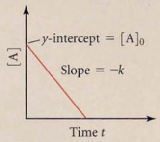</td><td> $t_{1/2} = \frac{[A]_0}{2k} = \frac{1}{k} \frac{[A]_0}{2}$ </td></tr><tr><td>1</td><td> $Rate = k[A]^1$ </td><td> $\ln[A]_t = -kt + \ln[A]_0$  $\ln\frac{[A]_t}{[A]_0} = -kt$ </td><td>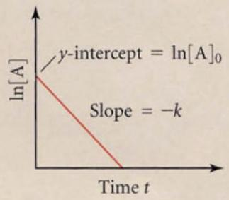</td><td> $t_{1/2} = \frac{0.693}{k} = \frac{1}{k} (0.693)$ </td></tr><tr><td>2</td><td> $Rate = k[A]^2$ </td><td> $\frac{1}{[A]_t} = kt + \frac{1}{[A]_0}$ </td><td>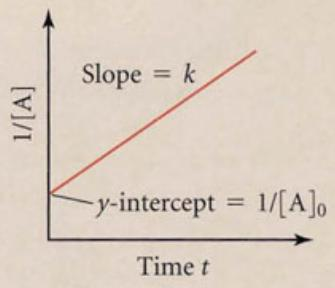</td><td> $t_{1/2} = \frac{1}{k[A]_0} = \frac{1}{k} \frac{1}{[A]_0}$ </td></tr></table>

FIGURE 12.32 We can summarize, for observed zero-order, first-order, and second-order kinetics, the rate law, the integrated rate law, the plot of concentration vs. time, and the half-life expression for each case.

## Check Yourself 5

## Question:

Given the observed concentration of a reacting species as a function of time throughout the course of a reaction, what is the most direct test to determine whether the reaction is first order?

## Answer:

Plot ln [A] vs. time:

:::{figure} ../images/fig-p1-ch12-56.jpg
:name: fig-p1-ch12-56
:alt: Figure from the University Chemistry source textbook
:::

If ln [A] is linear, the reaction is first order with respect to species A and the overall order of the reaction is first order.

## Question:

Can the rate law for a chemical reaction be constructed from the stoichiometric coefficient?

```{math}
:label: eq-p1-ch12-113
a A + b B \rightarrow c C + d D
```


## Answer:

No. The rate law depends on experimental conditions:

```{math}
:label: eq-p1-ch12-114
\frac {- d [ \mathrm{OH} ]}{d t} = k _ {\mathrm{obs}} \left[ \mathrm{CH} _ {4} \right] [ \mathrm{OH} ]
```


First order with respect to [OH]

First order with respect to [CH4]

Overall order of reaction

```{math}
:label: eq-p1-ch12-115
1 + 1 = 2 k _ {\mathrm{obs}} = k _ {\mathrm{obs}} ^ {\mathrm{II}}
```


If we arrange the experiment such that $\mathrm { [ C H _ { 4 } ] } > > \mathrm { [ O H ] }$ :

```{math}
:label: eq-p1-ch12-116
k _ {\mathrm{obs}} ^ {\mathrm{II}} [ \mathrm{CH} _ {4} ] \approx \mathrm{constant} = k _ {\mathrm{obs}} ^ {\mathrm{I}}
```


```{math}
:label: eq-p1-ch12-117
\frac {- d [ \mathrm{OH} ]}{d t} = k _ {\mathrm{obs}} ^ {\mathrm{II}} \left[ \mathrm{CH} _ {4} \right] [ \mathrm{OH} ] = k ^ {\mathrm{I}} [ \mathrm{OH} ]
```


Overall reaction becomes first order.

Stoichiometry is invariant; it is set by bonding structure. Therefore, we cannot in general determine the rate law from the stoichiometric coefficients.

## Steady State Approximation

We have now explored the kinetics of chemical reactions from (1) the molecular perspective in our analysis of the molecularity of chemical reactions, and (2) the experimental perspective in terms of the observed order of a chemical reaction; we turn to how the union of those two approaches are used in practice.

One of the most useful and powerful approximations in chemistry is the Steady State Approximation, which takes explicit advantage of the fact that within many chemical mechanisms reside elementary reactions that rapidly produce and remove reactive intermediates for which the loss rate of the species is limited by its production rate.

Consider the important case of the hydroxyl radical, OH, reacting with $\mathrm { N O } _ { 2 }$ shown on its potential energy surface in Figure 12.33. The only thermodynamically allowed pathway for this reaction is the termolecular reaction

```{math}
:label: eq-p1-ch12-118
\mathrm{OH} + \mathrm{NO} _ {2} + M \rightarrow \mathrm{HONO} _ {2} + M,
```


forming nitric acid.

:::{figure} ../images/fig-p1-ch12-57.jpg
:name: fig-p1-ch12-57
:alt: FIGURE 12.33 The formation of nitric acid, mathematical notation , in a termolecular reaction involves two steps. First, OH and mathematical notation collide to form an “activated complex” mathematical notation that has the same molecular s
FIGURE 12.33 The formation of nitric acid, ${ \mathsf { H O N O } } _ { 2 } ,$ , in a termolecular reaction involves two steps. First, OH and ${ \mathsf { N O } } _ { 2 }$ collide to form an “activated complex” ${ \mathsf { H O N O } } _ { 2 } ^ { \ddagger }$ that has the same molecular structure as nitric acid $( \mathsf { H O N O } _ { 2 } )$ , but contains kinetic energy within its bonds such that the activated complex can dissociate back into ${ \mathsf { O H } } + { \mathsf { N O } } _ { 2 }$ if that energy localizes in a single bond. Second, if a third body, the chaperone molecule, $M ,$ collides with the activated complex and removes sufficient energy to trap the newly formed molecule in the potential well, the product $H O N O _ { 2 }$ will be formed as a stable product.
:::


The reaction takes place on a potential energy surface characteristic of all such termolecular reactions wherein ${ \mathrm { H O N O } } _ { 2 }$ is formed in a vibrationally excited state and then stabilized into the potential well by collision with the chaperone molecule, M.

So what actually happens to yield this net reaction? First, to initiate the reaction, OH and $\mathrm { N O } _ { 2 }$ collide to form the vibrationally excited adduct, $\mathrm { H O N O } _ { 2 } ^ { \ddagger }$

```{math}
:label: eq-p1-ch12-119
\mathrm{OH} + \mathrm{NO} _ {2} \xrightarrow {k _ {1}} \mathrm{HONO} _ {2} ^ {\ddagger}
```


with a reaction rate constant $k _ { 1 }$ .

But as we have seen, if the vibrational energy becomes localized in the (weakest) bond that links OH to $\mathrm { N O } _ { 2 } ,$ the adduct will break apart into the original species OH and $\mathrm { N O } _ { 2 }$

```{math}
:label: eq-p1-ch12-120
\mathrm{HONO} _ {2} ^ {\ddagger} \xrightarrow {k _ {- 1}} \mathrm{OH} + \mathrm{NO} _ {2}
```


with a reaction rate constant $k _ { - 1 }$ .

But it is also possible to stabilize the ${ \mathrm { H O N O } } _ { 2 } ^ { \ddagger }$ adduct by collision with the chaperone molecule, M, to yield product nitric acid molecule, $\mathrm { H O N O } _ { 2 }$

```{math}
:label: eq-p1-ch12-121
\mathrm{HONO} _ {2} ^ {\ddagger} + M \xrightarrow {k _ {2}} \mathrm{HONO} _ {2}
```


with reaction rate constant, $k _ { 2 }$ .

We can assemble these three steps to yield the net overall reaction

```{math}
:label: eq-p1-ch12-122
\begin{array}{l}\mathrm{OH} + \mathrm{NO} _ {2} \xrightarrow [ k _ {- 1} ]{k _ {1}} \mathrm{HONO} _ {2} ^ {\ddagger}\\\mathrm{HONO} _ {2} ^ {\ddagger} + M \xrightarrow {k _ {2}} \mathrm{HONO} _ {2} + M\\\text {Net:} \quad \overline {{\mathrm{OH} + \mathrm{NO} _ {2} + M \rightarrow \mathrm{HONO} _ {2} + M}}\end{array}
```


We seek an expression that is correct for all pressures, that is for all concentrations of the chaperone species, M.

## Step 1

We write the rate of the reaction in terms of the elementary step that produces the product $\mathrm { H O N O } _ { 2 }$

```{math}
:label: eq-p1-ch12-123
R = \frac {d [ \mathrm{HONO} _ {2} ]}{d t} = k _ {2} [ M ] [ \mathrm{HONO} _ {2} ^ {\ddagger} ] = \frac {- d [ \mathrm{OH} ]}{d t}
```


## Step 2

But we must calculate the concentration of the adduct, $\mathrm { H O N O _ { 2 } } ^ { \ddagger }$ , in order to make this a useful analysis. So we write the rate equation for the production of $\mathrm { H O N O } _ { 2 } ^ { \ddagger }$

```{math}
:label: eq-p1-ch12-124
\mathrm{ProductionRate} = P _ {\mathrm {HONO_ {2} ^ {\ddagger}}} = \frac {d [ \mathrm {HONO_ {2} ^ {\ddagger}} ]}{d t} = k _ {1} [ \mathrm{OH} ] [ \mathrm {NO_ {2}} ]
```


## Step 3

Then we write the rate equation for the removal of $\mathrm { H O N O } _ { 2 } ^ { \ddagger }$

```{math}
:label: eq-p1-ch12-125
\mathrm{LossRate} = L _ {\mathrm{HONO} _ {2} ^ {\ddagger}} = \frac {d [ \mathrm{HONO} _ {2} ^ {\ddagger} ]}{d t} = k _ {- 1} [ \mathrm{HONO} _ {2} ^ {\ddagger} ] + k _ {2} [ M ] [ \mathrm{HONO} _ {2} ^ {\ddagger} ]
```


## Step 4

The net time-rate-of-change of the adduct concentration, $\left[ \mathrm { H O N O } _ { 2 } ^ { \pm } \right]$ , is then given by the production rate, PHONO2‡, minus the loss rate, LHONO2‡, such that

```{math}
:label: eq-p1-ch12-126
\frac {d [ \mathrm{HONO} _ {2} ^ {\ddagger} ]}{d t} = P _ {\mathrm{HONO} _ {2} ^ {\ddagger}} - L _ {\mathrm{HONO} _ {2} ^ {\ddagger}} = k _ {1} [ \mathrm{OH} ] [ \mathrm{NO} _ {2} ] - k _ {- 1} [ \mathrm{HONO} _ {2} ^ {\ddagger} ] - k _ {2} [ M ] [ \mathrm{HONO} _ {2} ^ {\ddagger} ]
```


## Step 5

But now the key “steady state” approximation:

1. H $\mathrm { O N O } _ { 2 } ^ { \ddagger }$ is both produced and destroyed very rapidly on the time scale of the overall reaction converting OH and $\mathrm { N O } _ { 2 }$ to $\mathrm { H O N O } _ { 2 } .$

2. If the difference between $P \mathrm { H O N O 2 } ^ { \ddagger }$ and $L _ { \mathrm { H O N O 2 } ^ { \ddagger } }$ is small compared with the magnitude of $P \mathrm { H O N O 2 } ^ { \ddagger }$ or of $\boldsymbol { L } \mathrm { H O N O 2 } ^ { \ddagger }$ , then

```{math}
:label: eq-p1-ch12-127
\frac {d [ \mathrm{HONO} _ {2} ^ {\ddagger} ]}{d t} = P _ {\mathrm{HONO} _ {2} ^ {\ddagger}} - L _ {\mathrm{HONO} _ {2} ^ {\ddagger}} \approx 0
```


That is, the net time-rate-of-change of $\mathrm { [ H O N O _ { 2 } ^ { \ddagger } ] }$ is approximately equal to zero.

Then, if this is true, we can solve for the concentration of the adduct, $\mathrm { H O N O } _ { 2 } ^ { \ddagger }$ , by setting the time rate of change of $\mathrm { [ H O N O _ { 2 } ^ { \ddagger } ] }$ equal to zero!

```{math}
:label: eq-p1-ch12-128
\begin{array}{l} \frac {d [ \mathrm{HONO} _ {2} ^ {\ddagger} ]}{d t} = P _ {\mathrm{HONO} _ {2} ^ {\ddagger}} - L _ {\mathrm{HONO} _ {2} ^ {\ddagger}} = 0 \quad \text {so} \\ \frac {d [ \mathrm{HONO} _ {2} ^ {\ddagger} ]}{d t} = k _ {1} [ \mathrm{OH} ] [ \mathrm{NO} _ {2} ] - k _ {- 1} [ \mathrm{HONO} _ {2} ^ {\ddagger} ] - k _ {2} [ M ] [ \mathrm{HONO} _ {2} ^ {\ddagger} ] = 0 \end{array}
```


## Step 6

We can then use the fact that $k _ { \mathrm { 1 } } [ \mathrm { O H } ] [ \mathrm { N O _ { 2 } } ] \ - \ k _ { \mathrm { - 1 } } [ \mathrm { H O N O _ { 2 } } ^ { \mathrm { ~ \mp ~ } } ] \ - \ k _ { \mathrm { 2 } } [ M ]$ $[ \mathrm { H O N O _ { 2 } } ^ { \ddagger } ] = 0$ to solve for $\mathrm { [ H O N O _ { 2 } ^ { \ddagger } ] }$

```{math}
:label: eq-p1-ch12-129
[ \mathrm{HONO} _ {2} ^ {\ddagger} ] = \frac {k _ {1} [ \mathrm{OH} ] [ \mathrm{NO} _ {2} ]}{k _ {- 1} + k _ {2} [ M ]}
```


Then, inserting the expression for $\mathrm { [ H O N O _ { 2 } ^ { \ddagger } ] }$ back into the rate expression,

```{math}
:label: eq-p1-ch12-130
R = \frac {- d [ \mathrm{OH} ]}{d t} = \frac {d [ \mathrm{HONO} _ {2} ]}{d t} = k _ {2} [ M ] [ \mathrm{HONO} _ {2} ^ {\ddagger} ] = \frac {k _ {2} [ M ] k _ {1} [ \mathrm{OH} ] [ \mathrm{NO} _ {2} ]}{k _ {- 1} + k _ {2} [ M ]}
```


Rearranging, we have the rate expression for the disappearance of [OH] expressed in terms of a second-order reaction rate constant, $k _ { \mathrm { \ o b s } } ^ { \mathrm { I I } }$

```{math}
:label: eq-p1-ch12-131
R = \frac {- d [ \mathrm{OH} ]}{d t} = k _ {\mathrm{obs}} ^ {\mathrm{II}} \left[ \mathrm{NO} _ {2} \right] [ \mathrm{OH} ] \quad \text { where } \quad k _ {\mathrm{obs}} ^ {\mathrm{II}} = \frac {k _ {1} k _ {2} [ M ]}{k _ {- 1} + k _ {2} [ M ]}
```


This is a very important result because it defines, quantitatively, the functional dependence of the second-order reaction rate constant, $k _ { \mathrm { o b s } , } ^ { \mathrm { I I } }$ on the concentration of [M] and of the individual reaction rate constants $k _ { 1 } , k _ { - 1 }$ and $k _ { 2 } .$ . If we graph $k _ { \mathrm { \ o b s } } ^ { \mathrm { I I } }$ vs. [M], we can identify two limits. At the high pressure (large [M]) limit, $k _ { \scriptscriptstyle 2 } [ M ] > > k _ { \scriptscriptstyle - 1 }$ so that we can ignore $k _ { - 1 }$ in the denominator. At this limit,

```{math}
:label: eq-p1-ch12-132
k _ {\mathrm{obs}} ^ {\mathrm{II}} = \frac {k _ {1} k _ {2} [ M ]}{k _ {- 1} + k _ {2} [ M ]} \cong \frac {k _ {1} k _ {2} [ M ]}{k _ {2} [ M ]} = k _ {1}.
```


The other limit, the low pressure (small [M]) limit for which $k _ { 2 } [ M ] < < k _ { - 1 }$ such that $k _ { 2 } [ M ]$ can be ignored in the denominator of $k _ { \mathrm { \mathrm { \ o b s } } } ^ { \mathrm { I I } }$ , gives us

```{math}
:label: eq-p1-ch12-133
k _ {\mathrm{obs}} ^ {\mathrm{II}} = \frac {k _ {1} k _ {2} [ M ]}{k _ {- 1} + k _ {2} [ M ]} = \frac {k _ {1} k _ {2}}{k _ {- 1}} [ M ].
```


Thus when we graph $k _ { \mathrm { \mathrm { \ o b s } } } ^ { \mathrm { m } } \mathbf { v } \mathbf { s }$ . [M], we have a range of [M] for which the slope of $k _ { \mathrm { { o b s } } } ^ { \mathrm { { I I } } } \mathbf { v } \mathbf { s }$ . [M] increases linearly for small [M]. At large $[ \bar { M } ] , ^ { k _ { \mathrm { o b s } } ^ { \mathrm { I I } } }$ approaches a limit that is independent of [M]. This is sketched in Figure 12.34.

:::{figure} ../images/fig-p1-ch12-58.jpg
:name: fig-p1-ch12-58
:alt: FIGURE 12.34 When the second-order reaction rate constant, mathematical notation is plotted against the concentration, [M], the pressure dependence of the reaction rate separates into three domains. At low pressure, where mathematical notat
FIGURE 12.34 When the second-order reaction rate constant, $k _ { \mathrm { \ o b s } } ^ { | | } ,$ is plotted against the concentration, [M], the pressure dependence of the reaction rate separates into three domains. At low pressure, where $k _ { 2 } [ \mathsf { M } ] > > k _ { - 1 }$ , the observed reaction rate constant $k _ { \mathrm { \ o b s } } ^ { \mathrm { | | } } .$ , increases proportionality with [M]. At high pressures, where $k _ { 2 } [ \mathsf { M } ] > > k _ { - 1 }$ , the observed reaction rate constant , $k _ { \mathrm { \ o b s } } ^ { | | } ,$ is independent of [M]. Between the high- and low-pressure regimes the observed reaction rate constant, $\boldsymbol { k } _ { \mathrm { ~ o b s ~ } } ^ { 1 1 }$ , transitions smoothly between the two limits.
:::


## Concept of the Rate Limiting Step

Within this treatment of the steady state approximation is a very important concept in chemistry—the Rate Limiting Step. Notice that at high pressures, for which $\mathrm { k _ { 2 } [ M ] > > k _ { - 1 } }$ , the collisional removal by the chaperone, M, occurs at a faster rate then the dissociation step, $\bf k _ { - 1 }$ . Under these conditions the rate at which the product ${ \mathrm { H O N O } } _ { 2 }$ is formed is “rate limited” by the rate of foundation of the adduct, $\mathrm { H O N O _ { 2 } } ^ { \ddagger }$ . That is why the observed rate law takes the simple form

```{math}
:label: eq-p1-ch12-134
- \frac {\mathrm{d} [ \mathrm{OH} ]}{\mathrm{dt}} = \mathrm{k} _ {\mathrm{obs}} ^ {\mathrm{II}} \left[ \mathrm{NO} _ {2} \right] [ \mathrm{OH} ] = \mathrm{k} _ {1} \left[ \mathrm{NO} _ {2} \right] [ \mathrm{OH} ]
```


where $\mathbf { k _ { 1 } }$ is the initial formation step in our steady state mechanism.

This is an important example of how, in a chemical mechanism that is comprised of a series of elementary steps, it is the slowest step in the sequence that determines the overall rate of the reaction.

We examine this with another example of the application of the steady state approximation:

## Example: Using the steady state approximation for the testing of proposed mechanisms against the observation of a rate law.

Consider the reaction of NO(g) and $\mathrm { O _ { 2 } ( g ) }$

```{math}
:label: eq-p1-ch12-135
\mathrm {2NO(g)+ O_ {2} (g)\rightarrow 2NO_ {2} (g)}
```


Laboratory experimentation demonstrates that the observed rate law is

```{math}
:label: eq-p1-ch12-136
R _ {\mathrm{obs}} = - \frac {d [ \mathrm{O} _ {2} ]}{d t} = k _ {\mathrm{obs}} [ \mathrm{NO} ] ^ {2} [ \mathrm{O} _ {2} ]
```


Without making an assumption about the relative rates of each step in the mechanism, we propose the three-step sequence:

```{math}
:label: eq-p1-ch12-137
\mathrm{NO} + \mathrm{NO} \xrightarrow [ k _ {2} ]{k _ {1}} \mathrm{N} _ {2} \mathrm{O} _ {2}
```


```{math}
:label: eq-p1-ch12-138
\mathrm{N} _ {2} \mathrm{O} _ {2} + \mathrm{O} _ {2} \xrightarrow {k _ {3}} 2 \mathrm{NO} _ {2}
```


```{math}
:label: eq-p1-ch12-139
\mathrm{Net:} 2 \mathrm{NO} + \mathrm{O} _ {2} \longrightarrow 2 \mathrm{NO} _ {2}
```


noting that reaction (2) is just the reverse of reaction (1). We note that the observed rate law contains $[ \mathbf { O } _ { 2 } ]$ , so we propose that reaction (3) is rate limiting:

```{math}
:label: eq-p1-ch12-140
R _ {\mathrm{proposed}} = k _ {3} [ \mathrm{N} _ {2} \mathrm{O} _ {2} ] [ \mathrm{O} _ {2} ]
```


Then we use the steady state approximation to calculate the concentration of the $\mathbf { N } _ { 2 } \mathbf { O } _ { 2 }$ intermediate. Therefore,

```{math}
:label: eq-p1-ch12-141
\frac {d [ \mathrm{N} _ {2} \mathrm{O} _ {2} ]}{d t} = P _ {\mathrm{N} _ {2} \mathrm{O} _ {2}} - L _ {\mathrm{N} _ {2} \mathrm{O} _ {2}} = 0
```


But

```{math}
:label: eq-p1-ch12-142
P _ {\mathrm{N} _ {2} \mathrm{O} _ {2}} = k _ {1} [ \mathrm{NO} ] [ \mathrm{NO} ]
```


```{math}
:label: eq-p1-ch12-143
L _ {\mathrm{N} _ {2} \mathrm{O} _ {2}} = k _ {2} [ \mathrm{N} _ {2} \mathrm{O} _ {2} ] + k _ {3} [ \mathrm{N} _ {2} \mathrm{O} _ {2} ] [ \mathrm{O} _ {2} ]
```


So

```{math}
:label: eq-p1-ch12-144
\frac {d [ \mathrm{N} _ {2} \mathrm{O} _ {2} ]}{d t} = k _ {1} [ \mathrm{NO} ] [ \mathrm{NO} ] - k _ {2} [ \mathrm{N} _ {2} \mathrm{O} _ {2} ] - k _ {3} [ \mathrm{N} _ {2} \mathrm{O} _ {2} ] [ \mathrm{O} _ {2} ] = 0
```


Solving for $[ \mathrm { N } _ { 2 } \mathrm { O } _ { 2 } ]$

```{math}
:label: eq-p1-ch12-145
k _ {1} [ \mathrm{NO} ] [ \mathrm{NO} ] = \left(k _ {2} + k _ {3} [ \mathrm{O} _ {2} ]\right) [ \mathrm{N} _ {2} \mathrm{O} _ {2} ]
```


```{math}
:label: eq-p1-ch12-146
[ \mathrm{N} _ {2} \mathrm{O} _ {2} ] = \frac {k _ {1} [ \mathrm{NO} ] [ \mathrm{NO} ]}{k _ {2} + k _ {3} [ \mathrm{O} _ {2} ]}
```


But now we have, by virtue of the steady state approximation, an expression for the proposed rate law:

```{math}
:label: eq-p1-ch12-147
R _ {\mathrm{proposed}} = k _ {3} [ \mathrm{O} _ {2} ] [ \mathrm{N} _ {2} \mathrm{O} _ {2} ] = k _ {3} [ \mathrm{O} _ {2} ] \frac {k _ {1} [ \mathrm{NO} ] [ \mathrm{NO} ]}{k _ {2} + k _ {3} [ \mathrm{O} _ {2} ]}
```


If reaction (3) is “rate limiting,” then

```{math}
:label: eq-p1-ch12-148
k _ {2} [ \mathrm{N} _ {2} \mathrm{O} _ {2} ] > > k _ {3} [ \mathrm{N} _ {2} \mathrm{O} _ {2} ] [ \mathrm{O} _ {2} ]
```


so

```{math}
:label: eq-p1-ch12-149
k _ {2} > > k _ {3} [ \mathrm{O} _ {2} ]
```


and

```{math}
:label: eq-p1-ch12-150
R _ {\mathrm{proposed}} = k _ {3} [ \mathrm{O} _ {2} ] \left[ \frac {k _ {1} [ \mathrm{NO} ] [ \mathrm{NO} ]}{k _ {2} + k _ {3} [ \mathrm{O} _ {2} ]} \right] = k _ {3} [ \mathrm{O} _ {2} ] \left[ \frac {k _ {1}}{k _ {2}} [ \mathrm{NO} ] ^ {2} \right]
```


But the experimentally observed rate is

```{math}
:label: eq-p1-ch12-151
R _ {\mathrm{obs}} = k _ {\mathrm{obs}} [ \mathrm{O} _ {2} ] [ \mathrm{NO} ] ^ {2},
```


so the proposed mechanism is consistent with the observed kinetics and the observed reaction rate constant

```{math}
:label: eq-p1-ch12-152
k _ {\mathrm{obs}} = \frac {k _ {1} k _ {3}}{k _ {2}}.
```


## Arrhenius Expression for Temperature Dependence

We all have a great deal of experience with the temperature dependence of chemical reactions. Nearly all foods that are open to the atmosphere will spoil much more rapidly as temperatures increase. That is, of course, why we have refrigeration in our homes and virtually everywhere else. We also notice that adhesives such as epoxy cure more rapidly at elevated temperature and materials age more rapidly at high temperature. It was Arrhenius who first systematically studied this behavior, and as he investigated more and more chemical systems with respect to the rate at which reactions proceeded as a function of temperature, he began to see a consistent pattern.

What Arrhenius noticed was that the reaction rate constant, k, changed very little over a fairly broad range of temperatures and then as the rate began to increase it became rapidly faster with increasing temperature, as shown in Figure 12.35.

Behavior of Rates with Temperature: Deduction from Observation What is the observed dependence of rates on temperature?
:::{figure} ../images/fig-p1-ch12-59.jpg
:name: fig-p1-ch12-59
:alt: FIGURE 12.35 Arrhenius studied broad classes of chemical reactions and graphed the observed rate of the reaction as a function of temperature. From these analyses he recognized a consistent pattern—that the rate of the reaction increased ex
FIGURE 12.35 Arrhenius studied broad classes of chemical reactions and graphed the observed rate of the reaction as a function of temperature. From these analyses he recognized a consistent pattern—that the rate of the reaction increased exponentially with increasing temperature.
:::


Arrhenius recognized, after investigating a large number of different reactions, that the reaction rate constant, k, seemed to increase exponentially with temperature. That is, it exhibited such a strong dependence on temperature that a simple polynomial such as $T ^ { 2 }$ or $T ^ { 3 }$ could not capture the dramatic increase with temperature. So Arrhenius began to play around with different functions in an attempt to mathematically “model” this temperature dependence of k. He recognized that if he plotted the logarithm of the observed rate against the inverse of temperature, the graph had a simple slope-intercept form—the slope was largely invariant with increasing $( \mathbf { 1 } / T ) !$

This meant that the intercept in this “Arrhenius plot” corresponded to the reaction rate constant at high temperature, and the slope was a constant such that it was possible to write

```{math}
:label: eq-p1-ch12-153
\ln k = - \frac {C}{T} + \ln A
```


where C had to have units of temperature (Kelvin) and ln A was the intercept such that, by taking the antilog, he could write

```{math}
:label: eq-p1-ch12-154
k _ {\mathrm{obs}} = A \exp \left[ - \frac {C}{T} \right]
```


But from Boltzmann's work Arrhenius also knew that the gas constant, R, had units of [Joule/mole · K] so that if the constant $C = E _ { a } / R$ , where $E _ { a }$ was the activation energy, then the observed reaction rate constant was simply

```{math}
:label: eq-p1-ch12-155
k _ {\mathrm{obs}} = A \exp \left[ - \frac {E _ {a}}{R T} \right]
```


The slope of the “Arrhenius Plot” was $- E _ { a } / R$ such that we can capture this all in simple graphical form, as shown in Figure 12.36.

:::{figure} ../images/fig-p1-ch12-60.jpg
:name: fig-p1-ch12-60
:alt: FIGURE 12.36 As a result of studying the rates of chemical reactions as a function of temperature, and deducing the exponential dependence of k on temperature, Arrhenius expressed the relationship between the reaction rate constant, k, and
FIGURE 12.36 As a result of studying the rates of chemical reactions as a function of temperature, and deducing the exponential dependence of k on temperature, Arrhenius expressed the relationship between the reaction rate constant, k, and the temperature, $T ,$ as $k = A e { - } E a / R T ,$ where A was the temperature independent “pre-exponential” and $E _ { \mathrm { a } }$ is the “barrier height” energy. Exponentiation results in ln k = ln $A - E _ { \mathrm { a } } / R T$ such that when ln k is graphed against $1 / T ,$ the intercept is ln A and the slope is - $E _ { \mathfrak { a } } / R ,$ , where R is the gas constant.
:::


This was a very important deduction with far reaching consequences. First, it was remarkably simple and remarkably general—it was successfully applied across a vast range of chemical processes. Second, it clearly implied that there was an energy barrier to these chemical reactions that must be surmounted in order to execute the chemical transformation. It is also implied that the velocity or energy distribution of the molecules within the reacting medium had an exponential dependence on temperature.

## Relating Molecular Motion to the Arrhenius Expression

At the same time Arrhenius was developing his expression for the temperature dependence of chemical reactions, Boltzmann was working on the problem of molecular motion and the relationship between the kinetic energy of molecules, the temperature of a molecular ensemble, and the pressure exerted by those molecules. Consider first a vessel that contains N molecules in a volume V. In addition, suppose all of those molecules are moving at the same speed, v (units of m/sec).

Now let's focus in on a section of the vessel wall and consider a volume extending from the wall a distance v, which is how far a molecule will move in one second if it is moving directly toward the wall.

All molecules moving toward the wall at a distance equal to or less than v meters will hit the wall in one second. That number, however, is equal to the number of molecules per unit volume times the volume of vA, where A is the cross sectional area. Thus, we can write

```{math}
:label: eq-p1-ch12-156
\left( \begin{array}{l} \text { number   of } \\ \text { molecules   in } \\ \text { the   volume } \end{array} \right) = \left(\frac {N}{V}\right) \mathrm{vA}
```


Now we make an approximation (an approximation that is quite accurate) that $1 / 6$ of all N molecules in the vessel are moving toward the wall. But in order to determine the pressure exerted by those molecules striking the wall, we must determine the force imparted by each of those collisions. To do this, we use the fact that the force imparted by each collision is equal to the change in momentum divided by the period of the collision for each collision.

However, each collision with the wall corresponds to a momentum change of mv to stop the molecule as it hits the wall, and another mv to accelerate the molecule back up to speed v as it leaves the wall in the opposite direction. Thus, the collision event delivers a momentum change of 2mv that is the force transmitted to the wall by the molecule.

So, when we consider all the molecules in the volume, we can write

```{math}
:label: eq-p1-ch12-157
\text { Force } = \left( \begin{array}{c} \text { number   of   molecules } \\ \text { striking   the   wall } \\ \text { per   sec } \end{array} \right) \left( \begin{array}{c} \text { momentum } \\ \text { imparted   by } \\ \text { each   molecule } \end{array} \right) = \frac {1}{6} \left(\frac {N}{V} v A\right) (2 m v)
```


But pressure is just force per unit area, so

```{math}
:label: eq-p1-ch12-158
P = \left(\frac {\text { Force }}{A}\right) = \frac {1}{3} \left(\frac {N}{V}\right) m \mathrm{v} ^ {2}
```


As Boltzmann recognized, all molecules do not move at the same speed and we must take the average of the square of the molecular velocities. We write

```{math}
:label: eq-p1-ch12-159
P = \frac {1}{3} \left(\frac {N}{V}\right) m \overline {{{\mathrm{v} ^ {2}}}}
```


This is quite a discovery: By examining individual collision events between a molecule and the vessel wall, we have deduced an expression for the pressure exerted by the ensemble of molecules contained in the vessel.

There is another crucial expression that gives us the pressure exerted by a gas: It is the “Perfect Gas Law.”

```{math}
:label: eq-p1-ch12-160
P V = n R T
```


where, as always, P is the pressure, V is the volume, n is the number of moles, R is the gas constant, and T is the temperature in K.

If $P V = n R T ,$ then we can solve for

```{math}
:label: eq-p1-ch12-161
P = \left(\frac {n}{V}\right) R T
```


and equate it to our molecular level deduction

```{math}
:label: eq-p1-ch12-162
P = \frac {1}{3} \left(\frac {N}{V}\right) m \overline {{{\mathrm{v} ^ {2}}}}
```


such that

```{math}
:label: eq-p1-ch12-163
P = \left(\frac {n}{V}\right) R T = \frac {1}{3} \left(\frac {N}{V}\right) m \overline {{\mathrm{v} ^ {2}}} \quad \text { or } \quad n R T = \frac {1}{3} N m \overline {{\mathrm{v} ^ {2}}}
```


If we assume we have 1 mole $\left( n = 1 \right)$ , which is Avogadro's number, $N _ { \mathrm { A } }$ then

```{math}
:label: eq-p1-ch12-164
\frac {1}{3} N _ {\mathrm{A}} m \overline {{{{\mathrm{v} ^ {2}}}}} = R T
```


However, $N _ { \mathrm { A } } m = M$ , the molar mass, so

```{math}
:label: eq-p1-ch12-165
\overline {{{{\mathrm{v} ^ {2}}}}} = \left(\frac {3 R T}{M}\right)
```


And writing $\mathbf { V } _ { _ { \mathrm { r m s } } } = \sqrt { \mathbf { V } ^ { 2 } }$ for the root-mean-square velocity of the molecules gives us

```{math}
:label: eq-p1-ch12-166
\mathrm{v} _ {\mathrm{rms}} = \sqrt {\overline {{\mathrm{v} ^ {2}}}} = \left(\frac {3 R T}{M}\right) ^ {1 / 2}
```


This suggests the union of the molecular world, as Boltzmann saw it, and the macroscopic world, as Arrhenius viewed chemical reactions.

If we plot the velocity distribution of molecules there is a very characteristic shape to such a function, as displayed in Figure 12.37. But we can also represent that velocity in terms of the kinetic energy of the molecular motion $E = 1 / 2 \ m \mathbf { v } ^ { 2 }$ and then plot the number of molecules as a function of kinetic energy. Not surprisingly, that molecular distribution has the same basic shape. It rises from zero at zero energy, passes through a maximum, and then “tails $\mathrm { o f f } ^ { \prime \prime }$ at high energy.

:::{figure} ../images/fig-p1-ch12-61.jpg
:name: fig-p1-ch12-61
:alt: FIGURE 12.37 The Boltzmann distribution of molecular speeds represented as the fraction of molecules within each speed. Shown in the figure are the “mean speed,” mathematical notation the “average speed,” mathematical notation and the “root
FIGURE 12.37 The Boltzmann distribution of molecular speeds represented as the fraction of molecules within each speed. Shown in the figure are the “mean speed,” $\mathsf { v } _ { \mathsf { m } } ;$ the “average speed,” $\mathsf { v } _ { \mathsf { a v } } ,$ and the “root mean square speed,” $\mathsf { ^ { \prime } v } _ { \mathsf { r m s } } .$ . Notice in particular the long “tail” of the distribution at high speeds.
:::

This allows us to link three concepts, shown in Figure 12.38, into a single picture.

:::{figure} ../images/fig-p1-ch12-62.jpg
:name: fig-p1-ch12-62
:alt: FIGURE 12.38 The exponential dependence of the Arrhenius expression can be understood by combining the Boltzmann distribution of molecular speeds shown in Figure 12.37 with the potential energy diagram for a bimolecular reaction.
FIGURE 12.38 The exponential dependence of the Arrhenius expression can be understood by combining the Boltzmann distribution of molecular speeds shown in Figure 12.37 with the potential energy diagram for a bimolecular reaction.
:::


So now if the vertical axis is energy, as it is in the potential energy diagram, and we rotate the Boltzmann distribution so as to align its energy axis with that of the PES, as shown in Figure 12.39, we identify the energy of activation, $E _ { a } ,$ as it appears in the Arrhenius expression. We see that only those molecules in the high energy tail of the Boltzmann distribution have sufficient energy to surmount the barrier.

:::{figure} ../images/fig-p1-ch12-63.jpg
:name: fig-p1-ch12-63
:alt: FIGURE 12.39 Recognizing that the horizontal axis of the Boltzmann distribution can be represented as the kinetic energy of the molecules in a gas and that the vertical axis of the potential energy diagram is energy, we can join the two dia
FIGURE 12.39 Recognizing that the horizontal axis of the Boltzmann distribution can be represented as the kinetic energy of the molecules in a gas and that the vertical axis of the potential energy diagram is energy, we can join the two diagrams to represent the number of molecules with kinetic energy large enough to get over the potential energy barrier of the bimolecular reaction.
:::


Notice, however, that this is the case for bimolecular reactions; unimolecular and termolecular reactions do not, in general, follow the same temperature dependence.

## Manipulation of the Arrhenius Expression

## Check Yourself 6

## Question:

How can we determine the barrier height of a reaction from observation of the reaction rate constant at two different temperatures?

## Answer:

Determine the reaction rate constant at two different temperatures and then use the Arrhenius expression:

Measurement #1 of k at temperature $T _ { 1 }$

```{math}
:label: eq-p1-ch12-167
\ln k _ {1} = \frac {- E _ {a}}{R T _ {1}} + \ln A
```


Measurement $\# 2$ of $k$ at temperature $T _ { 2 }$

```{math}
:label: eq-p1-ch12-168
\ln k _ {2} = \frac {- E _ {a}}{R T _ {2}} + \ln A
```


Subtract ln $k _ { 2 }$ from ln $k _ { 1 }$

```{math}
:label: eq-p1-ch12-169
\ln k _ {1} - \ln k _ {2} = \left(\frac {- E _ {a}}{R T _ {1}} + \ln A\right) - \left(\frac {- E _ {a}}{R T _ {2}} + \ln A\right)
```


or

```{math}
:label: eq-p1-ch12-170
\ln \left(\frac {k _ {1}}{k _ {2}}\right) = \frac {E _ {a}}{R} \left(\frac {1}{T _ {2}} - \frac {1}{T _ {1}}\right)
```


And solve for $E _ { a } .$

## Summary Concepts

<table><tr><td>1. Bonding Structure and the Photodissociation of Molecular OxygenThe figure at right summarizes graphically a number of very important concepts. First, in the upper left corner the formation of molecular orbitals from the component atomic orbitals is summarized with the electrons properly inserted into the orbitals of O2. Second, the absorption of a photon by the electronic structure of O2 is represented by the incoming photon and the promoted electron from the bonding πzb orbital to the antibonding πz* orbital in the lower left panel. Third, the correlation between the configuration of electrons inserted into the molecular orbitals of O2 and the corresponding potential energy surface is shown in the right-hand panel. This is done for both the ground state and promoted state potential energy surface. Finally, the fact that the period of the electron is much shorter than the period of nuclear motion means that the promotion of the electron results in the molecule moving vertically (i.e. with no change in internuclear distance) on the potential energy diagram from the ground state to the promoted state. From the repulsive wall of the upper (promoted) potential energy surface, the O2 molecule is unbound and dissociates into two oxygen atoms.</td><td>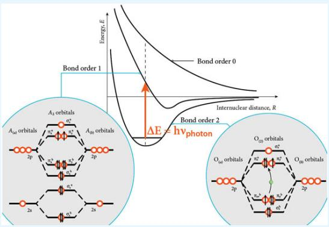</td></tr><tr><td>2. Vibrational Motion of a MoleculeVibrational energy exchange occurs in discrete steps because the vibrational motion on the molecular scale, as is the case for electronic motion, has a wave associated with it. The allowed vibrational energy levels only occur in discrete steps within the lowest potential energy surface of the molecular “electronic state” represented by the specific molecular orbitals that are occupied.</td><td>Potential Energy Surface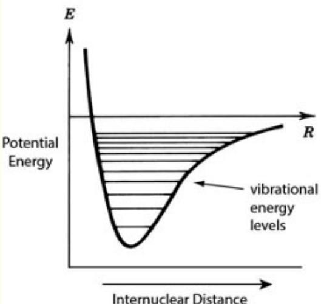</td></tr><tr><td>3. Rotational Motion of a MoleculeJust as the vibrational energy levels are segmented or “quantized,” so too are the rotational energy levels of the molecule. These rotational transitions are of much lower energy than either the vibrational energy levels or the</td><td></td></tr></table>

electronic energy levels. Furthermore, for each vibrational energy level, the molecule can possess a number of rotational energy levels such that these rotational energy levels “stack” on top of each of the vibrational levels. Thus if we look with greater detail at the potential energy surface, we can see how these energy levels are assembled.

## 4. Formation of Ozone

First we photodissociate O2 to form oxygen atoms: O2 + hν $ 0 + 0$ . The atomic oxygen then reacts with the abundant O2 to form O3 in the reaction $\mathbf { O } + \mathbf { O } \mathbf { 2 }  \mathbf { O } \mathbf { 3 }$

The two-step process forming $\mathrm { { O } } _ { 3 }$ from the reaction of O + $\mathrm { O } _ { 2 }$ is shown on a potential energy surface. The first step is the formation of $\mathrm { { O } } _ { 3 }$ resulting from the collision of O and $\mathrm { O } _ { 2 }$ . However, that newly formed $\mathrm { { O } } _ { 3 }$ has a large amount of kinetic energy present as vibrational and rotational energy in the bond structure of $\mathrm { { O } } _ { 3 }$ . If a third body, M, collides with that vibrationally and rotationally excited $\mathrm { { O } } _ { 3 }$ molecule, removing energy, a stable $\mathrm { { O } } _ { 3 }$ molecule will be formed.

## 5. Molecularity of a Chemical Reaction

The molecularity of a reaction is determined uniquely by the potential energy surface over which the chemical transformation occurs. The dissociation of a single molecule into products is called a unimolecular reaction. The unimolecular process is shown in the upper panel as a twostep process: excitation followed by dissociation. The reaction of two molecules, A + B, to form multiple products is called a bimolecular reaction. The potential energy diagram for a bimolecular reaction is shown in the middle panel. A termolecular reaction involves three molecules: A and B that collide to form $\mathbf { A B } ^ { \ddagger }$ , and a third “chaperone” molecule, M, that removes the excess kinetic energy to form the stable product.

:::{figure} ../images/fig-p1-ch12-66.jpg
:name: fig-p1-ch12-66
:alt: Figure from the University Chemistry source textbook
:::

:::{figure} ../images/fig-p1-ch12-67.jpg
:name: fig-p1-ch12-67
:alt: Figure from the University Chemistry source textbook
:::

Unimolecular Reaction
:::{figure} ../images/fig-p1-ch12-68.jpg
:name: fig-p1-ch12-68
:alt: Figure from the University Chemistry source textbook
:::

Bimolecular Reaction
:::{figure} ../images/fig-p1-ch12-69.jpg
:name: fig-p1-ch12-69
:alt: Figure from the University Chemistry source textbook
:::

Termolecular Reaction
:::{figure} ../images/fig-p1-ch12-70.jpg
:name: fig-p1-ch12-70
:alt: Figure from the University Chemistry source textbook
:::

## 6. Chemical Reactions and Molecular Collisions

A chemical reaction cannot occur unless a collision occurs between two reactants that may or may not engage in a bond rearrangement leading to products of the reaction. We can immediately deduce the fact that because a reaction requires a collision, a chemical reaction cannot occur at a rate faster than the rate at which reactant molecules collide. However, even if the colliding molecules do possess sufficient kinetic energy to position the nuclei close enough for a bond rearrangement to take place, the geometric configuration of the positions of the oxygen and the nitrogen nuclei may make the required bond rearrangement difficult. As a result, no reaction takes place.

:::{figure} ../images/fig-p1-ch12-71.jpg
:name: fig-p1-ch12-71
:alt: Figure from the University Chemistry source textbook
:::

## 7. Overall Reaction vs. Elementary Reaction

It is routine to write the combustion of a hydrocarbon, such as methane or octane or any other combustible material, in the form hydrocarbon $+ \mathrm { O } _ { 2 }  \mathrm { H } _ { 2 } \mathrm { O } + \mathrm { C O } _ { 2 }$ . But even for the simplest case, $\mathrm { C H } _ { 4 } + 2 \mathrm { O } _ { 2 } \to \mathrm { C O } _ { 2 } + 2 \mathrm { H } _ { 2 } \mathrm { O }$ , this is a net, overall reaction. It does not occur on a specific potential energy surface. Rather, the reaction of $\mathrm { C H } _ { 4 }$ with $\mathrm { O } _ { 2 }$ is comprised of a sequence of reactions, each of which takes place on a specific potential energy surface. The sum of those “elementary reactions”—the specific unimolecular, bimolecular, and termolecular reactions—then constitutes the net overall reaction.

```{math}
:label: eq-p1-ch12-171
\mathrm{CH} _ {4} + 2 \mathrm{O} _ {2} \rightarrow \mathrm{CO} _ {2} + 2 \mathrm{H} _ {2} \mathrm{O}
```


$\mathrm { C H } _ { 4 } \to \mathrm { C H } _ { 3 } ^ { \cdot } + \mathrm { H } ^ { \cdot }$

$\mathrm { O } ,  {  } 2 \mathrm { O } ^ { \cdot }$

$\mathrm { C \tilde { H } } _ { 3 } \cdot + \mathrm { O } ^ { \cdot }  \mathrm { C H } , \mathrm { O } + \mathrm { H } ^ { \cdot }$

$\mathrm { H } ^ { \cdot } + \mathrm { O } ,  \mathrm { H O } , ^ { \cdot }$

$\mathrm { H } ^ { \cdot } + \mathrm { H } \bar { \mathrm { O } } , ^ { \cdot }  2 \bar { \mathrm { O H } } ^ { \cdot }$

$\mathrm { C H } _ { 2 } \mathrm { O } + \mathrm { \bar { O } H } ^ { \cdot }  \mathrm { C H O } ^ { \cdot } + \mathrm { H } _ { 2 } \mathrm { O }$

$\mathrm { C H O ^ { \cdot } \to C O + H ^ { \cdot } }$

```{math}
:label: eq-p1-ch12-172
\mathrm{CO} + \mathrm{OH} ^ {\cdot} \rightarrow \mathrm{CO} _ {2} + \mathrm{H} ^ {\cdot}
```


$\mathrm { H } ^ { \cdot } + \mathrm { H } ^ { \cdot }  \mathrm { H } ,$

$\mathrm { O ^ { \cdot } + H , \cdot \partial O \bar { H } ^ { \cdot } + H ^ { \cdot } }$

$\mathrm { O H } ^ { \cdot } + \mathrm { \bar { H } } ^ { \cdot }  \mathrm { H } _ { _ { 2 } } \mathrm { O }$

$\mathrm { C H } _ { 4 } + 2 \mathrm { O } _ { 2 } \to \mathrm { C O } _ { 2 } + 2 \mathrm { H } _ { 2 } \mathrm { O }$

## 8. Determination of the Reaction Rate Constant

In order to analyze the kinetics of OH loss in the presence of $\mathrm { C H } _ { 4 }$ , we first break the decay curve of OH into zones to calculate the rate of the reaction

```{math}
:label: eq-p1-ch12-173
R _ {\mathrm{obs}} = - \Delta [ \mathrm{OH} ] / \Delta t
```


that measures the change in OH concentration, Δ[OH], over a time increment, $\Delta t .$

However, if we divide the rate of OH decay, $- \Delta [ \mathrm { O H } ] / \Delta t ,$ by the average OH concentration within each corresponding time increment, a remarkable fact emerges: The rate -

```{math}
:label: eq-p1-ch12-174
\Delta [ \mathrm{OH} ] / \Delta t
```


```{math}
:label: eq-p1-ch12-175
[ \overline {{\mathrm{OH}}} ]
```


throughout the course of the reaction! But that means that we have identified a constant, which we shall call $k _ { \mathrm { o b s } } ,$ the observed reaction rate constant:

```{math}
:label: eq-p1-ch12-176
\frac {- \Delta [ \mathrm{OH} ]}{\Delta t} / [ \overline {{\mathrm{OH}}} ] = k _ {\mathrm{obs}}
```


## 9. Reaction Order

The reaction order is an experimentally determined relationship between the rate of the reaction and the constituent concentrations upon which the rate of the reaction depends. The generalized form of the reaction rate is written, for the reaction $\mathbf { A } + \mathbf { B }  \mathbf { C } + \mathbf { D }$ as $\mathrm { R _ { o b s } = k \left[ A \right] ^ { m } \left[ B \right] ^ { n } }$

Where the order of the reaction with respect to [A] is m, with respect to [B] is n, and m + n with respect to the overall order of the reaction. Examples of the dependence of concentration on time is shown at left for zero-order, firstorder, and second-order reactions.

## 10. Integration of the Rate Law

The integration of the rate law provides the mathematical relationship between the concentrations, the time over which the reaction has occurred, and the reaction rate constant. The mathematical form of the integrated rate law depends upon the experimentally determined order of the reaction. Displayed at right are the integrated rate laws, the dependence of the concentration as a function of time, and

:::{figure} ../images/fig-p1-ch12-72.jpg
:name: fig-p1-ch12-72
:alt: Figure from the University Chemistry source textbook
:::

## Reactant Concentration versus Time

:::{figure} ../images/fig-p1-ch12-73.jpg
:name: fig-p1-ch12-73
:alt: Figure from the University Chemistry source textbook
:::

<table><tr><td rowspan="5">the half-life for zero-order, first-order, and second-order reactions.</td><td colspan="3">Rate Law Summary Table</td></tr><tr><td>Order</td><td>Rate Law</td><td>Integrated Rate Law</td></tr><tr><td>0</td><td> $Rate = k(A)^{\dagger}$ </td><td> $[A]_{b} = -kr + [A]_{b}$ </td></tr><tr><td>1</td><td> $Rate = k(A)^{\dagger}$ </td><td> $\ln(A)_{b} = -kr + \ln(A)_{b}$  $\ln\left[\frac{A}{A}\right]_{b} = -kr$ </td></tr><tr><td>2</td><td> $Rate = k(A)^{\dagger}$ </td><td> $\frac{1}{[A]_{b}} = kr + \frac{1}{[A]_{b}}$ </td></tr><tr><td>11. Steady State ApproximationOne of the most useful and powerful approximations in chemistry is the steady state approximation that takes explicit advantage of the fact that within many chemical mechanisms reside elementary reactions that rapidly produce and remove reactive intermediates for which the loss rate of the species is limited by its production rate.The steady-state approximation is used when there is an intermediate in a sequence of chemical reactions that is rapidly produced and removed such that the adducts production rate, P, and loss rate, L, are much greater in magnitude than the difference between P and L. Then, if the concentration of the adduct is [A], we can use the approximation  $d[A]/dt = P - L = 0$ </td><td colspan="3">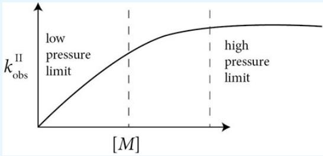</td></tr><tr><td>12. Arrhenius Expression for Temperature DependenceThe Arrhenius expression for the temperature dependence of a chemical reaction is written in the form  $k = Ae^{-Ea/RT}$ where k is the reaction rate constant, A is the temperature independent preexponential,  $E_a$  is the energy barrier (activation energy) for the reaction, R is the gas law constant and T is the temperature.The Arrhenius expression can be most easily graphed by plotting the natural log of the reaction rate constant, ln k, versus 1/T such that the intercept (at infinite temperature, 1/T = 0) is the pre-exponential A and the slope of the line is -Ea/R. This graphical representation is shown at right.The reason for the exponential dependence can be seen by plotting the distribution of molecular energy on the vertical axis of the reaction coordinate for the reaction.</td><td colspan="3">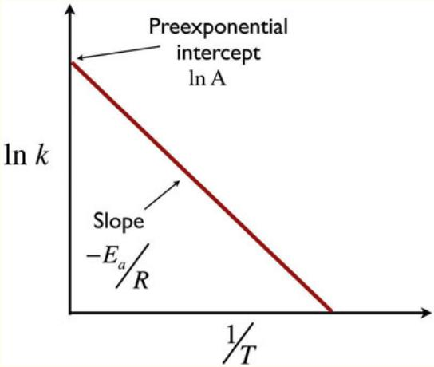</td></tr></table>

:::{figure} ../images/fig-p1-ch12-76.jpg
:name: fig-p1-ch12-76
:alt: Figure from the University Chemistry source textbook
:::

## B Q R

## CASE STUDY 12.1 Kinetics, Catalysis, Free Radicals, and the Antarctic Ozone Hole

Figure CS12.1a captures schematically the collision of a UV photon with the structure of DNA. A UV photon has sufficient energy to break the base pair across the double helix of DNA. The only reason organisms can survive on the Earth's surface is that these UV photons are absorbed in the “near UV” between 200 and 300 nm by ozone that exists in the stratosphere. The existence of ozone in the stratosphere depends in a very sensitive way on the kinetics of reactions that both produce $\mathrm { { O } } _ { 3 }$ and that destroy $\mathrm { { O } } _ { 3 }$ . In this case study, we first analyze the reactions that control the ozone distribution and then consider the cause of the antarctic ozone hole.

:::{figure} ../images/fig-p1-ch12-77.jpg
:name: fig-p1-ch12-77
:alt: FIGURE CS12.1A Ultraviolet photons have sufficient energy to break the base pairing across the spine of the DNA double helix. This results in the formation of dimers along each strand such that the genetic code cannot be copied, resulting i
FIGURE CS12.1A Ultraviolet photons have sufficient energy to break the base pairing across the spine of the DNA double helix. This results in the formation of dimers along each strand such that the genetic code cannot be copied, resulting in the increased probability of cancer.
:::


This discussion involves kinetics, photochemistry, and catalytic reactions as a coupled network of reactions. A catalyst is a substance (gas, liquid, or solid) that accelerates the rate of a chemical transformation without being consumed in the process. The most familiar example of this is the “catalytic converter” on your car that converts literally hundreds of kilograms of CO and NO to $\mathrm { C O } _ { 2 }$ and $\mathbf { N } _ { 2 }$ without altering its own chemical structure. Perhaps the most important example of catalysis in the gas phase involves the control of ozone in the Earth's stratosphere. To understand how catalysis and photochemistry work together, we begin by reviewing the photochemistry of molecular oxygen that we developed in the Framework of Chapter 12:

Molecular orbitals and electron promotion from bonding to antibonding orbitals is instigated by the absorption of a photon.

Unimolecular decomposition of $\mathrm { O } _ { 2 }$ by the absorption of an ultraviolet photon leads to the formation of atomic oxygen.

```{math}
:label: eq-p1-ch12-177
\mathrm{O} _ {2} + h \nu \xrightarrow {k _ {1}} \mathrm{O} + \mathrm{O} \quad (\text {   Reaction   1   })
```


Reaction rate constant $k _ { 1 }$

Termolecular formation of $\mathrm { { O } } _ { 3 }$ occurs when the atomic oxygen reacts with $\mathrm { O } _ { 2 }$

```{math}
:label: eq-p1-ch12-178
\mathrm{O} + \mathrm{O} _ {2} + M \xrightarrow {k _ {2}} \mathrm{O} _ {3} + M
```


(Reaction 2)

Reaction rate constant $k _ { 2 }$

Unimolecular decomposition of $\mathrm { { O } } _ { 3 }$ by photodissociation leads to the reformation of atomic oxygen and molecular oxygen.

```{math}
:label: eq-p1-ch12-179
\mathrm{O} _ {3} + h \nu \xrightarrow {k _ {3}} \mathrm{O} + \mathrm{O} _ {2}
```


Reaction rate constant $k _ { 3 }$ (photons in the near UV that also break the base pairing across the spine of DNA)

Bimolecular removal of $\mathrm { { O } } _ { 3 }$ and O to reform the $\mathrm { O } _ { 2 }$ bond completes the cycle.

```{math}
:label: eq-p1-ch12-180
\mathrm{O} _ {3} + \mathrm{O} \xrightarrow {k _ {4}} \mathrm{O} _ {2} + \mathrm{O} _ {2} \quad (\text {   Reaction   4   })
```


Reaction rate constant $k _ { 4 }$

Notice that ozone exists in a narrow layer in Earth's atmosphere because there are a limited number of photons with enough energy to break the bond in molecular oxygen

```{math}
:label: eq-p1-ch12-181
\mathrm{O} _ {2} + h \nu \xrightarrow {k _ {1}} \mathrm{O} + \mathrm{O} \quad (\text {   Reaction   1   })
```


So when those photons are removed, the source of atomic oxygen, and thus of ozone, through the reaction

```{math}
:label: eq-p1-ch12-182
\mathrm{O} + \mathrm{O} _ {2} + M \xrightarrow {k _ {2}} \mathrm{O} _ {3} + M
```


## (Reaction 2)

goes to zero and no more ozone can be produced.

Thus, as we come down through the atmosphere from above, as is the case with UV photons from the sun, the rate of reaction 1, $R _ { 1 } ,$ where

```{math}
:label: eq-p1-ch12-183
R _ {1} = \frac {- d [ \mathrm{O} _ {2} ]}{d t} = \frac {1}{2} \frac {d [ \mathrm{O} ]}{d t} = k _ {1} [ \mathrm{O} _ {2} ]
```


(photodissociation reactions are written in terms of a first-order reaction rate constant in units of $\scriptstyle { \left[ \mathbf { s e c } ^ { - 1 } \right] } )$ , increases as $[ \mathbf { O } _ { 2 } ]$ increases until all the UV photons are used up and, as a result, $R _ { 1 }$ goes to zero. This is why ozone increases as we come down through the atmosphere, until it reaches a peak, and then decreases as we go lower in the atmosphere, thereby forming a layer (the “ozone layer”) in the stratosphere about 25 kilometers above the ground. This sequence is summarized in Figure CS12.1b.

:::{figure} ../images/fig-p1-ch12-78.jpg
:name: fig-p1-ch12-78
:alt: Figure from the University Chemistry source textbook
:::

Ozone increases with decreasing altitude because of increasing ${ \bf O } _ { 2 }$ and then decreases because UV photons capable of breaking $\mathbf { O } _ { 2 }$ bonds have been removed.
FIGURE CS12.1B The photochemistry of oxygen is a critically important mechanism for the protection of organisms on Earth's surface. Photodissociation of ${ \sf O } _ { 2 }$ leads to the formation of ozone in the stratosphere—ozone that absorbs ultraviolet radiation between 200 and 300 nm. Ozone is formed by atomic oxygen reacting with molecular oxygen, $\mathsf { O } + \mathsf { O } _ { 2 } + M \to \mathsf { O } _ { 3 } + M ,$ in a termolecular reaction. Ozone is removed by photodissociation, $\mathsf { O } _ { 3 } + h v \to 0 + \mathsf { O } _ { 2 }$ , and by the bimolecular reaction, $0 + 0 _ { 3 }  \mathsf { O } _ { 2 } + \mathsf { O } _ { 2 }$

But a careful comparison between the rates of the individual reactions in oxygen photochemistry (Reactions 1-4 above) and the amount of ozone in the stratosphere demonstrated that there was only about onethird the amount of ozone present in the stratosphere when compared with what would be predicted by this “pure oxygen” reaction scheme. Thus, something else was removing ozone, because we know (1) how much $\mathrm { O } _ { 2 }$ there is in the atmosphere, (2) how many UV photons are received from the sun, and (3) laboratory measurements of the reaction rate constants $k _ { 1 } , k _ { 2 } , k _ { 3 } ,$ and $k _ { 4 }$

This led to a very important realization. With the evolution of life came methane, $\mathrm { C H } _ { 4 }$ produced by the anaerobic decomposition of organic matter in swamps:

:::{figure} ../images/fig-p1-ch12-79.jpg
:name: fig-p1-ch12-79
:alt: Figure from the University Chemistry source textbook
:::

But atomic oxygen, O, in any electronically excited state (that is, in any state for which an electron is promoted to a higher orbital which we will designate ${ { \bf O } ^ { * } } )$ reacts very rapidly with methane to produce one of the most important radicals in chemistry and biochemistry: the hydroxyl radical OH:

```{math}
:label: eq-p1-ch12-184
\mathrm{CH} _ {4} + \mathrm{O} ^ {*} \rightarrow \mathrm{OH} + \mathrm{CH} _ {3}
```


But one of the reasons OH is so important within natural systems is not only that it is so reactive (as a result of the unpaired electron in its valence shell), but also because it engages in catalytic reaction cycles, such as

```{math}
:label: eq-p1-ch12-185
\begin{array}{l l}&\mathrm{O} _ {3} + \mathrm{OH} \xrightarrow {k _ {5}} \mathrm{HO} _ {2} + \mathrm{O} _ {2}\\&\mathrm{HO} _ {2} + \mathrm{O} _ {3} \xrightarrow {k _ {6}} \mathrm{OH} + \mathrm{O} _ {2} + \mathrm{O} _ {2}\\\text { Net: }&\mathrm{O} _ {3} + \mathrm{O} _ {3} \rightarrow \mathrm{O} _ {2} + \mathrm{O} _ {2} + \mathrm{O} _ {2}\end{array}\quad\begin{array}{l l}&(\text { Reaction   5 })\\&(\text { Reaction   6 })\end{array}
```


This pair of reactions is catalytic because the two reactions, when taken together,

a) convert $\mathrm { { O } } _ { 3 }$ to $\mathrm { O } _ { 2 }$

b) leave the concentration of OH and $\mathrm { H O } _ { 2 }$ unaffected.

This means that a very small amount of OH can potentially destroy a very large amount of ozone. But how fast will that pair of reactions remove ozone? Well, because there are (many) other reactions interconverting OH and $\mathrm { H O } _ { 2 }$ within the system and because the reaction rate constants $\mathrm { k } _ { 5 }$ and $\mathrm { k } _ { 6 }$ are very different, the rate of one of the reactions (reaction 5 or 6) will be fast compared to the other.

Normally in chemistry we are interested in fast reactions, but in a serial process such as a catalytic cycle

```{math}
:label: eq-p1-ch12-186
\begin{array}{l l}&\mathrm{OH} + \mathrm{O} _ {3} \xrightarrow {k _ {5}} \mathrm{HO} _ {2} + \mathrm{O} _ {2}\\&\frac {\mathrm{HO} _ {2} + \mathrm{O} _ {3} \xrightarrow {k _ {6}} \mathrm{OH} + \mathrm{O} _ {2} + \mathrm{O} _ {2}}{\mathrm{O} _ {3} + \mathrm{O} _ {3} \rightarrow \mathrm{O} _ {2} + \mathrm{O} _ {2} + \mathrm{O} _ {2}}\\\text {Net:}&\end{array}
```


the rate of the overall process is equal to the slow step in the sequence. This is the rate limiting step and it is of immense importance. It defines (a.k.a. restricts) the rate at which the catalytic process occurs. By knowing the concentrations of OH, $\mathrm { H O } _ { 2 } , k _ { 5 } ,$ and $k _ { 6 } ,$ it can be easily determined that the slower of the two steps

```{math}
:label: eq-p1-ch12-187
\begin{array}{r l} & R _ {5} = \frac {- d [ \mathrm{OH} ]}{d t} = k _ {5} [ \mathrm{O} _ {3} ] [ \mathrm{OH} ] \\ & R _ {6} = \frac {- d [ \mathrm{HO} _ {2} ]}{d t} = k _ {6} [ \mathrm{O} _ {3} ] [ \mathrm{HO} _ {2} ] \end{array}
```


is reaction $^ { 6 , }$ so the rate of the net reaction $\mathrm { O } _ { 3 } + \mathrm { O } _ { 3 } \xrightarrow { k _ { \mathrm { n e t } } } \mathrm { O } _ { 2 } + \mathrm { O } _ { 2 } + \mathrm { O } _ { 2 }$ in the catalytic cycle is simply

```{math}
:label: eq-p1-ch12-188
R _ {\mathrm{net}} = 2 k _ {6} [ \mathrm{HO} _ {2} ] [ \mathrm{O} _ {3} ],
```


where the coefficient 2 results from the fact that two molecules of $\mathrm { { O } } _ { 3 }$ are removed each time the catalytic pair is complete.

But this tells us something very important: A very small amount of $\mathrm { H O } _ { 2 }$ can accelerate the removal of ozone if (and only if)

```{math}
:label: eq-p1-ch12-189
2 k _ {6} [ \mathrm{HO} _ {2} ] [ \mathrm{O} _ {3} ] \geq 2 k _ {4} [ \mathrm{O} ] [ \mathrm{O} _ {3} ]
```


This is, in fact, the case in Earth's stratosphere. In fact, throughout the evolution of life at Earth's surface and in its oceans, these hydrogen radicals, produced from methane, have modulated, but not completely destroyed, ozone in the stratosphere.

But this also tells us something else: namely, that if a substance is released into the atmosphere that in turn produces a radical that instigates another catalytic cycle whose rate limiting step is on the order of $2 k _ { 6 } [ \mathrm { H O _ { 2 } } ] [ \mathrm { O _ { 3 } } ]$ , that catalytic cycle will alter the concentration of ozone in the stratosphere. This brings us to the subject of ozone destruction by compounds, produced by human industry and by chemical synthesis, that are released at the surface but find their way to the stratosphere.

In 1928 a chemist by the name of Thomas Midgley, Jr., working for General Motors Corporation, developed a number of carbon-halogen compounds, which found broad use as cleaning agents, refrigerants, propellants in aerosol cans, agents for “blown foam,” as well as a number of medical applications based on the nontoxic attributes of these “chlorofluorocarbons” or “CFCs.” But the remarkable chemical stability of the carbon-chlorine and carbon-fluorine bonds, which was the reason these compounds were inert and nontoxic, had unpredictable consequences. Through the 1930s, 1940s, 1950s, 1960s, and 1970s, use worldwide of these compounds increased exponentially.

In the middle of the twentieth century, a global study was initiated—a study entitled the International Geophysical Year or IGY. This study, begun in 1958, was a two year effort to build a database on key scientific observations from the far reaches of the globe, including Antarctica and the Arctic. As part of those global observations, measurement stations were established on the Antarctic continent, one of them by Cambridge University (Cambridge, England) at Halley Bay. That measurement station began to systematically gather data on sea level, temperature, precipitation, and ozone concentrations in the stratosphere. All of those observations were obtained from the ground; stratospheric ozone amounts were obtained by observing the absorption of solar radiation in the same spectral region within which ozone absorbs UV and thereby protects inhabitants of the planet—200 to 300 nm.

Those observations, displayed in Figure CS12.1c, were continued each year, beginning in 1958, and they proved to be of critical importance for society. As the 1950s gave way to the 1960s and then the 1970s, researchers from the British Antarctic Survey wintered over at Halley Bay, keeping careful records of many geophysical quantities, but there was little change, save the natural variability of these quantities. Then in the mid 1970s, the British Antarctic Survey began to record significant drops in the amount of stratospheric ozone in the month following the return of sunlight to Antarctica. That month was October, and the October monthly mean ozone concentration continued to decline significantly each year through the remainder of the 1970s and into the mid 1980s, as shown in Figure CS12.1c.

:::{figure} ../images/fig-p1-ch12-80.jpg
:name: fig-p1-ch12-80
:alt: FIGURE CS12.1C The decrease in the total column density of stratospheric ozone in Dobsen units (DU) as a function of year between 1958 and 1984 constitutes one of the most important observations in the history of Earth observations. The mea
FIGURE CS12.1C The decrease in the total column density of stratospheric ozone in Dobsen units (DU) as a function of year between 1958 and 1984 constitutes one of the most important observations in the history of Earth observations. The measurements were obtained by the British Antarctic Survey at Halley Bay on the Antarctic continent and constitute the discovery of what was to become known as the “Antarctic Ozone Hole.”
:::


Then one of the most shocking discoveries in the annals of science was announced in 1985 by the British journal Nature, wherein the British Antarctic Survey revealed the data record for ozone over Antarctica from 1958 until 1984 showing a reduction in the October monthly mean of more than 30 percent! This was an amount of ozone loss that, had it occurred over populated regions of the globe, would have induced an epidemic in skin cancer cases, as the incidence of such cases is extremely dependent on UV dosage.

This discovery set off both a firestorm of concern and a wave of scientific hypotheses addressing potential mechanisms responsible for such massive loss of ozone. It also triggered intense scrutiny of satellite data; observations that should have detected the loss of ozone years earlier when the first instruments capable of observing the total ozone content of the stratosphere were placed in Earth orbit in the 1970s. The first published satellite measurements revealed a massive void in stratospheric ozone concentration over a region larger than the Antarctic continent. Those images, an example of which is shown in Figure CS12.1d, led to the phenomenon being dubbed the “Antarctic ozone hole,” and the name stuck.

:::{figure} ../images/fig-p1-ch12-81.jpg
:name: fig-p1-ch12-81
:alt: FIGURE CS12.1D A map of the “ozone hole”—the distribution of ozone concentration over the southern hemisphere expressed in terms of the “column concentration” of ozone. The “column concentration” of ozone represents the total number of ozon
FIGURE CS12.1D A map of the “ozone hole”—the distribution of ozone concentration over the southern hemisphere expressed in terms of the “column concentration” of ozone. The “column concentration” of ozone represents the total number of ozone molecules contained in a column extending from Earth's surface to the outer edge of the atmosphere. The units are “Dobson units” named after a pioneer in global ozone measurements. A column concentration of 500 Dobson units corresponds to a column 0.5 cm high at standard temperature and pressure.
:::


The debate grew over what was causing such a precipitous reduction in ozone, whether it would spread to the larger global context and whether it was natural or human induced. The three leading hypotheses were that:

1. As sunlight returned to the Antarctic, the heating of the atmosphere by the sun lead to the rising of air in the stratosphere, sweeping ozone up and out of the stratosphere to midlatitudes.

2. The magnetic field of the Earth focused high energy protons and helium ions into the stratosphere over the Antarctic and triggered chemical reactions that removed ozone; in particular the nitrogen species NO and $\mathrm { N O } _ { 2 }$ were implicated because they can catalytically remove ozone.

3. Compounds released at the surface by human activity penetrated the stratosphere and lead to the destruction of ozone—in particular chlorine and bromine from chlorofluorocarbons and halon compounds were somehow involved.

The United States responded by mounting exploratory missions on both the ground and by aircraft. The aircraft mission employed the famous U-2 spy plane, which could fly high enough to reach the stratosphere. It was outfitted with instruments that could test the various hypotheses outlined above. The aircraft flights revealed a rather dramatic series of events, beginning with the first flight, timed for just after the sun appeared for the first time on the horizon over Antarctica. The U-2, renamed the ER-2 by NASA, was equipped with instruments to study the ozone problem over Antarctica and is displayed in Figure CS12.1e.

:::{figure} ../images/fig-p1-ch12-82.jpg
:name: fig-p1-ch12-82
:alt: FIGURE CS12.1E The NASA ER-2 aircraft, which is a very high altitude research aircraft used to study processes in the stratosphere of Earth. The aircraft was originally designed as a military surveillance aircraft—a spy plane—used to gather
FIGURE CS12.1E The NASA ER-2 aircraft, which is a very high altitude research aircraft used to study processes in the stratosphere of Earth. The aircraft was originally designed as a military surveillance aircraft—a spy plane—used to gather information from very high altitude prior to the development of satellites. It was originally called the U-2.
:::


As the aircraft, shown in Figure CS12.1e, passed through what is called the winter “polar jet” shown in Figure 12.1 that physically isolates the Antarctic stratosphere from the outside world, the ozone concentration changed very little (as indicated in the August ${ 2 3 } ^ { \mathrm { r d } }$ plot shown in the left panel of Figure 12.1), but the ClO concentration increased dramatically, reaching levels ten times that present outside this “vortex” region. Just three weeks later, on September $1 6 ^ { \mathrm { { t h } } }$ (shown in the upper right panel of Figure 12.1), the ozone concentration had decreased by 60% inside the vortex in the region of highly amplified ClO. In fact, on smaller scales, every region high in ClO was found to be low in ozone and every region low in ClO was found to be high in ozone.

So how does society deal with such a situation? The anticorrelation of ClO and $\mathrm { { O } } _ { 3 }$ suggests (but does not prove) that ClO is somehow affecting $\mathrm { O } _ { 3 } .$ But how exactly is ClO affecting $0 _ { 3 } ?$ There are some 1.2 parts per billion (ppb) of ClO, but there are 3000 ppb of ozone, so how could ClO possibly remove ozone? Also, what determines the rate at which ozone is lost? Where did the ClO molecule come from? Before society acts, these questions must be answered—particularly because many people regarded the ozone loss issue as a hoax. However, whatever a person's views were, scientific evidence was necessary for informed public policy decisions because such policy has major economic consequences.

To answer these questions, we turn to our analysis of chemical kinetics —the study of how fast chemical reactions take place. To develop an understanding of how chemical kinetics applies to this problem, we return to the reactions of oxygen and ozone in the evolution of life on Earth to remind ourselves that chemical reactions, at their most fundamental level, can be classified according to their molecularity: unimolecular, bimolecular, and termolecular; and each of those reaction categories has associated with it a specific type of potential energy surface.

We recognize that an important objective of studies in the physical sciences is to guide key societal objectives. For example, how do we maintain a UV dosage level at Earth's surface so as to allow the complex organisms that inhabit the surface to remain alive and well? It is important to recognize that there is a contentious battle between those who are focused on stewardship of the planet, not necessarily with regard for a specific economic intent, and those who have a serious economic stake in any federal legislation to limit the production of a given chemical. In fact, then, we are focused on how to dissect the scientific issues linking what happens at the molecular level with what happens in a Senate hearing.

Following the discovery of the dramatic loss of ozone over Antarctica by the British Antarctic Survey, Mario Molina and his wife, Luisa, then at the Jet Propulsion Laboratory in Pasadena, California, proposed a catalytic mechanism implicating chlorine radicals:

```{math}
:label: eq-p1-ch12-190
\mathrm{ClO} + \mathrm{ClO} + M \xrightarrow {k _ {7}} \mathrm{ClOOCl} + M
```


slow (rate limiting step)

```{math}
:label: eq-p1-ch12-191
\mathrm{ClOOCl} + h \nu \xrightarrow {k _ {8}} \mathrm{Cl} + \mathrm{ClOO}
```


slow (but equal to rate of reaction 7)

```{math}
:label: eq-p1-ch12-192
\mathrm{ClOO} + M \xrightarrow {k _ {9}} \mathrm{Cl} + \mathrm{O} _ {2} + M
```


fast

```{math}
:label: eq-p1-ch12-193
2 \times \left(\mathrm{Cl} + \mathrm{O} _ {3} \xrightarrow {k _ {1 0}} \mathrm{ClO} + \mathrm{O} _ {2}\right)
```


fast

```{math}
:label: eq-p1-ch12-194
\mathrm{O} _ {3} + \mathrm{O} _ {3} \rightarrow \mathrm{O} _ {2} + \mathrm{O} _ {2} + \mathrm{O} _ {2}
```


And Mike McElroy and Stephen Wofsy of Harvard proposed a catalytic cycle implicating chlorine and bromine:

Ozone Concentration

```{math}
:label: eq-p1-ch12-195
\begin{array}{l l}\mathrm{ClO} + \mathrm{BrO} \xrightarrow {k _ {1 1}} \mathrm{Cl} + \mathrm{Br} + \mathrm{O} _ {2}&\text {slow (rate limiting step)}\\\mathrm{Cl} + \mathrm{O} _ {3} \xrightarrow {k _ {1 2}} \mathrm{ClO} + \mathrm{O} _ {2}&\text {fast}\\\mathrm{Br} + \mathrm{O} _ {3} \xrightarrow {k _ {1 3}} \mathrm{BrO} + \mathrm{O} _ {2}&\text {fast}\\\hline \mathrm{O} _ {3} + \mathrm{O} _ {3} \rightarrow \mathrm{O} _ {2} + \mathrm{O} _ {2} + \mathrm{O} _ {2}&\end{array}
```


The observed concentrations of ClO and BrO and the rate of disappearance of ozone measured by the U-2 aircraft within the Antarctic vortex established quantitatively that the rate limiting steps, occurring on explicitly defined potential energy surfaces, were responsible for the observed rate of ozone loss. This is summarized in Figure CS12.1f.

```{math}
:label: eq-p1-ch12-196
\mathrm{ClO} + \mathrm{ClO} + M \rightarrow \mathrm{ClOOCl} + M
```


```{math}
:label: eq-p1-ch12-197
\mathrm{ClOOCl} + h \nu \rightarrow \mathrm{Cl} + \mathrm{ClOO}
```


```{math}
:label: eq-p1-ch12-198
\mathrm{ClOO} + M \rightarrow \mathrm{Cl} + \mathrm{O} _ {2} + M
```


```{math}
:label: eq-p1-ch12-199
2 \times \left(\mathrm{Cl} + \mathrm{O} _ {3} \rightarrow \mathrm{ClO} + \mathrm{O} _ {2}\right)
```


```{math}
:label: eq-p1-ch12-200
\mathrm{O} _ {3} + \mathrm{O} _ {3} \rightarrow 3 \mathrm{O} _ {2}
```


```{math}
:label: eq-p1-ch12-201
R L S \quad \mathrm{ClO} + \mathrm{BrO} \rightarrow \mathrm{Cl} + \mathrm{Br} + \mathrm{O} _ {2}
```


:::{figure} ../images/fig-p1-ch12-83.jpg
:name: fig-p1-ch12-83
:alt: Figure from the University Chemistry source textbook
:::

```{math}
:label: eq-p1-ch12-202
\mathrm{Cl} + \mathrm{O} _ {3} \rightarrow \mathrm{ClO} + \mathrm{O} _ {2}
```


```{math}
:label: eq-p1-ch12-203
\mathrm{Br} + \mathrm{O} _ {3} \rightarrow \mathrm{BrO} + \mathrm{O} _ {2}
```


```{math}
:label: eq-p1-ch12-204
\mathrm{O} _ {3} + \mathrm{O} _ {3} \rightarrow 3 \mathrm{O} _ {2}
```


FIGURE CS12.1F The loss of ozone as a function of time within the Antarctic vortex is shown for actual observations. The concentration of ${ \sf O } _ { 3 }$ is shown on the vertical axis in units of $1 0 ^ { 1 2 }$ $\mathsf { m o l e c u l e s } / \mathsf { c m } ^ { 3 }$ Time in days is displayed on the horizontal axis. The rate of ozone loss, $d ( { \cal O } _ { 3 } ] / d t ,$ is plotted based on the rate limiting step of the chlorine dimer mechanism. When the rate of removal of the bromine-chlorine catalytic step is added to the dimer catalytic step, the rate of ozone loss, shown by the dashed curve, is equal to the observed rate of ozone loss.

Thus, while the observed anticorrelation of $\mathrm { { O } } _ { 3 }$ and ClO (shown in Figure $\underline { { 1 2 . 1 } } )$ was a dramatic visual, what made the case compelling in a court of public policy and in a court of science was the unequivocal proof through an understanding of catalytic reactions. In particular, specific catalytic cycles were identified that control chemical transformations at a rate dictated by the rate limiting step in each of those catalytic cycles. This was the scientific foundation underlying the Montreal Protocol that today limits the global production of CFCs and halons. It has now been demonstrated that had immediate controls not been placed on CFC production and distribution in the 1990s, large increases in UV dosage at the Earth's surface would now have occurred with serious human health implications.

## Problem 1

We consider here the catalytic cycles that destroy ozone in the Antarctic vortex.

a. Write the rate expression for ozone loss

```{math}
:label: eq-p1-ch12-205
\left(- \frac {d [ \mathrm{O} _ {3} ]}{d t}\right) _ {\mathrm{CIO/CIO}} = ?
```


for the Molina mechanism involving ClO and the ClO dimer ClOOCl. b. Write the rate expression for ozone loss

```{math}
:label: eq-p1-ch12-206
\left(- \frac {d [ \mathrm{O} _ {3} ]}{d t}\right) _ {\mathrm{ClO/BrO}} = ?
```


for the McElroy-Wofsy mechanism involving ClO and BrO.

c. Given your answer in (a) and (b), what is the total rate of ozone loss for the combination of (a) and (b)?

## BUILDING A GLOBAL ENERGY BACKBONE

## CASE STUDY 12.2 Oxygen, Photochemistry, and the Evolution of Life Forms on the Earth

The history of life, as it evolved from very primitive beginnings and grew to exert powerful control over the chemical and physical structure of the Earth system, is a remarkable yet unsolved problem. It began like this. After a delay of some one billion years following the formation of the proto-Earth, the first life forms began to emerge. Microfossils resembling modern cyanobacteria have been found in 3.5 billion year old rocks. The circumstances related to the first life forms have been, and continue to be, the subject of a great debate. There have emerged a number of plausible paths leading to the inexorable march toward more complex and intricate biological architectures, exhibited by the vast array of species that now inhabit the planet.

One line of reasoning begins with the observed fact that a stunning number of organic structures exist in the interstellar medium—most of these molecular structures have been observed in the microwave region using ground-based receiving antennas, as shown in Figure CS12.2a.

:::{figure} ../images/fig-p1-ch12-84.jpg
:name: fig-p1-ch12-84
:alt: FIGURE CS12.2A The ability of the atmosphere to absorb electromagnetic radiation is a critical part of sustaining life at the Earth's surface. The opacity of the atmosphere, expressed here as complete absorption of radiation for 100% opacit
FIGURE CS12.2A The ability of the atmosphere to absorb electromagnetic radiation is a critical part of sustaining life at the Earth's surface. The opacity of the atmosphere, expressed here as complete absorption of radiation for 100% opacity and no absorption of radiation for 0% opacity, is displayed in the upper panel for wavelengths from 0.1 nm to 1 km. This extends from the wavelengths of gamma rays and x-rays (0.1 nm) at the short wavelength extreme to radio waves at the long wavelength extreme. The lower panel indicates the visible region, where the human eye is sensitive; the middle infrared, where $\mathsf { C O } _ { 2 } ^ { \cdot } , \mathsf { H } _ { 2 } \mathsf { O }$ , etc., have banded absorption; and the microwave region, where the atmosphere is transparent to radiation.
:::


These precursors to life, or indeed life forms themselves, may have been delivered to the Earth's surface by comets, which are composed largely of ice and provide a potential harbor for primitive life forms. Another school of thought is organized around the concept that the molecules that constitute the building blocks of more complex structures (carbon, nitrogen, oxygen, etc.) were present in the early atmosphere, and the energy release from photochemical reactions initiated by ultraviolet radiation or from lightning triggered the synthesis of the amino acids that polymerized to produce proteins—the building blocks of all living structures. Yet another line of reasoning cites the existence of deep-sea vents as the most probable domain for fostering early life forms. These vents are located along regions of the sea floor which are spreading, driven by the motion of tectonic plates. These vent regions provide a remarkable array of temperatures, chemical environments and protection from destructive UV radiation. Studies of these regions have intensified over the past two decades revealing intricate ecological infrastructure that fostered bacteria capable of using sulfur contained in the vent water to develop an ecosystem that supports a dense population of shellfish and worms. There is growing evidence that these life forms, in the vicinity of deep-sea vents, shown in Figure CS12.2b, constitute the early life forms some 3 billion years ago.

:::{figure} ../images/fig-p1-ch12-85.jpg
:name: fig-p1-ch12-85
:alt: FIGURE CS12.2B Deep sea vents, where hot water rich in mineral nutrients emerges from the ocean floor, constitute a fertile chemical environment for the origin of molecular structures critical to the evolution of early life forms.
FIGURE CS12.2B Deep sea vents, where hot water rich in mineral nutrients emerges from the ocean floor, constitute a fertile chemical environment for the origin of molecular structures critical to the evolution of early life forms.
:::


A key component of the evolution of the Earth system to what we regard today as a planet possessing immense beauty and diversity, was the buildup of free oxygen in the atmosphere. This growth of oxygen in the atmosphere, from a minor species some 3.5 billion years ago, when its mole-fraction in the atmosphere was approximately $1 0 \times { { 1 0 } ^ { - 6 } }$ (that is tenparts-per-million), to its role over the past 600 million years as a major species that grew to comprise some 20 percent of the atmosphere 350 million years ago, is displayed in Figure CS12.2c.

:::{figure} ../images/fig-p1-ch12-86.jpg
:name: fig-p1-ch12-86
:alt: FIGURE CS12.2C The buildup of oxygen in Earth's atmosphere is shown as a function of time extending from the Earth's origin, 4.6 billion years ago, to the present. The vertical axis (the ordinate) represents the fraction of the current conc
FIGURE CS12.2C The buildup of oxygen in Earth's atmosphere is shown as a function of time extending from the Earth's origin, 4.6 billion years ago, to the present. The vertical axis (the ordinate) represents the fraction of the current concentration of $\mathsf { O } _ { 2 }$ in the atmosphere, which reached about 1 percent of the current atmospheric level some 2 billion years ago and reached its present atmospheric level about 350 million years ago. The ozone build up is represented in terms of the fraction of the total number of ozone molecules currently present in a “column” extending from Earth's surface to the outer extremity of the atmosphere.
:::


Molecular oxygen arose in concert with the evolution of early life forms. The primitive Earth possessed an atmosphere influenced primarily by gases injected directly by volcanic activity. Once the surface of the Earth had cooled sufficiently to condense water, the primary molecules in the atmosphere were $\mathrm { C O } _ { 2 }$ and $\mathrm { N } _ { 2 }$ . Our two nearest neighbors in the Solar System, Venus and Mars, have, respectively, 96 and 95 percent $\mathrm { C O } _ { 2 }$ atmospheres, and, respectively, 4 percent and 3 percent nitrogen. This early atmosphere of the Earth is usually referred to as the Archean atmosphere as it is this simple outgassed atmosphere that is associated with the oldest known rocks; those of the Precambrian period that are primarily igneous in composition.

The very first organism must have been heterotrophic, that is an organism that can assimilate organic compounds from their environment, because these organisms could not, and today cannot, synthesize their own food and thus are dependent on complex organic substances for nutrition. Prior to 3 billion years ago, these early organisms must have obtained their energy from reactions other than respiration, as there was no available oxygen.

In particular the reaction pathways may well have mimicked the sequences that occur today in anaerobic systems; those biochemical systems that operate in the absence of molecular oxygen.

In varied and dramatic ways, life on Earth is fueled by oxidationreduction (redox) reactions exhibiting striking variety and creativity. As developed in Chapter 2, redox reactions are chemical reactions in which electrons are transferred between atomic or molecular “sites,” and the organism captures the energy, released in the exchange of one or more electrons. In the course of life's evolution, organisms have “learned” through the development of specific proteins and associated membranes to channel this energy release into biochemical pathways that sustain life.

There is a coherent pattern to these redox processes, and they are worthy of careful consideration. In an oxygen rich environment, termed aerobic, the dominant biological redox process is respiration

```{math}
:label: eq-p1-ch12-207
\mathrm {(CH_ {2} O) + O_ {2} \rightarrow CO_ {2} + H_ {2} O}
```


where the generalized organic molecule is represented schematically by $\mathrm { ( C H _ { 2 } O ) }$ The key point to focus on is that the carbohydrate molecules, $\mathrm { ( C H _ { 2 } O ) }$ provide electrons for the reduction of molecular oxygen. All advanced life forms employ the oxidation of organic material for their primary energy source.

When free oxygen is not available, as was largely the case for the first 2.5 billion years of Earth's existence, and is the case in many aquatic systems today, many other redox reactions can be utilized by lower life forms such as bacteria. As we have seen, early bacterial forms appeared some 3 billion years ago, sustained entirely on the back of a series of redox reactions that cascade to sequentially lower redox potentials producing $\mathrm { C O _ { 2 } , \ N _ { 2 } , \ H _ { 2 } S , \ C H _ { 4 } }$ and other molecular species of great importance to the development of the early atmosphere.

There is strong evidence that photosynthesis evolved quite early, allowing the critical transition to organisms capable of synthesizing their own organic molecules from $\mathrm { C O } _ { 2 }$ —the autotrophs. In addition to fossil evidence, carbon isotope measurements on fossil organic carbon show photosynthesis to be at least 3.5 billion years old.

The signature isotopic marker for organic material formed in photosynthetic processes is the depleted stable $^ { 1 3 } \mathrm { C }$ isotope relative to $^ { 1 2 } \mathrm { C }$ resulting from the slower rate of capture of the heavier isotope by the $\mathrm { C O } _ { 2 }$ fixing enzyme ribulose bisphosphate carboxylase.

But the key result of the emergence of autotrophic organisms was the release of $\mathrm { O } _ { 2 } .$ . While the large class of anaerobic bacteria survived under difficult conditions in the initial stages of evolution, their species were very sensitive to $\mathrm { O } _ { 2 }$ —they could not survive in its presence. What saved these early life forms from destruction by the $\mathrm { O } _ { 2 }$ produced by autotrophic organisms were the many oxidizable minerals in the Earth's crust, most notably sulfur and iron. These minerals extracted the oxygen formed by the early autotrophs and chemically bound the oxygen, allowing these early species to prosper.

The silicate minerals of the mantle yielded elevated levels of $\mathrm { F e ^ { 2 + } }$ in the early ocean. And $\mathrm { F e ^ { 2 + } }$ is quite soluble, providing an oxidation pathway to $\mathrm { F e ^ { 3 ^ { + } } }$ , primarily as precipitates of $\mathrm { F e ( O H ) _ { 3 } . F e _ { 2 } O _ { 3 } } ,$ ferric oxide, has been discovered in sedimentary rocks as old as 3.5 billion years and constitutes the first evidence of oxygen production in Banded Iron Formations in which siliceous sediment is sandwiched in with $\mathrm { F e } _ { 2 } \mathrm { O } _ { 3 }$ as shown in Figure CS12.2d.

:::{figure} ../images/fig-p1-ch12-87.jpg
:name: fig-p1-ch12-87
:alt: FIGURE CS12.2D Ferric oxide, mathematical notation , in Banded Iron Formations shown here, in which silicate minerals containing mathematical notation are sandwiched between bands of ferric oxide, are as old as 3.5 billion years. These disc
FIGURE CS12.2D Ferric oxide, $\mathsf { F e } _ { 2 } \mathsf { O } _ { 3 }$ , in Banded Iron Formations shown here, in which silicate minerals containing $\mathsf { F e } ^ { 2 + }$ are sandwiched between bands of ferric oxide, are as old as 3.5 billion years. These discoveries indicate the existence of the first oxygen producing organisms.
:::


As autotrophs grew in abundance, the $\mathrm { O } _ { 2 }$ they produced gradually overwhelmed the $\mathrm { F e ^ { 2 + } }$ supply of the oceans and the increased $\mathrm { O } _ { 2 }$ that resulted began to oxidize exposed minerals on land, most importantly iron pyrite, $\mathrm { F e S } _ { 2 }$ producing $\mathrm { F e ( O H ) _ { 3 } }$ and $\mathrm { H } _ { 2 } \mathrm { S O } _ { 4 }$ The discovery of Red Beds, deposits of $\mathrm { F e } _ { 2 } \mathrm { O } _ { 3 }$ shown in Figure CS12.2e, emerged about 2 billion years ago and marked the end of Banded Iron Formations.

:::{figure} ../images/fig-p1-ch12-88.jpg
:name: fig-p1-ch12-88
:alt: FIGURE CS12.2E Red Beds formed from deposits of mathematical notation extend back some 2 billion years, when mathematical notation production from autotrophs had increased to the point where the supply of reduced iron mathematical notation
FIGURE CS12.2E Red Beds formed from deposits of $\mathsf { F e } _ { 2 } \mathsf { O } _ { 3 }$ extend back some 2 billion years, when ${ \sf O } _ { 2 }$ production from autotrophs had increased to the point where the supply of reduced iron $( \mathsf { F e } ^ { 2 + } )$ was overwhelmed in favor of the oxidized form $( \mathsf { F e } ^ { 3 + } )$
:::


The earliest and simplest bacteria and blue green algae were the prokaryotes shown in Figure CS12.2f, characterized by the absence of a nuclear membrane and by DNA that was not organized into chromosomes. These simpler cell architectures were replaced in the first billion years of Earth history by eukaryotes, distinguished by a distinct membrane-bound nucleus displayed in Figure CS12.2g. It was a development of profound importance as the evolution of more complex multicellular organisms resulted; organisms that could survive in the presence of free oxygen. This took place about 3 billion years along the evolutionary path from the Earth's origin—about 4.6 billion years ago. Eukaryotes could survive on $\mathrm { O } _ { 2 }$ at or above 1 percent of the present atmospheric level (PAL), a threshold that was passed approximately 2 billion years ago. At this juncture, free oxygen production accelerated with the evolution of chloroplasts in the widening array of eukaryotes— chloroplasts are organelles that are capable of organic synthesis driven by sunlight, the “dawn” of photosynthesis! But of great importance for the evolution of life at the surface was the formation of the oxygen allotrope ozone $\mathrm { ( O _ { 3 } ) }$ in the atmosphere. This was a critically important development because $\mathrm { { O } } _ { 3 }$ absorbs sunlight in the ultraviolet region between 200 and 300 nm, permitting the migration of living forms from the ocean (water strongly absorbs ultraviolet) to the continents. Sunlight in the 200 to 300 nm range breaks the base-pairing of nucleic acids across the spine of the DNA double helix, thereby scrambling the genetic code of the affected cell as displayed in Figure CS12.1a. Fossils of the evolving manifold of multicellular organisms have been found in sedimentary rocks that are 680 million years old but the rise of “modern” species of green plants that drove oxygen levels upward to present levels date from some 400 million years ago.

:::{figure} ../images/fig-p1-ch12-89.jpg
:name: fig-p1-ch12-89
:alt: FIGURE CS12.2F The earliest and simplest cell architecture belonged to the prokaryotes, which lacked a nuclear membrane within the cell. In addition, the DNA of the cell was not organized into chromosomes.
FIGURE CS12.2F The earliest and simplest cell architecture belonged to the prokaryotes, which lacked a nuclear membrane within the cell. In addition, the DNA of the cell was not organized into chromosomes.
:::


:::{figure} ../images/fig-p1-ch12-90.jpg
:name: fig-p1-ch12-90
:alt: FIGURE CS12.2G The cell structure of the eukaryotes is distinguished by the existence of a membrane-bound nucleus. This provided much greater control within the cell, as the channels between the outer membrane of the cell and the nucleus pr
FIGURE CS12.2G The cell structure of the eukaryotes is distinguished by the existence of a membrane-bound nucleus. This provided much greater control within the cell, as the channels between the outer membrane of the cell and the nucleus provided much more sophisticated control of cell function.
:::


Development of oxygen within the Earth system is traced out in Figure CS12.2c. As limited oxygen levels completed the oxidation of $\mathrm { F e ^ { 2 + } }$ to $\mathrm { F e ^ { 3 ^ { + } } }$ in the oceans, the Banded Iron Formations ended approximately 2 billion years ago, followed by the occurrence of continental Red Beds extending from 2 billion years ago until 500 million years ago. Atmospheric $\mathrm { O } _ { 2 }$ began to build following the formation of the Banded Iron Formations and reached 21% some 350 million years ago. An important point is that the present atmospheric reservoir is approximately 2 percent of the cumulative production of $\mathrm { O } _ { 2 } ,$ with the balance tied up in the oxidation of minerals and the burial of organic material.

What is also of considerable importance is that the basic photosynthetic step

```{math}
:label: eq-p1-ch12-208
\mathrm{CO} _ {2} + \mathrm{H} _ {2} \mathrm{O} \xrightarrow {\text { photosynthesis }} (\mathrm{CH} _ {2} \mathrm{O}) + \mathrm{O} _ {2}
```


that results in a net production of $\mathrm { O } _ { 2 }$ and its release as free oxygen into the atmosphere, is the result of the burial of the (reduced) organic product. The buried carbon is reflected in the “fossil fuel” reservoirs in the Earth's crust.

Oxygen dominates the unique chemistry of life's history on the planet. Elemental oxygen is avid for electrons—it has the highest electronegativity of any element except fluorine. Therefore, oxygen combines with most other elements to form stable oxides.

The emergence of molecular oxygen as a dominant component of the Earth's atmosphere had two profound effects on the development of species. The first was that organisms had a plentiful supply of an oxidizer that could be combined with a range of hydrocarbon “fuels” to sustain the organism. This provided the opportunity to develop large organisms that could employ a circulatory system to carry both the fuel in the form of sugars, and oxygen attached to hemoglobin to supply oxygen within the cellular structure of the organism. This led to the development of large ocean creatures that brought complicated ecosystems that included sharks, dolphins, whales, etc. embedded within the world's oceans. Second, and more remarkably, the ability of oxygen to absorb solar ultraviolet photons in the spectral range between 200 and 300 nm is the sole reason both animals and plants could venture out of the protection of the ocean onto land and survive. We have already developed an understanding of molecular orbital structure, specifically for oxygen. When a photon is absorbed by a molecule, an electron within that molecular orbital structure is “promoted” to a higher energy state—to an upper potential energy surface. Quite often, that upper potential energy surface leads to the dissociation of the molecule into molecular fragments. This mechanism of electron promotion by an ultraviolet photon leads to the dissociation of $\mathrm { O } _ { 2 } .$ . In the case of $\mathrm { O } _ { 2 } ,$ the molecule has only one choice when it is “photodissociated”—the formation of two atoms of atomic oxygen. What is truly remarkable about molecular oxygen is that the position of the upper potential energy surface is located at just the right position in energy and internuclear distance with respect to the ground state so as to remove all solar ultraviolet photons between 100 and 200 nm before they reach the ground. The implications of this are truly remarkable. This relationship between shifts in the upper potential energy surface and the corresponding position and range of the absorption of ultraviolet photons is critically important to the existence of life at the surface of the Earth.

But the remarkable chain of events linking the molecular structure of $\mathrm { O } _ { 2 }$ to the existence of life on the planet continues. The atomic oxygen produced in the photodissociation of $\mathrm { O } _ { 2 }$ reacts with the $\mathrm { O } _ { 2 }$ in the atmosphere to produce ozone, $\mathrm { { O } } _ { 3 }$ . But ozone is the only species in the atmosphere that absorbs solar ultraviolet photons between 200 and 300 nm, photons that are themselves lethal to organisms at the surface because, as depicted in Figure CS12.1a, they break the base pairing across the double helix of DNA. Figure CS12.2h schematically captures the absorption region of ozone that extends protection of the Earth's surface to wavelengths slightly higher than 300 nm—a wavelength marginally safe for organisms to survive at the surface. As we can see, a study of specifically how photons interact with the structure of molecules is critically important to both life as it has evolved on Earth and to present and future developments linking scientific and technical developments to societal objectives.

:::{figure} ../images/fig-p1-ch12-91.jpg
:name: fig-p1-ch12-91
:alt: FIGURE CS12.2H Solar photons from the Sun are lethal to human life (and virtually all other organisms) at wavelengths equal to and less than 310 nm. We are protected at the Earth's surface from this lethal radiation by ozone between 200 and
FIGURE CS12.2H Solar photons from the Sun are lethal to human life (and virtually all other organisms) at wavelengths equal to and less than 310 nm. We are protected at the Earth's surface from this lethal radiation by ozone between 200 and 310 nm, by molecular oxygen between 100 nm and 200 nm, and by the ionization of $\mathsf { N } _ { 2 }$ and $\mathsf { O } _ { 2 }$ below 100 nm. This is mapped out in this diagram.
:::


Diagram the relationship between the molecular orbital diagram for $\mathrm { O } _ { 2 }$ and the potential energy surfaces for $\mathrm { O } _ { 2 }$ that indicate the promotion of the electron from the ground electronic state of $\mathrm { O } _ { 2 }$ to the excited state of $\mathrm { O } _ { 2 }$ that is responsible for absorption of solar radiation between 100 and 200 nm.

## Problem 2

a. Using the potential energy surfaces defining the absorption of UV radiation by $\mathrm { O } _ { 2 }$ between 100 and 200 nm, sketch what would occur if the upper potential energy surface was shifted to a slightly larger internuclear distance.

b. How would this shift affect the wavelength position of the $\mathrm { O } _ { 2 }$ absorption?

c. If the upper (excited) state of $\mathrm { O } _ { 2 }$ was shifted to a slightly smaller internuclear distance, how would this affect the wavelength of the $\mathrm { O } _ { 2 }$ absorption?