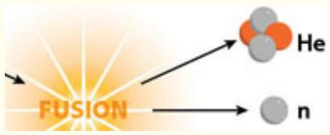
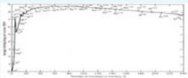
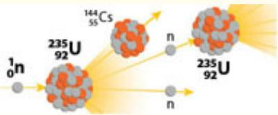

# 13 Nuclear Chemistry

## ENERGY, REACTORS, IMAGING, AND RADIOCARBON DATING


“It is a profound and necessary truth that the deep things in science are not found because they are useful; they were found because it was possible to find them.”

—J. Robert Oppenheimer

:::{figure} ../images/fig-p1-ch13-1.jpg
:name: fig-p1-ch13-1
:alt: Figure from the University Chemistry source textbook
:::

## Framework

A recurring theme in the effort to understand the global structure of primary energy generation and then define a path forward engaging a new blend of energy sources at the required scale, is the necessity to reanalyze all options. It is for this reason that we have critiqued, thus far, the potential for renewable energy from wind, concentrated solar thermal, solar photovoltaics, hydroelectric, tidal, and geothermal. Nuclear energy currently contributes about 6% to the global total generation of primary power generation. However, the fractional contribution of nuclear power in each nation varies remarkably. Virtually without exception, nuclear power is used to generate electricity and we can judge the relative contribution of nuclear power in each country by comparing the fraction of electrical power generated by nuclear for a number of important examples. These cases are summarized in Table

13.1 with the notable examples of France with 75% of electrical power generated by nuclear, the U.S. with 20%, Sweden with $47 \% ,$ , Canada with 13%, Russia with 14%, Japan with 36%, and China with <1%.

:::{figure} ../images/fig-p1-ch13-2.jpg
:name: fig-p1-ch13-2
:alt: FIGURE 13.1 The United States advanced test reactor at the Idaho National Laboratory. The core design of this light-water reactor employs square cross section fuel rods with round control rods inserted into the center of the fuel rods. The
FIGURE 13.1 The United States advanced test reactor at the Idaho National Laboratory. The core design of this light-water reactor employs square cross section fuel rods with round control rods inserted into the center of the fuel rods. The blue glow is the Cherenkov radiation that is emitted when a charged particle penetrates into a material (in this case electrons into water) at a velocity greater than the speed of light in that medium. The high velocity electrons are produced in the nuclear reaction that occurs in the fuel rods that contain the <sup>235</sup>U isotope.
:::


:::{figure} ../images/fig-p1-ch13-3.jpg
:name: fig-p1-ch13-3
:alt: Figure from the University Chemistry source textbook
:::

Source: International Atomic Energy Agency, 2019

Nuclear power is the most highly developed alternative to hydrocarbon combustion as a primary energy source. It is also, along with tidal and geothermal, the only form of alternative primary energy generation that does not depend on the sun.

The key consideration with respect to the potential role for nuclear power in the generation of primary power in the U.S. is to reanalyze in a rational framework how nuclear stands up to alternatives that include fossil fuels, wind, concentrated solar thermal, photovoltaics, hydro, biofuels, etc.

First, we note that the extraction of energy through nuclear reactions, that must, by their definition involve changes in the structure of the nucleus, falls into two distinct categories. Nuclear fusion involves the union of two smaller nuclei to form a larger nucleus of a different element. It is the reaction of hydrogen nuclei to form helium nuclei at very high pressure and temperature at the core of the sun that supplies the Earth with $\mathbf { 1 . 5 \times 1 0 ^ { 1 0 } }$ kWh/year of energy. Second, nuclear fission involves the splitting of heavy nuclei into smaller nuclei that releases energy which we are familiar with in nuclear power plants and in most nuclear weapons.

We can distinguish these two categories of nuclear power generation by referring to a graph of the binding energy per nucleon vs. atomic number of each of the elements in the periodic table that is displayed in Figure 13.2. We plot this with a vertical axis that displays the binding energy as increasingly negative as the binding energy per nucleon increases. This is identical to the convention we have used for the potential energy of electron “capture” by a positively charged nucleus.

Binding Energy per Nucleon
:::{figure} ../images/fig-p1-ch13-4.jpg
:name: fig-p1-ch13-4
:alt: FIGURE 13.2 The binding energy of nucleons that compose the nucleus of elements running from hydrogen to uranium is plotted as a function of mass number. Notice that the binding energy per nucleon increases (becomes more negative) as we pro
FIGURE 13.2 The binding energy of nucleons that compose the nucleus of elements running from hydrogen to uranium is plotted as a function of mass number. Notice that the binding energy per nucleon increases (becomes more negative) as we proceed from hydrogen to helium-4, $( \mathsf { \Pi } _ { 2 } ^ { 4 } \mathsf { H } \mathsf { e } _ { } )$ ), and then continues to reach larger negative (more strongly bound) values to iron-56 $( ^ { 5 6 } \mathsf { F e } )$ . For larger mass numbers, the binding energy decreases (becomes less negative). Fusion reactions operate by joining larger nuclei, thereby releasing energy, on the left side of the diagram. Fission reactions involve splitting larger nuclei into smaller ones, a process that occupies the right-hand side of the diagram.
:::


Nuclear fusion thus occupies the left-hand side of the energy diagram in Figure 13.2. Nuclear fission occupies the right-hand side of Figure 13.2. Iron, $^ { 5 6 } \mathrm { F e } ,$ sits at the minimum of the binding energy per nucleon as a function of atomic mass. Both fusion and fission possess a common characteristic, which is that the energy provided per nuclear reaction is approximately one million times the energy provided per molecule in a chemical reaction involving hydrocarbon fuels. This has important implications for a planet that must sustain 10 billion people with a constantly increasing standard of living with its requisite increase in demand for energy. Specifically, that the amount of fuel—the volume of fuel—and of waste that must be dealt with are both one million times less for nuclear energy than for fossil fuel combustion.

To place this in perspective, each person in the U.S. consumes approximately 32 kg of fossil fuel per day with 8 kg as coal, 8 kg of oil, and 16 kg of natural gas. This translates into an amount equal in weight to 7 gallons of milk that is extracted from the Earth, transported, processed, and distributed to the consumer, and then burned. This combustion produces approximately 60 kg of $\mathrm { C O _ { 2 } / d a y }$ for each person as waste that is dumped into the atmosphere. That is 60 kg of carbon dioxide per person, per day!

The amount of naturally occurring uranium consumed in a typical fission reaction required to provide the same amount of energy as 32 kg of fossil fuel is 4 grams, and the weight of the waste is one-half of one gram. This does not mean that the disposal of nuclear waste does not involve problems, it is simply a statement of the relative magnitude of the mass into and out of fossil fuel combustion plants vs. nuclear power plants. We will explore the issue of waste subsequently.

## Sustainable Power

The question we consider first is: does nuclear fission represent a sustainable form of energy? Will it reasonably provide 50 years, 100 years, or 1000 years of primary power, and by what means will it do so?

While there are a number of ways of calculating the answer to those questions, and in fact a number of ways of extracting nuclear energy from various sources, we will examine some of the most important. First, we focus on nuclear fission—the splitting of large radioactive nuclei into smaller nuclei—because sustained nuclear fusion is still under development. Uranium is the primary fuel for fission so we will analyze supplies of the isotope <sup>235</sup>U, which can be used as a nuclear fuel in a reactor, although there are a number of alternatives.

Interestingly, the majority of extractable uranium resides in the oceans—seawater contains 3.3 mg of uranium per cubic meter, which translates into 4.5 billion tons of available uranium in the world's ocean. Because the turnover time of the oceans is approximately 1000 years, much of this is not accessible on the time scale of a century. But of greater importance, while Japan has experimented with extraction methods to remove uranium from water, an economically feasible method has not been worked out on the scale of the needed amounts of uranium to supply the required number of nuclear reactors. Thus we will focus on the uranium ore that can be mined from the ground. There is, by current estimates, approximately 5 million tons of uranium in the ground and another 22 million tons in phosphate deposits for a total of 27 million tons of mineable uranium available globally.

Uranium ore can be used in two different types of nuclear reactors. The most common type of reactor is the “once-through” design that extracts energy primarily from the <sup>235</sup>U isotope that makes up but 0.7% of the extracted uranium; the other isotope, <sup>238</sup>U, makes up the other 99.3%. The other reactor type is the fast breeder reactor (see Sidebar 13.2) that converts $^ { 2 3 8 } \mathrm { U }$ to fissionable plutonium, <sup>239</sup>Pu, and thereby produces approximately 60 times as much energy from the same mass of uranium ore. We will examine the sustainability of both types of reactors.

We consider first the “once-through” reactor with a power generating capacity of 1 GW which would use 160 tons of uranium per year. Given that the U.S. has $3 . 4 \times 1 0 ^ { 5 }$ tons of known uranium reserves (there may well be considerably more that is yet undiscovered), we can consider the balance between the sustainable period of time nuclear power generation could be supported by known uranium deposits vs. a given fraction of the total power demand of the U.S that is supplied by nuclear power. We have developed the case that the U.S. will decrease its primary energy intensity (PEI) as rapidly as the product of population and per capita income increase in the U.S., so the total power demand from the U.S. remains at approximately 3 TW through 2050. If we wish to generate 200 GW of power from nuclear energy, we would require

```{math}
:label: eq-p1-ch13-1
\left[ \frac {\left(2 \times 1 0 ^ {1 1} \text { watts }\right)}{\left(1 \times 1 0 ^ {9} \text { watts / power   plant }\right)} \right] = 2 \times 1 0 ^ {2} \text { power   plants }
```


That is approximately twice the number of reactors currently in operation in the U.S. If each of the 200 power plants used 160 tons of uranium a year, we would consume

```{math}
:label: eq-p1-ch13-2
(2 0 0 \mathrm{powerplants}) (1 6 0 \mathrm{tonsore/year}) = 3. 2 \times 1 0 ^ {4} \mathrm{tons/year}
```


At this rate of consumption, our uranium ore supply would last for

```{math}
:label: eq-p1-ch13-3
\frac {3 . 4 \times 1 0 ^ {5} \mathrm{tons}}{3 . 2 \times 1 0 ^ {4} \mathrm{tons/yr}} = 1 0 \mathrm{years}
```


While further exploration would certainly reveal more uranium deposits, a recurring theme is that uranium used in “once through” reactors is not in abundant supply. If the same uranium ore were used in a fast breeder reactor, which consumes both the <sup>235</sup>U and the $^ { 2 3 8 } \mathrm { U }$ isotope in the ore that is converted to fissionable <sup>239</sup>Pu, sixty times as much energy is produced from the same mass of uranium ore reserves such that the U.S. could produce 200 GW of power (one-half of our current electricity demand) for a period of 600 years.

It is important to keep in mind the sequence of events in the cycle of nuclear fuel, which is summarized in Figure 13.3. The uranium ore is extracted in a conventional mining process and that ore is then converted to $\mathrm { U F } _ { 6 } { - \bf a }$ fuel that consists of $9 9 . 3 \% ^ { 2 3 8 } \mathrm { U }$ . In the U.S., which employs “once-through” light water $\mathrm { ( H _ { 2 } O ) }$ reactors—see Sidebar 13.1 defining light water vs. heavy water (HDO) reactors—the fuel is then enriched such that <sup>235</sup>U is 3% of the uranium fuel and $^ { 2 3 8 } \mathrm { U }$ is $9 7 \%$ . That enriched fuel is then used in the reactor to produce steam that drives the turbines to produce electricity. The used fuel is then either stored as waste or chemically processed to separate the plutonium and the recoverable uranium that is reused. We will discuss the issue of nuclear water storage shortly, as we are currently considering the issue of sustainability of nuclear fuel. We have now calculated that with an increase in nuclear power generation by a factor of two, such that onehalf of all electrical power generation in the U.S. comes from nuclear plants, our current supply of uranium ore would give us a 10 year supply in a “once-through” light water reaction and 600 years in a fast breeder reactor.

:::{figure} ../images/fig-p1-ch13-5.jpg
:name: fig-p1-ch13-5
:alt: FIGURE 13.3 The fuel cycle for the light water reactor that tracks the uranium fuel from extraction in the mining operation to its enrichment process, to conversion to fuel rods, to its use in the reactor, to reprocessing to separate the 23
FIGURE 13.3 The fuel cycle for the light water reactor that tracks the uranium fuel from extraction in the mining operation to its enrichment process, to conversion to fuel rods, to its use in the reactor, to reprocessing to separate the <sup>235</sup>U and <sup>239</sup>Pu to either reuse or include in waste storage.
:::


But the question of sustainable nuclear energy is incomplete without a discussion of thorium as a nuclear fuel. Thorium-232, <sup>232</sup>Th, is very similar to uranium except that there is almost three times as much minable thorium and, of particular importance, thorium can be burned completely in a nuclear power plant. Recall that in contrast, only 0.7 percent of uranium can be used in a nuclear reactor.

Thorium reactors deliver 3.6 billion kWh of heat per ton of thorium. So a 1 GW nuclear reactor requires 6 tons of thorium per year at an efficiency of 40%. U.S. thorium resources are approximately 640 thousand tons so if we use thorium as the nuclear fuel to produce 50% of our current electricity needs, we would consume

```{math}
:label: eq-p1-ch13-4
\left[ \frac {0 . 2 \mathrm{TW}}{1 . 0 \mathrm{GW/reactor}} \right] 6 \text { tons / reactor - yr } = 1 2 0 0 \text { tons / yr }
```


Thus our thorium resources would sustain this demand for

```{math}
:label: eq-p1-ch13-5
\frac {\left(6 . 4 \times 1 0 ^ {5} \mathrm{tons} ^ {2 3 2} \mathrm{Th}\right)}{\left(1 . 2 \times 1 0 ^ {3} \mathrm{tons} ^ {2 3 2} \mathrm{Th/yr}\right)} = 4 0 0 \text { years }
```


It is highly probable that the U.S. will move to use thorium as a nuclear fuel if public policy chooses to adopt nuclear energy as a key component of the national primary energy generation mix.

## Sidebar 13.1—Light Water Reactor

The most widely used nuclear reactor design in the US and globally is the “light water reactor” that uses the neutron induced fission of uranium-235, <sup>235</sup>U, which produces barium, <sup>141</sup>Ba, <sup>92</sup>Kr, three neutrons, and $3 . 2 \times 1 0 ^ { - 1 1 }$ joules of energy as summarized in the figure below:

:::{figure} ../images/fig-p1-ch13-6.jpg
:name: fig-p1-ch13-6
:alt: Figure from the University Chemistry source textbook
:::

Uranium-235 constitutes about one percent of total uranium.

```{math}
:label: eq-p1-ch13-6
{ } _ { 9 2 } ^ { 2 3 5 } \mathrm{U} + { } _ { 0 } ^ { 1 } n \rightarrow { } _ { 9 2 } ^ { 2 3 6 } \mathrm{U} \rightarrow \text {   Fragments   } + \text {   Neutrons   } + 3 . 2 \times 1 0 ^ { - 1 1 } \mathrm{J}
```


This $3 . 2 \times 1 0 ^ { - 1 1 }$ Joules is from a single nucleus.

What about from1 gram of $^ { 2 3 5 } _ { 9 2 } \mathrm { U } \ ?$

```{math}
:label: eq-p1-ch13-7
\begin{array}{r l} & (1 \mathrm{g} ^ {2 3 5} \mathrm{U}) \left(\frac {1 \mathrm{mol} ^ {2 3 5} \mathrm{U}}{2 3 5 \mathrm{g} ^ {2 3 5} \mathrm{U}}\right) \left(\frac {6 . 0 2 2 \times 1 0 ^ {2 3} \mathrm{atoms} ^ {2 3 5} \mathrm{U}}{1 \mathrm{mol} ^ {2 3 5} \mathrm{U}}\right) \left(\frac {3 . 2 \times 1 0 ^ {- 1 1} \mathrm{J}}{\mathrm{atom} ^ {2 3 5} \mathrm{U}}\right) \\ & = 8. 2 \times 1 0 ^ {1 0} \mathrm{J} = 8. 2 \times 1 0 ^ {7} \mathrm{kJ} \end{array}
```


This is equivalent to 3 tons of coal!

On the face of it, $3 . 2 \times 1 0 ^ { - 1 1 }$ joules does not seem like much energy; however, when we calculate the amount of energy in one gram of $^ { 2 3 5 } \mathrm { U }$ it works out to be $8 . 2 ~ \times ~ 1 0 ^ { 1 0 }$ joules, which is the chemical energy content of 3 tons of coal!

The reactor design centers on the reactor core that contains the “fuel rods” that contain the uranium and the “control rods” that contain cadmium or boron and absorb neutrons that emerge from the fuel rods, thereby controlling the rate of the nuclear reaction. But the fuel rods and control rods are literally submerged in water which is directly heated by the thermal energy released in the fission of <sup>235</sup>U to a temperature of ${ \sim } 3 0 0 ^ { \circ } \mathrm { C }$ and passed through a heat exchanger that creates the steam that drives a turbine to generate electricity. The schematic of the pressurized light water reactor is shown here.

:::{figure} ../images/fig-p1-ch13-7.jpg
:name: fig-p1-ch13-7
:alt: Figure from the University Chemistry source textbook
:::

What is interesting about this reactor design is that it is based on the peculiar properties that define the relationship between the energy of the neutrons and the nuclei of the elements involved in the reactor core. The intrigue begins with the <sup>235</sup>U that is just 0.7% of the naturally occurring uranium; the remaining 99.3% is $^ { 2 3 8 } \mathrm { U }$ . First of all, the probability that a <sup>235</sup>U will capture a neutron to initiate the nuclear fission reaction depends sensitively on the velocity of that neutron. A slow moving or “thermal” neutron is captured by $^ { 2 3 5 } \mathrm { U }$ with high probability; a high velocity neutron has a very low probability of initiating a fission reaction with <sup>235</sup>U. Second, $^ { 2 3 8 } \mathrm { U }$ does not initiate a fission reaction no matter what the neutron velocity is, but $^ { 2 3 8 } \mathrm { U }$ absorbs high velocity neutrons but not slow ones. To sustain the nuclear reaction, neutrons are required in considerable number, so the fuel rods are quite thin to allow the fast neutrons from the fission of <sup>235</sup>U to escape without being absorbed by the dominant $^ { 2 3 8 } \mathrm { U }$ . Third, as noted above, the neutrons need to be slowed to be captured by the <sup>235</sup>U to initiate the fission reaction. In the terminology of nuclear physics, a “moderator” is needed to slow the neutrons and that role is played by the water within which the fuel rods and control rods are submerged. It is the hydrogen atoms in the water that slow the neutrons without absorbing them, such that the slowed neutrons reenter the fuel rods where they are not absorbed by the $^ { 2 3 8 } \mathrm { U }$ because they are moving so slowly, but they are effectively captured by the <sup>235</sup>U, initiating another fission reaction. Fourth, this reactor design is termed a “light” water reactor because the hydrogen is sufficiently effective at slowing neutrons, causing some neutrons to be lost in the process, that the ratio of <sup>235</sup>U to $^ { 2 3 8 } \mathrm { U }$ must be increased from the naturally occurring 0.7% to about 3% to sustain the reaction. If “heavy” water, $\mathrm { D } _ { 2 } \mathrm { O }$ , is used, the deuterium is less effective at slowing the neutrons, and fewer are lost, so that uranium with naturally occurring 0.7% <sup>235</sup>U is adequate to sustain nuclear fission. The problem with heavy water reactors is that $\mathrm { D } _ { 2 } \mathrm { O }$ is difficult to produce in the quantities needed. It is easier to “enrich” the <sup>235</sup>U to <sup>238</sup>U ratio in the uranium fuel rods. Thus the name “pressurized light water nuclear reactor.”

## Sidebar 13.2—Fast Breeder Reactors

If nuclear power is to be sustainable, it must present an opportunity for significant power generation over many decades, if not a century or more. The problem with <sup>235</sup>U fueled reactors is that, unless decidedly more uranium-235 is discovered, or unless an efficient and economically viable method is developed to extract <sup>235</sup>U from seawater, the supply will be exhausted in a few decades at the scale required to supply a significant fraction of global energy demands. However, if the dominant uranium isotope, <sup>238</sup>U, could be converted to a fissionable product, the supply of uranium fuel would be markedly increased. It was discovered very early in the atomic age that this was indeed possible and feasible using fast neutrons to convert $^ { 2 3 8 } \mathrm { U }$ to <sup>239</sup>Pu through the absorption of a fast neutron by $^ { 2 3 8 } \mathrm { U }$ to produce the unstable product <sup>239</sup>U which in turn decays to <sup>239</sup>Np and then to ${ } ^ { 2 3 9 } \mathrm { P u }$ as displayed here in the reaction sequence.

:::{figure} ../images/fig-p1-ch13-8.jpg
:name: fig-p1-ch13-8
:alt: Figure from the University Chemistry source textbook
:::

The reason the reaction is termed a “breeder” is that <sup>239</sup>Pu fission produces 3 neutrons. One goes to the next <sup>239</sup>Pu fission, and the other two go to the production of more <sup>239</sup>Pu from <sup>238</sup>U fuel. The primary design difference distinguishing the light water reactor from the breeder reactor is that the water that “moderates” the neutrons in the former is replaced by liquid sodium. While liquid sodium is an excellent fluid for heat transfer from the reactor core, it is also much less effective at slowing the neutrons from the <sup>239</sup>Pu production reactions so those neutrons are available to “breed” more <sup>239</sup>Pu from blankets of uranium ore placed within the core of the reactor as shown here in the schematic design of the reactor.

:::{figure} ../images/fig-p1-ch13-9.jpg
:name: fig-p1-ch13-9
:alt: Figure from the University Chemistry source textbook
:::

The potential problem with the breeder reactor is that ${ } ^ { 2 3 9 } \mathrm { P u }$ is a fissionable product that can be used not only to fuel civilian nuclear power plants, but also to build bombs. If the number of <sup>239</sup>Pu reactors grows from the present one hundred or so to numbers in the thousands, it becomes increasingly difficult to keep track of the <sup>239</sup>Pu, and thus the opportunity to use it for destructive purposes becomes more difficult to control. It is also true that the technology required to build a viable <sup>239</sup>Pu bomb is considerable so the technological infrastructure to accomplish the feat is limited to nations with considerable sophistication in their mastery of nuclear engineering as discussed in the text.

## The Issue of Safety

Nuclear energy generation for peaceful purposes emerged virtually simultaneously with the use of nuclear weapons as bombs and nuclear weapons used as strategic elements in international relations—most notably the Cold War. Thus, distinguishing between (1) nuclear reactors used for civilian electric power generation and (2) nuclear weapons, in the public's mind, began in a cloud of confusion and distrust. However, as the court of public opinion judges the relative merits of various forms of primary energy generation, the facts will become increasingly important as global demand for energy dramatically expands and the impact of fossil fuel combustion on human health and on the forcing of the climate structure becomes more clearly defined.

Compounding the close association between nuclear power generation and nuclear weapons was the advent of two nuclear accidents that occurred in the late 1970s and 1980s. The first was the Three Mile Island accident that occurred on March 28, 1979 near Harrisburg, Pennsylvania. This was a case of a rather minor mechanical failure compounded by multiple human errors. Under normal operation, cooling water is used to extract heat from the reactor core (recall that the efficiency of the reactor for electricity generation is \~40%). The primary cooling pump suffered a mechanical failure. However, the backup pump was left with its main supply valve closed, so, by operator error, it was inoperable. With the termination of cooling water flow, control rods were immediately inserted into the reactor core, stopping the nuclear reaction. However, the radioactive fission fragments in the fuel rods that are a by-product of the primary nuclear reaction continued, in the absence of circulating cooling water, to heat the core. At that point, a technician turned off an emergency core cooling system because he misread the information in the central control room thinking that the reactor was full of water. This was a second operator error. As the uranium fuel rods continued to increase in temperature, the fuel rods melted and came in contact with residual water in the reactor and then leaked into the concrete containment building. It was the radioactive gases dissolved in the water that escaped and had to be slowly released that caused the situation to become a major news event.

The second nuclear accident was far more serious. It occurred near the small town of Chernobyl, in Ukraine, on April 26, 1986. The Chernobyl reactor used carbon as a neutron moderator. During an otherwise routine test run of the safety system of the reactor, the reactor temperature became too hot and the cooling water vaporized within the reactor, exploding the containment system. That ignited the carbon surrounding the fuel rods, ejecting the radioactive material directly into the atmosphere.

What conspired to initiate and then propagate this accident was operator error in the context of poor reactor design. The carbonmoderated reactor design used in the Chernobyl plant is intrinsically unstable because as the temperature of the core increases, the reactor nuclear fuel burn rate increases, establishing a positive feedback leading to irreversible runaway if not quickly controlled. This is why the U.S. and Western Europe employ water-moderated reactors—they have negative feedback. Second and equally serious, the Chernobyl plant did not have a concrete containment building so the explosion of the carbon medium surrounding the reactor was unconstrained. The UN estimates that 4000 excess deaths resulted from the Chernobyl nuclear accident. The area surrounding the Chernobyl plant remains contaminated.

Apart from nuclear waste as a safety issue, this then leaves us with the question: what are the issues of safety regarding nuclear power generation as we look to the future? Are there improvements in nuclear reactor design that could, through the basic physics of their design, markedly improve their intrinsic safety even in the advent of multiple human error? The answer to this important line of questioning is that yes, there are very significant changes to reactor design that can fundamentally change the safety issues associated with nuclear reactor operation.

One example is the pebble bed reactor design shown in Figure 13.4 that incorporates the uranium within a tray containing pebbles of pyrolytic graphite that can withstand very high temperatures. The pyrolytic graphite is capped with a silicon carbide ceramic heat shield that also easily withstands the maximum temperature that the reactor “bed” can reach even if all control of the reactor is inoperative. Thus the basic design of the reactor core—the bed of pebbles—is based upon the physics that limits the maximum attainable temperatures of the core. The key idea of this design is the intrinsic negative feedback built into the nuclear reaction itself. As the temperature of the pebble bed increases, the neutron velocity increases and at a threshold point—at temperatures well below the breakdown (melting) temperature of the bed materials—the neutrons are absorbed by the predominant uranium isotope, <sup>238</sup>U, which cannot sustain a chain reaction. Thus the negative feedback intrinsic to the nuclear fuel serves to slow the reaction as the temperature increases, resulting in the termination of increasing temperature well below the failure point of the reactor core pebble beds. Thus the reactor is designed so that, in the case of all the control and regulation systems failing—water flow, electrical, mechanical—the reactor will slow and reach a safe standby temperature.

:::{figure} ../images/fig-p1-ch13-10.jpg
:name: fig-p1-ch13-10
:alt: FIGURE 13.4 One of the modern reactor designs that uses the basic physics of nuclear reactions to eliminate the possibility of reactor run away, even with every possible human error in plant operation, is the pebble bed reactor shown in the
FIGURE 13.4 One of the modern reactor designs that uses the basic physics of nuclear reactions to eliminate the possibility of reactor run away, even with every possible human error in plant operation, is the pebble bed reactor shown in the left panel. The pebble design, shown in the right panel, places the uranium fuel within pyrolytic graphite pebbles that can withstand high temperatures without melting down. This is an important example of new reactor designs that are intrinsically safe.
:::


There are also other cooling designs of conventional light water reactors that provide very significant margins of safety, such as the passive light water reactor design shown in Sidebar 13.3.

There is also, in any rational discussion of safety associated with primary energy generation, the question of the safety associated with each of the alternatives. One commonly accepted metric that can be applied to coal, lignite, peat, oil, gas, nuclear, biomass, hydro, and wind is the unit of deaths per GW·y (gigawatt-year) of primary energy generation. Using this unit, we first note that the death rates for primary energy generation vary greatly from country to country. For example, France, Japan, Belgium, Finland, Canada, the U.S., Sweden, Switzerland, and Russia (including Ukraine) have major nuclear power facilities. Yet the overwhelming event dictating the death rate from nuclear energy generation came from a single accident—Chernobyl. Another example is China; their death rate in coal mines per ton of delivered coal is 50 times that of most other nations. To summarize, in data taken from the European Union Project ExternE, Figure 13.5 presents the fatality rate in deaths per GW·y for the primary energy generating options globally.

:::{figure} ../images/fig-p1-ch13-11.jpg
:name: fig-p1-ch13-11
:alt: Figure from the University Chemistry source textbook
:::

:::{figure} ../images/fig-p1-ch13-12.jpg
:name: fig-p1-ch13-12
:alt: FIGURE 13.5 A comparison of fatality rates (deaths per gigawatt-year of energy generation) for a number of candidate primary energy generation methods ranging from coal, to petroleum, to natural gas, to nuclear, to renewables. Note that the
FIGURE 13.5 A comparison of fatality rates (deaths per gigawatt-year of energy generation) for a number of candidate primary energy generation methods ranging from coal, to petroleum, to natural gas, to nuclear, to renewables. Note that the death rate per unit of energy generation is highest for petroleum, next highest for coal, and very low for nuclear, hydro, and wind.
:::


Inspection of Figure 13.5 reveals that the extraction and distribution of petroleum is associated with the highest death rates—many from oil rigs, helicopters that go down at sea, refinery fires, pipeline fires, etc. In second place is coal mining followed by peat extraction and biomass. Of the combustion sources, gas has the lowest death rate per GW·y. Nuclear, hydro, and wind have the lowest death rates per unit of energy generated overall.

## Sidebar 13.3—Passively Cooled Light Water Reactors

The Three Mile Island nuclear power plant accident in 1979 and the far more serious Chernobyl accident in 1986 left the nuclear power industry with a very serious public relations problem. In considering the potential role for nuclear power in the future, it is important to recognize the multiple examples of compounded human error in the case of Three Mile Island and the combination of human error and faulty design in the case of Chernobyl. The question is, can a Pressurized Light Water Reactor be designed such that the reactor can shut itself down independent of human error? The answer is that yes, reactors can be designed such that they do not require human intervention to fully shut down in the event of an accident. A class of reactors known as “passively stable light water reactors” constitutes an important example. This reactor design uses gravity fed water, stored in a reservoir, to inject cooling water into the reactor core encasement without the need for mechanical pumps. The water is injected if the vapor pressure of the core water exceeds a predetermined level. The schematic of the design is displayed here.

:::{figure} ../images/fig-p1-ch13-13.jpg
:name: fig-p1-ch13-13
:alt: Figure from the University Chemistry source textbook
:::

The containment shell is cooled by gravity fed injection pipes to keep the steel containment vessel well below the melt temperature of the metal. In addition to the passive cooling technique, these reactors are designed with far fewer pumps, valves, ducts and electrical subsystems than their predecessors. In fact one of the major strategic errors made by the US nuclear industry in the 1950s was not to refine and simplify reactor design before building large numbers of reactors and placing them in operation.

## Nuclear Waste

Any discussion of nuclear waste is virtually certain to stir up intense sentiment. But it is also important to begin any discussion with the basic facts in the matter.

First, in the U.S., the volume of nuclear waste resulting from the generation of approximately 20% of our electric power by nuclear energy is about 1.2 liters per person per year. Most of this volume—90%—is lowlevel waste, 7% is intermediate-level waste, and 3% is high-level waste. It is the highly radioactive 3% that is typically stored at the reactor site in pools of water to absorb the heat generated in the radioactive decay of the fission products. In the high level waste, after 40 years, radioactive levels have dropped by three orders of magnitude. So, in steady state, we have the problem of storing radioactive waste that involves the low level nuclear waste (90% of the volume) and the intermediate level waste along with the depleted high level waste. This mixture of fission products, with half lives ranging from a few hundred years to 24,000 years, must be placed in a safe location. France dealt with this problem in the early 1950s, joining public support for, and public confidence in, a plan to bury the waste in inert canisters within geologically stable salt mines that had a very low probability of rupturing the canisters. In contrast, the U.S. moved quickly to build nuclear reactors without garnering public support and with no careful plan for nuclear waste storage. Now France generates 75% of its electricity use from nuclear without incident and with broad public support. The U.S. generates 20% of its electricity from nuclear power and is in political deadlock over the storage of nuclear waste. In recent years, the U.S. government has invested more than \$100 billion in the development of a nuclear waste disposal site at Yucca Mountain, Nevada. But there is growing objection on the part of citizens of Nevada for using the state as a dumping ground for radioactive waste. In addition, it has become commonplace for the governors of states through which trains carrying nuclear waste must pass to ban the passage of those trains, essentially paralyzing the network of nuclear waste delivery to Nevada.

On the face of it, the prospect of nuclear waste storage in the U.S., given the need for reliable protection of radioactive waste for thousands of years, is unacceptable and a nonstarter in perpetuity. It is at an apparent impasse such as this that real numbers matter. While security for the nuclear waste for 10,000 years is the objective, it is important to quantify risk. For example, if we reduce the risk of leakage not to zero, but to 0.1%, we must then analyze the implications of a leakage with a probability of one chance in a thousand. Assuming conservatively that the radioactive level of the waste is 1000 times that of the original uranium ore, had it been left in the ground, the net risk (probability multiplied by danger) is 1000 × 0.001 = 1. Thus the risk is approximately the same as if the uranium had never been mined, but left in the ground.

But some important considerations emerge as we move forward in time. After approximately 300 years, the fission product's radioactivity will have dropped a factor of 10. Thus a probability of 1% that all the waste leaks out gives us the same radioactivity level as the unmined uranium. In fact, since we have assumed a probability of 1% for all the waste to leak, it is immediately clear that we could equally well accept a 100% probability that 1% of the waste would leak out. It is this perspective that places the actual risk from nuclear waste disposal in perspective.

But we develop another important perspective when we consider the risk associated with uranium ore that occurs naturally in the ground. In Colorado, a state endowed with a significant amount of uranium ore, the radioactivity in significant regions of the state is 20 times the legal limit established for Yucca Mountain. Importantly, the headwaters of the Colorado River run through and over these uranium rock deposits and this water is the drinking water source extending through the Western states to the cities of Los Angeles and San Diego. As we move forward to determine the wisdom of various choices for primary energy generation in the next decade, the next two decades and the next century, it is essential that we examine the numbers dispassionately and that we work toward a disciplined analysis of the problem.

## Weapons Proliferation

The link that unifies the otherwise separate issues of nuclear power generation on the one hand and nuclear bombs on the other, is the issue of the fission products of nuclear power generation. As we have seen, the uranium used in a nuclear power generating plant is slightly enriched in <sup>235</sup>U over the naturally occurring 0.7% in standard uranium ore. Enrichment of <sup>235</sup>U is typically to about 3%, with the other 97% <sup>238</sup>U. Weapons grade uranium must be greater than 93% <sup>235</sup>U to achieve the required chain reaction. It is difficult technologically to achieve this degree of enrichment—it requires sophisticated technical infrastructure within an advanced national infrastructure.

In sharp contrast, the extraction of weapons grade plutonium, <sup>239</sup>Pu, is a straightforward matter of chemical separation in the reprocessing of spent nuclear fuel rods which contain considerable amounts of <sup>239</sup>Pu as a by-product of “burning” <sup>235</sup>U embedded in <sup>238</sup>U. The nuclear reaction sequence is reviewed in Sidebar 13.2 on the breeder reactor.

The word “reprocessing” carries a specific meaning in the lexicon of nuclear energy discussions. It means quite literally the extraction of <sup>239</sup>Pu from the spent fuel rods; <sup>239</sup>Pu that can then be used to build a nuclear weapon. The other by-product of reprocessing, as Figure 13.4 shows, is the reconstituted blend of <sup>238</sup>U and <sup>235</sup>U that is then used in the fabrication of new fuel rods after enrichment back to 3% <sup>235</sup>U. While the first nuclear weapon—dropped on Japan August 6, 1945, was a uranium bomb, the second nuclear weapon dropped on Japan August 9,

1945, was a plutonium bomb. The key point from the perspective of nuclear proliferation today is that the continuing use of nuclear power requires the tracking of <sup>239</sup>Pu, because the amount of it proliferates with the use of uranium reactors for power generation. What is not generally recognized is that while the <sup>239</sup>Pu can be rather easily extracted in the reprocessing step of spent fuel rods, the design of a plutonium bomb requires remarkable sophistication because plutonium bombs can predetonate because of the $\scriptstyle { ^ { 2 4 0 } \mathrm { P u } }$ isotope in the bomb material. This predetonation results in a very low yield from the bomb. To prevent this, a very precise delivery of the implosion shock to the nuclear material is required—and is rarely achieved. North Korea attempted a bomb test in 2006 using a plutonium bomb that fizzled, almost certainly a result of imprecise technology and predetonation of $\scriptstyle { ^ { 2 4 0 } \mathrm { P u } }$

To summarize, the fuel enrichment for a uranium bomb is difficult; the bomb design is fairly easy. The fuel for a plutonium bomb is easy to acquire, the bomb design is difficult. Both North Korea and Iran are currently working to develop a plutonium weapon.

## Nuclear Fusion

From virtually every perspective, nuclear fusion is the holy grail of clean energy generation. The fuel is abundant and inexpensive. Deuterium is naturally occurring in ordinary water and tritium can be produced from neutron bombardment of lithium or boron. There is no radioactive waste and no possibility of the reaction going out of control. The problem with nuclear fusion is that it is technically extremely difficult to achieve in a controlled manner because the deuterium and tritium nuclei repel each other, creating a very high potential energy barrier. In order to pass over this barrier, a temperature of 100 million degrees centigrade is required. The problem is made more difficult by the fact that at these temperatures, the pressure, P = (nRT/V), becomes very large and the mixture (thermally) explodes. While sustained nuclear fusion has not been achieved, a very large international effort has been in progress for more than three decades in the quest for sustained fusion.

Two principal methods are under development. The first is to use very low density mixtures of deuterium and tritium so the pressure will not be uncontrollable and to use a magnetic field to confine the high temperature nuclei. This is called the “Tokamak” approach after the Russian experiment that first achieved—although very briefly—the threshold condition for fusion. A picture of the Tokamak machine built at Princeton University is shown in Figure 13.6. The nuclei are contained in the magnetic field that circumscribes the donut shaped interior of the reaction zone. A much larger machine is under construction by an international consortium in France. This is shown in Figure 13.7. Note the scale of the system by the human standing at the lower left of the figure. This project, named International Thermonuclear Experimental Reactor (ITER) is due for completion in 2016. The scale of the investment is a measure of the seriousness of the venture, but it is not clear whether a sustained nuclear fusion reaction can be achieved.

:::{figure} ../images/fig-p1-ch13-14.jpg
:name: fig-p1-ch13-14
:alt: FIGURE 13.6 The interior of the Princeton Tokamak fusion reactor that uses a magnetic field to contain the low density mixtures of deuterium and tritium that are reacted to form (42He), releasing energy in the process.
FIGURE 13.6 The interior of the Princeton Tokamak fusion reactor that uses a magnetic field to contain the low density mixtures of deuterium and tritium that are reacted to form (42He), releasing energy in the process.
:::


:::{figure} ../images/fig-p1-ch13-15.jpg
:name: fig-p1-ch13-15
:alt: FIGURE 13.7 A cross sectional view of the International Thermonuclear Experimental Reactor (ITER) in France funded by an international consortium. The operating principle of this Tokamak machine is to magnetically contain the high temperatu
FIGURE 13.7 A cross sectional view of the International Thermonuclear Experimental Reactor (ITER) in France funded by an international consortium. The operating principle of this Tokamak machine is to magnetically contain the high temperature plasma containing deuterium and tritium. Operating temperatures of the plasma exceed 100 million Kelvin. Credit © ITER Organization, https://www.flickr.com/photos/oakridgelab/41783636452.
:::


The second technique currently under test uses a very different approach—the use of lasers to direct very high intensity radiation into a very small volume containing a limited number of deuterium and tritium atoms. Thus the thermal explosion, P = nRT/V, is controlled by keeping the number of moles, n, very small. The objective is to see if the tritiumdeuterium threshold can be reached under intense laser illumination and second, if it can, to produce sustained nuclear fusion using a very large number of small nuclear reactions to achieve the desired power output. A diagram of the laser system is displayed in Figure 13.8.

:::{figure} ../images/fig-p1-ch13-16.jpg
:name: fig-p1-ch13-16
:alt: FIGURE 13.8 Another method to achieve high temperatures in the reaction of deuterium and tritium is to use multiple, convergent laser beams of the National Ignition Facility (NIF) at the Lawrence Livermore Laboratory in California. Multiple
FIGURE 13.8 Another method to achieve high temperatures in the reaction of deuterium and tritium is to use multiple, convergent laser beams of the National Ignition Facility (NIF) at the Lawrence Livermore Laboratory in California. Multiple, high-powered laser beams are focused on a very small number of tritium and deuterium atoms within a very small reaction vessel shown in the left panel. The right-hand panel shows the multiple laser inputs that focus all beams into the center of the reaction vessel.
:::


## Misconceptions

Given the remarkable amount of misinformation surrounding nuclear power generation, we close this Framework section with a sampling of cases setting straight some common examples of these misconceptions.

## First Misconception

Can a nuclear reactor explode like an atomic bomb? Isn't nuclear energy very dangerous because a reactor for power generation is just a nuclear bomb that is controlled by humans?

The answers to those questions are, fortunately, based entirely on the laws of physics, and do not depend upon human organizations nor human discipline.

The reason that a nuclear reactor will not, if it goes out of control, explode like an atomic bomb is that the large fraction of <sup>238</sup>U (\~97%) in the core fuel means that the reaction will cease if the neutrons are not slowed, i.e. are not “moderated.” (See Sidebar 13.1) If a moderated nuclear reactor runs out of control, the energy from the fission (the high temperatures produced) will build until the core structure blows apart. The structure blows apart just as it would if dynamite were detonated in the core structure, it does not blow apart because of a nuclear explosion. But this happens well before a nuclear reaction occurs that would release the binding energy of the nuclei contained in the ore. This results from the fact that atomic bombs use 93% enriched <sup>235</sup>U and nuclear power reactors use $3 \%$ enriched <sup>235</sup>U.

Thus if a power station is built with technology that prevents the core from reaching the threshold temperature for a thermal (non-nuclear) explosion such as a pebble bed reactor or a passive water reactor, no explosion will occur. If a reactor is built such that the reactor can reach a temperature for a thermal explosion given a chain of mechanical, electrical, and human failures, but it is built in a concrete containment structure, no nuclear explosion is possible and radiation from the thermal explosion will be contained.

## Second Misconception

Because a nuclear power plant requires such a large amount of concrete and steel, building a nuclear power releases so much $C O _ { 2 }$ that it would be better to simply produce energy by burning petroleum or coal.

Analysis of the energy required to build a power plant and the $\mathrm { C O } _ { 2 }$ released from the manufacturing and curing of concrete demonstrates that the construction of a 1 GW nuclear power plant releases 300,000 tons of $\mathrm { C O } _ { 2 } { - } \mathbf { a }$ very large number.

But with a typical reactor lifetime of $4 0$ years, this translates to a carbon intensity resulting from the construction of the plant of

```{math}
:label: eq-p1-ch13-8
\begin{array}{r l} \text { carbon   intensity } & = \frac {\text { carbon   release }}{\text {(years of operation)(energy produced per year)}} \\ & = 1. 4 \mathrm{gCO} _ {2} / \mathrm{kWh} \end{array}
```


This is to be compared with the fossil fuel carbon intensity of 400 g $\mathrm { C O _ { 2 } / k W h }$ . If we include all possible contributions to a total carbon intensity of nuclear power (transportation, construction, fuel processing, decommissions, etc.), recent estimates state that the total carbon intensity of nuclear power is approximately $4 \ : \mathrm { g } \ : \mathrm { C O _ { 2 } / k W h }$ , 100 times less than the $\mathrm { C O } _ { 2 }$ output from a fossil fuel electrical power generating plant.

## Third Misconception

If we switch to nuclear energy, wouldn't that contribute to global warming because of all the heat released directly into the atmosphere and the water systems?

Given what we already know about the ratio of global energy consumption by humans to the energy that circulates within the climate structure of the Earth, the answer is certainly no. But let's do the calculation explicitly for nuclear power.

Suppose we assume that one-third of all primary energy generation worldwide comes from nuclear (it is currently 6%). Assume further that the efficiency of energy generated from nuclear energy is 50% so if 30% of global energy (that is 5 TW in 2010 and 10 TW in 2050 in terms of power or $6 ~ \times ~ 1 0 ^ { 1 3 }$ kWh in 2050) is generated by nuclear, we must multiply this, the global use of energy per year, by a factor of two. Taking the average energy released to the environment by nuclear power production and use, this means that the energy added to the climate system would average about

```{math}
:label: eq-p1-ch13-9
\frac {6 \times 1 0 ^ {1 3} \mathrm{kWh/yr} + 1 2 \times 1 0 ^ {1 3} \mathrm{kWh/yr}}{2}
```


or approximately ${ \bf 9 } \times { \bf 1 0 ^ { 1 3 } }$ kWh/yr between now and 2050.

We can round this to $\mathbf{1 } \times \mathbf{1 0 } ^ { 1 4 }$ kWh/yr of energy released by nuclear power generation to the environment. This is to be compared with the 1.7 $\bf { \times 1 0 ^ { 1 8 } k W h / y r }$ of energy circulating in the climate structure. Thus even with a significant overestimate of the fraction of total primary energy generation that comes from nuclear, the contribution from nuclear is less that one part in 15,000 of the energy circulating in the climate system.

## Fourth Misconception

While nuclear power may be a key strategy for reducing carbon emission, it isn't possible to build nuclear power plants rapidly enough to make any real difference.

This question often arises because of the misinformation often circulated. For example, as David Mackay relates in his book “Sustainable Energy—Without the Hot Air,” the Oxford Research Group (a UK think tank) released a report in 2005 stating that “For nuclear power to make a significant contribution to a reduction in global carbon emissions in the next two generations, the industry would have to construct nearly 3000 new reactors—or about one per week for 60 years. A civilian nuclear construction and supply program on this scale is a pipe dream, and completely unfeasible. The highest historic rate is 3.4 new reactors a year.”

So let's check the numbers. We already know that we must increase total global power generation from 15 TW to approximately 35 TW by 2050. That is 20 TW over 40 years or 0.5 TW/year. If nuclear is to be a major contributor, it would grow to say 20% of global energy production, or 0.1 TW/year increase. For a nominal nuclear power plant of 1 GW, this is 100 GW/1 GW = 100 nuclear power plants constructed/year. For reference, let's examine the history of nuclear power plant construction. The primary expansion of nuclear power occurred in the 1970s and 1980s. During that period the primary builders of nuclear plants were France, U.S., Sweden, Finland, Switzerland, and Belgium. Figure 13.9 displays the increase in generated power from nuclear reactors as a function of time from 1970 to 2000. Production of new power plants reached 30 GW/yr (normal plant size 1 GW/plant) in the early 1980s and held that rate of plant production until the end of the decade.

:::{figure} ../images/fig-p1-ch13-17.jpg
:name: fig-p1-ch13-17
:alt: Figure from the University Chemistry source textbook
:::

Graph of the total nuclear power in the world that was built since1967and that is still operational today. The world construction rate peaked at 30 GW of nuclear power per year in 1984.

FIGURE 13.9 The global build-up of nuclear reactor capability in terms of the increase in he rate of nuclear power capability is shown here as a function of calendar year. The increase in nuclear power plant capability reached a peak in the 1980s at about 30 GW per year of installed nuclear power. This was accomplished by a fairly small number of nations.

Were nuclear power generation to be used broadly, rather than by a very limited number of countries, it is perfectly reasonable to expect a rate of power plant construction worldwide to reach three times that of the 1980s. The real issue with nuclear power is that of public perception and of public policy on a global basis. This requires a careful and dispassionate analysis of the numbers. When the Oxford Research Group stated that the “highest historic rate (of nuclear plant construction) is 3.4 new reactors a year,” that number referred to just one country: France. It is always wise to compare global demand with global ability. It is quite common for organizations to distort numbers in an effort to promote a given agenda. Opinions will always vary, but every effort should be made to look at the actual numbers associated with policy judgements.

## Chapter Core

## Road Map for Chapter 13

Exploration of reactions associated with changes in nuclear structure began before science recognized that the structure of the atom was founded on the nucleus containing the proton and neutron that contained the preponderance of atomic mass, as deduced by the experiment of Rutherford as discussed in Chapter 2. This study of nuclear chemistry began with studies of radioactivity resulting from the decomposition of heavy nuclei into lighter ones.

In this chapter we investigate:

The particles emitted by the nucleus leading to nuclear rearrangement.

The character of subatomic particles.

Nuclear fusion that combines light nuclei to form more massive nuclei, releasing energy.

Nuclear stability that explores the binding energy of nucleons as a function of the number of nucleons in a nucleus.

Nuclear fission that releases energy by splitting large nuclei into smaller ones.

Radioactive dating that allows the determination of the age of artifacts by measuring the fraction of radioactive carbon-14, , contained in the sample.

<table><tr><td colspan="2">Road Map to Core Concepts</td></tr><tr><td>1. Elementary Nuclear Particles and Reactions</td><td></td></tr><tr><td>2. Nuclear Reactions: Fusion</td><td></td></tr><tr><td>3. Nuclear Stability: Binding Energy</td><td></td></tr><tr><td>4. Nuclear Reactions: Fission</td><td></td></tr><tr><td>5. Radioactive Dating</td><td></td></tr></table>

## Elementary Nuclear Particles and Reactions

The existence of the nucleus was proven for the first time by the experiments of Hans Geiger and Ernest Marsden in the laboratory of Ernest Rutherford, in 1909: they scattered α particles from a thin foil of gold and saw that while most particles were deflected very little, some were scattered back, which is only possible if the atoms in the thin foil contained a core (the nucleus) which was at least as massive as the bombarding particles. Subsequently, Rutherford provided the mathematical theory to explain this experimental result.

:::{figure} ../images/fig-p1-ch13-23.jpg
:name: fig-p1-ch13-23
:alt: Figure from the University Chemistry source textbook
:::

Relative sizes of the atom and the nucleus.

Nuclei contain two kinds of particles, protons and neutrons. These are collectively called nucleons. The proton has a positive charge, equal in magnitude to that of the electron. The neutron has no charge, and it has slightly larger mass than the proton. The size of the nucleus is about $\mathbf { 1 0 ^ { - 1 5 } }$ m, about 5 orders of magnitude smaller than the atom, the latter being set by the orbits of electrons around the nucleus. On the other hand, the mass of the nucleus is about 4-5 orders of magnitude larger than the mass of electrons, since each nucleon is about 2000 times heavier than an electron.

:::{figure} ../images/fig-p1-ch13-24.jpg
:name: fig-p1-ch13-24
:alt: Figure from the University Chemistry source textbook
:::

Marie Curie (1867- 1934)

:::{figure} ../images/fig-p1-ch13-25.jpg
:name: fig-p1-ch13-25
:alt: Figure from the University Chemistry source textbook
:::

Pierre Curie (1859- 1906)

There are three key players in radioactivity as first proposed by Marie Curie, who together with her husband Pierre Curie contributed greatly to nuclear physics, needed to describe emission of ionizing radiation by heavier elements:

α particles, which are actually nuclei of the He atom;

β particles, which are electrons that originate from the nuclei of atoms in nuclear decay processes;

γ rays, which are quanta of electromagnetic radiation, that is, photons.

In discussing the chemistry of the nucleus, we need to identify an atom not only by the number of protons in its nucleus, which we have called the “atomic number,’’ denoted by Z, but also by the number of neutrons in the nucleus, as well as the oxidation state. The basic notation in the following will be, as developed in Chapter 2:

```{math}
:label: eq-p1-ch13-10
{ } _ { Z } ^ { A } X ^ { + x }
```


where Z is the atomic number and A the mass number, which is equal to the sum of the number of neutrons and protons in the nucleus; as usual, the superscript on the right +x is the oxidation state (equal to the number of electrons missing from the neutral atom, or equivalently, the excess positive charge of the ion). By analogy to the conservation of elements in a chemical reaction, in a nuclear reaction the mass number, atomic number and oxidation number are all conserved between the left-hand side (reactants)

and right-hand side products of the reaction. In order to make this possible, we must assign the following mass, atomic, and oxidation numbers to the basic particles, the proton p, the neutron n, and the electron e:

```{math}
:label: eq-p1-ch13-11
\begin{array}{l l} _ {1} ^ {1} p ^ {+}: & \text { proton } \\ _ {0} ^ {1} n ^ {0}: & \text { neutron } \\ _ {- 1} ^ {0} e ^ {-}: & \text { electron } \\ _ {1} ^ {0} e ^ {+}: & \text { positron } \end{array}
```


We have also introduced a new particle, the positron, which is the so-called “antiparticle” of the electron: it has the opposite values for all the key quantities (charge, atomic number) of the electron.

When a particle and its antiparticle meet, they annihilate and produce photons, which carry the energy corresponding to the mass of the particleantiparticle pair:

```{math}
:label: eq-p1-ch13-12
{ } _ { - 1 } ^ { 0 } e ^ { - } + { } _ { 1 } ^ { 0 } e ^ { + } \rightarrow 2 \gamma + 1 . 0 2 \mathrm{MeV}
```


In the above equation we have used Einstein's equation that relates mass to energy:

```{math}
:label: eq-p1-ch13-13
E = m c ^ {2}
```


where c is the speed of light $( 3 \times 1 0 ^ { 8 } \mathrm { m / s e c } )$ . The mass of the electron is ${ \mathbf { } } m _ { e } =$ $9 . 1 1 \times 1 0 ^ { - 3 1 }$ kg, and the mass of the positron is the same (an antiparticle and a particle have exactly the same mass), which gives a total energy for the annihilation of the electron-positron pair:

```{math}
:label: eq-p1-ch13-14
2 \times 9. 1 1 \times 1 0 ^ {- 3 1} \mathrm{kg} \times (3 \times 1 0 ^ {8} \mathrm{m/sec}) ^ {2} = 1. 6 4 \times 1 0 ^ {- 1 3} \mathrm{J} = 1. 0 2 2 \mathrm{MeV}
```


and we have also used the conversion to units of $\mathrm { M e V } = \mathbf { 1 0 } ^ { 6 }$ eV (recall that 1 $\mathrm { e V } = 1 . 6 \times 1 0 ^ { - 1 9 } \mathrm { J } )$ . The energy scale of nuclear reactions is such that the MeV is a more convenient unit to describe them, as we will see in several examples below. In these units the mass of the electron (and the positron) is 0.511 MeV.

:::{figure} ../images/fig-p1-ch13-26.jpg
:name: fig-p1-ch13-26
:alt: Figure from the University Chemistry source textbook
:::

Albert Einstein (1879-1955)

:::{figure} ../images/fig-p1-ch13-27.jpg
:name: fig-p1-ch13-27
:alt: Figure from the University Chemistry source textbook
:::

Wolfgang Pauli (1900-1958)

In order to be able to conserve both energy and momentum in the course of nuclear reactions, we must also introduce the neutrino ν and antineutrino, which carry no charge or mass or atomic number. The existence of the neutrino was hypothesized first by Wolfgang Pauli. Neutrinos interact so weakly with matter that they can go through the entire Earth without ever interacting with anything, so for the purposes of the present discussion we will simply ignore them.

With these definitions, the most basic nuclear reactions are:

```{math}
:label: eq-p1-ch13-15
{ } _ { 0 } ^ { 1 } n ^ { 0 } \rightarrow { } _ { 1 } ^ { 1 } p ^ { + } + { } _ { - 1 } ^ { 0 } e ^ { - } + \overline { { v } }
```


```{math}
:label: eq-p1-ch13-16
{ } _ { 1 } ^ { 1 } p ^ { + } \rightarrow { } _ { 0 } ^ { 1 } n ^ { 0 } + { } _ { 1 } ^ { 0 } e ^ { + } + v
```


The mass of the neutron is 939.566 MeV, while the mass of the proton is 938.272 MeV. From this comparison, it is evident that the first reaction, the conversion of the neutron to a proton and an electron, would be exothermic, since the sum of the product masses (938.272 MeV + 0.511 MeV = 938.783 MeV) is smaller than the mass of the original particle. The rest of the energy difference (939.566 MeV - 938.783 MeV = 0.783 MeV) is carried away as kinetic energy of the products. In contrast, the second reaction should not happen spontaneously, because the mass of the products is larger than the mass of the original particle. Indeed, the proton is stable with an estimated half-life (more on the definition of half-life below) of $\mathbf { 1 0 ^ { 3 5 } }$ years, which is much longer than the age of the universe, estimated to be about $1 4 \times 1 0 ^ { 9 }$ years.

## Nuclear Reactions: Fusion

As we have seen already, the elementary nuclear particles are involved in reactions that change one into the other. Since larger nuclei are composed of neutrons and protons, more complicated reactions that transform nuclei are also possible. For a specific example, we examine the nuclear reactions that take place in the Sun, producing the enormous amount of energy that the Sun radiates. In these reactions, two hydrogen nuclei $\mathrm { ^ { 1 } H ^ { + } }$ , that is, protons, come together to produce first a new element, the deuteron $_ 1 ^ { 2 } \mathrm { D ^ { + } }$ , whose nucleus consists of a proton and a neutron:

```{math}
:label: eq-p1-ch13-17
{ } _ { 1 } ^ { 1 } \mathrm{H} ^ { + } + { } _ { 1 } ^ { 1 } \mathrm{H} ^ { + } \rightarrow { } _ { 1 } ^ { 2 } \mathrm{D} ^ { + } + { } _ { 1 } ^ { 0 } e ^ { + } + v + 0 . 4 2 \mathrm{MeV}
```


In the next step, a deuteron nucleus and a hydrogen nucleus combine to produce a helium-3 nucleus, ${ \mathrm { } } _ { 2 } ^ { 3 } { \mathrm { H e } } ^ { 2 } .$ , which is not the normal kind of He nucleus, the latter having two protons and two neutrons and called helium-4:

```{math}
:label: eq-p1-ch13-18
{ } _ { 1 } ^ { 2 } \mathrm{D} ^ { + } + { } _ { 1 } ^ { 1 } \mathrm{H} ^ { + } \rightarrow { } _ { 2 } ^ { 3 } \mathrm{He} ^ { 2 + } + \gamma + 5 . 4 9 \mathrm{MeV}
```


In the last step, two helium-3 nuclei are combined to produce one helium-4 nucleus and two protons:

```{math}
:label: eq-p1-ch13-19
{ } _ { 2 } ^ { 3 } \mathrm{He} ^ { 2 + } + { } _ { 2 } ^ { 3 } \mathrm{He} ^ { 2 + } \rightarrow { } _ { 2 } ^ { 4 } \mathrm{He} ^ { 2 + } + 2 { } _ { 1 } ^ { 1 } \mathrm{H} ^ { + } + 1 2 . 8 6 \mathrm{MeV}
```


The helium-4 nucleus of the end reaction is very stable and the two hydrogen nuclei in the final product are available to participate in another reaction. This is called the proton-proton cycle, because it starts with two protons, which are regenerated at the end of the reaction so that it can start all over again. This is the dominant mechanism for energy generation in stars of the size of the Sun or smaller. The total energy produced in one cycle, starting with 6 protons and ending with one helium-4 nucleus and two protons is 26.72 MeV (this includes the energy of the photons produced by the annihilation of the positrons produced in the first step, with electrons).

All three steps in the proton-proton cycle combine smaller nuclei to form larger ones. This type of nuclear reaction is called fusion; reactions of the opposite type, producing smaller nuclei from larger ones, a process called fission, are also possible. We will examine both types of reactions in some detail.

Another fusion reaction that produces stable helium-4 nuclei from deuterium and tritium (whose nucleus consists of one proton and two neutrons) is displayed schematically in Figure 13.10 and here in equation form:

```{math}
:label: eq-p1-ch13-20
{ } _ { 1 } ^ { 2 } \mathrm{D} ^ { + } + { } _ { 1 } ^ { 3 } \mathrm{T} ^ { + } \rightarrow { } _ { 2 } ^ { 5 } \mathrm{He} ^ { 2 + } \rightarrow { } _ { 2 } ^ { 4 } \mathrm{He} ^ { 2 + } + { } _ { 0 } ^ { 1 } n + 1 7 . 6 \mathrm{MeV}
```


:::{figure} ../images/fig-p1-ch13-28.jpg
:name: fig-p1-ch13-28
:alt: FIGURE 13.10 Illustration of the nuclear fusion reaction that produces helium-4 from deuterium (D) and tritium (T): white spheres represent neutrons and red spheres represent protons.
FIGURE 13.10 Illustration of the nuclear fusion reaction that produces helium-4 from deuterium (D) and tritium (T): white spheres represent neutrons and red spheres represent protons.
:::


This particular reaction is interesting because the intermediate product of the fusion is the unstable helium-5 nucleus, which decays to the stable helium-4 nucleus by emitting a neutron and releasing energy ΔΕ carried away as kinetic energy of the products (the neutron has kinetic energy 14.1 MeV, the helium-4 nucleus 3.5 MeV). It is hoped that this energy can be harnessed for useful purposes in nuclear fusion reactors, but this has not been practically realized yet because of scientific and technological problems.

Another set of nuclear fusion reactions which take place in stars of size larger than the Sun is the so-called CNO-cycle, because it involves carbon, nitrogen, and oxygen nuclei. This set of reactions begins with a carbon-12 nucleus and 4 protons, and ends up with a carbon-12 nucleus and a helium-4 nucleus, releasing a substantial amount of energy:

```{math}
:label: eq-p1-ch13-21
{ } _ { 6 } ^ { 1 2 } \mathrm{C} + { } _ { 1 } ^ { 1 } \mathrm{H} \rightarrow { } _ { 7 } ^ { 1 3 } \mathrm{N} + \gamma + 1 . 9 5 \mathrm{MeV}
```


```{math}
:label: eq-p1-ch13-22
{ } _ { 7 } ^ { 1 3 } \mathrm{N} \quad \rightarrow { } _ { 6 } ^ { 1 3 } \mathrm{C} + { } _ { 1 } ^ { 0 } e ^ { + } + \nu + 2 . 2 2 \mathrm{MeV}
```


```{math}
:label: eq-p1-ch13-23
{ } _ { 6 } ^ { 1 3 } \mathrm{C} + { } _ { 1 } ^ { 1 } \mathrm{H} \rightarrow { } _ { 7 } ^ { 1 4 } \mathrm{N} + \gamma + 7 . 5 4 \mathrm{MeV}
```


```{math}
:label: eq-p1-ch13-24
{ } _ { 7 } ^ { 1 4 } \mathrm{N} + { } _ { 1 } ^ { 1 } \mathrm{H} \rightarrow { } _ { 8 } ^ { 1 5 } \mathrm{O} + \gamma + 7 . 3 5 \mathrm{MeV}
```


```{math}
:label: eq-p1-ch13-25
{ } _ { 8 } ^ { 1 5 } \mathrm{O} \quad \rightarrow { } _ { 7 } ^ { 1 5 } \mathrm{N} + { } _ { 1 } ^ { 0 } e ^ { + } + \nu + 2 . 7 5 \mathrm{MeV}
```


```{math}
:label: eq-p1-ch13-26
{ } _ { 7 } ^ { 1 5 } \mathrm{N} + { } _ { 1 } ^ { 1 } \mathrm{H} \rightarrow { } _ { 6 } ^ { 1 2 } \mathrm{C} + { } _ { 2 } ^ { 4 } \mathrm{He} \quad + 4 . 9 6 \mathrm{MeV}
```


## Nuclear Stability: Binding Energy

If we simply think of the helium-4 nucleus as being formed by combining its elementary constituents, two protons and two neutrons, starting from those constituents as isolated particles,

```{math}
:label: eq-p1-ch13-27
2 \mathrm {^ {1} _ {1} H^ {+}} + 2 \mathrm {^ {1} _ {0} n^ {+}} \rightarrow_ {2} ^ {4} \mathrm{He} ^ {2 +}
```


and count the total mass on each side of the reaction, we will find that there is a mass deficit on the right-hand side. The mass of each proton is 1.0073 u, where u is the atomic mass unit defined as:

```{math}
:label: eq-p1-ch13-28
1 \mathrm{u} = 1. 6 6 0 5 4 0 2 \times 1 0 ^ {- 2 4} \mathrm{g}
```


while the mass of each neutron is 1.0087 u. The net mass of the helium-4 nucleus is 4.0015 u, so the deficit is

```{math}
:label: eq-p1-ch13-29
\Delta m = 2 (1. 0 0 7 3 + 1. 0 0 8 7) \mathrm{u} - 4. 0 0 1 5 \mathrm{u} = 0. 0 3 0 5 \mathrm{u}
```


This mass deficit has been converted into the binding energy that holds the nucleus together, because we would need to supply at least this amount of energy to the nucleus in order to break it apart into its constituents. Using Einstein's formula for relating mass to energy, we find that the binding energy for the helium-4 nucleus is

```{math}
:label: eq-p1-ch13-30
\Delta E = \Delta m c ^ {2} = 4. 5 4 \times 1 0 ^ {- 1 2} \mathrm{kg} \mathrm{m} ^ {2} / \sec^ {2} = 4. 5 4 \times 1 0 ^ {- 1 2} \mathrm{J}
```


This means that formation of a single helium-4 nucleus releases this amount of energy, or formation of 1 mol of helium-4 would release $\mathbf { 2 . 7 3 \times 1 0 ^ { 9 } }$ kJ/mol. This is an enormous amount of energy, compared to chemical reactions: in the latter, a typical chemical reaction produces about 100 kJ/mol. The difference is seven orders of magnitude: nuclear reactions produce between five and ten million times more energy than chemical reactions.

This impressive difference is due to the forces that bind the nuclei into stable entities. These forces are called nuclear forces. They are much stronger than the electromagnetic forces (the Coulomb force between charged particles), but their range is very limited: they act over very short distances, of approximately the size of the nucleus, which is $\mathbf { 1 0 ^ { - 1 5 } }$ m, five orders of magnitude smaller than the size of atoms, which is $1 0 ^ { - 1 0 } \mathrm { ~ m ~ }$ . Nuclear forces have to be much stronger than electromagnetic forces because the protons in the nucleus strongly repel each other due to their positive charge. In fact, this strong repulsion is also the reason why neutrons are needed: neutrons provide the extra nuclear attraction to hold the protons within the confines of the nucleus. The larger the nucleus, the more neutrons are needed to counterbalance the strong electrostatic repulsion of the protons. For nuclei with sizes up to about 30 protons the number of neutrons and protons is approximately the same. For larger nuclei, the ratio of neutrons to protons is larger than 1.

The binding energy of nuclei per nucleon as a function of the mass number as displayed in Figure 13.11 increases almost steadily from the smallest nucleus (the hydrogen nucleus or proton in which the binding energy is naturally equal to zero) to the nucleus of iron-57, $^ { 5 7 } _ { 2 8 } \mathrm { F e }$ . Beyond that, the binding energy decreases monotonically. Note that this is the same plot as Figure 13.2 except that it is inverted to show binding energy per nucleon as positive. Thus, the natural tendency of nuclei is to come together to form larger nuclei, which increases the binding energy per nucleon, thereby producing a more stable nucleus, up to iron-57; this process (fusion) was illustrated for the case of deuterium and tritium that combine to form helium-4. Beyond iron-57, the natural tendency would be for large nuclei to fall apart into smaller fragments; this process (fission) is often triggered by bombardment of a nucleus that tends to be unstable by a neutron. The binding energy curve has some very pronounced spikes for small nuclei, namely helium-4, carbon-12, oxygen-16, and neon-20. These are the most stable nuclei, and they correspond to something like closed shells of nucleons, similar to what we found for the case of electrons in atoms.

:::{figure} ../images/fig-p1-ch13-29.jpg
:name: fig-p1-ch13-29
:alt: FIGURE 13.11 Binding energy per nucleon in MeV for various nuclei from Hydrogen to Uranium.
FIGURE 13.11 Binding energy per nucleon in MeV for various nuclei from Hydrogen to Uranium.
:::


## Nuclear Reactions: Fission

Just like nuclei can come together to form larger ones, certain nuclei can break apart to smaller fragments, by what is called a nuclear fission reaction. The most famous of such reactions is one involving uranium nuclei. Enrico Fermi first hypothesized that elements beyond uranium-235, the so-called “transuranium” elements, might be produced by neutron bombardment of , as displayed in Figure 13.12.

:::{figure} ../images/fig-p1-ch13-30.jpg
:name: fig-p1-ch13-30
:alt: FIGURE 13.12 Illustration of nuclear fission reaction triggered by neutron bombardment.
FIGURE 13.12 Illustration of nuclear fission reaction triggered by neutron bombardment.
:::


:::{figure} ../images/fig-p1-ch13-31.jpg
:name: fig-p1-ch13-31
:alt: Figure from the University Chemistry source textbook
:::

The reaction hypothesized by Fermi actually happens, but it does not stop there; it continues to produce smaller nuclei and more neutrons as depicted in Figure 13.13 and in the equation:

```{math}
:label: eq-p1-ch13-31
{ } _ { 9 2 } ^ { 2 3 5 } \mathrm{U} + { } _ { 0 } ^ { 1 } n \rightarrow { } _ { 9 2 } ^ { 2 3 6 } \mathrm{U} \rightarrow { } _ { 5 6 } ^ { 1 4 1 } \mathrm{Ba} + { } _ { 3 6 } ^ { 9 2 } \mathrm{Kr} + 3 { } _ { 0 } ^ { 1 } n
```


:::{figure} ../images/fig-p1-ch13-32.jpg
:name: fig-p1-ch13-32
:alt: FIGURE 13.13 Fission reaction: the atom bomb.
FIGURE 13.13 Fission reaction: the atom bomb.
:::


:::{figure} ../images/fig-p1-ch13-33.jpg
:name: fig-p1-ch13-33
:alt: Figure from the University Chemistry source textbook
:::

J. Robert Oppenheimer (1904- 1967)

This is an example of the breakup of the unstable uranium-236 nucleus into smaller fragments, a typical nuclear fission reaction.

The three neutrons produced from the fission reaction of uranium-236 can be used to induce more reactions, if there is enough mass (“critical mass”) of uranium to absorb them. If this continues without inhibition, it leads to an explosive nuclear chain reaction. If, on the other hand, some other material is also present that partially absorbs the neutrons, then it is possible to control the reaction so that it is not explosive in nature. This is the basis for production of useful energy from nuclear fission reactions as is done in nuclear power stations. It is also the basis for the atomic bomb.

In a nuclear reactor, as discussed in the Framework, there are rods of other materials, called “control rods,” which absorb the excess neutrons so that the chain reaction can be sustained in a controlled fashion. The heat produced from the nuclear reactions is used to turn water into steam, which then drives a steam turbine. The steam is subsequently condensed and the water is recycled through the reactor. Nuclear reactors are used to provide a large percentage of the electricity needs in many countries. Among large industrialized nations, France produces the largest fraction of its electricity from nuclear reactors, about 75%. In the United States, about 20% of the electricity is produced from nuclear power plants. The average for the world is about 6%.

If the nuclear reaction is not controlled, it produces a violent explosion, the atomic bomb as shown in Figure 13.13. The first atomic bomb was developed in the US during the Second World War, under the direction of the physicist J. Robert Oppenheimer.

The reaction in Figure 13.14 produces $3 . 2 ~ \times ~ 1 0 ^ { - 1 1 }$ J per uranium-235 nucleus. For 1 kg of uranium, this corresponds to $8 . 2 \times 1 0 ^ { 1 0 }$ kJ. To produce the same amount of energy from coal, we would need 3 tons! This comparison demonstrates the great efficiency in producing energy from nuclear reactions using a nuclear power plant as shown in Figure 13.15 and as discussed in the Framework section. The biggest disadvantage, assuming that technical solutions can be found to reduce the risk of accident, is that the products of the reaction are radioactive elements that need to be stored for a very long time until their radioactivity has diminished to a level that is not harmful. In some cases this can take centuries, but the issue must be placed in perspective as discussed in the Framework section.

:::{figure} ../images/fig-p1-ch13-34.jpg
:name: fig-p1-ch13-34
:alt: FIGURE 13.14 The nuclear fission chain reaction of uranium-235.
FIGURE 13.14 The nuclear fission chain reaction of uranium-235.
:::


:::{figure} ../images/fig-p1-ch13-35.jpg
:name: fig-p1-ch13-35
:alt: FIGURE 13.15 Main components of a nuclear power plant. They include the reactor core where the controlled nuclear reaction takes place inside a protective pressure vessel and heats up water in the primary circuit, running at a temperature o
FIGURE 13.15 Main components of a nuclear power plant. They include the reactor core where the controlled nuclear reaction takes place inside a protective pressure vessel and heats up water in the primary circuit, running at a temperature of $3 3 0 ^ { \circ } \mathrm { C }$ and 16 MPa pressure. This water in turn heats up water in a secondary circuit, running at a temperature of ${ } ^ { 2 8 0 ^ { \circ } C }$ and $6 \mathsf { M P a }$ pressure, which becomes steam and drives a turbine, producing useful energy that is converted into electricity in a generator. The steam cools off by contact with a third circuit running at $2 5 \mathrm { - } 3 5 ^ { \circ } \mathrm { C } ,$ which releases heat in the environment.
:::


## Radioactive Dating

Nuclear reactions have found another important application. This is based on the existence of a radioactive form of carbon, carbon-14, which is produced in the upper atmosphere as shown in Figure 13.16 and in the equation:

```{math}
:label: eq-p1-ch13-32
{ } _ { 7 } ^ { 1 4 } \mathrm{N} + { } _ { 0 } ^ { 1 } n \rightarrow { } _ { 6 } ^ { 1 4 } \mathrm{C} + { } _ { 1 } ^ { 1 } \mathrm{H}
```


:::{figure} ../images/fig-p1-ch13-36.jpg
:name: fig-p1-ch13-36
:alt: FIGURE 13.16 Illustration of the principle of radioactive dating based on the concentration of carbon-14.
FIGURE 13.16 Illustration of the principle of radioactive dating based on the concentration of carbon-14.
:::


In this reaction, high-energy neutrons in the upper atmosphere combine with the stable nitrogen-14 nuclei to form the radioactive carbon-14 nuclei. The carbon-14 nuclei enter the carbon reservoir at the Earth's surface, mixing with the stable carbon-12 nuclei in the ocean, atmosphere, soils, and tissues in living organisms. The carbon-14 nuclei are unstable and they decay to stable nitrogen-14 by beta-decay (emission of an electron and an antineutrino):

```{math}
:label: eq-p1-ch13-33
{ } _ { 6 } ^ { 1 4 } \mathrm{C} \rightarrow { } _ { 7 } ^ { 1 4 } \mathrm{N} + { } _ { - 1 } ^ { 0 } \mathrm{e} ^ { - } + \overline { { \nu } }
```


Whatever decay of carbon-14 takes place in living organisms is replenished in steady-state with the carbon-12 from the atmosphere-biomass. At equilibrium with its environment, the rate of decay is 15.0 disintegrations per g per minute $( A _ { o } = 1 5 . 0 ~ \mathrm { d i s / g { \cdot } m i n ) }$ . Since this is a spontaneous reaction, the decay rate is proportional to the amount present:

```{math}
:label: eq-p1-ch13-34
\frac {d N}{d t} = - \lambda N \Rightarrow N = N _ {0} \mathrm{e} ^ {- \lambda t}
```


where $N _ { 0 }$ is the initial amount at time zero and the constant of proportionality λ is the rate of decay. The carbon-14 nuclei have a half-life of $\mathrm { t } _ { 1 / 2 } = 5 7 3 0$ years, that is, in this time exactly half of the original number of nuclei have decayed and the other half remain in the radioactive state, as displayed in Figure 13.17.

:::{figure} ../images/fig-p1-ch13-37.jpg
:name: fig-p1-ch13-37
:alt: FIGURE 13.17 Decay of radioactive isotopes over a period of 10 half-lives: the blue line is the number of parent atoms (the ones undergoing decay), starting with 1000 parent atoms, while the red line is the number of daughter atoms (the pro
FIGURE 13.17 Decay of radioactive isotopes over a period of 10 half-lives: the blue line is the number of parent atoms (the ones undergoing decay), starting with 1000 parent atoms, while the red line is the number of daughter atoms (the products of the radioactive decay). The number of years under each value of half-life corresponds to actual time for the decay of radioactive carbon-14.
:::


The decay rate can be easily obtained from the half-life:

```{math}
:label: eq-p1-ch13-35
\frac {1}{2} = \mathrm{e} ^ {- \lambda t _ {1 / 2}} \Rightarrow \lambda = \frac {\ln (2)}{t _ {1 / 2}} = 1. 2 1 \times 1 0 ^ {- 4} / \mathrm{yr}
```


Now suppose that an archeological object such as that displayed in Figure 13.18 is measured to have a decay rate of ${ A _ { \mathrm { t } } { = } 7 . 9 ~ \mathrm { d i s / g { \cdot } m i n } }$ at the present time, which is much lower than the normal decay rate. What is the age of this object? The idea is that carbon-14 nuclei in the object are decaying, but they are not being replenished when the object is not in equilibrium with its natural environment (for example, it has been buried in the ancient site, and is not in contact with the atmosphere). For any object made of natural materials a long time ago, its content in carbon-14 is constantly decreasing and is not being replaced.

:::{figure} ../images/fig-p1-ch13-38.jpg
:name: fig-p1-ch13-38
:alt: FIGURE 13.18 Remains of a couple buried in embrace, found in Valdaro, Italy; radioactive dating showed they had lived during the Stone Age. (Credit: Dagmar Hollmann/Wikimedia Commons; license CC BY-SA 4.0.)
FIGURE 13.18 Remains of a couple buried in embrace, found in Valdaro, Italy; radioactive dating showed they had lived during the Stone Age. (Credit: Dagmar Hollmann/Wikimedia Commons; license CC BY-SA 4.0.)
:::


To find the age, we use the equation that relates the rate of decay (dN/dt) to the amount of radioactive nuclei (N), with the value of the measured activity $A _ { \mathrm { t } }$ in place of N and the value of the original activity $A _ { 0 }$ in place of $N _ { \mathrm { { 0 } } } ,$ because these activities are simply the number of radioactive carbon-14 nuclei at the two different times multiplied by their mass. This leads to, after taking the logarithm of both sides of the equation,

```{math}
:label: eq-p1-ch13-36
\ln \left[ \frac {A _ {t}}{A _ {0}} \right] = - \lambda t
```


and using the values of $A _ { \mathrm { t } } , A _ { 0 } , \lambda .$ , we find:

```{math}
:label: eq-p1-ch13-37
t = \frac {\ln \left[ \frac {7 . 9}{1 5 . 0} \right]}{\lambda} = 5 3 0 0 \mathrm{years}
```
